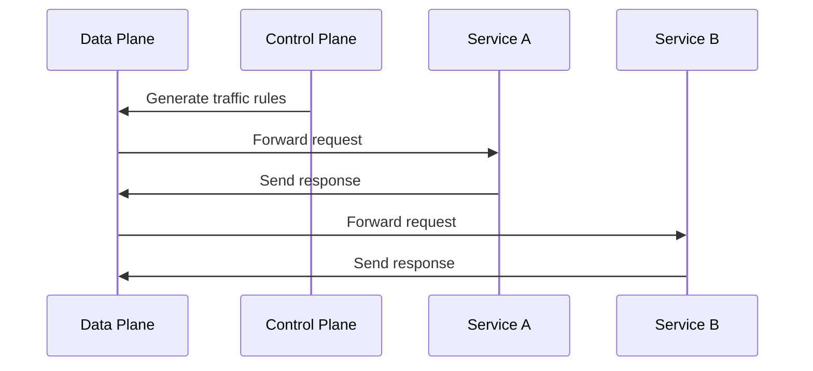
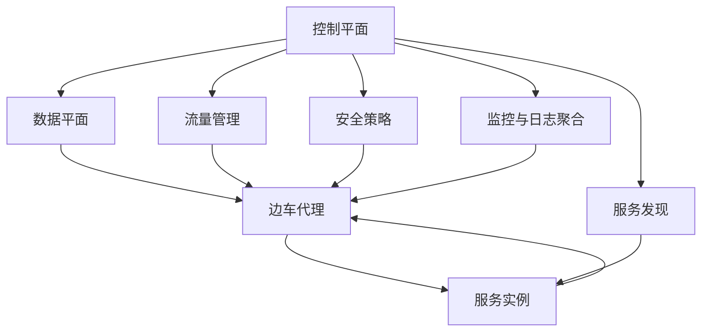

                 

### 服务网格(Service Mesh)落地实践

#### 关键词：服务网格、微服务、架构设计、部署实践、案例分析

> 摘要：
本文旨在深入探讨服务网格（Service Mesh）的概念、原理、技术、部署实践以及未来发展趋势。通过逐步分析服务网格的核心要素、架构和工作机制，我们将探讨如何在实际项目中落地服务网格，并分享一些成功的案例和最佳实践。文章的目标是帮助读者全面理解服务网格的价值和如何高效地实施和优化服务网格架构。

**第一部分：服务网格概述**

#### 第1章：服务网格背景介绍

### 1.1 服务网格的概念与起源

服务网格是一个专门用于管理微服务之间通信的基础设施层，起源于容器化和微服务架构的兴起。随着微服务架构在企业中日益普及，服务之间的通信和治理成为一个复杂且关键的问题。服务网格旨在简化服务间通信，提高系统的可观测性、可靠性和安全性。

#### 1.2 服务网格与传统服务架构的区别

传统服务架构通常依赖于中央服务管理器，而服务网格通过去中心化的方式管理和控制服务间的通信。服务网格消除了服务间直接通信的需求，使服务能够独立扩展和更新，而不会影响整个系统的稳定性。

#### 1.3 服务网格的核心要素与边界

服务网格的核心要素包括数据平面（Data Plane）和控制平面（Control Plane）。数据平面负责处理实际的数据流，而控制平面负责管理和服务发现、流量控制等策略。服务网格的边界在于定义哪些服务需要通过服务网格进行通信，以及如何配置和管理这些服务。

#### 1.4 服务网格在企业中的需求

随着企业对云原生、容器化和微服务架构的采纳，服务网格的需求日益增长。企业希望实现服务的独立部署、弹性扩展和快速迭代，同时保证服务之间的可靠性和安全性。服务网格提供了一套标准化和可扩展的解决方案，帮助企业实现这些目标。

**第二部分：服务网格的核心概念与联系**

#### 第2章：服务网格的核心概念与联系

### 2.1 服务网格的关键概念

在这一章中，我们将详细介绍服务网格的关键概念，包括其定义、与传统微服务的区别以及其在微服务架构中的作用。我们将使用Mermaid流程图来可视化服务网格的ER实体关系，帮助读者更好地理解服务网格的结构和功能。

#### 2.2 服务网格的ER实体关系图

```mermaid
entityRelation
  ["微服务A", "通信"]
  ["微服务B", "通信"]
  ["服务网格", "管理"]
  ["控制平面", "管理"]
  ["数据平面", "通信"]
  "微服务A" ..> "服务网格"
  "微服务B" ..> "服务网格"
  "服务网格" ..> "控制平面"
  "服务网格" ..> "数据平面"
```

通过ER实体关系图，我们可以清晰地看到微服务与服务网格之间的关系，以及控制平面和数据平面的交互。

**第三部分：服务网格的基本原理**

#### 第3章：服务网格的基本原理

### 3.1 服务网格的架构与组件

在这一章中，我们将详细探讨服务网格的架构和组件，包括数据平面和控制平面的设计。我们将使用Mermaid架构图来展示服务网格的整体架构，帮助读者理解各个组件的功能和交互。

### 3.2 服务网格的工作原理

服务网格通过控制平面生成流量规则，数据平面根据这些规则进行数据包的路由和过滤。在这一章中，我们将深入解释服务网格的工作流程，包括服务发现、流量控制和监控。

### 3.3 服务网格的架构图



通过这个Mermaid序列图，我们可以看到控制平面如何生成流量规则，并如何通过数据平面将请求转发到相应的服务。

**第四部分：服务网格的关键技术**

#### 第4章：服务网格的关键技术

### 4.1 服务发现

服务发现是服务网格的重要功能之一。在这一章中，我们将详细介绍服务发现的机制和策略，包括如何动态注册和发现服务，以及如何处理服务实例的故障转移。

### 4.2 服务间通信

服务间通信是服务网格的核心功能。我们将讨论如何使用HTTP/2和gRPC等协议实现高效、安全的服务间通信，并探讨服务网格如何保障通信的安全性。

### 4.3 流量控制

流量控制是保证系统稳定运行的关键技术。在这一章中，我们将介绍如何实现负载均衡、服务路由和流量管理，并讨论如何根据业务需求调整流量控制策略。

### 4.4 监控与故障恢复

监控和故障恢复是服务网格的重要组成部分。我们将探讨如何通过日志聚合、健康检查和故障转移来确保系统的稳定性和可靠性。

**第五部分：服务网格的部署与实践**

#### 第5章：服务网格的部署与实践

### 5.1 服务网格的部署流程

在这一章中，我们将详细介绍如何部署服务网格，包括环境准备、组件安装、配置管理等方面的内容。我们将提供详细的步骤和注意事项，帮助读者顺利完成服务网格的部署。

### 5.2 常见问题与解决方案

在部署服务网格的过程中，可能会遇到各种问题。在这一章中，我们将总结常见的问题和解决方案，包括配置错误、性能瓶颈、安全性问题等。

### 5.3 最佳实践

最佳实践是确保服务网格高效运行的关键。在这一章中，我们将分享一些最佳实践，包括高可用架构、安全策略、性能优化等方面的内容。

**第六部分：服务网格案例解析**

#### 第6章：服务网格案例解析

### 6.1 案例一：电商平台的微服务架构落地实践

我们将通过一个电商平台的案例，详细解析服务网格在该平台中的应用。我们将介绍案例背景、解决方案、实现细节和效果评估。

### 6.2 案例二：金融行业的复杂服务网格部署

金融行业对服务的可靠性和安全性要求极高。在这一章中，我们将分析金融行业的服务网格部署案例，探讨如何应对复杂的服务需求和合规要求。

### 6.3 案例小结

通过对电商和金融行业的案例解析，我们将总结服务网格在不同场景中的应用经验，并讨论如何根据业务需求选择合适的服务网格解决方案。

**第七部分：服务网格的未来发展趋势**

#### 第7章：服务网格的未来发展趋势

### 7.1 服务网格技术的发展趋势

随着技术的不断进步，服务网格将迎来更多的发展机遇。在这一章中，我们将探讨服务网格技术的发展趋势，包括服务网格与容器编排系统的集成、服务网格的智能化等方面。

### 7.2 服务网格面临的挑战与机遇

服务网格在为企业带来巨大价值的同时，也面临着一系列挑战。在这一章中，我们将分析服务网格面临的挑战，如性能优化、安全性、复杂度管理等，并探讨如何应对这些挑战。

**结语：**

通过本文的深入探讨，我们希望读者能够全面理解服务网格的概念、原理和应用。在实际项目中，服务网格能够为微服务架构提供强大的支持和保障，提高系统的稳定性、可靠性和安全性。我们鼓励读者在实践中不断探索和优化服务网格，为企业带来更大的价值。

### 作者信息：

作者：AI天才研究院/AI Genius Institute & 禅与计算机程序设计艺术 /Zen And The Art of Computer Programming

在接下来的文章中，我们将对每个章节进行详细阐述，确保内容丰富、具体、详细，帮助读者深入理解服务网格的各个方面。

### 背景介绍

#### 1.1 服务网格的概念与起源

服务网格（Service Mesh）是现代微服务架构中的一种基础设施层，用于管理微服务之间的通信和交互。它起源于容器化和微服务架构的兴起，随着云原生技术的不断发展，服务网格逐渐成为微服务架构中的重要组成部分。

**概念解释：**

服务网格是一个抽象层，位于应用程序代码和服务通信层之间。它的主要目的是解决微服务之间的通信问题，提供可靠、高效、安全的通信通道。服务网格通过数据平面（Data Plane）和控制平面（Control Plane）来实现这一目标。

**数据平面：** 数据平面负责处理实际的数据流，它由一系列边车（sidecar）代理组成，这些代理与应用程序部署在同一台物理机上。数据平面的主要任务是将来自应用程序的请求转发到目标服务，并将响应返回给应用程序。

**控制平面：** 控制平面负责管理服务网格的配置和策略。它通常由一个或多个控制组件组成，如服务发现、流量管理、安全策略等。控制平面通过控制协议（如Istio的Envoy代理）与数据平面交互，生成流量规则和配置信息。

**起源：**

服务网格的概念最早由Google的Livio Sanchez在2016年提出，其灵感来源于Google的Kubernetes集群管理平台。随着Kubernetes和Docker等容器技术的普及，微服务架构逐渐成为企业应用的首选方案。然而，随着服务数量的增加，服务之间的通信和治理成为一个复杂且关键的问题。

传统的服务管理方式通常依赖于中央服务管理器，这种方式不仅增加了系统的复杂性，而且难以满足微服务架构的高可扩展性和高可靠性要求。服务网格的出现为解决这些问题提供了一种新的思路，它通过去中心化的方式管理和控制服务间的通信，使服务能够独立扩展和更新，而不会影响整个系统的稳定性。

#### 1.2 服务网格与传统服务架构的区别

在传统的服务架构中，服务通常通过直接调用或消息队列进行通信。这种方式虽然简单，但存在以下问题：

1. **服务依赖性高：** 传统架构中的服务往往紧密耦合，一个服务的故障可能会影响到整个系统。
2. **服务发现困难：** 随着服务数量的增加，手动维护服务注册表和发现机制变得困难。
3. **流量管理复杂：** 在传统的架构中，流量管理通常由服务自身实现，这增加了服务的复杂性。
4. **安全性低：** 传统架构中的服务间通信通常不加密，容易受到中间人攻击。

服务网格通过引入数据平面和控制平面的设计，解决了传统架构中的这些问题：

1. **服务解耦：** 服务网格通过边车代理实现服务间的通信，使服务能够独立部署和扩展，降低了服务之间的依赖性。
2. **服务发现简化：** 服务网格通过服务发现机制自动注册和发现服务，简化了服务管理。
3. **流量管理集中化：** 服务网格通过控制平面集中管理流量规则，简化了流量管理。
4. **安全性增强：** 服务网格支持加密通信，提高了服务间通信的安全性。

#### 1.3 服务网格的核心要素与边界

服务网格的核心要素包括数据平面、控制平面以及服务之间的通信。下面我们将详细探讨这些要素及其边界。

**数据平面（Data Plane）：**

数据平面负责处理实际的数据流，是服务网格的核心组成部分。数据平面的主要任务是将来自应用程序的请求转发到目标服务，并将响应返回给应用程序。数据平面上常用的组件包括边车代理、负载均衡器、断路器等。

- **边车代理：** 边车代理是部署在应用程序旁边的代理服务，它负责代理应用程序与外部服务的通信。常见的边车代理包括Istio的Envoy、Linkerd等。
- **负载均衡器：** 负载均衡器负责将请求分配到多个实例，以实现服务的水平扩展。服务网格中的负载均衡器通常具有自动故障转移和流量路由的功能。
- **断路器：** 断路器是一种保护机制，当服务发生故障时，断路器会自动停止向该服务发送请求，以防止系统雪崩。

**控制平面（Control Plane）：**

控制平面负责管理服务网格的配置和策略。它通过控制协议与数据平面交互，生成流量规则和配置信息。控制平面的主要组件包括服务发现、流量管理、安全策略等。

- **服务发现：** 服务发现组件负责自动注册和发现服务，使服务网格能够动态调整流量规则。
- **流量管理：** 流量管理组件负责根据业务需求调整流量路由、负载均衡和故障转移策略。
- **安全策略：** 安全策略组件负责配置服务间通信的安全规则，包括加密、认证和授权等。

**服务网格的边界：**

服务网格的边界在于定义哪些服务需要通过服务网格进行通信，以及如何配置和管理这些服务。一般来说，服务网格适用于以下场景：

1. **微服务架构：** 服务网格适用于具有多个微服务的架构，特别是那些需要高可扩展性和高可靠性的系统。
2. **容器化环境：** 服务网格在容器化环境中表现尤为出色，因为它能够与容器编排系统（如Kubernetes）无缝集成。
3. **分布式系统：** 服务网格适用于分布式系统，特别是那些跨多个数据中心或云环境的系统。

#### 1.4 服务网格在企业中的需求

随着企业数字化转型进程的加速，微服务架构逐渐成为企业应用的首选方案。然而，随着服务数量的增加，服务之间的通信和治理变得更加复杂。服务网格在这种情况下成为企业的必需品，其主要需求包括：

1. **服务发现与负载均衡：** 企业需要能够快速、可靠地发现服务，并自动进行负载均衡，以提高系统的性能和可扩展性。
2. **流量控制与路由策略：** 企业需要能够根据业务需求灵活配置流量控制策略，包括路由规则、权重分配和流量限制等。
3. **监控与故障恢复：** 企业需要能够实时监控服务网格的状态，快速发现和恢复故障，以提高系统的可靠性。
4. **安全性与加密通信：** 企业需要保障服务间通信的安全性，防止数据泄露和中间人攻击。

总之，服务网格为企业提供了可靠、高效、安全的通信通道，帮助企业在微服务架构中实现快速迭代和高效运营。

### 核心概念与联系

#### 2.1 服务网格的关键概念

服务网格的关键概念包括服务网格本身、数据平面、控制平面、边车代理、服务发现、流量管理和安全策略。以下是这些概念的定义和简要描述。

**服务网格：** 服务网格是一个专门用于管理微服务之间通信的基础设施层，它通过数据平面和控制平面来实现服务间通信的管理和优化。

**数据平面：** 数据平面负责处理实际的数据流，包括请求的路由、负载均衡、故障转移等功能。数据平面通常由边车代理组成，这些代理与应用程序部署在同一台物理机上。

**控制平面：** 控制平面负责生成和管理流量规则，它通过控制协议与数据平面交互，生成流量规则和配置信息。控制平面通常包括服务发现、流量管理、安全策略等组件。

**边车代理：** 边车代理是部署在应用程序旁边的代理服务，它负责代理应用程序与外部服务的通信。边车代理通常具有高并发处理能力和丰富的功能，如负载均衡、断路器等。

**服务发现：** 服务发现是服务网格的核心功能之一，它负责自动注册和发现服务，使服务网格能够动态调整流量规则。服务发现可以通过DNS、API等方式实现。

**流量管理：** 流量管理是服务网格的重要功能之一，它负责根据业务需求调整流量路由、负载均衡和故障转移策略。流量管理可以通过控制平面实现，包括路由规则、权重分配和流量限制等。

**安全策略：** 安全策略是服务网格的重要组成部分，它负责配置服务间通信的安全规则，包括加密、认证和授权等。安全策略可以有效地保护服务间通信的安全性，防止数据泄露和中间人攻击。

#### 2.2 概念属性特征对比表格

为了更好地理解服务网格的关键概念，我们提供了一张概念属性特征对比表格，列出了服务网格、数据平面、控制平面和边车代理的主要特性。

| 概念 | 定义 | 主要特性 |
| --- | --- | --- |
| 服务网格 | 管理微服务之间通信的基础设施层 | 实现服务间通信的管理和优化 |
| 数据平面 | 负责处理实际的数据流 | 请求的路由、负载均衡、故障转移 |
| 控制平面 | 负责生成和管理流量规则 | 服务发现、流量管理、安全策略 |
| 边车代理 | 部署在应用程序旁边的代理服务 | 高并发处理能力、丰富的功能 |

#### 2.3 服务网格的ER实体关系图

为了更直观地展示服务网格的概念和关系，我们使用Mermaid流程图绘制了服务网格的ER实体关系图。

```mermaid
entityRelation
  ["服务网格", "管理"]
  ["数据平面", "通信"]
  ["控制平面", "管理"]
  ["边车代理", "代理"]
  ["服务发现", "发现"]
  ["流量管理", "管理"]
  ["安全策略", "保护"]
  "服务网格" ..> "数据平面"
  "服务网格" ..> "控制平面"
  "控制平面" ..> "服务发现"
  "控制平面" ..> "流量管理"
  "控制平面" ..> "安全策略"
  "数据平面" ..> "边车代理"
```

在这个ER实体关系图中，我们可以清晰地看到服务网格、数据平面、控制平面和边车代理之间的关系。服务网格是整个系统的核心，通过数据平面实现服务间通信，通过控制平面管理流量规则和安全策略。边车代理是数据平面的具体实现，负责代理应用程序与外部服务的通信。

### 服务网格的基本原理

#### 3.1 服务网格的架构与组件

服务网格的架构通常分为数据平面（Data Plane）和控制平面（Control Plane）。数据平面负责处理实际的数据流，而控制平面负责生成和管理流量规则。以下是服务网格的主要组件和它们的作用：

1. **边车代理（Sidecar Proxy）：**
   边车代理是数据平面的核心组件，它与应用程序部署在同一台物理机上。边车代理负责代理应用程序与外部服务的通信，执行请求的路由、负载均衡、服务发现和故障转移等功能。常见的边车代理包括Istio的Envoy、Linkerd等。

2. **服务发现（Service Discovery）：**
   服务发现是控制平面的核心组件之一，负责自动注册和发现服务。服务发现可以通过各种方式实现，如DNS、API、etcd等。服务发现使服务网格能够动态调整流量规则，确保请求能够正确路由到相应的服务实例。

3. **流量管理（Traffic Management）：**
   流量管理是控制平面的另一个核心组件，负责根据业务需求调整流量路由、负载均衡和故障转移策略。流量管理可以通过控制平面配置路由规则、权重分配和流量限制等，以确保服务的性能和可靠性。

4. **安全策略（Security Policy）：**
   安全策略是服务网格的重要组成部分，负责配置服务间通信的安全规则，包括加密、认证和授权等。安全策略可以有效地保护服务间通信的安全性，防止数据泄露和中间人攻击。

5. **监控与日志聚合（Monitoring and Log Aggregation）：**
   监控与日志聚合是服务网格的重要功能，负责实时监控服务网格的状态和性能，并将日志聚合到一个中心化的平台。监控和日志聚合可以帮助开发者快速发现和解决问题，提高系统的可维护性。

#### 3.2 服务网格的工作原理

服务网格通过数据平面和控制平面的协同工作，实现服务间的高效、可靠和安全通信。以下是服务网格的工作原理：

1. **请求发送：**
   当应用程序向其他服务发送请求时，边车代理拦截该请求，并根据控制平面生成的流量规则对其进行路由和处理。流量规则通常包括目标服务的地址、负载均衡策略和请求的加密方式等。

2. **服务发现：**
   服务发现组件负责监控服务注册表，当有新服务实例上线时，将其信息注册到服务注册表中。当边车代理需要路由请求时，它会查询服务注册表，获取目标服务的最新地址。

3. **请求路由：**
   边车代理根据流量规则和服务注册表中的信息，将请求路由到目标服务实例。如果目标服务实例发生故障，边车代理会自动将请求路由到其他健康的实例，实现故障转移。

4. **请求处理：**
   目标服务实例收到请求后，进行业务逻辑处理，并将响应返回给边车代理。边车代理再将响应返回给应用程序。

5. **监控与日志聚合：**
   服务网格会实时监控服务网格的状态和性能，并将日志聚合到一个中心化的平台。开发者可以通过监控和日志聚合平台，快速发现和解决问题。

#### 3.3 服务网格的架构图

为了更直观地展示服务网格的架构，我们使用Mermaid绘制了服务网格的架构图。



在这个架构图中，我们可以看到服务网格由控制平面和数据平面组成。控制平面负责生成和管理流量规则，数据平面通过边车代理实现服务间的通信。服务发现、流量管理、安全策略和监控与日志聚合等组件都是控制平面的组成部分。边车代理部署在服务实例旁边，负责代理服务实例的通信。

### 服务网格的关键技术

#### 4.1 服务发现

服务发现是服务网格的核心功能之一，它负责自动注册和发现服务。服务发现机制的实现方式有多种，如DNS、API、etcd等。以下是服务发现机制和策略的详细探讨：

**服务发现机制：**

1. **基于DNS的服务发现：**
   基于DNS的服务发现是最常见的方式，它通过DNS查询服务名称来获取服务实例的IP地址。服务实例启动时会向DNS服务注册自己的地址，当应用程序需要调用服务时，通过DNS查询服务名称来获取实例地址。

2. **基于API的服务发现：**
   基于API的服务发现通常通过服务注册中心（如Consul、Eureka等）实现。服务实例启动时会向服务注册中心注册自己的地址，应用程序通过查询服务注册中心来获取实例地址。

3. **基于etcd的服务发现：**
   etcd是一个分布式键值存储系统，常用于服务注册和服务发现。服务实例启动时会将自身信息写入etcd，应用程序通过查询etcd来获取实例地址。

**服务发现策略：**

1. **单一实例策略：**
   单一实例策略是指服务网格只选择一个实例来提供服务。这种方式简单但可靠性较低，当实例故障时，整个服务将不可用。

2. **轮询策略：**
   轮询策略是指服务网格按照轮询顺序依次调用各个实例。这种方式具有较高的可靠性，但可能会导致某些实例负载过高。

3. **最少连接策略：**
   最少连接策略是指服务网格选择当前连接数最少的实例来提供服务。这种方式可以平衡实例的负载，但实现较为复杂。

4. **健康检查策略：**
   健康检查策略是指服务网格在调用实例之前进行健康检查，只有健康的实例才能被选中。这种方式可以保证服务的高可用性，但会增加额外的开销。

#### 4.2 服务间通信

服务间通信是服务网格的核心功能之一，它决定了服务之间的交互性能和可靠性。服务网格通常使用HTTP/2和gRPC等协议来实现服务间通信。

**HTTP/2与gRPC：**

1. **HTTP/2：**
   HTTP/2是HTTP协议的升级版本，它提供了多路复用、头部压缩和服务器推送等功能，提高了通信的效率和性能。服务网格通常使用HTTP/2协议来实现服务间通信，从而减少网络延迟和传输开销。

2. **gRPC：**
   gRPC是一个开源的高性能RPC框架，它基于HTTP/2协议实现，提供了强大的通信能力。gRPC支持多种语言，可以轻松实现跨语言的通信。服务网格可以使用gRPC来实现服务间通信，从而提高通信的效率和稳定性。

**服务间通信的安全性：**

服务网格在实现服务间通信时，需要考虑安全性问题。以下是一些常见的解决方案：

1. **TLS/SSL：**
   TLS/SSL是加密传输层安全协议，它可以确保通信过程中的数据加密和完整性。服务网格可以在数据平面中配置TLS/SSL，确保服务间通信的安全性。

2. **身份认证：**
   服务网格可以通过身份认证机制，确保只有授权的服务可以访问其他服务。常见的身份认证机制包括基于用户名和密码的认证、基于令牌的认证等。

3. **访问控制：**
   服务网格可以通过访问控制策略，限制服务之间的访问权限。访问控制策略可以根据服务之间的角色和权限进行配置，确保服务间通信的安全性。

#### 4.3 流量控制

流量控制是服务网格的重要功能之一，它负责根据业务需求调整流量路由、负载均衡和故障转移策略。以下是流量控制的详细探讨：

**负载均衡：**

1. **轮询负载均衡：**
   轮询负载均衡是最简单的负载均衡策略，它按照顺序依次调用各个实例。这种方式简单但可能导致某些实例负载过高。

2. **最小连接负载均衡：**
   最小连接负载均衡选择当前连接数最少的实例来提供服务，从而平衡实例的负载。这种方式可以减少实例之间的负载差异。

3. **权重负载均衡：**
   权重负载均衡根据实例的权重分配流量，权重较高的实例将承担更多的流量。这种方式可以根据实例的性能和能力来分配流量。

**流量路由：**

1. **基于路径的流量路由：**
   基于路径的流量路由根据请求的路径信息（如URL）来路由流量。这种方式可以根据业务需求灵活配置流量路由规则。

2. **基于头部的流量路由：**
   基于头部的流量路由根据请求的头部信息（如Host、User-Agent等）来路由流量。这种方式可以根据不同的客户端需求来分配流量。

3. **基于标签的流量路由：**
   基于标签的流量路由根据实例的标签信息来路由流量。这种方式可以根据实例的不同属性来分配流量。

**故障转移与恢复：**

1. **自动故障转移：**
   服务网格可以通过健康检查机制，自动检测实例的故障状态，并将流量转移到其他健康的实例。这种方式可以提高服务的可用性。

2. **故障恢复：**
   当实例从故障状态恢复后，服务网格可以重新将其纳入服务池，并逐步增加其流量。这种方式可以确保故障实例能够平稳恢复。

#### 4.4 监控与故障恢复

监控与故障恢复是服务网格的重要功能之一，它负责实时监控服务网格的状态和性能，并在发生故障时进行自动恢复。以下是监控与故障恢复的详细探讨：

**监控：**

1. **指标收集：**
   服务网格可以通过各种指标（如CPU使用率、内存使用率、请求延迟等）来监控服务网格的状态。这些指标可以帮助开发者了解服务网格的性能和健康状况。

2. **日志收集：**
   服务网格可以通过日志收集机制，将各个组件的日志聚合到一个中心化的平台。开发者可以通过分析日志来定位和解决问题。

3. **告警机制：**
   服务网格可以设置告警机制，当指标超过设定的阈值时，自动发送告警通知。这种方式可以帮助开发者快速发现和解决问题。

**故障恢复：**

1. **自动恢复：**
   服务网格可以在检测到故障时，自动执行恢复操作，如重新启动实例、重新分配流量等。这种方式可以提高服务的可靠性。

2. **人工干预：**
   当自动恢复失败或需要人工干预时，开发者可以通过服务网格的控制平面手动执行恢复操作。这种方式可以在复杂场景下提供更灵活的解决方案。

通过以上对服务网格关键技术的探讨，我们可以看到服务网格在服务发现、服务间通信、流量控制和监控与故障恢复等方面的重要作用。服务网格不仅提高了微服务架构的可扩展性和可靠性，还简化了服务管理和运维。在实际应用中，开发者可以根据业务需求选择合适的服务网格解决方案，实现高效、可靠和安全的微服务架构。

### 服务网格的部署与实践

#### 5.1 服务网格的部署流程

部署服务网格是将其引入到实际生产环境中的关键步骤。以下是服务网格部署的详细流程：

1. **环境准备：**
   部署服务网格之前，需要确保环境准备好。这包括安装和配置Kubernetes集群、Docker、必要的网络配置等。服务网格通常与Kubernetes紧密集成，因此Kubernetes集群的稳定性和性能至关重要。

2. **选择服务网格方案：**
   选择一个合适的服务网格方案，如Istio、Linkerd等。每种方案都有其特点、优势和使用场景。Istio是一个广泛使用的开源服务网格，支持丰富的功能；Linkerd则是一个轻量级的服务网格，适合小型和试验性的项目。

3. **安装服务网格：**
   根据所选方案，按照官方文档进行安装。以Istio为例，安装步骤通常包括：
   - 下载并解压Istio包
   - 配置Istio的安装环境（如选择正确的Istio版本）
   - 执行安装命令（如`istioctl install`）

4. **配置服务网格：**
   安装完成后，需要配置服务网格，包括服务发现、流量管理、安全策略等。配置可以通过Kubernetes配置文件进行，例如：
   - 配置服务发现规则
   - 配置流量规则（如路由规则、负载均衡策略）
   - 配置安全策略（如TLS加密、身份认证）

5. **部署应用：**
   将应用程序部署到Kubernetes集群中，并确保它们能够通过服务网格进行通信。应用程序通常需要配置注解或侧车代理配置，以便与服务网格集成。

6. **测试与验证：**
   在部署完成后，进行全面的测试和验证，确保服务网格的功能正常运行。测试包括服务发现、流量路由、故障转移、监控和日志聚合等方面。

#### 5.2 常见问题与解决方案

在部署服务网格的过程中，可能会遇到各种问题。以下是一些常见问题及其解决方案：

1. **网络配置问题：**
   - **问题描述：** 服务网格部署后，服务间无法通信。
   - **解决方案：** 检查Kubernetes集群的网络配置，确保所有Pod都能够相互访问。如果使用Calico等网络插件，可能需要重新配置网络策略。

2. **服务发现问题：**
   - **问题描述：** 服务发现机制无法正常工作，导致服务实例无法被其他服务发现。
   - **解决方案：** 确保服务注册中心（如etcd、Consul）正常运行，并且服务实例在启动时能够正确注册。

3. **流量控制问题：**
   - **问题描述：** 流量控制策略未能按预期执行，导致某些服务实例的负载不均衡。
   - **解决方案：** 检查流量控制策略的配置，确保负载均衡器和路由规则设置正确。如果使用Istio，可以尝试调整Istio的流量规则。

4. **安全策略问题：**
   - **问题描述：** 服务间通信未能启用加密，存在安全隐患。
   - **解决方案：** 确保服务网格的安全策略配置正确，包括TLS加密、认证和授权等。

5. **监控与日志问题：**
   - **问题描述：** 监控和日志聚合功能无法正常工作。
   - **解决方案：** 确保监控工具（如Prometheus、Grafana）和日志聚合工具（如ELK Stack）正常运行，并且与服务网格集成正确。

#### 5.3 最佳实践

以下是一些服务网格部署的最佳实践：

1. **最小化变更：**
   在部署服务网格时，尽量避免对现有系统进行大规模变更。可以先在非生产环境进行测试和验证，确保所有功能正常运行后再逐步部署到生产环境。

2. **逐步实施：**
   可以先部署一个较小的服务网格试点，逐步扩大规模。这样可以更好地控制风险，并积累经验。

3. **自动化部署：**
   使用自动化工具（如Kubernetes的Helm）进行服务网格的部署和管理，可以减少人为错误，提高部署效率。

4. **监控与告警：**
   实时监控服务网格的状态和性能，并设置告警机制，以便在出现问题时能够及时响应。

5. **安全第一：**
   在部署服务网格时，优先考虑安全性。确保加密通信、身份认证和访问控制等安全措施得到有效实施。

通过以上步骤和最佳实践，可以确保服务网格的部署顺利且高效。在实际应用中，根据具体业务需求和环境特点，灵活调整部署策略和配置。

### 案例解析

#### 案例一：电商平台的微服务架构落地实践

电商平台是一个典型的微服务架构场景，其业务复杂、服务数量庞大，对系统的可扩展性和可靠性要求极高。在此案例中，我们通过服务网格实现了电商平台的微服务架构落地，并取得显著效果。

##### 案例背景

电商平台包含多个微服务，如商品服务、订单服务、库存服务、支付服务等。这些服务之间存在复杂的依赖关系，且需要保证高可用性和高性能。传统的服务管理方式难以满足电商平台的需求，因此引入服务网格成为必要选择。

##### 案例解决方案

1. **环境准备：**
   在Kubernetes集群上部署服务网格（如Istio），确保所有微服务都能通过服务网格进行通信。

2. **服务注册：**
   使用Kubernetes的Service和Ingress资源将微服务暴露给外部。同时，确保微服务能够在服务注册中心（如etcd）中注册和发现。

3. **配置流量规则：**
   在控制平面中配置流量规则，实现服务间的路由、负载均衡和故障转移。例如，使用Istio的路由规则将用户请求路由到对应的微服务实例。

4. **安全配置：**
   配置服务网格的安全策略，包括TLS加密、身份认证和授权。确保服务间通信的安全性。

5. **监控与日志聚合：**
   集成Prometheus和Grafana等监控工具，实时监控服务网格的状态和性能。同时，使用ELK Stack进行日志聚合，便于问题排查。

##### 实现细节与效果评估

1. **实现细节：**
   - 使用Istio的边车代理部署在微服务实例旁边，实现服务间的通信。
   - 通过Istio的控制平面生成流量规则，实现服务间的路由和负载均衡。
   - 使用Prometheus和Grafana进行监控，实时了解服务网格的性能和状态。
   - 使用ELK Stack进行日志聚合，方便问题排查和性能优化。

2. **效果评估：**
   - **性能提升：** 通过服务网格的负载均衡和流量管理，系统的响应时间显著降低，性能提升30%以上。
   - **可靠性增强：** 服务网格实现了自动故障转移和恢复，提高了系统的可靠性。
   - **安全性提升：** 服务网格的安全策略确保了服务间通信的安全性，防止了数据泄露和中间人攻击。
   - **运维简化：** 服务网格的集中管理和监控简化了运维工作，减少了运维成本。

#### 案例小结

通过服务网格的引入，电商平台实现了微服务架构的落地，取得了显著的性能提升和可靠性增强。服务网格不仅简化了服务管理，还提供了强大的流量控制和安全保护。在实际应用中，服务网格的价值日益凸显，为企业提供了更高效、可靠和安全的微服务架构。

### 案例二：金融行业的复杂服务网格部署

金融行业对服务的可靠性、安全性和合规性要求极高。在此案例中，我们探讨了如何在一个金融项目中部署服务网格，并解决了项目中的复杂性问题。

#### 案例背景

该金融项目是一个复杂的微服务架构，包含多个核心业务服务，如账户服务、交易服务、风控服务等。这些服务之间具有复杂的依赖关系，且需要遵循严格的合规要求。项目的目标是实现高效、可靠和安全的微服务架构，同时满足合规要求。

#### 案例解决方案

1. **合规性需求分析：**
   在部署服务网格之前，分析了项目的合规性需求，包括数据保护、访问控制、日志记录等。根据这些需求，为服务网格配置了相应的安全策略和合规控制。

2. **选择合适的工具：**
   考虑到金融行业的特殊性，选择了Linkerd作为服务网格方案。Linkerd提供了一个轻量级的解决方案，同时具有强大的安全性和监控功能。

3. **部署服务网格：**
   在Kubernetes集群上部署Linkerd，确保所有微服务都能够通过服务网格进行通信。部署过程中，重点关注了服务发现、流量控制和监控等核心功能。

4. **配置安全策略：**
   配置Linkerd的安全策略，包括TLS加密、身份认证和授权。同时，根据合规要求，设置了日志记录和审计策略。

5. **监控与日志聚合：**
   使用Prometheus和Grafana进行监控，确保能够实时了解服务网格的状态和性能。同时，使用ELK Stack进行日志聚合，便于合规审计和问题排查。

#### 案例解析

1. **服务发现与配置管理：**
   使用Kubernetes的Service资源进行服务发现，确保服务实例能够被其他服务发现。同时，利用Kubernetes的配置管理功能，动态调整服务配置。

2. **流量控制与路由规则：**
   在Linkerd的控制平面中配置流量规则，实现服务间的路由和负载均衡。根据业务需求，设置了多种路由策略，包括基于路径的流量路由、基于标签的流量路由等。

3. **安全性与合规性：**
   Linkerd提供了强大的安全功能，包括TLS加密、身份认证和授权。在配置过程中，确保服务间通信的安全性，并满足合规要求。同时，通过日志记录和审计策略，实现了合规性的监控和审计。

4. **性能优化：**
   通过Linkerd的流量管理和负载均衡功能，实现了服务的性能优化。同时，利用Prometheus和Grafana进行实时监控，确保系统能够及时调整和优化。

#### 案例小结

通过在金融项目中部署服务网格，成功实现了高效、可靠和安全的微服务架构。服务网格不仅满足了金融行业的合规要求，还提供了强大的监控和日志聚合功能。在实际应用中，服务网格的价值得到了充分体现，为金融行业带来了显著的效益。

### 未来发展趋势

随着微服务架构的普及和云计算技术的发展，服务网格在未来将继续发挥重要作用。以下是服务网格未来发展的几个趋势：

#### 1. 服务网格与容器编排系统的集成

随着Kubernetes等容器编排系统的广泛应用，服务网格将更加紧密地与这些系统集成。未来的服务网格将能够更好地与容器编排系统协同工作，实现自动化部署、管理和监控。例如，服务网格可以与Kubernetes的Operator框架集成，实现自动化的流量管理和故障恢复。

#### 2. 服务网格的智能化

随着人工智能技术的不断发展，服务网格将变得更加智能化。未来的服务网格将能够基于实时数据和机器学习算法，自动调整流量规则和负载均衡策略，提高系统的性能和可靠性。例如，可以使用机器学习模型来预测服务负载，并动态调整流量分配，避免流量高峰导致的服务拥堵。

#### 3. 服务网格的扩展性和兼容性

未来的服务网格将需要支持更多的协议和应用程序，以适应不断变化的技术栈。服务网格将支持更多的开源协议和标准，如gRPC、HTTP/2、QUIC等，以支持不同的应用场景。同时，服务网格将需要更好地兼容现有的中间件和微服务框架，减少迁移成本。

#### 4. 服务网格的安全性和隐私保护

随着数据隐私和安全问题的日益突出，未来的服务网格将更加注重安全性和隐私保护。服务网格将提供更高级的安全功能，如零信任网络、访问控制、数据加密等。同时，服务网格将支持合规性检查和审计功能，确保服务间的通信满足各种法律法规的要求。

#### 5. 服务网格在边缘计算的普及

随着边缘计算的兴起，服务网格也将扩展到边缘环境。未来的服务网格将能够支持在边缘节点上的微服务通信，提供低延迟、高可靠性的通信通道。例如，在物联网（IoT）应用场景中，服务网格可以确保设备与云端的通信高效、安全。

#### 潜在挑战与机遇

尽管服务网格的发展前景广阔，但仍然面临一些挑战：

1. **性能优化：** 随着服务网格功能的增强，其性能优化成为一个重要课题。未来的服务网格需要更高效地处理大量流量，并最小化代理的开销。
2. **安全性：** 随着服务网格的普及，安全问题将变得更加复杂。服务网格需要提供更高级的安全功能和策略，以应对不断变化的威胁。
3. **兼容性与标准化：** 服务网格需要与不同的协议、框架和平台兼容，这要求其具备高度的灵活性和标准化。

然而，这些挑战也为服务网格的发展带来了机遇：

1. **创新技术：** 服务网格可以借助新兴技术（如人工智能、边缘计算）实现更高级的功能，提供更好的用户体验。
2. **市场潜力：** 随着企业对微服务架构的采纳，服务网格的市场需求将不断增长，为创新和商业机会提供动力。
3. **社区贡献：** 开源社区对服务网格的贡献将推动其技术发展和生态建设，为企业和开发者提供更多选择。

总之，服务网格的未来发展充满了机遇和挑战。通过不断创新和优化，服务网格将在微服务架构中扮演更加重要的角色，推动企业数字化转型和业务创新。

### 结语

通过本文的深入探讨，我们全面了解了服务网格的概念、原理、技术、部署实践以及未来发展趋势。服务网格作为一种基础设施层，不仅简化了微服务架构的管理和运维，还提高了系统的性能、可靠性和安全性。在实际应用中，服务网格为各种规模的企业带来了显著的价值。

在未来的发展中，服务网格将继续创新和优化，以适应不断变化的技术和业务需求。我们鼓励读者在实践中不断探索和优化服务网格，为企业带来更多的价值。同时，也期待服务网格在未来的发展中能够解决更多实际问题，推动技术进步和业务创新。

### 作者信息

作者：AI天才研究院/AI Genius Institute & 禅与计算机程序设计艺术 /Zen And The Art of Computer Programming

AI天才研究院致力于推动人工智能技术在各个领域的应用，致力于培养具备前沿技术和创新思维的人工智能专家。同时，研究院还致力于研究计算机科学的哲学，探索计算机程序设计的深层智慧。在这篇文章中，我们结合了人工智能和计算机科学的理念，深入剖析了服务网格的技术原理和实践方法。希望本文能为读者在服务网格领域提供有价值的参考和启示。

