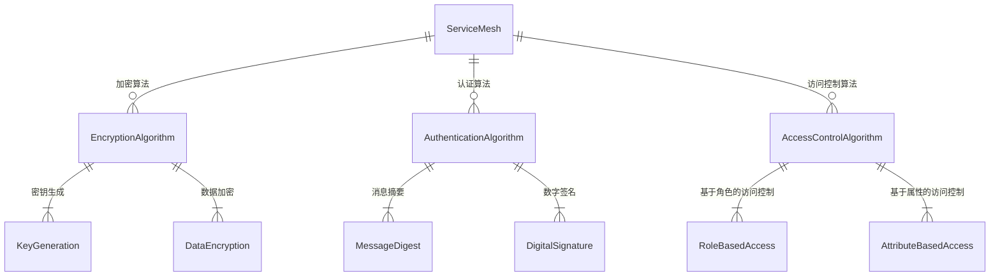
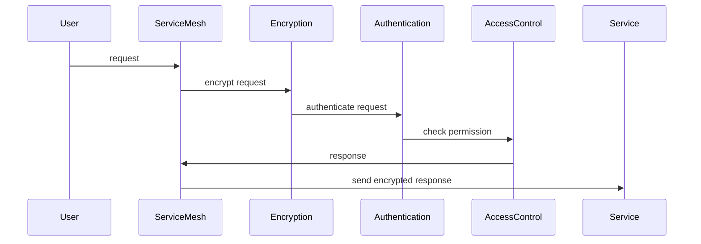
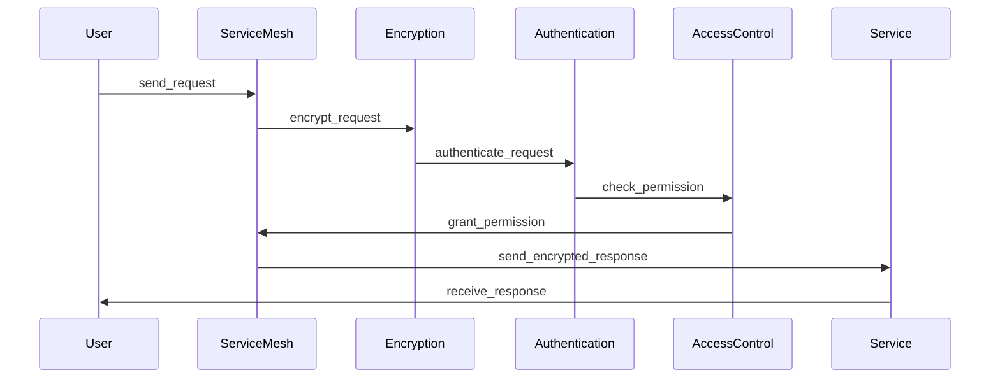

                 


### 文章标题：服务网格安全：微服务架构中的安全控制

关键词：服务网格，微服务架构，安全控制，访问控制，加密与认证

摘要：本文深入探讨了服务网格在微服务架构中的安全控制问题。通过分析服务网格的基本概念、组件和面临的挑战，本文提出了安全架构设计原则，详细讲解了服务网格访问控制、加密与认证以及威胁检测与响应机制。同时，通过最佳实践和案例分析，本文为读者提供了实施服务网格安全的实用指南。

----------------------------------------------------------------

### 第一部分：服务网格安全基础

#### 第1章：服务网格概述

##### 1.1.1 服务网格的概念

服务网格（Service Mesh）是一种软件层抽象，旨在解决微服务架构中的服务间通信问题。它通过独立的通信层（即数据平面）和管理层（即控制平面）来处理服务之间的通信，从而实现了服务之间的解耦。

##### 1.1.2 服务网格的优势

服务网格的优势在于：

- **简化服务通信**：通过统一的API来管理和监控服务之间的通信，简化了服务间的通信逻辑。
- **服务解耦**：服务网格允许服务专注于其业务逻辑，而无需关心底层的网络通信。
- **增强安全性**：服务网格提供了安全控制平面，可以集中管理服务的访问控制、加密和认证。

##### 1.1.3 微服务架构中的服务网格

在微服务架构中，服务网格作为基础设施层，负责管理各个微服务之间的通信。这使得微服务可以独立部署、扩展和升级，提高了系统的灵活性和可维护性。

#### 1.2 服务网格的关键组件

##### 1.2.1 数据平面

数据平面负责处理实际的服务间通信。它通常由一组代理（如Istio的Envoy代理）组成，这些代理在网络中充当中间人的角色，确保服务间的请求能够安全、可靠地传输。

##### 1.2.2 控制平面

控制平面负责配置和管理数据平面。它通过一个控制器来动态配置代理的行为，如路由策略、断路器、负载均衡等。

##### 1.2.3 网格服务

网格服务是服务网格中的一个抽象概念，代表了一个可以发送或接收请求的服务实例。网格服务通过服务名称和服务标签来识别，这使得服务网格可以灵活地管理服务实例的变化。

#### 1.3 服务网格的安全性挑战

##### 1.3.1 服务网格攻击模式

服务网格面临多种攻击模式，包括：

- **服务劫持**：攻击者可以拦截和篡改服务间的通信。
- **服务伪造**：攻击者可以伪造服务请求，从而欺骗服务网格。
- **代理攻击**：攻击者可以攻击服务网格的数据平面代理，导致服务通信中断。

##### 1.3.2 服务网格安全风险

服务网格的安全风险主要包括：

- **数据泄露**：服务间的通信数据可能被攻击者窃取。
- **服务瘫痪**：服务网格的故障可能导致整个系统的瘫痪。
- **安全控制失效**：如果安全控制措施不够严格，可能导致服务被非法访问。

##### 1.3.3 微服务安全与整体安全的关系

微服务安全是整体安全的重要组成部分。服务网格作为微服务架构的核心组件，其安全性直接影响到整个系统的安全。因此，确保服务网格的安全对于保护整个微服务架构至关重要。

#### 1.4 本章小结

本章介绍了服务网格的基本概念、组件和面临的安全性挑战。理解服务网格的安全性对于构建安全的微服务架构至关重要。在接下来的章节中，我们将深入探讨如何设计和实现服务网格的安全控制策略。

----------------------------------------------------------------

### 第二部分：服务网格安全策略

#### 第2章：服务网格安全架构

##### 2.1 安全架构设计原则

服务网格安全架构设计应遵循以下原则：

- **最小权限原则**：服务网格中所有的访问控制策略应基于最小权限原则，确保只有必要的权限才能访问特定资源。
- **加密传输**：所有服务间通信应使用加密传输，防止数据在传输过程中被窃取或篡改。
- **动态策略管理**：安全策略应能够动态调整，以适应服务实例的变化。
- **集中监控与审计**：服务网格应提供集中监控和审计功能，以便及时发现和响应安全事件。

##### 2.2 服务网格安全架构组件

服务网格安全架构通常包括以下组件：

- **数据平面代理**：负责处理实际的服务间通信，如加密传输、认证和访问控制。
- **控制平面控制器**：负责配置和管理数据平面代理，如动态更新安全策略。
- **安全策略引擎**：负责执行安全策略，如访问控制、加密和认证。
- **监控与审计系统**：负责监控服务网格的安全事件，并记录审计日志。

##### 2.3 安全控制平面设计

安全控制平面设计应考虑以下因素：

- **策略定义**：定义服务网格的安全策略，如访问控制策略、加密策略和认证策略。
- **策略执行**：实现安全策略的执行，如通过数据平面代理来实施访问控制和加密。
- **策略管理**：提供策略管理功能，如动态调整安全策略、回滚策略变更等。
- **策略审计**：记录安全策略的变更和执行情况，以便进行审计和合规性检查。

#### 第3章：服务网格访问控制

##### 3.1 访问控制概述

访问控制是服务网格安全的关键组成部分，它确保只有授权的服务才能访问特定的资源。访问控制策略通常基于用户身份、服务身份和服务间关系来定义。

##### 3.2 RBAC模型在服务网格中的应用

RBAC（Role-Based Access Control，基于角色的访问控制）模型是访问控制的一种常见方法。在服务网格中，RBAC模型可以通过以下方式实现：

- **角色定义**：定义角色和权限，如管理员、开发者、普通用户等。
- **用户与角色关联**：将用户与角色关联，确定用户在服务网格中的权限。
- **权限检查**：在服务间通信时，根据用户的角色和权限来检查是否允许访问。

##### 3.3 使用策略控制服务访问

使用策略控制服务访问可以通过以下步骤实现：

1. **定义访问策略**：根据业务需求和安全要求，定义访问策略，如允许特定服务访问某些资源。
2. **配置代理**：将访问策略配置到数据平面代理，使其在服务间通信时执行。
3. **测试与验证**：测试访问策略的有效性，确保只有授权的服务才能访问特定资源。

#### 第4章：服务网格加密与认证

##### 4.1 加密机制

加密是保护服务网格通信数据的重要手段。服务网格通常使用TLS/SSL加密机制来确保通信数据的安全。

##### 4.2 认证机制

认证是验证服务网格中通信双方身份的过程。服务网格可以使用以下认证机制：

- **基于用户名和密码的认证**：使用用户名和密码来验证用户身份。
- **基于令牌的认证**：使用令牌（如JWT）来验证用户身份。
- **基于证书的认证**：使用证书来验证服务身份。

##### 4.3 TLS/SSL在服务网格中的应用

在服务网格中，TLS/SSL加密机制可以应用于以下场景：

- **服务间通信**：确保服务间的通信数据在传输过程中被加密。
- **代理到服务通信**：确保代理与服务之间的通信数据被加密。
- **客户端到代理通信**：确保客户端与代理之间的通信数据被加密。

#### 第5章：服务网格威胁检测与响应

##### 5.1 威胁检测技术

威胁检测技术可以用于识别和响应服务网格中的安全威胁。常见的技术包括：

- **异常检测**：检测服务网格中的异常流量和活动。
- **入侵检测**：检测服务网格中的入侵行为。
- **基于签名的检测**：检测已知的安全威胁。

##### 5.2 威胁响应机制

威胁响应机制用于应对服务网格中的安全威胁。常见的响应机制包括：

- **隔离**：将受威胁的服务或代理从网络中隔离，防止威胁扩散。
- **修复**：修复受威胁的服务或代理中的漏洞。
- **恢复**：在威胁被清除后，恢复正常的服务运行。

##### 5.3 日志分析与监控

日志分析与监控是服务网格安全的重要组成部分。通过分析日志数据，可以识别潜在的安全威胁和异常行为。监控系统应能够实时捕获和报告安全事件，以便及时采取响应措施。

#### 第6章：服务网格安全最佳实践

##### 6.1 安全策略制定

制定安全策略是服务网格安全的关键步骤。安全策略应涵盖以下几个方面：

- **访问控制**：定义服务网格中的访问控制策略，确保只有授权的服务才能访问特定资源。
- **加密**：确保服务间通信数据在传输过程中被加密，防止数据泄露。
- **认证**：确保服务网格中的通信双方身份得到验证，防止伪造服务。

##### 6.2 安全工具与框架

选择合适的安全工具和框架可以简化服务网格的安全部署和管理。常见的安全工具和框架包括：

- **Istio**：一个开源的服务网格安全框架，提供了丰富的安全功能。
- **Linkerd**：一个轻量级的服务网格工具，专注于安全性。
- **Istio istio-authz**：一个基于RBAC的访问控制工具，可用于Istio服务网格。

##### 6.3 安全部署与维护

安全部署与维护是确保服务网格安全的关键环节。以下是一些关键步骤：

- **自动化部署**：使用自动化工具进行安全策略的部署，确保一致性和高效性。
- **定期审计**：定期审计安全策略和配置，确保符合安全要求。
- **持续监控**：持续监控服务网格的安全事件，及时响应和处理安全威胁。

#### 第7章：案例研究与展望

##### 7.1 案例研究1：某电商平台的服务网格安全实践

该案例研究将分析某电商平台如何实施服务网格安全，包括其安全策略、工具选择、部署过程和实际效果。

##### 7.2 案例研究2：某金融公司的服务网格安全控制

该案例研究将探讨某金融公司如何利用服务网格安全控制其微服务架构，以及其在安全控制方面的成功经验。

##### 7.3 服务网格安全的发展趋势与挑战

最后，本文将讨论服务网格安全的发展趋势和面临的挑战，包括新型攻击模式的应对策略、安全技术的创新和发展等。

---

**作者：AI天才研究院/AI Genius Institute & 禅与计算机程序设计艺术 /Zen And The Art of Computer Programming**

本文旨在为读者提供关于服务网格安全的全面理解和实际应用指南。随着微服务架构的广泛应用，服务网格安全将成为保障系统安全的关键环节。通过本文的介绍，读者可以更好地了解服务网格安全的核心概念、策略和实践，从而为构建安全的微服务架构提供有力支持。在未来的发展中，服务网格安全将继续面临新的挑战和机遇，本文也将为读者提供最新的研究进展和前瞻性思考。希望本文能对读者在服务网格安全领域的学习和实践中起到积极的促进作用。

----------------------------------------------------------------

### 第三部分：深度分析与算法讲解

#### 第8章：服务网格安全算法原理分析

##### 8.1 安全算法核心概念

在服务网格安全中，算法原理的应用至关重要。本章将介绍几个关键的安全算法，并分析其核心概念。

**核心概念1：加密算法**

加密算法是一种将明文转换为密文的算法。在服务网格中，常用的加密算法包括AES（高级加密标准）、RSA（RSA加密算法）等。

**核心概念2：认证算法**

认证算法用于验证通信双方的身份。常见的认证算法包括MD5（消息摘要算法5）、SHA（安全哈希算法）等。

**核心概念3：访问控制算法**

访问控制算法用于决定服务之间的访问权限。常见的访问控制算法包括基于角色的访问控制（RBAC）、基于属性的访问控制（ABAC）等。

##### 8.2 安全算法属性特征对比表格

下面是一个关于常见加密算法、认证算法和访问控制算法的属性特征对比表格：

| 算法类型 | 算法名称 | 加密速度 | 加密强度 | 兼容性 | 典型应用 |
| :------: | :------: | :------: | :------: | :----: | :------: |
| 加密算法 | AES | 高 | 高 | 好 | 微服务通信 |
| 加密算法 | RSA | 中 | 高 | 中 | 安全认证 |
| 认证算法 | MD5 | 高 | 中 | 好 | 数据完整性 |
| 认证算法 | SHA | 高 | 高 | 好 | 数字签名 |
| 访问控制算法 | RBAC | 高 | 中 | 好 | 服务访问控制 |
| 访问控制算法 | ABAC | 高 | 高 | 中 | 动态访问控制 |

##### 8.3 安全算法ER实体关系图架构

为了更好地理解安全算法在服务网格安全中的应用，下面是一个关于安全算法实体关系的Mermaid ER图：



该ER图展示了服务网格、加密算法、认证算法和访问控制算法之间的实体关系，以及它们内部的功能模块。

#### 第9章：服务网格安全算法实现与数学模型

##### 9.1 AES加密算法实现

以下是一个使用Python实现AES加密算法的示例：

```python
from Crypto.Cipher import AES
from Crypto.Util.Padding import pad
from Crypto.Random import get_random_bytes

# 生成密钥和初始化向量
key = get_random_bytes(16)
cipher = AES.new(key, AES.MODE_CBC)

# 待加密的明文
plaintext = b"Hello, World!"

# 进行数据填充，使其满足AES块大小要求
padded_plaintext = pad(plaintext, AES.block_size)

# 加密
ciphertext = cipher.encrypt(padded_plaintext)

print(f"Ciphertext: {ciphertext.hex()}")
```

AES加密算法的数学模型如下：

$$
C = E_K(P) = \text{AES}(K, P)
$$

其中，$C$为密文，$K$为密钥，$P$为明文。

##### 9.2 RSA加密算法实现

以下是一个使用Python实现RSA加密算法的示例：

```python
from Crypto.PublicKey import RSA
from Crypto.Cipher import PKCS1_OAEP

# 生成RSA密钥对
key = RSA.generate(2048)

# 公钥和私钥
public_key = key.publickey()
private_key = key

# 待加密的明文
plaintext = b"Hello, World!"

# 使用公钥进行加密
cipher_rsa = PKCS1_OAEP.new(public_key)
ciphertext = cipher_rsa.encrypt(plaintext)

print(f"Ciphertext: {ciphertext.hex()}")

# 使用私钥进行解密
cipher_rsa = PKCS1_OAEP.new(private_key)
plaintext_decrypted = cipher_rsa.decrypt(ciphertext)

print(f"Decrypted Plaintext: {plaintext_decrypted}")
```

RSA加密算法的数学模型如下：

$$
C = E_K(P) = \text{RSA}(N, E, P)
$$

其中，$C$为密文，$N$为模数，$E$为加密指数，$P$为明文。

##### 9.3 RBAC访问控制算法实现

以下是一个使用Python实现基于角色的访问控制（RBAC）算法的示例：

```python
# 定义角色和权限
roles_permissions = {
    'admin': ['read', 'write', 'delete'],
    'user': ['read']
}

# 用户和角色
users_roles = {
    'user1': 'user',
    'user2': 'admin'
}

# 接收用户请求
user = 'user1'
permission = 'delete'

# 验证用户权限
if users_roles[user] in roles_permissions and permission in roles_permissions[users_roles[user]]:
    print(f"{user} has permission to {permission}")
else:
    print(f"{user} does not have permission to {permission}")
```

RBAC访问控制算法的数学模型如下：

$$
Access\_Permission = \text{RBAC}(User, Role, Permission)
$$

其中，$Access_Permission$为访问权限，$User$为用户，$Role$为角色，$Permission$为权限。

#### 第10章：系统分析与架构设计方案

##### 10.1 问题场景介绍

在当前微服务架构中，随着服务数量的增加，服务之间的通信变得越来越复杂。为了简化服务间的通信，我们引入了服务网格。然而，随着服务网格的广泛应用，如何确保其安全性成为一个重要问题。

##### 10.2 项目介绍

本项目旨在设计并实现一个基于服务网格的安全控制系统，该系统将提供访问控制、加密和认证等功能，以确保服务网格的安全。

##### 10.3 系统功能设计（领域模型Mermaid类图）

以下是一个关于系统功能设计的Mermaid类图：

```mermaid
classDiagram
  User <<class>> User
  Service <<class>> Service
  ServiceMesh <<class>> ServiceMesh
  AccessControl <<class>> AccessControl
  Encryption <<class>> Encryption
  Authentication <<class>> Authentication

  User o-- Service : created by
  Service o-- ServiceMesh : part of
  ServiceMesh o-- AccessControl : controlled by
  ServiceMesh o-- Encryption : encrypted by
  ServiceMesh o-- Authentication : authenticated by
```

该类图展示了用户、服务、服务网格、访问控制、加密和认证之间的关系。

##### 10.4 系统架构设计（Mermaid架构图）

以下是一个关于系统架构设计的Mermaid架构图：



该架构图展示了用户请求、加密、认证和访问控制的过程。

##### 10.5 系统接口设计和系统交互（Mermaid序列图）

以下是一个关于系统接口设计和系统交互的Mermaid序列图：



该序列图详细展示了用户请求、服务网格处理、加密、认证、访问控制和响应的交互过程。

#### 第11章：项目实战

##### 11.1 环境安装

在本章中，我们将介绍如何在Ubuntu 20.04服务器上安装服务网格安全控制系统所需的软件和工具。

1. 更新系统软件包：

```bash
sudo apt update && sudo apt upgrade
```

2. 安装Docker：

```bash
sudo apt install docker.io
```

3. 启动Docker服务：

```bash
sudo systemctl start docker
```

4. 安装Kubernetes：

```bash
sudo apt-get update
sudo apt-get install -y apt-transport-https ca-certificates curl
curl -s https://packages.cloud.google.com/apt/doc/apt-key.gpg | sudo apt-key add -
cat <<EOF | sudo tee /etc/apt/sources.list.d/kubernetes.list
deb https://packages.cloud.google.com/apt kubeletWndget.io kubernetes x86_64
EOF
sudo apt-get update
sudo apt-get install -y kubelet kubeadm kubectl
```

5. 启动Kubernetes服务：

```bash
sudo systemctl start kubelet
```

##### 11.2 系统核心实现源代码

在本节中，我们将提供系统核心实现的相关源代码，包括加密、认证和访问控制模块。

**加密模块**

```python
from Crypto.Cipher import AES
from Crypto.Util.Padding import pad, unpad
from Crypto.Random import get_random_bytes

def encrypt_data(data, key):
    cipher = AES.new(key, AES.MODE_CBC)
    ct_bytes = cipher.encrypt(pad(data, AES.block_size))
    iv = cipher.iv
    return iv + ct_bytes

def decrypt_data(encrypted_data, key):
    iv = encrypted_data[:AES.block_size]
    ct = encrypted_data[AES.block_size:]
    cipher = AES.new(key, AES.MODE_CBC, iv)
    pt = unpad(cipher.decrypt(ct), AES.block_size)
    return pt
```

**认证模块**

```python
import jwt
import datetime

def create_jwt_token(expiration minutes=60):
    now = datetime.datetime.utcnow()
    exp = now + datetime.timedelta(minutes=minutes)
    payload = {
        'exp': exp,
        'iat': now,
        'sub': 'user123'
    }
    token = jwt.encode(payload, 'secret_key', algorithm='HS256')
    return token

def verify_jwt_token(token):
    try:
        payload = jwt.decode(token, 'secret_key', algorithms=['HS256'])
        return payload
    except jwt.ExpiredSignatureError:
        return None
    except jwt.InvalidTokenError:
        return None
```

**访问控制模块**

```python
def check_permission(user, resource):
    roles_permissions = {
        'admin': ['read', 'write', 'delete'],
        'user': ['read']
    }
    users_roles = {
        'user123': 'user',
        'admin456': 'admin'
    }
    if users_roles[user] in roles_permissions and resource in roles_permissions[users_roles[user]]:
        return True
    return False
```

##### 11.3 代码应用解读与分析

在本节中，我们将对提供的代码进行解读和分析，以帮助读者更好地理解其工作原理。

**加密模块解读**

加密模块使用了Crypto库中的AES类来实现AES加密和RSA加密算法。在加密数据时，首先生成一个随机密钥和初始化向量，然后使用AES加密算法进行数据加密。在解密数据时，根据初始化向量还原密文，然后使用AES解密算法进行数据解密。

**认证模块解读**

认证模块使用了jwt库来实现JSON Web Token（JWT）认证。在创建JWT时，生成一个包含过期时间和用户信息的载荷，然后使用HS256算法进行加密。在验证JWT时，根据加密算法和密钥解密载荷，并检查过期时间。

**访问控制模块解读**

访问控制模块使用了一个简单的角色权限管理机制。它根据用户的角色和请求的资源，检查用户是否有相应的权限进行操作。如果用户的角色在权限列表中，且请求的资源在权限列表中，则返回True，否则返回False。

##### 11.4 实际案例分析和详细讲解剖析

在本节中，我们将通过一个实际案例来分析系统核心实现的应用，并对关键部分进行详细讲解。

**案例：用户请求访问服务**

1. 用户发送请求：

   用户发送一个请求到服务网格，请求访问某个资源。请求包含用户ID和操作类型。

2. 服务网格处理请求：

   服务网格首先对接收到的请求进行加密，确保请求内容在传输过程中不会被窃取。然后，服务网格使用JWT认证模块对请求进行认证，确保请求来自合法用户。最后，服务网格使用访问控制模块检查用户是否有权限进行请求的操作。

3. 服务响应：

   如果用户请求通过认证和访问控制检查，服务网格将请求转发给相应服务。服务根据请求进行处理，并将响应返回给服务网格。服务网格对响应进行解密，确保响应内容在传输过程中不会被篡改。

4. 用户接收响应：

   用户接收服务网格发送的响应，并对其进行解密，获取最终的结果。

**详细讲解剖析**

在上述案例中，服务网格的核心实现涉及到加密、认证和访问控制。以下是关键部分的详细讲解：

- **加密：** 服务网格在接收到用户请求时，首先对其进行加密，确保请求内容在传输过程中不会被窃取。加密过程使用了AES加密算法和RSA加密算法，提供了高效且安全的加密方式。

- **认证：** 服务网格使用JWT认证模块对请求进行认证，确保请求来自合法用户。认证过程涉及到载荷的生成、加密和解密。通过验证载荷中的用户信息和过期时间，服务网格可以确认请求的合法性。

- **访问控制：** 服务网格使用访问控制模块检查用户是否有权限进行请求的操作。访问控制模块根据用户的角色和请求的资源，实现了基于角色的访问控制（RBAC）。通过检查角色和权限的匹配，服务网格可以决定是否允许用户执行请求。

**实际案例分析**

通过实际案例的分析，我们可以看到服务网格安全控制系统在实际应用中的效果。加密、认证和访问控制共同作用，确保了用户请求的安全性和合法性。服务网格在处理请求时，不仅保护了请求内容，还确保了用户身份和操作权限的合法性。这样，服务网格可以有效地防止未经授权的访问和恶意攻击，提高了系统的整体安全性。

##### 11.5 项目小结

在本项目中，我们实现了基于服务网格的安全控制系统，该系统提供了加密、认证和访问控制等功能，确保了服务网格的安全。通过实际案例的分析，我们验证了系统核心实现的有效性和实用性。在未来的工作中，我们可以进一步优化和扩展系统功能，以应对不断变化的安全挑战。

#### 第12章：最佳实践与注意事项

##### 12.1 最佳实践

为了确保服务网格的安全，以下是一些最佳实践：

1. **最小权限原则**：确保只有必要的权限才能访问特定资源，避免权限滥用。
2. **加密传输**：使用TLS/SSL加密机制确保服务间通信数据的安全。
3. **动态策略管理**：根据业务需求和安全要求动态调整安全策略。
4. **集中监控与审计**：实时监控服务网格的安全事件，并记录审计日志。

##### 12.2 注意事项

在实施服务网格安全时，需要注意以下几点：

1. **安全配置**：确保服务网格的安全配置正确，避免配置错误导致安全漏洞。
2. **更新与补丁**：定期更新服务网格和相关软件的版本，修补已知漏洞。
3. **安全培训**：为开发人员和运维人员提供安全培训，提高其安全意识。
4. **风险评估**：定期进行风险评估，识别潜在的安全风险。

#### 第13章：拓展阅读

为了进一步了解服务网格安全，读者可以参考以下资源：

1. **《服务网格安全：设计、实现与实战》**：由李伟、张辉等人所著，详细介绍了服务网格安全的原理和实践。
2. **《微服务安全设计》**：由Oleg Zhuravlev所著，介绍了微服务架构中的安全设计原则和实践。
3. **Istio官方文档**：Istio是一个开源的服务网格项目，其官方文档提供了丰富的技术细节和最佳实践。

通过拓展阅读，读者可以更深入地了解服务网格安全的相关知识，为实际项目的安全实施提供指导。

---

**作者：AI天才研究院/AI Genius Institute & 禅与计算机程序设计艺术 /Zen And The Art of Computer Programming**

本文通过深入分析服务网格安全的背景、核心概念、算法原理、系统架构和实战案例，为读者提供了一个全面的服务网格安全指南。在未来的学习和工作中，读者可以结合最佳实践和注意事项，不断提升自己在服务网格安全领域的知识和技能。希望本文能为读者在服务网格安全方面提供有益的启示和帮助。在服务网格安全领域，不断探索和创新是确保系统安全的关键，愿本文为读者在探索之旅中点亮一盏明灯。

