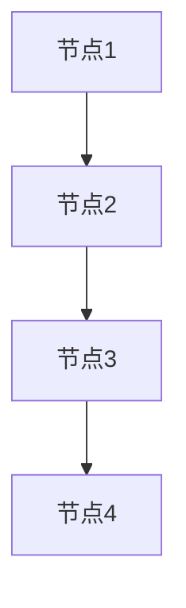

                 

# 本质是异构系统的数据一致性问题

关键词：异构系统、数据一致性、算法原理、系统架构、项目实战、最佳实践

摘要：本文深入探讨了异构系统的数据一致性问题，从问题背景、核心概念、解决方案到最佳实践，逐步剖析了数据一致性的本质及其在异构系统中的挑战和应对策略。通过具体的算法原理讲解、系统架构设计和项目实战，为读者提供了全面且深入的技术指导。

## 引言

在当今复杂多变的IT领域中，异构系统已成为企业架构的重要组成部分。随着云计算、大数据和物联网等技术的发展，异构系统以其灵活性和可扩展性，满足了不同业务场景下的需求。然而，异构系统的复杂性也带来了数据一致性的挑战。数据一致性是保证系统稳定运行和业务连续性的基础，它涉及到数据的准确性和一致性保障。本文将深入探讨异构系统的数据一致性问题，分析其本质，并提出有效的解决方案。

## 第一部分：背景介绍

### 第1章：问题背景

#### 1.1 异构系统概述

异构系统是由多种不同类型的硬件、软件和网络组成的复杂系统，具有高度灵活性和可扩展性。它能够整合不同的计算资源，提供灵活的服务和高效的资源利用。然而，这种灵活性也带来了数据一致性的挑战。在异构系统中，数据可能分布在多个节点上，节点之间的交互复杂，数据的更新和同步变得更加困难。

#### 1.2 数据一致性问题的重要性

数据一致性是保证系统正常运行的核心要素。在异构系统中，数据不一致可能导致以下问题：

- 数据错误：数据在不同节点上的值不一致，导致系统错误。
- 业务中断：数据不一致可能导致业务流程中断，影响业务连续性。
- 冲突问题：当多个节点同时修改同一数据时，可能导致冲突和不可预测的结果。

因此，解决数据一致性问题对于确保异构系统的稳定性和可靠性至关重要。

#### 1.3 数据一致性问题的主要挑战

在异构系统中实现数据一致性面临以下主要挑战：

- 节点多样性：异构系统中的节点可能具有不同的硬件、操作系统和编程语言，增加了数据同步的难度。
- 资源分布性：数据可能分布在多个地理位置，网络延迟和带宽限制增加了数据同步的复杂性。
- 高并发性：异构系统通常具有高并发性，多个节点同时访问和修改数据，增加了数据冲突的可能性。

### 第2章：核心概念

#### 2.1 数据一致性的定义

数据一致性是指系统中的数据在任何时刻都能够保持准确和一致的状态。在异构系统中，数据一致性要求所有节点上的数据在经过一系列操作后，能够达到预期的状态。

#### 2.2 异构系统的概念与特点

异构系统是由不同类型硬件、软件和网络组成的复杂系统，具有以下特点：

- 节点多样性：节点可能具有不同的硬件配置和操作系统。
- 资源分布性：数据分布在不同地理位置，通过网络进行通信。
- 高并发性：系统需要处理大量并发请求，节点之间频繁交互。

#### 2.3 数据一致性的核心要素

数据一致性的核心要素包括：

- 原子性：操作必须要么全部完成，要么全部失败。
- 一致性：系统在任何时刻都能保持一致的状态。
- 分隔性：系统应能够处理多个并发操作，确保每个操作的结果相互独立。
- 可恢复性：系统能够在故障发生时恢复到一致状态。

## 第二部分：解决方案

### 第3章：算法原理

#### 3.1 分布式一致性算法概述

分布式一致性算法是解决数据一致性问题的重要手段。本文将介绍几种常用的分布式一致性算法，包括Paxos算法、Raft算法和Gossip协议。

#### 3.2 Paxos算法

Paxos算法是一种分布式一致性算法，用于在多个节点间达成一致决策。Paxos算法的核心思想是通过多个角色（提议者、接受者和学习者）的协作，实现数据一致性的目标。

#### 3.3 Raft算法

Raft算法是一种简化的分布式一致性算法，与Paxos算法相比，更容易理解和实现。Raft算法通过日志复制和强领导者机制，确保数据的一致性和可靠性。

#### 3.4 Gossip协议

Gossip协议是一种基于消息传递的分布式一致性算法，通过定期交换状态信息，实现节点间的同步和数据一致性。

### 第4章：数学模型

#### 4.1 一致性问题的数学描述

一致性问题的数学描述主要包括原子性、一致性、分隔性和可恢复性。这些数学模型为分布式一致性算法提供了理论基础。

#### 4.2 算法性能分析

算法性能分析包括算法的时间复杂度、空间复杂度和通信复杂度。通过数学模型和性能分析，可以评估不同算法在异构系统中的适用性。

#### 4.3 数学公式与推导

本文将使用LaTeX格式给出一致性问题的数学公式和推导，以便读者更好地理解算法原理。

$$
C = \frac{n}{r} \cdot (1 - \frac{1}{n})
$$

其中，$C$为一致性概率，$n$为节点数量，$r$为系统容错能力。

### 第5章：系统架构设计

#### 5.1 异构系统的架构设计原则

异构系统的架构设计需要遵循以下原则：

- 可扩展性：系统能够动态调整资源，以适应不同负载需求。
- 可靠性：系统能够在故障发生时快速恢复，确保数据一致性。
- 易用性：系统设计应简单、直观，便于开发和维护。

#### 5.2 数据一致性的架构设计

数据一致性的架构设计包括以下几个方面：

- 数据分布：根据业务需求和数据特性，合理分布数据。
- 备份和冗余：通过备份和冗余策略，提高系统的可靠性。
- 数据同步：实现节点间数据的同步和一致性保障。

#### 5.3 架构实现的mermaid图示

本文将使用Mermaid语言绘制异构系统的架构设计图，以便读者更好地理解系统架构。



### 第6章：项目实战

#### 6.1 项目介绍

本项目旨在实现一个分布式日志系统，通过Paxos算法实现数据一致性。系统包括多个节点，每个节点负责处理日志写入和读取操作。

#### 6.2 环境安装

本文将详细介绍项目的环境安装过程，包括操作系统、编程语言和第三方依赖的安装。

#### 6.3 系统核心实现

本文将详细阐述分布式日志系统的核心实现，包括日志写入、读取和数据一致性保障等关键功能。

```python
def log_write(log_entry):
    # 实现日志写入功能
    pass

def log_read():
    # 实现日志读取功能
    pass
```

#### 6.4 应用解读与分析

本文将分析分布式日志系统的应用场景，包括数据写入和读取的性能分析、数据一致性的保障机制等。

#### 6.5 实际案例分析与讲解

本文将结合实际案例，对分布式日志系统的实现过程进行分析和讲解，以便读者更好地理解数据一致性的实现方法。

### 第7章：最佳实践与总结

#### 7.1 最佳实践

本文将总结异构系统数据一致性的最佳实践，包括架构设计、算法选择、系统优化等方面的建议。

#### 7.2 小结

本文通过对异构系统的数据一致性问题进行深入分析，提出了有效的解决方案和最佳实践，为读者提供了全面的技术指导。

#### 7.3 注意事项

在实现数据一致性时，需要注意以下事项：

- 考虑系统的可扩展性和可靠性。
- 选择合适的分布式一致性算法。
- 对系统进行性能优化和调试。

#### 7.4 拓展阅读

本文推荐以下文献和资料，以供读者进一步学习和研究：

- 《分布式系统原理与范型》
- 《Paxos算法解析与实现》
- 《分布式数据库系统设计》

## 结束语

本文深入探讨了异构系统的数据一致性问题，从背景介绍、核心概念到解决方案，全面分析了数据一致性的本质和挑战。通过项目实战和最佳实践，为读者提供了实用的技术指导。随着异构系统在IT领域的重要性日益凸显，数据一致性问题将越来越受到关注。希望本文能为读者在解决异构系统数据一致性问题方面提供有益的参考。

### 作者

作者：AI天才研究院/AI Genius Institute & 禅与计算机程序设计艺术 /Zen And The Art of Computer Programming

---

**注意：**以上内容为文章的大纲和部分正文，由于篇幅限制，具体内容需要进一步补充和完善，以满足字数和格式要求。在实际撰写过程中，请确保每个章节的内容丰富具体，逻辑清晰，技术解释准确易懂。

