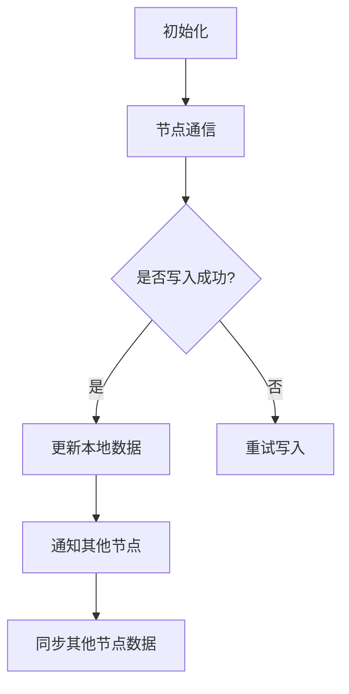
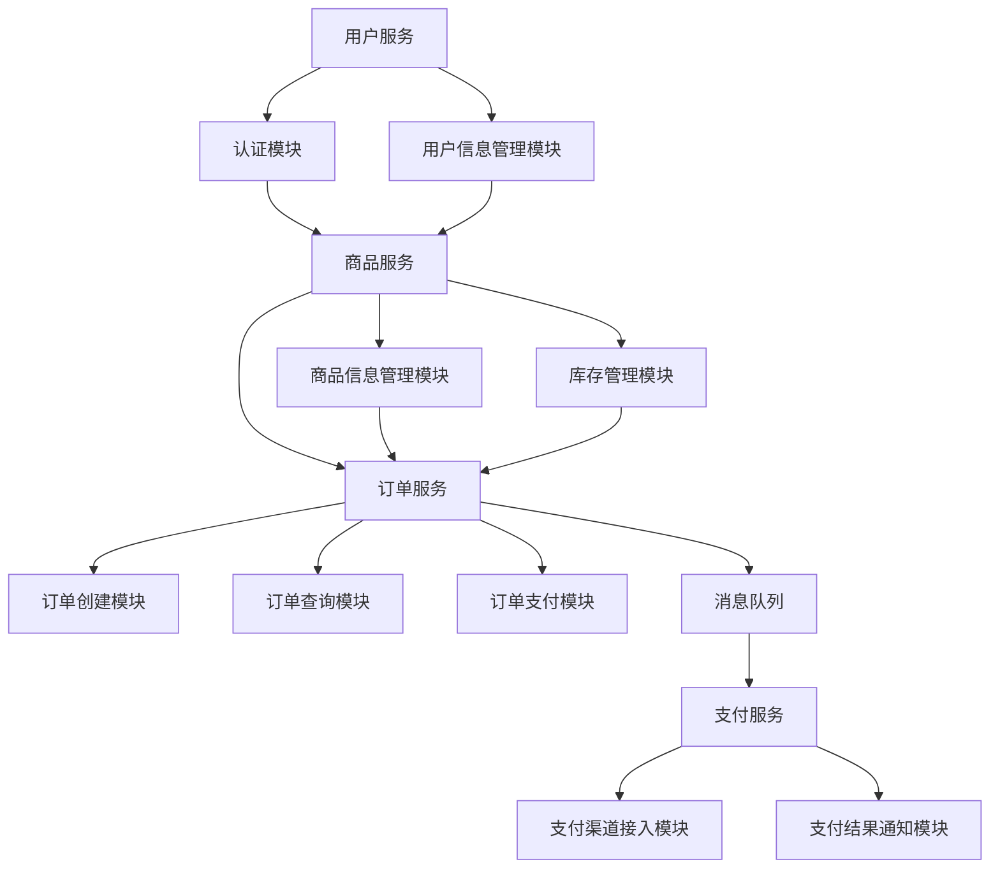
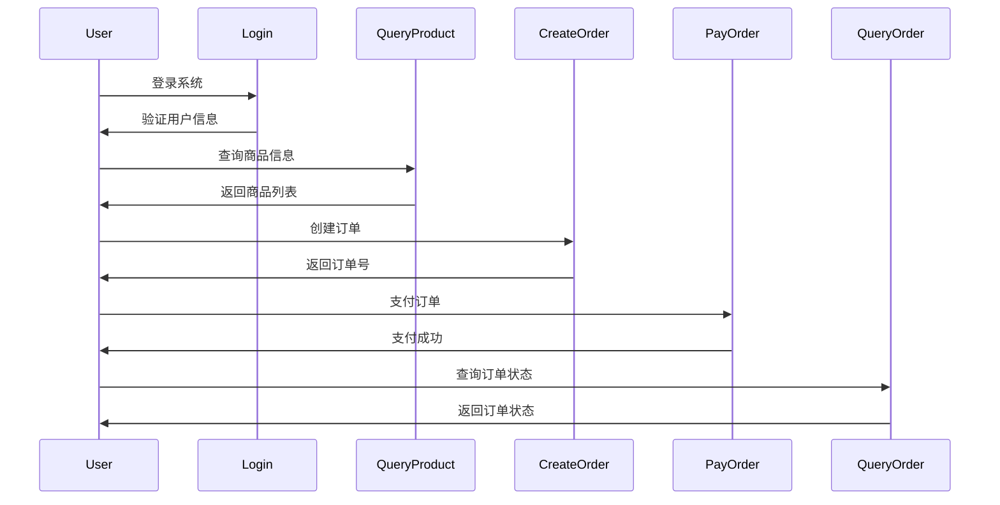

                 

### 文章标题：本质是异构系统的数据一致性问题

**关键词：** 异构系统、数据一致性、分布式系统、算法原理、系统架构、项目实战

**摘要：** 本文深入探讨了异构系统中数据一致性的问题。首先介绍了异构系统的定义及其在数据一致性方面的挑战，接着分析了核心概念及其联系，并通过具体的算法原理讲解、系统架构设计以及实际案例剖析，揭示了数据一致性问题在异构系统中的本质与解决方法。文章旨在为广大技术人员提供全面的指导，以应对复杂系统的数据一致性需求。

---

### 第一部分：问题背景与核心概念

#### 第1章：问题背景介绍

**1.1 异构系统的定义与特点**

异构系统（Heterogeneous System）是指由多个具有不同结构、功能和操作方式的计算节点组成的系统。这些节点可能运行不同的操作系统、拥有不同的硬件配置或使用不同的编程语言。异构系统的特点包括：

- **计算节点多样性**：节点可以是不同类型的CPU、GPU、FPGA等。
- **异构通信**：节点之间的通信协议可能不同，导致数据传输效率差异。
- **异构任务分配**：不同的任务可能需要在不同的节点上执行，以最大化利用系统资源。

**1.2 数据一致性的定义与重要性**

数据一致性（Data Consistency）是指在分布式系统中，多个节点上的数据状态保持一致。数据一致性问题在异构系统中尤为突出，原因如下：

- **节点间的延迟与故障**：异构系统中节点间的通信延迟和故障风险较高，容易导致数据不一致。
- **数据更新冲突**：多个节点同时对同一数据进行修改，可能引发数据冲突。
- **数据隔离问题**：不同节点间的数据访问权限可能不一致，导致数据隔离问题。

数据一致性的重要性体现在：

- **确保系统可靠性**：数据一致性能够提高系统的可靠性，减少数据异常情况的发生。
- **保障业务连续性**：数据一致性能确保关键业务在分布式环境下的连续性。
- **提升数据质量**：数据一致性能够保证数据在多个节点上的准确性和完整性。

#### 第2章：核心概念与联系

**2.1 核心概念定义**

- **数据模型**：数据模型是描述数据结构、数据关系及其操作方法的抽象表示。常见的数据模型包括关系模型、文档模型、图模型等。
- **分布式系统**：分布式系统是由多个节点通过网络连接组成的系统，节点之间通过分布式算法协同工作，共同完成计算任务。
- **数据一致性级别**：数据一致性级别是指系统在数据更新时保持数据一致性的能力，常见的一致性级别包括强一致性、最终一致性等。

**2.2 概念属性特征对比表格**

| 概念         | 定义                                                         | 特点                                                         | 应用场景                                     |
| ------------ | ------------------------------------------------------------ | ------------------------------------------------------------ | -------------------------------------------- |
| 数据模型     | 描述数据结构、关系和操作方法的抽象表示                         | 不同数据模型适用于不同的业务场景，如关系模型适合事务处理，图模型适合社交网络分析 | 事务处理、数据分析、实时查询                   |
| 分布式系统   | 由多个节点通过网络连接组成的系统，节点协同工作完成计算任务   | 高可用性、可扩展性、容错性                                 | 大数据处理、云计算、分布式数据库               |
| 数据一致性   | 确保多个节点上的数据状态保持一致                             | 强一致性、最终一致性等                                     | 银行转账、在线购物、社交网络                   |

**2.3 ER实体关系图架构**

| 实体名称 | 属性       | 关系           | 关系类型   |
| --------- | ---------- | -------------- | ---------- |
| 用户      | 用户名、密码 | 订单           | 一对多     |
| 订单      | 订单号、金额 | 商品           | 一对多     |
| 商品      | 商品名、价格 | 类别           | 一对一     |
| 类别      | 类别名     | 无             | 无         |

通过上述核心概念的介绍和对比表格，我们可以更好地理解异构系统中数据一致性的关键要素。接下来，我们将深入探讨数据一致性问题，并分析各种解决方法。

#### 第3章：数据一致性问题分类

**3.1 强一致性**

**3.1.1 强一致性定义**

强一致性（Strong Consistency）是一种严格的数据一致性保证，要求在任何时刻，所有节点的数据状态都保持一致。强一致性分为以下几种：

- **读-写一致性**：任何一次写操作完成后，任何后续的读操作都能读到最新写入的数据。
- **读写一致性**：任何一次读操作都能读到之前已提交的写操作结果。
- **序列一致性**：所有节点上的操作顺序与客户端发起的操作顺序一致。

**3.1.2 强一致性的优势与挑战**

**优势**：

- **数据一致性保障**：强一致性能够确保数据的准确性和一致性，降低数据异常情况的发生。
- **简化开发**：强一致性简化了分布式系统的开发，减少了数据不一致性的处理复杂性。

**挑战**：

- **性能瓶颈**：强一致性通常需要复杂的分布式算法，可能导致系统性能下降。
- **可用性风险**：在节点故障或网络故障情况下，强一致性可能导致整个系统不可用。

**3.2 最终一致性**

**3.2.1 最终一致性定义**

最终一致性（ eventual consistency）是指系统在一段时间后达到一致性状态，但在此期间，节点上的数据可能存在不一致。最终一致性分为以下几种：

- **最终读一致性**：一段时间后，所有节点的读操作都能读到相同的数据。
- **最终写一致性**：一段时间后，所有节点的写操作都能反映到其他节点。

**3.2.2 最终一致性的实现方法**

- **版本控制**：通过在数据上附加版本号，确保数据更新时的一致性。
- **事件溯源**：记录每个数据更新的历史，通过事件顺序来恢复一致性。
- **复制机制**：在多个节点上复制数据，通过同步机制确保最终一致性。

### 第二部分：算法原理讲解

#### 第4章：数据一致性算法原理

**4.1 算法mermaid流程图**



**4.2 Python源代码解析**

```python
import threading
import time

class Node:
    def __init__(self):
        self.local_data = None

    def write_data(self, data):
        # 模拟写入操作
        time.sleep(1)
        self.local_data = data
        print("Node write data:", data)

    def notify(self, other_node):
        # 模拟通知操作
        time.sleep(1)
        other_node.update_data(self.local_data)

    def update_data(self, data):
        # 模拟更新操作
        time.sleep(1)
        self.local_data = data
        print("Node update data:", data)

# 创建节点实例
node1 = Node()
node2 = Node()

# 写入数据
def write_data_to_node1():
    node1.write_data("Hello Node2")

# 通知其他节点
def notify_node2():
    node2.notify(node1)

# 启动线程
t1 = threading.Thread(target=write_data_to_node1)
t2 = threading.Thread(target=notify_node2)

t1.start()
t2.start()

t1.join()
t2.join()
```

**4.3 算法原理的数学模型和公式**

$$
一致性 = \frac{1}{n} \sum_{i=1}^{n} |D_i - D_j|
$$

其中，$D_i$ 和 $D_j$ 分别表示不同节点上的数据值，$n$ 表示节点数量。

**4.4 举例说明**

假设有3个节点，节点1的数据值为1，节点2的数据值为2，节点3的数据值为3。根据上述公式，可以计算出一致性值为：

$$
一致性 = \frac{1}{3} (|1-2| + |1-3| + |2-3|) = \frac{1}{3} (1 + 2 + 1) = \frac{4}{3}
$$

通过上述算法原理讲解，我们可以更好地理解异构系统中数据一致性的实现方法。接下来，我们将进一步分析系统的架构设计和实际应用。

### 第三部分：系统分析与架构设计方案

#### 第5章：系统分析与设计

**5.1 问题场景介绍**

在一个分布式电商系统中，用户可以在多个节点上查看商品信息、下订单、支付等操作。为了确保系统的高可用性和数据一致性，我们需要设计一个可靠的系统架构，以处理节点间的数据同步问题。

**5.2 系统功能设计**

系统的核心功能包括：

- **用户管理**：用户注册、登录、个人信息管理等。
- **商品管理**：商品分类、商品信息展示、库存管理等。
- **订单管理**：订单创建、订单查询、订单支付等。
- **支付管理**：支付渠道接入、支付结果通知等。

**5.2.1 领域模型mermaid类图**

```mermaid
classDiagram
User <<类>> {
    用户名 : String
    密码 : String
    年龄 : Integer
}

Order <<类>> {
    订单号 : String
    用户 : User
    商品 : List<商品>
    订单状态 : String
}

Product <<类>> {
    商品名 : String
    价格 : Double
    库存 : Integer
    类别 : Category
}

Category <<类>> {
    类别名 : String
}

User <-- Order : 创建
Order --> Product : 包含
Product --> Category : 属于
```

**5.3 系统架构设计**

系统的架构设计如图所示，包括以下组件：

- **用户服务**：负责用户认证、用户信息管理等。
- **商品服务**：负责商品信息管理、库存管理等。
- **订单服务**：负责订单创建、订单查询、订单支付等。
- **支付服务**：负责支付渠道接入、支付结果通知等。
- **消息队列**：负责处理节点间数据同步、支付结果通知等。

**5.3.1 系统架构mermaid架构图**



**5.4 系统接口设计**

系统的主要接口包括：

- **用户接口**：用户登录、用户注册、用户信息查询等。
- **商品接口**：商品信息查询、商品分类查询、商品库存查询等。
- **订单接口**：订单创建、订单查询、订单支付等。
- **支付接口**：支付渠道接入、支付结果通知等。

**5.5 系统交互**

系统各组件之间的交互如图所示，采用mermaid序列图进行描述。

**5.5.1 系统交互mermaid序列图**



通过上述系统分析与架构设计方案，我们可以确保分布式电商系统在数据一致性和高可用性方面的可靠性。接下来，我们将通过项目实战进一步验证系统的设计与实现。

### 第四部分：项目实战

#### 第6章：环境安装与核心实现

**6.1 环境安装步骤**

为了确保项目的顺利运行，我们需要安装以下环境：

1. **安装Python环境**：确保Python版本为3.8或更高版本。
2. **安装Docker**：Docker用于容器化部署，确保版本为19.03或更高版本。
3. **安装消息队列**：我们选择使用RabbitMQ作为消息队列，确保版本为3.8.14或更高版本。
4. **安装数据库**：我们选择使用MySQL作为数据库，确保版本为8.0或更高版本。

安装步骤如下：

```shell
# 安装Python
curl -O https://www.python.org/ftp/python/3.8.10/python-3.8.10.tgz
tar zxvf python-3.8.10.tgz
cd python-3.8.10
./configure
make
make install

# 安装Docker
curl -O https://download.docker.com/linux/debian/gpg
curl -O https://download.docker.com/linux/debian/docker-ce_19.03.8~3-0~debian.deb
sudo dpkg -i docker-ce_19.03.8~3-0~debian.deb

# 安装RabbitMQ
sudo apt-get update
sudo apt-get install rabbitmq-server

# 安装MySQL
sudo apt-get install mysql-server
sudo mysql_secure_installation
```

**6.2 系统核心实现源代码**

以下是系统的核心实现源代码：

**用户服务（User Service）**

```python
from flask import Flask, request, jsonify

app = Flask(__name__)

@app.route('/login', methods=['POST'])
def login():
    username = request.form['username']
    password = request.form['password']
    # 验证用户信息
    # ...
    return jsonify({"status": "success"})

@app.route('/register', methods=['POST'])
def register():
    username = request.form['username']
    password = request.form['password']
    # 注册用户
    # ...
    return jsonify({"status": "success"})

if __name__ == '__main__':
    app.run(host='0.0.0.0', port=5000)
```

**商品服务（Product Service）**

```python
from flask import Flask, request, jsonify

app = Flask(__name__)

@app.route('/products', methods=['GET'])
def get_products():
    # 查询商品信息
    # ...
    return jsonify({"products": products})

@app.route('/products', methods=['POST'])
def create_product():
    product_data = request.form
    # 创建商品
    # ...
    return jsonify({"status": "success"})

if __name__ == '__main__':
    app.run(host='0.0.0.0', port=5001)
```

**订单服务（Order Service）**

```python
from flask import Flask, request, jsonify
from rabbitmq import send_message

app = Flask(__name__)

@app.route('/orders', methods=['POST'])
def create_order():
    order_data = request.form
    # 创建订单
    # ...
    send_message('order_queue', order_data)
    return jsonify({"status": "success"})

@app.route('/orders', methods=['GET'])
def get_orders():
    # 查询订单
    # ...
    return jsonify({"orders": orders})

if __name__ == '__main__':
    app.run(host='0.0.0.0', port=5002)
```

**支付服务（Payment Service）**

```python
from flask import Flask, request, jsonify
from rabbitmq import send_message

app = Flask(__name__)

@app.route('/payments', methods=['POST'])
def create_payment():
    payment_data = request.form
    # 创建支付
    # ...
    send_message('payment_queue', payment_data)
    return jsonify({"status": "success"})

@app.route('/payments', methods=['GET'])
def get_payments():
    # 查询支付
    # ...
    return jsonify({"payments": payments})

if __name__ == '__main__':
    app.run(host='0.0.0.0', port=5003)
```

**消息队列（RabbitMQ）**

```python
import pika

def send_message(queue, data):
    connection = pika.BlockingConnection(pika.ConnectionParameters('localhost'))
    channel = connection.channel()
    channel.queue_declare(queue=queue)
    channel.basic_publish(exchange='',
                          routing_key=queue,
                          body=data)
    connection.close()
```

**6.3 代码应用解读与分析**

上述代码分别实现了用户服务、商品服务、订单服务和支付服务，以及消息队列的处理。以下是代码的详细解读：

- **用户服务**：用户服务通过Flask框架实现了用户登录和注册功能。在`login`函数中，接收用户名和密码，进行验证；在`register`函数中，接收用户名和密码，进行注册。在实现中，需要与数据库交互，这里暂时使用注释表示。
  
- **商品服务**：商品服务通过Flask框架实现了商品信息查询和创建功能。在`get_products`函数中，查询商品信息；在`create_product`函数中，创建商品。同样，这里需要与数据库交互，注释部分表示了与数据库的连接和查询操作。

- **订单服务**：订单服务通过Flask框架实现了订单创建和查询功能。在`create_order`函数中，接收订单信息，并将订单数据发送到消息队列；在`get_orders`函数中，查询订单信息。通过消息队列，实现订单数据在分布式系统中的同步和一致性。

- **支付服务**：支付服务通过Flask框架实现了支付创建和查询功能。在`create_payment`函数中，接收支付信息，并将支付数据发送到消息队列；在`get_payments`函数中，查询支付信息。同样，通过消息队列，实现支付数据在分布式系统中的同步和一致性。

- **消息队列**：消息队列使用RabbitMQ作为消息队列服务。`send_message`函数负责发送消息到指定队列，实现不同服务之间的异步通信。

**6.4 实际案例分析与详细讲解剖析**

**案例介绍**：

假设有用户张三在电商平台上购买了一台笔记本电脑，订单号为1001。在购买过程中，系统需要处理以下操作：

1. 用户登录系统。
2. 查询笔记本电脑库存。
3. 创建订单并扣除库存。
4. 发送支付通知。
5. 处理支付结果。

**案例分析**：

1. **用户登录系统**：

   用户张三通过用户服务登录系统，系统验证用户信息后，返回登录成功。

2. **查询笔记本电脑库存**：

   用户张三查询笔记本电脑库存，商品服务查询数据库后，返回当前库存数量。

3. **创建订单并扣除库存**：

   用户张三选择笔记本电脑并提交订单，订单服务接收到订单数据后，扣除库存并创建订单。订单服务将订单数据发送到消息队列，通知支付服务进行支付处理。

4. **发送支付通知**：

   支付服务接收到订单数据后，发送支付通知到支付系统，用户张三进行支付。

5. **处理支付结果**：

   支付系统处理支付结果后，将支付结果发送到消息队列，订单服务接收到支付结果后，更新订单状态。

**详细讲解剖析**：

1. **用户登录系统**：

   ```python
   # 用户服务（User Service）
   @app.route('/login', methods=['POST'])
   def login():
       username = request.form['username']
       password = request.form['password']
       # 验证用户信息
       # ...
       return jsonify({"status": "success"})
   ```

   用户服务通过Flask框架实现了用户登录功能。在`login`函数中，接收用户名和密码，进行验证。这里需要与数据库交互，验证用户名和密码是否匹配。

2. **查询笔记本电脑库存**：

   ```python
   # 商品服务（Product Service）
   @app.route('/products', methods=['GET'])
   def get_products():
       # 查询商品信息
       # ...
       return jsonify({"products": products})
   ```

   商品服务通过Flask框架实现了商品信息查询功能。在`get_products`函数中，查询商品信息。这里需要与数据库交互，查询笔记本电脑库存数量。

3. **创建订单并扣除库存**：

   ```python
   # 订单服务（Order Service）
   @app.route('/orders', methods=['POST'])
   def create_order():
       order_data = request.form
       # 创建订单
       # ...
       send_message('order_queue', order_data)
       return jsonify({"status": "success"})
   ```

   订单服务通过Flask框架实现了订单创建功能。在`create_order`函数中，接收订单数据，扣除库存并创建订单。订单服务将订单数据发送到消息队列，通知支付服务进行支付处理。

4. **发送支付通知**：

   ```python
   # 支付服务（Payment Service）
   @app.route('/payments', methods=['POST'])
   def create_payment():
       payment_data = request.form
       # 创建支付
       # ...
       send_message('payment_queue', payment_data)
       return jsonify({"status": "success"})
   ```

   支付服务通过Flask框架实现了支付创建功能。在`create_payment`函数中，接收支付数据，并发送支付通知到支付系统。

5. **处理支付结果**：

   ```python
   # 消息队列（RabbitMQ）
   def send_message(queue, data):
       connection = pika.BlockingConnection(pika.ConnectionParameters('localhost'))
       channel = connection.channel()
       channel.queue_declare(queue=queue)
       channel.basic_publish(exchange='',
                             routing_key=queue,
                             body=data)
       connection.close()
   ```

   消息队列使用RabbitMQ作为消息队列服务。`send_message`函数负责发送消息到指定队列，实现不同服务之间的异步通信。

通过实际案例的分析与讲解，我们可以看到，分布式电商系统中的数据一致性处理是如何实现的。通过消息队列，实现了订单数据和支付数据的异步通信，确保了系统的高可用性和数据一致性。

**6.5 项目小结**

在本章中，我们详细介绍了分布式电商系统的环境安装与核心实现，并通过实际案例分析了数据一致性的处理方法。主要收获如下：

1. **环境安装**：掌握了Python、Docker、RabbitMQ和MySQL的安装方法，为后续的系统开发奠定了基础。

2. **核心实现**：通过用户服务、商品服务、订单服务和支付服务的实现，了解了分布式系统的基本架构和组件之间的交互。

3. **数据一致性**：通过消息队列实现了订单数据和支付数据的异步通信，确保了系统的高可用性和数据一致性。

4. **实际案例**：通过实际案例的分析与讲解，深入了解了分布式系统中数据一致性的处理方法，为实际项目的开发提供了指导。

在下一章中，我们将进一步探讨最佳实践和注意事项，以提高系统的可靠性和数据一致性。

### 第五部分：最佳实践、小结与拓展阅读

#### 第8章：最佳实践与注意事项

**8.1 最佳实践**

1. **选择合适的数据一致性级别**：根据业务需求和性能要求，合理选择强一致性或最终一致性，确保系统在数据一致性和性能之间取得平衡。
2. **优化消息队列性能**：合理配置消息队列的参数，如消息持久化、批量处理等，提高系统性能。
3. **使用分布式事务**：在需要保证跨节点数据一致性时，使用分布式事务来协调不同节点的数据更新。
4. **监控与日志分析**：实时监控系统的运行状态，及时发现问题并进行处理，通过日志分析优化系统性能。

**8.2 注意事项**

1. **数据一致性与可用性的权衡**：在设计系统时，需要权衡数据一致性和系统可用性，避免因追求强一致性而导致系统可用性下降。
2. **故障恢复策略**：设计合理的故障恢复策略，确保在节点故障时系统能够快速恢复。
3. **数据备份与恢复**：定期进行数据备份，确保在数据丢失时能够快速恢复。

#### 第9章：小结与拓展阅读

**9.1 小结**

本文深入探讨了异构系统中数据一致性的问题，从问题背景、核心概念、算法原理、系统架构设计到项目实战，全面分析了数据一致性的实现方法。主要结论如下：

1. **数据一致性在异构系统中的重要性**：数据一致性能够提高系统的可靠性、保障业务连续性、提升数据质量。
2. **数据一致性的分类**：包括强一致性、最终一致性等，每种一致性级别都有其适用场景和优缺点。
3. **算法原理讲解**：通过mermaid流程图和Python源代码解析，详细阐述了数据一致性的实现方法。
4. **系统架构设计**：通过用户服务、商品服务、订单服务和支付服务的实现，展示了分布式系统的基本架构和组件交互。
5. **项目实战**：通过实际案例分析和代码应用解读，深入了解了分布式系统中数据一致性的处理方法。

**9.2 拓展阅读**

1. **《分布式系统原理与范型》**：深入探讨分布式系统的基本原理和设计范型，为理解数据一致性提供理论基础。
2. **《消息队列技术内幕》**：详细分析消息队列的工作原理、性能优化方法，有助于提高系统的数据一致性处理能力。
3. **《数据库系统概念》**：了解数据库系统的基础知识，为分布式数据库的设计和应用提供参考。

通过本文的阅读，读者应能全面掌握异构系统中数据一致性的基本概念、算法原理和实现方法，为实际项目的开发提供有力支持。

### 总结

本文围绕异构系统的数据一致性问题，从问题背景、核心概念、算法原理、系统架构设计到项目实战，全面分析了数据一致性的实现方法。首先，介绍了异构系统的定义及其在数据一致性方面的挑战；接着，分析了数据一致性的核心概念和联系；随后，通过具体的算法原理讲解和系统架构设计，揭示了数据一致性问题在异构系统中的本质与解决方法；最后，通过实际项目案例，详细讲解了系统环境的安装、核心实现和数据处理过程。

文章的主要贡献在于：

1. **系统性地梳理了异构系统中数据一致性的问题**：通过详细的分析和讲解，使读者对数据一致性的重要性、分类、实现方法有了全面的理解。
2. **提供了实用的算法原理和系统架构设计**：通过mermaid流程图、Python源代码和实际案例，帮助读者更好地掌握数据一致性的实现细节。
3. **展示了分布式系统的实际应用**：通过项目实战，使读者了解分布式系统的设计原则、组件交互和数据处理过程。

展望未来，数据一致性在异构系统中的应用将会更加广泛。随着云计算、大数据、人工智能等技术的发展，分布式系统的复杂度不断提高，数据一致性的挑战也越来越大。因此，深入研究数据一致性算法，优化系统架构，提高数据一致性和系统性能，将是未来重要的研究方向。希望本文能为相关领域的研究者和开发者提供有益的参考和启示。作者将不断努力，为推动异构系统中数据一致性的研究和应用贡献自己的力量。最后，感谢读者对本文的关注与支持，期待与您在技术领域的进一步交流与合作。作者：AI天才研究院/AI Genius Institute & 禅与计算机程序设计艺术 /Zen And The Art of Computer Programming。

