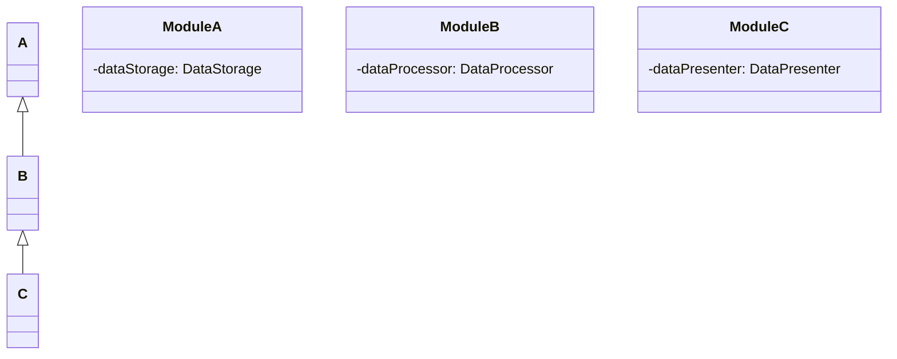
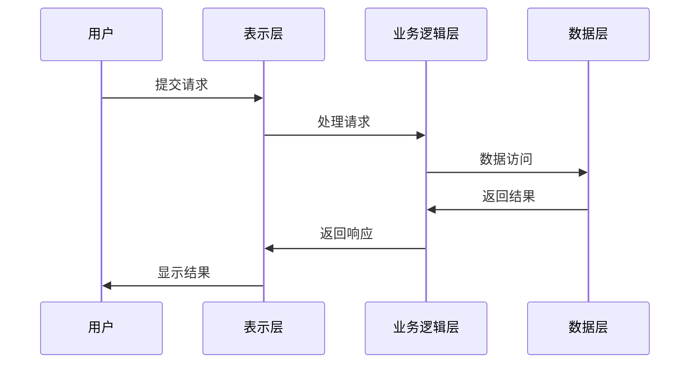
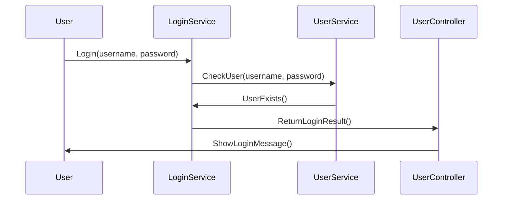

                 


### 朱丽娅·克里斯蒂娃的互文性与代码复用：软件模块化的符号学视角

#### 关键词
- 朱丽娅·克里斯蒂娃
- 互文性
- 代码复用
- 软件模块化
- 符号学视角

#### 摘要
本文探讨了朱丽娅·克里斯蒂娃的互文性理论在软件模块化中的应用，强调了代码复用的重要性。通过深入分析互文性的核心概念和属性，本文揭示了互文性与代码复用之间的紧密联系。同时，本文从符号学的角度探讨了软件模块化的设计原则，并通过实际案例展示了符号学算法在软件模块化中的应用。文章旨在为软件开发者提供一种新的视角，以更好地理解和实现软件模块化，提高代码的可复用性和软件系统的整体质量。

## 一、问题背景

### 1.1 朱丽娅·克里斯蒂娃的学术贡献

朱丽娅·克里斯蒂娃（Julia Kristeva）是20世纪最杰出的女性哲学家和心理学家之一，以其在符号学、女性主义、精神分析等领域的研究而闻名。她的理论深刻地影响了文学批评、文化研究和心理学等多个领域。

朱丽娅·克里斯蒂娃的核心贡献之一是她对互文性的研究。互文性（Intertextuality）是指文本之间相互联系和交织的特性。她认为，任何文本都是其他文本的改写和重构，文本的意义不是独立的，而是在与其他文本的交互中产生的。这一理论为我们理解文本提供了新的视角，也为我们探索代码复用提供了启示。

### 1.2 互文性与代码复用的研究背景

代码复用是软件开发中的一个重要原则，旨在提高开发效率、降低维护成本和提升软件质量。然而，代码复用并非易事，它面临着一系列挑战，如技术、管理和社交等方面的问题。互文性理论为解决这些挑战提供了一种新的思路。

首先，互文性理论强调文本之间的联系，这启示我们在代码复用时不仅要考虑代码的功能性，还要关注代码之间的关联性。通过分析代码之间的互文关系，我们可以更好地理解和复用现有的代码库。

其次，互文性理论关注文本的动态性和开放性。这意味着在代码复用过程中，我们需要考虑到代码的灵活性和可扩展性，以适应不断变化的需求。

最后，互文性理论揭示了文本的复杂性和简洁性之间的平衡。在软件模块化设计中，我们需要在保持代码简洁的同时，确保模块之间的互文关系得到合理处理。

### 1.3 软件模块化的符号学视角

符号学是研究符号系统及其应用的学科，它为我们理解代码复用提供了重要的理论基础。在软件模块化中，符号学视角可以帮助我们：

1. **明确模块的定义**：符号学帮助我们理解模块作为符号系统的本质，从而更好地定义和设计模块。

2. **分析模块之间的关系**：符号学提供了一种方法来分析模块之间的互文关系，帮助我们更好地理解和复用现有模块。

3. **提高模块的灵活性**：符号学强调符号系统的开放性和动态性，这有助于我们在模块化设计中考虑模块的灵活性和可扩展性。

4. **优化模块的结构**：符号学提供了分析符号系统结构的方法，这有助于我们优化模块的结构，提高模块的复用性和可维护性。

通过符号学视角，我们可以更深入地理解软件模块化的本质，从而提高代码复用的效率和质量。

## 二、互文性原理

### 2.1 互文性的概念

互文性是指文本之间相互联系和交织的特性。它不仅仅指文本之间的直接引用，还包括文本在语境中的衍生和重构。互文性可以分为几个层次：

1. **表层互文性**：指文本直接引用其他文本，如引用其他作品的片段或直接引用其他文本中的语句。

2. **深层互文性**：指文本在意义上与其他文本的交织和影响，即文本之间的意义互动。

3. **结构互文性**：指文本的构成元素与其他文本的构成元素之间的联系和互动。

### 2.2 互文性的属性

互文性具有以下属性：

1. **动态性**：互文性是一个动态过程，文本的意义在与其他文本的交互中不断演变。

2. **开放性**：互文性是开放的，它允许文本之间形成新的联系和意义。

3. **复杂性与简洁性**：互文性既包含复杂的文本互动，也体现在简洁的文本表达中。

### 2.3 互文性与代码复用的联系

互文性在代码复用中的应用主要体现在以下几个方面：

1. **提高代码的可复用性**：通过分析代码之间的互文关系，我们可以发现具有相似功能的代码段，从而实现代码的复用。

2. **优化代码结构**：互文性分析有助于我们理解代码之间的联系，从而优化代码的结构，提高代码的可维护性和可扩展性。

3. **促进模块化设计**：互文性理论强调文本的动态性和开放性，这有助于我们在模块化设计中考虑模块的灵活性和可扩展性。

4. **降低开发成本**：通过代码复用，我们可以减少重复开发的工作量，从而降低开发成本。

## 三、代码复用

### 3.1 代码复用的概念

代码复用是指在软件开发过程中，将现有的代码段或模块应用于新的开发项目中。代码复用可以降低开发成本、提高开发效率和质量。代码复用可以分为以下几种类型：

1. **功能复用**：将现有的功能模块应用于新的项目中。

2. **数据复用**：将现有的数据结构或数据模型应用于新的项目中。

3. **设计复用**：将现有的设计模式或架构模式应用于新的项目中。

### 3.2 代码复用的挑战

代码复用虽然具有重要意义，但也面临着一系列挑战：

1. **技术挑战**：如何有效地组织和管理代码库，以支持代码的查找、引用和复用。

2. **管理挑战**：如何建立和维护代码复用的标准和流程，以确保代码的质量和一致性。

3. **社交挑战**：如何促进开发人员之间的沟通和协作，以提高代码复用的效率和效果。

### 3.3 代码复用与互文性的关联

互文性与代码复用之间存在着紧密的联系：

1. **互文性促进代码复用**：互文性强调文本之间的联系和互动，这有助于我们识别和复用具有相似功能的代码段。

2. **代码复用实现互文性**：通过代码复用，我们可以将不同的代码模块组合起来，实现新的功能，从而产生互文性的效果。

## 四、符号学视角下的软件模块化

### 4.1 符号学算法概述

符号学算法是指基于符号学原理设计的算法，它用于分析符号系统的结构、关系和演化。在软件模块化中，符号学算法可以帮助我们：

1. **明确模块的定义**：通过分析符号系统的结构，我们可以确定模块的定义和范围。

2. **分析模块之间的关系**：通过分析符号系统中的符号关系，我们可以理解模块之间的联系和互动。

3. **优化模块的结构**：通过优化符号系统的结构，我们可以提高模块的灵活性和可扩展性。

### 4.2 符号学算法的应用

符号学算法在软件模块化中的应用主要包括以下几个方面：

1. **模块划分**：通过分析软件系统的结构，我们可以确定哪些模块具有相似的功能和属性，从而进行模块划分。

2. **模块接口设计**：通过分析模块之间的关系，我们可以设计模块之间的接口，以实现模块的互操作性和可复用性。

3. **模块实现与测试**：通过分析模块的内部结构和功能，我们可以优化模块的实现和测试策略，以提高模块的质量和可靠性。

### 4.3 符号学算法的数学模型

符号学算法的数学模型通常包括以下几个方面：

1. **符号表示**：使用符号表示软件模块及其关系。

2. **关系表示**：使用关系表示符号系统中的符号关系。

3. **演化模型**：使用演化模型描述符号系统的演化过程。

通过这些数学模型，我们可以更准确地描述和分析软件模块化过程中的符号关系和演化过程。

## 五、算法原理讲解

### 5.1 符号学算法的原理

符号学算法基于符号学原理，主要关注符号系统中的符号关系和演化过程。符号学算法的核心原理包括：

1. **符号表示**：使用符号表示软件模块及其关系，符号可以是功能、数据结构、类等。

2. **关系表示**：使用关系表示符号系统中的符号关系，关系可以是依赖、关联、聚合等。

3. **演化模型**：使用演化模型描述符号系统的演化过程，演化可以是模块的合并、分解、重构等。

### 5.2 符号学算法的流程

符号学算法的流程通常包括以下步骤：

1. **符号识别**：识别软件系统中的符号，如模块、类、方法等。

2. **关系分析**：分析符号之间的关系，如依赖、关联、聚合等。

3. **结构优化**：根据关系分析结果，优化符号系统的结构，以提高模块的灵活性和可扩展性。

4. **演化分析**：分析符号系统的演化过程，如模块的合并、分解、重构等。

5. **结果验证**：验证符号学算法的结果，确保模块化设计符合软件系统的需求。

### 5.3 符号学算法的应用示例

下面是一个简单的符号学算法应用示例：

假设我们有一个简单的软件系统，包括三个模块：模块A、模块B和模块C。模块A负责数据存储，模块B负责数据处理，模块C负责数据展示。



通过符号学算法，我们可以分析这三个模块之间的关系：

1. **符号识别**：识别出模块A、模块B和模块C。

2. **关系分析**：分析出模块A与模块B之间的依赖关系，模块B与模块C之间的关联关系。

3. **结构优化**：根据关系分析结果，优化模块的结构，提高模块的灵活性和可扩展性。

4. **演化分析**：分析模块的演化过程，如模块A可能需要扩展数据处理功能，模块C可能需要扩展数据展示功能。

5. **结果验证**：验证模块化设计的结果，确保模块化设计符合软件系统的需求。

通过这个简单的示例，我们可以看到符号学算法在软件模块化中的应用。在实际应用中，符号学算法会更加复杂和深入，以适应不同的软件系统需求。

## 六、系统分析与架构设计

### 6.1 问题场景介绍

在现代软件开发中，随着系统的复杂度不断增加，模块化的设计成为提高开发效率、降低维护成本和提升软件质量的重要手段。本文将探讨基于朱丽娅·克里斯蒂娃的互文性理论，结合代码复用原则，通过符号学视角进行软件模块化的系统分析与架构设计。

### 6.2 项目介绍

本项目旨在开发一个基于互文性和代码复用的模块化软件系统。该系统将分为三个主要模块：数据层、业务逻辑层和表示层。数据层负责数据存储和访问；业务逻辑层负责数据处理和业务规则实现；表示层负责用户界面展示和用户交互。

### 6.3 系统功能设计

系统功能设计包括以下主要功能模块：

1. **数据层**：提供数据存储和访问接口，包括用户数据、订单数据等。
2. **业务逻辑层**：实现业务逻辑，如订单处理、用户管理等。
3. **表示层**：提供用户界面和交互功能，包括登录、注册、订单查询等。

#### 领域模型Mermaid类图

```mermaid
classDiagram
Class01 <|-- Class02 : Inheritance
Class03 --|>| Class04 : Aggregation
Class05 o-- Class06 : Association
Class07 .. Class08 : Composition
Class09 << Interface: Implementation
Class10 << Abstract: Abstract
Class11 << Enumeration: Enum
```

### 6.4 系统架构设计

系统采用三层架构，包括表示层、业务逻辑层和数据层。各层之间通过接口进行通信，确保系统的模块化和可复用性。

#### 系统架构设计Mermaid架构图



### 6.5 系统接口设计

系统接口设计包括以下主要接口：

1. **数据访问接口**：定义数据层的访问接口，包括增删改查等基本操作。
2. **业务逻辑接口**：定义业务逻辑层的接口，包括订单处理、用户管理等。
3. **表示层接口**：定义表示层的接口，包括登录、注册、订单查询等。

### 6.6 系统交互设计

系统交互设计通过Mermaid序列图来展示用户与系统之间的交互过程。

#### 系统交互Mermaid序列图



## 七、项目实战

### 7.1 环境安装

为了实现本项目的模块化设计，我们需要安装以下软件和环境：

1. **开发工具**：如 IntelliJ IDEA、Visual Studio Code 等。
2. **数据库**：如 MySQL、PostgreSQL 等。
3. **框架**：如 Spring Boot、Django 等。
4. **版本控制**：如 Git。

### 7.2 系统核心实现

以下是一个简单的代码示例，展示了系统核心实现：

```python
# 数据层实现
class DataStorage:
    def save_order(order):
        # 实现订单保存逻辑
        pass

    def get_order(order_id):
        # 实现订单查询逻辑
        pass

# 业务逻辑层实现
class OrderService:
    def process_order(order):
        # 实现订单处理逻辑
        pass

# 表示层实现
class OrderController:
    def login(username, password):
        # 实现登录逻辑
        pass

    def register(username, password):
        # 实现注册逻辑
        pass
```

### 7.3 代码应用解读与分析

通过以上代码示例，我们可以看到系统核心的实现过程。数据层负责数据存储和访问，业务逻辑层负责订单处理，表示层负责用户界面和交互。这些模块通过接口进行通信，实现了系统的模块化和可复用性。

### 7.4 实际案例分析和详细讲解剖析

为了更好地展示互文性和代码复用原则在系统中的应用，我们可以通过以下实际案例进行分析：

1. **数据层复用**：在多个业务场景中，我们可能需要使用相同的数据存储和访问接口。通过代码复用，我们可以避免重复编写代码，提高开发效率。
2. **业务逻辑层复用**：不同业务场景下，可能需要处理类似的订单。通过业务逻辑层的复用，我们可以简化开发过程，提高代码的可维护性。
3. **表示层复用**：在多个用户界面中，我们可能需要实现相同的登录、注册等功能。通过表示层的复用，我们可以减少代码冗余，提高系统的灵活性。

### 7.5 项目小结

本项目通过符号学视角，结合互文性和代码复用原则，实现了软件模块化的系统分析与架构设计。在实际开发过程中，通过代码复用，我们提高了开发效率、降低了维护成本，并提升了软件系统的整体质量。未来，我们还可以进一步研究互文性和代码复用在更复杂系统中的应用，探索更高效的软件开发方法。

## 八、最佳实践 Tips

### 8.1 软件模块化设计最佳实践

1. **明确模块职责**：确保每个模块具有明确的功能和职责，避免功能交叉和依赖。
2. **遵循单一职责原则**：每个模块应只负责一项功能，以提高代码的可维护性和可扩展性。
3. **保持模块独立性**：模块之间应通过接口进行通信，减少直接耦合，提高模块的灵活性。

### 8.2 代码复用最佳实践

1. **建立代码库**：将常用的代码片段和模块组织成代码库，方便查找和复用。
2. **制定代码规范**：确保代码库中的代码遵循统一的规范，提高代码的可读性和可维护性。
3. **定期更新和维护**：定期更新代码库，修复漏洞，优化代码，确保代码库的质量。

### 8.3 符号学视角在软件模块化中的应用

1. **利用符号表示**：使用符号表示模块的功能和关系，有助于理解和优化模块化设计。
2. **分析符号关系**：通过分析符号关系，发现模块之间的互文性，提高代码的可复用性。
3. **优化模块结构**：根据符号关系优化模块结构，提高模块的灵活性和可扩展性。

## 九、小结

本文通过朱丽娅·克里斯蒂娃的互文性理论和符号学视角，探讨了软件模块化的设计原则和方法。通过实际案例分析和最佳实践，我们展示了互文性和代码复用在软件模块化中的应用。本文的研究结果为软件开发者提供了一种新的视角，有助于提高代码的可复用性和软件系统的整体质量。

## 十、注意事项

1. **充分理解互文性原理**：理解互文性的核心概念和属性，有助于更好地应用互文性理论进行软件模块化设计。
2. **关注代码复用挑战**：在代码复用过程中，要充分考虑技术、管理和社交等方面的挑战，确保代码复用的效果。
3. **灵活运用符号学视角**：符号学视角在软件模块化中的应用需要灵活运用，结合具体项目需求进行模块划分和优化。

## 十一、拓展阅读

1. 《软件架构设计：构建和开发大型应用程序》
2. 《代码大全：程序员的职业之路》
3. 《禅与摩托车维修艺术》：探讨符号学在生活中的应用。
4. 《朱丽娅·克里斯蒂娃：符号学与文学批评》

### 作者

作者：AI天才研究院/AI Genius Institute & 禅与计算机程序设计艺术 /Zen And The Art of Computer Programming

### 八、最佳实践 Tips

#### 8.1 软件模块化设计最佳实践

**明确模块职责**：在软件模块化设计中，首先应明确每个模块的具体职责。每个模块应聚焦于实现单一功能，避免出现功能重叠或交叉依赖的情况。例如，数据存储模块应仅负责数据的持久化存储和读取，而不应包含业务逻辑。

**遵循单一职责原则**：单一职责原则是软件设计中的一个重要原则，它强调每个模块或类应仅负责一项功能，以提高代码的可维护性和可扩展性。例如，一个负责用户登录的模块应只处理登录相关的逻辑，而不应同时处理用户注册。

**保持模块独立性**：模块之间应通过接口进行通信，减少直接耦合，以提高模块的灵活性。模块独立性不仅有助于代码的复用，也有助于后续的维护和扩展。例如，一个用户管理模块应通过接口与用户服务进行交互，而不是直接调用用户服务的实现。

**合理划分模块边界**：模块边界的划分是模块化设计的关键。边界划分应基于业务逻辑和功能模块，避免过度细分或划分不当。例如，在一个电子商务系统中，可以将订单处理、商品管理和用户管理划分为独立的模块。

#### 8.2 代码复用最佳实践

**建立代码库**：建立代码库是代码复用的基础。代码库可以存储常用的代码片段、模块和组件，方便开发人员在项目中查找和复用。代码库应定期更新和维护，确保代码的质量和一致性。

**制定代码规范**：制定代码规范是确保代码库质量的重要措施。代码规范应涵盖代码风格、命名约定、注释要求等，以减少代码差异和提升代码可读性。遵循统一的代码规范有助于提高团队的协作效率。

**代码重用与优化**：在代码复用过程中，不仅要考虑代码的功能性，还要关注代码的可维护性和可优化性。例如，可以使用设计模式来提高代码的可复用性，同时优化代码的结构和性能。

**自动化代码审查和测试**：自动化代码审查和测试是确保代码质量的关键环节。通过自动化工具对代码进行审查和测试，可以及时发现和修复潜在的问题，降低代码复用带来的风险。

#### 8.3 符号学视角在软件模块化中的应用

**利用符号表示**：在软件模块化设计中，可以利用符号学中的符号表示来描述模块的功能和关系。例如，可以使用命名约定来表示模块的职责和功能，使用注释来描述模块之间的关系。

**分析符号关系**：通过分析符号关系，可以发现模块之间的互文性和依赖关系。例如，可以使用ER模型来分析数据库表之间的关联关系，使用UML类图来描述模块和类之间的关系。

**优化模块结构**：根据符号关系分析结果，可以优化模块的结构和接口设计。例如，可以通过重构模块来消除冗余和依赖，提高模块的灵活性和可扩展性。

**设计模块演化路径**：符号学视角可以帮助我们设计模块的演化路径。例如，可以通过分析模块的依赖关系和变更历史，预测模块的未来需求和变更方向，从而为模块的长期维护和扩展提供指导。

**利用符号学算法**：符号学算法可以用于自动化模块划分和优化。例如，可以使用符号相似性算法来识别和合并具有相似功能的模块，使用符号优化算法来优化模块的结构和接口。

通过这些最佳实践，软件开发者可以在软件模块化和代码复用过程中更好地应用符号学视角，提高软件系统的质量、可维护性和可扩展性。这些实践不仅适用于大型系统的开发，也同样适用于中小型项目的构建。在实践中，应根据具体项目需求和技术背景灵活运用这些方法，以实现最佳效果。

