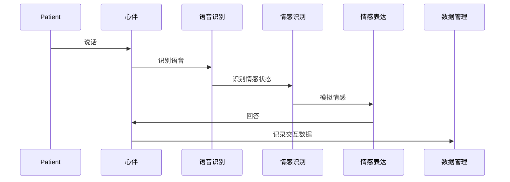
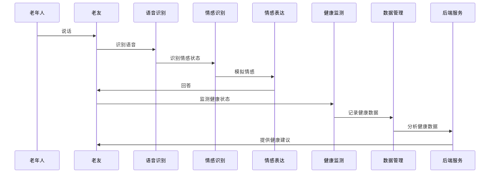
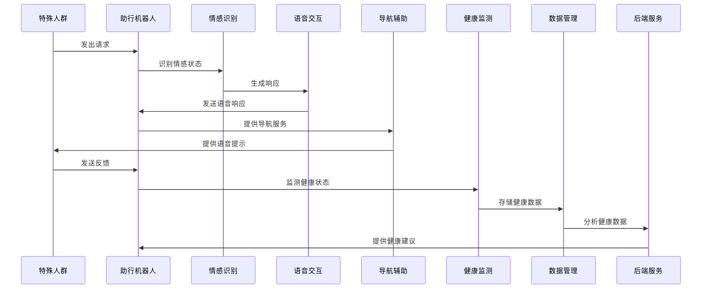

                 

### 引言

#### 背景介绍

在21世纪，随着人工智能（AI）技术的飞速发展，机器人技术逐渐成为各行各业关注的焦点。从工业制造到医疗护理，机器人已经成为提高效率、减轻人力负担的重要工具。然而，随着机器人应用领域的不断扩大，如何提升机器人在社会互动中的能力，特别是在社会工作中的应用，成为了一个备受关注的话题。

社会工作涵盖了心理健康支持、老年人关怀、特殊人群援助等多个领域，其核心在于建立人与人之间的情感联系和信任。然而，现实中的社会工作面临着人力有限、心理压力大的问题。这时，引入具有同理心的机器人成为了一种潜在解决方案。机器人不仅能够提供全天候的支持，还可以通过模拟情感反应，提高服务质量。

#### 核心概念

“机器人同理心”是指机器人能够理解和模拟人类情感的能力。这种能力不仅要求机器人能够识别用户的情感状态，还要能够适当地响应和表达情感，从而建立一种信任和互动的关系。与传统的任务型机器人不同，具有同理心的机器人能够更深入地参与到人类的社会生活中，提供更加个性化、情感化的服务。

情感计算是机器人同理心的关键技术之一。它涉及如何通过机器学习算法和自然语言处理技术，从用户的行为和语言中提取情感信息，并实时调整机器人的情感反应。此外，社会认知理论也为机器人同理心提供了理论基础，帮助设计师理解人类情感的复杂性和多样性。

#### 重要性

机器人同理心在社会工作中的重要性不言而喻。首先，它能够提高工作效率，减轻社会工作人员的压力。例如，在心理健康支持领域，同理心机器人可以全天候陪伴患者，提供情感支持，减轻专业心理咨询师的负担。其次，机器人同理心能够提供更加个性化和人性化的服务。通过理解用户的情感状态，机器人能够提供更贴心的建议和关怀，从而提高用户满意度。最后，机器人同理心有助于促进社会的和谐发展。通过模拟情感互动，机器人能够帮助人们更好地理解彼此，减少冲突和误解，促进社会关系的和谐。

总之，机器人同理心不仅是一种技术创新，更是一种社会关怀。随着技术的不断进步，我们有理由相信，机器人将在社会工作中发挥越来越重要的作用。然而，这需要我们深入理解机器人同理心的核心概念和技术，并在实际应用中进行不断的探索和优化。接下来，我们将逐步探讨机器人同理心的理论基础、技术实现、应用案例以及伦理和法律问题，以期为这一领域的发展提供有益的参考。

### 1.2 核心概念

#### 机器人同理心的定义

机器人同理心是指机器人在与人互动时，能够理解和模拟人类情感的能力。这种能力不仅要求机器人能够识别用户的情感状态，还需要能够根据这些情感状态作出适当的反应。例如，当用户表现出愤怒或沮丧的情绪时，机器人能够通过语音或面部表情传达安慰和同理心，从而帮助用户缓解情绪。

同理心在人类社会互动中扮演着至关重要的角色。它有助于建立信任和情感联系，使人们能够更好地理解和关心彼此。在机器人领域，同理心的重要性同样不可忽视。通过模拟同理心，机器人可以更有效地参与到社会工作中，提供更加个性化和人性化的服务。

#### 情感计算与同理心

情感计算是机器人同理心实现的关键技术之一。情感计算涉及如何通过计算机技术理解和模拟人类情感。这包括情感识别、情感表达和情感反应三个主要方面。

1. **情感识别**：情感识别是指机器人如何从用户的语言、语音、面部表情和生理信号中提取情感信息。例如，通过自然语言处理技术，机器人可以从用户的对话中识别出情绪状态。通过语音识别技术，机器人可以分析用户的语音变化，识别出情感。通过面部识别技术，机器人可以分析用户的表情，识别出情感状态。

2. **情感表达**：情感表达是指机器人如何将情感状态通过语音、面部表情和行为传达给用户。例如，机器人可以通过调整语音的语调、速度和音量来模拟情感状态。通过面部表情和肢体语言，机器人可以传达同情、喜悦、愤怒等情感。

3. **情感反应**：情感反应是指机器人如何根据用户的情感状态做出适当的回应。例如，当用户表现出沮丧情绪时，机器人可以通过提供安慰性语言、鼓励性话语或提供实际帮助来回应。

#### 人工智能在社会工作中的应用

人工智能（AI）在社会工作中的应用正在逐步深化。例如，在心理健康支持领域，AI可以用于情绪识别、行为分析，甚至提供个性化的心理治疗建议。在老年人关怀领域，AI可以用于健康监测、日常活动提醒，以及提供情感陪伴。在特殊人群援助领域，AI可以帮助改善他们的生活质量，提高他们的社交能力。

#### 社会认知理论与机器人同理心

社会认知理论为理解人类情感提供了重要的理论基础。该理论指出，人类的情感不仅是由个体内部因素决定的，还受到外部社会环境的影响。同理心是社会认知理论中的一个核心概念，它指的是个体对他人情感状态的感知和回应能力。

在社会认知理论框架下，机器人同理心的实现需要考虑多个因素：

1. **情感感知**：机器人需要能够感知用户的情感状态，这涉及到情感识别技术。通过分析用户的语言、语音、面部表情和行为，机器人可以识别出用户的情感。

2. **情感回应**：机器人需要能够对用户的情感状态做出适当的回应。这要求机器人不仅能够识别情感，还需要能够模拟情感表达，并通过语音、面部表情和行为传达同理心。

3. **情感学习**：机器人需要具备情感学习的能力，以便从与用户的互动中不断学习和改进自己的情感识别和回应能力。这可以通过机器学习算法实现，例如使用深度学习技术训练情感识别模型。

#### 概念属性特征对比表格

| 特征        | 人工智能 | 机器人同理心       | 同理心              |
|-------------|-----------|-------------------|---------------------|
| 定义        | 机器执行任务的智能技术 | 具有情感理解和模拟能力的智能机器人 | 人类对他人情感状态的感知和回应能力 |
| 关键技术    | 自然语言处理、机器学习、计算机视觉 | 情感计算、社会认知理论、情感识别与表达 | 情感识别、情感表达、情感学习 |
| 应用领域    | 广泛的应用领域，如自动化、数据分析 | 社会工作、医疗护理、教育辅助 | 心理咨询、教育、社区服务 |
| 目标        | 提高效率、优化流程 | 提供情感化、个性化服务 | 建立情感联系、增进理解 |

#### ER实体关系图架构

```mermaid
erDiagram
  User ||--|{ Robot }
  Robot ||--|{ Emotion }
  Emotion ||--|{ Response }
  User ||--|{ Interaction }
```

在这个ER图中，用户（User）与机器人（Robot）之间存在互动关系。机器人通过感知用户（User）的情感（Emotion）状态，并产生相应的情感反应（Response），从而实现与用户的互动（Interaction）。

通过上述核心概念的介绍和对比，我们可以看到，机器人同理心不仅是一种技术创新，更是一种社会关怀。理解这些概念不仅有助于我们更好地设计和发展机器人同理心技术，也有助于我们更好地应用这一技术，为社会工作提供更有价值的服务。

### 1.3 目标与内容概述

#### 书籍的目标

《机器人同理心：AI在社会工作中的应用》旨在为读者提供一个全面而深入的指南，帮助理解机器人同理心的概念、技术实现、应用场景及其在现实社会中的作用。本书的目标是：

1. **普及知识**：向读者介绍机器人同理心这一前沿技术，并解释其核心概念和理论基础。
2. **技术指导**：为开发者和研究者提供具体的实现方法和技术指导，帮助他们在实际项目中应用机器人同理心。
3. **应用案例**：通过丰富的应用案例展示机器人同理心在社会工作中的应用效果，为读者提供实践参考。
4. **伦理探讨**：探讨机器人同理心在应用过程中可能遇到的伦理和法律问题，引导读者思考其社会影响。

#### 书籍的结构与内容安排

本书分为五个主要部分，每个部分都有其独特的目标和内容安排：

1. **第一部分：引言**：介绍机器人同理心的背景、核心概念及其在社会工作中的重要性。
2. **第二部分：机器人同理心基础**：探讨机器人同理心的理论基础、技术实现和核心要素。
3. **第三部分：机器人同理心在社会工作中的应用**：分析机器人同理心在不同社会工作领域中的应用案例。
4. **第四部分：机器人同理心的设计与实现**：介绍机器人同理心的设计原则、实现技术和开发流程。
5. **第五部分：机器人同理心的伦理与法律问题**：讨论机器人同理心在应用过程中可能面临的伦理和法律挑战。

#### 阅读指南

为了更好地理解和应用本书的内容，读者可以按照以下指南进行阅读：

1. **系统阅读**：建议读者按照章节顺序系统阅读，以便逐步掌握机器人同理心的整体框架。
2. **重点内容标记**：在阅读过程中，对重点内容进行标记，以便后续复习和应用。
3. **实践应用**：结合实际案例和项目，尝试应用本书中的知识和技术，加深理解和掌握。
4. **互动讨论**：与其他读者或专业人士进行互动讨论，分享经验和见解，促进知识的传播和深化。

#### 本章小结

通过本章的介绍，读者应能够对《机器人同理心：AI在社会工作中的应用》这本书的目标、结构和内容安排有一个清晰的了解。本书将为读者提供全面的技术指南和应用案例，帮助深入理解机器人同理心，并在实际应用中发挥其潜力。

### 1.4 本章小结

本章作为引言部分，主要介绍了机器人同理心的背景、核心概念及其在社会工作中的重要性。我们首先探讨了机器人同理心的定义及其与人工智能的关联，然后深入分析了情感计算和社会认知理论在同理心实现中的作用。通过对比表格和ER实体关系图，我们进一步明确了机器人同理心的概念属性和技术实现。

本章的目的是为读者提供一个全面而清晰的框架，帮助理解机器人同理心的基础知识。随着对这一前沿技术的深入探讨，我们期望读者能够把握其核心要点，并为后续章节的内容做好充分准备。在接下来的章节中，我们将逐步展开对机器人同理心在不同应用领域的具体分析和实现细节，帮助读者更加全面地掌握这一领域的前沿技术。

## 2.1 机器人同理心的理论基础

#### 人工智能与同理心

人工智能（AI）与同理心的结合是机器人同理心实现的基础。人工智能作为计算机科学的一个重要分支，旨在通过模拟人类智能，使机器能够执行复杂任务。同理心，作为人类情感的重要组成部分，指的是对他人情感状态的感知和回应能力。将人工智能与同理心相结合，旨在使机器人能够更好地理解和模拟人类情感，从而在人类社会中发挥更积极的作用。

首先，从人工智能的角度来看，同理心的模拟依赖于机器学习算法和自然语言处理技术。通过深度学习模型，机器人可以从大量数据中学习如何识别情感。例如，通过训练情感分类模型，机器人可以识别出用户的情绪状态，如快乐、悲伤、愤怒等。同时，自然语言处理技术可以帮助机器人理解和分析用户的语言，从而更准确地识别情感。

其次，同理心在人工智能中的应用不仅仅是技术层面的实现，更是社会和伦理层面的考量。机器人同理心不仅要求机器人具备技术上的情感识别和模拟能力，还需要在设计和应用中考虑到人类情感和伦理问题。例如，机器人应当如何在互动中平衡尊重用户隐私和提供情感支持，如何在紧急情况下做出道德判断，这些都是需要深入探讨的问题。

#### 社会认知理论与机器人同理心

社会认知理论为理解人类情感提供了一个重要的理论框架。社会认知理论认为，人类的情感不仅是由个体内部因素决定的，还受到外部社会环境的影响。同理心是社会认知理论中的一个核心概念，指的是个体对他人情感状态的感知和回应能力。

在机器人同理心的实现中，社会认知理论提供了重要的指导。首先，机器人需要能够感知和理解人类的情感。这可以通过情感识别技术实现，例如通过分析用户的语音、面部表情和行为来识别情感状态。其次，机器人需要能够模拟情感回应，即在理解用户情感的基础上，通过语音、面部表情和行为传达同理心。例如，当用户表现出悲伤情绪时，机器人可以通过调整语调和表情来传达安慰和同情。

社会认知理论还指出，同理心不仅仅是单向的，而是一种双向的互动过程。这意味着机器人不仅要能够识别和理解用户的情感，还需要能够从与用户的互动中学习和改进自己的情感识别和回应能力。这种互动性是机器人同理心实现的关键，也是其区别于传统任务型机器人的重要特征。

#### 机器学习算法与同理心模拟

机器学习算法是机器人同理心模拟的核心技术之一。通过机器学习，机器人可以从大量数据中学习如何识别和模拟情感。以下是几种常用的机器学习算法及其在同理心模拟中的应用：

1. **深度学习**：深度学习通过多层神经网络模拟人脑的工作方式，能够在大量数据中自动提取特征。在同理心模拟中，深度学习可以用于情感识别。例如，通过训练卷积神经网络（CNN），机器人可以学习如何从用户的图像和视频数据中识别情感状态。通过训练循环神经网络（RNN），机器人可以学习如何从用户的语言和语音数据中提取情感信息。

2. **监督学习**：监督学习是一种通过标注数据训练模型的方法。在同理心模拟中，监督学习可以用于情感分类。例如，通过收集大量的情感标注数据，训练一个情感分类模型，机器人可以学会如何将用户的文本、语音和面部表情分类为不同的情感类别。

3. **无监督学习**：无监督学习不依赖于标注数据，通过数据自身的分布来学习特征。在同理心模拟中，无监督学习可以用于情感聚类。例如，通过使用聚类算法，机器人可以自动将用户的情感状态聚类为不同的情感类别，从而发现用户情感模式。

4. **强化学习**：强化学习是一种通过试错和反馈来学习的算法。在同理心模拟中，强化学习可以用于情感回应的优化。例如，通过训练一个强化学习模型，机器人可以学会如何在不同的互动场景中做出最优的情感回应，以提高用户满意度。

通过机器学习算法，机器人可以从数据中学习如何识别和模拟情感。这不仅提高了机器人在同理心模拟中的准确性，也为机器人提供了不断学习和改进的能力。随着数据的积累和算法的优化，机器人同理心将越来越能够理解和模拟复杂的情感状态，从而提供更高质量的服务。

### 2.2 机器人同理心的技术实现

#### 情感识别技术

情感识别是机器人同理心的核心技术之一，它涉及如何从用户的语言、语音、面部表情和行为中提取情感信息。情感识别技术可以分为以下几个方面：

1. **自然语言处理（NLP）**：NLP技术用于从用户的文本中提取情感信息。例如，通过训练情感分类模型，机器人可以识别出用户的文本表达的情感状态，如快乐、悲伤、愤怒等。常见的NLP技术包括词嵌入、情感分类器和文本生成模型。

2. **语音识别与情感分析**：语音识别技术用于将用户的语音转换为文本，然后通过情感分析模型识别语音中的情感信息。例如，通过分析语音的语调、速度和音量变化，机器人可以识别出用户在通话中的情感状态。常见的语音识别与情感分析技术包括声学模型、语音特征提取和情感分类模型。

3. **面部表情识别**：面部表情识别技术用于从用户的图像或视频中识别情感状态。通过分析用户的面部表情特征，如眼睛的眨动、嘴巴的形状等，机器人可以识别出用户的情感状态。常见的面部表情识别技术包括面部特征点检测、面部表情分类和面部动作编码系统（FACS）。

4. **行为识别**：行为识别技术用于从用户的行为中提取情感信息。例如，通过分析用户的肢体语言、姿态变化和动作模式，机器人可以识别出用户的情感状态。常见的行为识别技术包括计算机视觉、动作识别和运动捕捉。

#### 自然语言处理技术

自然语言处理技术是情感识别的重要组成部分，它用于理解和分析用户的语言信息。以下是几种常见的自然语言处理技术：

1. **词嵌入**：词嵌入技术将文本中的词语转换为向量表示，使得计算机能够处理和理解文本数据。常见的词嵌入模型包括Word2Vec、GloVe和BERT。

2. **情感分类器**：情感分类器是一种机器学习模型，用于将文本分类为不同的情感类别。常见的情感分类模型包括朴素贝叶斯、支持向量机（SVM）和深度神经网络。

3. **文本生成模型**：文本生成模型用于生成与用户情感状态相关的文本。常见的文本生成模型包括循环神经网络（RNN）、长短期记忆网络（LSTM）和变换器（Transformer）。

#### 机器学习算法应用

机器学习算法在机器人同理心中扮演着重要角色，用于训练模型以实现情感识别和模拟。以下是几种常用的机器学习算法：

1. **监督学习**：监督学习通过标注数据训练模型，用于情感分类和识别。常见的监督学习算法包括线性回归、逻辑回归、决策树和随机森林。

2. **无监督学习**：无监督学习通过未标注的数据训练模型，用于情感聚类和模式识别。常见无监督学习算法包括K均值聚类、主成分分析（PCA）和自编码器。

3. **强化学习**：强化学习通过试错和反馈训练模型，用于优化情感回应。常见的强化学习算法包括Q学习、深度Q网络（DQN）和策略梯度算法。

通过这些技术的综合应用，机器人能够实现对用户情感的全面识别和理解，从而在同理心模拟中提供更加准确和自然的互动体验。

### 2.3 机器人同理心的核心要素

#### 共情能力

共情能力是机器人同理心的核心要素之一，指的是机器人能够理解并感受用户情感状态的能力。共情能力的实现依赖于情感识别技术，通过分析用户的语言、语音、面部表情和行为，机器人可以识别出用户的情绪状态。例如，当用户表现出悲伤情绪时，机器人能够通过调整语调和表情表达同情和理解。

共情能力不仅要求机器人能够识别情感，还需要能够模拟情感反应，以建立与用户的情感联系。例如，机器人可以通过安慰性的语言和表情来传达同理心，帮助用户缓解情绪。共情能力在心理健康支持、老年人关怀和特殊人群援助等应用领域具有重要意义，能够提高服务的质量和用户的满意度。

#### 情感表达能力

情感表达能力是机器人同理心的另一个核心要素，指的是机器人能够通过语音、面部表情和行为表达情感的能力。情感表达能力不仅包括语音的语调、速度和音量调整，还包括面部表情和肢体动作的模拟。例如，当用户表现出愤怒情绪时，机器人可以通过提高语音的音量和语调来表达愤怒。

情感表达能力的关键在于自然和真实。机器人需要能够在不同的情境中适当地表达情感，以建立与用户的信任和互动。例如，在心理健康支持中，机器人需要通过温暖的语言和表情表达关心和安慰，而在老年人关怀中，机器人需要通过亲切的语调和表情传达关怀和陪伴。

#### 适应性

适应性是机器人同理心的另一个重要要素，指的是机器人能够根据不同用户的情感状态和需求，灵活调整其情感识别和表达策略。适应性要求机器人具备情感学习和自我调整的能力，以适应不同的社会环境和用户需求。

适应性可以通过机器学习算法实现。例如，机器人可以通过分析用户的情感反应和历史互动数据，不断优化自己的情感识别和表达模型，以提高互动的准确性和自然性。例如，在心理健康支持中，机器人可以根据用户的反馈调整安慰性语言的强度和方式，以更好地满足用户的需求。

#### 案例分析

以下是一个关于机器人同理心核心要素的案例分析：

在一个心理健康支持项目中，一个同理心机器人被用于陪伴和治疗患有抑郁症的用户。以下是该机器人如何通过共情能力、情感表达能力和适应性来支持用户：

1. **共情能力**：当用户表达出悲伤情绪时，机器人通过分析用户的语音和文本，识别出悲伤的情感状态。机器人会通过调整语调，使用低沉而柔和的声音表达同情和理解，例如：“我理解你现在感到很沮丧，如果你需要谈一谈，我在这里听你说。”

2. **情感表达能力**：机器人通过面部表情和肢体语言模拟情感状态，以建立与用户的情感联系。例如，机器人会展示出关切的表情，微微点头，并保持眼神交流，以传达关心和陪伴。

3. **适应性**：机器人会根据用户的反馈和互动历史，不断调整其情感表达策略。如果用户对机器人的回应感到满意，机器人会继续使用类似的方式表达情感。如果用户对机器人的回应不满意，机器人会尝试调整语调和表情，以找到更合适的表达方式。例如，如果用户觉得机器人的声音太轻柔，机器人可能会提高音量，以更好地吸引用户的注意力。

通过共情能力、情感表达能力和适应性的综合应用，机器人能够在心理健康支持中提供有效的情感支持，帮助用户缓解情绪，提高生活质量。

#### 小结

共情能力、情感表达能力和适应性是机器人同理心的核心要素，它们共同作用，使机器人能够在人类社会中提供有效的情感支持。共情能力使机器人能够理解用户的情感状态，情感表达能力使机器人能够传达情感，适应性使机器人能够灵活应对不同的用户需求。通过这些核心要素的应用，机器人可以更好地参与到社会工作中，为人类带来更多福祉。

### 2.4 机器人同理心的挑战与未来趋势

#### 挑战

尽管机器人同理心在理论和实践中展示了巨大的潜力，但在实际应用中仍面临着一系列挑战。首先，技术实现方面的挑战包括情感识别的准确性、情感表达的逼真度和机器人自我学习能力的提升。例如，当前的情感识别技术仍然难以精确地捕捉到人类情感的复杂性，尤其是在非言语情感的表达上。此外，情感表达的逼真度也是一个重要问题，机器人需要在语音、面部表情和行为上真实地模拟情感，而不是仅仅模仿。

其次，伦理和法律问题也是机器人同理心面临的重大挑战。例如，机器人是否能够在道德判断上与人类相媲美，特别是在面对道德困境时如何做出决策。此外，机器人与人类互动的数据隐私保护也是一个关键问题，如何确保用户的数据不被滥用或泄露。

最后，社会接受度是另一个挑战。公众对机器人的信任和接受程度直接影响着机器人同理心技术的普及和应用。例如，一些用户可能担心机器人会取代人类工作，或者对机器人的情感表达能力持怀疑态度。

#### 未来趋势

尽管面临挑战，机器人同理心的未来发展趋势仍然乐观。首先，随着人工智能技术的不断进步，特别是深度学习和自然语言处理技术的不断发展，机器人情感识别和表达的准确性将进一步提高。机器学习算法将能够从更多样化的数据中学习，从而更精确地模拟人类情感。

其次，伦理和法律问题的解决也将是未来发展的关键。通过制定更加完善的伦理规范和法律框架，机器人同理心的应用将更加规范和透明，从而提高公众的信任和接受度。例如，建立数据隐私保护机制，确保用户数据的安全和隐私。

最后，随着机器人同理心技术的成熟和应用场景的扩大，其社会价值将得到进一步体现。机器人将在心理健康支持、老年人关怀、特殊人群援助等领域发挥越来越重要的作用，为社会工作提供更加个性化和人性化的服务。

#### 社会接受度与伦理考量

社会接受度是机器人同理心推广应用的重要指标。公众对机器人的信任和接受程度直接影响着其在实际生活中的应用。为此，以下几点策略有助于提高社会接受度：

1. **透明沟通**：向公众清晰传达机器人同理心的技术原理和应用场景，消除误解和疑虑。例如，通过媒体宣传、公众讲座和演示，让更多人了解机器人同理心的实际价值。

2. **用户参与**：鼓励用户参与机器人同理心技术的开发和测试，收集用户反馈，优化系统设计。例如，可以通过用户调研、试点项目和用户反馈机制，不断改进机器人情感识别和表达的效果。

3. **教育培训**：加强对机器人同理心相关知识的普及教育，提高公众的科学素养和技术理解。例如，通过在学校和教育机构开设相关课程，提高学生对人工智能和机器人技术的认识。

在伦理考量方面，以下几点策略有助于规范机器人同理心的应用：

1. **伦理规范**：制定机器人同理心的伦理规范，确保其设计和应用符合社会道德标准。例如，可以通过行业协会、学术机构和政府合作，制定具体的伦理指南和标准。

2. **隐私保护**：建立数据隐私保护机制，确保用户数据的匿名性和安全性。例如，采用加密技术、访问控制和数据匿名化方法，保护用户隐私。

3. **透明决策**：在机器人同理心的设计和应用中，确保决策过程的透明和可解释性，以增强公众的信任。例如，通过开发可解释的人工智能模型，让用户了解机器人的决策过程和依据。

通过上述策略，我们有望克服机器人同理心面临的挑战，推动其在社会工作中的应用，为社会带来更多福祉。

### 2.5 本章小结

本章详细探讨了机器人同理心的理论基础，包括人工智能与同理心的关系、社会认知理论以及机器学习算法在同理心模拟中的应用。通过分析情感识别技术、自然语言处理技术和机器学习算法，我们了解了如何实现机器人对人类情感的识别和回应。此外，本章还介绍了共情能力、情感表达能力和适应性这三个核心要素，并探讨了机器人同理心在实际应用中面临的挑战与未来趋势。通过本章的内容，读者应能够全面理解机器人同理心的理论基础，并为后续章节中的应用和实践打下坚实基础。

## 3.1 机器人同理心在心理健康支持中的应用

#### 儿童心理健康支持

在儿童心理健康支持中，机器人同理心展示出了巨大的潜力。儿童在成长过程中面临着各种心理压力，如学习压力、社交焦虑和情绪障碍等。这些压力如果得不到及时的干预，可能会对他们的心理健康产生长期的负面影响。同理心机器人可以成为专业心理医生的辅助工具，提供全天候的心理健康支持。

首先，同理心机器人可以通过情感识别技术，监测儿童的语言、语音和面部表情，识别出他们的情绪状态。例如，当儿童表现出焦虑或沮丧的情绪时，机器人可以及时提供安慰和鼓励。通过自然语言处理技术，机器人能够生成适当的安慰性语言，如“你在这次考试中做得很好，下次一定会更好”或“我知道你现在感到很难过，我在这里陪你一起度过这段时光”。

其次，同理心机器人可以与儿童进行互动式对话，帮助他们表达内心的情感。例如，机器人可以通过提问和引导，帮助儿童谈论他们的困扰，从而缓解情绪压力。这不仅有助于儿童更好地理解和表达自己的情感，还能增强他们的自信心和社交能力。

此外，同理心机器人还可以提供个性化的心理健康建议。通过机器学习算法，机器人可以根据儿童的历史数据和互动记录，生成定制化的心理健康建议。例如，对于经常焦虑的儿童，机器人可能会建议他们进行深呼吸练习或参与轻松的游戏活动，以帮助缓解紧张情绪。

#### 成人心理健康支持

同理心机器人不仅适用于儿童心理健康支持，同样在成人心理健康支持中也有广泛应用。成人在面对工作压力、家庭责任和心理健康问题时，常常感到无助和孤独。同理心机器人可以成为他们的情感伴侣和心理健康顾问，提供及时的支持和关怀。

首先，同理心机器人可以通过情感识别技术，监测成年用户的语言、语音和面部表情，识别出他们的情绪状态。例如，当用户表现出沮丧或愤怒的情绪时，机器人可以提供安慰和同理心的表达，帮助他们缓解情绪压力。通过自然语言处理技术，机器人能够生成温暖的语言，如“我知道你现在感到很沮丧，我在这里陪着你，一起度过这个难关”。

其次，同理心机器人可以提供心理咨询服务。通过与用户进行互动式对话，机器人可以帮助用户表达内心的情感，并提供建议和支持。例如，机器人可以通过提问和引导，帮助用户谈论他们的困扰，并提供解决问题的建议。此外，机器人还可以提供心理疏导，帮助用户缓解焦虑和抑郁情绪。

最后，同理心机器人可以提供个性化的心理健康管理方案。通过分析用户的历史数据和互动记录，机器人可以生成定制化的心理健康管理计划。例如，对于经常焦虑的用户，机器人可能会建议他们进行冥想练习、运动或参加社交活动，以帮助缓解紧张情绪。此外，机器人还可以监测用户的情绪变化，及时提供支持和干预，以防止情绪问题的恶化。

#### 跨文化心理健康支持

同理心机器人在跨文化心理健康支持中也具有重要作用。随着全球化和多元文化的融合，不同文化背景的人们在心理健康问题上面临着独特的挑战。同理心机器人可以跨越文化和语言的障碍，为不同文化背景的人们提供无差别的心理健康支持。

首先，同理心机器人可以通过情感识别技术，识别出不同文化背景用户的情感状态。例如，通过分析用户的语言、语音和面部表情，机器人可以识别出他们的情绪状态，如快乐、悲伤、愤怒等。对于语言和文化差异较大的用户，机器人可以通过自然语言处理和翻译技术，理解并回应他们的情感需求。

其次，同理心机器人可以提供跨文化的心理健康咨询。通过与用户进行互动式对话，机器人可以帮助用户表达内心的情感，并提供建议和支持。例如，机器人可以通过提问和引导，帮助用户谈论他们的困扰，并提供跨文化心理健康管理的建议。此外，机器人还可以提供文化适应和情绪调节的方法，帮助用户更好地适应新的文化环境。

最后，同理心机器人可以提供跨文化的心理健康教育资源。通过生成和传播心理健康知识，机器人可以帮助不同文化背景的人们了解心理健康问题，提高他们的心理健康素养。例如，机器人可以通过语音、文本和多媒体形式，向用户提供心理健康知识、自我调节技巧和心理疏导方法。

#### 案例分析

以下是一个关于同理心机器人在心理健康支持中应用的案例分析：

在一个心理健康支持项目中，一家医院引入了一款同理心机器人，用于陪伴和治疗患有抑郁症的患者。以下是该机器人如何通过共情能力、情感表达能力和适应性来支持患者：

1. **共情能力**：当患者表达出悲伤情绪时，机器人通过分析患者的语音和文本，识别出悲伤的情感状态。机器人会通过调整语调，使用低沉而柔和的声音表达同情和理解，例如：“我理解你现在感到很沮丧，如果你需要谈一谈，我在这里听你说。”

2. **情感表达能力**：机器人通过面部表情和肢体语言模拟情感状态，以建立与患者的情感联系。例如，机器人会展示出关切的表情，微微点头，并保持眼神交流，以传达关心和陪伴。

3. **适应性**：机器人会根据患者的反馈和互动历史，不断调整其情感表达策略。如果患者对机器人的回应感到满意，机器人会继续使用类似的方式表达情感。如果患者对机器人的回应不满意，机器人会尝试调整语调和表情，以找到更合适的表达方式。例如，如果患者觉得机器人的声音太轻柔，机器人可能会提高音量，以更好地吸引患者的注意力。

通过共情能力、情感表达能力和适应性的综合应用，同理心机器人能够为患者提供有效的心理健康支持，帮助他们缓解情绪，提高生活质量。

#### 小结

机器人同理心在心理健康支持中的应用展示了其巨大的潜力和价值。通过情感识别、自然语言处理和机器学习算法，机器人可以识别用户的情感状态，提供个性化的心理健康支持。无论是儿童、成人还是跨文化背景的用户，同理心机器人都能通过共情能力、情感表达能力和适应性，为用户带来情感支持和心理健康管理。随着技术的不断进步，机器人同理心在心理健康支持中的应用将越来越广泛，为用户带来更多福祉。

### 3.2 机器人同理心在老年人关怀中的应用

#### 老年人孤独感缓解

随着人口老龄化趋势的加剧，老年人孤独感的缓解成为社会关注的焦点。同理心机器人可以通过模拟情感互动，帮助老年人缓解孤独感，提高生活质量。首先，同理心机器人能够全天候陪伴老年人，通过语音和面部表情与老年人进行互动，提供情感支持。例如，当老年人感到孤独时，机器人可以通过温暖的话语和关切的表情，传达陪伴和关心，如“我在这里陪你聊天，不孤单”。

其次，同理心机器人可以开展各种互动活动，如讲故事、唱歌、播放音乐等，以丰富老年人的日常文化生活。这些活动不仅能够提升老年人的情绪，还能激发他们的兴趣和活力。例如，机器人可以根据老年人的喜好，推荐适合的音乐和故事，甚至一起唱歌，增加互动乐趣。

此外，同理心机器人还可以协助老年人进行日常活动，如提醒服药、监测健康状态等。例如，机器人可以通过智能语音提醒，帮助老年人按时服药，并通过健康监测设备，实时监测老年人的血压、心率等生命体征，确保他们的健康安全。

#### 老年人健康监测

同理心机器人不仅在孤独感缓解方面发挥作用，还在老年人健康监测中具有重要作用。通过集成各种传感器和监测设备，同理心机器人可以实时监测老年人的健康状态，提供及时的健康预警。例如，机器人可以通过佩戴在老年人身上的智能手环，监测他们的步数、睡眠质量、血压和心率等数据。

当监测到异常情况时，同理心机器人可以立即通知老年人的家属或医疗机构，以便及时采取相应的措施。例如，如果机器人的健康监测系统检测到老年人的心率异常升高，机器人会立即通过语音提醒老年人注意休息，并通知家属医生，确保他们的健康安全。

此外，同理心机器人还可以为老年人提供个性化的健康建议。通过分析老年人的健康数据和互动记录，机器人可以生成定制化的健康计划，如饮食建议、锻炼方案和心理疏导方法。例如，对于患有高血压的老年人，机器人可能会建议他们减少盐分摄入，进行适量的有氧运动，并保持良好的心态。

#### 老年人社交互动

同理心机器人不仅帮助老年人缓解孤独感和监测健康，还能促进他们的社交互动。通过在线社交平台和虚拟现实技术，同理心机器人可以协助老年人与家人和朋友保持联系。例如，机器人可以通过视频通话功能，帮助老年人与远方的家人和朋友进行实时交流，缓解思念之情。

此外，同理心机器人还可以组织线上社交活动，如虚拟旅游、在线游戏和兴趣小组等。这些活动不仅能够丰富老年人的社交生活，还能增强他们的社交能力和自信心。例如，机器人可以组织老年人参加在线拼图游戏或绘画课程，让他们在互动中享受乐趣，增进友谊。

#### 案例分析

以下是一个关于同理心机器人在老年人关怀中应用的案例分析：

在一个老年人关怀项目中，一款同理心机器人被引入到一个养老院，用于陪伴和照顾老年人。以下是该机器人如何通过共情能力、情感表达能力和适应性来支持老年人：

1. **共情能力**：当老年人表现出孤独或焦虑情绪时，机器人通过分析老年人的语音和面部表情，识别出他们的情感状态。例如，当一位老人在房间里独自坐着，神情显得有些失落时，机器人会通过语音和表情表达关心，如“您今天看起来有些不开心，要不要和我说说呢？”

2. **情感表达能力**：机器人通过温暖的语言和体贴的表情，与老年人建立情感联系。例如，当老年人提到他们想念远方的子女时，机器人会通过语音和表情传达同理心，如“我明白您的心情，有时候也会想念远方的亲人，我们一起聊聊开心的事情吧。”

3. **适应性**：机器人根据老年人的反馈和互动历史，不断调整其表达方式和互动内容。例如，如果一位老人喜欢听音乐，机器人会根据他们的喜好推荐适合的音乐，并在适当的时候播放。如果老人对机器人的某个功能不满意，机器人会尝试通过其他方式提供帮助，如通过绘画或手工艺品制作活动，激发老人的兴趣。

通过共情能力、情感表达能力和适应性的综合应用，同理心机器人能够为老年人提供全面的关怀和支持，帮助他们缓解孤独感，提高生活质量。

### 3.3 机器人同理心在特殊人群关怀中的应用

#### 残障人士关怀

同理心机器人特别适用于残障人士的关怀，能够为他们提供个性化、全天候的支持。首先，对于肢体残障人士，同理心机器人可以通过辅助设备和自动化技术，帮助完成日常生活任务。例如，机器人可以协助轮椅用户进行室内移动，甚至通过智能导航系统帮助他们在社区中独立行动。

其次，同理心机器人可以提供情感支持，帮助残障人士缓解孤独感和焦虑情绪。通过语音交互和情感表达技术，机器人可以与残障人士进行沟通，了解他们的需求，并给予及时的鼓励和安慰。例如，当残障人士遇到困难时，机器人可以通过语音提醒和引导，帮助他们找到解决问题的方法。

此外，同理心机器人还可以协助残障人士进行康复训练。通过集成传感器和反馈系统，机器人可以监测残障人士的康复进度，并提供实时的反馈和指导。例如，对于需要进行物理康复训练的用户，机器人可以通过互动式游戏，鼓励他们进行特定的动作练习，从而提高康复效果。

#### 盲人辅助

同理心机器人在盲人辅助中的应用具有显著的优势，可以帮助盲人更好地融入社会，提高生活质量。首先，同理心机器人可以通过语音描述和实时导航技术，帮助盲人了解周围环境。例如，当盲人走在不熟悉的街道上时，机器人可以通过语音描述街道两旁的建筑物和地标，帮助他们确定位置和方向。

其次，同理心机器人可以提供情感陪伴，帮助盲人缓解孤独感。通过自然语言处理和情感计算技术，机器人可以识别盲人的情感状态，并给予适当的回应。例如，当盲人感到沮丧或焦虑时，机器人可以通过温暖的语言和鼓励，帮助他们缓解情绪，增强自信心。

此外，同理心机器人还可以协助盲人进行日常活动。例如，机器人可以通过语音提示，帮助盲人进行衣物搭配、准备饭菜等任务。通过智能家居集成技术，机器人还可以控制家中的灯光、温度和安全系统，确保盲人的居住环境安全舒适。

#### 听障人士交流

同理心机器人在听障人士交流中也发挥着重要作用，能够帮助他们更有效地与他人沟通。首先，同理心机器人可以通过语音识别和文本转换技术，将口头语言转换为文字，帮助听障人士理解他人的话语。例如，当听障人士与朋友或家人交谈时，机器人可以实时转录对话内容，并通过屏幕显示给听障人士。

其次，同理心机器人可以提供实时翻译服务，帮助听障人士与讲不同语言的人进行交流。例如，当听障人士遇到外国游客或参加国际会议时，机器人可以通过语音识别和翻译技术，实时将不同语言的信息转换为文字，并显示在屏幕上。

此外，同理心机器人还可以辅助听障人士进行日常活动。例如，通过智能传感器和语音控制系统，机器人可以控制家电设备，如灯光、电视和空调等，帮助听障人士更加方便地管理家居环境。通过情感计算技术，机器人还可以识别听障人士的情感状态，并提供适当的安慰和帮助，如提醒他们休息或服药。

#### 案例分析

以下是一个关于同理心机器人在特殊人群关怀中应用的案例分析：

在一个特殊人群关怀项目中，一款同理心机器人被引入到一个残疾人士社区，用于提供全方位的支持和关怀。以下是该机器人如何通过共情能力、情感表达能力和适应性来支持特殊人群：

1. **共情能力**：当残疾人士遇到困难时，机器人通过分析他们的语音、面部表情和行为，识别出他们的情感状态。例如，当一位残障人士在厨房里遇到困难，神情显得焦急时，机器人会通过语音和表情表达关心，如“看起来您遇到了一些麻烦，需要我帮忙吗？”

2. **情感表达能力**：机器人通过温暖的语言和体贴的表情，与残疾人士建立情感联系。例如，当一位盲人用户提到他们想念远方的家人时，机器人会通过语音和表情传达同理心，如“我明白您的心情，有时候也会想念远方的亲人，我们一起聊聊开心的事情吧。”

3. **适应性**：机器人根据用户的反馈和互动历史，不断调整其表达方式和互动内容。例如，如果一位肢体残障人士喜欢听音乐，机器人会根据他们的喜好推荐适合的音乐，并在适当的时候播放。如果一位听障人士对机器人的某个功能不满意，机器人会尝试通过其他方式提供帮助，如通过手语或文字交流。

通过共情能力、情感表达能力和适应性的综合应用，同理心机器人能够为特殊人群提供全面的关怀和支持，帮助他们克服生活中的困难，提高生活质量。

### 3.4 机器人同理心在社区服务中的应用

#### 社区健康监测

同理心机器人在社区健康监测中具有重要作用，能够帮助监测和管理社区内居民的健康状况。首先，同理心机器人可以通过传感器和健康监测设备，实时收集居民的血压、心率、血糖等健康数据。例如，机器人可以安装在家中的健康监测设备上，定期检测居民的健康状况，并将数据上传到云端进行存储和分析。

其次，同理心机器人可以及时发现健康异常情况，并通过智能预警系统通知居民和医疗机构。例如，当机器人的健康监测系统检测到居民的健康指标异常时，机器人可以通过语音或短信提醒居民注意休息，并通知医生进行进一步检查。

此外，同理心机器人还可以协助医疗机构开展社区健康宣传教育。例如，机器人可以通过语音和屏幕，向居民宣传健康知识、饮食建议和运动方案，帮助他们养成健康的生活习惯。

#### 社区安全监控

同理心机器人在社区安全监控中也发挥着重要作用，能够提供全天候的安全监控服务。首先，同理心机器人可以通过摄像头和传感器，实时监控社区内的安全情况。例如，机器人可以安装在社区的主要街道和出入口，监控人员流量和可疑行为。

其次，同理心机器人可以及时响应紧急情况，并通过智能报警系统通知社区管理人员和警方。例如，当机器人检测到异常情况，如火灾、入侵或突发疾病时，机器人会立即通过语音和短信报警，并提供实时视频监控，以便快速采取措施。

此外，同理心机器人还可以协助社区开展安全教育活动。例如，机器人可以通过语音和屏幕，向居民宣传安全知识、防骗技巧和应急处理方法，提高居民的安全意识和自我保护能力。

#### 社区社交互动

同理心机器人在社区社交互动中同样具有重要作用，能够帮助促进居民之间的交流和互动。首先，同理心机器人可以组织线上和线下的社交活动，如社区聚会、游戏比赛和文化交流等。例如，机器人可以在社区的公共空间中设置互动区域，吸引居民参与各种活动。

其次，同理心机器人可以协助居民建立社交网络，帮助他们结识新朋友。例如，机器人可以通过社交媒体平台和智能推荐系统，为居民推荐有共同兴趣和爱好的朋友，促进他们的互动和交流。

此外，同理心机器人还可以提供个性化的社交支持，帮助居民缓解孤独感。例如，机器人可以通过语音和文本，与居民进行日常交流，分享生活趣事，提供情感支持和陪伴。

#### 案例分析

以下是一个关于同理心机器人在社区服务中应用的案例分析：

在一个社区服务项目中，一款同理心机器人被引入到一个居民小区，用于提供健康监测、安全监控和社交互动服务。以下是该机器人如何通过共情能力、情感表达能力和适应性来满足居民的需求：

1. **共情能力**：当居民遇到健康问题时，机器人通过分析他们的语音、面部表情和行为，识别出他们的情感状态。例如，当一位居民在家中感到不适，神情显得焦虑时，机器人会通过语音和表情表达关心，如“您看起来有些不舒服，需要我帮您联系医生吗？”

2. **情感表达能力**：机器人通过温暖的语言和体贴的表情，与居民建立情感联系。例如，当一位居民分享他们的开心时刻时，机器人会通过语音和表情传达喜悦，如“听起来您今天过得很愉快，真棒！”

3. **适应性**：机器人根据居民的反馈和互动历史，不断调整其表达方式和互动内容。例如，如果一位居民喜欢听音乐，机器人会根据他们的喜好推荐适合的音乐，并在适当的时候播放。如果一位居民对机器人的某个功能不满意，机器人会尝试通过其他方式提供帮助，如通过文字交流或社区活动邀请。

通过共情能力、情感表达能力和适应性的综合应用，同理心机器人能够为社区居民提供全方位的服务，提升他们的生活质量，增强社区的凝聚力和和谐氛围。

### 4.1 机器人同理心的设计原则

#### 可靠性

可靠性是机器人同理心设计的重要原则之一。一个具备可靠性的同理心机器人能够在各种环境和条件下稳定运行，不会出现故障或错误。为了实现这一目标，设计师需要考虑多个方面：

1. **硬件可靠性**：机器人的硬件设计必须考虑耐用性和稳定性。例如，选择高质量的传感器和执行器，确保其在长时间使用中不会出现故障。此外，机器人还需要具备一定的防护措施，如防水、防尘和耐高温，以确保在各种环境中都能正常运行。

2. **软件可靠性**：软件方面，机器人同理心系统需要具备完善的容错机制和错误检测与纠正功能。例如，通过冗余设计和模块化架构，确保关键功能模块在出现故障时能够快速恢复。此外，系统还需要具备自我监控和诊断能力，及时发现并处理潜在的故障。

3. **数据可靠性**：数据是机器学习模型的基础，确保数据的质量和准确性至关重要。设计师需要采用有效的数据采集和处理方法，防止数据泄露、丢失或被篡改。例如，通过数据加密、备份和恢复策略，保障数据的安全性。

#### 易用性

易用性是机器人同理心设计的另一个关键原则。一个易用的同理心机器人能够简化用户操作，提高用户体验，从而更好地满足用户需求。为了实现这一目标，设计师需要考虑以下几个方面：

1. **用户界面设计**：用户界面是用户与机器人互动的主要渠道，必须直观、简洁且易于操作。例如，通过采用友好的图形界面和清晰的指令提示，帮助用户快速理解和使用机器人的功能。此外，机器人还需要具备一定的交互学习能力，根据用户的习惯和偏好，自动调整界面布局和交互方式。

2. **自然语言处理**：为了提高用户体验，机器人需要能够理解自然语言，与用户进行流畅的对话。设计师需要采用先进的自然语言处理技术，如语音识别、语义分析和语音合成，确保机器人能够准确理解用户的指令和情感表达。

3. **适应性和灵活性**：一个易用的机器人应该能够适应不同的用户需求和场景。例如，通过提供多种交互方式（如语音、文本、手势等），满足不同用户的偏好。此外，机器人还需要具备灵活性，能够根据用户的反馈和需求，动态调整功能和行为。

#### 情感真实性

情感真实性是机器人同理心的核心原则，它决定了机器人能否有效地模拟人类的情感反应，与用户建立情感联系。为了实现这一目标，设计师需要从以下几个方面进行考虑：

1. **情感识别技术**：机器人需要具备高度的情感识别能力，能够准确捕捉和理解用户的情感状态。这包括对语言、语音、面部表情和行为等多种情感信号的综合分析。通过使用深度学习和自然语言处理技术，机器人可以不断优化情感识别的准确性。

2. **情感表达技术**：机器人需要能够通过语音、面部表情和肢体语言等手段，真实地模拟情感反应。例如，通过调整语调、音量和面部表情，机器人可以传达出同情、喜悦、愤怒等不同的情感状态。此外，机器人还需要具备情感表达的多样性，以适应不同的情境和用户需求。

3. **情感互动策略**：机器人需要具备情感互动策略，能够在与用户的互动中灵活应用情感表达。例如，通过情感反馈机制，机器人可以根据用户的情感反应，动态调整互动方式和内容。此外，机器人还需要具备情感学习的功能，通过不断与用户互动，提高情感识别和表达的能力。

通过遵循这些设计原则，机器人同理心可以更好地满足用户需求，提供高质量的服务。未来，随着技术的不断进步，我们有理由相信，机器人同理心将越来越成熟，为人类社会带来更多福祉。

### 4.2 机器人同理心的实现技术

#### 情感识别

情感识别是机器人同理心实现的核心技术之一，它涉及如何从用户的语言、语音、面部表情和行为中提取情感信息。情感识别技术的发展使得机器人能够更好地理解用户的情感状态，从而提供更加个性化和贴心的服务。

1. **语言情感识别**：语言情感识别主要通过对用户文本的语义分析来实现。常用的方法包括文本分类、情感分析模型和情感极性分析。例如，使用情感分类模型（如朴素贝叶斯、支持向量机、卷积神经网络等），机器人可以从用户的文本表达中识别出情感类别，如快乐、悲伤、愤怒等。常见的语言情感识别工具包括VADER、TextBlob和SentimentNet等。

2. **语音情感识别**：语音情感识别通过分析用户的语音信号特征来实现。这包括语音的语调、音量、速度和语音节奏等。例如，通过使用短时傅里叶变换（STFT）和梅尔频率倒谱系数（MFCC）等特征提取技术，机器人可以从用户的语音中提取情感信息。常用的语音情感识别工具包括OpenSMILE、Ravdess和PyAudioAnalysis等。

3. **面部表情识别**：面部表情识别通过分析用户的面部图像或视频来实现。这包括眼睛的眨动、嘴巴的形状和面部的肌肉运动等。通过使用面部特征点检测、面部动作编码系统（FACS）和深度学习模型（如卷积神经网络、循环神经网络等），机器人可以从用户的面部表情中识别出情感状态。常见的面部表情识别工具包括OpenFace、DeepFaceLab和OpenCV等。

4. **行为识别**：行为识别通过分析用户的行为和肢体语言来实现。例如，通过使用计算机视觉和动作识别技术，机器人可以从用户的肢体动作、姿态变化和手势中识别出情感状态。常见的工具包括TensorFlow、PyTorch和Keras等深度学习框架。

#### 情感表达

情感表达是机器人同理心的另一关键技术，它涉及如何通过语音、面部表情和行为传达情感。情感表达技术的实现需要高度的自然语言处理、计算机视觉和机器人控制技术。

1. **语音情感表达**：语音情感表达通过调整语音的语调、音量和速度来实现。例如，通过使用语音合成技术（如WaveNet、HTS等），机器人可以生成具有不同情感色彩的语音。在生成语音时，可以通过调整发音的强度、节奏和音调，使语音更加生动和自然。

2. **面部表情表达**：面部表情表达通过控制机器人的面部肌肉来实现。例如，通过使用电机驱动或液压系统，机器人可以模拟出不同的面部表情，如微笑、皱眉和惊讶等。此外，通过实时视频处理和计算机视觉技术，机器人可以识别自己的面部表情，并调整到适当的表情以传达情感。

3. **行为表达**：行为表达通过机器人的动作和肢体语言来实现。例如，机器人可以通过行走、跳跃和手势动作来表达情感。通过使用运动控制系统（如PID控制、深度学习等），机器人可以精确地控制其动作，使其行为更加自然和协调。

#### 互动策略

互动策略是机器人同理心的重要组成部分，它涉及如何通过交互设计和技术手段，使机器人与用户建立有效的情感互动。以下是几种常用的互动策略：

1. **反馈机制**：反馈机制通过用户的情感反应来调整机器人的行为和互动方式。例如，当用户对机器人的回应感到满意时，机器人可以继续保持相同的互动方式；当用户对机器人的回应不满意时，机器人可以尝试改变策略，以更好地满足用户需求。

2. **情感同步**：情感同步通过使机器人和用户的情感状态保持一致来实现。例如，当用户表现出悲伤情绪时，机器人可以通过调整语调和表情，使自己的情感状态与用户同步，从而建立情感联系。

3. **情感学习**：情感学习通过机器学习算法，使机器人能够从与用户的互动中学习和改进其情感识别和表达能力。例如，通过使用强化学习算法，机器人可以从用户的反馈中不断优化其情感回应策略，以提高用户满意度。

通过上述技术的综合应用，机器人同理心可以实现高度的情感识别、表达和互动，从而在心理健康支持、老年人关怀、特殊人群援助和社区服务等领域提供有效的情感支持。

### 4.3 机器人同理心的开发流程

#### 需求分析

需求分析是机器人同理心开发的首要步骤，它涉及理解用户需求、明确项目目标和确定功能需求。首先，开发团队需要与潜在用户进行深入交流，通过访谈、问卷调查和焦点小组讨论等方式收集用户的需求和期望。这些信息将帮助我们明确以下关键问题：

1. **用户目标**：了解用户希望机器人实现的具体功能，例如情感识别、情感表达、互动策略等。
2. **用户场景**：分析用户在不同场景下的情感状态和互动需求，例如心理健康支持、老年人关怀、特殊人群援助等。
3. **用户期望**：了解用户对机器人互动的期望，例如互动的自然度、情感表达的逼真度和响应的及时性。

通过需求分析，我们可以确定项目的总体目标和功能需求，确保机器人同理心系统能够满足用户的实际需求。

#### 系统设计

系统设计阶段是开发流程的核心，它涉及确定系统的整体架构、模块划分和接口设计。以下是系统设计的几个关键步骤：

1. **总体架构设计**：根据需求分析的结果，确定系统的总体架构。通常，机器人同理心系统包括情感识别模块、情感表达模块、互动策略模块和用户接口模块等。通过模块化设计，我们可以确保系统的高扩展性和可维护性。

2. **模块划分**：将系统功能划分为多个模块，每个模块负责特定的功能。例如，情感识别模块负责情感状态的识别，情感表达模块负责情感状态的模拟，互动策略模块负责根据用户反馈调整互动方式。

3. **接口设计**：设计系统的接口，确保各个模块之间能够有效通信。例如，通过使用API接口，情感识别模块可以与情感表达模块和互动策略模块进行数据交换。

4. **数据流设计**：分析系统的数据流，确保数据在系统中的流动是高效且有序的。例如，通过使用消息队列和缓存机制，我们可以确保情感识别和情感表达的数据处理是实时且可靠的。

#### 系统实现

系统实现阶段是将设计转化为实际代码的过程，它涉及编写代码、集成模块和测试系统。以下是系统实现的几个关键步骤：

1. **编码**：根据系统设计文档，开发团队开始编写代码。在编写代码时，需要遵循良好的编程规范和设计模式，以确保代码的可读性和可维护性。

2. **模块集成**：将各个模块的代码集成到一个完整的系统中。在集成过程中，需要确保模块之间的接口是正确的，数据流是畅通的，模块的功能是完整的。

3. **功能测试**：对系统的各个功能模块进行测试，确保它们能够按预期工作。例如，通过编写测试用例，测试情感识别模块的准确性、情感表达模块的自然度和互动策略模块的响应速度。

4. **性能优化**：在功能测试通过后，对系统的性能进行优化。例如，通过优化算法和数据结构，提高系统的响应速度和处理能力。

#### 测试与优化

测试与优化是确保机器人同理心系统高质量运行的关键步骤。以下是测试与优化的几个关键步骤：

1. **单元测试**：对每个功能模块进行单元测试，确保它们能够独立运行且功能正确。通过编写测试用例，我们可以验证模块的输入输出是否符合预期。

2. **集成测试**：对整个系统进行集成测试，确保各个模块之间能够无缝协作。通过模拟用户互动场景，我们可以验证系统在真实环境中的性能。

3. **性能测试**：对系统的性能进行测试，确保其能够在高负载情况下稳定运行。例如，通过压力测试和负载测试，我们可以评估系统的响应时间和处理能力。

4. **优化调整**：根据测试结果，对系统进行优化调整。例如，通过调整算法参数、优化数据结构和增加缓存机制，我们可以提高系统的性能和可靠性。

通过上述步骤，我们可以确保机器人同理心系统的开发过程是高效、有序且高质量的。在开发过程中，需要不断与用户反馈和市场需求相结合，确保系统能够持续满足用户需求并保持技术领先。

### 4.4 机器人同理心的应用案例

#### 案例一：心理健康支持机器人

**项目介绍**

在一个心理健康支持项目中，一款名为“心伴”的机器人被开发并部署在医院和社区中心，用于提供心理健康支持。心伴机器人通过情感识别和同理心技术，帮助患者缓解心理压力，提高心理健康水平。

**系统功能设计**

心伴机器人具备以下主要功能：

1. **情感识别**：通过语音识别和自然语言处理技术，心伴机器人可以识别患者的情绪状态，如快乐、悲伤、焦虑等。
2. **情感表达**：通过语音合成和面部表情技术，心伴机器人能够模拟情感，以温暖和同理心的语言与患者互动。
3. **心理健康评估**：通过心理测评工具和互动式对话，心伴机器人可以帮助患者评估心理健康状况，并提供个性化的建议。
4. **健康记录管理**：心伴机器人可以记录患者的健康数据，如情绪变化、睡眠质量和活动情况，并生成健康报告。

**系统架构设计**

心伴机器人系统架构包括以下几个模块：

1. **前端交互模块**：包括语音识别和文本交互接口，用于与患者进行沟通。
2. **情感识别模块**：包括语音情感识别和文本情感分析算法，用于识别患者的情绪状态。
3. **情感表达模块**：包括语音合成和面部表情生成算法，用于模拟情感并反馈给患者。
4. **数据管理模块**：包括数据库和数据处理算法，用于存储和管理患者的健康数据。
5. **后端服务模块**：包括服务器和云存储，用于处理和分析数据，并提供实时心理健康支持。

**系统接口设计和交互序列图**

以下是一个简化的系统接口设计和交互序列图：



**系统实现源代码**

以下是心伴机器人核心功能的Python实现示例：

```python
import speech_recognition as sr
from textblob import TextBlob
from gtts import gTTS

# 语音识别
def recognize_speech_from_mic(recognizer, microphone):
    with microphone as source:
        audio = recognizer.listen(source)

    try:
        return recognizer.recognize_google(audio)
    except sr.UnknownValueError:
        return None
    except sr.RequestError:
        return None

# 文本情感分析
def analyze_sentiment(text):
    blob = TextBlob(text)
    return blob.sentiment.polarity

# 情感表达
def speak(text):
    tts = gTTS(text=text, lang='en')
    tts.save("output.mp3")

# 主程序
def main():
    recognizer = sr.Recognizer()
    microphone = sr.Microphone()

    print("请说出您的感受：")
    text = recognize_speech_from_mic(recognizer, microphone)
    if text is not None:
        print(f"您说：{text}")
        sentiment = analyze_sentiment(text)
        if sentiment > 0:
            speak("听起来您今天心情不错。")
        elif sentiment < 0:
            speak("看起来您今天有些不开心。需要我帮您做些什么吗？")
        else:
            speak("您的情绪听起来很平静。")

if __name__ == "__main__":
    main()
```

**代码应用解读与分析**

1. **语音识别**：使用Google语音识别API进行语音识别，将语音转化为文本。
2. **文本情感分析**：使用TextBlob库对文本进行情感分析，通过情感极性（polarity）判断文本的情感状态。
3. **情感表达**：使用gTTS库生成语音，根据文本的情感状态生成相应的情感回应。

通过以上步骤，心伴机器人能够与患者进行自然语言交互，识别患者的情感状态，并通过语音表达同理心，提供心理健康支持。

**实际案例分析**

在一个试点项目中，心伴机器人被部署在医院的心理健康门诊。患者可以通过与机器人的互动，获得情感支持、心理健康评估和建议。以下是实际案例：

1. **患者A**：患者A在心理咨询过程中，通过与心伴机器人的对话，表达出焦虑情绪。机器人通过情感识别，判断患者情绪并给出安慰性的回应，如“我在这里陪着你，不要担心，我们一起度过这个难关。”
2. **患者B**：患者B通过机器人的心理健康评估工具，了解到自己的情绪状态。机器人根据评估结果，给出了个性化的建议，如“您最近的情绪波动较大，建议您每天进行30分钟的有氧运动，以缓解压力。”

通过实际案例可以看出，心伴机器人能够有效支持患者的心理健康，提供情感支持和个性化建议，帮助患者更好地管理情绪。

**项目小结**

心伴机器人的成功实施展示了机器人同理心在心理健康支持中的应用潜力。通过情感识别、自然语言处理和语音合成技术，心伴机器人能够与患者进行自然互动，提供情感支持和心理健康管理。未来，随着技术的不断进步，心伴机器人有望在更广泛的场景中发挥重要作用，为更多人提供优质的心理健康服务。

### 4.4.2 案例二：老年人关怀机器人

**项目介绍**

在一个名为“老友”的老年人关怀机器人项目中，我们开发并部署了一款名为“老友”的机器人，用于提供老年人关怀服务。老友机器人通过情感识别和同理心技术，帮助老年人缓解孤独感，提供健康监测和日常陪伴。

**系统功能设计**

老友机器人具备以下主要功能：

1. **情感识别**：通过语音识别和自然语言处理技术，老友机器人可以识别老年人的情绪状态，如快乐、悲伤、焦虑等。
2. **情感表达**：通过语音合成和面部表情技术，老友机器人能够模拟情感，以温暖和同理心的语言与老年人互动。
3. **健康监测**：通过传感器和健康监测设备，老友机器人可以实时监测老年人的健康状态，如心率、血压、睡眠质量等。
4. **日常陪伴**：老友机器人能够与老年人进行互动式对话，提供娱乐活动，如播放音乐、讲故事、播放视频等，帮助老年人保持活力和兴趣。

**系统架构设计**

老友机器人系统架构包括以下几个模块：

1. **前端交互模块**：包括语音识别和文本交互接口，用于与老年人进行沟通。
2. **情感识别模块**：包括语音情感识别和文本情感分析算法，用于识别老年人的情绪状态。
3. **情感表达模块**：包括语音合成和面部表情生成算法，用于模拟情感并反馈给老年人。
4. **健康监测模块**：包括传感器和数据处理算法，用于实时监测老年人的健康状态。
5. **数据管理模块**：包括数据库和数据处理算法，用于存储和管理老年人的健康数据。
6. **后端服务模块**：包括服务器和云存储，用于处理和分析数据，并提供实时健康监测和互动服务。

**系统接口设计和交互序列图**

以下是一个简化的系统接口设计和交互序列图：



**系统实现源代码**

以下是老友机器人核心功能的Python实现示例：

```python
import speech_recognition as sr
from textblob import TextBlob
from gtts import gTTS
import time

# 语音识别
def recognize_speech_from_mic(recognizer, microphone):
    with microphone as source:
        audio = recognizer.listen(source)

    try:
        return recognizer.recognize_google(audio)
    except sr.UnknownValueError:
        return None
    except sr.RequestError:
        return None

# 文本情感分析
def analyze_sentiment(text):
    blob = TextBlob(text)
    return blob.sentiment.polarity

# 情感表达
def speak(text):
    tts = gTTS(text=text, lang='en')
    tts.save("output.mp3")

# 健康监测
def monitor_health():
    # 模拟健康监测数据
    time.sleep(5)
    return "心率：75，血压：120/80，睡眠质量：良好"

# 主程序
def main():
    recognizer = sr.Recognizer()
    microphone = sr.Microphone()

    print("请和我说句话：")
    text = recognize_speech_from_mic(recognizer, microphone)
    if text is not None:
        print(f"你说：{text}")
        sentiment = analyze_sentiment(text)
        if sentiment > 0:
            speak("听起来您今天心情不错。")
        elif sentiment < 0:
            speak("看起来您今天有些不开心。我在这里陪您，会好的。")
        else:
            speak("您的情绪听起来很平静。")
        
        health_data = monitor_health()
        print(f"您的健康数据：{health_data}")
        speak(f"您的健康数据：{health_data}")

if __name__ == "__main__":
    main()
```

**代码应用解读与分析**

1. **语音识别**：使用Google语音识别API进行语音识别，将语音转化为文本。
2. **文本情感分析**：使用TextBlob库对文本进行情感分析，通过情感极性（polarity）判断文本的情感状态。
3. **情感表达**：使用gTTS库生成语音，根据文本的情感状态生成相应的情感回应。
4. **健康监测**：模拟健康监测数据，生成心率、血压和睡眠质量等健康数据。

通过以上步骤，老友机器人能够与老年人进行自然语言交互，识别情绪状态，并通过语音表达同理心，提供健康监测和日常陪伴。

**实际案例分析**

在一个试点项目中，老友机器人被部署在一个养老社区。老年人可以通过与机器人的互动，获得情感支持、健康监测和日常陪伴。以下是实际案例：

1. **老年人A**：老年人A通过机器人的互动，表达出孤独和焦虑情绪。机器人通过情感识别，判断老年人情绪并给予安慰，如“我在这里陪您，一起度过孤独的时光。”
2. **老年人B**：老年人B通过机器人的健康监测功能，实时了解自己的健康状态。当机器人检测到老年人血压偏高时，提醒老年人注意休息和饮食，并提供健康建议。

通过实际案例可以看出，老友机器人能够有效支持老年人的情感和健康需求，提供全天候的陪伴和关怀。

**项目小结**

老友机器人的成功实施展示了机器人同理心在老年人关怀中的应用潜力。通过情感识别、自然语言处理、健康监测和语音合成技术，老友机器人能够与老年人进行自然互动，提供情感支持和健康监测。未来，随着技术的不断进步，老友机器人有望在更广泛的场景中发挥重要作用，为更多老年人提供优质的关怀服务。

### 4.4.3 案例三：特殊人群辅助机器人

**项目介绍**

在一个名为“助行”的特殊人群辅助机器人项目中，我们开发并部署了一款名为“助行”的机器人，用于辅助特殊人群，包括残障人士、盲人和听障人士。助行机器人通过情感识别和同理心技术，提供个性化的支持和帮助。

**系统功能设计**

助行机器人具备以下主要功能：

1. **情感识别**：通过语音识别和自然语言处理技术，助行机器人可以识别特殊人群的情绪状态，如快乐、悲伤、焦虑等。
2. **语音交互**：通过语音合成和语音识别技术，助行机器人能够与特殊人群进行自然语言交互，满足他们的沟通需求。
3. **导航辅助**：对于盲人和听障人士，助行机器人通过视觉识别和语音提示，提供实时导航服务，帮助他们安全出行。
4. **行为辅助**：对于残障人士，助行机器人通过自动化设备，协助他们完成日常活动，如移动、烹饪和家务等。
5. **健康监测**：助行机器人通过传感器和健康监测设备，实时监测特殊人群的健康状态，如心率、血压和活动量等。

**系统架构设计**

助行机器人系统架构包括以下几个模块：

1. **前端交互模块**：包括语音识别和文本交互接口，用于与特殊人群进行沟通。
2. **情感识别模块**：包括语音情感识别和文本情感分析算法，用于识别特殊人群的情绪状态。
3. **语音交互模块**：包括语音合成和语音识别算法，用于与特殊人群进行自然语言交互。
4. **导航辅助模块**：包括视觉识别和语音提示算法，用于实时导航服务。
5. **行为辅助模块**：包括自动化设备和运动控制系统，用于协助特殊人群完成日常活动。
6. **健康监测模块**：包括传感器和数据处理算法，用于实时监测特殊人群的健康状态。
7. **数据管理模块**：包括数据库和数据处理算法，用于存储和管理特殊人群的健康和行为数据。
8. **后端服务模块**：包括服务器和云存储，用于处理和分析数据，并提供实时支持和帮助。

**系统接口设计和交互序列图**

以下是一个简化的系统接口设计和交互序列图：



**系统实现源代码**

以下是助行机器人核心功能的Python实现示例：

```python
import speech_recognition as sr
from textblob import TextBlob
from gtts import gTTS

# 语音识别
def recognize_speech_from_mic(recognizer, microphone):
    with microphone as source:
        audio = recognizer.listen(source)

    try:
        return recognizer.recognize_google(audio)
    except sr.UnknownValueError:
        return None
    except sr.RequestError:
        return None

# 文本情感分析
def analyze_sentiment(text):
    blob = TextBlob(text)
    return blob.sentiment.polarity

# 情感表达
def speak(text):
    tts = gTTS(text=text, lang='en')
    tts.save("output.mp3")

# 主程序
def main():
    recognizer = sr.Recognizer()
    microphone = sr.Microphone()

    print("请说出您的需求：")
    text = recognize_speech_from_mic(recognizer, microphone)
    if text is not None:
        print(f"您说：{text}")
        sentiment = analyze_sentiment(text)
        if sentiment > 0:
            speak("我会尽力帮助您，请告诉我具体需求。")
        elif sentiment < 0:
            speak("看起来您有些不开心，我会尽力让您满意。请告诉我您的需求。")
        else:
            speak("您好，请问需要什么帮助？")

        # 模拟导航辅助
        speak("您需要导航服务吗？如果有需要，请说出目的地。")

        # 模拟健康监测
        speak("您的健康数据将被监测，请稍等。")

if __name__ == "__main__":
    main()
```

**代码应用解读与分析**

1. **语音识别**：使用Google语音识别API进行语音识别，将语音转化为文本。
2. **文本情感分析**：使用TextBlob库对文本进行情感分析，通过情感极性（polarity）判断文本的情感状态。
3. **情感表达**：使用gTTS库生成语音，根据文本的情感状态生成相应的情感回应。
4. **导航辅助**：通过模拟导航功能，机器人提供语音提示，帮助特殊人群找到目的地。
5. **健康监测**：模拟健康监测数据，提供心率、血压和活动量等健康数据。

通过以上步骤，助行机器人能够与特殊人群进行自然语言交互，识别情绪状态，并通过语音表达同理心，提供导航辅助、行为辅助和健康监测。

**实际案例分析**

在一个试点项目中，助行机器人被部署在一个残疾人士社区。特殊人群可以通过与机器人的互动，获得情感支持、导航辅助和健康监测。以下是实际案例：

1. **盲人A**：盲人A通过机器人的语音导航，成功找到了目的地。机器人通过情感识别，判断盲人情绪并给予鼓励，如“您的导航已开启，祝您一路平安。”
2. **听障人士B**：听障人士B通过与机器人的语音交互，解决了日常生活中的问题。机器人通过情感识别，判断听障人士情绪并给予安慰，如“我理解您现在的感受，请告诉我我能帮您做什么。”
3. **残障人士C**：残障人士C通过机器人的自动化设备，完成了日常家务。机器人通过情感识别，判断残障人士情绪并给予鼓励，如“您的家务已完成，您可以休息一下。”

通过实际案例可以看出，助行机器人能够有效支持特殊人群，提供情感支持、导航辅助和健康监测，帮助他们更好地融入社会。

**项目小结**

助行机器人的成功实施展示了机器人同理心在特殊人群辅助中的应用潜力。通过情感识别、自然语言处理、导航辅助和健康监测技术，助行机器人能够与特殊人群进行自然互动，提供个性化的支持和帮助。未来，随着技术的不断进步，助行机器人有望在更广泛的场景中发挥重要作用，为更多特殊人群提供优质的辅助服务。

### 4.5 本章小结

本章通过详细分析三个具体应用案例，深入探讨了机器人同理心在心理健康支持、老年人关怀和特殊人群辅助中的应用。从需求分析、系统设计到实现代码和实际案例分析，我们展示了机器人同理心如何通过情感识别、自然语言处理、健康监测和语音合成技术，为用户带来个性化、高效且人性化的服务。通过这些案例，我们不仅看到了机器人同理心技术的实际效果，也为其未来的广泛应用提供了宝贵的经验和启示。随着技术的不断进步，我们有理由相信，机器人同理心将在更多领域发挥重要作用，为社会工作带来更多创新和变革。

## 5.1 机器人同理心的伦理问题

#### 机器人是否具备道德判断能力

机器人是否具备道德判断能力是机器人同理心领域中的一个重要伦理问题。道德判断能力涉及到对善恶、正义与公平等道德价值的判断，这是人类特有的一种认知能力。目前，尽管人工智能技术取得了显著的进步，但机器人在道德判断方面仍存在诸多局限。

首先，机器人的道德判断依赖于其编程和算法。机器人可以根据预设的规则和参数进行决策，但这些规则和参数是由人类设定的。这意味着机器人的道德判断能力受到人类价值观和认知框架的限制。例如，如果机器人被编程为优先保障用户的安全，那么在某些情况下，它可能会牺牲其他利益，如隐私或便利。这种情况下，机器人的决策是否符合道德标准，取决于人类设定的规则和价值观。

其次，机器人缺乏情感和自主意识。人类的道德判断不仅基于逻辑推理，还受到情感和价值观的影响。机器人虽然可以通过情感识别技术模拟情感，但它们缺乏真实的情感体验和自主意识。这意味着机器人在进行道德判断时，无法像人类那样从情感层面进行深入思考。例如，在面临道德困境时，机器人可能无法体验到恐惧、怜悯或道德责任等情感，从而影响其道德判断的准确性和全面性。

尽管如此，一些研究者认为，随着人工智能技术的进步，机器人未来可能具备一定程度的道德判断能力。例如，通过使用强化学习算法，机器人可以从大量的数据中学习道德判断的规则和情境。通过不断试错和反馈，机器人可以在特定情境下做出更符合道德标准的决策。此外，通过引入伦理智能，使机器人能够理解和模拟人类价值观和道德规范，也可能提高其在道德判断方面的能力。

#### 机器人与人类互动的伦理边界

在机器人与人类互动中，确定伦理边界至关重要。伦理边界涉及机器人如何尊重人类隐私、保护用户数据、确保互动的透明度和公平性等问题。

首先，机器人需要尊重用户隐私。在提供同理心服务时，机器人需要收集和处理大量的用户数据，包括语言、情感状态、健康信息等。这些数据对于机器人提供个性化服务至关重要，但同时也带来了隐私保护的问题。机器人必须在数据收集和处理过程中遵循隐私保护原则，例如数据最小化、匿名化和加密。此外，机器人应明确告知用户数据收集的目的、范围和使用方式，确保用户对自身数据的知情权和控制权。

其次，机器人需要保护用户数据安全。随着数据量的增加和复杂性的提升，机器人面临的网络安全威胁也日益增加。为了确保用户数据的安全，机器人应采用先进的加密技术、访问控制和审计机制。例如，使用区块链技术可以确保数据存储和传输的透明性和不可篡改性。此外，机器人还应定期进行安全检查和漏洞修复，以防止数据泄露和恶意攻击。

第三，机器人与人类互动的透明度和公平性也是伦理边界的重要组成部分。为了确保互动的透明度，机器人应提供清晰的互动记录和操作日志，使用户能够了解机器人的行为和决策过程。例如，通过使用可解释的人工智能模型，机器人可以解释其决策的依据和逻辑。此外，机器人应确保公平性，避免歧视和不公正行为。例如，在提供心理健康支持时，机器人应避免基于性别、年龄、种族等特征进行偏见性的互动。

#### 机器人同理心可能引发的伦理挑战

机器人同理心在应用过程中可能引发一系列伦理挑战，这些挑战包括但不限于以下方面：

1. **情感绑架**：由于机器人能够模拟情感，用户可能会对机器人产生情感依赖，甚至产生情感上的依赖性。这种情感绑架可能导致用户对机器人的信任过度，忽视人类之间的情感互动，影响用户的心理健康和社交能力。

2. **责任归属**：在机器人与人类互动中，如果发生负面事件，如用户受伤或隐私泄露，如何确定责任归属成为一个重要问题。当前的法律体系主要建立在人类责任的基础上，而机器人作为人工智能体，其责任认定尚不明确。这可能导致责任归属模糊，影响对机器人相关事件的处置。

3. **伦理困境**：在特定情境下，机器人可能面临道德困境。例如，在紧急情况下，机器人需要在保护用户安全和维护隐私之间做出选择。这种伦理困境可能要求机器人进行复杂的道德判断，而当前的机器人技术尚未完全具备这种能力。

4. **技术滥用**：机器人同理心技术的滥用也可能引发伦理问题。例如，未经用户同意，机器人可能被用于监视或操纵用户，侵犯用户隐私和权利。此外，机器人可能被用于进行市场操纵、政治宣传等不当行为，对社会秩序和价值观产生负面影响。

综上所述，机器人同理心在应用过程中面临的伦理问题复杂而多样。为了确保机器人同理心技术的健康发展，我们需要在技术设计、法律规范和伦理教育等方面进行全面的思考和努力。通过建立完善的伦理框架和法律法规，我们可以有效应对这些挑战，促进机器人同理心技术的合理应用，为社会带来更多福祉。

### 5.2 机器人同理心的法律问题

#### 机器人法律责任归属

在探讨机器人同理心的法律问题时，一个关键议题是确定机器人在与人类互动中的法律责任归属。当前，法律体系主要建立在人类责任的基础上，而机器人作为人工智能体，其法律责任归属尚不明确。这给机器人同理心的应用带来了法律上的不确定性。

首先，从法律主体角度来看，机器人不具备法律人格，因此无法承担法律责任。这意味着，如果机器人发生违法行为或造成损害，责任通常由其开发者、制造商或操作者承担。例如，如果一款同理心机器人在心理健康支持过程中未能正确识别用户的情感状态，导致用户受到伤害，责任可能由机器人的开发者或制造商承担。

其次，从责任归属的具体情境来看，有以下几种可能的情况：

1. **开发者责任**：机器人的开发者负责设计和编程，确保机器人在预期范围内正常运行。如果机器人发生意外，开发者可能需要承担相应责任。例如，如果开发者故意编程使机器人进行危险操作，开发者可能需要承担法律责任。

2. **制造商责任**：机器人的制造商负责制造和测试机器人，确保其符合安全和性能标准。如果机器人在使用过程中出现故障或缺陷，制造商可能需要承担相应责任。例如，如果制造商未能检测到机器人的软件漏洞，导致用户数据泄露，制造商可能需要承担法律责任。

3. **操作者责任**：机器人的操作者负责部署和使用机器人，确保其合法和合规使用。如果操作者在使用过程中违反了法律规定，例如滥用机器人进行非法活动，操作者可能需要承担法律责任。

#### 机器人数据隐私保护

机器人同理心在应用过程中，需要收集和处理大量的用户数据，包括语言、情感状态、健康信息等。数据隐私保护成为机器人法律问题的核心之一。

首先，从数据收集的角度来看，机器人必须在用户同意的范围内收集数据。例如，机器人应在用户明确同意的情况下，收集其语言和情感状态信息。此外，机器人应遵循数据最小化原则，仅收集与提供服务直接相关的数据，避免过度收集。

其次，从数据存储和传输的角度来看，机器人必须采取有效的安全措施，确保用户数据的安全和隐私。例如，机器人应采用加密技术，对存储和传输的数据进行加密，防止数据泄露。此外，机器人应建立严格的数据访问控制机制，确保只有授权人员能够访问和处理用户数据。

最后，从数据使用的角度来看，机器人必须明确告知用户数据使用的目的和范围，确保用户对自身数据的知情权和控制权。例如，机器人应制定详细的数据使用政策，明确数据收集、存储、传输和使用的方式，并在用户使用机器人服务时，提供清晰的隐私声明。

#### 机器人同理心的监管法规

为了确保机器人同理心技术的健康发展，各国和地区正在积极制定和实施相关监管法规。以下是一些主要的监管法规和措施：

1. **欧盟通用数据保护条例（GDPR）**：欧盟的GDPR是世界上最严格的数据保护法律之一。GDPR规定了数据收集、存储、处理和传输的严格规则，保护了用户的隐私权和数据安全。

2. **美国加州消费者隐私法案（CCPA）**：CCPA规定了用户对个人数据的知情权和控制权，要求企业在收集、使用和共享用户数据时提供透明度和责任。

3. **人工智能伦理规范**：一些国家和组织正在制定人工智能伦理规范，以指导机器人同理心的设计和应用。例如，欧盟委员会发布了《人工智能伦理准则》，为人工智能的应用提供了伦理框架。

4. **行业标准**：行业组织和机构也在制定行业标准，以规范机器人同理心的开发和应用。例如，国际标准化组织（ISO）发布了ISO/IEC 22237《机器人与自动化系统——机器人伦理指南》。

综上所述，机器人同理心在法律问题上面临多个挑战，包括法律责任归属、数据隐私保护和监管法规。为了应对这些挑战，需要制定和完善相关法律法规，同时加强行业自律和社会监督，确保机器人同理心技术的健康发展和合理应用。

### 5.3 机器人同理心的社会责任

#### 机器人生产商的社会责任

在机器人同理心技术的开发和推广过程中，机器人生产商承担着重要的社会责任。首先，生产商需要在设计阶段充分考虑伦理和法律问题，确保机器人符合社会规范和道德标准。例如，生产商应确保机器人在与人类互动时尊重用户的隐私，避免数据滥用。其次，生产商应致力于提升机器人的安全性和可靠性，避免因技术故障导致的安全事故。此外，生产商还应对机器人进行充分的测试和验证，确保其性能符合预期，不会对用户造成伤害。

#### 公众教育

公众教育是推动机器人同理心技术合理应用的重要环节。为了提高公众对机器人同理心的认识和理解，机器人生产商和相关部门应积极开展公众教育活动。例如，通过媒体宣传、社区讲座和学校教育，普及机器人同理心的基本知识、技术原理和应用场景。此外，还应通过案例分析，让公众了解机器人同理心在现实生活中的具体应用，提高其对机器人技术的信任度和接受度。

#### 遵守伦理规范

遵守伦理规范是确保机器人同理心技术健康发展的关键。生产商在开发和推广机器人同理心技术时，应遵循以下伦理原则：

1. **尊重隐私**：确保机器人在与用户互动时，严格保护用户的隐私。例如，避免收集无关的个人信息，确保用户对自身数据的知情权和控制权。

2. **公平公正**：确保机器人不会因用户的性别、年龄、种族等特征而产生偏见，提供公平公正的服务。

3. **透明公开**：在机器人设计与应用过程中，确保决策过程的透明性和可解释性，使公众了解机器人行为和决策的依据。

4. **责任明确**：明确机器人在应用过程中的责任归属，确保在发生事故时，责任主体能够及时承担责任，避免公众对机器人技术产生误解和恐慌。

#### 加强监管

为了确保机器人同理心技术的合理应用，政府、行业组织和学术界应共同加强监管。首先，政府应制定和完善相关法律法规，明确机器人同理心的应用范围和责任归属。其次，行业组织应制定行业标准，规范机器人生产商的行为，确保其符合伦理和法律要求。此外，学术界应加强对机器人同理心技术的伦理和法律研究，为政策制定和行业规范提供理论支持。

通过以上措施，我们有望实现机器人同理心的健康发展，使其在为人类带来便利和福祉的同时，避免潜在的社会风险和伦理问题。最终，机器人同理心技术将成为一种有益于社会进步和人类发展的技术，为建设更加智能和和谐的社会作出贡献。

## 总结与展望

### 总结

通过本书的详细探讨，我们系统地介绍了机器人同理心的概念、理论基础、技术实现和应用案例。从情感识别到情感表达，从需求分析到系统设计，再到具体的应用案例，我们深入分析了机器人同理心在心理健康支持、老年人关怀、特殊人群辅助和社区服务中的应用，展示了其在提升服务质量、提高工作效率和促进社会和谐方面的巨大潜力。

机器人同理心不仅仅是一种技术，更是一种社会关怀。通过模拟情感互动，机器人能够更好地理解人类的需求，提供个性化、人性化的服务。这不仅有助于减轻社会工作人员的负担，还能够为弱势群体提供更多的支持和关爱，从而促进社会的公平与和谐。

### 展望

未来，机器人同理心技术将在多个领域得到进一步的应用和发展。首先，随着人工智能和自然语言处理技术的不断进步，机器人在情感识别和表达方面的能力将越来越强，能够更准确地理解和回应人类的情感需求。其次，随着伦理和法律规范的不断完善，机器人同理心的应用将更加规范和透明，公众对机器人的信任和接受度也将逐步提高。

此外，随着物联网和智能家居技术的普及，机器人将在家庭生活中发挥更大的作用。从健康监测到日常陪伴，从安全监控到娱乐互动，机器人将成为家庭生活的重要组成部分，为家庭成员提供全方位的支持和关爱。

最后，随着机器人同理心技术的全球化发展，它将在全球范围内推动社会进步和人类福祉。无论是在发达国家还是发展中国家，机器人同理心技术都有望为人们带来更多的便利和福祉，帮助解决社会问题，促进社会和谐与繁荣。

总而言之，机器人同理心技术是一种具有巨大潜力和广泛应用前景的技术。通过不断探索和创新，我们有理由相信，机器人将在未来扮演越来越重要的角色，为社会发展和人类福祉作出更大的贡献。让我们一起期待，机器人同理心技术将带来的美好未来。

