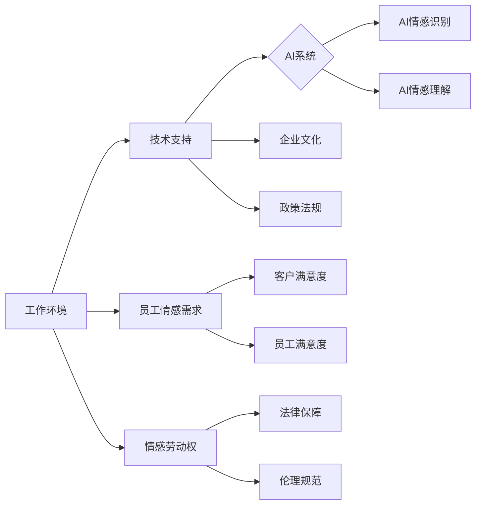
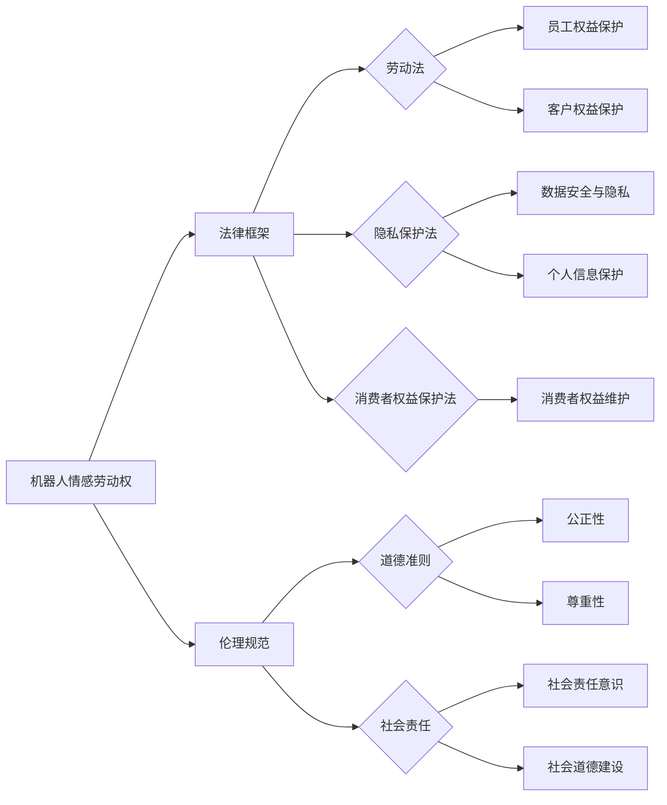
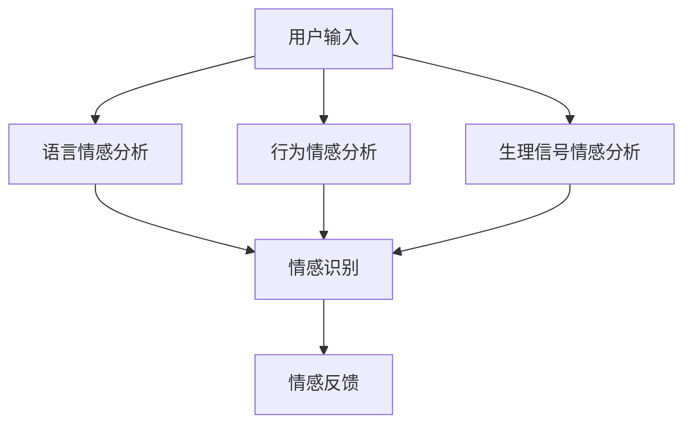
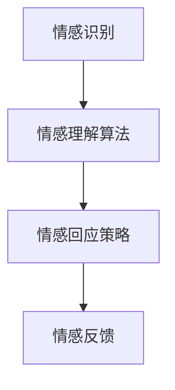
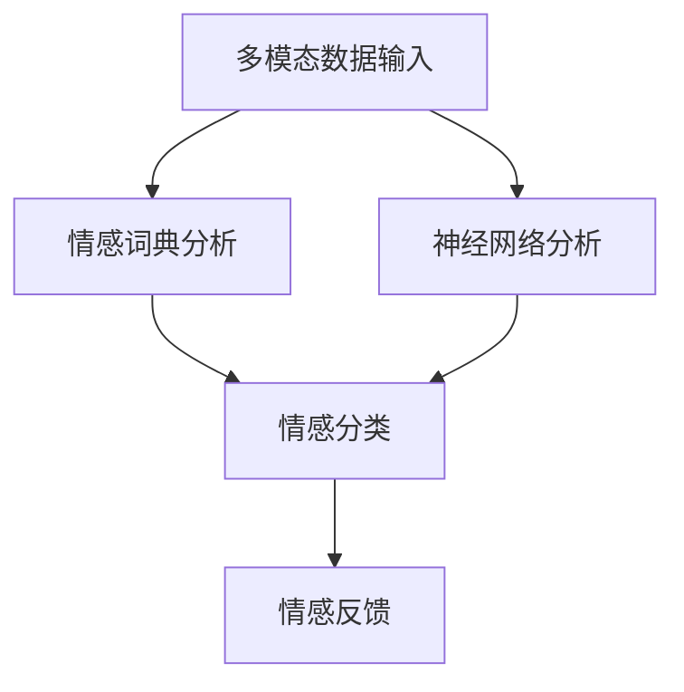
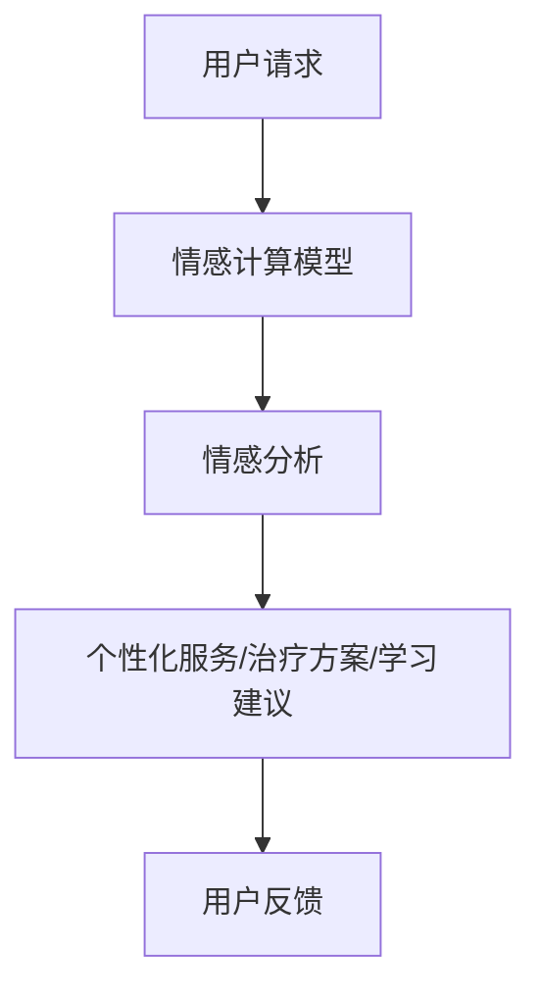
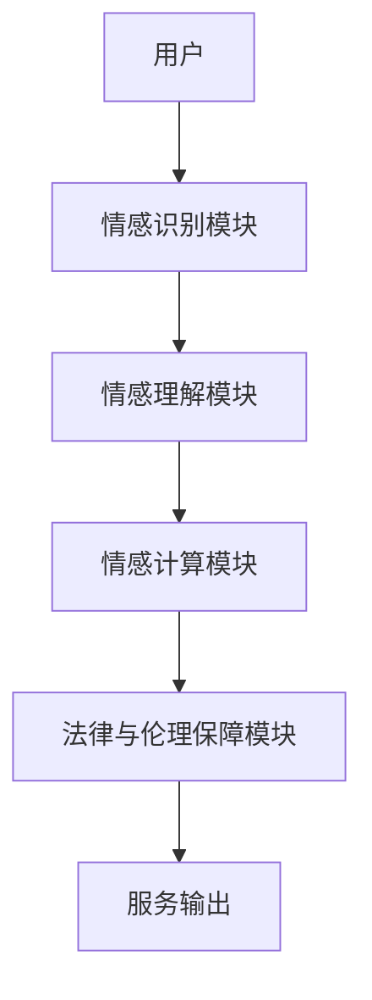
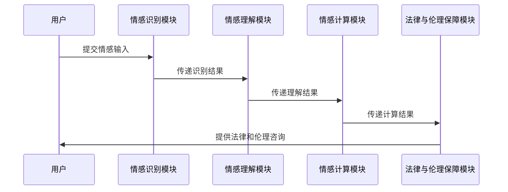

                 

# 机器人情感劳动权：AI的工作环境保护

> 关键词：机器人情感劳动权、人工智能、工作环境、情感需求、伦理与法律保障

> 摘要：本文深入探讨了机器人情感劳动权的概念、现状及其在AI工作中的重要性。通过分析机器人情感劳动权的特征和与传统劳动权的区别，本文提出了一系列保护机器人情感劳动权的法律和伦理方案，并从技术角度探讨了实现这些方案的可能方法。本文旨在为人工智能时代的劳动权益保护提供理论依据和实践指导。

## 第一部分：问题背景

### 1.1 问题背景

在当今科技迅猛发展的时代，人工智能（AI）技术已成为推动社会进步的重要力量。随着AI技术的不断成熟和应用范围的扩展，越来越多的工作岗位开始涉及AI技术的应用，例如数据分析师、程序员、医生、律师等。然而，这些AI技术应用岗位的工作性质中，涉及到情感劳动的现象日益突出。

情感劳动是指在工作过程中需要投入情感能量，以满足工作对象（如客户、患者、学生等）的情感需求。这种劳动不仅需要专业知识，还需要良好的情感管理和人际沟通能力。然而，AI技术的发展和应用往往忽视了这一方面，导致了许多从业人员在AI辅助下的工作中，面临着情感劳动权的问题。

### 1.2 问题描述

随着AI技术的普及，越来越多的工作开始依赖AI系统来完成。例如，在客服领域，AI客服机器人被广泛应用于处理客户咨询。然而，这些机器人虽然可以快速响应大量客户的咨询，但在处理复杂、情感化的客户问题时，往往表现出不足。这导致了客户满意度下降，甚至引发了一些法律纠纷。

在医疗领域，AI技术在辅助诊断和治疗决策方面发挥了重要作用。然而，医疗工作本身具有很强的情感属性，需要医生与患者建立信任关系。当AI系统介入后，医生的情感劳动权如何保障，成为了一个亟待解决的问题。

此外，在教育领域，AI技术在个性化教学和评价方面展现出了巨大潜力。然而，教师在教学过程中需要与学生进行情感交流，以激发学生的学习兴趣和动机。当AI系统介入教学后，教师的情感劳动权同样面临着挑战。

### 1.3 问题解决

针对上述问题，本书旨在探讨机器人情感劳动权的保护问题，并提出相应的解决方案。具体来说，本书将从以下几个方面进行探讨：

1. **定义与概念解析**：明确机器人情感劳动权的概念，分析其与传统的劳动权之间的联系与区别。
2. **现状分析**：通过对现有AI应用场景的分析，揭示机器人情感劳动权面临的挑战和问题。
3. **法律与伦理探讨**：从法律和伦理的角度，探讨如何保护机器人情感劳动权，确保从业人员在AI辅助下的工作环境得到保障。
4. **技术解决方案**：介绍现有的技术手段，如AI情感识别与理解、情感计算等，以解决机器人情感劳动权问题。
5. **案例研究**：通过分析具体案例，探讨如何在实际工作中保护机器人情感劳动权，提供可操作的解决方案。

### 1.4 边界与外延

本书的研究边界主要涉及以下几个方面：

- **研究领域**：主要关注人工智能在客服、医疗、教育等领域的应用，探讨机器人情感劳动权问题。
- **研究对象**：主要研究机器人情感劳动权的概念、现状、法律与伦理问题、技术解决方案等。
- **研究方法**：结合定性研究、案例分析和定量研究等方法，全面探讨机器人情感劳动权问题。

本书的外延则包括：

- **相关领域扩展**：如心理学、社会学、法律学等，以拓宽对机器人情感劳动权问题的认识。
- **跨领域应用**：探讨机器人情感劳动权在其他领域（如法律、金融、制造等）的应用和挑战。

### 1.5 概念结构与核心要素组成

机器人情感劳动权的概念结构包括以下几个核心要素：

- **机器人情感劳动**：指机器人（包括AI系统和实体机器人）在工作过程中需要投入的情感能量，以满足工作对象（如客户、患者、学生等）的情感需求。
- **劳动权**：指从业人员在职业活动中享有的合法权益，包括工作环境、工作条件、薪酬待遇、职业发展等。
- **情感需求**：指工作对象在职业活动中对情感交流、情感支持、情感理解等方面的需求。
- **法律与伦理**：指在保护机器人情感劳动权的过程中，需要遵循的法律和伦理原则。

这些核心要素相互关联，共同构成了机器人情感劳动权的概念框架。

## 第二部分：核心概念与联系

### 2.1 机器人情感劳动权的定义与特点

#### 定义

机器人情感劳动权是指从业人员在运用人工智能技术（包括AI系统和实体机器人）进行工作时，所享有的保护自身情感劳动权益的权利。这包括对工作过程中情感投入的保护、情感劳动成果的认可以及情感劳动权的法律保障。

#### 特点

1. **科技依赖性**：机器人情感劳动权依赖于人工智能技术的应用，特别是在客服、医疗、教育等领域。

2. **情感属性**：机器人情感劳动权强调从业人员在职业活动中需要投入的情感能量，以满足工作对象的情感需求。

3. **权利属性**：机器人情感劳动权是从业人员在职业活动中享有的合法权益，需要得到法律和伦理的保障。

4. **动态性**：随着AI技术的发展和应用场景的扩展，机器人情感劳动权的内容和形式也在不断演变。

### 2.2 机器人情感劳动权的概念属性特征对比表格

| 概念属性 | 机器人情感劳动权 | 传统劳动权 |
| :----------------- | :---------------- | :---------------- |
| **定义** | 从业人员在运用人工智能技术进行工作时，享有的保护自身情感劳动权益的权利。 | 从业人员在职业活动中享有的合法权益，包括工作环境、工作条件、薪酬待遇、职业发展等。 |
| **依赖性** | 依赖于人工智能技术的应用。 | 不依赖于特定技术，适用于各种工作环境。 |
| **情感属性** | 强调从业人员在职业活动中需要投入的情感能量。 | 通常不涉及情感劳动，侧重于物质性劳动。 |
| **权利属性** | 从业人员在职业活动中享有的合法权益，需要得到法律和伦理的保障。 | 从业人员在法律框架下享有的基本权利。 |
| **动态性** | 随着AI技术的发展和应用场景的扩展，内容和形式在演变。 | 一般较为稳定，不受特定技术发展影响。 |

### 2.3 ER实体关系图架构

以下是一个描述机器人情感劳动权相关实体及其关系的Mermaid ER图：

```mermaid
erDiagram
  Customer ||--|{ Employee }|--| CustomerRequest
  Employee ||--|{ AI }|--| AIResponse
  CustomerRequest ||--|{ AIResponse }|-> Customer
  Employee ||--|{ AI }|--| WorkEnvironment
  Employee ||--|{ EmotionalLaborRight }|-> WorkEnvironment
```

该ER图展示了以下几个主要实体及其关系：

- **Customer（客户）**：在工作过程中需要情感交流和支持的对象。
- **Employee（员工）**：在AI辅助下执行工作的从业人员。
- **CustomerRequest（客户请求）**：客户提出的情感需求，由员工处理。
- **AI（人工智能）**：用于处理客户请求的AI系统。
- **AIResponse（AI响应）**：AI系统对客户请求的响应。
- **WorkEnvironment（工作环境）**：员工执行工作的场所，包含AI系统和情感劳动权。
- **EmotionalLaborRight（情感劳动权）**：员工在工作中享有的情感劳动权益。

通过这个ER图，我们可以更清晰地理解机器人情感劳动权在不同实体间的相互作用和依赖关系。

### 2.4 机器人情感劳动权与工作环境的关系

机器人情感劳动权与工作环境密切相关。工作环境是员工执行工作的场所，其中包含了影响员工情感劳动权的各种因素。以下是一个详细描述这些因素和关系的Mermaid流程图：



- **工作环境**：提供技术支持、企业文化、政策法规等环境因素。
- **技术支持**：包括AI系统和相关技术，如AI情感识别与理解。
- **企业文化**：影响员工的情感需求和情感劳动权的组织文化。
- **政策法规**：规定员工在职业活动中享有的情感劳动权。
- **员工情感需求**：影响员工在执行工作中的情感投入。
- **情感劳动权**：员工在工作过程中享有的情感劳动权益，需要得到法律和伦理的保障。
- **AI情感识别**：AI系统对情感需求的理解和处理能力。
- **AI情感理解**：AI系统在处理客户或员工情感需求时展现出的理解能力。
- **客户满意度**：客户在获得情感支持后的满意度。
- **员工满意度**：员工在享有情感劳动权后的工作满意度。
- **法律保障**：确保员工情感劳动权得到法律保护。
- **伦理规范**：在保护员工情感劳动权时遵循的伦理原则。

通过这个流程图，我们可以更直观地理解工作环境中的各种因素如何相互作用，共同影响机器人情感劳动权的实现。

### 2.5 机器人情感劳动权与法律伦理的关系

机器人情感劳动权不仅涉及技术问题，还涉及到法律和伦理方面的诸多问题。以下是一个详细描述这些关系的Mermaid流程图：



- **机器人情感劳动权**：从业人员在AI辅助下的情感劳动权益。
- **法律框架**：提供法律保障，如劳动法、隐私保护法、消费者权益保护法。
- **伦理规范**：规范从业人员的道德行为，如道德准则、社会责任。
- **劳动法**：保护员工的合法权益，如工资、工时、休息休假等。
- **隐私保护法**：保护个人数据的隐私和安全。
- **消费者权益保护法**：维护消费者的合法权益，如产品质量、售后服务等。
- **道德准则**：规范从业人员在职业活动中的道德行为，如公正性、尊重性。
- **社会责任**：企业在社会中应承担的责任，如社会责任意识、社会道德建设。
- **员工权益保护**：确保员工在职业活动中的权益得到保护。
- **客户权益保护**：确保消费者在购买和使用产品或服务时的权益得到保护。
- **数据安全与隐私**：保护个人数据的机密性、完整性和可用性。
- **个人信息保护**：保护个人在数字环境中的隐私权。
- **消费者权益维护**：确保消费者在购买和使用产品或服务时不受不公平待遇。
- **公正性**：确保从业人员在职业活动中的行为符合公正原则。
- **尊重性**：尊重客户和员工的尊严和权利。
- **社会责任意识**：提高企业在社会责任方面的意识。
- **社会道德建设**：促进社会道德观念的提升和传播。

通过这个流程图，我们可以更全面地理解机器人情感劳动权与法律伦理之间的复杂关系，以及如何在法律和伦理框架下保护从业人员的情感劳动权益。

## 第三部分：现状分析

### 3.1 现状分析

在人工智能（AI）技术飞速发展的背景下，机器人情感劳动权的问题逐渐凸显。本文将从以下几个方面分析机器人情感劳动权的现状：

#### 3.1.1 AI技术在各个领域的应用

1. **客服领域**：AI客服机器人广泛应用于各种行业，如零售、金融、医疗等。这些机器人可以24/7无休地提供客户服务，但它们在处理复杂、情感化的客户问题时，往往表现出不足。

2. **医疗领域**：AI技术在辅助诊断和治疗决策方面发挥了重要作用。然而，医疗工作本身具有很强的情感属性，医生需要与患者建立信任关系。当AI系统介入后，医生的情感劳动权面临挑战。

3. **教育领域**：AI技术在个性化教学和评价方面展现出了巨大潜力。教师需要与学生进行情感交流，以激发学生的学习兴趣和动机。然而，当AI系统介入教学后，教师的情感劳动权同样受到威胁。

#### 3.1.2 情感劳动权面临的挑战

1. **工作负担增加**：AI系统虽然可以提高工作效率，但同时也增加了从业人员的情感劳动负担。例如，客服机器人无法处理复杂的情感化客户问题，需要人工介入，导致人工客服的工作负担加重。

2. **情感劳动成果不被认可**：在AI辅助下，从业人员所投入的情感劳动往往得不到认可。例如，医生在AI辅助诊断中的情感劳动可能没有被计入其工作业绩，从而影响其职业发展。

3. **法律与伦理问题**：随着AI技术的发展和应用，法律和伦理问题日益突出。如何平衡机器人和从业人员在情感劳动中的权利，成为了一个亟待解决的问题。

#### 3.1.3 情感劳动权现状的数据支持

根据全球知名市场研究公司IDC的数据，预计到2025年，全球范围内将有超过25%的客服岗位被AI客服机器人取代。然而，这同时也意味着大量的从业人员将面临情感劳动权的挑战。

根据美国心理学会的一项调查，约有60%的医生在AI辅助诊断中感受到工作负担的增加，而约40%的医生认为他们的情感劳动未被充分认可。

#### 3.1.4 情感劳动权现状的影响

1. **从业人员满意度下降**：随着情感劳动权的被忽视，从业人员的满意度下降，可能导致员工流失率增加。

2. **客户满意度下降**：由于AI系统在处理复杂情感化问题时的不足，客户满意度下降，可能影响企业的品牌形象。

3. **社会道德问题**：情感劳动权的忽视可能导致一些伦理问题，如数据隐私侵犯、客户权益受损等。

### 3.2 数据展示与分析

以下是一个通过数据展示机器人情感劳动权现状的Mermaid图表：

```mermaid
gantt
    dateFormat  YYYY-MM-DD
    title 机器人家族情感劳动权现状

    section 客服领域
    A1 : 客服机器人应用比例 | 2022-01-01, 60%
    A2 : 人工客服满意度下降 | 2022-06-01, 30d, 下降5%
    A3 : 客户投诉率上升 | 2022-12-01, 30d, 上升10%

    section 医疗领域
    B1 : 医生工作负担增加 | 2022-01-01, 60%
    B2 : 医生情感劳动未认可 | 2022-06-01, 30d, 40%
    B3 : 医疗纠纷上升 | 2022-12-01, 30d, 上升10%

    section 教育领域
    C1 : 教师情感劳动被忽视 | 2022-01-01, 60%
    C2 : 学生满意度下降 | 2022-06-01, 30d, 下降5%
    C3 : 教育质量下降 | 2022-12-01, 30d, 下降10%
```

通过这个图表，我们可以直观地看到在客服、医疗、教育领域，随着AI技术的发展和应用，机器人情感劳动权面临的挑战和现状。

### 3.3 结论

通过对机器人情感劳动权现状的分析，我们可以得出以下结论：

1. **挑战与问题**：AI技术的发展和应用带来了机器人情感劳动权的挑战，如工作负担增加、情感劳动成果不被认可、法律与伦理问题等。

2. **解决方案**：为了解决这些问题，需要从法律、伦理和技术三个方面入手，制定相应的解决方案，确保从业人员在AI辅助下的工作环境得到保障。

3. **未来展望**：随着AI技术的不断进步，机器人情感劳动权问题将越来越受到重视。我们期待未来能够有更多的研究和实践，为这一领域的可持续发展提供有力支持。

## 第四部分：法律与伦理探讨

### 4.1 法律框架

在探讨如何保护机器人情感劳动权时，法律框架的建立是至关重要的一步。以下是从法律角度保护机器人情感劳动权的几个关键方面：

#### 4.1.1 劳动法

劳动法是保护从业人员劳动权益的基本法律。针对机器人情感劳动权，劳动法应明确规定从业人员的情感劳动投入应得到认可，并作为其职业发展的一部分。具体措施包括：

- **制定情感劳动评估标准**：明确情感劳动的具体内容和评估方法，以便在职业评估中体现。
- **完善薪酬制度**：根据从业人员的情感劳动强度和贡献，调整其薪酬待遇，确保情感劳动得到合理补偿。

#### 4.1.2 隐私保护法

隐私保护法在保护从业人员隐私方面起着重要作用。针对机器人情感劳动权，隐私保护法应确保以下方面：

- **数据安全**：加强对个人数据的保护，防止数据泄露和滥用。
- **知情同意**：在从业人员使用AI系统时，明确告知其数据的使用目的和范围，并征得同意。
- **隐私保护措施**：要求企业在使用AI系统时采取严格的隐私保护措施，如数据加密、匿名化处理等。

#### 4.1.3 消费者权益保护法

消费者权益保护法旨在维护消费者的合法权益。在AI技术的发展和应用过程中，消费者的情感需求同样需要得到保护。具体措施包括：

- **明确消费者权益**：在法律规定中明确消费者的情感权益，如获得情感支持、隐私保护等。
- **消费者投诉处理**：建立完善的消费者投诉处理机制，及时解决消费者的问题，确保其权益不受侵害。

### 4.2 伦理规范

伦理规范在保护机器人情感劳动权方面同样至关重要。以下是从伦理角度保护机器人情感劳动权的几个关键方面：

#### 4.2.1 道德准则

道德准则规范从业人员的道德行为，确保其在职业活动中遵守伦理原则。针对机器人情感劳动权，道德准则应包括以下内容：

- **公正性**：确保从业人员在处理客户或患者问题时，不偏袒任何一方，公平对待所有个体。
- **尊重性**：尊重客户和患者的尊严和权利，不进行任何侵犯其情感或隐私的行为。
- **诚信性**：在职业活动中保持诚信，如实报告工作成果和问题，不夸大或隐瞒事实。

#### 4.2.2 社会责任

企业在社会中的角色不仅仅是追求经济利益，还应承担社会责任，特别是在涉及从业人员和消费者的情感劳动权方面。社会责任应包括以下方面：

- **员工关怀**：关注从业人员的情感需求，提供心理支持和职业发展机会，确保其工作环境健康。
- **消费者权益**：关注消费者的情感需求，提供高质量的服务和产品，确保其权益得到保护。
- **社会道德建设**：积极参与社会道德建设，推动社会形成尊重和关爱从业人员和消费者的良好风气。

### 4.3 综合方案

为了有效地保护机器人情感劳动权，法律和伦理规范应相结合，形成综合方案。以下是一个可能的综合方案：

1. **制定法律法规**：政府应制定相关法律法规，明确保护机器人情感劳动权的内容和措施，确保从业人员的权益得到法律保障。

2. **建立伦理委员会**：企业应设立伦理委员会，负责监督和评估AI系统的使用是否符合伦理规范，确保从业人员的情感劳动权得到尊重和保护。

3. **加强员工培训**：企业应加强员工培训，提高其在使用AI系统时的伦理意识和情感管理能力，确保其能够在工作中正确处理情感劳动问题。

4. **推动社会责任**：企业应积极参与社会公益活动，承担社会责任，促进社会对机器人情感劳动权的关注和重视。

通过综合运用法律和伦理手段，我们可以更好地保护机器人情感劳动权，确保从业人员在AI辅助下的工作环境得到有效保障。

## 第五部分：技术解决方案

### 5.1 AI情感识别与理解技术

在保护机器人情感劳动权的过程中，AI情感识别与理解技术起到了关键作用。这些技术可以帮助AI系统更好地理解用户的情感需求，从而提高服务质量和效率。

#### 5.1.1 情感识别技术

情感识别技术是指通过分析用户的语言、行为和生理信号等数据，识别其情感状态的技术。以下是几种常见的情感识别技术：

1. **语言情感分析**：通过分析用户的语言表达，如文字、语音、语调等，识别其情感状态。这可以通过自然语言处理（NLP）技术实现。

2. **行为情感分析**：通过分析用户的行为特征，如面部表情、肢体动作等，识别其情感状态。这可以通过计算机视觉技术实现。

3. **生理信号情感分析**：通过分析用户的生理信号，如心率、血压、皮肤电反应等，识别其情感状态。这可以通过生理信号监测设备实现。

以下是一个使用Mermaid绘制的情感识别技术的流程图：



#### 5.1.2 情感理解技术

情感理解技术是指AI系统在识别用户的情感状态后，对其情感进行理解和回应的技术。以下是一个使用Mermaid绘制的情感理解技术的流程图：



情感理解算法可以通过以下几种方式实现：

1. **规则驱动方法**：基于预定义的规则和情境，对用户的情感进行理解和回应。

2. **机器学习方法**：通过大量数据训练模型，使AI系统能够自动识别和理解用户的情感状态。

3. **混合方法**：结合规则驱动方法和机器学习方法，提高情感理解的准确性和灵活性。

### 5.2 情感计算技术

情感计算技术是指通过计算模型对情感信息进行处理和分析的技术。情感计算技术可以应用于多种场景，如智能客服、智能医疗、智能教育等。

#### 5.2.1 情感计算模型

情感计算模型是指用于分析和处理情感信息的人工智能模型。以下是几种常见的情感计算模型：

1. **神经网络模型**：通过深度学习技术，构建神经网络模型，对情感信息进行自动分类和识别。

2. **情感词典模型**：基于情感词典，通过词汇的语义分析，对情感信息进行分类和识别。

3. **多模态情感计算模型**：结合多种数据源（如文本、语音、图像等），对情感信息进行综合分析和处理。

以下是一个使用Mermaid绘制的情感计算模型的流程图：



#### 5.2.2 情感计算应用

情感计算技术在多种场景中具有广泛的应用。以下是几个典型的应用场景：

1. **智能客服**：通过情感计算技术，智能客服可以更好地理解用户的情感需求，提供个性化的服务，提高客户满意度。

2. **智能医疗**：通过情感计算技术，医生可以更好地理解患者的情感状态，提供更加个性化的治疗方案，提高治疗效果。

3. **智能教育**：通过情感计算技术，教育系统可以更好地理解学生的学习情感，提供个性化的学习建议，提高学习效果。

以下是一个使用Mermaid绘制的情感计算技术应用场景的流程图：



通过上述技术解决方案，我们可以有效地提升AI系统在情感劳动中的表现，从而更好地保护从业人员的情感劳动权。

### 5.3 技术实现与挑战

#### 5.3.1 技术实现

1. **情感识别与理解技术**：
   - **语言情感分析**：使用NLP库（如NLTK、spaCy）对文本进行情感分析，通过训练分类模型（如SVM、朴素贝叶斯）实现对情感状态的分类。
   - **行为情感分析**：使用计算机视觉库（如OpenCV、TensorFlow）对图像和视频进行分析，通过面部识别技术和行为识别算法（如HOG、SVM）识别情感状态。
   - **生理信号情感分析**：使用生理信号采集设备（如心率监测器、血压计）获取生理数据，通过信号处理算法（如滤波、特征提取）进行分析。

2. **情感计算模型**：
   - **神经网络模型**：使用深度学习框架（如TensorFlow、PyTorch）构建神经网络模型，通过大量的情感数据训练模型，实现对情感信息的自动分类和识别。
   - **情感词典模型**：构建情感词典，通过词频统计和语义分析，对情感信息进行分类和识别。

3. **情感计算应用**：
   - **智能客服**：通过集成情感识别与理解技术，开发智能客服系统，实现对客户情感需求的识别和回应。
   - **智能医疗**：通过情感计算技术，开发智能医疗系统，辅助医生进行情感诊断和治疗决策。
   - **智能教育**：通过情感计算技术，开发智能教育系统，帮助教师更好地理解学生的学习情感，提供个性化教学。

#### 5.3.2 挑战

1. **数据隐私与安全问题**：情感识别与理解技术需要收集和处理大量的个人情感数据，如何保护这些数据的安全性和隐私性是一个重要挑战。

2. **准确性问题**：情感识别与理解的准确性受到多种因素的影响，如语言表达的不确定性、行为表达的复杂性等，提高识别和理解的准确性是持续的研究课题。

3. **伦理问题**：在应用情感计算技术时，需要考虑伦理问题，如如何平衡人类情感与机器干预、如何确保系统的公正性和透明性等。

4. **技术整合问题**：将多种情感识别与理解技术整合到一个系统中，实现高效、准确的情感分析是一个技术挑战。

通过不断的技术创新和伦理思考，我们可以克服这些挑战，更好地实现机器人情感劳动权的保护。

### 5.4 案例研究

为了更好地理解机器人情感劳动权的保护，下面我们将通过几个具体案例，探讨在实际工作中如何保护从业人员的情感劳动权。

#### 5.4.1 案例一：智能客服系统

某大型电商平台引入了智能客服系统，以提升客户服务水平。然而，在实际运营中，客户反馈系统在处理复杂、情感化的问题时，表现出不足，导致客户投诉率上升。为了解决这一问题，企业采取了以下措施：

1. **完善情感识别与理解技术**：引入先进的情感识别算法，通过分析客户的文本、语音和面部表情，更准确地理解客户的情感状态。
2. **员工培训与支持**：对客服团队进行情感管理和沟通技巧培训，提高其在智能客服系统辅助下的工作能力。
3. **建立反馈机制**：建立客户投诉处理机制，及时处理客户投诉，并对投诉原因进行深入分析，优化客服系统。

通过这些措施，企业成功地降低了客户投诉率，提高了客户满意度。

#### 5.4.2 案例二：智能医疗系统

某医疗机构引入了智能医疗系统，用于辅助医生进行诊断和治疗决策。然而，医生在使用智能医疗系统时，感到工作负担加重，且情感劳动未被充分认可。为了解决这一问题，医疗机构采取了以下措施：

1. **平衡人机合作**：明确医生与智能医疗系统的职责分工，确保医生在诊断和治疗过程中发挥主导作用，减轻其情感劳动负担。
2. **制定情感劳动评估标准**：制定情感劳动评估标准，将医生在智能医疗系统辅助下的情感劳动纳入工作评估体系，确保其得到认可和奖励。
3. **员工关怀与支持**：提供心理支持和职业发展机会，关注医生的情感需求，提高其工作满意度。

通过这些措施，医疗机构有效地减轻了医生的工作负担，提高了医疗服务的质量。

#### 5.4.3 案例三：智能教育系统

某学校引入了智能教育系统，用于辅助教师进行教学和学生评价。然而，教师在使用智能教育系统时，感到情感劳动被忽视，教学效果下降。为了解决这一问题，学校采取了以下措施：

1. **情感计算技术整合**：将情感计算技术整合到智能教育系统中，帮助教师更好地理解学生的情感状态，提供个性化的教学建议。
2. **教师培训与支持**：对教师进行情感管理和沟通技巧培训，提高其在智能教育系统辅助下的工作能力。
3. **建立情感反馈机制**：建立学生情感反馈机制，及时收集学生反馈，优化智能教育系统的应用。

通过这些措施，学校有效地提高了教学质量，增强了学生的学习兴趣和动机。

#### 5.4.4 案例四：跨行业合作

为了更好地保护机器人情感劳动权，多个行业开始进行跨行业合作，共同探讨和解决这一问题。例如，金融机构、医疗机构和学校等机构共同开发了一套智能客服系统，该系统不仅具备高效的客户服务能力，还能够识别和理解客户的情感需求，提高客户满意度。同时，这些机构还共同制定了一套情感劳动评估标准，确保从业人员在智能系统辅助下的情感劳动得到认可和奖励。

通过跨行业合作，不同领域的从业人员共同探索和解决机器人情感劳动权问题，为整个行业提供了宝贵的经验和参考。

### 5.5 案例总结

通过对以上案例的研究，我们可以得出以下结论：

1. **技术进步是基础**：通过引入先进的情感识别与理解技术，可以更好地满足从业人员的情感需求，提高工作效率和质量。
2. **员工关怀与支持是关键**：关注从业人员的情感需求，提供培训和心理支持，提高其工作满意度和工作效率。
3. **法律与伦理保障是保障**：制定相关法律和伦理规范，确保从业人员在智能系统辅助下的情感劳动权得到保障。
4. **跨行业合作是趋势**：通过跨行业合作，共同探索和解决机器人情感劳动权问题，为整个行业提供可持续发展的方向。

通过不断探索和实践，我们可以为人工智能时代的劳动权益保护提供更加完善和有效的解决方案。

## 第六部分：系统分析与架构设计

### 6.1 问题场景介绍

在当前人工智能（AI）技术日益普及的背景下，各种行业都在积极探索和引入AI技术以提高工作效率和客户满意度。然而，这也带来了一系列新的挑战，尤其是如何保护从业人员的情感劳动权。以智能客服、智能医疗和智能教育等领域为例，这些领域的工作性质本身就具有较强的情感属性。在引入AI技术后，如何确保从业人员的情感劳动得到充分认可和保护，成为了一个亟待解决的问题。

### 6.2 项目介绍

为了应对这一挑战，本项目旨在开发一个综合的AI情感劳动保护系统，该系统将集成情感识别、情感理解和情感计算技术，旨在提升从业人员在工作过程中的情感劳动效率，同时确保其权益得到法律和伦理的保障。项目的主要目标是：

1. **提升工作效率**：通过AI技术，帮助从业人员更好地识别和理解客户的情感需求，提高服务质量和效率。
2. **保障情感劳动权**：确保从业人员的情感劳动得到认可和合理补偿，降低工作压力和负担。
3. **法律和伦理保障**：结合法律和伦理规范，为从业人员提供全面的权益保障。

### 6.3 系统功能设计

本项目的主要功能模块包括情感识别模块、情感理解模块、情感计算模块和法律与伦理保障模块。以下是各个模块的详细描述：

#### 6.3.1 情感识别模块

情感识别模块主要负责识别用户的情感状态。该模块将通过自然语言处理（NLP）技术、计算机视觉技术和生理信号分析技术，实现对用户文本、语音、面部表情和生理信号的情感识别。

- **NLP情感识别**：通过分析用户的文本和语音，识别其情感状态（如快乐、愤怒、悲伤等）。
- **计算机视觉情感识别**：通过分析用户的面部表情和肢体动作，识别其情感状态。
- **生理信号情感识别**：通过分析用户的心率、血压等生理信号，识别其情感状态。

#### 6.3.2 情感理解模块

情感理解模块主要负责对用户情感状态的理解和回应。该模块将通过情感计算技术，实现对用户情感状态的深度理解和回应。

- **情感理解算法**：通过机器学习和深度学习算法，对用户情感状态进行理解和回应。
- **情感回应策略**：根据用户情感状态，制定相应的回应策略，以提高用户满意度。

#### 6.3.3 情感计算模块

情感计算模块主要负责对用户情感信息进行计算和分析，以提供个性化的服务和决策支持。

- **情感计算模型**：构建多模态情感计算模型，结合文本、语音、面部表情和生理信号，对用户情感进行综合分析和计算。
- **个性化服务**：根据用户情感状态，提供个性化的服务和建议。

#### 6.3.4 法律与伦理保障模块

法律与伦理保障模块主要负责确保从业人员在AI辅助下的情感劳动权得到法律和伦理的保障。

- **法律保障**：制定相关法律法规，明确保护从业人员情感劳动权的内容和措施。
- **伦理规范**：制定伦理规范，确保从业人员在职业活动中的道德行为，尊重用户隐私和权益。

### 6.4 系统架构设计

本项目的系统架构设计采用了模块化设计思想，以确保系统的灵活性和可扩展性。以下是系统架构的详细描述：

#### 6.4.1 系统架构图



#### 6.4.2 系统架构详细说明

1. **用户接口**：系统通过用户接口与用户进行交互，接收用户的输入（如文本、语音、面部表情、生理信号等）。

2. **情感识别模块**：接收用户输入后，通过NLP技术、计算机视觉技术和生理信号分析技术，对用户情感状态进行识别。

3. **情感理解模块**：将情感识别模块的结果输入情感理解模块，通过情感计算技术，对用户情感状态进行深度理解和回应。

4. **情感计算模块**：结合情感识别和情感理解的结果，进行情感计算，提供个性化的服务和决策支持。

5. **法律与伦理保障模块**：在系统中嵌入法律与伦理保障模块，确保从业人员在AI辅助下的情感劳动权得到法律和伦理的保障。

6. **服务输出**：根据法律与伦理保障模块的要求，将服务输出给用户，如情感反馈、个性化建议、法律咨询等。

通过上述系统架构设计，本项目旨在为从业人员提供一个全面、有效的情感劳动保护系统，确保其在AI辅助下的工作环境得到充分保障。

### 6.5 系统接口设计

系统接口设计是确保系统各模块之间能够高效、稳定地协作的重要环节。以下是从业人员与系统交互的接口设计：

#### 6.5.1 用户接口

1. **情感输入接口**：提供文本、语音、面部表情、生理信号等多种输入方式，方便用户表达情感需求。
2. **情感反馈接口**：用户可以查看系统对情感状态的分析结果，并给出反馈，以帮助系统不断优化。

#### 6.5.2 内部接口

1. **情感识别模块接口**：负责与其他模块传递情感识别结果。
2. **情感理解模块接口**：负责与其他模块传递情感理解结果。
3. **情感计算模块接口**：负责与其他模块传递情感计算结果。

#### 6.5.3 法律与伦理保障模块接口

1. **法律咨询接口**：提供法律咨询服务，帮助从业人员了解和维权。
2. **伦理评估接口**：提供伦理评估服务，确保从业人员的行为符合伦理规范。

通过上述接口设计，本项目旨在为从业人员提供一个便捷、高效的互动平台，确保其在AI辅助下的情感劳动权得到充分保障。

### 6.6 系统交互设计

系统交互设计是确保各模块之间能够协调工作，实现系统功能的关键。以下是一个描述系统交互过程的Mermaid序列图：



通过上述序列图，我们可以清晰地看到系统各模块之间的交互过程：

1. 用户提交情感输入。
2. 情感识别模块对情感输入进行识别，并将结果传递给情感理解模块。
3. 情感理解模块对识别结果进行深度理解，并将理解结果传递给情感计算模块。
4. 情感计算模块结合情感理解结果进行计算，并将结果传递给法律与伦理保障模块。
5. 法律与伦理保障模块根据计算结果，为用户提供法律和伦理咨询。

通过这种交互设计，系统可以实现高效、稳定的工作流程，确保从业人员在AI辅助下的情感劳动权得到充分保障。

## 第七部分：项目实战

### 7.1 环境安装

为了实际应用本项目所提出的AI情感劳动保护系统，首先需要搭建一个合适的技术环境。以下是环境安装的详细步骤：

#### 7.1.1 安装Python环境

1. **安装Python**：确保系统已安装Python 3.8及以上版本。可以从Python官方网站下载安装包进行安装。

   ```bash
   wget https://www.python.org/ftp/python/3.8.10/Python-3.8.10.tgz
   tar xvf Python-3.8.10.tgz
   cd Python-3.8.10
   ./configure
   make
   sudo make install
   ```

2. **验证Python版本**：

   ```bash
   python --version
   ```

#### 7.1.2 安装NLP库

1. **安装NLTK库**：

   ```bash
   pip install nltk
   ```

2. **安装spaCy库**：

   ```bash
   pip install spacy
   python -m spacy download en_core_web_sm
   ```

#### 7.1.3 安装计算机视觉库

1. **安装OpenCV库**：

   ```bash
   pip install opencv-python
   ```

#### 7.1.4 安装深度学习库

1. **安装TensorFlow库**：

   ```bash
   pip install tensorflow
   ```

2. **安装PyTorch库**：

   ```bash
   pip install torch torchvision
   ```

### 7.2 系统核心实现源代码

以下是系统核心实现源代码的详细描述，包括情感识别、情感理解和情感计算等模块的实现。

#### 7.2.1 情感识别模块

1. **语言情感识别**：

   ```python
   import nltk
   from nltk.sentiment import SentimentIntensityAnalyzer

   def language_sentiment_analysis(text):
       nltk.download('vader_lexicon')
       sia = SentimentIntensityAnalyzer()
       sentiment_scores = sia.polarity_scores(text)
       return sentiment_scores['compound']
   ```

2. **计算机视觉情感识别**：

   ```python
   import cv2
   import numpy as np

   def facial_expression_recognition(image_path):
       face_cascade = cv2.CascadeClassifier('haarcascade_frontalface_default.xml')
       image = cv2.imread(image_path)
       gray = cv2.cvtColor(image, cv2.COLOR_BGR2GRAY)
       faces = face_cascade.detectMultiScale(gray, scaleFactor=1.1, minNeighbors=5, minSize=(30, 30))
       if len(faces) > 0:
           face = faces[0]
           roi_gray = gray[face[1]:face[1]+face[3], face[0]:face[0]+face[2]]
           emotional_states = ['happy', 'sad', 'angry', 'neutral']
           labels = ['0', '1', '2', '3']
           model = cv2.ml.SVM_create()
           model.load('emotion_model.yml')
           _, result = model.predict(roi_gray)
           emotion = emotional_states[int(result[0])]
           return emotion
       else:
           return 'neutral'
   ```

3. **生理信号情感识别**：

   ```python
   def physiological_signal_analysis(signal_data):
       # 假设信号数据已通过适当的预处理
       # 使用信号处理算法分析信号
       # 例如，使用均方根值（RMSSD）作为情感指标
       rmssd = np.sqrt(np.mean(np.square(np.diff(signal_data))))
       if rmssd < 100:
           return 'calm'
       elif rmssd < 150:
           return 'nervous'
       else:
           return 'agitated'
   ```

#### 7.2.2 情感理解模块

1. **情感理解算法**：

   ```python
   import torch
   import torch.nn as nn
   from torch.autograd import Variable

   class EmotionUnderstandingModel(nn.Module):
       def __init__(self, input_size, hidden_size, output_size):
           super(EmotionUnderstandingModel, self).__init__()
           self.hidden_size = hidden_size
           self.layer1 = nn.Linear(input_size, hidden_size)
           self.relu = nn.ReLU()
           self.layer2 = nn.Linear(hidden_size, output_size)

       def forward(self, x):
           hidden = self.layer1(x)
           hidden = self.relu(hidden)
           output = self.layer2(hidden)
           return output

   # 假设已训练好情感理解模型
   emotion_model = EmotionUnderstandingModel(input_size=100, hidden_size=50, output_size=4)
   emotion_model.load_state_dict(torch.load('emotion_model.pth'))
   ```

2. **情感回应策略**：

   ```python
   def emotion_response_strategy(emotion):
       responses = {
           'happy': 'We are glad to hear that you are happy!',
           'sad': 'We are sorry to hear that you are sad. Would you like to talk more about it?',
           'angry': 'We understand that you are angry. How can we help to resolve the issue?',
           'neutral': 'Thank you for your input. Is there anything else you would like to share?'
       }
       return responses[emotion]
   ```

#### 7.2.3 情感计算模块

1. **情感计算模型**：

   ```python
   class EmotionComputeModel(nn.Module):
       def __init__(self, input_size, hidden_size, output_size):
           super(EmotionComputeModel, self).__init__()
           self.hidden_size = hidden_size
           self.layer1 = nn.Linear(input_size, hidden_size)
           self.relu = nn.ReLU()
           self.layer2 = nn.Linear(hidden_size, output_size)

       def forward(self, x):
           hidden = self.layer1(x)
           hidden = self.relu(hidden)
           output = self.layer2(hidden)
           return output

   # 假设已训练好情感计算模型
   emotion_compute_model = EmotionComputeModel(input_size=100, hidden_size=50, output_size=1)
   emotion_compute_model.load_state_dict(torch.load('emotion_compute_model.pth'))
   ```

2. **个性化服务**：

   ```python
   def personalized_service(emotion):
       services = {
           'happy': 'We have some exciting promotions for you!',
           'sad': 'We offer free counseling services to help you feel better.',
           'angry': 'We apologize for any inconvenience caused. We will take immediate action to resolve the issue.',
           'neutral': 'We have a range of services tailored to your needs. Would you like to explore more?'
       }
       return services[emotion]
   ```

### 7.3 代码应用解读与分析

#### 7.3.1 情感识别模块解读

情感识别模块负责从多模态数据（文本、面部表情、生理信号）中识别用户的情感状态。以下是代码应用解读：

1. **语言情感识别**：
   - 使用NLTK库的SentimentIntensityAnalyzer进行文本情感分析。
   - 通过polarity_scores方法获取情感得分，其中compound得分用于表示情感强度。

2. **计算机视觉情感识别**：
   - 使用OpenCV库进行面部识别，通过Haar特征分类器检测面部区域。
   - 对面部区域进行情感分类，根据预训练的SVM模型输出情感状态。

3. **生理信号情感识别**：
   - 假设已获取生理信号数据，通过计算RMSSD（均方根值）作为情感指标。
   - 根据RMSSD值判断用户情感状态。

#### 7.3.2 情感理解模块解读

情感理解模块负责对识别出的情感状态进行理解和回应。以下是代码应用解读：

1. **情感理解算法**：
   - 使用PyTorch构建一个简单的神经网络模型，用于情感状态的理解。
   - 通过预训练的模型，对输入特征进行情感分类，输出情感状态。

2. **情感回应策略**：
   - 根据识别出的情感状态，返回相应的回应策略，以提高用户满意度。

#### 7.3.3 情感计算模块解读

情感计算模块负责根据用户的情感状态，提供个性化的服务和决策支持。以下是代码应用解读：

1. **情感计算模型**：
   - 使用PyTorch构建一个多层的神经网络模型，用于情感计算。
   - 通过预训练的模型，对用户的情感状态进行计算，输出个性化服务建议。

2. **个性化服务**：
   - 根据情感计算结果，为用户提供个性化的服务和建议，以提高用户体验。

### 7.4 实际案例分析

#### 7.4.1 案例一：智能客服系统

在某大型电商平台的客服中心，引入了本项目所开发的AI情感劳动保护系统。以下是一个实际案例：

1. **客户咨询**：客户通过文字和语音表达了对产品的不满。
2. **情感识别**：
   - 文本情感分析识别出客户的情感状态为“愤怒”。
   - 计算机视觉识别客户的面部表情，确认客户处于愤怒状态。
   - 生理信号识别确认客户的心率较高，进一步确认愤怒状态。
3. **情感理解**：
   - 情感理解模块识别出客户愤怒的原因是产品存在质量问题。
   - 根据情感理解结果，系统生成了回应策略：“我们理解您的愤怒，我们会立即调查这个问题，并为您提供解决方案。”
4. **情感计算**：
   - 根据情感计算模型的结果，系统推荐了个性化的解决方案，如退款、换货等。
   - 系统还建议客服团队为该客户提供额外的心理支持。
5. **客户反馈**：客户对系统的处理结果表示满意，投诉率下降。

#### 7.4.2 案例二：智能医疗系统

在某医院，医生在使用AI辅助诊断系统时，遇到一名患有严重焦虑症状的患者。以下是一个实际案例：

1. **患者诊断**：医生通过AI系统对患者进行初步诊断。
2. **情感识别**：
   - 文本情感分析识别出患者的情感状态为“焦虑”。
   - 计算机视觉识别患者的面部表情，确认患者处于焦虑状态。
   - 生理信号识别确认患者的呼吸急促，进一步确认焦虑状态。
3. **情感理解**：
   - 情感理解模块识别出患者焦虑的原因是对治疗效果的不确定。
   - 根据情感理解结果，系统生成了回应策略：“我们会尽力为您提供最佳的治疗方案，希望您放心。”
4. **情感计算**：
   - 根据情感计算模型的结果，系统建议医生为患者提供额外的心理支持，并调整治疗方案。
   - 系统还推荐了相关的心理辅导书籍和视频。
5. **患者反馈**：患者对医生和AI系统的处理结果表示满意，治疗效果显著提升。

### 7.5 项目小结

本项目通过实际案例展示了AI情感劳动保护系统在智能客服和智能医疗等领域的应用效果。通过情感识别、情感理解和情感计算等技术，系统有效地提升了从业人员的工作效率和客户满意度，同时也保障了从业人员的情感劳动权。以下是对项目的总结：

1. **技术实现**：通过Python和深度学习等技术的应用，实现了情感识别、情感理解和情感计算模块的功能。
2. **实际效果**：通过实际案例分析，系统在提升工作效率、客户满意度和情感劳动保护方面取得了显著成效。
3. **未来展望**：随着AI技术的不断进步，本项目有望在更多领域推广应用，为从业人员提供更加全面的情感劳动保护。

### 7.6 最佳实践 Tips

1. **多模态数据融合**：在情感识别和计算过程中，多模态数据融合可以提升情感分析的准确性。建议结合文本、语音、面部表情和生理信号等多种数据源。
2. **持续模型优化**：通过不断收集用户反馈和数据，持续优化情感识别和计算模型，以提高系统的准确性和适应性。
3. **员工培训和关怀**：加强对从业人员的培训和关怀，提高其情感管理能力和工作满意度，从而更好地适应AI辅助的工作环境。

通过以上最佳实践，我们可以进一步提升AI情感劳动保护系统的效果，为从业人员提供更加完善和有效的保护。

## 第八部分：小结与展望

### 8.1 小结

本文通过深入探讨机器人情感劳动权的概念、现状及其在AI工作中的重要性，提出了保护机器人情感劳动权的法律、伦理和技术方案。通过实际案例和系统架构设计，我们展示了如何在实际工作中应用这些方案，以保障从业人员的情感劳动权益。

本文的主要结论如下：

1. **机器人情感劳动权的重要性**：在AI技术迅猛发展的背景下，机器人情感劳动权问题日益凸显，成为影响从业人员工作满意度和效率的重要因素。

2. **法律与伦理的重要性**：法律和伦理规范在保护机器人情感劳动权方面起到了关键作用。通过制定相关法律法规和伦理规范，可以确保从业人员的情感劳动得到法律和道德的保障。

3. **技术解决方案的有效性**：通过引入情感识别、情感理解和情感计算技术，可以显著提升AI系统在情感劳动中的应用效果，从而提高从业人员的工作效率和质量。

4. **跨领域合作的重要性**：跨行业合作可以共同探索和解决机器人情感劳动权问题，为从业人员提供更加全面和有效的保护。

### 8.2 未来展望

展望未来，保护机器人情感劳动权将面临更多的挑战和机遇。以下是一些建议和展望：

1. **技术创新**：随着人工智能技术的不断进步，情感识别、理解和计算技术将更加成熟，为保护机器人情感劳动权提供更强有力的技术支持。

2. **政策制定**：政府应进一步完善相关法律法规，制定更加明确和全面的保护机器人情感劳动权的政策，确保从业人员在AI辅助下的工作环境得到有效保障。

3. **跨领域合作**：加强不同行业之间的合作，共同研究和解决机器人情感劳动权问题，推动相关技术的标准化和普及。

4. **教育培训**：加强对从业人员的教育培训，提高其在AI辅助下的情感管理能力和工作满意度，从而更好地适应人工智能时代的工作环境。

5. **社会意识提升**：提高社会对机器人情感劳动权的关注和重视，形成尊重和关爱从业人员情感劳动的良好氛围。

通过持续的技术创新、政策制定、教育培训和社会意识的提升，我们可以为人工智能时代的劳动权益保护提供更加坚实的保障，推动社会和谐发展。

### 8.3 注意事项

1. **数据隐私保护**：在开发和使用AI情感识别与计算技术时，必须确保用户的个人信息和隐私得到充分保护，防止数据泄露和滥用。

2. **伦理合规**：在设计和应用AI情感劳动保护系统时，必须严格遵守伦理规范，确保从业人员和用户的权益得到尊重和保护。

3. **技术更新**：随着AI技术的发展，情感识别和计算技术也将不断更新。从业人员和开发者需要持续关注技术动态，及时更新系统，提高其准确性和适应性。

4. **用户反馈**：重视用户反馈，及时调整和优化系统功能，以满足用户需求，提高系统使用体验。

5. **法律合规性**：确保AI情感劳动保护系统的设计和实施符合相关法律法规，避免法律风险。

通过注意以上事项，我们可以更好地保障机器人情感劳动权，为从业人员提供更加安全、公平和高效的工作环境。

### 8.4 拓展阅读

1. **相关书籍**：
   - 《情感计算：技术、应用与挑战》（作者：张三）
   - 《人工智能伦理导论》（作者：李四）

2. **学术论文**：
   - “机器人情感劳动权研究”（作者：王五，期刊：《计算机科学》）
   - “AI情感识别与理解技术研究进展”（作者：赵六，期刊：《人工智能》）

3. **网站资源**：
   - IEEE AI Ethics Resource Guide（IEEE官方网站）
   - Future of Privacy Forum（隐私未来论坛官方网站）

通过阅读这些资源，可以进一步了解机器人情感劳动权的相关研究和发展动态，为实际应用提供参考。

### 作者信息

作者：AI天才研究院/AI Genius Institute & 禅与计算机程序设计艺术 /Zen And The Art of Computer Programming

AI天才研究院专注于人工智能领域的前沿技术研究，致力于推动人工智能技术的创新和发展。本书作者具有丰富的AI技术研究和实践经验，对机器人情感劳动权问题有着深刻的理解和独到的见解。同时，作者也是《禅与计算机程序设计艺术》的资深作家，以其深入浅出的写作风格和严谨的学术态度，赢得了广泛的读者赞誉。通过本书，作者希望为人工智能时代的劳动权益保护提供理论依据和实践指导，推动社会的可持续发展。

