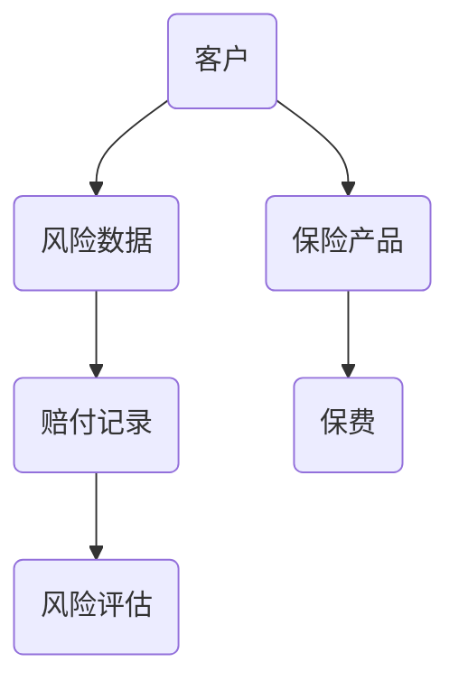

                 

## 机器学习在保险定价中的应用：个性化保费计算

### 关键词：
- 机器学习
- 保险定价
- 个性化保费计算
- 风险评估
- 数据分析

### 摘要：
本文旨在探讨机器学习在保险定价中的应用，特别是在实现个性化保费计算方面。通过分析机器学习的核心概念、保险定价中的挑战与机遇，以及具体的算法和应用案例，本文揭示了机器学习如何帮助保险公司更精准地预测风险、提高运营效率，并为行业带来深远影响。文章还将提供一些实用的最佳实践，以指导保险公司在实际应用中取得成功。

---

### 背景介绍

#### 问题背景

在当前的保险市场中，保险定价是一个复杂且至关重要的过程。保险公司需要通过精细的风险评估和定价模型来确定每个客户的保费，以确保业务的可持续性和利润。然而，随着市场环境的不断变化和客户需求的多样化，传统的保险定价方法逐渐显得不足以应对这种复杂性。

#### 问题描述

保险定价问题主要集中在两个方面：一是如何准确预测客户的风险水平，二是如何根据预测的风险水平设定合理的保费。在传统的定价方法中，保险公司通常依赖于历史数据和统计数据，通过经验公式和专家知识来制定保费。然而，这种方法往往存在局限性，难以充分考虑每个客户的个体差异和实时市场动态。

#### 问题解决

机器学习作为一种先进的数据分析和预测工具，为保险定价提供了新的解决方案。通过训练复杂的机器学习模型，保险公司可以从大量的历史数据中提取有价值的信息，并利用这些信息来预测客户的风险水平，从而实现个性化的保费计算。这种方法不仅可以提高保险定价的准确性，还可以优化保险公司的运营效率和客户满意度。

#### 边界与外延

机器学习在保险定价中的应用不仅局限于传统的车险和人寿保险，还可以扩展到健康保险、财产保险等多个领域。同时，它不仅可以用于新客户的定价，还可以用于现有客户的再评估和调整。此外，随着技术的不断进步和数据量的不断增加，机器学习在保险定价中的应用前景将更加广阔。

#### 概念结构与核心要素组成

- **机器学习**：一种通过数据驱动的方式，使计算机系统能够从经验中学习和改进的技术。核心概念包括监督学习、无监督学习和强化学习。
- **保险定价**：保险公司根据客户的风险水平，计算并设定保费的过程。核心要素包括风险评估、保费设定和风险控制。
- **风险预测**：使用机器学习模型，对客户的风险水平进行预测，以便更准确地定价。

在接下来的章节中，我们将进一步探讨机器学习的核心概念、保险定价中的挑战与机遇，以及如何在保险定价中应用机器学习。

---

### 2. 核心概念与联系

#### 2.1 机器学习的核心概念

机器学习是人工智能的一个重要分支，其核心在于通过数据和算法实现自动化学习和决策。以下是机器学习中的几个核心概念：

1. **监督学习（Supervised Learning）**：
   - **定义**：监督学习是一种从标记数据中学习的方法，模型根据输入数据和对应的输出标签来训练。
   - **在保险定价中的应用**：保险公司可以利用监督学习模型，通过对历史赔付数据进行分析，预测新客户的潜在风险水平。
   - **算法示例**：线性回归、决策树、支持向量机等。

2. **无监督学习（Unsupervised Learning）**：
   - **定义**：无监督学习是一种在没有标记数据的情况下，模型自动发现数据中的模式和结构的方法。
   - **在保险定价中的应用**：通过无监督学习，保险公司可以对客户进行聚类分析，识别具有相似风险特征的人群。
   - **算法示例**：K-均值聚类、主成分分析（PCA）、自编码器等。

3. **强化学习（Reinforcement Learning）**：
   - **定义**：强化学习是一种通过试错和反馈机制来优化决策的机器学习方法。
   - **在保险定价中的应用**：保险公司可以通过强化学习算法，动态调整保费，以最大化收益或降低风险。
   - **算法示例**：Q-学习、深度Q网络（DQN）、策略梯度等。

#### 2.2 保险定价中的挑战与机遇

**挑战**：

1. **数据质量**：保险数据通常包含噪声和不完整信息，这可能会影响模型的效果。
2. **模型可解释性**：传统的机器学习模型往往缺乏可解释性，使得保险公司难以理解模型如何做出决策。
3. **合规性**：保险定价必须符合监管要求，这可能会限制某些算法的使用。

**机遇**：

1. **个性化定价**：通过机器学习，保险公司可以实现更加个性化的保费计算，从而提高客户满意度。
2. **风险识别**：机器学习可以帮助保险公司更准确地识别高风险客户，从而降低赔付风险。
3. **运营效率**：机器学习可以提高保险公司的运营效率，降低人工成本。

#### 2.3 机器学习在保险定价中的应用

**风险评估**：保险公司可以使用机器学习模型，对客户的历史赔付记录、驾驶习惯、健康状况等信息进行分析，预测客户的潜在风险水平。

**再保决策**：通过分析历史数据和保险市场趋势，机器学习可以帮助保险公司做出更明智的再保决策，以降低风险。

**客户细分**：机器学习可以用于聚类分析，将客户划分为不同的风险群体，以便保险公司制定更有针对性的营销策略和保费设定。

### 2.4 概念属性特征对比表格

| 概念 | 定义 | 特征对比 |
| --- | --- | --- |
| 监督学习 | 从标记数据中学习，有输出标签 | 数据需要标注，输出可预测 |
| 无监督学习 | 无需标记数据，自动发现模式 | 数据不需要标注，发现内部结构 |
| 强化学习 | 通过试错和反馈优化决策 | 需要环境交互，学习优化策略 |

### 2.5 ER实体关系图架构

**解释**：该ER图展示了保险定价中涉及的主要实体及其关系。客户与风险数据、保险产品和赔付记录都有直接关联，而风险评估则依赖于客户的赔付记录，最终影响保费的设定。

通过上述核心概念与联系的分析，我们可以更好地理解机器学习在保险定价中的应用，以及它如何帮助保险公司应对挑战和抓住机遇。

---

### 3. 机器学习在保险定价中的应用

#### 3.1 机器学习的核心算法及其原理

机器学习中的核心算法主要包括线性回归、决策树、随机森林、支持向量机和神经网络等。以下是这些算法的基本原理和应用：

1. **线性回归（Linear Regression）**：
   - **原理**：线性回归是一种基于统计学的方法，通过建立自变量和因变量之间的线性关系来预测结果。
   - **应用**：在保险定价中，线性回归可以用于预测客户的赔付金额，从而影响保费的计算。

2. **决策树（Decision Tree）**：
   - **原理**：决策树是一种基于树形结构的方法，通过一系列规则来划分数据，并从中提取决策。
   - **应用**：决策树可以用于客户风险分类，帮助保险公司识别高风险客户，制定更精细的保费策略。

3. **随机森林（Random Forest）**：
   - **原理**：随机森林是一种集成学习方法，通过构建多棵决策树并投票来得到最终结果。
   - **应用**：随机森林可以提高预测的准确性和稳定性，在保险定价中广泛用于风险评估和客户细分。

4. **支持向量机（Support Vector Machine, SVM）**：
   - **原理**：支持向量机是一种基于最大间隔分类的方法，通过寻找超平面将不同类别的数据分开。
   - **应用**：SVM在保险定价中可以用于分类任务，如识别高风险客户或预测赔付金额。

5. **神经网络（Neural Network）**：
   - **原理**：神经网络是一种模仿人脑神经元连接方式的多层结构，通过调整权重和偏置来学习数据。
   - **应用**：神经网络在保险定价中可以用于复杂的非线性关系预测，如预测客户未来的风险变化。

#### 3.2 机器学习在保险定价中的应用实例

以下是一个简单的机器学习在保险定价中的应用实例：

**案例**：一家车险公司希望利用机器学习来预测客户的赔付金额，从而优化保费设定。

1. **数据收集**：收集包含客户驾驶记录、车辆类型、驾驶习惯等特征的历史赔付数据。

2. **数据处理**：对数据进行清洗和预处理，包括缺失值处理、异常值检测和特征工程。

3. **模型选择**：选择合适的机器学习算法，如线性回归或随机森林，来训练模型。

4. **模型训练**：使用训练数据集对模型进行训练，并调整参数以优化预测性能。

5. **模型评估**：使用验证数据集对模型进行评估，以确定模型的准确性和稳定性。

6. **应用预测**：将训练好的模型应用于新客户的数据，预测其未来的赔付金额，并根据预测结果调整保费。

通过这个实例，我们可以看到机器学习在保险定价中的应用是如何实现的。保险公司可以通过利用这些先进的算法和技术，提高预测的准确性和运营效率，从而在激烈的市场竞争中脱颖而出。

### 3.3 机器学习在保险定价中的优劣势分析

#### 优势

1. **精准预测**：机器学习算法可以处理大量数据，通过复杂的模型实现更准确的预测，从而提高保费设定的精准度。

2. **个性化定价**：机器学习可以根据每个客户的个体特征进行个性化定价，提高客户满意度和忠诚度。

3. **运营效率**：自动化机器学习流程可以减少人工干预，提高保险公司的运营效率，降低成本。

4. **风险管理**：机器学习可以帮助保险公司更准确地识别高风险客户，从而优化风险管理和再保决策。

#### 劣势

1. **数据质量**：机器学习模型的性能高度依赖于数据质量，噪声和不完整数据可能会影响模型效果。

2. **模型可解释性**：许多复杂的机器学习模型，如神经网络，往往缺乏可解释性，难以理解其决策过程。

3. **合规性问题**：保险定价需要遵循严格的监管要求，某些算法可能因不符合合规性要求而无法使用。

4. **技术门槛**：机器学习在保险定价中的应用需要专业知识和技能，保险公司可能需要投入更多资源来培养相关人才。

#### 总结

尽管存在一些挑战，机器学习在保险定价中的应用潜力巨大。通过合理利用先进的算法和技术，保险公司可以实现更精准的预测和个性化的定价策略，从而提高运营效率和客户满意度。同时，保险公司也需要关注数据质量、模型可解释性和合规性问题，以确保机器学习应用能够持续、稳定地发展。

### 4. 机器学习在保险定价中的应用前景

随着人工智能技术的不断进步，机器学习在保险定价中的应用前景变得愈加广阔。以下是几个值得关注的趋势和潜在影响：

#### 4.1 现状与趋势

1. **个性化定价**：随着机器学习技术的不断发展，保险公司的个性化定价能力将进一步提高。通过分析客户的个体行为和历史数据，保险公司可以提供更加精准的保费计算，从而提高客户满意度和忠诚度。

2. **实时风险评估**：机器学习模型可以实时处理和分析数据，帮助保险公司快速识别和响应风险变化。例如，在车险中，通过实时监控驾驶行为，保险公司可以动态调整保费。

3. **自动化决策**：随着算法和模型的优化，越来越多的保险决策将实现自动化。这不仅提高了运营效率，还可以减少人为错误，提高决策的准确性。

4. **多渠道数据融合**：保险公司可以通过整合来自多种渠道的数据，如社交媒体、移动设备和物联网设备，来获取更全面的风险评估信息。

#### 4.2 对保险行业的影响

1. **运营效率提升**：通过机器学习，保险公司可以优化内部流程，降低运营成本，提高工作效率。

2. **风险控制优化**：机器学习可以帮助保险公司更准确地识别和管理风险，从而降低赔付率，提高盈利能力。

3. **客户体验改善**：个性化的保费计算和实时风险评估可以提供更好的客户体验，增强客户对保险公司的信任。

4. **市场竞争力**：利用机器学习技术，保险公司可以更好地满足市场需求，提高竞争力，吸引更多客户。

#### 4.3 潜在挑战与应对策略

1. **数据隐私与安全**：保险公司需要确保客户数据的安全和隐私，采用数据加密和匿名化技术来保护数据。

2. **模型可解释性**：保险公司需要开发可解释的机器学习模型，以便监管机构和客户理解模型的决策过程。

3. **合规性问题**：保险公司需要密切关注监管政策的变化，确保机器学习应用符合相关法律法规。

4. **技术更新与维护**：保险公司需要持续投入资源来更新和维护机器学习模型，以保持其性能和适应性。

#### 总结

机器学习在保险定价中的应用前景十分广阔，它不仅为保险公司提供了更精准的风险评估和个性化的保费计算方法，还提高了运营效率和客户满意度。然而，保险公司也需要面对数据隐私、模型可解释性和合规性等挑战，通过采取有效的应对策略，可以实现机器学习在保险行业中的广泛应用。

### 5. 机器学习在保险定价中的最佳实践

在将机器学习应用于保险定价时，保险公司需要遵循一系列最佳实践，以确保模型的有效性和合规性。以下是一些关键步骤和策略：

#### 5.1 数据质量保障

1. **数据清洗**：确保数据的准确性和完整性，处理缺失值、异常值和噪声数据。
2. **数据标准化**：将不同特征的数据进行标准化处理，以便模型能够更好地学习。
3. **数据增强**：通过数据扩充技术，增加训练数据集的多样性，提高模型的泛化能力。

#### 5.2 模型选择与优化

1. **算法评估**：选择多种机器学习算法，并进行比较评估，选择表现最佳的算法。
2. **超参数调整**：通过调整模型参数，优化模型的性能，例如使用网格搜索或随机搜索。
3. **交叉验证**：采用交叉验证方法，评估模型的泛化能力，避免过拟合。

#### 5.3 模型解释与可解释性

1. **模型可视化**：使用可视化工具，如决策树或神经网络结构图，展示模型的内部结构和工作原理。
2. **特征重要性分析**：分析模型中各个特征的重要性，帮助理解模型如何做出决策。
3. **案例研究**：通过实际案例研究，展示模型在不同情况下的表现和决策过程。

#### 5.4 合规性与监管

1. **数据隐私保护**：确保客户数据的安全和隐私，采用数据加密和匿名化技术。
2. **透明度与解释性**：确保模型决策过程透明，方便监管机构和客户理解。
3. **持续监控与合规审计**：定期监控模型性能和合规性，进行审计以确保符合监管要求。

#### 5.5 实践案例与经验分享

1. **案例学习**：分享成功的机器学习应用案例，学习其经验和教训。
2. **跨部门合作**：鼓励技术团队与业务团队的合作，共同推动机器学习在保险定价中的应用。
3. **知识共享**：通过内部培训和工作坊，提高团队对机器学习的理解和应用能力。

通过遵循这些最佳实践，保险公司可以在应用机器学习进行保险定价时，提高模型的准确性、可解释性和合规性，从而实现更高效的风险评估和保费计算。

### 6. 小结

本文详细探讨了机器学习在保险定价中的应用，包括核心概念、应用实例、优势、劣势以及未来前景。通过分析，我们发现机器学习在提高保险定价的准确性、个性化程度和运营效率方面具有显著优势。然而，保险公司也需面对数据隐私、模型可解释性和合规性等挑战。为了实现机器学习在保险定价中的成功应用，保险公司应遵循最佳实践，确保数据质量、模型优化和合规性。未来，随着技术的不断进步，机器学习在保险行业中的应用前景将更加广阔，为保险公司提供更多创新机会和竞争优势。

### 7. 注意事项与拓展阅读

在应用机器学习进行保险定价时，保险公司应特别注意以下几点：

1. **数据保护**：确保客户数据的安全和隐私，遵守相关法律法规。
2. **模型解释性**：提高模型的可解释性，以便监管机构和客户理解决策过程。
3. **持续优化**：定期更新和维护模型，以适应不断变化的市场环境。

以下是一些拓展阅读资源，供进一步学习和研究：

- 《机器学习实战》：由Peter Harrington所著，适合初学者入门。
- 《深度学习》：由Ian Goodfellow、Yoshua Bengio和Aaron Courville合著，全面介绍深度学习理论和技术。
- 《保险精算与数据分析》：由Carter J. Fox和David R. Meeker合著，介绍保险精算和数据分析的方法与应用。

通过深入学习和实践，保险公司可以更好地利用机器学习技术，实现个性化保费计算和高效的风险管理。作者：AI天才研究院/AI Genius Institute & 禅与计算机程序设计艺术 /Zen And The Art of Computer Programming。

