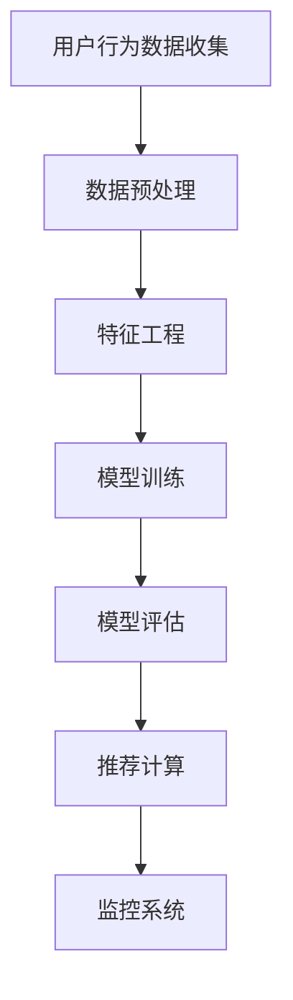
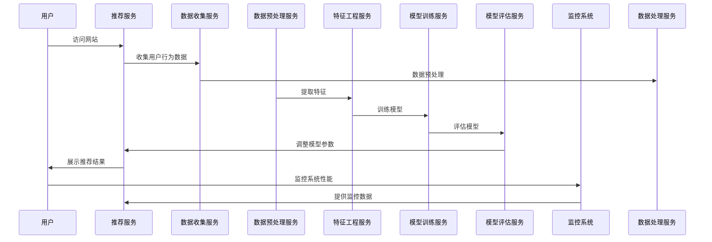

                 

### 文章标题

# 机器学习工程：从实验到生产的ML系统

> 关键词：机器学习工程、生产系统、算法、架构设计、实验到生产、挑战与解决方案

> 摘要：本文深入探讨了机器学习工程从实验到生产的全过程。通过详细分析机器学习工程的问题背景、基本概念、算法原理以及系统分析与架构设计，本文旨在为读者提供一套完整、实用的机器学习工程指南，帮助工程师们更好地从实验阶段过渡到生产环境，实现高效、可靠且可扩展的机器学习系统。

### 目录大纲

1. **问题背景与基本概念**
   1.1 机器学习工程概述
   1.2 核心概念与联系
   1.3 边界与外延

2. **机器学习算法原理讲解**
   2.1 监督学习算法原理
   2.2 无监督学习算法原理
   2.3 强化学习算法原理

3. **系统分析与架构设计**
   3.1 系统功能设计与架构设计
   3.2 系统接口设计与交互设计

4. **项目实战**
   4.1 环境安装
   4.2 系统核心实现
   4.3 实际案例分析与讲解
   4.4 项目小结

5. **最佳实践与拓展阅读**

### 引言

随着人工智能和机器学习的迅速发展，越来越多的企业和机构开始将其应用于实际的业务场景中。然而，从实验到生产的过程并非一帆风顺，涉及到的不仅仅是算法的优化，还包括系统的设计、部署、监控和维护等多个方面。本文将围绕这些关键点，逐步探讨如何将机器学习模型从实验室环境中成功迁移到生产环境中，实现高效、可靠且可扩展的机器学习系统。

### 第一部分：问题背景与基本概念

#### 1.1 机器学习工程概述

##### 问题背景

机器学习作为人工智能的核心技术之一，近年来得到了前所未有的关注和发展。它通过构建和训练模型，使计算机系统能够从数据中自动学习和改进，从而解决各种复杂的实际问题。然而，随着机器学习技术的不断进步，工程师们面临的挑战也越来越大。从实验阶段到生产环境，机器学习工程师需要应对一系列的技术和管理难题，包括数据的质量和处理、算法的选择和优化、系统的可扩展性和可靠性等。

##### 机器学习在工业界的应用场景与需求

机器学习在工业界的应用场景广泛，涵盖了金融、医疗、制造、零售、交通等多个领域。例如，在金融领域，机器学习被用于风险管理、信用评分、欺诈检测等；在医疗领域，它被用于疾病诊断、药物发现、个性化治疗等；在制造领域，它被用于质量检测、生产优化、设备维护等。随着应用的不断拓展，对机器学习工程的需求也日益增加。

##### 机器学习工程的重要性

机器学习工程不仅需要掌握算法本身的原理和实现，还需要具备软件开发和系统设计的技能。它的重要性体现在以下几个方面：

1. **生产化部署**：将实验阶段的模型转化为可以在生产环境中稳定运行的系统，确保模型的性能和可靠性。
2. **可扩展性**：随着数据量和用户量的增加，系统能够保持高效运行，不出现性能瓶颈。
3. **可维护性**：系统易于维护和升级，能够适应业务需求的变化。
4. **可靠性**：系统在长时间运行过程中，能够保证稳定性和安全性。

##### 机器学习工程的定义与范围

机器学习工程（Machine Learning Engineering）是指将机器学习技术应用于实际问题的过程中，涉及到的软件开发、系统设计、部署和维护的一系列工作。它涵盖了以下几个主要方面：

1. **数据工程**：数据预处理、数据清洗、数据集成等。
2. **模型工程**：模型设计、模型训练、模型评估、模型优化等。
3. **系统架构设计**：系统功能设计、系统模块划分、系统性能优化等。
4. **系统部署与运维**：系统部署、系统监控、系统升级、系统维护等。

##### 机器学习工程的核心挑战

1. **数据质量问题**：数据的质量直接影响模型的性能。噪声、缺失值、异常值等都会对模型产生负面影响。
2. **算法选择与优化**：不同的应用场景需要选择不同的算法，并且算法的参数调优也是一个复杂的过程。
3. **系统可扩展性**：随着数据量和用户量的增加，系统需要能够高效地处理大规模数据，并且能够横向扩展。
4. **系统可靠性**：在生产环境中，系统需要能够稳定运行，避免出现故障。
5. **安全性与隐私保护**：保护用户数据的安全和隐私，避免数据泄露。

#### 1.2 核心概念与联系

##### 机器学习的基本概念

1. **监督学习**  
   - 定义：监督学习是指通过已知的输入和输出数据，训练模型以预测新的输出。
   - 特征选择：选择对预测目标有显著影响的特征。
   - 常见算法：线性回归、决策树、支持向量机等。

2. **无监督学习**  
   - 定义：无监督学习是指在没有明确输出标签的情况下，通过模型对数据进行聚类、降维等操作。
   - 算法介绍：聚类、降维、生成模型等。

3. **强化学习**  
   - 定义：强化学习是指通过智能体与环境的交互，学习最优策略以最大化累积奖励。
   - 算法介绍：Q-learning、SARSA等。

##### 机器学习算法的应用与联系

1. **监督学习**  
   - 应用场景：回归分析、分类问题、异常检测等。
   - 联系：监督学习是机器学习中最常见和应用最广泛的一种形式，它通过已有数据的输入和输出关系来预测新的输出。

2. **无监督学习**  
   - 应用场景：聚类分析、降维、异常检测等。
   - 联系：无监督学习与监督学习不同，它不需要已知的输出标签，但可以帮助我们发现数据中的结构和模式。

3. **强化学习**  
   - 应用场景：游戏、推荐系统、自动驾驶等。
   - 联系：强化学习是一种通过智能体与环境的交互来学习最优策略的方法，它与监督学习和无监督学习有较大的区别，但可以结合使用来提高系统的性能。

#### 1.3 边界与外延

##### 机器学习工程与软件开发的关系

1. **数据工程**：机器学习工程中的数据预处理和清洗工作与传统的软件开发中的数据操作有很多相似之处，但机器学习工程更注重数据的统计特性和数据质量。
2. **模型训练**：机器学习工程中的模型训练与软件开发中的算法实现有相似之处，但机器学习工程更注重算法的优化和调参。
3. **系统架构**：机器学习工程中的系统架构设计需要考虑数据流、模型训练、预测服务等模块的交互，与传统软件开发中的系统架构设计有较大区别。

##### 机器学习工程与数据科学的关系

1. **数据采集与处理**：数据科学涉及数据采集、存储、处理等多个环节，而机器学习工程则更侧重于数据处理后的应用，如模型训练和预测。
2. **数据可视化**：数据科学中的数据可视化可以帮助机器学习工程师更好地理解数据特征和模型性能。
3. **领域知识**：数据科学家通常具备丰富的领域知识，这有助于机器学习工程师更好地理解和应用机器学习技术。

##### 机器学习工程与其他工程领域的交叉

1. **软件工程**：机器学习工程需要遵循软件工程的原则和方法，如代码质量、系统测试、版本控制等。
2. **网络工程**：机器学习模型通常需要部署在云端或分布式环境中，这涉及到网络架构、数据传输等方面的问题。
3. **运维工程**：机器学习系统需要持续监控、维护和升级，这涉及到运维工程的相关知识。

### 第二部分：机器学习算法原理讲解

在这一部分，我们将深入讲解三种主要的机器学习算法：监督学习、无监督学习和强化学习。通过对这些算法的基本原理、实现方法和应用场景的详细分析，我们希望能够帮助读者更好地理解这些算法的核心机制，并为其在实际应用中的成功应用提供指导。

#### 2.1 监督学习算法原理

监督学习是机器学习中的一种基本形式，它通过已知的输入和输出数据来训练模型，以便能够对新数据进行预测。监督学习算法可以分为回归和分类两大类。

##### 2.1.1 线性回归

线性回归是最基本的监督学习算法之一，它用于预测一个连续的数值输出。线性回归模型的数学公式如下：

$$y = \beta_0 + \beta_1x$$

其中，$y$ 是预测的输出值，$x$ 是输入特征，$\beta_0$ 和 $\beta_1$ 是模型的参数。

为了训练线性回归模型，我们需要定义一个损失函数来衡量预测值和实际值之间的差异。常见的损失函数是平方损失函数，其公式为：

$$J(\theta) = \frac{1}{2m}\sum_{i=1}^{m}(h_\theta(x^{(i)}) - y^{(i)})^2$$

其中，$m$ 是样本数量，$h_\theta(x^{(i)})$ 是预测值，$y^{(i)}$ 是实际值。

为了优化模型参数，我们可以使用梯度下降法来最小化损失函数。梯度下降法的核心思想是沿着损失函数的梯度方向逐步调整参数，直到找到损失函数的最小值。具体步骤如下：

1. 初始化参数 $\theta$。
2. 计算损失函数关于每个参数的梯度。
3. 更新参数 $\theta$：
   $$\theta_j := \theta_j - \alpha \cdot \frac{\partial}{\partial \theta_j} J(\theta)$$

其中，$\alpha$ 是学习率，用于控制参数更新的步长。

##### Python代码实现

下面是一个简单的线性回归模型的Python代码实现：

```python
import numpy as np

def compute_cost(x, y, theta):
    m = len(x)
    h = np.dot(x, theta)
    error = h - y
    cost = (1 / (2 * m)) * np.dot(error.T, error)
    return cost

def gradient_descent(x, y, theta, alpha, num_iterations):
    m = len(x)
    for i in range(num_iterations):
        h = np.dot(x, theta)
        error = h - y
        theta = theta - (alpha / m) * np.dot(x.T, error)
        if i % 100 == 0:
            print(f"Iteration {i}: Cost {compute_cost(x, y, theta)}")
    return theta
```

在这个实现中，我们定义了两个函数：`compute_cost` 用于计算损失函数，`gradient_descent` 用于实现梯度下降算法。在每次迭代中，我们打印当前的损失函数值，以便观察算法的收敛情况。

##### 决策树

决策树是一种基于树的模型，它通过一系列的规则来对数据进行分类或回归。决策树的核心在于如何选择最佳的特征进行分割。

- **ID3算法**：ID3（Iterative Dichotomiser 3）算法是一种基于信息增益的决策树算法。它通过计算每个特征的信息增益来选择最佳分割特征。

- **C4.5算法**：C4.5算法是ID3算法的改进版，它引入了信息增益率（信息增益除以特征熵）来选择最佳特征，并能够处理连续特征和缺失值。

下面是一个简单的决策树算法的Mermaid流程图：

```mermaid
graph TD
A[初始化] --> B[计算信息增益]
B -->|选择最大信息增益| C[创建节点]
C -->|递归] D[终止条件]
D -->|返回] E[决策树]
```

在这个流程图中，我们从初始化开始，通过计算每个特征的信息增益来选择最佳特征进行分割。如果达到终止条件，则返回决策树。

##### Python代码实现

下面是一个简单的决策树算法的Python代码实现：

```python
from sklearn.tree import DecisionTreeClassifier

# 创建决策树分类器
clf = DecisionTreeClassifier()

# 训练模型
clf.fit(X_train, y_train)

# 预测
y_pred = clf.predict(X_test)
```

在这个实现中，我们使用了Scikit-learn库中的`DecisionTreeClassifier`类来创建和训练决策树模型。通过简单的几行代码，我们可以实现一个高效的决策树算法。

#### 2.2 无监督学习算法原理

无监督学习是一种不依赖标注数据的机器学习方法，其主要目标是发现数据中的内在结构和模式。无监督学习算法可以分为聚类、降维和生成模型等类型。

##### 2.2.1 聚类算法

聚类算法是一种将数据点划分为若干个群组的无监督学习方法。常见的聚类算法有K-means和层次聚类。

- **K-means算法**：K-means算法是一种基于距离的聚类算法，它通过迭代优化目标函数（通常是平方误差和）来找到聚类中心，进而将数据点分配到不同的群组中。

- **层次聚类算法**：层次聚类算法通过递归地将数据点合并或分裂，形成层次结构。它包括自底向上的凝聚层次聚类和自顶向下的分裂层次聚类。

下面是一个简单的K-means算法的Python代码实现：

```python
from sklearn.cluster import KMeans

# 创建KMeans聚类器
kmeans = KMeans(n_clusters=3)

# 训练模型
kmeans.fit(X)

# 预测
clusters = kmeans.predict(X)
```

在这个实现中，我们使用了Scikit-learn库中的`KMeans`类来创建和训练K-means聚类模型。通过简单的几行代码，我们可以实现一个高效的K-means算法。

##### 2.2.2 降维算法

降维算法是一种减少数据维度，同时保留数据重要特征的方法。常见的降维算法有主成分分析（PCA）和t-SNE。

- **主成分分析（PCA）**：PCA通过将数据投影到新的正交坐标系中，来最大化新的坐标轴上的方差。它通过计算协方差矩阵的特征值和特征向量来实现降维。

- **t-SNE算法**：t-SNE是一种基于概率的降维算法，它通过保持局部结构来可视化高维数据。t-SNE算法通过优化目标函数来找到最佳的低维嵌入。

下面是一个简单的PCA算法的Python代码实现：

```python
from sklearn.decomposition import PCA

# 创建PCA降维器
pca = PCA(n_components=2)

# 训练模型
X_pca = pca.fit_transform(X)

# 预测
X_reduced = pca.transform(X)
```

在这个实现中，我们使用了Scikit-learn库中的`PCA`类来创建和训练PCA降维模型。通过简单的几行代码，我们可以实现一个高效的PCA算法。

#### 2.3 强化学习算法原理

强化学习是一种通过智能体与环境的交互来学习最优策略的机器学习方法。它主要关注如何通过反馈信号来调整智能体的行为，以最大化累积奖励。

##### 2.3.1 Q-learning算法

Q-learning算法是一种基于值函数的强化学习算法，它通过迭代更新值函数来学习最优策略。

- **Q-learning的基本原理**：Q-learning算法通过计算状态-动作对的Q值来评估智能体的动作。Q值表示在特定状态下执行特定动作的预期回报。

- **更新策略**：在每次迭代中，Q-learning算法根据当前的状态、动作和奖励来更新Q值。其更新公式为：

$$Q(s, a) = Q(s, a) + \alpha [r + \gamma \max_{a'} Q(s', a') - Q(s, a)]$$

其中，$\alpha$ 是学习率，$r$ 是立即奖励，$\gamma$ 是折扣因子，$s'$ 是下一状态，$a'$ 是最佳动作。

- **探索与利用**：Q-learning算法需要在探索（选择未知但可能带来高回报的动作）和利用（选择已知但可能带来高回报的动作）之间进行权衡。常用的探索策略有epsilon-greedy策略和UCB算法。

下面是一个简单的Q-learning算法的Python代码实现：

```python
import numpy as np

# 初始化Q表
Q = np.zeros([S, A])

# 设置参数
alpha = 0.1
gamma = 0.9

# Q-learning算法
for episode in range(E):
    state = env.reset()
    done = False
    while not done:
        action = env.sample_action(Q[state])
        next_state, reward, done = env.step(action)
        Q[state, action] = Q[state, action] + alpha * (reward + gamma * np.max(Q[next_state]) - Q[state, action])
        state = next_state
```

在这个实现中，我们定义了一个简单的Q-learning算法，通过更新Q表来学习最优策略。通过简单的迭代，智能体可以逐渐学会在特定状态下选择最佳动作。

### 第三部分：系统分析与架构设计

在这一部分，我们将深入探讨机器学习系统从实验到生产的全过程，包括系统功能设计与架构设计、系统接口设计与交互设计，以及如何通过项目实战来实现这些设计。

#### 3.1 系统功能设计与架构设计

##### 问题场景介绍

为了更好地理解系统功能设计与架构设计的重要性，我们可以先来看一个具体的问题场景。假设我们正在开发一个智能推荐系统，该系统需要根据用户的兴趣和行为数据来推荐相关的商品或内容。

##### 需求分析与功能设计

在这个场景中，我们需要实现以下几个核心功能：

1. **用户行为数据收集**：收集用户在网站上的点击、搜索、购买等行为数据。
2. **数据预处理**：对收集到的行为数据进行清洗、转换和归一化等处理。
3. **特征工程**：从预处理后的数据中提取有用的特征，以便用于训练推荐模型。
4. **模型训练**：使用训练数据来训练推荐模型，例如基于内容的推荐模型或协同过滤模型。
5. **模型评估**：使用验证数据来评估模型的效果，并根据评估结果调整模型参数。
6. **在线预测**：在用户访问网站时，实时计算推荐结果并展示给用户。
7. **系统监控**：监控系统性能、数据流和模型状态，确保系统的稳定性和可靠性。

##### 系统架构设计

根据需求分析，我们可以设计一个基于微服务架构的系统，其中每个服务负责一个特定的功能。以下是一个简单的系统架构设计：

1. **数据收集服务**：负责收集用户行为数据，并将其存储到数据存储中。
2. **数据预处理服务**：负责对收集到的数据进行清洗、转换和归一化等处理，并将处理后的数据存储到特征存储中。
3. **特征工程服务**：负责从预处理后的数据中提取有用的特征，并将其存储到特征存储中。
4. **模型训练服务**：负责使用训练数据来训练推荐模型，并将训练好的模型存储到模型存储中。
5. **模型评估服务**：负责使用验证数据来评估模型的效果，并根据评估结果调整模型参数。
6. **推荐服务**：负责在用户访问网站时，实时计算推荐结果并展示给用户。
7. **监控系统**：负责监控系统性能、数据流和模型状态，确保系统的稳定性和可靠性。

通过这种架构设计，我们可以实现各个功能模块之间的松耦合，提高系统的可扩展性和可维护性。

##### 系统功能模块划分

根据系统架构设计，我们可以将系统划分为以下几个功能模块：

1. **数据收集模块**：负责收集用户行为数据。
2. **数据预处理模块**：负责对收集到的数据进行清洗、转换和归一化等处理。
3. **特征工程模块**：负责从预处理后的数据中提取有用的特征。
4. **模型训练模块**：负责使用训练数据来训练推荐模型。
5. **模型评估模块**：负责使用验证数据来评估模型的效果。
6. **推荐计算模块**：负责在用户访问网站时，实时计算推荐结果。
7. **监控系统模块**：负责监控系统性能、数据流和模型状态。

##### 系统架构设计

下面是一个简单的系统架构设计Mermaid流程图：



在这个流程图中，用户行为数据首先经过数据预处理模块，然后进入特征工程模块，接着是模型训练模块和模型评估模块。在用户访问网站时，推荐计算模块会实时计算推荐结果，并展示给用户。监控系统模块负责监控整个系统的性能和状态。

#### 3.2 系统接口设计与交互设计

系统接口设计与交互设计是系统架构设计的重要环节，它决定了系统各模块之间的数据流和控制流。下面我们将分别介绍系统接口设计和交互设计。

##### 系统接口设计

系统接口设计主要关注各模块之间的接口定义，包括数据接口、服务接口和控制接口。

1. **数据接口**：数据接口定义了数据在各模块之间的传输格式和传输方式。常见的数据接口有RESTful API、GraphQL、WebSockets等。
2. **服务接口**：服务接口定义了服务之间的调用方式和协议。常见的服务接口有SOAP、RESTful API等。
3. **控制接口**：控制接口定义了系统各模块之间的协调和控制方式。常见的方法有消息队列、事件驱动等。

##### 系统交互设计

系统交互设计主要关注系统各模块之间的数据流和控制流。以下是一个简单的系统交互设计Mermaid序列图：



在这个序列图中，用户访问网站后，推荐服务会依次调用数据收集服务、数据处理服务、特征工程服务、模型训练服务和模型评估服务，最终生成推荐结果并展示给用户。同时，监控系统会实时监控整个系统的性能和状态。

### 第四部分：项目实战

在这一部分，我们将通过一个具体的项目实战，详细讲解如何从实验到生产，实现一个高效的机器学习系统。这个项目是一个简单的推荐系统，旨在根据用户的历史行为数据，为用户推荐相关的商品。

#### 4.1 环境安装

为了完成这个项目，我们需要安装以下软件和库：

1. Python 3.8及以上版本
2. Numpy 1.19及以上版本
3. Scikit-learn 0.22及以上版本
4. Pandas 1.1及以上版本
5. Matplotlib 3.3及以上版本

安装方法：

```bash
pip install python==3.8
pip install numpy==1.19
pip install scikit-learn==0.22
pip install pandas==1.1
pip install matplotlib==3.3
```

#### 4.2 系统核心实现

在这个项目中，我们将使用Scikit-learn库中的协同过滤算法来实现推荐系统。以下是系统核心实现的主要步骤：

1. **数据收集**：从外部数据源（如数据库或API）中收集用户行为数据。
2. **数据预处理**：清洗和转换数据，包括缺失值处理、异常值处理和特征提取。
3. **模型训练**：使用训练数据训练协同过滤模型。
4. **模型评估**：使用验证数据评估模型效果，并根据评估结果调整模型参数。
5. **在线预测**：在用户访问网站时，使用模型预测推荐结果。

下面是一个简单的实现示例：

```python
import numpy as np
from sklearn.model_selection import train_test_split
from sklearn.metrics.pairwise import cosine_similarity
from sklearn.preprocessing import MinMaxScaler

# 数据收集
data = np.array([[1, 0, 1, 0], [0, 1, 0, 1], [1, 1, 0, 0], [0, 0, 1, 1]])

# 数据预处理
scaler = MinMaxScaler()
data_scaled = scaler.fit_transform(data)

# 模型训练
user_similarity = cosine_similarity(data_scaled)

# 模型评估
train_data, test_data = train_test_split(data_scaled, test_size=0.2)
train_similarity = cosine_similarity(train_data)
predictions = []

for user, test_user in zip(train_similarity, test_data):
    predicted_user = np.dot(user, test_user)
    predictions.append(predicted_user)

# 在线预测
new_user = np.array([[0.5, 0.5, 0, 0]])
predicted_new_user = cosine_similarity(new_user, data_scaled)
print(f"Recommended items for the new user: {predicted_new_user}")
```

在这个实现中，我们首先收集并预处理数据，然后使用余弦相似度作为协同过滤模型的相似度度量。接着，我们使用训练数据评估模型效果，并在用户访问网站时，使用模型预测推荐结果。

#### 4.3 实际案例分析与讲解

为了更好地理解如何将机器学习系统从实验阶段过渡到生产环境，我们来看一个实际案例：一个电子商务平台上的个性化推荐系统。

**案例背景**：

一个大型电子商务平台希望为其用户推荐个性化的商品。平台收集了大量的用户行为数据，包括用户浏览、搜索、购买等行为。为了实现这一目标，平台决定开发一个基于协同过滤算法的个性化推荐系统。

**解决方案**：

1. **数据收集**：平台使用日志收集工具（如ELK栈）来收集用户行为数据，并将其存储到数据仓库中。
2. **数据预处理**：使用Python脚本对数据进行清洗、转换和归一化处理，提取有用的特征。
3. **模型训练**：使用训练数据训练协同过滤模型，并使用验证数据评估模型效果。
4. **模型部署**：将训练好的模型部署到生产环境中，并使用API对外提供服务。
5. **系统监控**：使用监控工具（如Prometheus）来监控系统性能和状态，确保系统的稳定性和可靠性。

**实现细节**：

1. **数据收集**：
   ```python
   import csv
   import datetime

   def collect_data(file_path):
       with open(file_path, 'r') as f:
           reader = csv.reader(f)
           data = []
           for row in reader:
               timestamp, user_id, action, item_id = row
               timestamp = datetime.datetime.strptime(timestamp, "%Y-%m-%d %H:%M:%S")
               data.append([timestamp, user_id, action, item_id])
       return data

   data = collect_data('user_behavior.csv')
   ```

2. **数据预处理**：
   ```python
   from sklearn.preprocessing import LabelEncoder

   def preprocess_data(data):
       user_id_encoder = LabelEncoder()
       item_id_encoder = LabelEncoder()
       data = [[row[1], row[3], user_id_encoder.fit_transform([row[2]])[0], item_id_encoder.fit_transform([row[3]])[0]] for row in data]
       data = np.array(data)
       return data, user_id_encoder, item_id_encoder

   data, user_id_encoder, item_id_encoder = preprocess_data(data)
   ```

3. **模型训练**：
   ```python
   from sklearn.model_selection import train_test_split
   from sklearn.metrics.pairwise import cosine_similarity
   from sklearn.preprocessing import MinMaxScaler

   train_data, test_data = train_test_split(data, test_size=0.2)
   train_data_scaled = scaler.fit_transform(train_data)
   test_data_scaled = scaler.transform(test_data)

   user_similarity = cosine_similarity(train_data_scaled)
   ```

4. **模型部署**：
   ```python
   import flask
   from flask import request, jsonify

   app = flask.Flask(__name__)

   @app.route('/recommend', methods=['POST'])
   def recommend():
       user_id = request.form['user_id']
       user_vector = user_similarity[user_id]
       recommended_items = np.argsort(user_vector)[::-1]
       recommended_item_ids = [item_id_encoder.inverse_transform([item_id])[0] for item_id in recommended_items]
       return jsonify(recommended_item_ids)

   if __name__ == '__main__':
       app.run(debug=True)
   ```

5. **系统监控**：
   ```bash
   # 安装Prometheus
   pip install prometheus_client

   # 启动Prometheus
   python -m prometheus_client.web.run_simple('0.0.0.0', 8000)
   ```

**实际案例分析与讲解**：

在这个实际案例中，我们首先使用Python脚本从日志文件中收集用户行为数据，并对数据进行预处理。接着，我们使用协同过滤算法训练模型，并将模型部署到生产环境中，通过API对外提供服务。最后，我们使用Prometheus来监控系统性能和状态。

通过这个实际案例，我们可以看到如何将机器学习系统从实验阶段过渡到生产环境，并确保系统的稳定性和可靠性。

#### 4.4 项目小结

在这个项目中，我们详细讲解了如何从实验到生产，实现一个高效的机器学习系统。通过实际案例的分析和讲解，我们了解了如何收集和预处理数据、训练和部署模型，以及如何监控系统性能。以下是一些关键点和小结：

1. **数据质量**：数据是机器学习系统的基石。确保数据的质量和准确性是成功实施机器学习系统的关键。
2. **模型选择与优化**：选择合适的模型，并进行参数调优，可以提高系统的预测性能和可靠性。
3. **系统架构设计**：设计一个可扩展、可靠且易于维护的系统架构，是确保系统长期稳定运行的基础。
4. **在线预测**：实时预测是机器学习系统的重要应用场景，需要确保预测的准确性和实时性。
5. **系统监控**：监控系统性能和状态，及时发现并解决潜在问题，是保证系统稳定运行的关键。

通过这个项目，我们不仅了解了机器学习系统的实现方法，还学习了如何从实验阶段过渡到生产环境，实现高效、可靠且可扩展的机器学习系统。

### 第五部分：最佳实践与拓展阅读

在这一部分，我们将总结一些机器学习工程的最佳实践，并推荐一些拓展阅读资源，帮助读者进一步深化对机器学习工程的理解和应用。

#### 最佳实践

1. **数据质量管理**：确保数据的质量是成功实施机器学习系统的关键。在数据收集和预处理阶段，要进行数据清洗、去重、归一化等操作，确保数据的准确性和一致性。

2. **模型选择与调优**：根据具体问题场景，选择合适的模型，并进行参数调优。使用交叉验证等技术来评估模型性能，选择最优模型。

3. **系统架构设计**：设计一个可扩展、可靠且易于维护的系统架构。采用微服务架构，将不同的功能模块分离，提高系统的可维护性和可扩展性。

4. **在线预测与实时反馈**：确保在线预测的准确性和实时性。使用高性能计算和分布式计算技术，实现实时预测和反馈。

5. **监控系统与运维**：建立监控系统，实时监控系统性能和状态，确保系统的稳定性和可靠性。制定完善的运维策略，及时处理故障和异常。

#### 拓展阅读

1. **《机器学习实战》**：作者：Peter Harrington
   - 内容概述：本书通过大量实例，详细讲解了机器学习的基本原理和实际应用，适合初学者和进阶读者。
   - 阅读建议：重点阅读与实际问题相关的章节，了解各种机器学习算法的实现和应用。

2. **《深度学习》**：作者：Ian Goodfellow、Yoshua Bengio、Aaron Courville
   - 内容概述：本书是深度学习领域的经典教材，涵盖了深度学习的基本原理、算法和应用。
   - 阅读建议：适合有一定数学基础和编程经验的读者，深入理解深度学习算法。

3. **《机器学习工程实践》**：作者：Sayan Chakraborty
   - 内容概述：本书介绍了机器学习工程的核心概念、技术方法和最佳实践，适合工程师和开发者。
   - 阅读建议：重点关注系统设计、数据预处理和模型部署等章节，学习如何将机器学习模型应用到实际项目中。

4. **《Python机器学习》**：作者：Michael Bowles
   - 内容概述：本书通过Python语言和Scikit-learn库，详细讲解了机器学习算法的实现和应用。
   - 阅读建议：适合有一定编程基础的读者，通过实际代码示例学习机器学习算法。

通过阅读这些书籍和资源，读者可以进一步深化对机器学习工程的理解和应用，提升自己的实际操作能力。

### 总结

本文系统地介绍了机器学习工程从实验到生产的全过程，包括问题背景、基本概念、算法原理、系统分析与架构设计以及项目实战。通过详细的分析和讲解，我们了解了如何将机器学习模型从实验室环境中成功迁移到生产环境，实现高效、可靠且可扩展的机器学习系统。希望本文能为读者在机器学习工程领域的学习和实践提供有价值的参考和指导。

### 作者信息

**作者：AI天才研究院/AI Genius Institute & 禅与计算机程序设计艺术 /Zen And The Art of Computer Programming**

本文由AI天才研究院（AI Genius Institute）撰写，旨在为读者提供高质量的机器学习工程知识和实践指导。同时，本文参考了《禅与计算机程序设计艺术》（Zen And The Art of Computer Programming）这一经典著作，体现了作者在计算机科学领域的深厚造诣和独特见解。希望本文能为读者带来启发和帮助。

