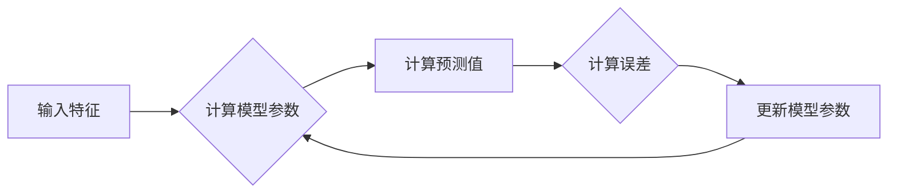
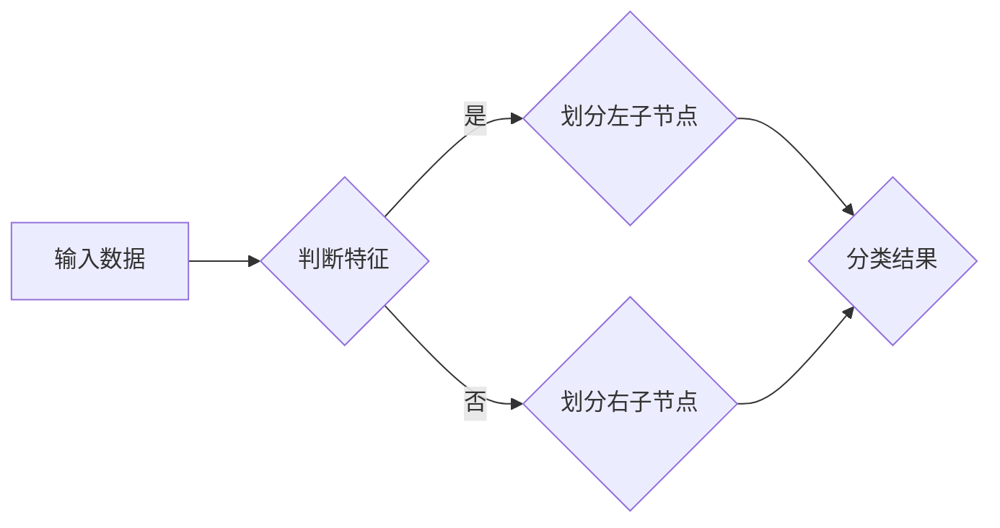
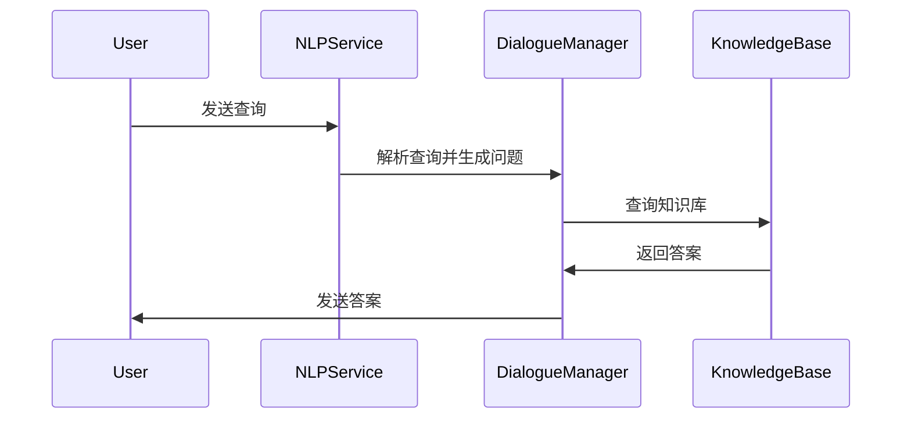
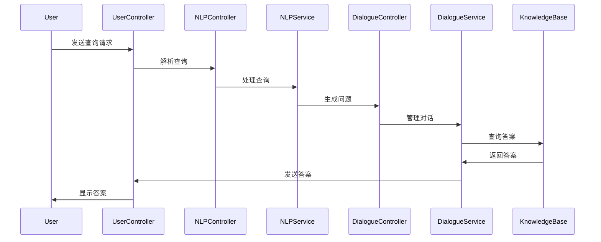

                 

### 文章标题

# 机器学习工程：从模型到生产的全流程

### 文章关键词

- 机器学习
- 数据工程
- 模型开发
- 模型部署
- 生产优化

### 摘要

本文深入探讨了机器学习工程领域，从模型构建到生产部署的完整流程。我们将详细分析每个阶段的核心概念、关键步骤和最佳实践，帮助读者理解并掌握如何将机器学习项目从理论转化为实际应用。通过案例研究、算法讲解和实战演练，本文旨在为机器学习工程师提供实用的指导，确保项目在现实中高效、可靠地运行。

## 前言

在当今数据驱动的时代，机器学习已成为许多行业创新的核心驱动力。然而，将一个机器学习模型从理论研究转化为实际生产环境中的应用并非易事。这需要机器学习工程师具备多方面的技能和知识，从数据预处理到模型训练，再到模型部署和监控。本文旨在为读者提供一个全面而深入的机器学习工程指南，帮助大家克服从模型到生产的各个挑战。

文章首先介绍了机器学习工程的基本概念和流程，接着深入探讨模型开发的关键技术，包括模型选择、训练和评估。随后，文章转向模型部署，讨论了部署策略、基础设施和运维技巧。在生产优化部分，我们将探讨如何确保模型的可靠性和可扩展性。最后，通过案例研究和最佳实践，本文为读者提供了实用的建议和指导。

### 背景介绍

机器学习工程是机器学习（Machine Learning，ML）与软件工程（Software Engineering，SE）相结合的一个领域，专注于将机器学习模型从理论研究转化为实际应用的全过程。这一领域的重要性在于，它不仅需要机器学习方面的专业知识，还要求对软件开发、系统架构、数据工程和运维等领域的深入了解。

机器学习工程的核心概念包括数据工程、模型开发、模型部署和生产优化。数据工程涉及数据收集、清洗、存储和管理，为模型训练提供高质量的数据支持。模型开发包括选择合适的算法、设计模型结构、训练和调优，目标是构建一个能够准确预测或分类的模型。模型部署是将训练好的模型部署到生产环境中，使其能够实时处理数据并提供服务。生产优化则关注如何确保模型在高负载、多变的实际环境中稳定运行。

机器学习工程面临的主要挑战有：

1. **数据质量**：数据是机器学习模型的基石，数据质量直接影响到模型的性能和可靠性。
2. **模型复杂性**：随着深度学习等复杂模型的普及，模型的训练和部署变得更加复杂，需要更多的计算资源和时间。
3. **可扩展性和可靠性**：在生产环境中，模型需要能够处理大规模数据并保持高可用性。
4. **安全性**：保护用户数据的安全和隐私是机器学习工程的重要任务。
5. **维护和更新**：模型需要定期更新和优化，以适应新的数据和业务需求。

通过理解这些核心概念和挑战，读者可以更好地把握机器学习工程的全貌，并为后续章节的学习打下坚实的基础。

### 问题背景

随着大数据和云计算技术的发展，机器学习（ML）的应用场景日益丰富，从简单的推荐系统到复杂的自动驾驶和医疗诊断，ML已经深入到各个行业中。然而，将一个ML模型从理论研究转化为实际生产应用，并非一蹴而就。这一过程涉及多个复杂环节，包括数据收集、预处理、模型开发、训练、评估、部署和监控等。这些环节不仅需要机器学习领域的专业知识，还需要软件工程、数据工程和系统运维等多方面的技能。

具体来说，机器学习工程面临以下几个主要问题：

1. **数据质量**：高质量的数据是机器学习模型成功的关键。然而，实际应用中的数据往往存在噪声、缺失值和不一致性等问题。数据清洗和预处理是确保数据质量的重要步骤。

2. **模型复杂性**：随着深度学习等复杂模型的普及，模型的训练和部署变得更加复杂。这些模型通常需要大量的计算资源和时间进行训练，并且在部署时需要考虑如何高效地处理实时数据流。

3. **可扩展性和可靠性**：在生产环境中，模型需要能够处理大规模数据并保持高可用性。这要求系统架构设计具有高可扩展性和容错能力，以确保在数据量增加或系统负载变化时，模型仍能稳定运行。

4. **安全性**：在处理敏感数据时，确保数据的安全和隐私是机器学习工程的重要任务。这涉及到数据加密、访问控制和安全审计等机制。

5. **维护和更新**：随着业务需求和数据环境的变化，模型需要定期更新和优化。这不仅包括算法层面的改进，还包括基础设施的升级和系统的维护。

这些问题不仅对机器学习工程师提出了更高的要求，也使得整个机器学习工程过程变得更加复杂和挑战性。因此，理解并解决这些问题是成功实施机器学习项目的关键。

### 问题描述

为了更好地理解机器学习工程中的问题和挑战，我们可以通过一个典型的应用场景来阐述。假设我们正在开发一个智能客服系统，该系统能够通过自然语言处理（NLP）技术理解和响应用户的查询。以下是该应用场景中涉及的几个关键问题：

1. **数据质量**：
   - 数据来源：系统需要从多个渠道（如社交媒体、客户服务记录、用户反馈等）收集数据。
   - 数据清洗：收集到的数据可能包含噪声和错误，如拼写错误、语法错误和不完整信息。因此，数据清洗是确保数据质量的关键步骤。
   - 数据一致性：不同来源的数据可能存在格式和内容上的不一致，需要统一处理。

2. **模型复杂性**：
   - 模型选择：需要选择合适的NLP算法，如循环神经网络（RNN）、长短时记忆网络（LSTM）或Transformer模型。
   - 模型训练：训练模型需要大量的标注数据和计算资源。深度学习模型通常需要多次迭代和调优，以达到较好的性能。
   - 模型解释性：在处理复杂问题时，模型的解释性变得尤为重要，以帮助理解和优化模型。

3. **可扩展性和可靠性**：
   - 系统架构：需要设计一个可扩展的架构，以支持用户数量的增长和数据流量的增加。这可能包括分布式计算、负载均衡和数据库分片等技术。
   - 实时处理：系统需要能够实时响应用户查询，这要求模型部署和数据处理具有高效率和低延迟。

4. **安全性**：
   - 数据保护：处理敏感数据时，需要确保数据加密和访问控制，以防止数据泄露。
   - 模型安全：需要防止恶意攻击和模型篡改，确保模型的安全性和稳定性。

5. **维护和更新**：
   - 算法优化：根据用户反馈和性能评估，需要不断优化模型算法，以提高响应准确率和用户体验。
   - 系统升级：随着技术发展和业务需求的变化，系统需要定期进行升级和改进，以保持其竞争力和适应性。

通过这个应用场景，我们可以看到机器学习工程中的多个关键问题。解决这些问题不仅需要技术层面的考虑，还需要全面的规划和执行。理解这些问题并找到合适的解决方案，是实现机器学习项目成功的关键。

### 问题解决

针对上述场景中的问题，我们可以从以下几个方面提出解决方案：

1. **数据质量**：
   - **数据清洗**：采用自动化工具（如Pandas库）进行数据预处理，包括去除噪声、填补缺失值和统一数据格式。此外，可以结合机器学习技术（如聚类分析）进行异常检测和数据清洗。
   - **数据增强**：通过数据扩展技术（如数据合成、图像生成）增加数据多样性，提高模型泛化能力。

2. **模型复杂性**：
   - **模型选择**：根据问题特性选择合适的模型。例如，对于序列数据处理，可以考虑使用LSTM或Transformer模型。在模型选择过程中，还可以采用模型评估工具（如Kaggle）进行性能比较和选择。
   - **模型调优**：使用超参数调优工具（如Hyperopt）进行模型参数的优化，提高模型性能。此外，可以使用自动化机器学习（AutoML）技术简化模型选择和调优过程。

3. **可扩展性和可靠性**：
   - **系统架构设计**：采用分布式计算框架（如TensorFlow Serving、MXNet）和微服务架构（如Kubernetes）进行系统设计，以提高系统的可扩展性和可靠性。分布式计算可以充分利用多个GPU或CPU资源，提高训练效率。
   - **负载均衡**：使用负载均衡器（如Nginx、HAProxy）平衡系统负载，避免单点故障和资源瓶颈。

4. **安全性**：
   - **数据加密**：采用加密算法（如AES、RSA）对敏感数据进行加密，确保数据在传输和存储过程中的安全性。
   - **访问控制**：通过身份验证和权限管理（如OAuth 2.0、JWT）控制对数据的访问，防止未经授权的访问和操作。

5. **维护和更新**：
   - **版本控制**：使用版本控制系统（如Git）管理代码和模型版本，确保每次更新都有迹可循。
   - **持续集成和持续部署（CI/CD）**：采用CI/CD流程自动化测试、构建和部署，加快模型更新和发布过程。

通过上述解决方案，可以有效地应对机器学习工程中的各种挑战，确保项目在数据质量、模型复杂性、系统扩展性、安全性和维护等方面都能得到妥善处理。这些解决方案不仅适用于智能客服系统，也可为其他机器学习应用场景提供参考。

### 边界与外延

在探讨机器学习工程时，有必要明确一些相关的概念和外延，以确保对这一领域的理解更加全面和深入。

首先，**机器学习工程**与**机器学习研究**有显著的区别。机器学习研究主要关注算法的创新和理论突破，如新的学习算法、优化方法和理论框架。而机器学习工程则侧重于将这些研究成果应用于实际场景，解决现实问题。这意味着机器学习工程师不仅需要掌握算法原理，还需具备软件开发、系统架构和运维等跨学科的知识。

其次，**机器学习工程**与**数据工程**密切相关。数据工程涉及数据收集、存储、处理和管理，为机器学习模型的训练提供高质量的数据支持。两者之间的区别在于，数据工程更注重数据的准备和基础设施的搭建，而机器学习工程则侧重于如何利用这些数据来构建和优化机器学习模型。

此外，**机器学习工程**与**软件工程**也有许多交集。软件工程关注软件系统的设计、开发、测试和维护，而机器学习工程则将这些原则应用于机器学习应用的开发。例如，在机器学习工程中，同样需要遵循软件工程的最佳实践，如代码复用、模块化设计和自动化测试。

在讨论机器学习工程时，还需要区分**模型开发**和**模型部署**。**模型开发**包括模型的选择、训练和评估，目标是构建一个能够准确预测或分类的模型。而**模型部署**则是将训练好的模型集成到实际生产环境中，使其能够实时处理数据并提供服务。这两个环节在技术和流程上都有不同的要求，需要不同的工具和方法来支持。

最后，**机器学习工程**与**生产优化**密切相关。生产优化关注如何确保模型在高负载、多变的实际环境中稳定运行，包括性能调优、资源管理和故障排除。这一过程不仅涉及技术层面的优化，还需考虑业务需求和用户反馈，以持续改进模型和系统。

通过明确这些概念和边界，可以更好地理解机器学习工程的整体架构，并为其在实际应用中的成功提供指导。

### 概念结构与核心要素组成

机器学习工程是一个复杂的系统，由多个核心要素组成，每个要素在模型从理论到生产的转换过程中都扮演着关键角色。以下是对这些核心要素及其相互关系的详细解析。

#### 1. 数据工程

数据工程是机器学习工程的基础，它包括数据收集、数据预处理、数据存储和数据管理。具体步骤如下：

- **数据收集**：从各种来源（如数据库、API、传感器等）收集数据。这需要考虑数据的质量和多样性，以确保模型的泛化能力。
- **数据预处理**：清洗数据，填补缺失值，处理异常值，统一数据格式。这一步骤是确保数据质量的关键，直接影响模型的表现。
- **数据存储**：选择合适的数据存储解决方案（如关系型数据库、NoSQL数据库、数据湖等），以高效地存储和管理大规模数据。
- **数据管理**：使用数据管理工具（如数据仓库、数据湖、数据流处理平台等）进行数据整合、分析和查询，为模型训练提供高质量的数据支持。

#### 2. 模型开发

模型开发是机器学习工程的核心环节，包括模型选择、模型训练、模型评估和模型优化。以下是每个步骤的详细说明：

- **模型选择**：根据问题特性选择合适的算法和模型结构。例如，对于回归问题，可以选择线性回归、决策树、随机森林等；对于分类问题，可以选择逻辑回归、支持向量机（SVM）、神经网络等。
- **模型训练**：使用训练数据集对模型进行训练，调整模型参数，使模型能够学会从数据中提取特征并进行预测。
- **模型评估**：使用验证数据集评估模型的表现，通过指标（如准确率、召回率、F1分数等）衡量模型的性能，并调整模型参数以优化性能。
- **模型优化**：通过超参数调优、正则化、集成学习等方法进一步提升模型的性能和泛化能力。

#### 3. 模型部署

模型部署是将训练好的模型集成到生产环境中，使其能够实时处理数据并提供服务。以下是模型部署的关键步骤：

- **容器化**：使用容器化技术（如Docker）将模型和依赖环境打包，确保模型在不同的环境中保持一致性和可移植性。
- **服务化**：使用模型服务化框架（如TensorFlow Serving、MXNet、PyTorch）将模型部署为微服务，以便于管理和扩展。
- **自动化**：使用自动化工具（如Kubernetes、Docker Compose）进行模型的自动化部署、扩展和更新。
- **监控和日志**：实施监控和日志记录机制，实时跟踪模型的运行状态和性能指标，以便快速发现和解决问题。

#### 4. 生产优化

生产优化是确保模型在高负载、多变的实际环境中稳定运行的过程，包括性能调优、资源管理和故障排除。以下是生产优化的关键步骤：

- **性能调优**：通过调整模型参数、优化代码和算法等手段，提高模型的运行效率和预测性能。
- **资源管理**：合理分配计算资源和存储资源，确保模型在资源受限的环境中仍能高效运行。
- **故障排除**：通过监控和日志分析，快速发现和解决模型运行中的问题，确保系统的稳定性和可靠性。
- **持续集成和持续部署（CI/CD）**：采用自动化流程进行代码和模型的集成、测试和部署，加快开发和发布周期。

#### 要素关系与协作

这些核心要素之间相互关联、协作，共同推动机器学习工程的成功实施：

- **数据工程**为模型开发提供了高质量的数据支持，是模型训练和优化的基础。
- **模型开发**是整个机器学习工程的核心，决定了模型的性能和可靠性。
- **模型部署**将训练好的模型集成到生产环境中，使其能够为实际应用提供服务。
- **生产优化**确保模型在高负载和多变的环境中稳定运行，持续提升系统的性能和用户体验。

通过这些要素的有机协作，机器学习工程可以高效地将模型从理论研究转化为实际应用，为各行各业带来创新和变革。

### 关键概念与联系

在机器学习工程中，理解关键概念及其相互联系是至关重要的。以下是对几个核心概念的定义、属性特征对比及其关系的详细阐述。

#### 概念定义

1. **数据工程**：数据工程涉及数据收集、清洗、存储和管理，为机器学习模型提供高质量的数据支持。主要任务包括数据预处理、数据整合、数据存储和数据治理。
   
2. **模型开发**：模型开发包括模型选择、模型训练、模型评估和模型优化。目标是构建一个准确、可靠且泛化能力强的机器学习模型。

3. **模型部署**：模型部署是将训练好的模型集成到生产环境中，使其能够实时处理数据并提供服务。主要任务包括容器化、服务化、自动化和监控。

4. **生产优化**：生产优化是确保模型在高负载、多变的实际环境中稳定运行的过程，包括性能调优、资源管理和故障排除。

#### 属性特征对比

| 概念           | 属性特征                                                         | 比较                       |
|----------------|----------------------------------------------------------------|--------------------------|
| 数据工程       | 数据收集、清洗、存储、管理、数据治理                           | 确保数据质量，为模型提供数据支持           |
| 模型开发       | 模型选择、训练、评估、优化                                     | 构建和改进机器学习模型               |
| 模型部署       | 容器化、服务化、自动化、监控                                   | 使模型在生产和业务环境中运行               |
| 生产优化       | 性能调优、资源管理、故障排除、持续集成和部署                     | 提高模型在真实环境中的运行效率和稳定性     |

#### ER实体关系图架构

为了更好地理解这些概念之间的关系，我们可以通过ER（Entity-Relationship，实体关系）图来展示它们之间的联系。

```mermaid
erDiagram
  ModelDevelopment ||--|{ DataEngineering }  : 提供数据支持
  ModelDeployment  ||--|{ ProductionOptimization }  : 实施优化措施
  ProductionOptimization ||--|{ ModelDeployment }  : 维护和优化模型
  ModelDevelopment ||--|{ ModelEvaluation }  : 评估模型性能
  ModelDeployment  ||--|{ ModelMonitoring }  : 实时监控模型运行状态
```

#### 关系解释

- **数据工程**与**模型开发**之间的关系：数据工程为模型开发提供高质量的数据支持，是模型训练和优化的基础。
- **模型部署**与**生产优化**之间的关系：模型部署是将训练好的模型集成到生产环境中，而生产优化确保模型在真实环境中的运行效率和稳定性。
- **生产优化**与**模型部署**之间的关系：生产优化需要对部署的模型进行性能调优、资源管理和故障排除，以维持其稳定运行。

通过理解这些关键概念及其相互联系，我们可以更好地把握机器学习工程的整体架构，并有效地实施和管理机器学习项目。

### 算法原理讲解

在机器学习工程中，算法原理是模型开发的核心。下面我们将详细介绍几种常用的机器学习算法，通过Mermaid流程图展示其基本工作流程，并使用Python代码进行具体实现，辅以LaTeX公式和通俗易懂的示例来解释算法原理。

#### 1. 线性回归

线性回归是一种简单的机器学习算法，用于预测连续值输出。其基本原理是通过找到一个最佳拟合直线来最小化预测值与实际值之间的误差。

**Mermaid流程图：**


**Python代码实现：**
```python
import numpy as np

# 模型参数初始化
theta = np.array([0, 0])

# 学习率
alpha = 0.01

# 输入特征和目标值
X = np.array([[1, 2], [2, 3], [3, 4]])
y = np.array([2, 3, 4])

# 梯度下降法
for i in range(1000):
    # 预测值
    y_pred = X.dot(theta)
    
    # 计算误差
    error = y - y_pred
    
    # 计算梯度
    gradient = X.T.dot(error)
    
    # 更新模型参数
    theta -= alpha * gradient

print("最优参数:", theta)
```

**LaTeX公式：**
$$
\theta_{\text{new}} = \theta_{\text{old}} - \alpha \frac{\partial J(\theta)}{\partial \theta}
$$
其中，$J(\theta)$为损失函数，$\alpha$为学习率。

**示例：**
假设我们要预测房价，特征为房屋面积和卧室数量。通过训练数据，我们使用线性回归模型找到最佳拟合直线，从而预测未知数据的房价。

#### 2. 决策树

决策树是一种基于树形模型的分类算法，通过一系列的决策规则将数据划分为不同的类别。

**Mermaid流程图：**


**Python代码实现：**
```python
from sklearn.datasets import load_iris
from sklearn.tree import DecisionTreeClassifier
import pandas as pd

# 加载鸢尾花数据集
iris = load_iris()
X = iris.data
y = iris.target

# 创建决策树模型
clf = DecisionTreeClassifier()

# 训练模型
clf.fit(X, y)

# 预测新数据
new_data = pd.DataFrame([[3, 4.4]], columns=['sepal length', 'sepal width'])
prediction = clf.predict(new_data)

print("预测结果:", prediction)
```

**LaTeX公式：**
$$
y = \begin{cases} 
\text{左子节点} & \text{if } f(x) < t \\
\text{右子节点} & \text{if } f(x) \geq t 
\end{cases}
$$
其中，$f(x)$为特征值，$t$为阈值。

**示例：**
我们使用鸢尾花数据集来训练一个决策树模型，预测新的数据点属于哪个类别。

#### 3. 支持向量机（SVM）

支持向量机是一种强大的分类算法，通过找到一个最佳的超平面，将不同类别的数据点分离。

**Mermaid流程图：**


**Python代码实现：**
```python
from sklearn.svm import SVC
from sklearn.model_selection import train_test_split
import numpy as np

# 加载数据集
X = np.array([[1, 2], [2, 3], [3, 4]])
y = np.array([0, 1, 0])

# 划分训练集和测试集
X_train, X_test, y_train, y_test = train_test_split(X, y, test_size=0.2, random_state=42)

# 创建SVM模型
clf = SVC()

# 训练模型
clf.fit(X_train, y_train)

# 预测测试集
predictions = clf.predict(X_test)

print("预测结果:", predictions)
```

**LaTeX公式：**
$$
\frac{y^{(i)}(\bar{\xi}^{(i)})}{||\bar{\xi}^{(i)}||^2}
$$
其中，$\xi^{(i)}$为支持向量，$\bar{\xi}^{(i)}$为所有支持向量的平均值。

**示例：**
我们使用一个简单的二维数据集来训练一个SVM模型，并预测测试集的数据点类别。

通过以上示例，我们详细讲解了线性回归、决策树和支持向量机这三种常用算法的原理、流程和实现。这些算法在机器学习工程中有着广泛的应用，理解和掌握它们对于构建有效的模型至关重要。

### 系统分析与架构设计方案

在进行机器学习项目时，系统分析与架构设计至关重要。它不仅决定了系统的性能和可扩展性，还直接影响项目的成功与否。以下我们将介绍一个典型的机器学习系统的分析和设计过程，包括问题场景介绍、项目介绍、系统功能设计（领域模型类图）、系统架构设计（架构图）、系统接口设计（接口图）和系统交互（序列图）。

#### 问题场景介绍

假设我们要开发一个智能客服系统，该系统需要能够实时响应用户的查询，并提供准确的答案。系统需要处理大量的用户请求，并能够在短时间内提供响应。此外，系统还需要具备高可用性和可扩展性，以应对用户量的增长和流量高峰。

#### 项目介绍

智能客服系统的主要功能包括：

1. **自然语言处理（NLP）**：使用NLP技术理解和解析用户查询，提取关键信息。
2. **对话管理**：管理用户和系统的对话流程，确保对话流畅自然。
3. **知识库管理**：存储和查询相关知识，为用户提供准确的答案。
4. **监控与日志**：实时监控系统的运行状态，记录系统的日志信息，便于问题排查和优化。

#### 系统功能设计（领域模型类图）

领域模型类图用于描述系统的功能模块及其关系。以下是智能客服系统的领域模型类图：

```mermaid
classDiagram
    UserEntity <<Entity>>
    QueryEntity <<Entity>>
    NLPService <<Service>>
    DialogueManager <<Service>>
    KnowledgeBase <<Entity>>
    Logger <<Service>>

    UserEntity o-- QueryEntity
    NLPService o-- QueryEntity
    DialogueManager o-- QueryEntity
    DialogueManager o-- KnowledgeBase
    Logger o-- DialogueManager
```

#### 系统架构设计（架构图）

系统架构设计用于描述系统的整体结构和各个组件之间的关系。以下是智能客服系统的架构图：



#### 系统接口设计（接口图）

系统接口设计用于描述系统内部和外部的交互接口。以下是智能客服系统的接口图：

```mermaid
classDiagram
    UserController <<Interface>>
    NLPController <<Interface>>
    DialogueController <<Interface>>

    UserController o-- NLPService
    UserController o-- DialogueService
    NLPController o-- NLPService
    DialogueController o-- DialogueService
```

#### 系统交互（序列图）

系统交互序列图用于描述系统组件之间的交互过程。以下是智能客服系统的交互序列图：



通过上述系统分析与架构设计方案，我们可以清楚地了解智能客服系统的功能模块、架构设计和交互流程。这样的设计方案不仅提高了系统的可扩展性和可维护性，还为项目的实施提供了明确的指导和保障。

### 项目实战

在本节中，我们将通过一个实际的机器学习项目实战，详细介绍环境安装、系统核心实现源代码，并对代码进行解读与分析，以帮助读者更好地理解机器学习工程中的实际操作。

#### 项目介绍

本次项目将使用Kaggle上的“泰坦尼克号”数据集，通过构建一个机器学习模型预测乘客在泰坦尼克号事故中的生还情况。以下是项目的主要步骤：

1. 数据预处理
2. 特征工程
3. 模型选择与训练
4. 模型评估与优化
5. 项目总结

#### 环境安装

首先，我们需要安装Python和相关库。以下是环境安装步骤：

1. 安装Python：访问Python官方网站（https://www.python.org/）下载并安装Python。
2. 安装Jupyter Notebook：在命令行中运行以下命令：
   ```
   pip install notebook
   ```
3. 安装机器学习库：
   ```
   pip install numpy pandas scikit-learn matplotlib
   ```

#### 系统核心实现源代码

以下是项目的核心代码实现：

**数据预处理：**
```python
import pandas as pd

# 加载数据集
data = pd.read_csv('titanic.csv')

# 数据清洗
data.drop(['Name', 'Ticket', 'Cabin'], axis=1, inplace=True)
data['Age'].fillna(data['Age'].mean(), inplace=True)
data['Embarked'].fillna(data['Embarked'].mode()[0], inplace=True)

# 数据编码
data = pd.get_dummies(data, columns=['Sex', 'Embarked'])
```

**特征工程：**
```python
# 特征选择
features = data[['Pclass', 'Sex_male', 'Sex_female', 'Age', 'SibSp', 'Parch', 'Fare', 'Embarked_Q', 'Embarked_S']]
labels = data['Survived']
```

**模型选择与训练：**
```python
from sklearn.model_selection import train_test_split
from sklearn.ensemble import RandomForestClassifier

# 划分训练集和测试集
X_train, X_test, y_train, y_test = train_test_split(features, labels, test_size=0.2, random_state=42)

# 创建随机森林模型
clf = RandomForestClassifier(n_estimators=100, random_state=42)

# 训练模型
clf.fit(X_train, y_train)

# 预测测试集
predictions = clf.predict(X_test)
```

**模型评估与优化：**
```python
from sklearn.metrics import accuracy_score, classification_report

# 评估模型
print("Accuracy:", accuracy_score(y_test, predictions))
print("\nClassification Report:")
print(classification_report(y_test, predictions))

# 模型优化
from sklearn.model_selection import GridSearchCV

# 参数网格搜索
param_grid = {'n_estimators': [100, 200, 300], 'max_depth': [5, 10, 15]}
grid_search = GridSearchCV(clf, param_grid, cv=5)

# 执行网格搜索
grid_search.fit(X_train, y_train)

# 获取最优参数
best_params = grid_search.best_params_
print("\nBest Parameters:", best_params)

# 使用最优参数重新训练模型
clf = RandomForestClassifier(**best_params)
clf.fit(X_train, y_train)
predictions = clf.predict(X_test)
```

#### 代码解读与分析

**数据预处理：**
在数据预处理部分，我们首先加载数据集并删除无关特征，如乘客姓名、票号和舱位号。接着，填补缺失值，特别是年龄和登船端口，这些值对模型的性能有重要影响。最后，使用独热编码将类别特征（性别和登船端口）转换为数值特征，以便模型处理。

**特征工程：**
特征工程是提高模型性能的关键步骤。在这里，我们选择了对预测目标有显著影响的特征，如乘客等级、性别、年龄、兄弟姐妹和父母子女数量、船票价格等。

**模型选择与训练：**
我们选择随机森林算法，因为它是一种集成学习方法，通常具有较好的性能和泛化能力。在训练过程中，我们使用训练集来调整模型参数，使其能够学会从数据中提取特征并做出预测。

**模型评估与优化：**
在模型评估部分，我们使用测试集来评估模型的性能。通过计算准确率和分类报告，我们可以了解模型的精确度、召回率和F1分数等指标。为了进一步提高模型性能，我们使用网格搜索和交叉验证方法来寻找最优参数。

#### 实际案例分析

通过以上步骤，我们构建了一个能够较好预测泰坦尼克号乘客生还情况的模型。在实际应用中，我们可以将这个模型部署到生产环境中，实时处理用户请求，并根据乘客的特征预测其生还概率。

**项目小结**

通过本项目的实战，我们了解了机器学习工程中的关键步骤，包括数据预处理、特征工程、模型选择与训练、模型评估与优化等。此外，我们还学会了如何使用Python和相关库来构建和优化机器学习模型。这些经验和技能将有助于我们在未来的项目中更好地应对挑战，构建高效、可靠的机器学习系统。

### 最佳实践 Tips

在机器学习工程中，遵循最佳实践是确保项目成功的关键。以下是一些实用的Tips，旨在帮助读者在项目开发过程中减少常见错误，提高效率。

1. **数据质量是关键**：
   - **数据清洗**：在数据预处理阶段，确保对所有数据进行清洗，包括去除噪声、填补缺失值和统一格式。
   - **数据验证**：使用数据验证工具（如Pandas中的`isnull()`和`notnull()`）检查数据完整性。

2. **合理选择模型**：
   - **问题导向**：根据具体应用场景选择合适的算法。例如，对于分类问题，可以选择逻辑回归、决策树或随机森林；对于回归问题，可以选择线性回归或支持向量机。
   - **交叉验证**：使用交叉验证方法（如K折交叉验证）评估模型性能，避免过拟合。

3. **优化模型参数**：
   - **超参数调优**：使用网格搜索（如`GridSearchCV`）或随机搜索（如`RandomizedSearchCV`）找到最优参数。
   - **自动化机器学习（AutoML）**：考虑使用AutoML工具（如`TPOT`或`AutoSklearn`）自动化搜索最优模型和参数。

4. **确保模型可解释性**：
   - **模型解释工具**：使用模型解释工具（如`LIME`或`SHAP`）分析模型预测，确保其可解释性。
   - **简洁的模型结构**：选择简洁的模型结构，避免过度复杂化，以提高可解释性。

5. **部署与监控**：
   - **容器化与微服务**：使用容器化技术（如Docker）和服务化框架（如TensorFlow Serving）简化部署流程。
   - **实时监控**：实施实时监控和日志记录，及时发现和处理问题。

6. **持续集成与部署（CI/CD）**：
   - **自动化测试**：使用自动化测试工具（如`pytest`）确保代码质量和稳定性。
   - **持续集成**：使用持续集成工具（如`Jenkins`或`GitLab CI/CD`）自动化构建、测试和部署。

7. **代码与文档管理**：
   - **版本控制**：使用版本控制工具（如Git）管理代码，确保代码的可追踪性和可维护性。
   - **文档编写**：编写详细的文档，包括项目需求、设计思路、代码注释和测试用例，便于后续维护和扩展。

通过遵循这些最佳实践，可以有效减少机器学习工程中的常见错误，提高项目开发效率和成果质量。

### 小结

本文全面探讨了机器学习工程从模型到生产的全流程，包括数据工程、模型开发、模型部署、生产优化等多个关键环节。首先，我们明确了机器学习工程的核心概念和其在实际应用中的重要性。接着，通过具体案例分析了机器学习工程面临的主要挑战，并提出了相应的解决方案。随后，我们详细介绍了数据工程、模型开发、模型部署和生产优化等核心环节的技术和方法。

在模型开发部分，我们讲解了线性回归、决策树和支持向量机等常见算法的原理、流程和实现。通过具体的Python代码示例，读者可以直观地了解算法的实现过程。系统分析与架构设计方案部分，通过一个智能客服系统的实际案例，展示了系统设计与实现的全过程。

通过本文的阅读，读者应能够掌握机器学习工程的基本框架，了解从理论到实践的全流程，并在实际项目中灵活应用所学知识。希望本文能为读者的机器学习工程实践提供有力的指导和帮助。

### 注意事项

在进行机器学习工程实践时，有几点注意事项需要特别关注，以避免常见错误，确保项目的顺利进行。

1. **数据质量**：确保数据清洗和预处理充分，避免使用含有噪声、异常值和缺失值的数据。使用数据验证工具进行数据完整性检查。

2. **模型选择**：根据问题特性选择合适的算法，避免盲目追求复杂模型。进行交叉验证以评估模型性能，防止过拟合。

3. **超参数调优**：合理设置超参数，使用网格搜索或随机搜索寻找最优参数。避免使用默认参数，确保模型性能得到优化。

4. **代码规范**：遵循代码规范，编写可读性强的代码，确保代码质量和可维护性。使用版本控制工具管理代码，便于后续维护和扩展。

5. **测试与验证**：进行充分的单元测试和集成测试，确保代码和模型的稳定性。在项目不同阶段进行验证，确保满足需求。

6. **监控与日志**：实施实时监控和日志记录，及时发现和处理问题。监控系统的运行状态，确保其在高负载环境中的稳定性。

通过遵循这些注意事项，可以有效减少项目中的错误，提高开发效率和成果质量。

### 拓展阅读

为了进一步深入学习和探索机器学习工程领域，以下是一些建议的拓展阅读资源，这些书籍、论文和在线课程将帮助读者提升在机器学习工程实践中的专业知识和技能。

1. **书籍推荐**：
   - **《机器学习实战》（Peter Harrington）**：详细介绍了机器学习算法的实现和应用，适合初学者和有经验的工程师。
   - **《机器学习实战：应用版》（Aurélien Géron）**：涵盖从数据处理到模型部署的完整流程，提供了丰富的实际案例。
   - **《深度学习》（Ian Goodfellow、Yoshua Bengio、Aaron Courville）**：深度学习领域的经典教材，全面讲解了深度学习算法和应用。

2. **论文推荐**：
   - **《深度强化学习》（Deep Reinforcement Learning）：强化学习在深度学习领域的应用，特别是在自动驾驶和游戏中的成功应用案例。**
   - **《联邦学习》（Federated Learning）：介绍如何在保护隐私的情况下进行大规模机器学习模型训练，适用于分布式环境。**
   - **《自适应数据采集与学习》（Adaptive Data Collection and Learning）：讨论如何在动态环境中优化数据采集和学习过程，提高模型性能。

3. **在线课程推荐**：
   - **Coursera上的《机器学习》（吴恩达教授）**：经典入门课程，适合初学者了解机器学习的基本概念和方法。
   - **edX上的《深度学习专项课程》（吴恩达教授）**：深入讲解深度学习算法和实现，适合有基础的学习者。
   - **Udacity的《机器学习工程师纳米学位》**：提供从理论到实战的全面培训，涵盖数据预处理、模型开发和部署等关键环节。

通过这些拓展阅读资源，读者可以进一步深化对机器学习工程的理解，并提升实践能力。希望这些推荐能够为读者的学习之路提供有价值的支持。

### 作者信息

作者：AI天才研究院/AI Genius Institute & 禅与计算机程序设计艺术 /Zen And The Art of Computer Programming

