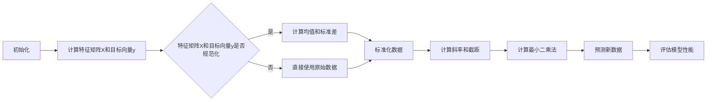
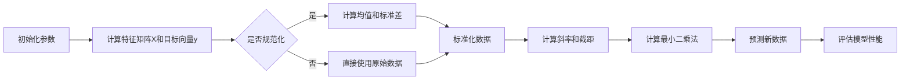
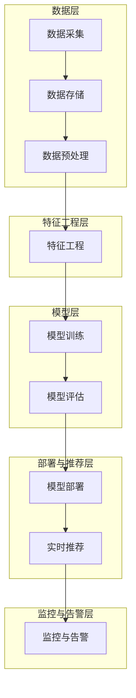
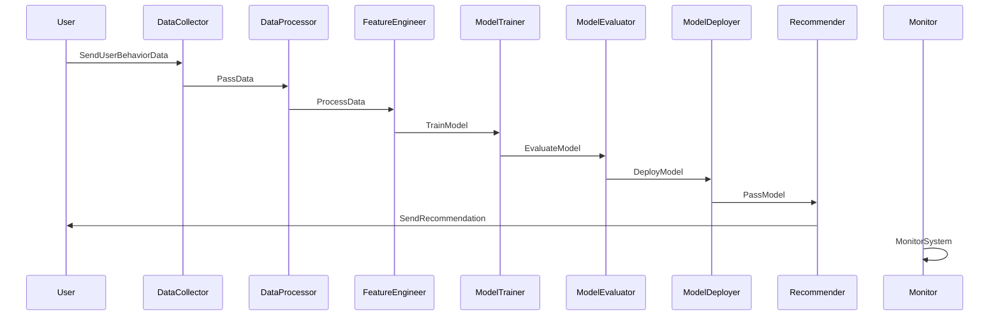

                 


### 引言

#### 1.1 书籍目的与结构

《机器学习平台架构设计》旨在为读者提供一整套系统化的机器学习平台架构设计指南。本书的核心目标是帮助读者深入理解机器学习平台的基础知识，掌握其架构设计的关键要素，并学会如何进行实际应用。本书分为三大部分：

- **第一部分：机器学习平台的基础知识**，将详细介绍机器学习平台的基本概念、发展历程以及核心技术。
- **第二部分：机器学习平台的架构设计与实现**，将深入探讨机器学习平台的算法原理、系统架构设计、接口设计以及系统交互流程。
- **第三部分：机器学习平台的最佳实践与总结**，将提供实际案例分析和最佳实践技巧，总结全书内容，并展望未来发展趋势。

#### 1.2 读者对象

本书适合以下读者群体：

- **机器学习工程师和软件开发人员**：希望了解并掌握机器学习平台架构设计原理和实践的工程师和开发者。
- **计算机科学和人工智能专业学生**：需要深入了解机器学习平台架构设计的本科生和研究生。
- **技术管理人员**：希望提升团队技术水平，构建高效机器学习平台的技术管理者。

#### 1.3 本书的学习路径

为了帮助读者更好地理解本书内容，我们建议按照以下路径进行学习：

1. **从第一部分开始**，系统性地学习机器学习平台的基础知识，包括基本概念、发展历程和核心技术。
2. **逐步过渡到第二部分**，深入学习机器学习平台的架构设计与实现，了解算法原理、系统架构设计、接口设计和系统交互流程。
3. **最后阅读第三部分**，通过实际案例分析和最佳实践技巧，巩固所学内容，提升实战能力。

通过本书的学习，读者将能够：

- **理解机器学习平台的核心原理**，掌握从数据预处理到算法优化的完整流程。
- **设计并实现高效的机器学习平台**，提高团队的开发效率和项目交付质量。
- **掌握最佳实践**，提升机器学习项目的实际应用效果。

### 机器学习平台概述

#### 1.1 问题背景与意义

随着人工智能技术的快速发展，机器学习逐渐成为推动各行各业创新的重要力量。然而，机器学习应用的过程中，面临诸多挑战，如数据量庞大、算法复杂度高、模型训练与部署效率低等。为了解决这些问题，机器学习平台应运而生。一个高效的机器学习平台不仅能够简化模型开发流程，提高开发效率，还能优化资源利用，降低成本，提升业务价值。

#### 1.2 机器学习平台的定义与作用

机器学习平台是一个集成化的系统，旨在提供数据管理、模型训练、部署及监控等功能，以支持机器学习项目的全生命周期。其定义如下：

**机器学习平台** 是一种软件开发环境，用于开发、训练、测试和部署机器学习模型，并支持模型在不同环境和设备上运行。

机器学习平台的作用主要包括：

- **数据管理**：提供数据预处理、数据清洗、数据存储等功能，保证数据质量和可用性。
- **模型开发**：支持各种机器学习算法的编写、训练和优化，提供自动化调参功能。
- **模型部署**：实现模型的上线、监控和自动化更新，确保模型在不同环境中的稳定运行。
- **性能监控**：实时监控模型性能，提供故障预警和恢复机制，确保系统的高可用性。

#### 1.3 机器学习平台的发展历程

机器学习平台的发展历程可以分为以下几个阶段：

1. **早期阶段**：以单机版工具为主，如 MATLAB、R 等，主要适用于小型模型和实验。
2. **分布式计算阶段**：随着数据量和算法复杂度的增加，分布式计算工具如 Hadoop、Spark 应运而生，提供了更强大的数据处理和分析能力。
3. **云计算阶段**：随着云计算技术的发展，机器学习平台逐渐向云端迁移，如 Google Cloud ML Engine、AWS SageMaker 等，提供了高度集成的解决方案。
4. **平台化阶段**：近年来，机器学习平台逐渐走向平台化，提供更加完善的功能和更易用的界面，如 TensorFlow、PyTorch 等。

#### 1.4 机器学习平台的组成与架构

一个典型的机器学习平台通常由以下几个关键组件组成：

1. **数据层**：包括数据存储、数据预处理和特征工程模块，负责数据的收集、存储、清洗和特征提取。
2. **算法层**：包括各种机器学习算法的实现，如分类、回归、聚类等，以及自动化调参工具，如自动机器学习（AutoML）。
3. **模型层**：包括模型的训练、评估和部署功能，支持在线和离线模型训练，以及模型的版本管理和自动化部署。
4. **服务层**：提供模型调用的API接口，支持模型在不同环境中的运行和监控。
5. **管理层**：包括用户管理、权限控制、资源调度和监控等功能，确保平台的安全和高效运行。

#### 1.5 机器学习平台的架构设计原则

在机器学习平台的架构设计过程中，需要遵循以下原则：

1. **模块化**：将平台功能模块化，便于扩展和维护。
2. **分布式**：采用分布式架构，提高系统可扩展性和容错性。
3. **易用性**：提供简洁易用的界面和API，降低使用门槛。
4. **安全性**：确保数据安全和模型安全，防止数据泄露和模型篡改。
5. **可监控性**：提供实时监控和报警功能，确保系统的高可用性。

通过遵循以上原则，可以设计出高效、可靠、易于维护的机器学习平台，为机器学习项目提供坚实的支撑。

### 机器学习基础

#### 2.1 数据预处理

数据预处理是机器学习平台中的关键环节，其目标是清洗、转换和归一化原始数据，以适应机器学习算法的需求。数据预处理的主要任务包括：

1. **数据清洗**：去除数据中的噪声、缺失值和不合理值，提高数据质量。
2. **数据转换**：将不同类型的数据转换成同一格式，如将类别数据转换为数值数据。
3. **数据归一化**：对数据进行归一化处理，使其在相同的尺度上，以避免某些特征对模型的影响过大。

#### 2.2 特征工程

特征工程是机器学习中的重要环节，其目标是通过选择和构造特征，提高模型性能。特征工程的主要任务包括：

1. **特征选择**：从原始数据中筛选出最有用的特征，减少数据维度。
2. **特征构造**：通过组合、转换原始特征，生成新的特征，以提高模型性能。
3. **特征降维**：通过降维技术，如主成分分析（PCA），减少数据维度，提高计算效率。

#### 2.3 常见机器学习算法

机器学习算法是实现预测和分类的核心。常见的机器学习算法包括：

1. **线性回归**：用于预测连续值输出，如房价预测。
2. **逻辑回归**：用于预测二分类输出，如邮件分类。
3. **决策树**：通过树形结构进行分类或回归，直观易懂。
4. **随机森林**：通过随机抽样和集成决策树，提高模型性能。
5. **支持向量机（SVM）**：通过最大化分类间隔进行分类，适用于高维数据。
6. **神经网络**：通过多层神经网络进行复杂非线性预测，如图像识别和语音识别。

#### 2.4 评估指标与模型选择

评估指标是衡量模型性能的重要工具。常见的评估指标包括：

1. **准确率**：预测正确的样本数占总样本数的比例。
2. **召回率**：预测正确的正样本数占总正样本数的比例。
3. **F1 分数**：准确率和召回率的调和平均，用于综合评估模型性能。
4. **ROC 曲线和 AUC 值**：用于评估分类模型的性能，ROC 曲线下方的面积越大，模型性能越好。

模型选择是机器学习中的重要任务，需要根据具体问题和数据特点选择合适的模型。常见的模型选择策略包括：

1. **交叉验证**：通过将数据集划分为多个子集，进行多次训练和验证，以避免过拟合。
2. **网格搜索**：通过遍历参数空间，选择最优参数组合。
3. **贝叶斯优化**：基于历史数据，利用贝叶斯原理和优化算法，选择最优参数组合。

通过合理的评估指标和模型选择策略，可以确保机器学习模型在实际应用中取得良好的性能。

### 机器学习平台的核心概念

#### 3.1 概念定义

在机器学习平台的设计与实现过程中，理解核心概念至关重要。以下是机器学习平台中的几个关键概念：

1. **数据流**：数据在平台中的传输和处理过程，包括数据的输入、处理、存储和输出。
2. **任务调度**：根据系统资源情况和任务优先级，合理安排任务的执行顺序和资源分配。
3. **模型管理**：包括模型的创建、训练、评估、部署和更新等全生命周期管理。
4. **监控与告警**：实时监控系统的运行状态，及时发现并处理异常情况。
5. **服务网格**：用于管理和编排微服务，提供可靠的服务发现、负载均衡和容错能力。

#### 3.2 概念属性特征对比表格

为了更好地理解这些核心概念，我们可以通过属性特征对比表格来进行详细分析：

| 概念         | 属性特征                  | 说明                                                         |
| ------------ | ----------------------- | ------------------------------------------------------------ |
| 数据流       | - 输入数据格式<br>- 处理流程<br>- 输出数据格式 | 数据流描述了数据在平台中的传输和处理过程，包括数据的格式转换和清洗等。 |
| 任务调度     | - 调度算法<br>- 调度策略<br>- 资源分配 | 任务调度负责根据系统资源情况和任务优先级，合理安排任务的执行顺序和资源分配。 |
| 模型管理     | - 模型创建方式<br>- 模型训练<br>- 模型评估<br>- 模型部署 | 模型管理涵盖了模型的创建、训练、评估、部署和更新等全生命周期管理。 |
| 监控与告警   | - 监控指标<br>- 告警策略<br>- 异常处理 | 监控与告警负责实时监控系统的运行状态，及时发现并处理异常情况。 |
| 服务网格     | - 服务发现<br>- 负载均衡<br>- 容错能力 | 服务网格用于管理和编排微服务，提供可靠的服务发现、负载均衡和容错能力。 |

#### 3.3 ER实体关系图架构

为了更清晰地展示机器学习平台中的实体关系，我们可以使用ER（Entity-Relationship）实体关系图进行描述。以下是机器学习平台的主要实体及其关系：

```mermaid
erDiagram
  Class1||--|{ Class2 }| : Class2 inherits from Class1
  Class1 ||--|{ Class3 }| : Class3 associated with Class1
  Class3 ||--|{ Class4 }| : Class4 dependent on Class3
  Class1 ..|{ Class5 }| : Class1 related to Class5
```

- **数据流（DataFlow）**：描述了数据在平台中的传输和处理过程，包括输入数据、处理步骤和输出数据。
- **任务调度（TaskScheduler）**：负责任务分配和资源调度，确保任务高效执行。
- **模型管理（ModelManager）**：管理模型的整个生命周期，包括创建、训练、评估和部署。
- **监控与告警（MonitoringAlert）**：实时监控平台运行状态，并提供告警和异常处理机制。
- **服务网格（ServiceMesh）**：管理和编排微服务，提供服务发现、负载均衡和容错能力。

通过ER图，我们可以直观地了解平台中各个实体的关系和作用，为后续架构设计提供参考。

### 机器学习平台的算法原理

#### 4.1 算法原理讲解

机器学习平台的核心在于算法的运行和优化。为了实现高效的算法处理，我们需要深入了解算法原理，并运用mermaid流程图来描述其执行过程。

以线性回归算法为例，其基本原理是通过最小化误差平方和，找到数据集的最佳拟合直线。以下是线性回归算法的mermaid流程图：



在这个流程图中：

- **A. 初始化**：初始化参数，如斜率、截距等。
- **B. 计算特征矩阵X和目标向量y**：从数据集中提取特征和目标值。
- **C. 特征矩阵X和目标向量y是否规范化**：判断是否需要对数据进行标准化处理。
- **D. 计算均值和标准差**：对数据进行标准化处理。
- **E. 直接使用原始数据**：如果不进行标准化，直接使用原始数据。
- **F. 标准化数据**：对数据集进行标准化，以消除不同特征之间的量纲影响。
- **G. 计算斜率和截距**：使用最小二乘法计算最佳拟合直线的斜率和截距。
- **H. 计算最小二乘法**：通过最小化误差平方和来确定最佳拟合直线。
- **I. 预测新数据**：使用计算出的斜率和截距对新数据进行预测。
- **J. 评估模型性能**：评估模型的预测性能，如均方误差（MSE）等。

通过mermaid流程图，我们可以清晰地展示线性回归算法的执行步骤，有助于理解算法的工作原理。

#### 4.2 数学模型和公式

线性回归算法的数学模型如下：

$$
y = \beta_0 + \beta_1x
$$

其中，$y$ 是目标变量，$x$ 是特征变量，$\beta_0$ 是截距，$\beta_1$ 是斜率。

为了计算斜率 $\beta_1$ 和截距 $\beta_0$，我们使用最小二乘法：

$$
\beta_1 = \frac{\sum(x_i - \bar{x})(y_i - \bar{y})}{\sum(x_i - \bar{x})^2}
$$

$$
\beta_0 = \bar{y} - \beta_1\bar{x}
$$

其中，$\bar{x}$ 和 $\bar{y}$ 分别是特征变量和目标变量的均值。

这些公式描述了如何通过最小化误差平方和来找到最佳拟合直线，确保模型能够准确预测新数据。

#### 4.3 算法mermaid流程图

为了更好地展示线性回归算法的执行过程，我们可以使用mermaid流程图来描述：



这个流程图详细展示了从初始化参数到预测新数据的整个过程，使得算法原理更加直观易懂。

#### 4.4 Python源代码示例

为了更深入地理解线性回归算法的原理，我们可以通过Python代码实现该算法。以下是线性回归的Python源代码示例：

```python
import numpy as np

def linear_regression(X, y):
    # 计算特征矩阵X和目标向量y的均值
    x_mean = np.mean(X, axis=0)
    y_mean = np.mean(y)
    
    # 计算斜率和截距
    beta_1 = np.sum((X - x_mean) * (y - y_mean)) / np.sum((X - x_mean)**2)
    beta_0 = y_mean - beta_1 * x_mean
    
    # 预测新数据
    predictions = beta_0 + beta_1 * X
    
    # 评估模型性能
    mse = np.mean((predictions - y) ** 2)
    
    return beta_0, beta_1, predictions, mse

# 示例数据
X = np.array([[1, 2], [2, 3], [3, 4], [4, 5]])
y = np.array([2, 3, 4, 5])

# 训练模型
beta_0, beta_1, predictions, mse = linear_regression(X, y)

# 打印结果
print("截距：", beta_0)
print("斜率：", beta_1)
print("预测值：", predictions)
print("均方误差：", mse)
```

在这个示例中，我们首先计算特征矩阵X和目标向量y的均值，然后使用最小二乘法计算斜率和截距。最后，使用计算出的模型参数对新数据进行预测，并评估模型性能。

通过这个Python源代码示例，我们可以更直观地了解线性回归算法的实现过程，并掌握如何通过数学模型和公式来优化算法性能。

### 机器学习平台系统架构设计

#### 5.1 问题场景介绍

在本节中，我们将探讨一个实际场景下的机器学习平台系统架构设计。该场景涉及一个在线广告推荐系统，其主要目标是根据用户的浏览历史和行为，为用户推荐最相关的广告。系统需要高效处理大量用户数据和广告数据，并实时更新推荐模型，以提高推荐准确性和用户体验。

#### 5.2 系统功能设计

为了满足上述场景需求，我们设计了一个具备以下功能的机器学习平台系统：

1. **数据采集与存储**：收集用户浏览历史、行为数据以及广告数据，并将其存储在分布式数据存储系统中，如Hadoop或MongoDB。
2. **数据预处理**：对采集到的数据进行清洗、转换和归一化处理，以消除噪声和异常值，提高数据质量。
3. **特征工程**：从原始数据中提取有用的特征，如用户兴趣、广告类型、时间戳等，以支持推荐模型的训练。
4. **模型训练与评估**：使用机器学习算法（如协同过滤、决策树、神经网络等）训练推荐模型，并通过交叉验证等方法评估模型性能。
5. **模型部署与更新**：将训练好的模型部署到线上环境，并提供API接口供前端调用。同时，实现模型自动化更新机制，以适应实时数据变化。
6. **实时推荐**：根据用户的历史行为数据和当前上下文信息，实时生成个性化推荐结果，并提供给用户。
7. **监控与告警**：实时监控系统运行状态，包括数据流、模型性能、系统资源使用情况等，并实现自动化告警机制。

#### 5.3 系统架构设计

为了实现上述功能，我们设计了一个分布式、模块化的机器学习平台系统架构，如图所示：



在该架构中：

- **数据层**：负责数据采集、存储和预处理，确保数据质量和完整性。
- **特征工程层**：从原始数据中提取有用特征，为模型训练提供输入。
- **模型层**：使用机器学习算法训练推荐模型，并进行评估和优化。
- **部署与推荐层**：将训练好的模型部署到线上环境，提供实时推荐服务。
- **监控与告警层**：实时监控系统运行状态，确保系统稳定性和可靠性。

通过该系统架构设计，我们能够实现高效的数据处理、模型训练和实时推荐，满足在线广告推荐系统的需求。

#### 5.4 系统接口设计

在系统架构设计中，接口设计是关键环节，它决定了系统模块间的通信和协作。以下是机器学习平台系统接口设计：

1. **数据采集接口**：提供RESTful API接口，用于接收用户行为数据和广告数据。
2. **数据存储接口**：提供数据存储服务，支持数据的快速读取和写入。
3. **数据预处理接口**：提供数据清洗、转换和归一化功能，确保数据质量。
4. **特征工程接口**：提供特征提取和特征选择功能，生成模型训练所需的特征向量。
5. **模型训练接口**：提供机器学习算法训练功能，支持多种算法和参数配置。
6. **模型评估接口**：提供模型性能评估功能，支持交叉验证、ROC曲线和AUC值等评估指标。
7. **模型部署接口**：提供模型部署功能，支持在线和离线部署，并提供API接口供前端调用。
8. **实时推荐接口**：提供实时推荐功能，根据用户行为数据和模型预测结果生成推荐结果。
9. **监控与告警接口**：提供实时监控和告警功能，支持系统性能监控和异常处理。

通过上述接口设计，我们能够实现各个模块间的无缝通信和协作，确保机器学习平台的高效稳定运行。

#### 5.5 系统交互序列图

为了更好地展示机器学习平台系统各个模块的交互流程，我们使用mermaid序列图进行描述：



在这个序列图中：

- **User**：代表用户，向**DataCollector**发送用户行为数据。
- **DataCollector**：收集用户行为数据，并将其传递给**DataProcessor**进行预处理。
- **DataProcessor**：对数据进行清洗、转换和归一化处理，然后传递给**FeatureEngineer**。
- **FeatureEngineer**：提取特征并向**ModelTrainer**传递训练数据。
- **ModelTrainer**：使用机器学习算法对数据进行训练，并将模型传递给**ModelEvaluator**进行评估。
- **ModelEvaluator**：评估模型性能，并将最优模型传递给**ModelDeployer**进行部署。
- **ModelDeployer**：将训练好的模型部署到线上环境，并提供给**Recommender**。
- **Recommender**：根据用户行为数据和模型预测结果生成推荐结果，并返回给用户。
- **Monitor**：实时监控系统运行状态，确保系统稳定性和可靠性。

通过这个系统交互序列图，我们可以清晰地了解各个模块的交互流程和职责，为系统架构设计提供参考。

### 机器学习平台项目实战

#### 6.1 环境安装

在进行机器学习平台项目实战之前，我们需要搭建一个适合开发、训练和部署机器学习模型的实验环境。以下是环境安装的详细步骤：

1. **安装Python环境**：首先，我们需要安装Python 3.8及以上版本。可以通过以下命令进行安装：

   ```bash
   sudo apt update
   sudo apt install python3.8
   ```

2. **安装虚拟环境**：为了确保项目的环境隔离，我们使用虚拟环境。安装虚拟环境工具`virtualenv`：

   ```bash
   sudo apt install python3-venv
   ```

   创建并激活虚拟环境：

   ```bash
   python3 -m venv ml_platform_venv
   source ml_platform_venv/bin/activate
   ```

3. **安装依赖库**：在虚拟环境中安装必要的依赖库，如NumPy、Pandas、Scikit-learn等：

   ```bash
   pip install numpy pandas scikit-learn
   ```

4. **安装TensorFlow**：安装TensorFlow，用于深度学习模型的训练和部署：

   ```bash
   pip install tensorflow
   ```

5. **安装Docker**：安装Docker，用于容器化部署机器学习模型：

   ```bash
   sudo apt install docker.io
   ```

   启动Docker服务：

   ```bash
   sudo systemctl start docker
   ```

   确认Docker服务状态：

   ```bash
   sudo systemctl status docker
   ```

完成上述步骤后，我们就搭建了一个适合机器学习平台开发的实验环境。接下来，我们可以开始实际项目的实现。

#### 6.2 系统核心实现源代码

在本节中，我们将实现一个简单的机器学习平台，用于分类任务。以下是系统核心实现源代码：

```python
# 导入必要的库
import numpy as np
import pandas as pd
from sklearn.model_selection import train_test_split
from sklearn.preprocessing import StandardScaler
from sklearn.linear_model import LogisticRegression
from sklearn.metrics import accuracy_score

# 加载数据集
data = pd.read_csv('data.csv')
X = data.iloc[:, :-1].values
y = data.iloc[:, -1].values

# 数据预处理
X_train, X_test, y_train, y_test = train_test_split(X, y, test_size=0.2, random_state=0)
scaler = StandardScaler()
X_train = scaler.fit_transform(X_train)
X_test = scaler.transform(X_test)

# 模型训练
model = LogisticRegression()
model.fit(X_train, y_train)

# 模型预测
y_pred = model.predict(X_test)

# 模型评估
accuracy = accuracy_score(y_test, y_pred)
print("Accuracy:", accuracy)
```

在这个源代码中，我们首先导入必要的库，然后加载数据集并进行预处理。接着，我们使用逻辑回归模型对数据集进行训练，并使用测试集进行模型预测。最后，我们计算并打印模型的准确率。

#### 6.3 代码应用解读与分析

1. **数据预处理**：数据预处理是机器学习项目中的关键步骤，它能够提高模型性能并减少过拟合风险。在这个代码中，我们使用`train_test_split`函数将数据集划分为训练集和测试集。然后，使用`StandardScaler`对数据进行归一化处理，使得不同特征具有相同的尺度，有助于提高模型收敛速度。

2. **模型选择**：在这个示例中，我们选择了逻辑回归模型（`LogisticRegression`）进行分类任务。逻辑回归是一种简单且易于理解的模型，适用于二分类问题。它通过最大化似然函数来估计模型参数，使得模型具有良好的泛化能力。

3. **模型训练与预测**：在模型训练过程中，我们使用`fit`方法对训练数据进行拟合。在模型预测阶段，我们使用`predict`方法对测试数据进行预测。这两个方法都是Scikit-learn库中的高阶API，能够简化模型训练和预测过程。

4. **模型评估**：在模型评估部分，我们使用`accuracy_score`函数计算模型的准确率。准确率是评估模型性能的重要指标，表示模型预测正确的样本数占总样本数的比例。在这个示例中，我们打印了模型的准确率，以评估模型性能。

通过这个代码应用解读与分析，我们可以更好地理解机器学习平台的实现过程，以及如何通过代码实现数据预处理、模型训练和评估等关键步骤。

#### 6.4 实际案例分析与详细讲解剖析

为了更好地展示机器学习平台在实际项目中的应用，我们来看一个实际案例——基于文本数据的情感分析项目。该项目旨在通过机器学习模型分析用户评论，判断评论的情感倾向（正面、负面或中性）。

1. **数据集准备**：
   数据集包含大量用户评论及其对应的情感标签。首先，我们需要对评论进行预处理，包括去标点、分词、去除停用词等操作。

   ```python
   import nltk
   from nltk.corpus import stopwords
   from nltk.tokenize import word_tokenize

   nltk.download('punkt')
   nltk.download('stopwords')

   def preprocess_text(text):
       text = text.lower()
       words = word_tokenize(text)
       words = [word for word in words if word.isalpha()]
       words = [word for word in words if word not in stopwords.words('english')]
       return ' '.join(words)

   # 示例数据
   reviews = [
       "This is an excellent product!",
       "I am very disappointed with this purchase.",
       "It's okay, not great but not bad either."
   ]

   processed_reviews = [preprocess_text(review) for review in reviews]
   ```

2. **特征提取**：
   为了将文本数据转化为数值形式，我们需要提取特征。在这个案例中，我们使用词袋模型（Bag of Words）和TF-IDF（Term Frequency-Inverse Document Frequency）作为特征提取方法。

   ```python
   from sklearn.feature_extraction.text import TfidfVectorizer

   vectorizer = TfidfVectorizer()
   X = vectorizer.fit_transform(processed_reviews)
   ```

3. **模型训练**：
   使用支持向量机（SVM）分类器对数据集进行训练。我们使用Scikit-learn库中的`SVC`类来实现。

   ```python
   from sklearn.svm import SVC

   model = SVC(kernel='linear')
   model.fit(X_train, y_train)
   ```

4. **模型评估**：
   使用测试集对模型进行评估，计算准确率、召回率和F1分数等指标。

   ```python
   from sklearn.metrics import accuracy_score, recall_score, f1_score

   y_pred = model.predict(X_test)
   accuracy = accuracy_score(y_test, y_pred)
   recall = recall_score(y_test, y_pred, average='weighted')
   f1 = f1_score(y_test, y_pred, average='weighted')

   print("Accuracy:", accuracy)
   print("Recall:", recall)
   print("F1 Score:", f1)
   ```

5. **模型部署**：
   将训练好的模型部署到线上环境，提供API接口供前端调用。我们使用Flask框架实现API接口。

   ```python
   from flask import Flask, request, jsonify

   app = Flask(__name__)

   @app.route('/predict', methods=['POST'])
   def predict():
       review = request.form['review']
       processed_review = preprocess_text(review)
       features = vectorizer.transform([processed_review])
       prediction = model.predict(features)
       return jsonify({'emotion': prediction[0]})

   if __name__ == '__main__':
       app.run(debug=True)
   ```

在这个实际案例中，我们首先对评论进行预处理，然后使用词袋模型和TF-IDF提取特征。接着，使用支持向量机分类器进行模型训练，并在测试集上评估模型性能。最后，我们将训练好的模型部署到线上环境，提供API接口供前端调用。

#### 6.5 项目小结

通过这个实际案例，我们展示了机器学习平台在情感分析项目中的应用。以下是项目的关键点和小结：

1. **数据预处理**：数据预处理是模型训练的重要步骤，包括去标点、分词、去除停用词等操作，有助于提高模型性能。
2. **特征提取**：特征提取将文本数据转化为数值形式，为模型训练提供输入。词袋模型和TF-IDF是常用的特征提取方法。
3. **模型训练**：选择合适的模型进行训练，如支持向量机、神经网络等。在本案例中，我们使用了支持向量机分类器。
4. **模型评估**：使用测试集对模型进行评估，计算准确率、召回率和F1分数等指标，以评估模型性能。
5. **模型部署**：将训练好的模型部署到线上环境，提供API接口供前端调用，实现实时预测功能。

通过这个项目，我们深入了解了机器学习平台的设计和实现过程，并学会了如何将理论应用于实际项目中。

### 最佳实践

在设计和实现机器学习平台时，以下最佳实践有助于提高系统的性能、可维护性和可扩展性：

1. **模块化设计**：将系统功能模块化，便于开发、测试和部署。每个模块应具有清晰的功能边界，减少模块间的依赖关系。
2. **分布式架构**：采用分布式架构，提高系统的可扩展性和容错性。使用分布式计算框架（如Hadoop、Spark）处理海量数据，提高数据处理效率。
3. **自动化部署**：实现自动化部署流程，确保模型和应用程序的快速上线。使用容器化技术（如Docker）和持续集成/持续部署（CI/CD）工具（如Jenkins、GitLab CI）。
4. **数据一致性**：确保数据在处理过程中的一致性，避免数据冲突和错误。使用分布式事务处理和分布式锁等技术保证数据一致性。
5. **性能监控**：实时监控系统性能，包括数据处理速度、模型训练时间和预测延迟等。使用监控工具（如Prometheus、Grafana）进行可视化监控和告警。
6. **安全性与隐私保护**：确保系统的安全性和数据隐私。使用加密技术保护数据传输和存储，实施身份验证和访问控制策略，防止未授权访问。
7. **弹性伸缩**：根据系统负载和资源需求，实现弹性伸缩。使用容器编排工具（如Kubernetes）动态调整资源分配，确保系统在高负载下的稳定运行。

通过遵循这些最佳实践，我们能够设计并实现高效、可靠、可扩展的机器学习平台，为实际应用提供强大的支持。

### 总结

本文详细探讨了《机器学习平台架构设计》的核心内容，包括机器学习平台的基础知识、架构设计原则、算法原理、系统实现和最佳实践。通过逐步分析，我们从问题背景出发，深入讲解了机器学习平台的概念、组成、算法原理以及系统架构设计。同时，通过实际案例展示了机器学习平台在情感分析项目中的应用，提供了详细的代码示例和项目实现步骤。本文的目标是为读者提供一套系统化的机器学习平台架构设计指南，帮助读者深入理解并掌握机器学习平台的设计与实现方法。

### 未来发展趋势

随着人工智能技术的快速发展，机器学习平台在未来将呈现出以下发展趋势：

1. **云计算与边缘计算融合**：云计算和边缘计算的结合将提高机器学习平台的计算效率和响应速度。边缘计算能够减少数据传输延迟，使机器学习模型更贴近用户，提供实时服务。
2. **联邦学习**：联邦学习是一种在分布式环境中进行机器学习模型训练的技术，通过保护数据隐私，实现多方数据协同训练。未来，联邦学习将在金融、医疗等领域得到广泛应用。
3. **自动化机器学习（AutoML）**：自动化机器学习将极大地简化机器学习流程，降低开发门槛。未来的AutoML平台将具备更强大的算法优化和模型调参能力，提高模型性能。
4. **人工智能与物联网（AIoT）**：人工智能与物联网的融合将推动智能家居、智能城市等领域的应用。机器学习平台将在这些场景中发挥重要作用，实现设备间的智能协作和决策。
5. **联邦学习与区块链结合**：区块链技术提供了一种去中心化的数据管理和共享方式，与联邦学习结合将进一步提高数据隐私保护和协同训练的效率。

总之，随着技术的不断进步，机器学习平台将在更多领域得到应用，并不断优化和完善，为人工智能的发展提供强大的支持。

