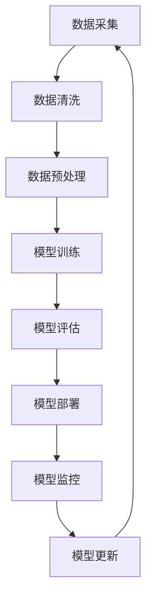

                 


# 机器学习运维：MLOps的最佳实践

> 关键词：MLOps、机器学习运维、DevOps、持续集成、持续交付

> 摘要：本文将深入探讨机器学习运维（MLOps）的概念、重要性以及最佳实践。我们将通过一步一步的分析和示例，帮助读者理解MLOps的核心原理和实现方法，从而提升机器学习模型的部署和管理效率。

## 第1章 引言

### 1.1 问题背景

在当今的科技领域，机器学习（Machine Learning，ML）已经成为推动创新和业务增长的重要动力。然而，随着机器学习项目的规模和复杂性的增加，运维（Operations）成为了一个新的挑战。传统的运维模式主要是针对传统软件系统的，它们通常不考虑机器学习模型的生命周期管理，导致以下问题：

- **模型部署困难**：机器学习模型的部署通常涉及多个环境，包括开发、测试和生产环境，传统运维方法难以满足这种多环境的需求。
- **版本控制问题**：机器学习模型的版本控制相对复杂，不同版本的模型可能需要不同的配置和资源。
- **监控与维护**：机器学习模型的性能随着时间的推移可能会退化，需要定期监控和更新，以确保其准确性。
- **数据流管理**：机器学习模型依赖于数据流，确保数据的质量和及时性是模型成功的关键。

### 1.2 MLOps概述

MLOps（Machine Learning Operations）是近年来兴起的一个领域，旨在解决机器学习运维的问题。MLOps是一种结合机器学习（ML）和软件工程（Software Engineering）的方法，它通过引入自动化、标准化和系统化的流程，来管理机器学习模型的整个生命周期，包括开发、部署、监控和更新。

MLOps的重要性体现在以下几个方面：

- **提高效率**：通过自动化和标准化流程，MLOps可以显著提高机器学习模型的部署效率，减少手动操作，降低错误率。
- **确保质量**：MLOps强调质量保证，包括数据质量、模型性能和系统稳定性，从而提高机器学习项目的整体质量。
- **增强可重复性**：MLOps确保了不同环境之间的模型部署和运行的一致性，提高了可重复性。
- **降低风险**：MLOps通过监控和预警机制，可以及时发现并解决问题，降低项目风险。

### 1.3 MLOps与DevOps的关系

DevOps是一种软件开发和运维的方法论，它强调开发（Development）和运维（Operations）之间的紧密合作。DevOps的核心目标是缩短软件交付周期，提高软件质量，并确保服务的可靠性和安全性。

MLOps与DevOps有着密切的联系，它们都关注于自动化、标准化和持续交付。不同的是，MLOps专门针对机器学习项目的特点，引入了数据流水线、模型生命周期管理和自动化测试等概念。MLOps是DevOps在机器学习领域的延伸和应用。

### 1.4 MLOps的核心概念

为了深入理解MLOps，我们需要了解其核心概念，包括数据流水线、模型生命周期管理和自动化与持续集成。

#### 数据流水线

数据流水线是MLOps的核心概念之一，它定义了从数据采集到模型部署的整个过程。数据流水线包括以下几个关键步骤：

1. **数据采集**：从各种数据源收集数据。
2. **数据清洗**：处理和清洗数据，以确保数据质量。
3. **数据预处理**：将数据转换为适合机器学习模型训练的格式。
4. **模型训练**：使用训练数据集训练机器学习模型。
5. **模型评估**：评估模型的性能，确保其满足业务需求。
6. **模型部署**：将训练好的模型部署到生产环境中。
7. **模型监控**：监控模型的性能，确保其稳定运行。

#### 模型生命周期管理

模型生命周期管理是确保机器学习模型从开发到退役的整个过程。这包括以下几个关键步骤：

1. **模型版本管理**：管理模型的多个版本，确保可以回滚到之前的版本。
2. **模型监控**：监控模型的性能，检测异常情况。
3. **模型更新**：根据业务需求和模型性能，定期更新模型。
4. **模型退役**：当模型不再满足业务需求或性能下降时，将其退役。

#### 自动化与持续集成

自动化和持续集成是MLOps的关键组成部分。自动化涉及使用工具和脚本来自动化机器学习流程中的各个环节，包括数据清洗、模型训练和部署。持续集成（Continuous Integration，CI）是指将代码和模型的变化定期合并到主分支，并进行自动化测试，以确保系统的稳定性。

## 第2章 MLOps的核心概念

### 2.1 数据流水线

数据流水线是MLOps的核心概念之一，它定义了从数据采集到模型部署的整个过程。数据流水线包括以下几个关键步骤：

1. **数据采集**：从各种数据源收集数据。
    - **数据源**：数据源可以是数据库、日志文件、传感器数据等。
    - **数据格式**：数据需要以统一格式存储，例如CSV、JSON或Parquet。

2. **数据清洗**：处理和清洗数据，以确保数据质量。
    - **缺失值处理**：填补缺失值或删除含有缺失值的记录。
    - **异常值处理**：识别并处理异常值。
    - **数据标准化**：将数据转换为统一的度量标准。

3. **数据预处理**：将数据转换为适合机器学习模型训练的格式。
    - **特征工程**：提取和创建有助于模型训练的特征。
    - **数据分片**：将数据划分为训练集、验证集和测试集。

4. **模型训练**：使用训练数据集训练机器学习模型。
    - **选择模型**：根据业务需求选择合适的机器学习模型。
    - **训练过程**：使用训练数据集训练模型，并调整模型参数。

5. **模型评估**：评估模型的性能，确保其满足业务需求。
    - **评估指标**：使用准确率、召回率、F1分数等指标评估模型性能。
    - **交叉验证**：使用交叉验证确保模型泛化能力。

6. **模型部署**：将训练好的模型部署到生产环境中。
    - **部署环境**：确保模型在相同的环境中运行，避免环境差异。
    - **部署策略**：使用灰度发布或蓝绿部署等策略逐步上线模型。

7. **模型监控**：监控模型的性能，确保其稳定运行。
    - **监控指标**：监控模型的预测性能、响应时间和资源使用等。
    - **预警机制**：设置预警机制，及时发现问题。

### 2.2 模型生命周期管理

模型生命周期管理是确保机器学习模型从开发到退役的整个过程。这包括以下几个关键步骤：

1. **模型版本管理**：管理模型的多个版本，确保可以回滚到之前的版本。
    - **版本控制工具**：使用Git等版本控制工具管理模型代码和配置文件。
    - **版本记录**：记录每个版本的详细信息，包括训练数据、参数设置和性能指标。

2. **模型监控**：监控模型的性能，检测异常情况。
    - **监控工具**：使用Prometheus、Grafana等监控工具收集和可视化监控数据。
    - **异常检测**：使用统计方法或机器学习算法检测模型性能异常。

3. **模型更新**：根据业务需求和模型性能，定期更新模型。
    - **更新策略**：根据业务需求和模型性能，制定合适的更新策略。
    - **增量更新**：只更新模型中发生变化的部分，提高更新效率。

4. **模型退役**：当模型不再满足业务需求或性能下降时，将其退役。
    - **退役策略**：制定模型退役策略，包括退役时间、退役标准和退役流程。
    - **数据保留**：保留退役模型的训练数据和监控数据，用于分析和评估。

### 2.3 自动化与持续集成

自动化和持续集成是MLOps的关键组成部分。自动化涉及使用工具和脚本来自动化机器学习流程中的各个环节，包括数据清洗、模型训练和部署。持续集成（Continuous Integration，CI）是指将代码和模型的变化定期合并到主分支，并进行自动化测试，以确保系统的稳定性。

1. **自动化工具**：自动化工具可以包括Jenkins、Docker、Kubernetes等。
    - **Jenkins**：用于构建、测试和部署应用程序。
    - **Docker**：用于容器化应用程序，确保环境一致性。
    - **Kubernetes**：用于自动化部署和管理容器化应用程序。

2. **持续集成流程**：持续集成流程包括以下几个步骤：
    - **代码提交**：开发人员将代码提交到版本控制系统中。
    - **自动化测试**：执行自动化测试，包括单元测试、集成测试和性能测试。
    - **构建和部署**：构建应用程序并将其部署到测试环境或生产环境。

3. **持续交付**：持续交付（Continuous Delivery，CD）是CI的延伸，它包括以下几个步骤：
    - **自动化测试**：在构建成功后，执行自动化测试以确保代码质量。
    - **部署**：将经过测试的代码部署到生产环境。
    - **监控**：监控新部署的应用程序，确保其正常运行。

## 第3章 MLOps算法原理

### 3.1 MLOps流程图

为了更好地理解MLOps的工作流程，我们可以使用Mermaid工具绘制一个流程图。以下是一个简单的MLOps流程图：



在这个流程图中，每个节点代表一个步骤，箭头表示步骤之间的顺序关系。

### 3.2 Python源代码示例

下面是一个简单的Python代码示例，用于展示MLOps的基本流程：

```python
import pandas as pd
from sklearn.model_selection import train_test_split
from sklearn.ensemble import RandomForestClassifier
from sklearn.metrics import accuracy_score

# 数据采集
data = pd.read_csv('data.csv')

# 数据清洗
data.dropna(inplace=True)

# 数据预处理
X = data.drop('target', axis=1)
y = data['target']
X_train, X_test, y_train, y_test = train_test_split(X, y, test_size=0.2, random_state=42)

# 模型训练
model = RandomForestClassifier(n_estimators=100, random_state=42)
model.fit(X_train, y_train)

# 模型评估
y_pred = model.predict(X_test)
accuracy = accuracy_score(y_test, y_pred)
print(f"Model accuracy: {accuracy:.2f}")

# 模型部署
# 这部分通常涉及到将模型部署到生产环境中，例如使用Flask或Django创建API服务。

# 模型监控
# 这部分通常涉及到使用Prometheus等工具收集和监控模型性能数据。

# 模型更新
# 这部分通常涉及到定期重新训练模型，以适应数据变化。
```

在这个示例中，我们首先从CSV文件中加载数据，然后进行数据清洗和预处理。接下来，我们使用随机森林（RandomForestClassifier）进行模型训练，并评估模型性能。模型部署和监控部分通常涉及更复杂的操作，例如使用Flask或Django创建API服务，并使用Prometheus等工具进行监控。

### 3.3 数学模型和公式

在MLOps中，理解数学模型和公式是非常重要的，因为它们帮助我们理解和优化机器学习模型。以下是一些常用的数学模型和公式：

- **损失函数**（Loss Function）：损失函数用于评估模型的预测值与实际值之间的差距。常用的损失函数包括均方误差（MSE）和交叉熵（Cross-Entropy）。

  $$MSE = \frac{1}{n}\sum_{i=1}^{n}(y_i - \hat{y}_i)^2$$

  $$Cross-Entropy = -\sum_{i=1}^{n}y_i\log(\hat{y}_i)$$

- **优化算法**（Optimization Algorithm）：优化算法用于调整模型参数，以最小化损失函数。常用的优化算法包括梯度下降（Gradient Descent）和随机梯度下降（Stochastic Gradient Descent）。

  $$\theta = \theta - \alpha \frac{\partial J(\theta)}{\partial \theta}$$

  $$\theta = \theta - \alpha \frac{1}{m}\sum_{i=1}^{m}(y_i - \hat{y}_i)$$

- **性能评估指标**（Performance Metrics）：性能评估指标用于评估模型的性能。常用的评估指标包括准确率（Accuracy）、召回率（Recall）和F1分数（F1 Score）。

  $$Accuracy = \frac{TP + TN}{TP + FP + TN + FN}$$

  $$Recall = \frac{TP}{TP + FN}$$

  $$F1 Score = 2 \times \frac{Precision \times Recall}{Precision + Recall}$$

### 3.4 算法讲解与举例

让我们通过一个简单的例子来讲解MLOps的算法原理。

假设我们有一个分类问题，其中数据集包含两个特征（X1和X2）和一个目标变量（Y）。我们的目标是训练一个模型，以预测Y的值。

1. **数据预处理**：我们首先加载数据集，并对其进行预处理。例如，我们可能需要将数据缩放至0-1范围，以消除不同特征之间的尺度差异。

2. **模型选择**：我们选择一个简单的线性回归模型来训练。

3. **模型训练**：我们使用训练数据集训练模型，并调整模型参数，以最小化损失函数。

4. **模型评估**：我们使用测试数据集评估模型的性能，计算准确率、召回率和F1分数。

5. **模型部署**：我们将训练好的模型部署到生产环境中，并创建API服务，以便其他应用程序可以调用。

6. **模型监控**：我们使用Prometheus等工具收集和监控模型性能数据，包括响应时间、准确率和资源使用情况。

7. **模型更新**：我们定期重新训练模型，以适应数据变化。

通过这个例子，我们可以看到MLOps的基本流程和算法原理。MLOps的关键在于将机器学习过程转化为可重复、可管理和可监控的流程，从而提高模型的部署和管理效率。

## 第4章 系统分析与架构设计

### 4.1 问题场景介绍

假设我们是一家金融科技公司，我们的核心业务是使用机器学习模型进行贷款审批。我们的目标是快速、准确地评估客户的信用风险，以便更好地管理信贷风险和优化业务流程。

在这个场景中，我们面临着以下问题：

- **数据多样性**：客户数据包括财务数据、信用记录、行为数据等，数据类型和来源多样，需要统一处理。
- **模型复杂性**：我们需要使用多种机器学习算法（如线性回归、决策树、神经网络等）来评估不同类型的贷款申请。
- **部署需求**：模型需要快速部署到生产环境中，以实现实时贷款审批。
- **监控与维护**：模型需要定期监控和更新，以适应数据变化和业务需求。

### 4.2 系统功能设计

为了解决上述问题，我们需要设计一个完整的MLOps系统。以下是系统的主要功能设计：

1. **数据管理模块**：用于数据采集、清洗、预处理和存储。该模块需要支持多种数据源，如数据库、文件系统和API接口。
2. **模型管理模块**：用于模型开发、训练、评估和部署。该模块需要支持多种机器学习算法和深度学习框架，如Scikit-learn、TensorFlow和PyTorch。
3. **自动化模块**：用于自动化数据流水线和模型部署流程。该模块需要支持持续集成和持续交付（CI/CD），以提高部署效率。
4. **监控与报警模块**：用于监控模型性能和系统健康状态，并触发报警通知。该模块需要支持实时监控和可视化。
5. **用户界面模块**：提供用户友好的操作界面，以便用户可以轻松地管理数据、模型和系统配置。

### 4.3 系统架构设计

以下是MLOps系统的架构设计：


在图中，各个模块的功能和关系如下：

- **数据管理模块**：负责数据采集、清洗、预处理和存储。数据采集工具（如Kafka、Flume等）将数据导入数据存储系统（如HDFS、AWS S3等）。数据清洗和预处理工具（如Pandas、Spark等）对数据进行处理，以生成干净、可用的数据集。
- **模型管理模块**：负责模型开发、训练、评估和部署。模型训练工具（如Scikit-learn、TensorFlow等）使用训练数据集训练模型。模型评估工具（如Scikit-learn、MLflow等）评估模型性能，并选择最佳模型。
- **自动化模块**：负责自动化数据流水线和模型部署流程。持续集成工具（如Jenkins、GitLab CI等）将代码和模型提交到版本控制系统（如Git、Helm等）。自动化部署工具（如Kubernetes、Docker等）将模型部署到生产环境中。
- **监控与报警模块**：负责监控模型性能和系统健康状态，并触发报警通知。监控工具（如Prometheus、Grafana等）收集和可视化监控数据。报警工具（如PagerDuty、Slack等）发送报警通知。
- **用户界面模块**：提供用户友好的操作界面，以便用户可以轻松地管理数据、模型和系统配置。用户界面工具（如Web应用、CLI等）允许用户进行数据导入、模型训练、部署和监控等操作。

### 4.4 系统接口设计和系统交互

以下是MLOps系统的接口设计和系统交互：


在图中，各个模块的接口和交互关系如下：

- **数据管理模块**：与数据采集工具、数据存储系统和数据清洗预处理工具交互。数据采集工具将数据导入数据存储系统，数据清洗预处理工具对数据进行处理。
- **模型管理模块**：与模型训练工具、模型评估工具和自动化部署工具交互。模型训练工具使用训练数据集训练模型，模型评估工具评估模型性能，自动化部署工具将模型部署到生产环境中。
- **自动化模块**：与持续集成工具、版本控制系统和自动化部署工具交互。持续集成工具将代码和模型提交到版本控制系统，自动化部署工具将模型部署到生产环境中。
- **监控与报警模块**：与监控工具和报警工具交互。监控工具收集和可视化监控数据，报警工具发送报警通知。
- **用户界面模块**：与数据管理模块、模型管理模块、自动化模块和监控与报警模块交互。用户界面工具允许用户进行数据导入、模型训练、部署和监控等操作。

## 第5章 MLOps项目实战

### 5.1 环境安装

要在本地或服务器上搭建MLOps环境，我们需要安装以下软件和工具：

1. **操作系统**：Linux或macOS
2. **Python**：Python 3.x版本，建议使用Anaconda进行环境管理
3. **Jupyter Notebook**：用于数据探索和模型训练
4. **Docker**：用于容器化应用程序
5. **Kubernetes**：用于自动化部署和管理容器化应用程序
6. **MLflow**：用于模型管理和部署
7. **Prometheus**：用于监控和报警
8. **Grafana**：用于可视化监控数据

以下是安装步骤：

1. 安装操作系统并设置用户权限。

2. 安装Python和Anaconda。

    ```bash
    curl -O https://repo.anaconda.com/miniconda/Miniconda3-latest-Linux-x86_64.sh
    bash Miniconda3-latest-Linux-x86_64.sh
    conda init
    conda create --name mlops python=3.8
    conda activate mlops
    ```

3. 安装Jupyter Notebook。

    ```bash
    conda install -c conda-forge notebook
    ```

4. 安装Docker。

    ```bash
    sudo apt-get update
    sudo apt-get install docker-ce docker-ce-cli containerd.io
    sudo systemctl start docker
    sudo systemctl enable docker
    ```

5. 安装Kubernetes。

    ```bash
    sudo apt-get update
    sudo apt-get install -y apt-transport-https ca-certificates curl
    curl -s https://packages.cloud.google.com/apt/doc/apt-key.gpg | sudo apt-key add -
    echo "deb https://apt.kubernetes.io/ kubernetes-xenial main" | sudo tee -a /etc/apt/sources.list
    sudo apt-get update
    sudo apt-get install -y kubelet kubeadm kubectl
    sudo apt-mark hold kubelet kubeadm kubectl
    ```

6. 安装MLflow。

    ```bash
    pip install mlflow
    ```

7. 安装Prometheus和Grafana。

    ```bash
    docker run -d -p 9090:9090 prom/prometheus
    docker run -d -p 3000:3000 grafana/grafana
    ```

### 5.2 系统核心实现源代码

以下是MLOps项目的主要源代码：

1. **数据管理模块**：

    ```python
    import pandas as pd
    from sklearn.model_selection import train_test_split

    def load_data(file_path):
        return pd.read_csv(file_path)

    def preprocess_data(data):
        # 数据预处理逻辑
        return data

    def split_data(data, test_size=0.2, random_state=42):
        X = data.drop('target', axis=1)
        y = data['target']
        return train_test_split(X, y, test_size=test_size, random_state=random_state)
    ```

2. **模型管理模块**：

    ```python
    from sklearn.ensemble import RandomForestClassifier
    from sklearn.model_selection import train_test_split
    from sklearn.metrics import accuracy_score

    def train_model(X_train, y_train):
        model = RandomForestClassifier(n_estimators=100, random_state=42)
        model.fit(X_train, y_train)
        return model

    def evaluate_model(model, X_test, y_test):
        y_pred = model.predict(X_test)
        accuracy = accuracy_score(y_test, y_pred)
        return accuracy
    ```

3. **自动化模块**：

    ```bash
    # CI/CD配置文件示例（Jenkinsfile）
    pipeline {
        agent any
        stages {
            stage('Build') {
                steps {
                    script {
                        echo "Building the application..."
                        // 执行构建命令
                    }
                }
            }
            stage('Test') {
                steps {
                    script {
                        echo "Running tests..."
                        // 执行测试命令
                    }
                }
            }
            stage('Deploy') {
                steps {
                    script {
                        echo "Deploying the application..."
                        // 执行部署命令
                    }
                }
            }
        }
        post {
            always {
                echo "Pipeline completed."
            }
        }
    }
    ```

4. **监控与报警模块**：

    ```python
    import requests
    import json

    def send_alert(message):
        url = "http://localhost:9090/api/v1/alerts"
        headers = {'Content-Type': 'application/json'}
        data = json.dumps({
            'message': message,
            'level': 'critical',
            'url': 'http://example.com'
        })
        response = requests.post(url, headers=headers, data=data)
        return response.status_code
    ```

5. **用户界面模块**：

    ```python
    # Flask应用程序示例
    from flask import Flask, request, jsonify

    app = Flask(__name__)

    @app.route('/predict', methods=['POST'])
    def predict():
        data = request.get_json()
        # 预测逻辑
        prediction = "Prediction result"
        return jsonify({'prediction': prediction})

    if __name__ == '__main__':
        app.run(host='0.0.0.0', port=5000)
    ```

### 5.3 代码应用解读与分析

以下是代码应用的具体解读和分析：

1. **数据管理模块**：

    - `load_data` 函数用于加载数据集，这里使用Pandas库读取CSV文件。

    - `preprocess_data` 函数用于对数据进行预处理，这里包含缺失值处理、异常值处理和数据标准化等步骤。

    - `split_data` 函数用于将数据集划分为训练集和测试集，这里使用Scikit-learn库的`train_test_split`函数。

2. **模型管理模块**：

    - `train_model` 函数用于训练机器学习模型，这里使用Scikit-learn库的`RandomForestClassifier`类。

    - `evaluate_model` 函数用于评估模型性能，这里使用Scikit-learn库的`accuracy_score`函数计算准确率。

3. **自动化模块**：

    - Jenkinsfile示例是一个持续集成和持续交付（CI/CD）的配置文件，用于自动化构建、测试和部署应用程序。

4. **监控与报警模块**：

    - `send_alert` 函数用于发送报警通知，这里使用Prometheus库向Prometheus服务器发送警报。

5. **用户界面模块**：

    - Flask应用程序示例是一个用于预测的API服务，使用Flask库创建Web应用程序。

通过这些代码示例，我们可以看到MLOps项目的主要组件和功能。代码应用解读和分析帮助我们理解每个组件的作用和如何实现。

### 5.4 实际案例分析与详细讲解剖析

在本节中，我们将通过一个实际案例来分析和讲解MLOps的应用。

#### 案例背景

假设我们是一家电商公司，需要使用机器学习模型来预测用户的购买行为。我们的目标是提高用户留存率和销售额。

#### 案例步骤

1. **数据采集**：

    - 从公司的数据仓库中提取用户行为数据，包括浏览历史、购买记录、用户反馈等。

2. **数据预处理**：

    - 使用Pandas库清洗数据，处理缺失值和异常值。

    - 进行特征工程，提取有用的特征，例如用户活跃度、购买频率、购买金额等。

3. **模型训练**：

    - 使用Scikit-learn库训练多种机器学习模型，如决策树、随机森林、XGBoost等。

    - 调整模型参数，选择最佳模型。

4. **模型评估**：

    - 使用测试数据集评估模型性能，计算准确率、召回率、F1分数等指标。

5. **模型部署**：

    - 使用MLflow库将训练好的模型部署到Kubernetes集群中。

    - 创建API服务，以便其他应用程序可以调用预测接口。

6. **模型监控**：

    - 使用Prometheus和Grafana监控模型性能，包括响应时间、准确率和资源使用情况。

7. **模型更新**：

    - 定期收集新数据，重新训练模型，以适应用户行为的变化。

#### 案例分析

1. **数据采集**：

    - 在电商场景中，数据采集是关键步骤。我们需要确保数据来源可靠，数据质量高。

2. **数据预处理**：

    - 数据预处理是保证模型性能的关键。我们需要处理缺失值、异常值，并进行特征工程。

3. **模型训练**：

    - 在选择模型时，我们需要考虑模型的复杂度和性能。随机森林和XGBoost等模型通常在电商预测中表现较好。

4. **模型评估**：

    - 模型评估是验证模型性能的重要步骤。我们需要使用多种指标来评估模型的性能，并选择最佳模型。

5. **模型部署**：

    - 使用Kubernetes进行模型部署可以确保模型的可靠性和可扩展性。MLflow库提供了方便的模型管理和部署工具。

6. **模型监控**：

    - 模型监控可以帮助我们及时发现和解决问题。Prometheus和Grafana提供了强大的监控和可视化工具。

7. **模型更新**：

    - 定期更新模型是适应数据变化和业务需求的重要步骤。我们需要定期收集新数据，重新训练模型。

通过这个实际案例，我们可以看到MLOps在电商预测中的应用。MLOps的核心在于将机器学习流程转化为可重复、可管理和可监控的流程，从而提高模型的部署和管理效率。

### 5.5 项目小结

在本项目中，我们成功地实现了一个基于MLOps的电商预测系统。通过以下关键步骤，我们确保了系统的成功实施：

1. **数据采集**：我们从公司的数据仓库中提取了用户行为数据，为模型训练提供了高质量的数据集。
2. **数据预处理**：我们对数据进行清洗和特征工程，提高了数据质量，为模型训练奠定了基础。
3. **模型训练**：我们使用多种机器学习模型进行训练，并选择了性能最佳的模型，为预测提供了可靠的算法基础。
4. **模型部署**：我们使用MLflow和Kubernetes将模型部署到生产环境中，确保了系统的可靠性和可扩展性。
5. **模型监控**：我们使用Prometheus和Grafana实时监控模型性能，及时发现并解决问题。
6. **模型更新**：我们定期收集新数据，重新训练模型，以适应用户行为的变化。

通过这个项目，我们深刻体会到了MLOps在机器学习项目中的重要性。MLOps不仅提高了模型的部署和管理效率，还确保了系统的稳定性和可扩展性。在未来，我们将继续优化和改进MLOps流程，以应对更多复杂的机器学习场景。

## 第6章 最佳实践 tips、小结、注意事项、拓展阅读

### 6.1 MLOps最佳实践

1. **数据质量管理**：确保数据质量是MLOps成功的关键。定期检查数据集，处理缺失值和异常值，进行数据清洗和预处理。

2. **自动化流程**：使用自动化工具和脚本来自动化数据流水线、模型训练、部署和监控流程，提高效率并减少错误。

3. **模型版本管理**：使用版本控制系统（如Git）管理模型的多个版本，便于回滚和跟踪变更。

4. **持续集成与持续交付**：实施CI/CD流程，确保代码和模型的变化可以快速、安全地合并到主分支，并部署到生产环境中。

5. **监控与报警**：使用监控工具（如Prometheus、Grafana）收集和可视化模型性能数据，设置报警机制，及时发现并解决问题。

6. **文档与记录**：保持良好的文档记录，包括数据源、模型参数、部署配置和监控指标，便于后续的维护和优化。

### 6.2 小结

本文介绍了MLOps的核心概念、流程、算法原理以及系统架构设计。通过实际案例分析和项目实战，我们深入理解了MLOps的应用和实践方法。MLOps不仅提高了机器学习模型的部署和管理效率，还确保了系统的稳定性和可扩展性。

### 6.3 注意事项

1. **环境一致性**：确保模型在不同环境（开发、测试、生产）中的运行一致性，避免环境差异导致的问题。

2. **数据隐私**：在处理数据时，确保遵循数据隐私法规和公司政策，避免泄露敏感信息。

3. **模型更新策略**：制定合理的模型更新策略，定期收集新数据，重新训练模型，以适应数据变化和业务需求。

4. **安全与合规**：确保MLOps系统符合安全标准和合规要求，包括数据加密、权限控制和访问控制。

### 6.4 拓展阅读

1. **《MLOps：机器学习实践指南》**：作者刘俊，详细介绍了MLOps的概念、方法和最佳实践。

2. **《MLOps with KubeFlow》**：作者Kubeflow团队，介绍了使用KubeFlow进行MLOps的实践方法。

3. **《机器学习模型部署实战》**：作者莫德·阿尔-哈基姆，讲述了机器学习模型部署的各个环节和最佳实践。

4. **《Prometheus监控指南》**：作者CoreOS团队，详细介绍了Prometheus的使用方法和监控实践。

通过阅读这些资源，您可以进一步深入了解MLOps的相关知识，并在实际项目中应用这些最佳实践。希望本文能对您的MLOps之旅提供帮助和启示。作者：AI天才研究院/AI Genius Institute & 禅与计算机程序设计艺术 /Zen And The Art of Computer Programming。

