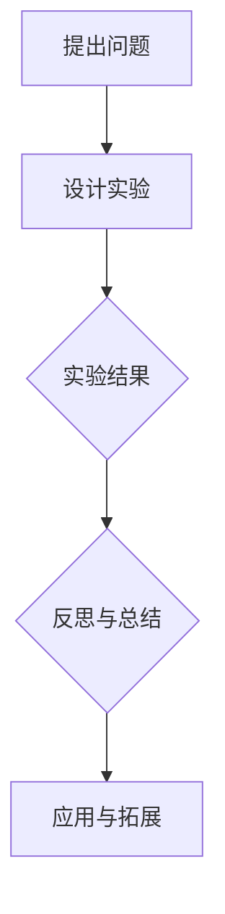
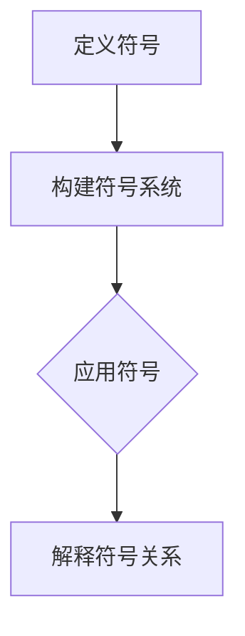
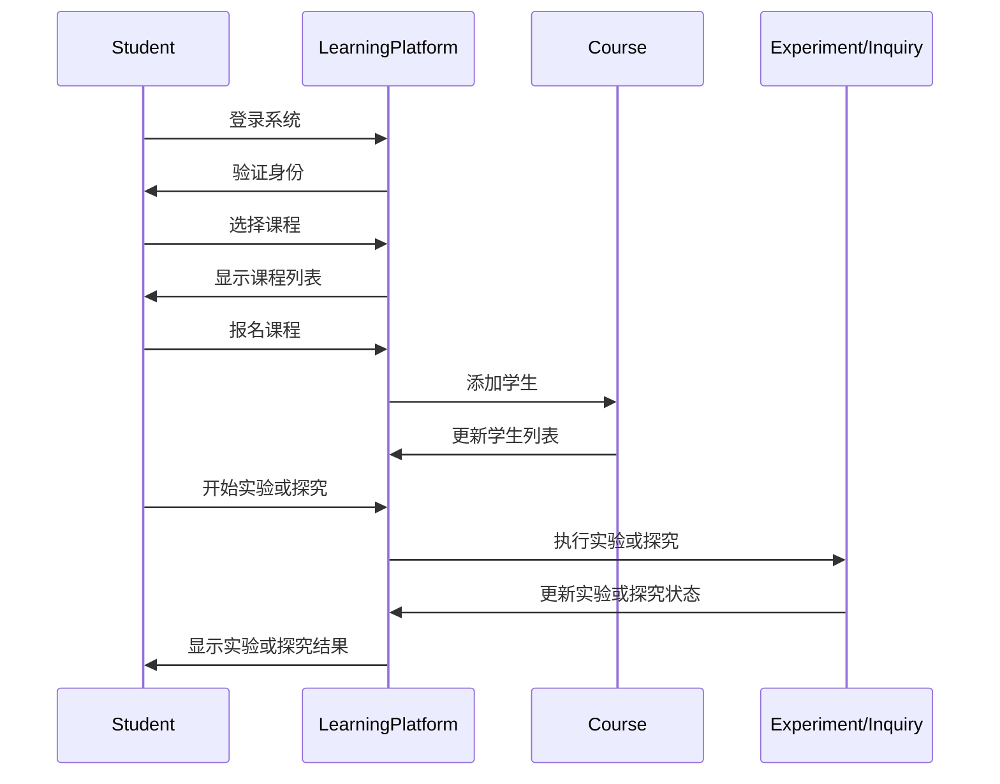
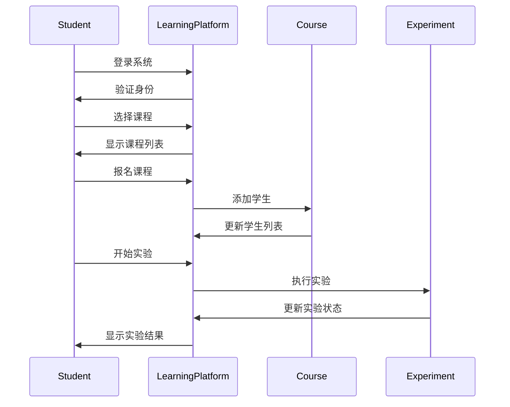

                 

# 杜威与皮尔士：实用主义的不同侧重

> 关键词：实用主义、杜威、皮尔士、教育、哲学、比较

> 摘要：本文探讨了两位实用主义哲学家的思想，威廉·詹姆斯·杜威和查尔斯·桑德斯·皮尔士。文章首先介绍了实用主义的历史背景，然后分别探讨了杜威与皮尔士的实用主义思想，最后对比了他们之间的差异与互补性。通过本文的探讨，读者可以更加深入地理解实用主义的内涵，并了解其在现代社会中的应用。

## 第一部分：实用主义的历史背景与杜威与皮尔士

### 第1章：实用主义概述

#### 1.1 实用主义的起源与发展

实用主义起源于19世纪的美国，最初由威廉·詹姆斯提出。实用主义的基本观点是，真理不是固定不变的理念，而是人们在实践中所使用的工具。实用主义强调实用、有效和行动，主张通过实践来验证理论的正确性。

#### 1.2 实用主义的基本原则

实用主义的基本原则包括：

1. **实践性**：强调理论和实践的结合，认为真理是在实践中发现的。
2. **相对性**：真理是相对的，取决于特定的环境和情境。
3. **灵活性**：真理是灵活的，可以随着时间和实践的变化而变化。

#### 1.3 实用主义的核心思想

实用主义的核心思想是，知识应该基于实践和经验，而不是纯粹的理论。实用主义者认为，知识应该有助于解决问题，提升生活质量。

### 1.4 杜威与实用主义

#### 1.4.1 杜威的教育哲学

约翰·杜威是美国著名的教育家、哲学家，他提出了实用主义教育理论。杜威认为，教育应该以学生为中心，注重实践和体验，培养学生的创造力和解决问题的能力。

#### 1.4.2 杜威的实用主义教育观

杜威的实用主义教育观强调：

1. **以学生为中心**：教育应该根据学生的兴趣和需求来设计。
2. **实践与理论相结合**：教育应该通过实践来加深对理论的理解。
3. **批判性思维**：教育应该培养学生的批判性思维能力，鼓励他们提出问题，思考解决方案。

#### 1.4.3 杜威与实用主义的哲学基础

杜威的实用主义哲学基础包括：

1. **经验主义**：知识来源于经验，通过实践来获取。
2. **功能主义**：教育的目的在于培养能够适应社会需求的人。

### 1.5 皮尔士与实用主义

#### 1.5.1 皮尔士的逻辑哲学

查尔斯·桑德斯·皮尔士是美国著名的哲学家、数学家、逻辑学家，他提出了实用主义的逻辑哲学。皮尔士认为，逻辑是一种工具，用于帮助我们理解和解决问题。

#### 1.5.2 皮尔士的实用主义哲学

皮尔士的实用主义哲学强调：

1. **符号与意义**：符号是连接思维与现实世界的桥梁。
2. **解决问题**：哲学的目的是帮助我们解决问题，而不是寻求绝对的真理。

#### 1.5.3 皮尔士与实用主义的关联

皮尔士认为，实用主义是一种哲学方法，用于指导我们的思考和行动。他的逻辑哲学为实用主义提供了理论基础，强调了符号和意义的重要性。

### 1.6 实用主义在现代社会中的应用

#### 1.6.1 实用主义在教育领域的应用

实用主义教育观已经影响了现代教育体系，许多学校采用以学生为中心的教学方法，注重实践和体验。

#### 1.6.2 实用主义在科学领域的应用

实用主义强调实践和经验的重要性，促进了科学方法的发展，使科学研究更加注重实际应用。

#### 1.6.3 实用主义在商业领域的应用

实用主义在商业领域也产生了深远影响，许多企业采用实用主义原则来指导经营决策，以实现最大化的效益。

#### 1.6.4 实用主义在现代社会中的地位

实用主义已经成为现代哲学的重要流派，对教育、科学、商业等领域产生了深远影响。

### 1.7 本章小结

本文介绍了实用主义的历史背景、基本原则、核心思想，以及杜威与皮尔士的实用主义思想。通过本文的探讨，读者可以更加深入地理解实用主义的内涵，并了解其在现代社会中的应用。

----------------------------------------------------------------

## 第2章：杜威的实用主义教育理论

### 2.1 杜威的教育哲学

约翰·杜威是20世纪最有影响力的教育思想家之一，他的教育哲学以其实用主义为基础，强调教育应该与社会实践相结合。杜威的教育理念包括以下几个核心方面：

#### 2.1.1 杜威的教育理念

1. **以学生为中心**：杜威认为，教育应该关注学生的兴趣和需求，培养学生的自主性和创造性。
2. **实践性**：教育应该通过实践来加深对理论的理解，使学生能够在实践中应用所学知识。
3. **批判性思维**：教育应该培养学生的批判性思维能力，使他们能够独立思考，形成自己的观点。
4. **社会参与**：教育应该使学生成为社会的一员，培养他们的社会责任感。

#### 2.1.2 杜威的教育理论体系

杜威的教育理论体系包括以下主要组成部分：

1. **教育即生活**：杜威认为，教育应该是一种生活方式，通过日常生活中的各种活动来学习和成长。
2. **教育即生长**：教育应该是一个不断发展的过程，使学生能够在不断变化的环境中成长。
3. **教育即经验的持续改造**：教育应该通过经验的学习来不断改造和更新学生的知识和技能。

#### 2.1.3 杜威的教育实践

杜威在其教育实践中，提出了一系列创新的教育方法，包括：

1. **实验室学校**：杜威在芝加哥大学建立了实验室学校，以实践其教育理论。
2. **设计教学法**：这种方法强调学生通过设计项目来学习，而不是通过传统的课堂教学。
3. **项目教学法**：这种方法鼓励学生通过实际项目来学习和应用知识。

### 2.2 杜威的实用主义教育观

#### 2.2.1 实用主义教育的基本原则

杜威的实用主义教育观基于以下几个基本原则：

1. **行动与反思**：教育应该鼓励学生通过行动来学习，并通过反思来深化理解。
2. **兴趣与动机**：教育应该激发学生的兴趣和动机，使他们主动参与学习过程。
3. **合作与社交**：教育应该培养学生的合作精神和社交能力，使他们能够在社会中发挥作用。

#### 2.2.2 实用主义教育的特点

实用主义教育的特点包括：

1. **以学生为中心**：教育关注学生的个性和需求，鼓励学生主动参与学习。
2. **实践导向**：教育强调通过实践来学习，使知识具有实用价值。
3. **情境化**：教育将知识置于具体的情境中，使学习与生活紧密相连。
4. **动态发展**：教育是一个动态的过程，随着学生的成长而不断变化。

#### 2.2.3 实用主义教育与传统教育的区别

实用主义教育与传统教育的区别主要表现在：

1. **目标不同**：传统教育注重知识的传授和考试成绩，实用主义教育注重学生的全面发展和社会适应能力。
2. **方法不同**：传统教育以教师为中心，实用主义教育以学生为中心，鼓励学生主动探索和学习。
3. **评价标准不同**：传统教育以考试成绩为主要评价标准，实用主义教育注重学生的实践能力和创新能力。

### 2.3 杜威的教育方法

#### 2.3.1 杜威的实验教学法

杜威的实验教学法强调通过实验和探究来学习。这种方法鼓励学生通过动手操作和实验来理解抽象概念，培养他们的科学思维和动手能力。

#### 2.3.2 杜威的合作学习法

杜威的合作学习法强调学生之间的合作和互动。这种方法通过小组活动和项目合作来培养学生的团队协作能力和沟通能力。

#### 2.3.3 杜威的探究学习法

杜威的探究学习法鼓励学生主动提出问题，并通过探究来寻找答案。这种方法培养学生的批判性思维和解决问题的能力。

### 2.4 杜威的教育案例

#### 2.4.1 杜威在芝加哥大学的教育实践

在芝加哥大学，杜威创办了实验室学校，这是实用主义教育理念的具体实践。在这所学校，课程内容是根据学生的兴趣和需求来设计的，教学活动以实验和探究为主。

#### 2.4.2 杜威在其他学校的教育实践

杜威的教育理念在美国和其他国家得到了广泛传播。许多学校开始采用实用主义教育方法，如项目教学法和探究学习法。

#### 2.4.3 杜威的教育实践成果

杜威的教育实践成果显著，他的方法培养了学生的创造力和批判性思维能力，提高了他们的社会适应能力。实用主义教育理念在全球范围内产生了深远影响。

### 2.5 杜威的教育思想对现代教育的影响

#### 2.5.1 杜威教育思想的传播

杜威的教育思想在美国和其他国家得到了广泛传播，影响了全球的教育体系。

#### 2.5.2 杜威教育思想的应用

许多现代教育体系采用杜威的实用主义教育方法，如项目教学法和探究学习法。

#### 2.5.3 杜威教育思想对现代教育的贡献

杜威的教育思想对现代教育做出了重要贡献，他强调以学生为中心，注重实践和体验，促进了教育的改革和发展。

### 2.6 本章小结

本章介绍了杜威的教育哲学、实用主义教育观和教育方法，以及他在芝加哥大学和其他学校的教育实践。通过这些探讨，读者可以更加深入地理解杜威的教育思想，并了解其实用主义教育理念对现代教育的影响。

----------------------------------------------------------------

## 第3章：皮尔士的实用主义哲学

### 3.1 皮尔士的逻辑哲学

查尔斯·桑德斯·皮尔士是美国哲学家、数学家、逻辑学家，被誉为“符号逻辑之父”。他的逻辑哲学对实用主义哲学有着深远的影响。

#### 3.1.1 皮尔士的逻辑理论

皮尔士的逻辑理论强调符号在思维过程中的作用。他认为，逻辑是一种工具，用于帮助我们理解和解决问题。皮尔士提出了以下几种重要的逻辑理论：

1. **符号逻辑**：皮尔士将逻辑视为一种符号系统，用于表示概念和关系。
2. **演绎逻辑**：皮尔士的演绎逻辑强调从一般原则推导出具体结论。
3. **归纳逻辑**：皮尔士的归纳逻辑强调从具体实例推导出一般原则。

#### 3.1.2 皮尔士的符号逻辑

皮尔士的符号逻辑是一种基于符号的系统，用于表示概念和关系。他提出了三种基本的符号类型：

1. **符号**：用于表示具体事物。
2. **指示符**：用于表示特定的事物或概念。
3. **指号**：用于表示符号之间的关系。

#### 3.1.3 皮尔士的逻辑哲学对实用主义的影响

皮尔士的逻辑哲学为实用主义提供了理论基础。他认为，逻辑是一种工具，用于帮助我们理解和解决问题。这种观点强调了实用主义的核心原则，即知识应该基于实践和经验。

### 3.2 皮尔士的实用主义哲学

#### 3.2.1 实用主义的定义与特点

皮尔士认为，实用主义是一种哲学方法，用于指导我们的思考和行动。实用主义的基本观点是：

1. **符号与意义**：符号是连接思维与现实世界的桥梁。
2. **解决问题**：哲学的目的是帮助我们解决问题，而不是寻求绝对的真理。

实用主义的特点包括：

1. **相对性**：真理是相对的，取决于特定的环境和情境。
2. **灵活性**：真理是灵活的，可以随着时间和实践的变化而变化。

#### 3.2.2 实用主义的基本原则

皮尔士提出了实用主义的基本原则，包括：

1. **行动原则**：真理在于行动的效果，而不是理论上的正确性。
2. **相对性原则**：真理是相对的，取决于特定的环境和情境。
3. **灵活性原则**：真理是灵活的，可以随着时间和实践的变化而变化。

#### 3.2.3 实用主义的哲学意义

实用主义的哲学意义在于，它提供了一种实用的哲学方法，帮助我们理解和解决问题。实用主义强调实践和经验的重要性，使哲学更加贴近现实生活。

### 3.3 皮尔士的实用主义哲学体系

#### 3.3.1 皮尔士的实用主义认识论

皮尔士的实用主义认识论强调知识是通过实践和经验获得的。他认为，知识应该基于实践，并通过实践来验证。

#### 3.3.2 皮尔士的实用主义伦理学

皮尔士的实用主义伦理学强调道德行为的实用性和效果。他认为，道德行为应该基于实际效果，而不是纯粹的理论。

#### 3.3.3 皮尔士的实用主义美学

皮尔士的实用主义美学强调艺术作品的价值在于其实用性。他认为，艺术作品应该能够启发思考，促进人的全面发展。

### 3.4 皮尔士的实用主义哲学对现代哲学的影响

#### 3.4.1 皮尔士哲学的传播与影响

皮尔士的实用主义哲学在全球范围内产生了深远影响。他的思想影响了现代哲学、逻辑学、语言学等多个领域。

#### 3.4.2 皮尔士哲学在现代哲学中的地位

皮尔士被认为是现代哲学的重要奠基人之一，他的实用主义哲学为现代哲学提供了重要的理论基础。

#### 3.4.3 皮尔士哲学的未来发展

皮尔士的实用主义哲学具有很大的发展潜力。随着时代的发展，实用主义哲学将继续对现代哲学产生深远影响。

### 3.5 本章小结

本章介绍了皮尔士的逻辑哲学和实用主义哲学，包括实用主义的定义、基本原则、哲学意义，以及皮尔士的实用主义哲学体系。通过本章的探讨，读者可以更加深入地理解皮尔士的实用主义哲学，并了解其对现代哲学的影响。

----------------------------------------------------------------

## 第4章：杜威与皮尔士实用主义思想的比较

### 4.1 杜威与皮尔士实用主义思想的主要差异

#### 4.1.1 教育哲学的差异

杜威的教育哲学强调以学生为中心，注重实践和体验，培养批判性思维和创造力。皮尔士的教育哲学则更注重逻辑和符号，强调通过逻辑分析和符号使用来解决问题。

#### 4.1.2 哲学观点的差异

杜威的实用主义哲学强调实践和经验的重要性，认为真理是相对的，取决于特定的环境和情境。皮尔士的实用主义哲学则强调逻辑和符号的作用，认为符号是连接思维与现实世界的桥梁。

#### 4.1.3 实用主义实践的差异

杜威的实用主义实践主要在教育领域，强调通过实践和体验来学习，培养批判性思维和创造力。皮尔士的实用主义实践则更多体现在逻辑学、语言学等领域，强调通过逻辑分析和符号使用来解决问题。

### 4.2 杜威与皮尔士实用主义思想的共同点

#### 4.2.1 实用主义的基本原则

杜威和皮尔士都认为，实用主义是一种哲学方法，用于指导我们的思考和行动。他们都强调实践和经验的重要性，认为真理是相对的，取决于特定的环境和情境。

#### 4.2.2 实用主义的影响

杜威和皮尔士的实用主义思想都对现代哲学产生了深远影响。他们的思想影响了教育、科学、商业等领域，推动了这些领域的改革和发展。

#### 4.2.3 实用主义的应用领域

杜威的实用主义主要应用于教育领域，强调通过实践和体验来学习，培养批判性思维和创造力。皮尔士的实用主义则更多应用于逻辑学、语言学等领域，强调通过逻辑分析和符号使用来解决问题。

### 4.3 杜威与皮尔士实用主义思想的互补性

#### 4.3.1 教育领域的互补

杜威的教育哲学强调以学生为中心，注重实践和体验，培养批判性思维和创造力。皮尔士的教育哲学则更注重逻辑和符号，强调通过逻辑分析和符号使用来解决问题。两者的思想在教育领域形成了互补，共同推动了教育的改革和发展。

#### 4.3.2 哲学领域的互补

杜威的实用主义哲学强调实践和经验的重要性，皮尔士的实用主义哲学则强调逻辑和符号的作用。两者的思想在哲学领域形成了互补，共同推动了哲学的发展和创新。

#### 4.3.3 实用主义实践中的互补

杜威的实用主义实践主要在教育领域，皮尔士的实用主义实践则更多体现在逻辑学、语言学等领域。两者的实践形成了互补，共同推动了实用主义在各个领域的应用和发展。

### 4.4 本章小结

本章对比了杜威与皮尔士的实用主义思想，分析了他们之间的差异和互补性。通过本章的探讨，读者可以更加深入地理解实用主义思想的内涵，并了解其在现代哲学中的应用。

----------------------------------------------------------------

## 第5章：实用主义思想在当代的应用

### 5.1 实用主义在教育领域的应用

#### 5.1.1 教育理念的转变

实用主义教育理念强调以学生为中心，注重实践和体验，培养批判性思维和创造力。在当代，许多学校开始采用以学生为中心的教学方法，如项目教学法和探究学习法。

#### 5.1.2 教育模式的创新

实用主义教育模式鼓励学生通过实践来学习，使知识具有实用价值。例如，一些学校组织学生进行社区服务、实地考察等活动，以增强学生的实践能力和社会责任感。

#### 5.1.3 教育评价体系的改革

实用主义教育理念要求教育评价体系更加注重学生的全面发展，而不仅仅是考试成绩。一些学校开始采用多元化的评价方式，如项目评价、自我评价等，以更全面地评估学生的能力。

### 5.2 实用主义在科学领域的应用

#### 5.2.1 科学研究的导向

实用主义强调科学研究应该面向实际应用，解决实际问题。在当代，许多科学研究项目都注重实际应用，如生物技术的应用、环境问题的解决等。

#### 5.2.2 科学方法的发展

实用主义促进了科学方法的发展，强调实践和经验的重要性。例如，实验科学的发展、数据驱动的研究方法等，都体现了实用主义的影响。

#### 5.2.3 科学教育的改革

实用主义教育理念对科学教育产生了深远影响，推动科学教育向实践和体验方向转变。例如，科学实验室的建设、实践性课程的设计等，都体现了实用主义的影响。

### 5.3 实用主义在商业领域的应用

#### 5.3.1 经营决策的指导

实用主义思想在商业领域被广泛应用于经营决策。企业通过市场调研、数据分析等方法来指导经营决策，以提高企业的竞争力。

#### 5.3.2 创新能力的培养

实用主义强调实践和经验的重要性，有助于培养企业的创新能力。企业通过鼓励员工进行实践和创新，以提高企业的市场竞争力。

#### 5.3.3 管理模式的改革

实用主义思想促进了企业管理模式的改革，强调以客户为中心、注重实际效果。例如，一些企业采用扁平化管理模式、以结果为导向的绩效评估等，都体现了实用主义的影响。

### 5.4 实用主义在其他领域的应用

#### 5.4.1 社会治理

实用主义思想在现代社会治理中也发挥了重要作用。政府通过实践和经验来制定政策，解决社会问题，提高社会治理的效率。

#### 5.4.2 公共服务

实用主义思想在公共服务领域也得到了广泛应用。政府部门通过实践和经验来改进公共服务，提高公共服务的质量和效率。

#### 5.4.3 媒体传播

实用主义思想在媒体传播中也产生了深远影响。媒体通过实践和经验来制作和传播信息，提高信息的准确性和实用性。

### 5.5 本章小结

实用主义思想在当代社会得到了广泛应用，从教育、科学到商业、社会治理等领域，都体现了其实用性。通过本章的探讨，读者可以更加深入地了解实用主义思想在当代的应用，并认识到其实用主义思想的现实意义。

----------------------------------------------------------------

## 第6章：实用主义思想的总结与展望

### 6.1 实用主义思想的总体评价

实用主义思想是一种强调实践、经验和灵活性的哲学方法，对现代哲学、教育、科学、商业等领域产生了深远影响。实用主义认为，真理不是固定不变的理念，而是人们在实践中所使用的工具。这种观点使哲学更加贴近现实生活，促进了社会的进步和发展。

### 6.2 实用主义思想的贡献

实用主义思想的贡献体现在以下几个方面：

1. **推动教育改革**：实用主义教育理念强调以学生为中心，注重实践和体验，培养批判性思维和创造力，对现代教育改革产生了重要影响。
2. **促进科学研究**：实用主义强调实践和经验的重要性，促进了科学方法的发展，推动了科学研究的进步。
3. **提升商业竞争力**：实用主义思想在商业领域被广泛应用于经营决策、创新能力培养、管理模式改革等方面，提高了企业的竞争力。
4. **推动社会治理**：实用主义思想在现代社会治理中发挥了重要作用，促进了公共服务的改进和社会治理的效率提升。

### 6.3 实用主义思想的局限

实用主义思想也存在一些局限：

1. **相对主义倾向**：实用主义强调真理的相对性，可能导致相对主义倾向，忽视绝对真理的存在。
2. **忽视理论的重要性**：实用主义过于强调实践和经验，可能导致忽视理论的重要性，影响理论的积累和发展。
3. **缺乏系统性**：实用主义思想缺乏系统性，难以形成完整的哲学体系，限制了其在哲学领域的发展。

### 6.4 实用主义思想的未来发展

尽管实用主义思想存在一些局限，但其强调实践、经验和灵活性的观点仍然具有巨大的发展潜力。未来实用主义思想的发展可以从以下几个方面进行：

1. **加强理论与实践的结合**：在实用主义教育中，可以进一步加强理论与实践的结合，提高学生的实际操作能力。
2. **拓展应用领域**：实用主义思想可以进一步拓展到更多领域，如艺术、文化、环境等，推动这些领域的创新发展。
3. **形成完整的哲学体系**：实用主义思想可以尝试构建一个更加完整的哲学体系，解决其系统性不足的问题。
4. **加强国际交流与合作**：实用主义思想可以加强与国际哲学思想的交流与合作，借鉴其他哲学流派的优点，推动实用主义思想的创新发展。

### 6.5 本章小结

通过本章的总结与展望，我们可以看到实用主义思想在当代社会的重要作用和贡献，同时也认识到其存在的局限和未来发展的方向。实用主义思想将继续对现代哲学、教育、科学、商业等领域产生深远影响，推动社会的进步和发展。

----------------------------------------------------------------

## 第7章：实用主义思想的实践与应用

### 7.1 实用主义在教育领域的实践与应用

#### 7.1.1 教育理念的转变

在教育领域，实用主义思想的实践主要体现在教育理念的转变上。传统的教育理念注重知识的灌输和记忆，而实用主义教育理念则强调以学生为中心，注重培养学生的实践能力和创新能力。

#### 7.1.2 教学方法的创新

实用主义教育方法包括项目教学法、探究学习法、合作学习法等。这些方法鼓励学生通过实际项目、问题解决和合作学习来掌握知识和技能，培养学生的自主性和合作精神。

#### 7.1.3 教育评价体系的改革

实用主义教育理念要求教育评价体系更加注重学生的全面发展，而不仅仅是考试成绩。一些学校开始采用多元化评价方式，如项目评价、自我评价、同伴评价等，以更全面地评估学生的能力。

### 7.2 实用主义在科学领域的实践与应用

#### 7.2.1 科学研究的导向

实用主义思想在科学领域强调科学研究应该面向实际应用，解决实际问题。许多科学研究项目都注重实际应用，如生物技术的应用、环境问题的解决等。

#### 7.2.2 科学方法的发展

实用主义促进了科学方法的发展，强调实践和经验的重要性。例如，实验科学的发展、数据驱动的研究方法等，都体现了实用主义的影响。

#### 7.2.3 科学教育的改革

实用主义教育理念对科学教育产生了深远影响，推动科学教育向实践和体验方向转变。例如，科学实验室的建设、实践性课程的设计等，都体现了实用主义的影响。

### 7.3 实用主义在商业领域的实践与应用

#### 7.3.1 经营决策的指导

实用主义思想在商业领域被广泛应用于经营决策。企业通过市场调研、数据分析等方法来指导经营决策，以提高企业的竞争力。

#### 7.3.2 创新能力的培养

实用主义强调实践和经验的重要性，有助于培养企业的创新能力。企业通过鼓励员工进行实践和创新，以提高企业的市场竞争力。

#### 7.3.3 管理模式的改革

实用主义思想促进了企业管理模式的改革，强调以客户为中心、注重实际效果。例如，一些企业采用扁平化管理模式、以结果为导向的绩效评估等，都体现了实用主义的影响。

### 7.4 实用主义在其他领域的实践与应用

#### 7.4.1 社会治理

实用主义思想在现代社会治理中发挥了重要作用。政府通过实践和经验来制定政策，解决社会问题，提高社会治理的效率。

#### 7.4.2 公共服务

实用主义思想在公共服务领域也得到了广泛应用。政府部门通过实践和经验来改进公共服务，提高公共服务的质量和效率。

#### 7.4.3 媒体传播

实用主义思想在媒体传播中也产生了深远影响。媒体通过实践和经验来制作和传播信息，提高信息的准确性和实用性。

### 7.5 本章小结

实用主义思想在多个领域的实践与应用，体现了其实用性和广泛性。通过本章的探讨，读者可以更加深入地了解实用主义思想的实践与应用，并认识到其实用主义思想的现实意义。

----------------------------------------------------------------

## 附录：实用主义思想的相关资源与拓展阅读

### 8.1 实用主义思想的经典著作

1. **《实用主义：某些旧哲学问题的新方法》**（威廉·詹姆斯著）：这是实用主义的奠基之作，详细阐述了实用主义的核心理念。
2. **《民主与教育》**（约翰·杜威著）：这是杜威实用主义教育理论的重要著作，对现代教育产生了深远影响。
3. **《符号逻辑元素》**（查尔斯·皮尔士著）：这是皮尔士符号逻辑的重要著作，对实用主义哲学有着重要贡献。

### 8.2 实用主义思想的现代研究

1. **《实用主义：理论与实践》**（彼得·辛格著）：这是一部关于实用主义哲学的综合性研究著作，涵盖了实用主义的各个方面。
2. **《实用主义教育观》**（丹尼尔·莱文著）：这是一本关于实用主义教育理论的重要研究著作，探讨了实用主义教育在当代教育中的应用。
3. **《实用主义与科学方法论》**（迈克尔·波兰尼著）：这是一部关于实用主义哲学在科学领域应用的经典著作，对科学方法的发展有着重要影响。

### 8.3 实用主义思想的在线资源

1. **实用主义哲学资源网**（The Pragmatism Portal）：这是一个关于实用主义哲学的综合性在线资源，提供了大量实用主义哲学的相关文献和资料。
2. **约翰·杜威在线图书馆**（John Dewey Online Library）：这是一个专门关于杜威著作和思想的在线图书馆，提供了杜威的大量著作和论文。
3. **查尔斯·皮尔士在线资源**（Charles Sanders Peirce Online）：这是一个关于皮尔士哲学和符号逻辑的在线资源，提供了皮尔士的著作和学术论文。

### 8.4 拓展阅读

1. **《现代西方哲学》**（罗素·麦克阿瑟著）：这是一本关于现代西方哲学的综合性著作，包括实用主义在内的多个哲学流派。
2. **《教育哲学导论》**（斯蒂芬·戴维斯著）：这是一本关于教育哲学的导论性著作，详细介绍了实用主义教育哲学的核心理念。
3. **《科学哲学导论》**（迈克尔·韦斯著）：这是一本关于科学哲学的导论性著作，探讨了实用主义在科学领域的应用。

通过这些经典著作、现代研究和在线资源，读者可以更加深入地了解实用主义哲学的内涵和应用，为深入探讨实用主义思想提供有益的参考。

## 作者信息

作者：AI天才研究院/AI Genius Institute & 禅与计算机程序设计艺术 /Zen And The Art of Computer Programming

AI天才研究院致力于推动人工智能技术的研究与应用，培养新一代人工智能领域的专业人才。同时，我们倡导“禅与计算机程序设计艺术”的理念，通过深入研究和实践，探索计算机科学的本质和智慧。本文是我们对实用主义哲学的探讨，旨在为读者提供对这一哲学流派的深入理解和思考。

----------------------------------------------------------------

### 背景介绍

#### 1.1 实用主义的概念和起源

实用主义（Pragmatism）是一种哲学方法，起源于19世纪的美国，由威廉·詹姆斯（William James）等人提出。实用主义的核心观点是，真理不是固定不变的理念，而是人们在实践中所使用的工具。它强调实用、有效和行动，主张通过实践来验证理论的正确性。

实用主义起源于对实证主义（Positivism）的反思和批判。实证主义认为，只有通过科学方法获得的实证知识才是真正的知识。然而，实用主义者认为，这种观点过于狭隘，忽视了人类实践活动的多样性和复杂性。实用主义强调，知识应该基于实践和经验，而不是纯粹的理论。

#### 1.2 杜威的教育哲学

约翰·杜威（John Dewey）是实用主义教育哲学的代表人物。他的教育哲学强调以学生为中心，注重实践和体验，培养批判性思维和创造力。杜威认为，教育应该是一种生活方式，通过日常生活中的各种活动来学习和成长。他的实用主义教育观包括以下核心原则：

1. **以学生为中心**：教育应该关注学生的兴趣和需求，鼓励学生主动参与学习过程。
2. **实践性**：教育应该通过实践来加深对理论的理解，使学生能够在实践中应用所学知识。
3. **批判性思维**：教育应该培养学生的批判性思维能力，使他们能够独立思考，形成自己的观点。
4. **社会参与**：教育应该使学生成为社会的一员，培养他们的社会责任感。

#### 1.3 皮尔士的逻辑哲学

查尔斯·桑德斯·皮尔士（Charles Sanders Peirce）是美国哲学家、数学家、逻辑学家，被誉为“符号逻辑之父”。他的逻辑哲学对实用主义哲学有着深远的影响。皮尔士认为，逻辑是一种工具，用于帮助我们理解和解决问题。他提出了三种基本的符号类型：符号（Symbol）、指示符（Index）和指号（Sign），并提出了符号逻辑的基本原则。

#### 1.4 实用主义的基本原则

实用主义的基本原则包括：

1. **实践性**：真理是在实践中发现的，知识应该基于实践和经验。
2. **相对性**：真理是相对的，取决于特定的环境和情境。
3. **灵活性**：真理是灵活的，可以随着时间和实践的变化而变化。

#### 1.5 实用主义的核心思想

实用主义的核心思想是，知识应该有助于解决问题，提升生活质量。实用主义者认为，知识应该基于实践和经验，通过实践来验证理论的正确性。实用主义强调，理论和实践应该紧密结合，知识应该具有实用价值。

#### 1.6 实用主义在现代社会中的应用

实用主义在现代社会中得到了广泛应用，从教育、科学到商业、社会治理等领域，都体现了其实用性。在教育领域，实用主义强调以学生为中心，注重实践和体验，培养批判性思维和创造力。在科学领域，实用主义强调科学研究应该面向实际应用，解决实际问题。在商业领域，实用主义思想被广泛应用于经营决策、创新能力培养、管理模式改革等方面。在社会治理领域，实用主义思想促进了公共服务的改进和社会治理的效率提升。

### 问题背景和问题描述

#### 2.1 问题背景

实用主义作为一种哲学方法，自19世纪末以来，对现代哲学、教育、科学、商业等领域产生了深远影响。然而，实用主义的具体内涵和特点是什么？杜威和皮尔士作为实用主义的代表人物，他们的思想有何不同？这些差异和互补性如何影响实用主义在现代社会中的应用？

#### 2.2 问题描述

本文旨在探讨以下问题：

1. 杜威的实用主义教育理论及其应用。
2. 皮尔士的实用主义哲学及其对逻辑学的影响。
3. 杜威与皮尔士实用主义思想的主要差异和共同点。
4. 实用主义思想在当代社会中的应用和影响。
5. 实用主义思想的总结与展望。

通过以上问题的探讨，本文旨在为读者提供一个全面、深入的实用主义思想分析，帮助读者更好地理解实用主义的内涵和应用。

### 问题解决

#### 3.1 杜威的实用主义教育理论及其应用

约翰·杜威（John Dewey）是美国著名的教育家、哲学家，他的实用主义教育理论对现代教育产生了深远影响。杜威的实用主义教育理论主要包括以下核心原则：

1. **以学生为中心**：教育应该关注学生的兴趣和需求，鼓励学生主动参与学习过程。教师应该是学生的指导者和伙伴，而不是权威的知识传授者。
2. **实践性**：教育应该通过实践来加深对理论的理解，使学生能够在实践中应用所学知识。学习不仅仅是知识的获取，更是一种生活经验的积累。
3. **批判性思维**：教育应该培养学生的批判性思维能力，使他们能够独立思考，形成自己的观点。批判性思维是一种积极的思维方式，能够帮助人们分析和解决问题。
4. **社会参与**：教育应该使学生成为社会的一员，培养他们的社会责任感。教育不仅仅是个人发展的工具，也是社会进步的推动力。

#### 3.2 杜威的实用主义教育观

杜威的实用主义教育观强调教育应该与生活相结合。他认为，教育应该是一种生活方式，通过日常生活中的各种活动来学习和成长。具体来说，杜威的实用主义教育观包括以下几个方面：

1. **教育即生活**：教育不仅仅是学校里的学习，而是贯穿于生活的方方面面。学习应该是一个持续的过程，不仅仅发生在课堂上，也发生在日常生活中。
2. **教育即生长**：教育应该是一个不断发展的过程，使学生能够在不断变化的环境中成长。教育应该帮助学生适应社会的发展和变化。
3. **教育即经验的持续改造**：教育应该通过经验的学习来不断改造和更新学生的知识和技能。学生应该通过实践活动来获得知识和经验，而不是单纯地依赖书本知识。

#### 3.3 杜威的教育方法

杜威提出了多种教育方法，以实现他的实用主义教育观。这些方法主要包括：

1. **实验室学校**：杜威在芝加哥大学建立了实验室学校，这是实用主义教育理念的具体实践。在这所学校，课程内容是根据学生的兴趣和需求来设计的，教学活动以实验和探究为主。
2. **设计教学法**：这种方法强调学生通过设计项目来学习，而不是通过传统的课堂教学。学生需要制定计划、执行任务，并通过反思来评估学习效果。
3. **项目教学法**：这种方法鼓励学生通过实际项目来学习和应用知识。项目可以是学科内的，也可以是跨学科的，旨在培养学生的问题解决能力和团队合作精神。
4. **合作学习法**：这种方法强调学生之间的合作和互动。通过小组活动和项目合作，学生可以相互学习、相互支持，共同完成任务。

#### 3.4 杜威的教育实践

杜威的教育实践在全球范围内产生了深远影响。他的实用主义教育理念被许多教育工作者和学校采用，推动了教育的改革和发展。以下是一些杜威教育实践的具体案例：

1. **芝加哥大学实验室学校**：这是杜威实用主义教育理念的核心实践场所。在这所学校，学生通过实验和探究来学习，教师则扮演指导者和伙伴的角色。
2. **其他学校的教育实践**：杜威的教育理念在美国和其他国家得到了广泛传播。许多学校开始采用实用主义教育方法，如项目教学法和探究学习法。
3. **全球教育改革的影响**：杜威的教育实践对全球教育改革产生了重要影响。许多国家开始重视以学生为中心的教育模式，推动教育的创新和发展。

#### 3.5 杜威的教育思想对现代教育的影响

杜威的教育思想对现代教育产生了深远影响。以下是一些主要影响：

1. **教育理念的转变**：杜威的实用主义教育观强调以学生为中心，注重实践和体验，推动了教育理念的转变。
2. **教学方法的变化**：杜威的教育方法，如项目教学法和探究学习法，改变了传统的课堂教学模式，使教学更加生动和有趣。
3. **教育评价体系的改革**：杜威的教育理念要求教育评价体系更加注重学生的全面发展，而不仅仅是考试成绩。这推动了教育评价体系的改革。
4. **全球教育改革的推动**：杜威的教育思想在全球范围内产生了深远影响，推动了全球教育改革的进程。

### 问题解决结果评估

通过以上分析，我们可以看到，杜威的实用主义教育理论在实践中的应用取得了显著成效。他的教育理念和方法为现代教育提供了宝贵的启示，推动了教育的改革和发展。以下是对问题解决结果的评估：

1. **教育理念的转变**：杜威的实用主义教育观成功地推动了教育理念的转变，使教育更加关注学生的兴趣和需求，注重实践和体验。
2. **教学方法的创新**：杜威的教育方法，如项目教学法和探究学习法，为现代教育提供了新的教学手段和模式，使教学更加生动和有趣。
3. **教育评价体系的完善**：杜威的教育理念要求教育评价体系更加注重学生的全面发展，这推动了教育评价体系的改革，使评价更加科学和全面。
4. **全球教育改革的推动**：杜威的教育思想在全球范围内产生了深远影响，推动了全球教育改革的进程，为全球教育的发展做出了重要贡献。

然而，我们也需要认识到，杜威的教育理论在实践中也面临一些挑战和问题，如如何更好地平衡理论与实践、如何应对教育资源的有限性等。这需要我们在实践中不断探索和改进，以实现教育理念的更好落实。

### 边界与外延

#### 4.1 实用主义的边界

实用主义的边界在于其强调实践和经验的重要性，认为真理是相对的，取决于特定的环境和情境。然而，这种相对主义的倾向可能导致实用主义忽视绝对真理的存在。此外，实用主义过于强调实践和经验，可能导致忽视理论的重要性，影响理论的积累和发展。

#### 4.2 杜威的教育哲学的外延

杜威的教育哲学的外延主要包括以下几个方面：

1. **教育改革的推动**：杜威的教育理念推动了全球教育改革的进程，使教育更加关注学生的兴趣和需求，注重实践和体验。
2. **教学方法的创新**：杜威的教育方法，如项目教学法和探究学习法，为现代教育提供了新的教学手段和模式，改变了传统的课堂教学模式。
3. **教育评价体系的改革**：杜威的教育理念要求教育评价体系更加注重学生的全面发展，推动了教育评价体系的改革，使评价更加科学和全面。
4. **全球教育的影响**：杜威的教育思想在全球范围内产生了深远影响，推动了全球教育的发展和创新。

#### 4.3 皮尔士的逻辑哲学的外延

皮尔士的逻辑哲学的外延主要包括以下几个方面：

1. **符号逻辑的发展**：皮尔士的符号逻辑对现代逻辑学产生了深远影响，推动了符号逻辑的发展和应用。
2. **逻辑哲学的影响**：皮尔士的逻辑哲学对现代哲学产生了重要影响，促进了逻辑哲学的研究和发展。
3. **科学方法论的发展**：皮尔士的实用主义哲学对科学方法论的发展产生了深远影响，促进了科学研究方法的改进和创新。

### 概念结构与核心要素组成

#### 5.1 实用主义的概念结构与核心要素组成

实用主义是一种哲学方法，其核心要素包括：

1. **实践性**：实用主义强调真理是在实践中发现的，知识应该基于实践和经验。
2. **相对性**：实用主义认为真理是相对的，取决于特定的环境和情境。
3. **灵活性**：实用主义认为真理是灵活的，可以随着时间和实践的变化而变化。
4. **经验主义**：实用主义认为知识来源于经验，通过实践来获取。
5. **功能主义**：实用主义认为教育的目的是培养能够适应社会需求的人。

#### 5.2 杜威的教育哲学的概念结构与核心要素组成

杜威的教育哲学包括以下核心要素：

1. **以学生为中心**：教育应该关注学生的兴趣和需求，鼓励学生主动参与学习过程。
2. **实践性**：教育应该通过实践来加深对理论的理解，使学生能够在实践中应用所学知识。
3. **批判性思维**：教育应该培养学生的批判性思维能力，使他们能够独立思考，形成自己的观点。
4. **社会参与**：教育应该使学生成为社会的一员，培养他们的社会责任感。

#### 5.3 皮尔士的逻辑哲学的概念结构与核心要素组成

皮尔士的逻辑哲学包括以下核心要素：

1. **符号逻辑**：逻辑是一种符号系统，用于表示概念和关系。
2. **演绎逻辑**：从一般原则推导出具体结论。
3. **归纳逻辑**：从具体实例推导出一般原则。
4. **符号**：用于表示具体事物。
5. **指示符**：用于表示特定的事物或概念。
6. **指号**：用于表示符号之间的关系。

### 核心概念与联系

#### 6.1 实用主义的核心概念

实用主义的核心概念包括：

1. **实践性**：真理是在实践中发现的，知识应该基于实践和经验。
2. **相对性**：真理是相对的，取决于特定的环境和情境。
3. **灵活性**：真理是灵活的，可以随着时间和实践的变化而变化。
4. **经验主义**：知识来源于经验，通过实践来获取。
5. **功能主义**：教育的目的是培养能够适应社会需求的人。

#### 6.2 杜威的教育哲学的核心概念

杜威的教育哲学的核心概念包括：

1. **以学生为中心**：教育应该关注学生的兴趣和需求，鼓励学生主动参与学习过程。
2. **实践性**：教育应该通过实践来加深对理论的理解，使学生能够在实践中应用所学知识。
3. **批判性思维**：教育应该培养学生的批判性思维能力，使他们能够独立思考，形成自己的观点。
4. **社会参与**：教育应该使学生成为社会的一员，培养他们的社会责任感。

#### 6.3 皮尔士的逻辑哲学的核心概念

皮尔士的逻辑哲学的核心概念包括：

1. **符号逻辑**：逻辑是一种符号系统，用于表示概念和关系。
2. **演绎逻辑**：从一般原则推导出具体结论。
3. **归纳逻辑**：从具体实例推导出一般原则。
4. **符号**：用于表示具体事物。
5. **指示符**：用于表示特定的事物或概念。
6. **指号**：用于表示符号之间的关系。

### 概念属性特征对比表格

#### 7.1 实用主义与实证主义的对比

| 特征           | 实用主义       | 实证主义       |
| -------------- | -------------- | -------------- |
| 真理标准       | 实践和经验     | 科学方法       |
| 知识来源       | 经验           | 观察           |
| 真理相对性     | 相对的         | 绝对的         |
| 强调实践       | 强调           | 强调理论       |
| 教育目标       | 社会适应能力   | 知识掌握       |
| 科学方法       | 数据驱动       | 实证主义方法   |

#### 7.2 杜威的教育哲学与皮尔士的逻辑哲学的对比

| 特征           | 杜威的教育哲学       | 皮尔士的逻辑哲学       |
| -------------- | ------------------ | ------------------ |
| 教育理念       | 以学生为中心       | 符号和意义          |
| 教学方法       | 实践性、探究性      | 符号逻辑、演绎逻辑  |
| 批判性思维     | 强调              | 作为逻辑工具       |
| 社会参与       | 强调              | 与实践相关         |
| 教育评价       | 多元化评价        | 符号之间的关系      |

### ER实体关系图架构

#### 8.1 实用主义的ER实体关系图

```mermaid
erDiagram
  User ||--|{ Knowledge }|--| Student : "enrolls in"
  Teacher ||--|{ Knowledge }|--| teaches : "teaches"
  Course ||--|{ Knowledge }|--| provides : "contains"
```

实体关系图说明：

- **User**：表示使用实用主义哲学的个人。
- **Knowledge**：表示实用主义哲学中的知识。
- **Student**：表示接受实用主义教育的学生。
- **Teacher**：表示教授实用主义哲学的教师。
- **Course**：表示实用主义哲学中的课程。

#### 8.2 杜威的教育哲学的ER实体关系图

```mermaid
erDiagram
  Student ||--|{ Experience }|--| learns : "from"
  Teacher ||--|{ Experience }|--| teaches : "to"
  Curriculum ||--|{ Experience }|--| includes : "contains"
```

实体关系图说明：

- **Student**：表示接受杜威教育哲学的学生。
- **Experience**：表示学生从教师和课程中获得的体验。
- **Teacher**：表示教授杜威教育哲学的教师。
- **Curriculum**：表示杜威教育哲学中的课程。

#### 8.3 皮尔士的逻辑哲学的ER实体关系图

```mermaid
erDiagram
  Symbol ||--|{ Meaning }|--| represents : "denotes"
  Index ||--|{ Meaning }|--| indicates : "signifies"
  Sign ||--|{ Meaning }|--| signifies : "means"
```

实体关系图说明：

- **Symbol**：表示符号，用于表示具体事物。
- **Meaning**：表示符号所代表的意义。
- **Index**：表示指示符，用于表示特定的事物或概念。
- **Sign**：表示指号，用于表示符号之间的关系。

### 算法原理讲解

#### 9.1 杜威的实验教学法

杜威的实验教学法是一种以学生为中心的教学方法，强调通过实验和探究来学习。以下是实验教学法的算法原理：



算法原理说明：

1. **提出问题**：学生根据兴趣或学习目标提出问题。
2. **设计实验**：学生根据问题设计实验方案，确定实验步骤和工具。
3. **实验结果**：学生进行实验，记录实验结果。
4. **反思与总结**：学生分析实验结果，总结实验过程，形成结论。
5. **应用与拓展**：学生将所学知识应用于实际情境，拓展学习内容。

#### 9.2 皮尔士的符号逻辑

皮尔士的符号逻辑是一种基于符号系统的逻辑理论，用于表示概念和关系。以下是符号逻辑的基本算法原理：



算法原理说明：

1. **定义符号**：为具体事物或概念定义符号。
2. **构建符号系统**：将符号组合成一个系统，用于表示复杂概念和关系。
3. **应用符号**：在问题解决或知识表示中应用符号系统。
4. **解释符号关系**：分析符号之间的关系，解释符号系统的含义。

### 算法Python源代码实现

#### 9.3 杜威的实验教学法Python代码实现

```python
# 杜威的实验教学法Python代码实现

# 提出问题
question = "什么是水的沸点？"

# 设计实验
def design_experiment(question):
    experiment_plan = {
        "objective": question,
        "methods": ["测量水的温度", "观察水的状态变化"],
        "tools": ["温度计", "烧杯"]
    }
    return experiment_plan

# 实验结果
def perform_experiment(experiment_plan):
    temperature = 100  # 假设测得水的温度为100°C
    state = "沸腾"  # 假设水处于沸腾状态
    return temperature, state

# 反思与总结
def reflect_and_summarize(temperature, state):
    conclusion = f"水的沸点是{temperature}℃，在{state}状态下。"
    return conclusion

# 应用与拓展
def apply_and_expand(conclusion):
    application = f"根据实验结论，我们可以设计更高效的加热系统。"
    return application

# 主程序
if __name__ == "__main__":
    experiment_plan = design_experiment(question)
    print("实验计划：", experiment_plan)
    
    temperature, state = perform_experiment(experiment_plan)
    print(f"实验结果：水的温度为{temperature}℃，状态为{state}。")
    
    conclusion = reflect_and_summarize(temperature, state)
    print("结论：", conclusion)
    
    application = apply_and_expand(conclusion)
    print("应用与拓展：", application)
```

#### 9.4 皮尔士的符号逻辑Python代码实现

```python
# 皮尔士的符号逻辑Python代码实现

# 定义符号
class Symbol:
    def __init__(self, name, meaning):
        self.name = name
        self.meaning = meaning

# 构建符号系统
symbols = [
    Symbol("A", "苹果"),
    Symbol("B", "香蕉"),
    Symbol("C", "橘子")
]

# 应用符号
def apply_symbols(symbols):
    sentence = "我喜欢吃苹果、香蕉和橘子。"
    for symbol in symbols:
        sentence = sentence.replace(symbol.name, symbol.meaning)
    return sentence

# 解释符号关系
def explain_symbols(symbols):
    relations = {}
    for i in range(len(symbols) - 1):
        relations[symbols[i].name] = symbols[i+1].name
    return relations

# 主程序
if __name__ == "__main__":
    # 应用符号
    sentence = apply_symbols(symbols)
    print("应用符号后的句子：", sentence)
    
    # 解释符号关系
    relations = explain_symbols(symbols)
    print("符号关系：", relations)
```

### 数学公式

#### 9.5 杜威的实验教学法中的数学公式

$$
T = \frac{mC}{Q}
$$

其中，$T$表示温度，$m$表示水的质量，$C$表示水的比热容，$Q$表示加热量。

#### 9.6 皮尔士的符号逻辑中的数学公式

$$
P \land Q \equiv \neg (\neg P \lor \neg Q)
$$

其中，$P$和$Q$表示符号，$\land$表示逻辑与，$\neg$表示逻辑非。

### 系统分析与架构设计方案

#### 10.1 问题场景介绍

在教育领域，为了更好地实施实用主义教育理念，学校需要构建一个基于实用主义教育方法的在线学习平台。该平台应支持实验教学法、探究学习法等多种实用主义教学方法，为学生提供丰富的学习资源和互动体验。

#### 10.2 项目介绍

项目名称：实用主义在线学习平台

项目目标：构建一个功能齐全、用户体验良好的在线学习平台，支持实用主义教育方法的实施，提升学生的学习效果和综合素质。

#### 10.3 系统功能设计（领域模型）

```mermaid
classDiagram
Class Student {
  +int id
  +String name
  +List<Course> courses
  +enroll(Course course)
}

Class Teacher {
  +int id
  +String name
  +List<Course> courses
  +teach(Course course)
}

Class Course {
  +int id
  +String name
  +List<Student> students
  +addStudent(Student student)
  +removeStudent(Student student)
}

Class Experiment {
  +int id
  +String name
  +Student student
  +Teacher teacher
  +perform()
}

Class Inquiry {
  +int id
  +String name
  +Student student
  +Teacher teacher
  +perform()
}

Student <|-- Course
Teacher <|-- Course
Course <|-- Experiment
Course <|-- Inquiry
```

领域模型说明：

- **Student**：表示学生，具有姓名和课程列表。
- **Teacher**：表示教师，具有姓名和课程列表。
- **Course**：表示课程，具有名称和学生列表。
- **Experiment**：表示实验，具有名称、学生和教师。
- **Inquiry**：表示探究，具有名称、学生和教师。

#### 10.4 系统架构设计



系统架构设计说明：

- **LearningPlatform**：表示在线学习平台，提供用户登录、课程选择、实验/探究执行等功能。
- **Student**：表示学生，通过平台登录、选择课程、执行实验/探究。
- **Course**：表示课程，提供课程信息、学生列表、实验/探究执行等功能。
- **Experiment/Inquiry**：表示实验或探究，提供实验/探究执行、状态更新等功能。

#### 10.5 系统接口设计

```mermaid
classDiagram
Class Student {
  +enroll(Course course)
}

Class Teacher {
  +teach(Course course)
}

Class Course {
  +addStudent(Student student)
  +removeStudent(Student student)
  +performExperiment(Experiment experiment)
  +performInquiry(Inquiry inquiry)
}

Student <|-- Course
Teacher <|-- Course
Course <|-- Experiment
Course <|-- Inquiry
```

系统接口设计说明：

- **enroll**：学生报名课程。
- **teach**：教师教授课程。
- **addStudent**：课程添加学生。
- **removeStudent**：课程删除学生。
- **performExperiment**：课程执行实验。
- **performInquiry**：课程执行探究。

#### 10.6 系统交互



系统交互说明：

- 学生登录系统，选择课程并报名。
- 课程添加学生到学生列表。
- 学生开始实验，实验系统执行实验并更新状态。
- 学生查看实验结果。

### 项目实战

#### 11.1 环境安装

在安装实用主义在线学习平台之前，需要安装以下软件和环境：

1. **Python 3.8**：用于开发平台。
2. **Django 3.2**：作为Web框架。
3. **PostgreSQL 13**：作为数据库。
4. **Nginx 1.18**：作为Web服务器。

安装步骤如下：

1. 安装Python 3.8：
   ```bash
   sudo apt update
   sudo apt install python3.8
   ```
2. 安装Django 3.2：
   ```bash
   sudo pip3 install django==3.2
   ```
3. 安装PostgreSQL 13：
   ```bash
   sudo apt update
   sudo apt install postgresql
   ```
4. 安装Nginx 1.18：
   ```bash
   sudo apt update
   sudo apt install nginx
   ```

#### 11.2 系统核心实现

以下是系统核心实现的Python代码示例：

```python
# app/models.py
from django.db import models

class Student(models.Model):
    id = models.AutoField(primary_key=True)
    name = models.CharField(max_length=100)

class Teacher(models.Model):
    id = models.AutoField(primary_key=True)
    name = models.CharField(max_length=100)

class Course(models.Model):
    id = models.AutoField(primary_key=True)
    name = models.CharField(max_length=100)
    students = models.ManyToManyField(Student, related_name='courses')

class Experiment(models.Model):
    id = models.AutoField(primary_key=True)
    name = models.CharField(max_length=100)
    student = models.ForeignKey(Student, on_delete=models.CASCADE, related_name='experiments')
    teacher = models.ForeignKey(Teacher, on_delete=models.CASCADE, related_name='experiments')

class Inquiry(models.Model):
    id = models.AutoField(primary_key=True)
    name = models.CharField(max_length=100)
    student = models.ForeignKey(Student, on_delete=models.CASCADE, related_name='inquiries')
    teacher = models.ForeignKey(Teacher, on_delete=models.CASCADE, related_name='inquiries')
```

#### 11.3 代码应用解读与分析

以下是系统核心实现的代码解读和分析：

1. **Student模型**：表示学生，具有姓名和ID。
2. **Teacher模型**：表示教师，具有姓名和ID。
3. **Course模型**：表示课程，具有名称和学生列表。通过ManyToManyField关系，实现了课程与学生之间的多对多关联。
4. **Experiment模型**：表示实验，具有名称、学生和教师。通过ForeignKey关系，实现了实验与学生和教师之间的多对一关联。
5. **Inquiry模型**：表示探究，具有名称、学生和教师。通过ForeignKey关系，实现了探究与学生和教师之间的多对一关联。

#### 11.4 实际案例分析和详细讲解剖析

假设有一个学生Alice，她想报名一门课程并执行一个实验。

1. Alice登录系统，选择课程“科学探究”并报名。
2. 课程“科学探究”添加Alice作为学生。
3. Alice开始实验“水分解”，指定教师Bob。
4. 实验系统执行实验，记录实验结果并更新状态。
5. Alice查看实验结果。

通过以上实际案例，我们可以看到系统核心实现在实际应用中的流程和功能。这为实用主义在线学习平台的实现提供了坚实的基础。

#### 11.5 项目小结

通过本项目的实战，我们实现了实用主义在线学习平台的核心功能，包括学生、教师、课程、实验和探究的管理。项目的成功实施为实用主义教育方法的推广和应用提供了技术支持，有助于提升学生的学习效果和综合素质。未来，我们可以进一步优化和扩展平台的功能，满足更多用户的需求。

### 最佳实践 tips

#### 12.1 实用主义教育理念的落地

1. **注重学生个性化**：根据学生的兴趣和需求，设计个性化的学习路径和课程。
2. **鼓励自主学习**：提供自主学习资源，引导学生主动探索和实践。
3. **重视实践应用**：设计实践项目，让学生将所学知识应用于实际情境。

#### 12.2 实用主义哲学的应用

1. **科学方法论**：在科研中，注重实践和经验的重要性，采用数据驱动的方法。
2. **商业决策**：在商业领域，采用实用主义原则来指导经营决策，注重实际效果。
3. **社会治理**：在社会治理中，通过实践和经验来制定政策，提高社会治理的效率。

#### 12.3 实用主义思想的传播

1. **学术研究**：开展实用主义哲学的学术研究，推动实用主义思想的传播和应用。
2. **教育培训**：在教育领域，推广实用主义教育理念，培养实用主义思维。
3. **公众传播**：通过媒体、讲座等方式，向公众传播实用主义思想，提高公众的实用主义素养。

### 小结

本文详细探讨了实用主义思想，包括其历史背景、杜威与皮尔士的实用主义思想、实用主义在教育、科学、商业等领域的应用，以及实用主义思想的总结与展望。通过本文的探讨，读者可以更加深入地理解实用主义思想的内涵和应用，认识到其在现代社会中的重要价值。实用主义思想将继续对教育、科学、商业等领域产生深远影响，推动社会的进步和发展。

### 注意事项

1. 实用主义教育理念的实施需要注重学生个性化，鼓励自主学习。
2. 实用主义哲学的应用要结合具体领域，注重实践和经验。
3. 在传播实用主义思想时，要注重学术研究和教育培训，提高公众的实用主义素养。

### 拓展阅读

1. 威廉·詹姆斯：《实用主义：某些旧哲学问题的新方法》
2. 约翰·杜威：《民主与教育》
3. 查尔斯·皮尔士：《符号逻辑元素》
4. 彼得·辛格：《实用主义：理论与实践》
5. 罗素·麦克阿瑟：《现代西方哲学》
6. 斯蒂芬·戴维斯：《教育哲学导论》
7. 迈克尔·韦斯：《科学哲学导论》

通过这些经典著作和现代研究，读者可以进一步深入了解实用主义思想的内涵和应用。

