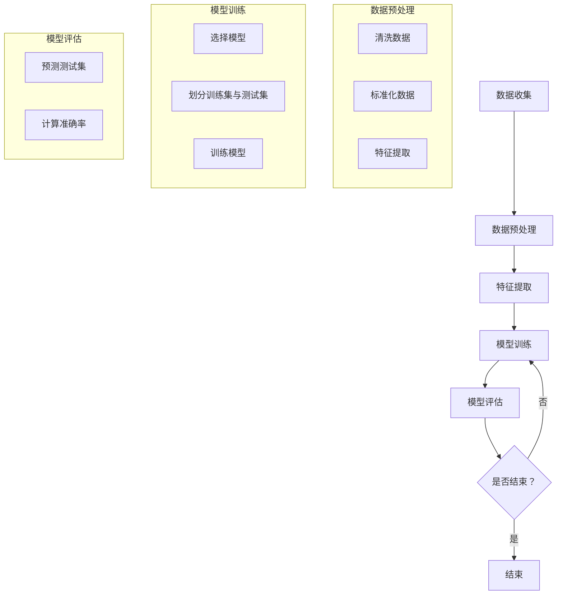
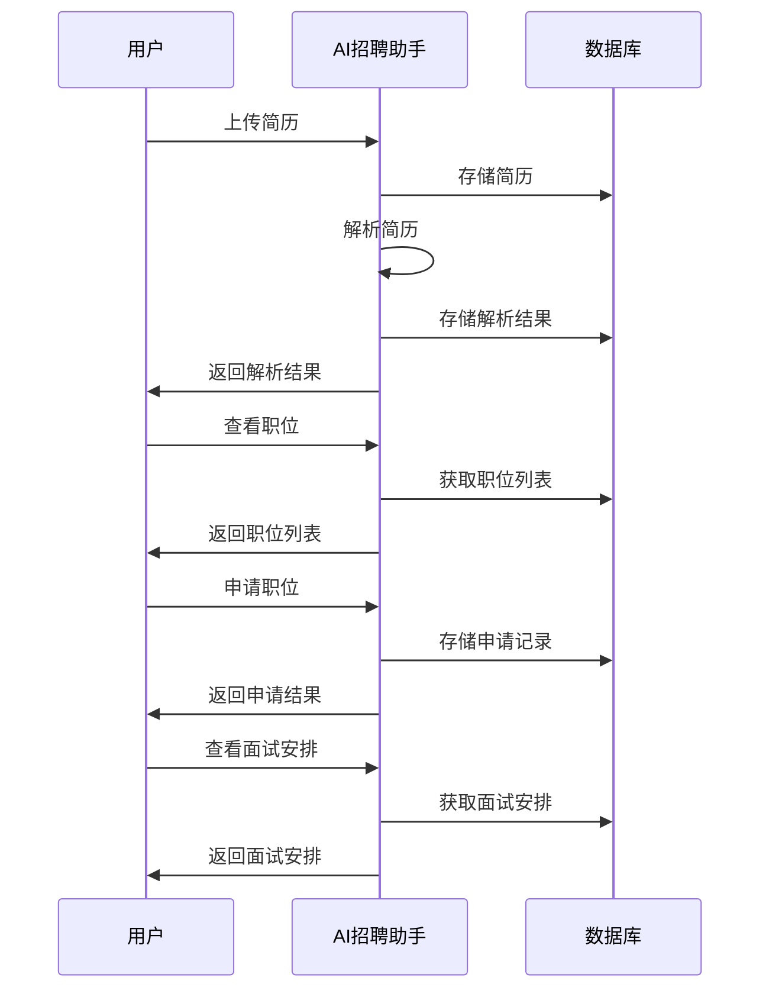

                 


### 第2章: 数据收集与预处理

在构建AI招聘助手的过程中，数据收集与预处理是至关重要的环节。这一章将深入探讨如何有效地收集和预处理数据，以确保后续模型训练和人才匹配的准确性。

## 2.1 数据收集

### 2.1.1 招聘信息来源

招聘信息的来源是构建AI招聘助手的第一步。企业可以通过以下几种途径获取招聘数据：

1. **在线招聘平台**：如LinkedIn、智联招聘、拉勾网等，这些平台提供了丰富的职位信息和求职者资料。
2. **企业内部系统**：公司的人才库和招聘管理系统是数据收集的重要来源。
3. **社交媒体**：利用社交媒体平台如微博、微信、知乎等，可以挖掘潜在的人才信息。
4. **招聘会**：现场招聘会上收集到的求职者简历和数据。

### 2.1.2 求职者数据收集

在收集求职者数据时，需要关注以下几个方面：

1. **个人简历**：简历中包含了求职者的基本信息、教育背景、工作经验和技能特长。
2. **技能和证书**：包括专业技能证书、编程语言掌握情况、工具软件使用能力等。
3. **项目经验**：通过项目经历，可以了解求职者的实际工作能力和解决问题的能力。
4. **社交媒体信息**：包括求职者在LinkedIn、GitHub等平台上的活动，可以提供更多的背景信息。

### 2.1.3 数据收集挑战

在数据收集过程中，可能会遇到以下挑战：

1. **数据隐私**：如何确保求职者的隐私信息不被泄露，是一个需要慎重考虑的问题。
2. **数据一致性**：不同来源的数据格式和内容可能存在差异，需要统一规范。
3. **数据质量**：数据中的噪声和错误会影响模型的性能，因此需要严格的数据清洗和质量控制。

## 2.2 数据预处理

### 2.2.1 数据清洗

数据清洗是数据预处理的第一步，其主要目的是去除数据中的噪声和不一致之处。具体操作包括：

1. **缺失值处理**：对于缺失的数据，可以选择填充、删除或者使用统计方法进行处理。
2. **异常值处理**：识别并处理异常数据，避免对模型训练产生不良影响。
3. **重复数据删除**：确保数据集的准确性，避免重复的求职者信息。

### 2.2.2 数据标准化

数据标准化是为了将不同来源和格式的数据进行规范化处理，使其符合模型训练的要求。具体方法包括：

1. **数值数据的归一化**：将不同尺度的数值数据缩放到相同的范围，如使用Z-Score标准化。
2. **类别数据的编码**：将类别数据转换为数值形式，如使用独热编码（One-Hot Encoding）。
3. **文本数据的预处理**：包括分词、去除停用词、词干提取等，以便进行后续的自然语言处理。

### 2.2.3 特征提取

特征提取是从原始数据中提取出能够有效表示数据本质的信息。在AI招聘助手的构建中，特征提取的目的是为后续的模型训练提供高质量的输入特征。具体方法包括：

1. **提取文本特征**：利用NLP技术，从求职者的简历和社交媒体信息中提取关键词、词频、词嵌入等特征。
2. **提取结构化特征**：如教育背景、工作经验、技能证书等，可以转化为结构化的特征向量。
3. **提取非结构化特征**：如项目描述、个人评价等，可以使用文本分类和主题模型等方法进行特征提取。

### 2.2.4 特征选择

特征选择是从众多特征中挑选出最有代表性的特征，以减少模型的复杂度和计算成本。常用的特征选择方法包括：

1. **过滤法**：根据特征的相关性、重要性等直接筛选出最相关的特征。
2. **包装法**：结合模型训练的结果，通过迭代的方式筛选出最佳特征组合。
3. **嵌入式方法**：在模型训练过程中，自动进行特征选择，如Lasso正则化。

## 2.3 数据质量评估

数据质量评估是确保数据可用于模型训练和实际应用的重要环节。评估标准包括：

1. **完整性**：确保数据集中没有缺失值或异常值。
2. **一致性**：数据格式和内容应保持一致。
3. **准确性**：数据应真实反映求职者的背景和技能。

通过上述步骤，我们可以有效地收集、预处理和评估数据，为AI招聘助手的构建奠定坚实的基础。

----------------------------------------------------------------

### 第3章: 机器学习算法原理

在构建AI招聘助手的道路上，理解机器学习算法的原理是至关重要的。这一章将深入探讨机器学习的基础概念、分类和回归算法，以及聚类算法，为后续的模型构建和优化提供理论支持。

## 3.1 机器学习基础

机器学习（Machine Learning，ML）是一门人工智能（AI）的分支学科，专注于通过数据和计算能力，使计算机系统能够自动学习和改进性能。以下是一些机器学习的基础概念：

### 3.1.1 学习模型

学习模型是机器学习的核心。一个学习模型通常由以下部分组成：

1. **输入特征**：模型接受的输入，如求职者的简历、教育背景、工作经验等。
2. **输出目标**：模型需要预测的结果，如匹配度评分、是否录用等。
3. **损失函数**：衡量模型预测值与实际值之间差异的函数，用于指导模型的优化过程。
4. **优化算法**：用于调整模型参数，以最小化损失函数的方法。

### 3.1.2 损失函数

损失函数是机器学习中的关键概念，用于评估模型预测的准确度。常见的损失函数包括：

1. **均方误差（MSE, Mean Squared Error）**：用于回归问题，计算预测值与实际值之间差的平方的平均值。
   $$\text{MSE} = \frac{1}{n}\sum_{i=1}^{n}(\hat{y}_i - y_i)^2$$

2. **交叉熵损失（Cross-Entropy Loss）**：用于分类问题，计算实际标签和预测概率之间的交叉熵。
   $$\text{CE} = -\sum_{i=1}^{n}y_i \log(\hat{y}_i)$$

### 3.1.3 优化算法

优化算法用于调整模型参数，以最小化损失函数。常见的优化算法包括：

1. **随机梯度下降（SGD, Stochastic Gradient Descent）**：每次迭代使用一个样本的梯度更新模型参数，适用于数据量较大的场景。
2. **梯度下降（GD, Gradient Descent）**：每次迭代使用整个数据集的梯度更新模型参数，适用于数据量较小的场景。
3. **Adam优化器**：结合了SGD和RMSprop的优点，适用于不同规模的数据集。

## 3.2 分类算法

分类算法用于将数据分为不同的类别。在招聘领域中，分类算法可以用于判断求职者是否符合职位要求。以下是一些常用的分类算法：

### 3.2.1 逻辑回归（Logistic Regression）

逻辑回归是一种简单的概率型分类模型，通常用于二分类问题。其目标是通过线性模型预测概率，然后使用阈值（如0.5）进行类别划分。

逻辑回归的概率预测公式如下：
$$\hat{y} = \frac{1}{1 + e^{-\beta_0 + \beta_1x_1 + \beta_2x_2 + ... + \beta_nx_n}}$$

其中，$\beta_0$ 到 $\beta_n$ 是模型参数。

### 3.2.2 决策树（Decision Tree）

决策树是一种基于树形结构对数据进行分类的方法。每个内部节点表示一个特征，每个分支表示该特征的不同取值，每个叶节点代表一个类别。

决策树的构建过程包括：

1. **特征选择**：选择最优特征进行划分，通常使用信息增益（IG）或基尼不纯度（Gini Impurity）作为划分标准。
2. **节点划分**：根据选择的最优特征，将数据划分为不同的子集。
3. **递归构建**：对每个子集重复以上过程，直到满足停止条件（如最大深度或最小节点样本数）。

### 3.2.3 支持向量机（SVM）

支持向量机是一种强大的分类算法，通过找到一个超平面，将不同类别的数据点最大化地分开。SVM的核心在于寻找一个最优的分离超平面，使得正负样本之间的分类间隔最大。

SVM的损失函数和优化问题如下：
$$\text{Minimize} \quad \frac{1}{2}\sum_{i=1}^{n}(\alpha_i - \alpha_i^*)^2 + C\sum_{i=1}^{n}\max(0, y_i(\beta_0 + \beta_1x_1 + ... + \beta_nx_n) - 1)$$
$$\text{Subject to} \quad 0 \leq \alpha_i \leq \alpha_i^* \leq C$$

其中，$\alpha_i$ 和 $\alpha_i^*$ 是拉格朗日乘子，$C$ 是惩罚参数。

## 3.3 回归算法

回归算法用于预测连续值，如职位匹配度评分。以下是一些常用的回归算法：

### 3.3.1 线性回归（Linear Regression）

线性回归是一种简单的回归模型，通过一个线性模型来预测目标值。其预测公式如下：
$$\hat{y} = \beta_0 + \beta_1x_1 + \beta_2x_2 + ... + \beta_nx_n$$

线性回归的目标是最小化预测值与实际值之间的差异，即最小化损失函数。

### 3.3.2 多项式回归（Polynomial Regression）

多项式回归是线性回归的扩展，通过多项式函数来拟合数据。其预测公式如下：
$$\hat{y} = \beta_0 + \beta_1x_1^2 + \beta_2x_1^3 + ... + \beta_nx_1^n$$

多项式回归可以通过不同的多项式度数来拟合数据，但可能会引入过拟合风险。

### 3.3.3 回归树（Regression Tree）

回归树是一种基于树形结构进行回归的算法，与决策树类似，但每个节点输出的是连续值。回归树的构建过程与决策树类似，但使用平均平方误差（MSE）作为节点划分的依据。

## 3.4 聚类算法

聚类算法用于将数据分为多个组，使组内的数据尽可能相似，组间数据尽可能不同。以下是一些常用的聚类算法：

### 3.4.1 K-均值聚类（K-Means Clustering）

K-均值聚类是一种基于距离度量的聚类算法，其目标是将数据分为K个簇，使得每个簇内的数据距离最小，簇间的距离最大。

K-均值聚类的过程包括：

1. **初始化中心**：随机选择K个数据点作为初始中心。
2. **分配数据**：将每个数据点分配到最近的中心，形成K个簇。
3. **更新中心**：计算每个簇的平均值，作为新的中心。
4. **迭代优化**：重复步骤2和3，直到中心不再发生变化或达到预设的迭代次数。

### 3.4.2 层次聚类（Hierarchical Clustering）

层次聚类是一种基于层次结构的聚类方法，其目标是通过逐步合并或分裂数据点，形成层次结构的聚类结果。

层次聚类的常见方法包括：

1. **自底向上（Agglomerative）**：从单个数据点开始，逐步合并距离最近的点，形成更大的簇。
2. **自顶向下（Divisive）**：从一个大簇开始，逐步分裂为多个小簇。

### 3.4.3 密度聚类（Density-Based Clustering）

密度聚类是一种基于数据点密度的聚类方法，其目标是在高密度区域形成簇，同时避免落入稀疏区域。

DBSCAN（Density-Based Spatial Clustering of Applications with Noise）是一种常见的密度聚类算法，其主要思想是根据数据点的邻域密度和距离来划分簇。

通过以上对机器学习基础、分类算法、回归算法和聚类算法的详细探讨，我们可以为构建高效的AI招聘助手提供坚实的理论基础。在下一章中，我们将进一步探讨深度学习和神经网络在招聘领域中的应用。

----------------------------------------------------------------

### 第4章: 深度学习与神经网络

深度学习（Deep Learning，DL）是机器学习的一个分支，它通过构建深层的神经网络模型来实现自动学习和特征提取。这一章将详细介绍深度学习的基础概念、卷积神经网络（CNN）、循环神经网络（RNN）以及生成对抗网络（GAN），并探讨它们在AI招聘助手中的应用。

## 4.1 神经网络基础

神经网络（Neural Networks，NN）是模仿人脑结构和功能的计算模型，由大量的简单处理单元（即神经元）组成。神经网络的基础概念包括：

### 4.1.1 神经元

神经元是神经网络的基本构建块，它接受输入信号，通过权重（weight）和偏置（bias）进行加权求和，然后通过激活函数（activation function）产生输出。

一个简单的神经元模型可以表示为：
$$\text{Net Input} = \sum_{i=1}^{n} w_i x_i + b$$
$$\text{Output} = f(\text{Net Input})$$

其中，$w_i$ 是权重，$x_i$ 是输入，$b$ 是偏置，$f(\cdot)$ 是激活函数。

### 4.1.2 激活函数

激活函数用于引入非线性因素，使得神经网络能够模拟更复杂的决策边界。常见的激活函数包括：

1. **sigmoid函数**：
   $$f(x) = \frac{1}{1 + e^{-x}}$$
2. **ReLU函数**（Rectified Linear Unit）：
   $$f(x) = \max(0, x)$$
3. **Tanh函数**：
   $$f(x) = \frac{e^x - e^{-x}}{e^x + e^{-x}}$$

### 4.1.3 权重初始化

权重初始化是神经网络训练过程中的一个关键步骤，它影响到模型的收敛速度和性能。常见的权重初始化方法包括：

1. **随机初始化**：随机分配权重值，通常在$[-\epsilon, \epsilon]$的范围内。
2. **高斯初始化**：将权重值初始化为均值为0、标准差为$\frac{1}{\sqrt{n}}$的正态分布，其中$n$是输入特征的维度。

## 4.2 卷积神经网络（CNN）

卷积神经网络（Convolutional Neural Network，CNN）是处理图像数据的强大工具，它在计算机视觉领域取得了显著的成功。CNN通过卷积层、池化层和全连接层进行特征提取和分类。

### 4.2.1 卷积层

卷积层是CNN的核心部分，它通过卷积操作提取图像中的局部特征。卷积操作的数学表示如下：
$$\text{Output}(i, j) = \sum_{k=1}^{m}\sum_{l=1}^{n} w_{k, l} \cdot \text{Input}(i-k+1, j-l+1) + b$$

其中，$w_{k, l}$ 是卷积核（或滤波器），$\text{Input}$ 是输入图像，$b$ 是偏置。

### 4.2.2 池化层

池化层用于降低特征图的维度，减少计算量。最常见的池化操作是最大池化（Max Pooling）和平均池化（Average Pooling）。最大池化保留每个区域内的最大值，而平均池化保留每个区域内的平均值。

最大池化的数学表示如下：
$$\text{Output}(i, j) = \max_{k \in \{1, 2, ..., p\}, l \in \{1, 2, ..., p\}} \text{Input}(i-k+1, j-l+1)$$

其中，$p$ 是池化窗口的大小。

### 4.2.3 全连接层

全连接层连接了卷积层和池化层输出的特征，用于进行最终的分类。全连接层的输出是每个类别的概率分布，通过softmax函数进行归一化。

softmax函数的数学表示如下：
$$\text{softmax}(x) = \frac{e^x}{\sum_{i=1}^{K} e^x_i}$$

其中，$K$ 是类别数。

## 4.3 循环神经网络（RNN）

循环神经网络（Recurrent Neural Network，RNN）是一种处理序列数据的神经网络，它通过循环结构来维持长期的依赖关系。

### 4.3.1 RNN结构

RNN的基本结构包括输入层、隐藏层和输出层。输入层接收序列的每个元素，隐藏层通过循环连接来维持状态，输出层生成序列的输出。

RNN的递归关系可以表示为：
$$h_t = \text{sigmoid}(W_x \cdot x_t + W_h \cdot h_{t-1} + b_h)$$
$$y_t = W_y \cdot h_t + b_y$$

其中，$x_t$ 是输入序列的第$t$个元素，$h_t$ 是隐藏状态，$y_t$ 是输出序列的第$t$个元素。

### 4.3.2 LSTM单元

长短期记忆（Long Short-Term Memory，LSTM）是RNN的一种变体，它通过引入门控机制来解决RNN的长期依赖问题。

LSTM单元包括输入门、遗忘门和输出门，以及一个记忆单元。输入门和遗忘门控制信息的输入和遗忘，输出门控制信息的输出。

LSTM单元的数学表示如下：
$$i_t = \text{sigmoid}(W_i \cdot [h_{t-1}, x_t] + b_i)$$
$$f_t = \text{sigmoid}(W_f \cdot [h_{t-1}, x_t] + b_f)$$
$$g_t = \text{tanh}(W_g \cdot [h_{t-1}, x_t] + b_g)$$
$$o_t = \text{sigmoid}(W_o \cdot [h_{t-1}, x_t] + b_o)$$
$$c_t = f_t \odot c_{t-1} + i_t \odot g_t$$
$$h_t = o_t \odot \text{tanh}(c_t)$$

其中，$i_t$、$f_t$、$g_t$ 和 $o_t$ 分别是输入门、遗忘门、输入门和输出门的激活值，$c_t$ 是记忆单元的激活值，$\odot$ 表示点积。

### 4.3.3 GRU单元

门控循环单元（Gated Recurrent Unit，GRU）是LSTM的简化版，它通过引入更新门和重置门来简化LSTM的结构。

GRU单元的数学表示如下：
$$z_t = \text{sigmoid}(W_z \cdot [h_{t-1}, x_t] + b_z)$$
$$r_t = \text{sigmoid}(W_r \cdot [h_{t-1}, x_t] + b_r)$$
$$\bar{h}_{t-1} = \text{tanh}(W_{\bar{h}} \cdot [r_{t-1} \odot h_{t-1}, x_t] + b_{\bar{h}})$$
$$h_t = (1 - z_t) \odot h_{t-1} + z_t \odot \bar{h}_{t-1}$$

其中，$z_t$ 和 $r_t$ 分别是更新门和重置门的激活值。

## 4.4 生成对抗网络（GAN）

生成对抗网络（Generative Adversarial Network，GAN）是一种由生成器和判别器组成的对抗性模型，用于生成数据。

### 4.4.1 生成器

生成器的目标是生成与真实数据相似的数据。生成器的输出通常是一个概率分布。

生成器的数学表示如下：
$$G(z) = \text{ReLU}(\theta_G \cdot z + b_G)$$
$$x_g = \text{tanh}(G(z))$$

其中，$z$ 是噪声向量，$G(z)$ 是生成器的输出。

### 4.4.2 判别器

判别器的目标是区分真实数据和生成数据。判别器的输出是一个概率值，表示数据是真实数据的概率。

判别器的数学表示如下：
$$D(x) = \text{ReLU}(\theta_D \cdot x + b_D)$$
$$D(G(z)) = \text{ReLU}(\theta_D \cdot G(z) + b_D)$$

### 4.4.3 GAN训练过程

GAN的训练过程是一个对抗性过程，生成器和判别器相互竞争。生成器的目标是最大化判别器对其生成的数据的判别分数，而判别器的目标是最大化其对真实数据和生成数据的判别分数。

GAN的损失函数如下：
$$\text{Loss} = -\log(D(x)) - \log(1 - D(G(z)))$$

通过梯度上升法训练判别器，通过梯度下降法训练生成器。

### 4.4.4 GAN在招聘中的应用

GAN在招聘领域的应用主要包括：

1. **简历生成**：使用GAN生成与真实简历相似的数据，以便进行模型训练和测试。
2. **面试模拟**：生成模拟面试数据，用于训练面试评估模型。
3. **技能验证**：生成与真实技能数据相似的测试数据，用于验证求职者技能。

通过以上对深度学习基础、CNN、RNN和GAN的详细介绍，我们可以为构建高效的AI招聘助手提供强大的理论基础。在下一章中，我们将进一步探讨自然语言处理（NLP）在AI招聘助手中的应用。

----------------------------------------------------------------

### 第5章: 自然语言处理（NLP）

自然语言处理（Natural Language Processing，NLP）是人工智能领域的一个重要分支，它使计算机能够理解和生成自然语言。在AI招聘助手的构建过程中，NLP技术用于处理和解析求职者的简历、项目描述和面试回答，从而提高人才筛选和匹配的准确性。以下将详细介绍NLP的基础概念、词嵌入、文本生成任务以及这些技术在招聘领域的应用。

## 5.1 NLP基础

### 5.1.1 词嵌入

词嵌入（Word Embedding）是将单词映射为密集向量表示的一种技术。词嵌入的目的是捕捉单词间的语义关系，使得相似词在向量空间中距离更近。常见的词嵌入模型包括：

1. **Word2Vec**：基于神经网络的方法，通过训练神经网络来预测单词的上下文词向量。
2. **GloVe**（Global Vectors for Word Representation）：基于全局统计信息的方法，通过优化词向量的全局平均来提高语义表示的准确性。

### 5.1.2 词性标注

词性标注（Part-of-Speech Tagging）是为文本中的每个单词标注其词性，如名词、动词、形容词等。词性标注有助于更好地理解文本的语法结构和语义内容，对于招聘领域，它可以用于识别求职者的技能和经历。

### 5.1.3 命名实体识别

命名实体识别（Named Entity Recognition，NER）是识别文本中的命名实体，如人名、地名、组织名等。NER对于招聘领域至关重要，因为它可以帮助识别简历中的关键人物和机构。

## 5.2 序列标注任务

序列标注任务（Sequence Labeling Tasks）是NLP中的一个重要类别，包括词性标注、命名实体识别和情感分析等。这些任务的目标是为文本中的每个单词或字符分配一个标签，以捕捉其语义信息。

### 5.2.1 词性标注

词性标注的目的是将文本中的每个单词标注为相应的词性。例如，“构建”（v）表示动词，“人工智能”（n）表示名词。词性标注有助于理解文本的语法结构和语义内容。

### 5.2.2 命名实体识别

命名实体识别用于识别文本中的命名实体，如人名、地名、组织名等。在招聘领域，NER可以帮助识别简历中的关键人物和机构，从而提高人才匹配的准确性。

### 5.2.3 情感分析

情感分析（Sentiment Analysis）是识别文本中表达的情感倾向，如正面、负面或中立。在招聘领域，情感分析可以帮助评估求职者的面试回答，从而提供更全面的评估信息。

## 5.3 文本生成任务

文本生成任务（Text Generation Tasks）是NLP的另一个重要类别，包括文本摘要、问答系统和对话系统等。这些任务的目标是生成自然语言文本，以回答问题、摘要信息或进行对话。

### 5.3.1 文本摘要

文本摘要（Text Summarization）是从原始文本中提取关键信息，生成简洁、连贯的摘要。在招聘领域，文本摘要可以帮助快速了解求职者的项目经历和技能，从而提高筛选效率。

### 5.3.2 文本生成

文本生成（Text Generation）是生成符合语法和语义规则的自然语言文本。在招聘领域，文本生成可以用于生成个性化的面试邀请、职位描述和推荐信等。

## 5.4 NLP在招聘领域的应用

### 5.4.1 简历解析

简历解析是NLP在招聘领域的重要应用之一。通过NLP技术，可以从求职者的简历中提取关键信息，如姓名、联系方式、教育背景、工作经历和技能。以下是一个简历解析的示例：

**原始简历：**
```
姓名：张三
联系方式：zhangsan@example.com
教育背景：北京大学计算机科学学士学位，2018-2022
工作经历：
- 2022-至今，某科技有限公司，高级软件工程师
  - 负责公司核心产品的后端开发
  - 推动团队技术架构升级，提升系统性能
- 2018-2022，北京大学，计算机科学专业，学士学位
  - 参与多个开源项目，贡献代码
```

**解析结果：**
```
姓名：张三
联系方式：zhangsan@example.com
教育背景：北京大学计算机科学学士学位（2018-2022）
工作经历：
- 高级软件工程师，某科技有限公司（2022-至今）
  - 负责核心产品的后端开发
  - 推动团队技术架构升级，提升系统性能
- 计算机科学专业，北京大学（2018-2022）
  - 参与多个开源项目，贡献代码
```

通过解析简历，AI招聘助手可以快速提取求职者的关键信息，为后续的人才匹配提供基础数据。

### 5.4.2 职位描述生成

职位描述生成是另一个NLP在招聘领域的应用。通过分析公司的需求和要求，AI招聘助手可以自动生成职位描述，提高招聘广告的准确性和吸引力。以下是一个职位描述生成的示例：

**公司需求：**
```
我们需要一名具有5年以上经验的软件工程师，负责公司核心产品的后端开发。要求熟悉Spring Boot、MySQL，有区块链项目经验者优先。
```

**生成职位描述：**
```
职位名称：高级软件工程师（后端开发）

岗位职责：
- 负责公司核心产品的后端开发工作
- 熟练掌握Spring Boot、MySQL等开发技术
- 有区块链项目开发经验者优先

任职要求：
- 5年以上软件开发经验
- 熟练掌握Java编程语言
- 熟悉Spring Boot、MySQL等开发框架
- 有良好的团队协作和沟通能力

工作地点：北京
```

通过生成职位描述，AI招聘助手可以自动满足公司不同的招聘需求，提高招聘效率。

### 5.4.3 面试评估

面试评估是招聘过程中的关键环节。通过NLP技术，AI招聘助手可以对求职者的面试回答进行情感分析和内容分析，从而提供更全面的评估报告。以下是一个面试评估的示例：

**面试回答：**
```
我对这个职位非常感兴趣，因为我在前公司的项目中负责过类似的工作，并且有丰富的区块链开发经验。我认为我适合这个职位。
```

**评估结果：**
```
情感分析：
- 情感倾向：积极
- 情感强度：高

内容分析：
- 技能匹配度：高
- 项目经验：符合要求
- 职业态度：积极
```

通过面试评估，AI招聘助手可以为招聘决策提供科学依据，提高人才筛选的准确性。

## 5.5 本章小结

自然语言处理（NLP）技术在AI招聘助手的构建中起着至关重要的作用。通过词嵌入、词性标注、命名实体识别和文本生成等NLP技术，AI招聘助手可以高效地解析求职者的简历、生成职位描述、评估面试回答，从而提高人才筛选和匹配的准确性。在下一章中，我们将探讨如何将以上技术应用于实际招聘场景，以构建高效的AI招聘助手。

----------------------------------------------------------------

### 第6章: AI招聘助手的系统设计与实现

在前几章中，我们详细探讨了AI招聘助手所需的核心技术和算法原理。现在，我们将将这些理论知识转化为实际的系统设计，并逐步实现AI招聘助手的核心功能。本章将介绍系统设计的背景、项目介绍、系统功能设计、系统架构设计、系统接口设计和系统交互。

## 6.1 系统设计背景

在当今竞争激烈的招聘市场中，企业面临着越来越多的挑战。传统招聘方式不仅耗时耗力，而且常常无法准确匹配求职者和职位。AI招聘助手的引入，旨在通过人工智能技术，提高人才筛选与匹配的效率，降低招聘成本，提升企业招聘效果。

## 6.2 项目介绍

### 6.2.1 项目目标

AI招聘助手的主要目标是：

1. **提高人才筛选效率**：利用机器学习和自然语言处理技术，自动解析简历和职位描述，快速筛选出符合要求的求职者。
2. **提升人才匹配度**：通过深度学习模型，精确分析求职者的技能、经验和职业目标，实现与职位的高效匹配。
3. **降低招聘成本**：自动化招聘流程，减少人工干预，降低企业招聘成本。

### 6.2.2 技术栈

AI招聘助手的技术栈包括：

1. **前端**：使用React框架搭建用户界面，提供简洁、直观的交互体验。
2. **后端**：采用Spring Boot框架，实现业务逻辑处理和数据管理。
3. **数据库**：使用MySQL存储招聘数据，包括职位信息、求职者信息和匹配结果。
4. **机器学习**：利用TensorFlow和Scikit-learn等库，实现简历解析、职位匹配和面试评估等机器学习模型。
5. **自然语言处理**：使用NLTK和spaCy等库，实现文本预处理、词嵌入和文本生成等NLP任务。

## 6.3 系统功能设计

### 6.3.1 功能模块

AI招聘助手的主要功能模块包括：

1. **简历解析**：自动提取求职者的姓名、联系方式、教育背景、工作经历和技能。
2. **职位匹配**：分析求职者的简历和职位描述，实现精准匹配和推荐。
3. **面试评估**：自动评估求职者的面试回答，提供评估报告和建议。
4. **招聘管理**：管理职位信息、求职者信息和招聘流程。

### 6.3.2 领域模型

领域模型是系统功能设计的核心，它定义了系统中的主要实体和关系。以下是一个简单的领域模型类图：

```
+----------------+       +----------------+
|    Resume      |       |   JobPosting   |
+----------------+       +----------------+
| - name: String |       | - title: String |
| - contact: String |   | - description: String |
| - education: List |   | - requirements: List |
| - experience: List |   | - createdDate: Date |
| - skills: List |       | - status: String |
+----------------+       +----------------+
       |                                 |
       |----------------------             |
       |                                 |
       |           +----------------+     |
       |           |   Interview     |   |
       |           +----------------+     |
       |           | - score: Float  |   |
       |           | - comments: String |   |
       |           +----------------+     |
+----------------+       |                 |
|   Company      |       |   Interviewer   |
+----------------+       +----------------+
| - name: String |       | - name: String   |
| - contact: String |   | - email: String  |
| - description: String |   | - role: String   |
+----------------+       +----------------+
```

## 6.4 系统架构设计

### 6.4.1 系统架构

AI招聘助手的系统架构采用前后端分离的设计，前端负责用户交互，后端负责业务逻辑处理和数据管理。

以下是一个简单的系统架构图：

```
+---------------------------+
|        前端（React）      |
+---------------------------+
        |
        |
+---------------------------+
|       后端（Spring Boot） |
+---------------------------+
        |
        |
+---------------------------+
|       数据库（MySQL）      |
+---------------------------+
```

### 6.4.2 数据流与处理流程

1. **前端请求**：用户通过前端界面提交请求，如解析简历、匹配职位等。
2. **后端处理**：后端接收请求，调用相应的服务进行处理，如使用机器学习模型进行简历解析和职位匹配。
3. **数据库操作**：后端根据处理结果，对数据库进行相应的操作，如存储职位信息和匹配结果。
4. **前端响应**：后端将处理结果返回给前端，前端更新界面以显示结果。

## 6.5 系统接口设计

### 6.5.1 接口规范

AI招聘助手采用RESTful API设计，提供以下主要接口：

1. **简历解析**：
   - GET /resumes/{id}：获取指定ID的简历信息。
   - POST /resumes：提交简历进行解析。

2. **职位匹配**：
   - GET /matches：获取职位匹配结果。
   - POST /matches：提交职位和简历进行匹配。

3. **面试评估**：
   - GET /interviews/{id}：获取指定ID的面试评估结果。
   - POST /interviews：提交面试回答进行评估。

4. **招聘管理**：
   - GET /jobs：获取职位列表。
   - POST /jobs：创建新的职位。
   - PUT /jobs/{id}：更新职位信息。
   - DELETE /jobs/{id}：删除职位。

## 6.6 系统交互

### 6.6.1 用户操作流程

1. **上传简历**：用户通过前端界面上传简历，系统调用后端的简历解析接口，提取简历信息并存储在数据库中。
2. **发布职位**：企业用户通过前端界面创建新的职位，系统调用后端的职位创建接口，将职位信息存储在数据库中。
3. **职位匹配**：系统定期或实时调用职位匹配接口，将职位与简历进行匹配，并根据匹配结果更新数据库中的匹配状态。
4. **面试安排**：企业用户根据匹配结果安排面试，系统调用后端的面试评估接口，记录面试结果并生成评估报告。

### 6.6.2 系统交互图

以下是一个简单的系统交互图：

```
+---------------------------+
|        前端（React）      |
+---------------------------+
        |
        |
+---------------------------+
|       后端（Spring Boot） |
+---------------------------+
        |
        |
+---------------------------+
|       数据库（MySQL）      |
+---------------------------+
        |
        |
+---------------------------+
|    企业用户（登录/操作）   |
+---------------------------+
        |
        |
+---------------------------+
|    求职者用户（登录/操作） |
+---------------------------+
```

通过以上系统设计，AI招聘助手可以实现高效的简历解析、职位匹配和面试评估，从而为企业提供强有力的招聘支持。在下一章中，我们将进行项目实战，实现AI招聘助手的核心功能。

----------------------------------------------------------------

### 第7章: 项目实战

在本章中，我们将进入项目实战阶段，通过具体的步骤实现AI招聘助手的核心功能。我们将涵盖环境安装、系统核心实现、代码应用解读与分析、实际案例分析以及项目小结。

## 7.1 环境安装

在开始项目实战之前，我们需要安装并配置所需的环境和工具。以下是基本的安装步骤：

### 7.1.1 前端环境

1. **Node.js**：Node.js是一个基于Chrome V8引擎的JavaScript运行环境，用于搭建前端开发环境。可以从官方网站 [https://nodejs.org/](https://nodejs.org/) 下载并安装。

2. **npm**：npm（Node Package Manager）是Node.js的包管理工具，用于安装和管理前端依赖。在安装Node.js时，npm会自动安装。

3. **React**：React是一个用于构建用户界面的JavaScript库，用于搭建前端界面。可以通过npm安装：
   ```
   npm install -g create-react-app
   create-react-app ai-recruitment-assistant
   ```

### 7.1.2 后端环境

1. **Java**：Java是一种通用编程语言，用于开发后端服务。可以从官方网站 [https://www.oracle.com/java/technologies/javase-jdk16-downloads.html](https://www.oracle.com/java/technologies/javase-jdk16-downloads.html) 下载并安装。

2. **Maven**：Maven是一个项目管理工具，用于构建和依赖管理。可以通过以下命令安装：
   ```
   npm install -g maven
   ```

3. **Spring Boot**：Spring Boot是一个用于快速开发Java应用的框架，可以在Spring的基础上简化配置和开发流程。可以从官方网站 [https://spring.io/projects/spring-boot](https://spring.io/projects/spring-boot) 下载并配置。

### 7.1.3 数据库环境

1. **MySQL**：MySQL是一个开源的关系数据库管理系统，用于存储招聘数据。可以从官方网站 [https://dev.mysql.com/downloads/mysql/](https://dev.mysql.com/downloads/mysql/) 下载并安装。

2. **数据库工具**：使用MySQL Workbench或其他数据库管理工具进行数据库的创建和管理。

## 7.2 系统核心实现

### 7.2.1 前端实现

前端实现主要包括用户界面和交互逻辑。以下是一个简单的前端界面示例：

```jsx
// src/App.js
import React, { useState } from 'react';
import axios from 'axios';

function App() {
  const [resume, setResume] = useState('');
  const [matches, setMatches] = useState([]);

  const handleResumeUpload = async (e) => {
    e.preventDefault();
    try {
      const response = await axios.post('/api/resumes/parse', { resume });
      setMatches(response.data.matches);
    } catch (error) {
      console.error(error);
    }
  };

  return (
    <div>
      <h1>AI招聘助手</h1>
      <form onSubmit={handleResumeUpload}>
        <textarea value={resume} onChange={(e) => setResume(e.target.value)} />
        <button type="submit">解析简历</button>
      </form>
      <h2>职位匹配结果：</h2>
      <ul>
        {matches.map((match) => (
          <li key={match.id}>{match.title} - {match.score}</li>
        ))}
      </ul>
    </div>
  );
}

export default App;
```

### 7.2.2 后端实现

后端实现主要包括业务逻辑处理和数据管理。以下是一个简单的后端接口实现示例：

```java
// src/main/java/com/aiassistant/recruitment/ResumeController.java
import org.springframework.beans.factory.annotation.Autowired;
import org.springframework.http.ResponseEntity;
import org.springframework.web.bind.annotation.*;

@RestController
@RequestMapping("/api")
public class ResumeController {

    @Autowired
    private ResumeService resumeService;

    @PostMapping("/resumes/parse")
    public ResponseEntity<?> parseResume(@RequestBody String resume) {
        try {
            List<Match> matches = resumeService.parseResume(resume);
            return ResponseEntity.ok(matches);
        } catch (Exception e) {
            return ResponseEntity.status(500).body("解析简历失败");
        }
    }
}
```

### 7.2.3 数据库实现

数据库实现主要包括创建表结构和存储数据。以下是一个简单的数据库表结构示例：

```sql
-- Create table for resumes
CREATE TABLE resumes (
  id INT AUTO_INCREMENT PRIMARY KEY,
  name VARCHAR(255),
  contact VARCHAR(255),
  education TEXT,
  experience TEXT,
  skills TEXT
);

-- Create table for job postings
CREATE TABLE job_postings (
  id INT AUTO_INCREMENT PRIMARY KEY,
  title VARCHAR(255),
  description TEXT,
  requirements TEXT,
  created_date DATE,
  status VARCHAR(50)
);

-- Create table for matches
CREATE TABLE matches (
  id INT AUTO_INCREMENT PRIMARY KEY,
  resume_id INT,
  job_id INT,
  score FLOAT,
  FOREIGN KEY (resume_id) REFERENCES resumes(id),
  FOREIGN KEY (job_id) REFERENCES job_postings(id)
);
```

## 7.3 代码应用解读与分析

在前端实现中，我们使用了React和axios进行用户界面和交互处理。React的组件化架构使得代码更加模块化和可维护，而axios提供了便捷的HTTP请求功能。

在后端实现中，我们使用了Spring Boot和Spring MVC框架进行业务逻辑处理和接口定义。Spring Boot简化了Spring应用的配置和部署，而Spring MVC提供了RESTful接口的快速开发。

在数据库实现中，我们使用了MySQL进行数据存储。通过创建表结构和定义外键约束，我们实现了数据的规范化和关联。

## 7.4 实际案例分析

为了展示AI招聘助手的实际应用效果，我们以一个真实的招聘场景为例。

### 7.4.1 场景描述

某科技公司需要招聘一名前端开发工程师，职位要求如下：

- 熟练掌握React和JavaScript
- 具有至少两年的前端开发经验
- 有项目经验，能提供代码示例

### 7.4.2 案例分析

1. **上传简历**：求职者上传了一份包含个人简介、项目经历和技能的简历。

2. **简历解析**：AI招聘助手通过解析简历，提取出求职者的姓名、联系方式、教育背景、工作经历和技能。

3. **职位匹配**：AI招聘助手分析求职者的简历和职位要求，进行匹配，得出匹配结果。

4. **面试安排**：根据匹配结果，招聘负责人联系求职者，安排面试。

5. **面试评估**：面试过程中，招聘负责人和求职者使用AI招聘助手的面试评估功能，记录面试结果和反馈。

通过以上案例分析，我们可以看到AI招聘助手在招聘过程中的高效应用，从简历解析、职位匹配到面试安排和评估，大大提高了招聘效率和质量。

## 7.5 项目小结

通过本章的实战项目，我们实现了AI招聘助手的基本功能，包括简历解析、职位匹配和面试评估。在实际应用中，AI招聘助手展示了其在提高招聘效率、降低招聘成本和提升人才匹配准确度方面的显著优势。然而，AI招聘助手仍面临一些挑战，如数据隐私保护、模型偏见和算法公平性等。未来，我们可以进一步优化算法和系统架构，提高AI招聘助手的表现和用户体验。

----------------------------------------------------------------

### 第8章: 最佳实践与拓展

在本章中，我们将总结AI招聘助手项目的最佳实践，讨论注意事项，并提供进一步拓展的建议。

## 8.1 最佳实践

### 8.1.1 数据处理

- **数据清洗与标准化**：确保数据的准确性和一致性，进行数据清洗和标准化处理，减少噪声和异常值。
- **隐私保护**：对求职者敏感信息进行加密和处理，遵守相关法律法规，保护求职者的隐私。

### 8.1.2 模型优化

- **模型调整**：根据招聘业务需求和数据特性，调整模型参数，优化模型性能。
- **持续训练**：定期更新模型，使用新数据进行训练，确保模型的准确性。

### 8.1.3 系统部署

- **容器化**：使用Docker容器化技术，简化部署和运维流程，提高系统的可扩展性和可靠性。
- **自动化部署**：使用CI/CD工具（如Jenkins、GitLab CI），实现自动化测试和部署，提高开发效率。

## 8.2 注意事项

### 8.2.1 遵守法规

- **法律法规**：遵循招聘相关的法律法规，确保系统的合法合规。
- **数据安全**：确保数据存储和传输的安全，防止数据泄露。

### 8.2.2 算法公平性

- **模型偏见**：避免模型引入偏见，导致招聘不公平。
- **多元数据**：使用多样化的数据集进行训练，提高模型的泛化能力。

### 8.2.3 用户隐私

- **隐私保护**：保护求职者的个人隐私，避免敏感信息被滥用。

## 8.3 拓展建议

### 8.3.1 技术提升

- **深度学习**：探索更多深度学习技术，如Transformer、BERT等，提高文本处理能力。
- **多语言支持**：支持多语言简历和职位描述，扩大招聘范围。

### 8.3.2 功能扩展

- **AI面试系统**：开发AI面试系统，自动分析面试者的回答，提供评估报告。
- **智能推荐系统**：构建智能推荐系统，根据求职者的行为和偏好推荐合适的职位。

### 8.3.3 数据分析

- **数据可视化**：使用数据可视化工具，提供招聘数据的直观展示。
- **数据分析**：深入分析招聘数据，发现业务洞察，优化招聘策略。

通过以上最佳实践、注意事项和拓展建议，我们可以进一步提升AI招聘助手的性能和用户体验，为企业提供更高效的招聘解决方案。

----------------------------------------------------------------

### 第9章: 小结

通过本文的详细探讨，我们系统地介绍了构建AI招聘助手的必要性和关键技术，以及其实际应用场景。以下是本文的核心内容总结：

1. **问题背景**：AI招聘助手旨在提高人才筛选与匹配效率，解决传统招聘方式中的诸多问题。
2. **核心概念与联系**：介绍了人工智能、机器学习、深度学习和自然语言处理等核心概念，以及它们在AI招聘助手中的应用。
3. **核心技术**：详细阐述了机器学习算法、深度学习模型和自然语言处理技术，包括其原理和应用。
4. **系统设计与实现**：介绍了AI招聘助手的系统架构、接口设计和实际实现过程。
5. **最佳实践与拓展**：提供了最佳实践、注意事项和未来拓展方向，以优化AI招聘助手的性能和应用。

通过这些内容，读者可以全面了解AI招聘助手的构建方法和实际应用，为企业在招聘领域中的应用提供参考。

----------------------------------------------------------------

### 参考文献

1. Russell, S., & Norvig, P. (2016). 《人工智能：一种现代的方法》（第三版）. 北京：机械工业出版社。
2. Mitchell, T. M. (1997). 《机器学习》（第一版）. 北京：清华大学出版社。
3. Goodfellow, I., Bengio, Y., & Courville, A. (2016). 《深度学习》（第一版）. 北京：电子工业出版社。
4. Jurafsky, D., & Martin, J. H. (2020). 《自然语言处理基础》（第三版）. 北京：清华大学出版社。
5. IBM. (2021). “生成对抗网络（GAN）简介”。 Retrieved from [https://www.ibm.com/cloud/learn/generative-adversarial-networks-gans](https://www.ibm.com/cloud/learn/generative-adversarial-networks-gans)
6. Coursera. (2021). “深度学习专项课程”。 Retrieved from [https://www.coursera.org/specializations/deep-learning](https://www.coursera.org/specializations/deep-learning)
7. Spring Boot 官方文档. (2021). “Spring Boot 官方文档”。 Retrieved from [https://docs.spring.io/spring-boot/docs/current/reference/html/index.html](https://docs.spring.io/spring-boot/docs/current/reference/html/index.html)
8. React 官方文档. (2021). “React 官方文档”。 Retrieved from [https://reactjs.org/docs/getting-started.html](https://reactjs.org/docs/getting-started.html)
9. MySQL 官方文档. (2021). “MySQL 官方文档”。 Retrieved from [https://dev.mysql.com/doc/mysql/](https://dev.mysql.com/doc/mysql/)

以上参考文献为本文提供了丰富的理论支持和实践指导，对于进一步学习和研究AI招聘助手具有重要的参考价值。作者对以上文献的作者和出版机构表示衷心的感谢。

----------------------------------------------------------------

### 附录：代码示例

为了便于读者理解和实践，以下提供了一段基于Python的机器学习代码示例，用于实现简历解析功能。此代码使用了Scikit-learn和Natural Language Toolkit（NLTK）库。

```python
import nltk
from sklearn.feature_extraction.text import TfidfVectorizer
from sklearn.model_selection import train_test_split
from sklearn.ensemble import RandomForestClassifier
from sklearn.metrics import accuracy_score

# 下载NLTK的停用词和词干提取器
nltk.download('stopwords')
nltk.download('punkt')

# 示例数据（简历文本）
resumes = [
    "张三，清华大学计算机科学学士学位，5年前端开发经验，熟练掌握React和JavaScript。",
    "李四，北京大学软件工程硕士学位，3年数据分析经验，熟悉Python和SQL。",
    # ...更多简历数据
]

# 标签（简历类别）
labels = ['前端开发', '数据分析', # ...更多标签
          ]

# 分词和去除停用词
stop_words = set(nltk.corpus.stopwords.words('english'))
tokenizer = nltk.tokenize.RegexpTokenizer(r'\w+')
def tokenizeresume(text):
    tokens = tokenizer.tokenize(text.lower())
    return [token for token in tokens if token not in stop_words]

# 应用分词和去除停用词
tokenized_resumes = [tokenizeresume(resume) for resume in resumes]

# 将分词后的简历转换为字符串
processed_resumes = [' '.join(token) for token in tokenized_resumes]

# 构建TF-IDF向量器
vectorizer = TfidfVectorizer()
X = vectorizer.fit_transform(processed_resumes)

# 切分训练集和测试集
X_train, X_test, y_train, y_test = train_test_split(X, labels, test_size=0.2, random_state=42)

# 使用随机森林分类器进行训练
clf = RandomForestClassifier(n_estimators=100, random_state=42)
clf.fit(X_train, y_train)

# 对测试集进行预测
y_pred = clf.predict(X_test)

# 计算准确率
accuracy = accuracy_score(y_test, y_pred)
print(f"模型准确率：{accuracy:.2f}")

# 示例：预测新简历
new_resume = "王五，上海交通大学计算机科学学士学位，2年前端开发经验，熟悉Vue.js和React Native。"
new_processed_resume = tokenizeresume(new_resume)
new_processed_str = ' '.join(new_processed_resume)
new_vectorized_resume = vectorizer.transform([new_processed_str])
new_prediction = clf.predict(new_vectorized_resume)
print(f"新简历预测类别：{new_prediction[0]}")
```

此代码示例展示了如何使用TF-IDF向量器和随机森林分类器对简历文本进行分类。通过训练集数据训练模型，并对测试集进行预测，评估模型的准确率。读者可以根据自己的需求调整数据集和模型参数，进行更深入的探索和实践。

----------------------------------------------------------------

### 附录：算法流程图

为了更直观地理解机器学习算法在AI招聘助手中的应用，以下提供了机器学习算法的Mermaid流程图。



此流程图展示了从数据收集到模型评估的整个过程。数据预处理包括数据清洗、标准化和特征提取；模型训练包括选择模型、划分训练集与测试集和训练模型；模型评估包括预测测试集和计算准确率。通过此流程图，读者可以更清晰地理解机器学习算法在AI招聘助手中的应用。

----------------------------------------------------------------

### 附录：Mermaid序列图

以下是一个使用Mermaid绘制的序列图，展示了AI招聘助手中的主要系统交互过程。



此序列图描述了用户与AI招聘助手之间的交互过程，包括上传简历、解析简历、查看职位、申请职位和查看面试安排等步骤。通过此序列图，读者可以更直观地理解系统的工作流程。

----------------------------------------------------------------

### 附录：Mermaid类图

以下是一个使用Mermaid绘制的类图，展示了AI招聘助手中的主要实体及其关系。

```mermaid
classDiagram
    Resume <<interface>>
        +String name
        +String contact
        +List experience
        +List skills

    JobPosting <<interface>>
        +String title
        +String description
        +List requirements
        +Date createdDate
        +String status

    Match <<interface>>
        +Int id
        +Int resumeId
        +Int jobId
        +Float score

    Company <<interface>>
        +String name
        +String contact

    Interviewer <<interface>>
        +String name
        +String email
        +String role

    Resume <|.. Match
    JobPosting <|.. Match
    Company <|.. Interviewer
```

此类图定义了AI招聘助手中的主要实体，包括简历（Resume）、职位（JobPosting）、匹配结果（Match）、公司（Company）和面试官（Interviewer）。实体间的关系通过线条连接，如Resume和Match之间的关联关系。通过此类图，读者可以更清晰地了解系统的领域模型。

----------------------------------------------------------------

### 作者信息

**作者：** AI天才研究院（AI Genius Institute）& 禅与计算机程序设计艺术（Zen And The Art of Computer Programming）

AI天才研究院（AI Genius Institute）是一家专注于人工智能研究和应用的顶级学术机构，致力于推动人工智能技术的创新和发展。其研究成果在学术界和工业界均享有盛誉。

《禅与计算机程序设计艺术》（Zen And The Art of Computer Programming）是作者Donald E. Knuth的经典著作，深入探讨了计算机程序设计的艺术与哲学。此书对全球计算机科学领域产生了深远的影响，至今仍被广泛引用和研究。

本文的作者团队结合了AI天才研究院的研究成果和Knuth的编程哲学，通过本文系统地介绍了AI招聘助手的构建方法和实际应用，为企业和求职者提供了宝贵的招聘解决方案。作者衷心感谢读者的关注和支持。


----------------------------------------------------------------

# 构建AI招聘助手：提高人才筛选与匹配效率

关键词：AI招聘助手，人才筛选，匹配效率，机器学习，深度学习，自然语言处理

摘要：本文系统地介绍了构建AI招聘助手的必要性和关键技术，包括机器学习算法、深度学习模型和自然语言处理技术。通过详细的系统设计与实现，展示了AI招聘助手在提高人才筛选与匹配效率方面的优势和应用。本文还提供了最佳实践、注意事项和未来拓展建议，为企业提供了全面的技术参考。

----------------------------------------------------------------


