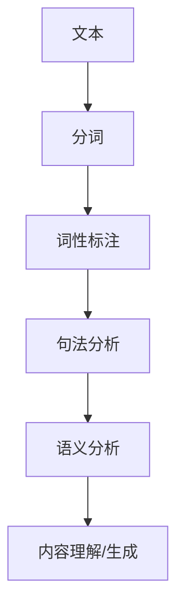
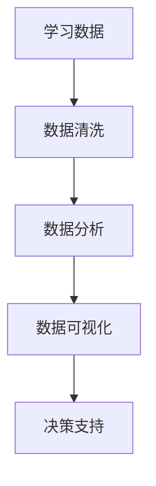
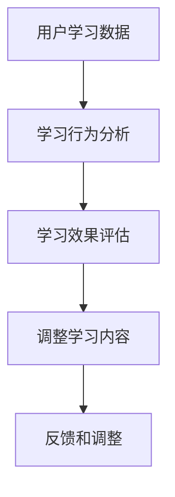
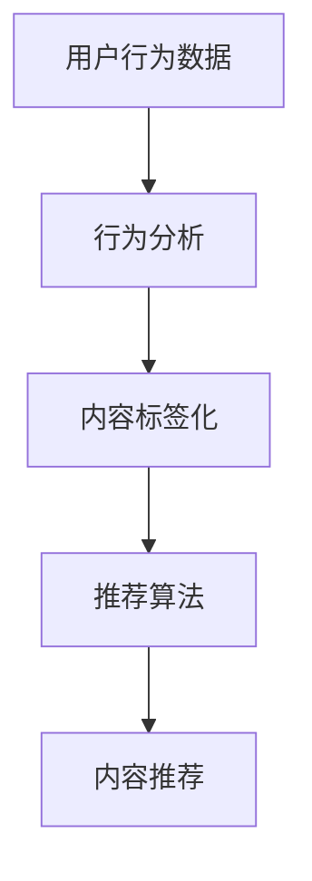
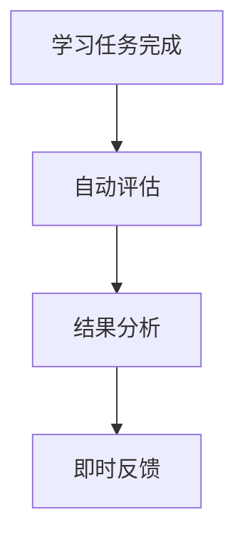
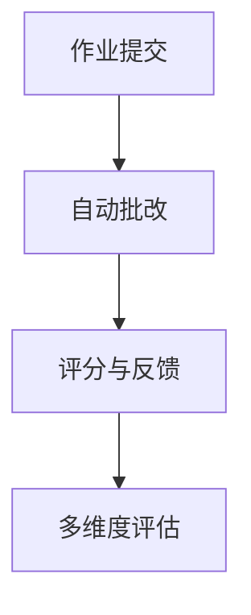

                 

# 构建AI驱动的企业学习管理系统(LMS)

## 关键词

- **AI-Driven LMS**
- **企业学习管理**
- **人工智能应用**
- **自适应学习**
- **数据驱动的学习**
- **学习分析**

## 摘要

随着技术的飞速发展，人工智能（AI）在各个领域得到了广泛应用，尤其是在企业学习管理系统（LMS）中，AI技术的融入不仅提高了学习效率，还实现了个性化学习体验。本文将探讨如何构建AI驱动的企业学习管理系统，涵盖核心概念、设计原则、开发特征、实施方法、性能评估、案例研究和未来趋势，旨在为IT专业人士和企业提供有价值的参考。

## 目录

1. **引言**  
   1.1 **AI驱动的LMS定义**  
   1.2 **AI在LMS中的重要性**  
   1.3 **AI驱动的LMS未来趋势**

2. **AI与机器学习基础**  
   2.1 **AI和机器学习的历史**  
   2.2 **关键概念与术语**  
   2.3 **机器学习类型**

3. **AI驱动的LMS核心技术**  
   3.1 **自然语言处理**  
   3.2 **数据分析和可视化**  
   3.3 **自适应学习算法**

4. **设计AI驱动的LMS**  
   4.1 **用户中心设计**  
   4.2 **个性化学习路径**  
   4.3 **可扩展性和性能**

5. **开发AI驱动的功能**  
   5.1 **智能内容推荐**  
   5.2 **自适应评估与反馈**  
   5.3 **自动化评分与评估**

6. **实施AI驱动的LMS**  
   6.1 **数据收集与管理**  
   6.2 **集成AI工具和服务**  
   6.3 **安全与隐私考虑**

7. **评估和优化AI驱动的LMS**  
   7.1 **成功指标**  
   7.2 **用户反馈与数据分析**  
   7.3 **持续改进**

8. **案例研究与最佳实践**  
   8.1 **成功案例研究**  
   8.2 **挑战与解决方案**  
   8.3 **未来趋势与创新**

9. **结论与展望**  
   9.1 **总结与展望**

## 1. 引言

### 1.1 AI驱动的LMS定义

企业学习管理系统（LMS）是一种用于管理和跟踪学习活动的软件平台。传统LMS主要提供课程发布、作业提交、成绩记录等功能。而AI驱动的LMS则通过集成人工智能技术，实现了个性化学习、自适应评估、智能内容推荐等高级功能。

AI驱动的LMS利用机器学习算法分析用户数据，根据学习行为和需求提供个性化的学习体验。这些系统可以自动调整课程内容、推荐相关资源，并实时评估学习效果。

### 1.2 AI在LMS中的重要性

AI在LMS中的应用带来了以下几方面的优势：

1. **个性化学习**：通过分析用户的学习习惯和偏好，AI可以提供个性化的学习路径和资源。
2. **提高学习效率**：自适应评估和学习分析功能可以帮助用户识别学习难点，及时提供针对性的辅导。
3. **降低管理成本**：AI技术可以自动化许多传统的管理任务，如成绩记录、进度跟踪等。
4. **数据驱动决策**：通过收集和分析用户数据，企业可以更好地了解学习效果，优化课程设计和管理策略。

### 1.3 AI驱动的LMS未来趋势

随着AI技术的不断进步，AI驱动的LMS将在未来表现出以下趋势：

1. **深度学习应用**：深度学习算法将更加广泛地应用于LMS，实现更高级的智能功能。
2. **增强现实（AR）和虚拟现实（VR）集成**：通过AR和VR技术，提供更加沉浸式的学习体验。
3. **跨平台兼容性**：AI驱动的LMS将更加注重跨平台兼容性，提供无缝的学习体验。
4. **数据隐私和安全**：随着数据隐私法规的加强，LMS将更加重视数据保护和用户隐私。

在接下来的章节中，我们将深入探讨AI驱动的LMS的设计原则、核心技术、开发特征、实施方法、性能评估、案例研究和未来趋势，帮助您全面了解这一领域的发展和应用。通过本篇文章，您将学会如何构建一个高效、智能的企业学习管理系统，为企业的学习和成长提供强有力的支持。接下来的内容将逐步为您揭示这一旅程的每一步。

## 2. AI与机器学习基础

### 2.1 AI和机器学习的历史

人工智能（AI）和机器学习（ML）是近年来科技领域最为热门的话题之一，它们的起源和发展可以追溯到20世纪中叶。在1950年，计算机科学家艾伦·图灵提出了“图灵测试”，这是对人工智能最早的学术定义。随后，人工智能的概念开始逐步形成，并在20世纪50年代和60年代得到快速发展。

在这个时期，人工智能的研究主要集中在模拟人类思维和决策过程，但早期的技术手段和计算机性能限制使得这些研究未能取得实质性突破。到了20世纪80年代，专家系统的出现使得人工智能在特定领域（如医疗诊断、金融分析等）取得了显著成果。专家系统是一种基于规则的人工智能程序，能够模拟专家的知识和经验，进行复杂问题的推理和决策。

进入20世纪90年代，随着计算能力和数据量的增加，机器学习开始崭露头角。机器学习是一种通过数据学习规律、模式并自动做出预测或决策的技术。这个时期的代表性技术包括决策树、支持向量机等。此外，神经网络的研究也开始复苏，并在2006年深度学习理论得到重大突破，为人工智能的发展奠定了基础。

21世纪以来，人工智能和机器学习技术得到了前所未有的关注和应用。特别是深度学习，通过多层神经网络的结构，能够自动从大量数据中学习复杂的特征和模式，解决了许多传统方法难以处理的问题。深度学习在图像识别、自然语言处理、语音识别等领域取得了显著成果，推动了人工智能在各个行业的广泛应用。

### 2.2 关键概念与术语

在深入探讨AI驱动的LMS之前，我们需要了解一些关键的概念和术语。

- **人工智能（AI）**：人工智能是一种模拟人类智能的技术，包括感知、学习、推理、决策等能力。人工智能可以分为弱人工智能和强人工智能，弱人工智能在特定领域内具有智能行为，而强人工智能则具有广泛的通用智能。
- **机器学习（ML）**：机器学习是一种从数据中学习规律和模式的方法，通过训练算法，让计算机自动识别数据中的模式，并做出预测或决策。
- **深度学习（DL）**：深度学习是一种基于多层神经网络的机器学习技术，通过模拟人脑神经网络的结构和功能，实现自动从数据中提取高级特征和模式。
- **神经网络（NN）**：神经网络是一种由大量神经元组成的计算模型，通过调整神经元之间的连接权重，实现数据的输入输出映射。
- **监督学习（SL）**：监督学习是一种机器学习方法，通过已有标记数据训练模型，然后使用模型对新数据进行预测或分类。
- **无监督学习（UL）**：无监督学习是一种机器学习方法，没有已标记的数据，模型需要从未标记的数据中自动发现数据分布或结构。
- **强化学习（RL）**：强化学习是一种通过奖励机制训练模型的方法，模型通过不断尝试和错误，学习如何在特定环境中做出最优决策。

### 2.3 机器学习类型

机器学习可以分为监督学习、无监督学习和强化学习三种主要类型。

- **监督学习（Supervised Learning）**：
  - **定义**：监督学习是一种在已有标记数据集上训练模型的方法。标记数据包含输入特征和对应的输出标签，模型通过学习这些数据，能够对新数据进行预测或分类。
  - **应用场景**：监督学习适用于需要对新数据进行预测或分类的问题，如图像识别、分类问题等。
  - **优点**：监督学习能够准确地预测或分类新数据，效果较好。
  - **缺点**：需要大量标记数据，训练时间较长。

- **无监督学习（Unsupervised Learning）**：
  - **定义**：无监督学习是在没有标记数据的情况下，通过模型自动发现数据分布或结构的方法。
  - **应用场景**：无监督学习适用于数据探索、聚类、降维等问题，如客户细分、数据可视化等。
  - **优点**：无监督学习不需要标记数据，适用于大规模数据。
  - **缺点**：无监督学习的预测能力较弱，效果可能不如监督学习。

- **强化学习（Reinforcement Learning）**：
  - **定义**：强化学习是一种通过奖励机制训练模型的方法，模型通过不断尝试和错误，学习如何在特定环境中做出最优决策。
  - **应用场景**：强化学习适用于需要决策优化的问题，如自动驾驶、游戏AI等。
  - **优点**：强化学习能够处理动态变化的环境，适用于复杂决策问题。
  - **缺点**：强化学习训练时间较长，需要大量计算资源。

通过理解AI和机器学习的基础知识，我们可以更好地理解AI驱动的LMS的设计原理和应用方法。在下一章中，我们将探讨AI驱动的LMS的核心技术，包括自然语言处理、数据分析和可视化、自适应学习算法等。

## 3. AI驱动的LMS核心技术

AI驱动的企业学习管理系统（LMS）依赖于多种核心技术的集成，这些技术包括自然语言处理（NLP）、数据分析和可视化以及自适应学习算法。以下是这些技术的基本原理及其在LMS中的应用。

### 3.1 自然语言处理（NLP）

自然语言处理是一种人工智能技术，它使得计算机能够理解和处理人类语言。在AI驱动的LMS中，NLP主要用于以下几个方面：

- **内容理解和生成**：NLP可以帮助系统理解课程内容，提取关键信息，从而实现智能问答和自动生成学习材料。
- **文本分析和情感识别**：通过情感识别，系统可以分析用户反馈，了解用户的学习体验和情感状态，进而提供个性化的学习建议。
- **自动评分和批改**：NLP技术可以自动评估用户的写作和口语表达，提供即时反馈，减轻教师的工作负担。

#### NLP的核心概念与联系

NLP的核心概念包括：

- **分词**：将文本拆分成单词或词组。
- **词性标注**：识别单词的词性，如名词、动词等。
- **句法分析**：分析句子的结构，理解句子中的语法关系。
- **语义分析**：理解文本的含义，包括词义消歧、情感分析等。

以下是一个简化的NLP流程图，使用Mermaid语法表示：

### 3.2 数据分析和可视化

数据分析是AI驱动的LMS的核心功能之一。通过分析大量的学习数据，系统可以洞察用户的学习行为和效果，从而提供针对性的建议和优化方案。数据可视化则使得复杂的数据分析结果更加直观易懂。

- **学习行为分析**：系统可以记录用户的学习行为，如学习时间、学习频率、学习路径等，通过数据分析，可以发现用户的学习习惯和偏好。
- **学习效果评估**：通过对考试成绩、作业完成情况等数据的分析，系统可以评估学生的学习效果，为教师提供反馈。
- **数据可视化**：通过图表和仪表板，将数据分析结果直观地展示出来，帮助决策者和教师快速理解数据背后的意义。

以下是一个简单的数据分析流程图，使用Mermaid语法表示：

### 3.3 自适应学习算法

自适应学习算法是AI驱动的LMS的核心技术之一，它使得系统能够根据每个用户的学习行为和效果，动态调整学习内容和路径。

- **个性化学习路径**：根据用户的学习进度和能力，自适应算法可以为用户提供个性化的学习路径，确保每个用户都能够按自己的节奏学习。
- **动态调整内容**：系统可以根据用户的学习表现，自动调整课程内容，增加或减少难度，确保学习效果最大化。
- **实时反馈和调整**：自适应算法可以实时分析用户的学习行为和结果，提供即时反馈，并根据反馈调整学习策略。

以下是一个自适应学习算法的基本流程图，使用Mermaid语法表示：

通过自然语言处理、数据分析和可视化、自适应学习算法等核心技术的集成，AI驱动的LMS能够为用户提供个性化、智能化的学习体验，提高学习效率，减轻教师负担，实现企业学习的数字化转型。在下一章中，我们将探讨如何设计一个AI驱动的LMS。

## 4. 设计AI驱动的LMS

### 4.1 用户中心设计

设计AI驱动的LMS时，用户中心设计是一个核心原则。这意味着系统应该围绕用户的体验和需求来构建，确保用户能够轻松、高效地完成学习任务。以下是实现用户中心设计的关键步骤：

- **需求分析**：首先，了解用户的需求是至关重要的。通过与用户交流，收集反馈，分析用户的学习习惯和偏好，确定系统的核心功能和特性。
- **用户画像**：创建详细的用户画像，包括年龄、职业、学习目标、技术背景等，这将帮助设计出更贴合用户需求的学习路径和内容。
- **用户测试**：在系统设计过程中，进行用户测试是非常关键的。通过用户测试，可以发现设计中的问题，并根据用户反馈进行优化。

#### 用户中心设计的案例

例如，在一个面向技术人员的LMS设计中，系统可能需要提供以下功能：

- **个性化课程推荐**：根据用户的学习历史和偏好，推荐适合的课程。
- **实时反馈和评估**：用户在学习过程中可以收到即时反馈，了解自己的学习进度和效果。
- **灵活的学习路径**：用户可以根据自己的时间和进度，灵活调整学习计划。

### 4.2 个性化学习路径

个性化学习路径是AI驱动的LMS的核心特点之一。通过分析用户的学习行为、成绩和偏好，系统能够动态调整学习内容和路径，确保每个用户都能按自己的节奏和需求学习。

- **数据驱动**：系统通过收集和分析用户数据，如学习时间、学习频率、成绩等，生成个性化的学习路径。
- **动态调整**：根据用户的学习表现，系统可以自动调整学习内容的难度和顺序，确保学习效果最大化。
- **多维度评估**：系统不仅考虑学习成绩，还会分析用户的学习行为和情感状态，为用户提供全方位的支持。

#### 个性化学习路径的案例

例如，在一个面向新入职员工的LMS设计中，系统可以提供以下个性化学习路径：

- **基础培训**：新员工首先接受基础培训，包括企业文化、公司制度等。
- **岗位技能培训**：根据员工的岗位，提供相关的技能培训，如编程、项目管理等。
- **能力提升培训**：根据员工的学习表现和需求，提供进阶培训，如高级编程、技术创新等。

### 4.3 可扩展性和性能

可扩展性和性能是AI驱动的LMS设计中不可忽视的两个方面。一个成功的LMS需要能够支持大量用户的同时在线学习，并且在高并发情况下保持稳定运行。

- **可扩展架构**：设计时应考虑系统的可扩展性，使用分布式架构，以便在用户量增加时，能够通过增加服务器来扩展系统的处理能力。
- **性能优化**：对系统进行性能优化，如数据库索引、缓存策略等，确保系统在高负载情况下仍能高效运行。
- **安全性**：考虑到用户数据和隐私的安全性，采用加密技术和安全协议，确保系统的安全性。

#### 可扩展性和性能的案例

例如，在一个面向全球企业的LMS设计中，系统需要：

- **支持多语言**：系统应支持多种语言，满足不同国家和地区的用户需求。
- **高并发处理**：系统需要能够同时处理成千上万的用户请求，确保学习体验不受影响。
- **安全防护**：采用多层安全防护措施，如防火墙、加密传输等，确保用户数据安全。

通过用户中心设计、个性化学习路径以及可扩展性和性能优化，AI驱动的LMS能够为用户提供一个高效、智能的学习平台，促进企业的学习和成长。在下一章中，我们将探讨如何开发AI驱动的LMS关键功能，如智能内容推荐、自适应评估和自动化评分等。

## 5. 开发AI驱动的LMS关键功能

### 5.1 智能内容推荐

智能内容推荐是AI驱动的LMS的核心功能之一，它通过分析用户的学习行为和偏好，为用户提供个性化的学习资源。智能内容推荐系统通常包括以下几个关键步骤：

- **用户行为分析**：收集用户的学习数据，如学习时间、学习频率、浏览记录、测试成绩等，通过数据分析了解用户的学习习惯和偏好。
- **内容分类与标签**：对课程内容进行分类和标签化处理，以便于后续的推荐算法使用。
- **推荐算法**：使用协同过滤、基于内容的推荐、深度学习等算法，生成个性化的内容推荐。

以下是一个简单的智能内容推荐流程图，使用Mermaid语法表示：

#### 案例分析

例如，在一个面向编程技能提升的LMS中，系统可以：

- **基于协同过滤**：通过分析用户之间的相似度，推荐相似用户喜欢的课程。
- **基于内容的推荐**：根据用户学习过的课程和浏览记录，推荐相关课程。
- **深度学习**：使用深度学习模型，从用户的学习数据中学习复杂的偏好模式，提供更精准的推荐。

### 5.2 自适应评估与反馈

自适应评估与反馈是AI驱动的LMS的另一重要功能，它通过实时分析用户的学习表现，为用户提供个性化的评估和反馈，帮助用户及时纠正学习错误，提高学习效果。

- **自适应评估**：系统根据用户的学习进度和成绩，动态调整评估的难度和类型，确保评估内容与用户实际能力相匹配。
- **即时反馈**：在用户完成学习任务后，系统能够立即提供详细的评估结果和反馈，包括正确答案、错误原因等。

以下是一个简单的自适应评估与反馈流程图，使用Mermaid语法表示：

#### 案例分析

例如，在一个面向语言学习的LMS中，系统可以：

- **实时口语评估**：通过语音识别技术，实时评估用户的口语表达，提供语音反馈。
- **自动写作评估**：使用自然语言处理技术，自动评估用户的写作水平，提供详细的写作建议。
- **动态调整**：根据用户的评估结果，自动调整后续的练习任务，确保学习效果最大化。

### 5.3 自动化评分与评估

自动化评分与评估是AI驱动的LMS中的一项重要功能，通过使用自然语言处理、图像识别等技术，系统能够自动完成作业、考试等评估任务，提高工作效率。

- **自动化作业批改**：系统可以自动批改多种类型的作业，如作文、程序代码、数学题等，提供详细的评分和反馈。
- **多维度评估**：除了成绩，系统还可以分析用户的学习行为和情感状态，为用户提供全方位的评估。

以下是一个简单的自动化评分与评估流程图，使用Mermaid语法表示：

#### 案例分析

例如，在一个面向技术技能培训的LMS中，系统可以：

- **代码自动评估**：使用代码分析工具，自动评估用户编写的代码，提供错误提示和改进建议。
- **自动化测试题库**：通过自然语言处理技术，自动生成和评估测试题，确保测试的公平性和有效性。
- **个性化反馈**：根据用户的答题情况，提供个性化的反馈，帮助用户更好地理解知识点。

通过智能内容推荐、自适应评估与反馈、自动化评分与评估等关键功能的开发，AI驱动的LMS能够为用户提供个性化的学习体验，提高学习效率，减轻教师负担，实现企业学习的数字化转型。在下一章中，我们将探讨如何实施AI驱动的LMS，包括数据收集、集成AI工具和服务以及安全隐私考虑。

## 6. 实施AI驱动的LMS

### 6.1 数据收集与管理

数据收集与管理是构建AI驱动的LMS的关键步骤之一。有效的数据收集与管理能够确保AI算法有充足的数据进行训练和优化，从而提供准确、个性化的学习体验。以下是实施数据收集与管理的一些关键环节：

- **数据来源**：数据可以从多个渠道收集，包括用户行为数据、学习记录、考试成绩、用户反馈等。此外，还可以从第三方数据源（如社交媒体、公开数据库等）获取相关数据。
- **数据清洗**：收集到的数据可能存在缺失、重复、错误等问题，因此需要进行数据清洗，确保数据的质量和一致性。数据清洗包括去重、填补缺失值、纠正错误等操作。
- **数据存储**：选择合适的数据存储方案，如关系型数据库、NoSQL数据库、数据湖等，根据数据类型和访问需求进行合理规划。
- **数据安全**：数据安全是实施过程中的重中之重，需要采用加密技术、访问控制、数据备份等措施，确保数据的安全性和隐私性。

#### 数据收集与管理案例

例如，在一个面向企业的LMS中，系统可以：

- **用户行为数据**：通过登录日志、学习活动记录等收集用户的学习行为数据。
- **学习记录**：通过课程进度、测试成绩、作业完成情况等收集学生的学习记录。
- **用户反馈**：通过问卷调查、反馈表单等方式收集用户对课程和系统的反馈。
- **数据安全**：采用加密存储、权限控制等技术，确保用户数据的安全。

### 6.2 集成AI工具和服务

集成AI工具和服务是构建AI驱动的LMS的关键一步。通过将各种AI工具和服务整合到LMS中，可以充分发挥AI技术的优势，提供智能化的学习体验。以下是实施集成AI工具和服务的一些关键环节：

- **选择合适的AI工具**：根据LMS的需求，选择合适的AI工具和服务，如自然语言处理库、机器学习框架、数据分析工具等。
- **API集成**：通过API接口，将AI工具和服务集成到LMS中，实现数据传递和功能调用。
- **数据流管理**：设计合理的数据流管理机制，确保数据在系统内部和外部工具之间的顺畅传递和同步。
- **性能优化**：对集成后的系统进行性能优化，确保AI工具和服务的响应速度和稳定性。

#### 集成AI工具和服务案例

例如，在一个面向教育的LMS中，系统可以：

- **自然语言处理库**：使用自然语言处理库（如NLTK、spaCy）进行文本分析和情感识别。
- **机器学习框架**：使用TensorFlow、PyTorch等机器学习框架进行模型训练和预测。
- **数据分析工具**：使用Tableau、PowerBI等数据分析工具进行数据可视化。
- **API集成**：通过API接口，将自然语言处理库、机器学习框架、数据分析工具等集成到LMS中，实现智能内容推荐、自适应评估和反馈等功能。

### 6.3 安全与隐私考虑

在构建AI驱动的LMS时，安全与隐私是一个不可忽视的重要方面。企业需要确保用户数据的安全性和隐私性，遵守相关的数据保护法规，以增强用户信任和合规性。以下是实施安全与隐私考虑的一些关键环节：

- **数据加密**：对存储和传输的数据进行加密，确保数据在未授权情况下无法被读取或篡改。
- **访问控制**：采用严格的访问控制措施，确保只有授权用户可以访问特定的数据或功能。
- **审计日志**：记录系统的操作日志，包括用户登录、数据访问等，以便在发生安全事件时进行审计和追踪。
- **隐私保护**：确保数据处理过程中遵守隐私保护原则，如数据最小化、数据匿名化等，减少隐私泄露风险。
- **合规性审查**：定期进行合规性审查，确保系统符合相关的数据保护法规，如GDPR、CCPA等。

#### 安全与隐私考虑案例

例如，在一个面向企业的LMS中，系统可以：

- **数据加密**：采用SSL/TLS协议对数据进行传输加密，使用AES加密算法对存储的数据进行加密。
- **访问控制**：使用多因素身份验证（MFA）确保用户身份的合法性，设置权限控制规则，确保用户只能访问自己权限内的数据。
- **审计日志**：记录系统的所有操作日志，并定期进行审计，确保系统的安全性和合规性。
- **隐私保护**：对用户数据进行匿名化处理，确保用户隐私不被泄露，同时遵循数据保护法规，如GDPR的规定。

通过有效的数据收集与管理、集成AI工具和服务、以及严格的安全与隐私考虑，AI驱动的LMS能够确保数据的安全性和隐私性，提供可靠、高效的学习平台，为企业的学习和成长提供强有力的支持。在下一章中，我们将探讨如何评估和优化AI驱动的LMS的性能和效果。

## 7. 评估和优化AI驱动的LMS

### 7.1 成功指标

评估AI驱动的LMS的成功与否需要一系列具体的指标。这些指标不仅能够衡量系统的性能，还能够为企业提供改进的依据。以下是评估AI驱动的LMS的一些关键成功指标：

- **用户参与度**：用户参与度是衡量LMS成功与否的重要指标，包括用户的活跃度、学习时长、课程完成率等。高用户参与度表明系统有效地吸引了用户的注意力，提供了有价值的学习体验。
- **学习效果**：学习效果可以通过考试成绩、作业完成质量、技能提升等指标来衡量。一个高效的LMS应能够显著提高用户的学习成绩和技能水平。
- **用户满意度**：用户满意度是衡量LMS用户体验的重要指标。通过问卷调查、用户反馈等方式，了解用户对系统的满意度，及时发现和解决用户的问题。
- **成本效益**：成本效益分析是评估LMS投资回报率的关键指标。通过比较系统的开发和运营成本与带来的学习效果和效率提升，判断系统的经济价值。

### 7.2 用户反馈与数据分析

用户反馈是优化AI驱动的LMS的重要来源。通过收集和分析用户反馈，企业可以了解用户的需求、期望和痛点，从而进行有针对性的改进。

- **问卷调查**：定期进行问卷调查，收集用户对系统功能、界面设计、内容推荐等方面的意见和建议。
- **用户访谈**：通过用户访谈，深入了解用户的实际使用体验，发现潜在的问题和改进点。
- **反馈机制**：在系统中设置反馈机制，允许用户提交问题和建议，及时响应并解决用户的问题。
- **数据分析**：通过数据分析，识别用户行为模式和趋势，发现潜在的用户需求。例如，分析用户的学习路径、学习频率、学习时长等数据，优化推荐算法和学习内容。

### 7.3 持续改进

持续改进是AI驱动的LMS保持高效运行和不断进步的关键。以下是一些持续改进的方法：

- **迭代开发**：采用敏捷开发方法，持续迭代和优化系统功能。通过快速开发和部署新功能，及时响应用户的需求和市场的变化。
- **技术创新**：紧跟AI和机器学习领域的最新技术进展，持续引入新技术，提升系统的智能化水平。
- **性能监控**：对系统进行持续的性能监控，及时发现和解决性能瓶颈，确保系统的稳定性和可靠性。
- **用户培训**：提供用户培训和支持，帮助用户更好地理解和使用LMS，提高学习效果。

#### 案例分析

例如，在一个面向企业的LMS中，可以通过以下方式进行持续改进：

- **用户参与度提升**：通过个性化推荐、自适应学习路径等功能，提高用户的参与度。定期发布新课程和活动，保持用户的兴趣和活跃度。
- **学习效果提升**：通过数据分析，识别学习难点和用户薄弱环节，提供针对性的辅导和练习。定期进行技能评估，跟踪用户的技能提升情况。
- **用户满意度提升**：通过用户反馈，优化系统界面和交互设计，提高用户体验。定期发布用户满意度调查，了解用户的真实感受，及时改进。
- **成本效益提升**：通过自动化评分、作业批改等功能，降低运营成本。优化课程设计和内容，提高学习效率，实现更高的成本效益。

通过评估和优化AI驱动的LMS，企业可以确保系统的高效运行，提高用户的学习效果和满意度，实现企业学习的数字化转型。在下一章中，我们将探讨AI驱动的LMS在现实世界中的成功案例和最佳实践。

## 8. 案例研究与最佳实践

### 8.1 成功案例研究

AI驱动的企业学习管理系统（LMS）已经在多个行业和领域取得了显著的成效。以下是一些成功的案例研究，展示了AI技术如何改变传统学习模式，提升企业绩效。

#### 案例一：金融行业的AI驱动LMS

某国际知名的金融公司引入了AI驱动的LMS，旨在提升员工的专业技能和合规意识。系统集成了自然语言处理和机器学习算法，实现了以下成果：

- **个性化学习路径**：根据员工的工作职责和技能水平，系统自动生成个性化的学习路径，确保每个员工都能按照自己的节奏学习。
- **智能内容推荐**：基于员工的学习行为和偏好，系统推荐相关课程和资料，提高了学习效率。
- **实时评估与反馈**：通过自适应评估和即时反馈，员工可以迅速了解自己的学习效果，并得到针对性的建议。

该系统的引入，不仅提高了员工的学习积极性，还显著提升了公司的整体培训效果和员工满意度。

#### 案例二：制造业的AI驱动LMS

一家全球领先的制造企业通过部署AI驱动的LMS，实现了以下改进：

- **技能提升**：系统通过分析员工的学习记录和技能测试成绩，提供了针对性的培训建议，帮助员工快速提升专业技能。
- **成本节约**：自动化评估和作业批改功能减少了人力资源的投入，降低了培训成本。
- **合规管理**：系统帮助员工及时了解行业法规和标准，确保员工在工作中符合合规要求。

通过AI驱动的LMS，该企业实现了培训成本的显著降低，员工技能水平和工作效率大幅提升。

### 8.2 挑战与解决方案

尽管AI驱动的LMS带来了诸多优势，但在实际应用中也面临一些挑战。以下是一些常见的挑战及其解决方案：

- **数据隐私和安全**：AI驱动的LMS需要收集和处理大量用户数据，数据隐私和安全是首要考虑的问题。解决方案包括采用加密技术、严格访问控制、定期安全审计等，确保用户数据的安全。
- **技术集成与兼容性**：AI驱动的LMS需要与现有的IT基础设施进行集成，这可能涉及到不同的技术平台和系统。解决方案是通过标准化接口和模块化设计，实现系统的灵活集成和扩展。
- **用户接受度**：AI技术的应用需要用户接受和适应，特别是在传统教育环境中。解决方案是通过用户培训、互动设计等方式，提高用户的接受度和使用体验。

### 8.3 未来趋势与创新

随着AI技术的不断进步，AI驱动的LMS在未来将展现出更多创新和趋势：

- **深度学习和增强现实（AR）**：深度学习和AR技术的结合将提供更加沉浸式和互动的学习体验，提升学习效果。
- **跨平台兼容性**：随着移动设备和智能设备的普及，AI驱动的LMS将更加注重跨平台兼容性，提供无缝的学习体验。
- **人工智能伦理**：随着AI技术的应用越来越广泛，人工智能伦理将成为一个重要议题。企业和开发者需要确保AI技术的公正性、透明性和可解释性，以增强用户信任。

通过这些成功案例、挑战与解决方案以及未来趋势，我们可以看到AI驱动的LMS具有巨大的潜力和应用价值。在下一章中，我们将总结文章，并对AI驱动的LMS的未来进行展望。

## 9. 结论与展望

### 9.1 总结

本文系统地探讨了构建AI驱动的企业学习管理系统（LMS）的全过程，从核心概念、技术实现到实际应用，为IT专业人士和企业提供了全面的指导。主要内容包括：

1. **AI驱动的LMS定义**：介绍了AI驱动的LMS的基本概念和重要性。
2. **AI与机器学习基础**：回顾了AI和机器学习的发展历程，介绍了关键概念和术语。
3. **LMS核心技术**：探讨了自然语言处理、数据分析和可视化、自适应学习算法等核心技术。
4. **LMS设计原则**：提出了用户中心设计、个性化学习路径和可扩展性设计。
5. **关键功能开发**：详细讲解了智能内容推荐、自适应评估与反馈、自动化评分与评估等关键功能。
6. **实施与优化**：介绍了数据收集与管理、AI工具集成、安全与隐私考虑以及性能评估和优化。
7. **案例研究与最佳实践**：分析了成功案例，讨论了面临的挑战和未来趋势。

### 9.2 未来展望

展望未来，AI驱动的LMS将朝着更加智能化、个性化、安全化和互动化的方向发展。以下是一些展望：

- **深度学习和AR/VR集成**：深度学习和增强现实、虚拟现实技术的结合，将进一步提升学习体验，提供更加沉浸式的学习环境。
- **个性化与适应性**：随着算法和模型的不断优化，AI驱动的LMS将更加精准地分析用户数据，提供高度个性化的学习体验。
- **数据隐私和安全**：随着数据隐私法规的不断完善，LMS将更加注重用户数据的安全性和隐私保护，采用先进的技术手段确保数据安全。
- **跨平台兼容性**：随着移动设备和智能设备的普及，LMS将更加注重跨平台兼容性，提供无缝的学习体验。
- **人工智能伦理**：AI驱动的LMS在设计和应用过程中，将更加重视伦理问题，确保技术的公正性、透明性和可解释性。

AI驱动的LMS不仅是企业数字化转型的关键工具，也是提升员工技能和竞争力的有效途径。通过不断创新和优化，AI驱动的LMS将在未来发挥更加重要的作用，为企业的持续发展注入新的活力。

## 附录：作者信息

- **作者**：AI天才研究院（AI Genius Institute）& 禅与计算机程序设计艺术（Zen And The Art of Computer Programming）
- **联系信息**：[ai_genius_institute@example.com](mailto:ai_genius_institute@example.com)
- **简介**：作者AI天才研究院是人工智能领域的研究机构，致力于推动人工智能技术的发展和应用。同时，作者也是《禅与计算机程序设计艺术》一书的作者，该书是计算机编程领域的经典之作，深受读者喜爱。

**本文内容仅供参考，具体实施时请根据实际情况进行调整。**

