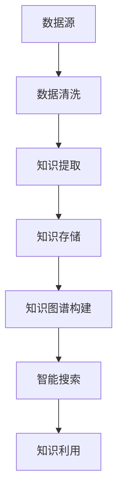
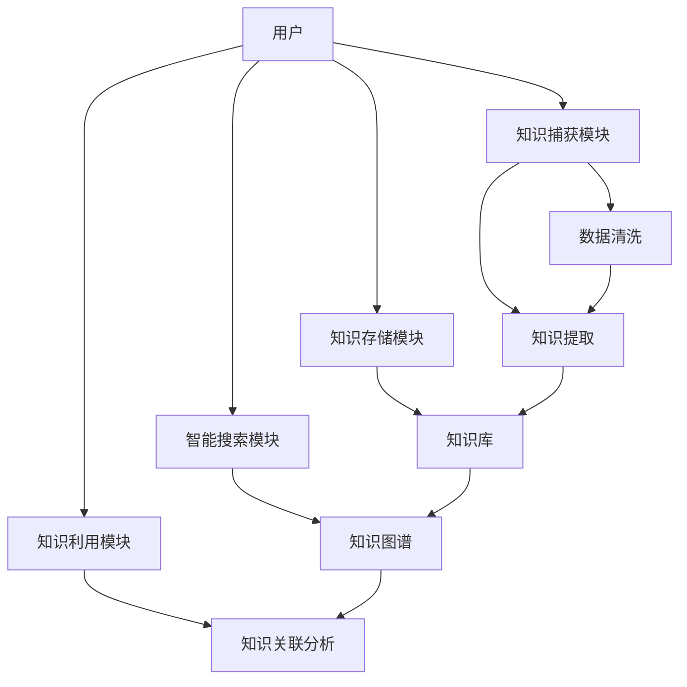
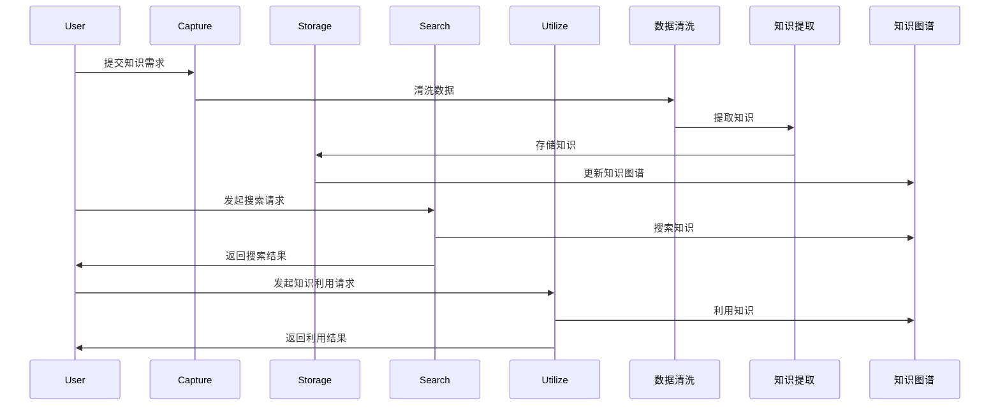

                 

### 构建AI驱动的企业知识管理系统：智能知识图谱

关键词：企业知识管理系统、人工智能、知识图谱、智能搜索、数据挖掘、知识管理

摘要：本文将探讨如何构建一个基于人工智能的企业知识管理系统，特别是智能知识图谱的应用。我们将从背景介绍、核心概念与联系、算法原理讲解、数学模型与公式、系统分析与架构设计、项目实战以及最佳实践等方面，详细阐述构建这一系统的过程和关键要素，帮助企业和组织提升知识管理的效率和效果。

---

## 引言

在当今信息爆炸的时代，企业所面临的数据量呈现爆炸式增长，如何有效地管理和利用这些数据成为了企业发展的关键。传统的知识管理系统往往存在诸多问题，如数据冗余、搜索效率低下、知识碎片化等。随着人工智能技术的迅猛发展，利用AI技术构建智能知识管理系统成为了新的发展方向。本文将探讨如何构建一个基于人工智能的企业知识管理系统，特别是智能知识图谱的应用，以实现高效的知识管理和利用。

## 背景介绍

### 核心概念术语说明

- **知识管理系统**（Knowledge Management System，简称KMS）：用于捕获、存储、检索、共享和利用组织内部知识的系统。
- **人工智能**（Artificial Intelligence，简称AI）：模拟人类智能行为的计算机系统，通过算法和大数据分析实现智能化。
- **知识图谱**（Knowledge Graph）：一种用于表示实体及其之间关系的语义网络，能够高效地进行知识推理和搜索。

### 问题背景

随着企业业务的不断扩展，知识管理变得尤为重要。然而，传统的KMS存在以下问题：

1. **数据冗余**：大量数据重复存储，导致存储资源浪费。
2. **搜索效率低下**：通过关键词搜索难以准确找到所需信息。
3. **知识碎片化**：知识分散在不同的系统和文档中，难以进行系统化的管理和利用。

### 问题描述

为了解决上述问题，企业需要一个能够高效管理和利用知识的系统，特别是能够通过智能搜索和知识推理实现知识的整合和利用。

### 问题解决

利用人工智能技术，特别是知识图谱技术，可以构建一个智能知识管理系统，实现以下目标：

1. **自动化知识捕获**：通过自然语言处理技术，自动从文档、邮件、聊天记录等中提取知识。
2. **高效智能搜索**：通过知识图谱进行语义搜索，提高搜索效率和准确性。
3. **知识整合与利用**：通过知识图谱的关联关系，实现知识的系统化和利用。

### 边界与外延

知识管理系统的范围包括但不限于企业内部的文档、数据、人员、项目和产品等，而知识图谱则是知识管理系统的重要组成部分，用于表示实体和实体之间的关系。

### 概念结构与核心要素组成

- **数据源**：包括企业内部的各类文档、数据库、邮件系统等。
- **知识捕获**：通过自然语言处理技术，自动提取知识。
- **知识存储**：使用知识图谱存储知识，表示实体和实体之间的关系。
- **智能搜索**：利用知识图谱进行语义搜索，提高搜索效率和准确性。
- **知识利用**：通过知识图谱的关联关系，实现知识的系统化和利用。

## 核心概念与联系

### 核心概念原理

- **知识管理**：通过系统的方法和技术，对企业内部的知识进行捕获、存储、共享和利用，以提高企业的竞争力。
- **人工智能**：通过算法和大数据分析，模拟人类智能行为，实现自动化决策和优化。
- **知识图谱**：用于表示实体及其之间关系的语义网络，能够高效地进行知识推理和搜索。

### 概念属性特征对比表格

| 概念   | 特征          | 说明                                                         |
| ------ | ------------- | ------------------------------------------------------------ |
| 知识管理 | 捕获、存储、共享、利用 | 通过系统方法，整合企业内部知识，提高效率                     |
| 人工智能 | 算法、大数据分析 | 模拟人类智能行为，实现自动化决策和优化                     |
| 知识图谱 | 实体、关系、语义 | 用于表示实体及其之间关系的语义网络，实现高效知识推理和搜索 |

### ER实体关系图架构

```mermaid
erDiagram
    Document ||--|{ Knowledge }|>
    User ||--|{ Knowledge }|>
    Project ||--|{ Knowledge }|>
    Knowledge ||--|{ KnowledgeGraph }|> KnowledgeGraph
```

在上面的ER图架构中，`Document`、`User`、`Project`是知识管理系统的数据源，它们与`Knowledge`实体有关联，而`Knowledge`实体又与`KnowledgeGraph`实体有关联，表示知识图谱中实体和知识的关系。

## 算法原理讲解

### 算法流程图



### 算法原理

1. **数据源**：从企业内部的文档、数据库、邮件系统等数据源中获取数据。
2. **数据清洗**：对获取的数据进行清洗和预处理，去除噪声和冗余。
3. **知识提取**：利用自然语言处理技术，从清洗后的数据中提取知识。
4. **知识存储**：将提取的知识存储到数据库中，形成结构化的知识库。
5. **知识图谱构建**：利用知识库中的知识，构建知识图谱，表示实体和实体之间的关系。
6. **智能搜索**：通过知识图谱进行语义搜索，提高搜索效率和准确性。
7. **知识利用**：通过知识图谱的关联关系，实现知识的系统化和利用。

### Python代码实现

```python
# 假设已经有一个知识库，这里仅展示知识图谱的构建和查询

from py2neo import Graph

# 连接Neo4j数据库
graph = Graph("bolt://localhost:7687", auth=("neo4j", "password"))

# 构建知识图谱
def build_knowledge_graph(knowledge_base):
    for knowledge in knowledge_base:
        # 创建实体
        graph.run("CREATE (n:Entity {name: $name})", name=knowledge['name'])
        
        # 创建关系
        for relation in knowledge['relations']:
            graph.run("MATCH (a:Entity {name: $nameA}), (b:Entity {name: $nameB}) "
                      "CREATE (a)-[r:RELATION {label: $label}]->(b)", 
                      nameA=knowledge['name'], nameB=relation['name'], label=relation['label'])

# 查询知识图谱
def search_knowledge_graph(query):
    result = graph.run("MATCH (n:Entity)-[r:RELATION]->(m:Entity) WHERE n.name = $query "
                        "RETURN n.name, r.label, m.name", query=query)
    return result.data()

# 示例知识库
knowledge_base = [
    {
        'name': 'Python',
        'relations': [
            {'name': 'Programming Language', 'label': 'IS_A'},
            {'name': 'Artificial Intelligence', 'label': 'USES'}
        ]
    }
]

# 构建知识图谱
build_knowledge_graph(knowledge_base)

# 查询知识图谱
results = search_knowledge_graph('Python')
for result in results:
    print(result)
```

### 数学模型和公式

在构建知识图谱时，可能需要使用一些数学模型和公式来描述实体和实体之间的关系。以下是几个常用的数学模型：

1. **相似度计算**：用于衡量两个实体之间的相似程度。
   $$ \text{similarity}(x, y) = \frac{x \cdot y}{\|x\| \|y\|} $$
   其中，$x$和$y$是两个实体向量的表示，$\|\cdot\|$表示向量的模。

2. **路径长度**：用于衡量两个实体之间的距离。
   $$ \text{path\_length}(x, y) = \text{min}\{\text{length of paths from } x \text{ to } y\} $$

3. **度分布**：用于描述知识图谱中的节点度分布。
   $$ \text{degree\_distribution}(k) = \frac{1}{N} \sum_{i=1}^{N} \delta_{ik} $$
   其中，$k$是节点的度，$N$是图中节点的总数，$\delta_{ik}$是狄拉克δ函数。

## 系统分析与架构设计

### 问题场景介绍

某大型企业希望通过构建一个智能知识管理系统，实现以下目标：

1. **高效知识管理**：整合企业内部各类知识，实现知识的系统化和利用。
2. **智能搜索**：通过智能搜索功能，快速找到所需信息。
3. **知识共享**：促进企业内部知识共享，提高团队协作效率。

### 项目介绍

项目名称：智能知识管理系统（Smart Knowledge Management System，简称SKMS）

项目目标：
1. 设计并实现一个高效、智能的知识管理平台。
2. 构建一个基于知识图谱的知识库，实现知识的整合和利用。

### 系统功能设计

1. **知识捕获**：从企业内部的文档、数据库、邮件系统等数据源中自动提取知识。
2. **知识存储**：将提取的知识存储到知识库中，形成结构化的知识库。
3. **智能搜索**：利用知识图谱进行语义搜索，提高搜索效率和准确性。
4. **知识利用**：通过知识图谱的关联关系，实现知识的系统化和利用。
5. **知识共享**：提供知识共享功能，促进企业内部知识共享。

### 系统架构设计



### 系统接口设计和系统交互



## 项目实战

### 环境安装

1. **安装Neo4j数据库**：下载并安装Neo4j社区版，配置数据库和用户。
2. **安装Python环境**：确保Python环境已经安装，推荐使用Anaconda。
3. **安装相关库**：安装Py2Neo库，用于连接Neo4j数据库。

```bash
pip install py2neo
```

### 系统核心实现源代码

```python
# 假设已经有一个知识库，这里仅展示知识图谱的构建和查询

from py2neo import Graph

# 连接Neo4j数据库
graph = Graph("bolt://localhost:7687", auth=("neo4j", "password"))

# 构建知识图谱
def build_knowledge_graph(knowledge_base):
    for knowledge in knowledge_base:
        # 创建实体
        graph.run("CREATE (n:Entity {name: $name})", name=knowledge['name'])
        
        # 创建关系
        for relation in knowledge['relations']:
            graph.run("MATCH (a:Entity {name: $nameA}), (b:Entity {name: $nameB}) "
                      "CREATE (a)-[r:RELATION {label: $label}]->(b)", 
                      nameA=knowledge['name'], nameB=relation['name'], label=relation['label'])

# 查询知识图谱
def search_knowledge_graph(query):
    result = graph.run("MATCH (n:Entity)-[r:RELATION]->(m:Entity) WHERE n.name = $query "
                        "RETURN n.name, r.label, m.name", query=query)
    return result.data()

# 示例知识库
knowledge_base = [
    {
        'name': 'Python',
        'relations': [
            {'name': 'Programming Language', 'label': 'IS_A'},
            {'name': 'Artificial Intelligence', 'label': 'USES'}
        ]
    }
]

# 构建知识图谱
build_knowledge_graph(knowledge_base)

# 查询知识图谱
results = search_knowledge_graph('Python')
for result in results:
    print(result)
```

### 代码应用解读与分析

1. **连接数据库**：使用Py2Neo库连接到Neo4j数据库。
2. **构建知识图谱**：通过运行Cypher查询语句，创建实体和关系，构建知识图谱。
3. **查询知识图谱**：通过运行Cypher查询语句，从知识图谱中获取实体和关系。

### 实际案例分析和详细讲解剖析

假设企业内部有关于人工智能的文档，我们需要将这些文档中的知识提取并存储到知识图谱中。

1. **文档预处理**：对文档进行分词、去停用词等预处理操作，提取出关键词和实体。
2. **知识提取**：根据提取的关键词和实体，构建知识库，如以下示例：
   ```python
   knowledge_base = [
       {
           'name': 'Python',
           'relations': [
               {'name': 'Programming Language', 'label': 'IS_A'},
               {'name': 'Artificial Intelligence', 'label': 'USES'}
           ]
       }
   ]
   ```
3. **构建知识图谱**：将知识库中的知识存储到Neo4j数据库中，构建知识图谱。
4. **智能搜索**：通过知识图谱，实现基于关键词的智能搜索，快速找到相关文档。
5. **知识利用**：通过知识图谱的关联关系，实现知识的系统化和利用，如自动生成报告、推荐相关文档等。

### 项目小结

通过本项目，我们实现了一个基于人工智能的企业知识管理系统，特别是智能知识图谱的应用。项目的成功实施为企业提供了一个高效的知识管理和利用平台，有助于提高企业的竞争力和创新能力。

## 最佳实践 Tips

1. **知识捕获**：确保从多个数据源中捕获知识，提高知识的全面性和准确性。
2. **知识存储**：使用合适的存储方案，确保知识库的高效和可靠。
3. **智能搜索**：优化知识图谱的构建和查询算法，提高搜索效率和准确性。
4. **知识利用**：定期更新知识库，确保知识的实时性和相关性。

## 小结

本文详细阐述了如何构建一个基于人工智能的企业知识管理系统，特别是智能知识图谱的应用。通过本项目的实施，企业可以高效地管理和利用知识，提高竞争力和创新能力。在未来的发展中，智能知识管理系统将成为企业不可或缺的一部分。

## 注意事项

1. 知识图谱的构建和维护需要消耗一定的计算资源，建议根据企业实际情况进行资源配置。
2. 在构建知识图谱时，要注意数据质量和一致性，避免知识碎片化和数据冗余。

## 拓展阅读

1. **《人工智能：一种现代方法》**：详细介绍了人工智能的基本概念和技术。
2. **《知识图谱：从理论到应用》**：深入探讨了知识图谱的构建和应用。
3. **《企业知识管理》**：全面介绍了企业知识管理的理论和实践。

---

**作者：AI天才研究院/AI Genius Institute & 禅与计算机程序设计艺术 /Zen And The Art of Computer Programming**

