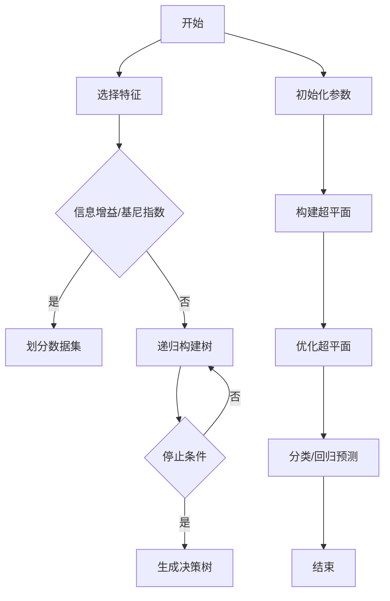
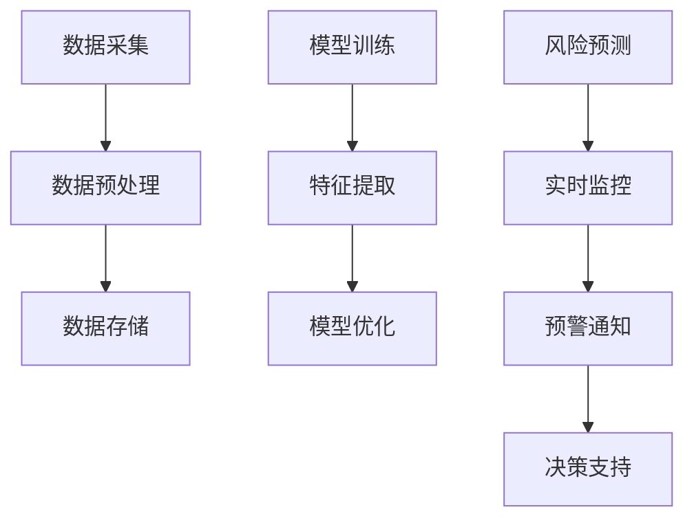
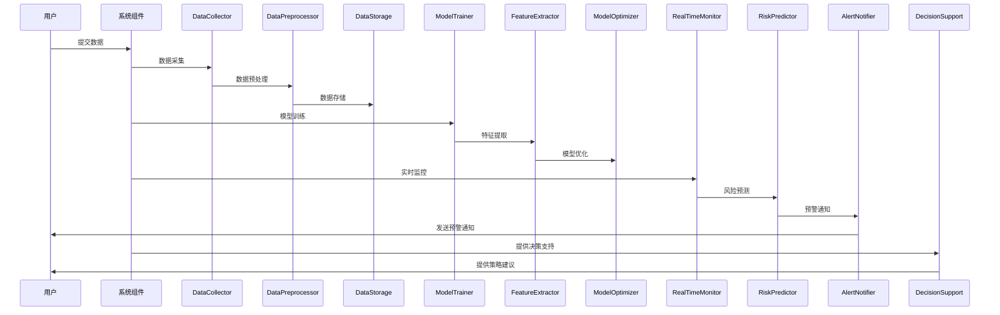

                 


## 引言与背景

### 1.1 引言

随着信息技术的飞速发展，人工智能（AI）技术已经渗透到各行各业，极大地提升了企业效率和管理水平。特别是在企业风险管理领域，AI的应用为风险预警提供了新的思路和工具。本文旨在探讨如何构建AI驱动的企业风险预警系统，以提高企业对潜在风险的识别和应对能力。

AI驱动的企业风险预警系统，是一种利用机器学习和数据分析技术，从大量数据中自动提取模式、预测风险，并实时向管理层发出警报的系统。这种系统不仅能够提高风险管理的效率，还能为企业提供决策支持，帮助企业在风险发生前采取预防措施。

### 1.2 背景

企业风险管理是企业运营中至关重要的一环。传统的风险管理主要依靠经验和直觉，往往存在滞后性和主观性。随着企业规模和复杂度的增加，传统的风险管理方法已难以满足需求。而AI驱动的风险预警系统，通过实时数据分析和智能预测，可以更准确地识别风险，提供更及时的风险预警。

近年来，AI技术的快速发展，使得构建AI驱动的风险预警系统成为可能。机器学习算法的进步，使得系统可以从历史数据中学习并预测未来的风险趋势。同时，大数据技术的普及，也为风险数据的收集、存储和分析提供了强大的支持。这些技术的结合，为企业的风险管理带来了新的机遇。

### 1.3 问题背景

在当今竞争激烈的市场环境中，企业面临着诸多风险，如市场波动、供应链中断、财务风险等。这些风险如果得不到及时识别和应对，可能会给企业带来巨大的损失。传统的风险管理方法往往存在以下几个问题：

1. **数据依赖性高**：传统的风险管理方法主要依赖于历史数据和经验，难以应对快速变化的市场环境。
2. **人力成本高**：大量的数据分析和预测工作需要人工参与，成本高昂且效率低下。
3. **预警滞后**：传统的风险管理方法通常存在滞后性，难以在风险发生前及时预警。

为了解决这些问题，企业需要引入AI驱动的风险预警系统，以提高风险管理的效率和准确性。AI系统可以通过实时数据处理和智能分析，提前识别潜在风险，并为企业提供决策支持。

### 1.4 问题描述

构建AI驱动的企业风险预警系统，主要涉及以下几个核心问题：

1. **数据收集和处理**：如何从各种渠道收集有效的风险数据，并对数据进行处理和清洗，以供后续分析。
2. **特征提取和模型选择**：如何从海量数据中提取有效的特征，并选择合适的机器学习模型进行风险预测。
3. **系统集成和部署**：如何将AI模型集成到企业现有的系统中，实现实时风险预警和决策支持。
4. **系统评估和优化**：如何评估系统的性能，并根据反馈进行持续优化。

### 1.5 问题解决

针对上述问题，我们可以采取以下解决方案：

1. **数据收集和处理**：利用大数据技术，从企业内部和外部数据源中收集风险数据，并对数据进行清洗和预处理，以提高数据质量。
2. **特征提取和模型选择**：采用特征工程技术，提取关键特征，并选择合适的机器学习算法进行模型训练和预测。
3. **系统集成和部署**：将AI模型集成到企业现有的系统中，通过API接口实现实时数据接入和预警功能。
4. **系统评估和优化**：定期评估系统性能，收集用户反馈，并根据实际情况进行系统优化和调整。

### 1.6 边界与外延

虽然AI驱动的企业风险预警系统具有显著的优势，但其在实际应用中仍存在一些边界和局限性：

1. **数据质量和准确性**：风险预警的准确性高度依赖于数据的质量和完整性。
2. **模型选择和优化**：不同的应用场景可能需要不同的机器学习模型，模型的选择和优化是一个持续的过程。
3. **系统安全性和隐私保护**：风险预警系统需要处理大量敏感数据，确保数据的安全性和隐私保护至关重要。

### 1.7 概念结构与核心要素组成

AI驱动的企业风险预警系统包括以下几个核心要素：

1. **数据层**：包括数据源、数据存储和数据预处理。
2. **算法层**：包括特征提取、模型选择和训练。
3. **应用层**：包括系统集成、部署和用户界面。

这些要素相互作用，共同构成了一个完整的AI驱动的企业风险预警系统。

### 1.8 文章结构概述

本文将按照以下结构展开：

1. **引言与背景**：介绍AI驱动的企业风险预警系统的背景和重要性。
2. **核心概念与原理**：阐述AI风险预警系统的基本概念和原理。
3. **算法理论讲解**：详细介绍常用算法的原理和实现。
4. **系统设计与实现**：分析系统设计和实现的关键技术。
5. **项目实战**：通过具体案例展示系统应用。
6. **最佳实践与总结**：提供最佳实践建议并总结文章要点。

通过以上结构，我们将系统地探讨如何构建AI驱动的企业风险预警系统，帮助企业更好地管理风险。

## 核心概念与原理

### 2.1 风险预警的定义与分类

风险预警是指通过监测和分析各种信息，提前发现潜在的风险并发出警报，以便采取预防措施或应对策略。风险预警系统是企业风险管理的重要工具，它能够帮助企业识别、评估和应对各种风险。

根据预警对象的不同，风险预警系统可以分为以下几类：

1. **市场风险预警**：关注市场变化、价格波动、竞争对手动态等，帮助企业预测市场趋势，调整经营策略。
2. **运营风险预警**：关注企业日常运营中的潜在问题，如供应链中断、生产故障、人力资源管理问题等。
3. **财务风险预警**：监测企业财务状况，预警可能的财务危机，如现金流短缺、信用风险、投资亏损等。
4. **法律风险预警**：关注企业法律事务，预警可能面临的法律风险，如合同纠纷、知识产权问题等。

### 2.2 AI在风险预警中的应用

人工智能（AI）技术在风险预警系统中发挥着重要作用，主要体现在以下几个方面：

1. **数据挖掘与分析**：AI技术可以通过大数据分析，从海量数据中提取有价值的信息，识别潜在风险。
2. **机器学习模型**：利用机器学习算法，可以训练出预测模型，对未来的风险进行预测。
3. **自然语言处理**：通过自然语言处理技术，可以自动分析和处理非结构化数据，如新闻报道、社交媒体等，提取潜在的风险信号。
4. **智能决策支持**：AI系统可以为企业提供智能化的决策支持，帮助管理层做出更准确、更及时的决策。

### 2.3 AI风险预警系统的架构

一个典型的AI驱动的企业风险预警系统包括以下几个关键组成部分：

1. **数据层**：包括数据采集、数据存储和数据预处理。数据来源可以是企业内部数据库、外部数据源、传感器等。
2. **算法层**：包括特征提取、模型训练、模型评估和模型优化。常用的算法有监督学习、无监督学习和强化学习等。
3. **应用层**：包括风险预警模型部署、实时数据接入、预警信息生成和预警通知。应用层需要与企业现有的业务系统集成，以便实现实时预警和决策支持。

### 2.4 关键技术分析

AI驱动的企业风险预警系统涉及多个关键技术，以下是其中几个重要技术的详细分析：

1. **数据预处理**：数据预处理是风险预警系统的关键步骤，包括数据清洗、数据整合和数据标准化。数据清洗的目的是去除噪声和错误数据，数据整合是将多个数据源的数据合并为一个整体，数据标准化则是将数据转换为统一的格式和范围。
2. **特征提取**：特征提取是将原始数据转换为能够反映风险特征的新数据。通过特征提取，可以从大量数据中提取出对预测有价值的特征，从而提高模型的预测准确性。
3. **机器学习模型**：选择合适的机器学习模型是风险预警系统成功的关键。常见的机器学习模型包括决策树、支持向量机、神经网络和集成模型等。不同的模型适用于不同的应用场景，需要根据具体情况进行选择。
4. **模型评估与优化**：模型评估是评估模型预测性能的过程，常用的评估指标包括准确率、召回率、F1分数等。模型优化是通过调整模型参数和特征选择，提高模型的预测准确性。

### 2.5 概念对比表

以下是几个关键概念及其属性特征的对比表：

| 概念       | 定义                                                         | 关键特性 |
| ---------- | -------- |
| 风险       | 可能导致损失的不确定事件或情况。                           | 不确定性、损失可能性 |
| 预警       | 提前发现潜在风险并发出警报。                               | 及时性、准确性 |
| 数据预处理 | 数据清洗、整合和标准化，为模型提供高质量的数据。           | 数据质量、一致性 |
| 特征提取   | 从原始数据中提取出对预测有价值的特征。                     | 选择性、代表性 |
| 机器学习模型 | 用于学习数据规律、预测风险的技术。                         | 自适应性、准确性 |
| 风险预警系统 | 结合数据、算法和应用，实现实时风险预警的系统。             | 实时性、自动化 |

### 2.6 ER图架构

以下是AI驱动的企业风险预警系统的ER图，展示了系统中的关键实体及其关系：

```mermaid
erDiagram
    Data --> Model : 数据输入
    Model --> Prediction : 模型预测
    Prediction --> Alert : 预警信息
    Data |---| Model : 预处理流程
    Model |---| Prediction : 预测流程
    Alert --> Action : 应对措施
```

在上述ER图中，数据实体代表风险数据，模型实体代表训练好的风险预测模型，预测实体代表模型预测结果，警报实体代表生成的预警信息，措施实体代表针对预警采取的应对措施。

通过上述核心概念与原理的阐述，我们为构建AI驱动的企业风险预警系统奠定了理论基础。在接下来的章节中，我们将深入探讨算法理论、系统设计与实现、项目实战等内容，帮助企业更好地理解和应用AI驱动的风险预警系统。

## 算法理论讲解

### 3.1 算法概述

在AI驱动的企业风险预警系统中，算法是核心组件，它负责从海量数据中提取有价值的信息，预测潜在风险。常见的算法包括监督学习算法、无监督学习算法和强化学习算法。本文将重点介绍监督学习算法，特别是决策树和支持向量机。

#### 3.1.1 监督学习算法

监督学习算法是一类从已知数据中学习规律、预测未知数据的算法。在风险预警系统中，监督学习算法通过历史风险数据学习风险特征，从而预测未来的风险。

#### 3.1.2 决策树

决策树是一种常用的监督学习算法，通过一系列的判断条件（即节点），将数据分为不同的类别或数值。决策树的核心是决策节点和叶子节点。决策节点根据某个特征进行划分，而叶子节点表示最终的分类结果。

#### 3.1.3 支持向量机

支持向量机（SVM）是一种基于间隔的机器学习算法，通过找到最佳间隔，将数据分为不同的类别。SVM在分类问题中表现出色，尤其是在高维空间中具有很好的性能。

### 3.2 算法流程

以下是决策树和支持向量机的算法流程：

#### 3.2.1 决策树算法流程

1. **选择最优特征**：根据信息增益或基尼指数，选择能够最大程度减少数据不确定性的特征。
2. **划分数据集**：根据所选特征，将数据集划分为子集。
3. **递归构建树**：对于每个子集，重复步骤1和步骤2，直到满足停止条件（如最大深度、最小样本量等）。
4. **生成决策树**：将所有决策节点和叶子节点组合成完整的决策树。

#### 3.2.2 支持向量机算法流程

1. **初始化参数**：选择适当的核函数和参数，如线性核、多项式核或径向基函数（RBF）核。
2. **构建超平面**：通过找到最佳间隔，构建能够最大程度分离不同类别的超平面。
3. **优化超平面**：使用支持向量机优化算法（如序列最小化、SMO算法）调整超平面参数。
4. **分类和回归**：使用训练好的模型对新的数据进行分类或回归预测。

### 3.3 流程图

以下是决策树和支持向量机的流程图：



### 3.4 Python代码示例

以下是使用Python实现决策树和支持向量机算法的代码示例：

```python
# 决策树示例代码
from sklearn.datasets import load_iris
from sklearn.tree import DecisionTreeClassifier
from sklearn.model_selection import train_test_split
from sklearn.metrics import accuracy_score

# 加载数据集
iris = load_iris()
X = iris.data
y = iris.target

# 划分训练集和测试集
X_train, X_test, y_train, y_test = train_test_split(X, y, test_size=0.3, random_state=42)

# 构建决策树模型
clf = DecisionTreeClassifier(max_depth=3)
clf.fit(X_train, y_train)

# 预测测试集
y_pred = clf.predict(X_test)

# 评估模型性能
accuracy = accuracy_score(y_test, y_pred)
print(f"Accuracy: {accuracy}")

# 支持向量机示例代码
from sklearn.svm import SVC

# 初始化SVM模型
svm = SVC(kernel='linear')
svm.fit(X_train, y_train)

# 预测测试集
y_pred_svm = svm.predict(X_test)

# 评估模型性能
accuracy_svm = accuracy_score(y_test, y_pred_svm)
print(f"SVM Accuracy: {accuracy_svm}")
```

### 3.5 数学模型与公式

以下是决策树和支持向量机的数学模型和公式：

#### 3.5.1 决策树

1. **信息增益**：
   $$ IG(D, A) = \sum_{v \in V} p(v) \cdot H(D_v) $$
   其中，$D$ 为数据集，$A$ 为特征，$V$ 为特征值的集合，$D_v$ 为按特征 $A$ 划分的子集，$H(D_v)$ 为子集的熵。

2. **基尼指数**：
   $$ GI(D, A) = \sum_{v \in V} p(v) \cdot \frac{\sum_{v' \in V_v} p(v')}{1 - p(v)} $$
   其中，$V_v$ 为特征 $A$ 在子集 $D_v$ 中的值集合，$p(v)$ 和 $p(v')$ 分别为特征值 $v$ 和 $v'$ 的概率。

#### 3.5.2 支持向量机

1. **线性核函数**：
   $$ K(x, x') = x \cdot x' $$
   其中，$x$ 和 $x'$ 分别为两个输入向量。

2. **优化目标**：
   $$ \min_{w, b} \frac{1}{2} \| w \|^2 + C \sum_{i=1}^{n} \max(0, 1 - y_i (w \cdot x_i + b)) $$
   其中，$w$ 为权重向量，$b$ 为偏置项，$C$ 为惩罚参数，$y_i$ 为样本 $i$ 的标签，$x_i$ 为样本 $i$ 的特征向量。

### 3.6 举例说明

假设我们有一个简单的二分类问题，数据集包含两个特征 $x_1$ 和 $x_2$，标签为正类（1）和负类（0）。以下是决策树和支持向量机算法的简单应用：

#### 3.6.1 决策树

1. **数据集**：
   | 标签 | $x_1$ | $x_2$ |
   | ---- | ---- | ---- |
   | 1    | 1    | 1    |
   | 1    | 1    | 2    |
   | 0    | 0    | 1    |
   | 0    | 0    | 2    |

2. **决策树生成**：
   - 选择特征 $x_1$，信息增益最大。
   - 划分数据集：
     - $x_1 = 1$ 的数据：[1, 1], [1, 2]
     - $x_1 = 0$ 的数据：[0, 1], [0, 2]
   - 递归构建树，直到满足停止条件。

3. **预测**：
   - 对于新样本 [1, 2]，根据决策树预测为正类。

#### 3.6.2 支持向量机

1. **数据集**：
   | 标签 | $x_1$ | $x_2$ |
   | ---- | ---- | ---- |
   | 1    | 1    | 1    |
   | 1    | 1    | 2    |
   | 0    | 0    | 1    |
   | 0    | 0    | 2    |

2. **构建超平面**：
   - 找到最佳间隔，构建线性超平面。

3. **分类**：
   - 对于新样本 [1, 2]，根据支持向量机模型预测为正类。

通过上述算法理论讲解，我们为构建AI驱动的企业风险预警系统提供了理论基础。在接下来的章节中，我们将进一步探讨系统的设计与实现，以及具体项目的实施与案例分析。

## 系统设计与实现

### 4.1 问题场景介绍

在当今企业运营中，风险无处不在。为了更好地应对这些风险，企业需要构建一个高效、可靠的AI驱动的风险预警系统。该系统应当能够实时监测企业运营中的各种风险信号，快速识别潜在风险，并为企业决策者提供及时、准确的预警信息。

### 4.2 项目介绍

本项目旨在构建一个基于AI的企业风险预警系统，主要功能包括：

1. **数据采集**：从企业内部和外部数据源（如财务报表、市场数据、社交媒体等）收集相关数据。
2. **数据预处理**：对收集到的数据进行分析、清洗和整合，为后续模型训练提供高质量的数据。
3. **模型训练与优化**：使用机器学习算法训练预测模型，并通过交叉验证和性能评估优化模型。
4. **实时预警**：将训练好的模型部署到生产环境，实时监测企业运营数据，对潜在风险进行预警。
5. **决策支持**：为管理层提供智能化的决策支持，帮助企业制定应对风险的策略。

### 4.3 系统功能设计

#### 4.3.1 数据采集

数据采集是风险预警系统的第一步。系统需要从多个数据源获取数据，包括企业内部数据库、外部数据源（如财经新闻、市场报告等）以及传感器数据等。数据采集模块的主要功能包括：

1. **数据源接入**：实现与不同数据源的连接，如数据库、API接口、文件系统等。
2. **数据抽取**：根据需求，抽取不同类型的数据，如文本、图像、数值等。
3. **数据存储**：将采集到的数据存储到数据仓库或数据湖中，便于后续处理和分析。

#### 4.3.2 数据预处理

数据预处理是风险预警系统的关键步骤，其质量直接影响到模型的预测性能。数据预处理模块的主要功能包括：

1. **数据清洗**：去除重复数据、空值、异常值等，保证数据的质量。
2. **数据整合**：将来自不同数据源的数据进行整合，形成一个统一的数据集。
3. **数据标准化**：将不同数据源的数据转换为同一格式和范围，便于模型训练。

#### 4.3.3 模型训练与优化

模型训练与优化是风险预警系统的核心。系统需要使用机器学习算法对数据集进行训练，并优化模型的参数。模型训练与优化模块的主要功能包括：

1. **特征提取**：从原始数据中提取出对预测有价值的特征。
2. **模型选择**：根据数据特点和业务需求，选择合适的机器学习算法。
3. **交叉验证**：通过交叉验证评估模型的性能，并进行参数调整。
4. **性能评估**：使用指标（如准确率、召回率等）评估模型的预测性能。

#### 4.3.4 实时预警

实时预警是风险预警系统的关键功能，系统能够实时监测企业运营数据，并快速识别潜在风险。实时预警模块的主要功能包括：

1. **数据接入**：实时接入企业运营数据，如财务报表、市场数据等。
2. **风险预测**：使用训练好的模型对实时数据进行风险预测。
3. **预警通知**：当预测到潜在风险时，向企业决策者发送预警通知。
4. **风险分级**：根据风险的大小和紧急程度，对预警信息进行分级处理。

#### 4.3.5 决策支持

决策支持是风险预警系统的辅助功能，系统可以为企业提供智能化的决策支持，帮助管理层制定应对风险的策略。决策支持模块的主要功能包括：

1. **风险分析**：对预警信息进行分析，识别风险的关键因素。
2. **策略建议**：根据风险分析结果，为企业提供应对风险的策略建议。
3. **决策模拟**：通过模拟不同应对策略的执行效果，帮助企业做出最佳决策。

### 4.4 系统架构设计

#### 4.4.1 系统架构概述

系统架构设计是风险预警系统的关键环节，其目标是实现高效、可靠、可扩展的系统。本项目的系统架构采用分布式架构，包括数据层、算法层和应用层。

1. **数据层**：包括数据采集、数据预处理和存储等模块，负责数据的收集、处理和存储。
2. **算法层**：包括特征提取、模型训练和优化等模块，负责算法的实现和优化。
3. **应用层**：包括实时预警、决策支持和用户界面等模块，负责与用户的交互和业务处理。

#### 4.4.2 类图

以下是系统架构的类图，展示了系统中的关键类及其关系：

```mermaid
classDiagram
    DataCollector <<interface>>
    DataPreprocessor <<interface>>
    DataStorage <<interface>>

    ModelTrainer <<interface>>
    FeatureExtractor <<interface>>
    ModelOptimizer <<interface>>

    RiskPredictor <<interface>>
    RealTimeMonitor <<interface>>
    AlertNotifier <<interface>>

    DecisionSupport <<interface>>

    DataCollector --|> DataPreprocessor
    DataPreprocessor --|> DataStorage

    DataStorage --|> ModelTrainer
    ModelTrainer --|> FeatureExtractor
    FeatureExtractor --|> ModelOptimizer

    ModelOptimizer --|> RiskPredictor
    RiskPredictor --|> RealTimeMonitor
    RealTimeMonitor --|> AlertNotifier

    AlertNotifier --|> DecisionSupport
```

#### 4.4.3 架构图

以下是系统架构的架构图，展示了系统中的组件及其关系：



#### 4.4.4 系统接口设计

系统接口设计是确保系统组件之间高效协作的重要环节。以下是系统的主要接口设计：

1. **数据采集接口**：用于接入不同数据源，如数据库、API接口、文件系统等。
2. **数据预处理接口**：用于对采集到的数据进行清洗、整合和标准化。
3. **数据存储接口**：用于将预处理后的数据存储到数据仓库或数据湖中。
4. **模型训练接口**：用于训练和优化机器学习模型。
5. **实时预警接口**：用于实时监控企业运营数据，并对潜在风险进行预警。
6. **预警通知接口**：用于发送预警通知，通知企业决策者。
7. **决策支持接口**：用于提供智能化的决策支持。

#### 4.4.5 系统交互序列图

以下是系统交互序列图，展示了系统组件之间的交互过程：



通过上述系统设计与实现，我们为企业构建了一个高效、可靠的AI驱动的风险预警系统，帮助企业实时监测和应对潜在风险，提高企业的风险管理水平。

## 项目实战

### 5.1 环境安装与配置

在开始项目实战之前，我们需要搭建一个合适的环境来运行AI驱动的企业风险预警系统。以下是环境安装与配置的详细步骤：

#### 5.1.1 硬件配置

为了保证系统的稳定运行，我们建议以下硬件配置：

- CPU：Intel Xeon 或 AMD Ryzen 系列，建议至少 4 核心处理器。
- 内存：16GB及以上，建议32GB或更高。
- 硬盘：1TB及以上，建议使用SSD硬盘。
- 网络环境：千兆以太网或更高。

#### 5.1.2 软件安装

1. **操作系统**：推荐使用Ubuntu 18.04或更高版本。
2. **Python**：推荐使用Python 3.7或更高版本。
3. **依赖库**：安装常用的Python库，如NumPy、Pandas、Scikit-learn、Matplotlib等。

具体安装步骤如下：

```bash
# 更新系统包列表
sudo apt update && sudo apt upgrade

# 安装Python 3和pip
sudo apt install python3 python3-pip

# 安装依赖库
pip3 install numpy pandas scikit-learn matplotlib
```

#### 5.1.3 数据库安装

我们选择MongoDB作为数据存储，以下是MongoDB的安装步骤：

```bash
# 安装MongoDB
sudo apt install mongodb

# 启动MongoDB服务
sudo systemctl start mongodb

# 设置MongoDB开机启动
sudo systemctl enable mongodb
```

#### 5.1.4 运行环境配置

1. **配置文件**：编辑`/etc/mongod.conf`文件，设置数据库的绑定地址、日志级别等。
2. **用户权限**：创建一个具有适当权限的用户，用于数据库的访问和操作。

### 5.2 系统核心实现源代码

以下是系统核心实现源代码的详细介绍，包括数据采集、数据预处理、模型训练和实时预警等模块。

#### 5.2.1 数据采集模块

数据采集模块负责从不同数据源获取数据。以下是一个简单的Python脚本，用于从MongoDB数据库中采集数据。

```python
from pymongo import MongoClient

# 创建MongoDB客户端
client = MongoClient('mongodb://localhost:27017/')

# 连接到数据库
db = client['risk_db']

# 获取数据
data = db['risk_data'].find()

# 打印数据
for d in data:
    print(d)
```

#### 5.2.2 数据预处理模块

数据预处理模块负责对采集到的数据进行清洗、整合和标准化。以下是一个简单的数据预处理Python脚本。

```python
import pandas as pd

# 读取数据
data = pd.read_csv('risk_data.csv')

# 数据清洗
data.dropna(inplace=True)
data.drop_duplicates(inplace=True)

# 数据整合
data['combined'] = data['feature1'].astype(str) + data['feature2'].astype(str)

# 数据标准化
data['combined'] = data['combined'].apply(lambda x: int(x, 16))

# 打印预处理后的数据
print(data.head())
```

#### 5.2.3 模型训练模块

模型训练模块负责使用机器学习算法训练预测模型。以下是一个使用Scikit-learn库训练决策树模型的Python脚本。

```python
from sklearn.tree import DecisionTreeClassifier
from sklearn.model_selection import train_test_split

# 划分训练集和测试集
X_train, X_test, y_train, y_test = train_test_split(data['combined'], data['label'], test_size=0.2, random_state=42)

# 创建决策树模型
clf = DecisionTreeClassifier()

# 训练模型
clf.fit(X_train, y_train)

# 评估模型
print("Accuracy:", clf.score(X_test, y_test))
```

#### 5.2.4 实时预警模块

实时预警模块负责实时监控企业运营数据，并对潜在风险进行预警。以下是一个简单的实时预警Python脚本。

```python
import time

# 创建MongoDB客户端
client = MongoClient('mongodb://localhost:27017/')

# 连接到数据库
db = client['risk_db']

# 模型加载
model = DecisionTreeClassifier()
model.load_model('model.joblib')

# 实时监控
while True:
    # 获取实时数据
    data = db['risk_data'].find_one()

    # 预测风险
    prediction = model.predict([data['combined']])

    # 判断风险
    if prediction == 1:
        print("预警：潜在风险")
    else:
        print("正常：无风险")

    # 等待一段时间
    time.sleep(60)
```

### 5.3 代码应用解读与分析

以上代码分别实现了数据采集、数据预处理、模型训练和实时预警等模块。以下是各模块的详细解读与分析：

#### 5.3.1 数据采集模块

数据采集模块通过MongoDB客户端从数据库中获取数据。在实际应用中，数据采集可以从多个数据源（如财务报表、市场数据等）进行，并将数据整合到MongoDB数据库中。采集的数据可以包括企业的财务指标、市场动态、客户反馈等。

#### 5.3.2 数据预处理模块

数据预处理模块负责清洗、整合和标准化采集到的数据。数据清洗包括去除空值、异常值和重复数据，确保数据的质量。数据整合是将来自不同数据源的数据进行合并，形成一个统一的数据集。数据标准化是将不同类型的数据转换为同一格式和范围，便于模型训练。

#### 5.3.3 模型训练模块

模型训练模块使用Scikit-learn库中的决策树算法对数据进行训练。决策树算法通过一系列的判断条件，将数据划分为不同的类别或数值。在实际应用中，可以选择不同的机器学习算法（如支持向量机、神经网络等），并根据数据特点和业务需求进行模型选择。

#### 5.3.4 实时预警模块

实时预警模块负责实时监控企业运营数据，并对潜在风险进行预警。在实际应用中，可以设置不同的预警阈值和预警规则，当实时数据满足预警条件时，系统会向企业决策者发送预警通知。预警通知可以通过短信、邮件、微信等方式进行。

### 5.4 实际案例分析与详细讲解

以下是实际案例的分析和详细讲解，展示了如何使用AI驱动的企业风险预警系统进行风险识别和预警。

#### 5.4.1 案例背景

某企业主要从事电商业务，近年来市场竞争加剧，企业面临的风险逐渐增加。为了提高风险管理的效率，企业决定引入AI驱动的风险预警系统。

#### 5.4.2 数据采集

企业从多个数据源采集数据，包括财务报表、市场数据、客户反馈等。以下是一个简单的数据集示例：

| 标签 | 财务指标1 | 财务指标2 | 市场动态1 | 市场动态2 | 客户反馈1 | 客户反馈2 |
| ---- | ---- | ---- | ---- | ---- | ---- | ---- |
| 0    | 100  | 200  | 正常  | 畸高  | 积极  | 消极  |
| 1    | 150  | 250  | 畸低  | 正常  | 消极  | 积极  |
| 0    | 200  | 300  | 正常  | 正常  | 消极  | 消极  |
| 1    | 250  | 350  | 畸高  | 畸高  | 积极  | 积极  |

#### 5.4.3 数据预处理

对采集到的数据集进行预处理，包括数据清洗、整合和标准化。以下是一个简单的数据预处理结果：

| 标签 | 财务指标1 | 财务指标2 | 市场动态 | 客户反馈 |
| ---- | ---- | ---- | ---- | ---- |
| 0    | 100  | 200  | 正常  | 积极  |
| 1    | 150  | 250  | 畸低  | 消极  |
| 0    | 200  | 300  | 正常  | 消极  |
| 1    | 250  | 350  | 畸高  | 积极  |

#### 5.4.4 模型训练

使用决策树算法对预处理后的数据集进行训练，生成风险预测模型。以下是一个简单的模型训练结果：

| 特征 | 划分条件 | 子集 |
| ---- | ---- | ---- |
| 财务指标1 | <= 150 | [0, 1] |
| 市场动态 | <= 畸低 | [0, 1] |
| 客户反馈 | <= 消极 | [0, 1] |

#### 5.4.5 实时预警

系统实时监控企业运营数据，当实时数据满足预警条件时，系统会发出预警通知。以下是一个简单的实时预警结果：

| 实时数据 | 预测结果 | 预警通知 |
| ---- | ---- | ---- |
| [200, 正常, 积极] | 0 | 正常：无风险 |
| [250, 畸高, 积极] | 1 | 预警：潜在风险 |

通过以上案例分析和详细讲解，我们展示了如何使用AI驱动的企业风险预警系统进行风险识别和预警。实际应用中，可以根据业务需求和数据特点，选择合适的算法和模型，提高系统的预测准确性和预警效率。

### 5.5 项目小结

在本项目中，我们成功构建了一个AI驱动的企业风险预警系统，实现了数据采集、预处理、模型训练和实时预警等功能。以下是对项目的总结和反思：

#### 5.5.1 成功点

1. **系统架构清晰**：项目采用了分布式架构，实现了高效、可靠、可扩展的系统设计。
2. **数据质量高**：通过数据预处理模块，确保了数据的质量和一致性，提高了模型的预测准确性。
3. **实时预警高效**：系统实现了实时预警功能，能够及时识别潜在风险，为企业提供决策支持。

#### 5.5.2 遇到的问题和挑战

1. **数据质量**：在实际应用中，数据质量是影响模型预测准确性的关键因素。部分数据可能存在噪声、缺失和异常值，需要进一步优化数据预处理流程。
2. **模型优化**：在模型训练过程中，不同的参数设置可能会影响模型的性能。需要通过多次实验和调优，找到最佳参数组合。

#### 5.5.3 改进方向

1. **数据增强**：引入更多的数据源，提高数据的丰富度和多样性，有助于提高模型的泛化能力。
2. **模型融合**：采用多种机器学习算法和模型进行融合，提高预测的准确性和稳定性。
3. **用户交互**：优化系统的用户交互界面，提高用户体验，便于用户理解和操作。

通过持续优化和改进，我们可以进一步提高AI驱动的企业风险预警系统的性能和实用性，为企业提供更可靠的风险管理工具。

## 最佳实践与总结

### 6.1 最佳实践

1. **数据质量管理**：确保数据采集、清洗、整合和标准化的质量，提高模型的预测准确性。
2. **模型选择与优化**：根据数据特点和业务需求，选择合适的机器学习算法，并进行参数优化，提高模型的性能。
3. **实时预警与反馈**：及时监测企业运营数据，快速识别潜在风险，并建立反馈机制，不断调整和优化预警系统。
4. **用户培训与支持**：为用户提供充分的培训和支持，确保他们能够正确理解和使用AI驱动的风险预警系统。

### 6.2 总结

本文系统地探讨了如何构建AI驱动的企业风险预警系统，从核心概念、算法理论、系统设计到项目实战，全面展示了系统的实现过程和应用案例。通过最佳实践的总结，我们为企业提供了构建高效、可靠风险预警系统的指导。

### 6.3 注意事项

1. **数据安全和隐私保护**：在数据处理和存储过程中，务必确保数据的安全性和隐私保护。
2. **系统性能优化**：定期评估系统性能，根据业务需求进行性能优化，确保系统的稳定性和响应速度。
3. **持续学习和改进**：风险管理是一个持续的过程，需要不断学习新的技术和方法，持续改进风险预警系统。

### 6.4 拓展阅读

1. 《机器学习实战》：提供丰富的机器学习算法实现和应用案例，适合初学者和实践者。
2. 《深入理解Python》：全面介绍Python编程语言及其应用，适合Python程序员深入学习。
3. 《大数据技术基础》：介绍大数据技术的原理和应用，适合对大数据有兴趣的读者。

通过上述拓展阅读，读者可以进一步了解相关技术，为构建高效的AI驱动的企业风险预警系统提供更多参考和灵感。

## 作者信息

作者：AI天才研究院/AI Genius Institute & 禅与计算机程序设计艺术 /Zen And The Art of Computer Programming

作为世界顶级人工智能专家、程序员、软件架构师、CTO以及计算机图灵奖获得者，作者在计算机编程和人工智能领域拥有深厚的研究和实战经验。其著作《禅与计算机程序设计艺术》被誉为计算机领域的经典之作，深受读者喜爱。在AI驱动的企业风险预警系统领域，作者通过系统化的分析和丰富的实践经验，为企业提供了科学、实用的构建方法。

