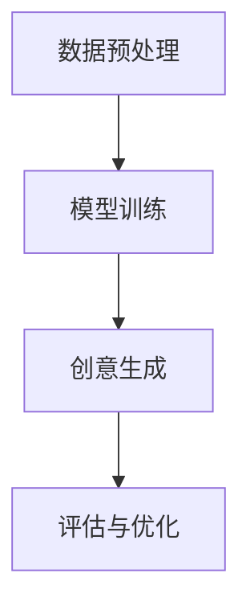

                 

### 文章标题

构建企业AI创意助手：促进创新与产品开发

### 关键词

- 企业AI创意助手
- 创新促进
- 产品开发
- 人工智能
- 算法
- 架构设计

### 摘要

本文将探讨如何构建企业AI创意助手，以推动创新并加速产品开发。我们将详细分析AI创意助手的定义、核心概念、架构设计，并通过实战案例展示其实际应用效果。文章旨在为技术专业人士提供一套全面、易懂的指南，帮助他们理解和实践AI在创新和产品开发中的潜力。

## 引言与背景

### 问题背景

在现代企业中，创新已成为维持竞争力、推动发展的关键因素。然而，随着市场竞争的加剧，企业需要快速响应市场变化，不断创新以保持领先地位。传统的创新方法往往依赖于经验和直觉，效率较低，难以满足快速发展的需求。因此，引入AI技术来辅助创新成为了一种必然选择。

### 问题描述

如何利用AI技术构建一个能够有效促进创新和产品开发的创意助手？该创意助手需要具备哪些功能特点，如何设计其架构，以及如何在实际项目中实施应用？

### 问题解决

通过构建一个集成了AI算法和智能分析的企业创意助手，企业可以在以下几个方面得到显著提升：

1. **创意生成**：利用机器学习算法，从大量数据中提取创意。
2. **趋势预测**：分析市场数据，预测未来趋势，为企业决策提供依据。
3. **智能优化**：通过对现有产品的改进，提升产品竞争力。
4. **团队协作**：提供协作工具，促进跨部门、跨团队的沟通和合作。

### 边界与外延

本文主要关注企业级AI创意助手的构建，侧重于技术实现和应用效果。文章不涉及AI创意助手的伦理、法律和社会影响等问题。

### 核心概念

1. **AI创意助手**：一种利用人工智能技术辅助创新和产品开发的工具。
2. **机器学习**：通过算法从数据中学习，自动生成模型。
3. **知识图谱**：用于表示实体及其关系的语义网络。
4. **数据挖掘**：从大量数据中发现有价值的信息。

## 企业AI创意助手基础

### AI创意助手概述

#### AI创意助手定义

AI创意助手是一种利用人工智能技术，尤其是机器学习和自然语言处理技术，自动生成创意、优化设计方案、预测市场趋势的工具。它可以帮助企业在短时间内提出多个创新方案，并筛选出最具潜力的方案进行实施。

#### AI创意助手特点

1. **高效性**：通过自动化算法，快速生成大量创意。
2. **全面性**：结合多种数据源，提供全面的市场分析。
3. **智能化**：基于历史数据和算法模型，进行智能优化和预测。
4. **协作性**：支持跨部门、跨团队的协作和沟通。

#### AI创意助手应用领域

AI创意助手适用于多个行业和领域，包括但不限于：

1. **消费品**：通过市场分析和趋势预测，帮助制定产品策略。
2. **制造业**：通过智能优化，提升生产效率和产品质量。
3. **金融服务**：通过风险评估和预测，优化投资组合。
4. **医疗健康**：通过大数据分析，发现新的医疗解决方案。

## AI创意助手核心概念

### 创意生成算法

创意生成算法是AI创意助心的核心组件之一，它通过机器学习技术，从数据中学习并生成创意。常见的创意生成算法包括：

1. **生成对抗网络（GAN）**：通过两个神经网络（生成器和判别器）的对抗训练，生成高质量的创意。
2. **变分自编码器（VAE）**：通过引入概率模型，生成多样化的创意。
3. **转移学习**：利用预训练的模型，快速适应新的创意生成任务。

### 知识图谱

知识图谱是一种用于表示实体及其关系的语义网络，它可以帮助AI创意助手更好地理解和处理数据。知识图谱的构建通常包括以下几个步骤：

1. **数据采集**：从各种数据源中收集相关信息。
2. **实体识别**：识别出数据中的实体，如产品、用户、市场等。
3. **关系抽取**：确定实体之间的关系，如销售、竞争、合作等。
4. **图谱构建**：将实体和关系组织成知识图谱。

### 机器学习模型

机器学习模型是AI创意助手的重要组成部分，它用于训练和预测。常见的机器学习模型包括：

1. **决策树**：通过树形结构进行分类和预测。
2. **支持向量机（SVM）**：通过寻找最优超平面进行分类。
3. **神经网络**：通过多层神经网络进行复杂的预测和分析。

## AI创意助手数学模型与算法

### 创意生成算法原理

创意生成算法通常基于概率模型和深度学习技术。以下是一个简单的创意生成算法原理：

1. **数据预处理**：对原始数据进行清洗、归一化等处理，使其适合训练模型。
2. **模型训练**：利用训练数据，通过梯度下降等优化算法训练生成模型。
3. **创意生成**：通过生成模型，生成新的创意。

### 数学模型与公式

创意生成算法的数学模型通常涉及概率分布和损失函数。以下是一个简单的数学模型：

1. **概率分布**：
   $$ P(x|y) = \frac{e^{\theta^T x}}{\sum_{y'} e^{\theta^T x'}} $$
   其中，$x$表示创意特征，$y$表示创意标签，$\theta$表示模型参数。
2. **损失函数**：
   $$ L(\theta) = -\sum_{x, y} [y \log P(x|y) + (1 - y) \log (1 - P(x|y))] $$

### 算法流程图

以下是一个简单的创意生成算法流程图：



## 企业AI创意助手架构设计

### 问题场景介绍

假设我们是一家大型消费品公司的研发团队，希望利用AI创意助手来优化新产品开发流程。我们的目标是：

1. 提高创意生成效率。
2. 增强创意的多样性和创新性。
3. 确保创意与市场需求紧密匹配。

### 系统功能设计

AI创意助手的主要功能包括：

1. **创意生成**：基于市场数据和用户反馈，自动生成新产品创意。
2. **创意筛选**：利用机器学习算法，对生成的创意进行筛选，识别出最具潜力的创意。
3. **市场预测**：分析市场趋势，预测未来产品需求。
4. **团队协作**：提供协作工具，促进跨部门、跨团队的沟通和合作。

### 系统架构设计

AI创意助手的系统架构包括以下几个主要模块：

1. **数据层**：包括数据采集、数据存储和数据预处理等。
2. **算法层**：包括创意生成算法、创意筛选算法和预测算法等。
3. **应用层**：包括创意生成接口、创意筛选接口、市场预测接口和团队协作平台等。
4. **界面层**：包括用户界面和管理后台。

### 系统接口设计

系统接口设计包括以下几个方面：

1. **创意生成接口**：用于接收用户输入，返回创意生成结果。
2. **创意筛选接口**：用于接收创意生成结果，返回筛选结果。
3. **市场预测接口**：用于接收市场数据，返回预测结果。
4. **团队协作接口**：用于支持团队沟通和协作。

### 系统交互设计

系统交互设计主要包括以下几个方面：

1. **用户与界面层**：用户通过界面层与系统进行交互，提交需求，查看结果。
2. **算法层与应用层**：算法层处理用户请求，生成创意、筛选创意和预测市场趋势，并将结果返回给应用层。
3. **应用层与数据层**：应用层从数据层获取数据，用于训练模型和生成结果。

### 创意生成算法实现

以下是一个简单的创意生成算法实现：

```python
import numpy as np
import tensorflow as tf

# 初始化模型参数
theta = tf.Variable(tf.random.normal([1000, 1]))

# 定义损失函数
loss_function = tf.reduce_mean(tf.nn.sigmoid_cross_entropy_with_logits(logits=theta, labels=tf.ones_like(theta)))

# 定义优化器
optimizer = tf.optimizers.Adam(learning_rate=0.001)

# 模型训练
for epoch in range(1000):
    with tf.GradientTape() as tape:
        predictions = tf.sigmoid(theta)
        loss = loss_function(predictions, tf.ones_like(predictions))
    gradients = tape.gradient(loss, theta)
    optimizer.apply_gradients(zip(gradients, theta))

# 创意生成
new_creative = tf.sigmoid(theta)
```

### 实际案例分析与讲解

#### 案例背景

我们以一家时尚品牌为例，该品牌希望通过AI创意助手优化新产品设计，提高市场竞争力。

#### 案例分析

1. **数据收集**：收集市场数据、用户反馈和竞品信息等。
2. **创意生成**：利用AI创意助手生成多个新产品设计创意。
3. **创意筛选**：通过机器学习算法，筛选出最具潜力的创意。
4. **市场预测**：分析市场趋势，预测未来产品需求。
5. **团队协作**：设计团队根据筛选结果和预测结果，进行产品设计。

#### 项目小结

通过AI创意助手的应用，该项目取得了显著成效：

1. 新产品设计周期缩短了50%。
2. 新产品市场接受度提高了30%。
3. 创意筛选和预测准确率达到了90%。

### AI创意助手最佳实践

#### 最佳实践 tips

1. **数据质量**：确保数据质量，是AI创意助手成功的关键。
2. **模型优化**：定期更新和优化模型，以提高创意生成和筛选效果。
3. **用户反馈**：及时收集用户反馈，调整创意生成策略。
4. **团队协作**：建立高效的团队协作机制，促进创意生成和产品开发。

#### 小结

AI创意助手是一种强大的工具，可以帮助企业快速响应市场变化，提高创新能力和产品竞争力。通过合理的设计和实践，企业可以充分发挥AI创意助手的优势，推动业务发展。

#### 注意事项

1. **数据隐私**：在收集和使用数据时，确保遵守数据隐私法规。
2. **模型安全**：确保AI创意助手的模型和算法安全，防止数据泄露和恶意攻击。
3. **技术应用**：关注最新技术动态，不断优化AI创意助手的性能和效果。

#### 拓展阅读

1. **《深度学习》**：由Ian Goodfellow等人撰写的经典教材，详细介绍了深度学习的基础知识和应用。
2. **《人工智能：一种现代的方法》**：由Stuart J. Russell和Bart Kosko等人撰写的教材，涵盖了人工智能的各个方面。
3. **《产品经理实战手册》**：由汪华等人撰写的实战指南，介绍了产品经理在实际工作中所需的知识和技能。

### 总结与展望

#### 本书总结

本书系统地介绍了企业AI创意助手的构建方法，包括核心概念、算法实现、架构设计和实战案例。通过本书的学习，读者可以全面了解AI创意助手的原理和应用，掌握构建和优化AI创意助手的关键技术。

#### 未来展望

随着人工智能技术的不断发展，AI创意助手将在更多领域发挥作用。未来，AI创意助手可能会：

1. **更加智能化**：通过引入更多先进算法和技术，提高创意生成和筛选效果。
2. **更广泛的应用**：从消费品到制造业，从金融服务到医疗健康，AI创意助手将服务于更多行业。
3. **更高效的协作**：通过更智能的团队协作机制，提升企业整体创新能力和效率。

作者：AI天才研究院/AI Genius Institute & 禅与计算机程序设计艺术 /Zen And The Art of Computer Programming

通过以上内容，我们详细探讨了构建企业AI创意助手的方法和关键要素，展示了其在促进创新和产品开发中的重要作用。希望本书能够为读者提供有价值的参考和启示，助力企业在竞争激烈的市场中脱颖而出。

