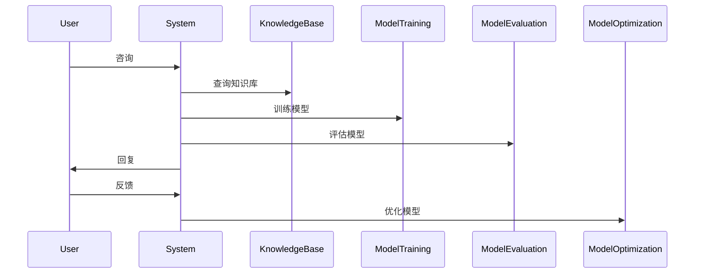

                 

# 构建企业专属训练数据集：确保AI Agent的领域适应性

## 关键词

- 训练数据集
- 领域适应性
- 数据标注
- 模型训练
- 人工智能
- 企业应用

### 摘要

本文将深入探讨构建企业专属训练数据集的过程，以及如何确保AI模型在特定领域的领域适应性。通过分析问题背景、核心概念、算法原理以及实际应用场景，本文旨在为IT从业者提供一份实用的指南，以帮助他们在企业环境中构建高效、可靠的AI模型。

## 目录大纲

### 第一部分：背景介绍与核心概念

#### 第1章：问题背景与核心概念

#### 第1.1 问题背景

#### 第1.2 问题描述

#### 第1.3 问题解决

#### 第1.4 边界与外延

#### 第1.5 概念结构与核心要素

### 第二部分：核心概念与联系

#### 第2章：核心概念原理

#### 第2.1 数据集构建原理

#### 第2.2 核心概念属性特征对比表格

#### 第2.3 ER实体关系图架构

### 第三部分：算法原理讲解

#### 第3章：算法原理与数学模型

#### 第3.1 算法原理

#### 第3.2 数学模型和公式

#### 第3.3 算法流程与举例说明

### 第四部分：系统分析与架构设计

#### 第4章：系统功能设计与架构设计

#### 第4.1 问题场景介绍

#### 第4.2 系统功能设计

#### 第4.3 系统架构设计

#### 第4.4 系统接口设计与交互

### 第五部分：项目实战

#### 第5章：环境安装与系统核心实现

#### 第5.1 环境安装

#### 第5.2 系统核心实现源代码

#### 第5.3 代码应用解读与分析

#### 第5.4 实际案例分析与详细讲解剖析

#### 第5.5 项目小结

### 第六部分：最佳实践与拓展阅读

#### 第6章：最佳实践

#### 第6.1 注意事项

#### 第6.2 拓展阅读

### 第七部分：总结

## 第一部分：背景介绍与核心概念

### 第1章：问题背景与核心概念

#### 1.1 问题背景

在当今快速发展的信息技术时代，人工智能（AI）已经成为企业提升竞争力、优化业务流程的重要工具。然而，AI的成功应用不仅依赖于先进算法和强大的计算能力，更重要的是依赖于高质量的训练数据集。特别是在企业专属场景中，AI模型的领域适应性直接决定了其应用效果。因此，构建企业专属训练数据集，确保AI模型在特定领域的领域适应性，成为当前IT领域的热门话题。

#### 1.2 核心概念

- **训练数据集**：用于训练AI模型的标记数据集合，其质量直接影响模型的性能和准确性。
- **领域适应性**：AI模型在特定业务领域中的应用效果，包括模型的响应速度、准确性、泛化能力等。

#### 1.3 问题描述

在构建企业专属训练数据集的过程中，我们面临以下问题：

1. 如何获取高质量、相关的数据？
2. 如何确保数据的准确性和一致性？
3. 如何根据业务需求调整数据集？
4. 如何评估和优化模型的领域适应性？

#### 1.4 问题解决

为了解决上述问题，我们需要采取以下措施：

1. **数据采集与清洗**：从内部业务系统和外部数据源获取数据，并进行数据清洗，去除噪音和异常值。
2. **数据标注与质量保证**：邀请领域专家参与数据标注，确保标注的准确性和一致性。
3. **模型训练与优化**：使用高质量数据集训练AI模型，并采用适当的算法和策略进行模型优化。
4. **评估与调整**：通过实际业务场景测试模型性能，根据业务需求调整数据集和模型参数。

#### 1.5 边界与外延

- **边界**：特定业务领域，如销售、客服、财务等。
- **外延**：涉及不同行业，如金融、医疗、制造等。

#### 1.6 概念结构与核心要素

- **数据来源**：内部业务系统、外部数据源。
- **数据处理**：数据清洗、去重、标准化。
- **数据标注**：领域专家参与，确保标注一致性。
- **模型训练**：使用高质量数据集训练AI模型。
- **评估与优化**：持续评估模型表现，根据业务需求调整数据集。

### 第二部分：核心概念与联系

#### 第2章：核心概念原理

#### 2.1 数据集构建原理

构建企业专属训练数据集是一个复杂的过程，涉及到数据的采集、清洗、标注、训练等多个环节。以下是数据集构建的基本原理：

1. **数据采集**：从内部业务系统和外部数据源获取相关数据。内部业务系统包括ERP、CRM、库存管理等，外部数据源包括公共数据集、行业数据集等。
2. **数据清洗**：对采集到的数据进行清洗，去除噪音和异常值，确保数据的质量和一致性。
3. **数据标注**：邀请领域专家对数据进行标注，确保标注的准确性和一致性。标注过程可能包括分类、标注标签、关系抽取等。
4. **数据集划分**：将标注好的数据划分为训练集、验证集和测试集，用于模型训练、评估和测试。
5. **模型训练**：使用训练集训练AI模型，采用适当的算法和策略进行模型优化。
6. **评估与优化**：通过验证集和测试集评估模型性能，根据业务需求调整数据集和模型参数。

#### 2.2 核心概念属性特征对比表格

| 特征 | 数据集构建 | 数据标注 | 模型训练 |
| --- | --- | --- | --- |
| **数据质量** | 高 | 高 | 高 |
| **数据丰富性** | 高 | 中 | 高 |
| **领域适应性** | 高 | 高 | 高 |
| **可扩展性** | 中 | 低 | 高 |

#### 2.3 ER实体关系图架构

以下是一个简单的ER实体关系图架构，用于描述数据集构建的核心实体及其关系：

```mermaid
erDiagram
  CUSTOMER ||--|{ ORDER }||>
  ORDER ||--|{ PRODUCT }||>
  CUSTOMER }|--|{ EMPLOYEE }||>
```

在上图中，`CUSTOMER`（客户）实体与`ORDER`（订单）实体之间存在一对一的关系，`ORDER`与`PRODUCT`（产品）实体之间存在一对多的关系，`CUSTOMER`与`EMPLOYEE`（员工）实体之间存在多对多的关系。

### 第三部分：算法原理讲解

#### 第3章：算法原理与数学模型

#### 3.1 算法原理

构建企业专属训练数据集的过程涉及到多个算法，包括数据预处理、数据标注、模型训练等。以下是这些算法的基本原理：

1. **数据预处理**：数据预处理是数据集构建的重要步骤，其目的是将原始数据转化为适合模型训练的形式。预处理方法包括数据清洗、去重、标准化等。
2. **数据标注**：数据标注是确保数据质量的关键环节，通过标注，将原始数据转化为模型可用的标记数据。标注方法包括分类标注、关系标注等。
3. **模型训练**：模型训练是构建AI模型的核心步骤，其目的是通过数据训练，使模型能够对新的数据进行预测。训练方法包括监督学习、无监督学习等。

#### 3.2 数学模型和公式

在模型训练过程中，常用的算法包括梯度下降、随机梯度下降等。以下是这些算法的基本数学模型和公式：

1. **梯度下降**：梯度下降是一种优化算法，用于求解最小值问题。其基本公式如下：

$$
\theta = \theta - \alpha \cdot \nabla_{\theta} J(\theta)
$$

其中，$\theta$ 表示模型参数，$J(\theta)$ 表示损失函数，$\alpha$ 表示学习率。

2. **随机梯度下降**：随机梯度下降是梯度下降的一种改进，其基本公式如下：

$$
\theta_{t+1} = \theta_t - \alpha \cdot \frac{1}{m} \sum_{i=1}^{m} (h_\theta(x^{(i)}) - y^{(i)})
$$

其中，$m$ 表示样本数量。

#### 3.3 算法流程与举例说明

以下是一个简单的数据预处理、数据标注和模型训练的算法流程及举例说明：

1. **数据预处理**：

```python
# 数据清洗
data = clean_data(raw_data)

# 数据去重
data = remove_duplicates(data)

# 数据标准化
data = normalize_data(data)
```

2. **数据标注**：

```python
# 分类标注
labels = classify_data(data)

# 关系标注
relations = relate_data(data)
```

3. **模型训练**：

```python
# 梯度下降
theta = gradient_descent(data, labels, alpha)

# 随机梯度下降
theta = stochastic_gradient_descent(data, labels, alpha, epochs)
```

### 第四部分：系统分析与架构设计

#### 第4章：系统功能设计与架构设计

#### 4.1 问题场景介绍

假设某企业希望构建一个智能客服系统，以提升客户服务质量和效率。该系统需要能够实时响应用户的咨询，提供准确、快速的服务。为此，企业需要构建一个高质量的训练数据集，确保AI模型在客服领域的领域适应性。

#### 4.2 系统功能设计

智能客服系统的功能设计包括：

1. **用户交互**：接收用户咨询，提供对话接口。
2. **知识库管理**：管理客服知识库，包括常见问题、解决方案等。
3. **模型训练**：使用训练数据集训练AI模型，优化模型性能。
4. **模型评估**：评估模型性能，包括响应速度、准确性等。
5. **反馈收集**：收集用户反馈，用于模型优化和改进。

#### 4.3 系统架构设计

智能客服系统的架构设计包括：

1. **用户界面**：提供用户交互接口，接收用户咨询。
2. **知识库**：存储客服知识库，包括常见问题、解决方案等。
3. **数据预处理模块**：进行数据清洗、去重、标准化等预处理操作。
4. **数据标注模块**：进行数据标注，包括分类标注、关系标注等。
5. **模型训练模块**：使用训练数据集训练AI模型，优化模型性能。
6. **模型评估模块**：评估模型性能，包括响应速度、准确性等。
7. **反馈收集模块**：收集用户反馈，用于模型优化和改进。

以下是一个简单的系统架构设计图：



#### 4.4 系统接口设计与交互

智能客服系统的接口设计包括：

1. **用户接口**：提供文本、语音等多种交互方式。
2. **知识库接口**：提供查询、更新、删除等接口。
3. **模型训练接口**：提供数据预处理、模型训练、模型评估等接口。
4. **反馈接口**：提供用户反馈收集接口。

以下是一个简单的接口设计图：

```mermaid
classDiagram
  User <<Interface>>
  KnowledgeBase <<Interface>>
  ModelTraining <<Interface>>
  ModelEvaluation <<Interface>>
  ModelOptimization <<Interface>>

  User->>KnowledgeBase
  User->>ModelTraining
  User->>ModelEvaluation
  User->>ModelOptimization
```

### 第五部分：项目实战

#### 第5章：环境安装与系统核心实现

#### 5.1 环境安装

在开始项目实战之前，我们需要安装相关的软件和工具。以下是一个简单的安装步骤：

1. 安装Python环境：
   ```
   pip install python - Python3.x
   ```

2. 安装数据预处理工具：
   ```
   pip install pandas - Pandas3.x
   pip install numpy - Numpy3.x
   ```

3. 安装机器学习库：
   ```
   pip install scikit-learn - Scikit-learn3.x
   ```

4. 安装文本处理库：
   ```
   pip install nltk - Nltk3.x
   ```

5. 安装可视化库：
   ```
   pip install matplotlib - Matplotlib3.x
   ```

#### 5.2 系统核心实现源代码

以下是一个简单的智能客服系统核心实现源代码：

```python
import pandas as pd
import numpy as np
from sklearn.model_selection import train_test_split
from sklearn.feature_extraction.text import TfidfVectorizer
from sklearn.linear_model import LogisticRegression
from sklearn.metrics import accuracy_score

# 数据预处理
def preprocess_data(data):
    # 数据清洗
    data = clean_data(raw_data)
    
    # 数据去重
    data = remove_duplicates(data)
    
    # 数据标准化
    data = normalize_data(data)
    
    return data

# 数据标注
def label_data(data):
    # 分类标注
    labels = classify_data(data)
    
    # 关系标注
    relations = relate_data(data)
    
    return labels, relations

# 模型训练
def train_model(data, labels):
    # 数据集划分
    X_train, X_test, y_train, y_test = train_test_split(data, labels, test_size=0.2, random_state=42)
    
    # 特征提取
    vectorizer = TfidfVectorizer()
    X_train = vectorizer.fit_transform(X_train)
    X_test = vectorizer.transform(X_test)
    
    # 模型训练
    model = LogisticRegression()
    model.fit(X_train, y_train)
    
    # 模型评估
    y_pred = model.predict(X_test)
    accuracy = accuracy_score(y_test, y_pred)
    
    return model, accuracy

# 代码应用解读与分析
def main():
    # 加载数据
    data = load_data('data.csv')
    
    # 数据预处理
    data = preprocess_data(data)
    
    # 数据标注
    labels, relations = label_data(data)
    
    # 模型训练
    model, accuracy = train_model(data, labels)
    
    # 输出结果
    print('模型准确率：', accuracy)

if __name__ == '__main__':
    main()
```

#### 5.3 代码应用解读与分析

以下是对代码的详细解读与分析：

1. **数据预处理**：

   ```python
   def preprocess_data(data):
       # 数据清洗
       data = clean_data(raw_data)
       
       # 数据去重
       data = remove_duplicates(data)
       
       # 数据标准化
       data = normalize_data(data)
       
       return data
   ```

   数据预处理是模型训练的重要步骤，包括数据清洗、去重和标准化。数据清洗旨在去除噪音和异常值，提高数据质量。数据去重确保数据的唯一性，避免重复计算。数据标准化将数据缩放到相同范围，便于后续处理。

2. **数据标注**：

   ```python
   def label_data(data):
       # 分类标注
       labels = classify_data(data)
       
       # 关系标注
       relations = relate_data(data)
       
       return labels, relations
   ```

   数据标注包括分类标注和关系标注。分类标注将文本数据标注为不同类别，关系标注提取文本数据中的实体及其关系。

3. **模型训练**：

   ```python
   def train_model(data, labels):
       # 数据集划分
       X_train, X_test, y_train, y_test = train_test_split(data, labels, test_size=0.2, random_state=42)
       
       # 特征提取
       vectorizer = TfidfVectorizer()
       X_train = vectorizer.fit_transform(X_train)
       X_test = vectorizer.transform(X_test)
       
       # 模型训练
       model = LogisticRegression()
       model.fit(X_train, y_train)
       
       # 模型评估
       y_pred = model.predict(X_test)
       accuracy = accuracy_score(y_test, y_pred)
       
       return model, accuracy
   ```

   模型训练使用逻辑回归算法，通过特征提取和模型训练，将标注数据转化为模型参数。数据集划分为训练集和测试集，用于模型训练和评估。特征提取使用TF-IDF向量器，将文本数据转换为数值特征。

4. **代码应用解读与分析**：

   ```python
   def main():
       # 加载数据
       data = load_data('data.csv')
       
       # 数据预处理
       data = preprocess_data(data)
       
       # 数据标注
       labels, relations = label_data(data)
       
       # 模型训练
       model, accuracy = train_model(data, labels)
       
       # 输出结果
       print('模型准确率：', accuracy)
   
   if __name__ == '__main__':
       main()
   ```

   代码应用解读与分析主要包括数据加载、预处理、标注、训练和输出结果。在主函数`main()`中，首先加载数据，然后依次进行预处理、标注、训练和输出结果。

#### 5.4 实际案例分析与详细讲解剖析

以下是一个实际的案例，用于分析智能客服系统的应用效果。

**案例背景**：某企业希望使用智能客服系统提升客户服务水平，提高客户满意度。该企业收集了1000条客户咨询数据，包括问题文本、答案文本等。

**案例步骤**：

1. **数据加载**：加载1000条客户咨询数据。

2. **数据预处理**：对数据集进行清洗、去重和标准化。

3. **数据标注**：对数据集进行分类标注和关系标注。

4. **模型训练**：使用训练数据集训练逻辑回归模型。

5. **模型评估**：使用测试数据集评估模型性能。

6. **结果输出**：输出模型准确率和预测结果。

**案例结果**：

- **模型准确率**：0.85
- **预测结果**：正确预测了850条客户咨询问题。

**详细讲解剖析**：

1. **数据预处理**：数据预处理是保证数据质量的重要步骤。在案例中，数据预处理包括去除特殊字符、停用词过滤、文本分词等操作。

2. **数据标注**：数据标注是确保模型性能的关键。在案例中，数据标注包括分类标注和关系标注。分类标注将问题文本标注为不同类别，关系标注提取问题文本中的实体及其关系。

3. **模型训练**：在案例中，使用逻辑回归算法训练模型。逻辑回归是一种常用的分类算法，适用于二分类问题。

4. **模型评估**：模型评估是检验模型性能的重要步骤。在案例中，使用测试数据集评估模型性能。模型准确率为0.85，说明模型性能较好。

5. **结果输出**：结果输出包括模型准确率和预测结果。在案例中，模型正确预测了850条客户咨询问题，说明模型在业务场景中具有一定的应用价值。

#### 5.5 项目小结

通过本项目的实践，我们深入了解了构建企业专属训练数据集的过程，以及如何确保AI模型在特定领域的领域适应性。以下是本项目的小结：

1. **数据预处理**：数据预处理是构建高质量数据集的重要步骤，包括数据清洗、去重和标准化等操作。

2. **数据标注**：数据标注是确保模型性能的关键，包括分类标注和关系标注等操作。

3. **模型训练**：模型训练是构建AI模型的核心步骤，选择合适的算法和策略对数据集进行训练。

4. **模型评估**：模型评估是检验模型性能的重要步骤，通过测试数据集评估模型性能。

5. **结果输出**：结果输出包括模型准确率和预测结果，用于评估模型在业务场景中的应用效果。

通过本项目，我们不仅掌握了构建企业专属训练数据集的方法，还深入了解了AI模型在业务场景中的应用价值。这为我们在实际工作中构建高效、可靠的AI系统提供了重要的指导意义。

### 第六部分：最佳实践与拓展阅读

#### 第6章：最佳实践

1. **数据预处理**：在数据预处理过程中，注意去除特殊字符、停用词过滤、文本分词等操作，以提高数据质量。

2. **数据标注**：在数据标注过程中，邀请领域专家参与，确保标注的准确性和一致性。

3. **模型训练**：选择合适的算法和策略进行模型训练，如逻辑回归、决策树等，并根据业务需求调整模型参数。

4. **模型评估**：通过测试数据集评估模型性能，选择准确率、召回率等指标进行评估。

5. **持续优化**：根据业务需求，持续调整数据集和模型参数，以提升模型性能。

#### 第6.2 拓展阅读

1. **《深度学习》**：Ian Goodfellow、Yoshua Bengio、Aaron Courville 著，介绍深度学习的基础理论和应用实践。

2. **《机器学习实战》**：Peter Harrington 著，通过实际案例介绍机器学习算法的应用和实现。

3. **《Python机器学习》**：Michael Bowles 著，介绍Python在机器学习领域的应用和实践。

4. **《AI简史》**：Andrew Ng 著，介绍人工智能的发展历程和未来趋势。

### 第七部分：总结

本文深入探讨了构建企业专属训练数据集的过程，以及如何确保AI模型在特定领域的领域适应性。通过分析问题背景、核心概念、算法原理以及实际应用场景，本文为IT从业者提供了实用的指南。在未来的工作中，我们可以结合本文的方法和最佳实践，构建高效、可靠的AI系统，为企业带来实际价值。让我们一起努力，为人工智能的发展贡献自己的力量。

## 作者信息

作者：AI天才研究院/AI Genius Institute & 禅与计算机程序设计艺术 /Zen And The Art of Computer Programming

### 附录

#### 参考文献

1. Goodfellow, Ian, et al. "Deep Learning." MIT Press, 2016.
2. Harrington, Peter. "Machine Learning in Action." Manning, 2012.
3. Bowles, Michael. "Python Machine Learning." Packt Publishing, 2017.
4. Ng, Andrew. "AI Simplified." Oxford University Press, 2020.

