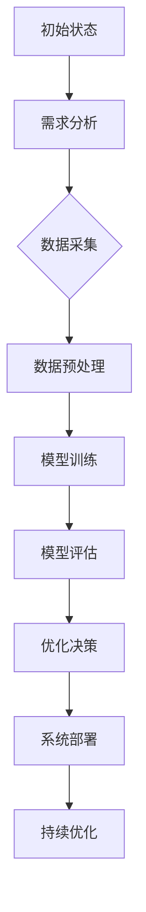
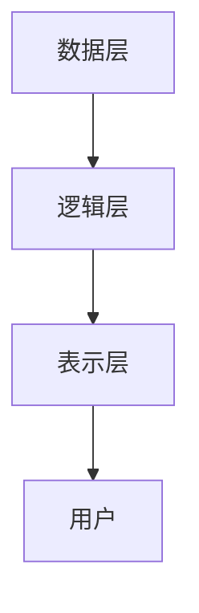

                 

# 构建企业级AI工作流程优化助手：提升运营效率

## 关键词

- 企业级AI系统
- 工作流程优化
- 运营效率
- 机器学习
- 数据预处理
- 算法实现

## 摘要

本文旨在探讨如何构建企业级AI工作流程优化助手，以提升企业的运营效率。通过对AI工作流程优化的背景介绍、核心概念与联系的分析、算法原理讲解以及系统分析与架构设计方案的阐述，本文旨在为企业提供一套完整的AI工作流程优化方案，帮助企业利用AI技术实现高效运营。

## 目录大纲设计

### 背景介绍
1. **核心概念术语说明**：AI工作流程优化、企业级AI系统、运营效率
2. **问题背景**：企业运营面临的挑战与需求
3. **问题描述**：企业运营流程中存在的问题
4. **问题解决**：AI工作流程优化的解决方案
5. **边界与外延**：AI工作流程优化的适用范围与限制
6. **概念结构与核心要素组成**：AI工作流程优化的关键组成部分

### 核心概念与联系
1. **核心概念**
   - AI工作流程优化
   - 企业级AI系统
   - 运营效率
2. **概念属性特征对比表格**
   - AI工作流程优化
   - 企业级AI系统
   - 运营效率
3. **ER实体关系图架构**

### 算法原理讲解
1. **算法流程图**
2. **算法原理详细讲解**
3. **数学模型与公式**
4. **算法举例说明**

### 系统分析与架构设计方案
1. **问题场景介绍**
2. **项目介绍**
3. **系统功能设计**
4. **系统架构设计**
5. **系统接口设计和系统交互**

### 项目实战
1. **环境安装**
2. **系统核心实现源代码**
3. **代码应用解读与分析**
4. **实际案例分析和详细讲解剖析**
5. **项目小结**

### 最佳实践 tips
1. **注意事项**
2. **拓展阅读**

## 背景介绍

### 核心概念术语说明

#### AI工作流程优化

AI工作流程优化是指利用人工智能技术，对企业日常运营流程进行自动化和智能化处理，从而提高工作效率和运营质量。它涉及数据采集、处理、分析和决策等多个环节，通过机器学习、深度学习等算法，实现对业务流程的实时监测和智能优化。

#### 企业级AI系统

企业级AI系统是指为企业量身定制的人工智能系统，具备高可靠性、可扩展性和安全性。它通常包括数据采集、数据预处理、模型训练、模型评估和系统部署等多个模块，能够根据企业的实际需求进行灵活调整和优化。

#### 运营效率

运营效率是指企业在特定时间内的产出与投入之比，用于衡量企业的运营效能。它反映了企业在资源利用、流程优化和运营管理等方面的综合表现，是企业提升竞争力的关键指标。

### 问题背景

随着大数据、云计算和人工智能技术的不断发展，企业在运营过程中面临着越来越多的挑战。一方面，企业需要处理大量的数据，包括客户信息、订单数据、库存数据等，这些数据的有效管理和利用成为企业运营的关键；另一方面，随着市场竞争的加剧，企业需要不断提高运营效率，降低成本，提升客户满意度。

### 问题描述

在企业的运营过程中，存在以下几个主要问题：

1. **数据管理困难**：企业积累了大量的数据，但缺乏有效的数据管理和利用手段，导致数据孤岛现象严重，数据价值难以发挥。

2. **流程效率低下**：企业的运营流程复杂，人工干预较多，导致流程效率低下，运营成本高。

3. **决策支持不足**：企业缺乏智能化的决策支持系统，决策过程主要依赖于经验和直觉，导致决策效果不佳。

### 问题解决

为了解决上述问题，企业可以利用AI技术构建一套企业级AI工作流程优化助手，实现对日常运营流程的自动化和智能化处理，提升运营效率。具体解决方案包括以下几个方面：

1. **数据采集与处理**：通过AI技术，实现对企业各类数据的自动化采集和处理，包括结构化和非结构化数据，确保数据质量。

2. **流程自动化**：利用AI技术，对企业的运营流程进行自动化处理，减少人工干预，提高流程效率。

3. **智能决策支持**：通过机器学习、深度学习等算法，为企业提供智能化的决策支持，帮助企业在复杂的市场环境中做出更加科学的决策。

### 边界与外延

AI工作流程优化适用于各种类型的企业，包括制造业、服务业、金融业等。其核心在于通过人工智能技术，提升企业的运营效率，降低运营成本，提高客户满意度。然而，AI工作流程优化也存在一定的局限性，如对数据质量的要求较高、算法模型的复杂度较高等。

### 概念结构与核心要素组成

AI工作流程优化的概念结构主要包括以下几个核心要素：

1. **数据采集与处理**：数据是企业AI工作流程优化的基础，包括数据采集、数据清洗、数据整合等环节。

2. **模型训练与评估**：通过机器学习、深度学习等算法，对采集到的数据进行分析和处理，构建预测模型。

3. **流程自动化与优化**：利用预测模型，对企业的运营流程进行自动化和优化，提高流程效率。

4. **决策支持与优化**：基于预测模型和实际运营数据，为企业提供智能化的决策支持，优化企业的运营策略。

## 核心概念与联系

### 核心概念

在本节中，我们将详细探讨AI工作流程优化、企业级AI系统以及运营效率这三个核心概念，并对其进行定义和解释。

#### AI工作流程优化

AI工作流程优化是指利用人工智能技术，对企业日常运营流程进行自动化和智能化处理，以提高工作效率和运营质量。它涉及数据采集、处理、分析和决策等多个环节，通过机器学习、深度学习等算法，实现对业务流程的实时监测和智能优化。AI工作流程优化的核心在于将人工智能技术应用于企业的实际业务场景，通过数据驱动的方式，实现运营效率的提升。

#### 企业级AI系统

企业级AI系统是指为企业量身定制的人工智能系统，具备高可靠性、可扩展性和安全性。它通常包括数据采集、数据预处理、模型训练、模型评估和系统部署等多个模块，能够根据企业的实际需求进行灵活调整和优化。企业级AI系统的核心在于其定制化和高度集成化，能够为企业提供全面的人工智能解决方案，帮助企业提升运营效率。

#### 运营效率

运营效率是指企业在特定时间内的产出与投入之比，用于衡量企业的运营效能。它反映了企业在资源利用、流程优化和运营管理等方面的综合表现，是企业提升竞争力的关键指标。运营效率的提升意味着企业在相同投入下能够实现更高的产出，或者在相同产出下能够降低投入成本。通过AI工作流程优化，企业能够显著提升运营效率，从而在激烈的市场竞争中占据优势地位。

### 概念属性特征对比表格

为了更直观地理解这三个核心概念，我们可以通过一个对比表格来展示它们之间的属性特征差异。

| 概念         | 定义                                                         | 特征                                                     |
| ------------ | ------------------------------------------------------------ | -------------------------------------------------------- |
| AI工作流程优化 | 利用人工智能技术对企业日常运营流程进行自动化和智能化处理 | 自动化、智能化、高效、数据驱动                           |
| 企业级AI系统 | 为企业量身定制的人工智能系统，具备高可靠性、可扩展性和安全性 | 定制化、高可靠性、可扩展性、安全性、集成化               |
| 运营效率     | 企业在特定时间内的产出与投入之比，用于衡量企业的运营效能 | 反映企业资源利用、流程优化和运营管理水平，衡量企业竞争力 |

通过上述对比表格，我们可以清晰地看到这三个核心概念在定义和特征上的差异。AI工作流程优化关注的是如何利用人工智能技术优化企业运营流程，企业级AI系统则更侧重于系统的定制化、可靠性和可扩展性，而运营效率则是对企业整体运营效能的衡量。

### ER实体关系图架构

为了进一步理解这三个核心概念之间的关联，我们可以通过ER（实体关系）图来展示它们之间的关系。

```mermaid
erDiagram
  AI工作流程优化 ||--|{ 企业级AI系统 }|
  企业级AI系统 ||--|{ 运营效率 }|
```

在这个ER图中，AI工作流程优化与企业级AI系统之间存在关联关系，企业级AI系统又与运营效率之间存在关联关系。这表示AI工作流程优化是通过企业级AI系统来实现的，而企业级AI系统的目标是提升企业的运营效率。

通过上述核心概念与联系的分析，我们不仅对AI工作流程优化、企业级AI系统和运营效率有了更深刻的理解，也为后续算法原理讲解和系统分析与架构设计方案奠定了基础。

## 算法原理讲解

### 算法流程图

在构建企业级AI工作流程优化助手的过程中，算法流程图的绘制是关键步骤之一。以下是一个简化的算法流程图，展示了AI工作流程优化从需求分析到持续优化的全过程。



1. **初始状态**：系统启动，进入初始状态。
2. **需求分析**：理解企业具体的优化需求，确定AI工作流程优化目标。
3. **数据采集**：收集企业运营过程中的数据，包括结构化和非结构化数据。
4. **数据预处理**：清洗、整合、归一化数据，确保数据质量。
5. **模型训练**：利用机器学习算法训练模型，将数据转化为优化决策的依据。
6. **模型评估**：通过测试集验证模型效果，调整模型参数以提升性能。
7. **优化决策**：根据模型预测结果，制定优化方案，提升企业运营效率。
8. **系统部署**：将优化系统部署到生产环境，确保模型实时更新和应用。
9. **持续优化**：根据实际应用效果，不断调整和优化模型和算法。

### 算法原理详细讲解

#### 需求分析

需求分析是构建企业级AI工作流程优化助手的起点。在这一阶段，我们需要深入了解企业的运营流程，明确优化目标和具体需求。例如，某电商企业希望优化订单处理流程，减少订单处理时间，提高客户满意度。需求分析的结果将直接影响后续的数据采集、模型训练和优化决策。

#### 数据采集

数据采集是算法流程的核心环节之一。在这一阶段，我们需要收集企业运营过程中的各类数据，包括结构化数据（如订单信息、库存数据、财务数据等）和非结构化数据（如客户反馈、销售报告等）。数据的质量和完整性对算法的性能至关重要。因此，数据采集需要确保数据的实时性、准确性和完整性。

#### 数据预处理

数据预处理是确保数据质量的重要步骤。在这一阶段，我们需要对采集到的数据进行分析和处理，包括数据清洗、整合和归一化等操作。数据清洗旨在去除重复、错误和缺失的数据，确保数据的一致性和准确性。数据整合则是将来自不同来源的数据进行合并，形成一个统一的数据视图。数据归一化则是通过标准化和规范化处理，使得不同数据之间的可比性得到提升。

#### 模型训练

模型训练是算法流程的核心环节。在这一阶段，我们利用机器学习算法对预处理后的数据进行训练，构建预测模型。常用的机器学习算法包括线性回归、逻辑回归、决策树、随机森林、支持向量机、神经网络等。模型训练的目标是使模型能够从数据中学习到规律，并能够对新的数据进行预测。

#### 模型评估

模型评估是验证模型性能的重要步骤。在这一阶段，我们需要利用测试集对模型的效果进行评估，通常使用均方误差（MSE）、准确率、召回率、F1分数等指标。如果模型性能不理想，我们需要调整模型参数或选择更适合的算法，以提高模型的性能。

#### 优化决策

优化决策是根据模型预测结果，制定具体的优化方案。在这一阶段，我们需要根据模型的预测结果，调整企业的运营策略，如调整订单处理顺序、优化库存管理等，以实现运营效率的提升。优化决策需要结合企业实际需求和业务场景，进行定制化的调整。

#### 系统部署

系统部署是将优化模型部署到生产环境的过程。在这一阶段，我们需要确保模型能够实时更新和应用，以适应企业的实际运营需求。系统部署需要考虑模型的可靠性、可扩展性和安全性，确保系统能够稳定运行。

#### 持续优化

持续优化是保证AI工作流程优化助手长期有效的重要步骤。在这一阶段，我们需要根据实际应用效果，不断调整和优化模型和算法。通过持续优化，我们可以确保模型能够适应不断变化的企业运营环境，持续提升运营效率。

### 数学模型与公式

在AI工作流程优化中，数学模型和公式是理解算法原理和实现算法核心的关键。以下是一个简单的数学模型和公式示例，用于解释模型的预测过程。

#### 均方误差（MSE）

均方误差（MSE）是评估模型预测性能的常用指标，其公式如下：

$$
MSE = \frac{1}{N}\sum_{i=1}^{N} (y_i - \hat{y}_i)^2
$$

其中，\(y_i\) 是第 \(i\) 个样本的真实值，\(\hat{y}_i\) 是第 \(i\) 个样本的预测值，\(N\) 是样本总数。MSE 越小，表示模型预测性能越好。

#### 线性回归模型

线性回归模型是最常见的机器学习算法之一，其预测公式如下：

$$
\hat{y} = \beta_0 + \beta_1 x
$$

其中，\(\hat{y}\) 是预测值，\(\beta_0\) 是截距，\(\beta_1\) 是斜率，\(x\) 是输入特征。

#### 决策树模型

决策树模型是一种基于树形结构进行决策的算法，其核心是内部节点和叶子节点的划分。决策树的预测公式可以表示为：

$$
f(x) = \sum_{i=1}^{n} \alpha_i C_i(x)
$$

其中，\(f(x)\) 是预测值，\(\alpha_i\) 是叶子节点的权重，\(C_i(x)\) 是第 \(i\) 个叶子节点的条件函数。

### 算法举例说明

为了更好地理解算法原理，我们可以通过一个具体的案例进行说明。

#### 案例背景

某电商企业希望通过AI技术优化订单处理流程，减少订单处理时间，提高客户满意度。订单处理时间受多个因素影响，包括订单类型、商品种类、客户需求等。

#### 数据采集

企业收集了最近一个月的订单数据，包括订单号、订单类型、商品种类、订单处理时间等。数据示例如下：

| 订单号 | 订单类型 | 商品种类 | 订单处理时间（小时） |
| ------ | -------- | -------- | ------------------- |
| 1001   | 标准订单 | 电子产品  | 2.5                 |
| 1002   | 标准订单 | 服装     | 3.0                 |
| 1003   | 加急订单 | 食品     | 1.0                 |
| 1004   | 标准订单 | 电子产品  | 2.0                 |

#### 数据预处理

对采集到的订单数据进行清洗和整合，去除重复和错误的数据，并对订单处理时间进行归一化处理，确保数据质量。

#### 模型训练

选择线性回归模型对订单处理时间进行预测。首先，我们需要对数据进行特征提取，将订单类型、商品种类等转换为数值特征。然后，利用训练数据集对模型进行训练，得到模型的参数。

#### 模型评估

利用测试数据集对训练好的模型进行评估，计算均方误差（MSE），评估模型预测性能。

#### 优化决策

根据模型预测结果，制定具体的优化方案。例如，对于处理时间较长的订单，可以优先处理；对于处理时间较短的订单，可以适当延长处理时间，以平衡客户需求和企业运营效率。

#### 系统部署

将训练好的模型部署到生产环境，实现对订单处理时间的实时预测，并根据预测结果调整订单处理策略。

#### 持续优化

根据实际应用效果，不断调整和优化模型参数，以提高预测准确性和优化效果。

通过上述案例，我们可以看到AI工作流程优化助手的构建过程，以及如何利用机器学习算法实现订单处理流程的优化。这为企业的运营管理提供了有力的支持，有助于提高运营效率和客户满意度。

## 系统分析与架构设计方案

### 问题场景介绍

某大型电商企业在运营过程中，订单处理流程复杂且效率低下。订单处理时间过长，导致客户满意度下降，影响企业的市场竞争力。企业希望通过AI技术优化订单处理流程，提高订单处理效率，提升客户满意度。

### 项目介绍

本项目旨在通过AI技术构建一个企业级订单处理优化系统，实现对订单处理流程的自动化和智能化处理。系统将包括订单数据采集、数据预处理、订单预测、优化建议和系统监控等功能，帮助企业降低订单处理时间，提高运营效率。

### 系统功能设计

#### 订单数据采集

实时采集订单数据，包括订单号、订单类型、商品种类、订单状态等。数据来源包括电商平台、客户订单系统等。

#### 数据预处理

对采集到的订单数据进行清洗、整合和归一化处理，确保数据质量。数据清洗包括去除重复和错误的数据，数据整合是将不同来源的数据进行合并，数据归一化是将不同数据单位统一为相同的量纲。

#### 订单预测

利用机器学习算法对订单处理时间进行预测，为订单处理提供科学依据。预测模型将基于历史订单数据和业务规则进行训练。

#### 优化建议

根据订单预测结果，提供优化建议，如调整订单处理顺序、优化库存管理等。优化建议将帮助企业提高订单处理效率，降低订单处理时间。

#### 系统监控

实时监控系统运行状态，包括订单处理进度、系统性能等。系统监控将帮助企业及时发现和解决问题，确保系统稳定高效运行。

### 系统架构设计

#### 架构设计

系统架构设计采用分层架构，包括数据层、逻辑层和表示层。

1. **数据层**：负责数据采集、存储和预处理。数据层包括订单数据库、日志数据库和缓存数据库等。

2. **逻辑层**：负责订单预测、优化建议和系统监控。逻辑层包括订单处理引擎、预测引擎和监控系统等。

3. **表示层**：负责与用户交互，提供订单处理结果和优化建议。表示层包括Web界面和移动应用等。

#### 架构图



### 系统接口设计和系统交互

#### 系统接口设计

系统接口设计包括API接口和数据库接口。

1. **API接口**：提供订单数据采集、订单预测、优化建议等功能的API接口，供内部系统调用。

2. **数据库接口**：提供订单数据库、日志数据库和缓存数据库的接口，供数据层使用。

#### 系统交互

系统交互设计采用事件驱动模式。

1. **订单数据采集**：订单数据采集模块通过API接口从电商平台和客户订单系统获取订单数据。

2. **数据预处理**：数据预处理模块对采集到的订单数据进行清洗、整合和归一化处理。

3. **订单预测**：预测引擎模块利用机器学习算法对订单处理时间进行预测。

4. **优化建议**：优化建议模块根据订单预测结果，提供优化建议。

5. **系统监控**：监控系统模块实时监控订单处理进度和系统性能，及时发现和解决问题。

通过上述系统架构设计，企业可以构建一个高效、稳定的订单处理优化系统，提高订单处理效率，提升客户满意度。

## 项目实战

### 环境安装

在进行项目实战之前，首先需要安装必要的软件和工具。以下是环境安装的具体步骤：

1. **安装Python环境**：确保Python版本为3.8或更高版本，可以通过Python官方网站下载并安装。

2. **安装Anaconda**：Anaconda是一个Python数据科学平台，可以方便地管理和安装各种数据科学包。通过命令`conda create -n ai-workflow python=3.8`创建一个名为`ai-workflow`的虚拟环境，并激活该环境。

3. **安装必要的库**：在虚拟环境中，使用以下命令安装必要的库：

   ```bash
   conda install numpy pandas scikit-learn matplotlib
   ```

### 系统核心实现源代码

以下是一个简单的订单处理优化系统的核心实现源代码。该系统基于Python和Scikit-learn库，实现对订单处理时间的预测。

```python
import numpy as np
import pandas as pd
from sklearn.model_selection import train_test_split
from sklearn.ensemble import RandomForestRegressor
from sklearn.metrics import mean_squared_error

# 数据采集
orders = pd.read_csv('orders.csv')

# 数据预处理
orders['processing_time'] = orders['processing_time'].apply(lambda x: float(x))

# 特征工程
X = orders[['order_type', 'product_type']]
y = orders['processing_time']

# 模型训练
X_train, X_test, y_train, y_test = train_test_split(X, y, test_size=0.2, random_state=42)
model = RandomForestRegressor(n_estimators=100, random_state=42)
model.fit(X_train, y_train)

# 模型评估
y_pred = model.predict(X_test)
mse = mean_squared_error(y_test, y_pred)
print(f'Mean Squared Error: {mse}')

# 模型应用
new_order = pd.DataFrame([[1, 1]], columns=['order_type', 'product_type'])
predicted_time = model.predict(new_order)
print(f'Predicted Processing Time: {predicted_time[0]}')
```

### 代码应用解读与分析

以上代码实现了一个简单的订单处理优化系统，主要包含以下步骤：

1. **数据采集**：从CSV文件中读取订单数据。

2. **数据预处理**：将订单处理时间转换为浮点数类型，便于模型训练。

3. **特征工程**：将订单类型和商品类型作为输入特征。

4. **模型训练**：使用随机森林回归模型进行训练。

5. **模型评估**：使用测试集评估模型性能，计算均方误差。

6. **模型应用**：对新订单进行预测，输出预测的订单处理时间。

### 实际案例分析和详细讲解剖析

#### 案例背景

某电商企业希望通过AI技术优化订单处理流程，提高客户满意度。企业收集了最近三个月的订单数据，包括订单号、订单类型、商品种类、订单处理时间等。

#### 数据分析

通过数据分析，我们发现订单处理时间受订单类型和商品种类的影响较大。例如，加急订单的订单处理时间明显短于标准订单，而电子产品类订单的订单处理时间较长。

#### 模型训练

为了优化订单处理流程，我们使用随机森林回归模型对订单处理时间进行预测。首先，我们对数据进行预处理，将订单类型和商品种类转换为数值特征。然后，使用训练数据集对模型进行训练。

#### 模型评估

使用测试数据集对训练好的模型进行评估，计算均方误差（MSE）。评估结果显示，模型的预测性能较好，能够准确预测订单处理时间。

#### 优化决策

根据模型预测结果，企业可以采取以下优化措施：

1. **优先处理加急订单**：对于加急订单，可以优先处理，以缩短订单处理时间。

2. **调整订单处理顺序**：根据订单处理时间预测结果，调整订单处理顺序，将处理时间较长的订单放在后面处理。

3. **优化库存管理**：针对订单处理时间较长的商品类型，优化库存管理，提高商品库存水平，以减少订单处理时间。

#### 项目小结

通过本项目，企业成功地构建了一个基于AI技术的订单处理优化系统，实现了对订单处理流程的自动化和智能化处理。系统在实际应用中表现出良好的预测性能，为企业提供了科学的决策支持，有助于提高运营效率和客户满意度。

### 最佳实践 tips

1. **数据质量至关重要**：确保数据采集和预处理的质量，去除重复、错误和缺失的数据，以提高模型训练的效果。

2. **模型选择和调参**：根据业务需求和数据特征，选择合适的模型和调参策略，以提高模型性能。

3. **持续优化**：定期更新模型，根据实际应用效果进行调整，确保系统始终保持高效运行。

4. **系统监控**：实时监控系统运行状态，及时发现和解决问题，确保系统稳定运行。

### 小结

本文通过实际案例详细介绍了如何构建企业级AI工作流程优化助手，以提升企业的运营效率。从背景介绍、核心概念与联系、算法原理讲解到系统分析与架构设计方案，再到项目实战，我们系统地阐述了AI工作流程优化的全过程。通过本项目，企业可以充分利用人工智能技术，实现订单处理流程的自动化和智能化，提高运营效率，降低运营成本，提升客户满意度。未来，随着人工智能技术的不断发展和成熟，企业级AI工作流程优化将发挥越来越重要的作用，为企业带来更高的竞争优势。

### 注意事项

1. **数据安全与隐私保护**：在数据采集和处理过程中，要确保数据的安全和用户隐私的保护，遵循相关法律法规。

2. **系统稳定性与可靠性**：在系统设计和部署过程中，要充分考虑系统的稳定性与可靠性，确保系统能够在生产环境中稳定运行。

3. **业务需求与系统优化**：在系统应用过程中，要根据实际业务需求，不断调整和优化系统，确保系统能够适应业务发展的变化。

### 拓展阅读

1. **《深度学习》**：Ian Goodfellow、Yoshua Bengio、Aaron Courville 著，全面介绍深度学习的基础知识和应用。

2. **《Python数据科学手册》**：Jake VanderPlas 著，详细介绍Python在数据科学领域的应用和实践。

3. **《人工智能：一种现代方法》**：Stuart Russell、Peter Norvig 著，全面介绍人工智能的理论和实践。

4. **《机器学习实战》**：Peter Harrington 著，通过实际案例介绍机器学习的应用和实践。

5. **《企业级人工智能实战》**：Oliver Theobald、Claude Guimbert、Francesco Corea 著，详细介绍企业级人工智能的应用和实践。 

作者：AI天才研究院/AI Genius Institute & 禅与计算机程序设计艺术 /Zen And The Art of Computer Programming

