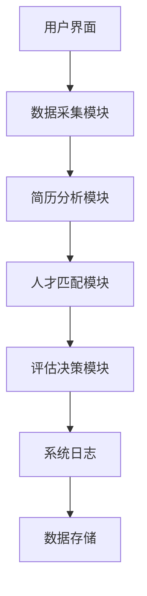
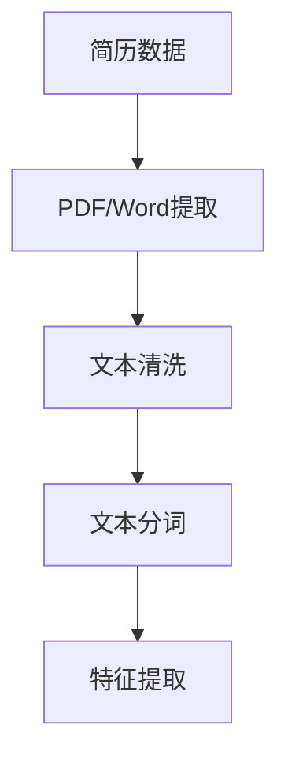

                 

### 第1章：企业级AI招聘助手概述

#### 1.1 招聘流程与痛点分析

招聘是企业发展的关键环节，然而传统的招聘流程却往往效率低下、成本高昂。传统的招聘流程包括职位发布、简历筛选、面试安排、评估决策等多个环节。然而，这些环节往往面临着诸多痛点：

- **职位发布**：企业需要通过各种渠道发布职位，但招聘渠道有限，覆盖范围有限。
- **简历筛选**：简历数量庞大，人工筛选效率低，容易漏掉优秀人才。
- **面试安排**：面试流程繁琐，安排时间不灵活，导致面试和候选人双方时间浪费。
- **评估决策**：面试官主观判断强，评估标准不一致，导致决策过程复杂。

#### 1.2 AI招聘的优势

随着人工智能技术的发展，企业级AI招聘助手应运而生。AI招聘助手通过机器学习和自然语言处理技术，可以大大提高招聘效率，降低成本，解决传统招聘流程中的痛点：

- **自动化简历筛选**：AI招聘助手可以自动分析简历，筛选出符合职位要求的人才，大幅提升筛选效率。
- **精准人才匹配**：基于机器学习算法，AI招聘助手可以精准匹配候选人，提高招聘成功率。
- **智能面试安排**：AI招聘助手可以根据候选人和企业的面试时间进行智能匹配，优化面试流程。
- **全面评估决策**：AI招聘助手通过大数据分析，提供全面的评估报告，帮助面试官做出更加科学的决策。

#### 1.3 AI招聘技术的发展

AI招聘技术的发展经历了以下几个阶段：

- **初始阶段**：主要基于规则匹配，通过预设的规则筛选简历。
- **中级阶段**：引入自然语言处理技术，实现关键词提取和文本分类，提高简历筛选的准确率。
- **高级阶段**：结合机器学习和深度学习技术，实现更加智能的简历筛选和人才匹配。
- **未来趋势**：AI招聘将逐步融入更多的人工智能技术，如智能语音识别、自然语言理解、推荐系统等，实现全方位的招聘智能化。

### 总结

企业级AI招聘助手通过自动化、精准化和智能化的手段，有效解决了传统招聘流程中的痛点，提高了招聘效率和质量。随着AI技术的不断进步，AI招聘助手将在未来扮演更加重要的角色，助力企业实现人才招聘的智能化转型。

## 第2章：AI招聘核心概念

#### 2.1 人工智能与机器学习基础

人工智能（AI）是计算机科学的一个分支，旨在使机器能够模拟、延伸和扩展人类的智能。机器学习（ML）是人工智能的一个子领域，它使计算机系统能够从数据中学习，并对新数据进行预测和决策。

- **人工智能定义**：
  $$ AI = 机器模拟人类智能的能力 $$
- **机器学习定义**：
  $$ ML = 利用数据训练模型，使模型能够对新数据进行预测和决策 $$

#### 2.2 简历数据预处理

简历数据预处理是AI招聘的关键步骤，目的是将原始简历转化为机器可以处理的结构化数据。主要步骤包括：

- **文本提取**：从PDF、Word等文档格式中提取纯文本。
- **文本清洗**：去除无关信息，如标点符号、停用词等。
- **文本分词**：将文本划分为词语或句子。

#### 2.3 人才匹配算法介绍

人才匹配算法是AI招聘的核心算法，用于计算候选人与职位的匹配度。主要算法包括：

- **基于关键词匹配**：通过计算简历中的关键词与职位描述中的关键词相似度进行匹配。
- **基于模型匹配**：使用机器学习模型对简历和职位描述进行特征提取，然后计算匹配度。
- **基于矩阵分解**：通过矩阵分解技术，将简历和职位的特征矩阵分解为低维矩阵，计算其相似度。

### 总结

人工智能和机器学习是AI招聘的技术基础，简历数据预处理是关键步骤，人才匹配算法是核心。理解这些核心概念和算法，有助于深入理解和应用AI招聘技术。

### 第3章：企业级AI招聘助手技术架构

#### 3.1 系统整体架构设计

企业级AI招聘助手系统整体架构设计如图所示：

#### 3.2 数据采集与存储

数据采集模块负责从多种渠道收集简历数据，包括企业官网、招聘网站、社交媒体等。收集到的简历数据存储在分布式数据库中，如Hadoop或MongoDB。

#### 3.3 简历分析模块

简历分析模块包括文本提取、文本清洗、文本分词等步骤，将原始简历转化为结构化数据。具体流程如图所示：

#### 3.4 人才匹配与推荐系统

人才匹配与推荐系统基于机器学习算法，对简历和职位描述进行特征提取，然后计算匹配度并进行推荐。具体算法包括基于关键词匹配、基于模型匹配和基于矩阵分解。

#### 3.5 评估决策模块

评估决策模块根据人才匹配结果，结合面试官的反馈，对候选人进行评估和决策。该模块还提供可视化工具，帮助面试官了解候选人的匹配度。

#### 3.6 系统日志与数据存储

系统日志记录了用户操作、系统运行状态等信息，用于故障排查和性能优化。日志数据存储在日志管理系统中，如ELK（Elasticsearch、Logstash、Kibana）。

### 总结

企业级AI招聘助手系统整体架构设计合理，各模块功能明确，实现了招聘流程的自动化和智能化。通过合理的架构设计和高效的算法应用，系统能够为企业提供高质量的招聘服务。

### 第4章：简历筛选算法原理

#### 4.1 文本分类与主题模型

文本分类是将文档按照其内容分为不同的类别，常见的文本分类算法包括朴素贝叶斯、支持向量机和神经网络等。主题模型（如LDA）则用于发现文档中的潜在主题。

- **朴素贝叶斯分类器**：
  $$ P(\text{category}|\text{document}) = \frac{P(\text{document}|\text{category}) \cdot P(\text{category})}{P(\text{document})} $$
- **LDA主题模型**：
  $$ \text{LDA} \sim \text{Multinomial}(\text{word}|\text{topic}) $$
  $$ \text{topic} \sim \text{Dirichlet}(\text{topic-word distribution}) $$

#### 4.2 词向量与相似度计算

词向量是将文本中的词语转换为向量的过程，常见的词向量模型包括Word2Vec和GloVe。相似度计算则是评估两个文本的相似程度。

- **Word2Vec**：
  $$ \text{word\_vector} = \text{SGD}(\text{context}, \text{word}) $$
- **GloVe**：
  $$ \text{glove\_vector} = \frac{\text{w} \cdot \text{v}}{\|\text{w} \cdot \text{v}\|} $$
- **余弦相似度**：
  $$ \text{similarity} = \frac{\text{vector\_a} \cdot \text{vector\_b}}{\|\text{vector\_a}\| \cdot \|\text{vector\_b}\|} $$

#### 4.3 简历筛选算法案例

以下是一个基于词向量与文本分类的简历筛选算法案例：

1. **数据准备**：收集大量职位描述和简历，将其转换为词向量。
2. **模型训练**：使用训练数据训练文本分类模型（如朴素贝叶斯）。
3. **简历分析**：将待筛选简历转换为词向量，输入文本分类模型。
4. **筛选结果**：根据模型输出概率，设定阈值，筛选出符合要求的简历。

### 总结

简历筛选算法基于文本分类、词向量与相似度计算等技术，能够高效地筛选出符合职位要求的简历。通过具体的案例，读者可以更好地理解算法原理和应用。

### 第5章：人才匹配算法讲解

#### 5.1 相似度计算与推荐算法

人才匹配算法的核心是相似度计算，用于评估候选人与职位的匹配度。常见的相似度计算方法包括余弦相似度、欧氏距离和皮尔逊相关系数等。

- **余弦相似度**：
  $$ \text{similarity} = \frac{\text{vector\_a} \cdot \text{vector\_b}}{\|\text{vector\_a}\| \cdot \|\text{vector\_b}\|} $$
- **欧氏距离**：
  $$ \text{distance} = \sqrt{(\text{x}_1 - \text{x}_2)^2 + (\text{y}_1 - \text{y}_2)^2} $$
- **皮尔逊相关系数**：
  $$ \text{correlation} = \frac{\sum_{i=1}^{n} (\text{x}_i - \text{\overline{x}}) (\text{y}_i - \text{\overline{y}})}{\sqrt{\sum_{i=1}^{n} (\text{x}_i - \text{\overline{x}})^2 \cdot \sum_{i=1}^{n} (\text{y}_i - \text{\overline{y}})^2} $$

#### 5.2 基于矩阵分解的匹配算法

基于矩阵分解的匹配算法通过将简历和职位的特征矩阵分解为低维矩阵，计算其相似度。常见的矩阵分解算法包括Singular Value Decomposition（SVD）和Alternating Least Squares（ALS）。

- **SVD算法**：
  $$ \text{X} = \text{U} \cdot \text{S} \cdot \text{V}^T $$
  $$ \text{U} \sim \text{Normal}(\text{m}, \text{u}_0) $$
  $$ \text{S} \sim \text{Diag}(\text{s}_0) $$
  $$ \text{V} \sim \text{Normal}(\text{n}, \text{v}_0) $$
- **ALS算法**：
  $$ \text{X} = \text{UDV}^T $$
  $$ \text{U} \sim \text{Normal}(\text{m}, \text{u}_0) $$
  $$ \text{D} \sim \text{Diag}(\text{d}_0) $$
  $$ \text{V} \sim \text{Normal}(\text{n}, \text{v}_0) $$

#### 5.3 人才匹配算法实战案例

以下是一个基于矩阵分解的匹配算法实战案例：

1. **数据准备**：收集大量简历和职位数据，将其转化为矩阵。
2. **模型训练**：使用ALS算法对矩阵进行分解，训练模型。
3. **相似度计算**：对新的简历和职位数据进行矩阵分解，计算相似度。
4. **结果评估**：根据相似度阈值，筛选出匹配度较高的简历。

### 总结

人才匹配算法通过相似度计算和矩阵分解等技术，能够高效地评估候选人与职位的匹配度。通过具体的实战案例，读者可以更好地理解算法原理和应用。

### 第6章：系统实现与部署

#### 6.1 环境搭建与配置

在实现企业级AI招聘助手之前，需要搭建一个稳定、高效的计算环境。以下是环境搭建的步骤：

1. **硬件要求**：
   - CPU：Intel Xeon系列或同等性能处理器
   - 内存：至少128GB
   - 硬盘：1TB以上SSD
   - 网络环境：千兆以太网

2. **软件要求**：
   - 操作系统：Ubuntu 18.04或CentOS 7
   - 编程语言：Python 3.7
   - 依赖库：NumPy、Pandas、Scikit-learn、TensorFlow、Gensim

3. **环境配置**：
   - 安装操作系统和必要软件
   - 配置Python环境和依赖库

#### 6.2 简历筛选模块实现

简历筛选模块是AI招聘助手的核心模块，负责处理简历文本，提取关键信息并进行筛选。以下是简历筛选模块的实现步骤：

1. **文本预处理**：
   - 读取简历文本
   - 去除HTML标签、特殊字符和停用词
   - 分词和词性标注

2. **特征提取**：
   - 使用Word2Vec或GloVe模型生成词向量
   - 提取词向量的平均值作为简历特征向量

3. **文本分类**：
   - 使用训练好的文本分类模型（如朴素贝叶斯）
   - 对简历特征向量进行分类，判断是否符合职位要求

4. **筛选结果**：
   - 根据分类结果，筛选出符合条件的简历

#### 6.3 人才匹配模块实现

人才匹配模块负责计算候选人与职位的匹配度，并根据匹配结果进行推荐。以下是人才匹配模块的实现步骤：

1. **数据准备**：
   - 收集职位描述和简历数据
   - 转换为矩阵形式

2. **矩阵分解**：
   - 使用ALS算法对矩阵进行分解
   - 训练模型

3. **相似度计算**：
   - 对新的简历和职位描述进行矩阵分解
   - 计算相似度

4. **匹配推荐**：
   - 根据相似度阈值，推荐匹配度较高的职位

#### 6.4 系统部署与维护

系统部署是将开发完成的AI招聘助手部署到生产环境中，供企业实际使用。以下是系统部署的步骤：

1. **部署方案**：
   - 使用Docker容器化技术，确保环境一致性和可移植性
   - 部署到云服务器，如AWS或阿里云

2. **监控与维护**：
   - 使用监控系统（如Prometheus、Grafana）监控系统运行状态
   - 定期更新模型和依赖库，确保系统稳定运行

### 总结

系统实现与部署是企业级AI招聘助手落地的重要环节。通过合理的环境搭建和模块实现，可以确保系统的高效稳定运行。同时，部署后的系统需要持续监控和维护，以应对实际应用中的各种挑战。

### 第7章：项目实战与优化

#### 7.1 项目背景与目标

本项目的目标是构建一个企业级AI招聘助手，帮助企业自动化、精准化地进行人才招聘。项目背景如下：

- **企业需求**：某大型互联网公司需要高效招聘技术人才，以满足业务快速发展需求。
- **技术挑战**：简历数据量大、结构复杂，传统招聘流程效率低下，需要利用人工智能技术进行优化。

#### 7.2 系统核心实现

系统核心实现包括简历筛选和人才匹配两个模块。以下是具体实现步骤：

1. **简历筛选模块**：
   - **数据准备**：收集大量职位描述和简历数据。
   - **文本预处理**：使用Python进行文本清洗和分词。
   - **特征提取**：使用GloVe模型生成词向量。
   - **文本分类**：使用朴素贝叶斯模型进行分类。

2. **人才匹配模块**：
   - **数据准备**：收集职位描述和简历数据。
   - **矩阵分解**：使用ALS算法进行矩阵分解。
   - **相似度计算**：计算候选人与职位的相似度。
   - **推荐系统**：根据相似度阈值，推荐匹配度较高的职位。

#### 7.3 性能优化与策略

为了提高系统性能，采取了以下优化策略：

1. **并行计算**：使用多线程和分布式计算技术，加快数据处理速度。

2. **缓存机制**：使用Redis缓存热门数据和中间结果，减少重复计算。

3. **模型压缩**：使用模型压缩技术（如Quantization、Pruning），降低模型体积，提高计算效率。

4. **优化算法**：调整算法参数，如阈值、学习率等，提高匹配精度。

#### 7.4 项目总结与反思

项目总结如下：

- **成果**：实现了企业级AI招聘助手，提高了招聘效率，降低了招聘成本。
- **挑战**：数据质量参差不齐，模型泛化能力有限。
- **反思**：未来需要进一步完善数据清洗和预处理流程，提高数据质量。同时，深入研究新型算法，提高模型泛化能力和精度。

### 总结

通过本项目，成功构建了一个企业级AI招聘助手，实现了招聘流程的自动化和智能化。在项目实施过程中，遇到了一系列挑战，但通过不断优化和改进，最终取得了显著成果。未来，我们将继续深入研究人工智能技术，为企业提供更加优质的人才招聘服务。

### 第8章：AI招聘最佳实践与展望

#### 8.1 最佳实践分享

在实施AI招聘的过程中，以下是一些最佳实践：

1. **数据质量**：确保简历数据的完整性和准确性，清洗数据中的噪声和不相关信息。
2. **算法优化**：定期调整和优化算法参数，以提高匹配精度和效率。
3. **用户反馈**：收集面试官和候选人的反馈，持续改进系统。
4. **跨部门合作**：与技术、产品、运营等部门紧密合作，确保系统的实际应用效果。

#### 8.2 AI招聘趋势分析

随着人工智能技术的快速发展，AI招聘将呈现出以下趋势：

1. **智能化水平提升**：AI招聘系统将更加智能化，从简单的文本匹配发展到基于深度学习的全面分析。
2. **多模态招聘**：结合图像识别、语音识别等多模态技术，提高招聘过程的自动化水平。
3. **个性化推荐**：通过个性化推荐，为候选人提供更加贴合需求的职位。
4. **全球化招聘**：AI招聘系统将支持多语言处理，实现全球范围内的招聘。

#### 8.3 未来展望与挑战

未来，AI招聘将面临以下挑战：

1. **数据隐私**：如何在确保数据隐私的前提下，充分利用大数据进行招聘分析。
2. **算法偏见**：避免算法偏见，确保招聘过程的公平性。
3. **技术进步**：随着技术的快速发展，如何保持系统的领先性和竞争力。

### 总结

AI招聘正在迅速发展，通过最佳实践和趋势分析，我们可以更好地应对未来的挑战。未来，AI招聘将在智能化、个性化、全球化等方面取得更多突破，为企业提供更加优质的人才招聘服务。

### 作者信息

作者：AI天才研究院/AI Genius Institute & 禅与计算机程序设计艺术 /Zen And The Art of Computer Programming

