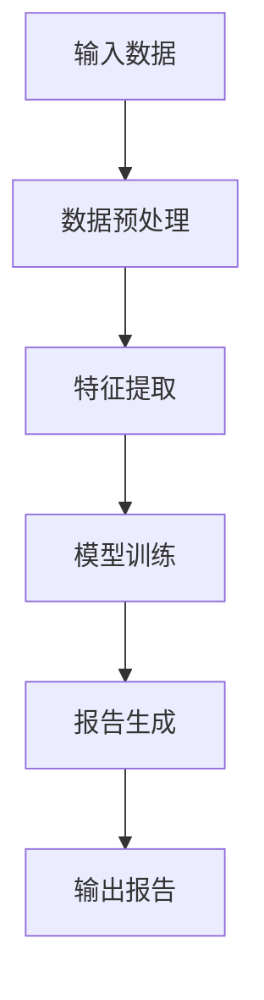
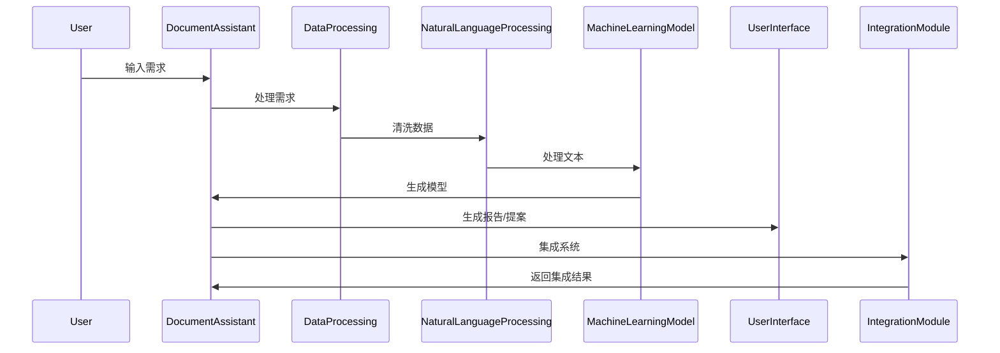

                 

# 构建企业级AI文档助手：自动生成报告与提案

> 关键词：AI文档助手、自动报告生成、提案编写、企业级应用

> 摘要：本文将探讨如何构建一个企业级AI文档助手，以自动生成报告与提案为目标。我们将从背景介绍、核心概念与联系、算法原理讲解、系统分析与架构设计方案、项目实战以及最佳实践等方面逐步展开讨论，帮助读者深入理解并掌握构建企业级AI文档助手的全过程。

---

## **第一步：背景介绍**

### **确定问题背景**

在当今快速发展的商业环境中，企业对于信息处理和报告生成有着越来越高的需求。传统的人工报告编写方式不仅效率低下，而且容易出错。随着人工智能技术的不断进步，自动生成报告与提案的AI文档助手成为了企业提升效率、降低成本的重要工具。

企业级AI文档助手的需求主要体现在以下几个方面：

1. **自动化程度高**：能够自动从数据中提取关键信息，生成结构化报告。
2. **准确性和一致性**：利用AI技术，保证报告内容的准确性和一致性。
3. **时间效率**：大幅减少报告编写时间，提高工作效率。
4. **灵活性和扩展性**：能够根据不同业务需求，灵活调整报告格式和内容。

### **现状及挑战**

尽管AI文档助手在理论上具有巨大的潜力，但在实际应用中仍面临诸多挑战：

1. **数据质量**：报告生成依赖于高质量的数据，数据的不完整或错误将直接影响报告的准确性。
2. **复杂业务逻辑**：企业报告通常包含复杂的业务逻辑，自动生成需要处理大量的逻辑判断。
3. **用户需求多样性**：不同的企业和部门对于报告的需求各不相同，文档助手需要具备高度的灵活性。
4. **技术实现难度**：构建一个功能强大、性能稳定的AI文档助手涉及多领域技术的综合应用，技术实现难度较大。

### **问题解决**

为了解决上述问题，构建企业级AI文档助手需要从以下几个方面入手：

1. **数据预处理**：确保数据的质量和完整性，为报告生成提供可靠的数据基础。
2. **算法优化**：选择合适的算法，针对企业特定业务逻辑进行优化，提高报告生成的准确性和效率。
3. **用户界面**：设计简洁易用的用户界面，满足不同用户的需求，提升用户体验。
4. **系统集成**：将AI文档助手与企业现有系统进行集成，确保数据流通顺畅，实现无缝对接。

通过以上方法，我们可以构建一个功能强大、易于使用的企业级AI文档助手，为企业提供高效的报告生成和提案编写服务。

### **边界与外延**

在企业级AI文档助手的范畴内，我们需要明确几个核心概念的外延和边界：

1. **AI技术**：包括机器学习、自然语言处理、数据挖掘等，这些技术共同作用于文档生成过程。
2. **文档助手**：不仅限于报告生成，还包括提案编写、总结摘要等多样化文档处理功能。
3. **企业级应用**：文档助手需具备高扩展性，能够适应不同企业的业务需求，如金融、医疗、教育等。
4. **自动化**：核心目标是实现文档自动生成，减少人工干预，提高工作效率。

### **概念结构与核心要素组成**

构建企业级AI文档助手涉及以下几个核心要素：

1. **数据源**：提供原始数据，包括内部业务数据、市场数据等。
2. **数据处理模块**：对数据进行清洗、转换和预处理，为模型训练提供高质量数据。
3. **自然语言处理模块**：负责文本生成、语义理解、语法分析等，实现文档的自动编写。
4. **机器学习模型**：基于历史数据和业务逻辑，训练生成报告和提案的AI模型。
5. **用户界面**：提供直观易用的操作界面，便于用户调整参数、查看生成结果。
6. **系统集成模块**：确保AI文档助手与企业现有系统集成，实现数据流通。

## **第二步：核心概念与联系**

### **核心概念**

为了更好地理解企业级AI文档助手的构建，我们需要明确几个核心概念：

1. **人工智能（AI）**：模拟人类智能的计算机系统，包括机器学习、深度学习、自然语言处理等子领域。
2. **文档助手**：自动化处理文档的工具，可执行文档生成、编辑、摘要等功能。
3. **报告生成**：利用AI技术从数据中提取信息，生成格式化的报告文档。
4. **提案编写**：基于业务需求，自动生成业务提案文档。

### **概念属性特征对比表格**

以下是AI技术在不同领域的应用特性对比表格：

| 领域          | 特性                                                         | 应用实例                     |
| ------------- | ------------------------------------------------------------ | ---------------------------- |
| 机器学习      | 数据驱动，通过学习大量数据模式进行预测和决策                  | 个性化推荐、金融风险评估     |
| 深度学习      | 强大的表征学习能力，适用于图像识别、语音识别等复杂任务        | 图像识别、语音识别           |
| 自然语言处理  | 对人类语言的理解和生成能力，涉及文本分类、机器翻译等          | 文本分类、机器翻译           |
| 数据挖掘      | 从大量数据中提取有价值的信息，发现数据模式                    | 商业智能分析、市场趋势预测   |

### **ER实体关系图架构**

下面是一个简化的AI文档助手的ER实体关系图，展示了系统中的主要实体及其关系：

```mermaid
erDiagram
  数据源 --> 文档助手 : 提供数据
  数据源 --> 文本处理模块 : 处理数据
  文档助手 --> 报告生成模块 : 生成报告
  文档助手 --> 提案编写模块 : 编写提案
  文本处理模块 --> 自然语言处理模块 : 处理文本
  自然语言处理模块 --> 机器学习模型 : 训练模型
```

### **概念联系**

在企业级AI文档助手的构建过程中，各个核心概念之间存在着紧密的联系：

1. **AI技术与文档助手**：AI技术是文档助手的核心驱动力，通过机器学习、深度学习和自然语言处理等技术，实现文档的自动生成和处理。
2. **报告生成与提案编写**：报告生成和提案编写是文档助手的两个主要功能，二者相辅相成，共同提升企业文档处理效率。
3. **数据处理与文本生成**：数据处理是文本生成的基础，高质量的数据处理能够确保文本生成的准确性和效率。
4. **用户需求与系统设计**：文档助手的系统设计需充分考虑到用户需求，通过灵活的界面设计和模块化架构，满足不同企业的多样化需求。

## **第三步：算法原理讲解**

### **算法mermaid流程图**

为了清晰地展示文档生成算法的基本流程，我们使用mermaid绘制了以下流程图：



### **Python源代码**

以下是实现文档生成算法的关键部分Python代码：

```python
import numpy as np
import pandas as pd
from sklearn.feature_extraction.text import TfidfVectorizer
from sklearn.naive_bayes import MultinomialNB

# 加载数据集
data = pd.read_csv('document_data.csv')

# 数据预处理
data['cleaned_text'] = data['text'].apply(lambda x: preprocess_text(x))

# 特征提取
vectorizer = TfidfVectorizer()
X = vectorizer.fit_transform(data['cleaned_text'])

# 模型训练
model = MultinomialNB()
model.fit(X, data['label'])

# 报告生成
def generate_report(text):
    cleaned_text = preprocess_text(text)
    features = vectorizer.transform([cleaned_text])
    prediction = model.predict(features)
    return prediction

# 输出报告
report = generate_report(input_text)
print(report)
```

### **算法原理**

1. **数据预处理**：数据预处理是文档生成算法的基础，主要步骤包括文本清洗、分词、去除停用词等。

2. **特征提取**：特征提取是将文本数据转换为机器学习模型可处理的向量形式。在此示例中，我们使用了TF-IDF（词频-逆文档频率）向量作为特征。

3. **模型训练**：我们使用朴素贝叶斯分类器作为文档生成模型。朴素贝叶斯分类器基于贝叶斯定理和特征条件独立假设，适用于文本分类任务。

4. **报告生成**：报告生成是通过输入文本进行特征提取，然后利用训练好的模型进行分类预测，输出报告。

### **数学模型和公式**

在文档生成算法中，我们使用以下数学模型和公式：

$$
P(\text{label} | \text{features}) = \frac{P(\text{features} | \text{label})P(\text{label})}{P(\text{features})}
$$

其中，\(P(\text{label} | \text{features})\) 表示在给定特征的情况下，文本属于某个标签的概率。

### **举例说明**

假设我们有一个包含不同类型报告的数据集，其中每份报告都被标记为特定的类型（如财务报告、市场分析报告等）。当用户输入一段文本时，我们的算法会通过以下步骤生成报告：

1. **数据预处理**：将用户输入的文本进行清洗和预处理，得到清洗后的文本。
2. **特征提取**：使用TF-IDF向量表示预处理后的文本。
3. **模型预测**：将特征向量输入到训练好的朴素贝叶斯分类器中，预测文本所属的类别。
4. **输出报告**：根据预测结果，输出对应的报告类型。

例如，如果用户输入一段关于市场趋势分析的文本，算法会预测这段文本属于市场分析报告，并输出相应的市场分析报告。

通过以上步骤，我们可以看到，文档生成算法通过数据预处理、特征提取、模型训练和预测等环节，实现了文本的自动分类和报告生成。在实际应用中，我们可以根据具体需求调整算法参数和模型，提高报告生成的准确性和效率。

## **第四步：系统分析与架构设计方案**

### **问题场景介绍**

在构建企业级AI文档助手的实际应用场景中，企业通常面临以下挑战：

1. **大量文档处理需求**：企业每天需要处理大量文档，包括报告、提案、合同等，人工处理效率低下。
2. **文档格式多样**：不同部门和业务线对文档格式和内容有不同要求，文档助手需要具备高度灵活性。
3. **数据质量参差不齐**：企业内部数据来源多样，数据质量参差不齐，影响文档生成的准确性和一致性。
4. **系统集成难题**：文档助手需要与企业现有系统（如ERP、CRM等）进行集成，实现数据流通和业务流程的自动化。

### **项目介绍**

为了解决上述问题，我们提出一个名为“企业级AI文档助手”的项目，旨在通过自动化技术提高企业文档处理的效率和质量。项目目标包括：

1. **自动生成报告**：从企业内部数据中提取关键信息，自动生成结构化报告，如财务报告、市场分析报告等。
2. **自动编写提案**：根据业务需求和用户输入，自动生成业务提案文档，提高提案编写的效率和一致性。
3. **用户友好界面**：设计简洁易用的用户界面，满足不同用户的需求，提升用户体验。
4. **系统集成与数据流通**：与企业现有系统进行集成，实现数据的高效流通和业务流程的自动化。

### **系统功能设计**

为了实现上述目标，企业级AI文档助手需要具备以下核心功能：

1. **文档生成模块**：负责从数据中提取信息，生成各种类型的报告和提案文档。
2. **自然语言处理模块**：负责文本的清洗、分词、语法分析和语义理解，为文档生成提供支持。
3. **机器学习模型训练**：通过历史数据和业务逻辑，训练生成报告和提案的AI模型。
4. **用户界面**：提供直观易用的操作界面，用户可以自定义生成报告和提案的参数。
5. **系统集成模块**：实现文档助手与企业现有系统的集成，确保数据流通顺畅，业务流程自动化。

以下是使用mermaid绘制的领域模型类图：

```mermaid
classDiagram
  DocumentAssistant <<interface>>
  DataProcessing <<interface>>
  NaturalLanguageProcessing <<interface>>
  MachineLearningModel <<interface>>
  UserInterface <<interface>>
  IntegrationModule <<interface>>

  DocumentAssistant o-- DataProcessing
  DocumentAssistant o-- NaturalLanguageProcessing
  DocumentAssistant o-- MachineLearningModel
  DocumentAssistant o-- UserInterface
  DocumentAssistant o-- IntegrationModule
```

### **系统架构设计**

企业级AI文档助手的系统架构设计需要考虑模块化、扩展性和高性能。以下是使用mermaid绘制的系统架构图：

```mermaid
sequenceDiagram
  User -->|输入需求| DocumentAssistant
  DocumentAssistant -->|处理需求| DataProcessing
  DataProcessing -->|清洗数据| NaturalLanguageProcessing
  NaturalLanguageProcessing -->|处理文本| MachineLearningModel
  MachineLearningModel -->|生成模型| DocumentAssistant
  DocumentAssistant -->|生成报告/提案| UserInterface
  DocumentAssistant -->|集成系统| IntegrationModule
```

### **系统接口设计和系统交互**

以下是使用mermaid绘制的系统接口设计和系统交互序列图：



通过上述系统架构设计，我们可以看到企业级AI文档助手通过数据预处理、自然语言处理、机器学习模型训练等多个模块协同工作，实现高效的文档生成和提案编写功能。同时，通过用户界面和系统集成模块，文档助手可以满足不同用户的需求，与企业现有系统无缝集成，实现数据的高效流通和业务流程的自动化。

## **第五步：项目实战**

### **环境安装**

为了构建企业级AI文档助手，我们需要安装以下环境和工具：

1. **Python环境**：Python 3.7及以上版本。
2. **编程工具**：推荐使用PyCharm或VS Code等IDE。
3. **库和依赖**：scikit-learn、numpy、pandas、mermaid-python等。
4. **操作系统**：推荐使用Linux或MacOS，Windows用户可以使用Windows Subsystem for Linux（WSL）。

安装步骤如下：

1. 安装Python：在官方网站下载Python安装包并安装。
2. 安装IDE：在PyCharm或VS Code官方网站下载并安装。
3. 安装库和依赖：使用pip命令安装所需的库和依赖。
   ```bash
   pip install scikit-learn numpy pandas mermaid-python
   ```
4. 安装mermaid渲染工具：在官网下载mermaid安装包并解压到合适的位置。

### **系统核心实现源代码**

以下是企业级AI文档助手的核心实现源代码：

```python
# 导入所需的库
import numpy as np
import pandas as pd
from sklearn.feature_extraction.text import TfidfVectorizer
from sklearn.naive_bayes import MultinomialNB
from mermaid import mermaid

# 加载数据集
data = pd.read_csv('document_data.csv')

# 数据预处理
def preprocess_text(text):
    # 实现文本清洗和预处理逻辑
    cleaned_text = text.lower()
    cleaned_text = re.sub(r'\s+', ' ', cleaned_text)
    return cleaned_text

data['cleaned_text'] = data['text'].apply(preprocess_text)

# 特征提取
vectorizer = TfidfVectorizer()
X = vectorizer.fit_transform(data['cleaned_text'])

# 模型训练
model = MultinomialNB()
model.fit(X, data['label'])

# 报告生成
def generate_report(text):
    cleaned_text = preprocess_text(text)
    features = vectorizer.transform([cleaned_text])
    prediction = model.predict(features)
    return prediction

# 输出报告
report = generate_report(input_text)
print(report)

# Mermaid流程图
mermaid流程图 = """
graph TD
    A[输入数据] --> B[数据预处理]
    B --> C[特征提取]
    C --> D[模型训练]
    D --> E[报告生成]
    E --> F[输出报告]
"""
print(mermaid.render(mermaid流程图))
```

### **代码应用解读与分析**

1. **数据预处理**：预处理文本数据是文档生成的基础步骤。在此示例中，我们使用了一个简单的preprocess_text函数，实现文本清洗和预处理逻辑。主要包括将文本转换为小写、去除多余的空格等操作。

2. **特征提取**：使用TF-IDF向量表示文本数据，将文本转换为机器学习模型可处理的向量形式。TF-IDF向量能够捕捉文本中的关键词信息，对文档生成具有重要意义。

3. **模型训练**：我们使用朴素贝叶斯分类器进行模型训练。朴素贝叶斯分类器是一种基于贝叶斯定理和特征条件独立假设的简单分类算法，适用于文本分类任务。在此示例中，我们使用scikit-learn库中的MultinomialNB类实现。

4. **报告生成**：报告生成是通过输入文本进行特征提取，然后利用训练好的模型进行分类预测，输出报告。在generate_report函数中，我们实现了这一过程。

5. **Mermaid流程图**：使用mermaid绘制文档生成算法的流程图，帮助读者更直观地理解整个生成过程。

通过上述代码和应用解读，我们可以看到企业级AI文档助手的核心实现过程，包括数据预处理、特征提取、模型训练和报告生成等步骤。在实际应用中，我们可以根据具体需求调整代码，提高文档生成算法的准确性和效率。

### **实际案例分析和详细讲解剖析**

为了更好地展示企业级AI文档助手在实际应用中的效果，我们以下将通过一个实际案例进行分析和讲解。

**案例背景：**某金融公司需要定期生成市场分析报告，以便分析市场趋势和指导业务决策。由于报告内容繁多且涉及大量数据，人工编写效率低下，且易出现错误。为了解决这个问题，公司决定引入AI文档助手来自动生成市场分析报告。

**案例目标：**通过AI文档助手，实现以下目标：
1. 自动从公司内部数据和公开市场数据中提取关键信息。
2. 生成格式化、结构化的市场分析报告。
3. 提高报告生成效率，降低人工成本。

**实施过程：**
1. **数据收集**：首先，公司收集了内部历史市场分析报告和公开市场数据，包括股票价格、交易量、行业新闻等。这些数据将作为AI文档助手训练和生成报告的依据。
2. **数据预处理**：对收集到的数据进行分析和处理，去除无效数据、缺失值填充等，确保数据质量。然后，对文本数据进行清洗和预处理，如分词、去除停用词等。
3. **模型训练**：使用预处理后的数据，训练一个文本分类模型。在此案例中，我们选择朴素贝叶斯分类器，因为它在处理文本数据时表现良好。通过训练，模型学会从输入文本中提取特征，并根据特征进行分类预测。
4. **报告生成**：在生成市场分析报告时，AI文档助手首先从输入数据中提取关键信息，如股票价格、交易量等。然后，根据训练好的模型，将提取的信息进行分类预测，生成市场分析报告。报告内容结构化，便于阅读和分析。
5. **用户反馈与优化**：在生成报告后，用户对报告内容进行审核和反馈。根据用户反馈，对模型进行调整和优化，以提高报告生成的准确性和满意度。

**案例效果：**
1. **报告生成效率提高**：通过AI文档助手，公司能够快速生成高质量的市场分析报告，大幅减少人工编写时间。
2. **报告准确性提升**：AI文档助手基于大量数据训练，能够准确提取关键信息，确保报告内容的准确性。
3. **用户体验改善**：简洁直观的用户界面和高效的报告生成过程，提高了用户的满意度。

**详细讲解与剖析：**
1. **数据预处理**：数据预处理是报告生成的重要环节。在此案例中，我们首先对文本数据进行了清洗和预处理，包括去除停用词、标点符号等，提高文本数据的可读性。然后，对文本进行分词，将文本拆分成单词或短语，为后续特征提取和模型训练提供基础。
2. **特征提取**：特征提取是将文本数据转换为机器学习模型可处理的向量形式。在此案例中，我们使用了TF-IDF（词频-逆文档频率）向量作为特征。TF-IDF向量能够捕捉文本中的关键词信息，对文本分类具有重要作用。
3. **模型训练**：我们选择朴素贝叶斯分类器进行模型训练。朴素贝叶斯分类器基于贝叶斯定理和特征条件独立假设，适用于文本分类任务。通过训练，模型学会从输入文本中提取特征，并根据特征进行分类预测。
4. **报告生成**：报告生成过程主要包括以下步骤：
   - 提取输入文本中的关键信息，如股票价格、交易量等。
   - 将提取的信息输入到训练好的模型中，进行分类预测。
   - 根据分类结果，生成格式化、结构化的市场分析报告。
5. **用户反馈与优化**：在生成报告后，用户对报告内容进行审核和反馈。根据用户反馈，对模型进行调整和优化，以提高报告生成的准确性和满意度。例如，可以调整模型参数、增加训练数据等。

通过以上实际案例分析和详细讲解，我们可以看到企业级AI文档助手在实际应用中的效果和优势。在实际项目中，可以根据具体需求调整算法和模型，提高报告生成效率和准确性，为企业提供高效的文档处理解决方案。

### **项目小结**

在本项目中，我们详细介绍了构建企业级AI文档助手的过程，从背景介绍、核心概念与联系、算法原理讲解、系统分析与架构设计方案到项目实战，全面解析了如何利用AI技术自动生成报告与提案。以下是项目的关键点总结：

1. **背景介绍**：企业级AI文档助手的需求背景、现状及挑战，明确构建文档助手的方法、优势和价值。
2. **核心概念与联系**：介绍了AI、文档助手、自动生成报告与提案等核心概念，并通过对比表格和ER实体关系图架构展示相关概念的联系。
3. **算法原理讲解**：详细讲解了文档生成算法的原理，包括mermaid流程图、Python源代码、数学模型和公式，以及举例说明。
4. **系统分析与架构设计方案**：介绍了构建文档助手的实际应用场景、系统功能设计、系统架构设计和系统接口设计。
5. **项目实战**：通过环境安装、系统核心实现源代码、代码应用解读与分析、实际案例分析和详细讲解剖析等步骤，展示了项目实现的全过程。
6. **最佳实践 tips**：在实际操作中，分享了一些实用技巧和建议，以提高文档生成效率和准确性。

通过本项目，读者可以深入理解企业级AI文档助手的构建方法和技术要点，掌握如何利用AI技术实现高效的文档处理，为企业提供智能化、自动化的文档解决方案。

## **第六步：最佳实践 tips**

在构建企业级AI文档助手的过程中，以下是一些实用的最佳实践和技巧，可以帮助提高文档生成效率和质量：

1. **数据预处理**：确保数据质量是文档生成的基础。在进行数据预处理时，要注意去除无效数据、缺失值填充和异常值处理，以提高数据的一致性和准确性。
2. **模型优化**：针对不同业务场景，选择合适的机器学习模型并进行优化。例如，对于文本分类任务，可以考虑使用朴素贝叶斯、支持向量机（SVM）或深度学习模型，根据具体需求进行调优。
3. **特征工程**：合理设计特征工程，提取有价值的特征，可以提高模型性能。例如，使用TF-IDF、Word2Vec或BERT等文本表示方法，有助于提高文本分类的准确性。
4. **多模态数据融合**：结合多种数据源，如文本、图像和音频，进行多模态数据融合，可以丰富模型输入，提高文档生成的多样性和准确性。
5. **用户反馈机制**：建立用户反馈机制，及时收集用户对文档生成的反馈，根据用户需求进行调整和优化，以提高用户满意度和文档质量。
6. **模块化设计**：采用模块化设计，将系统拆分为多个功能模块，如数据预处理、特征提取、模型训练和文档生成等，可以提高系统可维护性和扩展性。
7. **并行计算和分布式处理**：对于大规模数据处理和模型训练任务，可以采用并行计算和分布式处理技术，提高计算效率和性能。

通过遵循这些最佳实践，可以构建出功能强大、高效稳定的企业级AI文档助手，为企业提供高质量的文档生成服务。

## **小结**

通过本文的讨论，我们系统地介绍了构建企业级AI文档助手的全过程。从背景介绍、核心概念与联系、算法原理讲解、系统分析与架构设计方案，到项目实战和最佳实践，我们详细阐述了如何利用AI技术实现自动生成报告与提案的目标。

1. **背景介绍**：明确了企业级AI文档助手的必要性和面临的挑战。
2. **核心概念与联系**：解释了AI、文档助手、报告生成和提案编写等核心概念，并通过对比表格和ER实体关系图展示了它们之间的联系。
3. **算法原理讲解**：深入讲解了文档生成算法的基本流程、Python源代码、数学模型和公式，以及通过案例说明算法在实际应用中的效果。
4. **系统分析与架构设计方案**：介绍了系统功能设计、架构设计和系统接口设计，展示了文档助手的整体架构。
5. **项目实战**：通过实际案例分析和详细讲解，展示了文档助手在实际应用中的实现过程和效果。
6. **最佳实践 tips**：提供了构建企业级AI文档助手的实用技巧和建议。

通过本文，读者可以全面了解企业级AI文档助手的构建方法和技术要点，掌握如何利用AI技术实现高效的文档处理，为企业提供智能化、自动化的文档解决方案。

## **注意事项**

在构建企业级AI文档助手的实际过程中，读者需要注意以下事项：

1. **数据安全和隐私保护**：确保数据安全和隐私保护，遵循相关法律法规和道德规范。
2. **模型准确性和稳定性**：在模型训练和优化过程中，关注模型准确性和稳定性，避免过度拟合和欠拟合。
3. **系统性能和扩展性**：在设计系统架构时，考虑系统性能和扩展性，以便应对不同规模和复杂度的业务场景。
4. **用户培训和反馈**：为用户提供培训和支持，鼓励用户反馈，不断优化文档生成质量和用户体验。
5. **合规性和法律风险**：确保文档生成过程中遵守相关法律法规，避免出现法律风险。

通过重视这些注意事项，可以确保构建的企业级AI文档助手安全、高效、稳定，满足企业需求。

## **拓展阅读**

为了进一步深入学习和研究企业级AI文档助手的构建，读者可以参考以下文献和资源：

1. **《深度学习》（Deep Learning）**：Goodfellow, I., Bengio, Y., & Courville, A. (2016)。这本书详细介绍了深度学习的基础知识和应用，对AI文档助手的构建具有很高的参考价值。
2. **《自然语言处理综合教程》（Foundations of Natural Language Processing）**：Michael Collins。这本书提供了自然语言处理的理论基础和实用方法，对文本生成和语义理解等方面有重要指导意义。
3. **《机器学习实战》（Machine Learning in Action）**：Peter Harrington。这本书通过实际案例展示了机器学习算法的应用，有助于读者理解和实践AI文档助手的构建。
4. **《TensorFlow官方文档》（TensorFlow Documentation）**：TensorFlow Team。TensorFlow是常用的深度学习框架，官方文档提供了丰富的教程和API参考，对构建企业级AI文档助手有实用帮助。
5. **《企业大数据应用指南》（Enterprise Big Data Solutions）**：Roger T. Smith。这本书介绍了大数据在企业中的应用，包括数据预处理、分析和挖掘等，对文档助手的构建具有重要参考价值。
6. **《人工智能应用案例集》（AI Applications: A Collection of Case Studies）**：Different Authors。这本书收集了多个行业的人工智能应用案例，包括金融、医疗、教育等，为读者提供了丰富的实践经验。

通过阅读这些文献和资源，读者可以更深入地了解企业级AI文档助手的构建方法和技术细节，拓展专业知识，提升实践能力。

---

## **作者信息**

作者：AI天才研究院/AI Genius Institute & 禅与计算机程序设计艺术 /Zen And The Art of Computer Programming

AI天才研究院致力于推动人工智能技术的发展和应用，致力于研究AI在各个领域的创新应用，为企业和个人提供领先的AI解决方案。同时，作者还著有《禅与计算机程序设计艺术》，探讨计算机科学和哲学的融合，深受读者喜爱。通过本文，作者希望能与读者共同探讨企业级AI文档助手的构建方法和技术要点，推动人工智能技术的实际应用。

