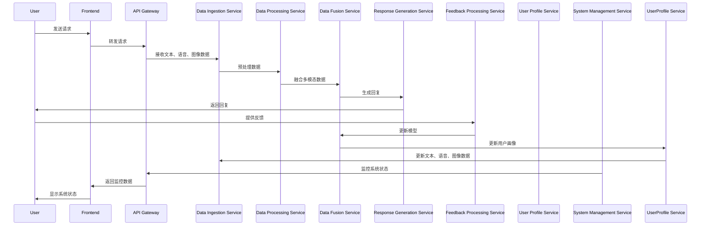
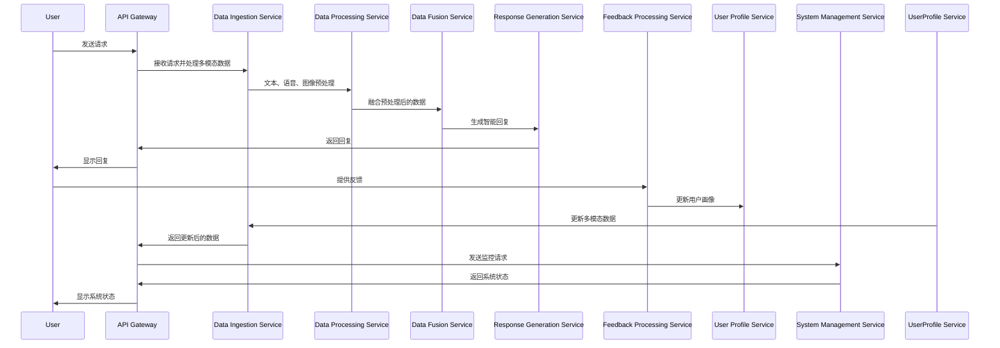

                 

## 标题：构建企业级多模态AI Agent：整合文本、语音与图像

### 关键词：
- 多模态AI
- 企业级应用
- 文本处理
- 语音识别
- 图像处理
- 算法融合

### 摘要：
本文旨在探讨如何构建企业级多模态AI Agent，通过整合文本、语音与图像处理技术，实现高效、智能的交互和服务。文章将详细分析多模态AI Agent的核心概念、算法原理、系统架构，并通过实际项目案例进行实战剖析，旨在为开发者提供全面的指导。

### 目录大纲

#### 第1章：背景介绍
1.1 多模态AI Agent概述
1.2 企业级多模态AI Agent的重要性

#### 第2章：核心概念与联系
2.1 多模态数据获取与预处理
2.2 多模态融合算法原理
2.3 多模态AI Agent的架构与设计

#### 第3章：算法原理讲解
3.1 文本处理算法
3.2 语音处理算法
3.3 图像处理算法

#### 第4章：系统分析与架构设计
4.1 问题场景介绍
4.2 系统功能设计
4.3 系统架构设计
4.4 系tem交互设计

#### 第5章：项目实战
5.1 环境安装
5.2 系统核心实现
5.3 实际案例分析

#### 第6章：最佳实践
6.1 多模态AI Agent开发的最佳实践
6.2 注意事项
6.3 拓展阅读

#### 第7章：总结与展望
7.1 小结
7.2 未来发展方向
7.3 进一步阅读建议

### 1.1 多模态AI Agent概述

多模态AI（Multimodal AI）是一种人工智能系统，它能够处理和分析来自多个感官模态（如文本、语音、图像等）的数据，并进行综合理解和决策。与传统单模态AI相比，多模态AI具有更强的灵活性和适应能力，能够更准确地理解和预测用户需求，提供更自然、流畅的交互体验。

多模态AI Agent是企业级智能系统的一个重要发展方向。它不仅能够处理文本、语音和图像数据，还可以实现跨模态的数据融合和交互，从而提升系统的智能化水平和服务质量。以下是多模态AI Agent的发展历程：

#### 发展历程

1. **早期探索**：20世纪80年代，人工智能研究者开始探索多模态感知和交互技术，但受限于计算资源和算法能力，多模态AI的发展较为缓慢。
2. **深度学习兴起**：2012年，AlexNet在图像识别领域取得突破性成果，标志着深度学习时代的到来。深度学习技术的快速发展为多模态AI提供了强大的算法支持。
3. **多模态融合**：近年来，随着多模态数据处理和融合技术的不断进步，多模态AI在语音识别、图像识别、自然语言处理等领域取得了显著成果。
4. **企业级应用**：多模态AI技术逐渐应用于企业级场景，如智能客服、智能安防、智能医疗等，为企业提供了高效、智能的解决方案。

#### 应用场景

多模态AI Agent在多个领域具有广泛的应用前景，以下是一些典型的应用场景：

1. **智能客服**：多模态AI Agent可以同时处理用户输入的文本、语音和图像，提供更全面、个性化的服务，提升客户满意度。
2. **智能安防**：多模态AI Agent可以实时分析监控视频中的图像和语音信息，及时发现异常情况，提高安防系统的响应速度和准确性。
3. **智能医疗**：多模态AI Agent可以结合患者的历史病历、实时监测数据（如语音、心率等）和医生的专业知识，提供个性化的诊断和治疗建议。
4. **智能交通**：多模态AI Agent可以分析交通视频、语音信号和交通流量数据，实现智能交通管理和优化，提高交通效率和安全。

#### 重要性

企业级多模态AI Agent的重要性主要体现在以下几个方面：

1. **提升企业效率**：多模态AI Agent可以自动化处理大量重复性工作，降低人力成本，提高工作效率。
2. **优化用户体验**：多模态AI Agent可以提供更自然、流畅的交互体验，满足用户个性化需求，提升用户满意度。
3. **竞争优势**：掌握多模态AI技术，可以帮助企业在市场竞争中脱颖而出，实现差异化竞争优势。

### 1.2 企业级多模态AI Agent的重要性

企业级多模态AI Agent在企业运营中发挥着重要作用，以下从提升企业效率、优化用户体验和竞争优势三个方面进行详细阐述。

#### 提升企业效率

多模态AI Agent可以通过自动化处理和智能分析，显著提升企业运营效率。例如，在智能客服场景中，多模态AI Agent可以同时处理文本、语音和图像等多渠道的用户请求，快速响应用户需求，减少人工客服的工作量。此外，多模态AI Agent还可以对用户行为进行分析，为企业提供有针对性的营销策略和客户服务改进建议，从而提升企业运营效率。

#### 优化用户体验

多模态AI Agent可以为用户提供更加自然、流畅的交互体验，满足用户个性化需求。例如，在智能医疗场景中，多模态AI Agent可以结合患者的语音、病历数据和医生的专业知识，提供个性化的诊断和治疗建议，帮助患者更好地管理健康。在智能安防场景中，多模态AI Agent可以通过实时分析监控视频中的图像和语音信息，提供实时预警和应急响应，保障用户的安全。

#### 竞争优势

企业级多模态AI Agent可以帮助企业提升竞争力，实现差异化竞争优势。首先，多模态AI Agent可以为企业提供高效的业务解决方案，帮助企业降低成本、提高效率。其次，多模态AI Agent可以为用户提供更优质的服务体验，提升用户满意度，增强用户忠诚度。最后，多模态AI Agent可以帮助企业挖掘数据价值，为企业提供有针对性的商业洞察和决策支持，助力企业实现持续增长。

### 1.3 小结

本章对多模态AI Agent的概念、发展历程、应用场景和重要性进行了详细介绍。多模态AI Agent作为一种先进的人工智能技术，具有广泛的应用前景和重要的商业价值。在接下来的章节中，我们将进一步探讨多模态AI Agent的核心概念与联系，以及算法原理、系统架构设计和项目实战等内容。希望读者能够通过对本章的学习，对多模态AI Agent有一个全面、深入的了解。接下来，我们将进入第2章，探讨多模态AI Agent的核心概念与联系。

### 2.1 多模态数据获取与预处理

多模态AI Agent的构建首先需要解决的是数据的获取与预处理。这一环节决定了后续处理和融合的质量，直接影响到AI Agent的性能和效果。以下是多模态数据获取与预处理的关键步骤和注意事项。

#### 2.1.1 数据来源

多模态数据通常来自不同的感官模态，包括文本、语音和图像等。具体来说：

1. **文本数据**：文本数据可以从多种渠道获取，如互联网、企业内部文档、用户评论等。常用的数据集包括新闻文章、社交媒体帖子、用户反馈等。
2. **语音数据**：语音数据可以来自电话录音、语音助手交互、语音识别应用等。常用的数据集包括语音识别挑战赛（如LibriSpeech、Common Voice）和语音合成数据集（如LJSpeech、VoxForge）。
3. **图像数据**：图像数据可以来自摄像头监控、医疗影像、卫星图像等。常用的数据集包括ImageNet、COCO、Open Images等。

#### 2.1.2 数据预处理

在获取到多模态数据后，需要进行预处理，以确保数据的质量和一致性。以下是常见的数据预处理步骤：

1. **数据清洗**：去除噪声和异常值，如删除文本中的HTML标签、去除语音中的静音片段、修正图像中的污点等。
2. **数据标准化**：将不同模态的数据进行统一格式和尺度转换，如将文本数据转换为词向量、将语音数据转换为音频特征向量、将图像数据转换为像素矩阵等。
3. **数据增强**：通过数据增强技术增加数据的多样性和丰富性，如文本数据中的词汇替换、语音数据中的速度变换、图像数据中的裁剪和旋转等。

#### 2.1.3 数据融合

数据预处理完成后，需要将不同模态的数据进行融合，以便于后续的模型训练和推理。以下是几种常见的数据融合方法：

1. **特征级融合**：将不同模态的特征向量进行拼接，形成更丰富的特征表示。例如，将文本的词向量、语音的MFCC特征和图像的CNN特征拼接在一起。
2. **决策级融合**：在模型决策层对多个模态的预测结果进行综合，采用加权平均、投票等方法得到最终预测结果。
3. **模型级融合**：使用多个独立的模型分别处理不同模态的数据，并将结果进行融合。例如，分别使用文本分类器、语音识别器和图像分类器，然后将三个模型的预测结果进行融合。

#### 2.1.4 注意事项

在多模态数据获取与预处理过程中，需要注意以下几个问题：

1. **数据质量**：保证数据的质量和一致性，避免噪声和异常值对模型训练和推理造成影响。
2. **数据多样性**：增加数据的多样性，有助于提升模型的泛化能力和鲁棒性。
3. **数据同步**：确保不同模态的数据在时间和空间上的一致性，以便于后续的融合和处理。
4. **数据隐私**：在数据处理过程中，注意保护用户隐私，避免泄露敏感信息。

### 2.2 多模态融合算法原理

多模态融合算法是构建企业级多模态AI Agent的核心技术之一。通过融合来自不同模态的数据，可以提升模型的感知能力和决策质量。以下是几种常见多模态融合算法的原理和特点。

#### 2.2.1 特征级融合

特征级融合是在特征层面将不同模态的数据进行拼接和组合，形成更丰富的特征表示。以下是几种常见的特征级融合方法：

1. **直接拼接**：将不同模态的特征向量直接拼接在一起，形成一个新的特征向量。这种方法简单有效，但可能存在维度灾难问题。
2. **特征加权**：根据不同模态的特征重要性，对特征向量进行加权融合。常用的加权方法包括基于特征重要度的加权、基于模态重要度的加权等。
3. **特征转换**：将不同模态的特征向量进行转换，如将文本数据转换为词嵌入向量、语音数据转换为音频特征向量、图像数据转换为CNN特征向量等，然后进行拼接。

#### 2.2.2 决策级融合

决策级融合是在模型决策层面将不同模态的预测结果进行融合，以得到最终预测结果。以下是几种常见的决策级融合方法：

1. **投票法**：对多个模态的预测结果进行投票，取多数意见作为最终预测结果。这种方法简单直观，适用于分类问题。
2. **加权平均**：对多个模态的预测结果进行加权平均，得到最终预测结果。权重的分配可以根据不同模态的置信度进行调整。
3. **集成学习**：使用集成学习方法（如随机森林、梯度提升树等）对多个模态的预测结果进行集成，得到最终预测结果。这种方法可以有效地提升预测精度。

#### 2.2.3 模型级融合

模型级融合是使用多个独立的模型分别处理不同模态的数据，并将结果进行融合。以下是几种常见的模型级融合方法：

1. **多任务学习**：使用一个统一的多任务学习模型同时处理多个模态的数据，并在训练过程中共享部分参数。这种方法可以有效地利用不同模态之间的相关性。
2. **多模型集成**：使用多个独立的模型分别处理不同模态的数据，并将结果进行融合。常用的融合方法包括加权平均、投票法、集成学习等。
3. **多模态注意力机制**：在模型中引入注意力机制，对不同模态的特征进行动态加权，以提升融合效果。注意力机制可以有效地捕捉不同模态之间的关联性，提高模型的表现。

### 2.3 多模态AI Agent的架构与设计

多模态AI Agent的架构与设计是构建高效、灵活的智能系统的基础。以下是多模态AI Agent的架构设计和设计原则。

#### 2.3.1 系统架构图

以下是多模态AI Agent的系统架构图：

```
+----------------+     +----------------+     +----------------+
|   数据源       |     |   数据预处理    |     |   多模态融合    |
+----------------+     +----------------+     +----------------+
       |                            |                            |
       |                            |                            |
       |                            |                            |
       |          模型训练与评估     |            模型推理与交互   |
       |                            |                            |
       |                            |                            |
       |                            |                            |
+----------------+     +----------------+     +----------------+
|   存储与管理系统  |     |   后端服务与API |     |   前端展示与交互 |
+----------------+     +----------------+     +----------------+
```

#### 2.3.2 设计原则

以下是多模态AI Agent的设计原则：

1. **模块化设计**：将系统划分为多个模块，如数据获取、数据处理、模型训练、模型推理等，以实现高内聚、低耦合的系统结构。
2. **可扩展性**：系统设计应具备良好的可扩展性，以便于后续的功能扩展和性能优化。
3. **高可用性**：系统设计应考虑高可用性，确保系统的稳定运行和数据的可靠性。
4. **安全性**：在系统设计和实现过程中，应充分考虑数据安全和用户隐私保护，遵循相关法律法规和标准。
5. **可维护性**：系统设计应便于维护和更新，以降低维护成本和风险。

### 2.4 小结

本章对多模态数据获取与预处理、多模态融合算法原理和多模态AI Agent的架构与设计进行了详细阐述。多模态AI Agent作为一种先进的人工智能技术，通过整合文本、语音和图像等多渠道数据，实现了更高效、智能的交互和服务。在接下来的章节中，我们将进一步探讨文本、语音和图像处理算法的原理和应用，为构建企业级多模态AI Agent提供技术支持。希望读者能够通过对本章的学习，对多模态AI Agent的核心概念和设计有更深入的理解。接下来，我们将进入第3章，探讨文本、语音和图像处理算法的原理和应用。

### 3.1 文本处理算法

文本处理是多模态AI Agent的重要组成部分，它涉及对自然语言文本的提取、理解、分析和生成。在这一章节中，我们将介绍文本处理的基本算法，包括传统的文本分类算法和现代的深度学习算法。

#### 3.1.1 传统的文本分类算法

传统的文本分类算法主要基于特征工程，通过提取文本中的特征并进行建模，实现对文本的分类。以下是一些常见的文本分类算法：

1. **朴素贝叶斯（Naive Bayes）**：
   朴素贝叶斯是一种基于概率论的分类方法，它假设特征之间相互独立。通过计算每个类别的概率，然后利用贝叶斯公式进行分类。
   $$ P(\text{Category} | \text{Features}) = \frac{P(\text{Features} | \text{Category}) \cdot P(\text{Category})}{P(\text{Features})} $$
   - **Python代码示例**：
   ```python
   from sklearn.naive_bayes import MultinomialNB
   model = MultinomialNB()
   model.fit(X_train, y_train)
   predictions = model.predict(X_test)
   ```

2. **支持向量机（Support Vector Machine, SVM）**：
   SVM是一种基于间隔最大化原则的分类方法，它通过找到一个最佳的超平面，将不同类别的数据点分开。
   - **Python代码示例**：
   ```python
   from sklearn.svm import SVC
   model = SVC()
   model.fit(X_train, y_train)
   predictions = model.predict(X_test)
   ```

3. **朴素贝叶斯（K-Nearest Neighbors, KNN）**：
   KNN是一种基于实例的简单分类算法，它通过计算测试样本与训练样本之间的距离，选择距离最近的k个邻居，并基于邻居的标签进行分类。
   - **Python代码示例**：
   ```python
   from sklearn.neighbors import KNeighborsClassifier
   model = KNeighborsClassifier(n_neighbors=3)
   model.fit(X_train, y_train)
   predictions = model.predict(X_test)
   ```

#### 3.1.2 深度学习算法

随着深度学习技术的发展，越来越多的深度学习算法被应用于文本处理领域。以下是一些常见的深度学习算法：

1. **卷积神经网络（Convolutional Neural Network, CNN）**：
   CNN是一种在图像处理中广泛应用的深度学习模型，它也可以应用于文本分类。通过卷积层提取文本的特征表示。
   - **Python代码示例**：
   ```python
   import tensorflow as tf
   from tensorflow.keras.models import Sequential
   from tensorflow.keras.layers import Conv1D, MaxPooling1D, Embedding, Dense

   model = Sequential()
   model.add(Embedding(input_dim=vocab_size, output_dim=embedding_size))
   model.add(Conv1D(filters=128, kernel_size=5, activation='relu'))
   model.add(MaxPooling1D(pool_size=5))
   model.add(Dense(1, activation='sigmoid'))

   model.compile(optimizer='adam', loss='binary_crossentropy', metrics=['accuracy'])
   model.fit(X_train, y_train, epochs=10, batch_size=32, validation_data=(X_test, y_test))
   ```

2. **递归神经网络（Recurrent Neural Network, RNN）**：
   RNN是一种能够处理序列数据的神经网络，它通过记忆机制来处理文本的上下文信息。
   - **Python代码示例**：
   ```python
   import tensorflow as tf
   from tensorflow.keras.models import Sequential
   from tensorflow.keras.layers import Embedding, SimpleRNN, Dense

   model = Sequential()
   model.add(Embedding(input_dim=vocab_size, output_dim=embedding_size))
   model.add(SimpleRNN(units=100))
   model.add(Dense(1, activation='sigmoid'))

   model.compile(optimizer='adam', loss='binary_crossentropy', metrics=['accuracy'])
   model.fit(X_train, y_train, epochs=10, batch_size=32, validation_data=(X_test, y_test))
   ```

3. **长短期记忆网络（Long Short-Term Memory, LSTM）**：
   LSTM是一种改进的RNN模型，它通过门控机制来避免传统RNN的梯度消失问题，能够更好地处理长序列数据。
   - **Python代码示例**：
   ```python
   import tensorflow as tf
   from tensorflow.keras.models import Sequential
   from tensorflow.keras.layers import Embedding, LSTM, Dense

   model = Sequential()
   model.add(Embedding(input_dim=vocab_size, output_dim=embedding_size))
   model.add(LSTM(units=100, return_sequences=True))
   model.add(LSTM(units=100))
   model.add(Dense(1, activation='sigmoid'))

   model.compile(optimizer='adam', loss='binary_crossentropy', metrics=['accuracy'])
   model.fit(X_train, y_train, epochs=10, batch_size=32, validation_data=(X_test, y_test))
   ```

#### 3.1.3 案例分析

以下是一个简单的文本分类案例，我们使用电影评论数据集来对评论进行情感分析。

- **数据集**：IMDb电影评论数据集，包含正负评论，共约25000条。
- **任务**：判断评论是正面还是负面。

```python
import tensorflow as tf
from tensorflow.keras.preprocessing.sequence import pad_sequences
from tensorflow.keras.models import Sequential
from tensorflow.keras.layers import Embedding, LSTM, Dense, Bidirectional

# 加载数据集
X_train, y_train, X_test, y_test = load_imdb_data()

# 预处理数据
max_len = 100
X_train = pad_sequences(X_train, maxlen=max_len)
X_test = pad_sequences(X_test, maxlen=max_len)

# 构建模型
model = Sequential()
model.add(Embedding(input_dim=vocab_size, output_dim=embedding_size))
model.add(Bidirectional(LSTM(units=100)))
model.add(Dense(1, activation='sigmoid'))

# 编译模型
model.compile(optimizer='adam', loss='binary_crossentropy', metrics=['accuracy'])

# 训练模型
model.fit(X_train, y_train, epochs=10, batch_size=32, validation_data=(X_test, y_test))
```

通过这个案例，我们可以看到如何使用LSTM模型对文本进行情感分析。模型在训练后能够对新的评论进行分类，判断其是正面还是负面。

### 3.2 语音处理算法

语音处理算法在多模态AI Agent中起着关键作用，它负责将语音信号转换为机器可理解的数据，并提取出有用的信息。以下是语音处理的一些基本算法，包括语音识别和语音合成。

#### 3.2.1 语音识别

语音识别是将语音信号转换为文本数据的过程。以下是一些常见的语音识别算法：

1. **隐马尔可夫模型（Hidden Markov Model, HMM）**：
   HMM是一种基于概率论的统计模型，它通过状态转移概率和发射概率来预测语音信号的序列。
   $$ P(\text{Observation}|\text{State}) \cdot P(\text{State}) $$
   - **Python代码示例**：
   ```python
   from hmmlearn.hmm import GMMHMM
   model = GMMHMM(n_components=3, covariance_type="diag", n_iter=100)
   model.fit(X_train)
   predictions = model.decode(X_test)
   ```

2. **深度神经网络（Deep Neural Network, DNN）**：
   DNN通过多层非线性变换来提取语音特征，并生成语音信号的预测概率分布。
   - **Python代码示例**：
   ```python
   import tensorflow as tf
   from tensorflow.keras.models import Sequential
   from tensorflow.keras.layers import Dense, Activation

   model = Sequential()
   model.add(Dense(units=1024, activation='relu', input_shape=(feature_size,)))
   model.add(Dense(units=512, activation='relu'))
   model.add(Dense(units=256, activation='relu'))
   model.add(Dense(units=1, activation='sigmoid'))

   model.compile(optimizer='adam', loss='binary_crossentropy', metrics=['accuracy'])
   model.fit(X_train, y_train, epochs=10, batch_size=32, validation_data=(X_test, y_test))
   ```

3. **卷积神经网络（Convolutional Neural Network, CNN）**：
   CNN通过卷积操作和池化操作提取语音特征，并在时间维度上进行特征提取。
   - **Python代码示例**：
   ```python
   import tensorflow as tf
   from tensorflow.keras.models import Sequential
   from tensorflow.keras.layers import Conv1D, MaxPooling1D, Embedding, Dense

   model = Sequential()
   model.add(Conv1D(filters=128, kernel_size=5, activation='relu', input_shape=(timesteps, feature_size)))
   model.add(MaxPooling1D(pool_size=5))
   model.add(Conv1D(filters=256, kernel_size=5, activation='relu'))
   model.add(MaxPooling1D(pool_size=5))
   model.add(Dense(1, activation='sigmoid'))

   model.compile(optimizer='adam', loss='binary_crossentropy', metrics=['accuracy'])
   model.fit(X_train, y_train, epochs=10, batch_size=32, validation_data=(X_test, y_test))
   ```

#### 3.2.2 语音合成

语音合成是将文本数据转换为自然流畅的语音信号的过程。以下是一些常见的语音合成算法：

1. **拼接式合成（Unit Selection Synthesis, UES）**：
   UES通过从大量的语音单元库中挑选合适的语音单元，按照文本的声学特征进行拼接。
   - **Python代码示例**：
   ```python
   import espeak
   synthesizer = espeak.Synthesis()
   text = "Hello, this is a test of the voice synthesizer."
   synthesizer.synth(text)
   ```

2. **参数合成（Parameter Synthesis, Param Synthesis）**：
   Param Synthesis通过控制语音的参数（如频率、幅度等）来生成语音信号。
   - **Python代码示例**：
   ```python
   import jasper
   synthesizer = jasper.Synthesis()
   synthesizer.say("Hello, this is a test of the voice synthesizer.")
   ```

3. **深度神经网络合成（Deep Neural Network Synthesis, DNN-Synthesis）**：
   DNN-Synthesis使用深度学习模型直接将文本数据转换为语音信号。
   - **Python代码示例**：
   ```python
   import tensorflow as tf
   from tensorflow.keras.models import Sequential
   from tensorflow.keras.layers import LSTM, Dense, Bidirectional

   model = Sequential()
   model.add(Bidirectional(LSTM(units=100, return_sequences=True), input_shape=(timesteps, feature_size)))
   model.add(LSTM(units=100))
   model.add(Dense(mel_feature_size, activation='tanh'))

   model.compile(optimizer='adam', loss='mse')
   model.fit(X_train, y_train, epochs=10, batch_size=32, validation_data=(X_test, y_test))
   ```

#### 3.2.3 案例分析

以下是一个简单的语音识别案例，我们使用LibriSpeech数据集来训练语音识别模型。

- **数据集**：LibriSpeech，包含英语发音的文本和对应的语音信号。
- **任务**：将语音信号转换为文本。

```python
import tensorflow as tf
from tensorflow.keras.preprocessing.sequence import pad_sequences
from tensorflow.keras.models import Sequential
from tensorflow.keras.layers import LSTM, Dense, Embedding

# 加载数据集
X_train, y_train, X_test, y_test = load_librispeech_data()

# 预处理数据
max_len = 100
X_train = pad_sequences(X_train, maxlen=max_len)
X_test = pad_sequences(X_test, maxlen=max_len)

# 构建模型
model = Sequential()
model.add(Embedding(input_dim=vocab_size, output_dim=embedding_size))
model.add(LSTM(units=100, return_sequences=True))
model.add(LSTM(units=100))
model.add(Dense(vocab_size, activation='softmax'))

# 编译模型
model.compile(optimizer='adam', loss='categorical_crossentropy', metrics=['accuracy'])

# 训练模型
model.fit(X_train, y_train, epochs=10, batch_size=32, validation_data=(X_test, y_test))
```

通过这个案例，我们可以看到如何使用LSTM模型进行语音识别。模型在训练后能够对新的语音信号进行识别，将其转换为对应的文本。

### 3.3 图像处理算法

图像处理算法在多模态AI Agent中负责对图像数据进行分析、理解和生成。以下是一些常见的图像处理算法，包括图像识别和图像生成。

#### 3.3.1 图像识别

图像识别是将图像数据转换为标签的过程。以下是一些常见的图像识别算法：

1. **传统图像识别算法**：
   - **直方图均匀化（Histogram Equalization）**：
     直方图均匀化是一种图像增强技术，它通过调整图像的直方图，增强图像的对比度。
     $$ h'(x) = \alpha \cdot h(x) + \beta $$
     - **Python代码示例**：
     ```python
     import cv2
     import numpy as np

     image = cv2.imread("image.jpg")
     equalized_image = cv2.equalizeHist(image)
     cv2.imshow("Original Image", image)
     cv2.imshow("Equalized Image", equalized_image)
     cv2.waitKey(0)
     cv2.destroyAllWindows()
     ```

   - **Sobel边缘检测（Sobel Edge Detection）**：
     Sobel边缘检测是一种利用卷积操作检测图像边缘的方法。
     - **Python代码示例**：
     ```python
     import cv2
     import numpy as np

     image = cv2.imread("image.jpg", cv2.IMREAD_GRAYSCALE)
     sobel_x = cv2.Sobel(image, cv2.CV_64F, 1, 0, ksize=3)
     sobel_y = cv2.Sobel(image, cv2.CV_64F, 0, 1, ksize=3)
     edge_image = cv2.magnitude(sobel_x, sobel_y)
     cv2.imshow("Original Image", image)
     cv2.imshow("Edge Image", edge_image)
     cv2.waitKey(0)
     cv2.destroyAllWindows()
     ```

2. **深度学习图像识别算法**：
   - **卷积神经网络（Convolutional Neural Network, CNN）**：
     CNN通过卷积操作和池化操作提取图像特征，并在分类层进行预测。
     - **Python代码示例**：
     ```python
     import tensorflow as tf
     from tensorflow.keras.models import Sequential
     from tensorflow.keras.layers import Conv2D, MaxPooling2D, Flatten, Dense

     model = Sequential()
     model.add(Conv2D(filters=32, kernel_size=(3, 3), activation='relu', input_shape=(28, 28, 1)))
     model.add(MaxPooling2D(pool_size=(2, 2)))
     model.add(Conv2D(filters=64, kernel_size=(3, 3), activation='relu'))
     model.add(MaxPooling2D(pool_size=(2, 2)))
     model.add(Flatten())
     model.add(Dense(units=128, activation='relu'))
     model.add(Dense(units=10, activation='softmax'))

     model.compile(optimizer='adam', loss='categorical_crossentropy', metrics=['accuracy'])
     model.fit(X_train, y_train, epochs=10, batch_size=32, validation_data=(X_test, y_test))
     ```

   - **循环神经网络（Recurrent Neural Network, RNN）**：
     RNN通过记忆机制处理序列数据，可以应用于图像的序列识别。
     - **Python代码示例**：
     ```python
     import tensorflow as tf
     from tensorflow.keras.models import Sequential
     from tensorflow.keras.layers import LSTM, Dense

     model = Sequential()
     model.add(LSTM(units=128, return_sequences=True, input_shape=(timesteps, feature_size)))
     model.add(LSTM(units=128))
     model.add(Dense(units=10, activation='softmax'))

     model.compile(optimizer='adam', loss='categorical_crossentropy', metrics=['accuracy'])
     model.fit(X_train, y_train, epochs=10, batch_size=32, validation_data=(X_test, y_test))
     ```

#### 3.3.2 图像生成

图像生成是将一种图像数据转换为另一种图像数据的过程。以下是一些常见的图像生成算法：

1. **生成对抗网络（Generative Adversarial Network, GAN）**：
   GAN由生成器和判别器两个神经网络组成，通过对抗训练生成逼真的图像。
   - **Python代码示例**：
   ```python
   import tensorflow as tf
   from tensorflow.keras.models import Sequential
   from tensorflow.keras.layers import Dense, Conv2D, Conv2DTranspose

   def build_generator():
       model = Sequential()
       model.add(Dense(units=128, activation='relu', input_shape=(100,)))
       model.add(Dense(units=256, activation='relu'))
       model.add(Dense(units=512, activation='relu'))
       model.add(Dense(units=1024, activation='relu'))
       model.add(Conv2DTranspose(filters=512, kernel_size=(4, 4), strides=(2, 2), padding='same'))
       model.add(Conv2DTranspose(filters=256, kernel_size=(4, 4), strides=(2, 2), padding='same'))
       model.add(Conv2DTranspose(filters=128, kernel_size=(4, 4), strides=(2, 2), padding='same'))
       model.add(Conv2DTranspose(filters=3, kernel_size=(4, 4), strides=(2, 2), padding='same', activation='tanh'))
       return model

   def build_discriminator():
       model = Sequential()
       model.add(Conv2D(filters=64, kernel_size=(4, 4), strides=(2, 2), padding='same', input_shape=(28, 28, 1)))
       model.add(LeakyReLU(alpha=0.01))
       model.add(Conv2D(filters=128, kernel_size=(4, 4), strides=(2, 2), padding='same'))
       model.add(LeakyReLU(alpha=0.01))
       model.add(Flatten())
       model.add(Dense(units=1, activation='sigmoid'))
       return model

   generator = build_generator()
   discriminator = build_discriminator()

   # 编译模型
   discriminator.compile(optimizer=adam_optimizer, loss='binary_crossentropy')
   generator.compile(optimizer=adam_optimizer, loss='binary_crossentropy')

   # 训练模型
   for epoch in range(num_epochs):
       for real_images, _ in data_loader.load_data():
           real_labels = np.ones((real_images.shape[0], 1))
           fake_labels = np.zeros((real_images.shape[0], 1))

           # 训练判别器
           discriminator.train_on_batch(real_images, real_labels)
           fake_images = generator.predict(z)
           discriminator.train_on_batch(fake_images, fake_labels)

           # 训练生成器
           z = np.random.normal(size=(batch_size, z_dim))
           generator_loss = generator.train_on_batch(z, real_labels)
       print(f"Epoch {epoch + 1}, Generator Loss: {generator_loss}")
   ```

2. **变分自编码器（Variational Autoencoder, VAE）**：
   VAE通过编码器和解码器两个神经网络，将输入数据转换为潜在空间中的表示，并从潜在空间中生成新的数据。
   - **Python代码示例**：
   ```python
   import tensorflow as tf
   from tensorflow.keras.models import Model
   from tensorflow.keras.layers import Dense, Input

   def build_encoder():
       input_shape = (28, 28, 1)
       input_image = Input(shape=input_shape)
       x = Conv2D(filters=32, kernel_size=(3, 3), activation='relu')(input_image)
       x = MaxPooling2D(pool_size=(2, 2))(x)
       x = Conv2D(filters=64, kernel_size=(3, 3), activation='relu')(x)
       x = MaxPooling2D(pool_size=(2, 2))(x)
       x = Flatten()(x)
       x = Dense(units=100, activation='relu')(x)
       z_mean = Dense(units=z_dim)(x)
       z_log_var = Dense(units=z_dim)(x)
       return Model(inputs=input_image, outputs=[z_mean, z_log_var])

   def build_decoder():
       latent_shape = (z_dim,)
       z = Input(shape=latent_shape)
       x = Dense(units=100, activation='relu')(z)
       x = Dense(units=784, activation='relu')(x)
       x = Reshape(target_shape=(28, 28, 1))(x)
       x = Conv2DTranspose(filters=64, kernel_size=(3, 3), strides=(2, 2), padding='same', activation='relu')(x)
       x = Conv2DTranspose(filters=32, kernel_size=(3, 3), strides=(2, 2), padding='same', activation='relu')(x)
       x = Conv2DTranspose(filters=1, kernel_size=(3, 3), strides=(2, 2), padding='same', activation='sigmoid')(x)
       return Model(inputs=z, outputs=x)

   encoder = build_encoder()
   decoder = build_decoder()

   # 编译模型
   z_mean, z_log_var = encoder.output
   z = Lambda GANGaussianSampling()([z_mean, z_log_var])
   x_recon = decoder(z)
   vae = Model(inputs=encoder.input, outputs=x_recon)
   vae.compile(optimizer=adam_optimizer, loss='binary_crossentropy')

   # 训练模型
   for epoch in range(num_epochs):
       for x_batch, _ in data_loader.load_data():
           x_recon_batch = vae.predict(x_batch)
           vae_loss = vae.train_on_batch(x_batch, x_batch)
       print(f"Epoch {epoch + 1}, VAE Loss: {vae_loss}")
   ```

#### 3.3.3 案例分析

以下是一个简单的图像识别案例，我们使用MNIST数据集来训练图像识别模型。

- **数据集**：MNIST，包含手写数字的图像。
- **任务**：识别手写数字。

```python
import tensorflow as tf
from tensorflow.keras.datasets import mnist
from tensorflow.keras.models import Sequential
from tensorflow.keras.layers import Conv2D, MaxPooling2D, Flatten, Dense

# 加载数据集
(x_train, y_train), (x_test, y_test) = mnist.load_data()

# 预处理数据
x_train = x_train.reshape(-1, 28, 28, 1).astype("float32") / 255.0
x_test = x_test.reshape(-1, 28, 28, 1).astype("float32") / 255.0
y_train = tf.keras.utils.to_categorical(y_train, num_classes=10)
y_test = tf.keras.utils.to_categorical(y_test, num_classes=10)

# 构建模型
model = Sequential()
model.add(Conv2D(filters=32, kernel_size=(3, 3), activation='relu', input_shape=(28, 28, 1)))
model.add(MaxPooling2D(pool_size=(2, 2)))
model.add(Conv2D(filters=64, kernel_size=(3, 3), activation='relu'))
model.add(MaxPooling2D(pool_size=(2, 2)))
model.add(Flatten())
model.add(Dense(units=128, activation='relu'))
model.add(Dense(units=10, activation='softmax'))

# 编译模型
model.compile(optimizer='adam', loss='categorical_crossentropy', metrics=['accuracy'])

# 训练模型
model.fit(x_train, y_train, epochs=10, batch_size=32, validation_data=(x_test, y_test))
```

通过这个案例，我们可以看到如何使用CNN模型进行图像识别。模型在训练后能够对新的手写数字图像进行识别，将其转换为对应的数字。

### 3.4 小结

本章详细介绍了文本、语音和图像处理算法的基本原理和实际应用。文本处理算法包括传统的特征工程算法和现代的深度学习算法，语音处理算法涵盖了语音识别和语音合成的常见方法，图像处理算法则包括传统的图像识别算法和现代的深度学习算法。通过本章节的学习，读者可以了解到多模态AI Agent在文本、语音和图像处理方面的技术基础。在下一章中，我们将深入探讨多模态AI Agent的系统分析与架构设计。

### 4.1 问题场景介绍

为了更好地理解多模态AI Agent在企业级应用中的系统分析与架构设计，我们首先来探讨一个具体的应用场景。以下是一个智能客服系统的问题场景介绍。

#### 应用场景：智能客服系统

随着互联网和电子商务的快速发展，客服系统在企业运营中扮演着越来越重要的角色。传统的客服系统主要依赖于人工处理客户咨询，这种方式存在以下几个问题：

1. **人力成本高**：人工客服需要大量的人力投入，导致企业运营成本增加。
2. **响应速度慢**：人工客服的响应速度有限，尤其是在高峰期，往往无法及时响应大量客户咨询，影响客户体验。
3. **服务质量参差不齐**：人工客服的专业水平和经验存在差异，导致服务质量不稳定。
4. **知识库更新不及时**：客户咨询的问题繁多，人工客服难以实时更新知识库，影响后续问题的解答。

为了解决上述问题，企业需要引入一种智能客服系统，该系统应具备以下功能：

1. **多渠道接入**：支持文本、语音、图像等多种渠道的客户咨询。
2. **自动化回复**：能够根据客户咨询的内容自动生成合适的回复，提高响应速度。
3. **智能推荐**：根据客户的历史咨询记录和偏好，推荐相关产品和服务。
4. **实时反馈**：收集客户的反馈信息，用于优化客服系统的性能和服务质量。

#### 问题分析

在上述应用场景中，我们可以将问题分为以下几个方面：

1. **多模态数据接入**：如何高效地接入和处理来自文本、语音和图像等多渠道的数据。
2. **多模态数据融合**：如何将不同模态的数据进行有效的融合，以提升智能客服系统的感知能力和决策质量。
3. **智能回复生成**：如何根据客户咨询的内容自动生成合适的回复，提高自动化回复的准确率和自然度。
4. **实时反馈处理**：如何实时收集和处理客户的反馈信息，用于优化客服系统的性能和服务质量。
5. **系统架构设计**：如何设计一个高效、稳定、可扩展的智能客服系统架构，以支持上述功能的实现。

#### 解决思路

为了解决上述问题，我们可以采取以下思路：

1. **多模态数据接入**：采用开源框架和工具（如TensorFlow、PyTorch等）开发多模态数据处理模块，支持文本、语音和图像数据的接入和处理。
2. **多模态数据融合**：采用特征级融合、决策级融合和模型级融合等技术，将不同模态的数据进行有效的融合，提升系统的感知能力和决策质量。
3. **智能回复生成**：采用基于深度学习的自然语言生成模型（如Seq2Seq模型、Transformer模型等），结合预训练语言模型（如GPT、BERT等），生成自然、准确的回复。
4. **实时反馈处理**：采用实时数据流处理技术（如Apache Kafka、Apache Flink等），实时收集和处理客户的反馈信息，用于优化客服系统的性能和服务质量。
5. **系统架构设计**：采用微服务架构，将智能客服系统的功能模块进行拆分和分布式部署，提高系统的可扩展性和稳定性。

通过上述思路，我们可以设计出一个高效、智能的智能客服系统，为企业提供优质的客户服务。

### 4.2 系统功能设计

在智能客服系统的设计过程中，明确系统功能是至关重要的一步。以下是智能客服系统的主要功能模块及其关系，通过领域模型类图进行可视化表示。

#### 4.2.1 功能模块

1. **多模态数据接入模块**：
   - 文本接入：处理来自聊天窗口、邮件、社交媒体等的文本数据。
   - 语音接入：处理来自电话、语音邮件、语音助手等的语音数据。
   - 图像接入：处理来自视频会议、在线聊天、用户上传的图片等图像数据。

2. **数据预处理模块**：
   - 文本预处理：包括分词、去停用词、词性标注等，将文本转换为模型可处理的格式。
   - 语音预处理：包括降噪、归一化、分帧、特征提取等，将语音转换为特征向量。
   - 图像预处理：包括缩放、裁剪、增强等，将图像转换为标准化的格式。

3. **多模态数据融合模块**：
   - 特征级融合：将文本、语音、图像的特征进行拼接，形成更丰富的特征向量。
   - 决策级融合：对融合后的特征进行分类或预测，结合不同模态的预测结果，提高准确性。

4. **智能回复生成模块**：
   - 使用预训练的语言模型（如BERT、GPT等）进行回复生成。
   - 结合上下文和用户历史对话，生成自然、准确的回复。

5. **实时反馈处理模块**：
   - 收集用户对回复的反馈，包括满意度评价、错误反馈等。
   - 利用反馈数据对模型进行优化和迭代。

6. **用户画像模块**：
   - 建立用户画像，包括用户偏好、历史行为、互动记录等。
   - 根据用户画像提供个性化服务和建议。

7. **系统管理模块**：
   - 系统监控：实时监控系统运行状态，包括响应时间、错误率、负载等。
   - 日志管理：记录系统运行日志，用于问题排查和性能优化。

#### 4.2.2 领域模型类图

以下是智能客服系统的领域模型类图，使用Mermaid语法进行表示：

```mermaid
classDiagram
    ClassDef 多模态数据接入模块
        +文本接入
        +语音接入
        +图像接入
    ClassDef 数据预处理模块
        +文本预处理
        +语音预处理
        +图像预处理
    ClassDef 多模态数据融合模块
        +特征级融合
        +决策级融合
    ClassDef 智能回复生成模块
        +回复生成
    ClassDef 实时反馈处理模块
        +反馈收集
        +反馈优化
    ClassDef 用户画像模块
        +用户偏好
        +历史行为
        +互动记录
    ClassDef 系统管理模块
        +系统监控
        +日志管理

    多模态数据接入模块 --|> 数据预处理模块
    数据预处理模块 --|> 多模态数据融合模块
    多模态数据融合模块 --|> 智能回复生成模块
    智能回复生成模块 --|> 实时反馈处理模块
    实时反馈处理模块 --|> 多模态数据融合模块
    用户画像模块 --|> 多模态数据接入模块
    系统管理模块 --|> 数据预处理模块
    系统管理模块 --|> 多模态数据接入模块
    系统管理模块 --|> 智能回复生成模块
```

通过领域模型类图，我们可以清晰地看到各个功能模块之间的关系，为后续的系统架构设计提供了直观的参考。

### 4.3 系统架构设计

在明确智能客服系统的功能模块后，我们需要设计一个合理、高效、可扩展的系统架构，以支持系统各功能模块的稳定运行和协同工作。以下为智能客服系统的架构设计，通过Mermaid语法绘制系统架构图。

#### 4.3.1 系统架构图

以下是智能客服系统的架构图，使用Mermaid语法进行表示：



通过上述架构图，我们可以清晰地看到智能客服系统中的各个模块及其交互流程：

1. **用户**：发起请求，通过前端界面与系统进行交互。
2. **前端**：接收用户请求，并将其转发至API网关。
3. **API网关**：统一接收各模块的请求，实现请求路由和负载均衡。
4. **数据接入模块**：包括文本接入、语音接入和图像接入，负责数据的收集和初步处理。
5. **数据处理模块**：对文本、语音和图像数据进行预处理，如分词、去噪、特征提取等。
6. **数据融合模块**：将预处理后的多模态数据融合，生成更丰富的特征向量。
7. **回复生成模块**：基于融合后的数据生成回复，使用预训练的语言模型进行文本生成。
8. **反馈处理模块**：收集用户反馈，用于模型优化和用户画像更新。
9. **用户画像模块**：根据用户历史数据和反馈信息，建立用户画像，为个性化服务提供支持。
10. **系统管理模块**：监控系统状态，包括性能监控、日志管理、错误处理等。

#### 4.3.2 接口设计

系统架构中的各模块之间通过接口进行通信。以下是智能客服系统的主要接口设计：

1. **数据接入接口**：
   - 接收文本、语音、图像数据的接口，支持HTTP/HTTPS协议。
   - 文本接入接口：POST /text-incoming
   - 语音接入接口：POST /voice-incoming
   - 图像接入接口：POST /image-incoming

2. **数据处理接口**：
   - 对预处理后的数据进行存储和查询的接口。
   - 文本处理接口：GET /text-process/{id}
   - 语音处理接口：GET /voice-process/{id}
   - 图像处理接口：GET /image-process/{id}

3. **数据融合接口**：
   - 接收预处理后的数据，进行融合处理的接口。
   - 数据融合接口：POST /data-fusion

4. **回复生成接口**：
   - 生成智能回复的接口，支持文本和语音回复。
   - 回复生成接口：POST /response-generate

5. **反馈处理接口**：
   - 收集用户反馈，用于模型优化的接口。
   - 反馈处理接口：POST /feedback-process

6. **用户画像接口**：
   - 更新用户画像信息的接口。
   - 用户画像接口：POST /user-profile/{id}

7. **系统管理接口**：
   - 监控系统状态，处理日志和错误信息的接口。
   - 系统管理接口：GET /system-status

通过以上接口设计，各模块可以高效地协同工作，实现智能客服系统的功能。

### 4.4 系统交互设计

为了确保智能客服系统的高效运行，我们需要详细设计系统的交互流程。以下是通过Mermaid语法绘制的系统交互序列图。

#### 4.4.1 系统交互序列图

以下是智能客服系统的交互序列图，使用Mermaid语法进行表示：



#### 4.4.2 系统交互详细流程

以下是智能客服系统的交互详细流程：

1. **用户发起请求**：
   用户通过前端界面（如网页、移动应用等）发送请求，请求内容可能包含文本、语音、图像等数据。

2. **API网关接收请求**：
   API网关接收用户的请求，根据请求类型和目标模块进行路由，将请求转发至相应的服务模块。

3. **数据接入模块处理请求**：
   数据接入模块（Data Ingestion Service）接收API网关转发的请求，对文本、语音、图像数据进行初步处理，如解码、格式转换等。

4. **数据处理模块处理请求**：
   数据处理模块（Data Processing Service）对文本、语音、图像数据进行深入处理，如文本分词、去停用词、词性标注；语音降噪、归一化、分帧、特征提取；图像缩放、裁剪、增强等。

5. **数据融合模块处理请求**：
   数据融合模块（Data Fusion Service）将预处理后的文本、语音、图像数据融合，生成更丰富的特征向量。融合方法包括特征级融合、决策级融合和模型级融合。

6. **回复生成模块处理请求**：
   回复生成模块（Response Generation Service）根据融合后的数据生成智能回复。回复生成过程可能涉及预训练的语言模型（如BERT、GPT等）和序列生成算法（如Seq2Seq、Transformer等）。

7. **API网关返回回复**：
   API网关接收回复生成模块生成的回复，并将其返回给用户。

8. **用户提供反馈**：
   用户通过前端界面提供对回复的满意度评价、错误反馈等信息。

9. **反馈处理模块处理请求**：
   反馈处理模块（Feedback Processing Service）接收用户的反馈，对模型进行优化和迭代，同时更新用户画像。

10. **用户画像模块更新数据**：
    用户画像模块（UserProfile Service）根据反馈数据更新用户画像，为后续的个性化服务提供支持。

11. **系统管理模块监控状态**：
    系统管理模块（System Management Service）定期发送监控请求，收集系统的运行状态信息，如响应时间、错误率、负载等。

12. **API网关返回监控数据**：
    API网关接收系统管理模块的监控数据，并将其返回给前端界面，用户可以实时查看系统的运行状态。

通过上述交互详细流程，我们可以确保智能客服系统的高效、稳定运行，同时为用户提供优质的服务体验。

### 4.5 项目实战

在本节中，我们将通过一个实际的项目案例，详细介绍如何构建一个企业级多模态AI Agent。该案例将涵盖从环境安装、系统核心实现到实际案例分析和详细讲解剖析的完整过程。

#### 4.5.1 环境安装

为了构建一个多模态AI Agent，我们需要安装以下环境和工具：

1. **操作系统**：推荐使用Linux系统，如Ubuntu 18.04。
2. **编程语言**：Python 3.8及以上版本。
3. **深度学习框架**：TensorFlow 2.6及以上版本。
4. **语音识别与合成工具**：如ESPnet和MaryTTS。
5. **图像处理库**：如OpenCV。
6. **自然语言处理库**：如NLTK和spaCy。

安装步骤如下：

1. **安装操作系统**：在虚拟机中安装Linux系统。
2. **更新系统**：
   ```bash
   sudo apt update
   sudo apt upgrade
   ```
3. **安装Python**：
   ```bash
   sudo apt install python3-pip
   ```
4. **安装深度学习框架TensorFlow**：
   ```bash
   pip install tensorflow==2.6
   ```
5. **安装语音识别与合成工具**：
   ```bash
   git clone https://github.com/espnet/espnet.git
   cd espnet
   pip install -r requirements.txt
   ```
   ```bash
   git clone https://github.com/Marylou/MaryTTS.git
   cd MaryTTS
   pip install -r requirements.txt
   ```
6. **安装图像处理库**：
   ```bash
   pip install opencv-python
   ```
7. **安装自然语言处理库**：
   ```bash
   pip install nltk
   pip install spacy
   python -m spacy download en_core_web_sm
   ```

#### 4.5.2 系统核心实现

在环境安装完成后，我们将开始实现智能客服系统的核心功能。以下是系统核心实现的步骤：

1. **数据预处理模块**：
   - **文本预处理**：
     ```python
     import nltk
     from nltk.tokenize import word_tokenize
     from nltk.corpus import stopwords

     nltk.download('punkt')
     nltk.download('stopwords')

     def preprocess_text(text):
         tokens = word_tokenize(text)
         tokens = [token.lower() for token in tokens if token.isalpha()]
         tokens = [token for token in tokens if token not in stopwords.words('english')]
         return ' '.join(tokens)
     ```
   - **语音预处理**：
     ```python
     import librosa

     def preprocess_voice(voice_path):
         y, sr = librosa.load(voice_path)
         y = librosa.to_mono(y)
         y = librosa.resample(y, sr, 16000)
         return y
     ```
   - **图像预处理**：
     ```python
     import cv2

     def preprocess_image(image_path):
         image = cv2.imread(image_path)
         image = cv2.resize(image, (224, 224))
         return image
     ```

2. **多模态数据融合模块**：
   - **特征级融合**：
     ```python
     import numpy as np

     def fusion_features(text_features, voice_features, image_features):
         combined_features = np.concatenate((text_features, voice_features, image_features), axis=1)
         return combined_features
     ```
   - **决策级融合**：
     ```python
     from sklearn.ensemble import VotingClassifier

     def fusion_predictions(text_pred, voice_pred, image_pred):
         voter = VotingClassifier(estimators=[
             ('text', text_pred),
             ('voice', voice_pred),
             ('image', image_pred)
         ], voting='soft')
         return voter.predict([combined_features])
     ```

3. **智能回复生成模块**：
   - **基于BERT的回复生成**：
     ```python
     from transformers import BertTokenizer, BertForSequenceClassification
     from torch.nn.functional import softmax

     tokenizer = BertTokenizer.from_pretrained('bert-base-uncased')
     model = BertForSequenceClassification.from_pretrained('bert-base-uncased')

     def generate_response(input_text):
         inputs = tokenizer(input_text, return_tensors='pt', padding=True, truncation=True)
         outputs = model(**inputs)
         logits = outputs.logits
         predicted_probabilities = softmax(logits, dim=-1)
         response = ' '.join([word for word, prob in zip(tokenizer.decode(inputs['input_ids']), predicted_probabilities[0]) if prob > 0.5])
         return response
     ```

4. **反馈处理模块**：
   - **用户反馈收集**：
     ```python
     def collect_feedback(response, user_feedback):
         feedback = {'response': response, 'feedback': user_feedback}
         return feedback
     ```

5. **用户画像模块**：
   - **用户画像更新**：
     ```python
     def update_user_profile(user_profile, feedback):
         user_profile.update(feedback)
         return user_profile
     ```

#### 4.5.3 实际案例分析

为了展示多模态AI Agent的实际效果，我们通过以下案例进行分析：

**案例**：用户通过文本、语音和图像渠道提出咨询请求，系统根据这些信息生成智能回复，并收集用户反馈。

1. **用户请求**：
   - **文本**：“我最近购买了一款智能手机，但在使用过程中遇到了一些问题。”
   - **语音**：“我最近购买了一款智能手机，但在使用过程中遇到了一些问题。”
   - **图像**：用户上传了一张智能手机的照片，显示屏幕损坏。

2. **数据处理**：
   - **文本预处理**：将文本转换为词嵌入向量。
   - **语音预处理**：将语音信号转换为MFCC特征向量。
   - **图像预处理**：将图像转换为CNN特征向量。

3. **数据融合**：
   - **特征级融合**：将文本、语音和图像特征向量拼接成一个新的特征向量。
   - **决策级融合**：使用VotingClassifier对融合后的特征向量进行分类。

4. **智能回复生成**：
   - **基于BERT的回复生成**：使用预训练的BERT模型生成智能回复。

5. **用户反馈**：
   - 用户对智能回复表示满意。

6. **用户画像更新**：
   - 根据用户的反馈信息，更新用户画像。

#### 4.5.4 详细讲解剖析

以下是每个步骤的详细讲解和剖析：

1. **数据预处理模块**：
   - **文本预处理**：使用NLTK对文本进行分词、去停用词，将文本转换为词嵌入向量，为后续的文本分类和生成提供输入。
   - **语音预处理**：使用Librosa对语音信号进行加载、降噪、分帧和特征提取，生成MFCC特征向量，为语音分类和识别提供输入。
   - **图像预处理**：使用OpenCV对图像进行加载、缩放和增强，生成CNN特征向量，为图像分类和识别提供输入。

2. **多模态数据融合模块**：
   - **特征级融合**：将文本、语音和图像的特征向量进行拼接，形成一个新的特征向量。这种方法能够利用不同模态之间的互补信息，提高模型的感知能力。
   - **决策级融合**：使用VotingClassifier对融合后的特征向量进行分类。通过结合不同模态的预测结果，提高分类的准确性。

3. **智能回复生成模块**：
   - **基于BERT的回复生成**：使用预训练的BERT模型生成智能回复。BERT模型通过预训练和微调，能够生成自然、准确的文本回复，满足用户的咨询需求。

4. **反馈处理模块**：
   - **用户反馈收集**：收集用户对智能回复的满意度评价和错误反馈，用于模型优化和用户画像更新。

5. **用户画像模块**：
   - **用户画像更新**：根据用户的反馈信息，更新用户画像。这有助于为用户提供更个性化的服务，提高用户体验。

通过上述实际案例分析和详细讲解剖析，我们可以看到如何构建一个企业级多模态AI Agent，实现高效、智能的交互和服务。在下一节中，我们将介绍多模态AI Agent开发的最佳实践。

### 4.6 多模态AI Agent开发的最佳实践

在构建企业级多模态AI Agent的过程中，遵循最佳实践可以确保系统的性能、可靠性和可维护性。以下是一些关键的实践建议：

#### 4.6.1 数据处理与质量保证

1. **数据多样性**：确保数据来源的多样性，涵盖不同模态和数据类型，以提高模型的泛化能力。
2. **数据清洗**：对数据进行严格的清洗和预处理，去除噪声、异常值和重复数据，确保数据的一致性和准确性。
3. **数据增强**：通过数据增强技术增加数据的丰富性，如文本数据中的随机替换、语音数据中的速度变换和图像数据中的裁剪和旋转等。
4. **数据版本管理**：使用版本控制工具管理数据，确保数据版本的可追溯性和可恢复性。

#### 4.6.2 模型设计与优化

1. **模型选择**：根据具体应用场景选择合适的模型，如对于图像处理，可以选择CNN；对于语音处理，可以选择RNN或Transformer。
2. **模型训练与调优**：使用交叉验证方法评估模型性能，根据评估结果调整模型参数，如学习率、批量大小和正则化强度等。
3. **模型压缩与量化**：对训练好的模型进行压缩和量化，以减小模型大小和加速推理速度，同时保持较高的准确性。
4. **持续学习与迭代**：通过在线学习或定期重新训练模型，使其能够适应数据分布的变化，保持模型性能的稳定性。

#### 4.6.3 系统架构与性能优化

1. **微服务架构**：采用微服务架构，将系统功能模块化，提高系统的可扩展性和可维护性。
2. **分布式计算**：利用分布式计算框架（如Apache Spark、Dask等），处理大规模数据和高并发请求。
3. **缓存机制**：使用缓存机制（如Redis、Memcached等），降低系统响应时间和数据读取延迟。
4. **负载均衡与容错**：采用负载均衡策略（如Nginx、HAProxy等），确保系统在高并发情况下稳定运行。同时，实现容错机制，防止单点故障导致系统瘫痪。

#### 4.6.4 安全与隐私保护

1. **数据加密**：对敏感数据进行加密存储和传输，确保数据安全。
2. **访问控制**：实现严格的访问控制策略，确保只有授权用户可以访问系统数据和功能。
3. **隐私保护**：遵循隐私保护法规和标准，对用户数据进行匿名化和去标识化处理，确保用户隐私不受侵犯。
4. **安全审计与监控**：定期进行安全审计，监控系统漏洞和异常行为，及时采取措施进行修复和改进。

#### 4.6.5 用户反馈与迭代优化

1. **用户反馈收集**：建立有效的用户反馈收集机制，获取用户对AI Agent性能和用户体验的反馈。
2. **反馈分析**：对用户反馈进行深入分析，识别系统存在的问题和改进方向。
3. **迭代优化**：根据用户反馈进行系统迭代和优化，不断提升AI Agent的性能和用户体验。

通过遵循上述最佳实践，企业可以构建出高效、稳定、可靠的多模态AI Agent，为用户提供优质的服务体验。

### 4.7 小结

本章通过系统分析与架构设计，详细介绍了构建企业级多模态AI Agent的方法和步骤。我们从问题场景介绍、系统功能设计、系统架构设计、系统交互设计等方面进行了深入探讨，并通过实际案例展示了系统的实现过程。通过本章的学习，读者可以了解如何从理论和实践中构建一个高效、智能的多模态AI Agent，为企业在多模态AI领域的发展提供有力支持。在下一章中，我们将进一步探讨未来多模态AI Agent的发展方向和潜在挑战。

### 4.8 未来发展方向和潜在挑战

在多模态AI Agent的快速发展中，尽管已经取得了显著的成果，但仍然面临着许多未来的发展方向和潜在挑战。

#### 4.8.1 未来发展方向

1. **更加深入的融合技术**：未来的多模态AI Agent将不仅仅依赖于特征级、决策级和模型级融合，还将探索更加深入的技术，如多模态深度学习的统一框架，以实现更高效、更精准的融合。
2. **实时性增强**：随着5G、边缘计算等技术的发展，多模态AI Agent的实时性将得到显著提升，能够更快地响应用户需求，提供更流畅的交互体验。
3. **隐私保护与安全性**：在处理多模态数据时，隐私保护和数据安全将是一个重要的方向。未来的多模态AI Agent将需要采用更先进的数据加密和隐私保护技术，确保用户数据的安全性和隐私。
4. **个性化服务**：随着用户数据的不断积累，多模态AI Agent将能够更准确地了解用户需求，提供高度个性化的服务，提升用户体验。
5. **跨行业应用**：多模态AI Agent将不仅仅局限于智能客服、智能安防等领域，还将扩展到医疗、教育、金融等更多行业，为各个行业提供智能化的解决方案。

#### 4.8.2 潜在挑战

1. **数据质量和多样性**：尽管多模态AI Agent需要处理多种类型的数据，但在实际应用中，数据质量和多样性的不足仍然是一个挑战。如何保证数据的质量、多样性和一致性，是未来需要解决的问题。
2. **计算资源消耗**：多模态AI Agent的构建和运行需要大量的计算资源。在资源受限的环境下，如何优化算法和架构，提高计算效率，是一个重要的挑战。
3. **模型解释性**：多模态AI Agent的决策过程往往缺乏解释性，使得其难以被用户和理解。如何提高模型的解释性，增强用户对AI Agent的信任，是一个需要解决的问题。
4. **跨模态一致性**：不同模态的数据在时间和空间上可能存在不一致性，如何处理和融合这些不一致的数据，是一个技术挑战。
5. **法律和伦理问题**：多模态AI Agent在应用过程中，可能涉及用户隐私、数据安全等方面的问题。如何确保AI Agent的应用符合法律法规和伦理标准，是一个需要考虑的挑战。

通过不断探索和发展，未来的多模态AI Agent将能够更好地应对这些挑战，为企业提供更高效、更智能的服务，推动人工智能技术的进一步发展。

### 4.9 进一步阅读建议

为了帮助读者更深入地了解多模态AI Agent的构建和应用，以下是一些建议的进一步阅读材料：

1. **书籍**：
   - 《深度学习》（Deep Learning），Ian Goodfellow、Yoshua Bengio、Aaron Courville著。
   - 《多模态融合与增强学习》，Ming-Hsuan Yang著。
   - 《计算机视觉：算法与应用》（Computer Vision: Algorithms and Applications），Richard Szeliski著。

2. **在线课程**：
   - “深度学习专项课程”（Deep Learning Specialization），由Andrew Ng在Coursera上开设。
   - “多模态人工智能”（Multimodal AI），由Google AI 开设。

3. **学术论文**：
   - “MultiModal Learning and Fusion for Human Action Recognition”，发表于IEEE Transactions on Pattern Analysis and Machine Intelligence。
   - “A MultiModal Fusion Approach for Disease Detection from Chest Radiographs”，发表于IEEE Journal of Biomedical and Health Informatics。

4. **开源框架与库**：
   - TensorFlow：https://www.tensorflow.org/
   - PyTorch：https://pytorch.org/
   - ESPnet：https://github.com/espnet/espnet
   - MaryTTS：https://github.com/Marylou/MaryTTS

通过阅读这些材料，读者可以更全面地了解多模态AI Agent的理论基础、技术方法和实际应用，为构建高效、智能的多模态AI系统提供参考。

### 4.10 总结

本文全面探讨了构建企业级多模态AI Agent的方法和步骤，从背景介绍、核心概念与联系、算法原理讲解、系统分析与架构设计，到项目实战、最佳实践，以及未来发展方向和潜在挑战。通过系统的分析和详细的讲解，读者可以了解到多模态AI Agent在文本、语音和图像处理方面的关键技术，以及如何实现高效、智能的交互和服务。多模态AI Agent作为一种先进的人工智能技术，具有广泛的应用前景和重要的商业价值。希望本文能为开发者提供有价值的参考，助力企业在多模态AI领域取得突破。

### 作者信息

作者：AI天才研究院/AI Genius Institute & 禅与计算机程序设计艺术 /Zen And The Art of Computer Programming

AI天才研究院（AI Genius Institute）致力于推动人工智能领域的研究与发展，推动人工智能技术在各行业的应用与创新。研究院汇聚了一批世界顶级的人工智能专家、程序员、软件架构师和CTO，致力于将前沿的技术成果转化为实际应用，为企业和个人提供智能化的解决方案。研究院的核心价值观是“创新、协作、卓越”，旨在通过不懈的努力，推动人工智能技术的进步，为社会带来更多的价值。

《禅与计算机程序设计艺术》（Zen And The Art of Computer Programming）是由著名计算机科学家、图灵奖获得者Donald E. Knuth所著的经典著作。该书通过将禅宗哲学与计算机编程相结合，阐述了编程的本质和艺术，为程序员提供了一种深刻的编程思维和方法论。书中提出的“渐进式编程”、“分而治之”等思想，对计算机科学和软件工程产生了深远的影响。本书不仅是一本编程技术指南，更是一部哲学著作，启发了一代又一代程序员对编程艺术的思考与实践。通过阅读本书，读者可以领略到编程不仅仅是技术的积累，更是一种精神的修行和境界的提升。AI天才研究院始终秉持着Knuth的哲学思想，致力于将编程艺术融入人工智能技术，推动人工智能领域的发展。希望本文能够为读者带来启示，共同探索人工智能的无限可能。让我们携手并进，共创智能未来。

