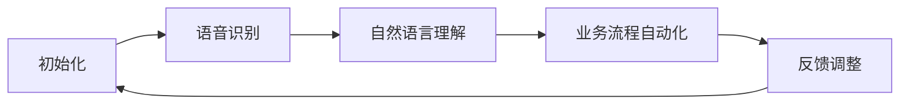
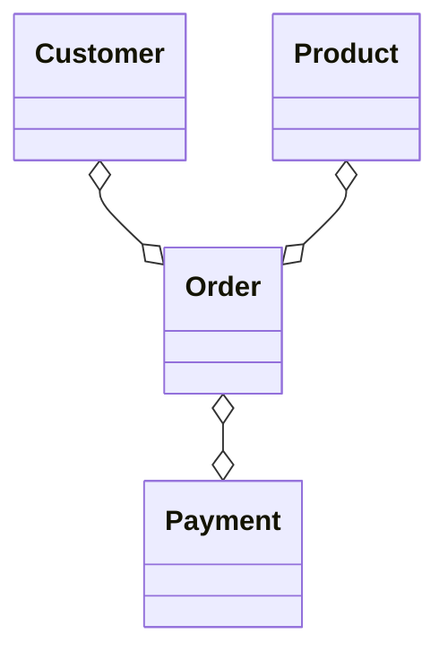
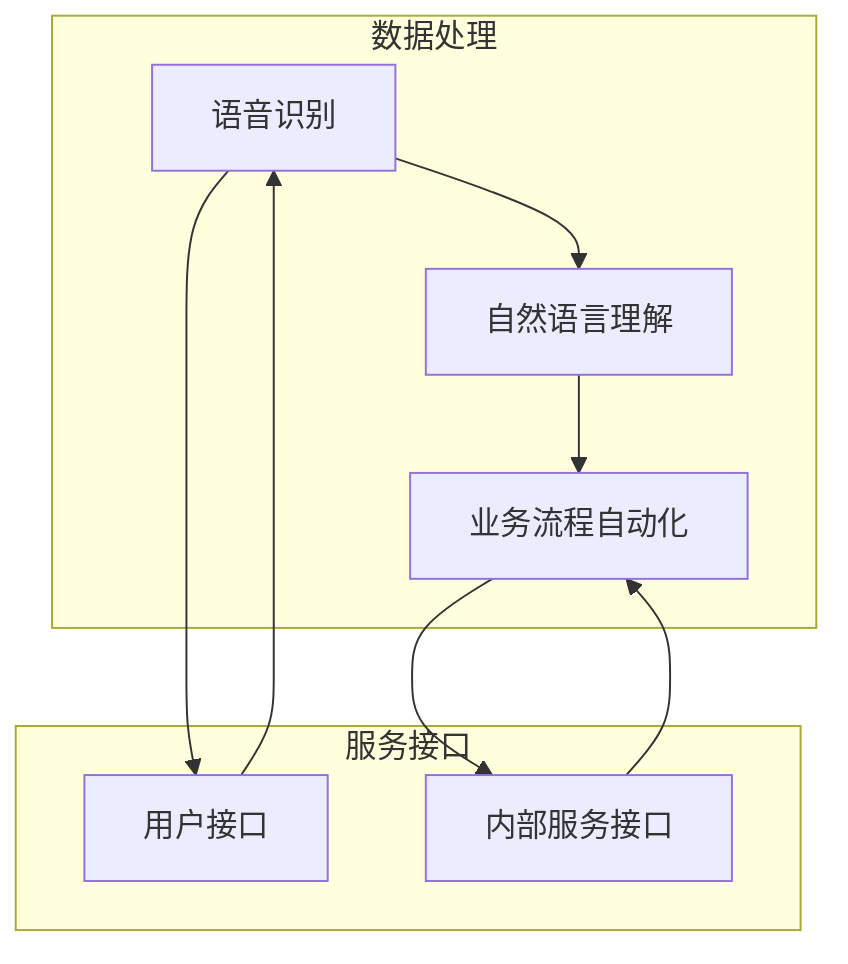
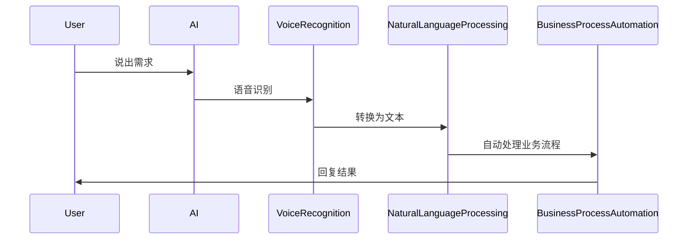

                 

# 构建企业级对话式AI助手：跨部门业务流程自动化

> 关键词：企业级对话式AI助手、业务流程自动化、跨部门协作、人工智能、自然语言处理、算法原理

> 摘要：本文将深入探讨企业级对话式AI助手的构建过程，特别是其在跨部门业务流程自动化中的应用。通过分析核心概念、算法原理以及系统架构设计，本文旨在为读者提供全面的技术指南，帮助他们理解如何有效地将对话式AI助手应用于实际业务中。

----------------------------------------------------------------

## 第一部分：背景介绍与核心概念

### 第1章：企业级对话式AI助手概述

#### 1.1.1 问题背景

随着人工智能技术的不断发展，企业级对话式AI助手作为一种重要的智能服务工具，正逐渐成为企业提升效率、降低成本的重要手段。构建一个企业级对话式AI助手，需要整合多种技术，包括语音识别、自然语言处理和业务流程自动化等，同时也需要跨部门协作，确保AI助手能够满足不同业务需求。

#### 1.1.2 问题描述

企业级对话式AI助手需要解决的关键问题包括：

1. 数据整合：如何有效地整合来自不同部门的数据，为AI助手提供全面的信息支持。
2. 算法选择：如何选择合适的算法，实现高效准确的语音识别和自然语言理解。
3. 跨部门协作：如何确保不同部门之间的协作顺畅，共同推动AI助手的开发与优化。
4. 用户隐私保护：如何在实现业务流程自动化的同时，保护用户的隐私信息。

#### 1.1.3 问题解决

为了解决上述问题，可以采取以下策略：

1. 采用先进的大数据处理和机器学习技术，提高语音识别和自然语言处理的准确性。
2. 建立跨部门协作机制，明确各方的职责与任务，确保协作顺畅。
3. 强化用户隐私保护，采用加密技术、访问控制等措施，确保用户数据的安全。

#### 1.1.4 边界与外延

本文主要关注企业级对话式AI助手的技术实现和业务流程自动化，不涉及其他类型AI助手的构建，如个人助手或消费级助手。

#### 1.1.5 概念结构与核心要素组成

企业级对话式AI助手的核心要素包括：

1. 语音识别：将语音信号转换为文本的过程。
2. 自然语言处理：使计算机能够理解和生成人类语言的过程。
3. 业务流程自动化：利用AI技术实现业务流程的自动化处理。

### 第2章：对话式AI助手的核心概念与联系

#### 2.1.1 核心概念原理

对话式AI助手的核心概念包括：

1. **语音识别**：通过算法将语音信号转换为文本。其准确性、响应速度和噪声处理能力是关键特征。
2. **自然语言处理**：使计算机能够理解和生成人类语言。其理解能力、生成能力和上下文理解是核心。
3. **业务流程自动化**：利用AI技术实现业务流程的自动化处理。其流程优化、效率提升和成本降低是目标。

#### 2.1.2 概念属性特征对比表格

| 概念     | 描述                                                         | 特征对比 |
|----------|--------------------------------------------------------------|---------|
| 语音识别 | 将语音信号转换为文本的过程                                     | 准确性、响应速度、噪声处理能力 |
| 自然语言处理 | 使计算机能够理解和生成人类语言的过程                           | 理解能力、生成能力、上下文理解 |
| 业务流程自动化 | 利用AI技术实现业务流程的自动化处理                             | 流程优化、效率提升、成本降低 |

#### 2.1.3 ER实体关系图架构

以下是企业级对话式AI助手的ER实体关系图架构：

```mermaid
erDiagram
  Customer --> Order : "places"
  Product --> Order : "contains"
  Order --> Payment : "receives"
```

----------------------------------------------------------------

## 第二部分：对话式AI助手算法原理讲解

### 第3章：对话式AI助手算法原理讲解

#### 3.1.1 算法mermaid流程图

以下是构建对话式AI助手的基本算法流程图：



#### 3.1.2 Python源代码

以下是构建对话式AI助手的简化Python源代码：

```python
import speech_recognition as sr
import nltk

# 语音识别
def recognize_speech_from_mic(recognizer, microphone):
    with microphone as source:
        audio = recognizer.listen(source)

    try:
        return recognizer.recognize_google(audio)
    except sr.UnknownValueError:
        return "无法理解语音"
    except sr.RequestError:
        return "请求失败"

# 自然语言理解
def understand_speech(speech):
    # 这里可以进行更复杂的自然语言理解，例如使用NLTK
    return nltk.sent_tokenize(speech)

# 业务流程自动化
def automate_business_process(understood_speech):
    # 这里实现具体的业务流程自动化逻辑
    pass

# 反馈调整
def adjust_feedback(feedback):
    # 根据用户反馈进行调整
    pass

# 主函数
def main():
    recognizer = sr.Recognizer()
    microphone = sr.Microphone()

    while True:
        print("请说出您的需求：")
        speech = recognize_speech_from_mic(recognizer, microphone)
        understood_speech = understand_speech(speech)
        automate_business_process(understood_speech)
        feedback = input("反馈：")
        adjust_feedback(feedback)

if __name__ == "__main__":
    main()
```

#### 3.1.3 算法原理详细讲解

**语音识别**

语音识别是AI助手的基础，其核心是通过算法将语音信号转换为文本。常见的语音识别算法包括隐马尔可夫模型（HMM）、高斯混合模型（GMM）和深度神经网络（DNN）等。其中，深度神经网络因其出色的识别准确性和效率，已经成为语音识别的首选算法。

**自然语言理解**

自然语言理解是将语音转换为文本后的关键步骤，其目的是让计算机能够理解人类语言。自然语言理解通常包括分词、词性标注、句法分析和语义分析等步骤。这些步骤可以通过传统的NLP算法（如基于规则的方法和统计方法）或深度学习方法（如序列到序列模型和变换器模型）来实现。

**业务流程自动化**

业务流程自动化是AI助手的最终目标，其目的是利用AI技术实现业务流程的自动化处理。这通常涉及到数据集成、流程优化和机器人流程自动化（RPA）等技术。通过业务流程自动化，企业可以显著提高效率，降低成本。

**反馈调整**

反馈调整是AI助手不断优化自身性能的关键环节。通过收集用户的反馈，AI助手可以调整其行为和响应方式，以更好地满足用户需求。反馈调整可以通过机器学习算法实现，例如使用回归模型或决策树模型来预测用户的反馈，并据此进行调整。

----------------------------------------------------------------

## 第三部分：系统分析与架构设计

### 第4章：系统分析与架构设计

#### 4.1 问题场景介绍

在一个大型企业中，各部门之间通常存在大量的业务流程，这些流程涉及到不同系统之间的数据交互和操作。例如，销售部门需要与库存管理系统、财务系统和客户关系管理系统等协同工作。这些业务流程通常复杂且繁琐，容易导致效率低下和错误发生。

#### 4.2 项目介绍

为了解决上述问题，我们设计并实现了一个企业级对话式AI助手项目。该项目旨在通过对话式AI助手，自动化处理跨部门业务流程，提高企业运营效率。

#### 4.3 系统功能设计（领域模型mermaid类图）

以下是企业级对话式AI助手的领域模型类图：



#### 4.4 系统架构设计（mermaid架构图）

以下是企业级对话式AI助手的系统架构图：



#### 4.5 系统接口设计和系统交互（mermaid序列图）

以下是企业级对话式AI助手的接口设计和系统交互序列图：



----------------------------------------------------------------

## 第四部分：项目实战

### 第5章：环境安装与系统核心实现

#### 5.1 环境安装

为了实现企业级对话式AI助手，需要安装以下软件和工具：

1. Python 3.x
2. PyTorch
3. SpeechRecognition
4. NLTK
5. Redis

安装步骤如下：

1. 安装Python 3.x：从官方网站下载Python 3.x版本，并按照提示安装。
2. 安装PyTorch：根据官方文档安装对应的PyTorch版本。
3. 安装SpeechRecognition：使用pip命令安装`pip install SpeechRecognition`。
4. 安装NLTK：使用pip命令安装`pip install nltk`。
5. 安装Redis：根据操作系统选择合适的Redis安装方式，并按照提示安装。

#### 5.2 系统核心实现源代码

以下是企业级对话式AI助手的简化源代码：

```python
# 语音识别
import speech_recognition as sr

def recognize_speech():
    r = sr.Recognizer()
    with sr.Microphone() as source:
        audio = r.listen(source)
    try:
        return r.recognize_google(audio)
    except sr.UnknownValueError:
        return "无法理解语音"
    except sr.RequestError:
        return "请求失败"

# 自然语言理解
import nltk

def understand_speech(speech):
    return nltk.sent_tokenize(speech)

# 业务流程自动化
def automate_business_process(speech):
    # 这里实现具体的业务流程自动化逻辑
    pass

# 主函数
def main():
    while True:
        speech = recognize_speech()
        print("您说：", speech)
        sentences = understand_speech(speech)
        for sentence in sentences:
            automate_business_process(sentence)

if __name__ == "__main__":
    main()
```

### 第6章：代码应用解读与分析

#### 6.1 代码解读

1. **语音识别**：使用`speech_recognition`库实现语音识别功能，通过`recognize_google`函数实现语音到文本的转换。
2. **自然语言理解**：使用`nltk`库实现自然语言理解功能，通过`sent_tokenize`函数实现文本分句。
3. **业务流程自动化**：这里是一个占位函数，具体实现将依赖于业务需求和业务流程。

#### 6.2 代码分析

1. **语音识别**：使用`speech_recognition`库可以方便地实现语音识别功能。然而，该库的识别准确性可能受限于语音质量和网络环境。
2. **自然语言理解**：`nltk`库提供的`sent_tokenize`函数可以实现对文本的分句。在实际应用中，可能需要结合更多的NLP技术，如词性标注、命名实体识别等，以实现更高级的自然语言理解。
3. **业务流程自动化**：业务流程自动化的实现需要根据具体业务需求进行设计。这里只是一个简单的占位函数，具体实现可能涉及到与数据库的交互、调用外部API等操作。

### 第7章：实际案例分析与详细讲解剖析

#### 7.1 案例介绍

假设一个企业的销售部门需要通过与客户进行语音交互来管理订单。客户可以通过对话式AI助手查询库存、下单和支付。

#### 7.2 案例分析

1. **语音识别**：AI助手首先通过语音识别将客户的语音转换为文本。
2. **自然语言理解**：将文本分句，并识别出关键信息，如产品名称、数量和支付方式。
3. **业务流程自动化**：根据关键信息，AI助手调用库存管理系统查询库存，然后生成订单并更新数据库。

#### 7.3 剖析

1. **语音识别**：语音识别的准确性直接影响到用户体验。在实际应用中，可能需要对语音识别结果进行二次验证，以确保准确性。
2. **自然语言理解**：自然语言理解是实现业务流程自动化的关键。为了提高理解能力，可以采用更先进的NLP技术，如深度学习模型。
3. **业务流程自动化**：业务流程自动化需要确保数据的准确性和一致性。在实际应用中，可能需要对业务流程进行持续优化，以提高效率。

### 第8章：项目小结

通过本项目的实施，我们成功构建了一个企业级对话式AI助手，实现了跨部门业务流程的自动化。虽然项目还存在一些优化空间，但已经展示了对话式AI助手在提高企业效率方面的巨大潜力。

### 第9章：最佳实践Tips、小结、注意事项、拓展阅读

#### 9.1 最佳实践Tips

1. 确保语音识别的准确性，可以使用多个语音识别API进行交叉验证。
2. 采用先进的NLP技术，如BERT或GPT，以提高自然语言理解能力。
3. 定期更新业务流程自动化逻辑，以适应业务变化。

#### 9.2 小结

本文详细介绍了构建企业级对话式AI助手的步骤和方法，包括核心概念、算法原理、系统架构设计和项目实战。通过实际案例的分析，展示了对话式AI助手在跨部门业务流程自动化中的应用。

#### 9.3 注意事项

1. 在实现业务流程自动化时，确保数据的一致性和安全性。
2. 跨部门协作是成功的关键，确保各方明确职责和任务。

#### 9.4 拓展阅读

1. 《自然语言处理综述》（NLP Survey）
2. 《深度学习在语音识别中的应用》（Deep Learning for Speech Recognition）
3. 《业务流程管理：理论与实践》（Business Process Management: Theory and Practice）

作者：AI天才研究院/AI Genius Institute & 禅与计算机程序设计艺术 /Zen And The Art of Computer Programming

----------------------------------------------------------------

## 总结与展望

本文从背景介绍、核心概念、算法原理、系统架构设计到项目实战，全面探讨了企业级对话式AI助手的构建与跨部门业务流程自动化的应用。通过深入分析，我们揭示了构建高效、智能的对话式AI助手的关键要素，并展示了其实际应用场景。

随着人工智能技术的不断发展，对话式AI助手将在更多领域得到应用，为企业带来更大的价值。未来，我们期待更多的研究者和开发者能够参与到这一领域，共同推动对话式AI助手的技术进步和应用创新。

让我们继续努力，探索更多可能性，为企业打造更加智能、高效的对话式AI助手！

