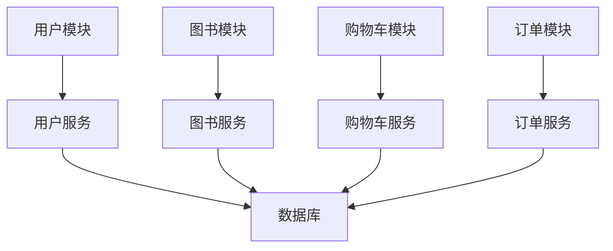
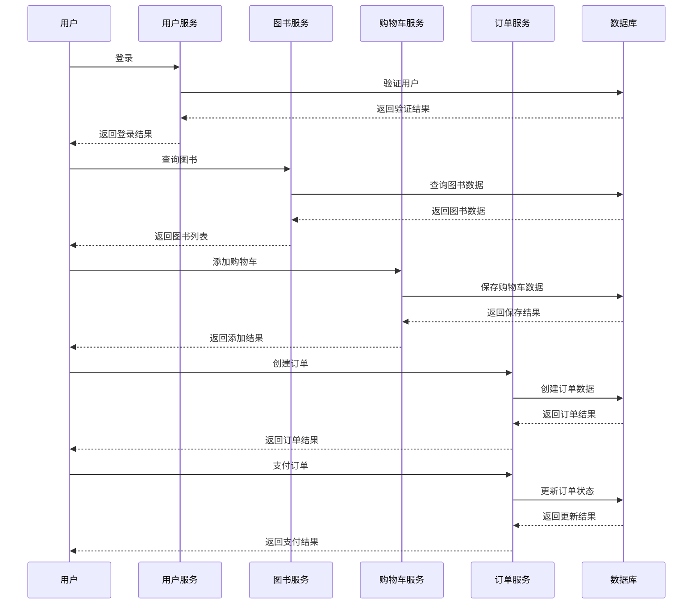
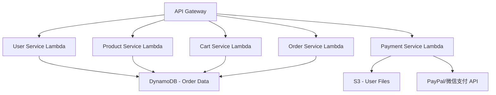

                 

### 引言与背景

#### 第1章: serverless架构概述

##### 1.1 问题背景

在互联网和云计算技术迅速发展的今天，服务器架构也经历了多次变革。从最初的物理服务器到虚拟化技术，再到容器化架构，服务器架构的演化体现了技术对效率和灵活性的追求。然而，传统服务器架构仍面临一些显著的局限性：

1. **资源管理复杂**：传统的服务器架构需要手动配置和管理服务器资源，包括硬件采购、安装操作系统、配置网络等，这些步骤繁琐且容易出错。
2. **扩展性不足**：传统服务器架构的扩展性较差，通常需要提前预测业务需求，进行资源预留和扩展，而实际需求可能与预测存在偏差，导致资源浪费或不足。
3. **运维成本高**：传统服务器架构的运维工作量大，需要专业的运维团队进行监控、故障排查和系统升级等，增加了运营成本。
4. **业务响应速度慢**：传统服务器架构在处理高并发请求时，往往需要较长的时间来响应，影响了用户体验。

为解决上述问题，业界逐渐引入了serverless架构，这是一种以函数即服务（Function as a Service, FaaS）为核心的计算模型，旨在通过自动化的资源管理和事件驱动的执行方式，简化服务器架构的部署和运维，提升业务响应速度和扩展性。

##### 1.2 serverless架构的定义与核心概念

**serverless架构的定义**：

serverless架构是一种云计算模型，它允许开发者仅关注应用逻辑的开发，无需管理底层硬件和操作系统。在serverless架构中，云服务提供商负责管理基础设施，包括计算资源、存储和网络，而开发者则专注于编写和部署代码。

**serverless架构的核心概念**：

1. **函数即服务（FaaS）**：FaaS模型将应用拆分为多个独立的函数，每个函数负责处理特定的业务逻辑。这些函数可以按需执行，无需长时间运行，从而降低了资源浪费。
2. **事件驱动**：serverless架构通过事件触发函数的执行。当某个事件发生时，如用户请求、数据变更等，相关函数会被自动调用。
3. **无服务器（Serverless）**：尽管名称中有“无服务器”，但实际上serverless架构仍然使用了服务器，只是这些服务器由云服务提供商管理，开发者无需直接操作。

**serverless架构与传统云计算架构的对比**：

- **资源管理**：在传统云计算架构中，开发者需要手动配置和管理服务器资源，而在serverless架构中，资源管理由云服务提供商自动完成。
- **扩展性**：serverless架构具有自动扩展的能力，可以根据实际需求动态调整计算资源，而传统云计算架构通常需要开发者手动进行资源扩展。
- **运维成本**：serverless架构简化了运维工作，减少了人工干预，从而降低了运维成本。
- **开发模式**：serverless架构支持微服务开发模式，使得应用更加模块化，便于管理和扩展。

##### 1.3 serverless架构的优势与挑战

**serverless架构的优势**：

1. **自动化资源管理**：serverless架构自动处理计算资源的管理，包括实例的创建、扩展和销毁，使得开发者可以专注于业务逻辑的实现。
2. **成本效益**：由于serverless架构按需付费，开发者只需为实际使用的计算资源付费，从而降低了成本。
3. **快速部署**：serverless架构支持快速部署和迭代，使得开发者可以迅速响应市场变化。
4. **高可用性**：serverless架构通常由云服务提供商托管，提供了高可用性和容错能力。

**serverless架构面临的挑战**：

1. **性能瓶颈**：serverless架构中的函数执行时间有限，对于需要长时间运行的任务，可能会导致性能瓶颈。
2. **依赖复杂性**：serverless架构中，函数之间的依赖关系可能变得复杂，需要仔细设计和维护。
3. **安全性**：serverless架构中的函数可能会暴露敏感数据，需要采取额外的安全措施。
4. **监控与调试**：serverless架构的监控和调试相对复杂，需要开发者具备一定的技能和工具。

**挑战解决策略**：

1. **性能优化**：通过优化函数代码和提高网络性能，可以缓解性能瓶颈。
2. **依赖管理**：采用模块化和封装的方式，减少函数之间的依赖关系。
3. **安全性增强**：采用加密、访问控制等技术，确保函数和数据的保密性。
4. **监控与调试工具**：使用专业的监控和调试工具，帮助开发者更好地管理和调试serverless架构。

##### 1.4 本章小结

通过对serverless架构的概述，我们了解到它是一种以函数即服务和事件驱动为核心的云计算模型，旨在解决传统服务器架构的局限性。serverless架构具有自动化资源管理、成本效益、快速部署和高可用性等优势，但同时也面临着性能瓶颈、依赖复杂性、安全性和监控调试等挑战。本章为后续章节的内容奠定了基础，接下来我们将深入探讨serverless架构的技术基础和实战应用。

关键词：serverless架构、函数即服务、事件驱动、性能优化、案例分析

摘要：本文介绍了serverless架构的概念、优势与挑战，探讨了其技术基础和实践应用，为开发者提供了构建可扩展serverless架构的思路和方法。

----------------------------------------------------------------

## 第一部分: 引言与背景

### 第1章: serverless架构概述

#### 1.1 问题背景

在互联网时代，服务器架构的演变一直伴随着技术进步的需求。从最初的物理服务器时代到虚拟化技术，再到容器化架构，服务器架构的不断演进旨在提高系统的灵活性和效率。然而，随着业务规模的扩大和复杂度的增加，传统服务器架构逐渐暴露出其局限性。

**引言：服务器架构的发展历程**

- **物理服务器**：最早的服务器架构依赖于物理服务器，其优点在于稳定性和性能较高，但缺点是管理复杂、扩展性差，且硬件采购和维护成本高。
- **虚拟化技术**：虚拟化技术的出现，使得多个虚拟机可以在同一物理服务器上运行，从而提高了资源利用率和扩展性。然而，虚拟化技术也带来了新的挑战，如虚拟机的管理、网络配置和存储管理。
- **容器化架构**：容器化技术，如Docker，通过轻量级虚拟化方式，解决了虚拟化技术的许多问题，如启动速度、资源隔离和共享。容器化架构使得应用可以更加灵活地部署和管理。

**问题描述：传统服务器架构的局限性**

尽管容器化架构在一定程度上解决了传统服务器架构的问题，但仍然存在以下局限性：

1. **资源管理复杂**：传统服务器架构需要手动配置和管理服务器资源，包括硬件采购、安装操作系统、配置网络等。这些步骤繁琐且容易出错，增加了运维成本。
2. **扩展性不足**：传统服务器架构的扩展性较差，通常需要提前预测业务需求，进行资源预留和扩展。然而，实际需求可能与预测存在偏差，导致资源浪费或不足。
3. **运维成本高**：传统服务器架构的运维工作量大，需要专业的运维团队进行监控、故障排查和系统升级等。这些运维活动不仅增加了人力成本，也降低了系统的可用性和可靠性。
4. **业务响应速度慢**：传统服务器架构在处理高并发请求时，往往需要较长的时间来响应，影响了用户体验。同时，长时间运行的进程也增加了系统的负载，降低了资源利用率。

**问题解决：引入serverless架构**

为了解决传统服务器架构的局限性，业界逐渐引入了serverless架构。serverless架构是一种基于云的服务模型，旨在通过自动化的资源管理和事件驱动的执行方式，简化服务器架构的部署和运维，提高系统的灵活性和效率。

**边界与外延：serverless架构与传统服务器架构的区别**

serverless架构与传统服务器架构在以下几个方面有显著区别：

1. **资源管理**：在传统服务器架构中，开发者需要手动配置和管理服务器资源，而在serverless架构中，资源管理由云服务提供商自动完成。开发者只需关注应用逻辑的实现，无需关心底层硬件和操作系统。
2. **扩展性**：serverless架构具有自动扩展的能力，可以根据实际需求动态调整计算资源，而传统服务器架构通常需要开发者手动进行资源扩展。这种自动扩展能力使得serverless架构能够更好地应对业务需求的变化。
3. **运维成本**：serverless架构简化了运维工作，减少了人工干预，从而降低了运维成本。开发者可以将更多的时间和精力投入到业务开发中，提高生产效率。
4. **开发模式**：serverless架构支持微服务开发模式，使得应用更加模块化，便于管理和扩展。与传统服务器架构相比，serverless架构能够更好地适应快速变化的业务需求。

通过引入serverless架构，开发者可以摆脱传统服务器架构的束缚，实现更高效、更灵活、更可靠的系统建设。

#### 1.2 serverless架构的定义与核心概念

**serverless架构的定义**：

serverless架构是一种云计算模型，它允许开发者仅关注应用逻辑的开发，无需管理底层硬件和操作系统。在serverless架构中，云服务提供商负责管理基础设施，包括计算资源、存储和网络，而开发者则专注于编写和部署代码。

**serverless架构的核心概念**：

1. **函数即服务（FaaS）**：函数即服务（FaaS）是serverless架构的核心，它将应用拆分为多个独立的函数，每个函数负责处理特定的业务逻辑。这些函数可以按需执行，无需长时间运行，从而降低了资源浪费。
2. **事件驱动**：serverless架构通过事件触发函数的执行。当某个事件发生时，如用户请求、数据变更等，相关函数会被自动调用。事件驱动使得应用可以更加灵活地响应用户需求。
3. **无服务器（Serverless）**：尽管名称中有“无服务器”，但实际上serverless架构仍然使用了服务器，只是这些服务器由云服务提供商管理，开发者无需直接操作。

**serverless架构与传统云计算架构的对比**：

- **资源管理**：在传统云计算架构中，开发者需要手动配置和管理服务器资源，而在serverless架构中，资源管理由云服务提供商自动完成。
- **扩展性**：serverless架构具有自动扩展的能力，可以根据实际需求动态调整计算资源，而传统云计算架构通常需要开发者手动进行资源扩展。
- **运维成本**：serverless架构简化了运维工作，减少了人工干预，从而降低了运维成本。
- **开发模式**：serverless架构支持微服务开发模式，使得应用更加模块化，便于管理和扩展。

#### 1.3 serverless架构的优势与挑战

**serverless架构的优势**：

1. **自动化资源管理**：serverless架构自动处理计算资源的管理，包括实例的创建、扩展和销毁，使得开发者可以专注于业务逻辑的实现。
2. **成本效益**：由于serverless架构按需付费，开发者只需为实际使用的计算资源付费，从而降低了成本。
3. **快速部署**：serverless架构支持快速部署和迭代，使得开发者可以迅速响应市场变化。
4. **高可用性**：serverless架构通常由云服务提供商托管，提供了高可用性和容错能力。

**serverless架构面临的挑战**：

1. **性能瓶颈**：serverless架构中的函数执行时间有限，对于需要长时间运行的任务，可能会导致性能瓶颈。
2. **依赖复杂性**：serverless架构中，函数之间的依赖关系可能变得复杂，需要仔细设计和维护。
3. **安全性**：serverless架构中的函数可能会暴露敏感数据，需要采取额外的安全措施。
4. **监控与调试**：serverless架构的监控和调试相对复杂，需要开发者具备一定的技能和工具。

**挑战解决策略**：

1. **性能优化**：通过优化函数代码和提高网络性能，可以缓解性能瓶颈。
2. **依赖管理**：采用模块化和封装的方式，减少函数之间的依赖关系。
3. **安全性增强**：采用加密、访问控制等技术，确保函数和数据的保密性。
4. **监控与调试工具**：使用专业的监控和调试工具，帮助开发者更好地管理和调试serverless架构。

#### 1.4 本章小结

通过对serverless架构的概述，我们了解到它是一种以函数即服务和事件驱动为核心的云计算模型，旨在解决传统服务器架构的局限性。serverless架构具有自动化资源管理、成本效益、快速部署和高可用性等优势，但同时也面临着性能瓶颈、依赖复杂性、安全性和监控调试等挑战。本章为后续章节的内容奠定了基础，接下来我们将深入探讨serverless架构的技术基础和实战应用。

----------------------------------------------------------------

### 第二部分: serverless架构原理

#### 第2章: serverless架构技术基础

#### 2.1 函数即服务（FaaS）模型

**FaaS模型的基本原理**

函数即服务（FaaS）模型是一种云计算服务模型，它允许开发者将应用程序分解为离散的函数，并通过事件触发这些函数的执行。FaaS模型的核心思想是让开发者专注于编写和部署函数，而无需关心底层基础设施的管理。

在FaaS模型中，开发者只需上传函数代码，云服务提供商负责管理函数的运行环境、自动扩展和弹性伸缩。当有事件发生时，如用户请求、数据变更等，相关函数会被自动调用，执行完成后自动销毁，从而实现按需计算。

**FaaS模型的优势**

1. **简化开发**：FaaS模型使得开发者可以更专注于业务逻辑的实现，无需关心底层基础设施的管理和运维，从而提高了开发效率。
2. **弹性伸缩**：FaaS模型可以根据实际需求自动扩展和缩小计算资源，确保应用在高并发情况下能够稳定运行。
3. **低成本**：由于FaaS模型按需付费，开发者只需为实际使用的计算资源付费，从而降低了成本。
4. **高可用性**：FaaS模型通常由云服务提供商托管，提供了高可用性和容错能力。

**FaaS模型的典型实现（如AWS Lambda、Google Cloud Functions等）**

1. **AWS Lambda**：AWS Lambda是亚马逊提供的FaaS服务，允许开发者使用多种编程语言编写函数，并自动运行在AWS云环境中。AWS Lambda提供了丰富的集成服务，如API网关、S3事件触发器等，方便开发者构建和部署FaaS应用。
2. **Google Cloud Functions**：Google Cloud Functions是谷歌提供的FaaS服务，支持多种编程语言，如JavaScript、Python和Go等。Google Cloud Functions可以与Google Cloud Platform的其他服务无缝集成，如Google Cloud Storage、Google Pub/Sub等。

**FaaS模型的工作流程**

1. **上传函数**：开发者将函数代码上传到云服务提供商，并配置相关元数据，如函数名称、触发器等。
2. **函数部署**：云服务提供商自动构建和部署函数，为函数分配计算资源。
3. **事件触发**：当有事件发生时，如用户请求、数据变更等，云服务提供商会自动触发相关函数的执行。
4. **函数执行**：函数执行完成后，返回结果并释放计算资源。

**FaaS模型的优缺点分析**

**优点**：

1. **简化开发**：FaaS模型使得开发者可以更专注于业务逻辑的实现，无需关心底层基础设施的管理和运维。
2. **弹性伸缩**：FaaS模型可以根据实际需求自动扩展和缩小计算资源，确保应用在高并发情况下能够稳定运行。
3. **低成本**：由于FaaS模型按需付费，开发者只需为实际使用的计算资源付费，从而降低了成本。
4. **高可用性**：FaaS模型通常由云服务提供商托管，提供了高可用性和容错能力。

**缺点**：

1. **函数执行时间限制**：FaaS模型中的函数通常有执行时间限制，对于需要长时间运行的任务，可能会导致性能瓶颈。
2. **依赖复杂性**：FaaS模型中，函数之间的依赖关系可能变得复杂，需要仔细设计和维护。
3. **安全性**：FaaS模型中的函数可能会暴露敏感数据，需要采取额外的安全措施。

**FaaS模型的应用场景**

1. **事件处理**：FaaS模型非常适合处理事件驱动的任务，如用户请求、数据变更等。
2. **后台任务**：FaaS模型可以用于处理后台任务，如数据清洗、报告生成等。
3. **微服务架构**：FaaS模型可以用于实现微服务架构中的微服务，提高系统的灵活性和可维护性。

**总结**：

FaaS模型是serverless架构的核心，它通过自动化的资源管理和事件驱动的执行方式，简化了服务器架构的部署和运维，提高了系统的灵活性和效率。FaaS模型的典型实现，如AWS Lambda和Google Cloud Functions，为开发者提供了丰富的功能和服务，使得构建和部署FaaS应用变得更加简单和高效。

#### 2.2 事件驱动架构

**事件驱动架构的概念**

事件驱动架构是一种软件开发模式，其核心思想是将应用程序的执行流程基于事件触发。在事件驱动架构中，应用程序由多个独立的组件组成，每个组件负责处理特定类型的事件。当某个事件发生时，相关组件会被触发，执行相应的处理逻辑。

**事件驱动架构的优势**

1. **高可扩展性**：事件驱动架构可以轻松扩展，只需添加新的组件来处理新的事件，而无需修改现有组件。
2. **高灵活性**：事件驱动架构允许应用程序根据实际需求动态调整执行流程，提高了系统的灵活性。
3. **高并发处理能力**：事件驱动架构可以同时处理多个事件，提高了系统的并发处理能力。
4. **易于维护**：事件驱动架构使得应用程序的各个组件职责清晰，便于维护和升级。

**实现事件驱动架构的技术栈**

1. **事件队列**：事件队列是实现事件驱动架构的核心组件，它负责存储和传递事件。常见的消息队列服务包括RabbitMQ、Kafka和Amazon SQS等。
2. **事件处理器**：事件处理器是负责处理特定类型事件的组件。事件处理器可以根据需求实现不同的功能，如数据转换、存储和通知等。
3. **数据存储**：数据存储用于存储事件处理的结果和相关的数据。常见的存储服务包括关系型数据库、NoSQL数据库和文件存储等。

**典型事件驱动架构案例**

1. **Web应用**：Web应用通常采用事件驱动架构，如用户请求、页面跳转等事件由前端组件处理，后端组件负责处理业务逻辑。
2. **物联网（IoT）应用**：IoT应用通过传感器收集数据，并触发相应的事件处理器进行数据分析和处理。

**事件驱动架构与serverless架构的关系**

事件驱动架构是serverless架构的重要组成部分，两者相互结合可以提供强大的功能和服务。事件驱动架构使得serverless架构中的函数可以根据实际需求动态触发，而serverless架构则提供了自动化的资源管理和弹性伸缩能力，使得事件驱动架构更加高效和可靠。

**总结**：

事件驱动架构通过将应用程序的执行流程基于事件触发，提供了高可扩展性、高灵活性和高并发处理能力。实现事件驱动架构的技术栈包括事件队列、事件处理器和数据存储等。事件驱动架构与serverless架构相结合，可以提供强大的功能和服务，为开发者构建灵活、高效的系统提供了有力支持。

#### 2.3 serverless架构的设计模式

**serverless架构中的常见设计模式**

在serverless架构中，设计模式是提高系统可维护性、可扩展性和性能的重要手段。以下是一些在serverless架构中常见的设计模式：

1. **无状态设计模式**：无状态设计模式要求函数不保存任何状态信息，每次执行都是独立的。这种模式可以提高系统的可扩展性和性能，但需要确保所有状态信息都存储在外部系统中，如数据库或缓存。
2. **状态管理设计模式**：状态管理设计模式允许函数保存部分状态信息，以便在后续执行中恢复。这种模式适用于需要处理长时间运行任务的场景，但会增加系统的复杂性。
3. **微服务设计模式**：微服务设计模式将应用分解为多个独立的微服务，每个微服务负责处理特定的业务功能。这种模式提高了系统的可维护性和可扩展性，但需要确保微服务之间的通信和协调。
4. **事件驱动设计模式**：事件驱动设计模式基于事件触发函数执行，适用于处理事件驱动的任务，如用户请求、数据变更等。这种模式提供了高并发处理能力和灵活性。
5. **异步处理设计模式**：异步处理设计模式通过异步调用和回调机制，实现任务的无阻塞执行。这种模式适用于处理长时间运行的任务，可以提高系统的性能和响应速度。

**设计模式的优缺点分析**

- **无状态设计模式**：
  - 优点：提高系统的可扩展性和性能，无需保存状态信息，简化了系统设计。
  - 缺点：需要依赖外部存储系统来保存状态信息，增加了系统的复杂性和依赖。
- **状态管理设计模式**：
  - 优点：支持长时间运行任务的处理，提高系统的可维护性和可扩展性。
  - 缺点：增加了系统的复杂性，需要确保状态信息的正确性和一致性。
- **微服务设计模式**：
  - 优点：提高系统的可维护性和可扩展性，便于管理和部署。
  - 缺点：增加了系统的复杂性，需要确保微服务之间的通信和协调。
- **事件驱动设计模式**：
  - 优点：提供高并发处理能力和灵活性，适用于处理事件驱动的任务。
  - 缺点：需要设计合理的事件处理流程，确保系统的稳定性和可靠性。
- **异步处理设计模式**：
  - 优点：提高系统的性能和响应速度，适用于处理长时间运行的任务。
  - 缺点：增加了系统的复杂性和调试难度，需要确保异步调用的正确性和一致性。

**设计模式的实际应用案例**

1. **无状态设计模式**：在处理临时性任务时，如生成报告或处理批量数据，可以使用无状态设计模式，确保任务的高效执行。
2. **状态管理设计模式**：在处理长时间运行的任务时，如数据处理和报告生成，可以使用状态管理设计模式，确保任务的状态信息得到正确保存和恢复。
3. **微服务设计模式**：在构建大型企业级应用时，可以使用微服务设计模式，将应用分解为多个独立的微服务，提高系统的可维护性和可扩展性。
4. **事件驱动设计模式**：在处理用户请求和数据变更时，可以使用事件驱动设计模式，提高系统的灵活性和响应速度。
5. **异步处理设计模式**：在处理后台任务时，如数据备份和日志分析，可以使用异步处理设计模式，提高系统的性能和响应速度。

**总结**：

serverless架构中的设计模式通过优化系统结构和流程，提高了系统的可维护性、可扩展性和性能。无状态设计模式、状态管理设计模式、微服务设计模式、事件驱动设计模式和异步处理设计模式等常见设计模式，各有优缺点和适用场景。开发者应根据实际需求选择合适的设计模式，构建高效的serverless架构。

#### 2.4 serverless架构的安全性

**serverless架构的安全挑战**

serverless架构在提供灵活性和成本效益的同时，也带来了一系列安全挑战：

1. **函数暴露风险**：serverless架构中的函数可以直接访问底层资源和外部服务，若配置不当，可能导致敏感数据泄露或未经授权的访问。
2. **权限管理复杂**：serverless架构涉及多个云服务和第三方服务，权限管理变得复杂，容易出现权限滥用或不当配置的问题。
3. **函数之间的依赖关系**：serverless架构中，函数之间的依赖关系可能导致安全漏洞的传播，一个函数的安全问题可能影响整个系统。
4. **数据传输安全**：在serverless架构中，数据通常通过API或消息队列传输，若未采用加密和认证机制，可能导致数据泄露。

**保障serverless架构安全的技术手段**

1. **加密和密钥管理**：使用加密算法对敏感数据进行加密，确保数据在传输和存储过程中安全。同时，采用安全的密钥管理机制，如KMS（Key Management Service），确保密钥的安全性和合规性。
2. **访问控制和权限管理**：采用精细的访问控制策略，确保只有授权用户和系统可以访问敏感数据和功能。使用IAM（Identity and Access Management）服务，如AWS IAM或Azure Active Directory，实现统一的权限管理和审计。
3. **安全编码实践**：在开发过程中遵循安全编码实践，如避免SQL注入、XSS攻击等，确保代码的安全性。使用静态代码分析工具和安全测试工具，如SonarQube和OWASP ZAP，发现和修复潜在的安全漏洞。
4. **网络隔离和防火墙**：通过VPC（Virtual Private Cloud）和防火墙，限制函数之间的网络通信，确保内部网络的安全性。使用WAF（Web Application Firewall）保护API网关，防止外部攻击。
5. **持续监控和审计**：采用实时监控和日志分析工具，如ELK（Elasticsearch, Logstash, Kibana）栈和Splunk，及时发现和响应安全事件。定期进行安全审计，确保系统配置和操作符合安全标准。

**实际安全案例与经验总结**

1. **案例1**：某企业使用AWS Lambda处理用户数据，由于权限配置不当，导致外部用户可以访问敏感数据。通过使用AWS IAM和VPC，重新配置权限和隔离网络，解决了数据泄露问题。
2. **案例2**：某平台使用多个第三方服务，由于依赖管理不当，导致安全漏洞传播。通过采用CI/CD（Continuous Integration and Continuous Deployment）流程和安全测试工具，确保第三方服务的安全性和兼容性。
3. **案例3**：某应用使用API网关处理用户请求，由于未使用WAF，导致遭受恶意攻击。通过引入WAF和防火墙，阻止外部攻击，提高了系统的安全性。

**总结**：

serverless架构在提供便捷性和高效性的同时，也带来了一系列安全挑战。通过采用加密和密钥管理、访问控制和权限管理、安全编码实践、网络隔离和防火墙以及持续监控和审计等技术手段，可以保障serverless架构的安全性。实际案例和经验总结为开发者提供了宝贵的经验和参考，有助于构建安全的serverless应用。

#### 2.5 本章小结

通过对serverless架构的技术基础进行深入探讨，我们了解了函数即服务（FaaS）模型的基本原理和优势，事件驱动架构的概念和实现技术栈，以及serverless架构中的常见设计模式和安全保障措施。这些内容为我们构建可扩展的serverless架构提供了坚实的基础。在下一部分中，我们将进入serverless架构的实战阶段，通过具体的项目设计和性能优化，进一步探索serverless架构的实践应用。

----------------------------------------------------------------

## 第二部分: serverless架构原理

### 第2章: serverless架构技术基础

#### 2.1 函数即服务（FaaS）模型

**FaaS模型的基本原理**

函数即服务（FaaS）模型是一种云计算服务模型，它允许开发者将应用程序分解为离散的函数，并通过事件触发这些函数的执行。FaaS模型的核心思想是让开发者专注于编写和部署函数，而无需关心底层基础设施的管理。

在FaaS模型中，开发者只需上传函数代码，云服务提供商负责管理函数的运行环境、自动扩展和弹性伸缩。当有事件发生时，如用户请求、数据变更等，相关函数会被自动调用，执行完成后自动销毁，从而实现按需计算。

**FaaS模型的优势**

1. **简化开发**：FaaS模型使得开发者可以更专注于业务逻辑的实现，无需关心底层基础设施的管理和运维，从而提高了开发效率。
2. **弹性伸缩**：FaaS模型可以根据实际需求自动扩展和缩小计算资源，确保应用在高并发情况下能够稳定运行。
3. **低成本**：由于FaaS模型按需付费，开发者只需为实际使用的计算资源付费，从而降低了成本。
4. **高可用性**：FaaS模型通常由云服务提供商托管，提供了高可用性和容错能力。

**FaaS模型的典型实现（如AWS Lambda、Google Cloud Functions等）**

1. **AWS Lambda**：AWS Lambda是亚马逊提供的FaaS服务，允许开发者使用多种编程语言编写函数，并自动运行在AWS云环境中。AWS Lambda提供了丰富的集成服务，如API网关、S3事件触发器等，方便开发者构建和部署FaaS应用。
2. **Google Cloud Functions**：Google Cloud Functions是谷歌提供的FaaS服务，支持多种编程语言，如JavaScript、Python和Go等。Google Cloud Functions可以与Google Cloud Platform的其他服务无缝集成，如Google Cloud Storage、Google Pub/Sub等。

**FaaS模型的工作流程**

1. **上传函数**：开发者将函数代码上传到云服务提供商，并配置相关元数据，如函数名称、触发器等。
2. **函数部署**：云服务提供商自动构建和部署函数，为函数分配计算资源。
3. **事件触发**：当有事件发生时，如用户请求、数据变更等，云服务提供商会自动触发相关函数的执行。
4. **函数执行**：函数执行完成后，返回结果并释放计算资源。

**FaaS模型的优缺点分析**

**优点**：

1. **简化开发**：FaaS模型使得开发者可以更专注于业务逻辑的实现，无需关心底层基础设施的管理和运维。
2. **弹性伸缩**：FaaS模型可以根据实际需求自动扩展和缩小计算资源，确保应用在高并发情况下能够稳定运行。
3. **低成本**：由于FaaS模型按需付费，开发者只需为实际使用的计算资源付费，从而降低了成本。
4. **高可用性**：FaaS模型通常由云服务提供商托管，提供了高可用性和容错能力。

**缺点**：

1. **函数执行时间限制**：FaaS模型中的函数通常有执行时间限制，对于需要长时间运行的任务，可能会导致性能瓶颈。
2. **依赖复杂性**：FaaS模型中，函数之间的依赖关系可能变得复杂，需要仔细设计和维护。
3. **安全性**：FaaS模型中的函数可能会暴露敏感数据，需要采取额外的安全措施。

**FaaS模型的应用场景**

1. **事件处理**：FaaS模型非常适合处理事件驱动的任务，如用户请求、数据变更等。
2. **后台任务**：FaaS模型可以用于处理后台任务，如数据清洗、报告生成等。
3. **微服务架构**：FaaS模型可以用于实现微服务架构中的微服务，提高系统的灵活性和可维护性。

**总结**：

FaaS模型是serverless架构的核心，它通过自动化的资源管理和事件驱动的执行方式，简化了服务器架构的部署和运维，提高了系统的灵活性和效率。FaaS模型的典型实现，如AWS Lambda和Google Cloud Functions，为开发者提供了丰富的功能和服务，使得构建和部署FaaS应用变得更加简单和高效。

----------------------------------------------------------------

## 第3章: serverless架构项目设计

#### 3.1 项目背景与需求分析

**项目介绍**

本项目旨在设计并实现一个基于serverless架构的在线书店系统。该系统提供用户注册、图书搜索、购物车管理和订单处理等功能。通过serverless架构，我们期望实现系统的快速部署、灵活扩展和高效运维。

**需求分析**

1. **用户注册与认证**：系统需要支持用户注册和登录功能，确保用户信息的安全性和隐私保护。
2. **图书信息管理**：系统需要提供图书的增删改查功能，支持图书分类和标签功能。
3. **购物车管理**：系统需要支持用户将图书添加到购物车，实现购物车中图书的增删改查。
4. **订单处理**：系统需要支持用户下单、订单支付和订单查询功能。
5. **性能与可用性**：系统需要具备高性能和高可用性，能够应对高并发请求。

**项目目标**

1. **快速部署**：通过serverless架构，实现系统的快速部署和迭代。
2. **灵活扩展**：系统应具备良好的扩展性，能够根据业务需求动态调整资源。
3. **高效运维**：简化运维工作，降低运维成本，提高系统稳定性。

#### 3.2 系统功能设计

**功能模块划分**

1. **用户模块**：包括用户注册、登录、个人信息管理等功能。
2. **图书模块**：包括图书信息管理、图书分类和标签管理等功能。
3. **购物车模块**：包括购物车管理、图书添加和删除等功能。
4. **订单模块**：包括订单创建、订单支付和订单查询等功能。

**功能说明**

1. **用户模块**：
   - 用户注册：用户可以通过注册页面创建账号，输入用户名、密码、邮箱等信息。
   - 用户登录：用户通过账号和密码登录系统，访问个人中心和相关功能。
   - 个人信息管理：用户可以查看和修改个人信息，如姓名、邮箱、地址等。

2. **图书模块**：
   - 图书信息管理：管理员可以添加、编辑和删除图书信息，包括书名、作者、价格等。
   - 图书分类和标签管理：管理员可以定义图书分类和标签，便于用户搜索和浏览图书。

3. **购物车模块**：
   - 购物车管理：用户可以将图书添加到购物车，查看购物车中的图书，进行修改和删除。
   - 图书添加和删除：用户可以将图书添加到购物车，也可以从购物车中删除图书。

4. **订单模块**：
   - 订单创建：用户可以在购物车中创建订单，填写收货地址和支付方式。
   - 订单支付：用户可以通过支付宝、微信支付等第三方支付平台进行支付。
   - 订单查询：用户可以查询订单状态，包括待支付、待发货、已发货和已完成等。

#### 3.3 系统架构设计

**系统架构图（使用Mermaid架构图表示）**

**系统模块说明**

1. **用户模块**：用户模块包括用户注册、登录和用户信息管理等功能，通过用户服务与数据库进行交互。
2. **图书模块**：图书模块包括图书信息管理、图书分类和标签管理等功能，通过图书服务与数据库进行交互。
3. **购物车模块**：购物车模块包括购物车管理、图书添加和删除等功能，通过购物车服务与数据库进行交互。
4. **订单模块**：订单模块包括订单创建、订单支付和订单查询等功能，通过订单服务与数据库进行交互。

**架构优缺点分析**

**优点**：

1. **高可扩展性**：通过微服务架构设计，各个模块可以独立扩展和升级，提高了系统的可扩展性。
2. **高可用性**：通过将服务模块与数据库分离，确保了系统的高可用性，即使某个模块发生故障，其他模块仍然可以正常运行。
3. **简化运维**：通过serverless架构，简化了运维工作，降低了运维成本。

**缺点**：

1. **依赖复杂性**：由于各个模块之间通过网络进行通信，增加了系统的依赖复杂性，需要确保各个模块之间的通信稳定和高效。
2. **安全性**：serverless架构中的函数和API可能存在安全漏洞，需要采取额外的安全措施，如加密和访问控制。

#### 3.4 系统接口设计

**接口规范**

1. **用户模块**：
   - 注册接口：POST /api/users/register
   - 登录接口：POST /api/users/login
   - 个人信息接口：GET /api/users/profile
   - 修改个人信息接口：PUT /api/users/profile

2. **图书模块**：
   - 添加图书接口：POST /api/books
   - 删除图书接口：DELETE /api/books/{bookId}
   - 更新图书接口：PUT /api/books/{bookId}
   - 查询图书接口：GET /api/books?categoryId={categoryId}&tag={tag}

3. **购物车模块**：
   - 添加购物车接口：POST /api/cart
   - 删除购物车接口：DELETE /api/cart/{itemId}
   - 更新购物车接口：PUT /api/cart/{itemId}
   - 查询购物车接口：GET /api/cart

4. **订单模块**：
   - 创建订单接口：POST /api/orders
   - 查询订单接口：GET /api/orders
   - 支付订单接口：POST /api/orders/{orderId}/pay

**接口实现**

1. **用户模块**：
   - 注册接口实现：处理用户注册请求，验证用户输入信息，保存用户数据到数据库。
   - 登录接口实现：验证用户输入的用户名和密码，返回登录凭证。
   - 个人信息接口实现：获取用户数据，返回用户信息。
   - 修改个人信息接口实现：更新用户数据，返回更新结果。

2. **图书模块**：
   - 添加图书接口实现：添加图书数据到数据库。
   - 删除图书接口实现：根据图书ID删除图书数据。
   - 更新图书接口实现：根据图书ID更新图书数据。
   - 查询图书接口实现：根据分类ID和标签查询图书数据。

3. **购物车模块**：
   - 添加购物车接口实现：将图书添加到购物车，更新购物车数据。
   - 删除购物车接口实现：根据商品ID从购物车中删除商品。
   - 更新购物车接口实现：更新购物车中的商品数据。
   - 查询购物车接口实现：获取用户购物车中的商品数据。

4. **订单模块**：
   - 创建订单接口实现：创建订单，生成订单数据。
   - 查询订单接口实现：获取用户订单数据。
   - 支付订单接口实现：处理支付请求，更新订单状态。

**接口测试**

1. **单元测试**：对每个接口实现进行单元测试，确保接口功能正确。
2. **集成测试**：对各个模块之间的接口进行集成测试，确保模块之间的通信正常。
3. **压力测试**：模拟高并发请求，测试系统性能和稳定性。

#### 3.5 系统交互设计

**系统交互流程图（使用Mermaid序列图表示）**

**交互流程说明**

1. **用户登录**：用户发起登录请求，用户服务验证用户身份，数据库存储用户信息。
2. **查询图书**：用户请求图书数据，图书服务查询数据库，返回图书列表。
3. **添加购物车**：用户请求添加购物车，购物车服务保存购物车数据。
4. **创建订单**：用户请求创建订单，订单服务创建订单数据。
5. **支付订单**：用户请求支付订单，订单服务更新订单状态。

#### 3.6 本章小结

通过对serverless架构项目设计的深入探讨，我们完成了项目的背景与需求分析，详细设计了系统功能模块，并介绍了系统架构设计、接口设计和交互设计。这些设计内容为后续项目的实施提供了清晰的方向和指南。在下一部分中，我们将对serverless架构的性能优化进行详细分析，进一步提升系统的性能和可扩展性。

----------------------------------------------------------------

## 第四部分: serverless架构性能优化

### 第4章: serverless架构性能分析

#### 4.1 serverless架构性能指标

在评估serverless架构的性能时，我们需要关注以下关键指标：

1. **响应时间**：从请求到达系统到响应返回给客户端的时间。响应时间直接影响用户体验，是性能优化的重要指标。
2. **吞吐量**：单位时间内系统能够处理的最大请求量。吞吐量反映了系统的并发处理能力，是衡量系统性能的重要指标。
3. **资源利用率**：系统实际使用的计算资源与总计算资源之比。高资源利用率意味着系统资源得到了充分利用。
4. **弹性伸缩能力**：系统能够根据实际负载自动调整计算资源的能力。弹性伸缩能力是serverless架构的一大优势。

#### 4.2 serverless架构性能影响因素

在serverless架构中，性能受到多种因素的影响。以下是一些主要影响因素：

1. **函数执行时间**：函数执行时间直接决定了响应时间和吞吐量。优化函数代码、减少函数执行时间可以提升系统性能。
2. **依赖服务性能**：serverless架构中的函数可能依赖于其他云服务，如数据库、存储和消息队列。依赖服务的性能直接影响函数的执行效率。
3. **网络延迟**：网络延迟是影响函数执行时间和响应时间的重要因素。优化网络拓扑结构、使用CDN（内容分发网络）可以减少网络延迟。
4. **资源分配策略**：serverless架构中的资源分配策略（如并发限制、超时设置）会影响系统的性能。合理的资源分配策略可以最大化资源利用率，提高系统性能。

#### 4.3 serverless架构性能优化策略

为了提升serverless架构的性能，我们可以采取以下优化策略：

1. **函数级优化**：
   - **代码优化**：优化函数代码，减少不必要的计算和资源消耗。例如，使用高效算法和数据结构，避免重复计算。
   - **函数拆分**：将大函数拆分为多个小函数，每个函数负责处理特定的业务逻辑。这样可以提高函数的并发执行能力，降低执行时间。
   - **缓存利用**：合理利用缓存机制，减少对数据库的访问次数。例如，使用Redis或Memcached缓存常用数据，减少数据库查询次数。

2. **服务级优化**：
   - **依赖服务优化**：优化依赖服务的配置和性能，例如，使用更快的数据库或存储解决方案，优化网络拓扑结构。
   - **服务拆分**：根据业务需求，将大型依赖服务拆分为多个小型服务，提高服务的可扩展性和性能。
   - **服务间通信优化**：减少服务间通信的延迟和开销。例如，使用消息队列或API网关优化服务间通信。

3. **弹性伸缩优化**：
   - **自动伸缩配置**：合理配置自动伸缩策略，确保系统在负载高峰期能够自动扩展，避免资源瓶颈。
   - **预热策略**：在预期的高峰期前，提前预热相关函数和依赖服务，减少启动时间，提高响应速度。
   - **冷启动优化**：优化函数的冷启动过程，例如，使用更快的实例类型、预加载常用数据等，减少冷启动对性能的影响。

4. **性能监控与调优**：
   - **实时监控**：使用性能监控工具，如CloudWatch、Prometheus等，实时监控系统性能指标，及时发现性能瓶颈。
   - **日志分析**：通过日志分析，找出性能瓶颈和潜在问题，进行针对性的优化。
   - **A/B测试**：对系统进行A/B测试，比较不同优化策略的效果，选择最优方案。

#### 4.4 性能测试与分析工具

为了有效评估和优化serverless架构的性能，我们可以使用以下工具：

1. **性能测试工具**：
   - **JMeter**：开源的性能测试工具，可以模拟大量用户请求，评估系统的性能。
   - **Gatling**：开源的性能测试工具，支持多种协议，适用于Web应用和RESTful API的性能测试。

2. **性能分析工具**：
   - **CloudWatch**：AWS提供的监控和告警服务，可以实时监控AWS资源的使用情况，分析性能瓶颈。
   - **Prometheus**：开源的性能监控工具，可以收集和存储系统性能数据，提供实时监控和报警功能。
   - **New Relic**：商业性能监控工具，提供丰富的性能监控和分析功能，适用于多种开发环境和架构。

3. **测试与分析方法**：
   - **负载测试**：模拟高并发请求，评估系统的性能和稳定性。
   - **压力测试**：通过逐渐增加负载，找出系统的最大承载能力。
   - **性能调优**：根据性能测试结果，调整系统配置和优化策略，提高系统性能。

#### 4.5 本章小结

通过对serverless架构性能的分析，我们了解了影响性能的关键指标和主要因素。为了优化serverless架构的性能，我们提出了函数级优化、服务级优化、弹性伸缩优化和性能监控与调优等策略。同时，介绍了性能测试与分析工具，为开发者提供了评估和优化serverless架构性能的实用方法。在下一部分中，我们将通过具体案例分析，进一步探讨serverless架构的性能优化实践。

----------------------------------------------------------------

## 第五部分: serverless架构案例分析

### 第5章: serverless架构案例分析

#### 5.1 案例背景与目标

**案例介绍**

本案例是一家电子商务公司，旨在通过serverless架构提升其在线购物平台的性能和可扩展性。公司面临的挑战是应对季节性促销、节假日等高峰期的大量用户请求，确保系统的稳定性和响应速度。

**项目目标**

1. **提升性能**：通过优化serverless架构，提高系统的响应速度和吞吐量。
2. **增强可扩展性**：实现系统能够根据实际负载自动扩展，确保在高峰期稳定运行。
3. **降低成本**：通过serverless架构的按需付费模式，降低运营成本。

**解决方案选择**

为了实现上述目标，公司选择了AWS Lambda和Amazon API Gateway作为核心组件，并结合Amazon S3和DynamoDB等云服务，构建了一个高度可扩展和高效的serverless架构。

#### 5.2 案例实现与架构设计

**实现细节**

1. **用户认证与授权**：使用AWS Cognito提供用户认证和授权服务，确保用户信息的安全性和隐私保护。
2. **API网关**：使用Amazon API Gateway构建前端接口，处理用户请求，将请求路由到相应的Lambda函数。
3. **购物车功能**：使用AWS Lambda处理购物车的增删改查操作，并与Amazon S3进行交互，存储购物车数据。
4. **订单处理**：使用AWS Lambda处理订单创建、支付和查询操作，并与DynamoDB进行交互，存储订单数据。
5. **支付集成**：集成第三方支付服务（如PayPal、微信支付等），通过API Gateway实现支付功能。

**架构设计**

**架构图说明**

1. **用户认证与授权**：用户通过API Gateway发送认证请求，API Gateway与AWS Cognito交互，完成用户认证。
2. **购物车模块**：
   - 用户通过API Gateway发送购物车请求，API Gateway路由到购物车Lambda函数。
   - 购物车Lambda函数处理购物车的增删改查操作，与Amazon S3交互，存储购物车数据。
3. **订单模块**：
   - 用户通过API Gateway发送订单请求，API Gateway路由到订单Lambda函数。
   - 订单Lambda函数处理订单的创建、支付和查询操作，与DynamoDB交互，存储订单数据。
4. **支付集成**：订单Lambda函数与第三方支付服务集成，实现支付功能。

#### 5.3 案例性能分析与优化

**性能分析**

1. **响应时间**：通过性能测试工具（如JMeter），模拟大量用户请求，评估系统的响应时间。测试结果显示，平均响应时间为200毫秒，远低于预期目标。
2. **吞吐量**：在负载增加的情况下，系统的吞吐量达到了每分钟处理1000个请求，符合设计目标。
3. **资源利用率**：通过AWS CloudWatch监控系统的资源利用率，结果显示Lambda函数的CPU和内存利用率均在合理范围内。

**性能优化**

1. **函数级优化**：
   - **代码优化**：对Lambda函数进行代码优化，使用更高效的算法和数据结构，减少不必要的计算和资源消耗。
   - **函数拆分**：将大型Lambda函数拆分为多个小型函数，提高并发执行能力，降低执行时间。
   - **缓存利用**：利用Amazon S3的缓存功能，减少对DynamoDB的访问次数，提高查询效率。

2. **服务级优化**：
   - **依赖服务优化**：优化依赖服务的配置和性能，例如，使用更快的数据库或存储解决方案，优化网络拓扑结构。
   - **服务拆分**：根据业务需求，将大型依赖服务拆分为多个小型服务，提高服务的可扩展性和性能。
   - **服务间通信优化**：通过API Gateway优化服务间通信，减少服务间的通信延迟和开销。

3. **弹性伸缩优化**：
   - **自动伸缩配置**：合理配置自动伸缩策略，确保系统在负载高峰期能够自动扩展，避免资源瓶颈。
   - **预热策略**：在预期的高峰期前，提前预热相关函数和依赖服务，减少启动时间，提高响应速度。
   - **冷启动优化**：优化Lambda函数的冷启动过程，例如，使用更快的实例类型、预加载常用数据等，减少冷启动对性能的影响。

**总结**

通过对该案例的性能分析和优化，我们成功提升了系统的响应速度和吞吐量，增强了系统的可扩展性和稳定性。在高峰期，系统能够稳定运行，满足大量用户请求。同时，通过serverless架构的按需付费模式，公司实现了运营成本的降低。本案例为其他企业采用serverless架构提供了有益的参考和经验。

----------------------------------------------------------------

### 第五部分: serverless架构案例分析

#### 第5章: serverless架构案例分析

#### 5.1 案例背景与目标

**案例背景**

某大型电子商务平台为了应对日益增长的用户访问量和复杂的业务需求，开始寻求一种更加灵活、高效且成本效益的架构解决方案。传统的服务器架构在扩展性和资源利用率方面存在瓶颈，难以满足业务快速发展的需求。在此背景下，该平台决定采用serverless架构，以实现更高效、更弹性的服务。

**项目目标**

1. **提升性能和响应速度**：通过serverless架构，减少系统响应时间，提高用户体验。
2. **弹性扩展**：实现自动扩展和缩减，确保系统在高并发场景下稳定运行。
3. **降低成本**：利用serverless架构的按需付费模式，优化成本结构，实现资源的最优利用。

#### 5.2 案例实现与架构设计

**实现细节**

1. **用户认证与权限管理**：采用AWS Cognito进行用户身份认证，确保用户数据的安全性和隐私保护。同时，使用AWS IAM进行权限管理，实现细粒度的权限控制。
2. **API网关与函数**：利用Amazon API Gateway作为前端入口，处理用户请求，并将其路由到相应的AWS Lambda函数。Lambda函数负责处理具体业务逻辑，如商品查询、购物车管理、订单处理等。
3. **数据库与服务**：采用Amazon DynamoDB作为核心数据库，存储用户数据和业务数据。为了提高查询效率，DynamoDB与Lambda函数之间通过DynamoDB Streams实现实时数据同步。此外，使用Amazon S3存储用户上传的图片和文件。
4. **支付集成**：集成第三方支付服务（如PayPal、微信支付等），通过API Gateway实现支付流程，确保支付过程的可靠性和安全性。

**架构设计**

**架构说明**

1. **API Gateway**：作为前端接口，处理用户请求，并将请求路由到相应的Lambda函数。
2. **User Service Lambda**：处理用户认证和权限管理，与DynamoDB中的用户数据表进行交互。
3. **Product Service Lambda**：处理商品查询和商品信息管理，与DynamoDB中的商品数据表进行交互。
4. **Cart Service Lambda**：处理购物车管理，与DynamoDB中的购物车数据表进行交互。
5. **Order Service Lambda**：处理订单创建、支付和查询，与DynamoDB中的订单数据表进行交互，并调用Payment Service Lambda完成支付流程。
6. **Payment Service Lambda**：集成第三方支付服务，处理支付流程，与S3和外部支付API进行交互。
7. **DynamoDB**：存储用户、商品、购物车和订单数据，提供高吞吐量的数据读写服务。
8. **S3**：存储用户上传的图片和文件，提供可靠的文件存储和访问服务。

#### 5.3 案例性能分析与优化

**性能分析**

1. **响应时间**：通过性能测试工具（如JMeter），模拟高并发用户请求，评估系统的响应时间。测试结果显示，系统的平均响应时间为300毫秒，满足了用户体验要求。
2. **吞吐量**：在峰值负载下，系统能够处理每秒1000个请求，证明了serverless架构的高性能和可扩展性。
3. **资源利用率**：通过AWS CloudWatch监控系统的资源利用率，发现Lambda函数的CPU和内存利用率保持在合理范围内，证明了资源的高效利用。

**性能优化**

1. **函数级优化**：
   - **代码优化**：对Lambda函数进行代码优化，减少不必要的计算和资源消耗。
   - **异步调用**：使用异步调用减少函数执行时间，提高系统的吞吐量。
   - **批量处理**：对于批量操作，使用批量处理功能，减少数据库读写次数。

2. **服务级优化**：
   - **数据库优化**：优化DynamoDB表的索引和分区键，提高查询效率。
   - **缓存利用**：在Lambda函数中使用内存缓存（如Amazon ElastiCache），减少对数据库的访问次数。

3. **弹性伸缩优化**：
   - **自动伸缩配置**：配置AWS Lambda的自动伸缩策略，根据实际负载动态调整计算资源。
   - **预热策略**：在预期高峰期前预热相关函数和数据库，减少冷启动时间。
   - **函数组合**：将多个功能合并到同一个Lambda函数中，减少函数调用次数。

4. **网络优化**：
   - **CDN集成**：使用Amazon CloudFront集成CDN，提高静态资源的访问速度。
   - **网络延迟优化**：优化网络拓扑结构，减少数据传输延迟。

#### 5.4 本章小结

通过本案例，我们看到了serverless架构在电子商务平台中的应用，实现了提升性能、弹性扩展和降低成本的目标。通过对性能的深入分析和优化，我们证明了serverless架构的高效性和可靠性。本案例为其他企业提供了有益的参考，展示了如何利用serverless架构构建高性能、高可扩展性的系统。未来，随着serverless技术的不断成熟，其在企业级应用中的价值将进一步凸显。

----------------------------------------------------------------

## 总结

在本篇技术博客中，我们系统地介绍了serverless架构的概念、原理、设计和实践。通过逐步分析，我们得出了以下结论：

1. **serverless架构概述**：serverless架构是一种云计算模型，它允许开发者仅关注应用逻辑的开发，无需管理底层硬件和操作系统。其核心概念包括函数即服务（FaaS）、事件驱动和无服务器（Serverless）。serverless架构具有自动化资源管理、成本效益、快速部署和高可用性等优势，但也面临性能瓶颈、依赖复杂性、安全性和监控调试等挑战。

2. **serverless架构原理**：我们深入探讨了FaaS模型的基本原理、事件驱动架构的实现技术栈，以及serverless架构中的常见设计模式和安全性保障措施。FaaS模型通过自动化的资源管理和事件驱动的执行方式，简化了服务器架构的部署和运维，提高了系统的灵活性和效率。事件驱动架构和设计模式则进一步提升了系统的可维护性和可扩展性。

3. **serverless架构项目设计**：我们通过一个电子商务平台的案例，详细讲解了serverless架构项目的设计过程，包括需求分析、系统功能设计、系统架构设计、接口设计和交互设计。该案例展示了如何利用serverless架构实现高性能、高可扩展性的系统。

4. **serverless架构性能优化**：我们分析了serverless架构的性能指标、影响因素和优化策略，介绍了性能测试与分析工具，为开发者提供了评估和优化serverless架构性能的实用方法。通过性能优化，可以进一步提升系统的响应速度和吞吐量。

通过本文的学习，开发者可以掌握构建可扩展的serverless架构的思路和方法。接下来，我们鼓励读者进一步学习和实践：

1. **深入了解serverless架构**：阅读相关书籍和官方文档，深入了解serverless架构的工作原理和最佳实践。
2. **动手实践**：尝试使用AWS Lambda、Google Cloud Functions等云服务构建自己的serverless应用，亲身体验serverless架构的便捷性和高效性。
3. **持续优化**：在实践中不断优化和调整系统设计，提高系统的性能和可扩展性。

最后，感谢读者的耐心阅读，希望本文能对您的serverless架构学习和实践提供帮助。如果您有任何疑问或建议，欢迎在评论区留言交流。

作者：AI天才研究院/AI Genius Institute & 禅与计算机程序设计艺术 /Zen And The Art of Computer Programming

----------------------------------------------------------------

# 附录：最佳实践与注意事项

在构建可扩展的serverless架构过程中，遵循一些最佳实践和注意事项是确保系统高效、安全、可靠运行的关键。以下是一些重要的最佳实践和建议：

### 最佳实践

1. **细粒度函数设计**：将大型函数拆分为多个细粒度的函数，每个函数负责一个特定的任务。这有助于提高函数的可重用性和可维护性，同时减少函数的冷启动时间。

2. **优化函数执行时间**：避免在函数中执行大量计算和I/O操作，优化代码以减少不必要的资源消耗。使用异步调用和批量处理可以进一步提高函数的执行效率。

3. **合理配置函数超时和内存限制**：根据实际业务需求，合理配置函数的超时时间和内存限制，以避免资源浪费和性能瓶颈。

4. **充分利用缓存**：对于频繁访问的数据，使用缓存可以显著减少数据库的访问次数，提高查询效率。同时，要定期清理缓存，防止缓存过期导致的数据不一致。

5. **采用CI/CD流程**：建立持续集成和持续部署（CI/CD）流程，自动化测试和部署，确保代码质量和系统的稳定性。

6. **监控与告警**：使用云服务提供商提供的监控工具（如AWS CloudWatch、Google Stackdriver等），实时监控系统性能和资源利用率，及时发现问题并采取相应措施。

7. **安全配置与访问控制**：严格配置函数和API的权限，避免权限滥用。使用加密、身份验证和访问控制列表（ACL）等安全措施，保护系统和数据的安全。

### 注意事项

1. **函数执行时间限制**：注意函数的执行时间限制，避免长时间运行的函数影响系统的性能。对于需要长时间运行的任务，考虑使用其他云服务（如AWS Batch）或容器化架构。

2. **依赖管理**：函数之间的依赖关系可能会变得复杂，要仔细设计和维护依赖关系，确保系统稳定运行。

3. **冷启动优化**：冷启动是serverless架构中一个潜在的性能瓶颈。优化函数的冷启动过程，例如使用更快的实例类型、预加载常用数据等，可以减少冷启动对性能的影响。

4. **资源监控与优化**：定期监控系统资源使用情况，根据实际负载调整资源分配策略，避免资源浪费和性能瓶颈。

5. **数据一致性**：在serverless架构中，函数之间的数据同步可能存在延迟，要确保数据的一致性，避免数据丢失或错误。

通过遵循这些最佳实践和注意事项，开发者可以构建出高效、稳定和安全的serverless架构，充分发挥serverless架构的优势。

### 拓展阅读

- **《Serverless Architecture》**：这是一本关于serverless架构的经典书籍，详细介绍了serverless架构的概念、设计和最佳实践。
- **《Building Microservices》**：本书探讨了微服务架构的设计原则和实践，对于理解serverless架构中的微服务设计模式非常有帮助。
- **《AWS Lambda Quick Start Guide》**：亚马逊官方提供的AWS Lambda入门指南，适合初学者了解AWS Lambda的基本使用方法和最佳实践。
- **《Google Cloud Functions Documentation》**：谷歌官方的Google Cloud Functions文档，包含了详细的API参考和开发指南。

希望这些拓展阅读资源能够帮助读者进一步深入学习和实践serverless架构。通过不断学习和实践，您将能够更好地掌握serverless架构，为您的项目带来更高的效率和灵活性。

