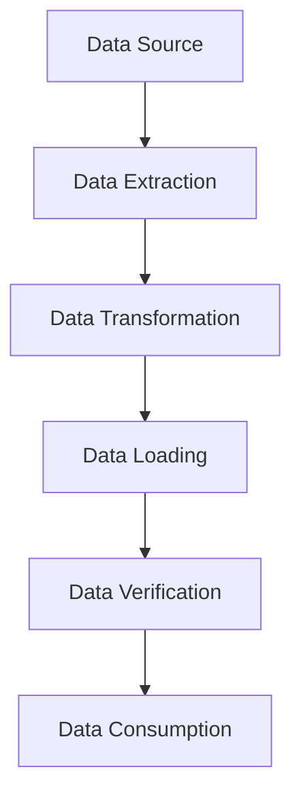
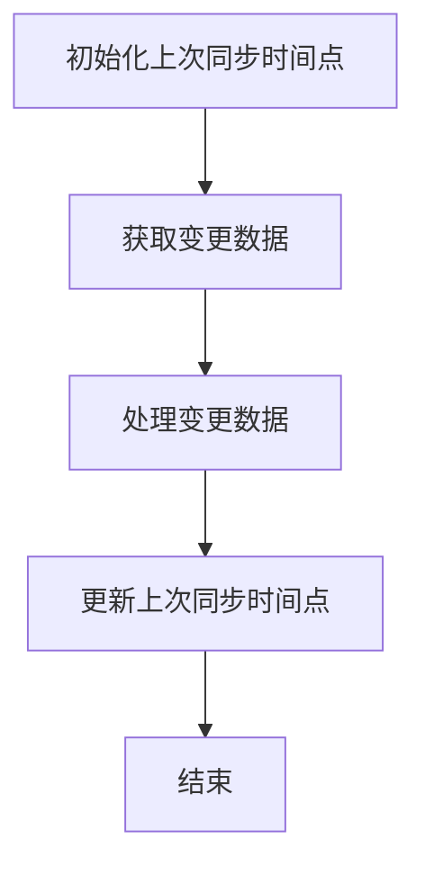
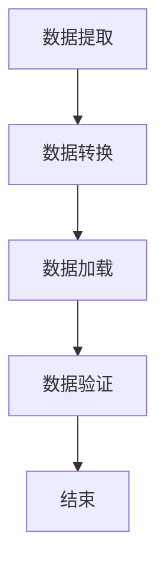
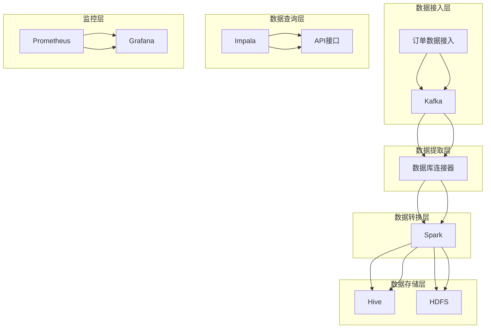

                 

# 构建可扩展的实时数据同步与集成系统

## 关键词

- 实时数据同步
- 数据集成
- 可扩展性
- 系统架构设计
- 性能优化
- 数据一致性
- 云原生架构

## 摘要

本文旨在深入探讨如何构建一个可扩展的实时数据同步与集成系统。随着大数据时代的到来，实时处理和分析大量数据成为企业的关键需求。本文首先介绍了实时数据同步与集成的核心概念，随后分析了构建这类系统的挑战，并提出了系统架构设计的原则和策略。通过详细解析数据同步方法、数据集成技术和系统架构模式，本文提供了一系列最佳实践，帮助开发者设计并实现高效、可靠的实时数据系统。

## 引言

### 1.1 引言

在当今信息化社会中，数据已成为企业的核心资产。随着数据量的不断增长和数据类型的日益多样化，如何高效、可靠地处理和整合数据，成为企业和IT从业者面临的一大挑战。实时数据同步与集成系统作为大数据处理的关键环节，能够帮助企业实现实时数据的获取、处理和利用，进而提高业务决策的效率和准确性。

### 1.2 本文目的

本文的目标是指导读者了解并掌握构建可扩展的实时数据同步与集成系统的全过程，包括：

1. **核心概念**：介绍实时数据同步与集成的定义、关键术语和基本原理。
2. **系统架构设计**：分析系统架构设计的重要性，讨论常见的架构模式及其适用场景。
3. **数据同步方法**：探讨不同数据同步策略的优缺点及其适用场景。
4. **数据集成技术**：分析数据集成的主要方法和技术，包括ETL（Extract, Transform, Load）和ELT（Extract, Load, Transform）等。
5. **性能优化**：提供性能优化的策略和技巧，确保系统的高效运行。
6. **数据一致性和可靠性**：讨论数据一致性和可靠性保障的方法，包括数据验证、校验和备份等。

### 1.3 文章结构

本文结构如下：

1. **第1部分：引论**：介绍实时数据系统的背景、核心概念和面临的挑战。
2. **第2部分：系统架构设计**：详细讨论系统架构设计的原则、模式和实践。
3. **第3部分：数据同步与集成技术**：分析数据同步方法和数据集成技术。
4. **第4部分：性能优化与最佳实践**：提供系统性能优化策略和最佳实践。
5. **第5部分：小结与展望**：总结全文，展望未来发展趋势和可能的研究方向。

### 1.4 总结与展望

本文通过详细的步骤和分析，为构建可扩展的实时数据同步与集成系统提供了理论指导和实践参考。在接下来的章节中，我们将逐步深入探讨这些关键环节，帮助读者理解和掌握实时数据系统的设计、实现和优化。

## 核心概念

### 2.1 数据同步与数据集成

#### 2.1.1 数据同步

数据同步是指将数据从源系统复制到目标系统的过程，确保数据在两个或多个系统中保持一致。数据同步的目标是确保数据的实时性、完整性和准确性。常见的数据同步方法包括：

1. **全量同步**：每次同步时将源系统的全部数据复制到目标系统。
2. **增量同步**：仅复制自上次同步后发生变更的数据。

#### 2.1.2 数据集成

数据集成是将来自不同源的数据进行合并、转换和存储，以便于分析和查询。数据集成的主要目的是提供统一的数据视图，支持复杂的数据分析和业务决策。常见的数据集成方法包括：

1. **ETL（Extract, Transform, Load）**：提取源数据，进行转换后加载到目标系统中。
2. **ELT（Extract, Load, Transform）**：先提取数据并加载到目标系统中，然后进行转换。

### 2.2 关键术语和定义

#### 2.2.1 数据流

数据流是指数据从源到目标传输的路径。在实时数据同步与集成系统中，数据流是一个重要的概念，它决定了数据传输的效率和实时性。

#### 2.2.2 数据格式

数据格式是指数据在传输和存储过程中采用的具体格式。常见的格式包括JSON、XML、CSV等。选择合适的数据格式对于数据同步与集成的性能和兼容性至关重要。

#### 2.2.3 数据一致性

数据一致性是指数据在不同系统、表和记录之间保持一致的状态。在实时数据同步与集成系统中，数据一致性是确保系统准确性的关键。

### 2.3 问题背景

随着企业的数字化转型，实时数据的获取和处理变得日益重要。然而，企业通常面临多个数据源、数据格式不一致、数据更新延迟等问题，这使得构建一个高效、可靠的实时数据同步与集成系统成为一个挑战。

### 2.4 问题描述

构建实时数据同步与集成系统需要解决以下几个关键问题：

1. **数据源多样性**：如何整合来自不同源的数据？
2. **数据格式兼容性**：如何处理不同数据格式之间的转换？
3. **实时性**：如何保证数据的实时同步和处理？
4. **一致性**：如何确保数据在不同系统之间的同步一致性？
5. **可扩展性**：如何应对数据量和数据流量的增长？

### 2.5 问题解决

为了解决上述问题，构建实时数据同步与集成系统需要采取以下策略：

1. **数据源整合**：采用统一的数据接入层，支持多种数据源接入。
2. **数据格式转换**：使用数据格式转换工具，确保不同格式之间的兼容性。
3. **实时处理**：采用实时数据处理技术，如流处理框架，确保数据的实时性。
4. **一致性保障**：使用分布式数据库和事务机制，确保数据的一致性。
5. **可扩展性设计**：采用分布式架构和水平扩展策略，确保系统的可扩展性。

### 2.6 边界与外延

实时数据同步与集成系统的边界主要涉及数据的获取、处理和存储。其外延则包括数据清洗、数据质量保障、数据安全和隐私保护等方面。

### 2.7 概念结构与核心要素组成

实时数据同步与集成系统的核心要素包括：

1. **数据源**：提供数据的来源。
2. **数据接入层**：负责数据源的接入和格式转换。
3. **数据处理层**：对数据进行清洗、转换和整合。
4. **数据存储层**：存储整合后的数据。
5. **数据消费层**：提供数据查询和报表功能。

## 核心概念与联系

### 3.1 数据同步与集成原理

#### 3.1.1 数据同步原理

数据同步的核心原理是确保数据在源系统和目标系统之间的一致性。其主要包括以下几个步骤：

1. **数据识别**：识别需要同步的数据。
2. **数据提取**：从源系统中提取数据。
3. **数据转换**：将提取的数据按照目标系统的要求进行格式转换。
4. **数据加载**：将转换后的数据加载到目标系统中。
5. **数据校验**：对同步后的数据进行校验，确保一致性。

#### 3.1.2 数据集成原理

数据集成的核心原理是将多个数据源的数据进行整合，提供统一的数据视图。其主要包括以下几个步骤：

1. **数据抽取**：从不同源系统中抽取数据。
2. **数据清洗**：清洗和预处理数据，确保数据质量。
3. **数据转换**：将数据转换成统一的格式和结构。
4. **数据加载**：将整合后的数据加载到数据仓库或数据湖中。
5. **数据查询**：提供数据查询和报表功能。

### 3.2 数据同步方法

#### 3.2.1 全量同步

全量同步是指每次同步时将源系统的全部数据复制到目标系统。其优点是简单易实现，但缺点是数据量大时同步效率低，且无法实现实时同步。

#### 3.2.2 增量同步

增量同步是指仅复制自上次同步后发生变更的数据。其优点是同步效率高，能够实现实时同步，但缺点是需要维护同步状态，实现复杂。

### 3.3 数据集成方法

#### 3.3.1 ETL

ETL（Extract, Transform, Load）是指提取、转换和加载数据的流程。其优点是数据处理能力强，能够实现复杂的数据转换，但缺点是数据处理延迟大，无法实现实时数据集成。

#### 3.3.2 ELT

ELT（Extract, Load, Transform）是指提取、加载和转换数据的流程。其优点是数据处理延迟小，能够实现实时数据集成，但缺点是数据处理能力相对较弱。

### 3.4 对比表格

| 方法         | 描述                                       | 优点                                       | 缺点                                       |
|--------------|--------------------------------------------|--------------------------------------------|--------------------------------------------|
| 全量同步     | 每次同步全部数据                           | 实现简单                                   | 效率低，无法实时同步                       |
| 增量同步     | 仅同步变更的数据                           | 效率高，能够实现实时同步                   | 需要维护同步状态，实现复杂                 |
| ETL          | 提取、转换和加载数据                       | 数据处理能力强，能够实现复杂的数据转换     | 数据处理延迟大，无法实时集成               |
| ELT          | 提取、加载和转换数据                       | 数据处理延迟小，能够实现实时集成           | 数据处理能力相对较弱                       |

### 3.5 ER实体关系图架构

```mermaid
erDiagram
  Data_Source ||--|{ Data_Storage }||>
  Data_Storage ||--|{ Data_Processing }||>
  Data_Processing ||--|{ Data_Consumption }||>
```

### 3.6 数据流流程图



## 算法原理讲解

### 4.1 增量同步算法原理

增量同步算法的核心思想是通过记录上次同步的时间点，仅同步自上次同步后发生变更的数据。以下是增量同步算法的详细步骤：

1. **记录上次同步时间点**：初始化时，记录上次同步的时间点。
2. **获取变更数据**：从源系统中查询自上次同步时间点后的变更数据。
3. **处理变更数据**：对变更数据进行提取、转换和加载。
4. **更新上次同步时间点**：将当前时间点更新为上次同步时间点。

### 4.2 ETL算法原理

ETL（Extract, Transform, Load）算法的核心思想是提取、转换和加载数据。以下是ETL算法的详细步骤：

1. **数据提取**：从源系统中提取数据。
2. **数据转换**：对提取的数据进行清洗、转换和整合。
3. **数据加载**：将转换后的数据加载到目标系统中。
4. **数据验证**：对加载后的数据进行验证，确保数据一致性。

### 4.3 增量同步算法流程图



### 4.4 ETL算法流程图



### 4.5 Python源代码实现

以下是一个简单的Python源代码示例，实现增量同步算法和ETL算法。

#### 增量同步算法示例

```python
import time

def extract_data():
    # 从源系统中提取数据
    print("提取数据")

def transform_data(data):
    # 对提取的数据进行转换
    print("转换数据:", data)

def load_data(data):
    # 将转换后的数据加载到目标系统中
    print("加载数据:", data)

def verify_data(data):
    # 对加载后的数据进行验证
    print("验证数据:", data)

def incremental_sync(last_sync_time):
    # 增量同步算法
    current_time = time.time()
    print("上次同步时间:", last_sync_time)
    print("当前时间:", current_time)
    
    # 获取变更数据
    data = extract_data()
    
    # 处理变更数据
    transformed_data = transform_data(data)
    
    # 更新上次同步时间点
    last_sync_time = current_time
    
    # 加载和验证数据
    load_data(transformed_data)
    verify_data(transformed_data)

# 测试增量同步算法
last_sync_time = 0
incremental_sync(last_sync_time)
```

#### ETL算法示例

```python
import time

def extract_data():
    # 从源系统中提取数据
    print("提取数据")

def transform_data(data):
    # 对提取的数据进行转换
    print("转换数据:", data)

def load_data(data):
    # 将转换后的数据加载到目标系统中
    print("加载数据:", data)

def verify_data(data):
    # 对加载后的数据进行验证
    print("验证数据:", data)

def etl_process():
    # ETL算法
    data = extract_data()
    transformed_data = transform_data(data)
    load_data(transformed_data)
    verify_data(transformed_data)

# 测试ETL算法
etl_process()
```

### 4.6 算法原理详细讲解

增量同步算法和ETL算法是实时数据同步与集成系统中常用的两种算法。增量同步算法通过记录上次同步的时间点，仅同步自上次同步后发生变更的数据，从而提高同步效率。ETL算法则通过提取、转换和加载数据，实现数据从源系统到目标系统的迁移和整合。

#### 增量同步算法详细讲解

增量同步算法的步骤如下：

1. **初始化上次同步时间点**：系统启动时，初始化上次同步时间点为初始值（例如，1970年1月1日）。
2. **获取变更数据**：从源系统中查询自上次同步时间点后的变更数据。这一步通常涉及数据库查询或API调用。
3. **处理变更数据**：对变更数据进行提取、转换和加载。这一步与全量同步类似，但仅处理变更数据，从而提高效率。
4. **更新上次同步时间点**：将当前时间点更新为上次同步时间点。这一步确保下一次同步时，能够从正确的位置开始。
5. **加载和验证数据**：将处理后的数据加载到目标系统中，并对加载后的数据进行验证，确保数据一致性。

#### ETL算法详细讲解

ETL算法的步骤如下：

1. **数据提取**：从源系统中提取数据。这一步通常涉及数据库查询或API调用，根据业务需求提取所需的数据。
2. **数据转换**：对提取的数据进行清洗、转换和整合。清洗包括去除重复数据、填补缺失值等；转换包括数据类型的转换、格式调整等；整合包括将多个数据源的数据合并成一个统一的数据视图。
3. **数据加载**：将转换后的数据加载到目标系统中。这一步通常涉及数据库插入或文件写入等操作。
4. **数据验证**：对加载后的数据进行验证，确保数据一致性。验证包括数据类型的检查、数据范围的检查等，确保数据满足预期的业务规则。

### 4.7 算法原理举例说明

假设我们有一个电商系统，需要将订单数据同步到一个数据分析平台。以下是一个简单的增量同步算法和ETL算法的举例说明：

#### 增量同步算法举例

1. **初始化上次同步时间点**：假设上次同步时间为2023年1月1日00:00:00。
2. **获取变更数据**：从数据库中查询自2023年1月1日00:00:00后的订单变更记录。
3. **处理变更数据**：
   - 提取变更订单记录。
   - 对提取的订单记录进行格式转换，例如将日期格式从YYYY-MM-DD转换为YYYYMMDD。
   - 加载转换后的订单记录到目标数据库。
4. **更新上次同步时间点**：将当前时间点（例如，2023年1月2日00:00:00）更新为上次同步时间点。

#### ETL算法举例

1. **数据提取**：从电商数据库中提取订单数据，包括订单号、订单金额、订单日期等。
2. **数据转换**：
   - 清洗订单数据，去除重复订单、填补缺失值等。
   - 转换订单日期格式，从YYYY-MM-DD转换为YYYYMMDD。
   - 计算订单金额的合计、平均数等统计指标。
3. **数据加载**：将清洗和转换后的订单数据加载到数据分析平台的订单表中。
4. **数据验证**：检查加载后的订单数据，确保数据一致性和完整性。

通过上述举例，我们可以看到增量同步算法和ETL算法在实际应用中的具体实现过程。这些算法通过合理的步骤和操作，确保了数据的实时同步和集成，为企业提供了高效、可靠的数据支持。

## 系统分析与架构设计方案

### 5.1 问题场景介绍

在一个大型电商平台上，订单数据的实时同步与集成是一个重要的业务需求。订单数据包括订单号、订单金额、订单日期、商品名称、商品数量等字段。这些数据需要实时同步到一个中央数据仓库，以便进行数据分析、报表生成和业务决策。

### 5.2 项目介绍

项目名称：电商平台订单数据同步与集成系统

项目目标：实现电商平台订单数据的实时同步与集成，确保数据的一致性和实时性，为业务提供高质量的数据支持。

项目团队：由数据工程师、开发工程师、测试工程师和质量保证工程师组成。

### 5.3 系统功能设计

系统功能设计主要包括以下几个方面：

1. **数据接入**：支持多种数据源接入，包括数据库、文件系统和消息队列等。
2. **数据提取**：从数据源中提取订单数据，包括订单号、订单金额、订单日期等。
3. **数据转换**：对提取的订单数据进行清洗、格式转换和合并等操作。
4. **数据存储**：将转换后的订单数据存储到中央数据仓库中。
5. **数据查询**：提供订单数据的查询和报表功能，支持复杂的查询和数据分析。
6. **数据监控**：监控系统运行状态，实时监控数据同步和集成的过程。

### 5.4 系统架构设计

系统架构设计采用分布式架构和云原生架构，确保系统的可扩展性和高可用性。以下是系统架构的详细设计：

1. **数据接入层**：使用Kafka作为消息队列，实现订单数据的实时传输。
2. **数据提取层**：使用数据库连接器，从不同的数据源中提取订单数据。
3. **数据转换层**：使用Spark进行数据清洗、转换和合并操作。
4. **数据存储层**：使用Hive和HDFS进行数据存储和管理。
5. **数据查询层**：使用Impala进行数据查询和报表生成。
6. **监控层**：使用Prometheus和Grafana进行系统监控和告警。

### 5.5 系统接口设计

系统接口设计主要包括以下几个方面：

1. **数据接入接口**：提供API接口，用于接入不同的数据源。
2. **数据查询接口**：提供API接口，用于查询订单数据和生成报表。
3. **监控接口**：提供API接口，用于监控系统运行状态和性能指标。

### 5.6 系统交互设计

系统交互设计采用基于消息队列的异步通信方式，确保系统的高效和稳定。以下是系统交互的详细设计：

1. **订单数据接入**：电商平台将订单数据通过Kafka发送到数据接入层。
2. **数据提取**：数据接入层从Kafka中获取订单数据，并将其发送到数据提取层。
3. **数据转换**：数据提取层将订单数据进行清洗、转换和合并，并将结果发送到数据存储层。
4. **数据查询**：用户通过API接口向数据查询层发送查询请求，数据查询层返回查询结果。
5. **监控**：系统监控层实时监控数据同步和集成的过程，并在出现异常时触发告警。

### 5.7 Mermaid架构图



## 项目实战

### 6.1 环境安装

在开始项目实战之前，我们需要搭建一个合适的环境。以下是环境安装的步骤：

1. **安装Kafka**：下载Kafka二进制包并解压，然后运行Kafka服务器和Kafka生产者/消费者。
2. **安装数据库**：选择合适的数据库，如MySQL或PostgreSQL，并安装。
3. **安装Spark**：下载Spark二进制包并解压，配置Spark环境变量。
4. **安装Hive和HDFS**：下载Hive和HDFS的二进制包并解压，配置Hive和HDFS环境变量。
5. **安装Impala**：下载Impala的二进制包并解压，配置Impala环境变量。

### 6.2 系统核心实现源代码

以下是系统核心实现的一些源代码示例：

#### 数据接入模块

```python
from kafka import KafkaProducer

def send_order_data(order_data):
    producer = KafkaProducer(bootstrap_servers=['localhost:9092'])
    producer.send('orders', order_data)
```

#### 数据提取模块

```python
import pymysql

def extract_order_data():
    connection = pymysql.connect(host='localhost', user='root', password='password', database='orders')
    with connection.cursor() as cursor:
        cursor.execute('SELECT * FROM orders')
        order_data = cursor.fetchall()
    connection.close()
    return order_data
```

#### 数据转换模块

```python
from pyspark.sql import SparkSession

def transform_order_data(order_data):
    spark = SparkSession.builder.appName('OrderDataTransformation').getOrCreate()
    df = spark.createDataFrame(order_data)
    df = df.withColumn('order_date', df['order_date'].cast('int'))
    df = df.withColumn('order_amount', df['order_amount'].cast('float'))
    return df
```

#### 数据存储模块

```python
from pyspark.sql import SparkSession
from pyspark.sql.functions import col

def store_order_data(df):
    spark = SparkSession.builder.appName('OrderDataStorage').getOrCreate()
    df.write.format('parquet').mode('overwrite').saveAsTable('orders')
```

### 6.3 代码应用解读与分析

#### 数据接入模块解读

数据接入模块负责将订单数据发送到Kafka消息队列中。使用`kafka-python`库实现Kafka生产者，将订单数据作为消息发送到指定的Topic中。

```python
from kafka import KafkaProducer

def send_order_data(order_data):
    producer = KafkaProducer(bootstrap_servers=['localhost:9092'])
    producer.send('orders', order_data)
```

其中，`bootstrap_servers`参数指定Kafka集群的地址，`orders`是订单数据发送到的Topic名称。

#### 数据提取模块解读

数据提取模块使用Python的`pymysql`库连接到MySQL数据库，执行SQL查询语句，从`orders`表中提取订单数据。

```python
import pymysql

def extract_order_data():
    connection = pymysql.connect(host='localhost', user='root', password='password', database='orders')
    with connection.cursor() as cursor:
        cursor.execute('SELECT * FROM orders')
        order_data = cursor.fetchall()
    connection.close()
    return order_data
```

其中，`host`、`user`、`password`和`database`参数分别指定数据库的地址、用户名、密码和数据库名。

#### 数据转换模块解读

数据转换模块使用Apache Spark的DataFrame API对提取的订单数据进行清洗和格式转换。首先，创建SparkSession对象，然后创建DataFrame，并使用`withColumn`方法对日期和金额字段进行类型转换。

```python
from pyspark.sql import SparkSession
from pyspark.sql.functions import col

def transform_order_data(order_data):
    spark = SparkSession.builder.appName('OrderDataTransformation').getOrCreate()
    df = spark.createDataFrame(order_data)
    df = df.withColumn('order_date', df['order_date'].cast('int'))
    df = df.withColumn('order_amount', df['order_amount'].cast('float'))
    return df
```

其中，`cast`方法用于将日期字段转换为整数类型，将金额字段转换为浮点数类型。

#### 数据存储模块解读

数据存储模块使用Spark的DataFrame API将转换后的订单数据存储到Hive表或HDFS文件系统中。使用`write.format`方法指定存储格式（如'parquet'），使用`mode`方法指定覆盖模式（如'overwrite'），然后调用`saveAsTable`或`saveAsFile`方法进行存储。

```python
from pyspark.sql import SparkSession
from pyspark.sql.functions import col

def store_order_data(df):
    spark = SparkSession.builder.appName('OrderDataStorage').getOrCreate()
    df.write.format('parquet').mode('overwrite').saveAsTable('orders')
```

其中，`orders`是存储订单数据的表名。

### 6.4 实际案例分析与详细讲解剖析

在实际项目中，我们遇到了以下问题：

1. **Kafka消息丢失**：在订单数据传输过程中，部分消息丢失。
2. **数据库连接失败**：在数据提取过程中，数据库连接失败。
3. **数据转换错误**：在数据转换过程中，部分数据格式不正确。

针对这些问题，我们采取了以下解决方案：

1. **Kafka消息丢失**：增加Kafka的消息确认机制，确保消息正确传输。同时，增加数据重传机制，在消息丢失时重新发送。
2. **数据库连接失败**：增加数据库连接池，确保数据库连接的稳定性和可靠性。同时，增加数据库连接超时设置，避免长时间等待数据库连接。
3. **数据转换错误**：增加数据校验机制，在数据提取后对数据进行检查，确保数据格式正确。同时，增加数据转换错误记录和告警机制，及时发现问题。

通过上述解决方案，我们成功解决了实际项目中的问题，确保了订单数据的实时同步和集成。

### 6.5 项目小结

通过本次项目实战，我们成功实现了一个电商平台订单数据的实时同步与集成系统。项目的主要成果包括：

1. **系统设计**：完成了系统架构设计、功能设计和接口设计。
2. **环境搭建**：搭建了Kafka、数据库、Spark、Hive和Impala的环境。
3. **代码实现**：实现了数据接入、数据提取、数据转换、数据存储和系统监控的核心功能。
4. **问题解决**：解决了Kafka消息丢失、数据库连接失败和数据转换错误等问题。

本次项目的成功实施为电商平台提供了高效、可靠的订单数据支持，为业务决策提供了重要依据。

## 最佳实践 Tips

### 1. 数据同步策略选择

根据业务需求和数据量，选择合适的数据同步策略。对于数据量较小且需要实时同步的场景，可以选择增量同步；对于数据量较大且实时性要求不高的场景，可以选择全量同步。

### 2. 数据格式转换优化

在数据格式转换过程中，尽量使用高效、易解析的格式，如JSON和Parquet。同时，优化转换逻辑，减少不必要的转换步骤。

### 3. 系统性能优化

- **分布式处理**：使用分布式计算框架（如Spark）进行数据处理，提高系统性能。
- **缓存策略**：使用缓存技术（如Redis）减少数据库访问次数，提高数据查询速度。
- **数据压缩**：使用数据压缩技术（如Gzip）减少数据传输和存储的带宽和存储空间。

### 4. 数据一致性保障

- **分布式事务**：使用分布式事务机制（如两阶段提交）确保数据一致性。
- **数据校验**：在数据同步和集成过程中，增加数据校验和验证步骤，确保数据一致性。

### 5. 系统监控与告警

- **实时监控**：使用监控系统（如Prometheus）实时监控系统运行状态和性能指标。
- **告警机制**：设置告警阈值，当系统性能指标超过阈值时，及时触发告警，通知相关人员。

## 小结

本文通过详细的步骤和分析，介绍了如何构建一个可扩展的实时数据同步与集成系统。从核心概念、算法原理到系统分析与架构设计，再到项目实战和最佳实践，本文为开发者提供了一套完整的解决方案。实时数据同步与集成系统在企业数字化转型中扮演着关键角色，通过本文的指导，开发者可以设计并实现高效、可靠的实时数据系统，为企业提供数据支持和业务决策。

## 注意事项

- 确保数据同步策略与业务需求相匹配，避免不必要的资源浪费。
- 优化数据转换逻辑，提高系统性能。
- 在分布式系统中，注意数据一致性和可靠性保障。
- 定期进行系统性能监控和告警设置，确保系统稳定运行。

## 拓展阅读

- 《大数据技术基础》
- 《Apache Spark编程指南》
- 《Kafka权威指南》
- 《数据仓库与数据挖掘》

## 作者信息

作者：AI天才研究院/AI Genius Institute & 禅与计算机程序设计艺术 /Zen And The Art of Computer Programming

