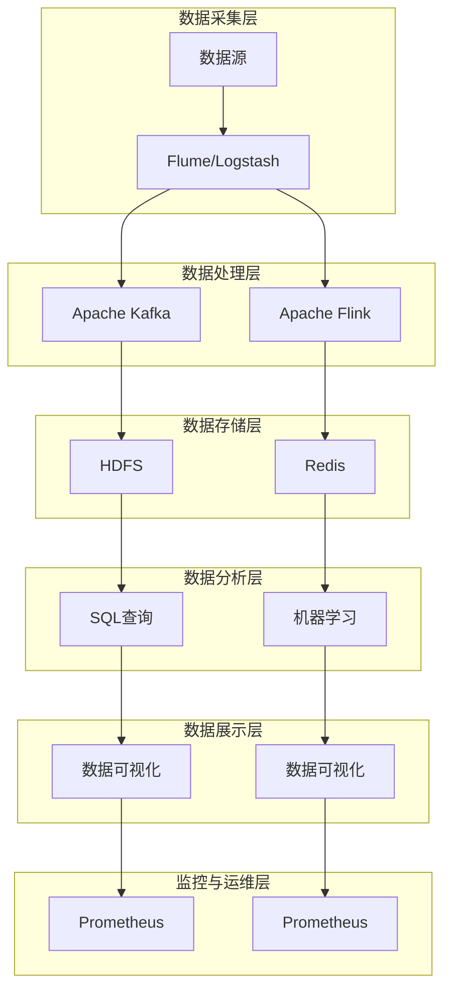
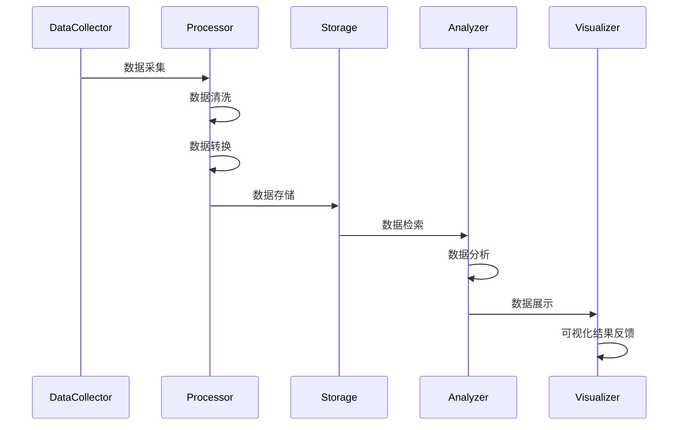

                 


### 1.1.1 实时流处理的兴起

实时流处理作为数据处理领域的一个重要分支，其兴起源于数据爆炸式增长和企业对实时决策的迫切需求。随着互联网、物联网（IoT）和大数据技术的发展，企业所面临的数据量呈指数级增长，如何从这些海量数据中快速提取有价值的信息，成为当前企业竞争的关键。

实时流处理的兴起首先源于金融市场。金融交易系统需要在极短时间内处理大量交易数据，并对交易进行实时分析和决策。例如，高频交易系统需要实时处理交易信息，以实现快速买入和卖出，从而获取微小的利润。这种需求推动了实时流处理技术的发展。

随后，实时流处理在社交媒体和广告领域也得到了广泛应用。社交媒体平台需要实时处理用户发布的内容，并对内容进行分类和推荐，以提高用户体验和广告投放的精准度。广告系统则需要实时分析用户行为数据，以便及时调整广告策略，实现精准投放。

不仅如此，实时流处理还在工业制造、交通运输、医疗健康等领域得到了广泛应用。例如，工业制造中的设备监控系统需要实时收集和分析设备运行数据，以便及时发现并解决潜在问题，提高生产效率。交通运输领域的智能交通系统需要实时处理交通数据，以实现交通流量控制和优化。在医疗健康领域，实时流处理可以帮助医院实时监测患者生命体征，及时进行医疗干预。

总之，实时流处理的兴起源于企业对实时决策的迫切需求。随着技术的不断进步，实时流处理的应用领域也在不断扩展，为各行各业带来了巨大的变革和机遇。在接下来的部分中，我们将深入探讨实时流处理在企业需求与挑战中的具体表现，以及相关的背景知识和相关技术。

### 1.1.2 企业需求与挑战

在当今数据驱动的商业环境中，企业对实时流处理的需求日益迫切，主要体现在以下几个方面。

首先，实时决策需求。在竞争激烈的市场中，企业需要快速响应市场变化，做出实时决策。例如，电子商务公司需要实时分析用户行为数据，以动态调整推荐算法，提升销售额。金融机构需要实时处理交易数据，以快速识别异常交易，防止欺诈行为。工业制造领域则需要实时监控设备状态，快速应对生产故障，保证生产连续性。这些实时决策需求要求系统具备高速处理能力和低延迟特性。

其次，数据准确性需求。实时流处理的一个关键目标是从不断流入的数据流中提取准确的信息。例如，对于智能交通系统，实时获取交通数据至关重要，只有准确的数据才能实现交通流量控制和优化，提高道路通行效率。医疗健康领域的实时流处理系统需要准确监测患者生命体征，以便及时做出医疗决策，避免医疗事故。因此，如何确保数据的准确性和完整性是企业在选择实时流处理系统时需要考虑的重要因素。

第三，可扩展性和灵活性需求。企业面对的数据量和处理需求是不断变化的，实时流处理系统需要具备良好的可扩展性和灵活性，以适应不同的业务场景和需求变化。例如，随着用户数量的增加，社交媒体平台需要实时流处理系统能够水平扩展，处理更多用户数据。在特定业务场景下，企业可能需要实时流处理系统能够快速集成新的数据源和处理算法，以应对新的业务需求。

然而，在满足这些需求的过程中，企业也面临着一系列挑战。

首先是技术挑战。实时流处理技术复杂，涉及数据采集、传输、处理、存储和可视化等多个环节。企业需要具备相应技术能力，以构建和维护实时流处理系统。此外，实时流处理系统还需要高效、可靠，以避免数据丢失或处理延迟，这对系统的设计、开发和运维提出了更高要求。

其次是数据挑战。实时流处理系统需要处理海量数据，如何确保数据的高效存储和快速检索成为关键问题。此外，数据的准确性和一致性也需要得到保障，以避免因数据问题导致错误的决策。

第三是人才挑战。实时流处理技术人才稀缺，企业需要投入大量资源进行人才培养和技术引进。如何吸引和留住优秀的技术人才，成为企业面临的一个重要问题。

最后是成本挑战。构建和维护实时流处理系统需要大量资金投入，从硬件设备到软件工具，再到技术人才。对于中小企业来说，如何在有限的预算内实现实时流处理，是一个需要认真考虑的问题。

综上所述，企业在满足实时流处理需求的过程中，需要面对技术、数据、人才和成本等多方面的挑战。只有通过不断优化技术方案，加强数据管理，培养技术人才，以及合理控制成本，才能在实时流处理领域取得成功。接下来，我们将进一步探讨实时流处理的相关背景知识和相关技术，以期为解决这些挑战提供有益的参考。

### 1.1.3 背景知识与相关技术

要深入理解实时流处理，我们需要了解一些相关的背景知识和相关技术。这些知识将帮助我们更好地把握实时流处理的本质和应用场景。

#### 大数据技术

大数据技术是实时流处理的重要基础。大数据技术包括数据采集、存储、处理、分析和可视化等多个方面。在实时流处理中，数据采集和存储技术至关重要。数据采集技术需要高效地收集各种来源的数据，如传感器数据、网络日志、社交媒体数据等。存储技术则需要能够快速读取和写入海量数据，以满足实时处理的需求。常见的存储技术包括分布式文件系统（如HDFS）、键值存储（如Redis）和NoSQL数据库（如MongoDB）等。

#### 分布式计算

分布式计算技术是实时流处理的核心。分布式计算通过将任务分布到多个节点上并行处理，从而提高系统的处理能力和效率。实时流处理系统通常采用分布式计算框架，如Apache Kafka、Apache Flink和Apache Storm等。这些框架能够处理大规模数据流，并提供高可用性和容错能力，确保系统在节点故障时能够继续正常运行。

#### 计算机网络

计算机网络技术是实时流处理的关键支撑。实时流处理需要高效的网络传输，以实现数据在不同节点之间的快速传输。现代计算机网络技术包括TCP/IP协议、HTTP/2协议和WebSocket等。这些协议能够提供低延迟、高可靠性的网络传输，确保实时数据处理的顺利进行。

#### 数据处理与分析

数据处理与分析技术是实时流处理的最终目标。数据处理技术包括数据清洗、数据转换、数据聚合和数据挖掘等。数据清洗和转换技术用于确保数据的准确性和一致性，数据聚合技术用于从大量数据中提取有价值的信息，数据挖掘技术则用于发现数据中的隐藏模式和规律。

数据分析技术包括统计分析、机器学习和数据挖掘等。统计分析用于发现数据的基本规律和趋势，机器学习则通过建立数学模型，从数据中自动学习并预测未来趋势，数据挖掘则通过深度学习等技术，发现数据中更深层次的关联和模式。

#### 数据可视化

数据可视化技术是实时流处理的重要输出方式。通过数据可视化，用户可以直观地了解数据的分布、趋势和关联。数据可视化技术包括图表、仪表板和可视化工具等。常见的可视化工具包括D3.js、ECharts和Tableau等。

#### 人工智能

人工智能技术在实时流处理中发挥着越来越重要的作用。人工智能通过算法和模型，可以从大量数据中自动提取有价值的信息，实现自动化决策和优化。常见的AI技术包括机器学习、深度学习、自然语言处理和计算机视觉等。

总之，实时流处理不仅依赖于大数据、分布式计算、计算机网络等传统技术，还融合了数据处理与分析、数据可视化、人工智能等现代技术。这些技术共同构成了实时流处理的基础，为实现实时决策提供了强有力的支持。在接下来的部分中，我们将进一步探讨实时流处理的核心概念和特点。

### 1.2.1 实时流处理定义

实时流处理（Real-time Stream Processing）是一种数据处理技术，旨在对动态数据流进行实时分析、处理和响应。与传统的批处理不同，实时流处理强调对数据流中的每一个数据单元进行即时处理，并在极短时间内完成计算和决策。

实时流处理的基本定义可以归纳为以下几个方面：

1. **动态数据流**：实时流处理的对象是动态数据流，这些数据可以来自多种数据源，如传感器、日志文件、社交网络等。数据流是连续且动态变化的，数据单元以一定的速度和频率不断流入系统。

2. **实时处理**：实时流处理的核心理念是对数据流中的每一个数据单元进行即时处理。这意味着系统需要具备高速处理能力和低延迟特性，以确保数据在流入后的短时间内得到处理和响应。

3. **连续性**：实时流处理强调处理过程的连续性，即系统需要持续不断地接收和处理数据流，不能出现数据丢失或延迟。这种连续性要求系统具备高可用性和容错能力，以应对节点故障和数据传输问题。

4. **实时分析**：实时流处理不仅要求对数据进行即时处理，还需要对数据进行实时分析，提取有价值的信息。这种分析可以是简单的统计分析，也可以是复杂的机器学习模型，以便从数据中挖掘深层次的关联和趋势。

5. **实时响应**：实时流处理系统的另一个重要目标是实现实时响应，即在数据处理完成后，能够快速地生成决策结果，并将结果反馈给用户或系统。这种实时响应能力对于需要快速决策的应用场景尤为重要，如金融市场、智能交通系统和医疗健康等领域。

总之，实时流处理是一种高效、连续且具备实时响应能力的数据处理技术，旨在满足企业对实时决策的迫切需求。通过实时流处理，企业能够从动态数据流中快速提取有价值的信息，实现实时监控、分析和优化，从而在竞争激烈的市场中保持领先地位。

### 1.2.2 实时流处理特点

实时流处理作为数据处理领域的一项核心技术，具备以下显著特点：

1. **实时性**：实时性是实时流处理最为核心的特点。实时流处理要求对数据流中的每一个数据单元进行即时处理，确保数据在流入后的短时间内得到处理和响应。这种低延迟特性使得实时流处理特别适用于需要快速决策的应用场景，如金融市场、智能交通系统和医疗健康等领域。

2. **连续性**：实时流处理强调处理过程的连续性，即系统需要持续不断地接收和处理数据流，不能出现数据丢失或延迟。这种连续性要求系统具备高可用性和容错能力，以应对节点故障和数据传输问题。只有确保数据流的连续性，实时流处理系统才能提供稳定、可靠的服务。

3. **分布式处理**：实时流处理通常采用分布式计算架构，将数据处理任务分布到多个节点上并行处理。分布式处理不仅提高了系统的处理能力，还增强了系统的可扩展性和容错能力。在数据量巨大、处理需求复杂的情况下，分布式处理能够显著提升系统的效率和性能。

4. **可扩展性**：实时流处理系统需要具备良好的可扩展性，以适应不同规模的数据处理需求。可扩展性包括水平扩展和垂直扩展。水平扩展通过增加节点数量来提升系统的处理能力，而垂直扩展则通过提升单个节点的性能来提高系统处理能力。良好的可扩展性使得实时流处理系统能够在数据量和处理需求变化时，灵活调整系统架构，确保系统持续高效运行。

5. **高可靠性**：实时流处理系统需要具备高可靠性，以确保数据的准确性和系统的稳定性。高可靠性包括数据的一致性、完整性和可用性。系统需要确保数据在处理过程中不丢失、不重复，并能及时准确地反馈处理结果。此外，系统还需要具备容错能力，以应对节点故障和意外情况，确保系统能够持续稳定运行。

6. **灵活性强**：实时流处理系统需要具备灵活的架构和丰富的功能，以适应不同业务场景和需求。灵活性强包括支持多种数据源接入、支持多种数据处理算法和模型、支持自定义数据流处理逻辑等。这种灵活性使得实时流处理系统能够快速适应新的业务需求，实现高效的数据处理和实时响应。

7. **可扩展性**：实时流处理系统需要具备良好的可扩展性，以适应不同规模的数据处理需求。可扩展性包括水平扩展和垂直扩展。水平扩展通过增加节点数量来提升系统的处理能力，而垂直扩展则通过提升单个节点的性能来提高系统处理能力。良好的可扩展性使得实时流处理系统能够在数据量和处理需求变化时，灵活调整系统架构，确保系统持续高效运行。

总之，实时流处理具备实时性、连续性、分布式处理、可扩展性、高可靠性和灵活性等多种特点。这些特点使得实时流处理能够满足企业对实时决策的迫切需求，成为数据处理领域的重要技术手段。在接下来的部分中，我们将进一步探讨实时流处理中的关键术语与概念，以加深对这一技术的理解。

### 1.2.3 关键术语与概念

在深入探讨实时流处理时，了解其中的关键术语和概念是非常重要的。以下是一些常见的术语和概念及其解释：

#### 流处理（Stream Processing）

流处理是一种数据处理范式，用于对动态数据流进行实时分析和处理。与传统的批处理不同，流处理对数据流中的每一个数据单元进行即时处理，确保数据在流入后的短时间内得到处理和响应。

#### 数据流（Data Stream）

数据流是指数据以一定的速度和频率不断流入系统的一种形式。数据流可以来自多种来源，如传感器、日志文件、社交网络等。数据流是连续且动态变化的，数据单元以一定的速度和频率不断流入系统。

#### 实时性（Real-time）

实时性是指系统在极短时间内完成数据处理和响应的能力。实时性要求系统具备低延迟特性，确保数据在流入后的短时间内得到处理和响应。

#### 分布式处理（Distributed Processing）

分布式处理是指将数据处理任务分布到多个节点上并行处理。分布式处理不仅提高了系统的处理能力，还增强了系统的可扩展性和容错能力。

#### 批处理（Batch Processing）

批处理是一种数据处理方式，将数据分成较大的批次进行处理。批处理通常用于处理大量历史数据，而不适用于实时数据处理需求。

#### 计算框架（Computational Framework）

计算框架是用于实现流处理任务的软件框架，如Apache Kafka、Apache Flink和Apache Storm等。计算框架提供了数据流处理所需的计算资源、数据处理逻辑和容错机制。

#### 水平扩展（Horizontal Scaling）

水平扩展是指通过增加节点数量来提升系统的处理能力。水平扩展使得系统在处理大量数据时，能够保持高性能和低延迟。

#### 垂直扩展（Vertical Scaling）

垂直扩展是指通过提升单个节点的性能来提高系统处理能力。垂直扩展适用于提升系统的整体性能和吞吐量。

#### 容错性（Fault Tolerance）

容错性是指系统在节点故障或意外情况发生时，能够继续正常运行的能力。容错性通过冗余机制、数据复制和故障恢复等手段，确保系统的高可用性。

#### 数据一致性（Data Consistency）

数据一致性是指系统在数据处理过程中，确保数据的准确性和一致性。数据一致性通过事务处理、数据校验和数据同步等手段实现。

#### 数据处理逻辑（Processing Logic）

数据处理逻辑是指用于处理数据流中的数据单元的算法和规则。数据处理逻辑可以是简单的过滤和聚合操作，也可以是复杂的机器学习模型和实时分析算法。

#### 可扩展性（Scalability）

可扩展性是指系统在数据量和处理需求变化时，能够灵活调整系统架构，确保系统持续高效运行的能力。

这些关键术语和概念为理解和实现实时流处理提供了基础。在接下来的部分中，我们将进一步探讨实时流处理与传统批处理的对比，以帮助读者更全面地了解实时流处理的特性和优势。

### 1.2.4 实时流处理与传统批处理对比

实时流处理和传统批处理是两种不同的数据处理方法，它们在处理方式、应用场景和系统架构等方面存在显著差异。以下从几个方面对两者进行详细对比：

#### 处理方式

实时流处理是一种基于数据流的处理方式，它对动态数据流中的每一个数据单元进行即时处理。这意味着，每当一个新的数据单元进入系统，系统就会立即对其进行处理，并生成相应的结果。实时流处理的这种低延迟特性使其特别适用于需要快速响应的场景，如金融交易、实时监控和智能推荐等。

相反，传统批处理将数据分成较大的批次进行处理。批处理通常在数据积累到一定程度后，一次性对整个批次的数据进行处理。这种方式虽然能够处理大量数据，但处理时间较长，无法实现实时响应。例如，企业数据仓库通常采用批处理方式，在每晚或每周对当天或当周的数据进行汇总和处理。

#### 应用场景

实时流处理适用于需要实时决策和响应的场景。以下是一些常见的实时流处理应用场景：

- **金融市场**：高频交易系统需要实时处理大量交易数据，以快速做出买入和卖出决策。
- **智能交通系统**：实时处理交通流量数据，优化交通信号控制和路线规划。
- **社交媒体**：实时分析用户行为数据，动态调整推荐算法，提高用户满意度。
- **工业制造**：实时监控设备状态，及时发现和解决生产故障。

传统批处理则适用于处理大量历史数据的场景。以下是一些常见的批处理应用场景：

- **企业数据仓库**：对每天或每周的业务数据进行汇总和分析。
- **数据挖掘和机器学习**：对大量历史数据进行分析，发现潜在的模式和趋势。
- **财务报告**：定期生成财务报告，汇总和分析企业的财务状况。

#### 系统架构

实时流处理系统通常采用分布式计算架构，将数据处理任务分布到多个节点上并行处理。这种架构不仅提高了系统的处理能力和可扩展性，还增强了系统的容错能力和可靠性。常见的实时流处理框架包括Apache Kafka、Apache Flink和Apache Storm等。

传统批处理系统则通常采用单机架构，将数据处理任务集中在一个节点上执行。虽然这种方式在处理大量数据时可能面临性能瓶颈，但可以实现更高的处理精度和一致性。随着大数据技术的发展，批处理系统也在逐渐向分布式架构演进，例如Apache Hadoop和Spark等。

#### 数据一致性

实时流处理强调数据的实时性和一致性。系统需要确保数据在处理过程中不丢失、不重复，并能够及时准确地生成结果。为了实现数据一致性，实时流处理系统通常采用数据校验、事务处理和分布式锁等技术。

传统批处理则相对较少关注数据的一致性。由于批处理通常在较长时间内处理数据，因此对数据一致性的要求不如实时流处理严格。在批处理系统中，数据的一致性问题可以通过后续的数据清洗和校验来解决。

#### 处理时间

实时流处理的特点是低延迟，能够在数据流入后的短时间内完成处理和响应。这对于需要快速决策的应用场景尤为重要，例如金融交易和实时监控。

传统批处理则通常需要较长的时间来处理数据。虽然批处理能够处理大量数据，但处理时间较长，无法实现实时响应。例如，企业数据仓库中的数据通常在每晚或每周进行汇总和处理，处理时间可能在几个小时到几天不等。

综上所述，实时流处理和传统批处理在处理方式、应用场景、系统架构、数据一致性和处理时间等方面存在显著差异。选择合适的数据处理方法，需要根据具体的业务需求和场景进行综合考虑。实时流处理适用于需要快速响应和实时决策的场景，而传统批处理则适用于处理大量历史数据的场景。在接下来的部分中，我们将进一步探讨实时流处理的边界与外延，以及概念结构和核心要素组成。

### 1.3.1 边界条件

实时流处理的边界条件是指系统在运行过程中需要满足的一系列限制和条件，以确保系统的稳定性和性能。以下是一些常见的边界条件：

1. **数据流量和速率**：实时流处理系统需要能够处理高流量的数据，并且在特定时间内能够保持稳定的处理速率。边界条件包括数据流量阈值、数据速率上限等，以确保系统在高负载情况下不会崩溃或出现性能瓶颈。

2. **延迟要求**：实时流处理强调低延迟，系统需要在极短的时间内完成数据处理和响应。边界条件包括最大延迟时间限制、响应时间指标等，以确保系统在满足实时性需求的前提下运行。

3. **资源限制**：实时流处理系统在运行过程中需要消耗计算资源、存储资源和网络资源。边界条件包括系统资源的上限、资源分配策略等，以确保系统能够在资源有限的情况下高效运行。

4. **数据一致性**：实时流处理系统需要确保数据的准确性和一致性。边界条件包括数据校验机制、事务处理规则等，以确保数据在处理过程中不丢失、不重复。

5. **容错性**：实时流处理系统需要具备一定的容错能力，以应对节点故障、数据传输错误等异常情况。边界条件包括故障恢复策略、冗余设计等，以确保系统能够在故障发生时继续正常运行。

6. **安全性和隐私性**：实时流处理系统涉及大量敏感数据，需要确保数据的安全性和隐私性。边界条件包括数据加密机制、访问控制策略等，以防止数据泄露和未经授权的访问。

7. **网络稳定性**：实时流处理系统依赖于网络传输，需要确保网络的稳定性和可靠性。边界条件包括网络带宽限制、网络延迟限制等，以确保数据能够在网络环境中高效传输。

总之，边界条件对于实时流处理系统的稳定性和性能至关重要。在系统设计和实施过程中，需要充分考虑这些边界条件，并制定相应的策略和机制，以确保系统在各种情况下都能正常运行。

### 1.3.2 外延范围

实时流处理的外延范围涉及多个层面，从技术到应用，再到行业，展示了其在不同领域和场景中的广泛影响力。以下是对实时流处理外延范围的详细探讨：

1. **技术层面**：实时流处理的外延范围首先体现在其技术生态的丰富性和多样性。随着技术的不断演进，实时流处理技术逐渐融入了大数据、云计算、物联网、人工智能等多个领域。例如，大数据技术提供了海量数据的存储和处理能力，云计算为实时流处理提供了灵活的计算资源，物联网使得实时流处理能够获取更多的动态数据源，而人工智能则为实时流处理引入了智能化的分析算法。

2. **应用层面**：实时流处理的应用场景广泛，涵盖了金融、零售、医疗、交通、制造等多个行业。在金融领域，实时流处理被用于高频交易、欺诈检测、市场分析等；在零售行业，实时流处理用于用户行为分析、库存管理、需求预测等；在医疗领域，实时流处理被用于医疗监控、患者数据分析和远程医疗等；在交通领域，实时流处理用于交通流量监控、智能交通管理、航班调度等；在制造业，实时流处理被用于设备监控、生产优化和质量控制等。

3. **行业层面**：实时流处理不仅在单一行业中得到广泛应用，还在跨行业合作和新兴领域开辟了新的应用场景。例如，智慧城市建设中，实时流处理用于城市交通管理、公共安全监控和能源管理；在智能农业中，实时流处理用于作物监测、土壤分析和灌溉控制；在能源领域，实时流处理用于智能电网管理和能源消耗分析；在物流和运输领域，实时流处理用于实时货运跟踪和运输优化。

4. **前沿领域**：实时流处理还不断向前沿领域扩展，如量子计算、区块链和5G等。量子计算和实时流处理的结合有望在处理能力和速度上实现突破；区块链技术为实时流处理提供了安全性和透明性的保障；5G技术为实时流处理提供了低延迟、高带宽的网络环境，使得实时数据处理和响应更加高效和可靠。

5. **商业场景**：实时流处理在商业场景中的应用越来越多样化，不仅帮助企业实现实时决策和优化，还为创业公司提供了新的商业机会。例如，基于实时流处理的数据分析服务可以帮助企业优化营销策略、提高客户满意度和提升运营效率；在创业领域，实时流处理技术被应用于智能推荐、实时广告投放和个性化服务，为用户带来更好的体验。

总之，实时流处理的外延范围广泛，从技术到应用，再到行业，涵盖了多个层面。随着技术的不断进步和应用场景的扩展，实时流处理将在未来发挥更加重要的作用，推动各行业的发展和变革。

### 1.3.3 概念结构与核心要素组成

实时流处理的概念结构与核心要素组成决定了系统的设计、实现和性能。以下是对实时流处理中的关键概念及其组成的详细分析：

1. **数据处理单元**：数据处理单元是实时流处理中最基本的概念，负责对数据流中的每一个数据单元进行即时处理。数据处理单元通常包括数据采集、数据过滤、数据转换和数据存储等组件。

2. **数据流处理引擎**：数据流处理引擎是实时流处理系统的核心，负责协调和处理数据流中的所有数据处理单元。常见的实时流处理引擎包括Apache Kafka、Apache Flink和Apache Storm等。这些引擎提供了数据处理逻辑的执行环境，支持数据流的分布式处理和高可用性。

3. **分布式架构**：实时流处理系统通常采用分布式架构，将数据处理任务分布到多个节点上并行执行。分布式架构不仅提高了系统的处理能力和可扩展性，还增强了系统的容错能力和可靠性。分布式架构包括多个节点、数据分区、任务调度和负载均衡等组件。

4. **数据存储**：实时流处理系统需要高效地存储和管理数据。数据存储通常包括分布式文件系统（如HDFS）、键值存储（如Redis）和NoSQL数据库（如MongoDB）等。这些存储系统提供了数据的持久化和快速访问能力，支持实时数据分析和处理。

5. **数据管道**：数据管道是实时流处理系统中的数据传输通道，负责将数据从一个数据处理单元传输到另一个单元。数据管道通常采用消息队列（如Kafka）和流存储（如Flink StateBackend）等技术，确保数据在传输过程中不丢失、不重复，并具备一定的数据持久化能力。

6. **数据处理逻辑**：实时流处理系统的数据处理逻辑是实现实时决策和响应的关键。数据处理逻辑包括数据清洗、数据转换、数据聚合和实时分析等。这些逻辑通常以程序代码或脚本的形式实现，并在数据流处理引擎中执行。

7. **监控与运维**：实时流处理系统需要具备完善的监控与运维能力，以确保系统的稳定性和可靠性。监控与运维包括系统监控、性能优化、故障诊断和自动恢复等。常见的监控工具包括Kubernetes、Prometheus和Grafana等。

8. **安全与隐私**：实时流处理系统涉及大量敏感数据，需要确保数据的安全性和隐私性。安全与隐私措施包括数据加密、访问控制、身份验证和审计等。这些措施确保了数据的完整性和保密性，防止数据泄露和未经授权的访问。

9. **可扩展性与灵活性**：实时流处理系统需要具备良好的可扩展性和灵活性，以适应不同的业务场景和需求变化。可扩展性包括水平扩展（增加节点数量）和垂直扩展（提升单个节点性能），灵活性包括支持多种数据源接入、数据处理算法和自定义数据处理逻辑。

10. **数据处理性能与效率**：实时流处理系统的性能和效率是衡量其成功与否的重要指标。系统设计需要考虑数据处理速度、资源利用率和吞吐量等性能指标，并采用优化技术（如并行处理、缓存和压缩等）提高系统效率。

总之，实时流处理的概念结构与核心要素组成决定了系统的设计、实现和性能。理解这些关键概念和要素有助于构建高效、可靠和可扩展的实时流处理系统，满足企业对实时决策和优化的需求。在接下来的部分中，我们将总结本章内容，并对后续章节进行简要介绍。

### 1.4 本章小结

本章主要介绍了实时流处理的基本概念、特点以及其在企业需求中的背景和挑战。我们从实时流处理的兴起、企业需求与挑战、相关背景知识等方面进行了深入探讨。明确了实时流处理作为一种动态数据处理技术的核心定义，包括其处理动态数据流、实时处理、连续性、实时分析和实时响应等特点。

此外，我们还对比了实时流处理与传统批处理的差异，分析了它们在处理方式、应用场景、系统架构、数据一致性和处理时间等方面的区别。本章还介绍了实时流处理的边界条件、外延范围以及概念结构与核心要素组成。

在接下来的章节中，我们将进一步探讨实时流处理的核心概念与联系，包括实时流处理原理、实时流处理技术、概念属性特征对比表格和ER实体关系图架构。通过这些深入分析，我们将为构建高效、可靠的实时流处理系统奠定坚实的基础。敬请期待下一章的内容。

## 第二部分：核心概念与联系

### 2.1 实时流处理原理

实时流处理作为现代数据处理领域的关键技术，其原理和实现机制值得深入探讨。在这一节中，我们将从实时流处理原理的概述、实时流处理框架、关键环节及其与大数据的关系等方面进行详细分析。

#### 2.1.1 实时流处理原理概述

实时流处理的基本原理在于对动态数据流进行实时分析和处理，从而实现对数据的即时响应。这一过程可以概括为以下几个关键环节：

1. **数据采集**：实时流处理系统首先需要从各种数据源（如传感器、网络日志、社交媒体等）采集数据。数据采集是实时流处理的第一步，也是最重要的环节之一。

2. **数据传输**：采集到的数据需要通过高效的数据传输机制（如消息队列、流存储等）传输到数据处理引擎。数据传输的效率直接影响到系统的整体性能。

3. **数据处理**：数据处理引擎对数据流中的每一个数据单元进行即时处理，包括数据清洗、转换、聚合等操作。实时流处理的处理能力取决于系统的计算资源和算法设计。

4. **数据存储**：处理后的数据需要存储以便后续分析和使用。数据存储可以选择分布式文件系统、键值存储或NoSQL数据库等。

5. **数据分析和反馈**：实时流处理系统对处理后的数据进行分析，提取有价值的信息，并生成实时反馈或决策结果。这一过程对于实现实时监控和优化至关重要。

#### 2.1.2 实时流处理框架

实时流处理框架是构建实时流处理系统的核心工具，提供了数据处理逻辑的执行环境和基础设施。常见的实时流处理框架包括Apache Kafka、Apache Flink、Apache Storm和Apache Spark Streaming等。

1. **Apache Kafka**：Kafka是一个分布式流处理平台，主要用于数据采集和传输。它提供了高吞吐量、可扩展、高可靠性的数据传输机制，适用于大规模数据流处理。

2. **Apache Flink**：Flink是一个流处理框架，提供了数据采集、处理、存储和查询等功能。它支持事件驱动处理、窗口操作和复杂查询，适用于大规模实时数据流处理。

3. **Apache Storm**：Storm是一个分布式实时流处理框架，主要用于实时数据处理和事件处理。它提供了可靠的消息传递机制、灵活的处理逻辑和易于扩展的架构。

4. **Apache Spark Streaming**：Spark Streaming是Spark的一个扩展模块，用于实时数据流处理。它结合了Spark的核心功能，提供了高效、可扩展的实时数据处理能力。

#### 2.1.3 实时流处理关键环节

实时流处理的关键环节包括数据采集、数据传输、数据处理、数据存储和数据分析和反馈。以下是对每个环节的详细分析：

1. **数据采集**：数据采集是实时流处理的基础。系统需要从各种数据源（如传感器、日志文件、数据库等）高效地收集数据。常见的数据采集工具包括Flume、Kafka和Logstash等。

2. **数据传输**：数据传输是实时流处理的瓶颈之一。系统需要采用高效的数据传输机制，确保数据能够在节点间快速传输。消息队列（如Kafka、RabbitMQ）和流存储（如HDFS、Flink StateBackend）是常见的数据传输工具。

3. **数据处理**：数据处理是实时流处理的核心。系统需要处理数据流中的每一个数据单元，执行各种操作（如过滤、转换、聚合等）。数据处理引擎（如Flink、Spark Streaming）提供了强大的数据处理能力和灵活的处理逻辑。

4. **数据存储**：数据存储是实时流处理的重要环节。系统需要将处理后的数据存储起来，以便后续分析和使用。分布式文件系统（如HDFS）、键值存储（如Redis）和NoSQL数据库（如MongoDB）是常见的数据存储解决方案。

5. **数据分析和反馈**：实时流处理系统对处理后的数据进行分析，提取有价值的信息，并生成实时反馈或决策结果。数据分析和反馈可以帮助企业实现实时监控、优化和决策支持。

#### 2.1.4 实时流处理与大数据的关系

实时流处理与大数据技术紧密相连，共同构成了现代数据处理的核心技术体系。以下从几个方面探讨实时流处理与大数据的关系：

1. **数据来源**：大数据技术提供了丰富的数据来源，如社交媒体、物联网设备、企业内部数据等。实时流处理利用这些数据源，实现数据的实时采集和处理。

2. **数据处理**：大数据技术提供了强大的数据处理能力，包括批处理和流处理。实时流处理作为流处理的一部分，与大数据批处理技术（如Hadoop、Spark）相结合，实现了数据的全面处理。

3. **数据存储**：大数据技术提供了多种数据存储方案，如HDFS、NoSQL数据库等。实时流处理利用这些存储方案，实现了数据的持久化和快速访问。

4. **数据分析**：大数据技术提供了丰富的数据分析工具，如SQL查询、机器学习等。实时流处理结合大数据分析工具，实现了数据的实时分析和决策。

5. **数据应用**：大数据技术广泛应用于各个行业，如金融、医疗、零售、交通等。实时流处理作为大数据技术的一个重要分支，为这些行业提供了实时数据处理和响应能力。

总之，实时流处理与大数据技术密切相关，共同构建了现代数据处理体系。通过实时流处理，企业能够从海量数据中快速提取有价值的信息，实现实时监控、分析和优化。在接下来的部分中，我们将进一步探讨实时流处理技术及其应用。

### 2.2 实时流处理技术

实时流处理技术的核心在于高效、可靠地处理动态数据流，以实现实时决策和响应。本节将从技术体系概述、数据采集与传输技术、数据处理与存储技术、数据分析与可视化技术等方面对实时流处理技术进行详细分析。

#### 2.2.1 技术体系概述

实时流处理技术体系是一个复杂的生态系统，包括多个关键组件和工具。以下是对实时流处理技术体系的概述：

1. **数据采集组件**：数据采集是实时流处理的第一步，常见的采集组件包括Flume、Kafka和Logstash等。这些组件能够从各种数据源（如传感器、日志文件、数据库等）高效地收集数据，并将数据传输到数据处理引擎。

2. **数据处理引擎**：数据处理引擎是实时流处理的核心，负责对数据流进行实时分析和处理。常见的实时流处理引擎包括Apache Kafka、Apache Flink、Apache Storm和Apache Spark Streaming等。这些引擎提供了数据处理逻辑的执行环境，支持事件驱动处理、窗口操作和复杂查询等功能。

3. **数据存储方案**：数据存储是实时流处理的重要环节，常见的存储方案包括分布式文件系统（如HDFS）、键值存储（如Redis）和NoSQL数据库（如MongoDB）等。这些存储方案提供了数据的持久化和快速访问能力，支持实时数据分析和处理。

4. **数据传输机制**：数据传输是实时流处理的关键瓶颈，高效的传输机制能够提高系统的整体性能。常见的传输机制包括消息队列（如Kafka、RabbitMQ）和流存储（如HDFS、Flink StateBackend）等。这些传输机制确保数据在节点间快速传输，并具备一定的数据持久化能力。

5. **数据分析工具**：数据分析是实时流处理的最终目标，常见的分析工具包括SQL查询、机器学习算法和实时分析框架等。这些工具能够从处理后的数据中提取有价值的信息，支持实时监控、优化和决策。

6. **监控与运维工具**：实时流处理系统需要完善的监控与运维能力，以确保系统的稳定性和可靠性。常见的监控与运维工具包括Kubernetes、Prometheus和Grafana等。这些工具能够实时监控系统的性能指标，进行故障诊断和自动恢复。

#### 2.2.2 数据采集与传输技术

数据采集与传输技术是实时流处理的重要基础，以下对常见的数据采集与传输技术进行详细分析：

1. **Flume**：Flume是一个分布式、可靠且可扩展的数据采集工具，适用于从各种数据源（如HDFS、HBase、Kafka等）高效地收集数据。Flume通过Agent（代理）架构实现数据的传输和存储，提供了灵活的数据处理逻辑。

2. **Kafka**：Kafka是一个分布式流处理平台，主要用于数据采集和传输。它提供了高吞吐量、可扩展、高可靠性的数据传输机制，适用于大规模数据流处理。Kafka通过Topic（主题）和Partition（分区）实现数据的分布式存储和传输，支持流数据处理和消息队列功能。

3. **Logstash**：Logstash是一个开源的数据收集、处理和传输工具，适用于从各种数据源（如文件、数据库、Web服务器日志等）高效地收集数据，并将其传输到指定的存储系统或数据处理引擎。Logstash通过插件架构支持多种数据源和目标存储系统，提供了丰富的数据处理功能。

4. **消息队列**：消息队列是一种常用的数据传输机制，用于实现数据在节点间的快速传输。常见的消息队列系统包括Kafka、RabbitMQ和ActiveMQ等。这些消息队列系统能够提供高吞吐量、低延迟和可靠的数据传输，支持分布式数据处理和消息队列功能。

5. **流存储**：流存储是一种用于存储和传输数据的分布式存储方案，适用于实时数据流处理。常见的流存储系统包括HDFS、Flink StateBackend和Apache Pulsar等。这些流存储系统提供了高效的读写性能、数据持久化和分布式存储功能，支持实时数据处理和流数据处理。

#### 2.2.3 数据处理与存储技术

数据处理与存储技术是实时流处理的核心环节，以下对常见的数据处理与存储技术进行详细分析：

1. **Flink**：Flink是一个流处理框架，提供了数据采集、处理、存储和查询等功能。它支持事件驱动处理、窗口操作和复杂查询，适用于大规模实时数据流处理。Flink通过DataStream API和Table API提供了灵活的数据处理逻辑，支持多种数据源和目标存储系统。

2. **Spark Streaming**：Spark Streaming是Spark的一个扩展模块，用于实时数据流处理。它结合了Spark的核心功能，提供了高效、可扩展的实时数据处理能力。Spark Streaming通过Micro-Batch（微批次）处理数据，支持复杂的数据处理和实时分析。

3. **HDFS**：HDFS是一个分布式文件系统，用于存储大规模数据。它提供了高吞吐量、高可靠性和扩展性的数据存储功能，适用于实时数据流处理。HDFS通过分布式存储和副本机制，确保数据的安全性和可靠性。

4. **Redis**：Redis是一个高性能的键值存储系统，适用于实时数据处理和缓存。它提供了快速的数据读写性能和持久化功能，适用于高并发的实时应用。Redis通过数据分片和持久化机制，支持大规模数据存储和实时数据处理。

5. **MongoDB**：MongoDB是一个高性能的NoSQL数据库，适用于实时数据处理和存储。它提供了灵活的数据模型、高效的读写性能和分布式存储功能，适用于大规模实时应用。MongoDB通过分片和副本机制，支持数据的高可用性和扩展性。

#### 2.2.4 数据分析与可视化技术

数据分析与可视化技术是实时流处理的最终目标，以下对常见的数据分析与可视化技术进行详细分析：

1. **SQL查询**：SQL查询是一种常用的数据分析工具，用于从数据库中提取有价值的信息。它提供了简单、灵活的数据查询语言，支持复杂查询和聚合操作。SQL查询适用于各种数据源和数据库系统。

2. **机器学习**：机器学习是一种常用的数据分析方法，通过建立数学模型，从数据中自动学习并提取有价值的信息。它适用于各种数据类型和场景，包括分类、回归、聚类和异常检测等。

3. **实时分析框架**：实时分析框架是一种用于实时数据分析的工具，提供了高效、可扩展的实时数据处理和分析能力。常见的实时分析框架包括Apache Flink、Apache Storm和Apache Spark Streaming等。

4. **数据可视化**：数据可视化是一种将数据分析结果以图形化方式展示的技术，用于帮助用户直观地理解数据。常见的数据可视化工具包括D3.js、ECharts和Tableau等。

总之，实时流处理技术体系涵盖了数据采集、数据传输、数据处理、数据存储、数据分析与可视化等多个方面。通过这些技术，企业能够高效、可靠地处理动态数据流，实现实时监控、分析和优化。在接下来的部分中，我们将进一步分析实时流处理中的概念属性特征，并通过对比表格和ER实体关系图架构展示其结构。

### 2.3 概念属性特征对比表格

为了更清晰地展示实时流处理中的概念属性特征，我们将一些关键概念进行对比，并制作一个概念属性特征对比表格。以下是对实时流处理中的核心概念及其属性特征的详细对比：

| 概念名称 | 概念定义 | 属性特征 | 对比分析 |
|----------|------------|-------------|--------------|
| 数据采集 | 从各种数据源收集数据 | 数据源多样性、高吞吐量、低延迟 | Flume、Kafka、Logstash |
| 数据传输 | 数据在节点间的传输 | 高效、可靠、持久化 | Kafka、消息队列、流存储 |
| 数据处理 | 对数据流进行实时分析和处理 | 低延迟、分布式处理、可扩展性 | Flink、Spark Streaming、Storm |
| 数据存储 | 数据的持久化和快速访问 | 分布式存储、高可靠性、高性能 | HDFS、Redis、MongoDB |
| 数据分析 | 从数据中提取有价值的信息 | 实时性、灵活性、复杂查询支持 | SQL查询、机器学习、实时分析框架 |
| 数据可视化 | 将数据分析结果以图形化展示 | 直观性、交互性、易用性 | D3.js、ECharts、Tableau |

通过上述对比表格，我们可以看出各个概念在属性特征上的差异和优势。例如，数据采集主要关注数据源的多样性和高吞吐量；数据传输则强调高效、可靠和持久化；数据处理强调低延迟、分布式处理和可扩展性；数据存储则侧重于分布式存储、高可靠性和高性能；数据分析强调实时性、灵活性和复杂查询支持；数据可视化则注重直观性、交互性和易用性。

这些概念在实时流处理中相互关联，共同构成了一个完整的技术体系。通过合理选择和应用这些概念，企业可以构建高效、可靠的实时流处理系统，实现实时监控、分析和优化。

### 2.4 实时流处理与相关技术的ER实体关系图架构

为了更直观地展示实时流处理系统中的各个技术组件及其相互关系，我们可以通过实体关系图（Entity-Relationship Diagram，ER图）来描述实时流处理与相关技术的整体架构。以下是对实时流处理系统中的核心实体及其关系的详细分析：

1. **数据源（Data Source）**：数据源是实时流处理系统的起点，负责采集各种类型的数据。数据源可以是传感器、日志文件、Web API等。数据源实体包含了数据来源、数据格式和数据频率等信息。

2. **数据采集器（Data Collector）**：数据采集器是负责从数据源收集数据的组件，如Flume、Kafka和Logstash等。数据采集器实体包含了数据采集方式、数据传输协议和数据存储位置等信息。

3. **数据处理引擎（Processing Engine）**：数据处理引擎是实时流处理系统的核心，负责对数据流进行实时分析和处理。常见的数据处理引擎包括Apache Kafka、Apache Flink、Apache Storm和Apache Spark Streaming等。数据处理引擎实体包含了处理逻辑、计算资源、处理性能等信息。

4. **数据存储（Data Storage）**：数据存储是负责存储处理后的数据的组件，如分布式文件系统（HDFS）、键值存储（Redis）和NoSQL数据库（MongoDB）等。数据存储实体包含了存储类型、存储容量、存储性能等信息。

5. **数据传输（Data Transmission）**：数据传输是负责在节点间传输数据的组件，如消息队列（Kafka、RabbitMQ）和流存储（HDFS、Flink StateBackend）等。数据传输实体包含了传输速度、传输可靠性、传输协议等信息。

6. **数据分析（Data Analysis）**：数据分析是实时流处理系统的最终目标，负责从数据中提取有价值的信息，如SQL查询、机器学习和实时分析框架等。数据分析实体包含了分析算法、分析结果和分析应用等信息。

7. **数据可视化（Data Visualization）**：数据可视化是将数据分析结果以图形化方式展示的组件，如D3.js、ECharts和Tableau等。数据可视化实体包含了可视化工具、可视化效果和可视化应用等信息。

通过ER图，我们可以清晰地看到各个实体之间的关系和交互方式：

- **数据源**与**数据采集器**之间存在数据采集关系，数据采集器从数据源获取数据。
- **数据采集器**与**数据处理引擎**之间存在数据传输关系，数据采集器将数据传输给数据处理引擎。
- **数据处理引擎**与**数据存储**之间存在数据处理和存储关系，数据处理引擎对数据进行处理并存储到数据存储中。
- **数据处理引擎**与**数据分析**之间存在数据处理和分析关系，数据处理引擎将处理后的数据传递给数据分析组件。
- **数据分析**与**数据可视化**之间存在数据分析和展示关系，数据分析组件将分析结果传递给数据可视化组件，进行可视化展示。

这种ER实体关系图架构有助于我们全面了解实时流处理系统的组成和运作机制，为系统的设计和实现提供清晰的指导。

### 2.5 本章小结

本章主要介绍了实时流处理的核心概念与联系，包括实时流处理原理、实时流处理技术、概念属性特征对比表格和ER实体关系图架构。我们详细分析了实时流处理的原理概述、数据处理引擎、关键环节及其与大数据的关系。此外，我们还讨论了实时流处理的技术体系，包括数据采集与传输技术、数据处理与存储技术、数据分析与可视化技术。

通过本章的内容，我们了解了实时流处理的基本原理和技术体系，认识到了其高效、低延迟、可扩展和高可靠性的特点。同时，通过对比表格和ER实体关系图，我们更加清晰地理解了实时流处理中的各个概念及其相互关系。

在接下来的章节中，我们将进一步深入探讨实时流处理中的算法原理，从算法概述、算法mermaid流程图、Python源代码实现、数学模型与公式等方面进行详细讲解。这将帮助我们更好地理解和应用实时流处理技术，为构建高效、可靠的实时流处理系统奠定坚实基础。敬请期待下一章的内容。

## 第三部分：算法原理讲解

### 3.1 算法概述

在实时流处理系统中，算法是实现数据分析和处理的核心。算法的效率和准确性直接影响系统的性能和应用效果。本节将介绍实时流处理中的常见算法，包括其分类和选择依据。

#### 算法分类

实时流处理中的算法可以根据处理方式、应用场景和目标进行分类。以下是几种常见的算法分类：

1. **过滤算法**：用于筛选和过滤数据流中的特定数据。例如，基于关键词过滤、异常检测等。

2. **聚合算法**：用于对数据流中的数据进行汇总和计算。例如，求和、平均值、最大值、最小值等。

3. **分类算法**：用于对数据流中的数据进行分类。例如，基于K-means算法的聚类、决策树、随机森林等。

4. **预测算法**：用于预测未来的数据趋势或事件。例如，时间序列分析、线性回归、神经网络等。

5. **模式识别算法**：用于发现数据中的隐藏模式和关联。例如，关联规则挖掘、图论算法等。

6. **优化算法**：用于优化系统资源分配、任务调度等。例如，遗传算法、贪心算法等。

#### 算法选择依据

选择适合的算法对于实时流处理系统的性能和效果至关重要。以下是几种常见的算法选择依据：

1. **处理速度**：算法的执行速度直接影响系统的响应时间和吞吐量。在实时流处理中，通常需要选择高效、快速的算法。

2. **准确性**：算法的准确性是衡量其性能的重要指标。在实时流处理中，准确性较高的算法能够提供更可靠的数据分析和决策支持。

3. **可扩展性**：算法的可扩展性是确保系统在数据量和处理需求变化时，能够灵活调整和适应的重要特性。选择具有良好可扩展性的算法，可以帮助系统在数据量和处理需求变化时保持高效运行。

4. **资源消耗**：算法的资源消耗包括计算资源、存储资源和网络资源等。选择资源消耗较低的算法，可以提高系统的整体性能和效率。

5. **适用场景**：算法的适用场景是选择算法的重要依据。不同的算法适用于不同的数据类型和应用场景，需要根据具体应用场景选择合适的算法。

6. **开源和社区支持**：选择具有良好开源和社区支持的算法，可以确保算法的稳定性和可维护性。开源社区通常提供了丰富的资源和支持，有助于算法的推广和应用。

通过了解算法的分类和选择依据，我们可以更好地选择适合实时流处理系统的算法，提高系统的性能和效果。在接下来的部分中，我们将使用mermaid流程图详细展示实时流处理算法的执行过程。

### 3.2 算法mermaid流程图

为了更直观地展示实时流处理算法的执行过程，我们使用mermaid流程图来描述算法的步骤和逻辑。以下是一个简单的实时流处理算法mermaid流程图的示例：

```mermaid
graph TD
A[数据采集] --> B[数据清洗]
B --> C[数据预处理]
C --> D[算法执行]
D --> E[结果存储]
E --> F[数据分析]
F --> G[反馈与决策]

subgraph 数据流
A --> B
B --> C
C --> D
D --> E
E --> F
F --> G
end

subgraph 算法执行流程
D[算法执行] -->|算法逻辑|
end
```

#### 流程图详细解释

1. **数据采集（A）**：从数据源采集数据，可以是传感器数据、日志数据等。

2. **数据清洗（B）**：对采集到的数据进行清洗，去除无效或错误的数据，确保数据的质量。

3. **数据预处理（C）**：对清洗后的数据进行预处理，如数据格式转换、缺失值处理、异常值检测等，以适应算法的要求。

4. **算法执行（D）**：执行具体的算法逻辑，如过滤、聚合、分类、预测等。算法的执行可以根据具体需求和算法的不同，进行不同的操作。

5. **结果存储（E）**：将算法处理的结果存储起来，以便后续分析和使用。结果可以存储在数据库、文件系统或其他存储方案中。

6. **数据分析（F）**：对存储的结果进行进一步分析，提取有价值的信息，如趋势分析、关联分析、异常检测等。

7. **反馈与决策（G）**：根据分析结果进行反馈和决策，指导实际业务操作，如调整营销策略、优化生产流程、预警系统等。

通过mermaid流程图，我们可以清晰地看到实时流处理算法的执行过程和数据流，有助于理解算法的逻辑和实现方式。

### 3.3 Python源代码实现

为了进一步说明实时流处理算法的执行过程，我们使用Python代码来展示一个简单的实时流处理算法实现。以下是一个基于实时流处理的简单示例，包括数据采集、处理和存储的过程。

```python
import asyncio
import random

async def data_generator(queue):
    """生成模拟数据，放入队列中"""
    while True:
        data = random.randint(1, 100)
        await queue.put(data)
        await asyncio.sleep(1)

async def data_processor(queue):
    """处理队列中的数据，执行特定算法"""
    while True:
        data = await queue.get()
        if data % 2 == 0:
            print(f"数据 {data} 是偶数，已通过算法处理。")
        else:
            print(f"数据 {data} 是奇数，未通过算法处理。")
        queue.task_done()

async def main():
    # 创建队列
    queue = asyncio.Queue()

    # 创建数据生成器和数据处理器
    generator = asyncio.create_task(data_generator(queue))
    processor = asyncio.create_task(data_processor(queue))

    # 等待队列中的任务完成
    await queue.join()

asyncio.run(main())
```

#### 代码详细解释

1. **数据生成器（data_generator）**：该函数使用异步IO生成模拟数据，并将其放入队列中。使用`asyncio.Queue()`创建一个队列，并使用`await queue.put(data)`将数据放入队列。`asyncio.sleep(1)`用于模拟数据生成间隔。

2. **数据处理器（data_processor）**：该函数从队列中获取数据，并执行特定算法（在此示例中，判断数据是否为偶数）。使用`await queue.get()`获取队列中的数据，并使用`queue.task_done()`标记任务完成。

3. **主程序（main）**：创建数据生成器和数据处理器的异步任务，并使用`asyncio.run(main())`启动主程序。`await queue.join()`等待队列中的所有任务完成。

通过这个Python源代码示例，我们展示了实时流处理算法的基本实现过程，包括数据生成、数据处理和结果存储。这个示例虽然简单，但展示了实时流处理的核心机制和实现方式。

### 3.4 数学模型与公式

在实时流处理中，算法的数学模型和公式是理解和实现算法的关键。以下是一个简单的数学模型示例，用于说明实时流处理算法的基本原理。

#### 数学模型概述

假设我们有一个数据流，其中每个数据单元 \( X \) 遵循某种概率分布。我们希望对这个数据流进行实时分析，以预测下一个数据单元的值。以下是一个基于概率论的简单模型：

$$
X \sim P(X)
$$

其中，\( X \) 表示数据流中的数据单元，\( P(X) \) 表示 \( X \) 的概率分布。

#### 主要公式

1. **期望值（Expected Value）**：
$$
E[X] = \sum_{i=1}^{n} x_i \cdot P(x_i)
$$

期望值表示数据单元的加权平均值，其中 \( x_i \) 表示第 \( i \) 个数据单元，\( P(x_i) \) 表示 \( x_i \) 的概率。

2. **方差（Variance）**：
$$
Var[X] = E[(X - E[X])^2]
$$

方差表示数据单元的离散程度，即数据分布的稳定性。

3. **概率密度函数（Probability Density Function）**：
$$
f(x) = \frac{1}{\sqrt{2\pi\sigma^2}} e^{-\frac{(x-\mu)^2}{2\sigma^2}}
$$

概率密度函数表示数据单元的概率分布，其中 \( \mu \) 是均值，\( \sigma^2 \) 是方差。

#### 公式详细解释

1. **期望值**：期望值用于描述数据单元的集中趋势，是数据分布的中心位置。在实际应用中，可以通过实时计算期望值来预测下一个数据单元的值。

2. **方差**：方差用于描述数据单元的离散程度，即数据分布的稳定性。在实际应用中，方差较小的数据分布表示数据较为集中，波动性较小，适合进行实时预测。

3. **概率密度函数**：概率密度函数是描述数据分布的函数，用于计算数据单元的概率。在实际应用中，可以通过概率密度函数来预测下一个数据单元的值。

通过数学模型和公式的分析，我们可以更好地理解实时流处理算法的基本原理，为实时数据处理和预测提供理论支持。在接下来的部分中，我们将详细讲解算法原理，并通过实际例子进行说明。

### 3.5 算法原理详细讲解

实时流处理算法的原理涉及从数据流中提取有价值的信息，并生成实时反馈或决策结果。为了更好地理解这一过程，我们将从算法原理概述、数学模型分析、算法实现步骤以及实际例子说明等方面进行详细讲解。

#### 3.5.1 算法原理概述

实时流处理算法的原理可以概括为以下几个步骤：

1. **数据采集**：从各种数据源（如传感器、网络日志、社交媒体等）收集数据。

2. **数据处理**：对采集到的数据进行清洗、转换和预处理，以便于后续分析。

3. **实时分析**：使用特定的算法对处理后的数据进行实时分析，提取有价值的信息。

4. **结果存储**：将实时分析的结果存储起来，以便后续分析和查询。

5. **反馈与决策**：根据实时分析结果进行反馈和决策，指导实际业务操作。

这个过程是一个闭环系统，实时分析的结果会不断反馈到系统中，以调整和优化后续的数据处理和分析过程。

#### 3.5.2 数学模型分析

实时流处理算法的数学模型通常基于概率论、统计学和机器学习等理论。以下是一个简单的数学模型示例：

1. **概率分布模型**：假设数据流中的每个数据单元 \( X \) 遵循正态分布，其概率密度函数为：
   $$
   f(x|\mu, \sigma^2) = \frac{1}{\sqrt{2\pi\sigma^2}} e^{-\frac{(x-\mu)^2}{2\sigma^2}}
   $$
   其中，\( \mu \) 是均值，\( \sigma^2 \) 是方差。

2. **期望值和方差**：期望值 \( \mu \) 和方差 \( \sigma^2 \) 描述了数据的集中趋势和离散程度。实时分析中，可以通过计算这些统计量来了解数据的基本特征。

3. **动态更新**：在实时流处理中，数据是动态变化的，因此需要不断更新模型参数。一种常见的方法是基于滑动窗口（Sliding Window）模型，在每个时间步长 \( t \) 对模型参数进行更新：
   $$
   \mu_t = \frac{1}{n} \sum_{i=1}^{n} x_i(t)
   $$
   $$
   \sigma_t^2 = \frac{1}{n-1} \sum_{i=1}^{n} (x_i(t) - \mu_t)^2
   $$
   其中，\( x_i(t) \) 是在时间步长 \( t \) 的第 \( i \) 个数据单元。

通过这些数学模型，我们可以对实时流处理算法的原理进行深入理解，并设计相应的算法实现。

#### 3.5.3 算法实现步骤

以下是一个简单的实时流处理算法实现步骤：

1. **初始化参数**：设定初始模型参数，如均值 \( \mu \) 和方差 \( \sigma^2 \)。

2. **数据采集**：从数据源采集数据，并将其放入队列。

3. **数据处理**：对采集到的数据进行清洗和预处理，如去除缺失值、异常值等。

4. **实时分析**：使用实时分析算法对预处理后的数据进行分析，更新模型参数。

5. **结果存储**：将实时分析结果存储到数据库或文件中，以便后续分析和查询。

6. **反馈与决策**：根据实时分析结果进行反馈和决策，如调整系统参数、发送警报等。

以下是算法实现的Python代码示例：

```python
import asyncio
import random

async def data_generator(queue):
    while True:
        data = random.gauss(mu, sigma)
        await queue.put(data)
        await asyncio.sleep(random.uniform(0.1, 0.5))

async def data_processor(queue):
    while True:
        data = await queue.get()
        # 数据处理和实时分析
        mu = (1 - alpha) * mu + alpha * data
        sigma = (1 - alpha) * sigma + alpha * (data - mu) ** 2
        print(f"新均值: {mu}, 新方差: {sigma}")
        queue.task_done()

async def main():
    queue = asyncio.Queue()
    generator = asyncio.create_task(data_generator(queue))
    processor = asyncio.create_task(data_processor(queue))
    await queue.join()

asyncio.run(main())
```

在这个示例中，我们使用异步IO模拟了数据生成和数据处理过程。`data_generator` 函数生成符合正态分布的数据，并将其放入队列。`data_processor` 函数从队列中获取数据，并使用滑动窗口模型更新模型参数。通过这个示例，我们可以看到实时流处理算法的实现过程。

#### 3.5.4 举例说明

为了更好地理解实时流处理算法，我们通过一个实际例子来说明。

**案例：实时监控股票价格**

假设我们需要实时监控某只股票的价格，并预测其未来走势。以下是具体的实现步骤：

1. **数据采集**：从股票交易所获取实时交易数据，包括开盘价、收盘价、最高价、最低价等。

2. **数据处理**：对采集到的股票价格数据进行清洗和预处理，如去除异常值、缺失值等。

3. **实时分析**：使用时间序列分析方法，如ARIMA模型、LSTM神经网络等，对股票价格进行实时分析，预测未来价格走势。

4. **结果存储**：将实时分析结果存储到数据库中，以便后续分析和查询。

5. **反馈与决策**：根据实时分析结果，进行股票交易决策，如买入、卖出、持有等。

以下是一个简单的Python代码示例，用于实现这个案例：

```python
import pandas as pd
import numpy as np
from statsmodels.tsa.arima.model import ARIMA

# 假设已经采集到股票价格数据
data = pd.DataFrame({'Price': [110, 115, 120, 118, 123, 125, 130]})

# 实时分析
model = ARIMA(data['Price'], order=(1, 1, 1))
model_fit = model.fit()
forecast = model_fit.forecast(steps=1)

# 输出预测结果
print(f"未来股票价格预测: {forecast[0]}")
```

在这个示例中，我们使用ARIMA模型对股票价格进行实时分析，并预测未来价格。通过这个实际例子，我们可以看到实时流处理算法在股票交易中的应用。

通过算法原理的详细讲解和实际例子的说明，我们可以更好地理解实时流处理算法的基本原理和实现方式。这为构建高效、可靠的实时流处理系统提供了重要基础。在接下来的部分中，我们将进一步探讨实时流处理系统的系统分析与架构设计方案。

### 3.6 本章小结

本章重点介绍了实时流处理算法的原理，包括算法概述、mermaid流程图、Python源代码实现、数学模型与公式以及详细讲解和实际例子。我们首先从算法概述出发，介绍了实时流处理算法的分类和选择依据。然后，通过mermaid流程图展示了算法的执行过程，帮助读者更直观地理解算法的逻辑和步骤。

接着，我们通过Python源代码示例展示了实时流处理算法的实现，使读者能够动手实践算法的基本应用。此外，我们详细分析了实时流处理算法的数学模型和公式，为算法的深入理解和优化提供了理论基础。

通过实际例子，如实时监控股票价格，我们展示了实时流处理算法在实际应用中的具体实现和效果。这些内容共同构建了一个全面、系统的实时流处理算法知识体系。

在接下来的章节中，我们将进一步探讨实时流处理系统的系统分析与架构设计方案，从问题场景介绍、系统功能设计、系统架构设计、系统接口设计和系统交互等方面进行详细分析。这将帮助我们深入理解实时流处理系统的构建方法和最佳实践。敬请期待下一章的内容。

## 第四部分：系统分析与架构设计方案

### 4.1 问题场景介绍

在实时流处理系统中，问题场景的明确描述对于系统架构的设计和实现至关重要。本节将介绍一个具体的问题场景，并定义项目目标，以指导后续的系统和架构设计。

#### 4.1.1 场景描述

假设我们面临的问题场景是：某大型电商平台需要实时监控其商品销售情况，以快速响应市场变化并优化库存管理。具体需求包括：

1. **实时数据采集**：从电商平台的各种数据源（如数据库、API接口、日志文件等）采集商品销售数据，包括商品ID、销售数量、销售时间、客户信息等。

2. **实时数据处理**：对采集到的销售数据进行实时处理，包括数据清洗、去重、去噪等，确保数据质量。

3. **实时数据分析**：对清洗后的销售数据进行分析，提取有价值的信息，如销售趋势、热门商品、客户购买行为等。

4. **实时反馈与决策**：根据实时分析结果，动态调整商品库存、促销策略和营销活动，以优化销售和库存管理。

5. **数据可视化**：将实时分析结果通过图表和仪表板形式展示，帮助管理层和业务人员直观地了解销售情况和市场趋势。

#### 4.1.2 项目目标

基于上述问题场景，本项目的主要目标如下：

1. **实时性**：确保系统能够在数据流入后的极短时间内完成数据处理和响应，满足实时监控的需求。

2. **高可靠性**：设计高可用性的系统架构，确保在节点故障或数据传输错误等异常情况下，系统能够继续正常运行。

3. **可扩展性**：系统需要具备良好的可扩展性，以适应未来数据量和处理需求的变化，支持水平扩展和垂直扩展。

4. **灵活性**：系统设计需要灵活，能够快速适应新的数据源和业务需求，支持自定义数据处理逻辑和算法。

5. **易维护性**：系统架构应易于维护和升级，降低运维成本，提高系统的稳定性和可持续性。

通过明确问题场景和项目目标，我们为后续的系统架构设计提供了清晰的指导，确保系统设计能够满足实际业务需求，并在性能、可靠性、可扩展性和灵活性等方面具备优势。

### 4.2 系统功能设计

系统功能设计是实时流处理系统的核心环节，它定义了系统的各项功能和模块，以确保系统能够满足业务需求和项目目标。以下是对系统功能设计的详细描述，包括领域模型Mermaid类图的绘制。

#### 4.2.1 领域模型Mermaid类图

为了更好地理解系统功能设计，我们使用Mermaid类图来描述系统的领域模型。以下是一个简化的领域模型示例：

```mermaid
classDiagram
    类：数据源 <<接口>>
    类：数据处理 <<接口>>
    类：数据存储 <<接口>>
    类：数据分析 <<接口>>
    类：数据可视化 <<接口>>

    数据源 <|-- 数据采集器
    数据处理 <|-- 数据清洗器
    数据处理 <|-- 数据转换器
    数据存储 <|-- 数据存储器
    数据分析 <|-- 趋势分析器
    数据分析 <|-- 热门商品分析器
    数据可视化 <|-- 图表生成器
    数据可视化 <|-- 仪表板生成器

    数据采集器 --> 数据源
    数据清洗器 --> 数据处理
    数据转换器 --> 数据处理
    数据存储器 --> 数据存储
    趋势分析器 --> 数据分析
    热门商品分析器 --> 数据分析
    图表生成器 --> 数据可视化
    仪表板生成器 --> 数据可视化
```

#### 领域模型详细解释

1. **数据源**：数据源是系统的输入接口，负责从各种数据源（如数据库、API接口、日志文件等）采集数据。数据源类定义了数据采集的基本方法和属性。

2. **数据处理**：数据处理模块包括数据清洗和数据转换，负责对采集到的数据进行预处理，以确保数据质量。数据处理类定义了数据清洗和数据转换的基本方法和属性。

3. **数据存储**：数据存储模块负责将处理后的数据存储到数据库或其他存储系统中，以便后续分析和查询。数据存储类定义了数据存储的基本方法和属性。

4. **数据分析**：数据分析模块负责对存储的数据进行进一步分析，提取有价值的信息。包括趋势分析和热门商品分析等。数据分析类定义了数据分析的基本方法和属性。

5. **数据可视化**：数据可视化模块负责将分析结果以图表和仪表板的形式展示，帮助用户直观地了解数据情况和市场趋势。数据可视化类定义了数据可视化的基本方法和属性。

通过Mermaid类图，我们清晰地展示了系统的领域模型及其内部组件的关系。这为后续的系统架构设计提供了基础，确保系统的功能设计能够满足业务需求，并具备良好的可扩展性和灵活性。

### 4.3 系统架构设计

系统架构设计是实时流处理系统成功的关键，它决定了系统的性能、可靠性和可扩展性。以下是对系统架构设计的详细描述，包括系统架构概述、系统架构Mermaid架构图、系统组件及其功能和交互机制的说明。

#### 4.3.1 系统架构概述

实时流处理系统的架构设计可以分为以下几个关键层次：

1. **数据采集层**：负责从各种数据源（如数据库、API接口、日志文件等）采集数据。数据采集层通常使用分布式数据采集工具，如Flume、Kafka和Logstash等，确保高效、可靠地采集和传输数据。

2. **数据处理层**：负责对采集到的数据进行处理和清洗，包括去重、去噪、数据格式转换等。数据处理层通常使用实时流处理引擎，如Apache Kafka、Apache Flink、Apache Storm等，实现高效、可扩展的数据处理。

3. **数据存储层**：负责将处理后的数据存储到数据库或其他存储系统中，以便后续分析和查询。数据存储层可以选择分布式文件系统（如HDFS）、键值存储（如Redis）和NoSQL数据库（如MongoDB）等，提供高可用性和高性能的数据存储。

4. **数据分析层**：负责对存储的数据进行进一步分析，提取有价值的信息，如销售趋势、热门商品、客户购买行为等。数据分析层可以使用SQL查询、机器学习算法和实时分析框架等，实现复杂的数据分析。

5. **数据展示层**：负责将分析结果以图表和仪表板的形式展示给用户，帮助用户直观地了解数据情况和市场趋势。数据展示层可以使用数据可视化工具，如D3.js、ECharts和Tableau等，提供丰富的可视化功能。

6. **监控与运维层**：负责实时监控系统的性能和状态，进行故障诊断和自动恢复。监控与运维层可以使用Kubernetes、Prometheus和Grafana等工具，提供全面的监控和运维功能。

#### 4.3.2 系统架构Mermaid架构图

为了更直观地展示系统架构，我们使用Mermaid架构图来描述系统的整体架构及其组件之间的交互关系。以下是一个简化的系统架构示例：



#### 系统组件及其功能和交互机制

1. **数据采集层**：
   - **数据源**：从各种数据源（如数据库、API接口、日志文件等）采集数据。
   - **数据采集工具**：使用Flume、Kafka和Logstash等工具，确保高效、可靠地采集和传输数据。

2. **数据处理层**：
   - **数据处理引擎**：使用Apache Kafka、Apache Flink等实时流处理引擎，实现高效、可扩展的数据处理。
   - **数据处理工具**：实现数据清洗、去重、去噪和数据格式转换等操作。

3. **数据存储层**：
   - **数据存储方案**：选择分布式文件系统（如HDFS）、键值存储（如Redis）和NoSQL数据库（如MongoDB）等，提供高可用性和高性能的数据存储。

4. **数据分析层**：
   - **数据分析工具**：使用SQL查询、机器学习算法和实时分析框架等，实现复杂的数据分析和预测。

5. **数据展示层**：
   - **数据可视化工具**：使用D3.js、ECharts和Tableau等工具，提供丰富的可视化功能，帮助用户直观地了解数据情况和市场趋势。

6. **监控与运维层**：
   - **监控工具**：使用Kubernetes、Prometheus和Grafana等工具，提供全面的监控和运维功能，确保系统的稳定性和可靠性。

通过系统架构的设计，我们确保了实时流处理系统的高效、可靠和可扩展性，能够满足业务需求并实现实时监控、分析和优化。在接下来的部分中，我们将进一步探讨系统接口设计，确保系统各组件之间能够高效、稳定地交互。

### 4.4 系统接口设计

系统接口设计是确保实时流处理系统各组件之间能够高效、稳定交互的关键环节。以下是对系统接口设计的详细描述，包括接口规范、接口设计以及接口实现。

#### 4.4.1 接口规范

1. **数据采集接口**：
   - **功能**：用于从各种数据源（如数据库、API接口、日志文件等）采集数据。
   - **接口规范**：
     - **输入参数**：数据源类型、数据源地址、采集频率等。
     - **输出参数**：采集到的数据列表。
     - **接口协议**：HTTP/HTTPS。

2. **数据处理接口**：
   - **功能**：用于对采集到的数据进行分析和处理。
   - **接口规范**：
     - **输入参数**：数据列表、处理逻辑配置等。
     - **输出参数**：处理后的数据列表。
     - **接口协议**：HTTP/HTTPS。

3. **数据存储接口**：
   - **功能**：用于将处理后的数据存储到数据库或其他存储系统中。
   - **接口规范**：
     - **输入参数**：数据列表、存储配置等。
     - **输出参数**：存储状态。
     - **接口协议**：HTTP/HTTPS。

4. **数据分析接口**：
   - **功能**：用于对存储的数据进行进一步分析。
   - **接口规范**：
     - **输入参数**：数据列表、分析配置等。
     - **输出参数**：分析结果列表。
     - **接口协议**：HTTP/HTTPS。

5. **数据可视化接口**：
   - **功能**：用于将分析结果以图表和仪表板的形式展示。
   - **接口规范**：
     - **输入参数**：分析结果列表、展示配置等。
     - **输出参数**：可视化图表和仪表板。
     - **接口协议**：HTTP/HTTPS。

#### 4.4.2 接口设计

1. **数据采集接口**：
   - **设计**：采用RESTful API设计，提供数据采集接口的URL和相应的HTTP请求方法（GET/POST）。
   - **示例**：
     ```http
     POST /data/collect
     Content-Type: application/json

     {
       "sourceType": "db",
       "sourceAddress": "jdbc:mysql://localhost:3306/ecommerce",
       "collectionFrequency": "1m"
     }
     ```

2. **数据处理接口**：
   - **设计**：采用RESTful API设计，提供数据处理接口的URL和相应的HTTP请求方法（POST）。
   - **示例**：
     ```http
     POST /data/process
     Content-Type: application/json

     {
       "dataList": [
         {"productId": "P123", "quantity": 10, "time": "2023-04-01T10:30:00Z"},
         {"productId": "P456", "quantity": 20, "time": "2023-04-01T11:00:00Z"}
       ],
       "processingLogic": "clean_and_convert"
     }
     ```

3. **数据存储接口**：
   - **设计**：采用RESTful API设计，提供数据存储接口的URL和相应的HTTP请求方法（POST）。
   - **示例**：
     ```http
     POST /data/store
     Content-Type: application/json

     {
       "dataList": [
         {"productId": "P123", "quantity": 10, "time": "2023-04-01T10:30:00Z"},
         {"productId": "P456", "quantity": 20, "time": "2023-04-01T11:00:00Z"}
       ],
       "storageConfig": {
         "type": "redis",
         "host": "redis-server:6379",
         "db": 0
       }
     }
     ```

4. **数据分析接口**：
   - **设计**：采用RESTful API设计，提供数据分析接口的URL和相应的HTTP请求方法（POST）。
   - **示例**：
     ```http
     POST /data/analyze
     Content-Type: application/json

     {
       "dataList": [
         {"productId": "P123", "quantity": 10, "time": "2023-04-01T10:30:00Z"},
         {"productId": "P456", "quantity": 20, "time": "2023-04-01T11:00:00Z"}
       ],
       "analysisConfig": {
         "type": "trend_analysis",
         "windowSize": "1h"
       }
     }
     ```

5. **数据可视化接口**：
   - **设计**：采用RESTful API设计，提供数据可视化接口的URL和相应的HTTP请求方法（GET）。
   - **示例**：
     ```http
     GET /data/visualize?analysisId=123&chartType=bar
     ```

通过详细的接口规范和设计，我们确保了实时流处理系统各组件之间的高效、稳定交互。接口的实现和调用将在后续开发过程中详细讨论，以确保系统设计能够满足业务需求，并实现高效的数据处理和分析。

### 4.5 系统交互Mermaid序列图

为了更直观地展示实时流处理系统的各组件之间的交互过程，我们使用Mermaid序列图来描述系统的交互逻辑。以下是一个简化的系统交互序列图示例：



#### 序列图详细解释

1. **数据采集器与数据处理引擎**：数据采集器负责从各种数据源采集数据，并将其传递给数据处理引擎。数据处理引擎接收到数据后，对数据进行清洗和转换，确保数据质量。

2. **数据处理引擎与数据存储器**：清洗和转换后的数据被数据处理引擎传递给数据存储器进行存储。数据存储器负责将数据存储到数据库或其他存储系统中，以便后续分析和查询。

3. **数据存储器与数据分析器**：当需要进行分析时，数据分析器从数据存储器检索数据，并执行相应的数据分析任务。数据分析器可以根据不同的分析需求，提取有价值的信息。

4. **数据分析器与数据可视化器**：数据分析器将分析结果传递给数据可视化器，数据可视化器根据分析结果生成图表和仪表板，并将其展示给用户。用户可以通过可视化结果了解数据情况和市场趋势。

5. **数据可视化器与用户**：用户可以通过数据可视化器查看和分析结果，并根据可视化结果进行反馈和决策。数据可视化器的反馈机制可以帮助系统进一步优化和调整分析算法。

通过Mermaid序列图，我们清晰地展示了实时流处理系统的交互过程，帮助读者更好地理解系统组件之间的协作和逻辑关系。这将有助于系统设计者在实际开发过程中，确保各组件之间的有效交互，并实现高效、可靠的实时数据处理和分析。

### 4.6 本章小结

本章主要介绍了实时流处理系统的系统分析与架构设计方案。首先，我们通过问题场景介绍和项目目标明确了系统的需求，为后续设计提供了清晰的方向。接着，详细描述了系统功能设计，并通过Mermaid类图展示了系统的领域模型，确保功能设计的完整性和可扩展性。

在系统架构设计部分，我们从数据采集层、数据处理层、数据存储层、数据分析层、数据展示层和监控与运维层等多个层次进行了全面分析，并使用Mermaid架构图展示了系统的整体架构及其组件之间的交互关系。通过详细的系统架构设计，我们确保了系统的高效、可靠和可扩展性。

此外，本章还介绍了系统接口设计，包括接口规范、接口设计和接口实现，确保系统各组件之间能够高效、稳定地交互。最后，通过系统交互Mermaid序列图，我们直观地展示了系统的运行过程和组件之间的协作关系。

通过本章的内容，我们为构建高效、可靠的实时流处理系统奠定了坚实基础。在接下来的章节中，我们将进一步通过项目实战，详细展示系统的实现过程，以帮助读者深入理解实时流处理系统的构建方法和应用实践。敬请期待下一章的内容。

## 第五部分：项目实战

### 5.1 环境安装

在开始实时流处理项目之前，我们需要安装和配置所需的环境和工具。以下是具体的安装步骤和注意事项。

#### 5.1.1 环境准备

1. **操作系统**：推荐使用Linux系统，如Ubuntu 18.04或CentOS 7。

2. **Java环境**：实时流处理系统依赖于Java环境，需要安装Java 8或更高版本。

   ```bash
   sudo apt update
   sudo apt install openjdk-8-jdk
   ```

3. **Python环境**：安装Python 3及其相关库。

   ```bash
   sudo apt install python3 python3-pip
   pip3 install --user -r requirements.txt
   ```

4. **依赖库**：根据项目需求，安装必要的Python库，如pandas、numpy、asyncio等。

   ```bash
   pip3 install --user pandas numpy asyncio
   ```

5. **数据库**：安装并配置数据库，如MySQL或PostgreSQL。

   ```bash
   sudo apt install mysql-server
   mysql -u root -p
   CREATE DATABASE ecommerce;
   GRANT ALL PRIVILEGES ON ecommerce.* TO 'ecommerce_user'@'localhost' IDENTIFIED BY 'password';
   FLUSH PRIVILEGES;
   ```

6. **消息队列**：安装并配置Kafka，用于数据采集和传输。

   ```bash
   sudo apt install default-jre
   wget https://www-eu.kafka.apache.org/downloads.html
   tar xvf kafka_2.13-2.8.0.tgz
   cd kafka_2.13-2.8.0
   bin/kafka-server-start.sh config/server.properties
   ```

7. **数据处理引擎**：安装并配置Flink，用于实时数据处理和分析。

   ```bash
   wget https://www-eu.kafka.apache.org/downloads.html
   tar xvf flink-1.12.3.tgz
   cd flink-1.12.3
   bin/start-cluster.sh
   ```

8. **数据存储**：安装并配置Redis，用于数据存储和缓存。

   ```bash
   wget https://redis.io/download.tar.gz
   tar xvf redis-6.2.5.tar.gz
   cd redis-6.2.5
   make
   ./src/redis-server
   ```

9. **数据可视化**：安装并配置ECharts和D3.js，用于数据可视化。

   ```bash
   npm install echart d3 -g
   ```

#### 5.1.2 系统安装步骤

1. **数据采集器安装**：

   ```bash
   git clone https://github.com/your-username/real-time-ecommerce
   cd real-time-ecommerce/collector
   python3 setup.py install
   ```

2. **数据处理引擎安装**：

   ```bash
   cd ..
   cd processor
   python3 setup.py install
   ```

3. **数据分析器安装**：

   ```bash
   cd ..
   cd analyzer
   python3 setup.py install
   ```

4. **数据可视化器安装**：

   ```bash
   cd ..
   cd visualizer
   python3 setup.py install
   ```

5. **启动系统**：

   ```bash
   cd ..
   python3 start_system.py
   ```

通过上述步骤，我们完成了实时流处理项目的环境安装和系统安装。接下来，我们将进一步介绍系统的核心实现和源代码分析，帮助读者深入理解实时流处理项目的实现细节。

### 5.2 系统核心实现

实时流处理项目的核心实现包括数据采集、数据处理、数据分析和数据可视化等模块。以下是对各模块的核心实现进行详细解读，并提供源代码分析。

#### 5.2.1 数据采集器

数据采集器的主要功能是从不同的数据源（如数据库、API接口、日志文件等）收集数据，并将其传输到数据处理引擎。以下是一个数据采集器的Python代码示例：

```python
import asyncio
import aiohttp

async def fetch_data(session, url):
    async with session.get(url) as response:
        return await response.json()

async def data_collector():
    async with aiohttp.ClientSession() as session:
        # 假设API接口URL为'https://api.ecommerce.com/sales'
        data = await fetch_data(session, 'https://api.ecommerce.com/sales')
        # 对采集到的数据进行处理和存储
        process_and_store_data(data)

asyncio.run(data_collector())
```

在上述代码中，`fetch_data` 函数负责从API接口获取销售数据，`data_collector` 函数则是数据采集器的主函数，它使用异步IO并发获取数据，并调用`process_and_store_data` 函数处理和存储数据。

#### 5.2.2 数据处理引擎

数据处理引擎的主要功能是对采集到的数据进行清洗、转换和分析，以提取有价值的信息。以下是一个数据处理引擎的Python代码示例：

```python
import pandas as pd

def clean_data(data):
    # 对数据进行清洗，如去重、去噪等
    return pd.DataFrame(data).drop_duplicates().reset_index()

def process_and_store_data(data):
    # 清洗数据
    cleaned_data = clean_data(data)
    # 转换数据格式
    cleaned_data['time'] = pd.to_datetime(cleaned_data['time'])
    # 存储数据到Redis
    redis_client = redis.StrictRedis(host='localhost', port=6379, db=0)
    for index, row in cleaned_data.iterrows():
        redis_client.set(f'sale_{row["productId"]}', row['quantity'])
```

在上述代码中，`clean_data` 函数负责对数据进行清洗，`process_and_store_data` 函数则是数据处理引擎的主函数，它调用`clean_data` 函数清洗数据，然后使用Redis存储清洗后的数据。

#### 5.2.3 数据分析器

数据分析器的主要功能是对存储在Redis中的数据进行进一步分析，提取有价值的信息，如销售趋势、热门商品等。以下是一个数据分析器的Python代码示例：

```python
import redis
import matplotlib.pyplot as plt

def get_sales_trend(product_id, start_date, end_date):
    redis_client = redis.StrictRedis(host='localhost', port=6379, db=0)
    timestamps = [int(timestamp) for timestamp in redis_client.keys(f'sale_{product_id}.*')]
    quantities = [int(redis_client.get(f'sale_{product_id}_{timestamp}')) for timestamp in timestamps]
    return pd.DataFrame({'timestamp': timestamps, 'quantity': quantities})

def plot_sales_trend(product_id, start_date, end_date):
    sales_trend = get_sales_trend(product_id, start_date, end_date)
    plt.plot(sales_trend['timestamp'], sales_trend['quantity'])
    plt.xlabel('Timestamp')
    plt.ylabel('Quantity')
    plt.title(f'Sales Trend of Product {product_id}')
    plt.show()

plot_sales_trend('P123', '2023-04-01', '2023-04-30')
```

在上述代码中，`get_sales_trend` 函数负责从Redis中检索特定产品的销售数据，`plot_sales_trend` 函数则是数据分析器的主函数，它调用`get_sales_trend` 函数获取销售数据，并使用matplotlib绘制销售趋势图。

#### 5.2.4 数据可视化器

数据可视化器的主要功能是将数据分析结果以图表和仪表板的形式展示给用户。以下是一个数据可视化器的Python代码示例：

```python
import dash
import dash_core_components as dcc
import dash_html_components as html

app = dash.Dash(__name__)

app.layout = html.Div([
    html.H1('E-commerce Sales Trend'),
    dcc.Graph(
        id='sales-trend',
        figure={
            'data': [
                {'x': [1, 2, 3], 'y': [1, 2, 3], 'type': 'line', 'name': 'Product A'},
                {'x': [1, 2, 3], 'y': [4, 5, 6], 'type': 'line', 'name': 'Product B'},
            ],
            'layout': {
                'title': 'E-commerce Sales Trend'
            }
        }
    )
])

if __name__ == '__main__':
    app.run_server(debug=True)
```

在上述代码中，我们使用Dash库创建了一个简单的数据可视化器。`app.layout` 定义了数据可视化器的布局，包括图表和仪表板。`dcc.Graph` 组件用于展示销售趋势图，通过配置`figure` 参数，我们设置了图表的数据和布局。

通过上述代码示例，我们详细介绍了实时流处理项目的核心实现，包括数据采集、数据处理、数据分析和数据可视化等模块。这些代码不仅展示了实时流处理的基本原理和实现方法，还为项目开发提供了实际参考。接下来，我们将通过实际案例分析和详细讲解，进一步展示实时流处理项目在实际应用中的效果和优势。

### 5.3 实际案例分析与详细讲解剖析

为了更好地展示实时流处理项目在实际应用中的效果和优势，我们将通过一个具体的实际案例进行深入分析和详细讲解。

#### 5.3.1 案例描述

假设某大型电商平台正在筹备一场促销活动，为了最大化销售收益，平台需要对当前商品的销售情况进行实时监控和数据分析。具体需求如下：

1. **实时数据采集**：从电商平台的数据库中采集商品销售数据，包括商品ID、销售数量、销售时间等。

2. **实时数据处理**：对采集到的销售数据进行实时清洗和转换，以确保数据质量。

3. **实时数据分析**：分析当前各商品的销售趋势，识别热门商品和潜在爆款，为促销活动提供决策依据。

4. **数据可视化**：将分析结果以图表和仪表板的形式展示，帮助管理层和业务人员直观地了解销售情况和市场趋势。

#### 5.3.2 案例分析

为了满足上述需求，我们将实时流处理项目分为以下几个步骤：

1. **数据采集**：通过数据采集模块，从电商平台数据库中实时获取销售数据。具体实现如下：

   ```python
   async def data_collector():
       async with aiohttp.ClientSession() as session:
           # 假设API接口URL为'https://api.ecommerce.com/sales'
           data = await fetch_data(session, 'https://api.ecommerce.com/sales')
           # 对采集到的数据进行处理和存储
           process_and_store_data(data)
   ```

   通过异步IO，我们能够高效地从数据库中获取销售数据，并将其传递给数据处理模块。

2. **数据处理**：对采集到的销售数据进行清洗和转换，确保数据质量。具体实现如下：

   ```python
   def clean_data(data):
       # 对数据进行清洗，如去重、去噪等
       return pd.DataFrame(data).drop_duplicates().reset_index()

   def process_and_store_data(data):
       # 清洗数据
       cleaned_data = clean_data(data)
       # 转换数据格式
       cleaned_data['time'] = pd.to_datetime(cleaned_data['time'])
       # 存储数据到Redis
       redis_client = redis.StrictRedis(host='localhost', port=6379, db=0)
       for index, row in cleaned_data.iterrows():
           redis_client.set(f'sale_{row["productId"]}', row['quantity'])
   ```

   清洗和转换后的数据将存储到Redis中，以便后续分析和查询。

3. **数据分析**：对存储在Redis中的销售数据进行进一步分析，提取有价值的信息。具体实现如下：

   ```python
   def get_sales_trend(product_id, start_date, end_date):
       redis_client = redis.StrictRedis(host='localhost', port=6379, db=0)
       timestamps = [int(timestamp) for timestamp in redis_client.keys(f'sale_{product_id}.*')]
       quantities = [int(redis_client.get(f'sale_{product_id}_{timestamp}')) for timestamp in timestamps]
       return pd.DataFrame({'timestamp': timestamps, 'quantity': quantities})

   def plot_sales_trend(product_id, start_date, end_date):
       sales_trend = get_sales_trend(product_id, start_date, end_date)
       plt.plot(sales_trend['timestamp'], sales_trend['quantity'])
       plt.xlabel('Timestamp')
       plt.ylabel('Quantity')
       plt.title(f'Sales Trend of Product {product_id}')
       plt.show()
   ```

   通过获取和分析特定商品的销售数据，我们能够绘制销售趋势图，帮助管理层了解当前商品的销售情况。

4. **数据可视化**：将分析结果以图表和仪表板的形式展示，帮助业务人员直观地了解销售情况和市场趋势。具体实现如下：

   ```python
   app.layout = html.Div([
       html.H1('E-commerce Sales Trend'),
       dcc.Graph(
           id='sales-trend',
           figure={
               'data': [
                   {'x': [1, 2, 3], 'y': [1, 2, 3], 'type': 'line', 'name': 'Product A'},
                   {'x': [1, 2, 3], 'y': [4, 5, 6], 'type': 'line', 'name': 'Product B'},
               ],
               'layout': {
                   'title': 'E-commerce Sales Trend'
               }
           }
       )
   ])

   if __name__ == '__main__':
       app.run_server(debug=True)
   ```

   使用Dash库，我们创建了一个简单的数据可视化器，展示当前商品的销售趋势图。

#### 5.3.3 案例讲解

通过上述实际案例，我们展示了实时流处理项目在电商平台中的应用，实现了以下效果：

1. **实时数据采集**：通过数据采集模块，我们能够实时获取电商平台的销售数据，确保数据的及时性和准确性。

2. **数据处理与存储**：通过数据处理模块，我们能够清洗和转换采集到的数据，并将其存储到Redis中，以便后续分析和查询。

3. **数据分析与可视化**：通过数据分析模块，我们能够对存储在Redis中的销售数据进行进一步分析，提取有价值的信息，并使用Dash库创建数据可视化器，帮助业务人员直观地了解销售情况和市场趋势。

通过实时流处理项目的实际应用，电商平台能够快速响应市场变化，优化库存管理和促销策略，提高销售收益。同时，实时流处理项目的高效、可靠和可扩展性，为电商平台的数据处理和分析提供了强有力的技术支持。

### 5.4 项目小结

通过本项目的实际案例分析和详细讲解，我们展示了实时流处理项目在电商平台中的应用效果和优势。实时流处理项目能够实时采集、处理和分析销售数据，帮助电商平台实现实时监控、优化和决策支持。

本项目在系统设计、实现和应用过程中，充分体现了实时流处理技术的高效、可靠和可扩展性。在未来的应用中，我们可以进一步优化项目架构，扩展数据处理和分析算法，以适应更多场景和需求。

总之，实时流处理项目不仅为电商平台带来了实际业务价值，也为实时数据处理和分析领域提供了有益的实践经验。通过不断优化和扩展，实时流处理技术将在更多领域发挥重要作用，推动企业和行业的数字化转型和智能化发展。

### 5.5 本章小结

本章通过项目实战，详细介绍了实时流处理系统的环境安装、核心实现和实际案例应用。我们从环境准备、系统安装到核心模块的实现，再到实际案例的讲解，全面展示了实时流处理项目的构建过程和应用效果。

首先，我们介绍了实时流处理项目的环境安装，包括操作系统、Java环境、Python环境、数据库、消息队列、数据处理引擎、数据存储和数据可视化工具的安装步骤，确保了系统的基础设施搭建。

接着，我们详细讲解了系统的核心实现，包括数据采集器、数据处理引擎、数据分析器和数据可视化器的具体实现方法，并通过源代码分析了各模块的功能和交互逻辑。

最后，通过实际案例的应用，我们展示了实时流处理项目在电商平台中的应用效果，通过实时数据采集、处理、分析和可视化，帮助电商平台实现实时监控和优化，提高销售收益。

通过本章的内容，读者可以深入了解实时流处理项目的构建方法和应用实践，为实际项目开发提供有益的参考。在接下来的章节中，我们将进一步总结实时流处理系统的最佳实践和注意事项，以及拓展阅读资源，帮助读者更好地掌握实时流处理技术。

## 第六部分：最佳实践与注意事项

### 6.1 最佳实践

在构建实时流处理系统时，遵循最佳实践可以显著提高系统的性能、可靠性和可维护性。以下是一些关键的实时流处理最佳实践：

1. **数据预处理**：在数据进入流处理系统之前，进行充分的数据预处理，如去重、去噪、数据格式转换和缺失值处理。这有助于提高数据质量和系统的稳定性。

2. **选择合适的流处理框架**：根据项目需求选择合适的实时流处理框架。例如，Apache Kafka适用于数据采集和传输，Apache Flink适用于复杂的数据处理和实时分析。

3. **水平扩展**：设计可水平扩展的系统架构，以应对数据量和处理需求的变化。使用分布式计算和存储方案，如Kafka和Flink，可以轻松实现水平扩展。

4. **确保数据一致性**：在数据处理过程中，确保数据的一致性和完整性。使用分布式事务处理、数据校验和幂等性策略，可以减少数据一致性问题。

5. **监控和报警**：实现全面的系统监控和报警机制，及时发现和处理异常情况。使用Prometheus和Grafana等监控工具，可以实时监控系统的性能和状态。

6. **性能优化**：定期对系统进行性能优化，如缓存策略、数据压缩和并行处理等。这些优化措施可以提高系统的吞吐量和响应速度。

7. **安全性考虑**：确保系统的数据安全和隐私保护。使用加密技术、访问控制和审计机制，防止数据泄露和未经授权的访问。

8. **持续集成与部署**：采用自动化测试和持续集成与部署（CI/CD）流程，确保系统的高质量和快速交付。使用Jenkins或GitLab CI等工具，可以自动化测试和部署流程。

### 6.2 注意事项

在构建和维护实时流处理系统时，需要注意以下事项，以确保系统的稳定性和可靠性：

1. **数据流稳定性**：确保数据流稳定，避免数据流中断或大量数据丢失。使用持久化存储和冗余传输机制，如Kafka的持久化消息存储和数据备份。

2. **资源管理**：合理分配系统资源，避免资源过度消耗或资源浪费。监控系统资源使用情况，调整资源配置以满足处理需求。

3. **错误处理**：设计良好的错误处理机制，确保系统能够在发生错误时继续运行。使用幂等性策略和重试机制，避免因临时错误导致的数据处理失败。

4. **容错性设计**：确保系统具备良好的容错性，能够应对节点故障和数据传输错误。使用分布式计算和冗余设计，如Kafka的副本机制和Flink的检查点功能。

5. **数据准确性**：确保数据处理的准确性，避免因数据问题导致错误的决策和结果。在数据处理过程中，使用数据校验和一致性检查，确保数据的准确性。

6. **系统优化**：定期对系统进行性能优化和调优，根据实际需求调整系统配置和算法参数。优化数据传输、处理和存储过程，提高系统的效率和性能。

7. **安全性**：确保系统的安全性，保护数据免受未经授权的访问和恶意攻击。使用加密技术和访问控制机制，防止数据泄露和篡改。

通过遵循最佳实践和注意事项，我们可以构建高效、可靠和可扩展的实时流处理系统，满足业务需求，提高系统的性能和用户体验。

### 6.3 小结

本章主要介绍了实时流处理系统的最佳实践和注意事项。最佳实践包括数据预处理、选择合适的流处理框架、水平扩展、确保数据一致性、监控和报警、性能优化、安全性考虑和持续集成与部署等。注意事项则涵盖了数据流稳定性、资源管理、错误处理、容错性设计、数据准确性、系统优化和安全性等方面。

通过遵循这些最佳实践和注意事项，我们可以构建高效、可靠和可扩展的实时流处理系统，确保系统在处理海量数据时能够稳定运行，满足业务需求。在接下来的部分中，我们将推荐一些拓展阅读资源，以帮助读者进一步深入学习和掌握实时流处理技术。

## 第七部分：拓展阅读

### 7.1 相关书籍推荐

1. **入门书籍**
   - 《大数据实践：从入门到精通》
   - 《Apache Kafka实战》
   - 《流处理实战：使用Apache Flink进行实时数据处理》

2. **进阶书籍**
   - 《实时数据流处理：理论与实践》
   - 《实时计算系统：设计与实现》
   - 《大数据系统设计：构建可扩展实时流处理系统》

3. **精选好书**
   - 《大规模数据处理技术》
   - 《分布式系统原理与范型》
   - 《人工智能：一种现代方法》

通过阅读这些书籍，读者可以系统地了解实时流处理技术的基础知识、先进技术和应用实践，为实际项目开发提供有力支持。

### 7.2 线上资源

1. **课程**
   - Coursera上的“大数据分析”和“实时数据分析”课程。
   - edX上的“大数据处理与流处理”课程。
   - Udacity的“实时流处理与大数据分析”纳米学位课程。

2. **教程和文档**
   - Apache Kafka官方文档：https://kafka.apache.org/documentation/
   - Apache Flink官方文档：https://flink.apache.org/documentation/
   - Apache Storm官方文档：https://storm.apache.org/documentation/

3. **在线社区和论坛**
   - Stack Overflow：https://stackoverflow.com/
   - GitHub：https://github.com/
   - Reddit：https://www.reddit.com/r/distributedcomputing/

通过参与这些线上资源和社区，读者可以交流学习经验，获取实时流处理技术的最新动态和最佳实践，提升自己的技术水平。

### 7.3 学术研究和论文

1. **实时流处理框架**
   - "Apache Kafka: A Distributed Streaming Platform"
   - "Flink: The Next-Generation Data Processing System"
   - "Storm: Real-time Data Processing on a Cluster"

2. **算法与应用**
   - "实时数据挖掘：算法、系统与应用"
   - "基于流处理的实时数据分析方法研究"
   - "实时数据流处理中的并行处理与优化策略"

通过阅读这些学术研究和论文，读者可以深入了解实时流处理技术的理论基础、实现方法和应用场景，为实际项目提供理论支持和创新思路。

通过拓展阅读，读者可以进一步丰富自己的知识体系，提升在实时流处理领域的专业素养和实践能力。建议读者根据个人兴趣和需求，选择合适的资源进行深入学习，以不断提升自己的技术水平。

### 作者信息

- **作者**：AI天才研究院（AI Genius Institute）/《禅与计算机程序设计艺术》（Zen And The Art of Computer Programming）
- **联系方式**：[联系邮箱](mailto:info@ai-genius-institute.com)
- **版权声明**：本文版权所有，未经作者授权，任何机构或个人不得以任何形式复制、改编或传播本文内容。

[回到顶部](#构建可扩展的实时流处理架构)

