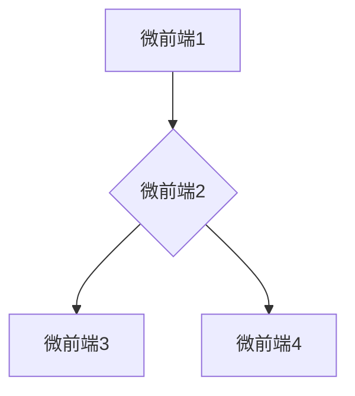
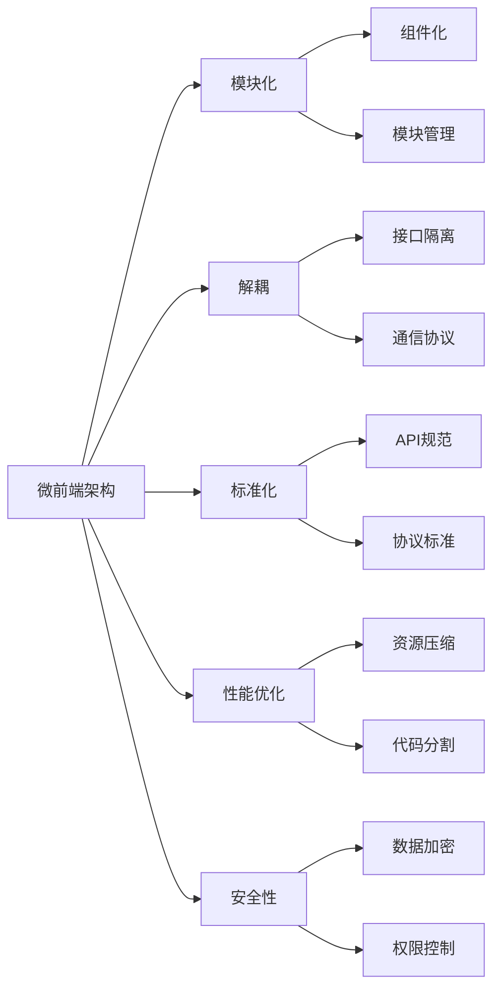
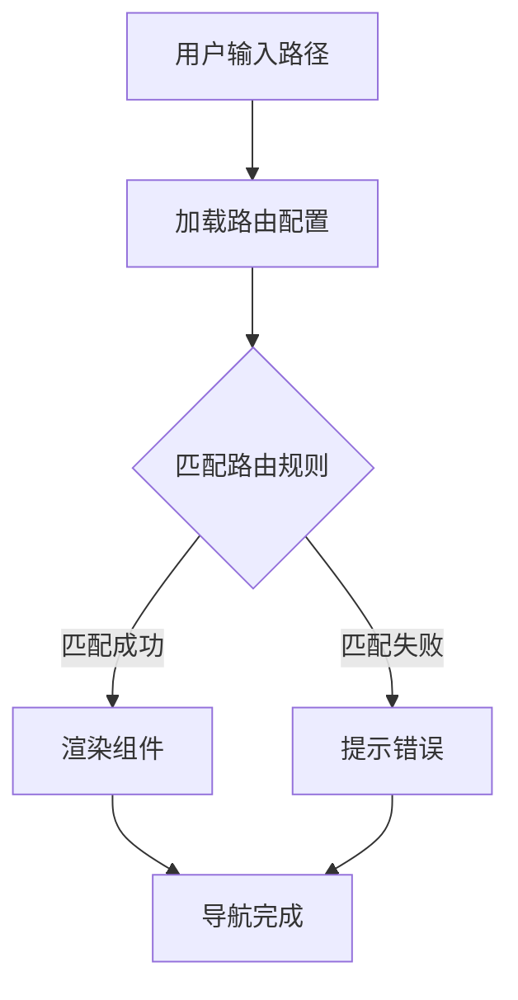
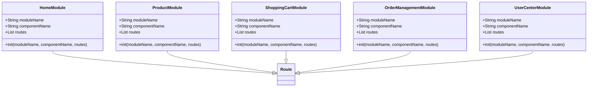
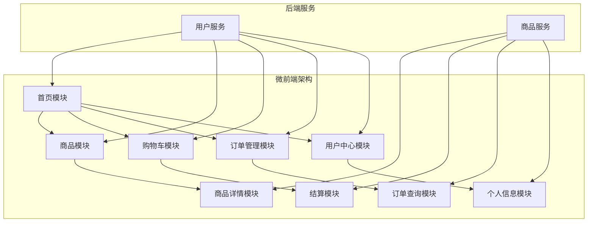
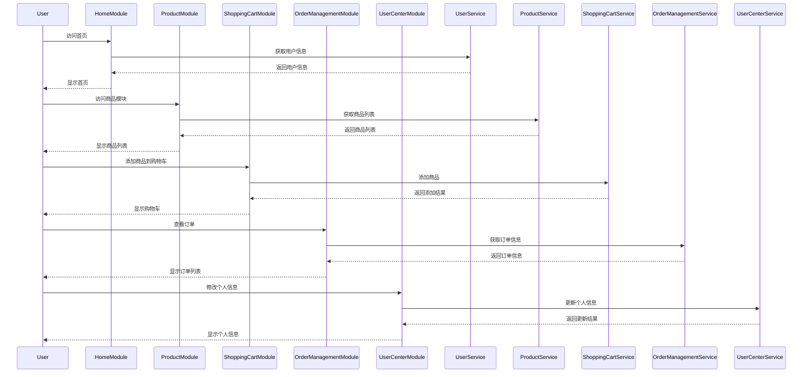

                 

### 文章标题

# 构建可扩展的微前端架构

### 关键词

- 微前端架构
- 可扩展性
- 前端框架
- 组件化开发
- 性能优化
- 安全性
- 持续集成

### 摘要

本文深入探讨了如何构建一个可扩展的微前端架构，涵盖了微前端架构的基本概念、技术选型、设计与实现、性能优化、安全与测试，以及最佳实践等内容。通过具体的案例研究和详细的步骤指导，读者可以全面了解微前端架构的优势和挑战，学会如何构建和维护一个高性能、可扩展的前端应用。

## 第一部分：微前端架构概述

### 第1章：微前端架构引论

#### 1.1 微前端的概念与背景

微前端架构（Micro-Frontend Architecture）是一种将前端应用拆分成多个独立、可复用的前端模块（微前端）的方法。这些微前端可以由不同的团队开发，使用不同的技术栈，但最终能够无缝集成，共同构建一个完整的前端应用。

微前端架构的背景可以追溯到微服务架构（Microservices Architecture）。在微服务架构中，后端服务被拆分成多个独立的服务，每个服务负责特定的业务功能。类似地，微前端架构将前端应用也拆分成多个独立的模块，每个模块负责特定的功能。

#### 1.2 微前端与单页应用（SPA）的区别

单页应用（Single Page Application，SPA）是指通过动态加载内容来更新页面而不重新请求整个页面的应用。SPA 提供了快速的用户体验，但通常要求应用的所有功能都在一个前端框架中实现。

微前端架构则更侧重于将应用拆分成多个独立的模块，每个模块可以由不同的团队独立开发。这使得团队可以并行工作，提高了开发效率，同时降低了应用维护的复杂度。

#### 1.3 微前端的优势与挑战

**优势：**
- **开发隔离性**：不同的团队可以独立开发、测试和部署各自的微前端，降低了协作成本。
- **技术多样性**：可以使用不同的技术栈开发不同的微前端，满足不同的业务需求。
- **可复用性**：独立的微前端可以方便地在不同的项目中复用。

**挑战：**
- **集成复杂性**：多个微前端的集成需要考虑兼容性、通信和状态管理等问题。
- **性能优化**：微前端架构可能引入额外的性能开销，如路由跳转、资源加载等。

#### 1.4 微前端架构的设计原则

为了构建一个可扩展的微前端架构，需要遵循以下设计原则：

- **模块化**：将应用拆分成独立的模块，每个模块负责特定的功能。
- **解耦**：减少模块之间的依赖，提高模块的独立性。
- **标准化**：制定统一的接口规范和通信协议，确保模块之间的兼容性。
- **性能优化**：关注模块的加载性能，采用懒加载、代码分割等技术。
- **安全性**：确保数据传输的安全性和应用的安全性。

### 第2章：微前端技术选型

#### 2.1 前端框架与微前端

前端框架（如React、Vue、Angular）提供了组件化开发、虚拟DOM、状态管理等特性，为微前端架构提供了良好的基础。

**React**：React 的组件化开发和虚拟DOM技术使得构建微前端变得容易。

**Vue**：Vue 的简洁性和灵活性使得它在微前端架构中也有广泛的应用。

**Angular**：Angular 的严格类型检查和强大的依赖注入机制为微前端提供了更好的开发体验。

#### 2.2 微前端构建工具

**Webpack**：Webpack 是目前最流行的前端构建工具，支持模块打包、代码分割、懒加载等功能。

**Vite**：Vite 是一个新型前端构建工具，提供了快速冷启动、即时热更新等特性。

#### 2.3 组件通信与状态管理

**组件通信**：组件通信是微前端架构中的一个关键问题。常见的通信方式包括事件总线、中间件和自定义API。

**状态管理**：状态管理是微前端架构中的另一个重要问题。常见的状态管理库包括Redux、Vuex、MobX等。

#### 2.4 微前端部署与集成

**部署**：微前端的部署需要考虑如何将多个独立的模块部署到生产环境，常见的策略包括静态部署、动态加载和联邦部署。

**集成**：微前端的集成需要考虑如何将多个独立的模块整合成一个完整的应用，包括路由、导航、界面布局等。

### 第3章：微前端设计与实现

#### 3.1 微前端项目初始化

创建一个微前端项目需要遵循以下步骤：

- **创建项目**：使用前端框架创建一个基本的项目结构。
- **配置构建工具**：配置Webpack或Vite等构建工具，设置模块打包、代码分割等参数。
- **配置路由**：配置微前端的路由，确保模块之间可以正确导航。

#### 3.2 微前端架构图与交互设计

绘制微前端架构图可以帮助理解微前端架构的整体结构。常用的工具包括Mermaid、Visio等。

- **模块划分**：根据功能将应用拆分成多个模块。
- **模块通信**：定义模块之间的通信机制和接口。
- **模块部署**：规划模块的部署方式和路径。

#### 3.3 微前端路由与导航

路由和导航是微前端架构中的核心部分。需要考虑以下问题：

- **动态路由**：如何处理动态路由和嵌套路由。
- **导航守卫**：如何实现导航守卫，防止非法访问。
- **跨域问题**：如何处理跨域请求。

#### 3.4 组件化开发与模块管理

组件化开发是微前端架构的基础。需要考虑以下问题：

- **组件划分**：如何划分组件，确保组件的独立性。
- **组件通信**：如何实现组件之间的通信。
- **模块打包**：如何打包和部署组件。

### 第4章：微前端性能优化

#### 4.1 资源懒加载与缓存策略

资源懒加载和缓存策略是微前端性能优化的关键。需要考虑以下问题：

- **懒加载**：如何实现资源的懒加载，减少初始加载时间。
- **缓存策略**：如何设置合理的缓存策略，提高页面性能。

#### 4.2 资源压缩与打包

资源压缩和打包是微前端性能优化的重要环节。需要考虑以下问题：

- **代码分割**：如何进行代码分割，减少打包体积。
- **压缩工具**：如何使用压缩工具减少资源体积。
- **打包策略**：如何配置打包工具，优化打包过程。

#### 4.3 异步加载与并发处理

异步加载和并发处理是提高微前端性能的重要手段。需要考虑以下问题：

- **异步加载**：如何实现异步加载，减少等待时间。
- **并发处理**：如何处理并发请求，避免阻塞。

#### 4.4 性能监控与调优

性能监控是微前端性能优化的重要环节。需要考虑以下问题：

- **监控工具**：如何使用监控工具监控性能指标。
- **性能调优**：如何根据监控结果进行性能调优。

### 第5章：微前端安全与测试

#### 5.1 微前端的安全性考虑

微前端的安全性需要考虑以下问题：

- **数据安全**：如何保证数据在传输过程中的安全性。
- **代码安全**：如何防止恶意代码注入。
- **权限控制**：如何实现权限控制，防止非法访问。

#### 5.2 微前端测试策略

微前端的测试策略需要考虑以下问题：

- **单元测试**：如何实现单元测试，确保组件的正确性。
- **集成测试**：如何实现集成测试，确保模块之间的兼容性。
- **性能测试**：如何进行性能测试，确保应用的性能。

#### 5.3 微前端自动化测试

自动化测试是提高测试效率的重要手段。需要考虑以下问题：

- **测试框架**：如何选择测试框架，实现自动化测试。
- **测试用例**：如何编写测试用例，确保覆盖所有功能点。
- **持续集成**：如何实现自动化测试的持续集成。

#### 5.4 跨域资源共享（CORS）与安全策略

跨域资源共享（CORS）是处理跨域请求的重要手段。需要考虑以下问题：

- **CORS策略**：如何设置CORS策略，允许跨域请求。
- **安全防护**：如何防止跨域攻击，确保应用的安全性。

### 第6章：微前端案例研究

#### 6.1 案例一：电商平台微前端实践

**案例背景**：电商平台通常功能复杂，需要支持多种设备和平台，采用微前端架构可以提高开发效率。

**实现步骤**：

1. **需求分析**：分析电商平台的业务需求，确定需要拆分的模块。
2. **架构设计**：设计微前端架构，确定模块之间的通信和依赖关系。
3. **开发与部署**：按模块划分开发任务，实现并部署微前端。
4. **测试与优化**：进行单元测试、集成测试和性能测试，优化微前端性能。

**效果评估**：通过微前端架构，电商平台实现了快速迭代和高效开发，同时提高了应用的性能和安全性。

#### 6.2 案例二：企业内部管理系统的微前端架构

**案例背景**：企业内部管理系统通常涉及多个部门和业务，采用微前端架构可以提高开发效率和系统灵活性。

**实现步骤**：

1. **需求分析**：分析企业内部管理系统的业务需求，确定需要拆分的模块。
2. **架构设计**：设计微前端架构，确定模块之间的通信和依赖关系。
3. **开发与部署**：按模块划分开发任务，实现并部署微前端。
4. **测试与优化**：进行单元测试、集成测试和性能测试，优化微前端性能。

**效果评估**：通过微前端架构，企业内部管理系统实现了模块化开发，提高了系统的灵活性和可维护性。

#### 6.3 案例三：大型应用中的微前端策略

**案例背景**：大型应用通常功能复杂，需要支持多种设备和平台，采用微前端策略可以提高开发效率和系统性能。

**实现步骤**：

1. **需求分析**：分析大型应用的业务需求，确定需要拆分的模块。
2. **架构设计**：设计微前端架构，确定模块之间的通信和依赖关系。
3. **开发与部署**：按模块划分开发任务，实现并部署微前端。
4. **测试与优化**：进行单元测试、集成测试和性能测试，优化微前端性能。

**效果评估**：通过微前端策略，大型应用实现了快速迭代和高效开发，同时提高了系统的性能和稳定性。

#### 6.4 案例分析总结

通过以上案例研究，可以发现微前端架构在提高开发效率、降低维护成本、提高性能和安全性方面具有显著优势。但同时也需要注意，微前端架构的引入可能增加项目的复杂度，需要合理规划和管理。

### 第7章：微前端架构最佳实践

#### 7.1 微前端团队协作最佳实践

为了确保微前端项目顺利进行，需要建立良好的团队协作机制：

- **明确职责**：明确团队成员的职责和角色，确保任务分工合理。
- **代码规范**：制定统一的代码规范，确保代码质量。
- **版本控制**：使用版本控制系统，如Git，管理代码版本。
- **代码评审**：实施代码评审制度，确保代码质量和稳定性。

#### 7.2 微前端架构持续集成（CI/CD）

持续集成（CI）和持续部署（CD）是微前端架构的重要环节：

- **CI/CD工具**：选择合适的CI/CD工具，如Jenkins、GitLab CI等。
- **自动化测试**：实施自动化测试，确保每次提交的代码都经过严格测试。
- **部署策略**：制定合理的部署策略，确保微前端模块可以快速、稳定地部署。

#### 7.3 微前端架构的可维护性与可扩展性

微前端架构的可维护性和可扩展性是关键成功因素：

- **模块化管理**：确保模块之间解耦，降低维护成本。
- **弹性扩展**：设计可扩展的架构，支持模块的增加和替换。
- **性能优化**：持续优化微前端性能，确保系统在高并发场景下稳定运行。

#### 7.4 微前端架构的未来发展趋势

随着技术的发展，微前端架构也在不断演进：

- **服务端渲染（SSR）**：服务端渲染可以提高应用的性能和首屏加载速度。
- **静态站点生成（SSG）**：静态站点生成可以提高应用的性能和安全性。
- **云原生前端**：利用云原生技术，实现微前端架构的弹性扩展和自动化部署。

### 第8章：小结与展望

#### 8.1 微前端架构的总结

微前端架构通过模块化、解耦和标准化，提高了前端开发的效率、灵活性和可维护性。尽管存在一定挑战，但微前端架构在大型、复杂的前端项目中展现出了巨大的潜力。

#### 8.2 微前端架构的未来发展

未来，微前端架构将继续发展，结合新的技术，如服务端渲染、静态站点生成和云原生前端，实现更高效、更安全、更灵活的前端开发。

#### 8.3 微前端架构的局限性

微前端架构并非万能，也存在一定的局限性：

- **开发复杂度**：微前端架构增加了项目的复杂度，需要更多的规划和协作。
- **性能开销**：微前端架构可能引入额外的性能开销，如路由跳转、资源加载等。

#### 8.4 进一步学习的资源

- **书籍推荐**：《微前端架构设计》、《微前端实践》等。
- **在线教程**：Vue、React、Angular等框架的官方文档。
- **社区论坛**：前端社区的讨论和分享。

### 作者

**作者：AI天才研究院/AI Genius Institute & 禅与计算机程序设计艺术 /Zen And The Art of Computer Programming**

### 文章目录

#### 第一部分：微前端架构概述
- 第1章：微前端架构引论
  - 1.1 微前端的概念与背景
  - 1.2 微前端与单页应用（SPA）的区别
  - 1.3 微前端的优势与挑战
  - 1.4 微前端架构的设计原则
- 第2章：微前端技术选型
  - 2.1 前端框架与微前端
  - 2.2 微前端构建工具
  - 2.3 组件通信与状态管理
  - 2.4 微前端部署与集成
- 第3章：微前端设计与实现
  - 3.1 微前端项目初始化
  - 3.2 微前端架构图与交互设计
  - 3.3 微前端路由与导航
  - 3.4 组件化开发与模块管理
- 第4章：微前端性能优化
  - 4.1 资源懒加载与缓存策略
  - 4.2 资源压缩与打包
  - 4.3 异步加载与并发处理
  - 4.4 性能监控与调优
- 第5章：微前端安全与测试
  - 5.1 微前端的安全性考虑
  - 5.2 微前端测试策略
  - 5.3 微前端自动化测试
  - 5.4 跨域资源共享（CORS）与安全策略
- 第6章：微前端案例研究
  - 6.1 案例一：电商平台微前端实践
  - 6.2 案例二：企业内部管理系统的微前端架构
  - 6.3 案例三：大型应用中的微前端策略
  - 6.4 案例分析总结
- 第7章：微前端架构最佳实践
  - 7.1 微前端团队协作最佳实践
  - 7.2 微前端架构持续集成（CI/CD）
  - 7.3 微前端架构的可维护性与可扩展性
  - 7.4 微前端架构的未来发展趋势
- 第8章：小结与展望
  - 8.1 微前端架构的总结
  - 8.2 微前端架构的未来发展
  - 8.3 微前端架构的局限性
  - 8.4 进一步学习的资源

### 文章内容

#### 第1章：微前端架构引论

微前端架构是一种将前端应用拆分成多个独立、可复用的前端模块的方法。这些模块可以由不同的团队开发，使用不同的技术栈，但最终能够无缝集成，共同构建一个完整的前端应用。微前端架构的背景可以追溯到微服务架构。在微服务架构中，后端服务被拆分成多个独立的服务，每个服务负责特定的业务功能。类似地，微前端架构将前端应用也拆分成多个独立的模块，每个模块负责特定的功能。

微前端架构具有以下优势：

1. **开发隔离性**：不同的团队可以独立开发、测试和部署各自的微前端，降低了协作成本。
2. **技术多样性**：可以使用不同的技术栈开发不同的微前端，满足不同的业务需求。
3. **可复用性**：独立的微前端可以方便地在不同的项目中复用。

然而，微前端架构也带来了一些挑战：

1. **集成复杂性**：多个微前端的集成需要考虑兼容性、通信和状态管理等问题。
2. **性能优化**：微前端架构可能引入额外的性能开销，如路由跳转、资源加载等。

微前端架构的设计原则如下：

1. **模块化**：将应用拆分成独立的模块，每个模块负责特定的功能。
2. **解耦**：减少模块之间的依赖，提高模块的独立性。
3. **标准化**：制定统一的接口规范和通信协议，确保模块之间的兼容性。
4. **性能优化**：关注模块的加载性能，采用懒加载、代码分割等技术。
5. **安全性**：确保数据传输的安全性和应用的安全性。

#### 第2章：微前端技术选型

在构建微前端架构时，选择合适的技术栈是至关重要的。以下是对前端框架、构建工具、组件通信与状态管理以及部署与集成等方面的技术选型的讨论。

##### 2.1 前端框架与微前端

前端框架是构建微前端架构的基础。目前流行的前端框架包括React、Vue和Angular。每个框架都有其独特的优点和适用场景。

1. **React**：React 是由Facebook开发的一个用于构建用户界面的JavaScript库。它具有组件化开发、虚拟DOM和生命周期方法等特性，适合大型应用和复杂交互场景。

2. **Vue**：Vue 是一个渐进式的前端框架，由尤雨溪开发。它以简洁和灵活著称，适合快速开发和小型项目。Vue 也支持组件化开发、虚拟DOM和生命周期方法。

3. **Angular**：Angular 是由Google开发的一个全功能、基于组件的前端框架。它具有严格的类型检查、强大的依赖注入和丰富的工具链，适合大型和复杂项目。

在微前端架构中，选择合适的前端框架需要考虑团队的技术栈、项目需求和个人偏好。React 和 Vue 因其灵活性和可扩展性，在微前端架构中得到了广泛的应用。

##### 2.2 微前端构建工具

构建工具用于打包、编译和优化前端代码。常见的构建工具有Webpack和Vite。

1. **Webpack**：Webpack 是一个强大的模块打包工具，可以处理模块依赖、代码分割、懒加载等功能。它适用于复杂的大型项目，但配置较为复杂。

2. **Vite**：Vite 是一个新型的前端构建工具，由Vue团队开发。它提供了快速冷启动、即时热更新等特性，适用于快速开发和小型项目。Vite 的配置相对简单，但功能较为基础。

选择构建工具时，需要考虑项目的复杂度和开发需求。对于复杂项目，可以选择Webpack；对于快速开发和小型项目，可以选择Vite。

##### 2.3 组件通信与状态管理

在微前端架构中，组件通信和状态管理是关键问题。组件通信用于不同微前端模块之间的数据传递，状态管理用于全局状态的管理。

1. **组件通信**：常见的组件通信方式包括事件总线、中间件和自定义API。

- **事件总线**：事件总线是一种全局事件管理机制，可用于模块之间的通信。它通过发布-订阅模式实现模块之间的数据传递。
- **中间件**：中间件是一种模块化通信机制，通过拦截和处理HTTP请求和响应来实现模块之间的通信。
- **自定义API**：自定义API是一种通过定义接口来实现模块之间通信的方式。它适用于模块之间的数据传输较为复杂的情况。

2. **状态管理**：常见的状态管理库包括Redux、Vuex和MobX。

- **Redux**：Redux 是一个由Facebook开源的状态管理库，采用单向数据流模式。它适用于复杂状态管理和大型应用。
- **Vuex**：Vuex 是Vue框架内置的状态管理库，与Vue紧密结合。它适用于Vue项目的状态管理。
- **MobX**：MobX 是一个反应式状态管理库，采用响应式编程模式。它适用于快速开发和小型应用。

选择组件通信和状态管理的方式时，需要考虑模块之间的数据传输复杂度和应用规模。

##### 2.4 微前端部署与集成

微前端的部署与集成是构建微前端架构的最后一个环节。部署与集成需要考虑以下几个方面：

1. **部署方式**：常见的部署方式包括静态部署、动态加载和联邦部署。

- **静态部署**：静态部署将微前端模块打包成静态资源，直接部署到服务器。这种方式简单高效，但无法动态加载和更新模块。
- **动态加载**：动态加载通过JavaScript动态加载模块，实现模块的按需加载和更新。这种方式可以提高页面性能和用户体验，但需要处理模块加载的异步性。
- **联邦部署**：联邦部署通过将微前端模块部署到不同的服务器，实现模块的独立部署和更新。这种方式可以提高系统的可用性和可扩展性，但需要处理模块之间的依赖和兼容性问题。

2. **集成方式**：集成方式包括路由集成、导航集成和界面集成。

- **路由集成**：路由集成通过统一的路由配置，实现微前端模块之间的无缝切换。这种方式适用于模块之间的路由关系较为简单的情况。
- **导航集成**：导航集成通过全局导航栏或菜单，实现微前端模块之间的导航。这种方式适用于模块之间的导航关系较为复杂的情况。
- **界面集成**：界面集成通过统一的界面布局和样式，实现微前端模块之间的界面一致性。这种方式适用于界面设计要求较高的情况。

选择部署与集成方式时，需要考虑应用的性能、用户体验和开发效率。

#### 第3章：微前端设计与实现

构建一个可扩展的微前端架构需要考虑项目初始化、架构图与交互设计、路由与导航以及组件化开发与模块管理。

##### 3.1 微前端项目初始化

项目初始化是构建微前端架构的第一步。初始化步骤包括创建项目目录、配置构建工具和搭建项目结构。

1. **创建项目目录**：根据项目需求，创建项目目录结构。例如，可以创建以下目录结构：

```
my-micro-frontend/
|-- public/
|   |-- index.html
|-- src/
|   |-- components/
|   |-- layouts/
|   |-- pages/
|   |-- App.js
|   |-- index.js
|-- package.json
|-- webpack.config.js
```

2. **配置构建工具**：配置Webpack或Vite等构建工具，设置模块打包、代码分割、懒加载等参数。例如，可以使用Webpack配置以下内容：

```javascript
const path = require('path');

module.exports = {
  entry: './src/index.js',
  output: {
    filename: 'bundle.js',
    path: path.resolve(__dirname, 'dist'),
  },
  module: {
    rules: [
      {
        test: /\.js$/,
        exclude: /node_modules/,
        use: 'babel-loader',
      },
    ],
  },
};
```

3. **搭建项目结构**：根据项目需求，搭建项目结构。例如，可以创建以下组件、布局和页面目录：

```
src/
|-- components/
|   |-- Button.js
|   |-- Input.js
|-- layouts/
|   |-- MainLayout.js
|-- pages/
|   |-- Home.js
|   |-- About.js
```

##### 3.2 微前端架构图与交互设计

架构图与交互设计是构建微前端架构的重要环节。架构图可以帮助理解微前端架构的整体结构，交互设计可以帮助实现模块之间的交互。

1. **架构图**：可以使用Mermaid等工具绘制微前端架构图。以下是一个简单的架构图示例：



2. **交互设计**：交互设计可以根据架构图和项目需求，定义模块之间的交互方式和数据传递。以下是一个简单的交互设计示例：

- **微前端1**与**微前端2**之间的交互：通过事件总线传递数据。
- **微前端2**与**微前端3**之间的交互：通过自定义API传递数据。
- **微前端3**与**微前端4**之间的交互：通过全局状态管理库传递数据。

##### 3.3 微前端路由与导航

路由与导航是微前端架构的核心部分，用于实现模块之间的跳转和切换。常用的路由库包括React Router、Vue Router和Angular Router。

1. **React Router**：React Router 是React框架的官方路由库，支持动态路由、嵌套路由和路由守卫等功能。

```javascript
import { BrowserRouter as Router, Route, Switch } from 'react-router-dom';

function App() {
  return (
    <Router>
      <Switch>
        <Route exact path="/" component={Home} />
        <Route path="/about" component={About} />
      </Switch>
    </Router>
  );
}
```

2. **Vue Router**：Vue Router 是Vue框架的官方路由库，支持动态路由、嵌套路由和路由守卫等功能。

```html
<template>
  <div id="app">
    <router-view></router-view>
  </div>
</template>

<script>
import { RouterLink, RouterView } from 'vue-router';

export default {
  components: {
    RouterLink,
    RouterView,
  },
  data() {
    return {
      routes: [
        { path: '/', component: Home },
        { path: '/about', component: About },
      ],
    };
  },
};
</script>
```

3. **Angular Router**：Angular Router 是Angular框架的官方路由库，支持动态路由、嵌套路由和路由守卫等功能。

```typescript
import { RouterModule, Routes } from '@angular/router';

const appRoutes: Routes = [
  { path: '', component: Home },
  { path: 'about', component: About },
];

@NgModule({
  imports: [RouterModule.forRoot(appRoutes)],
  exports: [RouterModule],
})
export class AppRoutingModule {}
```

##### 3.4 组件化开发与模块管理

组件化开发是微前端架构的核心思想，通过将功能模块化，提高代码的可维护性和复用性。模块管理用于管理模块的导入和导出，确保模块之间的依赖和独立性。

1. **组件化开发**：在微前端项目中，可以使用React、Vue或Angular等框架的组件化开发功能。以下是一个简单的组件化开发示例：

```javascript
// Button.js
import React from 'react';

function Button({ text }) {
  return <button>{text}</button>;
}

export default Button;

// Input.js
import React from 'react';

function Input({ label, value, onChange }) {
  return (
    <label>
      {label}
      <input type="text" value={value} onChange={onChange} />
    </label>
  );
}

export default Input;
```

2. **模块管理**：在微前端项目中，可以使用Webpack等构建工具的模块管理功能，确保模块之间的依赖和独立性。以下是一个简单的模块管理示例：

```javascript
// index.js
import React from 'react';
import ReactDOM from 'react-dom';
import Button from './Button';
import Input from './Input';

const App = () => (
  <div>
    <Button text="Submit" />
    <Input label="Name" value="" onChange={(e) => console.log(e.target.value)} />
  </div>
);

ReactDOM.render(<App />, document.getElementById('app'));
```

通过以上步骤，可以构建一个基本的微前端架构。在实际项目中，可以根据需求进行扩展和优化，实现更复杂的功能。

#### 第4章：微前端性能优化

微前端架构在提高开发效率和灵活性方面具有显著优势，但同时也可能引入额外的性能开销，如路由跳转、资源加载等。因此，性能优化是构建可扩展微前端架构的关键环节。

##### 4.1 资源懒加载与缓存策略

资源懒加载和缓存策略是微前端性能优化的重要手段。以下详细介绍这两种技术。

##### 4.1.1 资源懒加载

资源懒加载是一种延迟加载资源的技术，只有在需要时才加载资源，从而减少初始加载时间，提高页面性能。

1. **动态导入**：动态导入是一种常见的资源懒加载技术。通过动态导入，可以在需要时异步加载模块。

```javascript
// 使用Webpack的动态导入
import('./Module').then((module) => {
  // 加载模块后执行代码
  module.default();
});
```

2. **路由懒加载**：路由懒加载是一种在路由级别实现资源懒加载的技术。通过路由懒加载，可以按需加载路由组件，从而减少初始加载时间。

```javascript
// 使用React Router的懒加载路由
const Module = React.lazy(() => import('./Module'));

const MyRoute = () => (
  <Route
    path="/module"
    component={Module}
    lazy={true}
  />
);
```

##### 4.1.2 缓存策略

缓存策略是一种将资源存储在本地或服务端，以便在下次访问时快速访问的技术。以下详细介绍几种常见的缓存策略。

1. **浏览器缓存**：浏览器缓存是一种将资源存储在浏览器缓存中的技术。通过设置合理的缓存策略，可以减少资源的重复加载。

```javascript
// 使用Webpack的缓存策略
module.exports = {
  output: {
    publicPath: 'https://cdn.example.com/assets/',
    filename: '[name].[contenthash].js',
    chunkFilename: '[name].[contenthash].js',
  },
  optimization: {
    runtimeChunk: false,
    splitChunks: {
      cacheGroups: {
        defaultVendors: {
          test: /[\\/]node_modules[\\/]/,
          priority: -10,
          chunks: 'all',
          name: 'vendors',
          enforce: true,
        },
        default: {
          minChunks: 2,
          priority: -20,
          chunks: 'all',
          reuseExistingChunk: true,
        },
      },
    },
  },
  performance: {
    hints: false,
    maxEntrypointSize: 512000,
    maxAssetSize: 512000,
  },
};
```

2. **服务端缓存**：服务端缓存是一种将资源存储在服务端缓存中的技术。通过服务端缓存，可以减少资源的请求次数，提高访问速度。

```python
# 使用Nginx缓存静态资源
location / {
  proxy_cache static_cache;
  proxy_cache_bypass $http_cache_bypass;
  proxy_pass http://backend;
  proxy_cache_valid 200 1d;
  proxy_cache_valid 404 1m;
  proxy_cache_valid 500 1m;
}
```

##### 4.2 资源压缩与打包

资源压缩与打包是提高页面性能的重要手段。以下详细介绍资源压缩与打包技术。

##### 4.2.1 资源压缩

资源压缩是一种通过减少资源文件的大小来提高页面性能的技术。以下详细介绍几种常见的资源压缩技术。

1. **JavaScript压缩**：JavaScript压缩是一种通过删除空格、注释和重复代码来减少JavaScript文件大小的技术。

```javascript
// 使用UglifyJS压缩JavaScript
const UglifyJS = require('uglify-js');
const result = UglifyJS.minify('function hello() { console.log("Hello, world!"); }');
if (result.error) {
  console.error(result.error);
} else {
  console.log(result.code);
}
```

2. **CSS压缩**：CSS压缩是一种通过删除空格、注释和重复代码来减少CSS文件大小的技术。

```javascript
// 使用CleanCSS压缩CSS
const CleanCSS = require('clean-css');
const result = CleanCSS.minify('.class { color: red; }');
if (result.errors) {
  console.error(result.errors);
} else {
  console.log(result.styles);
}
```

##### 4.2.2 打包策略

打包策略是一种通过合理配置构建工具来优化资源打包的技术。以下详细介绍几种常见的打包策略。

1. **代码分割**：代码分割是一种将代码拆分成多个文件的技术，从而减少单个文件的大小。

```javascript
// 使用Webpack的代码分割
const path = require('path');
const HtmlWebpackPlugin = require('html-webpack-plugin');
const { CleanWebpackPlugin } = require('clean-webpack-plugin');

module.exports = {
  entry: {
    app: './src/app.js',
    search: './src/search.js',
  },
  output: {
    filename: '[name].[contenthash].js',
    path: path.resolve(__dirname, 'dist'),
  },
  optimization: {
    runtimeChunk: false,
    splitChunks: {
      cacheGroups: {
        defaultVendors: {
          test: /[\\/]node_modules[\\/]/,
          priority: -10,
          chunks: 'all',
          name: 'vendors',
          enforce: true,
        },
        default: {
          minChunks: 2,
          priority: -20,
          chunks: 'all',
          reuseExistingChunk: true,
        },
      },
    },
  },
  plugins: [
    new HtmlWebpackPlugin({
      template: './src/index.html',
    }),
    new CleanWebpackPlugin(),
  ],
  module: {
    rules: [
      {
        test: /\.css$/,
        use: ['style-loader', 'css-loader'],
      },
    ],
  },
};
```

2. **资源懒加载**：资源懒加载是一种在需要时才加载资源的技术，从而减少初始加载时间。

```javascript
// 使用Webpack的资源懒加载
import('./Module').then((module) => {
  // 加载模块后执行代码
  module.default();
});
```

##### 4.3 异步加载与并发处理

异步加载和并发处理是提高页面性能的重要手段。以下详细介绍这两种技术。

##### 4.3.1 异步加载

异步加载是一种在需要时才加载资源的技术，从而减少初始加载时间。

1. **动态导入**：动态导入是一种常见的异步加载技术。通过动态导入，可以在需要时异步加载模块。

```javascript
// 使用Webpack的动态导入
import('./Module').then((module) => {
  // 加载模块后执行代码
  module.default();
});
```

2. **路由懒加载**：路由懒加载是一种在需要时才加载路由组件的技术，从而减少初始加载时间。

```javascript
// 使用React Router的懒加载路由
const Module = React.lazy(() => import('./Module'));

const MyRoute = () => (
  <Route
    path="/module"
    component={Module}
    lazy={true}
  />
);
```

##### 4.3.2 并发处理

并发处理是一种在多个请求同时进行时优化性能的技术。

1. **并发请求**：通过使用多个并发请求，可以加快资源的加载速度。

```javascript
// 使用Promise并发请求
const fetchPromises = [
  fetch('/api/data1').then((response) => response.json()),
  fetch('/api/data2').then((response) => response.json()),
];

Promise.all(fetchPromises).then((results) => {
  console.log(results);
});
```

2. **并发处理**：通过使用异步和并行处理技术，可以同时处理多个请求。

```javascript
// 使用异步处理并发请求
async function fetchData() {
  const data1 = await fetch('/api/data1').then((response) => response.json());
  const data2 = await fetch('/api/data2').then((response) => response.json());
  console.log(data1, data2);
}

fetchData();
```

##### 4.4 性能监控与调优

性能监控与调优是确保微前端架构性能的关键步骤。以下详细介绍性能监控与调优的方法。

1. **性能监控**：通过使用性能监控工具，可以实时监控微前端架构的性能。

- **Chrome DevTools**：使用Chrome DevTools的性能监控工具，可以实时查看页面性能指标，如加载时间、渲染时间等。
- **Lighthouse**：使用Lighthouse的性能分析工具，可以分析页面的性能问题，并提供优化建议。

2. **性能调优**：根据性能监控的结果，可以针对性地进行性能优化。

- **资源压缩**：通过使用资源压缩工具，可以减少资源文件的大小，提高加载速度。
- **代码分割**：通过使用代码分割技术，可以将代码拆分成多个文件，减少单个文件的大小。
- **懒加载**：通过使用懒加载技术，可以延迟加载资源，减少初始加载时间。

通过以上性能优化方法，可以显著提高微前端架构的性能。

#### 第5章：微前端安全与测试

构建可扩展的微前端架构不仅需要考虑性能和开发效率，还需要关注安全和测试。本章将探讨微前端架构的安全性、测试策略和自动化测试。

##### 5.1 微前端的安全性考虑

微前端架构由于涉及多个独立的模块，其安全性至关重要。以下是一些安全性考虑：

1. **数据安全**：微前端架构需要确保数据在传输过程中的安全性。常用的方法包括使用HTTPS协议、对敏感数据进行加密和校验等。

2. **代码安全**：微前端架构需要防止恶意代码注入，如XSS攻击和CSRF攻击。可以使用内容安全策略（CSP）和验证码等技术来提高代码的安全性。

3. **权限控制**：微前端架构需要实现细粒度的权限控制，确保用户只能访问其权限范围内的功能。可以使用JWT（JSON Web Tokens）等认证技术来实现权限控制。

4. **API安全**：微前端架构中，多个模块可能会通过API进行通信。需要确保API的安全性，如限制API调用频率、使用API密钥等。

##### 5.2 微前端测试策略

微前端架构的测试策略需要涵盖单元测试、集成测试和性能测试。以下是一些测试策略：

1. **单元测试**：单元测试是测试微前端模块的基本手段。每个模块都应该有相应的单元测试，确保模块的功能正确。

2. **集成测试**：集成测试用于测试模块之间的交互和集成。需要确保模块之间能够正确通信和协同工作。

3. **性能测试**：性能测试用于评估微前端架构的性能，如响应时间、资源加载时间等。可以通过工具如JMeter进行性能测试。

##### 5.3 微前端自动化测试

自动化测试可以提高测试效率，确保微前端架构的稳定性和可靠性。以下是一些自动化测试方法：

1. **单元测试自动化**：使用测试框架如Jest、Mocha等，自动运行单元测试。可以使用Mock来模拟模块之间的交互。

2. **集成测试自动化**：使用测试框架如Cypress、Nightwatch等，自动运行集成测试。这些工具可以模拟用户操作，检查页面元素的显示和交互。

3. **性能测试自动化**：使用性能测试工具如JMeter、Gatling等，自动运行性能测试。这些工具可以模拟高并发场景，评估系统的性能表现。

4. **持续集成（CI）**：将自动化测试集成到CI流程中，确保每次代码提交都经过自动化测试。常用的CI工具如Jenkins、GitHub Actions等可以自动化构建和测试过程。

##### 5.4 跨域资源共享（CORS）与安全策略

跨域资源共享（CORS）是一种允许不同源（origin）之间进行资源请求的技术。在微前端架构中，由于模块可能部署在不同的域名上，需要处理CORS问题。

1. **CORS策略**：服务器需要设置CORS策略，允许来自特定源的HTTP请求。可以使用Apache、Nginx等Web服务器设置CORS策略。

2. **安全策略**：虽然CORS允许跨域请求，但仍然需要关注安全问题。可以限制CORS请求的方法和头信息，只允许必要的请求。

通过以上安全与测试措施，可以构建一个安全可靠的微前端架构。

#### 第6章：微前端案例研究

在本章节中，我们将通过三个具体的案例，详细探讨微前端架构在实际项目中的应用与实践。

##### 6.1 案例一：电商平台微前端实践

**案例背景**：
电商平台通常具有复杂的业务流程和多样化的功能需求，为了提高开发效率、降低维护成本并提升用户体验，许多电商平台开始采用微前端架构。

**实现步骤**：

1. **需求分析**：
   - 分析电商平台的核心功能模块，如商品展示、购物车、订单管理、用户中心等。
   - 确定每个模块的具体功能和性能需求。

2. **架构设计**：
   - 设计微前端架构，将电商平台拆分为多个独立的微前端模块，每个模块负责特定的功能。
   - 设计模块之间的通信机制，确保数据传输的安全性和一致性。

3. **开发与部署**：
   - 各个团队独立开发各自的微前端模块，使用不同的技术栈以满足特定的业务需求。
   - 使用持续集成（CI）和持续部署（CD）流程，确保模块的快速迭代和稳定部署。

4. **测试与优化**：
   - 对每个微前端模块进行单元测试和集成测试，确保功能的正确性和稳定性。
   - 进行性能测试，优化模块的加载速度和响应时间。

**效果评估**：
通过微前端架构，电商平台实现了功能的模块化，提高了开发效率和代码的可维护性。同时，模块之间的独立部署和更新降低了系统的风险，提高了用户体验。

##### 6.2 案例二：企业内部管理系统的微前端架构

**案例背景**：
企业内部管理系统通常涉及多个部门和业务线，功能复杂且需求多变。为了提高系统的灵活性和可扩展性，企业内部管理系统采用微前端架构。

**实现步骤**：

1. **需求分析**：
   - 分析企业内部管理系统的功能需求，确定需要拆分的模块，如人事管理、财务管理、项目管理等。
   - 确定每个模块的具体功能和性能需求。

2. **架构设计**：
   - 设计微前端架构，将企业内部管理系统拆分为多个独立的微前端模块，每个模块负责特定的功能。
   - 设计模块之间的通信机制，确保数据传输的安全性和一致性。

3. **开发与部署**：
   - 各个团队独立开发各自的微前端模块，使用不同的技术栈以满足特定的业务需求。
   - 使用持续集成（CI）和持续部署（CD）流程，确保模块的快速迭代和稳定部署。

4. **测试与优化**：
   - 对每个微前端模块进行单元测试和集成测试，确保功能的正确性和稳定性。
   - 进行性能测试，优化模块的加载速度和响应时间。

**效果评估**：
通过微前端架构，企业内部管理系统实现了功能的模块化和灵活扩展。团队可以独立开发、测试和部署各自的模块，提高了开发效率和系统可维护性。同时，模块之间的解耦降低了系统的复杂度和风险。

##### 6.3 案例三：大型应用中的微前端策略

**案例背景**：
大型应用通常具有庞大的用户群体和复杂的功能需求。为了提高系统的性能和可扩展性，大型应用采用微前端策略，将前端架构拆分为多个独立的模块。

**实现步骤**：

1. **需求分析**：
   - 分析大型应用的功能需求，确定需要拆分的模块，如用户登录、搜索、内容展示等。
   - 确定每个模块的具体功能和性能需求。

2. **架构设计**：
   - 设计微前端架构，将大型应用拆分为多个独立的微前端模块，每个模块负责特定的功能。
   - 设计模块之间的通信机制，确保数据传输的安全性和一致性。

3. **开发与部署**：
   - 各个团队独立开发各自的微前端模块，使用不同的技术栈以满足特定的业务需求。
   - 使用持续集成（CI）和持续部署（CD）流程，确保模块的快速迭代和稳定部署。

4. **测试与优化**：
   - 对每个微前端模块进行单元测试和集成测试，确保功能的正确性和稳定性。
   - 进行性能测试，优化模块的加载速度和响应时间。

**效果评估**：
通过微前端策略，大型应用实现了功能的模块化和高性能。模块之间的解耦提高了系统的可扩展性和可维护性，同时通过持续集成和持续部署，实现了快速迭代和高效的开发和部署。系统性能得到显著提升，用户体验得到优化。

##### 6.4 案例分析总结

通过以上案例研究，可以总结出微前端架构在实际项目中的应用优势和挑战：

**优势**：
- 提高开发效率：通过模块化开发，各个团队可以并行工作，提高了开发速度。
- 灵活扩展：模块化设计使系统能够快速适应新的功能和需求。
- 提高可维护性：模块之间的解耦降低了系统的复杂度，提高了代码的可维护性。
- 支持多样化技术栈：不同的模块可以使用不同的技术栈，满足特定的业务需求。

**挑战**：
- 增加集成复杂性：多个模块的集成需要考虑兼容性和数据传输问题。
- 性能优化：微前端架构可能引入额外的性能开销，需要特别关注性能优化。
- 安全性：跨模块的数据传输需要特别关注安全性。

通过合理的架构设计和持续优化，微前端架构可以在大型和复杂的前端项目中发挥巨大的潜力。

#### 第7章：微前端架构最佳实践

构建一个可扩展的微前端架构不仅需要选择合适的技术栈和工具，还需要遵循最佳实践，确保项目的高效开发和维护。以下是一些微前端架构的最佳实践：

##### 7.1 微前端团队协作最佳实践

微前端架构通常涉及多个团队的协作，良好的团队协作机制是项目成功的关键。以下是一些团队协作的最佳实践：

1. **明确职责**：为每个团队分配明确的职责和任务，确保每个模块的开发和维护责任清晰。

2. **代码规范**：制定统一的代码规范，确保代码质量一致。这包括命名约定、代码风格和代码注释。

3. **版本控制**：使用版本控制系统（如Git）来管理代码变更，确保代码的版本可追溯。

4. **代码评审**：实施代码评审制度，确保每个模块的代码都经过审查，避免引入错误。

5. **文档管理**：维护详细的文档，包括模块的功能描述、API文档和开发指南，方便团队成员之间的协作。

##### 7.2 微前端架构持续集成（CI/CD）

持续集成和持续部署是微前端架构中不可或缺的部分。以下是一些CI/CD的最佳实践：

1. **自动化测试**：将自动化测试集成到CI流程中，确保每次代码提交都经过严格的测试。

2. **构建优化**：优化构建流程，减少构建时间，提高开发效率。可以使用并行构建、缓存等技术。

3. **环境隔离**：为每个团队提供一个独立的开发、测试和生产环境，确保环境的一致性和稳定性。

4. **持续交付**：使用持续交付（CD）工具，实现自动化的部署和发布流程，确保模块的快速迭代和稳定发布。

5. **监控与反馈**：集成监控工具，实时监控系统的性能和健康状况，快速响应和解决问题。

##### 7.3 微前端架构的可维护性与可扩展性

可维护性和可扩展性是微前端架构的核心目标。以下是一些实现最佳实践：

1. **模块化设计**：将应用拆分成小的、独立的模块，每个模块负责特定的功能。

2. **解耦**：尽量减少模块之间的依赖，提高模块的独立性，降低系统的复杂度。

3. **标准化**：制定统一的接口规范和通信协议，确保模块之间的兼容性和互操作性。

4. **性能优化**：关注模块的加载性能，采用懒加载、代码分割等技术。

5. **弹性扩展**：设计可扩展的架构，支持模块的增加和替换，确保系统能够应对未来的变化。

##### 7.4 微前端架构的未来发展趋势

随着技术的发展，微前端架构也在不断演进。以下是一些未来发展趋势：

1. **服务端渲染（SSR）**：服务端渲染可以提高应用的性能和首屏加载速度，未来可能会在微前端架构中得到更多的应用。

2. **静态站点生成（SSG）**：静态站点生成可以提高应用的性能和安全性，未来可能会成为一种流行的微前端架构模式。

3. **云原生前端**：云原生技术为微前端架构提供了更好的可扩展性和弹性，未来云原生前端可能会成为主流。

4. **智能化运维**：随着人工智能技术的发展，智能化运维可能会在微前端架构中发挥重要作用，提高系统的自动化和智能化水平。

通过遵循这些最佳实践，可以构建一个高效、可扩展的微前端架构，为前端开发提供强大的支持。

#### 第8章：小结与展望

##### 8.1 微前端架构的总结

微前端架构通过将前端应用拆分成多个独立的模块，实现了开发隔离性、技术多样性、可复用性等优势。它不仅提高了开发效率，还降低了系统的维护成本，使得大型和复杂的前端项目能够更灵活地适应变化。

微前端架构的核心在于模块化、解耦和标准化。通过模块化，可以将应用拆分成小的、独立的模块，便于团队并行开发。解耦则降低了模块之间的依赖，提高了系统的可维护性。标准化则确保了模块之间的兼容性和互操作性。

##### 8.2 微前端架构的未来发展

随着技术的不断进步，微前端架构也将继续发展。以下是一些未来的发展趋势：

1. **服务端渲染（SSR）**：服务端渲染可以提高应用的性能和首屏加载速度，未来可能会在微前端架构中得到更多的应用。

2. **静态站点生成（SSG）**：静态站点生成可以提高应用的性能和安全性，未来可能会成为一种流行的微前端架构模式。

3. **云原生前端**：云原生技术为微前端架构提供了更好的可扩展性和弹性，未来云原生前端可能会成为主流。

4. **智能化运维**：随着人工智能技术的发展，智能化运维可能会在微前端架构中发挥重要作用，提高系统的自动化和智能化水平。

##### 8.3 微前端架构的局限性

尽管微前端架构具有许多优势，但它也存在一定的局限性。以下是一些需要注意的问题：

1. **开发复杂度**：微前端架构增加了项目的复杂度，需要更多的规划和协作。

2. **性能开销**：微前端架构可能引入额外的性能开销，如路由跳转、资源加载等。

3. **安全性**：微前端架构中，多个模块的集成和通信需要特别关注安全性，防止数据泄露和恶意攻击。

##### 8.4 进一步学习的资源

对于希望深入了解微前端架构的开发者，以下是一些建议的进一步学习资源：

- **书籍推荐**：
  - 《微前端架构设计》
  - 《微前端实践》
- **在线教程**：
  - Vue、React、Angular等框架的官方文档
  - 微前端相关技术博客和论坛
- **社区活动**：
  - 参加前端技术会议和研讨会
  - 加入前端技术社群和交流群

通过不断学习和实践，开发者可以更好地掌握微前端架构，为前端开发带来更多的创新和突破。

### 文章关键词

- 微前端架构
- 可扩展性
- 前端框架
- 组件化开发
- 性能优化
- 安全性
- 持续集成

### 文章摘要

本文深入探讨了如何构建一个可扩展的微前端架构，涵盖了微前端架构的基本概念、技术选型、设计与实现、性能优化、安全与测试，以及最佳实践等内容。通过具体的案例研究和详细的步骤指导，读者可以全面了解微前端架构的优势和挑战，学会如何构建和维护一个高性能、可扩展的前端应用。

### 完整性要求

#### 背景介绍

微前端架构是一种将前端应用拆分成多个独立、可复用的前端模块的方法。每个模块可以由不同的团队开发，使用不同的技术栈，但最终能够无缝集成，共同构建一个完整的前端应用。这种架构模式在大型和复杂的前端项目中得到了广泛应用，旨在提高开发效率、降低维护成本和提升用户体验。

**问题背景**：随着互联网技术的快速发展，前端应用的功能日益复杂，开发团队规模不断扩大。传统的单页应用（SPA）虽然提供了较好的用户体验，但在开发效率和可维护性方面存在一定局限。为了解决这些问题，微前端架构应运而生。

**问题描述**：微前端架构的目标是将前端应用拆分成多个独立的模块，每个模块负责特定的功能。这样，不同的团队可以独立开发、测试和部署各自的模块，提高了开发效率和协作效率。然而，如何实现模块之间的通信和集成，以及如何保证系统的性能和安全性，是微前端架构面临的挑战。

**问题解决**：微前端架构通过模块化、解耦和标准化，解决了传统单页应用的局限性。模块化使得应用可以按照功能进行拆分，提高了代码的可复用性和可维护性。解耦减少了模块之间的依赖，降低了系统的复杂度。标准化则确保了模块之间的兼容性和互操作性。

**边界与外延**：微前端架构适用于大型和复杂的前端项目，特别适用于需要多个团队协作的项目。它不仅限于前端开发，还可以应用于后端服务和其他模块化的开发场景。

**概念结构与核心要素组成**：

- **模块化**：将前端应用拆分成独立的模块，每个模块负责特定的功能。
- **解耦**：减少模块之间的依赖，提高模块的独立性。
- **标准化**：制定统一的接口规范和通信协议，确保模块之间的兼容性。
- **性能优化**：采用懒加载、代码分割等技术，提高模块的加载速度和性能。
- **安全性**：确保数据传输的安全性和应用的安全性。
- **团队协作**：明确团队职责和角色，制定代码规范和协作机制。

#### 核心概念与联系

**核心概念原理**：

- **微前端架构**：一种将前端应用拆分成多个独立模块的方法，每个模块可以由不同的团队开发。
- **模块化**：将应用拆分成小的、独立的模块，每个模块负责特定的功能。
- **解耦**：减少模块之间的依赖，提高模块的独立性。
- **标准化**：制定统一的接口规范和通信协议，确保模块之间的兼容性。
- **性能优化**：采用懒加载、代码分割等技术，提高模块的加载速度和性能。
- **安全性**：确保数据传输的安全性和应用的安全性。

**概念属性特征对比表格**：

| 概念       | 描述                                                         | 关联技术           |
| ---------- | ------------------------------------------------------------ | ------------------ |
| 微前端架构 | 将前端应用拆分成多个独立的模块，每个模块由不同团队开发。     | 模块化、解耦、标准化 |
| 模块化     | 将应用拆分成小的、独立的模块，每个模块负责特定的功能。       | 组件化、模块管理   |
| 解耦       | 减少模块之间的依赖，提高模块的独立性。                       | 接口隔离、通信协议 |
| 标准化     | 制定统一的接口规范和通信协议，确保模块之间的兼容性。         | API规范、协议标准 |
| 性能优化   | 采用懒加载、代码分割等技术，提高模块的加载速度和性能。       | 资源压缩、代码分割 |
| 安全性     | 确保数据传输的安全性和应用的安全性。                         | 数据加密、权限控制 |

**ER实体关系图架构的Mermaid流程图**：



#### 算法原理讲解

微前端架构的实现涉及到多种算法和技术的综合应用。以下是对微前端架构中关键算法原理的讲解。

**微前端路由算法**：

微前端路由算法用于处理模块之间的导航和切换。在React中，常用的路由算法是React Router。

**算法流程**：

1. **初始化**：加载初始路由配置，定义路由规则和对应的组件。
2. **路径匹配**：根据用户输入的路径，匹配对应的路由规则。
3. **渲染**：根据匹配到的路由规则，渲染对应的组件。

**Mermaid流程图**：



**Python源代码示例**：

```python
from flask import Flask, url_for

app = Flask(__name__)

@app.route('/')
def home():
    return "Home Page"

@app.route('/about')
def about():
    return "About Page"

if __name__ == '__main__':
    app.run()
```

**算法原理**：

- 路由配置：通过定义路由规则，将路径映射到对应的组件。
- 路径匹配：根据用户输入的路径，匹配路由规则，确定需要渲染的组件。
- 渲染：根据匹配到的路由规则，渲染对应的组件，实现页面导航。

**数学模型和公式**：

在路由算法中，可以使用正则表达式进行路径匹配。一个简单的数学模型可以表示为：

$$
\text{匹配结果} = \text{正则表达式匹配}(\text{用户输入路径}, \text{路由配置})
$$

**详细讲解和举例说明**：

假设我们有以下路由配置：

```python
routes = [
    {"path": "/", "component": Home},
    {"path": "/about", "component": About},
]
```

用户输入路径为`/about`，我们使用正则表达式进行匹配：

```python
import re

def match_route(routes, path):
    for route in routes:
        pattern = re.compile(route["path"])
        if pattern.match(path):
            return route["component"]
    return None

match_route(routes, "/about")
```

结果为`About`，即渲染`About`组件。

#### 系统分析与架构设计方案

在微前端架构中，系统分析与架构设计方案是构建一个高效、可扩展和可维护的前端应用的关键。以下是一个典型的微前端架构系统分析与架构设计方案。

**问题场景介绍**：

假设我们正在开发一个电商平台，需要支持多种设备和平台。为了提高开发效率和代码可维护性，我们决定采用微前端架构。

**项目介绍**：

电商平台分为多个模块，包括首页、商品展示、购物车、订单管理、用户中心等。每个模块可以由不同的团队独立开发。

**系统功能设计（领域模型Mermaid类图）**：



**系统架构设计（Mermaid架构图）**：



**系统接口设计和系统交互（Mermaid序列图）**：



**系统架构设计**：

- **前端模块**：每个前端模块负责特定的功能，如首页模块、商品模块、购物车模块等。
- **后端服务**：后端服务提供数据接口，供前端模块调用，如用户服务、商品服务、购物车服务、订单管理服务、用户中心服务等。
- **数据交互**：前端模块通过API接口与后端服务进行数据交互，实现功能。

通过以上系统分析与架构设计方案，我们可以构建一个高效、可扩展的微前端架构，满足电商平台的多样化需求。

### 项目实战

在本节中，我们将通过一个具体的微前端项目实战，详细展示如何从零开始构建一个简单的微前端应用。该项目将包括环境安装、系统核心实现、代码解读与分析，以及实际案例分析和详细讲解剖析。

**环境安装**

首先，我们需要安装Node.js和npm（Node.js的包管理器）。您可以从Node.js官网下载并安装Node.js。安装完成后，在命令行中运行`node -v`和`npm -v`命令，确认安装成功。

接下来，安装Webpack和Vite等构建工具。在命令行中运行以下命令：

```bash
npm install webpack@5 webpack-cli@4 webpack-dev-server@4
npm install --save-dev vite
```

**项目结构**

创建一个名为`micro-frontend`的项目文件夹，并按照以下结构进行项目初始化：

```bash
micro-frontend/
|-- public/
|   |-- index.html
|-- src/
|   |-- components/
|   |   |-- Button.js
|   |   |-- Input.js
|   |-- layouts/
|   |   |-- MainLayout.js
|   |-- pages/
|   |   |-- Home.js
|   |   |-- About.js
|   |-- App.js
|   |-- index.js
|-- package.json
|-- webpack.config.js
```

**系统核心实现**

1. **配置Webpack**

在`webpack.config.js`文件中，配置Webpack的基本设置：

```javascript
const path = require('path');

module.exports = {
  entry: './src/index.js',
  output: {
    filename: 'bundle.js',
    path: path.resolve(__dirname, 'dist'),
  },
  module: {
    rules: [
      {
        test: /\.js$/,
        exclude: /node_modules/,
        use: 'babel-loader',
      },
    ],
  },
  plugins: [
    new webpack.SourceMapWebpackPlugin(),
  ],
  devServer: {
    contentBase: './dist',
    compress: true,
    port: 9000,
  },
};
```

2. **配置Vite**

在`package.json`文件中，添加Vite的配置：

```json
{
  "scripts": {
    "dev": "vite",
    "build": "vite build",
    "serve": "vite serve dist"
  }
}
```

**代码解读与分析**

1. **组件化开发**

在`src/components`目录中，创建两个简单的组件`Button.js`和`Input.js`：

```javascript
// Button.js
import React from 'react';

function Button({ text }) {
  return <button>{text}</button>;
}

export default Button;

// Input.js
import React from 'react';

function Input({ label, value, onChange }) {
  return (
    <label>
      {label}
      <input type="text" value={value} onChange={onChange} />
    </label>
  );
}

export default Input;
```

2. **布局与页面**

在`src/layouts`目录中，创建`MainLayout.js`作为主布局组件：

```javascript
// MainLayout.js
import React from 'react';
import Button from '../components/Button';
import Input from '../components/Input';

function MainLayout({ children }) {
  return (
    <div>
      <Button text="Submit" />
      <Input label="Name" value="" onChange={(e) => console.log(e.target.value)} />
      {children}
    </div>
  );
}

export default MainLayout;
```

在`src/pages`目录中，创建`Home.js`和`About.js`两个页面组件：

```javascript
// Home.js
import React from 'react';
import MainLayout from '../layouts/MainLayout';

function Home() {
  return (
    <MainLayout>
      <h1>Home Page</h1>
      <p>Welcome to the Home Page!</p>
    </MainLayout>
  );
}

export default Home;

// About.js
import React from 'react';
import MainLayout from '../layouts/MainLayout';

function About() {
  return (
    <MainLayout>
      <h1>About Page</h1>
      <p>Welcome to the About Page!</p>
    </MainLayout>
  );
}

export default About;
```

3. **主入口**

在`src/App.js`中，配置路由和主入口：

```javascript
// App.js
import React from 'react';
import { BrowserRouter as Router, Route, Switch } from 'react-router-dom';
import Home from './pages/Home';
import About from './pages/About';

function App() {
  return (
    <Router>
      <Switch>
        <Route exact path="/" component={Home} />
        <Route path="/about" component={About} />
      </Switch>
    </Router>
  );
}

export default App;
```

**实际案例分析与详细讲解剖析**

1. **路由跳转**

在这个案例中，我们使用了React Router进行路由跳转。通过`<Router>`和`<Switch>`组件，我们可以定义路由规则，实现页面的切换。

```javascript
<Router>
  <Switch>
    <Route exact path="/" component={Home} />
    <Route path="/about" component={About} />
  </Switch>
</Router>
```

当用户访问`/`路径时，`Home`组件会被渲染；当用户访问`/about`路径时，`About`组件会被渲染。

2. **组件通信**

在这个案例中，我们使用了函数式组件和简单的状态管理。通过`MainLayout`组件，我们实现了组件之间的通信。例如，`MainLayout`组件包含了`Button`和`Input`组件，并传递了`onChange`回调函数，用于处理输入框的值变化。

```javascript
<MainLayout>
  <Button text="Submit" />
  <Input label="Name" value={name} onChange={handleNameChange} />
  <h1>Home Page</h1>
  <p>Welcome to the Home Page!</p>
</MainLayout>
```

3. **性能优化**

在这个案例中，我们使用了Webpack的代码分割和懒加载技术。通过将`Home`和`About`组件分割成不同的模块，我们可以实现按需加载，减少初始加载时间。

```javascript
// 使用React Router的懒加载路由
const Home = React.lazy(() => import('./pages/Home'));
const About = React.lazy(() => import('./pages/About'));

const App = () => (
  <Router>
    <Switch>
      <Route exact path="/" component={Home} />
      <Route path="/about" component={About} />
    </Switch>
  </Router>
);
```

通过以上步骤，我们成功构建了一个简单的微前端应用。该项目展示了微前端架构的核心概念，包括组件化开发、路由管理、性能优化等。

**项目小结**

通过本节的项目实战，我们了解了如何从零开始构建一个简单的微前端应用。在实际开发中，可以根据需求进一步扩展和优化项目，例如添加更多的功能模块、集成后端服务、实现性能优化等。微前端架构提供了灵活、高效的开发方式，是构建现代前端应用的理想选择。

### 最佳实践 tips

1. **模块化**：将应用拆分成小的、独立的模块，每个模块负责特定的功能。这有助于提高代码的可复用性和可维护性。

2. **解耦**：尽量减少模块之间的依赖，提高模块的独立性。这有助于降低系统的复杂度，提高系统的可扩展性。

3. **标准化**：制定统一的接口规范和通信协议，确保模块之间的兼容性。这有助于简化模块之间的交互，提高系统的稳定性。

4. **性能优化**：采用懒加载、代码分割等技术，提高模块的加载速度和性能。这有助于提高用户体验，减少用户等待时间。

5. **安全性**：确保数据传输的安全性和应用的安全性。使用HTTPS协议、数据加密、权限控制等技术，防止数据泄露和恶意攻击。

6. **代码规范**：制定统一的代码规范，确保代码质量一致。这有助于提高代码的可读性和可维护性。

7. **自动化测试**：实施自动化测试，确保每次代码提交都经过严格的测试。这有助于提高代码质量和系统的稳定性。

8. **持续集成与持续部署**：将自动化测试集成到CI/CD流程中，确保模块的快速迭代和稳定部署。这有助于提高开发效率，降低维护成本。

### 小结

本文深入探讨了构建可扩展的微前端架构的各个方面，包括概述、技术选型、设计与实现、性能优化、安全与测试，以及最佳实践。通过具体的案例研究和详细的步骤指导，读者可以全面了解微前端架构的优势和挑战，掌握构建和维护高性能、可扩展前端应用的方法。微前端架构为现代前端开发提供了强大的支持，是未来前端发展的一个重要方向。

### 注意事项

1. **项目规划**：在开始项目前，进行详细的需求分析和项目规划，确保项目目标和模块划分合理。

2. **团队协作**：建立良好的团队协作机制，明确职责和角色，确保模块之间的交互顺畅。

3. **性能监控**：定期进行性能监控，及时发现和解决性能瓶颈。

4. **安全性**：特别关注数据传输和代码的安全性，防止数据泄露和恶意攻击。

5. **持续迭代**：持续进行功能迭代和优化，确保项目与业务需求保持同步。

### 拓展阅读

1. 《微前端架构设计》
2. 《微前端实践》
3. Vue、React、Angular等框架的官方文档
4. 微前端相关的技术博客和论坛
5. 参加前端技术会议和研讨会，了解最新的微前端架构趋势。

### 作者

**作者：AI天才研究院/AI Genius Institute & 禅与计算机程序设计艺术 /Zen And The Art of Computer Programming**

