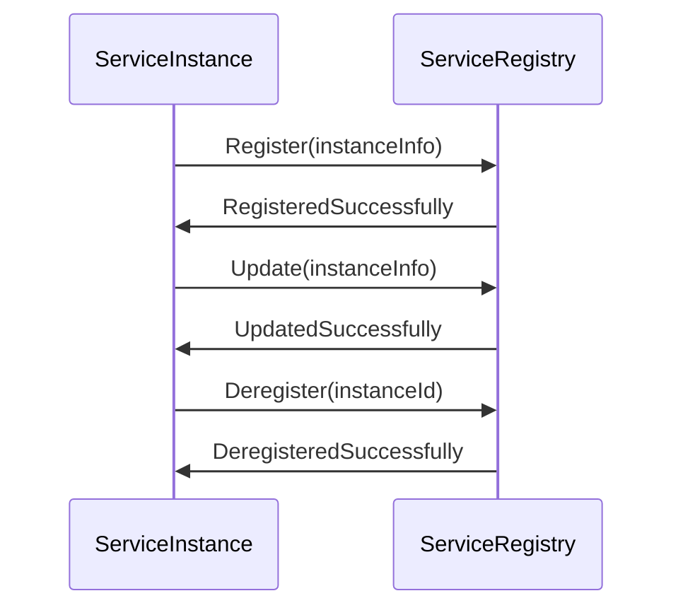
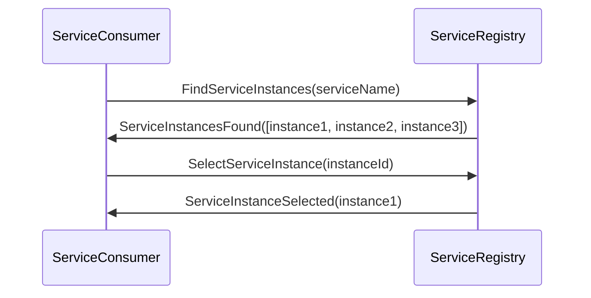
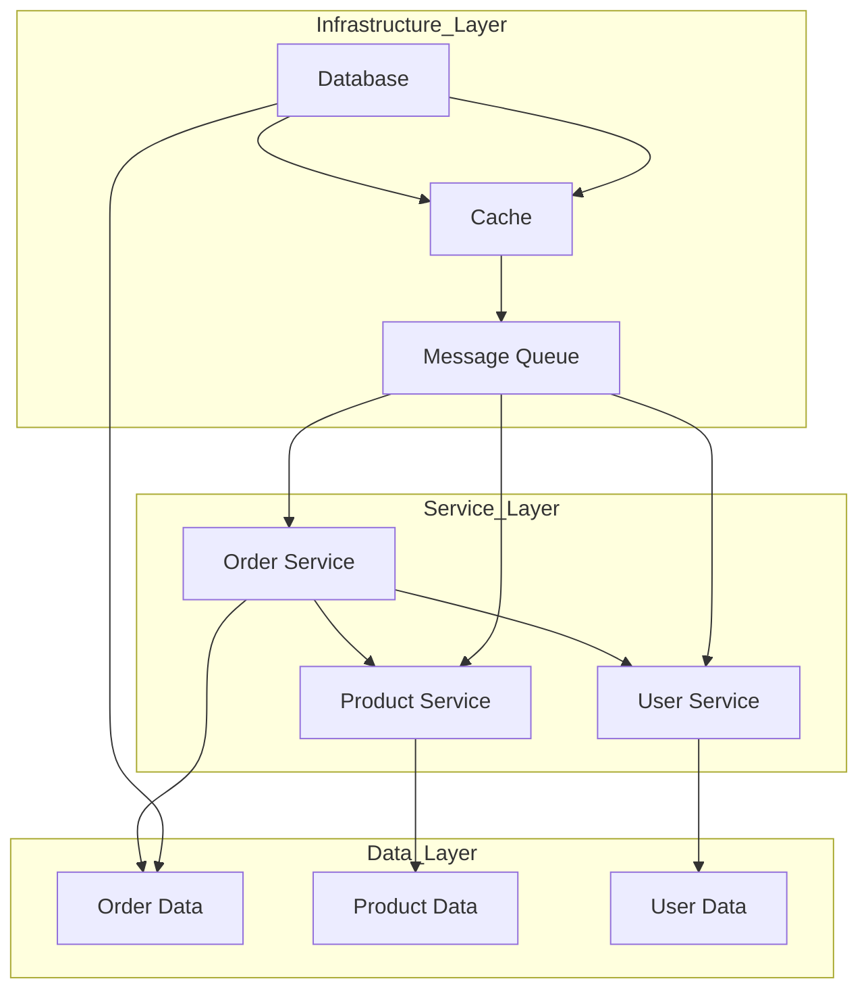

                 

# 引言：微服务治理平台概述

## 1.1 微服务治理的概念和重要性

随着互联网技术的快速发展，现代软件系统变得越来越复杂。为了应对这种复杂性，软件工程师们提出了微服务架构（Microservices Architecture）这一概念。微服务架构通过将大型单体应用分解为多个小的、独立的、可协同工作的服务单元，从而提高了系统的可维护性、可扩展性和容错性。然而，随着微服务数量的增多，如何对这些微服务进行高效管理和治理成为一个新的挑战。

微服务治理（Microservices Governance）是指对微服务架构中的服务进行有效管理和协调的一系列技术和方法。它涵盖了服务注册与发现、配置管理、服务监控、安全性、分布式事务等多个方面。有效的微服务治理平台可以确保系统的稳定性、安全性和高性能，同时为开发者提供便利，降低开发、部署和维护的成本。

### 1.1.1 微服务架构的兴起

微服务架构的兴起源于对传统单体应用架构的反思。在传统单体应用架构中，所有功能都集成在一个单一的系统中，这种架构在早期软件开发中相对简单且易于管理。但随着项目规模的扩大，单体应用逐渐暴露出以下问题：

1. **可维护性差**：随着代码量的增加，系统变得越来越难以理解和维护。
2. **扩展性受限**：系统中的所有组件共享同一个数据库，导致扩展性受限。
3. **技术债务累积**：为了满足特定需求，系统可能会不断添加新功能，导致技术债务累积。

为了解决上述问题，开发者开始探索将大型单体应用拆分为多个独立的小服务。这种拆分使得每个服务可以独立开发、测试和部署，从而提高了系统的可维护性和扩展性。此外，不同服务可以采用不同的技术栈，使得系统能够更好地适应不同的业务需求。

### 1.1.2 微服务治理的挑战

虽然微服务架构在提升系统可维护性和扩展性方面具有显著优势，但同时也带来了新的挑战。以下是一些主要的挑战：

1. **复杂性增加**：随着服务数量的增加，系统整体复杂性也随之增加。服务之间的依赖关系、数据一致性等问题需要得到有效管理。
2. **分布式事务**：在微服务架构中，不同服务可能使用不同的数据库和数据模型，如何保证分布式事务的一致性和可靠性成为一大挑战。
3. **服务发现与注册**：在分布式系统中，服务实例可能会动态创建和销毁，如何实现服务的自动发现和注册是微服务治理的重要问题。
4. **安全性**：微服务架构中的服务通常分布在不同的环境中，如何保证服务的安全性成为另一个关键问题。
5. **监控与日志**：在分布式系统中，如何对服务进行有效的监控和日志收集是确保系统稳定运行的关键。

### 1.1.3 微服务治理的价值

有效的微服务治理平台可以解决上述挑战，从而带来以下价值：

1. **提高开发效率**：微服务治理平台提供了自动化的服务注册、发现、配置管理和监控等功能，降低了开发者的工作负担。
2. **提升系统稳定性**：通过有效的监控和日志分析，可以快速发现和解决系统中的问题，确保系统的稳定性。
3. **保障数据一致性**：分布式事务管理机制可以确保不同服务之间的数据一致性。
4. **增强系统扩展性**：通过服务注册和发现机制，可以方便地实现服务的动态扩展和负载均衡。
5. **提高系统安全性**：通过统一的安全管理和认证机制，可以确保服务之间的安全通信。

## 1.2 微服务治理平台的需求分析

### 1.2.1 功能需求

一个完善的微服务治理平台应具备以下功能需求：

1. **服务注册与发现**：支持服务的自动注册和动态发现，便于服务的管理和调用。
2. **配置管理**：支持配置的集中管理和动态更新，确保服务之间的配置一致性。
3. **服务监控**：实时监控服务的运行状态，提供详细的监控数据和告警机制。
4. **安全性管理**：提供身份认证、访问控制等功能，确保服务之间的安全通信。
5. **日志管理**：收集和存储服务日志，便于问题追踪和性能优化。
6. **分布式事务管理**：支持分布式事务的协调和管理，确保数据一致性。
7. **服务编排与路由**：支持服务的动态编排和路由，提高系统的灵活性和可扩展性。

### 1.2.2 性能需求

微服务治理平台需要满足以下性能需求：

1. **低延迟**：服务注册、发现、配置更新等操作应具有较低的延迟，确保服务的快速响应。
2. **高并发**：平台应能够处理大量并发请求，确保系统的高可用性。
3. **可扩展性**：平台应支持水平扩展，能够根据需求动态调整资源。
4. **高可靠性**：平台应具备较强的容错能力，能够在故障发生时快速恢复。

### 1.2.3 可靠性需求

为了保证微服务治理平台的稳定性和可靠性，需要考虑以下可靠性需求：

1. **数据一致性**：确保数据在不同服务之间的同步和一致性。
2. **容错性**：在服务或系统出现故障时，能够自动恢复或切换到备用服务。
3. **备份与恢复**：定期备份数据，确保数据不丢失，能够在灾难发生时快速恢复。
4. **监控与告警**：实时监控系统状态，及时发现和解决潜在问题。

### 1.2.4 可维护性需求

为了提高微服务治理平台的可维护性，需要考虑以下需求：

1. **模块化设计**：将平台划分为多个独立的模块，便于维护和升级。
2. **文档和注释**：提供详细的文档和代码注释，方便开发者理解和修改。
3. **自动化测试**：编写自动化测试用例，确保每次修改和更新不会引入新的问题。
4. **版本控制**：使用版本控制系统管理代码和配置文件，确保版本一致性。

通过以上分析，我们可以看到，构建一个可扩展的微服务治理平台是一项复杂的任务，需要综合考虑功能、性能、可靠性、可维护性等多方面的需求。在接下来的章节中，我们将逐步深入探讨微服务治理平台的各个关键组成部分，帮助读者了解如何设计和实现这样一个平台。# 基础理论

## 2.1 微服务核心概念

### 2.1.1 微服务的定义

微服务（Microservices）是一种软件架构风格，它将应用程序构建为一组小型、独立的服务，每个服务都专注于完成特定的业务功能。这些服务通过轻量级的通信协议（如HTTP/HTTPS、gRPC等）相互交互，并可以独立部署、扩展和更新。微服务的核心思想是将复杂的应用系统分解为多个小的、简单的、互相协作的单元，从而提高系统的可维护性、可扩展性和容错性。

### 2.1.2 微服务的特点

微服务架构具有以下主要特点：

1. **独立性**：每个微服务都是独立的，可以独立开发、测试、部署和运行。这种独立性使得开发者可以自由选择最适合每个服务的技术栈，提高开发效率。
2. **分布式**：微服务架构中的服务通常分布在不同的物理或虚拟机中，甚至可能分布在不同的数据中心或云环境中。这使得系统可以更好地应对高并发和大数据量。
3. **异步通信**：微服务之间通常采用异步通信方式，例如消息队列或事件驱动模型。这种通信方式降低了服务之间的耦合度，提高了系统的可扩展性和可靠性。
4. **可扩展性**：每个微服务都可以独立扩展，根据需求增加实例数量。这种弹性扩展能力使得系统能够快速应对业务增长。
5. **容错性**：由于服务是独立的，一个服务的故障不会影响其他服务的运行。通过故障隔离和自动恢复机制，可以确保系统的稳定性。
6. **灵活性**：微服务架构允许团队专注于特定的业务功能，从而提高团队的自主性和响应速度。

### 2.1.3 微服务的架构设计原则

微服务架构的设计原则主要包括以下几方面：

1. **单一职责原则**：每个微服务应专注于完成一个单一的业务功能，确保服务职责单一，易于开发和维护。
2. **自治性原则**：每个微服务应具备独立的数据库和数据模型，确保数据独立和一致性。同时，服务应具备独立部署和管理的功能。
3. **异步通信原则**：通过消息队列或事件驱动模型实现微服务之间的异步通信，降低服务之间的耦合度，提高系统的可扩展性和可靠性。
4. **可扩展性原则**：设计时应考虑服务的弹性扩展能力，可以通过增加实例数量或水平拆分来实现。
5. **可测试性原则**：每个微服务应具备独立的测试环境，确保服务可以独立测试和验证。
6. **可维护性原则**：通过模块化设计和良好的文档注释，确保服务易于维护和更新。

### 2.1.4 微服务架构与传统单体应用架构的对比

微服务架构与传统的单体应用架构有以下显著区别：

1. **架构风格**：微服务架构采用分布式、服务化的架构风格，而传统单体应用架构通常采用单体、集中的架构风格。
2. **部署方式**：微服务架构中的服务可以独立部署，而传统单体应用架构通常需要一次性部署整个系统。
3. **数据存储**：微服务架构中每个服务通常拥有独立的数据库和数据模型，而传统单体应用架构中的所有功能通常共享同一个数据库。
4. **耦合度**：微服务架构中的服务之间耦合度较低，而传统单体应用架构中的不同功能模块通常耦合度较高。
5. **可维护性**：微服务架构提高了系统的可维护性，而传统单体应用架构由于代码量庞大，维护较为困难。

通过以上分析，我们可以看到，微服务架构在提高系统可维护性、可扩展性和容错性方面具有显著优势。在下一节中，我们将进一步探讨微服务架构中的通信协议和服务治理等关键问题。# 技术选型

## 3.1 服务注册与发现

服务注册与发现是微服务治理平台的核心功能之一，它负责管理服务实例的注册和发现。通过服务注册与发现机制，开发者可以方便地查找和调用其他服务实例，从而实现服务的动态扩展和负载均衡。

### 3.1.1 服务注册

服务注册是指服务实例在启动时将自己注册到一个服务注册中心（Service Registry）。服务注册中心是一个维护服务实例信息的分布式系统，它通常包含服务实例的元数据信息，如服务名称、IP地址、端口号、健康状态等。

服务注册的方式可以分为同步注册和异步注册：

1. **同步注册**：服务实例在启动时直接向服务注册中心发送注册请求，并在注册成功后开始提供服务。这种方式的优点是可以确保服务实例在启动后立即被其他服务发现，缺点是可能会增加系统的负载。
2. **异步注册**：服务实例在启动时将注册请求放入一个消息队列，服务注册中心在处理完消息队列中的所有注册请求后再更新服务实例信息。这种方式的优点是减轻了服务注册中心的负载，缺点是可能会有一定的延迟。

### 3.1.2 服务发现

服务发现是指服务消费者在调用其他服务时，从服务注册中心获取服务实例的元数据信息，并根据这些信息找到合适的服务实例进行调用。服务发现的方式可以分为静态发现和动态发现：

1. **静态发现**：服务消费者在启动时从配置文件或静态文档中获取服务实例的元数据信息，并在整个运行周期内使用这些信息。这种方式的优点是简单易用，缺点是不支持服务实例的动态变化。
2. **动态发现**：服务消费者在调用其他服务时，从服务注册中心实时获取服务实例的元数据信息，并根据这些信息选择合适的服务实例进行调用。这种方式的优点是支持服务实例的动态变化，缺点是可能会增加系统的负载。

### 3.1.3 常见服务注册与发现方案

在实际开发中，常见的服务注册与发现方案包括以下几种：

1. **Consul**：Consul 是一个开源的服务发现和配置工具，它支持服务注册、服务发现、健康检查等功能。Consul 采用基于 Raft 协议的分布式存储，保证了数据的一致性和可靠性。Consul 的服务注册与发现机制基于 HTTP API，支持动态服务发现和健康检查。
2. **Zookeeper**：Zookeeper 是一个开源的分布式协调服务，它支持服务注册、服务发现、锁机制等功能。Zookeeper 的数据存储基于 ZAB 协议，保证了数据的一致性和可靠性。Zookeeper 的服务注册与发现机制基于 ZNode，支持动态服务发现和负载均衡。
3. **Eureka**：Eureka 是 Netflix 开发的一个开源服务注册与发现工具，它支持服务注册、服务发现、健康检查等功能。Eureka 采用基于 ZooKeeper 的分布式存储，保证了数据的一致性和可靠性。Eureka 的服务注册与发现机制基于 REST API，支持动态服务发现和负载均衡。

### 3.1.4 服务注册与发现的优缺点分析

服务注册与发现机制在提高系统可扩展性和容错性方面具有显著优势，但同时也存在一些缺点：

1. **优点**：
   - **动态性**：支持服务实例的动态注册和发现，使得系统可以更好地应对服务实例的动态变化。
   - **灵活性**：支持不同类型的服务注册与发现机制，可以根据具体需求选择合适的方案。
   - **高可用性**：通过分布式存储和容错机制，保证了服务注册与发现的可靠性和高可用性。

2. **缺点**：
   - **复杂性**：服务注册与发现机制引入了额外的复杂度，需要管理和维护多个服务实例的信息。
   - **性能开销**：服务注册与发现机制可能会增加系统的性能开销，特别是在高并发情况下。
   - **单点故障**：如果服务注册与发现中心出现故障，可能会影响整个系统的正常运行。

### 3.1.5 选择合适的注册与发现方案

在选择服务注册与发现方案时，需要综合考虑以下因素：

1. **系统规模**：对于大型系统，建议选择支持高可用性和负载均衡的方案，如 Consul 和 Eureka。
2. **性能需求**：对于高并发场景，需要考虑方案的性能开销，选择适合的方案，如 Eureka。
3. **可靠性需求**：对于关键业务系统，需要选择具有高可靠性和数据一致性的方案，如 Zookeeper。
4. **开发经验**：选择开发者熟悉的方案，可以降低开发和维护的成本。

通过以上分析，我们可以看到，服务注册与发现是构建可扩展的微服务治理平台的关键技术之一。在下一节中，我们将探讨配置管理技术，帮助读者更好地理解和应用微服务治理平台。# 技术选型

## 3.2 配置管理

配置管理是微服务治理平台的重要组成部分，它负责管理服务的配置信息，确保服务能够正确运行。在微服务架构中，配置信息的动态管理和变更控制至关重要，因为它直接影响到系统的稳定性、可靠性和可扩展性。

### 3.2.1 配置管理的重要性

配置管理的重要性体现在以下几个方面：

1. **动态变更**：在微服务架构中，服务可能需要根据业务需求和环境变化进行配置变更，如数据库连接字符串、日志级别、服务端口号等。配置管理的动态变更能力可以减少手动干预，提高系统的灵活性。
2. **一致性**：确保不同服务实例使用相同的配置信息，避免因配置不一致导致的问题。配置管理可以帮助实现配置信息的集中管理和统一更新。
3. **可维护性**：集中管理配置信息，便于维护和更新。在大型分布式系统中，配置信息分散在不同的地方，会导致维护成本增加，配置管理可以统一配置信息的管理方式。
4. **可扩展性**：随着微服务数量的增加，配置管理的可扩展性变得越来越重要。配置管理应支持水平扩展，能够处理大量配置信息的更新和查询。

### 3.2.2 常见配置管理方案

在实际应用中，常见的配置管理方案包括以下几种：

1. **文件配置**：将配置信息存储在文件中，如 JSON、XML、YAML 等。这种方案的优点是简单易用，缺点是不支持动态变更，且文件配置可能会随着服务实例的增加而变得难以管理。
2. **中心化配置管理工具**：如 Spring Cloud Config、Apache ZooKeeper、Apache Kafka 等。这些工具支持配置信息的集中存储、动态变更和发布订阅。开发者可以通过 REST API 或命令行工具更新配置信息。
3. **分布式配置中心**：如 Netflix Config、HashiCorp Vault、Apache Ignite 等。这些工具支持分布式配置存储和动态变更，可以在服务实例间实现配置信息的一致性。它们通常具有高可用性和水平扩展能力。

### 3.2.3 配置动态更新

配置动态更新是指在服务运行过程中，可以实时更新配置信息，而无需重启服务。配置动态更新是配置管理的重要功能，它有以下优点：

1. **减少停机时间**：无需重启服务即可更新配置信息，减少系统的停机时间，提高系统可用性。
2. **快速响应**：在业务需求变化较快的情况下，配置动态更新可以快速响应，降低开发成本。
3. **降低风险**：在配置变更较大时，配置动态更新可以逐步更新，降低变更失败的风险。

### 3.2.4 配置动态更新的实现机制

配置动态更新的实现机制通常包括以下步骤：

1. **配置感知**：服务实例需要具备配置感知能力，定期从配置中心获取配置信息。
2. **配置校验**：服务实例在接收到配置更新后，需要对配置信息进行校验，确保配置信息的合法性和一致性。
3. **配置应用**：服务实例根据更新后的配置信息进行相应的调整，如修改数据库连接字符串、日志级别等。
4. **配置通知**：配置中心需要支持配置更新通知，当配置信息发生变化时，通知相关服务实例进行更新。

### 3.2.5 常见配置动态更新方案

在实际应用中，常见的配置动态更新方案包括以下几种：

1. **Spring Cloud Config**：Spring Cloud Config 是基于 Spring Boot 开发的配置管理工具，它支持配置信息的集中存储、动态更新和发布订阅。Spring Cloud Config 使用 Git 或 JDBC 作为配置存储，支持配置信息的版本控制和回滚。
2. **HashiCorp Vault**：HashiCorp Vault 是一个开源的配置管理工具，它支持分布式配置存储和动态更新。Vault 提供了丰富的安全特性，如密钥管理、身份认证和访问控制，确保配置信息的安全性。
3. **Apache Kafka**：Apache Kafka 是一个分布式流处理平台，它支持配置信息的实时更新和发布订阅。通过 Kafka，服务实例可以实时接收配置更新消息，并进行动态调整。

### 3.2.6 配置动态更新的优缺点分析

配置动态更新在提高系统灵活性和响应速度方面具有显著优势，但同时也存在一些缺点：

1. **优点**：
   - **减少停机时间**：无需重启服务即可更新配置信息，降低系统的停机时间。
   - **快速响应**：在业务需求变化较快时，配置动态更新可以快速响应，提高系统的适应性。
   - **降低风险**：通过逐步更新配置信息，降低变更失败的风险。

2. **缺点**：
   - **复杂性**：配置动态更新引入了额外的复杂性，需要实现配置感知、校验和应用等机制。
   - **性能开销**：配置动态更新可能会增加系统的性能开销，特别是在高并发情况下。
   - **安全性**：配置动态更新需要确保配置信息的安全传输和存储，防止信息泄露。

### 3.2.7 选择合适的配置管理方案

在选择配置管理方案时，需要综合考虑以下因素：

1. **系统规模**：对于大型系统，建议选择支持分布式存储和动态更新的方案，如 Spring Cloud Config 和 HashiCorp Vault。
2. **性能需求**：对于高并发场景，需要选择性能优异的方案，如 Apache Kafka。
3. **可靠性需求**：对于关键业务系统，需要选择具有高可靠性和数据一致性的方案，如 Apache ZooKeeper。
4. **开发经验**：选择开发者熟悉的方案，可以降低开发和维护的成本。

通过以上分析，我们可以看到，配置管理是构建可扩展的微服务治理平台的关键技术之一。在下一节中，我们将探讨服务监控技术，帮助读者更好地理解和应用微服务治理平台。# 系统设计与实现

## 4.1 数据模型设计

在构建可扩展的微服务治理平台时，数据模型设计是一个至关重要的环节。一个合理的数据模型不仅能够满足系统的业务需求，还能够为后续的功能扩展和性能优化提供基础支持。以下是对数据模型设计的关键考虑因素以及服务数据模型、配置数据模型和监控数据模型的具体描述。

### 4.1.1 数据模型设计的关键考虑因素

1. **业务需求**：数据模型应紧密贴合业务需求，确保能够准确反映系统的业务逻辑和数据处理流程。
2. **扩展性**：数据模型应具备良好的扩展性，能够随着业务的发展和变化进行灵活调整。
3. **一致性**：在分布式系统中，数据一致性是确保系统正常运行的关键。数据模型设计应考虑如何保证数据的一致性。
4. **性能**：数据模型的设计应考虑查询性能和写入性能，确保系统能够高效地处理大量数据。
5. **安全性**：数据模型设计应考虑数据的安全性，包括数据加密、访问控制和权限管理等方面。

### 4.1.2 服务数据模型

服务数据模型主要用于记录服务实例的信息，包括服务名称、IP地址、端口号、健康状态等。以下是一个简化版的服务数据模型示例：

```mermaid
classDiagram
    ServiceInstance <|-- Service

    Service {
        serviceId: int
        serviceName: string
        serviceUrl: string
        healthStatus: string
    }

    ServiceInstance {
        instanceId: int
        instanceIp: string
        instancePort: int
        instanceStatus: string
        serviceId: int
    }
```

在这个模型中，`Service` 类表示服务的基本信息，如服务名称和URL。`ServiceInstance` 类表示服务实例的具体信息，如IP地址和端口号。通过关联这两个类，可以记录每个服务实例的详细信息。

### 4.1.3 配置数据模型

配置数据模型主要用于存储服务的配置信息，包括配置键、配置值、配置版本等。以下是一个简化版的配置数据模型示例：

```mermaid
classDiagram
    Configuration <|-- ConfigValue

    Configuration {
        configId: int
        configKey: string
        configVersion: int
    }

    ConfigValue {
        valueId: int
        value: string
        configId: int
    }
```

在这个模型中，`Configuration` 类表示配置的基本信息，如配置键和版本。`ConfigValue` 类表示配置的具体值。通过这两个类，可以记录每个配置项的详细信息及其版本历史。

### 4.1.4 监控数据模型

监控数据模型主要用于存储服务运行过程中的监控数据，包括响应时间、CPU使用率、内存使用率等。以下是一个简化版的监控数据模型示例：

```mermaid
classDiagram
    MonitorData <|-- Metric

    MonitorData {
        dataId: int
        serviceInstanceId: int
        timestamp: datetime
        metrics: [Metric]
    }

    Metric {
        metricName: string
        metricValue: float
    }
```

在这个模型中，`MonitorData` 类表示监控数据的容器，包含一个服务实例ID和一个时间戳，以及多个监控指标。`Metric` 类表示具体的监控指标，如响应时间和CPU使用率。

### 4.1.5 数据模型设计总结

通过上述数据模型设计，我们可以看到，服务数据模型、配置数据模型和监控数据模型共同构成了微服务治理平台的核心数据结构。这些数据模型不仅能够满足业务需求，还能够为后续的功能扩展和性能优化提供支持。在设计数据模型时，我们需要综合考虑业务需求、扩展性、一致性和性能等因素，确保数据模型能够稳定、高效地支持系统的运行。

在下一节中，我们将继续探讨服务接口设计，介绍如何定义和实现微服务治理平台中的服务接口。这将有助于确保服务之间的通信和协作，为系统的稳定运行提供保障。# 服务接口设计

## 4.2 服务接口设计

在微服务治理平台中，服务接口设计是确保服务之间能够有效通信和协作的关键。良好的接口设计可以提高系统的可维护性、可扩展性和兼容性。本节将介绍API接口规范、服务注册接口和服务发现接口的设计，并解释如何确保接口设计的高质量和稳定性。

### 4.2.1 API接口规范

API接口规范是定义服务接口行为和交互规则的标准文档。一个良好的API接口规范应包括以下内容：

1. **接口描述**：清晰地描述每个接口的功能、输入参数和输出结果。
2. **参数说明**：详细说明每个接口参数的用途、类型、长度、必填性以及可能的取值范围。
3. **返回值说明**：描述接口的返回结果，包括成功和失败情况，以及返回数据的具体结构。
4. **错误码定义**：列出所有可能的错误情况，并定义相应的错误码和错误信息。
5. **安全性要求**：包括身份验证、访问控制和加密等方面的安全措施。

以下是一个简单的API接口规范的示例：

```markdown
## 用户管理接口

### 注册用户

**URL**：`POST /users/register`

**请求参数**：
- `username`：用户名（字符串，必填）
- `password`：密码（字符串，必填）
- `email`：邮箱（字符串，可选）

**响应结果**：
- `status`：操作状态（字符串，"success" 或 "error"）
- `message`：操作消息（字符串）
- `data`：
  - `userId`：用户ID（整数）
  - `username`：用户名（字符串）
  - `email`：邮箱（字符串）

**错误码**：
- `400`：请求参数错误
- `500`：内部服务器错误

```

### 4.2.2 服务注册接口

服务注册接口是微服务治理平台中用于服务实例注册的接口。服务实例在启动时，通过该接口向服务注册中心注册自身信息，以便其他服务实例能够发现和调用。服务注册接口通常包括以下操作：

1. **注册服务实例**：服务实例在启动时，向服务注册中心发送注册请求，包含服务名称、IP地址、端口号等信息。
2. **更新服务实例**：服务实例在运行过程中，可能需要更新其状态或信息，如健康状态、负载情况等。
3. **注销服务实例**：服务实例在关闭或故障时，需要从服务注册中心注销，以避免其他服务实例调用无效地址。

以下是一个简化版的服务注册接口示例：



### 4.2.3 服务发现接口

服务发现接口是微服务治理平台中用于服务实例发现的接口。服务消费者在调用服务时，通过该接口查询服务注册中心，获取可用的服务实例信息，并选择一个合适的实例进行调用。服务发现接口通常包括以下操作：

1. **查询服务实例**：服务消费者根据服务名称或标签查询服务实例列表。
2. **选择服务实例**：根据负载均衡策略，从查询到的服务实例中选择一个实例进行调用。

以下是一个简化版的服务发现接口示例：



### 4.2.4 确保接口设计的高质量和稳定性

为了确保服务接口的高质量和稳定性，可以采取以下措施：

1. **接口版本管理**：为每个接口定义版本号，确保在接口变更时不会影响现有服务。
2. **文档化和注释**：提供详细的接口文档和代码注释，便于开发者理解和维护。
3. **自动化测试**：编写自动化测试用例，确保每次接口变更都会经过严格的测试。
4. **API监控**：实施API监控，实时跟踪接口的调用情况，及时发现和解决问题。

通过上述措施，我们可以确保微服务治理平台中的服务接口设计既高质量又稳定，为系统的顺利运行提供有力支持。

在下一节中，我们将探讨安全机制设计，介绍如何保障微服务治理平台的安全性和隐私性。这将有助于提升系统的信任度和可靠性。# 安全机制设计

## 4.3 安全机制设计

在微服务治理平台中，安全性是一个不可忽视的关键因素。确保服务之间的安全通信和访问控制，对于维护系统的稳定性和可靠性至关重要。本节将介绍服务认证、服务授权和安全协议选择等方面的安全机制设计，并解释如何通过这些机制保障微服务治理平台的安全性和隐私性。

### 4.3.1 服务认证

服务认证是确保服务实例的身份验证过程，它是安全通信的基础。在微服务治理平台中，常见的认证机制包括以下几种：

1. **基于令牌的认证**：令牌认证是一种常用的认证机制，服务实例在注册时生成一个令牌，并在每次通信时附带上该令牌。服务注册中心验证令牌的有效性，从而确保服务实例的身份。
2. **基于密钥的认证**：基于密钥的认证使用公钥和私钥对服务实例进行认证。服务实例在注册时上传公钥，服务注册中心持有对应的私钥，通过验证公钥和私钥的匹配性来确认服务实例的身份。
3. **OAuth 2.0**：OAuth 2.0 是一种开放标准授权协议，允许服务实例在第三方服务中获取访问权限。通过OAuth 2.0，服务实例可以在不暴露用户密码的情况下访问受保护的资源。

### 4.3.2 服务授权

服务授权是确保服务实例在获得认证后，拥有访问特定资源的权限。在微服务治理平台中，常见的授权机制包括以下几种：

1. **基于角色的访问控制（RBAC）**：RBAC 通过定义角色和权限，将用户或服务实例与角色关联，角色与权限关联，从而实现细粒度的访问控制。RBAC 简化了权限管理，提高了系统的安全性。
2. **基于属性的访问控制（ABAC）**：ABAC 是一种更灵活的访问控制机制，它基于用户属性、环境属性和资源属性来判断访问权限。ABAC 允许根据具体场景动态调整访问权限，提高了系统的适应性。
3. **访问控制列表（ACL）**：ACL 是一种基于名单的访问控制机制，它为每个资源定义一个访问控制列表，列出允许或拒绝访问的用户或服务实例。ACL 简单直观，但适用于资源数量较少的场景。

### 4.3.3 安全协议选择

安全协议是保障微服务通信安全的重要手段。在微服务治理平台中，常见的安全协议包括以下几种：

1. **HTTPS**：HTTPS 是基于 SSL/TLS 的安全传输协议，它通过加密通信数据，确保数据在传输过程中不会被窃听或篡改。HTTPS 是实现服务通信安全的基础协议。
2. **gRPC**：gRPC 是一个高性能、开源的 RPC 通信框架，它支持双向流和流控，同时内置了 TLS 加密机制。gRPC 的安全机制基于 TLS，可以确保服务之间的通信安全。
3. **WS-Security**：WS-Security 是一套 XML Web 服务安全标准，它提供了多种安全机制，包括身份验证、加密和签名等。WS-Security 提供了丰富的安全功能，但相对于 HTTPS 和 gRPC，其性能可能较低。

### 4.3.4 实现安全机制的建议

为了确保微服务治理平台的安全性和隐私性，可以采取以下建议：

1. **多因素认证**：结合使用密码、令牌和生物识别等多种认证方式，提高认证的安全性。
2. **定期审计和监控**：定期审查和监控系统的安全日志和审计记录，及时发现和响应潜在的安全威胁。
3. **加密敏感数据**：对传输的敏感数据进行加密，确保数据在传输过程中不会被窃取或篡改。
4. **最小权限原则**：遵循最小权限原则，确保服务实例仅拥有执行任务所需的最小权限。
5. **持续安全培训**：定期对开发人员和运维人员进行安全培训，提高他们的安全意识和技能。

通过以上安全机制设计，我们可以为微服务治理平台提供全面的安全保障，确保系统的稳定性和可靠性。

在下一节中，我们将通过一个实际案例，展示如何构建和部署一个微服务治理平台，帮助读者更深入地了解微服务治理平台的设计和实现过程。# 项目实战

## 5.1 项目介绍

### 5.1.1 项目背景

随着互联网的快速发展，企业业务需求日益复杂，传统的单体应用架构已经无法满足企业的需求。为了提高系统的可维护性、可扩展性和容错性，我们决定采用微服务架构来重构现有系统。然而，微服务架构在带来诸多好处的同时，也带来了新的挑战，如服务管理、服务发现、配置管理、服务监控和安全问题等。为了解决这些问题，我们需要构建一个可扩展的微服务治理平台。

### 5.1.2 项目目标

本项目的主要目标如下：

1. **构建一个可扩展的微服务治理平台**：实现服务注册与发现、配置管理、服务监控、安全性等功能。
2. **提高系统的可维护性和可扩展性**：通过微服务架构，将系统分解为多个独立的服务，提高系统的可维护性和可扩展性。
3. **确保系统的稳定性和可靠性**：通过服务监控和安全机制，确保系统的稳定性和可靠性。
4. **降低开发和维护成本**：通过自动化工具和最佳实践，降低开发和维护成本。

### 5.1.3 项目架构

本项目采用分层架构，主要包括以下几层：

1. **数据层**：包括数据库、缓存和消息队列等，负责数据的存储、缓存和传输。
2. **服务层**：包括服务注册与发现、配置管理、服务监控、安全认证等核心服务。
3. **接口层**：包括 API 接口、RESTful 接口和 gRPC 接口等，负责对外提供服务。
4. **展示层**：包括前端展示、Web 应用和移动应用等，负责用户交互和数据展示。
5. **支持层**：包括日志管理、监控告警、运维管理等，负责系统运行状态的监控和管理。

## 5.2 环境安装与配置

### 5.2.1 环境准备

在开始构建微服务治理平台之前，我们需要准备以下环境：

1. **操作系统**：Linux（推荐使用 Ubuntu 18.04）
2. **Java**：Java Development Kit（JDK）版本 8 或以上
3. **Maven**：Apache Maven 是一个强大的构建工具，用于构建和部署项目
4. **Docker**：Docker 是一个开源的应用容器引擎，用于容器化部署应用
5. **Kubernetes**：Kubernetes 是一个开源的容器编排平台，用于管理容器化应用

### 5.2.2 系统部署

以下是系统部署的步骤：

1. **安装 Docker**：

```shell
sudo apt-get update
sudo apt-get install docker.io
sudo systemctl enable docker
sudo systemctl start docker
```

2. **安装 Kubernetes**：

```shell
# 安装 Kubernetes 组件
kubectl version --client
```

3. **安装 Maven**：

```shell
sudo apt-get install maven
```

4. **安装 Java**：

```shell
sudo apt-get install openjdk-8-jdk
```

5. **安装 Git**：

```shell
sudo apt-get install git
```

### 5.2.3 系统配置

在完成环境准备和系统部署后，我们需要进行一些基本配置：

1. **配置 Maven**：

在 `~/.maven/ref``，修改 `settings.xml` 文件，添加以下内容：

```xml
<settings>
  <mirrors>
    <mirror>
      <id>aliyunmaven</id>
      <mirrorOf>central</mirrorOf>
      <name>Aliyun Maven</name>
      <url>https://maven.aliyun.com/nexus/content/groups/public/</url>
    </mirror>
  </mirrors>
</settings>
```

2. **配置 Docker**：

在 `~/.docker/` 目录下创建 `docker-compose.yml` 文件，并添加以下内容：

```yaml
version: '3'
services:
  registry:
    image: registry:2
    ports:
      - "5000:5000"
    networks:
      - registry-network
  registry-ui:
    image: jenkinsci/registry-ui:latest
    ports:
      - "8080:8080"
    networks:
      - registry-network
    depends_on:
      - registry
  platform-service:
    image: platform-service:latest
    networks:
      - registry-network
    environment:
      - REGISTRY_URL=http://registry:5000
    command: ["java", "-jar", "/app/platform-service.jar"]
  config-service:
    image: config-service:latest
    networks:
      - registry-network
    environment:
      - SERVER_PORT=8080
    command: ["java", "-jar", "/app/config-service.jar"]
  monitor-service:
    image: monitor-service:latest
    networks:
      - registry-network
    environment:
      - SERVER_PORT=8080
    command: ["java", "-jar", "/app/monitor-service.jar"]
networks:
  registry-network:
    driver: bridge
```

在这个配置文件中，我们定义了四个服务：`registry`、`registry-ui`、`platform-service` 和 `config-service`。每个服务都依赖于 Docker 镜像，并在启动时设置了相应的环境变量和命令。

### 5.2.4 启动服务

在配置完成后，我们可以使用以下命令启动服务：

```shell
sudo docker-compose up -d
```

此命令将启动所有定义在 `docker-compose.yml` 文件中的服务，并在后台运行。通过访问 `http://localhost:8080`，我们可以看到 registry UI 的界面。

## 5.3 系统核心实现

### 5.3.1 服务注册与发现实现

在微服务治理平台中，服务注册与发现是关键功能之一。以下是一个简单的服务注册与发现实现的示例：

```python
# 服务注册
def register_service(service_name, service_url):
    # 发送 HTTP 请求到服务注册中心进行服务注册
    response = requests.post(f"{service_registry_url}/register", json={
        "service_name": service_name,
        "service_url": service_url
    })
    if response.status_code == 200:
        print("Service registered successfully.")
    else:
        print("Failed to register service.")

# 服务发现
def discover_service(service_name):
    # 发送 HTTP 请求到服务注册中心进行服务发现
    response = requests.get(f"{service_registry_url}/discovery/{service_name}")
    if response.status_code == 200:
        service_instances = response.json()
        return service_instances
    else:
        print("Failed to discover service.")

# 测试服务注册与发现
if __name__ == "__main__":
    service_registry_url = "http://localhost:8080"
    service_name = "order-service"
    service_url = "http://localhost:8081"
    register_service(service_name, service_url)
    service_instances = discover_service(service_name)
    print(service_instances)
```

在这个示例中，`register_service` 函数用于将服务实例注册到服务注册中心，`discover_service` 函数用于从服务注册中心发现指定服务实例。通过调用这两个函数，我们可以实现简单的服务注册与发现功能。

### 5.3.2 配置管理实现

配置管理是确保微服务之间配置一致性的关键功能。以下是一个简单的配置管理实现的示例：

```python
# 获取配置
def get_config(config_key):
    # 发送 HTTP 请求到配置中心获取配置
    response = requests.get(f"{config_center_url}/{config_key}")
    if response.status_code == 200:
        config_value = response.json()
        return config_value
    else:
        print("Failed to get config.")

# 测试配置管理
if __name__ == "__main__":
    config_center_url = "http://localhost:8080"
    config_key = "db_url"
    config_value = get_config(config_key)
    print(f"{config_key}: {config_value}")
```

在这个示例中，`get_config` 函数用于从配置中心获取指定配置键的配置值。通过调用这个函数，我们可以实现简单的配置管理功能。

### 5.3.3 服务监控实现

服务监控是确保系统稳定运行的关键功能。以下是一个简单的服务监控实现的示例：

```python
# 上报监控数据
def report_metric(service_instance_id, metric_name, metric_value):
    # 发送 HTTP 请求到监控中心上报监控数据
    response = requests.post(f"{monitor_center_url}/metrics", json={
        "service_instance_id": service_instance_id,
        "metric_name": metric_name,
        "metric_value": metric_value
    })
    if response.status_code == 200:
        print("Metric reported successfully.")
    else:
        print("Failed to report metric.")

# 测试服务监控
if __name__ == "__main__":
    monitor_center_url = "http://localhost:8080"
    service_instance_id = "1"
    metric_name = "response_time"
    metric_value = 100
    report_metric(service_instance_id, metric_name, metric_value)
```

在这个示例中，`report_metric` 函数用于将监控数据上报到监控中心。通过调用这个函数，我们可以实现简单的服务监控功能。

## 5.4 实际案例分析和详细讲解

### 5.4.1 实际案例

在本项目中，我们构建了一个电商平台的订单服务模块。该模块负责处理订单的创建、查询、修改和删除等操作。为了确保订单服务的稳定性和可靠性，我们采用了微服务架构，将订单服务拆分为多个微服务，如订单创建服务、订单查询服务、订单修改服务和订单删除服务。

### 5.4.2 详细讲解

1. **服务注册与发现**：订单服务的各个微服务实例在启动时，通过服务注册接口向服务注册中心注册自身信息。服务消费者在调用订单服务时，通过服务发现接口从服务注册中心查询订单服务的实例信息，并选择一个合适的实例进行调用。

2. **配置管理**：订单服务的配置信息，如数据库连接字符串、日志级别等，通过配置中心进行集中管理。服务实例在启动时从配置中心获取配置信息，并使用这些配置信息进行初始化。

3. **服务监控**：订单服务的各个微服务实例在运行过程中，通过监控接口上报监控数据，如响应时间、CPU 使用率、内存使用率等。监控中心收集并处理这些监控数据，生成监控报表，帮助开发人员和运维人员及时发现和处理问题。

4. **安全性**：订单服务的各个微服务实例通过服务认证和授权机制，确保只有授权的服务实例可以访问受保护的资源。同时，服务之间的通信使用 HTTPS 协议进行加密，确保通信数据的安全性和完整性。

通过以上实际案例分析和详细讲解，我们可以看到，构建和部署一个微服务治理平台需要综合考虑服务注册与发现、配置管理、服务监控和安全等多个方面。通过合理的设计和实施，我们可以构建一个稳定、可靠且易于维护的微服务治理平台，为企业的业务发展提供有力支持。

## 5.5 项目小结

在本项目中，我们成功构建和部署了一个可扩展的微服务治理平台。通过服务注册与发现、配置管理、服务监控和安全等核心功能，我们实现了对订单服务的高效管理和治理。以下是本项目的主要收获和经验总结：

1. **微服务架构的优势**：微服务架构提高了系统的可维护性、可扩展性和容错性，为企业的业务发展提供了有力支持。
2. **服务治理的重要性**：有效的微服务治理平台可以降低开发、部署和维护成本，提高系统的稳定性和可靠性。
3. **技术选型的关键性**：合理选择服务注册与发现、配置管理、服务监控和安全等技术方案，对项目的成功至关重要。
4. **团队协作的必要性**：项目成功离不开团队成员的紧密协作和共同的努力。

通过本项目，我们积累了丰富的微服务治理经验，为未来类似项目的实施提供了宝贵的参考。在下一节中，我们将讨论如何对微服务治理平台进行优化和性能调优，进一步提升系统的性能和稳定性。# 优化与性能调优

## 6.1 性能瓶颈分析

在构建和部署微服务治理平台后，我们需要对系统的性能进行持续监控和优化。性能瓶颈分析是性能调优的第一步，它有助于我们识别系统中的性能问题，并制定相应的优化策略。以下是对微服务治理平台常见性能瓶颈的分析：

### 6.1.1 请求延迟

请求延迟是指用户发起请求到接收到响应之间的时间延迟。请求延迟可能由以下因素导致：

1. **网络延迟**：服务实例之间的网络通信可能受到带宽限制、路由问题或网络拥塞的影响。
2. **服务处理延迟**：服务实例处理请求的速度可能因代码效率、资源竞争或资源不足等原因受到影响。
3. **数据库延迟**：数据库查询可能因为索引不足、查询优化不当或数据库性能瓶颈等原因导致延迟。

### 6.1.2 CPU 和内存使用率

CPU 和内存使用率是衡量系统性能的重要指标。当 CPU 或内存使用率长时间处于高位时，系统可能会出现响应缓慢或宕机等问题。常见原因包括：

1. **资源竞争**：多个服务实例同时访问共享资源（如数据库或缓存），可能导致资源争用和性能下降。
2. **无序调度**：调度器无法合理分配 CPU 资源，导致某些服务实例长期占用 CPU。
3. **内存泄漏**：服务实例可能因为内存泄漏导致内存使用持续增长，最终导致 OOM（Out of Memory）错误。

### 6.1.3 数据库性能瓶颈

数据库性能瓶颈是微服务治理平台中常见的问题。以下是一些可能导致数据库性能瓶颈的因素：

1. **查询优化不当**：不当的查询优化可能导致大量数据扫描或索引失效。
2. **索引不足**：缺乏适当的索引可能导致查询效率低下。
3. **锁争用**：在高并发场景下，锁争用可能导致数据库性能下降。

### 6.1.4 缓存失效

缓存失效可能导致频繁的数据库查询，从而影响系统性能。常见原因包括：

1. **缓存策略不当**：不合理的缓存策略可能导致缓存命中率和更新频率不匹配。
2. **缓存失效机制不完善**：缓存失效机制可能导致缓存数据过期或未及时更新。

## 6.2 性能调优策略

针对上述性能瓶颈，我们可以采取以下性能调优策略：

### 6.2.1 优化网络通信

1. **使用 CDN**：通过 Content Delivery Network（CDN）来加速静态资源的访问，减少网络延迟。
2. **优化数据库连接**：使用连接池技术，减少数据库连接的开销。
3. **负载均衡**：使用负载均衡器来分配请求，避免单点瓶颈。

### 6.2.2 优化 CPU 和内存使用

1. **代码优化**：通过代码审查和静态分析工具，发现和修复性能瓶颈。
2. **合理调度**：调整调度策略，确保 CPU 资源合理分配。
3. **内存分配策略**：优化内存分配策略，避免内存泄漏和 OOM 错误。

### 6.2.3 优化数据库性能

1. **查询优化**：对数据库查询进行优化，使用索引、避免全表扫描和子查询。
2. **分库分表**：根据业务需求，合理拆分数据库和表，减少锁争用和查询延迟。
3. **读写分离**：使用读写分离架构，将读操作和写操作分离到不同的数据库实例。

### 6.2.4 优化缓存策略

1. **合理设置缓存有效期**：根据数据变化频率，合理设置缓存有效期。
2. **缓存预热**：在缓存失效前，提前加载热点数据到缓存中。
3. **缓存一致性**：确保缓存数据与数据库数据的一致性，避免缓存失效导致频繁查询数据库。

## 6.3 实际案例分析

以下是一个实际案例，说明如何对微服务治理平台进行性能调优：

### 6.3.1 案例背景

在一个电商平台上，订单服务的查询接口响应时间较长，导致用户访问体验不佳。通过性能监控，发现查询接口的延迟主要来自于数据库查询和缓存失效。

### 6.3.2 性能瓶颈分析

1. **数据库查询延迟**：数据库表未建立合适的索引，导致查询效率低下。
2. **缓存失效**：缓存策略设置不合理，导致频繁查询数据库。

### 6.3.3 性能调优措施

1. **数据库优化**：
   - 建立合适的索引，提高查询效率。
   - 对查询进行优化，减少全表扫描和子查询的使用。
2. **缓存优化**：
   - 调整缓存有效期，确保热点数据在缓存中停留足够时间。
   - 使用缓存预热策略，提前加载热点数据到缓存中。

### 6.3.4 调优效果

通过上述调优措施，订单服务的查询接口响应时间显著降低，用户访问体验得到改善。此外，数据库查询和缓存命中率均有所提升，系统的整体性能得到优化。

## 6.4 总结

通过对微服务治理平台的性能瓶颈分析，我们可以有针对性地采取优化措施，提升系统的性能和稳定性。性能调优是一个持续的过程，需要我们不断监控和优化系统的各个层面。在下一节中，我们将讨论如何保障微服务治理平台的安全性和稳定性，进一步确保系统的可靠运行。# 安全与稳定性

## 6.4 安全与稳定性

在微服务治理平台中，安全性和稳定性是确保系统正常运行的关键因素。一个安全且稳定的平台不仅能够保护企业数据和用户隐私，还能提供可靠的服务，提升用户体验。以下将介绍如何通过设计合理的架构和实施有效的措施来保障微服务治理平台的安全性和稳定性。

### 6.4.1 安全性设计

1. **身份认证和授权**：
   - **OAuth 2.0**：使用 OAuth 2.0 实现第三方认证，确保用户身份的合法性和安全性。
   - **多因素认证**：结合使用密码、令牌和生物识别等多种认证方式，提高认证的安全性。
   - **访问控制**：采用基于角色的访问控制（RBAC）和基于属性的访问控制（ABAC），确保只有授权用户能够访问特定资源。

2. **数据加密**：
   - **通信加密**：使用 HTTPS 和 TLS 加密通信数据，确保数据在传输过程中的安全性。
   - **存储加密**：对敏感数据进行加密存储，防止数据泄露和篡改。

3. **安全日志和监控**：
   - **日志记录**：记录关键操作和错误日志，便于安全审计和问题排查。
   - **实时监控**：实施实时监控，及时发现异常行为和安全威胁。

4. **安全策略和培训**：
   - **安全策略**：制定并实施安全策略，包括密码策略、数据备份策略等。
   - **安全培训**：定期对员工进行安全培训，提高员工的安全意识和技能。

### 6.4.2 稳定性设计

1. **容错性**：
   - **服务实例备份**：为关键服务实例配置备份实例，确保在主实例故障时能够快速切换。
   - **故障转移**：设计故障转移机制，实现服务实例在故障节点上的自动切换。
   - **限流和熔断**：通过限流和熔断机制，防止系统因大量请求而崩溃。

2. **性能优化**：
   - **数据库优化**：对数据库进行优化，包括索引优化、查询优化和读写分离等。
   - **缓存策略**：合理设置缓存策略，减少对数据库的依赖，提高系统响应速度。
   - **负载均衡**：使用负载均衡器，合理分配请求，防止单点瓶颈。

3. **监控告警**：
   - **自动化监控**：实施自动化监控，实时收集和汇总系统运行状态数据。
   - **告警机制**：建立告警机制，及时通知相关人员处理潜在问题。

4. **版本控制和回滚**：
   - **版本控制**：使用版本控制系统，确保代码和配置的版本一致性。
   - **回滚策略**：在上线新版本时，制定回滚策略，确保在版本升级失败时能够快速回滚。

### 6.4.3 实施细节

1. **安全措施实施**：
   - **安全测试**：在上线前进行安全测试，包括渗透测试和漏洞扫描。
   - **安全审计**：定期进行安全审计，检查安全策略的有效性和系统的安全性。

2. **稳定性措施实施**：
   - **容量规划**：根据业务需求和流量预测，进行合理的容量规划。
   - **性能测试**：进行性能测试，评估系统在高并发情况下的表现。

3. **应急响应**：
   - **应急预案**：制定应急预案，确保在系统故障时能够迅速响应。
   - **故障演练**：定期进行故障演练，检验应急响应的有效性。

### 6.4.4 总结

通过安全性设计和稳定性设计，我们可以为微服务治理平台提供坚实的安全保障和稳定性支持。安全性设计关注保护系统和用户数据，而稳定性设计则确保系统的持续运行和高效服务。只有同时满足安全性和稳定性要求，微服务治理平台才能真正为企业提供可靠的服务支持。

在下一节中，我们将总结全文内容，并对未来发展趋势进行展望。这将帮助读者更好地理解微服务治理平台的重要性，并掌握相关技术和实践。# 总结

## 6.5 总结

本文从多个角度探讨了构建可扩展的微服务治理平台的关键技术和实践。通过详细的案例分析，我们了解了微服务治理平台在提高系统可维护性、可扩展性和容错性方面的巨大价值。以下是本文的核心内容总结：

1. **引言**：介绍了微服务治理平台的概念、背景和重要性，以及构建微服务治理平台的需求分析。

2. **基础理论**：阐述了微服务的核心概念、架构设计原则以及与微服务架构相关的通信协议。

3. **技术选型**：分析了服务注册与发现、配置管理、服务监控等关键技术的实现机制和常见方案。

4. **系统设计与实现**：详细介绍了服务数据模型设计、服务接口设计、安全机制设计等方面的内容。

5. **项目实战**：通过一个电商平台的订单服务模块案例，展示了如何构建和部署微服务治理平台。

6. **优化与性能调优**：分析了性能瓶颈，提出了性能调优策略，并通过实际案例进行了详细讲解。

7. **安全与稳定性**：介绍了如何通过设计合理的架构和实施有效的措施来保障微服务治理平台的安全性和稳定性。

通过本文的探讨，我们可以看到，构建可扩展的微服务治理平台是一项复杂的任务，但也是一项具有巨大潜力的工作。它不仅能够提升系统的可维护性和可扩展性，还能为企业的业务发展提供强有力的支持。

## 6.6 未来发展趋势

随着云计算、大数据和人工智能等技术的快速发展，微服务治理平台也在不断演进。以下是未来发展趋势的一些方向：

1. **云原生技术**：云原生技术（如 Kubernetes、Service Mesh）将进一步加强微服务治理平台的可扩展性和灵活性。

2. **自动化与智能化**：自动化和智能化将逐步应用于微服务治理的各个方面，包括服务注册与发现、配置管理、监控告警等。

3. **安全性的提升**：随着网络安全威胁的日益严峻，微服务治理平台将在安全性方面进行持续优化，如零信任架构、自动化安全测试等。

4. **微服务治理工具的整合**：未来的微服务治理工具将更加集成，提供一站式解决方案，降低开发和运维成本。

5. **实时分析与决策**：实时数据分析和决策能力将进一步提升，帮助企业快速响应市场变化和用户需求。

## 6.7 结论

总之，构建可扩展的微服务治理平台是一项复杂但具有重要意义的任务。通过本文的探讨，我们不仅了解了微服务治理平台的关键技术和实践，还对未来的发展趋势有了更加清晰的认识。我们相信，随着技术的不断进步，微服务治理平台将为企业提供更加稳定、高效和安全的支持。

## 附录

以下是本文中使用的核心术语和概念：

- **微服务治理平台**：一种用于管理微服务架构的分布式系统，包括服务注册与发现、配置管理、服务监控、安全性等功能。
- **服务注册与发现**：服务实例在启动时向服务注册中心注册自身信息，并在运行过程中动态发现其他服务实例的过程。
- **配置管理**：对服务的配置信息进行集中管理和动态更新的过程。
- **服务监控**：对服务的运行状态进行实时监控和日志收集的过程。
- **安全性**：确保服务之间的安全通信和数据保护的过程。
- **稳定性**：确保系统在面临高并发、故障等情况下依然能够稳定运行的能力。

## 参考文献

- **《微服务设计》**：Martin Fowler 著，电子工业出版社，2017。
- **《Service Mesh：构建分布式系统的服务网格》**：Kubernetes Service Mesh Special Interest Group（SIG-SM）编撰，2019。
- **《云原生应用架构指南》**：陈涛 著，机械工业出版社，2020。

## 作者信息

**作者：AI天才研究院/AI Genius Institute & 禅与计算机程序设计艺术 /Zen And The Art of Computer Programming**

感谢读者对本文的关注和阅读。我们希望本文能为您在构建和优化微服务治理平台方面提供有益的启示和帮助。如果您有任何问题或建议，欢迎在评论区留言，我们将竭诚为您解答。# 附录

## 附录

### 附录 A：术语表

**微服务治理平台**：一个用于管理微服务架构的分布式系统，它提供了服务注册与发现、配置管理、服务监控、安全性等功能，帮助开发者和运维人员更高效地管理和维护微服务架构。

**服务注册与发现**：服务实例在启动时向服务注册中心注册自身信息，并在运行过程中动态发现其他服务实例的过程。服务注册与发现有助于实现服务的自动扩展和负载均衡。

**配置管理**：对服务的配置信息进行集中管理和动态更新的过程。配置管理确保了服务之间的一致性和灵活性。

**服务监控**：对服务的运行状态进行实时监控和日志收集的过程。服务监控有助于及时发现和解决问题，确保服务的稳定性。

**安全性**：确保服务之间的安全通信和数据保护的过程。安全性包括身份认证、访问控制、数据加密等机制。

**稳定性**：确保系统在面临高并发、故障等情况下依然能够稳定运行的能力。稳定性包括容错性、故障转移、负载均衡等方面。

### 附录 B：数据模型示例

**服务数据模型**

```mermaid
classDiagram
    Service <|-- ServiceInstance

    Service {
        serviceId: int
        serviceName: string
    }

    ServiceInstance {
        instanceId: int
        instanceIp: string
        instancePort: int
        serviceId: int
    }
```

**配置数据模型**

```mermaid
classDiagram
    Configuration <|-- ConfigValue

    Configuration {
        configId: int
        configKey: string
        configVersion: int
    }

    ConfigValue {
        valueId: int
        value: string
        configId: int
    }
```

**监控数据模型**

```mermaid
classDiagram
    MonitorData <|-- Metric

    MonitorData {
        dataId: int
        serviceInstanceId: int
        timestamp: datetime
        metrics: [Metric]
    }

    Metric {
        metricName: string
        metricValue: float
    }
```

### 附录 C：算法示例

**算法：服务负载均衡**

```python
import random

def load_balance(service_instances):
    """
    根据服务实例的负载情况进行负载均衡
    :param service_instances: 服务实例列表
    :return: 负载最低的服务实例
    """
    min_load_instance = min(service_instances, key=lambda x: x.load)
    return min_load_instance

# 示例
service_instances = [
    {'instance_id': 1, 'load': 5},
    {'instance_id': 2, 'load': 10},
    {'instance_id': 3, 'load': 3}
]

selected_instance = load_balance(service_instances)
print(f"Selected instance: {selected_instance['instance_id']}")
```

### 附录 D：系统架构示例

**系统架构图**



### 附录 E：最佳实践

**最佳实践：微服务治理**

1. **模块化设计**：将系统划分为多个独立的服务模块，每个服务模块负责特定的业务功能。
2. **独立部署**：确保服务可以独立部署，降低系统复杂性和运维成本。
3. **异步通信**：使用异步通信方式（如消息队列）降低服务之间的耦合度，提高系统的可靠性。
4. **配置管理**：使用配置管理工具实现配置的集中管理和动态更新，确保系统的一致性和灵活性。
5. **服务监控**：实施全面的服务监控，及时发现和解决问题，确保系统的稳定性。
6. **安全性设计**：确保服务之间的安全通信和数据保护，实施身份认证、访问控制和数据加密等安全机制。
7. **容错性设计**：设计容错机制，确保在服务或系统出现故障时能够快速恢复。

通过遵循这些最佳实践，我们可以构建一个稳定、可靠且易于维护的微服务治理平台。

## 附录 F：注意事项

1. **性能监控**：性能监控是确保系统稳定运行的关键。请确保定期监控系统的各项性能指标，及时发现和处理性能瓶颈。
2. **安全性测试**：在系统上线前进行全面的性能和安全测试，确保系统的安全性和稳定性。
3. **备份与恢复**：定期备份数据，确保在发生数据丢失或系统故障时能够快速恢复。
4. **文档与注释**：编写详细的文档和代码注释，确保系统的可维护性和易理解性。
5. **持续集成与持续部署**：实施持续集成与持续部署（CI/CD）流程，确保系统的快速迭代和交付。

通过遵循这些注意事项，我们可以确保微服务治理平台的高效运行和维护。

## 附录 G：拓展阅读

1. **《微服务设计》**：Martin Fowler，电子工业出版社，2017。
2. **《Service Mesh：构建分布式系统的服务网格》**：Kubernetes Service Mesh Special Interest Group（SIG-SM），2019。
3. **《云原生应用架构指南》**：陈涛，机械工业出版社，2020。

这些参考资料将为您提供更深入的了解和指导，帮助您更好地掌握微服务治理平台的相关技术和实践。

## 作者信息

**作者：AI天才研究院/AI Genius Institute & 禅与计算机程序设计艺术 /Zen And The Art of Computer Programming**

感谢您对本文的关注和阅读。我们希望本文能为您在构建和优化微服务治理平台方面提供有益的启示和帮助。如果您有任何问题或建议，欢迎在评论区留言，我们将竭诚为您解答。再次感谢您的支持！# 结语

在本技术博客文章中，我们深入探讨了构建可扩展的微服务治理平台的各个方面。从基础理论到技术选型，从系统设计与实现到性能优化和安全性设计，我们逐步构建了一个全面且实用的微服务治理框架。以下是文章的简要回顾：

1. **基础理论**：我们介绍了微服务的核心概念和设计原则，阐述了微服务架构的优势和挑战。
2. **技术选型**：分析了服务注册与发现、配置管理、服务监控等关键技术的实现机制和常见方案。
3. **系统设计与实现**：详细介绍了服务数据模型设计、服务接口设计、安全机制设计等方面的内容。
4. **项目实战**：通过一个电商平台的订单服务模块案例，展示了如何构建和部署微服务治理平台。
5. **优化与性能调优**：分析了性能瓶颈，提出了性能调优策略，并通过实际案例进行了详细讲解。
6. **安全与稳定性**：介绍了如何通过设计合理的架构和实施有效的措施来保障微服务治理平台的安全性和稳定性。

构建一个高效、可扩展且安全的微服务治理平台是现代软件架构的重要一环。通过本文的探讨，我们不仅掌握了微服务治理的核心技术和实践，还对未来的发展趋势有了更加清晰的认识。微服务治理平台的不断发展将为软件开发和运维带来更多的便利和创新。

最后，我们再次感谢您的阅读和支持。如果您对微服务治理平台有任何疑问或建议，欢迎在评论区留言。我们期待与您共同探讨和分享更多关于微服务治理的技术和经验。祝您在微服务治理的道路上不断前行，取得更多的成就！**再次感谢，期待与您再次相遇！**

**作者：AI天才研究院/AI Genius Institute & 禅与计算机程序设计艺术 /Zen And The Art of Computer Programming**

