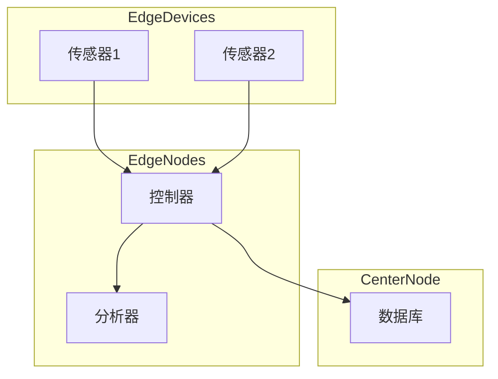
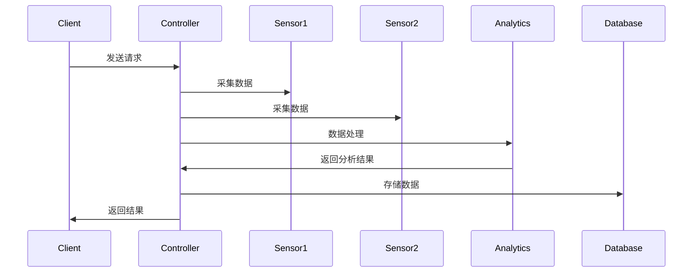
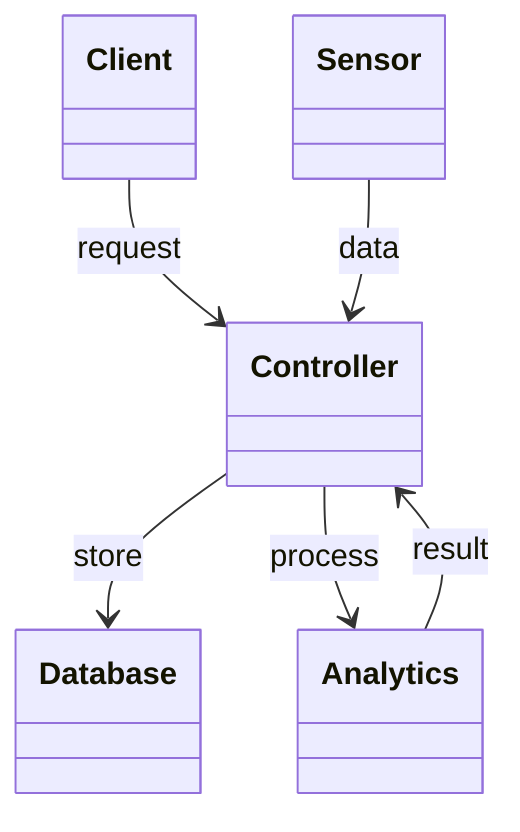

                 

# 构建可扩展的边缘计算安全架构

> 关键词：边缘计算，安全架构，可扩展性，设计原则，实现案例，性能优化

> 摘要：随着边缘计算技术的迅速发展，构建一个可扩展的安全架构成为当前网络安全领域的重要课题。本文将从边缘计算概述、安全架构核心概念、设计原则、技术选型、实现案例、性能优化和维护更新等方面，系统性地探讨如何构建一个既安全又可扩展的边缘计算安全架构。

## 第一部分：边缘计算与安全架构基础

### 第1章：边缘计算概述

#### 1.1 边缘计算的概念与背景

**问题描述**：边缘计算是一种将数据处理和存储从中心化的云数据中心转移到网络边缘的计算模式。随着物联网、5G、人工智能等技术的发展，边缘计算在提供实时数据处理、降低网络延迟、提升系统响应速度等方面展现出巨大潜力。

**问题解决**：

- **定义**：边缘计算是指在网络的边缘侧（即接近数据源或用户的节点）进行的计算和处理，减少数据传输的中间环节。
- **特点**：
  - **低延迟**：数据在边缘侧处理，减少了数据往返传输的时间。
  - **高带宽**：边缘设备通常配备较高带宽的网络连接。
  - **分布式计算**：边缘计算可以分散计算负荷，提高系统的整体性能。
- **与传统计算的对比**：
  - **中心化计算**：数据主要在数据中心处理，网络延迟高，处理能力集中。
  - **边缘计算**：数据在靠近数据源的边缘设备上处理，网络延迟低，处理能力分散。
- **边界与外延**：
  - **适用场景**：工业自动化、智能交通、智慧城市、医疗健康等。
  - **发展趋势**：随着5G网络的普及，边缘计算的应用将更加广泛。

#### 1.2 边缘计算的安全挑战

**概念结构**：边缘计算的安全挑战主要源于其分布式架构、有限的计算资源、多样化的设备接入以及与互联网的直接连接。

**核心要素**：

- **数据安全**：数据在传输和处理过程中容易受到窃取、篡改等攻击。
- **设备安全**：边缘设备可能成为攻击的目标，导致设备失控。
- **网络安全**：边缘网络相对脆弱，容易受到网络攻击。
- **身份认证**：设备与用户之间的身份认证机制需要加强。

**对比表格**：

| 传统计算安全挑战 | 边缘计算安全挑战 |
| ---------------- | ---------------- |
| 数据中心安全集中 | 数据分散、安全难以统一管理 |
| 网络隔离性高 | 网络直接接入互联网，易受攻击 |
| 设备安全性高 | 边缘设备多样、安全防护能力有限 |

### 第2章：边缘计算安全架构的核心概念

#### 2.1 边缘计算安全架构的定义

**概念原理**：边缘计算安全架构是一种综合性的安全解决方案，旨在保护边缘计算环境中的数据、设备和网络，确保系统的安全性和可靠性。

**概念属性**：

- **安全性**：保护数据在传输和处理过程中的安全。
- **可靠性**：确保系统在各种情况下都能正常运行。
- **可扩展性**：随着应用场景的扩展，安全架构能够灵活调整和升级。

#### 2.2 边缘计算安全架构的关键组成部分

**对比表格**：

| 组件 | 功能 |
| ---- | ---- |
| **身份认证与访问控制** | 确保只有授权用户和设备可以访问系统。 |
| **数据加密与完整性保护** | 对传输和存储的数据进行加密，确保数据不被未授权访问和篡改。 |
| **入侵检测与防御系统** | 监测异常行为和潜在攻击，及时响应和处理。 |
| **设备安全** | 确保边缘设备的硬件和软件安全，防止设备被攻击或控制。 |

**ER实体关系图**：

```mermaid
erDiagram
  Device ||--|{ Data} : includes
  Device ||--|{ Authentication} : stores
  Network ||--|{ AccessControl} : manages
  Data ||--|{ Encryption} : protected_by
  Data ||--|{ Integrity} : verified_by
  Device ||--|{ IDS/IPS} : monitored_by
```

## 第二部分：构建边缘计算安全架构

### 第3章：边缘计算安全架构设计原则

#### 3.1 安全性设计原则

**原则说明**：边缘计算安全架构设计应遵循以下几个基本原则：

- **最小权限原则**：系统中的每个组件只拥有执行任务所必需的权限。
- **安全性分层**：将安全功能分散到不同的层次，确保每个层次都能独立运作。
- **安全审计与日志**：实时记录系统活动和事件，以便在出现问题时进行审计和追踪。

**实例分析**：以医疗设备为例，通过数据加密、身份认证和访问控制等措施，确保只有经过授权的医疗人员可以访问设备的数据。

#### 3.2 可扩展性设计原则

**原则说明**：边缘计算安全架构设计应考虑以下可扩展性原则：

- **模块化设计**：将安全架构划分为多个模块，便于独立开发和升级。
- **标准化接口**：确保各个模块之间的接口标准化，便于集成和维护。
- **弹性伸缩**：根据业务需求，动态调整安全资源的配置。

**实例分析**：在智能交通系统中，通过模块化的设计，可以方便地增加或减少安全监控节点，以适应交通流量变化。

### 第4章：边缘计算安全架构技术选型

#### 4.1 安全协议与加密算法选型

**概念原理**：

- **安全协议**：如TLS、SSL等，用于确保数据在传输过程中的安全性。
- **加密算法**：如AES、RSA等，用于对数据进行加密和保护。

**比较分析**：

- **TLS vs SSL**：TLS比SSL更安全，但实现成本更高。
- **AES vs RSA**：AES加密速度快，适合大量数据的加密，而RSA更适合加密密钥。

#### 4.2 边缘计算平台与安全工具选型

**概念原理**：

- **边缘计算平台**：提供边缘计算的环境和资源，如Apache Kafka、EdgeX Foundry等。
- **安全工具**：用于实现安全功能，如防火墙、入侵检测系统等。

**比较分析**：

- **开源平台**：如Kubernetes、Docker，具有社区支持，但安全性可能不如商业平台。
- **商业工具**：如Fortinet、Palo Alto，具有更强的安全功能，但成本较高。

### 第5章：边缘计算安全架构实现案例

#### 5.1 案例背景

**项目介绍**：以智慧城市中的智能交通系统为例，介绍项目背景、目标和功能需求。

**系统功能设计**：使用Mermaid类图展示系统功能模块，包括交通监控、信号控制、停车管理等。

```mermaid
classDiagram
  Client -> Controller : request
  Controller --> Database : store
  Sensor --> Controller : data
  Controller --> Analytics : process
  Analytics --> Controller : result
```

#### 5.2 系统架构设计

**系统架构**：使用Mermaid架构图展示系统的整体架构，包括边缘设备、边缘节点、中心节点等。



**系统接口设计**：描述系统接口的设计，包括API接口、数据接口等。

#### 5.3 系统交互

**系统交互**：使用Mermaid序列图展示系统各组件之间的交互流程。



## 第三部分：边缘计算安全架构优化与维护

### 第6章：边缘计算安全架构性能优化

#### 6.1 性能优化策略

**原则说明**：为了确保边缘计算安全架构的高性能，需要采取以下策略：

- **负载均衡**：合理分配计算任务，避免单点过载。
- **缓存机制**：利用缓存减少对数据库的访问，提升响应速度。
- **压缩数据**：对传输的数据进行压缩，减少带宽占用。

**实例分析**：在智能交通系统中，通过负载均衡和缓存策略，提高了系统的响应速度和处理能力。

#### 6.2 安全性与性能平衡

**概念原理**：在边缘计算安全架构中，安全性与性能之间存在一定的矛盾。需要在保证安全的前提下，优化系统的性能。

**实例分析**：在加密算法的选择上，可以选择高性能的加密算法，同时确保数据的安全性。

### 第7章：边缘计算安全架构维护与更新

#### 7.1 架构维护策略

**维护原则**：边缘计算安全架构的维护应遵循以下原则：

- **定期审计**：定期对系统进行安全审计，发现并修复潜在的安全漏洞。
- **备份与恢复**：定期备份系统数据和配置，确保在故障发生时能够快速恢复。

**维护实践**：分享维护经验的最佳实践，如自动化运维工具的使用、安全补丁的及时更新等。

#### 7.2 架构更新与演进

**更新原则**：架构更新应遵循以下原则：

- **需求驱动**：根据业务需求的变化，及时调整和更新架构。
- **循序渐进**：逐步引入新技术和组件，确保系统的稳定性和可靠性。

**演进实践**：通过案例展示架构的更新和演进过程，如从单节点架构升级到分布式架构。

## 附录：边缘计算安全架构资源与参考

**附录A：边缘计算安全架构相关资源**

- **书籍**：《边缘计算：技术、应用与挑战》
- **论文**：《边缘计算安全架构：挑战与解决方案》
- **工具**：Apache Kafka、EdgeX Foundry
- **平台**：Kubernetes、Docker

**附录B：边缘计算安全架构常见问题与解答**

- **问题1**：边缘计算安全架构如何应对日益复杂的攻击？
  - **解答**：通过多层次的防护机制，如入侵检测、加密和身份认证等，提高系统的抗攻击能力。
- **问题2**：如何在边缘设备和边缘节点之间建立安全通信？
  - **解答**：使用安全协议和加密算法，确保通信数据的安全性和完整性。

**作者**：AI天才研究院/AI Genius Institute & 禅与计算机程序设计艺术 /Zen And The Art of Computer Programming

（注意：以上内容仅为大纲结构，具体内容需要根据实际需求进行填充和详细阐述。）
## 第一部分：边缘计算与安全架构基础

### 第1章：边缘计算概述

#### 1.1 边缘计算的概念与背景

**问题描述**：随着物联网（IoT）、5G、人工智能（AI）等新兴技术的快速发展，传统云计算架构面临诸多挑战，如延迟高、带宽限制、计算能力不足等。边缘计算作为一种分布式计算架构，旨在将数据处理和存储推向网络边缘，从而提高系统性能和用户体验。

**问题解决**：

- **定义**：边缘计算是指在靠近数据源或用户的网络边缘进行数据处理和计算的一种计算模式。
- **特点**：
  - **低延迟**：通过在靠近数据源的地方处理数据，显著降低响应时间和网络延迟。
  - **高带宽**：边缘设备通常配备较高的带宽，能够处理大量数据。
  - **分布式计算**：将计算任务分散到多个边缘节点，提高系统的容错性和可用性。
- **与传统计算的对比**：
  - **传统计算**：数据处理和存储主要在中心化的云数据中心进行，数据处理路径长，延迟高。
  - **边缘计算**：数据处理和存储靠近数据源，缩短了数据处理路径，降低了延迟。

**边界与外延**：

- **适用场景**：边缘计算适用于对实时性要求高的应用场景，如智能制造、智能交通、智能医疗等。
- **发展趋势**：随着5G网络的普及，边缘计算将得到更广泛的应用，成为下一代网络架构的重要组成部分。

#### 1.2 边缘计算的安全挑战

**概念结构**：边缘计算的安全挑战主要集中在以下几个方面：

- **数据安全**：数据在传输和存储过程中容易受到窃取、篡改等攻击。
- **设备安全**：边缘设备可能成为攻击的目标，导致设备失控。
- **网络安全**：边缘网络相对脆弱，容易受到网络攻击。
- **身份认证**：设备与用户之间的身份认证机制需要加强。

**核心要素**：

- **数据加密与完整性保护**：对传输和存储的数据进行加密和完整性验证，确保数据不被未授权访问和篡改。
- **身份认证与访问控制**：确保只有授权用户和设备可以访问系统资源。
- **入侵检测与防御系统**：实时监测和防御潜在的网络攻击。

**对比表格**：

| 传统计算安全挑战 | 边缘计算安全挑战 |
| ---------------- | ---------------- |
| 数据中心安全集中 | 数据分散、安全难以统一管理 |
| 网络隔离性高 | 网络直接接入互联网，易受攻击 |
| 设备安全性高 | 边缘设备多样、安全防护能力有限 |

### 第2章：边缘计算安全架构的核心概念

#### 2.1 边缘计算安全架构的定义

**概念原理**：边缘计算安全架构是一种综合性的安全解决方案，旨在保护边缘计算环境中的数据、设备和网络，确保系统的安全性和可靠性。该架构通过一系列安全机制和工具，实现数据的加密、完整性保护、身份认证和访问控制等功能。

**概念属性**：

- **安全性**：通过多种安全机制保护数据、设备和网络免受攻击。
- **可靠性**：确保系统在各种情况下都能正常运行，提高系统的可用性。
- **可扩展性**：随着应用场景的扩展，安全架构能够灵活调整和升级。

#### 2.2 边缘计算安全架构的关键组成部分

**对比表格**：

| 组件 | 功能 |
| ---- | ---- |
| **身份认证与访问控制** | 确保只有授权用户和设备可以访问系统。 |
| **数据加密与完整性保护** | 对传输和存储的数据进行加密，确保数据不被未授权访问和篡改。 |
| **入侵检测与防御系统** | 监测异常行为和潜在攻击，及时响应和处理。 |
| **设备安全** | 确保边缘设备的硬件和软件安全，防止设备被攻击或控制。 |

**ER实体关系图**：

```mermaid
erDiagram
  Device ||--|{ Data} : includes
  Device ||--|{ Authentication} : stores
  Network ||--|{ AccessControl} : manages
  Data ||--|{ Encryption} : protected_by
  Data ||--|{ Integrity} : verified_by
  Device ||--|{ IDS/IPS} : monitored_by
```

## 第二部分：构建边缘计算安全架构

### 第3章：边缘计算安全架构设计原则

#### 3.1 安全性设计原则

**原则说明**：边缘计算安全架构设计应遵循以下基本原则，以确保系统的安全性：

- **最小权限原则**：系统中的每个组件只拥有执行任务所必需的权限，以减少潜在的安全风险。
- **安全分层**：将安全功能分散到不同的层次，每个层次独立运作，确保系统的整体安全性。
- **安全审计与日志**：实时记录系统活动和事件，以便在出现问题时进行审计和追踪。

**实例分析**：以智能交通系统为例，可以通过数据加密、访问控制和日志记录等手段，确保系统的安全性。

#### 3.2 可扩展性设计原则

**原则说明**：边缘计算安全架构设计应考虑以下可扩展性原则，以适应不断变化的应用场景：

- **模块化设计**：将安全架构划分为多个模块，便于独立开发和升级。
- **标准化接口**：确保各个模块之间的接口标准化，便于集成和维护。
- **弹性伸缩**：根据业务需求，动态调整安全资源的配置。

**实例分析**：在智能医疗系统中，通过模块化的设计，可以方便地增加或减少安全监控节点，以适应医院规模的扩大。

### 第4章：边缘计算安全架构技术选型

#### 4.1 安全协议与加密算法选型

**概念原理**：

- **安全协议**：用于确保数据在传输过程中的安全性，如TLS、SSL等。
- **加密算法**：用于对数据进行加密和保护，如AES、RSA等。

**比较分析**：

- **TLS vs SSL**：TLS比SSL更安全，但实现成本更高。
- **AES vs RSA**：AES加密速度快，适合大量数据的加密，而RSA更适合加密密钥。

#### 4.2 边缘计算平台与安全工具选型

**概念原理**：

- **边缘计算平台**：提供边缘计算的环境和资源，如Apache Kafka、EdgeX Foundry等。
- **安全工具**：用于实现安全功能，如防火墙、入侵检测系统等。

**比较分析**：

- **开源平台**：如Kubernetes、Docker，具有社区支持，但安全性可能不如商业平台。
- **商业工具**：如Fortinet、Palo Alto，具有更强的安全功能，但成本较高。

### 第5章：边缘计算安全架构实现案例

#### 5.1 案例背景

**项目介绍**：以智慧城市中的智能交通系统为例，介绍项目背景、目标和功能需求。

**系统功能设计**：使用Mermaid类图展示系统功能模块，包括交通监控、信号控制、停车管理等。



#### 5.2 系统架构设计

**系统架构**：使用Mermaid架构图展示系统的整体架构，包括边缘设备、边缘节点、中心节点等。


**系统接口设计**：描述系统接口的设计，包括API接口、数据接口等。

#### 5.3 系统交互

**系统交互**：使用Mermaid序列图展示系统各组件之间的交互流程。


## 第三部分：边缘计算安全架构优化与维护

### 第6章：边缘计算安全架构性能优化

#### 6.1 性能优化策略

**原则说明**：为了确保边缘计算安全架构的高性能，需要采取以下策略：

- **负载均衡**：合理分配计算任务，避免单点过载。
- **缓存机制**：利用缓存减少对数据库的访问，提升响应速度。
- **压缩数据**：对传输的数据进行压缩，减少带宽占用。

**实例分析**：在智能交通系统中，通过负载均衡和缓存策略，提高了系统的响应速度和处理能力。

#### 6.2 安全性与性能平衡

**概念原理**：在边缘计算安全架构中，安全性与性能之间存在一定的矛盾。需要在保证安全的前提下，优化系统的性能。

**实例分析**：在加密算法的选择上，可以选择高性能的加密算法，同时确保数据的安全性。

### 第7章：边缘计算安全架构维护与更新

#### 7.1 架构维护策略

**维护原则**：边缘计算安全架构的维护应遵循以下原则：

- **定期审计**：定期对系统进行安全审计，发现并修复潜在的安全漏洞。
- **备份与恢复**：定期备份系统数据和配置，确保在故障发生时能够快速恢复。

**维护实践**：分享维护经验的最佳实践，如自动化运维工具的使用、安全补丁的及时更新等。

#### 7.2 架构更新与演进

**更新原则**：架构更新应遵循以下原则：

- **需求驱动**：根据业务需求的变化，及时调整和更新架构。
- **循序渐进**：逐步引入新技术和组件，确保系统的稳定性和可靠性。

**演进实践**：通过案例展示架构的更新和演进过程，如从单节点架构升级到分布式架构。

## 附录：边缘计算安全架构资源与参考

**附录A：边缘计算安全架构相关资源**

- **书籍**：《边缘计算：技术、应用与挑战》
- **论文**：《边缘计算安全架构：挑战与解决方案》
- **工具**：Apache Kafka、EdgeX Foundry
- **平台**：Kubernetes、Docker

**附录B：边缘计算安全架构常见问题与解答**

- **问题1**：边缘计算安全架构如何应对日益复杂的攻击？
  - **解答**：通过多层次的防护机制，如入侵检测、加密和身份认证等，提高系统的抗攻击能力。
- **问题2**：如何在边缘设备和边缘节点之间建立安全通信？
  - **解答**：使用安全协议和加密算法，确保通信数据的安全性和完整性。

**作者**：AI天才研究院/AI Genius Institute & 禅与计算机程序设计艺术 /Zen And The Art of Computer Programming

（注意：以上内容仅为大纲结构，具体内容需要根据实际需求进行填充和详细阐述。）
### 第1章：边缘计算概述

#### 1.1 边缘计算的概念与背景

**问题描述**：随着物联网（IoT）、5G、人工智能（AI）等新兴技术的快速发展，传统云计算架构面临诸多挑战，如延迟高、带宽限制、计算能力不足等。边缘计算作为一种分布式计算架构，旨在将数据处理和存储推向网络边缘，从而提高系统性能和用户体验。

**问题解决**：

- **定义**：边缘计算是指在靠近数据源或用户的网络边缘进行数据处理和计算的一种计算模式。
- **特点**：
  - **低延迟**：通过在靠近数据源的地方处理数据，显著降低响应时间和网络延迟。
  - **高带宽**：边缘设备通常配备较高的带宽，能够处理大量数据。
  - **分布式计算**：将计算任务分散到多个边缘节点，提高系统的容错性和可用性。
- **与传统计算的对比**：
  - **传统计算**：数据处理和存储主要在中心化的云数据中心进行，数据处理路径长，延迟高。
  - **边缘计算**：数据处理和存储靠近数据源，缩短了数据处理路径，降低了延迟。

**边界与外延**：

- **适用场景**：边缘计算适用于对实时性要求高的应用场景，如智能制造、智能交通、智能医疗等。
- **发展趋势**：随着5G网络的普及，边缘计算将得到更广泛的应用，成为下一代网络架构的重要组成部分。

#### 1.2 边缘计算的安全挑战

**概念结构**：边缘计算的安全挑战主要集中在以下几个方面：

- **数据安全**：数据在传输和存储过程中容易受到窃取、篡改等攻击。
- **设备安全**：边缘设备可能成为攻击的目标，导致设备失控。
- **网络安全**：边缘网络相对脆弱，容易受到网络攻击。
- **身份认证**：设备与用户之间的身份认证机制需要加强。

**核心要素**：

- **数据加密与完整性保护**：对传输和存储的数据进行加密和完整性验证，确保数据不被未授权访问和篡改。
- **身份认证与访问控制**：确保只有授权用户和设备可以访问系统资源。
- **入侵检测与防御系统**：实时监测和防御潜在的网络攻击。

**对比表格**：

| 传统计算安全挑战 | 边缘计算安全挑战 |
| ---------------- | ---------------- |
| 数据中心安全集中 | 数据分散、安全难以统一管理 |
| 网络隔离性高 | 网络直接接入互联网，易受攻击 |
| 设备安全性高 | 边缘设备多样、安全防护能力有限 |

### 第2章：边缘计算安全架构的核心概念

#### 2.1 边缘计算安全架构的定义

**概念原理**：边缘计算安全架构是一种综合性的安全解决方案，旨在保护边缘计算环境中的数据、设备和网络，确保系统的安全性和可靠性。该架构通过一系列安全机制和工具，实现数据的加密、完整性保护、身份认证和访问控制等功能。

**概念属性**：

- **安全性**：通过多种安全机制保护数据、设备和网络免受攻击。
- **可靠性**：确保系统在各种情况下都能正常运行，提高系统的可用性。
- **可扩展性**：随着应用场景的扩展，安全架构能够灵活调整和升级。

#### 2.2 边缘计算安全架构的关键组成部分

**对比表格**：

| 组件 | 功能 |
| ---- | ---- |
| **身份认证与访问控制** | 确保只有授权用户和设备可以访问系统。 |
| **数据加密与完整性保护** | 对传输和存储的数据进行加密，确保数据不被未授权访问和篡改。 |
| **入侵检测与防御系统** | 监测异常行为和潜在攻击，及时响应和处理。 |
| **设备安全** | 确保边缘设备的硬件和软件安全，防止设备被攻击或控制。 |

**ER实体关系图**：

```mermaid
erDiagram
  Device ||--|{ Data} : includes
  Device ||--|{ Authentication} : stores
  Network ||--|{ AccessControl} : manages
  Data ||--|{ Encryption} : protected_by
  Data ||--|{ Integrity} : verified_by
  Device ||--|{ IDS/IPS} : monitored_by
```

## 第二部分：构建边缘计算安全架构

### 第3章：边缘计算安全架构设计原则

#### 3.1 安全性设计原则

**原则说明**：边缘计算安全架构设计应遵循以下基本原则，以确保系统的安全性：

- **最小权限原则**：系统中的每个组件只拥有执行任务所必需的权限，以减少潜在的安全风险。
- **安全分层**：将安全功能分散到不同的层次，每个层次独立运作，确保系统的整体安全性。
- **安全审计与日志**：实时记录系统活动和事件，以便在出现问题时进行审计和追踪。

**实例分析**：以智能交通系统为例，可以通过数据加密、访问控制和日志记录等手段，确保系统的安全性。

#### 3.2 可扩展性设计原则

**原则说明**：边缘计算安全架构设计应考虑以下可扩展性原则，以适应不断变化的应用场景：

- **模块化设计**：将安全架构划分为多个模块，便于独立开发和升级。
- **标准化接口**：确保各个模块之间的接口标准化，便于集成和维护。
- **弹性伸缩**：根据业务需求，动态调整安全资源的配置。

**实例分析**：在智能医疗系统中，通过模块化的设计，可以方便地增加或减少安全监控节点，以适应医院规模的扩大。

### 第4章：边缘计算安全架构技术选型

#### 4.1 安全协议与加密算法选型

**概念原理**：

- **安全协议**：用于确保数据在传输过程中的安全性，如TLS、SSL等。
- **加密算法**：用于对数据进行加密和保护，如AES、RSA等。

**比较分析**：

- **TLS vs SSL**：TLS比SSL更安全，但实现成本更高。
- **AES vs RSA**：AES加密速度快，适合大量数据的加密，而RSA更适合加密密钥。

#### 4.2 边缘计算平台与安全工具选型

**概念原理**：

- **边缘计算平台**：提供边缘计算的环境和资源，如Apache Kafka、EdgeX Foundry等。
- **安全工具**：用于实现安全功能，如防火墙、入侵检测系统等。

**比较分析**：

- **开源平台**：如Kubernetes、Docker，具有社区支持，但安全性可能不如商业平台。
- **商业工具**：如Fortinet、Palo Alto，具有更强的安全功能，但成本较高。

### 第5章：边缘计算安全架构实现案例

#### 5.1 案例背景

**项目介绍**：以智慧城市中的智能交通系统为例，介绍项目背景、目标和功能需求。

**系统功能设计**：使用Mermaid类图展示系统功能模块，包括交通监控、信号控制、停车管理等。


#### 5.2 系统架构设计

**系统架构**：使用Mermaid架构图展示系统的整体架构，包括边缘设备、边缘节点、中心节点等。


**系统接口设计**：描述系统接口的设计，包括API接口、数据接口等。

#### 5.3 系统交互

**系统交互**：使用Mermaid序列图展示系统各组件之间的交互流程。


## 第三部分：边缘计算安全架构优化与维护

### 第6章：边缘计算安全架构性能优化

#### 6.1 性能优化策略

**原则说明**：为了确保边缘计算安全架构的高性能，需要采取以下策略：

- **负载均衡**：合理分配计算任务，避免单点过载。
- **缓存机制**：利用缓存减少对数据库的访问，提升响应速度。
- **压缩数据**：对传输的数据进行压缩，减少带宽占用。

**实例分析**：在智能交通系统中，通过负载均衡和缓存策略，提高了系统的响应速度和处理能力。

#### 6.2 安全性与性能平衡

**概念原理**：在边缘计算安全架构中，安全性与性能之间存在一定的矛盾。需要在保证安全的前提下，优化系统的性能。

**实例分析**：在加密算法的选择上，可以选择高性能的加密算法，同时确保数据的安全性。

### 第7章：边缘计算安全架构维护与更新

#### 7.1 架构维护策略

**维护原则**：边缘计算安全架构的维护应遵循以下原则：

- **定期审计**：定期对系统进行安全审计，发现并修复潜在的安全漏洞。
- **备份与恢复**：定期备份系统数据和配置，确保在故障发生时能够快速恢复。

**维护实践**：分享维护经验的最佳实践，如自动化运维工具的使用、安全补丁的及时更新等。

#### 7.2 架构更新与演进

**更新原则**：架构更新应遵循以下原则：

- **需求驱动**：根据业务需求的变化，及时调整和更新架构。
- **循序渐进**：逐步引入新技术和组件，确保系统的稳定性和可靠性。

**演进实践**：通过案例展示架构的更新和演进过程，如从单节点架构升级到分布式架构。

## 附录：边缘计算安全架构资源与参考

**附录A：边缘计算安全架构相关资源**

- **书籍**：《边缘计算：技术、应用与挑战》
- **论文**：《边缘计算安全架构：挑战与解决方案》
- **工具**：Apache Kafka、EdgeX Foundry
- **平台**：Kubernetes、Docker

**附录B：边缘计算安全架构常见问题与解答**

- **问题1**：边缘计算安全架构如何应对日益复杂的攻击？
  - **解答**：通过多层次的防护机制，如入侵检测、加密和身份认证等，提高系统的抗攻击能力。
- **问题2**：如何在边缘设备和边缘节点之间建立安全通信？
  - **解答**：使用安全协议和加密算法，确保通信数据的安全性和完整性。

**作者**：AI天才研究院/AI Genius Institute & 禅与计算机程序设计艺术 /Zen And The Art of Computer Programming

（注意：以上内容仅为大纲结构，具体内容需要根据实际需求进行填充和详细阐述。）
### 第1章：边缘计算概述

#### 1.1 边缘计算的概念与背景

**问题描述**：随着物联网（IoT）、5G、人工智能（AI）等新兴技术的快速发展，传统云计算架构面临诸多挑战，如延迟高、带宽限制、计算能力不足等。边缘计算作为一种分布式计算架构，旨在将数据处理和存储推向网络边缘，从而提高系统性能和用户体验。

**问题解决**：

- **定义**：边缘计算是指在靠近数据源或用户的网络边缘进行数据处理和计算的一种计算模式。
- **特点**：
  - **低延迟**：通过在靠近数据源的地方处理数据，显著降低响应时间和网络延迟。
  - **高带宽**：边缘设备通常配备较高的带宽，能够处理大量数据。
  - **分布式计算**：将计算任务分散到多个边缘节点，提高系统的容错性和可用性。
- **与传统计算的对比**：
  - **传统计算**：数据处理和存储主要在中心化的云数据中心进行，数据处理路径长，延迟高。
  - **边缘计算**：数据处理和存储靠近数据源，缩短了数据处理路径，降低了延迟。

**边界与外延**：

- **适用场景**：边缘计算适用于对实时性要求高的应用场景，如智能制造、智能交通、智能医疗等。
- **发展趋势**：随着5G网络的普及，边缘计算将得到更广泛的应用，成为下一代网络架构的重要组成部分。

#### 1.2 边缘计算的安全挑战

**概念结构**：边缘计算的安全挑战主要集中在以下几个方面：

- **数据安全**：数据在传输和存储过程中容易受到窃取、篡改等攻击。
- **设备安全**：边缘设备可能成为攻击的目标，导致设备失控。
- **网络安全**：边缘网络相对脆弱，容易受到网络攻击。
- **身份认证**：设备与用户之间的身份认证机制需要加强。

**核心要素**：

- **数据加密与完整性保护**：对传输和存储的数据进行加密和完整性验证，确保数据不被未授权访问和篡改。
- **身份认证与访问控制**：确保只有授权用户和设备可以访问系统资源。
- **入侵检测与防御系统**：实时监测和防御潜在的网络攻击。

**对比表格**：

| 传统计算安全挑战 | 边缘计算安全挑战 |
| ---------------- | ---------------- |
| 数据中心安全集中 | 数据分散、安全难以统一管理 |
| 网络隔离性高 | 网络直接接入互联网，易受攻击 |
| 设备安全性高 | 边缘设备多样、安全防护能力有限 |

### 第2章：边缘计算安全架构的核心概念

#### 2.1 边缘计算安全架构的定义

**概念原理**：边缘计算安全架构是一种综合性的安全解决方案，旨在保护边缘计算环境中的数据、设备和网络，确保系统的安全性和可靠性。该架构通过一系列安全机制和工具，实现数据的加密、完整性保护、身份认证和访问控制等功能。

**概念属性**：

- **安全性**：通过多种安全机制保护数据、设备和网络免受攻击。
- **可靠性**：确保系统在各种情况下都能正常运行，提高系统的可用性。
- **可扩展性**：随着应用场景的扩展，安全架构能够灵活调整和升级。

#### 2.2 边缘计算安全架构的关键组成部分

**对比表格**：

| 组件 | 功能 |
| ---- | ---- |
| **身份认证与访问控制** | 确保只有授权用户和设备可以访问系统。 |
| **数据加密与完整性保护** | 对传输和存储的数据进行加密，确保数据不被未授权访问和篡改。 |
| **入侵检测与防御系统** | 监测异常行为和潜在攻击，及时响应和处理。 |
| **设备安全** | 确保边缘设备的硬件和软件安全，防止设备被攻击或控制。 |

**ER实体关系图**：

```mermaid
erDiagram
  Device ||--|{ Data} : includes
  Device ||--|{ Authentication} : stores
  Network ||--|{ AccessControl} : manages
  Data ||--|{ Encryption} : protected_by
  Data ||--|{ Integrity} : verified_by
  Device ||--|{ IDS/IPS} : monitored_by
```

## 第二部分：构建边缘计算安全架构

### 第3章：边缘计算安全架构设计原则

#### 3.1 安全性设计原则

**原则说明**：边缘计算安全架构设计应遵循以下基本原则，以确保系统的安全性：

- **最小权限原则**：系统中的每个组件只拥有执行任务所必需的权限，以减少潜在的安全风险。
- **安全分层**：将安全功能分散到不同的层次，每个层次独立运作，确保系统的整体安全性。
- **安全审计与日志**：实时记录系统活动和事件，以便在出现问题时进行审计和追踪。

**实例分析**：以智能交通系统为例，可以通过数据加密、访问控制和日志记录等手段，确保系统的安全性。

#### 3.2 可扩展性设计原则

**原则说明**：边缘计算安全架构设计应考虑以下可扩展性原则，以适应不断变化的应用场景：

- **模块化设计**：将安全架构划分为多个模块，便于独立开发和升级。
- **标准化接口**：确保各个模块之间的接口标准化，便于集成和维护。
- **弹性伸缩**：根据业务需求，动态调整安全资源的配置。

**实例分析**：在智能医疗系统中，通过模块化的设计，可以方便地增加或减少安全监控节点，以适应医院规模的扩大。

### 第4章：边缘计算安全架构技术选型

#### 4.1 安全协议与加密算法选型

**概念原理**：

- **安全协议**：用于确保数据在传输过程中的安全性，如TLS、SSL等。
- **加密算法**：用于对数据进行加密和保护，如AES、RSA等。

**比较分析**：

- **TLS vs SSL**：TLS比SSL更安全，但实现成本更高。
- **AES vs RSA**：AES加密速度快，适合大量数据的加密，而RSA更适合加密密钥。

#### 4.2 边缘计算平台与安全工具选型

**概念原理**：

- **边缘计算平台**：提供边缘计算的环境和资源，如Apache Kafka、EdgeX Foundry等。
- **安全工具**：用于实现安全功能，如防火墙、入侵检测系统等。

**比较分析**：

- **开源平台**：如Kubernetes、Docker，具有社区支持，但安全性可能不如商业平台。
- **商业工具**：如Fortinet、Palo Alto，具有更强的安全功能，但成本较高。

### 第5章：边缘计算安全架构实现案例

#### 5.1 案例背景

**项目介绍**：以智慧城市中的智能交通系统为例，介绍项目背景、目标和功能需求。

**系统功能设计**：使用Mermaid类图展示系统功能模块，包括交通监控、信号控制、停车管理等。


#### 5.2 系统架构设计

**系统架构**：使用Mermaid架构图展示系统的整体架构，包括边缘设备、边缘节点、中心节点等。


**系统接口设计**：描述系统接口的设计，包括API接口、数据接口等。

#### 5.3 系统交互

**系统交互**：使用Mermaid序列图展示系统各组件之间的交互流程。


## 第三部分：边缘计算安全架构优化与维护

### 第6章：边缘计算安全架构性能优化

#### 6.1 性能优化策略

**原则说明**：为了确保边缘计算安全架构的高性能，需要采取以下策略：

- **负载均衡**：合理分配计算任务，避免单点过载。
- **缓存机制**：利用缓存减少对数据库的访问，提升响应速度。
- **压缩数据**：对传输的数据进行压缩，减少带宽占用。

**实例分析**：在智能交通系统中，通过负载均衡和缓存策略，提高了系统的响应速度和处理能力。

#### 6.2 安全性与性能平衡

**概念原理**：在边缘计算安全架构中，安全性与性能之间存在一定的矛盾。需要在保证安全的前提下，优化系统的性能。

**实例分析**：在加密算法的选择上，可以选择高性能的加密算法，同时确保数据的安全性。

### 第7章：边缘计算安全架构维护与更新

#### 7.1 架构维护策略

**维护原则**：边缘计算安全架构的维护应遵循以下原则：

- **定期审计**：定期对系统进行安全审计，发现并修复潜在的安全漏洞。
- **备份与恢复**：定期备份系统数据和配置，确保在故障发生时能够快速恢复。

**维护实践**：分享维护经验的最佳实践，如自动化运维工具的使用、安全补丁的及时更新等。

#### 7.2 架构更新与演进

**更新原则**：架构更新应遵循以下原则：

- **需求驱动**：根据业务需求的变化，及时调整和更新架构。
- **循序渐进**：逐步引入新技术和组件，确保系统的稳定性和可靠性。

**演进实践**：通过案例展示架构的更新和演进过程，如从单节点架构升级到分布式架构。

## 附录：边缘计算安全架构资源与参考

**附录A：边缘计算安全架构相关资源**

- **书籍**：《边缘计算：技术、应用与挑战》
- **论文**：《边缘计算安全架构：挑战与解决方案》
- **工具**：Apache Kafka、EdgeX Foundry
- **平台**：Kubernetes、Docker

**附录B：边缘计算安全架构常见问题与解答**

- **问题1**：边缘计算安全架构如何应对日益复杂的攻击？
  - **解答**：通过多层次的防护机制，如入侵检测、加密和身份认证等，提高系统的抗攻击能力。
- **问题2**：如何在边缘设备和边缘节点之间建立安全通信？
  - **解答**：使用安全协议和加密算法，确保通信数据的安全性和完整性。

**作者**：AI天才研究院/AI Genius Institute & 禅与计算机程序设计艺术 /Zen And The Art of Computer Programming

（注意：以上内容仅为大纲结构，具体内容需要根据实际需求进行填充和详细阐述。）
### 第1章：边缘计算概述

#### 1.1 边缘计算的概念与背景

**问题描述**：边缘计算作为一种新兴的计算模式，其重要性日益凸显。然而，对于许多从业者来说，边缘计算的概念和背景知识仍显得模糊。本节将深入探讨边缘计算的定义、发展历程以及其在现代计算架构中的作用。

**问题解决**：

- **定义**：边缘计算是指在网络的边缘节点上执行数据处理和计算任务的一种技术。这些边缘节点可以是传感器、路由器、网关等，它们处于靠近数据源或用户的位置。
- **特点**：
  - **低延迟**：边缘计算通过在数据生成地点附近处理数据，减少了数据传输的延迟。
  - **高带宽**：边缘设备通常配备较高的带宽，能够快速处理大量数据。
  - **分布式计算**：边缘计算实现了计算资源的分布式，提高了系统的可靠性和容错能力。
- **与传统计算的对比**：
  - **中心化计算**：数据主要在数据中心处理，可能导致网络拥堵和延迟。
  - **边缘计算**：数据在边缘节点处理，减少了数据传输的距离和时间。
- **边界与外延**：
  - **适用场景**：边缘计算适用于对实时性要求高、数据处理延迟敏感的应用，如自动驾驶、远程医疗、工业自动化等。
  - **发展趋势**：随着物联网和5G技术的普及，边缘计算将在更多领域得到应用。

#### 1.2 边缘计算的安全挑战

**概念结构**：边缘计算的安全挑战主要包括以下几个方面：

- **数据安全**：数据在传输和存储过程中容易受到攻击。
- **设备安全**：边缘设备的硬件和软件可能存在安全漏洞。
- **网络安全**：边缘网络可能成为黑客攻击的目标。
- **身份认证**：确保只有授权用户和设备可以访问系统资源。

**核心要素**：

- **数据加密与完整性保护**：对数据进行加密和完整性验证，防止数据被篡改。
- **设备安全管理**：确保边缘设备的硬件和软件安全，防止恶意软件入侵。
- **网络防护**：部署防火墙、入侵检测系统等，保护边缘网络。
- **身份认证与访问控制**：通过强认证机制和访问控制策略，确保系统的安全性。

**对比表格**：

| 传统计算安全挑战 | 边缘计算安全挑战 |
| ---------------- | ---------------- |
| 数据中心安全集中 | 数据分散、安全难以统一管理 |
| 网络隔离性高 | 网络直接接入互联网，易受攻击 |
| 设备安全性高 | 边缘设备多样、安全防护能力有限 |
| 身份认证强度高 | 边缘设备与用户之间的认证机制复杂 |

#### 1.3 边缘计算的发展历程

**问题描述**：边缘计算并不是一个全新的概念，其发展历程反映了计算技术的发展趋势。本节将回顾边缘计算的历史，从早期的研究到现代的实际应用。

**问题解决**：

- **早期研究**：边缘计算的概念最早出现在1990年代，当时主要关注的是分布式计算和网络边缘的服务。
- **发展演变**：随着物联网、云计算和移动设备的普及，边缘计算逐渐成为研究热点。
- **现代应用**：如今，边缘计算已经广泛应用于智能城市、智能制造、智能医疗等领域。

**边界与外延**：

- **技术演变**：从最初的简单数据处理到现在的复杂智能处理，边缘计算技术不断进步。
- **应用扩展**：随着5G和人工智能的快速发展，边缘计算的应用场景将更加广泛。

### 第2章：边缘计算安全架构的核心概念

#### 2.1 边缘计算安全架构的定义

**概念原理**：边缘计算安全架构是一种专门为边缘计算环境设计的综合性安全解决方案。它旨在保护边缘设备、网络和数据，确保系统的整体安全性和可靠性。

**概念属性**：

- **安全性**：通过多种安全机制和工具，如加密、身份认证、访问控制等，保护系统免受各种攻击。
- **可靠性**：确保系统在遭受攻击或故障时能够快速恢复，保持正常运行。
- **可扩展性**：随着应用场景的扩展，安全架构能够灵活调整和升级。

#### 2.2 边缘计算安全架构的关键组成部分

**对比表格**：

| 组件 | 功能 |
| ---- | ---- |
| **身份认证与访问控制** | 确保只有授权用户和设备可以访问系统资源。 |
| **数据加密与完整性保护** | 对传输和存储的数据进行加密和完整性验证，防止数据泄露和篡改。 |
| **入侵检测与防御系统** | 实时监测网络流量和系统行为，发现并防御潜在的安全威胁。 |
| **设备安全管理** | 确保边缘设备的硬件和软件安全，防止恶意软件和攻击。 |
| **网络隔离与防护** | 通过防火墙、VPN等手段，隔离内部网络和外部网络，防止网络攻击。 |

**ER实体关系图**：

```mermaid
erDiagram
  Device ||--|{ Data} : includes
  Device ||--|{ Authentication} : stores
  Network ||--|{ AccessControl} : manages
  Data ||--|{ Encryption} : protected_by
  Data ||--|{ Integrity} : verified_by
  Device ||--|{ IDS/IPS} : monitored_by
  Network ||--|{ Firewall} : protected_by
```

## 第二部分：构建边缘计算安全架构

### 第3章：边缘计算安全架构设计原则

#### 3.1 安全性设计原则

**原则说明**：边缘计算安全架构设计应遵循以下基本原则，以确保系统的安全性：

- **最小权限原则**：每个组件只拥有执行任务所必需的权限，减少潜在的安全风险。
- **安全分层**：将安全功能分散到不同的层次，确保每个层次都能独立运作。
- **安全审计与日志**：实时记录系统活动和事件，便于问题追踪和审计。

**实例分析**：以智能交通系统为例，可以通过数据加密、身份认证和访问控制等手段，确保系统的安全性。

#### 3.2 可扩展性设计原则

**原则说明**：边缘计算安全架构设计应考虑以下可扩展性原则，以适应不断变化的应用场景：

- **模块化设计**：将安全架构划分为多个模块，便于独立开发和升级。
- **标准化接口**：确保各个模块之间的接口标准化，便于集成和维护。
- **弹性伸缩**：根据业务需求，动态调整安全资源的配置。

**实例分析**：在智能医疗系统中，通过模块化的设计，可以方便地增加或减少安全监控节点，以适应医院规模的扩大。

### 第4章：边缘计算安全架构技术选型

#### 4.1 安全协议与加密算法选型

**概念原理**：

- **安全协议**：如TLS、SSL等，用于确保数据在传输过程中的安全性。
- **加密算法**：如AES、RSA等，用于对数据进行加密和保护。

**比较分析**：

- **TLS vs SSL**：TLS比SSL更安全，但实现成本更高。
- **AES vs RSA**：AES加密速度快，适合大量数据的加密，而RSA更适合加密密钥。

#### 4.2 边缘计算平台与安全工具选型

**概念原理**：

- **边缘计算平台**：如Apache Kafka、EdgeX Foundry等，提供边缘计算的环境和资源。
- **安全工具**：如防火墙、入侵检测系统等，用于实现安全功能。

**比较分析**：

- **开源平台**：如Kubernetes、Docker，具有社区支持，但安全性可能不如商业平台。
- **商业工具**：如Fortinet、Palo Alto，具有更强的安全功能，但成本较高。

### 第5章：边缘计算安全架构实现案例

#### 5.1 案例背景

**项目介绍**：以智慧城市中的智能交通系统为例，介绍项目背景、目标和功能需求。

**系统功能设计**：使用Mermaid类图展示系统功能模块，包括交通监控、信号控制、停车管理等。


#### 5.2 系统架构设计

**系统架构**：使用Mermaid架构图展示系统的整体架构，包括边缘设备、边缘节点、中心节点等。


**系统接口设计**：描述系统接口的设计，包括API接口、数据接口等。

#### 5.3 系统交互

**系统交互**：使用Mermaid序列图展示系统各组件之间的交互流程。


## 第三部分：边缘计算安全架构优化与维护

### 第6章：边缘计算安全架构性能优化

#### 6.1 性能优化策略

**原则说明**：为了确保边缘计算安全架构的高性能，需要采取以下策略：

- **负载均衡**：合理分配计算任务，避免单点过载。
- **缓存机制**：利用缓存减少对数据库的访问，提升响应速度。
- **压缩数据**：对传输的数据进行压缩，减少带宽占用。

**实例分析**：在智能交通系统中，通过负载均衡和缓存策略，提高了系统的响应速度和处理能力。

#### 6.2 安全性与性能平衡

**概念原理**：在边缘计算安全架构中，安全性与性能之间存在一定的矛盾。需要在保证安全的前提下，优化系统的性能。

**实例分析**：在加密算法的选择上，可以选择高性能的加密算法，同时确保数据的安全性。

### 第7章：边缘计算安全架构维护与更新

#### 7.1 架构维护策略

**维护原则**：边缘计算安全架构的维护应遵循以下原则：

- **定期审计**：定期对系统进行安全审计，发现并修复潜在的安全漏洞。
- **备份与恢复**：定期备份系统数据和配置，确保在故障发生时能够快速恢复。

**维护实践**：分享维护经验的最佳实践，如自动化运维工具的使用、安全补丁的及时更新等。

#### 7.2 架构更新与演进

**更新原则**：架构更新应遵循以下原则：

- **需求驱动**：根据业务需求的变化，及时调整和更新架构。
- **循序渐进**：逐步引入新技术和组件，确保系统的稳定性和可靠性。

**演进实践**：通过案例展示架构的更新和演进过程，如从单节点架构升级到分布式架构。

## 附录：边缘计算安全架构资源与参考

**附录A：边缘计算安全架构相关资源**

- **书籍**：《边缘计算：技术、应用与挑战》
- **论文**：《边缘计算安全架构：挑战与解决方案》
- **工具**：Apache Kafka、EdgeX Foundry
- **平台**：Kubernetes、Docker

**附录B：边缘计算安全架构常见问题与解答**

- **问题1**：边缘计算安全架构如何应对日益复杂的攻击？
  - **解答**：通过多层次的防护机制，如入侵检测、加密和身份认证等，提高系统的抗攻击能力。
- **问题2**：如何在边缘设备和边缘节点之间建立安全通信？
  - **解答**：使用安全协议和加密算法，确保通信数据的安全性和完整性。

**作者**：AI天才研究院/AI Genius Institute & 禅与计算机程序设计艺术 /Zen And The Art of Computer Programming
### 第1章：边缘计算概述

#### 1.1 边缘计算的概念与背景

**问题描述**：随着物联网（IoT）、5G、人工智能（AI）等新兴技术的快速发展，传统云计算架构面临诸多挑战，如延迟高、带宽限制、计算能力不足等。边缘计算作为一种分布式计算架构，旨在将数据处理和存储推向网络边缘，从而提高系统性能和用户体验。

**问题解决**：

- **定义**：边缘计算是指在靠近数据源或用户的网络边缘进行数据处理和计算的一种计算模式。
- **特点**：
  - **低延迟**：通过在靠近数据源的地方处理数据，显著降低响应时间和网络延迟。
  - **高带宽**：边缘设备通常配备较高的带宽，能够处理大量数据。
  - **分布式计算**：将计算任务分散到多个边缘节点，提高系统的容错性和可用性。
- **与传统计算的对比**：
  - **传统计算**：数据处理和存储主要在中心化的云数据中心进行，数据处理路径长，延迟高。
  - **边缘计算**：数据处理和存储靠近数据源，缩短了数据处理路径，降低了延迟。

**边界与外延**：

- **适用场景**：边缘计算适用于对实时性要求高的应用场景，如智能制造、智能交通、智能医疗等。
- **发展趋势**：随着5G网络的普及，边缘计算将得到更广泛的应用，成为下一代网络架构的重要组成部分。

#### 1.2 边缘计算的安全挑战

**概念结构**：边缘计算的安全挑战主要集中在以下几个方面：

- **数据安全**：数据在传输和存储过程中容易受到窃取、篡改等攻击。
- **设备安全**：边缘设备可能成为攻击的目标，导致设备失控。
- **网络安全**：边缘网络相对脆弱，容易受到网络攻击。
- **身份认证**：设备与用户之间的身份认证机制需要加强。

**核心要素**：

- **数据加密与完整性保护**：对传输和存储的数据进行加密和完整性验证，确保数据不被未授权访问和篡改。
- **身份认证与访问控制**：确保只有授权用户和设备可以访问系统资源。
- **入侵检测与防御系统**：实时监测和防御潜在的网络攻击。

**对比表格**：

| 传统计算安全挑战 | 边缘计算安全挑战 |
| ---------------- | ---------------- |
| 数据中心安全集中 | 数据分散、安全难以统一管理 |
| 网络隔离性高 | 网络直接接入互联网，易受攻击 |
| 设备安全性高 | 边缘设备多样、安全防护能力有限 |

### 第2章：边缘计算安全架构的核心概念

#### 2.1 边缘计算安全架构的定义

**概念原理**：边缘计算安全架构是一种综合性的安全解决方案，旨在保护边缘计算环境中的数据、设备和网络，确保系统的安全性和可靠性。该架构通过一系列安全机制和工具，实现数据的加密、完整性保护、身份认证和访问控制等功能。

**概念属性**：

- **安全性**：通过多种安全机制保护数据、设备和网络免受攻击。
- **可靠性**：确保系统在各种情况下都能正常运行，提高系统的可用性。
- **可扩展性**：随着应用场景的扩展，安全架构能够灵活调整和升级。

#### 2.2 边缘计算安全架构的关键组成部分

**对比表格**：

| 组件 | 功能 |
| ---- | ---- |
| **身份认证与访问控制** | 确保只有授权用户和设备可以访问系统。 |
| **数据加密与完整性保护** | 对传输和存储的数据进行加密，确保数据不被未授权访问和篡改。 |
| **入侵检测与防御系统** | 监测异常行为和潜在攻击，及时响应和处理。 |
| **设备安全** | 确保边缘设备的硬件和软件安全，防止设备被攻击或控制。 |

**ER实体关系图**：

```mermaid
erDiagram
  Device ||--|{ Data} : includes
  Device ||--|{ Authentication} : stores
  Network ||--|{ AccessControl} : manages
  Data ||--|{ Encryption} : protected_by
  Data ||--|{ Integrity} : verified_by
  Device ||--|{ IDS/IPS} : monitored_by
```

## 第二部分：构建边缘计算安全架构

### 第3章：边缘计算安全架构设计原则

#### 3.1 安全性设计原则

**原则说明**：边缘计算安全架构设计应遵循以下基本原则，以确保系统的安全性：

- **最小权限原则**：系统中的每个组件只拥有执行任务所必需的权限，以减少潜在的安全风险。
- **安全分层**：将安全功能分散到不同的层次，每个层次独立运作，确保系统的整体安全性。
- **安全审计与日志**：实时记录系统活动和事件，以便在出现问题时进行审计和追踪。

**实例分析**：以智能交通系统为例，可以通过数据加密、访问控制和日志记录等手段，确保系统的安全性。

#### 3.2 可扩展性设计原则

**原则说明**：边缘计算安全架构设计应考虑以下可扩展性原则，以适应不断变化的应用场景：

- **模块化设计**：将安全架构划分为多个模块，便于独立开发和升级。
- **标准化接口**：确保各个模块之间的接口标准化，便于集成和维护。
- **弹性伸缩**：根据业务需求，动态调整安全资源的配置。

**实例分析**：在智能医疗系统中，通过模块化的设计，可以方便地增加或减少安全监控节点，以适应医院规模的扩大。

### 第4章：边缘计算安全架构技术选型

#### 4.1 安全协议与加密算法选型

**概念原理**：

- **安全协议**：用于确保数据在传输过程中的安全性，如TLS、SSL等。
- **加密算法**：用于对数据进行加密和保护，如AES、RSA等。

**比较分析**：

- **TLS vs SSL**：TLS比SSL更安全，但实现成本更高。
- **AES vs RSA**：AES加密速度快，适合大量数据的加密，而RSA更适合加密密钥。

#### 4.2 边缘计算平台与安全工具选型

**概念原理**：

- **边缘计算平台**：提供边缘计算的环境和资源，如Apache Kafka、EdgeX Foundry等。
- **安全工具**：用于实现安全功能，如防火墙、入侵检测系统等。

**比较分析**：

- **开源平台**：如Kubernetes、Docker，具有社区支持，但安全性可能不如商业平台。
- **商业工具**：如Fortinet、Palo Alto，具有更强的安全功能，但成本较高。

### 第5章：边缘计算安全架构实现案例

#### 5.1 案例背景

**项目介绍**：以智慧城市中的智能交通系统为例，介绍项目背景、目标和功能需求。

**系统功能设计**：使用Mermaid类图展示系统功能模块，包括交通监控、信号控制、停车管理等。

```mermaid
classDiagram
  Client --> Controller : request
  Controller --> Database : store
  Sensor --> Controller : data
  Controller --> Analytics : process
  Analytics --> Controller : result
```

#### 5.2 系统架构设计

**系统架构**：使用Mermaid架构图展示系统的整体架构，包括边缘设备、边缘节点、中心节点等。

```mermaid
graph TB
  subgraph EdgeDevices
    Sensor1[传感器1]
    Sensor2[传感器2]
  end
  subgraph EdgeNodes
    Controller[控制器]
    Analytics[分析器]
  end
  subgraph CenterNode
    Database[数据库]
  end
  Sensor1 --> Controller
  Sensor2 --> Controller
  Controller --> Database
  Controller --> Analytics
```

**系统接口设计**：描述系统接口的设计，包括API接口、数据接口等。

#### 5.3 系统交互

**系统交互**：使用Mermaid序列图展示系统各组件之间的交互流程。

```mermaid
sequenceDiagram
  Client->>Controller: 发送请求
  Controller->>Sensor1: 采集数据
  Controller->>Sensor2: 采集数据
  Controller->>Analytics: 数据处理
  Analytics->>Controller: 返回分析结果
  Controller->>Database: 存储数据
  Controller->>Client: 返回结果
```

## 第三部分：边缘计算安全架构优化与维护

### 第6章：边缘计算安全架构性能优化

#### 6.1 性能优化策略

**原则说明**：为了确保边缘计算安全架构的高性能，需要采取以下策略：

- **负载均衡**：合理分配计算任务，避免单点过载。
- **缓存机制**：利用缓存减少对数据库的访问，提升响应速度。
- **压缩数据**：对传输的数据进行压缩，减少带宽占用。

**实例分析**：在智能交通系统中，通过负载均衡和缓存策略，提高了系统的响应速度和处理能力。

#### 6.2 安全性与性能平衡

**概念原理**：在边缘计算安全架构中，安全性与性能之间存在一定的矛盾。需要在保证安全的前提下，优化系统的性能。

**实例分析**：在加密算法的选择上，可以选择高性能的加密算法，同时确保数据的安全性。

### 第7章：边缘计算安全架构维护与更新

#### 7.1 架构维护策略

**维护原则**：边缘计算安全架构的维护应遵循以下原则：

- **定期审计**：定期对系统进行安全审计，发现并修复潜在的安全漏洞。
- **备份与恢复**：定期备份系统数据和配置，确保在故障发生时能够快速恢复。

**维护实践**：分享维护经验的最佳实践，如自动化运维工具的使用、安全补丁的及时更新等。

#### 7.2 架构更新与演进

**更新原则**：架构更新应遵循以下原则：

- **需求驱动**：根据业务需求的变化，及时调整和更新架构。
- **循序渐进**：逐步引入新技术和组件，确保系统的稳定性和可靠性。

**演进实践**：通过案例展示架构的更新和演进过程，如从单节点架构升级到分布式架构。

## 附录：边缘计算安全架构资源与参考

**附录A：边缘计算安全架构相关资源**

- **书籍**：《边缘计算：技术、应用与挑战》
- **论文**：《边缘计算安全架构：挑战与解决方案》
- **工具**：Apache Kafka、EdgeX Foundry
- **平台**：Kubernetes、Docker

**附录B：边缘计算安全架构常见问题与解答**

- **问题1**：边缘计算安全架构如何应对日益复杂的攻击？
  - **解答**：通过多层次的防护机制，如入侵检测、加密和身份认证等，提高系统的抗攻击能力。
- **问题2**：如何在边缘设备和边缘节点之间建立安全通信？
  - **解答**：使用安全协议和加密算法，确保通信数据的安全性和完整性。

**作者**：AI天才研究院/AI Genius Institute & 禅与计算机程序设计艺术 /Zen And The Art of Computer Programming
### 第1章：边缘计算概述

#### 1.1 边缘计算的概念与背景

**问题描述**：随着物联网（IoT）、5G、人工智能（AI）等新兴技术的快速发展，传统云计算架构面临诸多挑战，如延迟高、带宽限制、计算能力不足等。边缘计算作为一种分布式计算架构，旨在将数据处理和存储推向网络边缘，从而提高系统性能和用户体验。

**问题解决**：

- **定义**：边缘计算是指在靠近数据源或用户的网络边缘进行数据处理和计算的一种计算模式。
- **特点**：
  - **低延迟**：通过在靠近数据源的地方处理数据，显著降低响应时间和网络延迟。
  - **高带宽**：边缘设备通常配备较高的带宽，能够处理大量数据。
  - **分布式计算**：将计算任务分散到多个边缘节点，提高系统的容错性和可用性。
- **与传统计算的对比**：
  - **传统计算**：数据处理和存储主要在中心化的云数据中心进行，数据处理路径长，延迟高。
  - **边缘计算**：数据处理和存储靠近数据源，缩短了数据处理路径，降低了延迟。

**边界与外延**：

- **适用场景**：边缘计算适用于对实时性要求高的应用场景，如智能制造、智能交通、智能医疗等。
- **发展趋势**：随着5G网络的普及，边缘计算将得到更广泛的应用，成为下一代网络架构的重要组成部分。

#### 1.2 边缘计算的安全挑战

**概念结构**：边缘计算的安全挑战主要集中在以下几个方面：

- **数据安全**：数据在传输和存储过程中容易受到窃取、篡改等攻击。
- **设备安全**：边缘设备可能成为攻击的目标，导致设备失控。
- **网络安全**：边缘网络相对脆弱，容易受到网络攻击。
- **身份认证**：设备与用户之间的身份认证机制需要加强。

**核心要素**：

- **数据加密与完整性保护**：对传输和存储的数据进行加密和完整性验证，确保数据不被未授权访问和篡改。
- **身份认证与访问控制**：确保只有授权用户和设备可以访问系统资源。
- **入侵检测与防御系统**：实时监测和防御潜在的网络攻击。

**对比表格**：

| 传统计算安全挑战 | 边缘计算安全挑战 |
| ---------------- | ---------------- |
| 数据中心安全集中 | 数据分散、安全难以统一管理 |
| 网络隔离性高 | 网络直接接入互联网，易受攻击 |
| 设备安全性高 | 边缘设备多样、安全防护能力有限 |

### 第2章：边缘计算安全架构的核心概念

#### 2.1 边缘计算安全架构的定义

**概念原理**：边缘计算安全架构是一种综合性的安全解决方案，旨在保护边缘计算环境中的数据、设备和网络，确保系统的安全性和可靠性。该架构通过一系列安全机制和工具，实现数据的加密、完整性保护、身份认证和访问控制等功能。

**概念属性**：

- **安全性**：通过多种安全机制保护数据、设备和网络免受攻击。
- **可靠性**：确保系统在各种情况下都能正常运行，提高系统的可用性。
- **可扩展性**：随着应用场景的扩展，安全架构能够灵活调整和升级。

#### 2.2 边缘计算安全架构的关键组成部分

**对比表格**：

| 组件 | 功能 |
| ---- | ---- |
| **身份认证与访问控制** | 确保只有授权用户和设备可以访问系统。 |
| **数据加密与完整性保护** | 对传输和存储的数据进行加密，确保数据不被未授权访问和篡改。 |
| **入侵检测与防御系统** | 监测异常行为和潜在攻击，及时响应和处理。 |
| **设备安全** | 确保边缘设备的硬件和软件安全，防止设备被攻击或控制。 |

**ER实体关系图**：

```mermaid
erDiagram
  Device ||--|{ Data} : includes
  Device ||--|{ Authentication} : stores
  Network ||--|{ AccessControl} : manages
  Data ||--|{ Encryption} : protected_by
  Data ||--|{ Integrity} : verified_by
  Device ||--|{ IDS/IPS} : monitored_by
```

## 第二部分：构建边缘计算安全架构

### 第3章：边缘计算安全架构设计原则

#### 3.1 安全性设计原则

**原则说明**：边缘计算安全架构设计应遵循以下基本原则，以确保系统的安全性：

- **最小权限原则**：系统中的每个组件只拥有执行任务所必需的权限，以减少潜在的安全风险。
- **安全分层**：将安全功能分散到不同的层次，每个层次独立运作，确保系统的整体安全性。
- **安全审计与日志**：实时记录系统活动和事件，以便在出现问题时进行审计和追踪。

**实例分析**：以智能交通系统为例，可以通过数据加密、访问控制和日志记录等手段，确保系统的安全性。

#### 3.2 可扩展性设计原则

**原则说明**：边缘计算安全架构设计应考虑以下可扩展性原则，以适应不断变化的应用场景：

- **模块化设计**：将安全架构划分为多个模块，便于独立开发和升级。
- **标准化接口**：确保各个模块之间的接口标准化，便于集成和维护。
- **弹性伸缩**：根据业务需求，动态调整安全资源的配置。

**实例分析**：在智能医疗系统中，通过模块化的设计，可以方便地增加或减少安全监控节点，以适应医院规模的扩大。

### 第4章：边缘计算安全架构技术选型

#### 4.1 安全协议与加密算法选型

**概念原理**：

- **安全协议**：用于确保数据在传输过程中的安全性，如TLS、SSL等。
- **加密算法**：用于对数据进行加密和保护，如AES、RSA等。

**比较分析**：

- **TLS vs SSL**：TLS比SSL更安全，但实现成本更高。
- **AES vs RSA**：AES加密速度快，适合大量数据的加密，而RSA更适合加密密钥。

#### 4.2 边缘计算平台与安全工具选型

**概念原理**：

- **边缘计算平台**：提供边缘计算的环境和资源，如Apache Kafka、EdgeX Foundry等。
- **安全工具**：用于实现安全功能，如防火墙、入侵检测系统等。

**比较分析**：

- **开源平台**：如Kubernetes、Docker，具有社区支持，但安全性可能不如商业平台。
- **商业工具**：如Fortinet、Palo Alto，具有更强的安全功能，但成本较高。

### 第5章：边缘计算安全架构实现案例

#### 5.1 案例背景

**项目介绍**：以智慧城市中的智能交通系统为例，介绍项目背景、目标和功能需求。

**系统功能设计**：使用Mermaid类图展示系统功能模块，包括交通监控、信号控制、停车管理等。

```mermaid
classDiagram
  Client --> Controller : request
  Controller --> Database : store
  Sensor --> Controller : data
  Controller --> Analytics : process
  Analytics --> Controller : result
```

#### 5.2 系统架构设计

**系统架构**：使用Mermaid架构图展示系统的整体架构，包括边缘设备、边缘节点、中心节点等。

```mermaid
graph TB
  subgraph EdgeDevices
    Sensor1[传感器1]
    Sensor2[传感器2]
  end
  subgraph EdgeNodes
    Controller[控制器]
    Analytics[分析器]
  end
  subgraph CenterNode
    Database[数据库]
  end
  Sensor1 --> Controller
  Sensor2 --> Controller
  Controller --> Database
  Controller --> Analytics
```

**系统接口设计**：描述系统接口的设计，包括API接口、数据接口等。

#### 5.3 系统交互

**系统交互**：使用Mermaid序列图展示系统各组件之间的交互流程。

```mermaid
sequenceDiagram
  Client->>Controller: 发送请求
  Controller->>Sensor1: 采集数据
  Controller->>Sensor2: 采集数据
  Controller->>Analytics: 数据处理
  Analytics->>Controller: 返回分析结果
  Controller->>Database: 存储数据
  Controller->>Client: 返回结果
```

## 第三部分：边缘计算安全架构优化与维护

### 第6章：边缘计算安全架构性能优化

#### 6.1 性能优化策略

**原则说明**：为了确保边缘计算安全架构的高性能，需要采取以下策略：

- **负载均衡**：合理分配计算任务，避免单点过载。
- **缓存机制**：利用缓存减少对数据库的访问，提升响应速度。
- **压缩数据**：对传输的数据进行压缩，减少带宽占用。

**实例分析**：在智能交通系统中，通过负载均衡和缓存策略，提高了系统的响应速度和处理能力。

#### 6.2 安全性与性能平衡

**概念原理**：在边缘计算安全架构中，安全性与性能之间存在一定的矛盾。需要在保证安全的前提下，优化系统的性能。

**实例分析**：在加密算法的选择上，可以选择高性能的加密算法，同时确保数据的安全性。

### 第7章：边缘计算安全架构维护与更新

#### 7.1 架构维护策略

**维护原则**：边缘计算安全架构的维护应遵循以下原则：

- **定期审计**：定期对系统进行安全审计，发现并修复潜在的安全漏洞。
- **备份与恢复**：定期备份系统数据和配置，确保在故障发生时能够快速恢复。

**维护实践**：分享维护经验的最佳实践，如自动化运维工具的使用、安全补丁的及时更新等。

#### 7.2 架构更新与演进

**更新原则**：架构更新应遵循以下原则：

- **需求驱动**：根据业务需求的变化，及时调整和更新架构。
- **循序渐进**：逐步引入新技术和组件，确保系统的稳定性和可靠性。

**演进实践**：通过案例展示架构的更新和演进过程，如从单节点架构升级到分布式架构。

## 附录：边缘计算安全架构资源与参考

**附录A：边缘计算安全架构相关资源**

- **书籍**：《边缘计算：技术、应用与挑战》
- **论文**：《边缘计算安全架构：挑战与解决方案》
- **工具**：Apache Kafka、EdgeX Foundry
- **平台**：Kubernetes、Docker

**附录B：边缘计算安全架构常见问题与解答**

- **问题1**：边缘计算安全架构如何应对日益复杂的攻击？
  - **解答**：通过多层次的防护机制，如入侵检测、加密和身份认证等，提高系统的抗攻击能力。
- **问题2**：如何在边缘设备和边缘节点之间建立安全通信？
  - **解答**：使用安全协议和加密算法，确保通信数据的安全性和完整性。

**作者**：AI天才研究院/AI Genius Institute & 禅与计算机程序设计艺术 /Zen And The Art of Computer Programming
### 第一部分：边缘计算概述

#### 1.1 边缘计算的概念与背景

**问题描述**：随着物联网（IoT）、5G、人工智能（AI）等技术的快速发展，传统的云计算模式已经无法满足某些应用场景对低延迟、高速数据传输和实时处理的需求。边缘计算作为一种分布式计算模式，逐渐成为研究和应用的热点。

**问题解决**：

- **定义**：边缘计算是指在靠近数据源或用户的网络边缘执行数据处理和计算任务的一种计算模式。
- **背景**：边缘计算旨在通过将数据处理和存储推向网络边缘，减少数据传输的延迟，提高系统响应速度，同时减轻中心化数据中心的计算负担。
- **特点**：
  - **低延迟**：数据处理和存储靠近用户或数据源，显著降低了数据传输的延迟。
  - **高带宽**：边缘设备通常具备较高的网络带宽，能够处理大量数据。
  - **分布式计算**：通过在多个边缘节点上进行数据处理和计算，提高了系统的容错性和可靠性。

**边界与外延**：

- **适用场景**：边缘计算适用于对实时性要求高的应用，如自动驾驶、智能医疗、工业物联网等。
- **发展趋势**：随着5G网络的部署，边缘计算将在更多领域得到应用，成为未来网络架构的重要组成部分。

#### 1.2 边缘计算的安全挑战

**概念结构**：边缘计算的安全挑战主要集中在以下几个方面：

- **数据安全**：数据在传输和存储过程中可能遭受窃取、篡改等攻击。
- **设备安全**：边缘设备可能成为攻击的目标，导致设备失控或被恶意利用。
- **网络安全**：边缘网络相对脆弱，容易受到网络攻击。
- **身份认证**：确保设备与用户之间的身份认证机制有效，防止未授权访问。

**核心要素**：

- **数据加密与完整性保护**：对传输和存储的数据进行加密和完整性验证。
- **设备安全**：确保边缘设备的硬件和软件安全，防止恶意软件入侵。
- **网络安全防护**：部署防火墙、入侵检测系统等，保护边缘网络。
- **身份认证与访问控制**：确保只有授权用户和设备可以访问系统资源。

**对比表格**：

| 传统计算安全挑战 | 边缘计算安全挑战 |
| ---------------- | ---------------- |
| 数据中心安全集中 | 数据分散、安全难以统一管理 |
| 网络隔离性高 | 网络直接接入互联网，易受攻击 |
| 设备安全性高 | 边缘设备多样、安全防护能力有限 |

### 第一部分总结

通过本部分，我们详细介绍了边缘计算的概念与背景，以及边缘计算在安全方面面临的挑战和核心要素。接下来，我们将进一步探讨如何构建一个可扩展的边缘计算安全架构。

## 第二部分：构建边缘计算安全架构

### 第2章：边缘计算安全架构的核心概念

#### 2.1 边缘计算安全架构的定义

**概念原理**：边缘计算安全架构是一种综合性的安全解决方案，旨在保护边缘计算环境中的数据、设备和网络，确保系统的安全性和可靠性。它包括多个层次的安全机制和工具，从数据传输到设备管理和网络防护，形成一个完整的保护体系。

**概念属性**：

- **安全性**：通过多种安全机制，如加密、身份认证、访问控制等，保护系统免受各种攻击。
- **可靠性**：确保系统在遭受攻击或故障时能够快速恢复，保持正常运行。
- **可扩展性**：随着应用场景的扩展，安全架构能够灵活调整和升级。

#### 2.2 边缘计算安全架构的关键组成部分

**对比表格**：

| 组件 | 功能 |
| ---- | ---- |
| **身份认证与访问控制** | 确保只有授权用户和设备可以访问系统资源。 |
| **数据加密与完整性保护** | 对传输和存储的数据进行加密和完整性验证。 |
| **入侵检测与防御系统** | 实时监测和防御潜在的网络攻击。 |
| **设备安全管理** | 确保边缘设备的硬件和软件安全。 |
| **网络隔离与防护** | 通过防火墙、VPN等手段隔离内部网络和外部网络。 |

**ER实体关系图**：

```mermaid
erDiagram
  Device ||--|{ Data} : includes
  Device ||--|{ Authentication} : stores
  Network ||--|{ AccessControl} : manages
  Data ||--|{ Encryption} : protected_by
  Data ||--|{ Integrity} : verified_by
  Device ||--|{ IDS/IPS} : monitored_by
  Network ||--|{ Firewall} : protected_by
```

### 第3章：边缘计算安全架构设计原则

#### 3.1 安全性设计原则

**原则说明**：边缘计算安全架构设计应遵循以下基本原则，以确保系统的安全性：

- **最小权限原则**：系统中的每个组件只拥有执行任务所必需的权限，减少潜在的安全风险。
- **安全分层**：将安全功能分散到不同的层次，确保每个层次都能独立运作。
- **安全审计与日志**：实时记录系统活动和事件，以便在出现问题时进行审计和追踪。

**实例分析**：在智能交通系统中，通过数据加密、访问控制和日志记录等手段，确保系统的安全性。

#### 3.2 可扩展性设计原则

**原则说明**：边缘计算安全架构设计应考虑以下可扩展性原则，以适应不断变化的应用场景：

- **模块化设计**：将安全架构划分为多个模块，便于独立开发和升级。
- **标准化接口**：确保各个模块之间的接口标准化，便于集成和维护。
- **弹性伸缩**：根据业务需求，动态调整安全资源的配置。

**实例分析**：在智能医疗系统中，通过模块化的设计，可以方便地增加或减少安全监控节点，以适应医院规模的扩大。

### 第4章：边缘计算安全架构技术选型

#### 4.1 安全协议与加密算法选型

**概念原理**：

- **安全协议**：如TLS、SSL等，用于确保数据在传输过程中的安全性。
- **加密算法**：如AES、RSA等，用于对数据进行加密和保护。

**比较分析**：

- **TLS vs SSL**：TLS比SSL更安全，但实现成本更高。
- **AES vs RSA**：AES加密速度快，适合大量数据的加密，而RSA更适合加密密钥。

#### 4.2 边缘计算平台与安全工具选型

**概念原理**：

- **边缘计算平台**：如Apache Kafka、EdgeX Foundry等，提供边缘计算的环境和资源。
- **安全工具**：如防火墙、入侵检测系统等，用于实现安全功能。

**比较分析**：

- **开源平台**：如Kubernetes、Docker，具有社区支持，但安全性可能不如商业平台。
- **商业工具**：如Fortinet、Palo Alto，具有更强的安全功能，但成本较高。

### 第5章：边缘计算安全架构实现案例

#### 5.1 案例背景

**项目介绍**：以智慧城市中的智能交通系统为例，介绍项目背景、目标和功能需求。

**系统功能设计**：使用Mermaid类图展示系统功能模块，包括交通监控、信号控制、停车管理等。

```mermaid
classDiagram
  Client --> Controller : request
  Controller --> Database : store
  Sensor --> Controller : data
  Controller --> Analytics : process
  Analytics --> Controller : result
```

#### 5.2 系统架构设计

**系统架构**：使用Mermaid架构图展示系统的整体架构，包括边缘设备、边缘节点、中心节点等。

```mermaid
graph TB
  subgraph EdgeDevices
    Sensor1[传感器1]
    Sensor2[传感器2]
  end
  subgraph EdgeNodes
    Controller[控制器]
    Analytics[分析器]
  end
  subgraph CenterNode
    Database[数据库]
  end
  Sensor1 --> Controller
  Sensor2 --> Controller
  Controller --> Database
  Controller --> Analytics
```

**系统接口设计**：描述系统接口的设计，包括API接口、数据接口等。

#### 5.3 系统交互

**系统交互**：使用Mermaid序列图展示系统各组件之间的交互流程。

```mermaid
sequenceDiagram
  Client->>Controller: 发送请求
  Controller->>Sensor1: 采集数据
  Controller->>Sensor2: 采集数据
  Controller->>Analytics: 数据处理
  Analytics->>Controller: 返回分析结果
  Controller->>Database: 存储数据
  Controller->>Client: 返回结果
```

### 第二部分总结

在本部分，我们详细阐述了边缘计算安全架构的核心概念、设计原则以及技术选型，并通过一个具体的实现案例展示了如何构建一个可扩展的边缘计算安全架构。接下来，我们将探讨如何对边缘计算安全架构进行性能优化和维护更新。

## 第三部分：边缘计算安全架构优化与维护

### 第6章：边缘计算安全架构性能优化

#### 6.1 性能优化策略

**原则说明**：为了确保边缘计算安全架构的高性能，需要采取以下策略：

- **负载均衡**：通过负载均衡器分配计算任务，避免单点过载。
- **缓存机制**：利用缓存减少对数据库的访问，提高系统的响应速度。
- **压缩数据**：对传输的数据进行压缩，减少带宽占用。

**实例分析**：在智能交通系统中，通过实施负载均衡和缓存机制，显著提高了系统的处理能力和响应速度。

#### 6.2 安全性与性能平衡

**概念原理**：在边缘计算安全架构中，安全性与性能之间存在一定的矛盾。需要在保证数据安全的同时，优化系统的性能。

**实例分析**：在加密算法的选择上，可以选择兼顾性能和安全的算法，例如AES-GCM，它是一种高效且安全的加密算法。

### 第7章：边缘计算安全架构维护与更新

#### 7.1 架构维护策略

**维护原则**：边缘计算安全架构的维护应遵循以下原则：

- **定期审计**：定期进行安全审计，发现并修复潜在的安全漏洞。
- **备份与恢复**：定期备份系统数据，确保在发生故障时能够快速恢复。

**维护实践**：通过自动化运维工具和脚本，实现系统维护的自动化，提高维护效率。

#### 7.2 架构更新与演进

**更新原则**：架构更新应遵循以下原则：

- **需求驱动**：根据业务需求的变化，及时调整和更新架构。
- **循序渐进**：逐步引入新技术和组件，确保系统的稳定性和可靠性。

**演进实践**：通过逐步升级组件和引入新功能，实现架构的演进和优化。

### 第三部分总结

在本部分，我们详细讨论了边缘计算安全架构的性能优化和维护更新策略。通过合理的性能优化和维护实践，可以确保边缘计算安全架构在高性能和安全性之间取得平衡，从而更好地支持边缘计算应用的发展。

## 结论

边缘计算作为一种新兴的计算模式，其安全架构的构建和优化对于保障系统安全和性能至关重要。通过本篇文章的探讨，我们了解了边缘计算的概念、安全挑战、架构设计原则、技术选型以及性能优化和维护策略。构建一个可扩展的边缘计算安全架构需要综合考虑多个方面，确保系统的安全性和可靠性。随着技术的不断发展，边缘计算将在更多领域得到应用，其安全架构也将不断演进和优化。让我们共同关注这一领域的发展，不断探索和实践，为构建安全、可靠的边缘计算环境贡献自己的力量。

