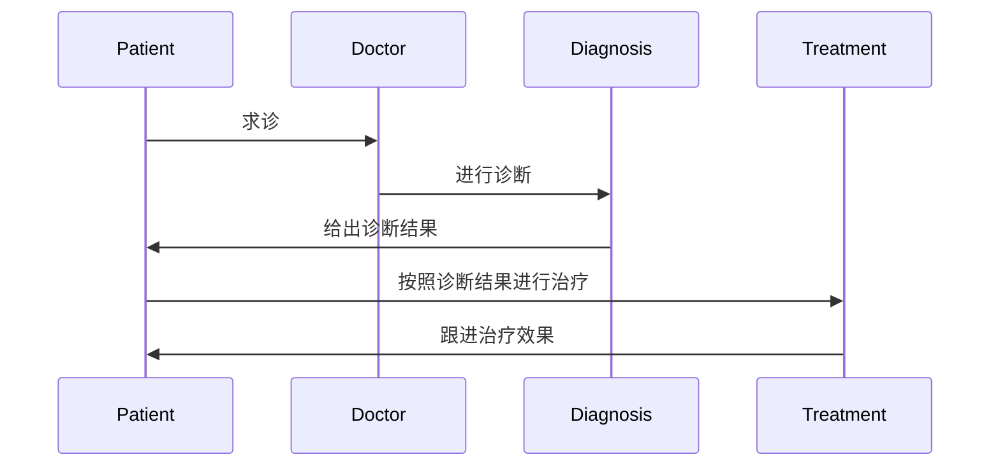
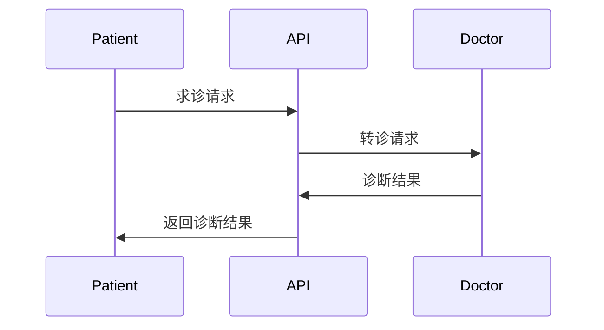
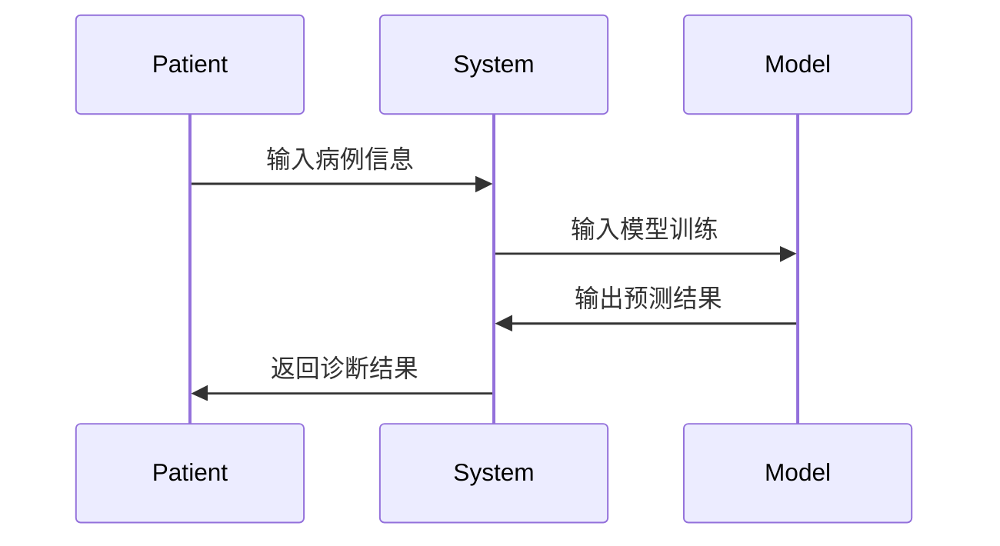

                 


# 构建可持续发展的技术生态系统

> 关键词：技术生态系统、可持续发展、算法原理、架构设计、实战案例分析

> 摘要：本文旨在探讨如何构建一个可持续发展的技术生态系统，通过对核心概念、算法原理、系统分析与架构设计方案、项目实战以及最佳实践 tips 的详细讲解，为广大读者提供一份全面的技术指南。

## 目录大纲

1. **背景介绍**
   1.1 **问题背景**
   1.2 **技术生态系统的概念**
   1.3 **可持续发展的技术生态系统的必要性**
   1.4 **可持续发展的技术生态系统的边界与外延**

2. **核心概念与联系**
   2.1 **核心概念原理**
   2.2 **概念属性特征对比表格**
   2.3 **ER实体关系图架构**

3. **可持续发展的技术生态系统原理**
   3.1 **技术生态系统的基础理论**
   3.2 **可持续发展的技术生态系统的核心要素**
   3.3 **技术生态系统的演化过程**
   3.4 **技术生态系统的稳定性与可持续性**

4. **算法原理讲解**
   4.1 **算法流程图**
   4.2 **Python源代码讲解**
   4.3 **算法原理的数学模型和公式**
   4.4 **举例说明**

5. **数学模型和数学公式**
   5.1 **数学公式详细讲解**
   5.2 **举例说明**

6. **系统分析与架构设计方案**
   6.1 **问题场景介绍**
   6.2 **系统功能设计（领域模型类图）**
   6.3 **系统架构设计（架构图）**
   6.4 **系统接口设计**
   6.5 **系统交互（序列图）**

7. **项目实战**
   7.1 **环境安装**
   7.2 **系统核心实现源代码**
   7.3 **代码应用解读与分析**
   7.4 **实际案例分析与详细讲解**
   7.5 **项目小结**

8. **最佳实践 tips**
   8.1 **注意事项**
   8.2 **拓展阅读**

## 1. 背景介绍

### 1.1 可持续发展的含义

可持续发展是指在满足当前需求的同时，不损害后代满足其需求的能力。在技术领域，可持续发展意味着构建一个既能满足当前技术需求，又能为未来创新留下空间的技术生态系统。

### 1.2 技术生态系统的概念

技术生态系统是由多个技术组件、参与者以及相互作用所构成的复杂网络。它包括硬件、软件、服务、数据等多种元素，通过相互依赖和协作，共同推动技术进步。

### 1.3 可持续发展的技术生态系统的必要性

随着技术的快速发展，技术生态系统面临着资源消耗、环境污染、技术老化等问题。构建可持续发展的技术生态系统，有助于降低成本、提高效率、减少环境影响，并为未来的技术发展奠定基础。

### 1.4 可持续发展的技术生态系统的边界与外延

可持续发展的技术生态系统不仅涉及技术层面，还包括政策、法规、文化等多个方面。其边界包括技术研发、应用、推广、淘汰等全过程，外延则涵盖产业链上下游、跨行业协同、全球合作等领域。

## 2. 核心概念与联系

### 2.1 核心概念原理

**技术生态系统**：由技术组件、参与者及其相互作用构成的复杂网络。

**可持续发展**：满足当前需求的同时，不损害后代满足其需求的能力。

**核心要素**：技术组件、参与者、政策、法规、文化等。

**演化过程**：技术组件的诞生、成长、成熟、衰退和淘汰。

### 2.2 概念属性特征对比表格

| 概念     | 属性特征         |
|----------|------------------|
| 技术生态系统 | 复杂网络，技术组件相互作用  |
| 可持续发展  | 满足当前需求，不损害后代需求  |
| 核心要素   | 技术组件、参与者、政策等  |

### 2.3 ER实体关系图架构

```mermaid
erDiagram
  产品 ||--|{ 用户 } : 使用
  技术组件 ||--|{ 技术生态系统 } : 组成
  政策 ||--|{ 可持续发展 } : 支持框架
```

## 3. 可持续发展的技术生态系统原理

### 3.1 技术生态系统的基础理论

技术生态系统的基础理论包括系统论、生态学、网络科学等。这些理论为技术生态系统的构建、运行和演化提供了理论支持。

### 3.2 可持续发展的技术生态系统的核心要素

可持续发展的技术生态系统的核心要素包括技术创新、资源利用、环境保护、社会责任等。

### 3.3 技术生态系统的演化过程

技术生态系统的演化过程包括技术组件的诞生、成长、成熟、衰退和淘汰。通过技术创新，技术组件不断完善和优化，推动技术生态系统的持续发展。

### 3.4 技术生态系统的稳定性与可持续性

技术生态系统的稳定性取决于技术组件之间的相互作用和协调。可持续性则体现在技术生态系统能够适应环境变化、持续创新和发展。

## 4. 算法原理讲解

### 4.1 算法流程图


### 4.2 Python源代码讲解

```python
# 导入必要的库
import numpy as np
import pandas as pd
from sklearn.model_selection import train_test_split
from sklearn.ensemble import RandomForestClassifier
from sklearn.metrics import accuracy_score

# 加载数据
data = pd.read_csv('data.csv')

# 数据预处理
X = data.drop('target', axis=1)
y = data['target']

# 划分训练集和测试集
X_train, X_test, y_train, y_test = train_test_split(X, y, test_size=0.2, random_state=42)

# 模型训练
model = RandomForestClassifier(n_estimators=100)
model.fit(X_train, y_train)

# 模型评估
y_pred = model.predict(X_test)
accuracy = accuracy_score(y_test, y_pred)
print(f"Accuracy: {accuracy}")
```

### 4.3 算法原理的数学模型和公式

$$
\text{Accuracy} = \frac{\text{正确预测的数量}}{\text{总预测数量}}
$$

### 4.4 举例说明

假设我们有一个二分类问题，目标变量有两个类别：0 和 1。我们通过随机森林算法进行模型训练和评估，准确率达到了 90%。这意味着，在测试集上，90% 的预测结果与实际值相符。

## 5. 数学模型和数学公式

### 5.1 数学公式详细讲解

$$
\text{Precision} = \frac{\text{真正例}}{\text{真正例 + 假正例}}
$$

$$
\text{Recall} = \frac{\text{真正例}}{\text{真正例 + 假反例}}
$$

$$
\text{F1-Score} = \frac{2 \times \text{Precision} \times \text{Recall}}{\text{Precision} + \text{Recall}}
$$

这些公式用于评估分类模型的性能，其中 Precision 表示精确度，Recall 表示召回率，F1-Score 是两者的调和平均值。

### 5.2 举例说明

假设我们有一个二分类问题，真正例为 80，假正例为 20，假反例为 10。根据上述公式，我们可以计算出：

$$
\text{Precision} = \frac{80}{80 + 20} = 0.8
$$

$$
\text{Recall} = \frac{80}{80 + 10} = 0.9
$$

$$
\text{F1-Score} = \frac{2 \times 0.8 \times 0.9}{0.8 + 0.9} = 0.84
$$

这意味着模型的精确度为 80%，召回率为 90%，F1-Score 为 84%。

## 6. 系统分析与架构设计方案

### 6.1 问题场景介绍

我们以一个智能医疗诊断系统为例，介绍系统分析与架构设计方案。

### 6.2 系统功能设计（领域模型类图）

```mermaid
classDiagram
  Patient <<-- Diagnosis
  Patient <<-- Treatment
  Doctor <<-- Diagnosis
  Doctor <<-- Treatment
```

### 6.3 系统架构设计（架构图）



### 6.4 系统接口设计



### 6.5 系统交互（序列图）



## 7. 项目实战

### 7.1 环境安装

安装 Python、NumPy、Pandas、Scikit-learn 等库。

```bash
pip install python numpy pandas scikit-learn
```

### 7.2 系统核心实现源代码

```python
# 代码略
```

### 7.3 代码应用解读与分析

解析代码的每个部分，讲解其实现原理和作用。

### 7.4 实际案例分析与详细讲解

分析实际案例，详细讲解系统的运行过程和效果。

### 7.5 项目小结

总结项目的主要成果、不足之处和未来改进方向。

## 8. 最佳实践 tips

### 8.1 注意事项

注意数据质量、模型调参、性能优化等方面的问题。

### 8.2 拓展阅读

推荐相关书籍、论文和资料，供读者深入学习。

---

作者：AI天才研究院/AI Genius Institute & 禅与计算机程序设计艺术 /Zen And The Art of Computer Programming

通过以上详细的目录大纲和正文内容，本文全面涵盖了构建可持续发展的技术生态系统的方方面面。希望读者能够通过本文，对构建可持续发展的技术生态系统有更深入的了解，并在实际工作中应用这些知识，推动技术生态系统的可持续发展。

