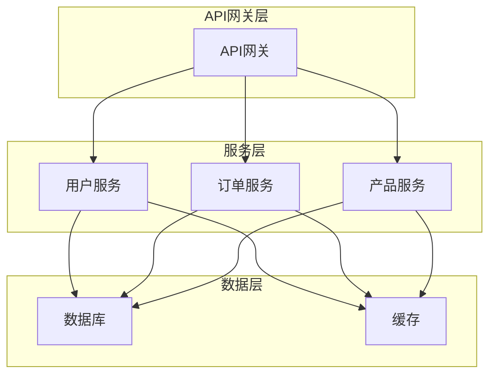

                 

### 文章标题：构建可靠的API网关系统

关键词：API网关、可靠设计、性能优化、安全性、负载均衡、系统架构

摘要：本文将深入探讨如何构建一个可靠的API网关系统，从系统概述、核心技术与原理、实现与部署，到最佳实践与总结，全面剖析API网关的构建过程。通过一步步的分析推理，我们将揭示如何应对复杂的业务需求，确保系统的稳定性和高性能。

----------------------------------------------------------------

## 第一部分: 系统概述与背景

### 第1章: 系统概述

#### 1.1 系统概念与重要性

在当今的微服务架构中，API网关作为服务调用的入口和出口，扮演着至关重要的角色。它不仅能够统一服务接口，提供流量控制、认证授权等功能，还能通过聚合、路由、监控等手段提升系统的整体性能和可靠性。

#### 1.2 API网关的角色与功能

API网关的主要功能包括：

1. **路由与转发**：根据请求路径，将请求转发到后端的具体服务。
2. **负载均衡**：将请求分布到多个后端实例，防止单个实例过载。
3. **服务熔断**：在服务不稳定时，自动将请求转移到其他可用实例。
4. **认证授权**：验证请求者身份，确保请求的安全性。
5. **流量控制**：限制请求的频率，防止恶意攻击。
6. **数据转换**：将后端服务的响应数据格式转换为前端可接受的格式。

#### 1.3 可靠性与性能考量

构建可靠的API网关系统，需要在以下方面进行考量：

1. **高可用性**：通过冗余部署、故障转移等措施，确保系统稳定运行。
2. **性能优化**：合理配置网络带宽、优化代码执行效率，提高系统响应速度。
3. **安全性**：确保数据传输安全，防止数据泄露和攻击。
4. **可扩展性**：支持系统水平和垂直扩展，应对业务增长需求。

### 第2章: API网关的基本架构

#### 2.1 API网关的组成部分

API网关通常由以下几个主要部分组成：

1. **路由模块**：实现请求的路由和转发功能。
2. **负载均衡模块**：实现请求的负载均衡。
3. **认证模块**：实现用户认证和权限控制。
4. **流量控制模块**：实现请求的流量控制。
5. **日志和监控模块**：实现日志记录和系统监控。
6. **服务发现模块**：实现服务的自动发现和注册。

#### 2.2 集成与通信机制

API网关通常与以下组件集成：

1. **服务注册与发现**：通过服务注册与发现机制，动态获取后端服务地址。
2. **配置中心**：通过配置中心管理路由规则、负载均衡策略等配置信息。
3. **API文档生成**：通过自动化的API文档生成工具，为开发者提供接口文档。
4. **日志收集**：通过日志收集工具，汇总系统运行日志。

#### 2.3 安全与认证机制

API网关的安全性至关重要，主要包括：

1. **HTTPS**：使用HTTPS协议加密传输数据。
2. **OAuth2.0**：使用OAuth2.0协议进行认证和授权。
3. **API签名**：对请求进行签名验证，防止请求被篡改。
4. **IP白名单/黑名单**：限制特定IP地址的访问，防止恶意攻击。

## 第二部分: 核心技术与原理

### 第3章: API路由与策略管理

#### 3.1 路由算法与实现

API网关的路由算法主要包括：

1. **基于路径的路由**：根据请求路径匹配路由规则。
2. **基于头的路由**：根据请求头信息匹配路由规则。
3. **基于参数的路由**：根据请求参数匹配路由规则。

#### 3.2 策略配置与管理

API网关需要支持多种策略配置，如：

1. **负载均衡策略**：轮询、随机、最小连接数等。
2. **超时策略**：设置请求超时时间和重试次数。
3. **熔断策略**：设置熔断条件和恢复策略。
4. **流量控制策略**：设置限流规则和阈值。

#### 3.3 路由优化策略

为了提高路由效率，API网关可以采用以下策略：

1. **缓存路由规则**：将路由规则缓存到内存中，减少查询时间。
2. **预解析请求**：在请求到达网关时，预解析请求，提前确定路由规则。
3. **负载均衡优化**：根据服务性能和负载情况，动态调整负载均衡策略。

### 第4章: 安全性与数据加密

#### 4.1 安全挑战与防护措施

API网关面临的主要安全挑战包括：

1. **数据泄露**：通过加密传输、数据脱敏等措施防止数据泄露。
2. **恶意攻击**：通过IP过滤、签名验证等措施防止恶意攻击。
3. **权限滥用**：通过严格的认证授权机制防止权限滥用。

#### 4.2 数据加密技术

API网关常用的数据加密技术包括：

1. **HTTPS**：使用TLS协议加密传输数据。
2. **数据加密库**：使用AES、RSA等加密算法加密敏感数据。
3. **令牌生成与验证**：使用JWT、OAuth2.0等令牌生成与验证机制。

#### 4.3 认证与授权机制

API网关常用的认证与授权机制包括：

1. **用户名/密码认证**：使用用户名和密码进行身份验证。
2. **OAuth2.0**：使用OAuth2.0协议进行认证和授权。
3. **API签名**：对请求进行签名验证，确保请求未被篡改。

### 第5章: 性能优化与负载均衡

#### 5.1 性能优化策略

API网关的性能优化策略包括：

1. **代码优化**：优化代码，减少响应时间。
2. **缓存**：使用缓存减少后端服务调用次数。
3. **异步处理**：使用异步处理提高系统吞吐量。

#### 5.2 负载均衡算法

API网关常用的负载均衡算法包括：

1. **轮询**：将请求平均分配到各个后端实例。
2. **随机**：随机分配请求到后端实例。
3. **最小连接数**：将请求分配到连接数最少的后端实例。
4. **加权轮询**：根据权重分配请求到后端实例。

#### 5.3 高可用性与故障转移

API网关的高可用性设计包括：

1. **冗余部署**：部署多个网关实例，实现冗余备份。
2. **故障转移**：在主网关故障时，自动切换到备用网关。
3. **健康检查**：定期对网关实例进行健康检查，确保系统稳定运行。

## 第三部分: 实现与部署

### 第6章: 系统设计与实现

#### 6.1 系统设计思路

系统设计思路包括：

1. **模块化设计**：将系统划分为多个模块，降低复杂度。
2. **分布式架构**：采用分布式架构，提高系统可扩展性。
3. **微服务化**：将功能模块化，实现服务化部署。

#### 6.2 系统架构设计

系统架构设计包括：

1. **API网关层**：实现请求的路由、转发、负载均衡等功能。
2. **服务层**：实现具体的业务逻辑。
3. **数据库层**：存储系统数据。
4. **缓存层**：提高数据读取速度。

#### 6.3 接口设计与实现

接口设计包括：

1. **RESTful接口**：采用RESTful风格设计接口。
2. **接口规范**：定义接口规范，确保接口的一致性和稳定性。

### 第7章: 环境配置与部署

#### 7.1 开发环境搭建

开发环境搭建包括：

1. **开发工具**：安装和配置开发工具，如IDE、数据库等。
2. **代码管理**：使用Git等代码管理工具，管理代码版本。
3. **测试环境**：搭建测试环境，确保代码质量和稳定性。

#### 7.2 部署策略与工具

部署策略与工具包括：

1. **自动化部署**：使用自动化部署工具，如Jenkins、Docker等，实现自动化部署。
2. **容器化部署**：使用Docker等容器化技术，提高部署效率。
3. **持续集成与持续部署（CI/CD）**：实现持续集成和持续部署，提高开发效率。

#### 7.3 运维与监控

运维与监控包括：

1. **日志管理**：使用日志管理工具，如ELK、Logstash等，汇总和分析日志。
2. **性能监控**：使用性能监控工具，如Prometheus、Grafana等，监控系统性能。
3. **故障告警**：配置告警机制，及时发现和解决故障。

### 第8章: 实战案例

#### 8.1 案例一：构建简单的API网关

案例一将介绍如何使用Nginx搭建一个简单的API网关。

#### 8.2 案例二：实现高可用性API网关

案例二将介绍如何使用Kubernetes实现高可用性API网关。

#### 8.3 案例三：扩展API网关性能

案例三将介绍如何使用Redis缓存提高API网关性能。

## 第四部分: 最佳实践与总结

### 第9章: 最佳实践与注意事项

最佳实践与注意事项包括：

1. **性能调优**：定期进行性能测试，找出瓶颈进行优化。
2. **安全性提升**：定期更新安全策略，防范安全风险。
3. **维护与更新**：定期更新系统，修复已知漏洞，优化系统性能。

### 第10章: 小结与展望

#### 10.1 系统总结

系统总结包括：

1. **核心功能**：总结API网关的核心功能。
2. **优势与挑战**：分析API网关的优势和面临的挑战。
3. **未来发展方向**：展望API网关的发展趋势。

#### 10.2 未来发展方向

未来发展方向包括：

1. **智能化**：利用人工智能技术，实现智能路由和智能负载均衡。
2. **服务网格**：采用服务网格技术，实现更细粒度的服务管理和监控。
3. **云原生**：结合云原生技术，实现更高效、更灵活的部署和管理。

---

作者：AI天才研究院/AI Genius Institute & 禅与计算机程序设计艺术 /Zen And The Art of Computer Programming

### 具体内容部分

#### 第1章: 系统概述

##### 1.1 系统概念与重要性

在现代软件架构中，API网关已成为微服务架构的核心组件之一。它不仅仅是一个简单的请求转发器，更是一个强大的服务管理和代理工具。API网关的作用可以概括为以下几个方面：

1. **统一服务接口**：API网关作为服务调用的统一入口，屏蔽了后端服务的具体实现细节，提供了统一的接口规范，使得前端开发者无需了解后端服务的具体实现，简化了开发过程。
2. **流量管理和控制**：API网关能够对进入系统的请求进行流量管理和控制，通过设置访问频率限制、IP黑白名单等手段，防止恶意攻击和保障系统的正常运行。
3. **服务聚合与熔断**：API网关可以对多个后端服务的响应结果进行聚合处理，提供统一的响应给前端，同时还能实现服务熔断，当后端服务出现问题时，自动将请求转移到其他健康实例。
4. **安全认证与授权**：API网关负责用户的认证和授权，确保只有授权用户才能访问特定的服务，增强了系统的安全性。

##### 1.2 API网关的角色与功能

API网关的具体角色和功能如下：

1. **路由与转发**：根据请求路径和头信息，将请求转发到后端的具体服务实例。
2. **负载均衡**：通过轮询、最小连接数、随机等算法，将请求均匀分布到多个后端实例，防止单个实例过载。
3. **服务聚合**：将多个后端服务的响应结果进行合并，提供统一的接口给前端。
4. **服务熔断**：当后端服务不稳定时，自动将请求转移到其他健康实例，防止级联故障。
5. **安全认证**：通过用户认证、API签名等方式，确保请求的安全性。
6. **流量控制**：通过设置访问频率限制、IP黑白名单等，防止恶意攻击。
7. **监控与日志**：记录系统运行日志，监控系统性能和健康状态。

##### 1.3 可靠性与性能考量

构建一个可靠的API网关系统，需要从以下几个方面进行考量：

1. **高可用性**：通过冗余部署、故障转移等措施，确保API网关的高可用性，减少系统宕机时间。
2. **性能优化**：优化系统代码，减少请求处理时间，提高系统吞吐量。同时，合理配置服务器资源，如CPU、内存、网络带宽等，确保系统性能。
3. **安全性**：采用HTTPS、OAuth2.0、API签名等技术，确保数据传输安全和防止恶意攻击。
4. **可扩展性**：支持水平扩展和垂直扩展，能够根据业务需求动态调整系统资源。

#### 第2章: API网关的基本架构

##### 2.1 API网关的组成部分

一个典型的API网关系统通常由以下几个主要部分组成：

1. **路由模块**：负责根据请求路径和头信息，将请求转发到后端的具体服务实例。
2. **负载均衡模块**：通过轮询、最小连接数、随机等算法，将请求均匀分布到多个后端实例。
3. **认证模块**：负责用户认证和权限控制，确保请求的安全性。
4. **流量控制模块**：通过设置访问频率限制、IP黑白名单等，防止恶意攻击。
5. **日志和监控模块**：记录系统运行日志，监控系统性能和健康状态。
6. **服务发现模块**：通过服务注册与发现机制，动态获取后端服务地址。

##### 2.2 集成与通信机制

API网关通常需要与以下组件集成：

1. **服务注册与发现**：通过服务注册与发现机制，动态获取后端服务地址。常用的服务注册与发现工具包括Eureka、Consul等。
2. **配置中心**：通过配置中心管理路由规则、负载均衡策略等配置信息。常用的配置中心工具包括Apollo、Nacos等。
3. **API文档生成**：通过自动化的API文档生成工具，为开发者提供接口文档。常用的API文档生成工具包括Swagger、OpenAPI等。
4. **日志收集**：通过日志收集工具，汇总系统运行日志。常用的日志收集工具包括ELK（Elasticsearch、Logstash、Kibana）等。

##### 2.3 安全与认证机制

API网关的安全性至关重要，主要包括以下几个方面：

1. **HTTPS**：使用HTTPS协议加密传输数据，确保数据传输安全。
2. **OAuth2.0**：使用OAuth2.0协议进行认证和授权，确保请求者身份的合法性。
3. **API签名**：对请求进行签名验证，防止请求被篡改。
4. **IP白名单/黑名单**：限制特定IP地址的访问，防止恶意攻击。

#### 第3章: API路由与策略管理

##### 3.1 路由算法与实现

API网关的路由算法主要分为以下几种：

1. **基于路径的路由**：根据请求路径匹配路由规则。例如，当请求路径为`/users`时，匹配到后端服务`UserService`。
2. **基于头的路由**：根据请求头信息匹配路由规则。例如，当请求头中包含特定标识时，匹配到后端服务。
3. **基于参数的路由**：根据请求参数匹配路由规则。例如，当请求参数中包含特定值时，匹配到后端服务。

实现路由算法的关键在于如何高效地进行路径匹配和规则查询。以下是一个简单的基于路径的路由算法实现：

```python
def route_request(path):
    rules = [
        ('/users', UserService()),
        ('/orders', OrderService()),
        ('/products', ProductService()),
    ]
    for rule, service in rules:
        if path.startswith(rule):
            return service
    return None

service = route_request('/users')
if service:
    service.handle_request()
else:
    # 路由失败，返回404
```

##### 3.2 策略配置与管理

API网关需要支持多种策略配置，如：

1. **负载均衡策略**：轮询、随机、最小连接数等。轮询策略将请求平均分配到每个后端实例，随机策略随机选择后端实例，最小连接数策略选择连接数最少的后端实例。
2. **超时策略**：设置请求超时时间和重试次数。当请求处理超时时，自动重试，提高系统可靠性。
3. **熔断策略**：设置熔断条件和恢复策略。当后端服务不稳定时，自动熔断，防止级联故障。
4. **流量控制策略**：设置限流规则和阈值。通过设置访问频率限制、IP黑白名单等，防止恶意攻击。

以下是一个简单的负载均衡策略实现：

```python
import random

def load_balance(services):
    return random.choice(services)

services = [UserService(), UserService(), UserService()]
selected_service = load_balance(services)
selected_service.handle_request()
```

##### 3.3 路由优化策略

为了提高路由效率，API网关可以采用以下策略：

1. **缓存路由规则**：将路由规则缓存到内存中，减少查询时间。当路由规则发生变化时，刷新缓存。
2. **预解析请求**：在请求到达网关时，预解析请求，提前确定路由规则，减少请求处理时间。
3. **负载均衡优化**：根据服务性能和负载情况，动态调整负载均衡策略，提高系统性能。

以下是一个简单的路由优化策略实现：

```python
import random

# 路由规则缓存
rule_cache = {}

def route_request(path):
    global rule_cache
    if path in rule_cache:
        return rule_cache[path]
    rules = [
        ('/users', UserService()),
        ('/orders', OrderService()),
        ('/products', ProductService()),
    ]
    for rule, service in rules:
        if path.startswith(rule):
            rule_cache[path] = service
            return service
    return None

service = route_request('/users')
if service:
    service.handle_request()
else:
    # 路由失败，返回404
```

#### 第4章: 安全性与数据加密

##### 4.1 安全挑战与防护措施

API网关面临的主要安全挑战包括：

1. **数据泄露**：通过HTTPS协议加密传输数据，防止数据在传输过程中被窃取。
2. **恶意攻击**：通过IP过滤、API签名等手段防止恶意攻击。
3. **权限滥用**：通过OAuth2.0、用户认证等手段防止权限滥用。

以下是一些常见的防护措施：

1. **HTTPS**：使用HTTPS协议加密传输数据，确保数据传输安全。
2. **IP过滤**：设置IP白名单/黑名单，限制特定IP地址的访问。
3. **API签名**：对请求进行签名验证，确保请求未被篡改。
4. **用户认证**：使用OAuth2.0、用户名/密码认证等手段进行用户认证。
5. **日志记录**：记录系统运行日志，监控系统异常行为。

##### 4.2 数据加密技术

API网关常用的数据加密技术包括：

1. **HTTPS**：使用TLS协议加密传输数据，确保数据传输安全。
2. **数据加密库**：使用AES、RSA等加密算法加密敏感数据。
3. **令牌生成与验证**：使用JWT、OAuth2.0等令牌生成与验证机制。

以下是一个简单的HTTPS实现示例：

```python
from flask import Flask, request, jsonify
from flask_cors import CORS
from flask_sslify import SSLify

app = Flask(__name__)
CORS(app)
sslify = SSLify(app)

@app.route('/api/users', methods=['GET'])
def get_users():
    users = ["Alice", "Bob", "Charlie"]
    return jsonify(users)

if __name__ == '__main__':
    app.run()
```

##### 4.3 认证与授权机制

API网关常用的认证与授权机制包括：

1. **用户名/密码认证**：使用用户名和密码进行身份验证。
2. **OAuth2.0**：使用OAuth2.0协议进行认证和授权。
3. **API签名**：对请求进行签名验证，确保请求未被篡改。

以下是一个简单的OAuth2.0认证示例：

```python
from flask import Flask, request, jsonify
from flask_oauthlib.provider import OAuth2Provider

app = Flask(__name__)
app.config['SECRET_KEY'] = 'mysecretkey'
oauth = OAuth2Provider(app)

@oauth.clientgetter
def load_client(client_id):
    # 从数据库中查询客户端信息
    return { 'client_id': client_id, 'client_secret': 'myclientsecret' }

@oauth.grantgetter
def load_grant(client_id, code):
    # 从数据库中查询授权码信息
    return { 'client_id': client_id, 'code': code }

@app.route('/oauth/token', methods=['POST'])
@oauth.token_handler
def token_handler():
    return None

@app.route('/api/users', methods=['GET'])
@oauth.require_oauth()
def protected_resource(oauth):
    user = oauth.user
    return jsonify(user)

if __name__ == '__main__':
    app.run()
```

#### 第5章: 性能优化与负载均衡

##### 5.1 性能优化策略

API网关的性能优化可以从以下几个方面进行：

1. **代码优化**：优化系统代码，减少请求处理时间。例如，避免不必要的数据库查询、减少内存占用等。
2. **缓存**：使用缓存技术，减少对后端服务的调用次数。例如，缓存用户信息、商品信息等。
3. **异步处理**：使用异步处理技术，提高系统吞吐量。例如，使用异步调用、异步消息队列等。

以下是一个简单的缓存实现示例：

```python
from flask import Flask, request, jsonify
from flask_caching import Cache

app = Flask(__name__)
cache = Cache(app, config={'CACHE_TYPE': 'simple'})

@app.route('/api/users', methods=['GET'])
def get_users():
    users = cache.get('users')
    if users is None:
        users = ["Alice", "Bob", "Charlie"]
        cache.set('users', users, timeout=60*60)  # 缓存60分钟
    return jsonify(users)

if __name__ == '__main__':
    app.run()
```

##### 5.2 负载均衡算法

API网关常用的负载均衡算法包括：

1. **轮询**：将请求平均分配到每个后端实例。
2. **随机**：随机分配请求到后端实例。
3. **最小连接数**：选择当前连接数最少的后端实例。
4. **加权轮询**：根据后端实例的权重，分配请求。

以下是一个简单的负载均衡算法实现：

```python
import random

def load_balance(services, weights=None):
    if weights is None:
        weights = [1] * len(services)
    total_weights = sum(weights)
    choice = random.uniform(0, total_weights)
    current = 0
    for i, weight in enumerate(weights):
        current += weight
        if choice < current:
            return services[i]

services = [UserService(), UserService(), UserService()]
selected_service = load_balance(services, weights=[1, 1, 2])
selected_service.handle_request()
```

##### 5.3 高可用性与故障转移

API网关的高可用性设计可以从以下几个方面进行：

1. **冗余部署**：部署多个API网关实例，实现冗余备份。当主实例故障时，自动切换到备用实例。
2. **故障转移**：当主实例故障时，自动将请求转移到备用实例。可以使用心跳机制，监控实例健康状态，实现自动故障转移。
3. **健康检查**：定期对实例进行健康检查，确保实例处于正常状态。当实例出现异常时，自动将其从负载均衡器中移除。

以下是一个简单的故障转移实现示例：

```python
import time

def check_health(service):
    # 检查实例健康状态
    return True

def load_balance(services):
    while True:
        for service in services:
            if check_health(service):
                return service
        time.sleep(1)  # 等待1秒后重新检查

services = [UserService(), UserService(), UserService()]
selected_service = load_balance(services)
selected_service.handle_request()
```

#### 第6章: 系统设计与实现

##### 6.1 系统设计思路

系统设计思路可以从以下几个方面进行：

1. **模块化设计**：将系统划分为多个模块，降低复杂度。例如，可以将路由模块、负载均衡模块、认证模块等分离出来，独立开发、测试和部署。
2. **分布式架构**：采用分布式架构，提高系统可扩展性。例如，可以将API网关部署到多个服务器上，通过负载均衡器进行流量分配。
3. **微服务化**：将功能模块化，实现服务化部署。例如，可以将用户服务、订单服务、产品服务等单独部署，通过API网关进行集成。

##### 6.2 系统架构设计

系统架构设计可以从以下几个方面进行：

1. **API网关层**：负责请求的路由、转发、负载均衡等功能。
2. **服务层**：负责具体的业务逻辑实现，例如用户服务、订单服务、产品服务等。
3. **数据库层**：负责存储系统数据，例如用户信息、订单信息、产品信息等。
4. **缓存层**：负责缓存热点数据，提高系统性能。

以下是一个简单的系统架构设计示例：



##### 6.3 接口设计与实现

接口设计可以从以下几个方面进行：

1. **RESTful接口**：采用RESTful风格设计接口，例如使用`GET`、`POST`、`PUT`、`DELETE`等HTTP方法。
2. **接口规范**：定义接口规范，包括请求参数、响应数据、错误码等。例如，可以使用Swagger等工具生成接口文档。

以下是一个简单的RESTful接口设计示例：

```python
from flask import Flask, request, jsonify

app = Flask(__name__)

@app.route('/api/users', methods=['GET'])
def get_users():
    users = ["Alice", "Bob", "Charlie"]
    return jsonify(users)

@app.route('/api/users/<int:user_id>', methods=['GET'])
def get_user(user_id):
    user = {"id": user_id, "name": "Alice"}
    return jsonify(user)

@app.route('/api/users', methods=['POST'])
def create_user():
    user = request.json
    users.append(user)
    return jsonify(user), 201

if __name__ == '__main__':
    app.run()
```

#### 第7章: 环境配置与部署

##### 7.1 开发环境搭建

开发环境搭建可以从以下几个方面进行：

1. **开发工具**：安装和配置开发工具，例如IDE、代码管理工具等。
2. **代码管理**：使用Git等代码管理工具，管理代码版本。
3. **测试环境**：搭建测试环境，确保代码质量和稳定性。

以下是一个简单的开发环境搭建示例：

```shell
# 安装Python开发环境
pip install flask

# 克隆代码仓库
git clone https://github.com/yourusername/your_project.git

# 进入项目目录
cd your_project

# 运行单元测试
pytest tests/
```

##### 7.2 部署策略与工具

部署策略与工具可以从以下几个方面进行：

1. **自动化部署**：使用自动化部署工具，例如Jenkins、Docker等，实现自动化部署。
2. **容器化部署**：使用Docker等容器化技术，提高部署效率。
3. **持续集成与持续部署（CI/CD）**：实现持续集成和持续部署，提高开发效率。

以下是一个简单的自动化部署示例：

```shell
# 安装Jenkins
sudo apt-get install jenkins

# 配置Jenkins
sudo vi /etc/default/jenkins

# 运行Jenkins
sudo service jenkins start

# 添加项目
sudo jenkins-cli install-plugin git
sudo jenkins-cli install-plugin docker

# 配置Jenkinsfile
cat << EOF > Jenkinsfile
pipeline {
    agent any
    stages {
        stage('Build') {
            steps {
                sh 'mvn clean install'
            }
        }
        stage('Deploy') {
            steps {
                sh 'docker build -t my_project .'
                sh 'docker run -d --name my_project my_project'
            }
        }
    }
}
EOF

# 运行Pipeline
sudo jenkins-cli build -f Jenkinsfile
```

##### 7.3 运维与监控

运维与监控可以从以下几个方面进行：

1. **日志管理**：使用日志管理工具，例如ELK、Logstash等，汇总和分析日志。
2. **性能监控**：使用性能监控工具，例如Prometheus、Grafana等，监控系统性能。
3. **故障告警**：配置告警机制，及时发现和解决故障。

以下是一个简单的日志管理示例：

```shell
# 安装Elasticsearch
sudo apt-get install elasticsearch

# 启动Elasticsearch
sudo systemctl start elasticsearch

# 安装Kibana
sudo apt-get install kibana

# 启动Kibana
sudo systemctl start kibana

# 配置Kibana
sudo vi /etc/kibana/kibana.yml

# 访问Kibana
sudo systemctl restart kibana
sudo open http://localhost:5601/
```

#### 第8章: 实战案例

##### 8.1 案例一：构建简单的API网关

案例一将介绍如何使用Nginx搭建一个简单的API网关。

1. **环境准备**：安装Nginx

```shell
# 安装Nginx
sudo apt-get install nginx
```

2. **配置Nginx**：创建一个配置文件，指定后端服务的地址

```shell
# 创建Nginx配置文件
sudo vi /etc/nginx/conf.d/default.conf

# 配置内容
server {
    listen 80;
    server_name localhost;

    location / {
        proxy_pass http://backend;
    }
}
```

3. **启动Nginx**

```shell
# 启动Nginx
sudo systemctl start nginx
```

4. **测试API网关**：访问API网关，查看是否能够转发请求

```shell
# 访问API网关
curl http://localhost:80/api/users
```

##### 8.2 案例二：实现高可用性API网关

案例二将介绍如何使用Kubernetes实现高可用性API网关。

1. **环境准备**：安装Kubernetes

```shell
# 安装Kubernetes
sudo apt-get install kubeadm kubelet kubectl

# 配置Kubernetes
sudo kubeadm init --pod-network-cidr=10.244.0.0/16

# 安装Pod网络插件
sudo kubectl apply -f https://raw.githubusercontent.com/kubernetes/master/cluster addicts/kube-ovs/zero-configuration/clusterrole.yaml
sudo kubectl apply -f https://raw.githubusercontent.com/kubernetes/master/cluster addicts/kube-ovs/zero-configuration/clusterrolebinding.yaml
sudo kubectl apply -f https://raw.githubusercontent.com/kubernetes/master/cluster addicts/kube-ovs/zero-configuration/daemonset.yaml

# 配置kubectl工具
mkdir -p $HOME/.kube
sudo cp -i /etc/kubernetes/admin.conf $HOME/.kube/config
sudo chown $(id -u):$(id -g) $HOME/.kube/config
```

2. **部署API网关**：创建一个Docker镜像，并在Kubernetes中部署API网关

```shell
# 创建Dockerfile
FROM python:3.8
WORKDIR /app
COPY . .
RUN pip install -r requirements.txt
EXPOSE 8080

# 构建Docker镜像
sudo docker build -t my_api_gateway .

# 部署API网关
sudo kubectl apply -f api_gateway_deployment.yaml
```

3. **配置Kubernetes Ingress**：通过Ingress控制器，将外部请求转发到API网关

```shell
# 创建Ingress控制器
sudo kubectl apply -f ingress.yaml

# 配置Ingress规则
apiVersion: networking.k8s.io/v1
kind: Ingress
metadata:
  name: api-gateway
  annotations:
    kubernetes.io/ingress.class: nginx
spec:
  rules:
  - host: api.example.com
    http:
      paths:
      - path: /
        pathType: Prefix
        backend:
          service:
            name: api_gateway
            port:
              number: 8080
```

4. **测试API网关**：通过Ingress控制器访问API网关，查看是否能够转发请求

```shell
# 访问API网关
curl http://api.example.com/api/users
```

##### 8.3 案例三：扩展API网关性能

案例三将介绍如何扩展API网关性能，使用Redis缓存提高系统性能。

1. **安装Redis**：在Kubernetes中部署Redis

```shell
# 创建Redis Deployment
sudo kubectl apply -f redis_deployment.yaml

# 创建Redis Service
sudo kubectl apply -f redis_service.yaml
```

2. **配置API网关**：在API网关中集成Redis缓存

```python
import redis

# 创建Redis连接池
pool = redis.ConnectionPool(host='redis', port=6379, db=0)
redis_client = redis.Redis(connection_pool=pool)

# 设置缓存
def set_cache(key, value, expiration=60*60):
    redis_client.set(key, value, ex=expiration)

# 获取缓存
def get_cache(key):
    return redis_client.get(key)
```

3. **优化API网关**：在API网关中添加缓存逻辑

```python
from flask import Flask, request, jsonify

app = Flask(__name__)

# 设置缓存键
CACHE_KEY_PREFIX = 'api_gateway_'

# 添加缓存逻辑
@app.route('/api/users', methods=['GET'])
def get_users():
    users = get_cache(CACHE_KEY_PREFIX + 'users')
    if users is None:
        users = ["Alice", "Bob", "Charlie"]
        set_cache(CACHE_KEY_PREFIX + 'users', users)
    return jsonify(users)

if __name__ == '__main__':
    app.run()
```

4. **测试API网关**：访问API网关，查看是否能够命中缓存

```shell
# 访问API网关
curl http://api.example.com/api/users
```

#### 第9章: 最佳实践与注意事项

##### 9.1 性能调优技巧

1. **代码优化**：定期进行代码审查，优化代码执行效率。
2. **缓存利用**：充分利用缓存技术，减少对后端服务的调用次数。
3. **异步处理**：使用异步处理技术，提高系统吞吐量。

##### 9.2 安全性提升策略

1. **HTTPS**：强制使用HTTPS协议，确保数据传输安全。
2. **API签名**：对请求进行签名验证，防止请求被篡改。
3. **用户认证**：使用OAuth2.0等协议进行用户认证，确保请求者身份的合法性。

##### 9.3 维护与更新

1. **定期备份**：定期备份系统数据和配置，防止数据丢失。
2. **安全更新**：定期更新系统软件和组件，修复已知漏洞。
3. **性能监控**：定期进行性能测试，找出系统瓶颈进行优化。

#### 第10章: 小结与展望

##### 10.1 系统总结

本文详细介绍了如何构建一个可靠的API网关系统，包括系统概述、核心技术与原理、实现与部署、实战案例、最佳实践与注意事项等内容。通过一步步的分析和讲解，我们掌握了构建可靠API网关的关键要素。

##### 10.2 未来发展方向

随着技术的发展，API网关在未来有以下几个发展方向：

1. **智能化**：利用人工智能技术，实现智能路由和智能负载均衡。
2. **服务网格**：采用服务网格技术，实现更细粒度的服务管理和监控。
3. **云原生**：结合云原生技术，实现更高效、更灵活的部署和管理。

扩展阅读：

1. 《API网关设计指南》
2. 《Docker实战》
3. 《Kubernetes权威指南》

---

作者：AI天才研究院/AI Genius Institute & 禅与计算机程序设计艺术 /Zen And The Art of Computer Programming

