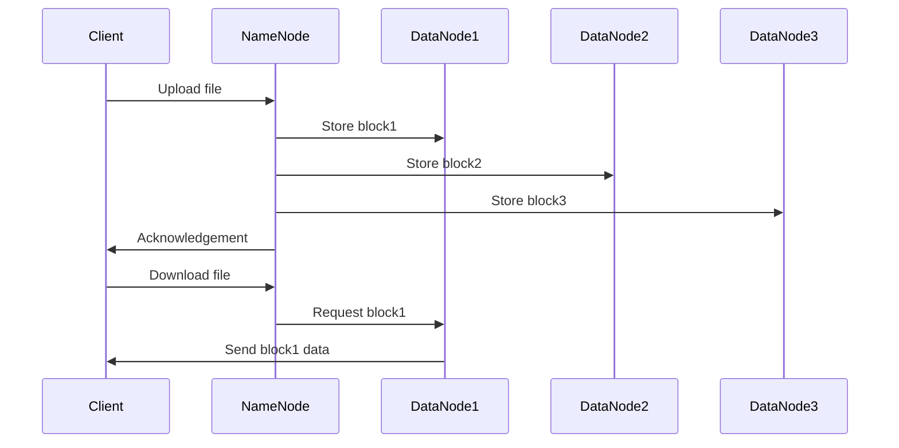
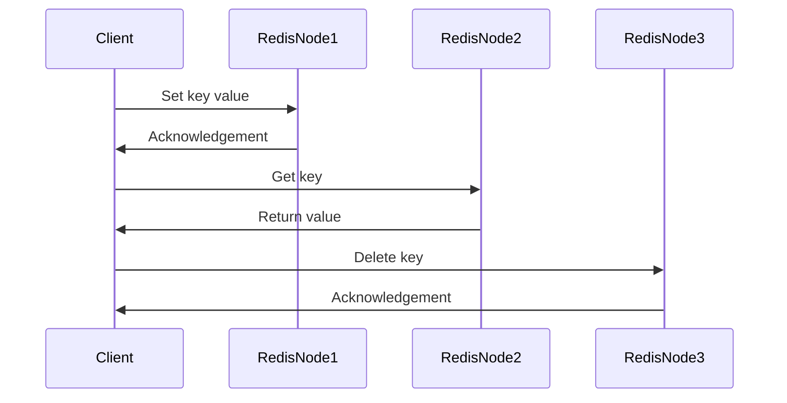
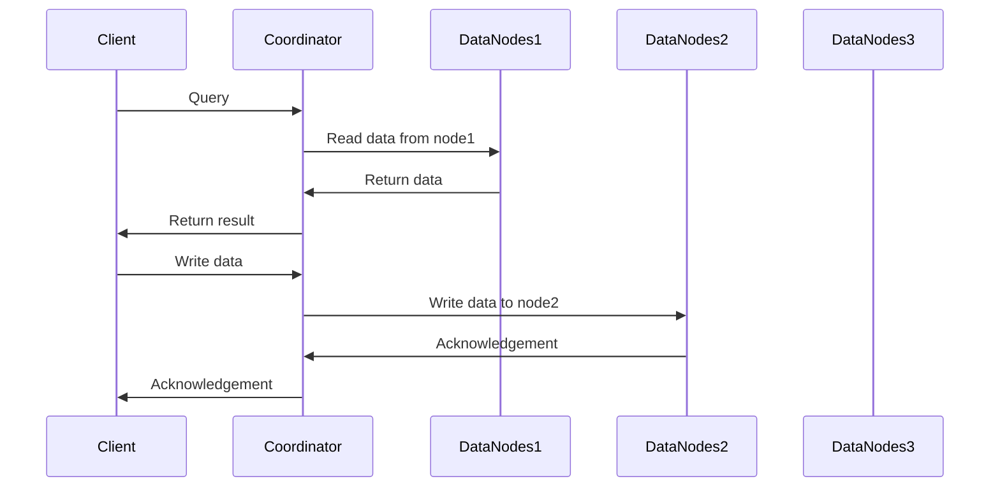

                 

### 构建可靠的分布式存储系统：问题背景与必要性

在当今大数据时代，随着数据量的急剧增长，传统的集中式存储系统已无法满足现代应用程序对存储性能、扩展性和可靠性的需求。分布式存储系统作为一种新兴的存储解决方案，以其高度的可扩展性、容错性和高效性，逐渐成为数据中心和云计算环境中的关键组成部分。构建一个可靠的分布式存储系统，不仅关系到数据的安全性和完整性，还直接影响着业务的连续性和用户体验。

首先，我们从问题背景入手，探讨分布式存储系统产生的必要性。随着互联网和移动互联网的快速发展，数据的产生速度和规模都在以惊人的速度增长。例如，每天上传到YouTube的视频时长就超过400小时，全球社交媒体平台用户每天产生的数据量更是难以计数。这种大规模数据的存储需求，单一的主机存储系统显然无法胜任。分布式存储系统通过将数据分散存储在多个节点上，可以有效应对数据量不断增长的压力，同时还能保证系统的稳定性和可靠性。

其次，我们来定义分布式存储系统。分布式存储系统是一种通过计算机网络连接多个存储节点，协同工作以提供数据存储、访问和管理服务的系统。它具有以下核心特点：

1. **数据分片（Sharding）**：将数据分散存储在多个节点上，以提高存储容量和访问效率。
2. **数据复制（Replication）**：通过在多个节点上复制数据副本，提高数据的可靠性和可用性。
3. **负载均衡（Load Balancing）**：将访问请求均匀地分布到各个节点上，以避免单点瓶颈。
4. **故障容错（Fault Tolerance）**：在个别节点发生故障时，系统能够自动切换到其他可用节点，确保服务不中断。

接下来，我们将回顾分布式存储系统的发展历程，从最初的简单分布式文件系统，如Google的GFS，到现代复杂的分布式存储系统，如HDFS、Cassandra和MongoDB，了解其技术演进和特点。

最后，我们探讨分布式存储系统的应用场景。这些系统不仅广泛应用于互联网公司，如社交媒体、电子商务和在线视频平台，还在企业级应用中发挥着关键作用，如金融交易、大数据分析和物联网设备数据存储等。通过构建一个可靠的分布式存储系统，企业能够更好地处理大规模数据，提高业务效率和竞争力。

综上所述，构建一个可靠的分布式存储系统不仅是应对当前数据增长挑战的必要手段，也是未来数据管理和存储技术的发展方向。接下来，我们将深入探讨分布式存储系统的核心概念、架构设计和关键技术，以帮助读者更好地理解和应用这一重要的技术。

### 分布式存储系统的核心概念

在深入探讨分布式存储系统之前，我们需要了解几个核心概念，这些概念不仅定义了分布式存储系统的基本功能，也决定了其性能和可靠性。以下是对数据分片机制、数据复制与一致性、负载均衡策略以及故障转移与恢复机制的详细解释。

#### 数据分片机制

数据分片是分布式存储系统的基石之一。其基本思想是将数据集划分为多个小块（称为分片），并存储在不同的物理节点上。这样做的目的是将数据访问和负载分布到多个节点，从而提高系统的扩展性和性能。

**分片策略**：

1. **哈希分片**：通过哈希函数将数据分配到不同的分片上。哈希分片具有均匀分布数据的特点，但可能面临哈希碰撞的问题。
2. **范围分片**：根据数据值的范围将数据划分为不同的分片。例如，可以根据时间戳、用户ID或地理位置来划分。
3. **列表分片**：将数据按照特定的顺序存储在各个分片上，适用于顺序访问模式。

**分片粒度**：

分片粒度是指每个分片包含的数据量大小。较大的分片粒度可以减少数据传输和同步的开销，但可能导致单点性能瓶颈。较小的分片粒度可以提高系统的并发性，但会增加管理的复杂性。

#### 数据复制与一致性

数据复制是分布式存储系统提高数据可靠性和可用性的重要手段。通过在多个节点上存储数据的多个副本，即使某些节点发生故障，系统仍然可以继续提供服务。

**复制策略**：

1. **主从复制**：其中一个节点作为主节点（Master），负责处理所有读写请求，其他节点作为从节点（Slave），仅作为主节点的副本。这种方式简单，但可能导致单点故障。
2. **多主复制**：所有节点都可以处理读写请求，并通过一致性协议（如Paxos或Raft）保持数据一致性。这种方式提高了系统的可用性，但增加了一致性的复杂性。
3. **多主多副本**：多个主节点和多个副本节点共同工作，通过一致性协议来保证数据的一致性。这种方式在性能和可用性方面都有较好的平衡。

**一致性模型**：

1. **强一致性**：所有节点在写入完成后都返回成功，确保数据全局一致。但可能导致暂时的不可用，因为某些节点可能在写入时不可达。
2. **最终一致性**：允许数据在一段时间内不一致，但最终会达到一致状态。这种方式在提高可用性的同时，牺牲了一部分一致性。

#### 负载均衡策略

负载均衡是将访问请求均匀地分布到各个节点上，以避免单点瓶颈和提高系统性能。负载均衡策略可以分为以下几种：

1. **基于IP地址的负载均衡**：根据客户端的IP地址将请求路由到不同的节点。适用于静态分配的情况。
2. **基于哈希的负载均衡**：根据请求的哈希值将请求路由到不同的节点。适用于动态分配的情况。
3. **基于轮询的负载均衡**：依次将请求路由到不同的节点。适用于简单场景。
4. **动态负载均衡**：根据节点的当前负载情况动态调整请求的路由。适用于复杂场景，如Kubernetes中的Pod调度。

#### 故障转移与恢复

故障转移与恢复是分布式存储系统在节点发生故障时保证服务不中断的关键机制。

**故障转移**：

1. **主节点故障转移**：当主节点发生故障时，选择一个健康的从节点作为新的主节点，继续提供服务。
2. **副本故障转移**：当副本节点发生故障时，选择一个新的副本节点，从原有的主节点复制数据。

**恢复机制**：

1. **自动恢复**：系统在检测到节点故障后自动执行故障转移和恢复操作，无需人工干预。
2. **人工干预**：在某些情况下，系统可能无法自动恢复，需要管理员手动介入。

**容错机制**：

1. **数据冗余**：通过复制和冗余存储来避免数据丢失。
2. **节点冗余**：在系统中部署多个节点，确保在个别节点故障时仍然有足够的资源提供服务。
3. **故障检测**：定期检测节点状态，及时发现故障并进行处理。

通过理解这些核心概念，我们可以更好地设计和实现一个高性能、高可靠的分布式存储系统。在接下来的章节中，我们将进一步探讨分布式存储系统的架构设计，深入分析其设计原则和具体实现方法。

### 分布式存储系统的架构设计

分布式存储系统的架构设计是确保其性能、可靠性和可扩展性的关键环节。一个合理的架构不仅能够提高系统的整体效率，还能有效地应对数据量的增长和复杂的业务需求。以下将从系统架构设计原则、数据层架构设计、控制层架构设计、系统监控与运维架构四个方面展开详细讨论。

#### 系统架构设计原则

1. **高可用性**：系统应能够自动处理节点故障，确保服务不中断。高可用性设计包括故障转移、冗余备份和自动恢复等机制。
2. **高性能**：系统应能够高效地处理大量数据访问请求，包括读写操作。高性能设计涉及负载均衡、数据分片和数据缓存等技术。
3. **可扩展性**：系统应能够灵活地增加或减少节点，以适应数据量的变化。可扩展性设计包括水平扩展和垂直扩展两种方式。
4. **易运维性**：系统应具备良好的监控和运维能力，便于管理员及时发现和处理问题。易运维性设计包括日志记录、告警机制和自动化运维工具等。

#### 数据层架构设计

数据层是分布式存储系统的核心，负责数据的存储、管理和访问。以下是数据层架构设计的关键组成部分：

1. **数据分片**：通过数据分片，将大量数据分散存储在不同的物理节点上。数据分片可以是基于哈希、范围或列表等策略。
2. **数据复制**：在多个节点上复制数据副本，以提高数据的可靠性和可用性。复制策略包括主从复制、多主复制和多主多副本等。
3. **数据存储介质**：选择合适的存储介质，如HDD、SSD或分布式文件系统，以平衡性能、成本和容量需求。
4. **数据一致性**：通过一致性协议（如Paxos或Raft）保证数据在不同副本之间的同步。一致性模型包括强一致性和最终一致性。

#### 控制层架构设计

控制层负责协调和管理分布式存储系统的各个节点，确保系统的高效运行。以下是控制层架构设计的关键组成部分：

1. **元数据管理**：元数据管理包括存储空间的分配、文件系统元数据的存储和管理等。常用的元数据管理技术有命名空间、目录树和数据块映射表等。
2. **调度与负载均衡**：调度器负责将访问请求路由到合适的节点上，负载均衡器则确保请求在各个节点之间均衡分配，避免单点瓶颈。
3. **故障检测与恢复**：通过定期检测节点的状态，及时发现故障并进行处理。故障检测包括心跳检测、故障监测和自动恢复等机制。
4. **配置管理**：配置管理负责管理节点的配置信息，如节点地址、端口、副本数量等。配置管理可以通过自动化工具实现，以提高运维效率。

#### 系统监控与运维架构

系统监控与运维架构是确保分布式存储系统稳定运行的重要保障。以下是系统监控与运维架构的关键组成部分：

1. **监控指标**：监控指标包括系统性能指标（如CPU利用率、内存使用率、磁盘读写速度等）、存储容量指标（如已用空间、可用空间等）和业务指标（如读写请求延迟、请求失败率等）。
2. **告警机制**：通过设置阈值，当监控指标超过预设的阈值时，系统会自动发送告警信息，通知运维人员进行处理。
3. **日志记录**：系统应具备良好的日志记录功能，记录系统运行过程中的重要事件和信息，以便进行故障分析和性能优化。
4. **自动化运维工具**：自动化运维工具可以自动执行部署、监控、故障检测和自动恢复等任务，提高运维效率。

通过以上对分布式存储系统架构设计的详细讨论，我们可以看出，一个合理的架构设计不仅需要考虑系统的性能、可靠性和可扩展性，还需要考虑运维管理的便捷性。在接下来的章节中，我们将深入探讨分布式存储系统的核心技术，包括分布式文件系统、分布式键值存储和分布式数据库等，进一步理解其实现原理和关键技术。

### 分布式文件系统

分布式文件系统是分布式存储系统中的一个重要组成部分，它通过将文件分散存储在多个节点上来提供高容量、高可用性和高性能的文件存储服务。以下将详细介绍分布式文件系统的定义、特点、主要架构以及在实际应用中的具体实现，以HDFS为例。

#### 定义与特点

**分布式文件系统**是一种将文件存储在分布式网络中的文件系统，它通过将文件拆分成多个数据块，并将这些数据块分散存储在多个节点上，从而提供高效的文件访问和管理功能。

**主要特点**：

1. **高可用性**：通过在多个节点上存储文件的副本，即使某些节点发生故障，系统仍然能够提供完整的文件服务。
2. **高扩展性**：分布式文件系统可以轻松地增加或减少存储节点，以适应数据量的增长和性能需求。
3. **高性能**：通过数据分片和负载均衡，分布式文件系统可以提供高效的文件访问速度，满足大数据处理的需求。
4. **高容错性**：分布式文件系统能够在个别节点发生故障时自动进行数据恢复，确保数据的一致性和完整性。

#### 主要架构

分布式文件系统的主要架构包括以下几个关键组件：

1. **NameNode**：NameNode是分布式文件系统的元数据管理节点，负责管理文件系统的命名空间、维护文件系统的目录树以及跟踪每个数据块的存储位置。NameNode保存了文件的元数据（如文件名、文件大小、数据块位置等），但通常不存储数据块本身。
2. **DataNode**：DataNode是分布式文件系统的数据存储节点，负责存储文件的数据块，并向客户端提供数据块的读写服务。每个DataNode在启动时向NameNode注册自己，并定期向NameNode发送心跳信号，以保持活性状态。
3. **数据块**：文件被拆分为多个固定大小的数据块（通常为128MB或256MB），这些数据块存储在多个DataNode上。通过数据分片和复制策略，分布式文件系统能够实现高效的数据访问和负载均衡。
4. **Secondary NameNode**：Secondary NameNode是NameNode的辅助节点，负责定期合并NameNode的编辑日志（edits），以减轻NameNode的负载，并备份元数据信息，以防止元数据丢失。

#### 实现与工作原理

**数据存储与复制**：

1. **数据存储**：当客户端上传一个文件时，文件会被切分成多个数据块，并分配到不同的DataNode上存储。NameNode负责维护数据块的存储位置和副本信息。
2. **数据复制**：为了提高数据的可靠性和可用性，分布式文件系统会在多个DataNode上存储每个数据块的副本。默认情况下，HDFS会为每个数据块创建三个副本，并存储在三个不同的节点上。

**数据访问**：

1. **读写请求**：客户端通过NameNode获取数据块的存储位置，然后直接与相应的DataNode进行数据块的读写操作。读写请求通常通过数据块的副本之一进行，以提高访问速度。
2. **负载均衡**：通过负载均衡策略，分布式文件系统会根据节点的当前负载情况，将新的数据块分配到负载较低的节点上，以避免单点瓶颈。

**故障处理**：

1. **副本同步**：当某个DataNode发生故障时，其他副本会继续提供服务。在故障恢复后，系统会启动副本同步过程，将故障节点的数据块复制到其他节点，以保持副本数量。
2. **数据恢复**：当某个数据块丢失时，系统会使用其他副本进行数据恢复。NameNode会从副本中选取一个健康的副本作为主副本，并通知其他副本进行数据同步。

#### HDFS架构与实现

**HDFS架构图**：

**HDFS实现原理**：

1. **数据存储**：客户端上传文件时，文件被切分为多个128MB的数据块。NameNode负责将数据块分配到不同的DataNode上存储，并维护数据块的元数据。
2. **数据复制**：在数据块写入过程中，HDFS会创建三个副本，并存储在三个不同的节点上，以提高数据的可靠性和可用性。
3. **数据访问**：客户端请求下载文件时，NameNode返回数据块的存储位置，客户端直接与数据块所在的DataNode进行数据块的读取操作。

通过以上对分布式文件系统的详细介绍，我们可以看到，分布式文件系统通过数据分片、数据复制和负载均衡等机制，实现了高可用性、高性能和可扩展性的文件存储服务。HDFS作为分布式文件系统的典型代表，其架构和实现为其他分布式存储系统提供了宝贵的经验和借鉴。

### 分布式键值存储

分布式键值存储是分布式存储系统中的重要组成部分，它通过将数据存储为键值对的形式，提供快速的数据访问和简单的数据操作。以下是关于分布式键值存储的定义、特点、主要架构以及实际应用中的一些流行系统，如Redis。

#### 定义与特点

**分布式键值存储**是一种将数据以键值对的形式存储和管理的分布式存储系统，它通过将键映射到值，并提供高效的读写操作，使得数据访问更加快捷和简便。

**主要特点**：

1. **高性能**：分布式键值存储通过内存存储和数据缓存，提供极快的读写性能，适用于实时数据处理和高速缓存场景。
2. **高可用性**：通过在多个节点上复制数据，分布式键值存储可以在个别节点故障时，仍然提供完整的存储服务。
3. **可扩展性**：分布式键值存储可以轻松地增加或减少存储节点，以适应数据量的增长和性能需求。
4. **简单性**：键值存储的数据结构简单，操作接口直观，易于使用和管理。

#### 主要架构

分布式键值存储的主要架构包括以下几个关键组件：

1. **节点（Node）**：节点是分布式键值存储的基本组成单元，负责存储一部分键值数据。每个节点通常包含数据存储和索引服务两部分。
2. **数据复制**：为了提高数据的可靠性和可用性，分布式键值存储会在多个节点上复制键值数据。常见的复制策略有主从复制、多主复制和多主多副本等。
3. **一致性协议**：一致性协议负责确保分布式键值存储在不同节点之间的一致性。例如，Redis使用的是强一致性模型，通过Gossip协议来维护节点状态和同步数据。
4. **负载均衡**：负载均衡负责将读写请求均匀地分布到各个节点上，以避免单点瓶颈和提高系统性能。Redis使用一致性哈希算法来实现负载均衡。

#### Redis架构与实现

**Redis架构图**：

**Redis实现原理**：

1. **数据存储**：Redis使用内存作为数据存储介质，将键值数据存储在内存中，并提供高效的读写操作。Redis中的键值对可以通过哈希表或跳表来实现。
2. **数据复制**：Redis支持主从复制，主节点（Master）负责处理所有读写请求，从节点（Slave）作为主节点的副本。从节点在初始化时会从主节点复制数据，并在后续通过同步机制保持数据一致性。
3. **一致性保证**：Redis使用Gossip协议来维护节点状态和同步数据。每个节点定期向其他节点发送心跳消息，以确认其状态和同步数据。
4. **负载均衡**：Redis使用一致性哈希算法来实现负载均衡，将新的读写请求路由到当前负载较低的节点上。

#### 数据复制与一致性

**数据复制策略**：

1. **主从复制**：主节点（Master）处理所有读写请求，从节点（Slave）作为主节点的副本。主节点会在数据写入后，通过同步机制将数据复制到从节点上。
2. **多主复制**：所有节点都可以处理读写请求，并通过一致性协议（如Gossip协议）来保证数据一致性。这种方式在提高可用性的同时，增加了系统的一致性复杂性。
3. **多主多副本**：多个主节点和多个副本节点共同工作，通过一致性协议来保证数据的一致性。这种方式在性能和可用性方面都有较好的平衡。

**一致性模型**：

1. **强一致性**：所有节点在写入完成后都返回成功，确保数据全局一致。但可能导致暂时的不可用，因为某些节点可能在写入时不可达。
2. **最终一致性**：允许数据在一段时间内不一致，但最终会达到一致状态。这种方式在提高可用性的同时，牺牲了一部分一致性。

通过以上对分布式键值存储的详细介绍，我们可以看到，分布式键值存储通过数据复制、一致性协议和负载均衡等机制，实现了高效、可靠和可扩展的数据存储服务。Redis作为分布式键值存储的典型代表，其架构和实现为其他分布式存储系统提供了宝贵的经验和借鉴。

### 分布式数据库

分布式数据库是现代分布式存储系统中的重要组成部分，它通过将数据分散存储在多个节点上，提供高扩展性、高可用性和高性能的数据存储服务。以下将详细介绍分布式数据库的定义、特点、主要架构以及在实际应用中的一些流行系统，如Cassandra。

#### 定义与特点

**分布式数据库**是一种将数据分散存储在多个节点上的数据库系统，它通过数据分片、数据复制和负载均衡等机制，提供高可用性、高性能和可扩展性的数据存储服务。

**主要特点**：

1. **高可用性**：通过在多个节点上复制数据，分布式数据库可以在个别节点故障时，仍然提供完整的数据库服务。
2. **高扩展性**：分布式数据库可以轻松地增加或减少存储节点，以适应数据量的增长和性能需求。
3. **高性能**：通过数据分片和负载均衡，分布式数据库可以提供高效的查询和写入性能，满足大数据处理的需求。
4. **高容错性**：分布式数据库能够在个别节点发生故障时，自动进行数据恢复，确保数据的一致性和完整性。

#### 主要架构

分布式数据库的主要架构包括以下几个关键组件：

1. **数据分片**：分布式数据库通过数据分片将大量数据分散存储在不同的节点上，以提高系统的性能和可扩展性。数据分片可以是基于哈希、范围或列表等策略。
2. **数据复制**：分布式数据库通过在多个节点上复制数据副本，提高数据的可靠性和可用性。复制策略包括主从复制、多主复制和多主多副本等。
3. **协调节点**：协调节点（Coordinator）负责协调分布式数据库中的数据分片和复制操作，确保数据的正确性和一致性。
4. **数据节点**：数据节点负责存储数据分片和副本，并向客户端提供数据查询和写入服务。数据节点通常通过一致性协议（如Paxos或Raft）与协调节点保持同步。

#### Cassandra架构与实现

**Cassandra架构图**：

**Cassandra实现原理**：

1. **数据存储**：Cassandra将数据存储在多个数据节点上，每个数据节点存储一部分数据分片和副本。Cassandra使用一个基于Gossip协议的分布式系统来管理节点状态和同步数据。
2. **数据分片**：Cassandra使用一致性哈希算法对数据进行分片，确保每个数据分片只存储在少数几个节点上，从而实现数据的负载均衡和容错性。
3. **数据复制**：Cassandra默认在每个数据分片上创建三个副本，并存储在三个不同的节点上。这可以提高数据的可靠性和可用性，确保在节点故障时，仍然能够提供完整的数据库服务。
4. **一致性保证**：Cassandra使用Quorum一致性模型来保证数据的一致性。当读取或写入操作需要多个副本时，Cassandra会从这些副本中选取一部分进行操作，以确保数据的一致性。

#### 数据复制与分区

**数据复制策略**：

1. **主从复制**：每个数据分片都有一个主副本和一个或多个从副本。主副本负责处理所有读写请求，从副本仅作为备份。这种方式简单，但可能导致单点故障。
2. **多主复制**：所有节点都可以处理读写请求，并通过一致性协议（如Paxos或Raft）来保证数据的一致性。这种方式提高了系统的可用性，但增加了系统的一致性复杂性。
3. **多主多副本**：多个主副本和多个从副本共同工作，通过一致性协议来保证数据的一致性。这种方式在性能和可用性方面都有较好的平衡。

**分区策略**：

1. **哈希分区**：通过哈希函数将数据分配到不同的分区中，以确保每个分区存储的数据量大致相同，从而实现负载均衡。
2. **范围分区**：根据数据值的范围将数据分配到不同的分区中，例如，根据时间戳、用户ID或地理位置进行分区。这种方式适用于特定的查询模式。

通过以上对分布式数据库的详细介绍，我们可以看到，分布式数据库通过数据分片、数据复制和一致性协议等机制，实现了高可用性、高性能和可扩展性的数据存储服务。Cassandra作为分布式数据库的典型代表，其架构和实现为其他分布式数据库系统提供了宝贵的经验和借鉴。

### 分布式存储系统性能优化

分布式存储系统的性能优化是确保系统能够高效、稳定地运行的重要环节。优化策略可以分为数据访问模式优化、系统容量与并发优化以及高可用性与容灾策略等几个方面。以下将详细探讨这些优化策略，并通过具体实例说明其应用。

#### 数据访问模式优化

数据访问模式优化主要针对系统的读写请求模式，通过调整数据结构、索引和缓存策略，提高数据访问速度。

**1. 数据索引**：

数据索引是提高数据查询效率的重要手段。通过建立索引，可以快速定位到所需数据，减少磁盘IO操作。例如，在Cassandra中，可以根据查询条件为表添加索引，提高查询速度。

**2. 缓存策略**：

缓存策略可以减少磁盘IO操作，提高数据访问速度。常见的缓存策略包括内存缓存和磁盘缓存。例如，Redis使用内存缓存，将常用数据存储在内存中，以减少磁盘访问。

**3. 数据分片与负载均衡**：

合理的数据分片和负载均衡策略可以避免单点瓶颈，提高系统性能。例如，在HDFS中，可以通过调整副本数量和副本放置策略，优化数据访问速度。

**实例**：

假设一个分布式存储系统需要处理大量图像数据的存储和检索。优化策略可以是：

- **数据索引**：为图像数据表添加关键字索引，如图像ID或分类标签。
- **内存缓存**：使用Redis将频繁访问的图像数据缓存到内存中。
- **数据分片**：根据图像分类进行数据分片，将相似图像存储在同一个分片上，减少跨分片的访问。

#### 系统容量与并发优化

系统容量与并发优化主要关注系统的存储容量和并发处理能力。

**1. 磁盘容量扩展**：

通过增加磁盘数量或更换更大容量的磁盘，可以扩展系统的存储容量。例如，在Cassandra中，可以动态添加新的数据节点，扩展系统容量。

**2. 并发处理能力**：

提高系统的并发处理能力可以通过增加节点数量、调整并发连接数和线程池大小等手段实现。例如，在Redis中，可以通过增加线程池大小，提高并发写入和读取的处理能力。

**实例**：

假设一个分布式存储系统需要支持大量的并发用户访问。优化策略可以是：

- **磁盘容量扩展**：增加SSD硬盘，提高系统存储性能。
- **并发连接优化**：增加Redis的并发连接数，提高并发写入和读取的性能。

#### 高可用性与容灾策略

高可用性与容灾策略是确保分布式存储系统在故障情况下能够快速恢复和数据不丢失的重要手段。

**1. 数据复制与副本放置**：

通过数据复制和副本放置策略，确保在节点故障时，仍然有其他副本提供服务。例如，在Cassandra中，可以设置多个副本，并选择不同的数据中心放置副本。

**2. 故障检测与恢复**：

定期检测节点状态，及时发现故障并进行处理。例如，在HDFS中，可以使用心跳机制检测节点的活性状态，并在节点故障时自动进行数据恢复。

**3. 容灾备份**：

通过容灾备份策略，确保在数据中心发生灾难时，仍然有备份数据可用。例如，可以采用异地备份策略，将数据备份到远程数据中心。

**实例**：

假设一个分布式存储系统需要保证高可用性和数据不丢失。优化策略可以是：

- **数据复制**：在每个数据中心设置多个副本，确保在单个数据中心故障时，仍然有副本可用。
- **故障检测**：使用心跳机制定期检测节点状态，并在节点故障时自动进行数据恢复。
- **容灾备份**：将数据备份到远程数据中心，确保在数据中心灾难时，备份数据仍然可用。

通过以上性能优化策略的应用，分布式存储系统可以在数据量增长和并发访问增加的情况下，保持高效、稳定地运行。这些策略不仅提高了系统的性能和可靠性，还增强了系统的扩展性和灵活性，为现代分布式存储系统的高效运行提供了有力保障。

### 分布式存储系统在企业级应用中的实践

分布式存储系统在企业级应用中的成功实施，不仅依赖于其技术原理和架构设计，还需要在具体的应用场景中，进行合理的架构设计、部署与运维。以下将通过一个企业级应用案例，详细介绍分布式存储系统的实际部署与运维过程。

#### 案例介绍

假设我们是一家大型电子商务公司，面临着快速增长的数据存储需求。随着用户数量的增加和业务规模的扩大，传统的集中式存储系统已无法满足我们的存储需求。为了确保数据的高可用性、可靠性和高性能，我们决定采用分布式存储系统，以应对数据存储和管理的挑战。

#### 架构设计

**1. 系统需求分析**：

在项目初期，我们首先进行了系统需求分析，明确了以下关键需求：

- **高可用性**：系统必须能够处理高并发的读写请求，确保业务的连续性和用户体验。
- **高可靠性**：系统需要具备容错能力，确保在节点故障时，仍然能够提供完整的数据服务。
- **高扩展性**：系统需要能够根据业务需求，灵活地扩展存储容量和性能。

**2. 架构设计**：

根据需求分析，我们设计了以下架构：

- **分布式文件系统**：我们选择使用HDFS作为分布式文件系统，将文件切分为多个数据块，存储在多个DataNode上，确保高效的数据存储和访问。
- **分布式数据库**：我们选择使用Cassandra作为分布式数据库，处理大规模的结构化和非结构化数据存储需求。
- **缓存层**：在HDFS和Cassandra之间，我们设置了Redis缓存层，用于加速数据访问，减少磁盘IO操作。
- **负载均衡器**：我们使用Nginx作为负载均衡器，将用户请求均匀分布到各个存储节点上，避免单点瓶颈。

**3. 系统架构图**：

#### 部署过程

**1. 环境准备**：

在部署分布式存储系统之前，我们首先准备了以下环境：

- **硬件资源**：配置了多个存储节点，包括DataNode、NameNode和Redis节点。
- **操作系统**：安装了Linux操作系统，并配置了必要的网络和存储驱动。
- **软件环境**：安装了HDFS、Cassandra、Redis和Nginx等分布式存储系统组件。

**2. 部署步骤**：

以下是部署过程中的关键步骤：

- **安装和配置HDFS**：在各个节点上安装HDFS，配置NameNode和DataNode，并初始化HDFS文件系统。
- **安装和配置Cassandra**：在多个节点上安装Cassandra，配置Cassandra集群，并进行数据同步。
- **安装和配置Redis**：在多个节点上安装Redis，配置Redis集群，并设置缓存策略。
- **安装和配置Nginx**：安装Nginx作为负载均衡器，配置Nginx反向代理，并将请求路由到各个存储节点。

#### 运维过程

**1. 监控与告警**：

为了确保系统稳定运行，我们使用了以下监控和告警工具：

- **Zabbix**：用于监控系统的CPU、内存、磁盘和网络等资源使用情况。
- **Prometheus**：用于监控Cassandra和Redis的性能指标，如请求延迟、响应时间和数据一致性等。
- **Alertmanager**：用于接收监控数据，并根据阈值发送告警通知。

**2. 故障处理**：

在系统运行过程中，我们制定了以下故障处理流程：

- **自动故障转移**：使用Cassandra的自动故障转移机制，在节点故障时，自动切换到其他可用节点。
- **数据恢复**：使用HDFS和Cassandra的副本机制，在节点故障时，自动从其他副本恢复数据。
- **人工干预**：在无法自动恢复的情况下，由运维人员手动进行故障处理，确保系统尽快恢复正常。

#### 性能监控与优化

**1. 性能监控**：

我们使用了以下工具对系统性能进行监控：

- **Grafana**：将Zabbix、Prometheus和Alertmanager的数据可视化，实时监控系统性能。
- **JMX**：通过JMX监控Java应用的性能指标，如垃圾回收时间和线程使用情况。

**2. 性能优化**：

根据监控数据，我们进行了以下性能优化：

- **调整副本数量**：根据数据访问模式和节点负载，调整Cassandra的副本数量，提高数据一致性。
- **缓存策略优化**：调整Redis的缓存策略，根据数据访问频率，优化缓存数据。
- **负载均衡优化**：根据节点负载情况，调整Nginx的负载均衡策略，确保请求均匀分布。

#### 项目小结

通过实际部署与运维，我们成功地实现了分布式存储系统的企业级应用，达到了以下目标：

- **高可用性**：系统在多个节点上存储数据，具备良好的容错能力，确保在节点故障时，仍能提供完整的数据服务。
- **高可靠性**：系统通过数据复制和副本机制，确保数据一致性和完整性，防止数据丢失。
- **高性能**：通过数据分片、负载均衡和缓存策略，提高了系统性能，满足了大规模数据存储和访问的需求。

总之，分布式存储系统在企业级应用中的成功实施，不仅需要合理的技术架构和部署策略，还需要有效的运维和监控机制，以确保系统的高效、稳定运行。通过本次项目的实践经验，我们积累了许多宝贵的经验，为未来类似项目的实施提供了参考。

### 分布式存储系统在开源社区中的发展

分布式存储系统在开源社区中有着广泛的关注和活跃的开发，众多优秀的开源项目不断涌现，推动着分布式存储技术的发展。本文将介绍几款主流的分布式存储系统，分析其社区发展与贡献，并探讨在项目选型与集成中的注意事项。

#### 主流开源分布式存储系统

**1. HDFS**

HDFS（Hadoop Distributed File System）是Apache Hadoop项目的核心组件之一，它是一个高可靠、高扩展性的分布式文件系统。HDFS通过将大文件切分成多个数据块，并存储在多个节点上，提供高效的数据存储和访问服务。

**2. Cassandra**

Cassandra是一个高度可扩展的分布式宽列存储数据库，由Apache Software Foundation维护。它支持大规模数据集的存储和查询，具有线性可扩展性、容错性和高性能特点，适用于实时数据处理和大规模数据存储场景。

**3. Redis**

Redis是一种基于内存的分布式键值存储系统，具有高性能、低延迟和丰富的数据结构支持。Redis广泛应用于缓存、实时消息处理和大数据计算等领域，以其高性能和灵活性受到开发者们的青睐。

**4. Ceph**

Ceph是一个分布式存储系统，由Red Hat维护。Ceph支持多种数据存储形式，如对象存储、块存储和文件系统，具有高可用性、高性能和可扩展性特点。Ceph适用于云存储、大数据分析和分布式文件存储场景。

**5. MongoDB**

MongoDB是一个开源的NoSQL数据库，由MongoDB Inc.维护。MongoDB提供灵活的数据模型、强大的查询能力和高扩展性，广泛应用于大数据处理、实时分析和移动应用开发等领域。

#### 社区发展与贡献

**1. HDFS**

HDFS社区由Apache Hadoop项目维护，拥有大量的贡献者和用户。社区定期发布新版本，修复漏洞、优化性能并增加新功能。HDFS社区积极参与各种技术会议和研讨会，分享经验并推动分布式存储技术的发展。

**2. Cassandra**

Cassandra社区由Apache Software Foundation维护，拥有庞大的贡献者和用户群体。社区成员来自多个国家和地区，共同致力于优化Cassandra的性能、可靠性和可扩展性。Cassandra社区定期组织会议、培训和研讨会，为开发者提供交流平台。

**3. Redis**

Redis社区由VMware公司维护，是一个高度活跃的社区。Redis社区不断推出新版本，增加新功能，并优化性能。社区成员积极参与技术讨论、文档编写和示例代码贡献。Redis社区还定期举办全球性的RedisConf会议，吸引众多开发者参加。

**4. Ceph**

Ceph社区由Red Hat公司主导，是一个多元化的社区，包括开源爱好者和企业贡献者。Ceph社区定期发布新版本，优化性能和功能，并积极参与开源项目的合作与整合。Ceph社区通过各种渠道，如邮件列表、GitHub和社区会议，保持活跃的交流与合作。

**5. MongoDB**

MongoDB社区由MongoDB Inc.维护，拥有庞大的开发者社区。社区成员通过GitHub、邮件列表和用户论坛等渠道进行技术交流和问题解决。MongoDB Inc.定期发布新版本，并根据社区反馈优化产品。此外，MongoDB社区还举办各种活动，如MongoDB World大会，为开发者提供交流和学习的机会。

#### 项目选型与集成

在分布式存储系统的选型与集成过程中，需要考虑以下注意事项：

**1. 数据访问模式**：

根据业务需求，选择适合的数据访问模式。例如，如果需要高效的事务处理，可以选择关系型数据库；如果需要灵活的非结构化数据存储，可以选择NoSQL数据库。

**2. 数据规模和性能要求**：

评估数据规模和性能要求，选择适合的存储系统。例如，对于大规模数据存储，可以选择Cassandra或Ceph；对于高性能缓存，可以选择Redis。

**3. 系统可用性和可靠性**：

考虑系统的可用性和可靠性需求，选择具备高可用性和容错能力的存储系统。例如，HDFS和Cassandra具有优秀的容错机制和副本策略。

**4. 社区和生态系统**：

选择具有活跃社区和丰富生态系统的存储系统，以便在遇到问题时获得及时的技术支持和资源。例如，HDFS、Cassandra和MongoDB等系统拥有庞大的社区和丰富的文档资源。

通过以上介绍，我们可以看到，分布式存储系统在开源社区中得到了广泛的发展和应用。选择合适的存储系统，并根据业务需求进行集成和优化，将有助于构建高性能、高可靠性和可扩展的分布式存储解决方案。

### 未来趋势与挑战

随着数据量和计算需求的持续增长，分布式存储系统面临着越来越多的挑战。本文将探讨分布式存储系统的发展趋势以及面临的挑战，并提出相应的解决方案。

#### 发展趋势

1. **边缘计算与分布式存储融合**：
   随着物联网（IoT）和5G技术的快速发展，越来越多的数据在边缘设备上生成。分布式存储系统需要与边缘计算架构紧密集成，以实现数据的实时处理和存储。例如，通过在边缘节点部署分布式存储系统，可以减少数据传输延迟，提高数据处理效率。

2. **区块链技术的应用**：
   区块链技术提供了分布式数据存储和验证机制，与分布式存储系统相结合，可以增强数据的安全性和透明性。未来，分布式存储系统可能会与区块链技术深度融合，实现数据存储的安全性和去中心化。

3. **人工智能与机器学习的集成**：
   人工智能和机器学习技术的发展为分布式存储系统带来了新的机遇。通过使用机器学习算法，可以优化数据存储策略、提高故障检测和恢复效率，甚至实现自动化的存储管理。

4. **数据保护与隐私**：
   随着数据隐私保护法规的日益严格，分布式存储系统需要在数据存储、传输和处理过程中，确保数据的安全性和隐私性。未来，分布式存储系统将加强对数据加密、访问控制和隐私保护技术的应用。

#### 面临的挑战

1. **数据一致性与可靠性**：
   分布式存储系统需要在数据复制、分片和负载均衡的过程中，确保数据的一致性和可靠性。在面临网络波动和节点故障时，如何快速恢复数据、保持一致性是一个重大挑战。

2. **性能瓶颈与优化**：
   随着数据量的增长，分布式存储系统需要处理越来越多的读写请求。如何在保证系统性能的同时，避免单点瓶颈和资源浪费，是一个重要的优化挑战。

3. **数据治理与合规**：
   随着数据隐私保护法规的加强，分布式存储系统需要确保数据治理和合规。如何在分布式环境中实施数据治理策略、确保数据的安全和合规性，是一个复杂的问题。

4. **系统可扩展性与灵活性**：
   随着业务需求的变化，分布式存储系统需要能够灵活扩展和调整。如何在保持系统性能和可靠性的同时，实现高效扩展，是一个持续面临的挑战。

#### 解决方案

1. **改进一致性协议**：
   通过改进一致性协议（如Raft、Paxos），提高分布式存储系统的数据一致性。例如，引入多版本并发控制（MVCC）机制，实现更高的一致性和并发性能。

2. **优化存储架构**：
   采用更先进的存储技术，如分布式对象存储、分布式文件系统和分布式数据库，提高存储性能和可扩展性。例如，通过使用SSD和NVMe等高速存储介质，减少数据访问延迟。

3. **加强数据治理**：
   通过建立完善的数据治理框架，确保分布式存储系统的数据安全、合规和可追溯。例如，采用数据分类、加密和访问控制技术，加强数据保护。

4. **利用机器学习和人工智能**：
   利用机器学习和人工智能技术，实现智能化的存储管理。例如，通过预测分析优化数据分片策略，提高存储效率；通过智能故障检测和恢复，提高系统的可靠性和可用性。

通过不断探索和解决未来面临的挑战，分布式存储系统将继续发展，为数据存储和管理提供更加高效、可靠和灵活的解决方案。

### 总结

本文全面探讨了构建可靠分布式存储系统的关键要素。从问题背景与必要性、核心概念、架构设计到关键技术，再到企业级应用案例与开源社区发展，我们系统地阐述了分布式存储系统的各个方面。通过深入分析，我们发现分布式存储系统的高可用性、高扩展性、高性能和数据一致性是其成功的关键。

首先，分布式存储系统应具备高可用性，通过数据复制和故障转移机制，确保在节点故障时，系统能够迅速恢复，不中断业务服务。其次，数据分片和负载均衡策略是提高系统性能和扩展性的关键。通过合理的数据分片和负载均衡，分布式存储系统能够处理海量数据访问，避免单点瓶颈。

在架构设计方面，我们需要关注数据层、控制层和监控与运维架构的设计原则。合理的数据层设计能够提高数据的存储和管理效率；控制层架构则负责协调和管理各个节点，确保系统的高效运行；监控与运维架构则是确保系统稳定运行的重要保障。

关键技术方面，分布式文件系统、分布式键值存储和分布式数据库等技术是分布式存储系统的核心组成部分。每种技术都有其独特的实现原理和优缺点，选择适合的技术栈是构建高效分布式存储系统的关键。

在实战应用中，企业级案例展示了分布式存储系统的部署与运维实践。通过合理的架构设计、部署策略和运维管理，分布式存储系统能够为企业提供高效、稳定和可扩展的数据存储服务。

开源社区的发展也为分布式存储系统提供了丰富的资源和经验。主流开源项目的社区活跃度和生态系统，为开发者提供了强大的支持。

展望未来，分布式存储系统将继续发展，面对边缘计算、区块链技术和人工智能等新趋势，分布式存储系统将变得更加智能和高效。然而，数据一致性与可靠性、性能优化、数据治理和系统扩展性等挑战，仍需要我们持续探索和解决。

通过本文的探讨，我们希望读者能够对分布式存储系统有更深入的理解，并能够在实际项目中灵活运用所学知识，构建高效可靠的分布式存储解决方案。

### 附录

#### 常见问题解答

1. **什么是数据分片？**
   数据分片是指将大量数据集划分为多个小块，并存储在不同的物理节点上。数据分片可以提升系统的扩展性、性能和容错能力。

2. **分布式存储系统如何确保数据一致性？**
   分布式存储系统通过一致性协议（如Raft、Paxos）来保证数据在不同副本之间的同步。一致性模型包括强一致性和最终一致性，根据实际需求选择合适的一致性策略。

3. **分布式数据库和关系型数据库有什么区别？**
   分布式数据库通过数据分片和复制机制提供高可用性和高性能，而关系型数据库则依赖于单一数据库实例。分布式数据库更适合处理大规模数据和高并发场景。

4. **如何优化分布式存储系统的性能？**
   可以通过优化数据分片策略、负载均衡和缓存机制来提升系统性能。此外，选择合适的存储介质（如SSD）和进行系统监控与调优也是重要手段。

#### 进一步阅读材料

1. **《大规模分布式存储系统设计》**：李雨泽 著，详细介绍了分布式存储系统的设计原则和实现技术。
2. **《分布式系统原理与范型》**：George Coulouris等 著，系统地阐述了分布式系统的基本原理和设计范型。
3. **《Redis实战：使用Redis进行高效数据存储和处理》**：NaperLazyass 著，介绍了Redis的使用场景和性能优化技巧。

#### 相关资源与工具

1. **HDFS官网**：[hadoop.apache.org/hdfs](http://hadoop.apache.org/hdfs)
2. **Cassandra官网**：[cassandra.apache.org](http://cassandra.apache.org)
3. **Redis官网**：[redis.io](http://redis.io)
4. **Ceph官网**：[ceph.com](http://ceph.com)
5. **MongoDB官网**：[mongodb.com](http://mongodb.com)

