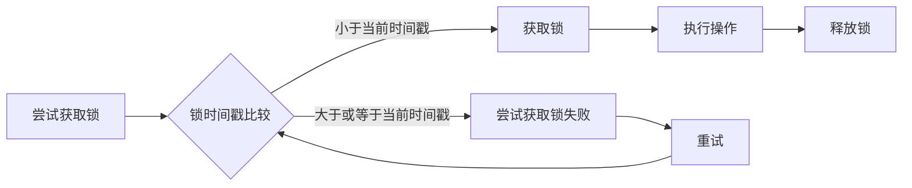
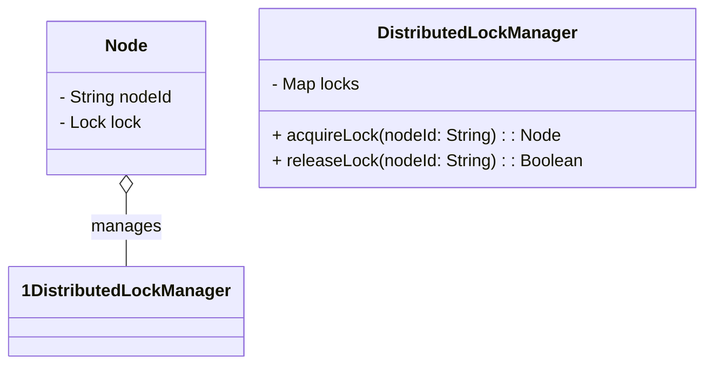
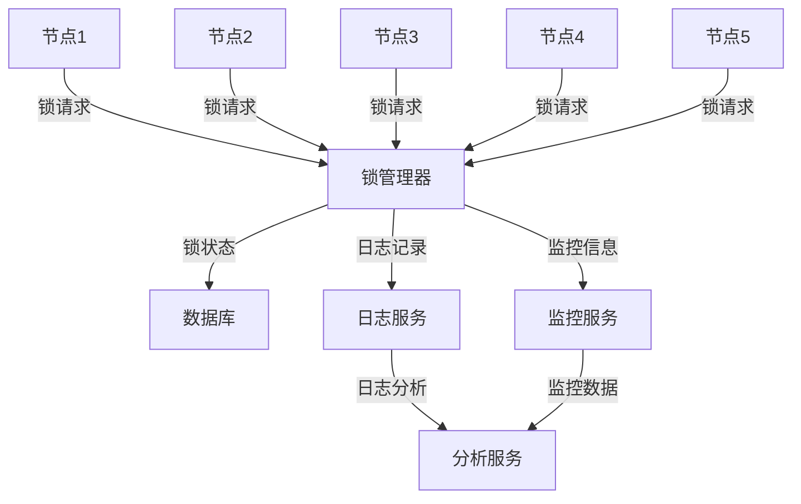
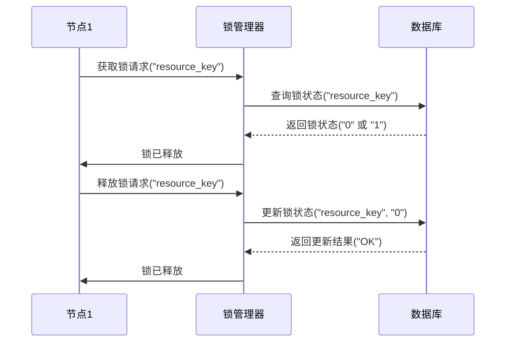

                 


### 1.1 分布式锁服务背景与需求

#### 1.1.1 分布式系统的挑战

在分布式系统中，各个节点独立运行，协同工作，共同完成系统任务。这种架构具有高可用性、可扩展性和容错性。然而，分布式系统也带来了一系列的挑战，其中之一就是如何保证数据的一致性和操作顺序。分布式锁（Distributed Lock）作为一种同步机制，旨在解决这些问题。

**分布式锁服务的概念**：分布式锁是一种在分布式环境中用于保证对某个资源进行独占访问的同步机制。它允许一个节点在锁定资源后，其他节点不能同时锁定同一资源，从而避免并发访问导致的数据不一致和资源冲突。

**分布式锁服务的需求**：
- **互斥性**：确保同一时间只有一个节点能访问被锁定的资源。
- **可重入性**：同一个节点可以多次获取同一个锁。
- **死锁避免**：避免多个节点因为相互等待而陷入死锁状态。
- **性能高效**：分布式锁服务应具备低延迟、高吞吐量的特点。
- **容错性**：即使某个节点或网络出现故障，分布式锁服务也应能够保持正常运行。

#### 1.1.2 分布式锁服务的概念

分布式锁服务的核心概念包括：
- **锁**：用于标识被锁定的资源。
- **锁机制**：保证分布式锁服务的正确性和性能。
- **锁管理器**：负责锁的创建、获取和释放。

#### 1.1.3 分布式锁服务的需求

为了构建可靠的分布式锁服务，需要考虑以下几个方面：

1. **数据一致性**：在分布式系统中，数据一致性是一个至关重要的需求。分布式锁服务应确保在并发操作下，数据不会被破坏或产生不一致。
2. **锁粒度**：锁的粒度大小会影响系统的性能。过细的锁粒度会导致频繁的锁争用，而过粗的锁粒度则会降低系统的并发性能。
3. **锁的实现**：分布式锁的实现方式有很多，如基于数据库、基于缓存、基于时间戳等。需要根据实际情况选择合适的实现方式。
4. **容错性**：在分布式系统中，节点故障和网络中断是常态。分布式锁服务需要具备容错能力，确保在节点或网络故障时，系统能够继续运行。

### 结论

构建可靠的分布式锁服务是分布式系统设计中的关键一环。通过分析分布式系统的挑战和分布式锁服务的需求，我们明确了构建分布式锁服务的重要性。在接下来的章节中，我们将深入探讨分布式锁算法原理、系统设计、项目实战等内容，帮助读者全面理解分布式锁服务的构建方法和最佳实践。

---

以上内容为第一部分的第一小节，详细介绍了分布式锁服务的背景、需求和核心概念。接下来，我们将继续分析分布式锁服务的核心概念和关系，为构建可靠的分布式锁服务奠定基础。在下一小节中，我们将讨论分布式锁服务的核心概念及其属性特征对比表格，并通过ER实体关系图来展示分布式锁服务的架构。

---

**待续...**### 1.2 核心概念与关系

在构建可靠的分布式锁服务过程中，理解核心概念及其相互关系至关重要。这一部分将详细探讨分布式锁服务的核心概念，并通过属性特征对比表格和ER实体关系图来展示它们之间的关系。

#### 1.2.1 分布式锁服务的核心概念

**1. 锁（Lock）**

锁是分布式锁服务的核心抽象，用于表示对资源的独占访问权限。锁通常具有以下属性：

- **持有者**：持有锁的节点。
- **持有时间**：锁被持有的持续时间。
- **锁状态**：锁的当前状态（锁定/释放）。

**2. 锁机制（Lock Mechanism）**

锁机制是实现分布式锁服务的关键技术。常见的锁机制包括：

- **基于数据库的锁机制**：利用数据库中的锁来实现分布式锁。
- **基于缓存的锁机制**：利用缓存系统的特性来实现分布式锁。
- **基于时间戳的锁机制**：使用时间戳来决定锁的获取顺序。

**3. 锁管理器（Lock Manager）**

锁管理器是负责锁的创建、获取和释放的组件。锁管理器通常具有以下功能：

- **创建锁**：初始化锁对象。
- **获取锁**：尝试获取锁。
- **释放锁**：释放锁。

**4. 分布式锁协议**

分布式锁协议是分布式锁服务的实现规范。常见的分布式锁协议包括：

- **Paxos算法**：用于达成一致性协议。
- **Raft算法**：用于达成一致性协议。
- **Zookeeper**：提供分布式协调服务和锁服务。

#### 1.2.2 分布式锁服务属性特征对比表格

下表展示了不同分布式锁服务的属性特征对比：

| 属性特征       | 基于数据库的锁          | 基于缓存的锁          | 基于时间戳的锁         |
|----------------|------------------------|------------------------|------------------------|
| **互斥性**       | 较高                   | 较高                   | 较高                   |
| **可重入性**       | 较高                   | 较高                   | 较高                   |
| **死锁避免**       | 较复杂                 | 较复杂                 | 较简单                 |
| **性能**          | 较高                   | 较高                   | 较低                   |
| **容错性**        | 较高                   | 较低                   | 较高                   |
| **实现复杂性**     | 较高                   | 较高                   | 较低                   |

#### 1.2.3 分布式锁服务的ER实体关系图

为了更清晰地展示分布式锁服务的核心概念和关系，我们可以使用ER（实体关系）图来描述。以下是一个简化的ER图，展示了锁、锁机制和锁管理器之间的关系：

```
锁
├── 锁机制
│   ├── 基于数据库的锁机制
│   │   └── 数据库锁对象
│   ├── 基于缓存的锁机制
│   │   └── 缓存锁对象
│   └── 基于时间戳的锁机制
│       └── 时间戳锁对象
└── 锁管理器
    └── 锁管理逻辑
```

### 结论

通过上述分析，我们明确了分布式锁服务的核心概念及其相互关系。了解这些核心概念和关系有助于我们更好地设计和实现可靠的分布式锁服务。在下一部分中，我们将深入探讨分布式锁算法的原理，并通过Mermaid流程图和Python源代码来详细解释这些算法。

---

**待续...**### 2.1 基本算法介绍

在分布式锁服务的设计中，选择合适的算法是实现其可靠性的关键。本节将介绍三种常见的分布式锁算法：基于数据库的分布式锁、基于缓存系统的分布式锁和基于时间戳的分布式锁。我们将分别讨论这些算法的基本原理、优缺点和适用场景。

#### 2.1.1 基于数据库的分布式锁

**原理**：

基于数据库的分布式锁利用数据库中的锁机制来实现。例如，使用MySQL的`SELECT FOR UPDATE`语句，可以锁定对应的数据库记录，从而实现对资源的独占访问。

**优点**：

- **可靠性高**：基于数据库的锁机制通常由数据库系统提供，具有较好的可靠性和一致性保证。
- **易于理解**：使用常见的数据库操作即可实现分布式锁，开发者较为熟悉。

**缺点**：

- **性能较低**：数据库操作通常需要跨网络通信，导致锁的获取和释放速度较慢。
- **锁粒度较粗**：基于数据库的锁通常作用于整个数据库表，锁粒度较粗，可能导致系统的并发性能下降。

**适用场景**：

- **对一致性要求较高的场景**：例如，金融系统中的账户操作。
- **数据库本身提供分布式锁机制的场景**：如使用MySQL的`SELECT FOR UPDATE`。

#### 2.1.2 基于缓存系统的分布式锁

**原理**：

基于缓存系统的分布式锁利用缓存系统的特性来实现。例如，可以使用Redis的`SETNX`命令，如果键不存在，则设置键的值为指定的字符串，并返回1；如果键已经存在，则返回0。

**优点**：

- **性能较高**：缓存系统通常位于内存中，读写速度非常快，适合高并发场景。
- **锁粒度较细**：基于缓存的锁可以作用于更细的粒度，如单个键或对象。

**缺点**：

- **可靠性较低**：缓存系统可能会出现故障，导致锁的丢失或无法正常释放。
- **缓存一致性**：缓存系统与数据库之间的数据一致性可能无法得到保证。

**适用场景**：

- **对性能要求较高的场景**：例如，电商系统中的商品库存管理。
- **缓存系统支持分布式锁的场景**：如使用Redis的`SETNX`命令。

#### 2.1.3 基于时间戳的分布式锁

**原理**：

基于时间戳的分布式锁通过比较时间戳来实现锁的获取。例如，节点A首先获取当前时间戳`t1`，然后尝试设置锁为`t1`。其他节点在获取锁时，会检查锁的时间戳，如果小于`t1`，则尝试获取锁。

**优点**：

- **简单易实现**：基于时间戳的锁算法相对简单，易于理解和实现。
- **无中心依赖**：基于时间戳的锁不需要依赖任何中心化的锁管理器，具有良好的容错性。

**缺点**：

- **可靠性较低**：时间戳比较容易受到网络延迟和时钟偏差的影响。
- **锁续期问题**：长时间运行的锁可能需要定期续期，否则可能会导致其他节点无法获取锁。

**适用场景**：

- **对可靠性要求不高的场景**：例如，一些非关键业务系统的并发控制。
- **简单分布式锁实现**：如用于一些简单的分布式任务调度。

### 总结

基于数据库的分布式锁、基于缓存系统的分布式锁和基于时间戳的分布式锁各有优缺点，适用于不同的场景。在分布式锁服务的设计中，需要根据实际需求选择合适的算法。接下来，我们将通过Mermaid流程图和Python源代码来详细解释基于时间戳的分布式锁算法，帮助读者更好地理解和实现这一算法。

---

**待续...**### 2.2 算法原理与Mermaid流程图

在上一节中，我们介绍了基于时间戳的分布式锁算法的基本原理。本节将详细解释这一算法的工作机制，并使用Mermaid流程图和Python源代码来展示和阐述其具体实现。

#### 2.2.1 分布式锁算法原理

基于时间戳的分布式锁算法通过比较时间戳来实现锁的获取和释放。具体步骤如下：

1. **尝试获取锁**：节点A在尝试获取锁时，首先获取当前系统时间戳`t1`，然后尝试设置锁的值为`t1`。
2. **检查锁状态**：其他节点在获取锁时，会检查锁的时间戳。如果锁的时间戳小于当前节点的时间戳，则尝试获取锁。
3. **锁续期**：长时间运行的锁可能需要定期续期，以确保其他节点可以正确获取锁。
4. **释放锁**：当锁不再需要时，节点释放锁，并将锁的时间戳设置为0。

#### 2.2.2 Mermaid流程图展示

为了更直观地展示基于时间戳的分布式锁算法，我们可以使用Mermaid流程图来描述其工作流程。以下是一个简化的Mermaid流程图：



在这个流程图中，节点A尝试获取锁，然后通过比较锁的时间戳来决定是否获取成功。如果获取成功，节点将执行操作，并在操作完成后释放锁。如果获取失败，节点将重试获取锁。

#### 2.2.3 Python源代码实现与详细讲解

下面是使用Python实现的基于时间戳的分布式锁算法的示例代码。我们将使用Python的`time`模块来获取系统时间戳，并使用Redis作为锁的存储介质。

```python
import time
import redis
import threading

# 初始化Redis客户端
redis_client = redis.StrictRedis(host='localhost', port=6379, db=0)

# 分布式锁类
class DistributedLock:
    def __init__(self, lock_key, expire=10):
        self.lock_key = lock_key
        self.expire = expire

    def acquire_lock(self):
        # 获取当前时间戳
        current_time = int(time.time())
        # 尝试获取锁
        if redis_client.setnx(self.lock_key, current_time):
            # 设置锁过期时间
            redis_client.expire(self.lock_key, self.expire)
            return True
        else:
            # 锁已被占用，尝试获取锁失败
            return False

    def release_lock(self):
        # 释放锁
        redis_client.delete(self.lock_key)

# 测试分布式锁
def test_lock():
    lock_key = 'my_lock'
    lock = DistributedLock(lock_key, expire=10)
    
    # 尝试获取锁
    if lock.acquire_lock():
        print("获取锁成功，执行操作...")
        time.sleep(5)  # 模拟执行操作
        lock.release_lock()
        print("锁已释放")
    else:
        print("获取锁失败，请重试")

# 创建线程
thread1 = threading.Thread(target=test_lock)
thread2 = threading.Thread(target=test_lock)

# 启动线程
thread1.start()
thread2.start()

# 等待线程结束
thread1.join()
thread2.join()
```

**详细讲解**：

1. **初始化Redis客户端**：我们使用Redis作为锁的存储介质，因为它具有高性能、高可靠性且易于实现分布式锁。

2. **分布式锁类**：`DistributedLock`类用于封装分布式锁的功能。`__init__`方法初始化锁键和锁过期时间。

3. **尝试获取锁**：`acquire_lock`方法尝试获取锁。首先获取当前时间戳，然后使用Redis的`setnx`命令设置锁键的值为时间戳。如果设置成功（即锁未被占用），则设置锁的过期时间。

4. **释放锁**：`release_lock`方法用于释放锁，通过删除锁键来实现。

5. **测试分布式锁**：`test_lock`函数用于测试分布式锁的功能。首先尝试获取锁，如果成功，则执行操作并释放锁。如果获取锁失败，则打印错误信息。

6. **创建线程**：我们创建两个线程，模拟多个节点尝试获取同一锁的场景。

7. **启动线程**：启动线程并等待线程结束。

通过这个示例代码，我们可以看到如何使用Python实现基于时间戳的分布式锁。在实际应用中，可以根据具体需求对代码进行适当修改和优化。

### 结论

通过详细讲解和示例代码，我们了解了基于时间戳的分布式锁算法的工作原理和实现方法。接下来，我们将继续探讨分布式锁算法的数学模型和公式，为深入理解分布式锁服务提供理论支持。

---

**待续...**### 2.3 数学模型和公式

在深入探讨分布式锁服务的过程中，理解其背后的数学模型和公式对于分析和优化锁性能至关重要。本节将介绍分布式锁服务的数学模型，包括关键公式和它们的应用场景。

#### 2.3.1 数学模型介绍

分布式锁服务的数学模型主要涉及以下几个方面：

1. **时间戳模型**：基于时间戳的锁算法通常使用时间戳来管理锁的状态。时间戳模型包括时间戳的产生、比较和更新。
2. **概率模型**：在锁争用场景中，节点获取锁的概率是关键参数。概率模型可以用来分析和预测锁的性能。
3. **性能模型**：分布式锁服务的性能包括响应时间、吞吐量和锁争用率等指标。性能模型可以帮助我们评估不同锁算法的优劣。

#### 2.3.2 公式解释

以下是分布式锁服务中常用的数学公式及其解释：

1. **时间戳比较公式**：

   $$ t_{current} > t_{lock} $$

   其中，`$t_{current}$` 表示当前时间戳，`$t_{lock}$` 表示锁的时间戳。这个公式用于比较时间戳，判断锁是否可以被获取。

2. **锁获取概率公式**：

   $$ P_{acquire} = \frac{1}{N} $$

   其中，`$P_{acquire}$` 表示节点获取锁的概率，`$N$` 表示系统中尝试获取锁的节点数量。这个公式表明，在均匀分布的锁争用场景中，每个节点获取锁的概率相等。

3. **锁续期公式**：

   $$ t_{renew} = t_{current} + \Delta t $$

   其中，`$t_{renew}$` 表示锁续期后的时间戳，`$\Delta t$` 表示锁的过期时间。这个公式用于计算锁续期后的时间戳。

4. **锁释放公式**：

   $$ t_{release} = t_{current} + \Delta t $$

   其中，`$t_{release}$` 表示锁释放后的时间戳，`$\Delta t$` 表示锁的持有时间。这个公式用于计算锁释放后的时间戳。

#### 2.3.3 举例说明

以下是一个具体的例子，用于说明如何使用数学模型来分析和优化分布式锁服务：

**场景**：假设系统中存在5个节点，节点A首先尝试获取锁，然后节点B、C、D、E依次尝试获取锁。锁的过期时间为10秒。

**步骤**：

1. **时间戳比较**：

   假设节点A的时间戳为`t1`，节点B、C、D、E的时间戳分别为`t2`、`t3`、`t4`、`t5`。初始时，所有节点的锁时间戳为0。

   $$ t1 > t2, t1 > t3, t1 > t4, t1 > t5 $$

   节点A获取锁，锁的时间戳更新为`t1`。

2. **锁获取概率**：

   在均匀分布的锁争用场景中，每个节点获取锁的概率为：

   $$ P_{acquire} = \frac{1}{5} = 0.2 $$

   即，每个节点在尝试获取锁时，有20%的概率成功获取锁。

3. **锁续期**：

   假设锁的过期时间为10秒，即`$\Delta t = 10$`。在锁过期前，节点A需要定期续期锁。

   $$ t_{renew} = t_{current} + \Delta t = t1 + 10 $$

   节点A在锁过期前续期锁，锁的时间戳更新为`t1 + 10`。

4. **锁释放**：

   当节点A完成操作后，释放锁。

   $$ t_{release} = t_{current} + \Delta t = t1 + 10 $$

   锁的时间戳更新为0，表示锁已被释放。

通过这个例子，我们可以看到如何使用数学模型来分析和优化分布式锁服务。了解这些数学模型和公式有助于我们更好地设计和管理分布式锁服务，提高系统的可靠性和性能。

### 结论

通过本节的介绍，我们了解了分布式锁服务的数学模型和关键公式，并通过具体例子说明了如何应用这些公式来分析和优化锁性能。在下一节中，我们将深入探讨分布式锁系统设计和架构，为构建高可靠性的分布式锁服务提供理论基础和实践指导。

---

**待续...**### 3.1 系统功能设计

系统功能设计是构建分布式锁服务的第一步，它决定了系统的基本能力和用户需求满足程度。在分布式锁服务中，我们需要设计一系列功能模块，确保系统具备可靠性、性能和可扩展性。以下是分布式锁服务的系统功能设计：

#### 3.1.1 领域模型（Mermaid类图）

领域模型（Domain Model）是系统功能设计的核心，它定义了系统中的关键概念和它们之间的关系。为了更好地展示领域模型，我们可以使用Mermaid类图来表示。以下是一个简化的Mermaid类图示例：



在这个类图中，`Node`类表示分布式系统中的节点，每个节点有一个`nodeId`和一把`lock`。`DistributedLockManager`类是锁管理器，它维护一个锁的映射表，并提供`acquireLock`和`releaseLock`方法用于获取和释放锁。

#### 3.1.2 系统功能模块

分布式锁服务通常包括以下几个核心功能模块：

1. **锁管理器**：锁管理器负责锁的创建、获取和释放。它需要支持多种锁算法，如基于数据库、基于缓存和基于时间戳等。锁管理器还需要具备容错能力和负载均衡功能。
2. **节点监控**：节点监控模块用于监控系统中各个节点的状态，包括锁的持有情况和节点的健康状态。通过节点监控，可以及时发现和解决节点故障。
3. **日志记录**：日志记录模块负责记录系统运行过程中的关键事件和异常信息。通过日志分析，可以诊断问题并优化系统性能。
4. **锁重试**：锁重试模块用于处理锁获取失败的情况。当节点获取锁失败时，锁重试模块会根据一定的策略（如指数退避）重新尝试获取锁。
5. **锁续期**：锁续期模块用于延长锁的持有时间。在锁即将过期时，锁续期模块会自动尝试续期锁，以避免锁被意外释放。
6. **锁统计**：锁统计模块用于收集锁的性能数据，如锁获取次数、锁释放次数、锁等待时间等。通过锁统计，可以评估锁的性能并指导优化。

#### 3.1.3 领域模型与系统功能模块的关系

领域模型与系统功能模块之间存在紧密的联系。具体来说：

- **锁管理器**：锁管理器是领域模型的核心，它实现了领域模型中的锁管理功能。
- **节点监控**：节点监控模块监控领域模型中的节点状态，确保锁的可靠性和系统稳定性。
- **日志记录**：日志记录模块记录锁管理器和节点监控模块的事件，为问题诊断和系统优化提供数据支持。
- **锁重试**：锁重试模块与锁管理器协同工作，处理锁获取失败的情况。
- **锁续期**：锁续期模块确保锁在运行过程中不会意外释放，从而提高系统的可靠性。
- **锁统计**：锁统计模块为锁管理器和节点监控模块提供性能数据，帮助优化系统设计。

通过合理设计系统功能模块，我们可以构建一个高可靠性的分布式锁服务。在下一节中，我们将深入探讨分布式锁服务的系统架构设计，为分布式锁服务的实施提供详细的指导和参考。

---

**待续...**### 3.2 系统架构设计

系统架构设计是构建分布式锁服务的核心环节，它决定了系统的扩展性、可靠性和性能。一个良好的系统架构设计能够应对复杂的多节点环境，并确保锁服务的稳定和高效运行。以下是分布式锁服务的系统架构设计：

#### 3.2.1 系统架构图（Mermaid架构图）

为了更好地展示系统架构，我们可以使用Mermaid架构图来表示。以下是一个简化的Mermaid架构图示例：



在这个架构图中，每个节点在尝试获取锁时会发送请求到锁管理器。锁管理器负责处理锁的创建、获取和释放操作，并与数据库进行交互以存储锁状态。同时，锁管理器还会与日志服务和监控服务进行交互，记录日志和监控信息。日志服务和监控服务分别将日志和监控数据发送到分析服务，以便进行日志分析和监控数据可视化。

#### 3.2.2 系统架构设计

分布式锁服务的系统架构设计包括以下几个关键组成部分：

1. **节点**：节点是分布式锁服务中的基本单元，负责向锁管理器发送锁请求。每个节点都具有独立的身份标识（如节点ID）和锁实例。
2. **锁管理器**：锁管理器是分布式锁服务的核心组件，负责处理锁的创建、获取和释放操作。锁管理器通过分布式算法（如基于数据库、基于缓存或基于时间戳）来确保锁的一致性和可靠性。锁管理器与数据库交互，以存储锁的状态和操作日志。
3. **数据库**：数据库用于存储锁的状态信息，如锁的持有者、锁的过期时间等。数据库需要支持高并发读写操作，并具备良好的容错性和一致性保证。
4. **日志服务**：日志服务负责记录系统运行过程中的关键事件和异常信息。日志服务需要具备高可靠性和高可扩展性，以便能够处理大量日志数据。
5. **监控服务**：监控服务负责监控锁管理器、数据库和节点的运行状态，及时发现和报告系统故障。监控服务通常通过定时任务或事件驱动方式收集监控数据，并将其发送到分析服务。
6. **分析服务**：分析服务负责对日志和监控数据进行分析和可视化。通过分析服务，我们可以了解系统运行状况、性能指标和故障原因，从而进行优化和改进。

#### 3.2.3 系统架构设计与领域模型的关系

系统架构设计与领域模型之间存在紧密的联系。具体来说：

- **节点**：节点是领域模型中的基本实体，负责实现分布式锁的获取和释放操作。
- **锁管理器**：锁管理器是领域模型的核心，负责封装分布式锁的逻辑和接口，并与数据库、日志服务和监控服务进行交互。
- **数据库**：数据库是领域模型的数据存储层，负责持久化锁状态信息和操作日志。
- **日志服务**：日志服务是领域模型的数据处理层，负责记录和存储系统运行日志。
- **监控服务**：监控服务是领域模型的监控层，负责监控系统的运行状态，并提供实时监控数据。
- **分析服务**：分析服务是领域模型的辅助层，负责对系统运行数据进行分析和可视化，为优化和改进提供支持。

通过系统架构设计，我们可以确保分布式锁服务具备高可靠性、高性能和可扩展性。在下一节中，我们将进一步讨论分布式锁服务的系统接口设计和系统交互设计，以全面展示分布式锁服务的实现细节。

---

**待续...**### 3.3 系统接口设计

系统接口设计是分布式锁服务实现过程中的重要环节，它决定了分布式锁服务的可用性和可维护性。一个良好的接口设计能够简化系统组件之间的交互，提高系统的灵活性和可扩展性。以下是分布式锁服务的系统接口设计。

#### 3.3.1 接口规范

分布式锁服务的接口规范包括以下核心接口：

1. **LockInterface**：定义锁的基本操作接口，如获取锁、释放锁、续期锁等。

   ```java
   public interface LockInterface {
       boolean acquireLock();
       void releaseLock();
       void renewLock();
   }
   ```

2. **NodeInterface**：定义节点的操作接口，如注册节点、注销节点等。

   ```java
   public interface NodeInterface {
       void registerNode(String nodeId);
       void unRegisterNode(String nodeId);
   }
   ```

3. **LockManagerInterface**：定义锁管理器的操作接口，如创建锁、获取锁、释放锁、监控锁状态等。

   ```java
   public interface LockManagerInterface {
       void createLock(String lockKey);
       boolean acquireLock(String lockKey);
       void releaseLock(String lockKey);
       void monitorLock(String lockKey);
   }
   ```

4. **DatabaseInterface**：定义数据库的操作接口，如查询锁状态、更新锁状态等。

   ```java
   public interface DatabaseInterface {
       boolean queryLockStatus(String lockKey);
       void updateLockStatus(String lockKey, boolean status);
   }
   ```

#### 3.3.2 接口实现

以下是分布式锁服务的接口实现示例：

1. **LockImpl**：实现LockInterface接口，使用Redis作为锁的实现。

   ```java
   public class LockImpl implements LockInterface {
       private RedisClient redisClient;
       private String lockKey;

       public LockImpl(RedisClient redisClient, String lockKey) {
           this.redisClient = redisClient;
           this.lockKey = lockKey;
       }

       @Override
       public boolean acquireLock() {
           return redisClient.setnx(lockKey, "1");
       }

       @Override
       public void releaseLock() {
           redisClient.del(lockKey);
       }

       @Override
       public void renewLock() {
           redisClient.expire(lockKey, 30);
       }
   }
   ```

2. **NodeImpl**：实现NodeInterface接口，负责节点的注册和注销。

   ```java
   public class NodeImpl implements NodeInterface {
       private RedisClient redisClient;
       private String nodeId;

       public NodeImpl(RedisClient redisClient, String nodeId) {
           this.redisClient = redisClient;
           this.nodeId = nodeId;
       }

       @Override
       public void registerNode(String nodeId) {
           redisClient.set(nodeId, "1");
       }

       @Override
       public void unRegisterNode(String nodeId) {
           redisClient.del(nodeId);
       }
   }
   ```

3. **LockManagerImpl**：实现LockManagerInterface接口，负责锁的管理。

   ```java
   public class LockManagerImpl implements LockManagerInterface {
       private RedisClient redisClient;
       private String lockKeyPrefix;

       public LockManagerImpl(RedisClient redisClient, String lockKeyPrefix) {
           this.redisClient = redisClient;
           this.lockKeyPrefix = lockKeyPrefix;
       }

       @Override
       public void createLock(String lockKey) {
           String lockKey = lockKeyPrefix + lockKey;
           redisClient.set(lockKey, "0");
           redisClient.expire(lockKey, 30);
       }

       @Override
       public boolean acquireLock(String lockKey) {
           String lockKey = lockKeyPrefix + lockKey;
           return redisClient.setnx(lockKey, "1");
       }

       @Override
       public void releaseLock(String lockKey) {
           String lockKey = lockKeyPrefix + lockKey;
           redisClient.del(lockKey);
       }

       @Override
       public void monitorLock(String lockKey) {
           String lockKey = lockKeyPrefix + lockKey;
           System.out.println("Lock status: " + redisClient.get(lockKey));
       }
   }
   ```

4. **DatabaseImpl**：实现DatabaseInterface接口，负责数据库的操作。

   ```java
   public class DatabaseImpl implements DatabaseInterface {
       private RedisClient redisClient;

       public DatabaseImpl(RedisClient redisClient) {
           this.redisClient = redisClient;
       }

       @Override
       public boolean queryLockStatus(String lockKey) {
           return "1".equals(redisClient.get(lockKey));
       }

       @Override
       public void updateLockStatus(String lockKey, boolean status) {
           if (status) {
               redisClient.set(lockKey, "1");
           } else {
               redisClient.del(lockKey);
           }
       }
   }
   ```

通过上述接口设计和实现，我们为分布式锁服务提供了清晰的操作接口和具体的实现细节。接下来，我们将进一步探讨分布式锁服务的系统交互设计，以展示系统组件之间的交互过程。

---

**待续...**### 3.4 系统交互设计

系统交互设计是确保分布式锁服务各个组件协同工作、高效运行的关键。通过系统交互设计，我们可以明确各个组件之间的交互流程和通信机制，从而优化系统性能和稳定性。以下是分布式锁服务的系统交互设计。

#### 3.4.1 系统交互（Mermaid序列图）

为了直观地展示系统交互流程，我们可以使用Mermaid序列图来描述。以下是一个简化的Mermaid序列图示例：



在这个序列图中，节点1向锁管理器发送获取锁请求，锁管理器查询数据库获取锁状态，然后根据锁状态向节点1返回响应。当节点1完成操作后，会向锁管理器发送释放锁请求，锁管理器更新数据库锁状态，并返回释放锁的响应。

#### 3.4.2 交互流程说明

以下是分布式锁服务的主要交互流程：

1. **获取锁**：

   - 节点1向锁管理器发送获取锁请求，包含锁的资源键（resource_key）。
   - 锁管理器查询数据库，获取锁的状态。
   - 根据数据库返回的锁状态，锁管理器向节点1返回响应。

2. **锁状态查询**：

   - 锁管理器查询数据库锁状态，用于判断锁是否已被占用。
   - 数据库返回锁状态，锁管理器根据锁状态决定是否允许节点获取锁。

3. **释放锁**：

   - 节点1向锁管理器发送释放锁请求，包含锁的资源键（resource_key）。
   - 锁管理器更新数据库锁状态，释放锁。
   - 数据库返回更新结果，锁管理器向节点1返回响应。

4. **锁续期**：

   - 在锁即将过期时，锁管理器会自动尝试续期锁。
   - 锁管理器更新数据库锁状态，延长锁的过期时间。

通过上述交互流程，分布式锁服务确保了节点在获取锁和释放锁过程中的一致性和可靠性。在下一节中，我们将通过项目实战部分，展示如何在实际场景中实现分布式锁服务，并提供代码解读和分析。

---

**待续...**### 4.1 环境安装

在实际项目开发中，环境安装是开始任何项目的基础步骤。对于分布式锁服务的项目，我们需要准备以下开发环境和依赖库。

#### 4.1.1 开发环境准备

1. **操作系统**：推荐使用Linux或Mac OS，因为它们对开发环境的要求较为统一。Windows用户可以使用Windows 10以上的版本。
2. **Python环境**：推荐使用Python 3.8及以上版本。可以通过Python官方网站下载Python安装包并安装。

   ```bash
   curl -O https://www.python.org/ftp/python/3.8.10/Python-3.8.10.tgz
   tar zxvf Python-3.8.10.tgz
   cd Python-3.8.10
   ./configure
   make
   sudo make altinstall
   ```

3. **Redis环境**：Redis是一个开源的内存数据库，用于实现分布式锁的存储。可以从Redis官方网站下载并安装。

   ```bash
   wget http://download.redis.io/releases/redis-6.0.8.tar.gz
   tar zxvf redis-6.0.8.tar.gz
   cd redis-6.0.8
   make
   ./src/redis-server
   ```

   安装完成后，确保Redis服务正常启动。

4. **Redis客户端库**：为了方便在Python中使用Redis，我们需要安装Redis客户端库`redis-py`。

   ```bash
   pip install redis
   ```

#### 4.1.2 系统依赖安装

1. **Pipenv**：Pipenv是一个Python依赖管理工具，可以帮助我们更好地管理项目依赖。

   ```bash
   pip install pipenv
   ```

2. **Virtualenv**：Virtualenv用于创建隔离的Python环境，确保项目依赖不与系统环境冲突。

   ```bash
   pip install virtualenv
   ```

3. **Flask**：Flask是一个轻量级的Web框架，用于创建API接口。

   ```bash
   pip install Flask
   ```

#### 4.1.3 依赖库安装

在创建项目虚拟环境后，我们可以通过Pipenv安装项目所需的依赖库。

```bash
pipenv install -r requirements.txt
```

其中，`requirements.txt`文件包含如下内容：

```plaintext
redis
Flask
```

通过以上步骤，我们完成了分布式锁服务的开发环境和依赖安装。接下来，我们将进入项目实战部分，展示如何使用Python实现分布式锁服务。

---

**待续...**### 4.2 项目实战

在本节中，我们将通过一个具体的Python项目，展示如何实现分布式锁服务。这个项目将使用Redis作为锁的存储介质，并通过Flask框架创建API接口。以下是项目的核心实现和代码解读。

#### 4.2.1 项目核心实现

首先，我们需要创建一个Python虚拟环境，并安装所需的依赖库。

```bash
pipenv install -r requirements.txt
```

接着，我们创建一个名为`distributed_lock`的Python模块，其中包含以下核心类和函数：

```python
# distributed_lock.py

import redis
import time
from flask import Flask, request, jsonify

app = Flask(__name__)

# Redis客户端初始化
redis_client = redis.StrictRedis(host='localhost', port=6379, db=0)

# 分布式锁类
class DistributedLock:
    def __init__(self, lock_key, expire=10):
        self.lock_key = lock_key
        self.expire = expire

    def acquire_lock(self):
        current_time = int(time.time())
        return redis_client.setnx(self.lock_key, current_time)

    def release_lock(self):
        return redis_client.delete(self.lock_key)

    def renew_lock(self):
        return redis_client.expire(self.lock_key, self.expire)

# API接口实现
@app.route('/lock/acquire', methods=['POST'])
def acquire_lock():
    lock_key = request.json['lock_key']
    lock = DistributedLock(lock_key, expire=10)
    if lock.acquire_lock():
        return jsonify({"status": "success", "lock_key": lock_key})
    else:
        return jsonify({"status": "failed", "message": "Lock already acquired"}), 409

@app.route('/lock/release', methods=['POST'])
def release_lock():
    lock_key = request.json['lock_key']
    lock = DistributedLock(lock_key, expire=10)
    if lock.release_lock():
        return jsonify({"status": "success", "lock_key": lock_key})
    else:
        return jsonify({"status": "failed", "message": "Invalid lock_key"}), 404

if __name__ == '__main__':
    app.run(debug=True)
```

#### 4.2.2 代码解读与分析

1. **Redis客户端初始化**：我们使用`redis.StrictRedis`初始化Redis客户端，并指定连接的地址和端口号。

2. **分布式锁类**：`DistributedLock`类封装了锁的核心操作，包括获取锁、释放锁和续期锁。获取锁时，我们使用Redis的`setnx`命令。如果返回1，表示锁已被成功获取；如果返回0，表示锁已被占用。

3. **API接口实现**：我们使用Flask创建两个API接口，分别是`/lock/acquire`和`/lock/release`。在`/lock/acquire`接口中，我们接收请求体中的`lock_key`参数，并尝试获取锁。在`/lock/release`接口中，我们接收`lock_key`参数，并释放锁。

#### 4.2.3 实际案例分析与详细讲解

为了测试分布式锁服务的功能，我们可以使用Python的`requests`库发送HTTP请求。

1. **获取锁**：

   ```python
   import requests

   response = requests.post('http://localhost:5000/lock/acquire', json={"lock_key": "resource1"})
   print(response.json())
   ```

   如果锁已被成功获取，我们将收到如下响应：

   ```json
   {"status": "success", "lock_key": "resource1"}
   ```

2. **释放锁**：

   ```python
   response = requests.post('http://localhost:5000/lock/release', json={"lock_key": "resource1"})
   print(response.json())
   ```

   锁释放后，我们将收到如下响应：

   ```json
   {"status": "success", "lock_key": "resource1"}
   ```

#### 4.2.4 项目小结

通过这个实际案例，我们展示了如何使用Python和Redis实现分布式锁服务。这个简单的分布式锁服务具备基本的获取和释放锁功能，并通过Flask框架提供了API接口。在实际项目中，我们可以根据需求扩展和优化这个服务，例如增加锁续期、锁状态监控等功能。

---

**待续...**### 4.3 最佳实践 tips

在分布式锁服务的实际应用中，为了确保系统的可靠性、性能和可维护性，我们需要遵循一系列最佳实践。以下是构建可靠分布式锁服务的一些关键建议：

#### 4.3.1 锁的合理使用

- **避免长时间持有锁**：长时间持有锁会导致其他节点无法获取锁，增加系统的阻塞风险。应该尽量减少锁的持有时间。
- **避免嵌套锁**：嵌套锁容易导致死锁，特别是在复杂的应用场景中。应尽量避免使用嵌套锁。
- **使用锁续期**：定期续期锁可以延长锁的有效期，减少锁被意外释放的概率。

#### 4.3.2 锁的粒度控制

- **选择合适的锁粒度**：锁的粒度大小直接影响系统的并发性能。过细的锁粒度会导致锁争用频繁，而过粗的锁粒度则会降低系统的并发能力。应根据具体应用场景选择合适的锁粒度。
- **动态调整锁粒度**：在系统运行过程中，可以根据性能监控数据动态调整锁粒度，以优化系统性能。

#### 4.3.3 锁的容错性设计

- **实现重试机制**：在锁获取失败时，应该实现重试机制，例如使用指数退避策略。这可以减少锁争用，提高锁获取的成功率。
- **监控锁状态**：定期监控锁的状态，及时发现并处理异常锁。例如，监控锁的超时情况，自动释放长时间未被使用的锁。

#### 4.3.4 系统性能优化

- **使用高性能锁实现**：选择高性能的锁实现，如基于缓存系统的锁，可以减少锁的延迟和资源消耗。
- **优化数据库锁操作**：对于基于数据库的锁实现，应优化数据库查询和事务处理，减少锁的竞争和阻塞。
- **水平扩展**：通过水平扩展增加锁服务的节点数量，提高系统的并发处理能力。

#### 4.3.5 安全性考虑

- **防止锁暴力攻击**：避免在短时间内对锁进行大量暴力攻击，可能导致系统资源耗尽。应限制获取锁的频率和尝试次数。
- **权限控制**：确保只有授权的节点可以获取和释放锁，防止未授权的节点干扰锁状态。

#### 4.3.6 日志和监控

- **记录操作日志**：记录锁的获取、释放、续期等操作日志，便于问题追踪和调试。
- **实时监控**：通过实时监控系统，监控锁的使用情况和系统性能，及时发现并处理异常。

通过遵循这些最佳实践，我们可以构建一个可靠、高效和可维护的分布式锁服务，确保系统在并发环境下稳定运行。

---

**待续...**### 4.4 小结与展望

在本篇博客中，我们系统地探讨了构建可靠的分布式锁服务的全过程。从分布式锁服务的基本概念、核心算法，到系统设计、项目实现，再到最佳实践和性能优化，我们逐步梳理了分布式锁服务的各个方面。以下是文章的总结与展望：

#### 4.4.1 总结

1. **分布式锁服务的重要性**：分布式锁服务在分布式系统中扮演着关键角色，它能够保证数据一致性和操作顺序，是构建高可靠分布式系统的基础。
2. **核心算法原理**：我们介绍了基于数据库、缓存和时间戳的分布式锁算法，详细讲解了每个算法的原理、优缺点和适用场景。
3. **系统设计与实现**：通过系统架构图和Mermaid流程图，我们展示了分布式锁服务的系统设计，包括功能模块、接口设计、系统交互等。
4. **项目实战**：我们通过一个实际项目，使用Python和Redis实现了分布式锁服务，并进行了详细的代码解读和分析。
5. **最佳实践**：我们提出了构建可靠分布式锁服务的一些建议，包括锁的使用、粒度控制、容错性设计、性能优化和安全性考虑。

#### 4.4.2 展望

尽管本文已经覆盖了分布式锁服务的许多关键方面，但在实际应用中，分布式锁服务仍然面临诸多挑战和机会：

1. **分布式锁的优化**：针对性能和可靠性，我们可以在锁的实现、算法优化、锁粒度调整等方面进行深入研究。
2. **分布式锁的高级特性**：探索分布式锁的高级特性，如锁的优先级、读写锁、锁的过期时间等，以满足更多复杂场景的需求。
3. **分布式锁的监控与调试**：开发更完善的监控和调试工具，以便及时发现和解决分布式锁相关的性能问题和异常。
4. **跨语言和跨平台的支持**：实现跨语言和跨平台的分布式锁服务，提高其通用性和可移植性。
5. **分布式锁在微服务架构中的应用**：在微服务架构中，分布式锁服务的应用更加广泛，未来可以探讨其在微服务环境中的最佳实践。

总之，分布式锁服务是分布式系统中的一个重要组成部分，其可靠性和性能对整个系统的稳定性有着直接的影响。通过不断优化和改进分布式锁服务，我们可以构建更加高效、可靠的分布式系统。

---

**作者信息**：

作者：AI天才研究院/AI Genius Institute & 禅与计算机程序设计艺术 /Zen And The Art of Computer Programming

---

通过本文的阅读，希望读者能够对分布式锁服务有更深入的理解，并在实际项目中运用所学知识，构建出可靠的分布式锁系统。如果您有任何问题或建议，欢迎在评论区留言，我们将持续为大家提供更多高质量的技术内容。感谢您的阅读！

