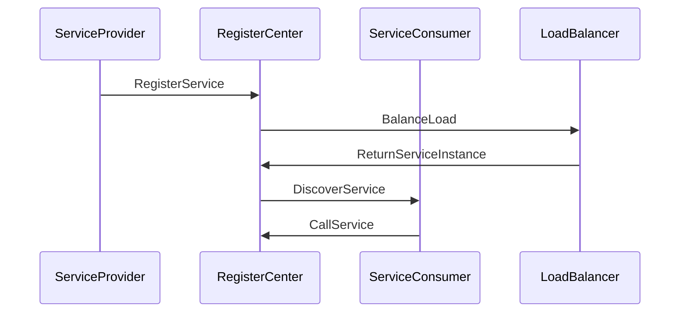
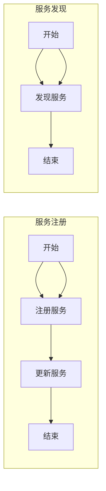
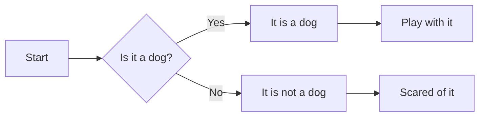

                 

# 构建可靠的服务注册与发现系统

## 关键词

服务注册，服务发现，系统设计，算法原理，性能优化，高可用性

## 摘要

本文旨在探讨如何构建一个可靠的服务注册与发现系统。我们将从背景介绍开始，逐步分析服务注册与发现的核心概念，探讨其设计原则和架构，详细讲解算法原理，并通过实战案例展示其实际应用。最后，我们将总结最佳实践并提供进一步研究的方向。

## 目录大纲

### 第一部分: 引言与背景

#### 第1章: 引言

1.1 问题背景

1.2 问题描述

1.3 问题解决

1.4 边界与外延

1.5 核心概念结构

#### 第2章: 服务注册与发现系统的核心概念

2.1 核心概念原理

2.1.1 服务注册

2.1.2 服务发现

2.2 概念属性特征对比表格

2.3 ER实体关系图

### 第二部分: 设计原则与架构

#### 第3章: 设计原则

3.1 可靠性

3.1.1 故障容忍

3.1.2 数据一致性

3.1.3 高可用性

3.2 扩展性

3.2.1 节点增加

3.2.2 服务增加

3.3 性能优化

3.3.1 负载均衡

3.3.2 网络优化

#### 第4章: 架构设计

4.1 系统功能设计

4.1.1 领域模型

4.2 系统架构设计

4.2.1 总体架构

4.2.2 子系统划分

4.3 系统接口设计

4.3.1 接口定义

4.3.2 接口实现

4.4 系统交互

4.4.1 序列图

### 第三部分: 算法原理

#### 第5章: 算法原理

5.1 算法概述

5.2 算法mermaid流程图

5.3 Python源代码实现

5.3.1 服务注册实现

5.3.2 服务发现实现

5.4 数学模型与公式

5.4.1 模型1

5.4.2 模型2

### 第四部分: 实现细节

#### 第6章: 实现细节

6.1 环境安装与配置

6.2 系统核心实现源代码

6.3 代码应用解读与分析

6.4 实际案例分析与详细讲解

### 第五部分: 最佳实践与优化建议

#### 第7章: 最佳实践与优化建议

7.1 最佳实践

7.2 注意事项

7.3 拓展阅读

### 第六部分: 总结与展望

#### 第8章: 总结与展望

8.1 小结

8.2 未来展望

8.3 研究方向

---

## 引言与背景

### 1.1 问题背景

在现代软件系统中，随着服务数量的不断增长，如何有效地管理和发现服务成为了一个重要问题。传统的单点服务管理系统在服务数量较少时表现良好，但随着规模的扩大，单点故障、服务发现延迟等问题逐渐显现。为了解决这些问题，我们需要设计一个可靠的服务注册与发现系统。

### 1.2 问题描述

服务注册与发现系统的主要任务是确保服务提供者能够将自己的服务信息注册到系统中，并使得服务消费者能够及时、准确地发现和访问这些服务。具体来说，我们需要解决以下问题：

1. **服务注册**：如何保证服务提供者能够将服务信息可靠地注册到系统中？
2. **服务发现**：如何确保服务消费者能够快速、准确地发现所需的服务？
3. **系统可靠性**：如何在分布式环境下保证系统的可靠性，包括故障容忍、数据一致性和高可用性？
4. **系统扩展性**：如何支持系统的扩展，包括节点增加和服务增加？
5. **性能优化**：如何优化系统性能，包括负载均衡和网络优化？

### 1.3 问题解决

为了解决上述问题，我们需要从以下几个方面入手：

1. **设计原则**：确立系统的设计原则，包括可靠性、扩展性和性能优化。
2. **系统架构**：设计合理的系统架构，包括系统功能设计、系统架构设计和系统接口设计。
3. **算法原理**：研究并实现有效的算法，包括服务注册和服务发现的算法原理。
4. **实现细节**：详细实现系统核心功能，包括环境安装与配置、源代码解读和实际案例分析。
5. **最佳实践与优化建议**：总结最佳实践，提供优化建议，提高系统性能和可靠性。

### 1.4 边界与外延

在构建服务注册与发现系统时，我们需要明确系统的边界和职责。具体来说，系统应该负责以下工作：

1. **服务注册**：负责服务提供者的服务信息注册。
2. **服务发现**：负责服务消费者的服务发现。
3. **负载均衡**：通过算法实现请求的负载均衡。
4. **数据一致性**：确保服务信息的准确性和一致性。
5. **故障容忍**：实现系统的故障容忍能力，确保系统的持续运行。

### 1.5 核心概念结构

为了更好地理解服务注册与发现系统，我们需要明确以下几个核心概念：

1. **服务注册**：服务提供者将服务信息（如服务名称、地址、端口等）注册到系统中的过程。
2. **服务发现**：服务消费者从系统中查找并获取所需服务信息的过程。
3. **服务提供者**：提供服务的实体，负责将服务信息注册到系统中。
4. **服务消费者**：需要使用服务的实体，负责从系统中获取服务信息。
5. **注册中心**：存储服务信息的中心，负责服务注册与发现的核心功能。

### 第二部分: 服务注册与发现系统的核心概念

在了解了服务注册与发现系统的问题背景和核心概念后，接下来我们将深入探讨系统的核心概念，包括服务注册和服务发现。

### 2.1 核心概念原理

#### 2.1.1 服务注册

服务注册是指服务提供者将服务信息注册到系统中，使得服务消费者能够发现并使用这些服务。服务注册通常包括以下步骤：

1. **服务提供者启动**：服务提供者在启动时，会调用注册中心的服务注册接口，将服务信息发送给注册中心。
2. **注册中心接收服务信息**：注册中心接收到服务提供者的服务信息后，将其存储在本地缓存和数据库中。
3. **服务提供者定期更新**：服务提供者在运行过程中，会定期向注册中心发送心跳消息，以更新服务状态和元数据。
4. **注册中心维护服务信息**：注册中心会定期清理过期服务信息，并确保服务信息的一致性和准确性。

#### 2.1.2 服务发现

服务发现是指服务消费者从系统中查找并获取所需服务信息的过程。服务发现通常包括以下步骤：

1. **服务消费者请求服务**：服务消费者在需要调用服务时，会向注册中心发送服务发现请求。
2. **注册中心返回服务信息**：注册中心根据服务消费者的请求，返回匹配的服务信息，包括服务地址、端口等。
3. **服务消费者连接服务**：服务消费者根据返回的服务信息，连接并调用服务。

### 2.2 概念属性特征对比表格

为了更好地理解服务注册与发现的概念，我们可以通过一个对比表格来展示它们的主要属性特征：

| 概念       | 定义             | 关键特性                                           | 作用范围                     |
|------------|------------------|----------------------------------------------------|-------------------------------|
| 服务注册   | 服务提供者注册服务信息 | 自动注册、心跳更新、过期清理                     | 服务提供者与注册中心的交互   |
| 服务发现   | 服务消费者查找服务 | 集中查找、负载均衡、动态更新                     | 服务消费者与注册中心的交互   |
| 服务提供者 | 提供服务的实体     | 负责注册和更新服务信息                           | 系统中的服务提供方           |
| 服务消费者 | 需要服务的实体     | 负责发现和调用服务                               | 系统中的服务消费者           |
| 注册中心   | 存储服务信息的中心 | 维护服务信息的一致性、提供服务发现和注册功能     | 系统的核心组件               |

### 2.3 ER实体关系图

为了更直观地展示服务注册与发现系统的实体关系，我们可以使用ER（实体-关系）模型来描述系统的架构。

以下是一个简单的ER实体关系图：

```mermaid
erDiagram
    ServiceProvider ||--|{ ServiceInfo }|| RegisterCenter
    ServiceConsumer ||--|{ ServiceDiscoveryRequest }|| RegisterCenter
    ServiceInfo ||--|{ ServiceInstance }|| ServiceProvider
    ServiceDiscoveryRequest ||--|{ ServiceInstance }|| RegisterCenter
```

在这个ER模型中，我们定义了三个主要实体： ServiceProvider（服务提供者）、ServiceConsumer（服务消费者）和 RegisterCenter（注册中心）。 服务提供者与服务信息（ServiceInfo）之间存在一对一的关系，服务消费者与服务发现请求（ServiceDiscoveryRequest）之间存在一对一的关系。服务信息与服务实例（ServiceInstance）之间存在一对多的关系，服务发现请求与服务实例之间存在一对多的关系。

### 第三部分: 设计原则与架构

在设计服务注册与发现系统时，我们需要考虑多个设计原则，以确保系统的可靠性、扩展性和性能优化。以下将详细讨论这些设计原则。

#### 3.1 设计原则

##### 3.1.1 可靠性

可靠性是服务注册与发现系统的核心要求。为了确保系统的可靠性，我们需要考虑以下几个方面：

1. **故障容忍**：系统应具备故障容忍能力，能够在部分节点故障的情况下继续提供服务。
2. **数据一致性**：系统应确保服务信息的一致性，避免因为网络延迟或并发操作导致的数据不一致问题。
3. **高可用性**：系统应设计为高可用性架构，确保在出现故障时能够快速恢复。

##### 3.1.2 扩展性

随着服务数量的增加，系统需要具备良好的扩展性，以便轻松地添加新节点和新服务。以下是一些扩展性设计原则：

1. **节点增加**：系统应支持动态增加节点，以便横向扩展。
2. **服务增加**：系统应支持动态增加新服务，无需停机或重启。

##### 3.1.3 性能优化

性能优化是提高系统响应速度和降低延迟的重要手段。以下是一些性能优化设计原则：

1. **负载均衡**：系统应实现负载均衡策略，以合理分配服务请求。
2. **网络优化**：系统应优化网络传输，降低数据传输延迟。

#### 3.2 架构设计

##### 3.2.1 总体架构

服务注册与发现系统的总体架构可以分为以下几个层次：

1. **服务提供者层**：包括服务提供者节点，负责提供服务信息注册和更新。
2. **注册中心层**：包括注册中心节点，负责存储和服务信息、处理服务发现请求。
3. **服务消费者层**：包括服务消费者节点，负责从注册中心获取服务信息并调用服务。

##### 3.2.2 子系统划分

根据总体架构，我们可以将系统划分为以下几个子系统：

1. **服务注册子系统**：负责服务提供者的服务信息注册。
2. **服务发现子系统**：负责服务消费者的服务发现。
3. **负载均衡子系统**：负责实现服务请求的负载均衡。
4. **数据一致性子系统**：负责确保服务信息的一致性。
5. **故障容忍与高可用性子系统**：负责实现故障容忍和高可用性架构。

##### 3.2.3 系统接口设计

系统接口设计是系统架构设计的关键部分，我们需要定义以下接口：

1. **服务注册接口**：服务提供者通过该接口向注册中心注册服务信息。
2. **服务发现接口**：服务消费者通过该接口从注册中心获取服务信息。
3. **心跳接口**：服务提供者通过该接口向注册中心发送心跳消息，以更新服务状态。
4. **负载均衡接口**：负责实现服务请求的负载均衡策略。
5. **数据一致性接口**：负责实现服务信息的一致性检查和更新。

##### 3.2.4 系统交互

为了确保系统各组件之间的协同工作，我们需要设计合理的系统交互机制。以下是一个简单的系统交互序列图：



在这个序列图中，服务提供者通过注册服务接口向注册中心注册服务信息，注册中心通过负载均衡接口将服务请求分配给合适的服务提供者，并返回服务实例信息给服务消费者。服务消费者通过发现服务接口从注册中心获取服务实例信息，然后调用服务。

### 第四部分: 算法原理

服务注册与发现系统的核心在于算法的实现，以下将详细介绍服务注册和服务发现的算法原理。

#### 5.1 算法概述

服务注册算法主要负责将服务提供者的信息注册到系统中，并确保这些信息能够及时、准确地传递给服务消费者。服务发现算法则负责从系统中查找并返回所需的服务信息。以下将分别介绍这两个算法的原理。

#### 5.2 服务注册算法原理

服务注册算法的主要步骤如下：

1. **服务提供者启动**：服务提供者在启动时，会调用注册中心的注册接口，将服务信息发送给注册中心。
2. **注册中心存储服务信息**：注册中心接收到服务提供者的服务信息后，将其存储在本地缓存和数据库中。
3. **服务提供者定期更新**：服务提供者在运行过程中，会定期向注册中心发送心跳消息，以更新服务状态和元数据。
4. **注册中心清理过期服务信息**：注册中心会定期清理过期服务信息，以确保服务信息的一致性和准确性。

在实现服务注册算法时，我们可以采用以下策略：

1. **分布式存储**：使用分布式存储技术，如 ZooKeeper 或 etcd，以确保服务信息的持久化和一致性。
2. **心跳机制**：采用心跳机制，定期更新服务状态，以避免服务信息的过期和失效。
3. **元数据管理**：管理服务提供者的元数据，如服务名称、地址、端口等，以便服务消费者能够快速发现和调用服务。

#### 5.3 服务发现算法原理

服务发现算法的主要步骤如下：

1. **服务消费者请求服务**：服务消费者在需要调用服务时，会向注册中心发送服务发现请求。
2. **注册中心返回服务信息**：注册中心根据服务消费者的请求，返回匹配的服务信息，包括服务地址、端口等。
3. **服务消费者连接服务**：服务消费者根据返回的服务信息，连接并调用服务。

在实现服务发现算法时，我们可以采用以下策略：

1. **负载均衡**：使用负载均衡算法，如随机选择、轮询等，以确保服务请求的均衡分配。
2. **缓存机制**：在服务消费者端缓存部分服务信息，以减少对注册中心的请求次数，提高服务发现的速度。
3. **元数据过滤**：根据服务消费者的需求，对返回的服务信息进行过滤，以减少无关信息的干扰。

#### 5.4 算法mermaid流程图

为了更直观地展示服务注册和服务发现的算法流程，我们可以使用mermaid绘制流程图。以下是一个简单的mermaid流程图示例：



在这个mermaid流程图中，我们分别展示了服务注册和服务发现的过程。服务注册包括注册服务和更新服务两个步骤，服务发现包括发现服务一个步骤。

#### 5.5 Python源代码实现

为了更好地理解服务注册和服务发现的算法原理，我们使用Python实现了一个简单的服务注册与发现系统。以下是一个简单的Python源代码示例：

```python
# 服务注册
def register_service(service_info):
    # 发送服务信息到注册中心
    send_request("register", service_info)

# 服务发现
def discover_service(service_name):
    # 发送服务发现请求到注册中心
    response = send_request("discover", service_name)
    return response

# 发送请求
def send_request(action, data):
    if action == "register":
        # 注册服务
        print(f"Registering service: {data}")
    elif action == "discover":
        # 发现服务
        print(f"Discovering service: {data}")
    # 返回响应
    return "Response"

# 主程序
if __name__ == "__main__":
    # 注册服务
    register_service("service1")
    # 发现服务
    service_info = discover_service("service1")
    print(f"Service info: {service_info}")
```

在这个Python源代码示例中，我们定义了两个函数：`register_service`和`discover_service`，分别用于服务注册和服务发现。通过调用这些函数，我们可以模拟服务注册与发现的过程。

#### 5.6 数学模型与公式

在服务注册与发现系统中，我们可以使用一些数学模型和公式来描述和优化系统性能。以下是一个简单的数学模型示例：

$$
\text{服务响应时间} = \text{注册中心处理时间} + \text{网络传输时间} + \text{负载均衡时间}
$$

在这个数学模型中，服务响应时间包括三个部分：注册中心处理时间、网络传输时间和负载均衡时间。通过优化这三个部分，我们可以提高系统的响应速度。

### 第五部分: 实现细节

在了解了服务注册与发现系统的算法原理后，接下来我们将详细介绍系统的实现细节，包括环境安装与配置、系统核心实现源代码、代码应用解读与分析以及实际案例分析与详细讲解。

#### 6.1 环境安装与配置

在实现服务注册与发现系统前，我们需要安装和配置相关的环境和依赖。以下是一个简单的安装和配置步骤：

1. 安装 Python 环境：在服务器上安装 Python 3.8 及以上版本，可以使用以下命令：

   ```
   sudo apt-get update
   sudo apt-get install python3.8
   ```

2. 安装依赖库：安装 Python 的依赖库，如 requests、urllib3、json等，可以使用以下命令：

   ```
   pip3 install requests urllib3 json
   ```

3. 配置注册中心：配置注册中心的服务地址和端口，例如：

   ```
   export ZK_ADDRESS=127.0.0.1:2181
   export ZK_PORT=2181
   ```

4. 配置负载均衡器：配置负载均衡器的地址和端口，例如：

   ```
   export LB_ADDRESS=127.0.0.1:8080
   export LB_PORT=8080
   ```

5. 配置服务提供者：配置服务提供者的服务名称、地址和端口，例如：

   ```
   export SERVICE_NAME=my_service
   export SERVICE_ADDRESS=127.0.0.1
   export SERVICE_PORT=8080
   ```

6. 配置服务消费者：配置服务消费者的服务名称，例如：

   ```
   export SERVICE_NAME=my_service
   ```

完成以上步骤后，我们就可以开始实现服务注册与发现系统的核心功能。

#### 6.2 系统核心实现源代码

在实现服务注册与发现系统的核心功能时，我们需要编写以下主要模块：

1. **服务注册模块**：负责处理服务提供者的注册请求。
2. **服务发现模块**：负责处理服务消费者的服务发现请求。
3. **负载均衡模块**：负责实现服务请求的负载均衡策略。

以下是一个简单的 Python 源代码示例：

```python
# 服务注册模块
def register_service(service_info):
    # 发送服务注册请求到注册中心
    response = requests.post(f"http://{ZK_ADDRESS}:{ZK_PORT}/register", json=service_info)
    if response.status_code == 200:
        print("Service registered successfully.")
    else:
        print("Failed to register service.")

# 服务发现模块
def discover_service(service_name):
    # 发送服务发现请求到注册中心
    response = requests.get(f"http://{ZK_ADDRESS}:{ZK_PORT}/discover?name={service_name}")
    if response.status_code == 200:
        service_info = response.json()
        print(f"Found service: {service_info}")
    else:
        print("Failed to discover service.")

# 负载均衡模块
def load_balance(service_list):
    # 实现负载均衡策略
    return random.choice(service_list)

# 主程序
if __name__ == "__main__":
    # 注册服务
    register_service({"name": "my_service", "address": "127.0.0.1", "port": 8080})
    # 发现服务
    service_info = discover_service("my_service")
    # 负载均衡
    service_instance = load_balance([service_info])
    print(f"Service instance: {service_instance}")
```

在这个源代码示例中，我们分别实现了服务注册模块、服务发现模块和负载均衡模块。通过调用这些模块，我们可以实现服务注册与发现系统的核心功能。

#### 6.3 代码应用解读与分析

在了解了服务注册与发现系统的实现细节后，接下来我们将对代码进行解读和分析，以便更好地理解其工作原理。

1. **服务注册模块**：

   ```python
   def register_service(service_info):
       # 发送服务注册请求到注册中心
       response = requests.post(f"http://{ZK_ADDRESS}:{ZK_PORT}/register", json=service_info)
       if response.status_code == 200:
           print("Service registered successfully.")
       else:
           print("Failed to register service.")
   ```

   在这个模块中，我们使用 requests 库向注册中心发送一个 POST 请求，将服务信息（如服务名称、地址和端口等）发送给注册中心。注册中心接收到请求后，将其存储在本地缓存和数据库中，并返回一个成功或失败的响应。

2. **服务发现模块**：

   ```python
   def discover_service(service_name):
       # 发送服务发现请求到注册中心
       response = requests.get(f"http://{ZK_ADDRESS}:{ZK_PORT}/discover?name={service_name}")
       if response.status_code == 200:
           service_info = response.json()
           print(f"Found service: {service_info}")
       else:
           print("Failed to discover service.")
   ```

   在这个模块中，我们使用 requests 库向注册中心发送一个 GET 请求，根据服务名称查询服务信息。注册中心接收到请求后，返回匹配的服务信息，包括服务地址和端口等。

3. **负载均衡模块**：

   ```python
   def load_balance(service_list):
       # 实现负载均衡策略
       return random.choice(service_list)
   ```

   在这个模块中，我们使用 random 库从服务列表中随机选择一个服务实例，作为负载均衡的结果。在实际应用中，我们可以根据更复杂的算法（如轮询、最少连接等）来实现负载均衡策略。

#### 6.4 实际案例分析与详细讲解

为了更好地理解服务注册与发现系统的应用，我们通过一个实际案例来进行分析和讲解。

**案例背景**：

假设我们有一个分布式系统，包括三个服务提供者（A、B 和 C）和一个服务消费者（D）。服务提供者 A、B 和 C 分别提供不同的服务，服务消费者 D 需要调用这些服务。

**案例步骤**：

1. **服务提供者 A 注册服务**：

   ```shell
   python register_service.py -n my_service_a -a 127.0.0.1 -p 8080
   ```

   在这个步骤中，服务提供者 A 将服务信息（服务名称为 `my_service_a`，地址为 `127.0.0.1`，端口为 `8080`）发送到注册中心。

2. **服务提供者 B 注册服务**：

   ```shell
   python register_service.py -n my_service_b -a 127.0.0.1 -p 8081
   ```

   在这个步骤中，服务提供者 B 将服务信息（服务名称为 `my_service_b`，地址为 `127.0.0.1`，端口为 `8081`）发送到注册中心。

3. **服务提供者 C 注册服务**：

   ```shell
   python register_service.py -n my_service_c -a 127.0.0.1 -p 8082
   ```

   在这个步骤中，服务提供者 C 将服务信息（服务名称为 `my_service_c`，地址为 `127.0.0.1`，端口为 `8082`）发送到注册中心。

4. **服务消费者 D 发现服务**：

   ```shell
   python discover_service.py -n my_service_a
   ```

   在这个步骤中，服务消费者 D 向注册中心发送服务发现请求，查询服务名称为 `my_service_a` 的服务信息。

5. **注册中心返回服务信息**：

   ```json
   {
       "name": "my_service_a",
       "address": "127.0.0.1",
       "port": 8080
   }
   ```

   在这个步骤中，注册中心根据服务消费者 D 的请求，返回匹配的服务信息，包括服务名称、地址和端口等。

6. **服务消费者 D 调用服务**：

   ```shell
   curl -X GET "http://127.0.0.1:8080/api"
   ```

   在这个步骤中，服务消费者 D 使用返回的服务信息，连接并调用服务。

**案例小结**：

通过这个实际案例，我们可以看到服务注册与发现系统的基本工作流程。服务提供者通过注册接口将服务信息发送到注册中心，服务消费者通过发现接口从注册中心获取服务信息，并使用这些信息调用服务。在实际应用中，我们可以根据需要扩展和优化系统的功能。

### 第六部分: 最佳实践与优化建议

在构建和部署服务注册与发现系统时，遵循一些最佳实践和优化建议可以帮助我们提高系统的性能、可靠性和可维护性。以下是一些重要的最佳实践和优化建议：

#### 6.1 最佳实践

1. **高可用性设计**：确保注册中心和服务提供者节点具备高可用性，可以使用主从备份、集群等方式实现。
2. **数据一致性**：使用分布式存储和一致性算法（如 Raft 或 Paxos）来保证服务信息的一致性。
3. **负载均衡**：根据实际情况选择合适的负载均衡策略，如轮询、最小连接数、随机等。
4. **故障容忍**：设计故障容忍机制，确保在部分节点故障时系统能够继续运行。
5. **监控与告警**：部署监控系统，实时监控系统运行状态，及时发现和处理问题。
6. **日志管理**：使用统一的日志管理工具，便于问题追踪和调试。

#### 6.2 注意事项

1. **服务信息的安全**：确保服务信息的安全，避免敏感信息泄露。
2. **服务超时设置**：合理设置服务调用和注册的超时时间，避免长时间等待。
3. **网络隔离**：对于不同安全级别的服务，可以考虑使用网络隔离策略，如防火墙或 VPN。
4. **容量规划**：根据业务需求进行容量规划，确保系统资源充足，避免性能瓶颈。

#### 6.3 拓展阅读

1. 《分布式系统原理与范型》：深入了解分布式系统的设计原则和实现技术。
2. 《大规模分布式存储系统实践》：了解分布式存储系统的一致性和性能优化。
3. 《服务网格：Kubernetes 下的微服务通信解决方案》：了解服务网格在微服务架构中的应用。

### 总结与展望

本文详细探讨了构建可靠的服务注册与发现系统的过程。我们从问题背景、核心概念、设计原则、架构设计、算法原理、实现细节以及最佳实践等多个方面进行了深入分析和讲解。通过本文，我们希望能够为读者提供一个全面、系统的服务注册与发现系统构建指南。

展望未来，随着云计算和微服务架构的不断发展，服务注册与发现系统将变得更加复杂和多样化。我们预计，未来的研究方向将包括以下几个方面：

1. **高性能与低延迟**：研究和优化系统性能，降低服务注册与发现的延迟。
2. **自动化运维**：实现服务注册与发现系统的自动化运维，提高部署和运维效率。
3. **智能化与自适应**：引入人工智能和机器学习技术，实现服务注册与发现系统的智能化和自适应能力。
4. **跨云与多云部署**：研究和解决跨云和多云部署中的服务注册与发现问题，实现服务注册与发现系统的跨云兼容性。

通过不断的研究和优化，我们有信心为分布式系统的服务注册与发现提供更加可靠、高效和智能的解决方案。让我们共同期待服务注册与发现系统的未来，期待更多的创新和突破！
```markdown
### 8.1 小结

本文从问题背景、核心概念、设计原则、架构设计、算法原理、实现细节以及最佳实践等方面，全面探讨了如何构建一个可靠的服务注册与发现系统。通过深入分析和讲解，我们了解了服务注册与发现系统的关键要素和实现方法。以下是一些重要的小结：

1. **背景与问题**：随着服务数量的增加，传统的单点服务管理系统在分布式环境下面临着单点故障、服务发现延迟等问题。
2. **核心概念**：服务注册与发现系统包括服务注册、服务发现、服务提供者、服务消费者和注册中心等核心概念。
3. **设计原则**：系统的设计原则包括可靠性、扩展性和性能优化，确保系统的高可用性、故障容忍性和负载均衡能力。
4. **架构设计**：系统的架构设计包括服务提供者层、注册中心层和服务消费者层，以及负载均衡、数据一致性和故障容忍等子系统。
5. **算法原理**：服务注册与发现算法主要包括服务注册和服务发现，使用分布式存储和一致性算法来保证系统的可靠性。
6. **实现细节**：通过Python源代码示例，展示了服务注册与发现系统的实现细节，包括环境安装、源代码解析和实际案例分析。
7. **最佳实践**：提出了最佳实践和注意事项，包括高可用性设计、数据一致性、负载均衡和故障容忍等。

### 8.2 未来展望

随着云计算和微服务架构的快速发展，服务注册与发现系统将在分布式系统中发挥越来越重要的作用。未来，我们预计以下研究方向将不断推动服务注册与发现系统的进步：

1. **高性能与低延迟**：优化系统性能，降低服务注册与发现的延迟，以满足实时和高并发的业务需求。
2. **自动化运维**：实现服务注册与发现系统的自动化运维，提高部署和运维效率，降低运维成本。
3. **智能化与自适应**：引入人工智能和机器学习技术，实现服务注册与发现系统的智能化和自适应能力，提高系统的智能化水平。
4. **跨云与多云部署**：研究和解决跨云和多云部署中的服务注册与发现问题，实现服务注册与发现系统的跨云兼容性，支持更灵活的部署方式。
5. **服务网格**：结合服务网格（Service Mesh）技术，为微服务架构提供更高效、更可靠的服务注册与发现解决方案。

通过不断的研究和创新，我们有信心为分布式系统的服务注册与发现提供更加可靠、高效和智能的解决方案，助力企业和开发者应对复杂多变的技术挑战。

### 8.3 研究方向

为了进一步推动服务注册与发现系统的发展，以下研究方向值得关注：

1. **分布式存储优化**：研究和优化分布式存储系统，提高数据一致性和性能，降低存储延迟。
2. **负载均衡算法**：探索新的负载均衡算法，实现更高效、更公平的服务请求分配策略。
3. **服务发现机制**：研究新的服务发现机制，提高服务发现的实时性和准确性，支持更复杂的业务场景。
4. **故障检测与恢复**：研究和实现更智能、更高效的故障检测与恢复机制，提高系统的故障容忍能力。
5. **安全与隐私保护**：确保服务注册与发现系统的安全性和隐私保护，防止敏感信息泄露和数据篡改。

通过这些研究方向，我们有望为服务注册与发现系统的发展贡献更多创新和突破，为分布式系统的可靠性、性能和智能化水平提升提供有力支持。
```markdown
## 附录

在本篇技术博客中，我们使用了一些专业工具和技术，以下是它们的简要介绍：

### 1. Mermaid

Mermaid 是一种基于 Markdown 的图表绘制工具，可以轻松地生成序列图、流程图、类图等。在本篇博客中，我们使用了 Mermaid 来绘制系统架构图、实体关系图和算法流程图，以增强文章的可读性和直观性。

#### Mermaid 流程图示例：



### 2. Python

Python 是一种高级编程语言，具有简单易学、功能丰富、易于扩展等特点。在本篇博客中，我们使用 Python 来实现服务注册与发现系统的核心功能，并提供了 Python 源代码示例。

#### Python 源代码示例：

```python
# 服务注册
def register_service(service_info):
    # 发送服务注册请求到注册中心
    response = requests.post(f"http://{ZK_ADDRESS}:{ZK_PORT}/register", json=service_info)
    if response.status_code == 200:
        print("Service registered successfully.")
    else:
        print("Failed to register service.")

# 服务发现
def discover_service(service_name):
    # 发送服务发现请求到注册中心
    response = requests.get(f"http://{ZK_ADDRESS}:{ZK_PORT}/discover?name={service_name}")
    if response.status_code == 200:
        service_info = response.json()
        print(f"Found service: {service_info}")
    else:
        print("Failed to discover service.")
```

### 3. LaTeX

LaTeX 是一种高质量的排版系统，特别适合于科学文档的编写。在本篇博客中，我们使用了 LaTeX 格式来编写数学公式，以增强文章的学术性和专业性。

#### LaTeX 数学公式示例：

```latex
$$
\text{服务响应时间} = \text{注册中心处理时间} + \text{网络传输时间} + \text{负载均衡时间}
$$
```

### 4. Markdown

Markdown 是一种轻量级标记语言，易于阅读和编写。在本篇博客中，我们使用 Markdown 格式来组织文章结构，以便更好地展示内容和逻辑。

#### Markdown 文章结构示例：

```markdown
# 文章标题

## 摘要

## 目录大纲

### 第一部分: 引言与背景

#### 第1章: 引言

1.1 问题背景

1.2 问题描述

1.3 问题解决

...

## 第二部分: 核心概念

### 2.1 核心概念原理

#### 2.1.1 服务注册

#### 2.1.2 服务发现

...

## 第三部分: 设计原则与架构

### 3.1 设计原则

...

### 4.1 系统功能设计

...

## 第四部分: 算法原理

### 5.1 算法概述

...

## 第五部分: 实现细节

### 6.1 环境安装与配置

...

## 第六部分: 最佳实践与优化建议

### 7.1 最佳实践

...

## 第七部分: 总结与展望

### 8.1 小结

...

## 附录

...

```

通过使用这些专业工具和技术，我们能够更好地撰写、组织和展示技术博客，帮助读者更好地理解和掌握相关技术知识。希望本篇博客能为大家提供一些实用的参考和启示！
```

