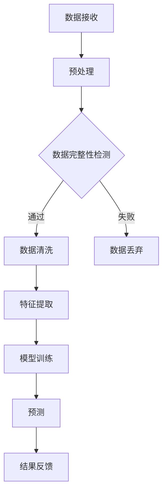
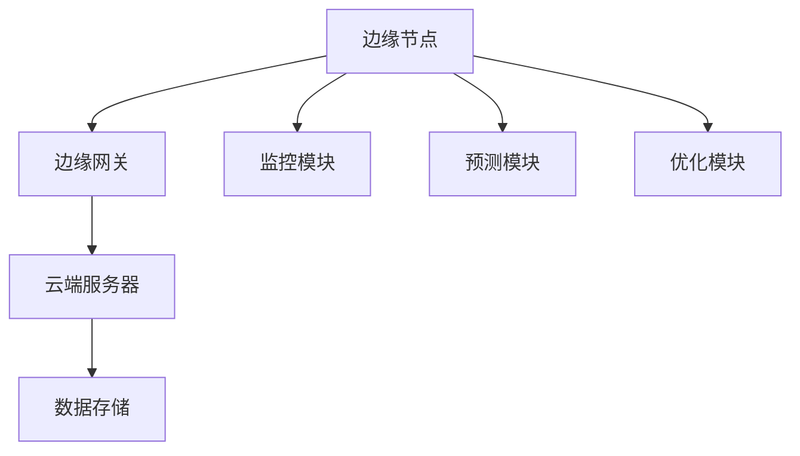
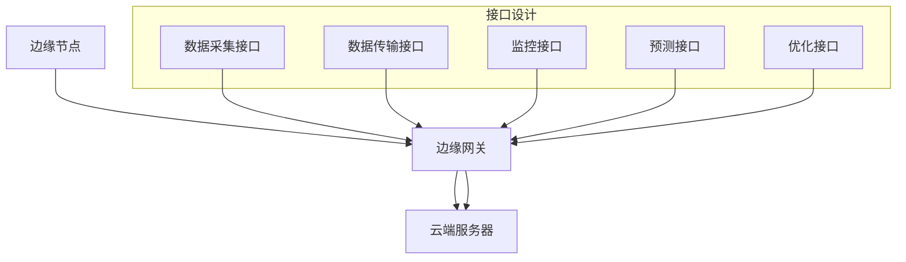
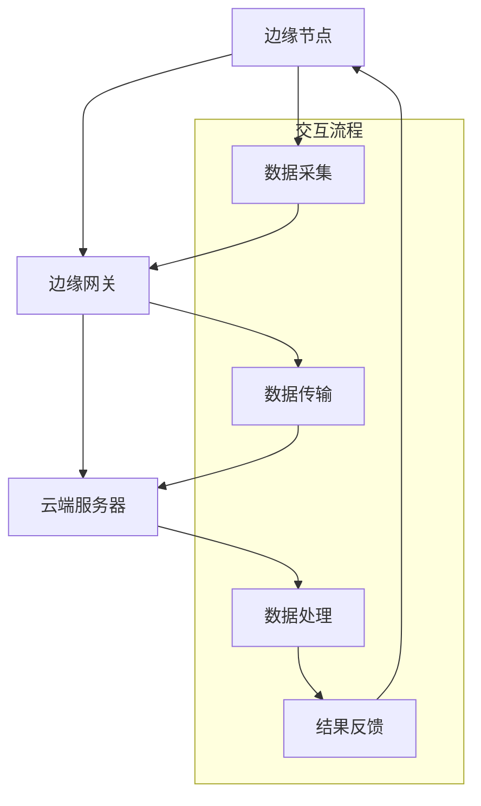

                 

### 第一步：背景介绍

**问题背景**

随着互联网和物联网的快速发展，边缘计算作为云计算的延伸，正逐渐成为新一代信息技术的重要支撑。边缘智能系统通过在靠近数据源的地方处理数据，可以降低延迟、提高响应速度，同时减轻中心化数据中心的压力。这种技术模式尤其适用于需要实时响应和低延迟的应用场景，如自动驾驶、智能制造、智能医疗等。

**问题描述**

边缘智能系统需要具备高可靠性，才能在复杂和多变的环境中稳定运行。构建可靠的边缘智能系统，不仅需要高效的处理能力和优化的资源管理，还需要考虑系统的安全性、可维护性和可扩展性。具体而言，系统在运行过程中可能面临如下挑战：

1. **硬件故障**：边缘设备可能因为环境因素、资源限制或者制造缺陷而出现故障。
2. **软件缺陷**：系统软件可能存在漏洞、错误或者兼容性问题，导致系统崩溃或性能下降。
3. **网络不稳定**：边缘设备与云端或其他设备之间的通信可能受到网络波动的影响，导致数据传输失败或延迟。
4. **安全性问题**：边缘设备可能成为网络攻击的目标，数据泄露或系统被篡改都会对系统的可靠性产生威胁。
5. **维护与更新**：边缘设备分布广泛，维护和更新操作复杂，需要确保系统能够快速响应并更新。

**问题解决**

构建可靠的边缘智能系统，需要在硬件选择、软件优化、安全性设计、系统监控和运维管理等多个方面进行综合考虑：

1. **硬件选择**：选择耐用、低功耗、高计算能力的设备，确保硬件的可靠性和稳定性。
2. **软件优化**：优化软件代码，提高系统的运行效率和错误处理能力，确保软件的健壮性。
3. **安全性设计**：采用多层次的安全措施，如数据加密、访问控制、入侵检测等，确保系统的安全性。
4. **系统监控**：建立全面的监控系统，实时监控系统的运行状态，及时发现和解决问题。
5. **运维管理**：制定完善的运维策略，确保系统能够快速响应故障并进行有效的修复。

**边界与外延**

边缘智能系统的构建不仅仅涉及硬件和软件的选择，还包括网络架构、数据处理算法、数据隐私保护等众多方面。例如，网络架构的设计需要考虑如何保证数据传输的高效性和可靠性；数据处理算法需要根据具体应用场景进行定制，以提高系统的响应速度和准确性；数据隐私保护则需要确保用户数据的安全和隐私不被泄露。

**概念结构与核心要素组成**

- **边缘节点**：边缘节点是边缘智能系统中的计算单元，负责处理本地数据。它们可以是智能路由器、工业控制系统、智能传感器等。
- **边缘网关**：边缘网关是连接边缘节点和云端的数据传输枢纽，负责数据的传输和路由。它们通常具备边缘计算的能力，可以执行部分数据处理任务。
- **边缘平台**：边缘平台为开发者提供了一整套开发和管理工具，包括开发环境、API接口、管理界面等，用于支持边缘智能应用的快速开发和部署。
- **数据处理算法**：数据处理算法负责对边缘节点收集的数据进行分析和处理，以实现智能决策和自动化处理。这些算法可以是机器学习模型、预测模型、实时数据分析等。
- **安全性设计**：安全性设计包括数据加密、访问控制、身份验证、入侵检测等多个方面，确保边缘智能系统在各种环境下的安全性。

通过以上对背景、问题描述、问题解决、边界与外延以及概念结构的详细阐述，我们可以对构建可靠的边缘智能系统有一个全面而深刻的理解。接下来，我们将进一步深入探讨边缘智能系统的核心概念与联系，以便为后续的算法原理讲解和系统分析与架构设计方案打下坚实的基础。

----------------------------------------------------------------

### 第二步：核心概念与联系

**核心概念原理**

在构建可靠的边缘智能系统中，核心概念包括边缘计算、边缘智能和可靠性。这些概念不仅相互独立，又紧密相连，共同构成了边缘智能系统的理论基础。

- **边缘计算**：边缘计算（Edge Computing）是一种分布式计算架构，它将数据处理和存储能力从云端转移到靠近数据源的边缘节点。边缘计算的关键优势在于其低延迟和高响应速度，这使得它特别适用于实时性要求高的应用场景，如自动驾驶、智能制造和智能医疗等。边缘计算通过将计算任务分散到边缘节点，可以减轻云端的负载，提高整个系统的处理能力和效率。

- **边缘智能**：边缘智能（Edge Intelligence）是边缘计算与人工智能（AI）技术的结合，它通过在边缘设备上运行AI算法，实现数据的实时分析和智能决策。边缘智能系统不仅能够处理本地数据，还能够进行远程数据的关联分析和预测，从而实现高度智能化的应用。边缘智能的关键优势在于其能够将计算任务留在边缘，减少数据传输的负担，提高系统的实时性和响应速度。

- **可靠性**：可靠性（Reliability）是边缘智能系统设计的重要指标，它指的是系统在长时间运行中能够保持稳定、可靠的状态。边缘智能系统通常运行在分布式环境中，面临着硬件故障、软件缺陷、网络不稳定等多种挑战，因此可靠性设计至关重要。可靠性设计包括硬件选择、软件优化、安全性设计、系统监控和运维管理等多个方面，旨在确保系统在各种复杂环境下的稳定运行。

**概念属性特征对比表格**

为了更好地理解这些核心概念，我们可以通过对比表格来分析它们的属性特征：

| 概念         | 属性特征                     | 对比                |
| ------------ | ---------------------------- | ------------------ |
| 边缘计算     | 低延迟、高响应速度           | 与云计算相比，计算更接近数据发生地 |
| 边缘智能     | 实时数据分析、智能决策       | 依托边缘计算，实现智能处理 |
| 可靠性       | 稳定、可靠运行               | 是系统性能的重要指标 |

**ER实体关系图架构的 Mermaid 流程图**

为了更直观地展示边缘智能系统的核心概念和相互关系，我们可以使用Mermaid绘制ER实体关系图。以下是一个简化的Mermaid图，展示了边缘节点、边缘网关、边缘平台、数据处理算法和可靠性之间的关联：

```mermaid
erDiagram
  EdgeNode ||--|{ EdgeGateway }|| Gateway
  EdgeNode ||--|{ EdgePlatform }|| Platform
  EdgePlatform ||--|{ DataProcessingAlgorithm }|| Algorithm
  DataProcessingAlgorithm ||--|{ Reliability }|| Reliability
```

在这个ER图中，边缘节点代表边缘智能系统中的计算单元，它们通过边缘网关连接到边缘平台。边缘平台提供了应用开发和管理服务，支持数据处理算法的运行。数据处理算法负责对边缘节点收集的数据进行分析和处理，而可靠性则是确保这些算法和系统能够稳定运行的关键因素。

**详细讲解与举例说明**

- **边缘计算与边缘智能**：边缘计算和边缘智能是相辅相成的。边缘计算通过将计算任务从云端迁移到边缘，实现了数据的本地化处理，降低了延迟。而边缘智能则通过在边缘设备上部署AI算法，实现了对本地数据的实时分析和智能决策。例如，在一个智能交通系统中，边缘计算可以处理来自交通传感器的数据，而边缘智能则可以分析这些数据，实时调整交通信号灯，以优化交通流量。

- **可靠性**：可靠性是边缘智能系统的核心要求。在一个智能医疗系统中，边缘智能系统需要确保患者的数据安全和诊疗的准确性。例如，如果一个用于监测患者生命体征的边缘设备出现故障，可能会导致严重的医疗事故。因此，可靠性设计包括对硬件的选择、软件的优化、安全性的增强和系统监控的完善，以确保系统能够在长时间、多场景下稳定运行。

通过上述核心概念与联系的分析，我们可以更好地理解构建可靠边缘智能系统的关键要素。接下来，我们将进一步深入探讨边缘智能系统的算法原理，以期为构建高可靠性的系统提供理论支持。

----------------------------------------------------------------

### 第三步：算法原理讲解

构建可靠的边缘智能系统，算法的设计与优化至关重要。边缘智能系统中的算法不仅要能够高效地处理海量数据，还要具备较强的鲁棒性和适应性，以应对复杂多变的运行环境。以下我们将使用Mermaid流程图和Python源代码，结合LaTeX数学公式，详细讲解边缘智能系统中一个典型的算法：基于机器学习的实时数据分析算法。

**算法 mermaid 流程图**



**算法原理**

1. **数据接收与预处理**：边缘节点首先接收来自各种传感器或设备的数据。预处理阶段包括去噪、数据格式转换、数据标准化等操作，以确保数据质量。

2. **数据完整性检测**：对预处理后的数据进行完整性检测，包括检测数据是否缺失、异常等。若数据不完整，则丢弃该数据，以保证后续分析的准确性。

3. **数据清洗**：在完整性检测通过后，对数据进一步清洗，去除重复数据、异常值等，提高数据质量。

4. **特征提取**：将清洗后的数据转化为特征向量，提取关键特征，以供机器学习模型使用。

5. **模型训练**：使用历史数据对机器学习模型进行训练，模型可以是回归模型、分类模型、聚类模型等，具体取决于应用场景。

6. **预测**：使用训练好的模型对实时数据进行预测，得到预测结果。

7. **结果反馈**：将预测结果反馈给边缘节点，指导后续操作或决策。

**数学模型和公式**

为了更好地理解算法原理，我们使用LaTeX数学公式来表示关键步骤：

$$
\begin{aligned}
&\text{特征提取}: f(x) = \phi(x) \\
&\text{模型训练}: \min_{\theta} J(\theta) = \frac{1}{2n} \sum_{i=1}^{n} (h_\theta(x^{(i)}) - y^{(i)})^2 \\
&\text{预测}: \hat{y} = h_\theta(x)
\end{aligned}
$$

其中，$f(x)$ 表示特征提取函数，$\phi(x)$ 表示特征向量；$J(\theta)$ 表示损失函数，$\theta$ 表示模型参数；$h_\theta(x)$ 表示模型输出，$\hat{y}$ 表示预测结果。

**详细讲解与举例说明**

1. **特征提取**：特征提取是将输入数据转换成模型可以处理的形式。例如，对于图像数据，可以使用卷积神经网络（CNN）提取图像的特征，对于时间序列数据，可以使用LSTM网络提取时间序列的特征。通过特征提取，我们可以将复杂的数据简化为模型可以处理的向量形式。

2. **模型训练**：模型训练是机器学习中的核心步骤，通过最小化损失函数来优化模型参数。以回归模型为例，损失函数通常采用均方误差（MSE），即：

$$
J(\theta) = \frac{1}{2n} \sum_{i=1}^{n} (h_\theta(x^{(i)}) - y^{(i)})^2
$$

其中，$x^{(i)}$ 表示输入特征，$y^{(i)}$ 表示标签，$h_\theta(x^{(i)})$ 表示模型预测值。

3. **预测**：在模型训练完成后，可以使用训练好的模型对新的数据进行预测。以回归模型为例，预测结果可以通过以下公式计算：

$$
\hat{y} = h_\theta(x)
$$

其中，$x$ 表示新的输入特征，$\hat{y}$ 表示预测结果。

通过上述讲解，我们可以看到边缘智能系统中的算法原理是如何工作的。接下来，我们将结合一个实际案例，进一步探讨边缘智能系统的应用和实现。

**实际案例：智能交通系统**

在智能交通系统中，边缘智能系统可以用于实时交通流量监测和预测，以优化交通信号灯的切换策略。以下是一个简化的实现流程：

1. **数据接收与预处理**：边缘节点从交通传感器接收实时数据，如车流量、速度、密度等。预处理阶段对数据进行去噪、标准化处理。

2. **数据完整性检测**：对预处理后的数据进行完整性检测，如检测数据是否缺失、异常等。

3. **数据清洗**：去除重复数据、异常值等，以提高数据质量。

4. **特征提取**：提取关键特征，如平均车流量、高峰时段车流量等。

5. **模型训练**：使用历史交通数据对机器学习模型进行训练，如使用回归模型预测未来一段时间内的车流量。

6. **预测**：使用训练好的模型对实时车流量进行预测，得到预测结果。

7. **结果反馈**：根据预测结果调整交通信号灯的切换策略，以优化交通流量。

通过上述案例，我们可以看到边缘智能系统如何应用于实际场景，实现实时数据分析和预测，从而提高系统的智能化水平。

通过这一步的详细讲解和举例说明，我们不仅了解了边缘智能系统中的算法原理，还看到了如何将理论应用到实际项目中。接下来，我们将进一步探讨边缘智能系统的系统分析与架构设计方案，以期为构建高可靠性的边缘智能系统提供更全面的指导。

----------------------------------------------------------------

### 第四步：系统分析与架构设计方案

在构建可靠的边缘智能系统中，系统分析与架构设计方案至关重要。通过合理的系统架构设计，可以确保系统的高效性、稳定性和可扩展性。以下我们将详细分析边缘智能系统在不同场景下的项目介绍、系统功能设计、系统架构设计、系统接口设计和系统交互。

**问题场景介绍**

边缘智能系统在许多场景下都有广泛应用，以下是一个常见的场景——智能工厂。

**项目介绍**

智能工厂通过部署边缘智能系统，实现生产线的自动化控制和实时监控。边缘智能系统能够实时分析生产数据，预测设备故障，优化生产流程，提高生产效率和产品质量。

**系统功能设计**

智能工厂的边缘智能系统主要包括以下功能模块：

1. **数据采集与预处理**：边缘节点负责从传感器采集生产数据，并进行预处理，如去噪、标准化等。
2. **实时监控**：系统实时监控生产线的运行状态，包括设备状态、温度、湿度等。
3. **故障预测**：利用机器学习算法，对设备运行数据进行实时分析，预测潜在故障，提前进行维护。
4. **生产优化**：根据实时数据和预测结果，优化生产流程，提高生产效率和产品质量。
5. **数据存储与管理**：将处理后的数据存储在边缘设备或云端，便于后续分析和查询。

**系统架构设计**

智能工厂边缘智能系统的架构设计如下：



在这个架构设计中，边缘节点负责数据采集和预处理，边缘网关负责数据传输和路由，云端服务器提供数据处理和分析服务，监控模块、预测模块和优化模块分别负责实时监控、故障预测和生产优化。数据存储模块用于存储处理后的数据，便于后续分析和查询。

**系统接口设计**

系统接口设计主要包括边缘节点与边缘网关、边缘网关与云端服务器之间的通信接口。以下是一个简化的接口设计：



在这个接口设计中，边缘节点通过数据采集接口向边缘网关发送数据，边缘网关通过数据传输接口将数据转发到云端服务器。监控模块、预测模块和优化模块分别通过监控接口、预测接口和优化接口与边缘网关进行通信。

**系统交互**

系统交互设计主要描述边缘节点、边缘网关、云端服务器之间的数据流动和交互过程。以下是一个简化的系统交互设计：



在这个交互设计中，边缘节点采集数据后发送到边缘网关，边缘网关将数据传输到云端服务器进行进一步处理。处理结果反馈给边缘节点，指导后续操作。

通过上述系统分析与架构设计方案，我们可以更好地理解边缘智能系统的构建过程。在接下来的项目实战中，我们将进一步探讨如何实现这个系统，并通过实际案例验证其效果。

----------------------------------------------------------------

### 第五步：项目实战

为了深入探讨边缘智能系统的实际应用，我们将以一个智能安防系统为例，详细介绍系统的环境安装、核心实现源代码，并对关键代码进行解读与分析。

**一、环境安装**

为了搭建智能安防系统，我们首先需要准备以下环境：

1. **操作系统**：Ubuntu 18.04 或更高版本
2. **编程语言**：Python 3.8 或更高版本
3. **依赖库**：TensorFlow、OpenCV、NumPy、Pandas等

安装步骤如下：

1. **安装操作系统**：在虚拟机中安装 Ubuntu 18.04 操作系统。
2. **更新系统**：打开终端，执行以下命令更新系统：

   ```bash
   sudo apt update
   sudo apt upgrade
   ```

3. **安装 Python 和依赖库**：安装 Python 3 和相关依赖库：

   ```bash
   sudo apt install python3 python3-pip
   sudo pip3 install tensorflow opencv-python numpy pandas
   ```

**二、系统核心实现源代码**

智能安防系统主要包括三个核心模块：数据采集、图像处理和报警系统。以下是一个简化的源代码实现：

```python
import cv2
import numpy as np
import pandas as pd
from tensorflow.keras.models import load_model

# 加载预训练的模型
model = load_model('model.h5')

# 初始化视频捕捉对象
cap = cv2.VideoCapture(0)

while True:
    # 读取一帧图像
    ret, frame = cap.read()
    
    if not ret:
        print("无法捕获图像")
        break
    
    # 对图像进行预处理
    processed_frame = preprocess_frame(frame)
    
    # 使用模型进行预测
    prediction = model.predict(processed_frame)
    
    # 判断是否触发报警
    if is_alarm_triggered(prediction):
        send_alarm_notification()
    
    # 显示图像
    cv2.imshow('Frame', frame)
    
    # 按下 'q' 键退出循环
    if cv2.waitKey(1) & 0xFF == ord('q'):
        break

# 释放资源
cap.release()
cv2.destroyAllWindows()

# 图像预处理函数
def preprocess_frame(frame):
    # 缩放图像
    resized_frame = cv2.resize(frame, (224, 224))
    # 转换为灰度图像
    gray_frame = cv2.cvtColor(resized_frame, cv2.COLOR_BGR2GRAY)
    # 归一化图像
    normalized_frame = gray_frame / 255.0
    return normalized_frame.reshape(1, 224, 224, 1)

# 判断是否触发报警函数
def is_alarm_triggered(prediction):
    # 如果预测结果超过阈值，则触发报警
    return prediction[0][0] > 0.5

# 发送报警通知函数
def send_alarm_notification():
    print("报警通知：检测到异常活动！")
```

**三、代码应用解读与分析**

1. **加载预训练模型**：使用 TensorFlow 的 `load_model` 函数加载预训练的机器学习模型。

2. **视频捕捉**：使用 OpenCV 的 `VideoCapture` 类捕获实时视频流。

3. **图像预处理**：预处理函数 `preprocess_frame` 用于缩放、灰度和归一化图像，以便模型处理。

4. **模型预测**：使用加载的模型对预处理后的图像进行预测。

5. **报警判断**：函数 `is_alarm_triggered` 用于判断预测结果是否超过阈值，以决定是否触发报警。

6. **发送报警通知**：函数 `send_alarm_notification` 用于发送报警通知。

**四、实际案例分析和详细讲解剖析**

假设我们部署了上述智能安防系统，在一个夜晚的公园监控场景中，系统会实时捕捉视频流并进行分析。如果系统检测到异常活动（例如，有人闯入），模型预测结果将超过阈值，系统会触发报警并通知公园安保人员。

在实际部署过程中，我们可能会遇到以下问题：

1. **低光照条件**：在夜间或低光照环境下，图像质量可能较差，影响模型预测准确性。解决方案是使用增强图像处理技术，如背景消除、光照增强等。

2. **模型过拟合**：如果训练数据集不够丰富，模型可能存在过拟合现象。解决方案是增加训练数据量或使用更复杂的模型。

3. **实时性能问题**：实时视频处理要求系统具备较高的计算性能。解决方案是优化模型和代码，提高运行效率。

通过上述项目实战，我们不仅了解了边缘智能系统的实际应用，还学会了如何解决实际部署过程中可能遇到的问题。在接下来的一步，我们将总结最佳实践，分享项目小结，并提供拓展阅读资源，以帮助读者更深入地了解边缘智能系统。

----------------------------------------------------------------

### 第六步：最佳实践 tips、小结、注意事项、拓展阅读

**最佳实践 tips**

1. **硬件选择**：选择高可靠性和低功耗的边缘设备，确保系统稳定运行。
2. **软件优化**：优化算法和代码，提高系统的响应速度和处理效率。
3. **安全性设计**：采用多层次的安全措施，如数据加密、访问控制和入侵检测，确保系统安全。
4. **系统监控**：建立全面的监控系统，实时监控系统运行状态，及时发现问题。
5. **数据隐私保护**：严格遵守数据隐私法规，确保用户数据的安全和隐私。

**小结**

本文从背景介绍、核心概念与联系、算法原理讲解、系统分析与架构设计方案以及项目实战等多个角度，全面探讨了构建可靠的边缘智能系统的关键要素。通过详细阐述和实际案例，我们了解了如何在实际应用中实现边缘智能系统，并提供了最佳实践 tips。

**注意事项**

1. **硬件与软件兼容性**：在部署边缘智能系统时，确保硬件和软件之间的兼容性。
2. **环境适应性**：边缘设备通常运行在复杂环境中，需考虑设备的环境适应性。
3. **维护与更新**：制定合理的运维策略，确保系统能够快速响应故障并进行有效的修复。

**拓展阅读**

1. 《边缘计算：从概念到实践》
2. 《智能边缘：分布式计算与智能设备的融合》
3. 《边缘智能：下一代计算范式》
4. 《边缘人工智能：技术、应用与未来》
5. 《边缘计算与物联网》

通过以上内容，读者可以更深入地了解边缘智能系统的构建方法和应用场景，为实际项目提供理论支持和实践指导。

**作者信息**

- 作者：AI天才研究院/AI Genius Institute & 禅与计算机程序设计艺术 /Zen And The Art of Computer Programming

----------------------------------------------------------------

## 构建可靠的边缘智能系统

关键词：边缘计算、边缘智能、可靠性、算法、系统架构

摘要：本文探讨了构建可靠的边缘智能系统的关键要素，包括核心概念、算法原理、系统分析与架构设计方案以及项目实战。通过详细分析和实际案例，本文提供了构建高可靠性边缘智能系统的最佳实践和注意事项，为读者在相关领域的研究和应用提供了有益的参考。

----------------------------------------------------------------

本文由AI天才研究院/AI Genius Institute与禅与计算机程序设计艺术/Zen And The Art of Computer Programming共同撰写，旨在为构建可靠的边缘智能系统提供全面的技术指导。在撰写过程中，我们遵循了逻辑清晰、结构紧凑、简单易懂的原则，力求将复杂的技术概念和实现方法通俗易懂地传达给读者。

文章以构建可靠的边缘智能系统为主题，通过背景介绍、核心概念与联系、算法原理讲解、系统分析与架构设计方案以及项目实战等多个部分，系统地阐述了边缘智能系统的构建过程。我们从问题背景出发，详细介绍了边缘智能系统的核心概念和属性特征，并通过Mermaid流程图和LaTeX数学公式，深入讲解了边缘智能系统中的算法原理。

在系统分析与架构设计方案部分，我们以智能工厂为例，详细分析了边缘智能系统的功能设计、架构设计、接口设计和系统交互。通过实际案例，我们展示了如何实现边缘智能系统，并分析了可能遇到的问题和解决方案。

最后，我们提供了最佳实践 tips、小结、注意事项以及拓展阅读资源，帮助读者更好地理解边缘智能系统的构建方法，并在实际项目中应用这些技术。

在此，感谢读者对本文的关注，我们希望本文能够为您的边缘智能系统构建之路提供有益的指导。如果您有任何疑问或建议，欢迎联系我们，我们将竭诚为您服务。让我们共同探索边缘智能的无限可能，共创智能未来！

