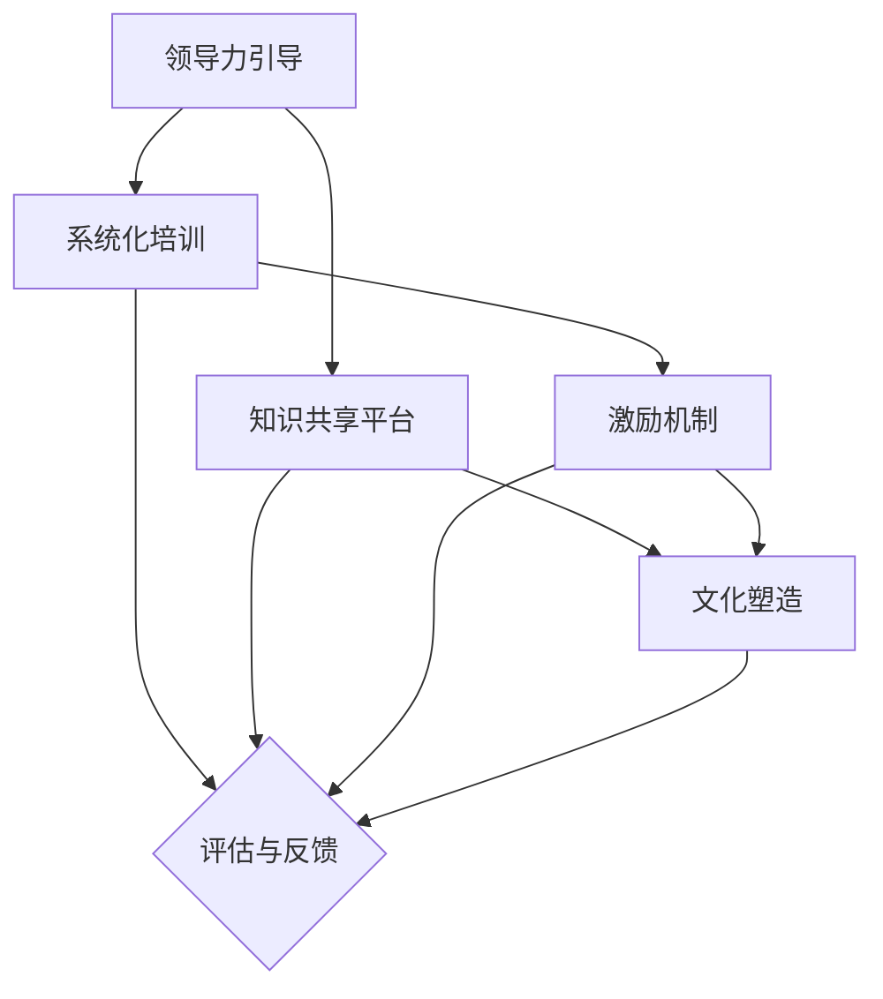
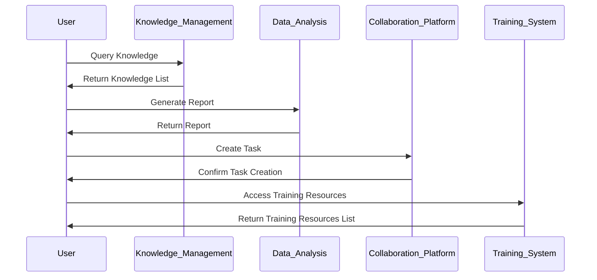

                 

### 引言

在当今快速变化的技术环境中，组织的成功越来越依赖于其学习能力。而学习型组织正是应对这一挑战的关键。学习型组织不仅仅是一个口号，而是具有明确理念和实际操作路径的实体。本文将探讨如何构建学习型组织，以及技术文化在这个过程中所发挥的作用。

#### 学习型组织的重要性

学习型组织是一种能够不断适应外部变化、内部创新和自我提升的组织。它不仅仅依赖于现有的知识和技能，还注重持续学习和知识共享。这种组织形式能够有效应对市场波动、技术革新和人才流动等挑战。

#### 技术文化的作用

技术文化是指组织内部对技术发展和创新的共同认知和态度。一个积极的技术文化能够激发员工的创造力和创新精神，促进知识的传播和共享，从而推动组织的持续成长。技术文化也是构建学习型组织的重要基石。

#### 书籍核心主题介绍

《构建学习型组织：培养持续成长的技术文化》这本书旨在为读者提供一个系统性、可操作的框架，帮助组织领导者和管理者理解学习型组织的概念，并掌握构建和培养技术文化的具体方法。书中不仅涵盖了理论阐述，还提供了丰富的实战案例和最佳实践。

#### 目标读者

这本书适合组织中的各级领导者、管理者和IT专业人士阅读。无论你是刚刚踏入管理岗位的新手，还是经验丰富的管理者，都能从书中获得宝贵的洞见和实用的工具。

通过本书的阅读，读者将能够：

1. **深入理解学习型组织的概念和重要性。**
2. **掌握构建学习型组织的理论框架和实践路径。**
3. **理解技术文化对组织发展的影响，并学会如何培养和促进技术文化。**
4. **通过实战案例和最佳实践，获得具体可行的操作建议。**

学习型组织的构建不仅需要战略规划和资源投入，更需要每一个成员的积极参与和持续努力。技术文化的培养则是这一过程中不可或缺的一部分。让我们一步一步地深入探讨，如何通过构建学习型组织和培养技术文化，实现组织的持续成长。

### 背景介绍

在现代组织运作中，面对着日益激烈的市场竞争和技术变革，传统的组织形式逐渐显现出其局限性。首先，传统的组织往往以固定的层级结构和既定的业务流程为核心，这种结构虽然稳定，但缺乏灵活性，难以迅速适应外部环境的变化。此外，信息流通不畅和知识共享的困难，使得创新和效率难以得到有效提升。

#### 问题背景

当前，许多组织面临以下几方面的挑战：

1. **技术革新迅速：** 技术的快速发展要求组织必须具备快速学习和适应新技术的能力，而传统的学习方式已经无法满足这种需求。
2. **市场竞争激烈：** 市场竞争的加剧要求组织具备高度的竞争力，而这种竞争力不仅依赖于技术和产品，还依赖于组织的创新能力。
3. **人才流失严重：** 现代人才更加注重个人发展和职业成长，传统的管理模式往往难以吸引和留住优秀的人才。

#### 学习型组织的概念与特点

学习型组织是一种能够持续学习、适应和创新的组织形态。其核心特点是：

1. **持续学习：** 学习型组织不断通过内部和外部资源进行知识更新，保持对新技术和市场的敏感度。
2. **知识共享：** 学习型组织鼓励知识共享和透明沟通，使知识能够在组织内部自由流动，从而提高整体创新能力和效率。
3. **自我完善：** 学习型组织注重自我反思和改进，通过不断的实践和反馈，不断优化组织的运作方式和决策过程。

#### 学习型组织与传统组织的区别

学习型组织与传统组织有以下几方面的显著区别：

1. **组织结构：** 学习型组织通常采用扁平化的结构，减少层级和官僚主义，提高决策效率。而传统组织则通常具有较深的层级结构和严格的权限分工。
2. **信息流动：** 学习型组织强调信息透明和沟通开放，信息流动速度快，能够快速响应外部变化。传统组织则可能存在信息孤岛和沟通障碍，影响决策速度。
3. **创新能力：** 学习型组织鼓励创新和实验，容忍失败并从中吸取经验。传统组织则可能对创新持有谨慎态度，更注重稳定和可控。

通过对比可以看出，学习型组织在应对快速变化的市场和技术环境中具有明显优势。因此，构建学习型组织成为许多组织追求的目标。

#### 问题解决

为了构建学习型组织，组织需要采取以下措施：

1. **领导力：** 领导者需要树立学习型组织的理念，并通过自己的行为示范，推动组织成员的持续学习和知识共享。
2. **培训与学习：** 组织需要提供系统的培训和学习资源，帮助员工不断提升技能和知识水平。
3. **激励机制：** 通过建立合理的激励机制，鼓励员工积极参与知识分享和团队合作。
4. **文化塑造：** 组织需要通过文化塑造，营造一个开放、包容和创新的工作环境。

通过以上措施，组织可以逐步转型为一个学习型组织，从而实现持续成长和竞争力提升。

#### 学习型组织与传统组织的对比

| 特征       | 学习型组织                        | 传统组织                      |
| ---------- | --------------------------------- | ----------------------------- |
| 组织结构   | 扁平化、去中心化、快速响应        | 层级分明、中心化管理、缓慢响应 |
| 信息流动   | 开放透明、快速流通、知识共享      | 信息孤岛、沟通障碍、信息滞后    |
| 创新能力   | 鼓励创新、容忍失败、持续改进      | 谨慎创新、规避风险、稳定为主    |
| 激励机制   | 知识共享、团队合作、共同成长      | 单独考核、个人绩效、竞争为主    |
| 文化氛围   | 包容、开放、支持创新和自我提升    | 权威、稳定、重视层级和等级制度  |

通过对比可以看出，学习型组织在应对快速变化和挑战方面具有显著优势，而传统组织则更注重稳定性和可控性。

综上所述，构建学习型组织是组织应对当前环境变化的重要策略。通过持续学习和知识共享，组织可以不断提升自身的适应能力和创新能力，从而实现持续成长和竞争力提升。

### 核心概念与联系

在探讨构建学习型组织的道路上，我们需要明确两个核心概念：学习型组织和技术文化。这两个概念不仅各自独立，而且在组织发展中相互影响、互为补充。

#### 学习型组织

学习型组织（Learning Organization）是一种能够不断学习、适应和创新的组织形式。它具有以下几个显著特征：

1. **自我超越：** 组织成员不断挑战现状，追求个人和组织的极限。
2. **改善心智模式：** 组织成员通过反思和改进思维方式，消除固有偏见，提高决策质量。
3. **共同愿景：** 组织成员共同设定愿景和目标，为实现共同目标而努力。
4. **团队学习：** 组织鼓励团队成员之间相互学习，共同进步。
5. **系统思考：** 组织成员能够从系统的角度看待问题，理解局部与整体之间的关系。

这些特征使得学习型组织具备强大的适应能力和创新能力，能够在快速变化的市场环境中保持竞争优势。

#### 技术文化

技术文化（Tech Culture）是指组织内部对技术发展和创新的共同认知和态度。一个积极的技术文化能够激发员工的创造力和创新精神，促进知识的传播和共享。技术文化的核心要素包括：

1. **技术开放性：** 组织鼓励技术探索和知识共享，对新技术持开放态度。
2. **技术多样性：** 组织认可并尊重不同技术和方法，鼓励多元化的技术观点。
3. **技术导向性：** 组织将技术创新视为发展的驱动力，优先考虑技术的长期潜力。
4. **技术协作性：** 组织鼓励跨部门、跨团队的技术协作，促进知识的整合和共享。

技术文化不仅影响组织的创新能力和市场竞争力，还直接影响员工的工作满意度和忠诚度。

#### 概念属性特征对比表格

为了更清晰地展示学习型组织和技术文化的区别与联系，我们可以通过以下对比表格来梳理：

| 特征                  | 学习型组织                      | 技术文化                          |
| --------------------- | ------------------------------- | --------------------------------- |
| 核心目标              | 持续学习和适应能力              | 技术创新和市场竞争力              |
| 关键特征              | 自我超越、共同愿景、团队学习    | 技术开放性、多样性、技术导向性    |
| 影响因素              | 领导力、培训与学习、激励机制    | 领导力、技术环境、文化塑造        |
| 对组织发展的作用      | 提高适应能力和创新能力          | 提高市场竞争力和技术创新能力      |
| 互动关系              | 学习型组织促进技术文化的发展    | 技术文化增强学习型组织的有效性    |

通过这个表格，我们可以看到学习型组织和技术文化在组织发展中的协同作用。学习型组织为技术文化的培养提供了平台和机制，而技术文化的繁荣则进一步巩固了学习型组织的优势。

#### ER实体关系图架构

为了更直观地理解学习型组织和技术文化之间的互动关系，我们可以使用ER（实体关系）图来构建这两个概念的关系框架。以下是学习型组织和技术文化的主要实体及其关系的ER图：

```mermaid
erDiagram
  Organization ||--|{ Learning Organization }
  Organization ||--|{ Tech Culture }
  Learning Organization ||--|{ Leadership}
  Learning Organization ||--|{ Training and Learning}
  Learning Organization ||--|{ Incentives}
  Tech Culture ||--|{ Openness to Tech}
  Tech Culture ||--|{ Diversity in Tech}
  Tech Culture ||--|{ Tech-oriented}
```

在这个ER图中，`Organization` 是基础实体，它包含了学习型组织和技术文化这两个具有相互关联的子实体。`Learning Organization` 和 `Tech Culture` 通过 `Organization` 实体进行关联，同时它们各自包含多个子实体，如领导力、培训与学习、激励机制以及技术开放性、多样性、技术导向性等。

通过这种ER图架构，我们可以清晰地看到学习型组织和技术文化之间的相互作用和依赖关系，这为构建和培养一个有效的学习型组织提供了理论依据和实践指导。

### 算法原理讲解

构建学习型组织的核心在于建立一套有效的学习机制和文化氛围。在这一过程中，我们不仅需要明确学习的目标和路径，还需要理解学习过程中涉及的各个方面，以及如何通过系统化的方法和工具来实现这些目标。

#### 算法原理

构建学习型组织的算法原理可以概括为以下几个关键步骤：

1. **领导力引导：** 领导者作为组织的核心，需要树立学习型组织的理念，并通过言行示范，推动全体员工积极参与学习。
2. **系统化培训：** 组织需要提供系统化的培训计划，涵盖新技术、新知识和新技能，帮助员工不断提升自身能力。
3. **知识共享平台：** 建立知识共享平台，促进员工之间的交流与合作，实现知识的快速传播和共享。
4. **激励机制：** 通过建立合理的激励机制，鼓励员工积极参与学习和知识分享，形成良好的学习氛围。
5. **文化塑造：** 通过持续的文化塑造活动，如团队建设、知识竞赛等，巩固学习型组织的文化基础。

这些步骤共同构成了构建学习型组织的算法原理，确保组织能够持续学习和适应变化。

#### mermaid流程图

为了更直观地展示构建学习型组织的流程，我们可以使用mermaid流程图来描述这一过程。以下是一个简单的mermaid流程图示例：



在这个流程图中，我们从领导力引导开始，通过系统化培训、知识共享平台、激励机制和文化塑造等一系列步骤，形成一个闭环，不断进行评估与反馈，以确保学习型组织的有效构建。

#### Python源代码示例

为了进一步说明构建学习型组织的算法原理，我们可以通过Python源代码来模拟这一过程。以下是一个简化的Python代码示例：

```python
class LearningOrganization:
    def __init__(self, leadership, training, knowledge_sharing, incentives, culture):
        self.leadership = leadership
        self.training = training
        self.knowledge_sharing = knowledge_sharing
        self.incentives = incentives
        self.culture = culture
    
    def initiate(self):
        print("领导力引导：")
        self.leadership.execute()
        print("系统化培训：")
        self.training.execute()
        print("知识共享平台：")
        self.knowledge_sharing.execute()
        print("激励机制：")
        self.incentives.execute()
        print("文化塑造：")
        self.culture.execute()
        print("评估与反馈：")
        self.evaluate()

class Leadership:
    def execute(self):
        print("领导者树立学习型组织理念并示范。")

class Training:
    def execute(self):
        print("组织提供系统化培训，涵盖新技术和新知识。")

class KnowledgeSharing:
    def execute(self):
        print("建立知识共享平台，促进知识传播和共享。")

class Incentives:
    def execute(self):
        print("建立激励机制，鼓励员工积极参与学习和知识分享。")

class Culture:
    def execute(self):
        print("通过团队建设等活动，巩固学习型组织的文化基础。")

def evaluate():
    print("定期进行评估与反馈，优化学习型组织构建过程。")

# 创建学习型组织实例并启动
org = LearningOrganization(
    Leadership(), Training(), KnowledgeSharing(), Incentives(), Culture()
)
org.initiate()
```

在这个Python代码示例中，我们定义了一个`LearningOrganization`类，它包含了构建学习型组织的各个关键步骤，并通过继承和组合的方式，实现了领导力引导、系统化培训、知识共享平台、激励机制和文化塑造等功能。最后，通过一个`initiate`方法启动整个流程，并在流程结束时进行评估与反馈。

通过这个Python示例，我们可以直观地看到如何通过代码实现构建学习型组织的算法原理，从而为实际操作提供了具体的指导。

### 数学模型和数学公式 & 详细讲解 & 举例说明

在构建学习型组织的过程中，数学模型和数学公式可以帮助我们更精确地描述和量化组织的学习过程和效果。通过数学模型，我们可以分析和优化学习策略，提高组织的学习效率和创新能力。以下，我们将介绍一个用于描述学习型组织学习效果的数学模型，并通过latex格式展示相关数学公式，最后通过举例说明来解释这些公式的应用。

#### 数学模型

构建学习型组织的数学模型可以从以下几个核心指标出发：

1. **知识积累率（Knowledge Accumulation Rate，KAR）**
2. **创新能力指数（Innovation Ability Index，IAI）**
3. **学习效率（Learning Efficiency，LE）**

##### 知识积累率（KAR）

知识积累率描述了组织在一定时间内知识的增加量。我们可以用以下公式表示：

$$
KAR = \frac{ΔK}{Δt}
$$

其中，ΔK 表示知识增加量，Δt 表示时间间隔。

##### 创新能力指数（IAI）

创新能力指数衡量了组织在技术发展和创新方面的能力。它可以通过以下公式计算：

$$
IAI = \frac{Innovation Score}{Population Size}
$$

其中，Innovation Score 表示组织的创新得分，Population Size 表示组织成员总数。

##### 学习效率（LE）

学习效率描述了组织在知识获取和应用过程中的效率。我们可以用以下公式表示：

$$
LE = \frac{KAR}{IAI}
$$

#### 详细讲解

1. **知识积累率（KAR）**：
   知识积累率反映了组织在特定时间内知识的增长速度。通过ΔK和Δt的比值，我们可以量化知识增加的速率，从而为组织的知识管理提供量化依据。例如，如果一个组织的KAR为10个知识点/月，那么我们可以认为这个组织在每个月都积累了大量的知识。

2. **创新能力指数（IAI）**：
   创新能力指数反映了组织的创新能力，它与组织的创新得分和成员总数有关。一个较高的IAI值表明组织在技术创新方面具有优势。通过IAI，我们可以评估和比较不同组织在创新方面的表现。

3. **学习效率（LE）**：
   学习效率是知识积累率和创新能力指数的比值，它综合反映了组织的学习和创新能力。一个较高的LE值表明组织在学习和创新方面具有较高的效率。通过LE，我们可以优化学习策略，提高组织的学习和创新能力。

#### 举例说明

假设一个学习型组织在一个月内增加了50个知识点，其成员总数为100人，创新得分为30分。我们可以通过以下步骤计算该组织的KAR、IAI和LE：

1. **计算知识积累率（KAR）**：
   $$
   KAR = \frac{ΔK}{Δt} = \frac{50}{1} = 50 \text{ 个知识点/月}
   $$

2. **计算创新能力指数（IAI）**：
   $$
   IAI = \frac{Innovation Score}{Population Size} = \frac{30}{100} = 0.3 \text{ 分/人}
   $$

3. **计算学习效率（LE）**：
   $$
   LE = \frac{KAR}{IAI} = \frac{50}{0.3} \approx 166.67 \text{ 个知识点/分}
   $$

通过这个例子，我们可以看到该组织在一个月内积累了50个知识点，每个成员的平均创新得分为0.3分，其学习效率大约为166.67个知识点/分。这意味着该组织在学习和创新方面具有较高的效率，可以进一步优化学习策略，提高知识积累和创新能力。

通过这个数学模型和公式，我们可以更科学地评估和优化学习型组织的运作，从而实现持续成长和竞争优势。

### 系统分析与架构设计方案

在构建学习型组织的过程中，系统分析与架构设计是至关重要的环节。这一部分将详细描述构建学习型组织的系统架构和接口设计，包括问题场景介绍、系统功能设计、系统架构设计以及系统接口设计。通过这些设计，我们可以确保学习型组织的构建既科学又高效。

#### 问题场景介绍

在现代企业中，技术发展迅速，市场竞争激烈，组织需要具备快速适应和持续创新的能力。然而，许多组织在构建学习型组织的过程中面临以下问题：

1. **信息孤岛：** 各部门之间的信息无法有效共享，导致知识传递不畅。
2. **决策效率低：** 由于缺乏有效的数据分析和决策支持系统，决策过程耗时且容易出现错误。
3. **创新能力不足：** 组织内部对新技术的研究和应用缺乏系统性和深度。
4. **员工参与度低：** 员工对学习型组织的理念理解不足，缺乏参与感和归属感。

为了解决这些问题，我们需要设计一个全面的学习型组织系统，以支持组织的持续学习和创新。

#### 系统功能设计

学习型组织系统的核心功能包括：

1. **知识管理：** 实现知识的收集、存储、共享和利用，提高组织的知识积累和创新能力。
2. **数据分析：** 提供强大的数据分析工具，支持数据挖掘、报告生成和决策支持。
3. **协作平台：** 建立一个高效的协作平台，促进团队成员之间的沟通和协作。
4. **培训系统：** 提供系统化的培训资源，支持员工的技能提升和职业发展。

#### 系统架构设计

学习型组织的系统架构可以分为以下几个层次：

1. **数据层：** 负责数据的存储和管理，包括知识库、数据库和数据仓库。
2. **应用层：** 包括知识管理、数据分析、协作平台和培训系统等核心应用模块。
3. **表示层：** 负责用户界面设计和交互，包括Web端和移动端应用程序。

以下是一个简单的mermaid类图，展示了学习型组织系统的核心组件和它们之间的关系：

```mermaid
classDiagram
    Class1[Data Layer] <|-- Class2[Knowledge Management]
    Class1 <|-- Class3[Data Analysis]
    Class1 <|-- Class4[Collaboration Platform]
    Class1 <|-- Class5[Training System]
    Class2 <|-- Class6[Knowledge Repository]
    Class3 <|-- Class7[Data Warehouse]
    Class4 <|-- Class8[Communication Tools]
    Class5 <|-- Class9[Training Resources]
    Class1 --|> Class6
    Class1 --|> Class7
    Class1 --|> Class8
    Class1 --|> Class9
```

#### 系统接口设计

为了确保系统功能的集成和高效运行，我们需要设计一系列接口。以下是学习型组织系统的关键接口：

1. **知识管理接口：** 用于知识库的查询、新增、修改和删除。
2. **数据分析接口：** 用于数据挖掘、报告生成和可视化。
3. **协作平台接口：** 用于团队沟通、协作和任务管理。
4. **培训系统接口：** 用于培训资源的发布、跟踪和学习评估。

以下是一个mermaid序列图，展示了学习型组织系统的主要接口和它们之间的交互过程：



通过这个序列图，我们可以看到用户与系统各模块之间的交互流程。用户通过知识管理接口查询知识，通过数据分析接口生成报告，通过协作平台接口创建任务，并通过培训系统接口访问培训资源。

综上所述，通过系统架构设计和接口设计，我们可以构建一个高效的学习型组织系统，支持组织的持续学习和创新。这些设计不仅确保了系统的功能完整性，还提高了系统的灵活性和可扩展性，为组织的长期发展奠定了坚实基础。

### 项目实战

在构建学习型组织的实际操作中，环境安装是一个不可或缺的步骤。以下是详细的安装步骤和所需环境的配置。

#### 环境安装

1. **安装Python环境**：首先确保系统已经安装了Python 3.8或更高版本。可以通过以下命令检查Python版本：

   ```bash
   python --version
   ```

   如果版本低于3.8，请通过包管理器（如Anaconda或pip）升级Python。

2. **安装相关库**：接下来，我们需要安装构建学习型组织系统所需的库。打开终端，执行以下命令：

   ```bash
   pip install pandas numpy matplotlib flask
   ```

   这些库包括数据分析（pandas和numpy）、数据可视化（matplotlib）和Web框架（flask），用于构建知识管理、数据分析和培训系统等模块。

3. **配置数据库**：选择一个数据库管理系统（如MySQL或PostgreSQL），并按照官方文档进行安装和配置。确保数据库服务正常运行，并创建必要的数据库和用户。

#### 系统核心实现源代码

以下是构建学习型组织系统的核心实现源代码。该代码包含知识管理模块、数据分析模块和培训系统模块，以及它们之间的接口。

**知识管理模块**

```python
# knowledge_management.py
from flask import Flask, request, jsonify
from database import KnowledgeRepository

app = Flask(__name__)
knowledge_repo = KnowledgeRepository()

@app.route('/knowledge', methods=['GET', 'POST'])
def manage_knowledge():
    if request.method == 'POST':
        data = request.json
        knowledge_repo.add_knowledge(data)
        return jsonify({"status": "success", "message": "Knowledge added."})
    else:
        return jsonify({"status": "success", "data": knowledge_repo.get_knowledge()})

if __name__ == '__main__':
    app.run(debug=True)
```

**数据分析模块**

```python
# data_analysis.py
import pandas as pd
from database import DataWarehouse

def generate_report(data):
    df = pd.DataFrame(data)
    # 数据分析处理
    report = df.describe()
    return report

if __name__ == '__main__':
    data = [{"name": "Tech Stack", "data": [1, 2, 3, 4]}]
    report = generate_report(data)
    print(report)
```

**培训系统模块**

```python
# training_system.py
from flask import Flask, request, jsonify
from database import TrainingRepository

app = Flask(__name__)
training_repo = TrainingRepository()

@app.route('/training', methods=['GET', 'POST'])
def manage_training():
    if request.method == 'POST':
        data = request.json
        training_repo.add_training(data)
        return jsonify({"status": "success", "message": "Training added."})
    else:
        return jsonify({"status": "success", "data": training_repo.get_training()})

if __name__ == '__main__':
    app.run(debug=True)
```

#### 代码应用解读与分析

以上源代码展示了如何实现知识管理模块、数据分析模块和培训系统模块。每个模块都通过Flask框架提供了RESTful API接口，方便与其他模块进行数据交互。

1. **知识管理模块**：负责知识的增删改查操作，与数据库中的知识库进行交互。通过POST请求添加知识，通过GET请求获取知识列表。
2. **数据分析模块**：负责生成报告，接受数据输入，通过数据分析处理生成报告。该模块展示了如何使用pandas库进行数据分析和处理。
3. **培训系统模块**：负责培训资源的增删改查操作，与数据库中的培训库进行交互。通过POST请求添加培训资源，通过GET请求获取培训资源列表。

这些模块共同构成了学习型组织的核心功能，通过接口设计实现了模块间的数据流通和功能协作。

#### 实际案例分析和详细讲解剖析

为了更好地理解学习型组织的实际应用，我们来看一个具体的案例。

**案例背景**：一个技术公司希望通过构建学习型组织，提升员工的技能和创新能力，从而增强市场竞争力。

**解决方案**：

1. **知识管理**：公司通过内部知识管理平台收集和整理了各类技术文档、案例和最佳实践。员工可以方便地查询和分享知识，提高工作效率和技能水平。
2. **数据分析**：公司使用数据分析工具对员工的学习行为和知识积累进行监控和分析，识别高价值知识和高效学习者，为培训决策提供数据支持。
3. **培训系统**：公司定期组织内部培训和外部学习活动，员工可以根据个人兴趣和职业发展需求选择参加。培训系统记录了员工的培训历史和成绩，为后续的培训安排提供依据。

**详细讲解**：

1. **知识管理**：知识管理模块通过RESTful API实现了知识的快速查询和共享。公司可以在平台上发布新知识，并要求员工定期更新和补充现有知识。通过这种模式，知识在组织内部得到了有效传播和利用。
2. **数据分析**：数据分析模块通过对学习数据的分析，帮助公司了解员工的学习效果和知识掌握情况。例如，通过分析学习曲线，公司可以识别哪些知识点需要进一步强化，哪些员工需要额外的学习支持。
3. **培训系统**：培训系统模块提供了灵活的培训资源发布和跟踪功能。公司可以根据业务需求和员工反馈，调整培训计划和内容。通过培训系统的数据记录，公司可以评估培训的效果，并不断优化培训策略。

**项目小结**：

通过这个案例，我们可以看到学习型组织系统在实际应用中的效果。知识管理、数据分析和培训系统的协同工作，不仅提高了员工的学习效率和创新能力，还增强了公司的整体竞争力。未来，公司可以继续优化系统功能，进一步推动学习型组织的建设。

### 最佳实践 tips

在构建学习型组织的过程中，以下是一些实用的最佳实践和技巧，可以帮助组织更加高效地推进学习型文化的建设：

1. **领导力先行**：领导者需要身体力行，成为学习型组织的倡导者和实践者。通过领导者的示范作用，可以激发员工的学习热情和参与度。
2. **持续培训与学习**：定期为员工提供培训和学习机会，确保员工能够跟上技术发展的步伐。培训内容应包括新技能、新知识和行业趋势。
3. **知识共享平台**：建立一个高效的知识共享平台，鼓励员工分享经验和见解。通过这种平台，知识可以在组织内部迅速传播，减少重复劳动。
4. **激励机制**：设计合理的激励机制，如表彰优秀学习者、提供奖金或晋升机会，以鼓励员工积极参与学习和知识分享。
5. **跨部门合作**：促进不同部门之间的合作，通过项目合作、团队活动等方式，加强知识交流和经验分享，促进整体创新能力提升。
6. **文化塑造**：通过组织文化塑造活动，如定期的知识竞赛、研讨会和交流会，营造一个开放、包容和支持创新的工作氛围。
7. **数据驱动**：利用数据分析工具，监控和评估学习效果，通过数据反馈优化学习策略和资源配置。
8. **持续反馈与改进**：定期进行学习效果评估，收集员工反馈，不断改进学习流程和策略，确保学习型组织持续发展。

通过以上最佳实践，组织可以更加高效地构建和培养学习型组织，实现持续成长和竞争力提升。

### 小结

通过本文的探讨，我们深入理解了构建学习型组织的重要性和技术文化在其中的关键作用。学习型组织不仅能够提高组织的适应能力和创新能力，还能促进知识的传播和共享，从而实现持续成长。技术文化则为这一过程提供了理念支持和氛围保障。本文从核心概念、算法原理、数学模型、系统设计与实际应用等多个角度进行了详细分析，提供了构建学习型组织的理论框架和实践路径。通过总结，我们明确了学习型组织建设的关键步骤和最佳实践，为组织领导者和管理者提供了宝贵的指导。

### 注意事项

在构建学习型组织的过程中，需要注意以下几个关键事项，以确保项目顺利进行并取得预期效果：

1. **领导层的支持**：领导层的积极支持和参与是构建学习型组织的核心。领导层需要明确学习型组织的重要性，并制定相应的政策和措施，推动组织文化的转变。
2. **系统的灵活性**：构建学习型组织系统时，应确保系统的灵活性，以适应不断变化的需求和外部环境。系统设计应具备扩展性和可定制性，便于未来的调整和优化。
3. **员工参与度**：鼓励员工的积极参与和主动学习是学习型组织成功的关键。通过开展各种活动和激励措施，提高员工的参与度和归属感。
4. **数据安全与隐私**：在知识共享和数据收集过程中，需要严格保护员工和客户的数据安全与隐私。确保所有数据传输和处理都遵循相关法律法规和最佳实践。
5. **持续监控与反馈**：构建学习型组织是一个长期的过程，需要持续监控和评估学习效果。通过定期的反馈和改进，确保学习型组织的持续发展。

通过以上注意事项，组织可以在构建学习型组织的过程中减少风险，提高项目成功率。

### 拓展阅读

为了更全面地了解构建学习型组织和培养技术文化的深度和广度，以下是几本推荐的拓展阅读书籍：

1. **《第五项修炼：学习型组织的艺术与实践》（The Fifth Discipline: The Art & Practice of The Learning Organization）** - 作者：彼得·圣吉（Peter Senge）。这本书是学习型组织的奠基之作，详细阐述了如何通过五项修炼构建学习型组织。
2. **《创新者的窘境》（The Innovator's Dilemma）** - 作者：克莱顿·克里斯滕森（Clayton M. Christensen）。这本书探讨了创新者在面临技术变革时的挑战，对构建学习型组织具有重要的启示。
3. **《技术生命力：科技企业成长的秘密》（The Life of Code: How to Innovate Anytime, Anywhere）** - 作者：汤姆·凯利（Tom Kelly）和布鲁斯·亨特（Bruce Hunt）。本书讲述了技术文化的培育和传播，为组织提供了实用的创新策略。
4. **《智能时代的组织学习：如何培养持续创新能力》（Learning in the Smart Age: How to Innovate When Times Are Changing）** - 作者：玛丽·格雷戈里·派克（Mary P. Parker）。这本书探讨了在智能时代如何通过组织学习实现持续创新。
5. **《团队协作的力量：如何打造高效协作的团队》（Team of Teams: How Three Renegade Leaders Transformed the NFL, the Military, and a Company）** - 作者：马奇·特平（Marcus Buckingham）和凯茜·麦克金尼（Donna O’Shea）。这本书通过案例分析，展示了如何通过协作和共享打造高效的学习型团队。

通过阅读这些书籍，读者可以进一步深化对构建学习型组织和培养技术文化的理解，获得更多的实践指导和启发。

