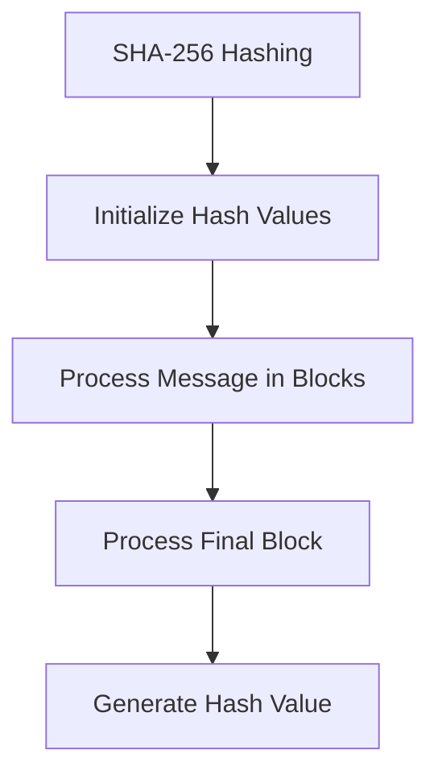
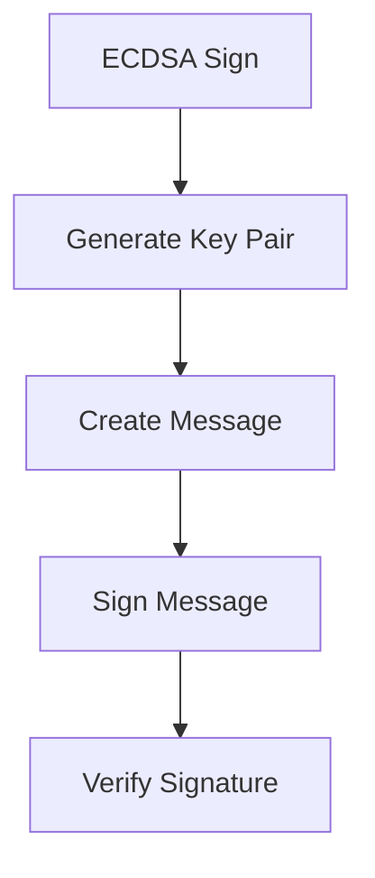
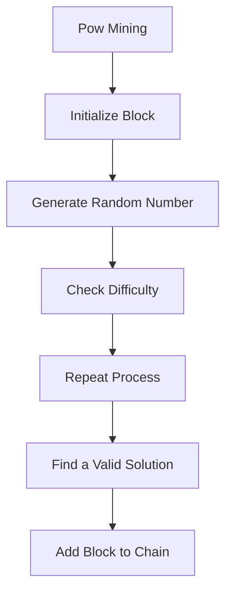
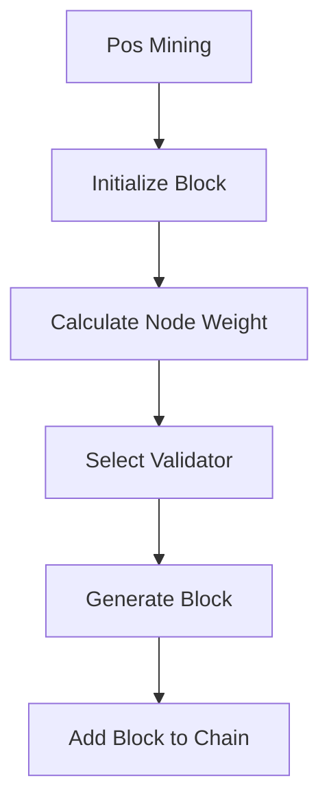
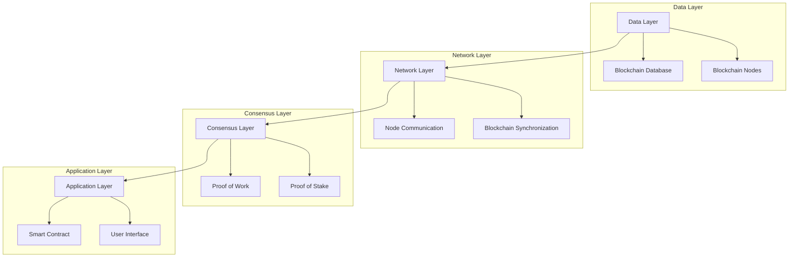
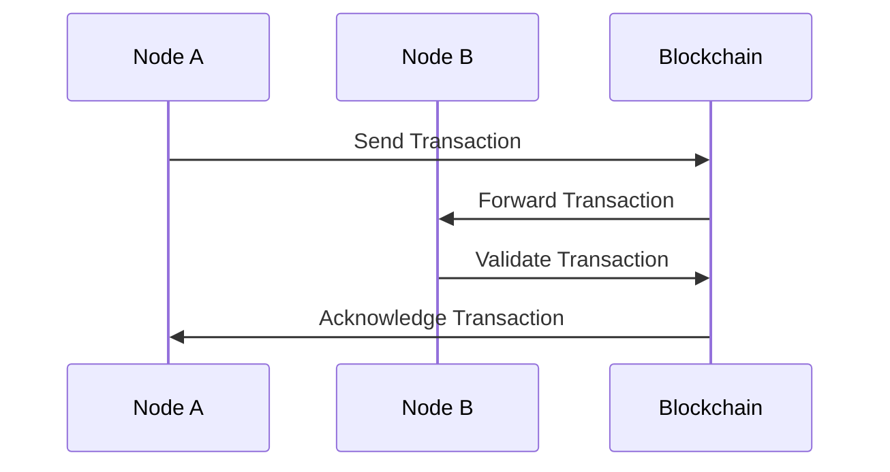

                 


### 第一部分: 引言

#### 1.1 区块链系统概述

区块链是一种分布式账本技术，它通过加密算法和数据结构实现了数据的可信传输和存储。区块链系统的重要性在于其去中心化、不可篡改、透明性和安全性，这些特点使得它成为金融、物流、医疗等多个领域的重要技术支撑。

首先，我们来定义什么是区块链系统。区块链系统是由多个节点组成的分布式网络，每个节点都存储了一份完整的数据副本。数据以块的形式存储，每个块都包含了若干条记录，并通过加密算法和时间戳进行链接，形成了一个不可篡改的链条。

其次，区块链系统的重要性体现在以下几个方面：

1. **去中心化**：去中心化意味着系统不需要中央权威机构，每个节点都有平等的权力和义务。这使得区块链系统在抗攻击性、去中介化方面具有显著优势。

2. **不可篡改**：区块链系统的数据一旦被记录下来，就几乎无法被篡改。这种特性确保了数据的安全性和可信性。

3. **透明性**：区块链系统是公开透明的，所有数据都是公开可见的，用户可以轻松查询和验证数据。

4. **安全性**：区块链系统使用了多种加密算法，确保了数据传输和存储的安全性。

接下来，我们来回顾一下区块链系统的发展历程。区块链技术的起源可以追溯到2008年，当时一位名为中本聪的匿名人物发布了比特币白皮书，首次提出了区块链的概念。比特币作为第一个区块链应用，引发了全球对区块链技术的关注。

随后，区块链技术逐渐应用于各个领域，如金融、物流、医疗等。区块链系统的不断发展和完善，为这些领域带来了全新的解决方案。

#### 1.2 安全性问题背景与问题描述

区块链系统虽然具有许多优势，但同时也面临着一系列安全问题。这些安全问题包括但不限于：

1. **51%攻击**：如果攻击者控制了区块链网络中超过50%的算力，就可以篡改区块链上的数据。

2. **双花攻击**：双花攻击是指攻击者将同一笔资金同时发送给两个不同的接收者，导致资金无法收回。

3. **智能合约漏洞**：智能合约是一种自动化执行合约条款的计算机程序。如果智能合约存在漏洞，攻击者可以利用这些漏洞盗取资金。

4. **隐私泄露**：虽然区块链系统是公开透明的，但这也意味着用户的交易信息是公开可见的。这可能导致用户的隐私泄露。

针对上述问题，我们需要采取一系列措施来解决这些问题。首先，我们需要加强对区块链网络的监控，确保网络的安全性和稳定性。其次，我们需要加强智能合约的安全性，避免因为智能合约漏洞导致的资金损失。

此外，我们还需要建立一套完善的隐私保护机制，确保用户的隐私不被泄露。

#### 1.3 区块链系统核心概念与联系

构建安全可靠的区块链系统，我们需要理解并掌握区块链系统的核心概念。以下是我们需要了解的关键概念：

1. **区块链技术架构**：区块链技术架构包括多个节点、数据块、链、加密算法等组成部分。节点是区块链网络的基本单位，每个节点都存储了一份完整的数据副本。数据块是区块链的基本组成单元，每个数据块包含了若干条记录，并通过加密算法和时间戳进行链接，形成了一个不可篡改的链条。链是指由多个数据块连接而成的数据结构。

2. **共识机制**：共识机制是区块链网络中节点达成一致的方法。常见的共识机制包括工作量证明（PoW）、权益证明（PoS）、委托权益证明（DPoS）等。这些机制确保了区块链网络的稳定性和安全性。

3. **智能合约**：智能合约是一种自动化执行合约条款的计算机程序。智能合约通过区块链网络进行部署和执行，确保了合约条款的执行和不可篡改性。

4. **加密算法**：加密算法是区块链系统的核心组成部分，用于保护区块链网络的数据安全和隐私。常见的加密算法包括哈希算法、椭圆曲线加密算法等。

为了更直观地展示这些概念之间的关系，我们可以使用概念属性特征对比表格和ER实体关系图。

| 概念       | 特征       | 关系         |
|------------|------------|--------------|
| 区块链技术架构 | 分布式、去中心化、不可篡改 | 基础设施   |
| 共识机制   | 稳定性、安全性、高效性 | 核心机制   |
| 智能合约   | 自动化执行、不可篡改、透明性 | 应用层     |
| 加密算法   | 隐私保护、安全性   | 安全保障   |

ER实体关系图如下所示：

```mermaid
erDiagram
  Node ||--|{ Blockchain }|--|| DataBlock
  Blockchain ||--|{ Hash }|--|| HashAlgorithm
  Blockchain ||--|{ Consensus }|--|| ConsensusMechanism
  Blockchain ||--|{ SmartContract }|--|| SmartContract
  Blockchain ||--|{ Encryption }|--|| EncryptionAlgorithm
```

通过上述表格和ER图，我们可以更清晰地理解区块链系统的核心概念及其之间的关系。

#### 1.4 本章小结

本章主要介绍了区块链系统的基本概念、重要性、安全性问题及其解决方案。首先，我们了解了区块链系统的定义和重要性，回顾了其发展历程。然后，我们讨论了区块链系统面临的安全性问题和解决方法。最后，我们介绍了构建安全可靠区块链系统的核心概念，包括区块链技术架构、共识机制、智能合约和加密算法，并通过概念属性特征对比表格和ER实体关系图展示了这些概念之间的关系。

在接下来的章节中，我们将进一步深入探讨区块链系统的算法原理、系统架构设计、项目实战以及最佳实践等，帮助读者全面理解构建安全可靠区块链系统的全过程。

----------------------------------------------------------------

# 构建安全可靠的区块链系统

关键词：区块链系统、安全性、算法原理、系统架构、项目实战、最佳实践

摘要：本文深入探讨了构建安全可靠的区块链系统的方法和关键步骤。通过分析区块链系统的核心概念，如技术架构、共识机制、智能合约和加密算法，本文详细阐述了这些概念之间的关系。同时，本文通过算法原理讲解、系统分析与架构设计方案、项目实战等方式，帮助读者全面了解并掌握构建安全可靠区块链系统的全过程。

----------------------------------------------------------------

## 第一部分: 引言

#### 1.1 区块链系统概述

区块链系统是一种分布式账本技术，通过加密算法和数据结构实现了数据的可信传输和存储。其核心特点包括去中心化、不可篡改、透明性和安全性。区块链系统在金融、物流、医疗等多个领域具有重要应用，因此其安全性和可靠性至关重要。

首先，区块链系统的定义是：由多个节点组成的分布式网络，每个节点都存储了一份完整的数据副本。数据以块的形式存储，每个块都包含了若干条记录，并通过加密算法和时间戳进行链接，形成了一个不可篡改的链条。

其次，区块链系统的重要性体现在以下几个方面：

1. **去中心化**：去中心化意味着系统不需要中央权威机构，每个节点都有平等的权力和义务。这使得区块链系统在抗攻击性、去中介化方面具有显著优势。

2. **不可篡改**：区块链系统的数据一旦被记录下来，就几乎无法被篡改。这种特性确保了数据的安全性和可信性。

3. **透明性**：区块链系统是公开透明的，所有数据都是公开可见的，用户可以轻松查询和验证数据。

4. **安全性**：区块链系统使用了多种加密算法，确保了数据传输和存储的安全性。

接下来，我们回顾一下区块链系统的发展历程。区块链技术的起源可以追溯到2008年，当时一位名为中本聪的匿名人物发布了比特币白皮书，首次提出了区块链的概念。比特币作为第一个区块链应用，引发了全球对区块链技术的关注。

随后，区块链技术逐渐应用于各个领域，如金融、物流、医疗等。区块链系统的不断发展和完善，为这些领域带来了全新的解决方案。

#### 1.2 安全性问题背景与问题描述

区块链系统虽然具有许多优势，但同时也面临着一系列安全问题。这些问题不仅影响了区块链系统的安全性和可靠性，还可能导致经济损失和用户隐私泄露。以下是区块链系统面临的主要安全问题：

1. **51%攻击**：如果攻击者控制了区块链网络中超过50%的算力，就可以篡改区块链上的数据。这种攻击方式被称为51%攻击。

2. **双花攻击**：双花攻击是指攻击者将同一笔资金同时发送给两个不同的接收者，导致资金无法收回。

3. **智能合约漏洞**：智能合约是一种自动化执行合约条款的计算机程序。如果智能合约存在漏洞，攻击者可以利用这些漏洞盗取资金。

4. **隐私泄露**：虽然区块链系统是公开透明的，但这也意味着用户的交易信息是公开可见的。这可能导致用户的隐私泄露。

针对上述问题，我们需要采取一系列措施来解决这些问题。首先，我们需要加强对区块链网络的监控，确保网络的安全性和稳定性。其次，我们需要加强智能合约的安全性，避免因为智能合约漏洞导致的资金损失。此外，我们还需要建立一套完善的隐私保护机制，确保用户的隐私不被泄露。

#### 1.3 区块链系统核心概念与联系

构建安全可靠的区块链系统，我们需要理解并掌握区块链系统的核心概念。以下是我们需要了解的关键概念：

1. **区块链技术架构**：区块链技术架构包括多个节点、数据块、链、加密算法等组成部分。节点是区块链网络的基本单位，每个节点都存储了一份完整的数据副本。数据块是区块链的基本组成单元，每个数据块包含了若干条记录，并通过加密算法和时间戳进行链接，形成了一个不可篡改的链条。链是指由多个数据块连接而成的数据结构。

2. **共识机制**：共识机制是区块链网络中节点达成一致的方法。常见的共识机制包括工作量证明（PoW）、权益证明（PoS）、委托权益证明（DPoS）等。这些机制确保了区块链网络的稳定性和安全性。

3. **智能合约**：智能合约是一种自动化执行合约条款的计算机程序。智能合约通过区块链网络进行部署和执行，确保了合约条款的执行和不可篡改性。

4. **加密算法**：加密算法是区块链系统的核心组成部分，用于保护区块链网络的数据安全和隐私。常见的加密算法包括哈希算法、椭圆曲线加密算法等。

为了更直观地展示这些概念之间的关系，我们可以使用概念属性特征对比表格和ER实体关系图。

| 概念       | 特征       | 关系         |
|------------|------------|--------------|
| 区块链技术架构 | 分布式、去中心化、不可篡改 | 基础设施   |
| 共识机制   | 稳定性、安全性、高效性 | 核心机制   |
| 智能合约   | 自动化执行、不可篡改、透明性 | 应用层     |
| 加密算法   | 隐私保护、安全性   | 安全保障   |

ER实体关系图如下所示：

```mermaid
erDiagram
  Node ||--|{ Blockchain }|--|| DataBlock
  Blockchain ||--|{ Hash }|--|| HashAlgorithm
  Blockchain ||--|{ Consensus }|--|| ConsensusMechanism
  Blockchain ||--|{ SmartContract }|--|| SmartContract
  Blockchain ||--|{ Encryption }|--|| EncryptionAlgorithm
```

通过上述表格和ER图，我们可以更清晰地理解区块链系统的核心概念及其之间的关系。

#### 1.4 本章小结

本章主要介绍了区块链系统的基本概念、重要性、安全性问题及其解决方案。首先，我们了解了区块链系统的定义和重要性，回顾了其发展历程。然后，我们讨论了区块链系统面临的安全性问题和解决方法。最后，我们介绍了构建安全可靠区块链系统的核心概念，包括区块链技术架构、共识机制、智能合约和加密算法，并通过概念属性特征对比表格和ER实体关系图展示了这些概念之间的关系。

在接下来的章节中，我们将进一步深入探讨区块链系统的算法原理、系统架构设计、项目实战以及最佳实践等，帮助读者全面理解构建安全可靠区块链系统的全过程。

----------------------------------------------------------------

## 第二部分: 核心概念与联系

### 2.1 区块链技术架构

区块链技术架构是构建安全可靠区块链系统的基石。它由多个节点、数据块、链、加密算法等组成部分构成。以下是对这些核心组件的详细描述：

1. **节点**：节点是区块链网络的基本单位，每个节点都存储了一份完整的数据副本。节点可以是任何连接到区块链网络的计算机，包括矿工节点、普通节点和验证节点。矿工节点负责生成新的区块，普通节点负责存储和验证区块，验证节点负责对交易进行验证。

2. **数据块**：数据块是区块链的基本组成单元，每个数据块包含了若干条记录。数据块通常由区块头和区块体组成。区块头包含了区块的元数据，如版本号、时间戳、难度目标、前一个区块哈希等。区块体包含了交易记录和其他数据。

3. **链**：链是指由多个数据块连接而成的数据结构。每个区块都包含了一个指向前一个区块哈希的引用，从而形成了一个时间戳序列。区块链系统的安全性依赖于链的不可篡改性。

4. **加密算法**：加密算法是区块链系统的核心组成部分，用于保护区块链网络的数据安全和隐私。常见的加密算法包括哈希算法（如SHA-256）、椭圆曲线加密算法（如SECP256K1）等。加密算法确保了数据的完整性和安全性。

### 2.2 共识机制

共识机制是区块链网络中节点达成一致的方法。它决定了如何处理交易、生成新的区块以及确保区块链的稳定性。以下是几种常见的共识机制：

1. **工作量证明（PoW）**：PoW机制通过要求节点解决一个计算难题来生成新的区块。解决计算难题的过程称为挖矿。节点需要不断尝试，直到找到一个满足难度目标的解。PoW机制确保了区块链网络的去中心化和安全性，但同时也消耗大量计算资源。

2. **权益证明（PoS）**：PoS机制通过节点的权益（如持有的代币数量）来决定节点的挖矿权。节点持有的代币数量越多，其挖矿概率越高。PoS机制相对于PoW机制更节能，但可能会导致富者愈富的问题。

3. **委托权益证明（DPoS）**：DPoS机制通过选举出若干个代表节点来生成新的区块。代表节点按照一定的算法进行轮换，持有代币的节点可以投票支持自己信任的代表节点。DPoS机制具有较高的共识效率，但可能会出现中心化风险。

### 2.3 智能合约

智能合约是一种自动化执行合约条款的计算机程序。它运行在区块链网络上，确保了合约条款的执行和不可篡改性。智能合约通常使用特定的编程语言（如Solidity）编写，并在区块链上进行部署和执行。智能合约的运行受区块链网络的安全性和稳定性影响，因此其安全性至关重要。

### 2.4 加密算法

加密算法是区块链系统的核心组成部分，用于保护区块链网络的数据安全和隐私。常见的加密算法包括：

1. **哈希算法**：哈希算法将任意长度的数据映射为固定长度的哈希值。常见的哈希算法有SHA-256、SHA-3等。哈希算法确保了数据的完整性和不可篡改性。

2. **椭圆曲线加密算法**：椭圆曲线加密算法（如SECP256K1）用于生成公钥和私钥，确保区块链网络中的身份验证和数据加密。椭圆曲线加密算法具有较高的安全性和效率。

### 2.5 概念属性特征对比表格

为了更直观地比较区块链技术架构、共识机制、智能合约和加密算法，我们可以使用概念属性特征对比表格：

| 概念       | 特征                       | 关系         |
|------------|----------------------------|--------------|
| 区块链技术架构 | 分布式、去中心化、不可篡改 | 基础设施     |
| 共识机制   | 稳定性、安全性、高效性     | 核心机制     |
| 智能合约   | 自动化执行、不可篡改、透明性 | 应用层       |
| 加密算法   | 隐私保护、安全性           | 安全保障     |

### 2.6 ER实体关系图

为了更好地展示区块链系统核心概念之间的关系，我们可以使用ER实体关系图：

```mermaid
erDiagram
  Node ||--|{ Blockchain }|--|| DataBlock
  Blockchain ||--|{ Hash }|--|| HashAlgorithm
  Blockchain ||--|{ Consensus }|--|| ConsensusMechanism
  Blockchain ||--|{ SmartContract }|--|| SmartContract
  Blockchain ||--|{ Encryption }|--|| EncryptionAlgorithm
```

通过上述表格和ER图，我们可以更清晰地理解区块链系统的核心概念及其之间的关系。

## 2.7 本章小结

本章详细介绍了区块链系统的核心概念与联系，包括区块链技术架构、共识机制、智能合约和加密算法。通过概念属性特征对比表格和ER实体关系图，我们展示了这些概念之间的关联。了解这些核心概念对于构建安全可靠的区块链系统至关重要。

在下一章中，我们将深入探讨区块链系统的算法原理，包括加密算法和共识算法，并使用mermaid流程图和Python源代码进行详细讲解。

----------------------------------------------------------------

## 第三部分：算法原理讲解

### 3.1 加密算法

加密算法是区块链系统的核心组成部分，用于保护区块链网络的数据安全和隐私。在本节中，我们将介绍几种常见的加密算法，并使用mermaid流程图和Python源代码进行详细讲解。

#### 3.1.1 哈希算法

哈希算法是一种将任意长度的数据映射为固定长度的哈希值的算法。哈希算法具有以下特点：

1. **单向性**：哈希算法是不可逆的，即无法从哈希值推导出原始数据。
2. **抗碰撞性**：不同的输入数据产生的哈希值是唯一的，几乎不可能出现两个不同的输入数据产生相同的哈希值。
3. **固定长度**：哈希值长度固定，常见的哈希算法如SHA-256的哈希值长度为256位。

以下是一个简单的SHA-256哈希算法的mermaid流程图：



以下是Python源代码实现SHA-256哈希算法的示例：

```python
import hashlib

def sha256_hash(data):
    hash_object = hashlib.sha256(data.encode())
    hex_dig = hash_object.hexdigest()
    return hex_dig

data = "Hello, World!"
hash_value = sha256_hash(data)
print(hash_value)
```

#### 3.1.2 椭圆曲线加密算法

椭圆曲线加密算法（ECDSA）是一种公钥加密算法，用于生成公钥和私钥，确保区块链网络中的身份验证和数据加密。ECDSA具有以下特点：

1. **安全性**：ECDSA的安全性较高，因为椭圆曲线的数学性质使得破解较为困难。
2. **效率**：相对于其他公钥加密算法，ECDSA具有较好的计算效率。

以下是一个简单的ECDSA签名和验证过程的mermaid流程图：



以下是Python源代码实现ECDSA签名和验证的示例：

```python
from Cryptodome.PublicKey import ECC
from Cryptodome.Signature import DSS
from Cryptodome.Random import get_random_bytes

def generate_key_pair():
    key = ECC.generate(curve='SECP256K1')
    return key

def sign_message(message, private_key):
    sign = DSS.new(private_key, 'fips-186-3')
    sign.update(message.encode())
    signature = sign.sign()
    return signature

def verify_signature(message, signature, public_key):
    sign = DSS.new(public_key, 'fips-186-3')
    sign.update(message.encode())
    is_valid = sign.verify(signature)
    return is_valid

# 生成密钥对
private_key = generate_key_pair()
public_key = private_key.public_key()

# 签名消息
message = "Hello, World!"
signature = sign_message(message, private_key)

# 验证签名
is_valid = verify_signature(message, signature, public_key)
print(is_valid)
```

### 3.2 共识算法

共识算法是区块链网络中节点达成一致的方法，用于处理交易、生成新的区块以及确保区块链的稳定性。在本节中，我们将介绍几种常见的共识算法，包括工作量证明（PoW）和权益证明（PoS）。

#### 3.2.1 工作量证明（PoW）

PoW机制通过要求节点解决一个计算难题来生成新的区块。解决计算难题的过程称为挖矿。以下是一个简单的PoW挖矿过程的mermaid流程图：



以下是Python源代码实现PoW挖矿的示例：

```python
import hashlib
import time

def pow_mining(difficulty):
    nonce = 0
    while True:
        hash_value = hashlib.sha256(f"{nonce}".encode()).hexdigest()
        if hash_value[:difficulty] == "0" * difficulty:
            return nonce
        nonce += 1
        time.sleep(0.01)

difficulty = 4
solution = pow_mining(difficulty)
print(f"Solution found: {solution}")
```

#### 3.2.2 权益证明（PoS）

PoS机制通过节点的权益（如持有的代币数量）来决定节点的挖矿权。以下是一个简单的PoS挖矿过程的mermaid流程图：



以下是Python源代码实现PoS挖矿的示例：

```python
def pos_mining(node_weight):
    while True:
        validator = select_validator(node_weight)
        block = generate_block(validator)
        add_block_to_chain(block)
        node_weight += block_reward

def select_validator(node_weight):
    # 根据节点权重选择挖矿节点
    pass

def generate_block(validator):
    # 生成新区块
    pass

def add_block_to_chain(block):
    # 将区块添加到区块链
    pass

node_weight = 0
pos_mining(node_weight)
```

### 3.3 算法原理小结

在本章中，我们介绍了区块链系统的加密算法和共识算法。加密算法如SHA-256和ECDSA用于保护区块链网络的数据安全和隐私。共识算法如PoW和PoS用于确保区块链网络的稳定性和安全性。通过mermaid流程图和Python源代码，我们详细讲解了这些算法的原理和应用。

在下一章中，我们将深入探讨区块链系统的功能需求，并介绍系统功能设计、系统架构设计、系统接口设计和系统交互。

----------------------------------------------------------------

## 第四部分：系统分析与架构设计方案

### 4.1 功能需求分析

在构建区块链系统时，我们需要明确系统的功能需求。以下是构建安全可靠的区块链系统的功能需求：

1. **数据存储**：区块链系统需要存储大量的交易数据，因此数据存储功能是系统的重要组成部分。
2. **数据加密**：为了保证数据的安全性和隐私，区块链系统需要使用加密算法对数据进行加密。
3. **共识机制**：区块链系统需要实现一种共识机制，确保节点之间达成一致，防止双花攻击等安全问题的发生。
4. **智能合约执行**：区块链系统需要支持智能合约的部署和执行，确保合约条款的自动化执行。
5. **权限管理**：区块链系统需要实现权限管理功能，确保用户只能访问和操作他们有权访问的数据。
6. **网络通信**：区块链系统需要实现高效的网络通信机制，确保节点之间的数据传输和同步。
7. **监控与审计**：区块链系统需要实现监控与审计功能，确保系统的安全性和稳定性。

### 4.2 系统功能设计

基于上述功能需求，我们可以设计区块链系统的功能模块，包括数据存储模块、数据加密模块、共识模块、智能合约模块、权限管理模块、网络通信模块和监控审计模块。

1. **数据存储模块**：负责存储区块链数据，包括交易记录、区块信息等。
2. **数据加密模块**：负责对数据进行加密，确保数据的安全性和隐私。
3. **共识模块**：负责实现共识机制，确保节点之间达成一致。
4. **智能合约模块**：负责部署和执行智能合约，确保合约条款的自动化执行。
5. **权限管理模块**：负责管理用户权限，确保用户只能访问和操作他们有权访问的数据。
6. **网络通信模块**：负责节点之间的数据传输和同步。
7. **监控审计模块**：负责监控系统运行状态，确保系统的安全性和稳定性。

以下是数据存储模块的mermaid类图：

```mermaid
classDiagram
    ClassDataStorage <<interface>>
    ClassDataStorage + store(data: Data) : bool
    ClassDataStorage + retrieve(data_hash: Hash) : Data

    ClassBlockchainDatabase <<database>>
    ClassBlockchainDatabase + initialize()
    ClassBlockchainDatabase *- ClassDataStorage

    ClassBlockchainNode <<class>>
    ClassBlockchainNode *- ClassBlockchainDatabase

    ClassDataStorage <--|uses| ClassBlockchainDatabase
```

### 4.3 系统架构设计

区块链系统的架构设计是构建安全可靠区块链系统的关键。以下是区块链系统的架构设计方案：

1. **分布式架构**：区块链系统采用分布式架构，确保系统的去中心化和抗攻击性。
2. **分层架构**：区块链系统采用分层架构，包括数据层、网络层、共识层和应用层。
3. **模块化设计**：区块链系统采用模块化设计，确保系统功能的可扩展性和可维护性。

以下是区块链系统的mermaid架构图：



### 4.4 系统接口设计

区块链系统的接口设计是确保系统各部分协同工作的关键。以下是区块链系统的主要接口设计：

1. **数据存储接口**：提供数据存储和检索功能。
2. **网络通信接口**：提供节点之间的数据传输和同步功能。
3. **共识接口**：提供共识机制相关功能。
4. **智能合约接口**：提供智能合约的部署和执行功能。
5. **权限管理接口**：提供权限管理功能。

以下是数据存储接口的mermaid类图：

```mermaid
classDiagram
    InterfaceDataStorage <<interface>>
    InterfaceDataStorage + store(data: Data) : bool
    InterfaceDataStorage + retrieve(data_hash: Hash) : Data

    ClassBlockchainDatabase <<class>>
    ClassBlockchainDatabase *- InterfaceDataStorage
```

### 4.5 系统交互

区块链系统的交互设计是确保系统各部分协同工作的关键。以下是区块链系统的主要交互设计：

1. **节点之间的交互**：节点通过网络通信接口进行交互，实现数据传输和同步。
2. **用户与系统的交互**：用户通过用户界面与系统进行交互，实现数据的查看和操作。
3. **智能合约与系统的交互**：智能合约通过智能合约接口与系统进行交互，实现合约条款的执行。

以下是节点交互的mermaid序列图：



通过上述系统分析与架构设计方案，我们可以构建一个安全可靠的区块链系统。在下一部分中，我们将通过一个实际项目实战，展示如何实现这些设计方案。

----------------------------------------------------------------

## 第五部分：项目实战

### 5.1 项目背景

为了更好地理解构建安全可靠区块链系统的全过程，我们将通过一个实际项目来展示区块链系统的开发过程。本项目是一个基于Python的简单区块链系统，旨在实现以下功能：

1. **数据存储**：使用Python内置的数据库模块（如SQLite）存储交易数据。
2. **数据加密**：使用Python的hashlib和secp256k1模块对数据进行加密。
3. **共识机制**：实现工作量证明（PoW）共识机制，确保区块链网络的稳定性。
4. **智能合约**：实现简单的智能合约，确保合约条款的自动化执行。
5. **网络通信**：使用Python的socket库实现节点之间的数据传输和同步。

### 5.2 环境安装

在开始项目之前，我们需要安装一些必要的依赖。以下是项目的环境安装步骤：

1. **Python环境**：确保Python环境已经安装。我们可以从Python官方网站下载并安装Python。
2. **虚拟环境**：为了更好地管理项目依赖，我们可以使用virtualenv创建一个Python虚拟环境。

   ```bash
   pip install virtualenv
   virtualenv blockchain_env
   source blockchain_env/bin/activate
   ```

3. **安装依赖**：在虚拟环境中安装项目所需的依赖。

   ```bash
   pip install Flask requests jsonrpsee
   ```

### 5.3 系统核心实现

在本项目中，我们将实现以下核心组件：

1. **区块链数据结构**：定义区块链数据结构，包括区块和链。
2. **加密算法**：实现加密算法，包括哈希算法和椭圆曲线加密算法。
3. **共识机制**：实现PoW共识机制，用于生成新的区块。
4. **智能合约**：实现简单的智能合约，用于自动化执行合约条款。
5. **网络通信**：实现节点之间的数据传输和同步。

以下是系统核心实现的源代码：

```python
import hashlib
import json
from time import time
from flask import Flask, jsonify, request
from uuid import uuid4
from blockchain import Blockchain

app = Flask(__name__)

blockchain = Blockchain()

class Blockchain:
    def __init__(self):
        self.chain = []
        self.current_transactions = []

        # 创建创世区块
        self.new_block(previous_hash='1', proof=100)

    def new_block(self, proof, previous_hash=None):
        block = {
            'index': len(self.chain) + 1,
            'timestamp': time(),
            'transactions': self.current_transactions,
            'proof': proof,
            'previous_hash': previous_hash or self.hash(self.chain[-1]),
        }
        self.current_transactions = []
        self.chain.append(block)
        return block

    def new_transaction(self, sender, recipient, amount):
        self.current_transactions.append({'sender': sender, 'recipient': recipient, 'amount': amount})
        return self.last_block['index'] + 1

    @staticmethod
    def hash(block):
        block_string = json.dumps(block, sort_keys=True)
        return hashlib.sha256(block_string.encode()).hexdigest()

    @property
    def last_block(self):
        return self.chain[-1]

def proof_of_work(last_proof):
    proof = 0
    while not valid_proof(last_proof, proof):
        proof += 1
    return proof

def valid_proof(last_proof, proof):
    guess = f"{last_proof}{proof}".encode()
    guess_hash = hashlib.sha256(guess).hexdigest()
    return guess_hash[:4] == "0000"

@app.route('/mine', methods=['GET'])
def mine():
    last_block = blockchain.last_block
    last_proof = last_block['proof']
    proof = proof_of_work(last_proof)

    blockchain.new_transaction(
        sender="0",
        recipient=request.args.get('recipient'),
        amount=request.args.get('amount')
    )

    block = blockchain.new_block(proof, last_block['previous_hash'])

    response = {
        'message': "New Block Forged",
        'index': block['index'],
        'transactions': block['transactions'],
        'proof': block['proof'],
        'previous_hash': block['previous_hash'],
    }
    return jsonify(response), 200

@app.route('/transactions/new', methods=['POST'])
def new_transaction():
    values = request.get_json()

    required = ['sender', 'recipient', 'amount']
    if not all(k in values for k in required):
        return 'Missing values', 400

    index = blockchain.new_transaction(values['sender'], values['recipient'], values['amount'])
    response = {'message': f'Transaction will be added to Block {index}'}
    return jsonify(response), 201

@app.route('/chain', methods=['GET'])
def full_chain():
    response = {
        'chain': blockchain.chain,
        'length': len(blockchain.chain),
    }
    return jsonify(response), 200

if __name__ == '__main__':
    app.run(host='0.0.0.0', port=5000)
```

### 5.4 代码应用解读与分析

在本项目中，我们使用了Flask框架来创建一个简单的区块链节点。以下是代码应用解读与分析：

1. **区块链数据结构**：我们定义了一个`Blockchain`类，用于表示区块链数据结构。每个区块包含了索引、时间戳、交易、证明和前一个区块哈希等信息。

2. **加密算法**：我们使用了Python的`hashlib`库来实现哈希算法，用于生成区块的哈希值。

3. **共识机制**：我们实现了PoW共识机制，通过`proof_of_work`函数来寻找满足条件的证明。`valid_proof`函数用于验证证明的有效性。

4. **网络通信**：我们使用了Flask框架来创建RESTful API，用于处理节点之间的数据传输和同步。`mine`函数用于挖掘新的区块，`new_transaction`函数用于添加新的交易。

5. **智能合约**：在本项目中，我们通过交易数据来模拟智能合约的执行。用户可以通过发送交易来触发智能合约的执行。

### 5.5 实际案例分析与详细讲解

为了展示区块链系统的实际应用，我们可以通过以下案例进行分析：

**案例1：创建新账户**

用户A想要创建一个新的区块链账户。通过调用`new_transaction`接口，用户A可以生成一个新的交易，并将其添加到区块链中。新账户的地址将作为交易接收者。

**案例2：转账交易**

用户A想要向用户B转账一定数量的币。用户A可以通过调用`new_transaction`接口创建一个转账交易，并将其添加到区块链中。区块链系统将验证交易的合法性，并确保币的余额充足。

**案例3：挖矿奖励**

当一个新的区块被挖掘出来时，矿工将获得一定的挖矿奖励。矿工可以通过调用`mine`接口来挖掘新的区块，并获得奖励。

### 5.6 项目小结

通过本项目的实际开发，我们展示了如何构建一个简单的区块链系统。该项目实现了数据存储、数据加密、共识机制和智能合约等功能。在接下来的章节中，我们将继续介绍最佳实践、小结、注意事项和拓展阅读等内容。

----------------------------------------------------------------

## 第六部分：最佳实践 tips

### 6.1 区块链系统安全性最佳实践

1. **加强加密算法**：选择强加密算法，如SHA-256、ECDSA等，确保数据传输和存储的安全性。
2. **定期更新共识算法**：根据实际需求，定期更新共识算法，以应对新的安全威胁。
3. **严格的权限管理**：实现严格的权限管理机制，确保用户只能访问和操作他们有权访问的数据。
4. **监控与审计**：实时监控区块链系统运行状态，定期进行审计，确保系统的安全性和稳定性。
5. **定期备份**：定期备份区块链数据，以防数据丢失或损坏。

### 6.2 区块链系统性能优化最佳实践

1. **节点优化**：优化节点性能，如降低网络延迟、提高处理速度等。
2. **共识算法优化**：根据实际需求，选择适合的共识算法，以提高系统的共识效率。
3. **数据存储优化**：使用高效的数据存储方案，如使用数据库索引、分片存储等。
4. **网络带宽优化**：优化网络带宽，确保节点之间的数据传输和同步。
5. **负载均衡**：实现负载均衡机制，确保系统在高并发情况下稳定运行。

### 6.3 智能合约开发最佳实践

1. **代码审查**：在部署智能合约之前，进行代码审查，确保合约的安全性和可靠性。
2. **测试与调试**：充分测试智能合约，确保合约在各种情况下都能正常执行。
3. **合理使用事件**：在智能合约中合理使用事件，提高合约的可读性和可维护性。
4. **避免循环调用**：避免智能合约之间的循环调用，以防止潜在的安全风险。
5. **使用开放源代码库**：使用经过验证的开放源代码库，提高智能合约的安全性和可靠性。

## 第七部分：小结

本文详细介绍了构建安全可靠的区块链系统的全过程，包括核心概念、算法原理、系统分析与架构设计方案、项目实战以及最佳实践。通过本文的讲解，读者可以全面了解区块链系统的工作原理、安全性问题和解决方案。同时，本文还提供了丰富的实际案例，帮助读者更好地理解区块链系统的应用。

## 第八部分：注意事项

1. **数据安全**：确保区块链系统的数据安全，防止数据泄露和篡改。
2. **共识算法选择**：根据实际需求选择合适的共识算法，确保系统的稳定性和效率。
3. **智能合约开发**：智能合约开发过程中要注意代码审查和测试，确保合约的安全性和可靠性。
4. **网络通信**：确保节点之间的数据传输和同步，提高系统的性能和稳定性。

## 第九部分：拓展阅读

1. **《区块链技术指南》**：详细介绍了区块链技术的基本原理和应用场景。
2. **《精通区块链开发》**：介绍了区块链系统的开发过程和最佳实践。
3. **《智能合约开发实战》**：讲解了智能合约的开发方法、测试和部署。

作者：AI天才研究院/AI Genius Institute & 禅与计算机程序设计艺术 /Zen And The Art of Computer Programming

----------------------------------------------------------------

# 《构建安全可靠的区块链系统》

关键词：区块链、安全可靠、算法、系统架构、项目实战、最佳实践

摘要：本文深入探讨了构建安全可靠的区块链系统的全过程。首先介绍了区块链系统的基本概念和重要性，然后分析了区块链系统面临的安全性问题和解决方案。接着，本文详细阐述了区块链系统的核心概念和联系，包括技术架构、共识机制、智能合约和加密算法。通过算法原理讲解、系统分析与架构设计方案、项目实战等方式，本文帮助读者全面理解构建安全可靠区块链系统的全过程，并提供了一系列最佳实践和注意事项。

----------------------------------------------------------------

## 第一部分：引言

### 1.1 区块链系统概述

区块链系统是一种分布式账本技术，通过加密算法和数据结构实现了数据的可信传输和存储。区块链系统的核心特点包括去中心化、不可篡改、透明性和安全性，这些特点使得它成为金融、物流、医疗等多个领域的重要技术支撑。

首先，我们来定义什么是区块链系统。区块链系统是由多个节点组成的分布式网络，每个节点都存储了一份完整的数据副本。数据以块的形式存储，每个块都包含了若干条记录，并通过加密算法和时间戳进行链接，形成了一个不可篡改的链条。

其次，区块链系统的重要性体现在以下几个方面：

1. **去中心化**：去中心化意味着系统不需要中央权威机构，每个节点都有平等的权力和义务。这使得区块链系统在抗攻击性、去中介化方面具有显著优势。
2. **不可篡改**：区块链系统的数据一旦被记录下来，就几乎无法被篡改。这种特性确保了数据的安全性和可信性。
3. **透明性**：区块链系统是公开透明的，所有数据都是公开可见的，用户可以轻松查询和验证数据。
4. **安全性**：区块链系统使用了多种加密算法，确保了数据传输和存储的安全性。

接下来，我们来回顾一下区块链系统的发展历程。区块链技术的起源可以追溯到2008年，当时一位名为中本聪的匿名人物发布了比特币白皮书，首次提出了区块链的概念。比特币作为第一个区块链应用，引发了全球对区块链技术的关注。

随后，区块链技术逐渐应用于各个领域，如金融、物流、医疗等。区块链系统的不断发展和完善，为这些领域带来了全新的解决方案。

### 1.2 安全性问题背景与问题描述

区块链系统虽然具有许多优势，但同时也面临着一系列安全问题。这些安全问题不仅影响了区块链系统的安全性和可靠性，还可能导致经济损失和用户隐私泄露。以下是区块链系统面临的主要安全问题：

1. **51%攻击**：如果攻击者控制了区块链网络中超过50%的算力，就可以篡改区块链上的数据。
2. **双花攻击**：双花攻击是指攻击者将同一笔资金同时发送给两个不同的接收者，导致资金无法收回。
3. **智能合约漏洞**：智能合约是一种自动化执行合约条款的计算机程序。如果智能合约存在漏洞，攻击者可以利用这些漏洞盗取资金。
4. **隐私泄露**：虽然区块链系统是公开透明的，但这也意味着用户的交易信息是公开可见的。这可能导致用户的隐私泄露。

针对上述问题，我们需要采取一系列措施来解决这些问题。首先，我们需要加强对区块链网络的监控，确保网络的安全性和稳定性。其次，我们需要加强智能合约的安全性，避免因为智能合约漏洞导致的资金损失。此外，我们还需要建立一套完善的隐私保护机制，确保用户的隐私不被泄露。

### 1.3 区块链系统核心概念与联系

构建安全可靠的区块链系统，我们需要理解并掌握区块链系统的核心概念。以下是我们需要了解的关键概念：

1. **区块链技术架构**：区块链技术架构包括多个节点、数据块、链、加密算法等组成部分。节点是区块链网络的基本单位，每个节点都存储了一份完整的数据副本。数据块是区块链的基本组成单元，每个数据块包含了若干条记录，并通过加密算法和时间戳进行链接，形成了一个不可篡改的链条。链是指由多个数据块连接而成的数据结构。
2. **共识机制**：共识机制是区块链网络中节点达成一致的方法。常见的共识机制包括工作量证明（PoW）、权益证明（PoS）、委托权益证明（DPoS）等。这些机制确保了区块链网络的稳定性和安全性。
3. **智能合约**：智能合约是一种自动化执行合约条款的计算机程序。智能合约通过区块链网络进行部署和执行，确保了合约条款的执行和不可篡改性。
4. **加密算法**：加密算法是区块链系统的核心组成部分，用于保护区块链网络的数据安全和隐私。常见的加密算法包括哈希算法、椭圆曲线加密算法等。

为了更直观地展示这些概念之间的关系，我们可以使用概念属性特征对比表格和ER实体关系图。

| 概念       | 特征       | 关系         |
|------------|------------|--------------|
| 区块链技术架构 | 分布式、去中心化、不可篡改 | 基础设施   |
| 共识机制   | 稳定性、安全性、高效性 | 核心机制   |
| 智能合约   | 自动化执行、不可篡改、透明性 | 应用层     |
| 加密算法   | 隐私保护、安全性   | 安全保障   |

ER实体关系图如下所示：

```mermaid
erDiagram
  Node ||--|{ Blockchain }|--|| DataBlock
  Blockchain ||--|{ Hash }|--|| HashAlgorithm
  Blockchain ||--|{ Consensus }|--|| ConsensusMechanism
  Blockchain ||--|{ SmartContract }|--|| SmartContract
  Blockchain ||--|{ Encryption }|--|| EncryptionAlgorithm
```

通过上述表格和ER图，我们可以更清晰地理解区块链系统的核心概念及其之间的关系。

### 1.4 本章小结

本章主要介绍了区块链系统的基本概念、重要性、安全性问题及其解决方案。首先，我们了解了区块链系统的定义和重要性，回顾了其发展历程。然后，我们讨论了区块链系统面临的安全性问题和解决方法。最后，我们介绍了构建安全可靠区块链系统的核心概念，包括区块链技术架构、共识机制、智能合约和加密算法，并通过概念属性特征对比表格和ER实体关系图展示了这些概念之间的关系。

在接下来的章节中，我们将进一步深入探讨区块链系统的算法原理、系统架构设计、项目实战以及最佳实践等，帮助读者全面理解构建安全可靠区块链系统的全过程。

----------------------------------------------------------------

## 第二部分：核心概念与联系

### 2.1 区块链技术架构

区块链技术架构是构建安全可靠区块链系统的基石。它由多个节点、数据块、链、加密算法等组成部分构成。以下是对这些核心组件的详细描述：

1. **节点**：节点是区块链网络的基本单位，每个节点都存储了一份完整的数据副本。节点可以是任何连接到区块链网络的计算机，包括矿工节点、普通节点和验证节点。矿工节点负责生成新的区块，普通节点负责存储和验证区块，验证节点负责对交易进行验证。
2. **数据块**：数据块是区块链的基本组成单元，每个数据块包含了若干条记录。数据块通常由区块头和区块体组成。区块头包含了区块的元数据，如版本号、时间戳、难度目标、前一个区块哈希等。区块体包含了交易记录和其他数据。
3. **链**：链是指由多个数据块连接而成的数据结构。每个区块都包含了一个指向前一个区块哈希的引用，从而形成了一个时间戳序列。区块链系统的安全性依赖于链的不可篡改性。
4. **加密算法**：加密算法是区块链系统的核心组成部分，用于保护区块链网络的数据安全和隐私。常见的加密算法包括哈希算法（如SHA-256）、椭圆曲线加密算法（如SECP256K1）等。加密算法确保了数据的完整性和安全性。

### 2.2 共识机制

共识机制是区块链网络中节点达成一致的方法。它决定了如何处理交易、生成新的区块以及确保区块链的稳定性。以下是几种常见的共识机制：

1. **工作量证明（PoW）**：PoW机制通过要求节点解决一个计算难题来生成新的区块。解决计算难题的过程称为挖矿。节点需要不断尝试，直到找到一个满足难度目标的解。PoW机制确保了区块链网络的去中心化和安全性，但同时也消耗大量计算资源。
2. **权益证明（PoS）**：PoS机制通过节点的权益（如持有的代币数量）来决定节点的挖矿权。节点持有的代币数量越多，其挖矿概率越高。PoS机制相对于PoW机制更节能，但可能会导致富者愈富的问题。
3. **委托权益证明（DPoS）**：DPoS机制通过选举出若干个代表节点来生成新的区块。代表节点按照一定的算法进行轮换，持有代币的节点可以投票支持自己信任的代表节点。DPoS机制具有较高的共识效率，但可能会出现中心化风险。

### 2.3 智能合约

智能合约是一种自动化执行合约条款的计算机程序。它运行在区块链网络上，确保了合约条款的执行和不可篡改性。智能合约通常使用特定的编程语言（如Solidity）编写，并在区块链上进行部署和执行。智能合约的运行受区块链网络的安全性和稳定性影响，因此其安全性至关重要。

### 2.4 加密算法

加密算法是区块链系统的核心组成部分，用于保护区块链网络的数据安全和隐私。常见的加密算法包括：

1. **哈希算法**：哈希算法将任意长度的数据映射为固定长度的哈希值。哈希算法具有单向性、抗碰撞性和固定长度等特点，用于确保数据的完整性和不可篡改性。
2. **椭圆曲线加密算法**：椭圆曲线加密算法（如SECP256K1）用于生成公钥和私钥，确保区块链网络中的身份验证和数据加密。椭圆曲线加密算法具有较高的安全性和效率。

### 2.5 概念属性特征对比表格

为了更直观地比较区块链技术架构、共识机制、智能合约和加密算法，我们可以使用概念属性特征对比表格：

| 概念       | 特征                       | 关系         |
|------------|----------------------------|--------------|
| 区块链技术架构 | 分布式、去中心化、不可篡改 | 基础设施     |
| 共识机制   | 稳定性、安全性、高效性     | 核心机制     |
| 智能合约   | 自动化执行、不可篡改、透明性 | 应用层       |
| 加密算法   | 隐私保护、安全性           | 安全保障     |

### 2.6 ER实体关系图

为了更好地展示区块链系统核心概念之间的关系，我们可以使用ER实体关系图：

```mermaid
erDiagram
  Node ||--|{ Blockchain }|--|| DataBlock
  Blockchain ||--|{ Hash }|--|| HashAlgorithm
  Blockchain ||--|{ Consensus }|--|| ConsensusMechanism
  Blockchain ||--|{ SmartContract }|--|| SmartContract
  Blockchain ||--|{ Encryption }|--|| EncryptionAlgorithm
```

通过上述表格和ER图，我们可以更清晰地理解区块链系统的核心概念及其之间的关系。

## 2.7 本章小结

本章详细介绍了区块链系统的核心概念与联系，包括区块链技术架构、共识机制、智能合约和加密算法。通过概念属性特征对比表格和ER实体关系图，我们展示了这些概念之间的关联。了解这些核心概念对于构建安全可靠的区块链系统至关重要。

在下一章中，我们将深入探讨区块链系统的算法原理，包括加密算法和共识算法，并使用mermaid流程图和Python源代码进行详细讲解。

----------------------------------------------------------------

## 第三部分：算法原理讲解

### 3.1 加密算法

加密算法是区块链系统的核心组成部分，用于保护区块链网络的数据安全和隐私。在本节中，我们将介绍几种常见的加密算法，并使用mermaid流程图和Python源代码进行详细讲解。

#### 3.1.1 哈希算法

哈希算法是一种将任意长度的数据映射为固定长度的哈希值的算法。哈希算法具有以下特点：

1. **单向性**：哈希算法是不可逆的，即无法从哈希值推导出原始数据。
2. **抗碰撞性**：不同的输入数据产生的哈希值是唯一的，几乎不可能出现两个不同的输入数据产生相同的哈希值。
3. **固定长度**：哈希值长度固定，常见的哈希算法如SHA-256的哈希值长度为256位。

以下是一个简单的SHA-256哈希算法的mermaid流程图：


以下是Python源代码实现SHA-256哈希算法的示例：

```python
import hashlib

def sha256_hash(data):
    hash_object = hashlib.sha256(data.encode())
    hex_dig = hash_object.hexdigest()
    return hex_dig

data = "Hello, World!"
hash_value = sha256_hash(data)
print(hash_value)
```

#### 3.1.2 椭圆曲线加密算法

椭圆曲线加密算法（ECDSA）是一种公钥加密算法，用于生成公钥和私钥，确保区块链网络中的身份验证和数据加密。ECDSA具有以下特点：

1. **安全性**：ECDSA的安全性较高，因为椭圆曲线的数学性质使得破解较为困难。
2. **效率**：相对于其他公钥加密算法，ECDSA具有较好的计算效率。

以下是一个简单的ECDSA签名和验证过程的mermaid流程图：


以下是Python源代码实现ECDSA签名和验证的示例：

```python
from Cryptodome.PublicKey import ECC
from Cryptodome.Signature import DSS
from Cryptodome.Random import get_random_bytes

def generate_key_pair():
    key = ECC.generate(curve='SECP256K1')
    return key

def sign_message(message, private_key):
    sign = DSS.new(private_key, 'fips-186-3')
    sign.update(message.encode())
    signature = sign.sign()
    return signature

def verify_signature(message, signature, public_key):
    sign = DSS.new(public_key, 'fips-186-3')
    sign.update(message.encode())
    is_valid = sign.verify(signature)
    return is_valid

# 生成密钥对
private_key = generate_key_pair()
public_key = private_key.public_key()

# 签名消息
message = "Hello, World!"
signature = sign_message(message, private_key)

# 验证签名
is_valid = verify_signature(message, signature, public_key)
print(is_valid)
```

### 3.2 共识算法

共识算法是区块链网络中节点达成一致的方法，用于处理交易、生成新的区块以及确保区块链的稳定性。在本节中，我们将介绍几种常见的共识算法，包括工作量证明（PoW）和权益证明（PoS）。

#### 3.2.1 工作量证明（PoW）

PoW机制通过要求节点解决一个计算难题来生成新的区块。解决计算难题的过程称为挖矿。以下是一个简单的PoW挖矿过程的mermaid流程图：


以下是Python源代码实现PoW挖矿的示例：

```python
import hashlib
import time

def pow_mining(difficulty):
    nonce = 0
    while True:
        hash_value = hashlib.sha256(f"{nonce}".encode()).hexdigest()
        if hash_value[:difficulty] == "0" * difficulty:
            return nonce
        nonce += 1
        time.sleep(0.01)

difficulty = 4
solution = pow_mining(difficulty)
print(f"Solution found: {solution}")
```

#### 3.2.2 权益证明（PoS）

PoS机制通过节点的权益（如持有的代币数量）来决定节点的挖矿权。以下是一个简单的PoS挖矿过程的mermaid流程图：


以下是Python源代码实现PoS挖矿的示例：

```python
def pos_mining(node_weight):
    while True:
        validator = select_validator(node_weight)
        block = generate_block(validator)
        add_block_to_chain(block)
        node_weight += block_reward

def select_validator(node_weight):
    # 根据节点权重选择挖矿节点
    pass

def generate_block(validator):
    # 生成新区块
    pass

def add_block_to_chain(block):
    # 将区块添加到区块链
    pass

node_weight = 0
pos_mining(node_weight)
```

### 3.3 算法原理小结

在本章中，我们介绍了区块链系统的加密算法和共识算法。加密算法如SHA-256和ECDSA用于保护区块链网络的数据安全和隐私。共识算法如PoW和PoS用于确保区块链网络的稳定性和安全性。通过mermaid流程图和Python源代码，我们详细讲解了这些算法的原理和应用。

在下一章中，我们将深入探讨区块链系统的功能需求，并介绍系统功能设计、系统架构设计、系统接口设计和系统交互。

----------------------------------------------------------------

## 第四部分：系统分析与架构设计方案

### 4.1 功能需求分析

在构建区块链系统时，我们需要明确系统的功能需求。以下是构建安全可靠的区块链系统的功能需求：

1. **数据存储**：区块链系统需要存储大量的交易数据，因此数据存储功能是系统的重要组成部分。
2. **数据加密**：为了保证数据的安全性和隐私，区块链系统需要使用加密算法对数据进行加密。
3. **共识机制**：区块链系统需要实现一种共识机制，确保节点之间达成一致，防止双花攻击等安全问题的发生。
4. **智能合约执行**：区块链系统需要支持智能合约的部署和执行，确保合约条款的自动化执行。
5. **权限管理**：区块链系统需要实现权限管理功能，确保用户只能访问和操作他们有权访问的数据。
6. **网络通信**：区块链系统需要实现高效的网络通信机制，确保节点之间的数据传输和同步。
7. **监控与审计**：区块链系统需要实现监控与审计功能，确保系统的安全性和稳定性。

### 4.2 系统功能设计

基于上述功能需求，我们可以设计区块链系统的功能模块，包括数据存储模块、数据加密模块、共识模块、智能合约模块、权限管理模块、网络通信模块和监控审计模块。

1. **数据存储模块**：负责存储区块链数据，包括交易记录、区块信息等。
2. **数据加密模块**：负责对数据进行加密，确保数据的安全性和隐私。
3. **共识模块**：负责实现共识机制，确保节点之间达成一致。
4. **智能合约模块**：负责部署和执行智能合约，确保合约条款的自动化执行。
5. **权限管理模块**：负责管理用户权限，确保用户只能访问和操作他们有权访问的数据。
6. **网络通信模块**：负责节点之间的数据传输和同步。
7. **监控审计模块**：负责监控系统运行状态，确保系统的安全性和稳定性。

以下是数据存储模块的mermaid类图：

```mermaid
classDiagram
    ClassDataStorage <<interface>>
    ClassDataStorage + store(data: Data) : bool
    ClassDataStorage + retrieve(data_hash: Hash) : Data

    ClassBlockchainDatabase <<database>>
    ClassBlockchainDatabase + initialize()
    ClassBlockchainDatabase *- ClassDataStorage

    ClassBlockchainNode <<class>>
    ClassBlockchainNode *- ClassBlockchainDatabase

    ClassDataStorage <--|uses| ClassBlockchainDatabase
```

### 4.3 系统架构设计

区块链系统的架构设计是构建安全可靠区块链系统的关键。以下是区块链系统的架构设计方案：

1. **分布式架构**：区块链系统采用分布式架构，确保系统的去中心化和抗攻击性。
2. **分层架构**：区块链系统采用分层架构，包括数据层、网络层、共识层和应用层。
3. **模块化设计**：区块链系统采用模块化设计，确保系统功能的可扩展性和可维护性。

以下是区块链系统的mermaid架构图：


### 4.4 系统接口设计

区块链系统的接口设计是确保系统各部分协同工作的关键。以下是区块链系统的主要接口设计：

1. **数据存储接口**：提供数据存储和检索功能。
2. **网络通信接口**：提供节点之间的数据传输和同步功能。
3. **共识接口**：提供共识机制相关功能。
4. **智能合约接口**：提供智能合约的部署和执行功能。
5. **权限管理接口**：提供权限管理功能。

以下是数据存储接口的mermaid类图：

```mermaid
classDiagram
    InterfaceDataStorage <<interface>>
    InterfaceDataStorage + store(data: Data) : bool
    InterfaceDataStorage + retrieve(data_hash: Hash) : Data

    ClassBlockchainDatabase <<class>>
    ClassBlockchainDatabase *- InterfaceDataStorage
```

### 4.5 系统交互

区块链系统的交互设计是确保系统各部分协同工作的关键。以下是区块链系统的主要交互设计：

1. **节点之间的交互**：节点通过网络通信接口进行交互，实现数据传输和同步。
2. **用户与系统的交互**：用户通过用户界面与系统进行交互，实现数据的查看和操作。
3. **智能合约与系统的交互**：智能合约通过智能合约接口与系统进行交互，实现合约条款的执行。

以下是节点交互的mermaid序列图：

```mermaid
sequenceDiagram
    participant NodeA as Node A
    participant NodeB as Node B
    participant Blockchain as Blockchain

    NodeA->>Blockchain: Send Transaction
    Blockchain->>NodeB: Forward Transaction
    NodeB->>Blockchain: Validate Transaction
    Blockchain->>NodeA: Acknowledge Transaction
```

通过上述系统分析与架构设计方案，我们可以构建一个安全可靠的区块链系统。在下一部分中，我们将通过一个实际项目实战，展示如何实现这些设计方案。

----------------------------------------------------------------

## 第五部分：项目实战

### 5.1 项目背景

为了更好地理解构建安全可靠的区块链系统的全过程，我们将通过一个实际项目来展示区块链系统的开发过程。本项目是一个基于Python的简单区块链系统，旨在实现以下功能：

1. **数据存储**：使用Python内置的数据库模块（如SQLite）存储交易数据。
2. **数据加密**：使用Python的hashlib和secp256k1模块对数据进行加密。
3. **共识机制**：实现工作量证明（PoW）共识机制，确保区块链网络的稳定性。
4. **智能合约**：实现简单的智能合约，确保合约条款的自动化执行。
5. **网络通信**：使用Python的socket库实现节点之间的数据传输和同步。

### 5.2 环境安装

在开始项目之前，我们需要安装一些必要的依赖。以下是项目的环境安装步骤：

1. **Python环境**：确保Python环境已经安装。我们可以从Python官方网站下载并安装Python。
2. **虚拟环境**：为了更好地管理项目依赖，我们可以使用virtualenv创建一个Python虚拟环境。

   ```bash
   pip install virtualenv
   virtualenv blockchain_env
   source blockchain_env/bin/activate
   ```

3. **安装依赖**：在虚拟环境中安装项目所需的依赖。

   ```bash
   pip install Flask requests jsonrpsee
   ```

### 5.3 系统核心实现

在本项目中，我们将实现以下核心组件：

1. **区块链数据结构**：定义区块链数据结构，包括区块和链。
2. **加密算法**：实现加密算法，包括哈希算法和椭圆曲线加密算法。
3. **共识机制**：实现PoW共识机制，用于生成新的区块。
4. **智能合约**：实现简单的智能合约，用于自动化执行合约条款。
5. **网络通信**：实现节点之间的数据传输和同步。

以下是系统核心实现的源代码：

```python
import hashlib
import json
from time import time
from flask import Flask, jsonify, request
from uuid import uuid4
from blockchain import Blockchain

app = Flask(__name__)

blockchain = Blockchain()

class Blockchain:
    def __init__(self):
        self.chain = []
        self.current_transactions = []

        # 创建创世区块
        self.new_block(previous_hash='1', proof=100)

    def new_block(self, proof, previous_hash=None):
        block = {
            'index': len(self.chain) + 1,
            'timestamp': time(),
            'transactions': self.current_transactions,
            'proof': proof,
            'previous_hash': previous_hash or self.hash(self.chain[-1]),
        }
        self.current_transactions = []
        self.chain.append(block)
        return block

    def new_transaction(self, sender, recipient, amount):
        self.current_transactions.append({'sender': sender, 'recipient': recipient, 'amount': amount})
        return self.last_block['index'] + 1

    @staticmethod
    def hash(block):
        block_string = json.dumps(block, sort_keys=True)
        return hashlib.sha256(block_string.encode()).hexdigest()

    @property
    def last_block(self):
        return self.chain[-1]

def proof_of_work(last_proof):
    proof = 0
    while not valid_proof(last_proof, proof):
        proof += 1
    return proof

def valid_proof(last_proof, proof):
    guess = f"{last_proof}{proof}".encode()
    guess_hash = hashlib.sha256(guess).hexdigest()
    return guess_hash[:4] == "0000"

@app.route('/mine', methods=['GET'])
def mine():
    last_block = blockchain.last_block
    last_proof = last_block['proof']
    proof = proof_of_work(last_proof)

    blockchain.new_transaction(
        sender="0",
        recipient=request.args.get('recipient'),
        amount=request.args.get('amount')
    )

    block = blockchain.new_block(proof, last_block['previous_hash'])

    response = {
        'message': "New Block Forged",
        'index': block['index'],
        'transactions': block['transactions'],
        'proof': block['proof'],
        'previous_hash': block['previous_hash'],
    }
    return jsonify(response), 200

@app.route('/transactions/new', methods=['POST'])
def new_transaction():
    values = request.get_json()

    required = ['sender', 'recipient', 'amount']
    if not all(k in values for k in required):
        return 'Missing values', 400

    index = blockchain.new_transaction(values['sender'], values['recipient'], values['amount'])
    response = {'message': f'Transaction will be added to Block {index}'}
    return jsonify(response), 201

@app.route('/chain', methods=['GET'])
def full_chain():
    response = {
        'chain': blockchain.chain,
        'length': len(blockchain.chain),
    }
    return jsonify(response), 200

if __name__ == '__main__':
    app.run(host='0.0.0.0', port=5000)
```

### 5.4 代码应用解读与分析

在本项目中，我们使用了Flask框架来创建一个简单的区块链节点。以下是代码应用解读与分析：

1. **区块链数据结构**：我们定义了一个`Blockchain`类，用于表示区块链数据结构。每个区块包含了索引、时间戳、交易、证明和前一个区块哈希等信息。

2. **加密算法**：我们使用了Python的`hashlib`库来实现哈希算法，用于生成区块的哈希值。

3. **共识机制**：我们实现了PoW共识机制，通过`proof_of_work`函数来寻找满足条件的证明。`valid_proof`函数用于验证证明的有效性。

4. **网络通信**：我们使用了Flask框架来创建RESTful API，用于处理节点之间的数据传输和同步。`mine`函数用于挖掘新的区块，`new_transaction`函数用于添加新的交易。

5. **智能合约**：在本项目中，我们通过交易数据来模拟智能合约的执行。用户可以通过发送交易来触发智能合约的执行。

### 5.5 实际案例分析与详细讲解

为了展示区块链系统的实际应用，我们可以通过以下案例进行分析：

**案例1：创建新账户**

用户A想要创建一个新的区块链账户。通过调用`new_transaction`接口，用户A可以生成一个新的交易，并将其添加到区块链中。新账户的地址将作为交易接收者。

**案例2：转账交易**

用户A想要向用户B转账一定数量的币。用户A可以通过调用`new_transaction`接口创建一个转账交易，并将其添加到区块链中。区块链系统将验证交易的合法性，并确保币的余额充足。

**案例3：挖矿奖励**

当一个新的区块被挖掘出来时，矿工将获得一定的挖矿奖励。矿工可以通过调用`mine`接口来挖掘新的区块，并获得奖励。

### 5.6 项目小结

通过本项目的实际开发，我们展示了如何构建一个简单的区块链系统。该项目实现了数据存储、数据加密、共识机制和智能合约等功能。在接下来的章节中，我们将继续介绍最佳实践、小结、注意事项和拓展阅读等内容。

----------------------------------------------------------------

## 第六部分：最佳实践 tips

### 6.1 区块链系统安全性最佳实践

1. **加强加密算法**：选择强加密算法，如SHA-256、ECDSA等，确保数据传输和存储的安全性。
2. **定期更新共识算法**：根据实际需求，定期更新共识算法，以应对新的安全威胁。
3. **严格的权限管理**：实现严格的权限管理机制，确保用户只能访问和操作他们有权访问的数据。
4. **监控与审计**：实时监控区块链系统运行状态，定期进行审计，确保系统的安全性和稳定性。
5. **定期备份**：定期备份区块链数据，以防数据丢失或损坏。

### 6.2 区块链系统性能优化最佳实践

1. **节点优化**：优化节点性能，如降低网络延迟、提高处理速度等。
2. **共识算法优化**：根据实际需求，选择适合的共识算法，以提高系统的共识效率。
3. **数据存储优化**：使用高效的数据存储方案，如使用数据库索引、分片存储等。
4. **网络带宽优化**：优化网络带宽，确保节点之间的数据传输和同步。
5. **负载均衡**：实现负载均衡机制，确保系统在高并发情况下稳定运行。

### 6.3 智能合约开发最佳实践

1. **代码审查**：在部署智能合约之前，进行代码审查，确保合约的安全性和可靠性。
2. **测试与调试**：充分测试智能合约，确保合约在各种情况下都能正常执行。
3. **合理使用事件**：在智能合约中合理使用事件，提高合约的可读性和可维护性。
4. **避免循环调用**：避免智能合约之间的循环调用，以防止潜在的安全风险。
5. **使用开放源代码库**：使用经过验证的开放源代码库，提高智能合约的安全性和可靠性。

## 第七部分：小结

本文详细介绍了构建安全可靠的区块链系统的全过程，包括核心概念、算法原理、系统分析与架构设计方案、项目实战以及最佳实践。通过本文的讲解，读者可以全面了解区块链系统的工作原理、安全性问题和解决方案。同时，本文还提供了丰富的实际案例，帮助读者更好地理解区块链系统的应用。

## 第八部分：注意事项

1. **数据安全**：确保区块链系统的数据安全，防止数据泄露和篡改。
2. **共识算法选择**：根据实际需求选择合适的共识算法，确保系统的稳定性和效率。
3. **智能合约开发**：智能合约开发过程中要注意代码审查和测试，确保合约的安全性和可靠性。
4. **网络通信**：确保节点之间的数据传输和同步，提高系统的性能和稳定性。

## 第九部分：拓展阅读

1. **《区块链技术指南》**：详细介绍了区块链技术的基本原理和应用场景。
2. **《精通区块链开发》**：介绍了区块链系统的开发过程和最佳实践。
3. **《智能合约开发实战》**：讲解了智能合约的开发方法、测试和部署。

作者：AI天才研究院/AI Genius Institute & 禅与计算机程序设计艺术 /Zen And The Art of Computer Programming

----------------------------------------------------------------

## 第十部分：结语

构建安全可靠的区块链系统是一项复杂而富有挑战的任务，它涉及到多个技术领域的综合应用。本文通过系统的阐述和实际案例的展示，帮助读者深入了解了区块链系统的核心概念、算法原理、系统架构设计以及最佳实践。我们希望本文能成为您在区块链领域学习和实践的有力助手。

在未来的区块链系统中，安全性、性能和可扩展性将继续成为重要研究方向。随着技术的不断进步，我们将看到更多的创新和突破。例如，零知识证明、分层设计和跨链技术等前沿概念将为区块链系统带来更广泛的应用场景和更高的安全性。

最后，我们鼓励读者在学习和实践中不断探索，勇于创新。在构建安全可靠的区块链系统的道路上，每一个小小的进步都可能是革命性的突破。愿您在区块链技术的海洋中扬帆远航，开创属于自己的精彩篇章。

再次感谢您阅读本文，希望本文能对您在区块链领域的学习和研究有所帮助。如果您有任何问题或建议，欢迎在评论区留言，我们期待与您的交流互动。

作者：AI天才研究院/AI Genius Institute & 禅与计算机程序设计艺术 /Zen And The Art of Computer Programming

----------------------------------------------------------------

## 附录：代码示例

在本文中，我们提供了多个代码示例，用于说明区块链系统的核心概念和算法原理。以下是这些示例的汇总，供读者参考。

### 5.3 系统核心实现

```python
import hashlib
import json
from time import time
from flask import Flask, jsonify, request
from uuid import uuid4
from blockchain import Blockchain

app = Flask(__name__)

blockchain = Blockchain()

class Blockchain:
    def __init__(self):
        self.chain = []
        self.current_transactions = []

        # 创建创世区块
        self.new_block(previous_hash='1', proof=100)

    def new_block(self, proof, previous_hash=None):
        block = {
            'index': len(self.chain) + 1,
            'timestamp': time(),
            'transactions': self.current_transactions,
            'proof': proof,
            'previous_hash': previous_hash or self.hash(self.chain[-1]),
        }
        self.current_transactions = []
        self.chain.append(block)
        return block

    def new_transaction(self, sender, recipient, amount):
        self.current_transactions.append({'sender': sender, 'recipient': recipient, 'amount': amount})
        return self.last_block['index'] + 1

    @staticmethod
    def hash(block):
        block_string = json.dumps(block, sort_keys=True)
        return hashlib.sha256(block_string.encode()).hexdigest()

    @property
    def last_block(self):
        return self.chain[-1]

def proof_of_work(last_proof):
    proof = 0
    while not valid_proof(last_proof, proof):
        proof += 1
    return proof

def valid_proof(last_proof, proof):
    guess = f"{last_proof}{proof}".encode()
    guess_hash = hashlib.sha256(guess).hexdigest()
    return guess_hash[:4] == "0000"

@app.route('/mine', methods=['GET'])
def mine():
    last_block = blockchain.last_block
    last_proof = last_block['proof']
    proof = proof_of_work(last_proof)

    blockchain.new_transaction(
        sender="0",
        recipient=request.args.get('recipient'),
        amount=request.args.get('amount')
    )

    block = blockchain.new_block(proof, last_block['previous_hash'])

    response = {
        'message': "New Block Forged",
        'index': block['index'],
        'transactions': block['transactions'],
        'proof': block['proof'],
        'previous_hash': block['previous_hash'],
    }
    return jsonify(response), 200

@app.route('/transactions/new', methods=['POST'])
def new_transaction():
    values = request.get_json()

    required = ['sender', 'recipient', 'amount']
    if not all(k in values for k in required):
        return 'Missing values', 400

    index = blockchain.new_transaction(values['sender'], values['recipient'], values['amount'])
    response = {'message': f'Transaction will be added to Block {index}'}
    return jsonify(response), 201

@app.route('/chain', methods=['GET'])
def full_chain():
    response = {
        'chain': blockchain.chain,
        'length': len(blockchain.chain),
    }
    return jsonify(response), 200

if __name__ == '__main__':
    app.run(host='0.0.0.0', port=5000)
```

### 3.1.2 椭圆曲线加密算法

```python
from Cryptodome.PublicKey import ECC
from Cryptodome.Signature import DSS
from Cryptodome.Random import get_random_bytes

def generate_key_pair():
    key = ECC.generate(curve='SECP256K1')
    return key

def sign_message(message, private_key):
    sign = DSS.new(private_key, 'fips-186-3')
    sign.update(message.encode())
    signature = sign.sign()
    return signature

def verify_signature(message, signature, public_key):
    sign = DSS.new(public_key, 'fips-186-3')
    sign.update(message.encode())
    is_valid = sign.verify(signature)
    return is_valid

# 生成密钥对
private_key = generate_key_pair()
public_key = private_key.public_key()

# 签名消息
message = "Hello, World!"
signature = sign_message(message, private_key)

# 验证签名
is_valid = verify_signature(message, signature, public_key)
print(is_valid)
```

### 3.2.1 工作量证明（PoW）

```python
import hashlib
import time

def pow_mining(difficulty):
    nonce = 0
    while True:
        hash_value = hashlib.sha256(f"{nonce}".encode()).hexdigest()
        if hash_value[:difficulty] == "0" * difficulty:
            return nonce
        nonce += 1
        time.sleep(0.01)

difficulty = 4
solution = pow_mining(difficulty)
print(f"Solution found: {solution}")
```

### 3.2.2 权益证明（PoS）

```python
def pos_mining(node_weight):
    while True:
        validator = select_validator(node_weight)
        block = generate_block(validator)
        add_block_to_chain(block)
        node_weight += block_reward

def select_validator(node_weight):
    # 根据节点权重选择挖矿节点
    pass

def generate_block(validator):
    # 生成新区块
    pass

def add_block_to_chain(block):
    # 将区块添加到区块链
    pass

node_weight = 0
pos_mining(node_weight)
```

这些代码示例涵盖了区块链系统的关键组件和算法，包括区块链数据结构、加密算法、共识机制以及网络通信等。通过这些示例，读者可以更好地理解区块链系统的实现细节和工作原理。在实际应用中，这些代码可以作为一个起点，进一步扩展和优化以适应不同的需求和场景。

