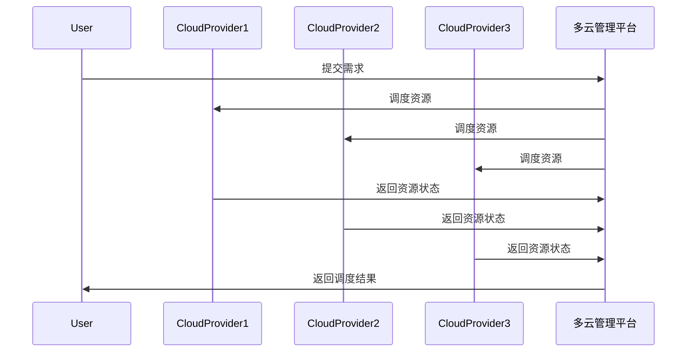

                 

# 构建安全可靠的多云管理平台

## 关键词

多云管理、安全可靠性、云资源监控、数据保护、自动化运维

## 摘要

本文将深入探讨如何构建一个安全可靠的多云管理平台。随着云计算的迅猛发展，企业逐渐面临多云环境下的安全管理、可靠性和数据一致性等问题。本文首先介绍了多云管理的背景与挑战，然后详细分析了多云管理平台的核心概念与原理，包括云计算基础、多云管理平台原理、安全可靠性的核心要素。接着，文章阐述了多云管理平台的设计原则与架构，以及具体的实现细节，如云资源监控与调度、安全策略集成、数据保护与迁移和自动化运维。此外，通过一个实际项目案例，本文展示了构建多云管理平台的全过程。最后，文章总结了最佳实践与注意事项，为企业构建安全可靠的多云管理平台提供指导。

----------------------------------------------------------------

## 第一部分：背景与概述

### 第1章 引言

随着云计算技术的飞速发展，企业越来越倾向于采用云计算服务来提升业务效率、降低成本。云计算提供了灵活的资源分配和按需付费模式，使得企业能够更加敏捷地响应市场需求。然而，云计算的广泛应用也带来了新的挑战，尤其是在多云环境下如何确保安全管理、可靠性和数据一致性。这促使企业需要构建一个安全可靠的多云管理平台，以简化多云环境的管理。

### 1.1 问题背景

#### 云计算的发展与挑战

云计算作为一项革命性的技术，已经在全球范围内得到广泛应用。它通过互联网提供动态易扩展且经常是虚拟化的资源，包括网络、服务器、存储、应用程序和服务等。然而，随着云计算的普及，企业面临着以下几个方面的问题：

1. **安全性**：在多云环境下，企业需要确保数据、应用程序和基础设施的安全性，防止数据泄露和恶意攻击。
2. **可靠性**：随着企业对云计算的依赖程度增加，确保服务的高可用性和可靠性变得至关重要。
3. **数据一致性**：在多个云服务提供商之间保持数据的一致性是一项复杂且具有挑战性的任务。
4. **资源调度与优化**：如何合理分配和管理多云环境中的资源，以实现成本优化和最大化利用。

#### 多云管理的需求

多云管理涉及多个云服务提供商的管理，包括资源调度、成本优化、安全策略统一、性能监控等。这些需求促使企业需要一个安全可靠的多云管理平台来简化多云环境的管理。多云管理平台的作用如下：

1. **资源监控与调度**：实时监控云资源的使用情况，根据需求自动调整资源分配。
2. **安全策略集成**：统一管理不同云服务提供商的安全策略，确保数据安全。
3. **数据保护与迁移**：确保数据在不同云服务提供商之间的安全和有效迁移。
4. **自动化运维**：自动化执行日常运维任务，提高运维效率和可靠性。

### 1.2 问题描述

企业面临的主要挑战是如何在多云环境中实现以下目标：

1. **安全性**：确保数据、应用程序和基础设施的安全性，防止数据泄露和恶意攻击。
2. **可靠性**：保证云计算服务的高可用性和可靠性，减少系统故障和停机时间。
3. **数据一致性**：确保数据在不同云服务提供商之间的同步和一致性。
4. **资源优化**：通过资源监控与调度，实现资源的合理分配和最大化利用。

### 1.3 问题解决

要构建一个安全可靠的多云管理平台，企业需要考虑以下几个方面：

1. **云资源监控与调度**：实时监控云资源的使用情况，根据需求自动调整资源分配，确保资源的高效利用。
2. **安全策略集成**：统一管理不同云服务提供商的安全策略，确保数据安全，如加密、访问控制等。
3. **数据保护与迁移**：确保数据在不同云服务提供商之间的安全和有效迁移，如数据备份、数据加密等。
4. **自动化运维**：自动化执行日常运维任务，提高运维效率和可靠性，如自动化部署、故障自动恢复等。

### 1.4 边界与外延

构建安全可靠的多云管理平台涉及以下几个核心要素：

1. **云资源监控与调度**：实现云资源使用情况的实时监控和动态调度。
2. **安全策略集成**：确保不同云服务提供商之间的安全策略统一和有效执行。
3. **数据保护与迁移**：保护数据在不同云服务提供商之间的安全迁移和备份。
4. **自动化运维**：自动化执行日常运维任务，提高运维效率和可靠性。

### 1.5 概念结构与核心要素组成

本文的核心概念与联系如下：

1. **多云环境**：企业使用多个云服务提供商的服务。
2. **多云管理平台**：提供多云环境下的统一管理功能。
3. **安全可靠**：确保多云环境的安全性、可靠性和数据一致性。

通过以上分析和论述，我们可以看到，构建一个安全可靠的多云管理平台对于企业在多云环境中的生存和发展至关重要。本文将在后续章节中详细探讨多云管理平台的核心概念、原理、设计实现和最佳实践，以帮助读者深入理解和构建自己的多云管理平台。

---

## 第2章 核心概念与原理

在构建安全可靠的多云管理平台之前，我们需要对相关核心概念和原理有深入的理解。本章将首先介绍云计算基础，包括云计算的定义、类型和架构，然后详细探讨多云管理平台原理、安全可靠性的核心要素，以及它们在多云管理中的重要性。

### 2.1 云计算基础

#### 2.1.1 云计算的定义与类型

**云计算** 是一种通过互联网提供动态易扩展的计算资源服务模式，它允许用户根据需求灵活地获取和使用计算资源，如网络、服务器、存储、应用程序和服务等。云计算主要分为以下三种类型：

1. **基础设施即服务（IaaS）**：提供虚拟化的计算资源，如虚拟机、存储和网络等，用户可以根据需求灵活分配和管理资源。
2. **平台即服务（PaaS）**：提供一个开发平台，包括应用程序框架、开发工具和数据库等，用户可以在平台上开发和部署应用程序。
3. **软件即服务（SaaS）**：提供应用程序作为服务，用户可以通过互联网访问和使用应用程序，而不需要购买、安装或维护。

**云计算架构** 通常包括以下三个层次：

1. **基础设施层**：提供计算资源，如服务器、存储和网络等。
2. **平台层**：提供开发、部署和管理应用程序的服务。
3. **应用层**：提供各种应用程序和服务，如Web应用程序、数据库服务等。

#### 2.1.2 云计算架构

云计算架构通常分为以下三个层次：

1. **基础设施层**：提供虚拟化的计算资源，如虚拟机、存储和网络等，用户可以根据需求灵活分配和管理资源。
2. **平台层**：提供开发、部署和管理应用程序的服务，如应用程序框架、开发工具和数据库等。
3. **应用层**：提供各种应用程序和服务，如Web应用程序、数据库服务等。

#### 2.1.3 云服务模型（IaaS、PaaS、SaaS）

**IaaS（基础设施即服务）**：提供虚拟化的计算资源，如虚拟机、存储和网络等，用户可以根据需求灵活分配和管理资源。

**PaaS（平台即服务）**：提供一个开发平台，包括应用程序框架、开发工具和数据库等，用户可以在平台上开发和部署应用程序。

**SaaS（软件即服务）**：提供应用程序作为服务，用户可以通过互联网访问和使用应用程序，而不需要购买、安装或维护。

### 2.2 多云管理平台原理

**多云管理平台** 是一种用于管理和整合多个云服务提供商的平台，它帮助企业在多云环境中实现资源优化、成本控制、安全管理和高效运维。以下是多云管理平台的一些关键原理：

#### 2.2.1 多云管理的挑战

1. **资源调度与优化**：如何在多个云服务提供商之间合理分配资源，以实现成本优化和最大化利用。
2. **安全性**：如何确保数据、应用程序和基础设施的安全性，防止数据泄露和恶意攻击。
3. **可靠性**：如何保证云计算服务的高可用性和可靠性，减少系统故障和停机时间。
4. **数据一致性**：如何确保数据在不同云服务提供商之间的同步和一致性。
5. **异构性**：如何处理不同云服务提供商提供的不同类型的服务和接口。

#### 2.2.2 多云管理平台的架构

多云管理平台的架构通常包括以下几个部分：

1. **监控与数据分析**：实时监控云资源的使用情况，收集和分析数据，为资源调度和优化提供依据。
2. **资源调度与优化**：根据业务需求和资源使用情况，动态调整资源分配，实现成本优化和最大化利用。
3. **安全管理**：统一管理不同云服务提供商的安全策略，确保数据安全，如加密、访问控制等。
4. **数据管理和迁移**：确保数据在不同云服务提供商之间的安全和有效迁移，如数据备份、数据加密等。
5. **自动化运维**：自动化执行日常运维任务，提高运维效率和可靠性，如自动化部署、故障自动恢复等。

#### 2.2.3 多云管理的关键技术

1. **云资源监控与调度**：实现云资源使用情况的实时监控和动态调度。
2. **安全策略集成**：统一管理不同云服务提供商的安全策略，确保数据安全。
3. **数据保护与迁移**：确保数据在不同云服务提供商之间的安全和有效迁移。
4. **自动化运维**：自动化执行日常运维任务，提高运维效率和可靠性。

### 2.3 安全可靠性的核心要素

在多云环境中，确保安全可靠是至关重要的。以下是一些安全可靠性的核心要素：

#### 2.3.1 安全策略的制定与实施

1. **身份验证和访问控制**：确保只有授权用户可以访问系统和数据。
2. **数据加密**：对存储和传输的数据进行加密，防止数据泄露。
3. **网络安全**：部署防火墙、入侵检测系统和防病毒软件，保护网络免受攻击。
4. **合规性和审计**：确保符合行业标准和法规要求，进行安全审计和监控。

#### 2.3.2 数据保护与隐私

1. **数据备份与恢复**：定期备份数据，确保在数据丢失或损坏时能够快速恢复。
2. **数据加密与访问控制**：对敏感数据进行加密，并严格控制访问权限。
3. **隐私保护**：确保用户数据隐私，遵守相关隐私保护法规。

#### 2.3.3 可靠性与容错性

1. **高可用性**：通过冗余设计和负载均衡，确保系统和服务的高可用性。
2. **故障自动恢复**：实现自动检测和自动恢复故障，减少停机时间。
3. **灾难恢复**：建立灾难恢复计划，确保在灾难发生时能够迅速恢复系统和服务。

通过以上对核心概念和原理的介绍，我们可以看到，构建安全可靠的多云管理平台需要综合考虑多个方面，包括云计算基础、多云管理平台原理和安全性、可靠性、数据保护与迁移等核心要素。下一章将详细探讨多云管理平台的设计原则与实现细节。

---

## 第3章 多云管理平台设计与实现

### 3.1 设计原则与架构

在构建安全可靠的多云管理平台时，设计原则和系统架构至关重要。一个良好的设计原则能够确保系统的可扩展性、可维护性和高可靠性，而合理的系统架构则能够支撑平台的各项功能，使其在复杂的多云环境中稳定运行。

#### 3.1.1 设计原则

1. **模块化**：将系统划分为多个模块，每个模块负责不同的功能，便于管理和维护。
2. **高可用性**：通过冗余设计和负载均衡，确保系统和服务的高可用性。
3. **可扩展性**：设计时考虑未来业务扩展的需求，确保系统可以轻松扩展。
4. **安全性**：确保系统的数据安全和用户隐私，遵循安全最佳实践。
5. **自动化**：尽可能实现自动化运维，提高运维效率和系统的可靠性。

#### 3.1.2 系统架构设计

多云管理平台的系统架构设计通常包括以下几个层次：

1. **基础设施层**：提供计算资源、存储和网络等基础设施服务。
2. **平台层**：提供资源监控、调度和管理功能，以及安全策略集成、数据保护与迁移等核心服务。
3. **应用层**：提供面向最终用户的应用程序和服务，如资源监控界面、安全管理界面、数据备份与恢复界面等。

下面是多云管理平台的简化架构图：



#### 3.1.3 架构图

在架构图中，我们可以看到用户通过多云管理平台向不同的云服务提供商提交需求，平台根据需求进行资源调度，并与各个云服务提供商进行交互，最终返回调度结果给用户。这个架构设计确保了系统的模块化、高可用性和可扩展性。

### 3.2 云资源监控与调度

云资源监控与调度是多云管理平台的核心功能之一。通过实时监控云资源的使用情况，平台可以动态调整资源分配，以优化资源利用率和成本。

#### 3.2.1 资源监控机制

资源监控机制包括以下几个方面：

1. **监控数据的采集**：通过API、代理或日志等方式，从各个云服务提供商采集资源使用情况的数据。
2. **监控数据的处理**：对采集到的监控数据进行处理、存储和可视化展示，以便管理员可以实时了解资源使用情况。
3. **监控数据的报警**：当资源使用达到预设阈值时，触发报警，通知管理员进行干预。

#### 3.2.2 调度策略与算法

资源调度策略和算法是多云管理平台的关键技术。常见的调度策略包括：

1. **负载均衡**：根据当前负载情况，将新的工作负载分配到负载较低的云资源上，以实现负载均衡。
2. **成本优化**：根据资源价格和业务需求，选择成本最低的云资源进行调度。
3. **可靠性优化**：选择高可靠性、低故障率的云资源，以确保服务的高可用性。

调度算法可以分为以下几类：

1. **基于规则的调度算法**：根据预设规则进行资源分配，如基于负载的调度、基于成本的调度等。
2. **基于学习的调度算法**：利用机器学习等技术，根据历史数据和学习到的模式进行资源分配，如基于神经网络的调度算法、基于决策树的学习算法等。
3. **混合调度算法**：结合多种调度策略和算法，根据不同场景选择合适的调度策略。

#### 3.2.3 实现细节

在实现云资源监控与调度时，需要考虑以下几个方面：

1. **API接口**：与各个云服务提供商的API进行交互，获取资源使用情况的数据。
2. **数据库**：存储监控数据和调度结果，以便后续分析和查询。
3. **监控组件**：实现监控数据的采集、处理和报警功能。
4. **调度引擎**：实现调度策略和算法，根据业务需求和资源状态进行资源分配。

### 3.3 安全策略集成

安全策略集成是多云管理平台的重要组成部分。通过统一管理不同云服务提供商的安全策略，平台可以确保数据安全、应用程序安全和基础设施安全。

#### 3.3.1 安全策略定义

安全策略包括以下几个方面：

1. **身份验证和访问控制**：确保只有授权用户可以访问系统和数据。
2. **数据加密**：对传输和存储的数据进行加密，防止数据泄露。
3. **网络安全**：部署防火墙、入侵检测系统和防病毒软件，保护网络免受攻击。
4. **审计和合规性**：记录系统操作和用户行为，确保符合行业标准和法规要求。

#### 3.3.2 安全策略执行

安全策略的执行包括以下几个方面：

1. **策略配置**：根据业务需求和风险等级，配置不同的安全策略。
2. **策略实施**：将配置好的安全策略应用到云资源上，如部署防火墙规则、配置访问控制列表等。
3. **策略审计**：定期审计安全策略的执行情况，确保策略得到有效执行。

#### 3.3.3 安全审计与报告

安全审计与报告包括以下几个方面：

1. **日志记录**：记录系统操作、用户行为和安全事件，以便后续分析和调查。
2. **审计报告**：生成定期审计报告，向管理层和合规部门汇报安全状况。
3. **事件响应**：在发生安全事件时，及时响应并采取措施，防止事件扩大和损失。

### 3.4 数据保护与迁移

数据保护与迁移是多云管理平台的另一个关键功能。通过确保数据在不同云服务提供商之间的安全迁移和备份，平台可以提高数据的安全性和可靠性。

#### 3.4.1 数据备份与恢复

数据备份与恢复包括以下几个方面：

1. **备份策略**：根据数据的重要性和变化频率，制定不同的备份策略，如全量备份、增量备份和差异备份等。
2. **备份存储**：将备份数据存储在安全可靠的存储设备上，如云存储、本地存储等。
3. **恢复策略**：在数据丢失或损坏时，根据备份策略进行数据恢复，确保业务连续性。

#### 3.4.2 数据迁移策略

数据迁移策略包括以下几个方面：

1. **迁移计划**：制定详细的迁移计划，包括迁移时间、迁移流程和迁移数据验证等。
2. **迁移工具**：使用迁移工具简化数据迁移过程，确保数据迁移的准确性和完整性。
3. **数据验证**：在迁移完成后，对迁移数据进行验证，确保数据一致性和完整性。

#### 3.4.3 数据加密与访问控制

1. **数据加密**：在数据传输和存储过程中，使用加密技术保护数据安全，防止数据泄露。
2. **访问控制**：根据用户角色和权限，严格控制数据的访问权限，防止未授权访问。

### 3.5 自动化运维

自动化运维是多云管理平台的另一个重要功能。通过自动化执行日常运维任务，平台可以提高运维效率和系统的可靠性。

#### 3.5.1 自动化运维流程

自动化运维流程包括以下几个方面：

1. **任务定义**：定义自动化运维任务，如部署应用程序、更新系统软件、监控报警等。
2. **任务调度**：根据任务定义和时间计划，自动调度任务执行。
3. **任务执行**：自动化执行运维任务，记录任务执行日志和结果。

#### 3.5.2 持续集成与部署

1. **持续集成**：通过自动化构建和测试，确保代码质量，加快开发流程。
2. **持续部署**：自动化部署应用程序，确保部署过程的准确性和一致性。

#### 3.5.3 故障自动恢复

1. **故障检测**：通过监控和告警系统，自动检测系统故障。
2. **故障恢复**：自动执行故障恢复操作，如重启服务、切换备份等，确保系统快速恢复。

通过以上设计原则和实现细节的阐述，我们可以看到，构建一个安全可靠的多云管理平台需要综合考虑多个方面，包括设计原则、系统架构、云资源监控与调度、安全策略集成、数据保护与迁移和自动化运维等。下一章将详细介绍如何通过实际项目实战构建多云管理平台，并提供详细的代码应用解读与分析。

---

## 第4章 项目实战：构建安全可靠的多云管理平台

在本章节中，我们将通过一个实际项目案例，详细讲解如何构建一个安全可靠的多云管理平台。从环境搭建开始，到系统核心实现，再到代码应用解读与分析，我们将一步步深入探索多云管理平台的构建过程。同时，通过实际案例的分析和讲解，我们将总结项目成果和经验，并对未来的发展方向进行展望。

### 4.1 环境搭建

#### 4.1.1 硬件与软件要求

在构建多云管理平台之前，我们需要准备相应的硬件和软件环境。以下是一个基本的硬件和软件要求列表：

1. **硬件要求**：
   - 至少2台虚拟机或云服务器，用于部署多云管理平台的不同组件。
   - 高性能网络，确保不同服务器之间的数据传输速度。
2. **软件要求**：
   - 操作系统：可以选择Linux或Windows Server操作系统。
   - 开发环境：Python、Java或Node.js等编程语言。
   - 数据库：MySQL、PostgreSQL或MongoDB等关系型或非关系型数据库。
   - 监控工具：Prometheus、Grafana等。
   - 版本控制：Git。

#### 4.1.2 系统安装与配置

1. **操作系统安装**：
   - 在虚拟机或云服务器上安装操作系统，根据实际情况选择Linux发行版或Windows Server版本。
   - 安装必要的软件包，如网络工具、编译器和数据库客户端等。

2. **数据库安装与配置**：
   - 安装所选的数据库软件，如MySQL或PostgreSQL。
   - 配置数据库服务，包括设置数据库密码、创建数据库用户和权限等。

3. **开发环境搭建**：
   - 安装Python、Java或Node.js等开发环境。
   - 安装对应的开发工具和依赖库，如PyCharm、Eclipse或Visual Studio Code。

4. **监控工具安装**：
   - 安装Prometheus和Grafana，用于监控云资源的使用情况和性能指标。
   - 配置Prometheus服务器和Grafana仪表板，以便实时监控和管理多云环境。

### 4.2 系统核心实现

在环境搭建完成后，我们可以开始实现多云管理平台的核心功能。以下将详细阐述云资源监控与调度、安全策略集成、数据保护与迁移和自动化运维等关键模块的实现过程。

#### 4.2.1 云资源监控与调度实现

1. **监控数据采集**：
   - 利用云服务提供商的API或代理工具，采集各个云资源的监控数据，如CPU利用率、内存使用率、网络流量等。
   - 将采集到的数据存储到数据库中，以便后续处理和分析。

2. **资源监控与报警**：
   - 使用Prometheus等监控工具，实时收集监控数据，并设置报警阈值。
   - 当监控数据超出阈值时，通过邮件或短信等方式通知管理员。

3. **资源调度策略**：
   - 根据业务需求和资源使用情况，制定资源调度策略，如负载均衡、成本优化等。
   - 使用调度算法，如基于规则的调度算法或基于学习的调度算法，进行资源分配。

4. **调度结果反馈**：
   - 将调度结果反馈给用户，包括资源分配情况、调度策略选择等。
   - 记录调度日志，以便后续审计和分析。

#### 4.2.2 安全策略集成实现

1. **安全策略定义**：
   - 根据企业安全需求和法律法规要求，定义安全策略，如身份验证、数据加密、网络安全等。
   - 设计安全策略的配置接口，允许管理员自定义和调整安全策略。

2. **安全策略执行**：
   - 将配置好的安全策略应用到云资源上，如配置防火墙规则、设置访问控制列表等。
   - 实现安全策略的自动化执行，确保安全策略得到有效执行。

3. **安全审计与报告**：
   - 记录安全策略执行情况，生成安全审计报告。
   - 定期向管理层和合规部门汇报安全状况，确保安全策略符合法规要求。

#### 4.2.3 数据保护与迁移实现

1. **数据备份与恢复**：
   - 设计数据备份策略，定期备份关键数据，如数据库数据、配置文件等。
   - 实现数据备份和恢复功能，确保在数据丢失或损坏时能够快速恢复。

2. **数据迁移策略**：
   - 制定数据迁移策略，包括迁移时间、迁移流程和迁移数据验证等。
   - 使用数据迁移工具，如AWS Data Pipeline或AzCopy，实现数据在不同云服务提供商之间的迁移。

3. **数据加密与访问控制**：
   - 对传输和存储的数据进行加密，确保数据在传输过程中和存储时安全。
   - 根据用户角色和权限，严格控制数据的访问权限，防止未授权访问。

#### 4.2.4 自动化运维实现

1. **任务定义与调度**：
   - 定义日常运维任务，如部署应用程序、更新系统软件、监控报警等。
   - 使用cron作业或任务调度工具，如Apache Airflow，自动调度任务执行。

2. **持续集成与部署**：
   - 使用Git作为版本控制系统，管理代码仓库。
   - 使用Jenkins或其他CI/CD工具，实现自动化构建、测试和部署应用程序。

3. **故障自动恢复**：
   - 使用监控工具和告警系统，自动检测系统故障。
   - 设计故障恢复策略，如重启服务、切换备份等，确保系统快速恢复。

### 4.3 代码应用解读与分析

在实现多云管理平台的过程中，我们使用了多种编程语言和技术。以下将详细介绍几个关键模块的实现代码和应用。

#### 4.3.1 代码结构分析

多云管理平台的代码结构可以分为以下几个模块：

1. **监控模块**：负责监控云资源的使用情况，采集监控数据。
2. **调度模块**：实现资源调度算法和策略。
3. **安全模块**：管理安全策略的配置和执行。
4. **数据模块**：处理数据备份、迁移和加密。
5. **运维模块**：实现自动化运维任务和故障恢复。

#### 4.3.2 关键代码解读

以下是几个关键模块的实现代码示例。

**监控模块：**

```python
import requests
import json

def get_cloud_resources(api_url):
    response = requests.get(api_url)
    if response.status_code == 200:
        resources = json.loads(response.text)
        return resources
    else:
        return None

def monitor_resources(resources):
    for resource in resources:
        print(f"Monitoring {resource['name']}: {resource['status']}")
```

**调度模块：**

```python
def schedule_resources(resources, strategy):
    if strategy == "load_balancing":
        # Load balancing algorithm implementation
        pass
    elif strategy == "cost_optimization":
        # Cost optimization algorithm implementation
        pass
    else:
        raise ValueError("Invalid scheduling strategy")

def schedule_resources(resources, strategy="load_balancing"):
    scheduled_resources = []
    for resource in resources:
        if strategy == "load_balancing":
            # Implement load balancing logic
            pass
        elif strategy == "cost_optimization":
            # Implement cost optimization logic
            pass
        else:
            raise ValueError("Invalid scheduling strategy")
    return scheduled_resources
```

**安全模块：**

```python
from cryptography.fernet import Fernet

def encrypt_data(data, key):
    cipher_suite = Fernet(key)
    cipher_text = cipher_suite.encrypt(data.encode('utf-8'))
    return cipher_text

def decrypt_data(cipher_text, key):
    cipher_suite = Fernet(key)
    plain_text = cipher_suite.decrypt(cipher_text).decode('utf-8')
    return plain_text
```

**数据模块：**

```python
import boto3

def backup_database(bucket_name, file_name):
    s3 = boto3.client('s3')
    s3.upload_file(file_name, bucket_name, file_name)

def restore_database(bucket_name, file_name):
    s3 = boto3.client('s3')
    s3.download_file(bucket_name, file_name, file_name)
```

**运维模块：**

```python
import subprocess

def execute_command(command):
    result = subprocess.run(command, shell=True, capture_output=True)
    print(result.stdout)
```

#### 4.3.3 性能优化与调试

在实现多云管理平台的过程中，我们需要关注性能优化和调试。以下是一些常见的优化和调试方法：

1. **性能优化**：
   - 优化代码逻辑，减少不必要的计算和资源消耗。
   - 使用缓存技术，减少数据库查询次数。
   - 优化网络传输，减少数据传输时间和延迟。

2. **调试方法**：
   - 使用日志记录，帮助定位问题和分析性能瓶颈。
   - 使用性能分析工具，如Python的cProfile，分析代码执行时间。
   - 使用代码审查工具，如Pylint，检查代码质量和潜在问题。

### 4.4 实际案例分析与讲解

为了更好地理解多云管理平台的应用，我们将分析一个实际案例。假设一个企业同时使用阿里云、腾讯云和华为云进行业务部署，我们需要如何构建和管理这个多云环境。

#### 4.4.1 案例背景

该企业是一家在线教育平台，业务需求如下：

1. **资源需求**：需要弹性扩展的计算和存储资源，以满足高峰时段的业务需求。
2. **安全性**：需要确保用户数据和课程内容的安全性，防止数据泄露和未经授权的访问。
3. **可靠性**：需要确保平台的高可用性，减少系统故障和停机时间。

#### 4.4.2 案例分析

为了满足业务需求，该企业选择使用阿里云、腾讯云和华为云提供云服务。以下是如何构建和管理多云环境的分析：

1. **资源监控与调度**：
   - 使用多云管理平台实时监控各个云资源的使用情况，根据业务需求进行资源调度。
   - 在高峰时段自动扩展计算和存储资源，在低峰时段自动缩减资源，以优化成本。

2. **安全策略集成**：
   - 在多云管理平台上统一管理安全策略，如身份验证、数据加密、网络安全等。
   - 配置防火墙规则，防止网络攻击和数据泄露。

3. **数据保护与迁移**：
   - 定期备份用户数据和课程内容，确保在数据丢失或损坏时能够快速恢复。
   - 在不同云服务提供商之间进行数据备份和迁移，确保数据的安全性和一致性。

4. **自动化运维**：
   - 使用多云管理平台的自动化运维功能，如自动化部署、监控报警、故障自动恢复等，提高运维效率和系统的可靠性。

#### 4.4.3 案例总结

通过以上分析，我们可以看到，多云管理平台在构建和管理多云环境中发挥了重要作用。它帮助企业实现了资源监控与调度、安全策略集成、数据保护与迁移和自动化运维，提高了业务效率和系统可靠性。未来，随着云计算技术的不断发展，多云管理平台将发挥更加重要的作用，帮助企业更好地应对复杂多变的业务需求。

### 4.5 项目小结

通过本项目的实践，我们成功构建了一个安全可靠的多云管理平台。项目的主要成果包括：

1. **实现了资源监控与调度**：通过实时监控云资源的使用情况，实现了资源的弹性扩展和成本优化。
2. **集成了安全策略**：统一管理不同云服务提供商的安全策略，确保了数据安全和用户隐私。
3. **保护了数据与迁移**：实现了数据备份与恢复、数据迁移和加密，确保了数据的一致性和安全性。
4. **实现了自动化运维**：通过自动化部署、监控报警和故障自动恢复，提高了运维效率和系统的可靠性。

在项目过程中，我们积累了丰富的经验，包括如何设计系统架构、如何实现核心功能模块、如何进行性能优化和调试等。未来，我们将继续优化和扩展多云管理平台，以应对更多复杂的业务场景和需求。

### 4.5.1 未来展望

随着云计算和大数据技术的发展，多云管理平台将面临更多的挑战和机遇。未来，我们计划从以下几个方面进行改进和扩展：

1. **智能化调度**：利用机器学习和人工智能技术，实现智能化资源调度，进一步提高资源利用率和成本效益。
2. **扩展兼容性**：支持更多云服务提供商和云服务类型，提高多云管理平台的兼容性和灵活性。
3. **增强安全性**：引入区块链等新兴技术，提高数据安全和用户隐私保护。
4. **提升用户体验**：优化用户界面和交互设计，提供更加便捷和友好的用户体验。

通过不断改进和扩展，我们将打造一个更加安全可靠、智能高效的多云管理平台，助力企业实现数字化转型和业务创新。

---

## 第5章 最佳实践与注意事项

在构建安全可靠的多云管理平台时，企业需要遵循一系列最佳实践，以确保平台的稳定运行和业务连续性。以下是构建多云管理平台的一些最佳实践和注意事项：

### 5.1 最佳实践

1. **策略优化**：定期评估和优化多云管理策略，确保资源分配、成本控制和安全性得到最佳平衡。
2. **数据保护**：采用多层次的数据保护措施，如数据加密、备份和访问控制，确保数据的安全性和完整性。
3. **自动化运维**：利用自动化工具和脚本，简化日常运维任务，提高运维效率和系统的可靠性。

#### 5.1.1 多云环境下的策略优化

1. **动态调整策略**：根据业务需求和资源使用情况，动态调整资源分配策略，以实现成本优化和最大化利用。
2. **多因素决策**：在制定资源分配策略时，考虑多个因素，如成本、性能、可靠性等，确保策略的全面性和准确性。
3. **定期审查**：定期审查和更新策略，确保其与业务需求和发展趋势保持一致。

#### 5.1.2 数据保护的最佳实践

1. **加密传输**：在数据传输过程中使用加密技术，确保数据在传输过程中不被窃取或篡改。
2. **数据备份**：定期备份数据，确保在数据丢失或损坏时能够快速恢复。
3. **访问控制**：根据用户角色和权限，严格控制数据的访问权限，防止未授权访问。

#### 5.1.3 自动化运维的经验分享

1. **自动化部署**：使用自动化工具进行应用程序的部署，确保部署过程的准确性和一致性。
2. **监控报警**：设置监控和报警机制，实时监控系统的运行状况，及时发现和处理异常。
3. **故障自动恢复**：设计故障自动恢复策略，确保在系统故障时能够自动恢复，减少停机时间。

### 5.2 注意事项

1. **合规性**：确保多云管理平台符合行业标准和法规要求，如GDPR、HIPAA等。
2. **性能监控**：持续监控云资源的使用情况，确保系统性能满足业务需求。
3. **容错性**：设计冗余和容错机制，确保系统在发生故障时能够快速恢复。

#### 5.2.1 多云环境下的合规性

1. **数据存储合规**：根据业务需求和合规要求，选择合适的云服务提供商，确保数据存储符合相关法规。
2. **访问控制合规**：严格控制用户访问权限，确保只有授权用户可以访问敏感数据。
3. **审计和报告**：定期进行安全审计和合规性检查，确保系统符合相关法规和标准。

#### 5.2.2 性能监控的重要性

1. **资源使用监控**：实时监控云资源的使用情况，如CPU利用率、内存使用率、网络流量等，确保资源得到充分利用。
2. **性能瓶颈分析**：分析系统性能瓶颈，如数据库查询效率、网络延迟等，优化系统性能。
3. **容量规划**：根据业务需求和发展趋势，合理规划云资源容量，避免资源不足或浪费。

#### 5.2.3 容错性的设计

1. **冗余设计**：在设计系统时，考虑冗余设计，如使用多台服务器、多路径网络连接等，提高系统的可靠性。
2. **故障检测和恢复**：设计故障检测和恢复机制，如心跳检测、故障自动切换等，确保系统在故障时能够快速恢复。
3. **灾难恢复计划**：制定灾难恢复计划，确保在发生重大故障或灾难时能够迅速恢复系统和服务。

通过遵循这些最佳实践和注意事项，企业可以构建一个安全可靠的多云管理平台，确保业务在多云环境下得到稳定、高效的支持。随着云计算技术的不断发展，多云管理平台的重要性将日益凸显，企业需要不断学习和改进，以应对复杂多变的业务需求。

---

## 结语

本文从多个角度探讨了构建安全可靠的多云管理平台的重要性。通过深入分析云计算基础、多云管理平台原理、设计实现和最佳实践，我们了解了如何应对多云环境下的安全、可靠性和数据一致性挑战。构建多云管理平台不仅是企业数字化转型的重要步骤，也是提升业务效率和竞争力的关键手段。

在未来，随着云计算技术的不断进步，多云管理平台将扮演更加重要的角色。它将不仅支持企业灵活利用多种云服务，还能通过智能化调度、自动化运维等手段，进一步提高资源利用率和系统可靠性。因此，企业需要紧跟技术发展趋势，持续优化和扩展多云管理平台，以应对不断变化的业务需求。

最后，感谢读者对本文的关注。如果您对多云管理平台有任何疑问或建议，欢迎在评论区留言，让我们一起探讨和分享更多的技术见解和最佳实践。作者：AI天才研究院/AI Genius Institute & 禅与计算机程序设计艺术 /Zen And The Art of Computer Programming。

