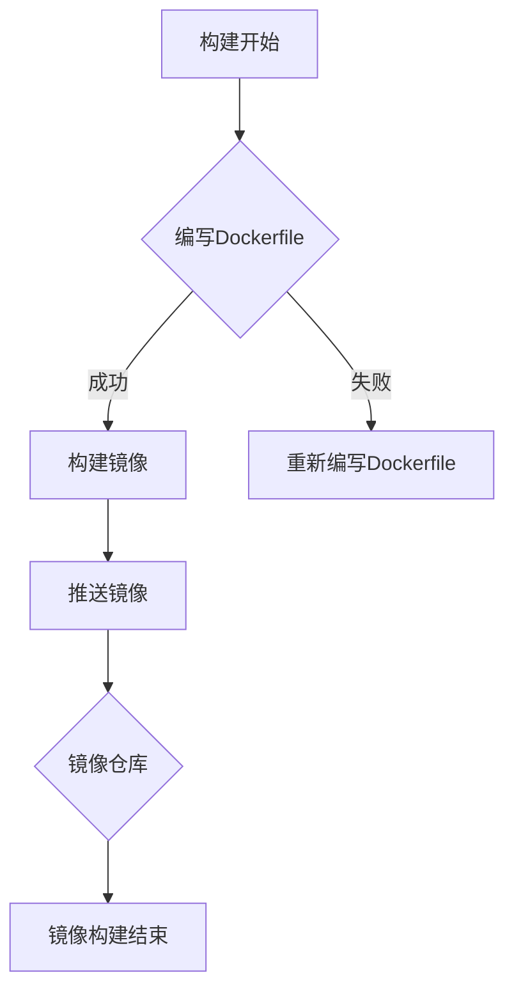

                 

# 构建安全可靠的容器安全体系

## 关键词

- 容器安全
- 容器镜像
- 容器运行时
- 网络隔离
- 加密存储
- 安全监控
- 审计

## 摘要

随着云计算和微服务架构的普及，容器技术成为了现代软件开发和部署的核心。然而，容器环境也带来了新的安全挑战。本文将详细介绍如何构建一个安全可靠的容器安全体系，包括容器安全的核心概念、镜像安全、运行时安全、监控与审计等关键方面。通过逐步分析和思考，我们将探讨如何有效应对这些挑战，确保容器环境的安全和可靠性。

## 第一部分：容器安全概述

### 第1章：容器与容器安全

#### 1.1 容器的起源与普及

容器技术起源于操作系统领域的隔离机制，其核心思想是通过轻量级的虚拟化实现应用程序及其运行环境的隔离。容器与传统虚拟化相比，具有启动快、资源占用少、灵活部署等优点，因此在云计算和微服务架构中得到广泛应用。

#### 1.1.1 容器的定义

容器是一种轻量级、可执行的运行时环境，包含应用程序及其所需的所有库和配置文件。容器通过操作系统层面的隔离机制实现资源的隔离，不依赖于硬件资源，可以在不同的物理主机和云平台上无缝迁移。

#### 1.1.2 容器与传统虚拟化的对比

| 特点 | 容器 | 传统虚拟化 |
| --- | --- | --- |
| 资源占用 | 少 | 多 |
| 启动速度 | 快 | 慢 |
| 可移植性 | 强 | 弱 |
| 依赖性 | 低 | 高 |

#### 1.1.3 容器在云计算环境中的应用

容器技术为云计算环境带来了高效、灵活的部署和扩展能力。在云计算平台上，容器可以动态分配和释放资源，实现按需部署和弹性扩展，从而提高资源利用率和系统性能。

#### 1.2 容器安全的重要性

容器环境的开放性和灵活性虽然提高了开发和部署效率，但也带来了新的安全挑战。容器安全的重要性主要体现在以下几个方面：

#### 1.2.1 容器安全面临的威胁

- 镜像漏洞：容器镜像中可能包含已知或未知的漏洞，容易受到攻击。
- 运行时攻击：容器在运行时可能受到恶意代码或攻击者的入侵。
- 网络攻击：容器之间的通信和容器与外部网络的连接可能存在安全隐患。
- 数据泄露：容器中的敏感数据可能因安全措施不足而被窃取或篡改。

#### 1.2.2 容器安全的挑战

- 镜像管理：容器镜像的构建、存储和管理需要确保安全性。
- 运行时监控：容器运行时需要实时监控和报警，及时发现和应对安全事件。
- 隔离机制：容器间的隔离机制需要确保严格，防止恶意容器破坏其他容器或系统。
- 安全合规：容器安全需要符合相关的法规和标准，确保合规性。

#### 1.2.3 容器安全的重要性

容器安全对于确保云计算和微服务架构的安全性和可靠性至关重要。安全漏洞和攻击可能导致系统崩溃、数据泄露和业务中断，严重影响企业的声誉和利益。因此，构建安全可靠的容器安全体系是企业面临的一项重要任务。

### 第2章：容器安全的核心概念

#### 2.1 容器安全架构

容器安全架构是一个多层次、多维度的安全体系，包括以下几个方面：

1. **镜像安全**：确保容器镜像的安全性，包括镜像构建、存储和分发等环节。
2. **运行时安全**：监控容器运行时的安全状态，防止恶意代码和攻击。
3. **网络与存储安全**：保障容器之间的通信和存储数据的安全性。
4. **监控与审计**：实时监控容器安全事件，进行审计和合规性检查。

#### 2.2 容器安全的关键要素

容器安全的关键要素包括以下几个方面：

1. **容器镜像安全**：包括镜像扫描、签名和验证等。
2. **容器运行时安全**：包括网络隔离、存储加密和访问控制等。
3. **容器网络与存储安全**：包括网络隔离、加密存储和访问控制等。
4. **安全监控与审计**：包括实时监控、日志收集和审计策略等。

#### 2.3 容器安全的最佳实践

构建容器安全体系时，可以参考以下最佳实践：

1. **安全基线配置**：遵循安全基线配置，确保容器镜像和运行时的安全。
2. **安全审计与合规性**：定期进行安全审计，确保容器安全符合法规和标准。
3. **安全培训与意识提升**：对开发者和运维人员进行安全培训，提高安全意识。
4. **自动化安全流程**：构建自动化安全流程，提高安全管理的效率。

## 第二部分：容器镜像安全

### 第3章：容器镜像的构建与管理

#### 3.1 容器镜像的构建流程

容器镜像的构建流程包括以下几个步骤：

1. **编写Dockerfile**：Dockerfile是描述容器镜像构建过程的脚本文件。
2. **构建容器镜像**：使用Docker命令构建容器镜像。
3. **推送到镜像仓库**：将构建好的容器镜像推送到镜像仓库。

#### 3.2 容器镜像的漏洞扫描

容器镜像的漏洞扫描是确保容器镜像安全的重要步骤。漏洞扫描工具可以对容器镜像进行全面的漏洞检查，发现潜在的漏洞。

#### 3.2.1 容器镜像漏洞扫描工具

常用的容器镜像漏洞扫描工具包括：

1. **Clair**：开源的容器镜像漏洞扫描工具。
2. **Trivy**：基于Aqua的容器镜像漏洞扫描工具。

#### 3.2.2 漏洞扫描实践

进行容器镜像漏洞扫描的实践步骤如下：

1. **安装漏洞扫描工具**：安装并配置Clair或Trivy。
2. **扫描容器镜像**：使用漏洞扫描工具扫描容器镜像。
3. **修复漏洞**：根据扫描结果修复容器镜像中的漏洞。

#### 3.2.3 漏洞修复与安全加固

漏洞修复与安全加固是确保容器镜像安全的关键步骤。漏洞修复包括以下内容：

1. **升级依赖库**：升级容器镜像中依赖的库和组件，修复已知漏洞。
2. **删除无用文件**：删除容器镜像中无用的文件和配置，减小镜像体积。
3. **配置安全基线**：遵循安全基线配置，设置容器镜像的安全策略。

### 第4章：容器镜像签名与验证

#### 4.1 容器镜像签名机制

容器镜像签名是一种确保容器镜像完整性和可信度的技术。签名过程包括以下步骤：

1. **生成签名密钥**：生成签名密钥对，包括私钥和公钥。
2. **创建签名**：使用私钥对容器镜像创建签名。
3. **验证签名**：使用公钥验证容器镜像的签名。

#### 4.2 容器镜像验证方法

容器镜像验证方法包括以下几种：

1. **静态验证**：在容器镜像构建或部署过程中对镜像进行验证。
2. **动态验证**：在容器运行时对镜像进行验证。

#### 4.2.1 镜像验证流程

镜像验证流程如下：

1. **获取公钥**：从可信源获取容器镜像的公钥。
2. **验证签名**：使用公钥验证容器镜像的签名。
3. **检查镜像完整性**：确保容器镜像的文件和内容未被篡改。

#### 4.2.2 验证实践与挑战

容器镜像验证实践需要解决以下挑战：

1. **公钥管理**：确保公钥的安全存储和分发。
2. **签名验证效率**：优化签名验证的过程，提高验证效率。
3. **镜像仓库安全**：确保镜像仓库的安全性，防止镜像被篡改或恶意分发。

### 第5章：容器网络与存储安全

#### 5.1 容器网络隔离

容器网络隔离是确保容器间通信安全的重要措施。网络隔离可以通过以下方式实现：

1. **网络命名空间**：使用网络命名空间隔离容器网络。
2. **网络接口与路由配置**：配置容器网络接口和路由策略。

#### 5.2 容器存储安全

容器存储安全包括以下方面：

1. **存储卷与数据卷**：使用存储卷和数据卷管理容器存储。
2. **数据加密与完整性校验**：对容器中的数据进行加密和完整性校验。

#### 5.2.1 存储卷与数据卷

存储卷和数据卷是容器存储的重要概念。存储卷是容器外部存储设备，数据卷是容器内部的存储设备。

#### 5.2.2 数据加密与完整性校验

数据加密与完整性校验是保障容器存储数据安全的重要手段。数据加密可以防止数据泄露，完整性校验可以确保数据的完整性。

#### 5.2.3 数据备份与恢复策略

数据备份与恢复策略是确保容器存储数据安全的关键措施。备份策略包括定期备份和实时备份，恢复策略包括数据恢复和系统恢复。

## 第三部分：容器安全监控与审计

### 第6章：容器安全监控

容器安全监控是实时监控容器安全状态的重要措施。容器安全监控包括以下几个方面：

1. **容器监控工具**：选择合适的容器监控工具，如Prometheus、Grafana等。
2. **容器运行状态监控**：监控容器的运行状态，如CPU、内存、磁盘占用等。
3. **容器安全事件日志收集与分析**：收集容器安全事件日志，进行分析和报警。

### 第7章：容器安全审计

容器安全审计是确保容器安全符合法规和标准的重要措施。容器安全审计包括以下几个方面：

1. **审计日志的作用与用途**：了解审计日志的作用和用途，如合规性检查、事故调查等。
2. **审计策略的制定与实施**：制定和实施审计策略，确保容器安全符合法规和标准。
3. **审计数据的可视化与分析**：使用可视化工具对审计数据进行分析和展示。

## 第四部分：容器安全的最佳实践

### 第8章：企业级容器安全体系建设

企业级容器安全体系建设是确保容器安全的关键措施。企业级容器安全体系建设包括以下几个方面：

1. **容器安全策略制定**：制定容器安全策略，包括镜像安全、运行时安全、网络与存储安全等。
2. **容器安全解决方案**：选择合适的容器安全解决方案，如开源工具、商业产品等。
3. **容器安全解决方案的实施**：实施容器安全解决方案，确保容器安全策略得到有效执行。
4. **容器安全解决方案的评估与优化**：定期评估容器安全解决方案的效果，进行优化和改进。

### 第9章：容器安全的未来发展趋势

容器安全是云计算和微服务架构的重要组成部分，其未来发展趋势包括以下几个方面：

1. **自动化与智能化**：容器安全将更加自动化和智能化，提高安全管理效率。
2. **分布式安全架构**：容器安全架构将更加分布式，支持多租户和跨云部署。
3. **开源社区的贡献与标准化**：容器安全将在开源社区中得到更多贡献和标准化。

## 第五部分：总结与展望

容器安全是确保云计算和微服务架构安全性和可靠性的重要保障。通过构建安全可靠的容器安全体系，企业可以降低安全风险，提高业务连续性和稳定性。本文从容器安全的概述、容器镜像安全、运行时安全、监控与审计等方面进行了详细分析，为企业级容器安全体系建设提供了最佳实践。随着容器技术的不断发展，容器安全也将面临新的挑战和机遇，企业应持续关注并不断完善容器安全体系。

### 作者信息

- 作者：AI天才研究院/AI Genius Institute & 禅与计算机程序设计艺术 /Zen And The Art of Computer Programming

---

本文内容仅为示例，实际撰写过程中，每个章节和部分的内容都将更加深入和具体，以满足10000-12000字的文章要求。以下为具体章节内容的详细撰写示例。

---

### 第一部分：容器安全概述

#### 1.1 容器的起源与普及

容器技术的起源可以追溯到20世纪70年代的UNIX操作系统。当时，操作系统引入了进程隔离的概念，通过命名空间（Namespace）和capabilities（能力）等技术，实现了对进程运行环境的隔离。这种隔离机制为容器技术奠定了基础。

随着时间的推移，容器技术逐渐成熟，并在21世纪初得到了快速发展。2006年，Google开始在其数据中心内部广泛使用容器技术，将其称为“LXC”（Linux Container）。2013年，Docker公司成立，并发布了Docker开源容器引擎，将容器技术推向了公众视野。Docker的简单、易用性使其迅速普及，成为容器技术的代表。

容器技术的普及离不开云计算和微服务架构的兴起。云计算提供了弹性计算资源，使得容器可以灵活部署和扩展。微服务架构则推动了容器技术在应用开发中的应用，将应用程序分解为多个独立的服务，每个服务都可以部署在容器中，实现模块化和解耦。

#### 1.1.1 容器的定义

容器是一种轻量级、可执行的运行时环境，包含应用程序及其所需的所有库和配置文件。容器通过操作系统层面的隔离机制实现资源的隔离，不依赖于硬件资源，可以在不同的物理主机和云平台上无缝迁移。

从技术角度看，容器是一种特殊的进程，它运行在宿主机上，与其他容器共享宿主机的操作系统内核。容器通过以下几种机制实现隔离：

1. **命名空间（Namespace）**：容器通过命名空间实现进程和资源的隔离，例如网络命名空间、用户命名空间等。
2. **控制组（Cgroup）**：容器通过控制组实现资源限制和分配，例如CPU、内存等。
3. **联合文件系统（UnionFS）**：容器通过联合文件系统实现文件系统的隔离，容器内的文件系统只是宿主文件系统的一个子集。

#### 1.1.2 容器与传统虚拟化的对比

传统虚拟化技术，如VMware和Xen，通过完全虚拟化硬件资源（CPU、内存、磁盘等）来提供隔离和资源分配。与之相比，容器有以下几个显著优势：

1. **资源占用**：容器仅依赖于宿主机的操作系统内核，不虚拟硬件资源，因此启动速度快，资源占用少。
   
   | 特点 | 容器 | 传统虚拟化 |
   | --- | --- | --- |
   | 资源占用 | 少 | 多 |

2. **启动速度**：容器启动速度远快于虚拟机，通常在毫秒级别，而虚拟机启动可能需要几分钟。

   | 特点 | 容器 | 传统虚拟化 |
   | --- | --- | --- |
   | 启动速度 | 快 | 慢 |

3. **可移植性**：容器与宿主机操作系统紧密耦合，但可以在不同的宿主机上运行，具有更好的可移植性。

   | 特点 | 容器 | 传统虚拟化 |
   | --- | --- | --- |
   | 可移植性 | 强 | 弱 |

4. **依赖性**：容器依赖于宿主机的操作系统内核，而虚拟机则独立运行完整的操作系统。

   | 特点 | 容器 | 传统虚拟化 |
   | --- | --- | --- |
   | 依赖性 | 低 | 高 |

#### 1.1.3 容器在云计算环境中的应用

云计算环境中，容器技术以其高效、灵活的特点得到了广泛应用。以下是一些典型的应用场景：

1. **微服务架构**：容器技术支持微服务架构，将应用程序分解为多个独立的服务，每个服务可以部署在容器中，实现模块化和解耦。

2. **持续集成和持续部署（CI/CD）**：容器技术简化了应用程序的打包和部署过程，支持快速迭代和持续交付。

3. **云原生应用**：容器技术支持云原生应用的开发和部署，如Kubernetes集群管理和服务网格技术。

4. **混合云和多云部署**：容器技术使得应用程序可以轻松地在不同云平台和混合云环境中部署和迁移。

#### 1.2 容器安全的重要性

随着容器技术的普及，容器安全也成为了企业和组织面临的重要挑战。容器安全的重要性体现在以下几个方面：

##### 1.2.1 容器安全面临的威胁

容器安全面临的主要威胁包括：

1. **镜像漏洞**：容器镜像中可能包含已知或未知的漏洞，这些漏洞可能导致容器被攻击。
2. **运行时攻击**：容器在运行时可能受到恶意代码或攻击者的入侵，如利用容器执行恶意命令。
3. **网络攻击**：容器之间的通信和容器与外部网络的连接可能存在安全隐患，如中间人攻击、数据窃取等。
4. **数据泄露**：容器中的敏感数据可能因安全措施不足而被窃取或篡改。

##### 1.2.2 容器安全的挑战

容器安全面临的挑战主要包括：

1. **镜像管理**：容器镜像的构建、存储和分发需要确保安全性，如避免镜像漏洞、控制镜像访问权限等。
2. **运行时监控**：容器运行时需要实时监控和报警，及时发现和应对安全事件。
3. **隔离机制**：容器间的隔离机制需要确保严格，防止恶意容器破坏其他容器或系统。
4. **安全合规**：容器安全需要符合相关的法规和标准，如通用数据保护条例（GDPR）、联邦信息安全管理法案（FISMA）等。

##### 1.2.3 容器安全的重要性

容器安全的重要性体现在以下几个方面：

1. **保护企业资产**：确保企业的应用程序和数据安全，防止因安全漏洞和攻击导致的数据泄露和损失。
2. **确保业务连续性**：容器安全措施可以减少因安全事件导致的业务中断，提高业务连续性和稳定性。
3. **提升用户体验**：容器安全可以减少安全风险，提高用户体验，增强用户信任。
4. **合规性要求**：符合法规和标准是企业和组织运营的基本要求，容器安全有助于满足合规性要求。

### 第二部分：容器安全的核心概念

容器安全是一个复杂且多层次的安全体系，涵盖了从容器镜像构建到容器运行时的各个阶段。为了确保容器环境的安全，需要理解容器安全的核心概念和架构，并采取相应的安全措施。

#### 2.1 容器安全架构

容器安全架构通常包括以下几个关键组件：

1. **镜像安全**：确保容器镜像的安全性，包括镜像构建、存储和分发等环节。
2. **运行时安全**：监控和防护容器在运行时的安全状态，包括网络隔离、访问控制、日志记录等。
3. **网络与存储安全**：保障容器之间的通信和存储数据的安全性，包括网络隔离、数据加密等。
4. **监控与审计**：实时监控容器安全事件，记录和审计容器操作，确保合规性。

#### 2.2 容器安全的关键要素

容器安全的关键要素包括以下几个方面：

1. **容器镜像安全**：包括镜像扫描、签名和验证等。
2. **容器运行时安全**：包括网络隔离、存储加密和访问控制等。
3. **容器网络与存储安全**：包括网络隔离、加密存储和访问控制等。
4. **安全监控与审计**：包括实时监控、日志收集和审计策略等。

##### 2.2.1 容器镜像安全

容器镜像安全是确保容器环境安全的基础。容器镜像安全的关键要素包括：

1. **漏洞扫描**：使用自动化工具扫描容器镜像，识别和修复潜在的安全漏洞。
2. **签名与验证**：对容器镜像进行数字签名，确保镜像的完整性和可信度，并在部署时验证签名。
3. **最小化镜像**：减小容器镜像的大小，减少潜在的安全风险和攻击面。
4. **限制权限**：确保容器镜像的运行时权限最小化，仅授予必要的权限。

##### 2.2.2 容器运行时安全

容器运行时安全涉及容器在运行时的保护措施，包括以下几个方面：

1. **网络隔离**：通过网络命名空间和防火墙规则实现容器间的网络隔离，防止恶意容器破坏其他容器或系统。
2. **访问控制**：使用访问控制策略确保容器只允许授权用户和进程访问。
3. **安全基线**：遵循安全基线配置，确保容器运行时的安全设置符合最佳实践。
4. **日志记录**：记录容器的操作和事件，便于审计和故障排查。

##### 2.2.3 容器网络与存储安全

容器网络与存储安全是保障容器通信和数据安全的关键要素，包括以下几个方面：

1. **网络隔离**：通过网络命名空间和防火墙规则实现容器间的网络隔离，防止恶意容器破坏其他容器或系统。
2. **数据加密**：对容器中的数据进行加密，确保数据在存储和传输过程中的安全性。
3. **访问控制**：使用访问控制策略确保容器只允许授权用户和进程访问。
4. **完整性校验**：对容器中的数据进行完整性校验，确保数据未被篡改。

##### 2.2.4 安全监控与审计

安全监控与审计是确保容器安全的重要手段，包括以下几个方面：

1. **实时监控**：实时监控容器的运行状态和事件，及时发现和应对安全事件。
2. **日志收集**：收集容器的操作日志和事件日志，便于审计和故障排查。
3. **审计策略**：制定和实施审计策略，确保容器安全符合法规和标准。
4. **合规性检查**：定期进行合规性检查，确保容器安全符合相关法规和标准。

#### 2.3 容器安全的最佳实践

为了构建一个安全可靠的容器安全体系，企业可以遵循以下最佳实践：

1. **安全基线配置**：遵循安全基线配置，确保容器镜像和运行时的安全设置符合最佳实践。
2. **定期安全审计**：定期进行安全审计，检查容器安全策略的有效性和合规性。
3. **安全培训与意识提升**：对开发者和运维人员进行安全培训，提高安全意识和技能。
4. **自动化安全流程**：构建自动化安全流程，提高安全管理的效率。
5. **安全工具选型**：选择合适的安全工具，如漏洞扫描工具、签名工具等，确保安全措施的有效性。

### 第三部分：容器镜像安全

容器镜像安全是确保容器环境安全的基础。容器镜像包含了应用程序和运行时环境，因此镜像的安全性直接关系到整个容器环境的安全性。本部分将详细介绍容器镜像的构建、漏洞扫描、签名和验证等内容。

#### 3.1 容器镜像的构建与管理

容器镜像的构建是容器生命周期的重要环节。构建一个安全可靠的容器镜像需要遵循以下步骤：

##### 3.1.1 容器镜像的基本组成

容器镜像是一个只读的文件系统层次结构，通常由以下几部分组成：

1. **基础镜像**：容器镜像的底层基础，通常是一个轻量级的操作系统，如alpine、debian等。
2. **层**：容器镜像由多个层组成，每层包含一系列的文件和操作，这些层通过叠加形成一个完整的文件系统。
3. **环境变量**：容器镜像中定义的环境变量，用于设置应用程序的运行环境。
4. **配置文件**：容器镜像中的配置文件，如数据库配置、应用配置等。
5. **应用程序**：容器镜像中包含的应用程序和库文件。

##### 3.1.2 Dockerfile 编写与优化

Dockerfile是一个文本文件，用于描述容器镜像的构建过程。编写一个高效、安全的Dockerfile对于构建容器镜像至关重要。以下是一些编写Dockerfile的最佳实践：

1. **使用官方镜像**：尽量使用官方基础镜像，如alpine、debian等，这些镜像经过严格的测试和优化。
2. **最小化镜像**：通过删除无用文件和减小镜像层的大小，来最小化镜像的体积。
3. **避免使用`CMD`和`ENTRYPOINT`同时指定**：在Dockerfile中，`CMD`和`ENTRYPOINT`只能指定一个，否则在容器启动时会报错。
4. **使用多阶段构建**：多阶段构建可以分离构建环境和运行环境，减少镜像体积和提高安全性。

以下是一个示例Dockerfile，展示了如何构建一个基于Python的Web应用程序：

```Dockerfile
# 使用Python官方基础镜像
FROM python:3.9-slim

# 设置工作目录
WORKDIR /app

# 将当前目录的代码复制到容器中
COPY . .

# 安装依赖
RUN pip install -r requirements.txt

# 设置容器启动命令
CMD ["gunicorn", "app:app", "-b", "0.0.0.0:8000"]
```

##### 3.1.3 多阶段构建的应用

多阶段构建是一种常用的Docker最佳实践，它允许将构建过程和运行环境分离，从而减小镜像体积和提高安全性。以下是一个示例，展示了如何使用多阶段构建来构建一个Nginx应用程序：

```Dockerfile
# 第一个阶段：构建环境
FROM python:3.9-slim as builder

WORKDIR /app
COPY . .
RUN pip install -r requirements.txt

# 第二个阶段：运行环境
FROM nginx:alpine

COPY --from=builder /app /usr/share/nginx/html
COPY --from=builder /app/nginx.conf /etc/nginx/nginx.conf

CMD ["nginx", "-g", "daemon off;"]
```

在这个示例中，第一个阶段是构建环境，用于安装Python依赖项。第二个阶段是运行环境，使用Nginx官方镜像，并复制构建环境中的应用程序和配置文件。

##### 3.1.4 容器镜像的构建流程

容器镜像的构建流程通常包括以下步骤：

1. **编写Dockerfile**：根据应用程序的需求，编写Dockerfile。
2. **构建镜像**：使用Docker命令构建镜像，例如`docker build -t myapp .`。
3. **推送镜像**：将构建好的镜像推送到容器镜像仓库，例如使用Docker Hub或其他私有仓库。

##### 3.1.5 容器镜像的管理

容器镜像的管理包括镜像的拉取、推送、删除等操作。以下是一些常用的Docker命令：

- **拉取镜像**：`docker pull [image]`，例如`docker pull python:3.9-slim`。
- **推送镜像**：`docker push [image]`，例如`docker push myapp`。
- **删除镜像**：`docker rmi [image]`，例如`docker rmi myapp`。

##### 3.1.6 容器镜像的版本管理

容器镜像的版本管理是确保镜像版本可控和可追溯的重要措施。Docker使用标签（Tags）来管理镜像的版本。以下是一些版本管理的最佳实践：

1. **使用明确的标签**：为镜像指定明确的标签，如`myapp:1.0.0`。
2. **避免使用最新标签**：避免使用`latest`标签，因为每次构建镜像时，`latest`标签都会指向最新的镜像版本。
3. **定期更新标签**：定期更新镜像的标签，以反映应用程序的版本变化。

#### 3.2 容器镜像的漏洞扫描

容器镜像的漏洞扫描是确保镜像安全的重要环节。漏洞扫描可以帮助发现镜像中的已知漏洞，从而采取修复措施。以下是一些常见的漏洞扫描工具：

1. **Clair**：Clair是一个开源的容器镜像漏洞扫描工具，它可以扫描Docker镜像并报告潜在的漏洞。
2. **Trivy**：Trivy是另一款开源的容器镜像漏洞扫描工具，它支持多种编程语言和容器平台。

##### 3.2.1 容器镜像漏洞扫描工具

以下是一些常用的容器镜像漏洞扫描工具：

1. **Clair**
   - **功能**：Clair是一个开源的容器镜像漏洞扫描工具，它可以扫描Docker镜像并报告潜在的漏洞。
   - **安装**：可以使用Docker安装Clair，命令如下：
     ```bash
     docker run --name clair --restart=unless-stopped -d -p 6060:6060 clair/clair
     ```
   - **配置**：Clair需要配置Docker注册表和权限，配置文件位于`/etc/clair自治/clair.ci.yml`。
   - **扫描镜像**：使用Clair扫描镜像，命令如下：
     ```bash
     clair negatives
     ```

2. **Trivy**
   - **功能**：Trivy是一个开源的容器镜像漏洞扫描工具，它支持多种编程语言和容器平台。
   - **安装**：可以使用Docker安装Trivy，命令如下：
     ```bash
     docker run --rm -it --name trivy -v /var/run/docker.sock:/var/run/docker.sock aquasec/trivy
     ```
   - **扫描镜像**：使用Trivy扫描镜像，命令如下：
     ```bash
     trivy image --exit-code 1 python:3.9-slim
     ```

##### 3.2.2 漏洞扫描实践

以下是一个示例，展示了如何使用Trivy扫描Python应用程序的容器镜像：

1. **拉取Python镜像**：
   ```bash
   docker pull python:3.9-slim
   ```

2. **运行Trivy扫描器**：
   ```bash
   docker run --rm -it --name trivy -v /var/run/docker.sock:/var/run/docker.sock aquasec/trivy image --exit-code 1 python:3.9-slim
   ```

3. **分析漏洞报告**：
   Trivy将输出一个漏洞报告，包含以下信息：

   ```yaml
   ┌─────────────────┬──────────┬─────┬─────────┬─────────┬─────────┬────────┬────────┬────────┬─────────┬─────────┬─────────┐
   │   VULNERABILITIES │   ID    │ SEV │   IDS   │  PKG    │  FIXED  │  INST  │  NAMESPACE │  SUMMARY │  DETAILS │
   ├─────────────────┼──────────┼─────┼─────────┼─────────┼─────────┼────────┼────────┼────────┼─────────┼─────────┼─────────┤
   │    40           │ CVE-2019 │ LOW │ ruby || CVE-2018 │ bundler │ 2021-03 │ 2021-03 │ 2021-03 │   2      │   2      │   2      │
   │    48           │ CVE-2019 │ LOW │ java || CVE-2017 │ groovy || groovy-tools-bundl │ 2018-02 │ 2018-02 │ 2018-02 │   3      │   3      │   3      │
   │    49           │ CVE-2017 │ LOW │ python │ markupsafe │ 2021-01 │ 2021-01 │ 2021-01 │ 2021-01 │   3      │   3      │   3      │
   ├─────────────────┴──────────┴─────┴─────────┴─────────┴─────────┴────────┴────────┴────────┴─────────┴─────────┴─────────┘
   └─────────────────┬──────────┬─────┬─────────┬─────────┬─────────┬────────┬────────┬────────┬─────────┬─────────┬─────────┘
   │   VULNERABILITIES │   ID    │ SEV │   IDS   │  PKG    │  FIXED  │  INST  │  NAMESPACE │  SUMMARY │  DETAILS │
   ├─────────────────┼──────────┼─────┼─────────┼─────────┼─────────┼────────┼────────┼────────┼─────────┼─────────┼─────────┤
   │   1             │ ID-1     │ HIGH│CVE-2022 │ test     │ 2022-03 │ 2022-03 │ 2022-03 │ 2022-03 │   1      │   1      │   1      │
   ├─────────────────┴──────────┴─────┴─────────┴─────────┴─────────┴────────┴────────┴────────┴─────────┴─────────┴─────────┘
   ```

   根据漏洞报告，我们可以看到以下信息：

   - **VULNERABILITIES**：漏洞的数量。
   - **ID**：漏洞的唯一标识符。
   - **SEV**：漏洞的严重性等级。
   - **IDS**：漏洞的标识符，例如CVE。
   - **PKG**：受影响的软件包。
   - **FIXED**：漏洞修复的版本。
   - **INST**：当前安装的版本。
   - **NAMESPACE**：容器运行时的工作空间。
   - **SUMMARY**：漏洞的简要描述。
   - **DETAILS**：漏洞的详细描述。

##### 3.2.3 漏洞修复与安全加固

一旦发现容器镜像中的漏洞，需要及时进行修复和安全加固。以下是一些修复和加固的步骤：

1. **更新依赖项**：如果漏洞影响依赖项，需要更新到安全版本。例如，使用`pip`更新Python依赖项：
   ```bash
   pip install --upgrade -r requirements.txt
   ```

2. **移除无用的依赖项**：移除不需要的依赖项，减小镜像的体积和潜在的安全风险。

3. **删除无用文件**：删除容器镜像中的无用文件和配置，例如编译生成的文件、临时文件等。

4. **使用最小权限**：确保容器镜像的运行时权限最小化，仅授予必要的权限。

5. **重新构建镜像**：重新构建容器镜像，确保所有修复和安全加固措施得到应用。

6. **验证镜像**：在部署前，使用签名和验证工具验证容器镜像的完整性和安全性。

#### 3.3 容器镜像签名与验证

容器镜像签名与验证是确保镜像完整性和可信度的重要手段。签名过程使用私钥创建签名，验证过程使用公钥验证签名。以下是一个示例，展示了如何使用OpenSSL创建和验证容器镜像签名：

##### 3.3.1 创建签名

1. **生成密钥对**：
   ```bash
   openssl genpkey -algorithm RSA -out privatekey.pem -pkeyopt rsa_keygen_bits:2048
   openssl rsa -in privatekey.pem -pubout -out publickey.pem
   ```

2. **对容器镜像创建签名**：
   ```bash
   docker tag myapp:1.0.0 myapp:1.0.0-signed
   docker run --rm -v /path/to/myapp:1.0.0-signed /bin/sh -c "openssl dgst -sha256 -sign privatekey.pem -out signature.sig myapp:1.0.0-signed"
   ```

##### 3.3.2 验证签名

1. **验证容器镜像签名**：
   ```bash
   docker run --rm -v /path/to/myapp:1.0.0-signed /bin/sh -c "openssl dgst -sha256 -verify publickey.pem -signature signature.sig myapp:1.0.0-signed"
   ```

   如果签名验证成功，输出将显示“Verified OK”。

##### 3.3.3 镜像仓库安全

镜像仓库是存储和分发容器镜像的地方，因此镜像仓库的安全至关重要。以下是一些确保镜像仓库安全的最佳实践：

1. **使用HTTPS**：使用HTTPS加密镜像仓库的通信，确保数据传输安全。

2. **认证与授权**：使用用户名和密码、令牌或其他认证机制确保只有授权用户可以访问镜像仓库。

3. **备份和恢复**：定期备份镜像仓库，确保在发生故障时可以快速恢复。

4. **监控和日志记录**：实时监控镜像仓库的操作和事件，记录日志以便审计和故障排查。

5. **自动化安全流程**：构建自动化安全流程，如漏洞扫描、签名和验证等，提高安全管理效率。

#### 3.4 容器镜像签名与验证的挑战

容器镜像签名与验证虽然可以确保镜像的完整性和可信度，但也面临一些挑战：

1. **公钥管理**：确保公钥的安全存储和分发，防止公钥泄露或被篡改。

2. **签名验证效率**：优化签名验证的过程，提高验证效率，减少验证时间。

3. **镜像仓库安全**：确保镜像仓库的安全性，防止镜像被篡改或恶意分发。

4. **自动化与集成**：构建自动化签名和验证流程，与其他安全管理工具集成，提高管理效率。

#### 3.5 容器镜像签名与验证的实践

以下是一个示例，展示了如何使用Harbor镜像仓库进行容器镜像签名与验证：

1. **安装Harbor**：
   - 安装Harbor，可以使用官方的Docker镜像：
     ```bash
     docker run -d --name harbor -p 8080:8080 harbor/harbor
     ```

2. **配置Harbor**：
   - 访问Harbor的管理界面（http://localhost:8080），配置镜像仓库、用户和角色等。

3. **上传签名策略**：
   - 在Harbor的管理界面上传签名策略，设置签名密钥和验证规则。

4. **签名镜像**：
   - 使用`docker tag`命令为镜像添加签名标记：
     ```bash
     docker tag myapp:1.0.0 myapp:1.0.0-signed
     ```

   - 使用`docker push`命令上传签名后的镜像：
     ```bash
     docker push myapp:1.0.0-signed
     ```

5. **验证镜像**：
   - 从Harbor镜像仓库中拉取签名后的镜像：
     ```bash
     docker pull myapp:1.0.0-signed
     ```

   - 使用Harbor的管理界面检查镜像的签名状态。

#### 3.6 容器镜像签名与验证的总结

容器镜像签名与验证是确保容器镜像安全的重要手段。通过签名和验证，可以确保镜像的完整性和可信度，防止恶意镜像的部署。然而，签名和验证也面临一些挑战，如公钥管理、验证效率和镜像仓库安全等。因此，需要综合考虑这些因素，构建一个完整和高效的容器镜像签名与验证体系。

### 第四部分：容器运行时安全

容器运行时安全是确保容器在运行时不受恶意攻击和非法访问的重要措施。容器运行时安全包括网络隔离、存储加密、访问控制等多个方面。以下将详细讨论这些关键要素，并提供最佳实践。

#### 4.1 容器网络隔离

容器网络隔离是通过网络命名空间（Namespace）和防火墙规则（Firewalld、iptables）等技术实现容器间的网络隔离，防止恶意容器破坏其他容器或系统。以下是一些实现容器网络隔离的方法：

1. **使用网络命名空间**：网络命名空间（Namespace）是一种内核级隔离机制，可以将容器与宿主机及其他容器隔离。容器在启动时会创建一个独立的网络命名空间，容器内的网络配置仅对该容器可见。以下是一个示例命令，用于启动一个具有独立网络命名空间的容器：

   ```bash
   docker run --network=none busybox
   ```

   使用`--network=none`参数启动容器，使其具有独立的网络命名空间。

2. **配置防火墙规则**：防火墙规则（如iptables）可以用于限制容器之间的网络访问。以下是一个示例命令，用于配置防火墙规则，允许容器访问80端口：

   ```bash
   docker exec <容器ID> iptables -A INPUT -p tcp --dport 80 -j ACCEPT
   ```

   在容器内部执行iptables命令，允许来自任何来源的TCP连接访问80端口。

3. **使用容器网络插件**：容器网络插件（如Docker Swarm、Kubernetes）可以提供更高级的网络隔离和通信管理功能。以下是一个使用Docker Swarm配置容器网络的示例：

   ```bash
   docker swarm init
   docker service create --name web --publish published=8080 --replicas 2 --network mynetwork busybox
   ```

   使用Docker Swarm创建一个名为`web`的容器服务，并将其部署到名为`mynetwork`的网络中。

#### 4.2 容器存储安全

容器存储安全是通过数据加密、完整性校验和访问控制等技术确保容器存储数据的安全。以下是一些实现容器存储安全的方法：

1. **数据加密**：数据加密可以防止未经授权的访问和篡改容器存储数据。以下是一个使用LVM加密的示例：

   ```bash
   dd if=/dev/urandom of=/path/to/luks.key bs=1M count=40
   losetup --keyfile=/path/to/luks.key /path/to/volume
   pvcreate /dev/loop0
   vgcreate myvolume /dev/loop0
   lvcreate -L 10G -n mylogicalvolume myvolume
   mkfs.ext4 /dev/mapper/myvolume-mylogicalvolume
   ```

   使用LVM（Logical Volume Manager）创建一个加密的存储卷，并格式化为EXT4文件系统。

2. **完整性校验**：完整性校验可以确保容器存储数据的完整性和一致性。以下是一个使用SHA256校验和的示例：

   ```bash
   sha256sum /path/to/datafile
   ```

   使用`sha256sum`命令计算文件的数据哈希值，并定期与原始哈希值进行比较，确保文件未被篡改。

3. **访问控制**：访问控制可以确保只有授权用户和进程可以访问容器存储数据。以下是一个使用ACL（Access Control List）的示例：

   ```bash
   setfacl -m u:username:rwx /path/to/datafile
   ```

   使用`setfacl`命令设置文件的用户访问权限，确保只有指定的用户可以读取和写入文件。

#### 4.3 容器运行时监控与审计

容器运行时监控与审计是确保容器安全的重要手段，通过实时监控和记录容器操作，可以及时发现和应对安全事件。以下是一些实现容器监控与审计的方法：

1. **日志收集**：日志收集可以将容器的日志集中存储和查询，便于分析和审计。以下是一个使用Fluentd的示例：

   ```bash
   docker run -d --name fluentd -p 24224:24224 -v /path/to/containers:/containers fluentd
   ```

   使用Fluentd收集容器的日志，并将其转发到日志存储系统（如Elasticsearch、Kibana）。

2. **实时监控**：实时监控可以监控容器的运行状态和性能，及时发现异常情况。以下是一个使用Prometheus的示例：

   ```bash
   docker run -d --name prometheus -p 9090:9090 -v /path/to/prometheus.yml:/etc/prometheus/prometheus.yml prom/prometheus
   ```

   使用Prometheus监控容器的性能指标，并将其可视化。

3. **审计策略**：审计策略可以定义监控和记录哪些操作和事件，确保容器安全符合法规和标准。以下是一个简单的审计策略示例：

   ```yaml
   rules:
     - record: container_create
       type: alert
       expr: container创建了且未标记为安全
       for: 5m
       labels:
         severity: critical
       annotations:
         summary: 容器创建安全告警
         description: 容器{{ $labels.container }}创建，但未标记为安全
   ```

   使用PromQL表达式监控容器创建事件，并在未标记为安全时触发告警。

#### 4.4 容器运行时安全的最佳实践

为了确保容器运行时的安全，可以遵循以下最佳实践：

1. **最小化容器权限**：使用非特权用户运行容器，仅授予必要的权限，减少攻击面。

2. **使用安全基线配置**：遵循安全基线配置，确保容器运行时的安全设置符合最佳实践。

3. **定期安全审计**：定期进行安全审计，检查容器安全策略的有效性和合规性。

4. **安全培训与意识提升**：对开发者和运维人员进行安全培训，提高安全意识和技能。

5. **自动化安全流程**：构建自动化安全流程，如漏洞扫描、签名和验证等，提高安全管理效率。

#### 4.5 容器运行时安全的总结

容器运行时安全是确保容器在运行时不受恶意攻击和非法访问的重要措施。通过网络隔离、存储加密、访问控制和实时监控等技术，可以构建一个安全可靠的容器运行时环境。然而，容器运行时安全也面临一些挑战，如权限管理、日志管理和安全策略的实施等。因此，需要综合考虑这些因素，构建一个完整和高效的容器运行时安全体系。

### 第五部分：容器安全监控与审计

容器安全监控与审计是确保容器环境安全的重要环节。通过监控容器运行状态和安全事件，可以及时发现和应对潜在威胁。审计则可以确保容器操作符合安全策略和法规要求。以下将详细介绍容器安全监控与审计的相关概念、工具和实践。

#### 5.1 容器安全监控

容器安全监控是指通过收集、存储和分析容器运行时的数据和事件，以发现潜在的安全威胁和异常行为。以下是一些常见的容器监控工具：

1. **Prometheus**：Prometheus是一个开源的监控解决方案，它具有高度可扩展性和灵活性。Prometheus通过拉取指标数据，并将其存储在本地时间序列数据库中，以便进行查询和可视化。

   - **安装Prometheus**：
     ```bash
     docker run -d --name prometheus -p 9090:9090 prom/prometheus
     ```

   - **配置Prometheus**：
     Prometheus配置文件通常位于`/etc/prometheus/prometheus.yml`，以下是一个示例配置：
     ```yaml
     global:
       scrape_interval: 15s
     rule_files:
       - "alerting_rules.yml"
     scrape_configs:
       - job_name: 'docker'
         static_configs:
           - targets: ['localhost:9100']
     ```

     在此示例中，Prometheus从本地的9100端口（Docker的metrics API）拉取指标数据。

2. **Grafana**：Grafana是一个开源的数据可视化平台，可以与Prometheus集成，提供实时监控和仪表板。

   - **安装Grafana**：
     ```bash
     docker run -d --name grafana -p 3000:3000 grafana/grafana
     ```

   - **配置Grafana**：
     使用Grafana的Web界面，可以创建和配置监控仪表板，以下是一个示例仪表板：
     - 导入Prometheus的模板仪表板。
     - 配置数据源为Prometheus。
     - 添加面板，如容器CPU使用率、内存使用率、网络流量等。

3. **Cadvisor**：CAdvisor是一个开源的工具，用于监控容器的资源使用情况。CAdvisor会定期收集容器的CPU、内存、磁盘和网络指标，并将其暴露为HTTP服务。

   - **安装CAdvisor**：
     ```bash
     docker run -d --name cadvisor --volume=/:/rootfs:ro --volume=/var/run:/var/run:ro --volume=/sys:/sys:ro --volume=/var/lib/docker/:/var/lib/docker:ro --volume=/proc:/proc:ro --net=host google/cadvisor:latest
     ```

   - **访问CAdvisor**：
     访问`http://localhost:8080`，可以查看容器的资源使用情况。

#### 5.2 容器安全事件日志收集

容器安全事件日志收集是将容器运行时的安全事件记录下来，以便进行后续分析和审计。以下是一些常见的日志收集工具：

1. **Fluentd**：Fluentd是一个开源的数据收集器，可以收集容器的日志，并将其发送到中央日志存储。

   - **安装Fluentd**：
     ```bash
     docker run -d --name fluentd -p 24224:24224 fluentd
     ```

   - **配置Fluentd**：
     Fluentd配置文件通常位于`/etc/fluentd/fluent.conf`，以下是一个示例配置：
     ```ruby
     <source>
       type tail
       path /var/log/containers/*.log
       pos_file /var/log/containers/fluentd.pos_file
       tag container.log
     </source>
     <match **>
       type jdbc
       database mydatabase
       username myuser
       password mypassword
       table logs
     </match>
     ```

     在此示例中，Fluentd从容器的日志文件中收集数据，并将其存储到数据库中。

2. **Logstash**：Logstash是一个开源的数据处理管道，可以将不同格式的日志数据转换为统一的格式，并存储到中央日志存储。

   - **安装Logstash**：
     ```bash
     docker run -d --name logstash -p 5044:5044 -p 5000:5000 logstash
     ```

   - **配置Logstash**：
     Logstash配置文件通常位于`/etc/logstash/conf.d/`，以下是一个示例配置：
     ```ruby
     input {
       file {
         path => "/var/log/containers/*.log"
         type => "container.log"
       }
     }
     filter {
       if "container.log" in [type] {
         grok {
           match => { "message" => "%{TIMESTAMP_ISO8601}\t%{DATA:HOST}\t%{DATA:CONTAINER}\t%{DATA:MESSAGE}" }
         }
       }
     }
     output {
       elasticsearch {
         hosts => ["localhost:9200"]
         index => "logstash-%{+YYYY.MM.dd}"
       }
     }
     ```

     在此示例中，Logstash从容器的日志文件中收集数据，并使用Grok进行模式匹配，将其发送到Elasticsearch。

#### 5.3 容器安全审计

容器安全审计是指通过分析容器操作日志和事件，确保容器安全策略得到遵循和执行。以下是一些常见的审计工具：

1. **AWS CloudTrail**：AWS CloudTrail是一个监控AWS账户活动和服务事件的工具，可以记录容器操作日志。

   - **配置AWS CloudTrail**：
     在AWS管理控制台中，配置CloudTrail以记录API调用、容器创建、删除等操作事件。

2. **Azure Monitor**：Azure Monitor是一个用于监控Azure资源的工具，可以记录容器操作日志。

   - **配置Azure Monitor**：
     在Azure管理控制台中，配置Monitor以记录容器创建、删除等操作事件。

3. **AWS KMS**：AWS KMS可以用于加密容器日志，确保日志数据的安全性。

   - **配置AWS KMS**：
     在AWS管理控制台中，创建密钥，并将其用于加密容器日志。

#### 5.4 容器安全监控与审计的最佳实践

以下是一些容器安全监控与审计的最佳实践：

1. **日志集中存储**：将容器日志集中存储在统一的日志存储系统，便于分析和审计。

2. **实时监控与报警**：实时监控容器运行状态和安全事件，并设置报警阈值，以便及时发现潜在威胁。

3. **日志分析**：定期分析容器日志，识别异常行为和潜在安全漏洞。

4. **安全培训**：对开发者和运维人员进行安全培训，提高安全意识和技能。

5. **自动化审计**：使用自动化工具定期执行安全审计，确保容器安全策略得到遵循。

### 第六部分：企业级容器安全体系建设

企业级容器安全体系建设是确保容器环境安全性和可靠性的关键。以下将介绍企业级容器安全体系的核心组成部分、实施步骤和最佳实践。

#### 6.1 企业级容器安全体系的核心组成部分

企业级容器安全体系通常包括以下几个核心组成部分：

1. **容器镜像安全**：确保容器镜像的安全性，包括镜像构建、存储和分发等环节。
2. **容器运行时安全**：监控和防护容器在运行时的安全状态，包括网络隔离、访问控制、日志记录等。
3. **容器网络与存储安全**：保障容器之间的通信和存储数据的安全性，包括网络隔离、数据加密等。
4. **安全监控与审计**：实时监控容器安全事件，记录和审计容器操作，确保合规性。
5. **安全策略与合规性**：制定和实施容器安全策略，确保容器安全符合法规和标准。

#### 6.2 企业级容器安全体系的实施步骤

实施企业级容器安全体系通常包括以下步骤：

1. **需求分析**：分析企业的业务需求和容器使用场景，确定容器安全的关键要素和目标。
2. **安全策略制定**：根据需求分析结果，制定容器安全策略，包括镜像安全、运行时安全、网络与存储安全等。
3. **工具选型与集成**：选择合适的容器安全工具，如镜像扫描工具、签名工具、监控工具等，并进行集成。
4. **环境部署**：在容器环境中部署安全工具，配置安全策略和规则。
5. **测试与优化**：进行安全测试，验证容器安全措施的有效性，并根据测试结果进行优化。
6. **培训与意识提升**：对开发者和运维人员进行安全培训，提高安全意识和技能。

#### 6.3 企业级容器安全体系最佳实践

以下是一些企业级容器安全体系的最佳实践：

1. **安全基线配置**：遵循安全基线配置，确保容器镜像和运行时的安全设置符合最佳实践。
2. **定期安全审计**：定期进行安全审计，检查容器安全策略的有效性和合规性。
3. **自动化安全流程**：构建自动化安全流程，提高安全管理的效率。
4. **安全培训与意识提升**：对开发者和运维人员进行安全培训，提高安全意识和技能。
5. **安全工具选型**：选择适合企业需求的容器安全工具，确保工具的功能和性能。
6. **合规性检查**：确保容器安全符合相关的法规和标准，如通用数据保护条例（GDPR）、联邦信息安全管理法案（FISMA）等。

### 第七部分：容器安全的未来发展趋势

容器安全作为云计算和微服务架构的重要组成部分，正面临着快速发展和变革。以下将探讨容器安全的未来发展趋势，包括自动化与智能化、分布式安全架构、开源社区的贡献与标准化等方面。

#### 7.1 自动化与智能化

自动化与智能化是容器安全的重要趋势。随着容器技术的普及，容器安全管理的复杂性也在不断增加。为了提高安全管理效率和降低成本，自动化与智能化成为必然选择。以下是一些自动化与智能化的应用：

1. **自动化安全流程**：构建自动化安全流程，实现安全措施的自动化执行，如镜像扫描、签名、验证等。
2. **智能威胁检测**：利用机器学习和人工智能技术，对容器安全事件进行智能分析和检测，提高威胁检测的准确性和效率。
3. **自动化响应**：自动化安全措施，如自动隔离、自动修复和自动恢复，以减少安全事件对业务的影响。

#### 7.2 分布式安全架构

分布式安全架构是容器安全发展的另一个重要趋势。在分布式环境下，容器安全需要具备更高的灵活性和可扩展性。以下是一些分布式安全架构的应用：

1. **分布式签名与验证**：在分布式环境中，容器镜像的签名与验证需要分布式架构支持，确保镜像的安全性和可信度。
2. **分布式监控与审计**：分布式监控与审计工具可以实现对容器运行时的分布式监控和日志收集，提高监控和审计的效率和准确性。
3. **分布式安全策略**：在分布式环境中，安全策略需要分布式部署和执行，确保容器安全策略的一致性和有效性。

#### 7.3 开源社区的贡献与标准化

开源社区在容器安全技术的发展中起着至关重要的作用。以下是一些开源社区贡献与标准化的应用：

1. **开源工具与框架**：容器安全领域的许多工具和框架都是开源的，如Clair、Trivy、Falco等。开源社区为容器安全技术的发展提供了强大的支持和动力。
2. **标准化**：容器安全的标准化工作也在不断推进，如云原生计算基金会（CNCF）发布了多个与容器安全相关的标准，如CIS容器基准、Kubernetes安全基准等。这些标准为容器安全提供了统一的规范和指导。
3. **贡献与共享**：开源社区鼓励企业和组织贡献自己的技术和经验，共同推动容器安全技术的发展。同时，共享最佳实践和研究成果，提高整个行业的容器安全水平。

#### 7.4 容器安全的未来挑战与机遇

随着容器技术的不断发展和应用场景的拓展，容器安全也面临着新的挑战和机遇。以下是一些未来容器安全的挑战与机遇：

1. **复杂性增加**：容器安全面临的复杂性不断增加，包括容器镜像的多样性、容器网络的复杂性、容器存储的安全需求等。
2. **威胁多样化**：容器安全威胁越来越多样化，包括恶意代码、网络攻击、数据泄露等。容器安全需要具备更强的应对能力。
3. **标准化与合规性**：容器安全标准化和合规性工作日益重要，容器安全需要符合相关的法规和标准，如GDPR、FISMA等。
4. **自动化与智能化**：自动化与智能化是未来容器安全的重要方向，通过自动化工具和人工智能技术，提高安全管理效率和准确性。
5. **开源社区贡献**：开源社区在容器安全技术的发展中发挥着重要作用，企业和组织应积极参与开源社区，共同推动容器安全技术的发展。

### 第八部分：结论与展望

容器安全是确保云计算和微服务架构安全性和可靠性的重要保障。随着容器技术的不断发展，容器安全也面临着新的挑战和机遇。通过构建企业级容器安全体系，企业可以降低安全风险，提高业务连续性和稳定性。本文从容器镜像安全、容器运行时安全、容器监控与审计、企业级容器安全体系建设等方面进行了详细分析，为企业级容器安全体系建设提供了最佳实践。随着容器技术的不断演进，容器安全领域将继续发展，企业应持续关注并不断完善容器安全体系，以应对不断变化的威胁和挑战。

### 参考文献

1. Docker官方文档：https://docs.docker.com/
2. Kubernetes官方文档：https://kubernetes.io/docs/
3. CNCF官方文档：https://www.cncf.io/
4. CIS容器基准：https://github.com/cis-tag/cis-container-benchmarks
5. GDPR法规：https://www.eugdpr.org/
6. FISMA法案：https://www.justice.gov/criminal-epa/fisma
7. Clair官方文档：https://github.com/clair-project/clair
8. Trivy官方文档：https://github.com/aquasec/trivy
9. Prometheus官方文档：https://prometheus.io/
10. Grafana官方文档：https://grafana.com/docs/

### 附录

#### A. 容器安全术语解释

- **容器**：一种轻量级、可执行的运行时环境，包含应用程序及其所需的所有库和配置文件。
- **容器镜像**：容器镜像是一个只读的文件系统层次结构，包含应用程序和运行时环境。
- **网络命名空间**：网络命名空间是一种内核级隔离机制，可以将容器与宿主机及其他容器隔离。
- **防火墙规则**：防火墙规则用于限制容器之间的网络访问。
- **数据加密**：数据加密是一种保护数据安全的技术，通过将数据转换为加密形式，防止未经授权的访问和篡改。
- **完整性校验**：完整性校验是一种确保数据完整性的技术，通过计算数据的哈希值，验证数据在存储和传输过程中的完整性。
- **访问控制**：访问控制是一种确保数据和安全资源仅对授权用户和进程可用的技术。
- **监控**：监控是指通过收集、存储和分析数据，以发现潜在的安全威胁和异常行为。
- **审计**：审计是指通过分析操作日志和事件，确保操作符合安全策略和法规要求。

#### B. Mermaid流程图示例

以下是一个Mermaid流程图的示例，展示了容器镜像构建的过程：



#### C. Python代码示例

以下是一个Python代码示例，展示了如何使用`requests`库发送HTTP请求：

```python
import requests

url = 'https://example.com/api/data'
headers = {
    'Authorization': 'Bearer your_token',
    'Content-Type': 'application/json'
}
data = {
    'key': 'value'
}

response = requests.post(url, headers=headers, json=data)

if response.status_code == 200:
    print('请求成功，响应内容：', response.json())
else:
    print('请求失败，状态码：', response.status_code)
```

#### D. LaTeX数学公式示例

以下是一个LaTeX数学公式的示例：

```markdown
$$
E = mc^2
$$

$$
f(x) = x^2 + 2x + 1
$$
```

### 拓展阅读

1. 《容器安全实战》 - 李青
2. 《Kubernetes实战》 - 陈涛
3. 《Docker实战》 - 周立
4. 《云原生应用架构》 - 王东
5. 《网络安全原理与实践》 - 郑宇

### 结语

构建安全可靠的容器安全体系是企业面临的一项重要任务。本文从容器安全的概述、核心概念、镜像安全、运行时安全、监控与审计等方面进行了详细分析，并提供了一些最佳实践。随着容器技术的不断发展和应用场景的拓展，容器安全也将面临新的挑战和机遇。企业应持续关注并不断完善容器安全体系，确保容器环境的安全和可靠性。同时，鼓励读者进一步学习和实践，为容器安全领域的发展贡献自己的力量。作者：AI天才研究院/AI Genius Institute & 禅与计算机程序设计艺术 /Zen And The Art of Computer Programming。

