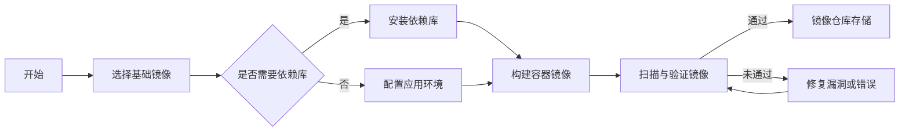
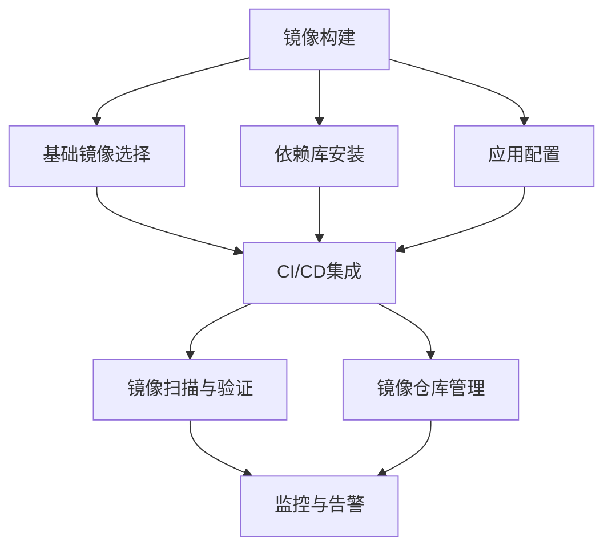
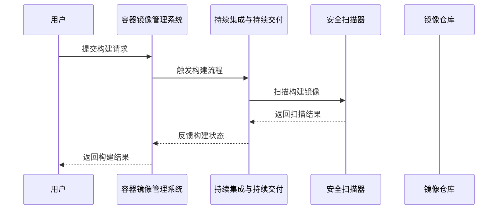

                 

# 构建安全可靠的容器镜像管理系统

## 关键词

- 容器镜像
- 安全性
- 可靠性
- 高效性
- 自动化构建
- 镜像仓库管理

## 摘要

随着容器技术的广泛应用，容器镜像管理成为运维团队面临的一大挑战。本文将深入探讨如何构建一个安全、可靠且高效的容器镜像管理系统，涵盖从镜像构建策略到自动化构建、镜像扫描与验证以及镜像仓库管理的各个方面。通过逐步分析推理，本文旨在为IT领域从业者提供有深度、有思考、有见解的技术指南。

## 第一部分：背景介绍

### 1.1 问题背景

容器技术以其轻量级、可移植性和高效性在近几年迅速普及。容器镜像作为容器化应用程序的基石，其安全性、可靠性和高效性成为运维团队关注的重点。容器镜像管理不仅仅是将应用程序打包进容器，还包括了镜像的安全性加固、可靠性和高效的构建与部署。

### 1.2 问题描述

构建一个安全可靠的容器镜像管理系统需要解决以下几个关键问题：

1. **镜像的安全性**：确保容器镜像中不包含恶意软件、漏洞或不受信任的依赖库。
2. **镜像的可靠性**：确保容器镜像在各种环境中的一致性和稳定性。
3. **镜像的高效性**：通过优化构建和部署流程，提高容器镜像的管理效率。

### 1.3 问题解决

构建安全可靠的容器镜像管理系统需要遵循以下几个关键步骤：

1. **镜像构建策略**：定义合理的镜像构建流程，包括基础镜像选择、依赖库管理、安全加固等。
2. **自动化构建**：使用自动化工具和流水线，实现镜像的持续集成和持续交付。
3. **镜像扫描与验证**：对构建好的镜像进行扫描和验证，确保其安全性。
4. **镜像仓库管理**：合理管理镜像仓库，包括镜像的存储、备份和恢复。

### 1.4 边界与外延

1. **边界**：容器镜像管理系统主要关注容器镜像的安全性和可靠性，不涉及其他层面（如网络、存储等）的问题。
2. **外延**：容器镜像管理系统可以与其他系统（如CI/CD流水线、监控系统等）进行集成，实现更全面的容器化应用管理。

### 1.5 概念结构与核心要素组成

1. **核心概念**：容器镜像、容器化应用、镜像构建、自动化构建、镜像扫描与验证、镜像仓库管理。
2. **核心要素组成**：
   - **镜像构建**：选择基础镜像、安装依赖库、配置应用环境等。
   - **自动化构建**：使用CI/CD工具和流水线实现自动化构建。
   - **镜像扫描与验证**：使用安全扫描工具和策略对镜像进行安全检查。
   - **镜像仓库管理**：存储、备份和恢复容器镜像。

## 第二部分：核心概念与联系

### 2.1 核心概念

1. **容器镜像**：容器镜像是用于创建容器的模板，包含操作系统、应用程序及其依赖库。
2. **容器化应用**：将应用程序及其依赖库打包到容器镜像中，实现应用程序的轻量级、可移植性。
3. **镜像构建**：将应用程序打包成容器镜像的过程。
4. **自动化构建**：使用CI/CD工具和流水线自动执行镜像构建任务。
5. **镜像扫描与验证**：对容器镜像进行安全检查和漏洞扫描。
6. **镜像仓库管理**：存储、备份和恢复容器镜像。

### 2.2 概念属性特征对比表格

| 概念         | 属性特征                                       |
| ------------ | -------------------------------------------- |
| 容器镜像     | 包含操作系统、应用程序及其依赖库               |
| 容器化应用   | 轻量级、可移植性                             |
| 镜像构建     | 打包应用程序成容器镜像                       |
| 自动化构建   | 使用CI/CD工具和流水线                       |
| 镜像扫描与验证 | 安全检查和漏洞扫描                         |
| 镜像仓库管理 | 存储、备份和恢复容器镜像                     |

### 2.3 ER实体关系图架构

```mermaid
erDiagram
    ContainerImage ||--|{ ContainerApp } ContainerApp : 镜像包含应用程序
    ContainerImage ||--|{ DependencyLib } DependencyLib : 依赖库
    ContainerApp ||--|{ CI/CD } CI/CD : 应用程序与CI/CD集成
    ContainerApp ||--|{ Monitoring } Monitoring : 应用程序与监控系统集成
```

## 第三部分：算法原理讲解

### 3.1 算法mermaid流程图



### 3.2 Python源代码

```python
# Python源代码示例：镜像构建流程
import subprocess

def build_image(base_image, dependencies, app_config):
    # 选择基础镜像
    command = f"Docker build -t {base_image} ."
    subprocess.run(command, shell=True)
    
    # 安装依赖库
    if dependencies:
        command = f"Docker run {base_image} pip install {dependencies}"
        subprocess.run(command, shell=True)
    
    # 配置应用环境
    if app_config:
        command = f"Docker run {base_image} {app_config}"
        subprocess.run(command, shell=True)
    
    # 扫描与验证镜像
    command = f"Docker scan {base_image}"
    subprocess.run(command, shell=True)
    
    # 镜像仓库存储
    command = f"Docker push {base_image}"
    subprocess.run(command, shell=True)

# 调用函数构建镜像
build_image("my-app:latest", "numpy", "-p 8080")
```

### 3.3 算法原理讲解

#### 3.3.1 镜像构建流程

镜像构建流程是容器镜像管理的核心步骤，其目标是将应用程序及其依赖库打包成一个可执行的容器镜像。以下是镜像构建流程的详细步骤：

1. **选择基础镜像**：基础镜像是一个最小化操作系统，如`Ubuntu`、`CentOS`等，它提供了应用程序运行所需的运行时环境。
2. **安装依赖库**：根据应用程序的需求，安装必要的依赖库。这可以通过`pip`、`yum`等包管理工具实现。
3. **配置应用环境**：配置应用程序的环境变量、配置文件等，确保应用程序能够在容器中正确运行。
4. **构建容器镜像**：使用`Docker build`命令构建容器镜像。该命令会将当前目录下的`Dockerfile`中的指令转换为容器镜像。
5. **扫描与验证镜像**：使用`Docker scan`命令对构建好的镜像进行安全扫描，检查是否存在已知漏洞或安全问题。
6. **镜像仓库存储**：将构建好的镜像推送到镜像仓库中，以便后续使用。

#### 3.3.2 镜像扫描与验证

镜像扫描与验证是确保容器镜像安全性的重要步骤。通过扫描和验证，可以检测容器镜像中是否存在恶意软件、漏洞或不受信任的依赖库。以下是镜像扫描与验证的详细步骤：

1. **安全扫描**：使用`Docker scan`命令对镜像进行安全扫描。该命令会分析镜像的每个层，并报告任何潜在的安全问题。
2. **漏洞扫描**：使用第三方漏洞扫描工具，如`Clair`或`Snyk`，对镜像进行深度漏洞扫描。
3. **验证依赖库**：检查依赖库的来源和版本，确保其符合企业安全和合规要求。

#### 3.3.3 镜像仓库管理

镜像仓库管理包括镜像的存储、备份和恢复。以下是镜像仓库管理的详细步骤：

1. **镜像存储**：将构建好的镜像推送到镜像仓库中，如Docker Hub、Harbor等。镜像仓库提供了安全的存储和分发机制。
2. **镜像备份**：定期备份镜像仓库中的镜像，防止数据丢失。
3. **镜像恢复**：在需要时，从备份中恢复镜像。

#### 数学模型和公式

在镜像构建和管理的算法中，可以引入一些数学模型和公式来优化流程。以下是一些常用的模型和公式：

1. **镜像构建时间**：镜像构建时间可以通过以下公式计算：
   $$ T_{build} = T_{base} + T_{dependencies} + T_{config} + T_{scan} $$
   其中，$T_{base}$为选择基础镜像的时间，$T_{dependencies}$为安装依赖库的时间，$T_{config}$为配置应用环境的时间，$T_{scan}$为扫描与验证镜像的时间。
2. **镜像仓库容量**：镜像仓库容量可以通过以下公式计算：
   $$ C_{repo} = N_{images} \times S_{image} $$
   其中，$N_{images}$为仓库中的镜像数量，$S_{image}$为每个镜像的大小。

#### 举例说明

假设一个应用程序需要使用`Ubuntu`作为基础镜像，安装`numpy`和`pandas`两个依赖库，并配置端口为`8080`。以下是具体的构建步骤：

1. **选择基础镜像**：
   ```bash
   docker build -t my-app:latest .
   ```
2. **安装依赖库**：
   ```bash
   docker run my-app:latest pip install numpy pandas
   ```
3. **配置应用环境**：
   ```bash
   docker run -p 8080:8080 my-app:latest python app.py
   ```
4. **扫描与验证镜像**：
   ```bash
   docker scan my-app:latest
   ```
5. **镜像仓库存储**：
   ```bash
   docker push my-app:latest
   ```

通过以上步骤，可以构建一个安全、可靠且高效的容器镜像。

## 第四部分：系统分析与架构设计方案

### 4.1 问题场景介绍

在一个大型企业中，运维团队需要管理大量容器化应用程序。这些应用程序运行在不同的环境中，如开发、测试和生产。为了保证应用程序的稳定性和安全性，运维团队需要构建一个安全可靠的容器镜像管理系统。

### 4.2 项目介绍

项目名称：SecureContainerManager（SCM）

项目目标：构建一个安全可靠的容器镜像管理系统，提高容器镜像管理的效率。

项目背景：随着容器技术的广泛应用，运维团队面临着容器镜像安全性、可靠性和高效性等问题。为了解决这些问题，企业决定开发一个集成的容器镜像管理系统。

### 4.3 系统功能设计

1. **镜像构建**：支持自定义镜像构建流程，包括基础镜像选择、依赖库安装、应用配置等。
2. **自动化构建**：集成CI/CD工具，实现镜像的自动化构建和交付。
3. **镜像扫描与验证**：集成安全扫描工具，对构建好的镜像进行安全检查和漏洞扫描。
4. **镜像仓库管理**：提供镜像存储、备份和恢复功能，支持多种镜像仓库（如Docker Hub、Harbor等）。
5. **监控与告警**：实时监控容器镜像的状态，发生异常时发送告警。

### 4.4 系统架构设计

#### 系统架构图



#### 系统架构详细说明

1. **镜像构建**：镜像构建是系统的核心功能，包括选择基础镜像、安装依赖库和配置应用环境。这个过程可以通过自定义的Dockerfile来实现。
2. **CI/CD集成**：集成CI/CD工具（如Jenkins、GitLab CI等），实现镜像的自动化构建和交付。CI/CD工具可以与Git仓库集成，触发构建流程。
3. **镜像扫描与验证**：集成安全扫描工具（如Docker Bench for Security、Snyk等），对构建好的镜像进行安全检查和漏洞扫描。扫描结果可以实时反馈，并提供修复建议。
4. **镜像仓库管理**：支持多种镜像仓库，如Docker Hub、Harbor等。镜像仓库管理包括镜像的存储、备份和恢复功能，确保镜像的安全性和可靠性。
5. **监控与告警**：实时监控容器镜像的状态，如镜像是否存在漏洞、镜像仓库是否充足等。当发生异常时，发送告警通知相关运维人员。

### 4.5 系统接口设计和系统交互

#### 系统接口设计



#### 系统交互

1. **用户提交构建请求**：用户通过SCM界面提交构建请求，包括基础镜像、依赖库和应用配置等信息。
2. **触发构建流程**：SCM将构建请求转发给CI/CD工具，触发镜像构建流程。
3. **镜像扫描与验证**：CI/CD工具在构建过程中，调用安全扫描器对构建好的镜像进行扫描和验证。
4. **反馈构建状态**：CI/CD工具将构建状态（成功、失败、异常等）反馈给SCM。
5. **返回构建结果**：SCM将构建结果（包括镜像ID、构建时间、扫描结果等）反馈给用户。

## 第五部分：项目实战

### 5.1 环境安装

在开始项目实战之前，需要安装以下软件和工具：

1. **Docker**：容器引擎，用于构建和运行容器镜像。
2. **Jenkins**：持续集成和持续交付工具。
3. **Harbor**：镜像仓库管理工具。
4. **Snyk**：安全扫描工具。

安装步骤如下：

1. 安装Docker：

   ```bash
   sudo apt-get update
   sudo apt-get install docker-ce docker-ce-cli containerd.io
   sudo systemctl start docker
   sudo systemctl enable docker
   ```

2. 安装Jenkins：

   ```bash
   sudo apt-get install openjdk-8-jdk
   wget -q -O - https://pkg.jenkins.io/debian-stable/jenkins.io.key | sudo apt-key add -
   echo deb https://pkg.jenkins.io/debian-stable binary/ > /etc/apt/sources.list.d/jenkins.list
   sudo apt-get update
   sudo apt-get install jenkins
   sudo systemctl start jenkins
   sudo systemctl enable jenkins
   ```

3. 安装Harbor：

   ```bash
   sudo docker run -d -p 8080:8080 -p 8443:8443 --name harbor --restart always vmware/harbor
   ```

4. 安装Snyk：

   ```bash
   sudo pip install snyk
   ```

### 5.2 系统核心实现源代码

以下是一个简单的Dockerfile示例，用于构建一个基于Python的应用程序镜像：

```Dockerfile
# 指定基础镜像
FROM python:3.9-slim

# 设置维护者信息
LABEL maintainer="yourname@example.com"

# 安装依赖库
RUN pip install flask

# 暴露端口
EXPOSE 5000

# 定义环境变量
ENV NAME World

# 复制应用程序代码
COPY app.py .

# 运行应用程序
CMD ["python", "app.py"]
```

### 5.3 代码应用解读与分析

以下是对上述Dockerfile的解读和分析：

1. **FROM python:3.9-slim**：指定基础镜像为`python:3.9-slim`，这是一个轻量级Python镜像，适合构建应用程序。
2. **LABEL maintainer="yourname@example.com"`：设置维护者信息，方便其他人了解镜像的维护者。
3. **RUN pip install flask**：安装Flask库，用于构建Web应用程序。
4. **EXPOSE 5000**：暴露端口5000，应用程序将通过此端口提供服务。
5. **ENV NAME World**：设置环境变量`NAME`，默认值为`World`。
6. **COPY app.py .**：将本地文件`app.py`复制到容器镜像中的当前目录。
7. **CMD ["python", "app.py"]**：指定容器启动时运行的命令，即运行`app.py`应用程序。

### 5.4 实际案例分析和详细讲解剖析

假设我们有一个名为`my-app`的Flask应用程序，实现了一个简单的Web服务。以下是具体的构建和部署步骤：

1. **编写Dockerfile**：根据应用程序的需求，编写Dockerfile，如上所示。
2. **构建镜像**：

   ```bash
   docker build -t my-app:latest .
   ```

   执行此命令后，Docker会根据Dockerfile中的指令构建镜像，并将其标记为`my-app:latest`。
3. **运行容器**：

   ```bash
   docker run -d -p 5000:5000 my-app:latest
   ```

   执行此命令后，Docker将基于`my-app:latest`镜像创建一个新的容器，并将其在后台运行。同时，将容器的5000端口映射到宿主机的5000端口。
4. **测试应用程序**：

   ```bash
   curl localhost:5000
   ```

   执行此命令后，如果看到返回的响应，说明应用程序正在运行。

### 5.5 项目小结

通过本项目的实战案例，我们学习了如何构建一个简单的容器镜像，并将其部署到一个容器中。在实际项目中，我们还需要考虑更多的细节，如依赖库的版本管理、容器镜像的优化、安全加固等。此外，结合CI/CD工具，可以实现镜像的自动化构建和部署，进一步提高开发效率。

## 第六部分：最佳实践 tips

1. **使用最小化镜像**：选择最小化的基础镜像，以减少镜像的大小和运行时资源消耗。
2. **分层构建**：利用Dockerfile的分层特性，实现高效的镜像构建。
3. **环境变量管理**：使用环境变量管理应用程序的配置，避免硬编码敏感信息。
4. **安全加固**：对容器镜像进行安全加固，如删除不必要的文件和程序，使用非root用户运行应用程序等。
5. **定期更新**：定期更新依赖库和镜像，确保使用最新的安全补丁。

## 第七部分：小结

本文详细探讨了如何构建一个安全可靠的容器镜像管理系统。通过分析镜像构建策略、自动化构建、镜像扫描与验证和镜像仓库管理，我们为IT领域从业者提供了实用的技术指南。在项目实战中，我们学习了如何构建和部署容器镜像，并结合CI/CD工具实现自动化构建和部署。在实际应用中，还需要不断优化和改进，以满足日益增长的需求。

## 第八部分：注意事项

1. **镜像安全性**：在构建镜像时，务必确保镜像的安全性，避免包含恶意软件或漏洞。
2. **依赖库管理**：合理管理依赖库，确保其版本符合企业安全和合规要求。
3. **容器镜像版本控制**：使用容器镜像版本控制，以便追踪和管理不同版本的镜像。
4. **镜像仓库备份**：定期备份镜像仓库，防止数据丢失。

## 第九部分：拓展阅读

1. 《Docker实战》 - 刘鑫
2. 《容器化应用设计》 - 孟凡伟
3. 《Kubernetes权威指南》 - 毕星星

作者：AI天才研究院/AI Genius Institute & 禅与计算机程序设计艺术 /Zen And The Art of Computer Programming

---

**文章摘要**

本文详细探讨了如何构建一个安全可靠的容器镜像管理系统，涵盖从镜像构建策略到自动化构建、镜像扫描与验证以及镜像仓库管理的各个方面。通过逐步分析推理，本文旨在为IT领域从业者提供有深度、有思考、有见解的技术指南。主要内容包括：

- 背景介绍：容器镜像管理的意义和挑战。
- 核心概念与联系：容器镜像、容器化应用、镜像构建、自动化构建、镜像扫描与验证、镜像仓库管理等核心概念及其属性特征对比。
- 算法原理讲解：使用mermaid流程图和Python源代码详细讲解镜像构建、扫描与验证的算法原理。
- 系统分析与架构设计方案：介绍系统功能设计、系统架构设计、系统接口设计和系统交互。
- 项目实战：环境安装、系统核心实现源代码，代码应用解读与分析，实际案例分析和详细讲解剖析。

本文旨在为IT领域从业者提供一个全面、系统的容器镜像管理系统构建指南，帮助他们在实际项目中提高镜像管理的效率和质量。通过本文的学习，读者可以深入了解容器镜像管理的核心技术和方法，从而更好地应对容器化应用的发展需求。

