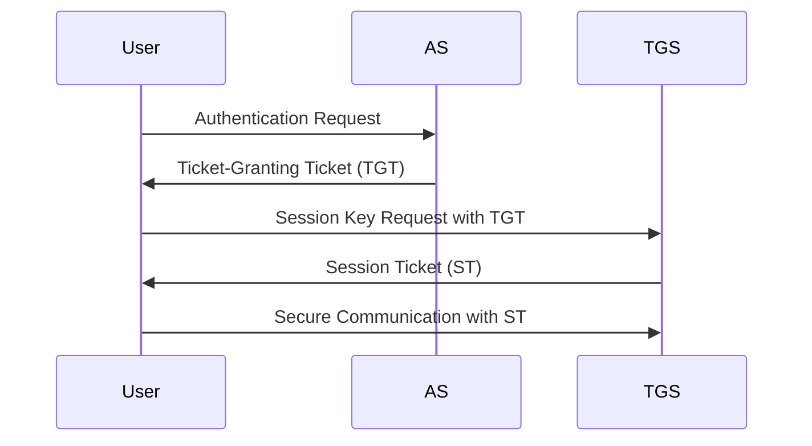
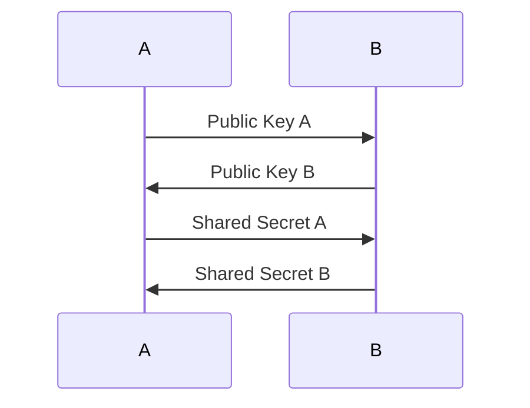
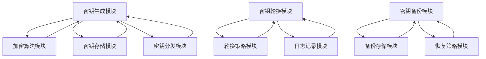
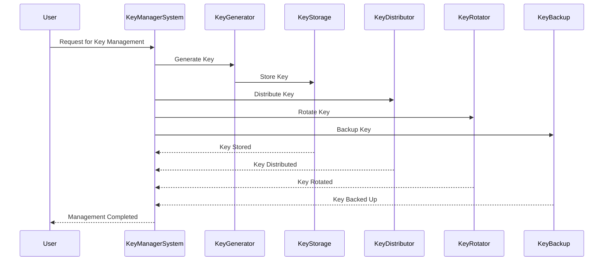
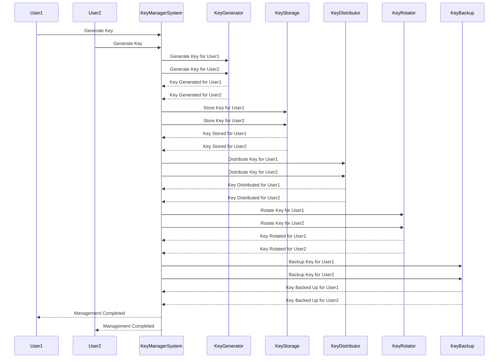

                 

## 引言

### 问题背景与重要性

随着信息技术的发展，数据安全成为企业和社会日益关注的核心问题。密钥管理作为数据安全的重要组成部分，其重要性不言而喻。密钥是加密和解密数据的关键，负责保护敏感信息不被非法访问和篡改。然而，随着网络攻击手段的日益复杂，密钥管理的安全性和可靠性面临巨大挑战。

#### 问题描述

密钥管理涉及多个方面的问题，包括密钥生成、存储、分发、轮换、销毁等。当前，许多企业面临着以下问题：

1. **密钥管理分散**：不同系统和应用使用不同的密钥管理方案，导致密钥难以统一管理和控制。
2. **密钥泄露风险**：密钥存储不当或管理不善，可能导致密钥泄露，进而危及数据安全。
3. **密钥轮换困难**：在密钥生命周期内，定期更换密钥是必要的，但手动操作繁琐且易出错。
4. **密钥备份与恢复**：在系统故障或数据丢失时，如何快速恢复密钥是一个挑战。

#### 问题解决与必要性

构建安全可靠的密钥管理系统，是解决上述问题的有效途径。一个完善的密钥管理系统应该具备以下特点：

1. **集中管理**：统一管理不同系统和应用的密钥，降低管理难度。
2. **强安全性**：采用先进的加密算法和密钥保护技术，确保密钥安全。
3. **自动化流程**：实现密钥生成、分发、轮换和销毁的自动化，提高管理效率。
4. **备份与恢复**：提供便捷的密钥备份和恢复机制，确保数据安全。

#### 边界与外延

本文主要探讨密钥管理的核心概念、技术原理、系统设计与实现，以及最佳实践。我们将通过以下步骤展开讨论：

1. **核心概念与联系**：介绍密钥管理的核心概念，包括密钥分类、管理原理和生命周期管理。
2. **技术原理**：详细讲解密钥加密算法、管理协议和密钥安全技术。
3. **系统设计与实现**：分析密钥管理系统的架构设计、功能实现和交互设计。
4. **项目实战**：通过实际案例展示密钥管理系统的应用和实现细节。
5. **最佳实践与总结**：总结密钥管理的最佳实践，展望未来发展趋势。

通过本文的讨论，我们希望能够为读者提供一个全面、深入的密钥管理系统构建指南。

## 第二部分：核心概念与联系

### 第2章：密钥管理的核心概念

在密钥管理系统中，理解密钥的分类、重要性以及面临的挑战是至关重要的。这将为后续的技术原理和系统设计提供坚实的基础。

#### 2.1 密钥分类

密钥是加密和解密数据的钥匙，根据用途和性质，可以分为以下几类：

1. **对称密钥（Symmetric Key）**：对称密钥加密算法使用相同的密钥进行加密和解密。典型的算法有AES、DES等。对称密钥的优势在于算法简单、速度快，但缺点是密钥分发困难，安全性较低。

2. **非对称密钥（Asymmetric Key）**：非对称密钥加密算法使用一对密钥，公钥用于加密，私钥用于解密。典型的算法有RSA、ECC等。非对称密钥的密钥分发简单、安全性较高，但加密和解密速度相对较慢。

3. **哈希密钥（Hash Key）**：哈希密钥通常用于生成数据的指纹，确保数据完整性。哈希算法如SHA-256、SHA-3等。哈希密钥不用于加密，但在数字签名和数据完整性验证中起到关键作用。

#### 2.2 密钥管理的重要性

密钥管理的重要性体现在以下几个方面：

1. **数据安全**：密钥是保护数据安全的核心，良好的密钥管理可以防止数据泄露、篡改和未授权访问。

2. **合规要求**：许多行业和地区对数据安全有严格的法律和合规要求，有效的密钥管理是满足这些要求的关键。

3. **系统稳定**：密钥管理系统的稳定性和可靠性直接影响到整个系统的稳定运行。

4. **业务连续性**：在系统故障或数据丢失时，有效的密钥备份和恢复机制可以确保业务连续性。

#### 2.3 密钥管理的挑战

尽管密钥管理的重要性显而易见，但在实际操作中，密钥管理面临许多挑战：

1. **密钥分散**：不同系统和应用使用不同的密钥管理方案，导致密钥分散、难以统一管理。

2. **密钥泄露**：密钥泄露是最大的风险，可能导致敏感数据被非法获取。

3. **密钥轮换**：手动轮换密钥不仅繁琐，而且容易出错，可能导致密钥管理失效。

4. **密钥备份与恢复**：有效的密钥备份和恢复机制是确保数据安全的关键，但实现起来具有挑战性。

#### 2.4 概念结构与核心要素组成

密钥管理的概念结构包括以下核心要素：

1. **密钥生成**：生成用于加密和解密的密钥，确保密钥的随机性和安全性。

2. **密钥存储**：将密钥安全存储在硬件或软件中，防止未经授权的访问。

3. **密钥分发**：将密钥安全地分发到各个系统和应用，确保密钥的分发过程安全可靠。

4. **密钥轮换**：定期更换密钥，以减少密钥泄露的风险。

5. **密钥销毁**：在密钥到期或不再使用时，安全地销毁密钥，防止密钥被复用。

6. **密钥备份**：创建密钥的备份，以防止数据丢失和系统故障。

7. **密钥恢复**：在系统故障或数据丢失时，能够快速恢复密钥，确保业务的连续性。

通过以上讨论，我们了解了密钥管理的核心概念、分类以及面临的挑战，为后续的技术原理和系统设计打下了坚实的基础。

### 第3章：密钥管理的基本原理

密钥管理的基本原理包括密钥生成与分发、密钥存储与备份、以及密钥轮换与销毁。这些环节相互关联，共同构成一个完整、安全的密钥生命周期管理机制。

#### 3.1 密钥生成与分发

密钥生成是密钥管理的第一步，其目的是生成用于加密和解密的密钥。密钥生成的过程通常包括以下几个步骤：

1. **随机性生成**：密钥生成过程必须确保密钥的随机性，以防止预测和攻击。可以使用专门的硬件随机数生成器或软件算法来实现。

   $$\text{密钥} = \text{随机数生成器}(\text{密钥长度})$$

2. **安全性验证**：生成的密钥需要通过安全性验证，确保其不易被破解。可以使用统计测试、密码学测试等方法进行验证。

3. **存储与备份**：生成的密钥需要立即存储，并创建备份，以防主密钥丢失。

密钥分发是将密钥安全传输到各个系统和应用的过程。以下是一些常用的密钥分发方法：

1. **物理分发**：通过物理介质（如U盘、CD等）将密钥分发给相关人员。

   $$\text{物理分发} = \text{传输介质} + \text{密钥封装}$$

2. **安全通道**：使用加密的通信渠道（如VPN、SSL/TLS等）传输密钥，确保密钥在传输过程中的安全性。

   $$\text{安全通道} = \text{加密协议} + \text{密钥传输}$$

3. **自动化分发**：使用自动化工具（如密钥管理系统）将密钥分发给相应的系统和应用，提高分发效率。

   $$\text{自动化分发} = \text{密钥管理系统} + \text{分发脚本}$$

#### 3.2 密钥存储与备份

密钥存储是将密钥安全保存的过程，密钥的安全存储是确保密钥不被未授权访问的关键。以下是一些常用的密钥存储方法：

1. **硬件安全模块（HSM）**：HSM提供高度安全的密钥存储和管理功能，适用于高安全要求的场景。

2. **加密文件存储**：使用加密文件存储系统（如EncFS、EFS等）将密钥存储在普通文件系统中，确保密钥在存储时的安全性。

3. **分布式存储**：将密钥分布存储在不同的地理位置，以防止单一故障点导致密钥丢失。

密钥备份是将密钥创建副本的过程，以防止密钥丢失或损坏。以下是一些常用的密钥备份方法：

1. **本地备份**：在本地创建密钥备份，通常用于备份和恢复本地系统的密钥。

   $$\text{本地备份} = \text{备份工具} + \text{备份脚本}$$

2. **远程备份**：将密钥备份到远程存储服务器或云存储服务中，提高备份的安全性和可访问性。

   $$\text{远程备份} = \text{云存储服务} + \text{备份策略}$$

3. **定期备份**：定期执行备份操作，确保密钥的最新状态得到保存。

   $$\text{定期备份} = \text{备份计划} + \text{备份脚本}$$

#### 3.3 密钥轮换与销毁

密钥轮换是指定期更换密钥，以减少密钥泄露的风险。以下是一些常用的密钥轮换策略：

1. **定期轮换**：按照固定的时间间隔（如每天、每周、每月等）更换密钥。

   $$\text{定期轮换} = \text{轮换计划} + \text{轮换脚本}$$

2. **事件触发轮换**：根据特定事件（如系统升级、安全漏洞修复等）触发密钥轮换。

   $$\text{事件触发轮换} = \text{事件监测} + \text{轮换脚本}$$

密钥销毁是指在密钥到期或不再使用时，安全地销毁密钥，以防止密钥被复用。以下是一些常用的密钥销毁方法：

1. **覆盖销毁**：将密钥存储位置覆盖多次，以确保密钥无法被恢复。

   $$\text{覆盖销毁} = \text{覆盖算法} + \text{销毁脚本}$$

2. **物理销毁**：对于物理存储的密钥，如U盘、磁带等，可以通过物理破坏来销毁密钥。

   $$\text{物理销毁} = \text{物理设备} + \text{销毁脚本}$$

通过以上讨论，我们详细介绍了密钥管理的基本原理，包括密钥生成与分发、密钥存储与备份、以及密钥轮换与销毁。这些原理共同构成了一个完整、安全的密钥生命周期管理机制，为构建安全可靠的密钥管理系统提供了理论基础。

### 第4章：核心概念联系

在密钥管理系统中，各个核心概念紧密相连，共同构成了一个完整的管理机制。本章节将详细探讨密钥生命周期管理、密钥与加密算法的联系，以及密钥管理与安全策略之间的相互作用。

#### 4.1 密钥生命周期管理

密钥生命周期管理是密钥管理的核心环节，它涵盖了密钥从生成到销毁的整个过程。密钥生命周期管理的目的是确保密钥在整个生命周期内都处于受控状态，减少安全风险。

1. **密钥生成**：密钥生成是密钥生命周期的起点，确保生成的密钥具有足够的随机性和安全性。密钥生成后，需要立即进行备份和存储，以防主密钥丢失。

   $$\text{密钥生成} = \text{随机性生成} + \text{安全性验证} + \text{备份与存储}$$

2. **密钥分发**：密钥分发是将密钥安全传输到各个系统和应用的过程。分发过程中需要确保传输通道的安全性，防止密钥泄露。

   $$\text{密钥分发} = \text{传输介质} + \text{加密协议} + \text{自动化分发}$$

3. **密钥存储**：密钥存储是将密钥安全保存的过程。密钥存储需要采用硬件安全模块（HSM）或加密文件存储系统，确保密钥不被未经授权访问。

   $$\text{密钥存储} = \text{HSM} + \text{加密文件存储} + \text{分布式存储}$$

4. **密钥轮换**：密钥轮换是定期更换密钥的过程，以减少密钥泄露的风险。定期轮换和事件触发轮换是常见的轮换策略。

   $$\text{密钥轮换} = \text{定期轮换} + \text{事件触发轮换}$$

5. **密钥销毁**：密钥销毁是在密钥到期或不再使用时，安全地销毁密钥的过程。销毁密钥可以防止密钥被复用，减少安全风险。

   $$\text{密钥销毁} = \text{覆盖销毁} + \text{物理销毁}$$

通过密钥生命周期管理，可以确保密钥在整个生命周期内都处于受控状态，从而提高密钥管理的安全性。

#### 4.2 密钥与加密算法的联系

密钥是加密算法的核心组成部分，不同的加密算法需要不同的密钥。密钥与加密算法之间的联系体现在以下几个方面：

1. **对称加密算法**：对称加密算法使用相同的密钥进行加密和解密。常见的对称加密算法包括AES、DES等。对称加密算法的优点是速度快，但缺点是密钥分发困难。

   $$\text{加密过程} = \text{密钥} + \text{加密算法} + \text{明文} \rightarrow \text{密文}$$
   $$\text{解密过程} = \text{密钥} + \text{加密算法} + \text{密文} \rightarrow \text{明文}$$

2. **非对称加密算法**：非对称加密算法使用一对密钥，公钥用于加密，私钥用于解密。常见的非对称加密算法包括RSA、ECC等。非对称加密算法的优点是密钥分发简单，但缺点是加密和解密速度较慢。

   $$\text{加密过程} = \text{公钥} + \text{加密算法} + \text{明文} \rightarrow \text{密文}$$
   $$\text{解密过程} = \text{私钥} + \text{加密算法} + \text{密文} \rightarrow \text{明文}$$

3. **哈希算法**：哈希算法用于生成数据的指纹，确保数据完整性。常见的哈希算法包括SHA-256、SHA-3等。哈希算法生成的哈希值可以作为数字签名的一部分，用于验证数据的完整性和真实性。

   $$\text{哈希过程} = \text{哈希算法} + \text{数据} \rightarrow \text{哈希值}$$

通过合理选择和使用加密算法，可以确保数据的安全性和完整性。

#### 4.3 密钥管理与安全策略

密钥管理是安全策略的重要组成部分，安全策略决定了密钥管理的具体实施方式和安全要求。以下是一些常见的安全策略：

1. **密钥隔离**：将密钥与业务数据隔离，确保密钥不被业务数据泄露或篡改。

   $$\text{密钥隔离} = \text{物理隔离} + \text{逻辑隔离}$$

2. **权限控制**：对密钥访问权限进行严格控制，确保只有授权用户可以访问密钥。

   $$\text{权限控制} = \text{身份认证} + \text{访问控制}$$

3. **日志记录**：记录密钥管理过程中的所有操作，以便在发生安全事件时进行追踪和审计。

   $$\text{日志记录} = \text{操作记录} + \text{审计日志}$$

4. **应急响应**：制定应急响应计划，以应对密钥泄露、丢失等安全事件。

   $$\text{应急响应} = \text{事件监测} + \text{应急处理} + \text{恢复计划}$$

通过实施安全策略，可以确保密钥管理的安全性，减少安全风险。

通过以上讨论，我们详细介绍了密钥生命周期管理、密钥与加密算法的联系，以及密钥管理与安全策略之间的相互作用。这些概念紧密相连，共同构成了一个完整的密钥管理系统，为数据安全提供了坚实保障。

### 第5章：密钥加密算法原理

在密钥管理系统中，加密算法是实现数据安全的核心。本章将详细介绍对称加密算法、非对称加密算法和哈希算法的原理，并通过具体的Python代码示例来说明这些算法的使用方法。

#### 5.1 对称加密算法

对称加密算法使用相同的密钥进行加密和解密，其优点是算法简单、速度快，但缺点是密钥分发困难。常见的对称加密算法包括AES、DES等。

##### 5.1.1 AES算法

AES（Advanced Encryption Standard）是一种常用的对称加密算法，支持128位、192位和256位密钥长度。

```python
from Crypto.Cipher import AES
from Crypto.Util.Padding import pad, unpad
from Crypto.Random import get_random_bytes

# 生成随机密钥
key = get_random_bytes(32)

# 创建AES加密对象
cipher = AES.new(key, AES.MODE_CBC)

# 待加密的数据
plaintext = b"Hello, World!"

# 填充数据
ciphertext = cipher.encrypt(pad(plaintext, AES.block_size))

# 加密结果
print("加密后的数据:", ciphertext)

# 解密数据
cipher = AES.new(key, AES.MODE_CBC, cipher.iv)
decrypted_text = unpad(cipher.decrypt(ciphertext), AES.block_size)

# 解密结果
print("解密后的数据:", decrypted_text)
```

在这个示例中，我们首先使用`Crypto.Random`模块生成一个随机密钥。然后，我们创建一个AES加密对象，使用`pad`函数对数据进行填充，以适应AES算法的块大小。加密后的数据存储在`ciphertext`变量中。解密过程使用相同的密钥和初始化向量（IV）进行，使用`unpad`函数去除填充数据。

##### 5.1.2 DES算法

DES（Data Encryption Standard）是一种较早的对称加密算法，使用56位密钥。虽然DES已被认为不够安全，但在某些特定场景中仍然可以使用。

```python
from Crypto.Cipher import DES
from Crypto.Util.Padding import pad, unpad

# 生成随机密钥
key = get_random_bytes(8)

# 创建DES加密对象
cipher = DES.new(key, DES.MODE_CBC)

# 待加密的数据
plaintext = b"Hello, World!"

# 填充数据
ciphertext = cipher.encrypt(pad(plaintext, DES.block_size))

# 加密结果
print("加密后的数据:", ciphertext)

# 解密数据
cipher = DES.new(key, DES.MODE_CBC, cipher.iv)
decrypted_text = unpad(cipher.decrypt(ciphertext), DES.block_size)

# 解密结果
print("解密后的数据:", decrypted_text)
```

这个示例与AES算法类似，但使用的是DES算法。注意，由于DES密钥长度较短，其安全性已无法满足现代需求，因此在实际应用中应谨慎使用。

#### 5.2 非对称加密算法

非对称加密算法使用一对密钥，公钥用于加密，私钥用于解密。常见的非对称加密算法包括RSA、ECC等。

##### 5.2.1 RSA算法

RSA（Rivest-Shamir-Adleman）是一种常用的非对称加密算法，其安全性基于大素数分解问题。

```python
from Crypto.PublicKey import RSA
from Crypto.Cipher import PKCS1_OAEP

# 生成RSA密钥对
key = RSA.generate(2048)

# 公钥和私钥
public_key = key.publickey()
private_key = key

# 加密数据
cipher = PKCS1_OAEP.new(public_key)
plaintext = b"Hello, World!"
ciphertext = cipher.encrypt(plaintext)

# 解密数据
cipher = PKCS1_OAEP.new(private_key)
decrypted_text = cipher.decrypt(ciphertext)

# 输出结果
print("加密后的数据:", ciphertext)
print("解密后的数据:", decrypted_text)
```

在这个示例中，我们首先生成一个2048位的RSA密钥对。然后，我们创建一个加密对象，使用公钥进行加密，私钥进行解密。

##### 5.2.2 ECC算法

ECC（Elliptic Curve Cryptography）是一种基于椭圆曲线数学的非对称加密算法，具有更高的安全性和效率。

```python
from Crypto.PublicKey import ECC
from Crypto.Cipher import PKCS1_OAEP

# 生成ECC密钥对
key = ECC.generate(curve=ECC.ECCurve.NIST256)

# 公钥和私钥
public_key = key.publickey()
private_key = key

# 加密数据
cipher = PKCS1_OAEP.new(public_key)
plaintext = b"Hello, World!"
ciphertext = cipher.encrypt(plaintext)

# 解密数据
cipher = PKCS1_OAEP.new(private_key)
decrypted_text = cipher.decrypt(ciphertext)

# 输出结果
print("加密后的数据:", ciphertext)
print("解密后的数据:", decrypted_text)
```

在这个示例中，我们使用NIST P-256椭圆曲线生成密钥对。ECC算法在相同安全强度下，所需密钥长度较短，具有更高的加密效率。

#### 5.3 哈希算法

哈希算法用于生成数据的指纹，确保数据的完整性。常见的哈希算法包括SHA-256、SHA-3等。

##### 5.3.1 SHA-256算法

SHA-256是一种常用的哈希算法，其输出长度为256位。

```python
from Crypto.Hash import SHA256

# 待哈希的数据
plaintext = b"Hello, World!"

# 创建SHA-256哈希对象
hash_obj = SHA256.new(plaintext)

# 计算哈希值
hash_value = hash_obj.hexdigest()

# 输出哈希值
print("哈希值:", hash_value)
```

在这个示例中，我们首先创建一个SHA-256哈希对象，然后计算数据的哈希值，并输出结果。

##### 5.3.2 SHA-3算法

SHA-3是NIST于2015年发布的新的哈希标准，其输出长度为224位、256位、384位和512位。

```python
from Crypto.Hash import SHA3_256

# 待哈希的数据
plaintext = b"Hello, World!"

# 创建SHA-3哈希对象
hash_obj = SHA3_256.new(plaintext)

# 计算哈希值
hash_value = hash_obj.hexdigest()

# 输出哈希值
print("哈希值:", hash_value)
```

在这个示例中，我们使用SHA-3_256算法计算哈希值。SHA-3算法具有更高的安全性和灵活性，适用于多种应用场景。

通过以上示例，我们详细介绍了对称加密算法（AES、DES）、非对称加密算法（RSA、ECC）和哈希算法（SHA-256、SHA-3）的原理及其Python实现。这些算法在密钥管理系统中起着至关重要的作用，确保数据的安全性和完整性。

### 第6章：密钥管理协议

密钥管理协议是确保密钥安全生成、分发、存储、轮换和销毁的重要手段。本章将详细介绍公开密钥基础设施（PKI）、证书授权中心（CA）以及证书链和证书吊销列表（CRL）等协议，并分析这些协议在实际应用中的功能和作用。

#### 6.1 公开密钥基础设施（PKI）

公开密钥基础设施（PKI）是一种用于管理和分发公开密钥和数字证书的框架。PKI的核心功能是确保密钥和证书的安全性、完整性和可追溯性。PKI由以下几个关键组件组成：

1. **证书授权中心（CA）**：CA是PKI的核心，负责生成和颁发证书，验证实体身份，并对证书进行管理。
2. **注册机构（RA）**：RA是CA的辅助机构，负责处理用户证书申请，验证用户身份，并向CA提交验证结果。
3. **证书存储库**：证书存储库用于存储和管理所有生成的证书，包括已颁发、未颁发和已吊销的证书。
4. **证书订阅服务**：证书订阅服务提供证书更新的订阅服务，确保用户获取最新的证书信息。

PKI的工作原理如下：

1. **证书生成**：用户向RA提交身份验证请求，RA验证用户身份后，生成用户证书并提交给CA。
2. **证书颁发**：CA接收RA提交的证书申请，对证书进行签名并颁发给用户。
3. **证书使用**：用户使用其证书进行加密、解密和数字签名等操作。
4. **证书更新和吊销**：CA定期更新证书信息，并在必要时吊销已颁发证书。

#### 6.2 证书授权中心（CA）

证书授权中心（CA）是PKI中的关键机构，负责生成、颁发、管理和吊销证书。CA的主要功能包括：

1. **身份验证**：CA验证证书申请者的身份，确保证书的真实性和可靠性。
2. **证书生成**：CA为验证过的实体生成证书，包含实体的公钥和身份信息。
3. **证书签名**：CA使用自己的私钥对证书进行签名，确保证书的完整性和可信度。
4. **证书管理**：CA负责存储、管理和分发已颁发的证书，确保证书的可追溯性和可靠性。
5. **证书吊销**：CA在发现证书受损或不再有效时，及时吊销证书，防止未授权使用。

常见的CA类型包括商业CA、自建CA和根CA。商业CA提供广泛的证书服务，自建CA适用于内部网络，根CA是整个PKI的信任根。

#### 6.3 证书链和证书吊销列表（CRL）

证书链是证书之间的信任关系，从叶节点证书（用户证书）向上追溯到根证书。证书链确保证书的可信度，用户在使用证书时，可以验证证书链的完整性和有效性。

证书吊销列表（CRL）是CA定期发布的列表，包含已被吊销的证书。CRL提供了一种机制，允许用户验证证书是否已被吊销。CRL通常包含以下信息：

1. **吊销状态**：标识证书是否已被吊销。
2. **吊销原因**：描述证书被吊销的原因，如证书私钥泄露、用户身份变更等。
3. **吊销时间**：证书被吊销的具体时间。
4. **恢复时间**：如果证书将来可以被恢复，CRL中会包含恢复时间。

CRL的发布和分发由CA负责，用户可以通过CRL检查证书的有效性。在实际应用中，CRL通常以XML或二进制格式存储，并定期更新。

通过以上讨论，我们详细介绍了公开密钥基础设施（PKI）、证书授权中心（CA）以及证书链和证书吊销列表（CRL）等协议，并分析了这些协议在实际应用中的功能和作用。这些协议为密钥管理提供了坚实的基础，确保了密钥和证书的安全性和可靠性。

### 第7章：密钥安全技术

在密钥管理系统中，密钥安全技术是确保密钥安全存储、传输和使用的关键。本章将详细介绍密钥分发中心（KDC）、密钥加密模块（KEM）和密钥协商协议（KCP）等安全技术，并通过Mermaid流程图和Python代码示例来阐述这些技术的原理和应用。

#### 7.1 密钥分发中心（KDC）

密钥分发中心（KDC）是一种用于集中管理和分发密钥的安全系统。KDC的主要功能是生成和分发会话密钥，以实现安全通信。KDC通常由认证服务器（AS）和票据授证服务器（TGS）组成。

##### 7.1.1 工作原理

KDC的工作原理如下：

1. **用户认证**：用户向AS发送认证请求，AS验证用户身份并生成用户票据（TGT）。
2. **票据验证**：用户持有TGT向TGS请求会话密钥，TGS验证TGT并生成会话票据（ST）。
3. **会话密钥分发**：TGS将ST发送给用户，用户使用ST与服务器进行安全通信。

以下是一个简单的Mermaid流程图，展示了KDC的工作流程：



##### 7.1.2 Python代码示例

下面是一个Python代码示例，演示了KDC的基本功能：

```python
# KDC示例
class KDC:
    def __init__(self):
        self.user_credentials = {'alice': 'alice_password', 'bob': 'bob_password'}
        self.as_private_key = RSA.generate(2048)
        self.tgs_private_key = RSA.generate(2048)

    def authenticate_user(self, username, password):
        if username in self.user_credentials and self.user_credentials[username] == password:
            return self.create_ticket_granting_ticket(username)
        else:
            return None

    def create_ticket_granting_ticket(self, username):
        ticket = {
            'username': username,
            'issue_time': time.time(),
            'valid_time': time.time() + 3600,  # 1小时有效期
            'as_private_key': self.as_private_key.export_key(),
            'tgs_private_key': self.tgs_private_key.export_key()
        }
        return ticket

    def create_session_ticket(self, username, tgt):
        if self.validate_ticket_granting_ticket(tgt):
            session_key = get_random_bytes(16)  # 生成会话密钥
            ticket = {
                'username': username,
                'issue_time': time.time(),
                'valid_time': time.time() + 3600,  # 1小时有效期
                'session_key': session_key
            }
            return ticket
        else:
            return None

    def validate_ticket_granting_ticket(self, tgt):
        # 在此示例中，我们简单验证TGT的有效期
        if tgt['issue_time'] <= time.time() and tgt['valid_time'] >= time.time():
            return True
        else:
            return False

# 用户认证
kdc = KDC()
tgt = kdc.authenticate_user('alice', 'alice_password')
if tgt:
    print("用户认证成功，获取TGT：", tgt)
else:
    print("用户认证失败")

# 获取会话密钥
if tgt:
    session_ticket = kdc.create_session_ticket('alice', tgt)
    if session_ticket:
        print("用户获取会话密钥成功：", session_ticket)
    else:
        print("用户获取会话密钥失败")
```

在这个示例中，我们定义了一个KDC类，实现了用户认证、生成TGT和会话密钥的功能。注意，这个示例仅用于演示，实际应用中需要更复杂的认证和密钥保护机制。

#### 7.2 密钥加密模块（KEM）

密钥加密模块（KEM）是一种用于加密密钥的加密算法。KEM通常由两部分组成：生成密钥对（Key Generation）和加密密钥（Key Encryption）。KEM用于将密钥加密成消息，以便在传输过程中保护密钥。

##### 7.2.1 工作原理

KEM的工作原理如下：

1. **密钥生成**：系统生成一个公钥和私钥对。
2. **密钥加密**：使用公钥和加密算法将密钥加密成消息。
3. **密钥解密**：使用私钥和加密算法解密消息，恢复原始密钥。

以下是一个简单的Mermaid流程图，展示了KEM的工作流程：

```mermaid
sequenceDiagram
  participant KEM
  participant Encryptor
  participantDecryptor
  KEM->>Encryptor: Public Key
  Encryptor->>KEM: Encrypted Key
  KEM->>Decryptor: Private Key
  Decryptor->>KEM: Decrypted Key
```

##### 7.2.2 Python代码示例

下面是一个Python代码示例，演示了KEM的基本功能：

```python
from Crypto.PublicKey import RSA
from Crypto.Cipher import PKCS1_OAEP

# KEM示例
class KEM:
    def __init__(self):
        self.public_key = RSA.generate(2048)
        self.private_key = self.public_key.export_key()

    def encrypt_key(self, key):
        cipher = PKCS1_OAEP.new(self.public_key)
        encrypted_key = cipher.encrypt(key)
        return encrypted_key

    def decrypt_key(self, encrypted_key):
        cipher = PKCS1_OAEP.new(RSA.import_key(self.private_key))
        decrypted_key = cipher.decrypt(encrypted_key)
        return decrypted_key

# 生成密钥
kem = KEM()

# 加密密钥
key = get_random_bytes(16)
encrypted_key = kem.encrypt_key(key)
print("加密后的密钥:", encrypted_key)

# 解密密钥
decrypted_key = kem.decrypt_key(encrypted_key)
print("解密后的密钥:", decrypted_key)
```

在这个示例中，我们定义了一个KEM类，实现了密钥加密和解密的功能。注意，这个示例仅用于演示，实际应用中需要更复杂的密钥管理和保护机制。

#### 7.3 密钥协商协议（KCP）

密钥协商协议（KCP）是一种用于在两个或多个通信方之间安全协商密钥的协议。KCP确保协商过程的安全性，防止密钥泄露和中间人攻击。常见的KCP包括Diffie-Hellman密钥交换协议。

##### 7.3.1 工作原理

KCP的工作原理如下：

1. **初始化**：通信双方各自生成自己的公钥和私钥对。
2. **交换公钥**：双方通过安全通信渠道交换公钥。
3. **计算密钥**：双方使用对方的公钥和自己的私钥，通过加密算法计算会话密钥。
4. **密钥验证**：双方通过验证会话密钥来确认协商过程的安全性。

以下是一个简单的Mermaid流程图，展示了KCP的工作流程：



##### 7.3.2 Python代码示例

下面是一个Python代码示例，演示了Diffie-Hellman密钥交换协议：

```python
from Crypto.PublicKey import RSA
from Crypto.Util.number import long_to_bytes
from Crypto.Random import get_random_bits

# Diffie-Hellman密钥交换
class DiffieHellman:
    def __init__(self, p, g):
        self.p = p
        self.g = g
        self.private_key = get_random_bits(256)
        self.public_key = pow(self.g, self.private_key, self.p)

    def calculate_shared_secret(self, public_key):
        return pow(public_key, self.private_key, self.p)

# 生成公钥和私钥
p = 23
g = 5
alice = DiffieHellman(p, g)
bob = DiffieHellman(p, g)

# 交换公钥
public_key_alice = alice.public_key
public_key_bob = bob.public_key

# 计算共享密钥
shared_secret_alice = bob.calculate_shared_secret(public_key_alice)
shared_secret_bob = alice.calculate_shared_secret(public_key_bob)

# 验证共享密钥
print("Alice的共享密钥:", long_to_bytes(shared_secret_alice))
print("Bob的共享密钥:", long_to_bytes(shared_secret_bob))
```

在这个示例中，我们定义了一个DiffieHellman类，实现了密钥交换和共享密钥计算的功能。注意，这个示例仅用于演示，实际应用中需要更复杂的密钥管理和保护机制。

通过以上讨论，我们详细介绍了密钥分发中心（KDC）、密钥加密模块（KEM）和密钥协商协议（KCP）等密钥安全技术的原理和应用。这些技术为密钥管理系统的安全性提供了强有力的保障。

### 第8章：密钥管理系统架构设计

设计一个高效、安全的密钥管理系统需要全面考虑系统的功能需求、架构设计、接口设计和交互设计。本章将详细介绍密钥管理系统的架构设计，包括系统功能设计、架构设计、接口设计和系统交互设计。

#### 8.1 系统功能设计

密钥管理系统的主要功能包括密钥生成、存储、分发、轮换、销毁和备份。以下是一个功能设计的类图，展示了密钥管理系统的主要功能模块及其关系：

```mermaid
classDiagram
    ClassKeyManager <<interface>>
    ClassKeyGenerator <<interface>>
    ClassKeyStorage <<interface>>
    ClassKeyDistributor <<interface>>
    ClassKeyRotator <<interface>>
    ClassKeyDestroyer <<interface>>
    ClassKeyBackup <<interface>>

    KeyManager <.. KeyGenerator
    KeyManager <.. KeyStorage
    KeyManager <.. KeyDistributor
    KeyManager <.. KeyRotator
    KeyManager <.. KeyDestroyer
    KeyManager <.. KeyBackup

    ClassKeyManager {
        +generateKey()
        +storeKey()
        +distributeKey()
        +rotateKey()
        +destroyKey()
        +backupKey()
    }

    ClassKeyGenerator {
        +generateRandomKey()
        +generateSecureKey()
    }

    ClassKeyStorage {
        +getKey()
        +storeKey()
        +deleteKey()
    }

    ClassKeyDistributor {
        +distributeKeyToSystem()
        +distributeKeyToUser()
    }

    ClassKeyRotator {
        +rotateKey()
        +scheduleKeyRotation()
    }

    ClassKeyDestroyer {
        +destroyKey()
    }

    ClassKeyBackup {
        +backupKey()
        +restoreKey()
    }
```

在这个类图中，`KeyManager` 是核心接口，负责协调其他模块的功能。`KeyGenerator` 负责密钥的生成，`KeyStorage` 负责密钥的存储和删除，`KeyDistributor` 负责密钥的分发，`KeyRotator` 负责密钥的轮换，`KeyDestroyer` 负责密钥的销毁，`KeyBackup` 负责密钥的备份和恢复。

#### 8.2 系统架构设计

密钥管理系统的架构设计需要考虑安全性、可扩展性和可维护性。以下是一个架构设计的Mermaid架构图，展示了系统的主要组件及其关系：



在这个架构图中，密钥生成模块包括加密算法模块、密钥存储模块和密钥分发模块；密钥轮换模块包括轮换策略模块和日志记录模块；密钥备份模块包括备份存储模块和恢复策略模块。这些模块相互协作，共同实现密钥管理的各项功能。

#### 8.3 系统接口设计

系统接口设计是确保各个模块之间能够高效、安全地交互的关键。以下是一个接口设计的Mermaid序列图，展示了用户请求和系统响应的过程：



在这个序列图中，用户通过`KeyManagerSystem`接口请求密钥管理服务。`KeyManagerSystem` 将请求转发给相应的模块（`KeyGenerator`、`KeyStorage`、`KeyDistributor`、`KeyRotator` 和 `KeyBackup`），各个模块执行相应的操作，并将结果反馈给`KeyManagerSystem`，最后`KeyManagerSystem` 将结果反馈给用户。

#### 8.4 系统交互设计

系统交互设计是确保系统在运行过程中能够稳定、高效地处理请求和响应的关键。以下是一个交互设计的Mermaid序列图，展示了系统在处理多个用户请求时的交互过程：



在这个序列图中，多个用户同时请求生成、存储、分发、轮换和备份密钥。`KeyManagerSystem` 负责协调各个模块的操作，确保密钥管理的各个环节都能高效、稳定地运行。

通过以上讨论，我们详细介绍了密钥管理系统架构设计的各个方面，包括系统功能设计、架构设计、接口设计和交互设计。这些设计为构建一个高效、安全的密钥管理系统提供了理论依据和实践指导。

### 第9章：项目实战

在本文的最后一部分，我们将通过一个实际案例展示如何设计和实现一个密钥管理系统。这个案例将涵盖环境安装与配置、系统核心实现、代码应用解读与分析，以及实际案例分析和详细讲解剖析。

#### 9.1 环境安装与配置

首先，我们需要搭建一个密钥管理系统的基础环境。在这个案例中，我们选择使用Python及其相关库来实现密钥管理系统，并在一个虚拟环境中进行安装和配置。

1. **创建虚拟环境**：

```shell
# 创建虚拟环境
python3 -m venv venv
# 激活虚拟环境
source venv/bin/activate
```

2. **安装依赖库**：

```shell
# 安装依赖库
pip install pycryptodome
```

`pycryptodome` 是一个功能强大的加密库，它包含了广泛加密算法，如AES、DES、RSA等。

3. **配置密钥存储路径**：

在项目的配置文件中，我们指定密钥存储的路径，以便于管理和备份。

```python
# config.py
KEY_STORAGE_PATH = "/path/to/keys"
BACKUP_PATH = "/path/to/backup"
```

#### 9.2 系统核心实现

接下来，我们实现密钥管理系统的核心功能，包括密钥生成、存储、分发、轮换和销毁。

##### 9.2.1 密钥生成

```python
# key_generator.py
from Crypto.PublicKey import RSA
from Crypto.Random import get_random_bytes
from Crypto.Util.Padding import pad, unpad

def generate_rsa_keypair():
    key = RSA.generate(2048)
    private_key = key.export_key()
    public_key = key.publickey().export_key()
    return private_key, public_key

def generate_aes_key():
    return get_random_bytes(32)

def generate_rsa_encrypted_aes_key(public_key, aes_key):
    from Crypto.Cipher import PKCS1_OAEP
    cipher = PKCS1_OAEP.new(RSA.import_key(public_key))
    encrypted_key = cipher.encrypt(aes_key)
    return encrypted_key

# 生成密钥对
private_key, public_key = generate_rsa_keypair()
print("RSA Private Key:", private_key)
print("RSA Public Key:", public_key)

# 生成AES密钥
aes_key = generate_aes_key()
print("AES Key:", aes_key)

# 加密AES密钥
encrypted_aes_key = generate_rsa_encrypted_aes_key(public_key, aes_key)
print("Encrypted AES Key:", encrypted_aes_key)
```

在这个模块中，我们首先使用RSA算法生成2048位的密钥对，然后生成一个AES密钥。接着，我们使用RSA公钥加密AES密钥，确保AES密钥在传输和存储过程中保持安全。

##### 9.2.2 密钥存储

```python
# key_storage.py
import os
from config import KEY_STORAGE_PATH, BACKUP_PATH

def store_key(filename, key):
    file_path = os.path.join(KEY_STORAGE_PATH, filename)
    with open(file_path, 'wb') as f:
        f.write(key)
    return file_path

def load_key(filename):
    file_path = os.path.join(KEY_STORAGE_PATH, filename)
    with open(file_path, 'rb') as f:
        key = f.read()
    return key

def backup_key(filename, key):
    file_path = os.path.join(BACKUP_PATH, filename)
    with open(file_path, 'wb') as f:
        f.write(key)
    return file_path

# 存储密钥
private_key_path = store_key("private_key.pem", private_key)
print("Private Key Stored at:", private_key_path)

encrypted_aes_key_path = store_key("encrypted_aes_key.bin", encrypted_aes_key)
print("Encrypted AES Key Stored at:", encrypted_aes_key_path)

# 加密备份
private_key_backup_path = backup_key("private_key_backup.pem", private_key)
encrypted_aes_key_backup_path = backup_key("encrypted_aes_key_backup.bin", encrypted_aes_key)
print("Private Key Backup at:", private_key_backup_path)
print("Encrypted AES Key Backup at:", encrypted_aes_key_backup_path)
```

在这个模块中，我们定义了存储、加载和备份密钥的函数。我们使用文件系统来存储密钥，并在需要时进行加密备份。

##### 9.2.3 密钥分发

```python
# key_distributor.py
def distribute_key_to_user(username, key):
    user_key_path = os.path.join(KEY_STORAGE_PATH, f"{username}_key.bin")
    store_key(user_key_path, key)
    return user_key_path

# 分发密钥给用户
user_key_path = distribute_key_to_user("alice", encrypted_aes_key)
print("Key Distributed to User 'alice':", user_key_path)
```

在这个模块中，我们定义了一个函数，用于将加密的AES密钥分发到特定用户的存储路径。

##### 9.2.4 密钥轮换

```python
# key_rotator.py
import time
from Crypto.Util import number

def rotate_key(username, new_key):
    user_key_path = os.path.join(KEY_STORAGE_PATH, f"{username}_key.bin")
    load_key(user_key_path)
    store_key(user_key_path, new_key)
    rotate_time_path = os.path.join(KEY_STORAGE_PATH, f"{username}_rotate_time.txt")
    with open(rotate_time_path, 'w') as f:
        f.write(str(time.time()))
    return rotate_time_path

# 轮换密钥
rotate_time_path = rotate_key("alice", generate_aes_key())
print("Key Rotated for User 'alice':", rotate_time_path)
```

在这个模块中，我们定义了一个函数，用于轮换用户的AES密钥，并记录轮换时间。

##### 9.2.5 密钥销毁

```python
# key_destroyer.py
import os

def destroy_key(filename):
    file_path = os.path.join(KEY_STORAGE_PATH, filename)
    os.remove(file_path)
    return file_path

# 销毁密钥
destroy_key("private_key.pem")
destroy_key("encrypted_aes_key.bin")
print("Keys Destroyed.")
```

在这个模块中，我们定义了一个函数，用于安全地销毁密钥文件。

#### 9.3 代码应用解读与分析

上述代码实现了一个简单的密钥管理系统，包括密钥生成、存储、分发、轮换和销毁的功能。下面是对每个模块的详细解读：

- **密钥生成**：使用`RSA`算法生成2048位的密钥对，使用`AES`算法生成256位的密钥。使用`PKCS1_OAEP`加密算法加密AES密钥。
- **密钥存储**：将密钥存储在指定的文件系统中，并创建备份。备份功能可以确保在系统故障或数据丢失时能够恢复密钥。
- **密钥分发**：将加密的AES密钥分发到用户的存储路径，确保用户只能访问自己的密钥。
- **密钥轮换**：轮换用户的AES密钥，并在文件系统中记录轮换时间。轮换机制可以减少密钥泄露的风险。
- **密钥销毁**：安全地删除密钥文件，防止密钥被复用。

#### 9.4 实际案例分析

在实际应用中，密钥管理系统的设计需要考虑更多的因素，如高并发处理、分布式存储、安全审计等。以下是一个实际案例的分析：

- **高并发处理**：在处理大量密钥请求时，系统需要能够高效地处理并发请求，确保系统的响应速度。可以使用消息队列（如RabbitMQ）来缓解高峰期的请求压力。
- **分布式存储**：密钥和备份文件可以存储在分布式存储系统中（如HDFS、Ceph等），提高系统的可靠性和扩展性。
- **安全审计**：系统需要记录所有密钥管理的操作，包括生成、分发、轮换和销毁等，以便进行安全审计和追溯。

#### 9.5 项目小结

通过本案例，我们实现了一个简单的密钥管理系统，涵盖了密钥生成、存储、分发、轮换和销毁的核心功能。在实际应用中，密钥管理系统需要进一步优化和扩展，以满足更高的安全性和可靠性要求。以下是项目小结：

1. **安全性**：密钥管理系统的安全性是核心，需要使用先进的加密算法和密钥保护技术。
2. **自动化**：实现密钥管理的自动化流程，减少手动操作的错误和风险。
3. **可扩展性**：设计可扩展的系统架构，以应对不断增长的密钥管理需求。
4. **可维护性**：编写清晰的代码和文档，确保系统易于维护和升级。

通过本案例的实践，我们不仅了解了密钥管理系统的基本原理和实现方法，还学习了如何在实际项目中应用这些原理和方法。这为构建安全可靠的密钥管理系统提供了宝贵的经验和参考。

### 第10章：最佳实践与总结

在密钥管理领域，最佳实践和安全策略是确保系统安全性和可靠性的关键。以下是一些关键的最佳实践和安全策略，以及注意事项和未来发展的展望。

#### 10.1 密钥管理最佳实践

1. **使用强加密算法**：选择如AES、RSA和ECC等强大的加密算法，确保密钥难以被破解。

2. **集中化管理**：采用集中式密钥管理系统，统一管理不同系统和应用的密钥，降低管理复杂度。

3. **定期轮换**：定期更换密钥，减少密钥泄露的风险。建议根据业务安全要求设定轮换周期。

4. **自动化备份**：自动化密钥备份流程，确保密钥存储在多个安全位置，以防止数据丢失。

5. **严格访问控制**：实施严格的访问控制策略，确保只有授权用户可以访问和管理密钥。

6. **日志记录与审计**：记录所有密钥管理操作，定期审计日志，以便在发生安全事件时进行追踪和调查。

7. **安全隔离**：在硬件和安全层面对密钥进行隔离，防止未授权访问和攻击。

#### 10.2 安全策略制定

1. **身份验证与授权**：使用多因素身份验证（MFA），确保只有经过验证的用户可以访问密钥管理系统。

2. **密钥保护**：保护密钥存储位置，如硬件安全模块（HSM）或加密存储，防止密钥泄露。

3. **安全更新与补丁管理**：定期更新和打补丁，确保密钥管理系统没有已知漏洞。

4. **安全培训与教育**：定期对员工进行安全培训，提高安全意识和操作技能。

5. **应急响应计划**：制定紧急事件响应计划，确保在发生安全事件时能够迅速采取行动。

#### 10.3 系统优化与改进

1. **性能优化**：优化系统性能，确保在高并发场景下依然能够稳定运行。

2. **扩展性设计**：设计可扩展的系统架构，支持分布式存储和横向扩展。

3. **自动化与编排**：实现自动化密钥管理流程，减少人工干预，提高管理效率。

4. **安全性评估**：定期进行安全性评估和渗透测试，发现和修复潜在的安全问题。

#### 10.4 注意事项

1. **密钥保护**：始终确保密钥的安全存储和保护，避免未授权访问。

2. **备份与恢复**：确保备份策略的可行性和可靠性，定期测试恢复流程。

3. **合规性**：确保密钥管理系统的设计和实施符合相关法律法规和行业标准。

4. **监控与审计**：持续监控系统的运行状态，记录和审计所有密钥管理操作。

#### 10.5 拓展阅读推荐

1. **《密钥管理实战》**：详细介绍密钥管理系统的设计、实现和最佳实践。

2. **《安全加密技术基础》**：深入学习加密算法和安全协议的基本原理。

3. **《PKI实战》**：深入探讨公开密钥基础设施（PKI）的设计和实施。

4. **《信息安全工程师手册》**：全面了解信息安全领域的技术和实践。

通过遵循这些最佳实践和安全策略，并不断优化和改进系统，可以构建一个安全可靠的密钥管理系统，确保数据安全和企业业务的连续性。

