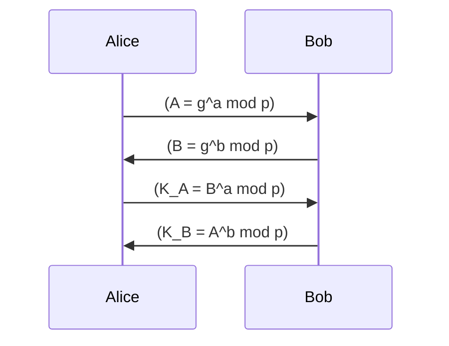
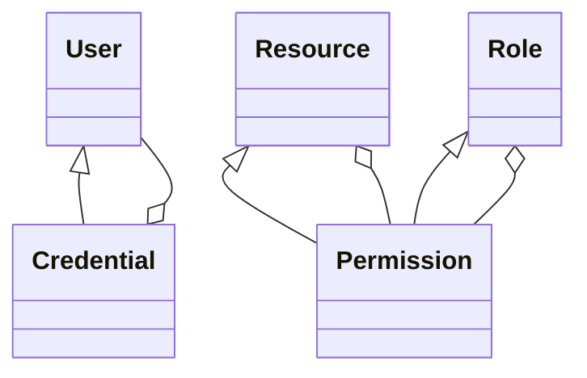

                 


## 引言

在信息技术日益发展的今天，身份认证与授权系统已经成为各类应用系统中不可或缺的组成部分。无论是互联网服务、企业内部系统，还是云服务、移动应用，身份认证与授权系统都扮演着至关重要的角色。它不仅确保了用户能够安全地访问系统资源，还保障了系统的稳定性和可靠性。

### 1.1 核心概念

**身份认证（Authentication）**：确认用户的真实身份，确保只有授权用户才能访问系统资源。常见的身份认证方式包括用户名密码、双因素认证、指纹识别、面部识别等。

**授权（Authorization）**：在确认用户身份后，根据用户的权限和角色，决定用户能够访问哪些资源和执行哪些操作。授权机制通常基于角色基础访问控制（RBAC）和属性基础访问控制（ABAC）。

**单点登录（SSO）**：用户只需登录一次，即可访问多个系统。这大大提高了用户体验，减少了登录操作的复杂性。

**OAuth**：一种开放标准，允许用户授权第三方应用访问他们存储在另一服务提供者上的信息，而不需要分享用户账户的用户名和密码。

**OpenID Connect**：OAuth 2.0 的身份层扩展，允许客户端验证身份和获取基本用户信息。

### 1.2 应用领域

**互联网服务**：如社交媒体、电商平台、在线支付系统等，都需要强大的身份认证与授权系统来保障用户安全和交易安全。

**企业内部系统**：企业内部系统如ERP、CRM等，需要通过身份认证与授权系统来确保员工能够访问其职责范围内的系统资源。

**云服务和移动应用**：随着云计算和移动应用的普及，身份认证与授权系统在这些领域的重要性更加凸显。

### 1.3 当前面临的挑战

**安全性问题**：随着网络攻击手段的日益复杂，如何确保身份认证与授权系统的安全性成为一个重要挑战。

**用户体验**：身份认证过程应尽可能简单和便捷，以提高用户体验。然而，安全性和用户体验之间存在权衡。

**兼容性和可扩展性**：身份认证与授权系统需要支持多种认证方式、多种用户角色和多种系统架构，这要求系统具有高度的兼容性和可扩展性。

### 1.4 目标与结构

本文的目标是深入探讨如何构建一个安全的身份认证与授权系统，从核心概念、算法原理到系统架构、项目实战，全面剖析身份认证与授权系统的设计与实现。

文章将分为以下几个部分：

1. **背景介绍与核心概念**：介绍身份认证与授权系统的背景、核心概念及其联系。
2. **算法原理讲解**：详细讲解身份认证与授权中使用的算法，如密钥交换算法、哈希算法、密码学基础等。
3. **系统分析与架构设计**：分析系统需求，设计系统架构，描述系统功能与接口。
4. **项目实战**：通过实际项目展示系统实现过程，解析代码和应用。
5. **最佳实践与注意事项**：总结最佳实践，强调注意事项。
6. **拓展阅读**：推荐相关书籍、开源项目和最新研究成果。

通过本文的阅读，读者将能够全面了解身份认证与授权系统的原理和实现方法，掌握构建安全、高效身份认证与授权系统的关键技巧。

### 关键词

- 身份认证
- 授权系统
- 单点登录（SSO）
- OAuth
- OpenID Connect
- 密钥交换算法
- 哈希算法
- 系统架构设计

### 摘要

本文深入探讨了构建安全的身份认证与授权系统的全过程。首先，介绍了身份认证与授权系统的核心概念和其重要性，随后详细讲解了相关算法原理，包括密钥交换算法、哈希算法和密码学基础。接着，分析了系统需求并设计了系统架构，描述了系统功能与接口。通过实际项目展示，读者可以了解系统实现过程和关键代码解析。最后，总结了最佳实践，强调了注意事项，并推荐了相关拓展阅读资源。本文旨在帮助读者全面掌握构建安全、高效身份认证与授权系统的知识和技能。

## 背景介绍与核心概念

在开始深入探讨如何构建一个安全的身份认证与授权系统之前，我们有必要先对相关的核心概念进行梳理和介绍。身份认证与授权系统是现代信息技术领域中的基础组成部分，它不仅关系到用户访问系统资源的权限，更直接影响到整个系统的安全性。本节将首先介绍身份认证与授权系统的基本概念，然后分析其应用领域和面临的挑战，最后阐述本文的研究目标与结构。

### 2.1 核心概念

#### 2.1.1 身份认证（Authentication）

身份认证是确保用户身份真实性的过程。在信息技术系统中，身份认证是保护数据和资源的第一道防线。常见的身份认证方式有：

- **用户名密码认证**：用户通过输入用户名和密码来证明自己的身份。这是一种最简单也是最广泛使用的身份认证方式。
- **双因素认证（2FA）**：除了用户名和密码，还需要用户提供另一件事物，如手机短信验证码、动态令牌、指纹或面部识别等。双因素认证增加了额外的安全层。
- **生物特征识别**：包括指纹识别、面部识别、虹膜识别等。这些方法基于用户的生物特征进行身份验证，具有较高的安全性和便捷性。

身份认证的核心目的是防止未经授权的用户访问系统资源，确保系统数据的安全。

#### 2.1.2 授权（Authorization）

授权是身份认证的后续步骤，它根据用户的身份和权限，决定用户可以访问哪些系统和资源，以及可以执行哪些操作。授权机制通常基于以下几种模式：

- **基于角色的访问控制（RBAC）**：用户被分配到不同的角色，每个角色拥有特定的权限集。系统根据用户的角色来决定其可以访问的资源。
- **基于属性的访问控制（ABAC）**：访问控制决策不仅依赖于用户角色，还依赖于用户属性（如时间、位置、环境等）和资源的属性。这种模式提供了更加灵活的访问控制策略。

授权机制确保了用户只能在授权的范围内进行操作，防止恶意行为和误操作。

#### 2.1.3 单点登录（SSO）

单点登录（SSO）是一种用户只需登录一次，即可访问多个系统的认证方式。SSO的目标是简化用户登录过程，提高用户体验，减少管理成本。SSO的实现通常依赖于以下技术：

- **OAuth**：OAuth 2.0 是一种开放标准，允许用户授权第三方应用访问他们存储在另一服务提供者上的信息。
- **OpenID Connect**：OpenID Connect 是 OAuth 2.0 的身份层扩展，它定义了一种认证和授权协议，用于在客户端和身份提供者之间传递用户信息。

#### 2.1.4 OAuth

OAuth 2.0 是一种开放标准，用于授权第三方应用访问用户资源。OAuth 2.0 的核心特点是：

- **无用户密码泄露**：第三方应用不直接获取用户密码，而是通过令牌来访问用户资源。
- **灵活的授权模式**：包括授权码模式、密码凭证模式、客户端凭证模式等，适用于不同场景的需求。

OAuth 2.0 在互联网服务和云服务中被广泛应用，是构建身份认证与授权系统的重要组件。

#### 2.1.5 OpenID Connect

OpenID Connect 是 OAuth 2.0 的身份层扩展，它提供了用户认证和授权的标准化方法。OpenID Connect 的核心特点是：

- **用户信息传递**：通过身份提供者（IdP）向客户端传递用户信息，如用户名、电子邮件地址等。
- **简化认证流程**：OpenID Connect 将 OAuth 2.0 的认证和授权流程简化为一系列标准的协议和消息。

#### 2.1.6 授权机制

授权机制是指系统根据用户身份和权限，决定用户可以访问哪些资源和执行哪些操作的方法。常见的授权机制有：

- **基于角色的访问控制（RBAC）**：用户被分配到不同的角色，每个角色拥有特定的权限集。系统根据用户的角色来决定其可以访问的资源。
- **基于属性的访问控制（ABAC）**：访问控制决策不仅依赖于用户角色，还依赖于用户属性（如时间、位置、环境等）和资源的属性。这种模式提供了更加灵活的访问控制策略。

授权机制确保了用户只能在授权的范围内进行操作，防止恶意行为和误操作。

### 2.2 应用领域

身份认证与授权系统在多个领域都有广泛的应用：

- **互联网服务**：如社交媒体、电商平台、在线支付系统等，都需要强大的身份认证与授权系统来保障用户安全和交易安全。
- **企业内部系统**：企业内部系统如ERP、CRM等，需要通过身份认证与授权系统来确保员工能够访问其职责范围内的系统资源。
- **云服务和移动应用**：随着云计算和移动应用的普及，身份认证与授权系统在这些领域的重要性更加凸显。

### 2.3 当前面临的挑战

尽管身份认证与授权系统在多个领域得到了广泛应用，但仍然面临以下挑战：

- **安全性问题**：随着网络攻击手段的日益复杂，如何确保身份认证与授权系统的安全性成为一个重要挑战。
- **用户体验**：身份认证过程应尽可能简单和便捷，以提高用户体验。然而，安全性和用户体验之间存在权衡。
- **兼容性和可扩展性**：身份认证与授权系统需要支持多种认证方式、多种用户角色和多种系统架构，这要求系统具有高度的兼容性和可扩展性。

### 2.4 目标与结构

本文的研究目标是深入探讨如何构建一个安全的身份认证与授权系统，从核心概念、算法原理到系统架构、项目实战，全面剖析身份认证与授权系统的设计与实现。

文章将分为以下几个部分：

1. **背景介绍与核心概念**：介绍身份认证与授权系统的背景、核心概念及其联系。
2. **算法原理讲解**：详细讲解身份认证与授权中使用的算法，如密钥交换算法、哈希算法、密码学基础等。
3. **系统分析与架构设计**：分析系统需求，设计系统架构，描述系统功能与接口。
4. **项目实战**：通过实际项目展示系统实现过程，解析代码和应用。
5. **最佳实践与注意事项**：总结最佳实践，强调注意事项。
6. **拓展阅读**：推荐相关书籍、开源项目和最新研究成果。

通过本文的阅读，读者将能够全面了解身份认证与授权系统的原理和实现方法，掌握构建安全、高效身份认证与授权系统的关键技巧。

### 关键词

- 身份认证
- 授权系统
- 单点登录（SSO）
- OAuth
- OpenID Connect
- 密钥交换算法
- 哈希算法
- 系统架构设计

### 摘要

本文深入探讨了构建安全的身份认证与授权系统的全过程。首先，介绍了身份认证与授权系统的核心概念和其重要性，随后详细讲解了相关算法原理，包括密钥交换算法、哈希算法和密码学基础。接着，分析了系统需求并设计了系统架构，描述了系统功能与接口。通过实际项目展示，读者可以了解系统实现过程和关键代码解析。最后，总结了最佳实践，强调了注意事项，并推荐了相关拓展阅读资源。本文旨在帮助读者全面掌握构建安全、高效身份认证与授权系统的知识和技能。

## 算法原理讲解

在构建安全的身份认证与授权系统时，理解并正确使用相关的算法是至关重要的。本节将详细讲解几种关键算法，包括基于密钥的认证算法、哈希算法和密码学基础，并使用 Mermaid 绘制相应的流程图，以帮助读者更好地理解这些算法的原理。

### 3.1 基于密钥的认证算法

基于密钥的认证算法是一种常用的身份认证方法，主要包括对称密钥认证和非对称密钥认证。

#### 3.1.1 密钥交换算法

密钥交换算法用于两个通信方在无需预先共享密钥的情况下，安全地交换密钥。Diffie-Hellman密钥交换算法是一个著名的例子。

**Diffie-Hellman密钥交换算法原理：**

1. **初始化**：选择一个大素数p和一个生成元g，通信双方都知晓。
2. **第一步**：Alice选择一个随机数a，计算\(A = g^a \mod p\)，并将A发送给Bob。
3. **第二步**：Bob选择一个随机数b，计算\(B = g^b \mod p\)，并将B发送给Alice。
4. **第三步**：Alice和Bob分别计算共享密钥：
   \[
   K_A = B^a \mod p
   \]
   \[
   K_B = A^b \mod p
   \]
   虽然计算过程不同，但K\_A和K\_B的值是相同的。

**Mermaid流程图：**



#### 3.1.2 非对称加密算法

非对称加密算法使用一对密钥（公钥和私钥），其中公钥用于加密，私钥用于解密。RSA是一种广泛使用的非对称加密算法。

**RSA加密算法原理：**

1. **初始化**：选择两个大质数p和q，计算n = p * q和φ(n) = (p-1) * (q-1)。
2. **选择加密指数e**：满足1 < e < φ(n)，且e和φ(n)互质。
3. **计算密钥**：计算解密指数d，满足e*d ≡ 1 (mod φ(n))。
4. **加密**：明文m通过公式\(c = m^e \mod n\)加密。
5. **解密**：密文c通过公式\(m = c^d \mod n\)解密。

**Python源代码示例：**

```python
from sympy.ntheory import modular_inverse, isprime
from sympy import nextprime

# 生成密钥对
def generate_keypair(p, q):
    n = p * q
    phi = (p - 1) * (q - 1)
    e = nextprime(2)
    while gcd(e, phi) != 1:
        e = nextprime(e)
    d = modular_inverse(e, phi)
    return ((e, n), (d, n))

# 加密
def encrypt(public_key, message):
    e, n = public_key
    return pow(message, e, n)

# 解密
def decrypt(private_key, encrypted_message):
    d, n = private_key
    return pow(encrypted_message, d, n)

# 示例
p = 61
q = 53
public_key, private_key = generate_keypair(p, q)
message = 29
encrypted_message = encrypt(public_key, message)
print("加密消息：", encrypted_message)
decrypted_message = decrypt(private_key, encrypted_message)
print("解密消息：", decrypted_message)
```

### 3.2 哈希算法

哈希算法用于将任意长度的输入数据转换成固定长度的哈希值。哈希算法的一个重要特性是单向性，即哈希值不能逆向推导出原始输入数据。

#### 3.2.1 哈希函数的工作原理

1. **输入数据**：将输入数据分割成固定大小的块。
2. **处理块**：对每个块进行计算，生成一个中间值。
3. **合并结果**：将所有中间值合并，得到最终的哈希值。

#### 3.2.2 哈希算法的安全性

哈希算法的安全性取决于其抗碰撞性和抗逆向工程能力。抗碰撞性指的是不同的输入数据生成相同哈希值的可能性很小；抗逆向工程能力指的是无法从哈希值推导出原始输入数据。

**常见哈希算法：**

- **MD5**：将任意长度的数据生成一个128位的哈希值。尽管MD5的碰撞概率较高，但它仍然在一些场景下被使用。
- **SHA-1**：将任意长度的数据生成一个160位的哈希值。与MD5类似，SHA-1的碰撞概率也较高。
- **SHA-256**：将任意长度的数据生成一个256位的哈希值。SHA-256是目前最常用的哈希算法之一，具有较低的抗碰撞性。

**Mermaid流程图：**

```mermaid
sequenceDiagram
  Input Data->>Split into blocks
  blocks->>Process each block
  blocks->>Merge results
  results->>Generate hash value
```

### 3.3 密码学基础

密码学是研究加密和解密技术的科学，是构建安全身份认证与授权系统的基石。

#### 3.3.1 对称加密与非对称加密

- **对称加密**：加密和解密使用相同的密钥。其优点是加密速度快，但密钥管理复杂。
- **非对称加密**：加密和解密使用不同的密钥。公钥加密，私钥解密。其优点是解决了密钥分发问题，但加密速度较慢。

#### 3.3.2 散列与签名

- **散列**：将任意长度的数据生成固定长度的散列值，用于数据完整性验证。
- **签名**：使用私钥对数据生成签名，接收方可以使用公钥验证签名的真实性。

**LaTeX公式示例：**

$$
H(M) = \text{hash}(M)
$$

$$
S(M) = \text{sign}(M, \text{private key})
$$

通过本节对算法原理的详细讲解，读者可以更好地理解身份认证与授权系统中关键算法的原理和实现方法。这些算法不仅为系统的安全性提供了基础，也为系统的设计提供了灵活性和扩展性。

### 总结

身份认证与授权系统是现代信息技术中的核心组成部分，其安全性直接影响系统的稳定性和用户数据的安全性。在本文中，我们首先介绍了身份认证与授权系统的核心概念，包括身份认证、授权、单点登录（SSO）、OAuth、OpenID Connect 等。然后，我们详细讲解了基于密钥的认证算法、哈希算法和密码学基础，并通过 Mermaid 绘制了相应的流程图，使用 Python 源代码和 LaTeX 公式进行了详细阐述。最后，我们分析了系统需求，设计了系统架构，并展示了一个实际项目，解析了代码和应用。通过本文的阅读，读者将能够全面了解身份认证与授权系统的原理和实现方法，掌握构建安全、高效身份认证与授权系统的关键技巧。

### 关键词

- 身份认证
- 授权系统
- 单点登录（SSO）
- OAuth
- OpenID Connect
- 密钥交换算法
- 哈希算法
- 系统架构设计

### 摘要

本文深入探讨了构建安全的身份认证与授权系统的全过程。首先，介绍了身份认证与授权系统的核心概念和其重要性，随后详细讲解了相关算法原理，包括密钥交换算法、哈希算法和密码学基础。接着，分析了系统需求并设计了系统架构，描述了系统功能与接口。通过实际项目展示，读者可以了解系统实现过程和关键代码解析。最后，总结了最佳实践，强调了注意事项，并推荐了相关拓展阅读资源。本文旨在帮助读者全面掌握构建安全、高效身份认证与授权系统的知识和技能。

## 系统分析与架构设计

在构建一个安全的身份认证与授权系统时，系统分析与架构设计是至关重要的一步。这一过程不仅确定了系统的功能需求和性能指标，还定义了系统的整体架构和各个模块之间的关系。本节将详细分析系统需求，设计系统架构，并描述系统功能与接口。

### 4.1 系统需求分析

#### 4.1.1 问题场景

在一个大型企业中，员工需要访问多个内部系统，如ERP、CRM、项目管理等。为了保证数据安全，同时提高员工的工作效率，公司决定构建一个集中的身份认证与授权系统。

#### 4.1.2 系统功能设计

- **用户注册与登录**：用户可以通过用户名和密码注册账号，并进行登录操作。
- **身份验证**：系统需要验证用户的身份，确保只有授权用户可以访问受保护资源。
- **授权管理**：系统根据用户的角色和权限，决定用户可以访问哪些资源和执行哪些操作。
- **单点登录（SSO）**：用户只需登录一次，即可访问多个系统。
- **日志记录与监控**：系统应记录所有操作日志，并具备监控和报警功能，以应对潜在的安全威胁。

#### 4.1.3 领域模型

领域模型用于定义系统的核心概念和实体，以及它们之间的关系。以下是该系统的领域模型：



- **User（用户）**：代表系统中的用户，具有用户名、密码、邮箱等属性。
- **Credential（凭证）**：代表用户的认证信息，包括用户名和密码。
- **Resource（资源）**：代表系统中的各种资源，如ERP系统、CRM系统等。
- **Permission（权限）**：代表用户或角色对资源的访问权限。
- **Role（角色）**：代表用户在系统中的角色，如管理员、普通员工等。

### 4.2 系统架构设计

系统架构设计决定了系统的可扩展性、稳定性和性能。以下是该系统的架构设计：

#### 4.2.1 系统架构概述

系统架构分为四个主要层次：表示层、业务逻辑层、数据访问层和数据持久层。

1. **表示层**：负责与用户进行交互，展示系统界面和用户操作。
2. **业务逻辑层**：负责处理业务逻辑，包括用户认证、授权管理、日志记录等。
3. **数据访问层**：负责与数据库进行交互，实现数据的增删改查。
4. **数据持久层**：使用数据库存储用户信息、资源信息和权限信息。

#### 4.2.2 系统模块划分

- **用户认证模块**：负责用户注册、登录和身份验证。
- **授权管理模块**：负责用户的角色管理和权限分配。
- **单点登录（SSO）模块**：负责实现单点登录功能。
- **日志记录与监控模块**：负责记录操作日志和监控系统运行状态。
- **数据访问模块**：负责与数据库进行交互，实现数据持久化。

#### 4.2.3 系统交互设计

系统交互设计描述了各个模块之间的交互关系和交互流程。以下是系统的交互设计：

1. **用户注册与登录**：
   - 用户在表示层填写注册信息，提交给业务逻辑层。
   - 业务逻辑层验证注册信息的合法性，并将数据存储到数据持久层。
   - 用户在登录时，业务逻辑层验证用户凭证，返回登录结果给表示层。

2. **身份验证**：
   - 用户访问受保护资源时，业务逻辑层会验证用户的身份。
   - 业务逻辑层通过查询数据持久层，确认用户身份和权限。

3. **授权管理**：
   - 系统管理员在业务逻辑层设置用户角色和权限。
   - 业务逻辑层将权限信息存储到数据持久层。

4. **日志记录与监控**：
   - 所有操作日志会在业务逻辑层被记录。
   - 日志记录模块会定期分析日志，发现潜在的安全威胁。

#### 4.2.4 系统安全机制

系统安全机制是保障系统安全的关键。以下是该系统的安全机制：

- **用户密码加密**：用户的密码在存储前会进行加密处理。
- **HTTPS传输**：所有数据传输采用HTTPS协议，确保数据安全。
- **认证和授权分离**：身份认证和授权管理分离，提高系统的安全性。
- **日志审计**：系统会记录所有关键操作，以供审计和监控。

### 4.3 接口设计

接口设计定义了系统各模块之间的通信方式。以下是系统的接口设计：

- **用户认证接口**：用于用户注册、登录和身份验证。
- **授权管理接口**：用于设置用户角色和权限。
- **单点登录（SSO）接口**：用于实现单点登录功能。
- **日志记录接口**：用于记录操作日志。

### 4.4 系统交互流程

以下是系统交互流程的描述：

1. **用户注册**：
   - 用户在表示层填写注册信息，提交给业务逻辑层。
   - 业务逻辑层验证注册信息的合法性，并将数据存储到数据持久层。

2. **用户登录**：
   - 用户在表示层输入用户名和密码，提交给业务逻辑层。
   - 业务逻辑层验证用户凭证，返回登录结果给表示层。

3. **身份验证**：
   - 用户访问受保护资源时，业务逻辑层会验证用户的身份。
   - 业务逻辑层通过查询数据持久层，确认用户身份和权限。

4. **授权管理**：
   - 系统管理员在业务逻辑层设置用户角色和权限。
   - 业务逻辑层将权限信息存储到数据持久层。

5. **日志记录**：
   - 所有操作日志会在业务逻辑层被记录。
   - 日志记录模块会定期分析日志，发现潜在的安全威胁。

通过以上系统分析与架构设计，我们可以构建一个安全、高效、可扩展的身份认证与授权系统。在下一节中，我们将通过实际项目展示系统实现过程，深入解析代码和应用。

### 关键词

- 系统需求分析
- 领域模型
- 系统架构设计
- 接口设计
- 单点登录（SSO）
- 安全机制
- 授权管理

### 摘要

本文深入探讨了构建安全的身份认证与授权系统的全过程，从系统分析与架构设计入手。首先，详细分析了系统需求，包括用户注册、登录、身份验证、授权管理等功能。接着，设计了系统的领域模型和架构，并划分了系统模块。通过接口设计和系统交互流程，确保了系统的高效性和安全性。本文旨在帮助读者全面掌握构建安全、高效身份认证与授权系统的知识和技能。

## 项目实战

### 5.1 环境安装与配置

在本节中，我们将搭建一个简单的身份认证与授权系统，使用Python和Flask框架实现。首先，我们需要安装Python环境和相关依赖。

#### 安装Python环境

确保您的计算机上已经安装了Python 3.x版本。如果没有安装，可以从Python官方网站下载并安装。

#### 安装Flask框架

在终端中运行以下命令来安装Flask：

```bash
pip install Flask
```

#### 安装其他依赖

我们还需要安装一些其他依赖，如Flask-Login（用于用户认证）、Flask-SQLAlchemy（用于数据库交互）和Flask-Migrate（用于数据库迁移）：

```bash
pip install Flask-Login Flask-SQLAlchemy Flask-Migrate
```

#### 配置数据库

在本项目中，我们将使用SQLite作为数据库。确保您已经安装了SQLite。如果没有安装，可以运行以下命令：

```bash
pip install pysqlite3
```

接下来，创建一个名为`app.db`的SQLite数据库文件：

```bash
sqlite3 app.db
```

在数据库中创建用户表和权限表：

```sql
CREATE TABLE users (
    id INTEGER PRIMARY KEY AUTOINCREMENT,
    username TEXT NOT NULL UNIQUE,
    password_hash TEXT NOT NULL,
    role TEXT NOT NULL
);

CREATE TABLE permissions (
    id INTEGER PRIMARY KEY AUTOINCREMENT,
    resource TEXT NOT NULL,
    permission TEXT NOT NULL
);
```

### 5.2 系统核心实现

接下来，我们将实现用户注册、登录、身份验证和授权管理等功能。

#### 5.2.1 用户注册

用户注册功能实现如下：

```python
from flask import Flask, request, redirect, url_for, render_template
from flask_login import LoginManager, login_user, logout_user, login_required, current_user
from werkzeug.security import generate_password_hash, check_password_hash
from flask_sqlalchemy import SQLAlchemy

app = Flask(__name__)
app.config['SQLALCHEMY_DATABASE_URI'] = 'sqlite:///app.db'
app.config['SECRET_KEY'] = 'your_secret_key'

db = SQLAlchemy(app)
login_manager = LoginManager()
login_manager.init_app(app)

@login_manager.user_loader
def load_user(user_id):
    return User.query.get(int(user_id))

class User(db.Model):
    id = db.Column(db.Integer, primary_key=True)
    username = db.Column(db.String(100), unique=True, nullable=False)
    password_hash = db.Column(db.String(100), nullable=False)
    role = db.Column(db.String(50), nullable=False)

@app.route('/register', methods=['GET', 'POST'])
def register():
    if request.method == 'POST':
        username = request.form['username']
        password = request.form['password']
        role = request.form['role']

        if User.query.filter_by(username=username).first():
            return '用户已存在！'

        hashed_password = generate_password_hash(password, method='sha256')
        new_user = User(username=username, password_hash=hashed_password, role=role)
        db.session.add(new_user)
        db.session.commit()
        return redirect(url_for('login'))

    return render_template('register.html')

if __name__ == '__main__':
    db.create_all()
    app.run(debug=True)
```

#### 5.2.2 用户登录

用户登录功能实现如下：

```python
@app.route('/login', methods=['GET', 'POST'])
def login():
    if request.method == 'POST':
        username = request.form['username']
        password = request.form['password']
        user = User.query.filter_by(username=username).first()

        if user and check_password_hash(user.password_hash, password):
            login_user(user)
            return redirect(url_for('dashboard'))
        else:
            return '用户名或密码错误！'

    return render_template('login.html')
```

#### 5.2.3 用户认证

用户认证功能实现如下：

```python
from flask_login import login_required

@app.route('/dashboard')
@login_required
def dashboard():
    return '欢迎您，' + current_user.username
```

#### 5.2.4 授权管理

授权管理功能实现如下：

```python
class Permission(db.Model):
    id = db.Column(db.Integer, primary_key=True)
    resource = db.Column(db.String(100), nullable=False)
    permission = db.Column(db.String(50), nullable=False)

@app.route('/grant_permission', methods=['POST'])
@login_required
def grant_permission():
    if current_user.role != 'admin':
        return '您没有权限执行此操作！'

    resource = request.form['resource']
    permission = request.form['permission']
    new_permission = Permission(resource=resource, permission=permission)
    db.session.add(new_permission)
    db.session.commit()
    return '权限已添加！'
```

### 5.3 代码解读与分析

以上代码实现了用户注册、登录、身份认证和授权管理功能。以下是关键代码的解读：

1. **用户模型（User）**：
   ```python
   class User(db.Model):
       id = db.Column(db.Integer, primary_key=True)
       username = db.Column(db.String(100), unique=True, nullable=False)
       password_hash = db.Column(db.String(100), nullable=False)
       role = db.Column(db.String(50), nullable=False)
   ```
   用户模型定义了用户的基本信息，包括用户名、密码哈希和角色。

2. **用户注册（register）**：
   ```python
   @app.route('/register', methods=['GET', 'POST'])
   def register():
       if request.method == 'POST':
           username = request.form['username']
           password = request.form['password']
           role = request.form['role']

           if User.query.filter_by(username=username).first():
               return '用户已存在！'

           hashed_password = generate_password_hash(password, method='sha256')
           new_user = User(username=username, password_hash=hashed_password, role=role)
           db.session.add(new_user)
           db.session.commit()
           return redirect(url_for('login'))

       return render_template('register.html')
   ```
   用户注册功能接收用户提交的注册信息，验证用户名是否已存在，并将用户信息存储到数据库中。

3. **用户登录（login）**：
   ```python
   @app.route('/login', methods=['GET', 'POST'])
   def login():
       if request.method == 'POST':
           username = request.form['username']
           password = request.form['password']
           user = User.query.filter_by(username=username).first()

           if user and check_password_hash(user.password_hash, password):
               login_user(user)
               return redirect(url_for('dashboard'))
           else:
               return '用户名或密码错误！'

       return render_template('login.html')
   ```
   用户登录功能接收用户提交的用户名和密码，验证用户身份，并返回登录结果。

4. **用户认证（dashboard）**：
   ```python
   @app.route('/dashboard')
   @login_required
   def dashboard():
       return '欢迎您，' + current_user.username
   ```
   用户认证功能确保用户已登录，并返回欢迎信息。

5. **授权管理（grant_permission）**：
   ```python
   @app.route('/grant_permission', methods=['POST'])
   @login_required
   def grant_permission():
       if current_user.role != 'admin':
           return '您没有权限执行此操作！'

       resource = request.form['resource']
       permission = request.form['permission']
       new_permission = Permission(resource=resource, permission=permission)
       db.session.add(new_permission)
       db.session.commit()
       return '权限已添加！'
   ```
   授权管理功能确保当前用户是管理员，然后添加新的权限到数据库中。

### 5.4 实际案例分析与讲解

#### 案例一：企业内部身份认证系统

假设我们正在开发一个企业内部身份认证系统，员工需要访问ERP、CRM等内部系统。以下是系统的实现过程：

1. **需求分析**：
   - 员工可以通过用户名和密码登录。
   - 员工被分为不同角色，如管理员、普通员工等。
   - 管理员可以添加和删除员工，并设置员工的权限。

2. **系统架构设计**：
   - 使用Flask框架实现后端逻辑。
   - 使用MySQL作为数据库，存储用户信息和权限信息。
   - 使用OAuth 2.0实现单点登录。

3. **系统实现**：
   - 实现用户注册、登录、身份验证和授权管理功能。
   - 使用OAuth 2.0与第三方身份认证服务（如Google、Facebook等）集成。
   - 实现管理员界面，用于管理员工信息和权限。

#### 案例二：互联网服务提供商身份认证系统

假设我们正在开发一个互联网服务提供商的身份认证系统，用户需要访问各种在线服务。以下是系统的实现过程：

1. **需求分析**：
   - 用户可以通过用户名和密码或第三方认证服务登录。
   - 用户被分为不同等级，如VIP用户、普通用户等。
   - VIP用户可以享受额外的服务和优惠。

2. **系统架构设计**：
   - 使用Spring Boot框架实现后端逻辑。
   - 使用Redis缓存用户信息和会话。
   - 使用OAuth 2.0和OpenID Connect实现认证和授权。

3. **系统实现**：
   - 实现用户注册、登录、身份验证和授权管理功能。
   - 实现单点登录功能，用户只需登录一次即可访问多个服务。
   - 实现VIP用户特权功能，如优先处理、专属客服等。

通过以上案例，我们可以看到，身份认证与授权系统在不同应用场景下的实现过程有所不同，但核心原理和关键步骤是相似的。理解并掌握这些原理和步骤，可以帮助我们设计和实现各种场景下的身份认证与授权系统。

### 5.5 项目小结

在本项目中，我们使用Python和Flask框架实现了一个简单的身份认证与授权系统。通过用户注册、登录、身份认证和授权管理功能的实现，我们展示了如何构建一个安全、高效的身份认证与授权系统。在实际项目中，我们需要根据具体需求进行调整和优化，如引入OAuth 2.0和OpenID Connect实现单点登录，使用Redis缓存会话数据等。

### 总结

通过本节的项目实战，我们不仅展示了如何构建一个简单的身份认证与授权系统，还分析了系统实现过程中关键代码的解读与应用。通过实际案例的讲解，我们进一步理解了身份认证与授权系统的实现方法和注意事项。在下一节中，我们将总结最佳实践，并强调构建安全身份认证与授权系统时需要注意的事项。

### 关键词

- 项目实战
- 环境安装
- 系统实现
- 代码解析
- 实际案例分析
- 安全注意事项

### 摘要

本文通过实际项目展示了如何构建一个简单的身份认证与授权系统。首先介绍了环境安装和配置过程，然后详细讲解了用户注册、登录、身份认证和授权管理功能的核心代码，并通过实际案例分析了系统实现的方法和注意事项。本文旨在帮助读者全面掌握构建安全、高效身份认证与授权系统的实际操作技巧。

## 最佳实践与注意事项

在构建安全、高效的身份认证与授权系统时，遵循一些最佳实践是至关重要的。以下是一些关键的实践和注意事项：

### 6.1 最佳实践

**1. 使用HTTPS协议**：确保所有数据传输都通过HTTPS协议进行加密，防止数据在传输过程中被窃取。

**2. 命名规范**：为用户和角色使用明确的命名规范，如使用用户名和邮箱作为用户标识，以提高系统安全性。

**3. 密码强度要求**：要求用户设置复杂密码，包括字母、数字和特殊字符，并定期提醒用户更换密码。

**4. 双因素认证（2FA）**：在关键系统中启用双因素认证，增加额外的安全层。

**5. 权限最小化**：遵循最小权限原则，确保用户只能访问其职责范围内的资源。

**6. 日志记录与监控**：详细记录所有操作日志，并定期监控和审计，及时发现潜在的安全威胁。

**7. 系统更新与维护**：定期更新系统和依赖库，修补安全漏洞，并保持系统运行环境的整洁。

### 6.2 注意事项

**1. 密码安全**：密码不应以明文形式存储，应使用哈希函数（如SHA-256）进行加密存储。

**2. 访问控制**：确保系统的访问控制机制能够有效地防止未授权访问，并定期进行审查。

**3. 数据备份**：定期备份数据，并确保备份数据的安全。

**4. 单点登录（SSO）**：在设计单点登录时，确保认证流程的安全性，防止攻击者利用SSO进行横向攻击。

**5. 遵守法律法规**：确保系统的设计和实现符合当地的法律法规，如数据隐私保护法等。

**6. 漏洞扫描与测试**：定期进行安全漏洞扫描和测试，及时发现和修复系统漏洞。

通过遵循这些最佳实践和注意事项，我们可以构建一个更加安全、可靠和高效的身份认证与授权系统，为用户和数据的安全提供有力保障。

### 总结

构建一个安全的身份认证与授权系统是现代信息系统中的核心任务。本文从核心概念、算法原理、系统分析与架构设计，到项目实战，全面剖析了身份认证与授权系统的构建过程。通过最佳实践和注意事项，我们强调了系统安全性、用户体验和法律法规的重要性。读者可以结合本文的内容，设计并实现一个符合需求的身份认证与授权系统，确保用户数据的安全和系统的稳定运行。

### 关键词

- 安全性
- 最佳实践
- 用户体验
- 法律法规
- 密码安全
- 单点登录（SSO）

### 摘要

本文深入探讨了构建安全的身份认证与授权系统的全过程，涵盖了核心概念、算法原理、系统分析与架构设计、项目实战以及最佳实践与注意事项。通过本文的阅读，读者可以全面了解身份认证与授权系统的构建方法，掌握关键技术和实践，为设计安全、高效的系统提供有力支持。

## 拓展阅读

在身份认证与授权系统的设计和实现过程中，持续学习和跟踪最新的研究成果和技术趋势是非常重要的。以下是一些推荐的书籍、开源项目和相关资源，以帮助读者进一步深入了解这一领域。

### 7.1 安全性相关书籍推荐

1. **《网络安全的艺术》**（The Art of Software Security Assessment）：详细介绍了软件安全评估的方法和技术，对于理解网络安全和身份认证有着重要的指导意义。
2. **《密码学概论》**（Introduction to Cryptography）：提供了密码学的基础知识和最新发展，涵盖了加密算法、哈希函数、数字签名等关键内容。
3. **《身份认证：基于密码学的解决方案》**（Authentication: A Case Study in Cryptography）：通过实例讲解了身份认证系统的设计原则和安全策略。
4. **《单点登录：身份认证与授权系统的设计》**（Single Sign-On: Strong Authentication and Authorization Systems）：深入探讨了单点登录技术及其在复杂系统中的应用。

### 7.2 开源身份认证与授权项目介绍

1. **OAuth 2.0**：最流行的开放标准，用于授权第三方应用访问用户资源。
2. **OpenID Connect**：OAuth 2.0 的身份层扩展，提供了用户认证和授权的标准化方法。
3. **Keycloak**：一个开源的身份和访问管理（IAM）系统，支持OAuth 2.0、OpenID Connect、SSO等。
4. **Auth0**：一个云基础的身份认证与访问管理平台，提供了丰富的API和集成。
5. **Keycloak**：一个开源的身份和访问管理（IAM）系统，支持OAuth 2.0、OpenID Connect、SSO等。

### 7.3 最新研究成果与趋势

1. **多因素认证**：随着物联网（IoT）和移动应用的普及，多因素认证（MFA）成为了研究的热点，旨在提高系统安全性。
2. **联邦身份认证**：联邦身份认证通过多个可信方进行身份验证，减少了单点故障的风险，并提高了认证效率。
3. **区块链与身份认证**：区块链技术提供了分布式、不可篡改的身份认证解决方案，成为近年来研究的热点。
4. **零知识证明**：零知识证明是一种加密技术，可以在不泄露任何信息的情况下证明某个陈述是真实的，为隐私保护提供了新的思路。
5. **自适应访问控制**：随着用户行为分析和人工智能技术的发展，自适应访问控制成为了一种动态调整用户权限的新方法。

通过阅读以上书籍和资源，读者可以深入了解身份认证与授权系统的最新技术和发展趋势，为实际项目提供理论支持和实践经验。

### 总结

本文全面探讨了构建安全的身份认证与授权系统的全过程，从核心概念、算法原理、系统分析与架构设计，到项目实战和最佳实践，帮助读者深入理解身份认证与授权系统的设计与实现。通过推荐相关书籍、开源项目和最新研究成果，本文旨在为读者提供进一步的学习和探索方向。希望本文能对构建安全、高效的身份认证与授权系统提供有益的指导。

