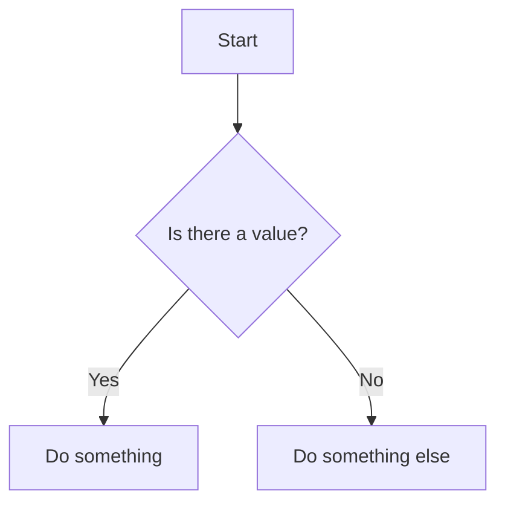
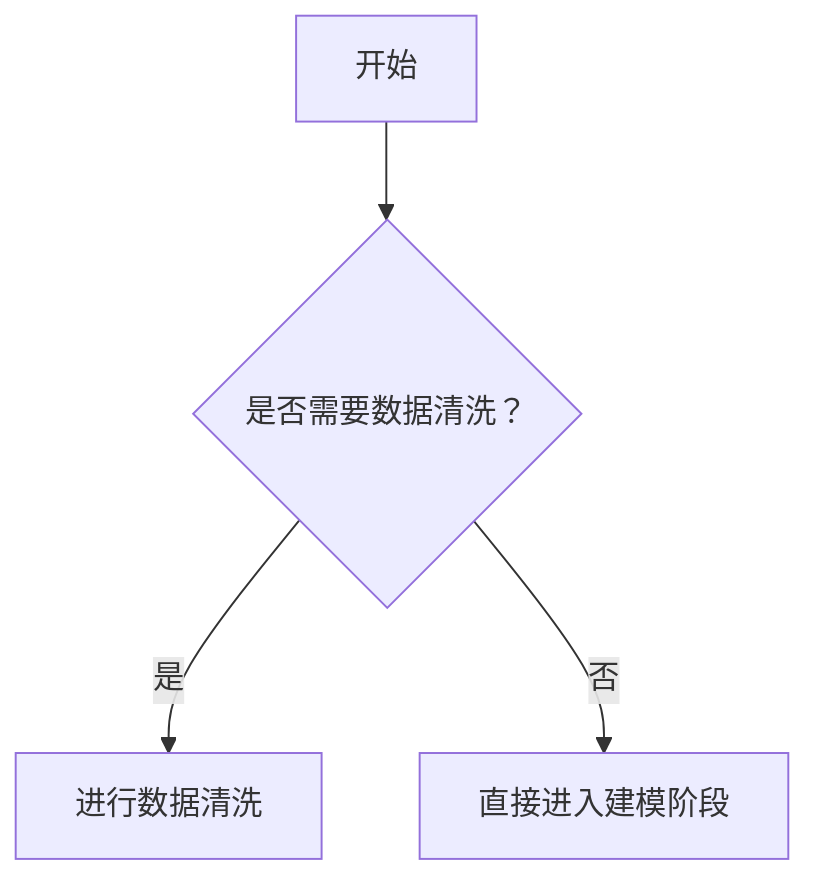

                 

## 建立技术团队核心竞争力的必要性

在现代信息技术飞速发展的背景下，技术团队的核心竞争力已经成为企业生存和发展的关键因素。技术团队的核心竞争力不仅决定了企业能否在激烈的市场竞争中脱颖而出，更直接影响着企业的创新能力和市场响应速度。因此，构建技术团队的核心竞争力已经成为企业管理者和IT专业人士共同关注的重要课题。

### **技术团队核心竞争力的定义与重要性**

技术团队核心竞争力是指团队在特定技术领域内所拥有的独特优势和能力，这些优势和能力使团队能够在项目开发、技术攻关和问题解决等方面展现出卓越的表现。核心竞争力通常包括技术能力、项目管理能力、团队协作能力和创新能力等几个方面。

- **技术能力**：技术团队的核心竞争力主要体现在技术能力上，包括对前沿技术的掌握、技术实现的深度和广度、以及解决复杂问题的能力。
- **项目管理能力**：有效的项目管理能力是确保项目按时、按质量完成的关键，良好的项目管理能力能够提高团队的工作效率，降低风险。
- **团队协作能力**：一个高效的团队需要具备良好的协作能力，包括沟通、协作工具的使用、角色分工清晰和协同工作的能力。
- **创新能力**：在快速变化的技术环境中，创新能力是企业保持竞争优势的重要手段。一个具有创新能力的团队能够不断推陈出新，为企业创造更多的价值。

### **技术团队核心竞争力的重要性**

1. **提升项目成功率和效率**：拥有核心竞争力的技术团队能够在项目开发中快速响应需求，高效解决问题，从而提升项目成功率和效率。

2. **增强企业竞争力**：核心竞争力是企业差异化竞争的重要手段，具有强大核心竞争力的技术团队能够为企业带来竞争优势，提升市场地位。

3. **推动企业持续创新**：核心竞争力不仅体现在当前的技术能力上，更体现在团队的持续创新能力上。一个具有核心竞争力的团队能够不断推动企业的技术进步和创新发展。

4. **优化团队管理**：通过构建核心竞争力，企业可以更好地进行团队管理和资源分配，提高团队整体的工作效率和协作能力。

### **构建技术团队核心竞争力的关键要素**

- **明确目标与战略**：企业需要明确技术团队的核心竞争力目标，制定相应的战略和规划。
- **技术路线选择**：根据市场需求和自身技术优势，选择合适的技术路线和方向。
- **人才培养与引进**：通过培训和引进优秀人才，提升团队的技术能力和创新能力。
- **团队建设与管理**：建立有效的团队协作机制，优化团队结构和流程，提高团队协作效率。

### **结论**

构建技术团队的核心竞争力是现代企业在激烈的市场竞争中立于不败之地的关键。通过明确核心竞争力目标、合理选择技术路线、加强人才培养和团队建设与管理，企业可以打造一支具有强大核心竞争力的技术团队，从而提升企业的整体竞争力和创新能力。

## **技术路线选择策略**

构建技术团队的核心竞争力，技术路线选择是至关重要的一环。一个合适的技术路线不仅能帮助团队快速占领市场，还能为企业的长期发展奠定坚实基础。在确定技术路线时，我们需要综合考虑市场趋势、技术发展现状、团队优势等多方面因素，确保所选技术路线具有前瞻性和可持续性。

### **分析市场趋势**

首先，我们需要对市场趋势进行深入分析。市场趋势决定了技术发展的方向，是技术路线选择的重要依据。以下是一些关键步骤：

1. **行业报告与市场研究**：通过阅读行业报告和市场研究报告，了解当前行业的发展态势、市场需求和技术动向。
2. **竞争对手分析**：分析竞争对手的技术路线选择，了解他们在技术上的优势和不足，从中找到市场机会。
3. **客户需求调研**：与客户进行沟通，了解他们的需求和期望，从而确定哪些技术方向更符合市场趋势。

### **评估技术发展现状**

在确定市场趋势后，我们需要对现有技术进行评估，包括技术的成熟度、适用性、发展潜力等。以下是一些关键步骤：

1. **技术成熟度评估**：通过技术成熟度模型（如Gartner技术成熟度曲线）评估所选技术的成熟度，避免选择尚未成熟或过于前沿的技术。
2. **技术适用性分析**：评估所选技术是否适用于团队当前的资源和能力，确保技术实施不会过于困难或资源浪费。
3. **技术发展潜力评估**：分析所选技术的未来发展潜力，确保所选技术能够在未来一段时间内保持竞争优势。

### **考虑团队优势与短板**

团队的优势和短板是技术路线选择的重要参考因素。以下是一些关键步骤：

1. **团队技术能力评估**：评估团队在各个技术方向上的能力，选择与团队优势相匹配的技术路线。
2. **团队短板分析**：识别团队在技术上的短板，通过技术培训、引进人才等方式弥补短板，确保技术路线的可行性。
3. **团队资源与技能匹配**：确保所选技术路线与团队现有的资源和技能相匹配，避免因资源不足或技能缺失而影响技术实施。

### **制定技术路线规划**

在综合考虑市场趋势、技术发展现状和团队优势后，我们需要制定详细的技术路线规划。以下是一些关键步骤：

1. **技术路线选择**：根据分析结果，选择最合适的技术路线，确保其具有前瞻性和可持续性。
2. **阶段性目标设定**：将技术路线分解为阶段性目标，每个阶段明确具体的任务和目标，确保技术实施有条不紊。
3. **资源分配与时间规划**：为每个阶段分配所需的资源和时间，确保技术实施过程中的资源充足和时间合理。

### **技术路线选择的注意事项**

1. **动态调整**：市场和技术环境不断变化，技术路线需要根据实际情况进行动态调整，以应对新的挑战和机遇。
2. **风险管理**：技术路线选择过程中，需要对潜在的风险进行评估和应对，确保技术实施过程中能够有效应对各种不确定性。
3. **持续评估与优化**：技术路线实施后，需要定期进行评估和优化，确保技术路线的可持续性和有效性。

### **总结**

技术路线选择是构建技术团队核心竞争力的关键环节。通过深入分析市场趋势、评估技术发展现状、考虑团队优势与短板，并制定详细的技术路线规划，企业可以确保所选技术路线具有前瞻性和可持续性，从而为团队的长期发展奠定坚实基础。

## **人才培养策略**

在构建技术团队核心竞争力中，人才培养策略是一个关键环节。一个优秀的技术团队需要具备扎实的专业技能、丰富的实战经验和持续的学习能力。因此，企业需要制定科学、系统的培养计划，确保团队成员能够在技术、管理和协作能力等方面不断提升。

### **识别和评估人才需求**

1. **技能需求分析**：根据企业当前和未来的业务需求，分析所需的核心技能和技术能力。这包括编程语言、数据库、框架、工具等具体技能。
2. **能力评估**：通过技能测试、项目评估等方式，评估现有团队成员的技术水平和潜力。识别出在哪些领域需要补充或提升。
3. **职业规划**：与团队成员进行沟通，了解他们的职业目标和兴趣领域，为他们提供个性化的职业发展规划。

### **内部培训与外部培训相结合**

1. **内部培训**：企业可以通过内部培训课程，提高员工的专业技能。这包括技术讲座、内部研讨会、项目分享等。
2. **外部培训**：鼓励员工参加行业会议、技术论坛和外部培训课程，拓宽视野，学习最新的技术和行业动态。
3. **导师制度**：为新员工或技术薄弱的员工安排经验丰富的导师，通过一对一指导，快速提升技能。

### **激励与奖励机制**

1. **绩效奖励**：根据员工的工作表现和项目贡献，设立绩效奖金和奖励制度，激励员工努力提升技能和表现。
2. **晋升机会**：为表现优秀的员工提供晋升机会，鼓励他们不断追求更高的职业目标。
3. **职业发展支持**：提供职业发展规划和培训机会，帮助员工实现职业成长。

### **实践与反思**

1. **项目实践**：通过参与实际项目，员工可以将所学知识应用于实际工作，提升实战能力。
2. **案例研讨**：定期组织案例研讨会，分析项目中的成功与失败案例，从中总结经验和教训。
3. **反思与总结**：鼓励员工在完成项目后进行反思，总结项目中的经验教训，不断提高自己的能力和水平。

### **持续学习和知识共享**

1. **在线学习平台**：提供在线学习资源，如在线课程、技术文档等，方便员工随时随地进行学习。
2. **知识库建设**：建立团队知识库，记录项目经验、技术文档、最佳实践等，促进知识共享和传承。
3. **内部交流**：定期组织内部交流会议，分享最新的技术动态、项目经验和个人成长故事。

### **总结**

人才培养是构建技术团队核心竞争力的重要策略。通过科学的人才需求分析、有效的培训机制、激励与奖励制度以及实践与反思，企业可以不断提升团队成员的专业技能和实战经验，为团队的长远发展奠定坚实基础。

### **技术栈规划与优化**

技术栈是技术团队的核心资产，决定了团队的技术能力和项目实施效率。一个合理且高效的技术栈不仅能提升团队的开发效率，还能保证项目的稳定性和可维护性。因此，技术栈规划与优化是构建技术团队核心竞争力的重要一环。

#### **技术栈的定义与重要性**

技术栈是指一个技术团队或项目所采用的一系列技术工具、框架和库。它通常包括前端技术、后端技术、数据库、开发工具、版本控制系统等。一个合理的技术栈不仅能够满足项目需求，还能提升团队的开发效率和维护性。

- **提高开发效率**：合理的技术栈可以减少开发过程中的重复劳动，降低开发难度，从而提高开发效率。
- **保证项目稳定性**：通过统一的技术标准和规范，可以减少项目中的错误和故障，提高项目的稳定性。
- **降低维护成本**：技术栈的优化可以帮助团队避免技术债务，减少后续的维护成本。

#### **技术栈规划的原则**

1. **需求导向**：技术栈规划应基于项目需求，选择最适合项目的技术和工具。避免为了追求新技术而牺牲项目需求。
2. **标准化**：制定统一的技术标准和规范，确保团队成员遵循相同的开发流程和技术规范。
3. **可扩展性**：技术栈应具备良好的可扩展性，以便在未来能够轻松引入新的技术和工具。
4. **社区支持**：选择社区支持广泛的技术和框架，确保团队在遇到问题时能够快速获得帮助。

#### **技术栈的评估与优化**

1. **现状评估**：定期评估当前技术栈的使用情况，包括技术成熟度、社区支持度、团队熟悉度等。
2. **技术评估**：分析现有技术和新兴技术的优缺点，评估其适用性和可扩展性。
3. **成本分析**：评估技术栈的维护成本、学习成本和迁移成本，确保技术栈优化不会导致成本过高。
4. **社区反馈**：收集团队成员和社区的意见和建议，了解技术栈在实际使用中的问题和改进方向。

#### **技术栈优化的策略**

1. **模块化**：将技术栈分解为模块，每个模块独立开发、测试和部署，提高技术栈的灵活性和可维护性。
2. **自动化**：引入自动化工具，如CI/CD流水线、自动化测试等，提高开发效率和项目质量。
3. **持续集成**：通过持续集成（CI）和持续部署（CD）工具，确保技术栈的更新和迭代过程更加高效和安全。
4. **文档化**：建立完善的技术文档，记录技术栈的组成、配置和使用方法，便于团队成员的学习和使用。

#### **总结**

技术栈规划与优化是构建技术团队核心竞争力的重要策略。通过需求导向的规划、标准化和可扩展性的设计，以及对技术栈的定期评估与优化，企业可以确保技术栈能够持续支持团队的发展，提升项目的开发效率和项目质量。

### **团队建设与管理**

在构建技术团队核心竞争力的过程中，团队建设与管理起着至关重要的作用。一个高效的团队不仅能够提升项目的完成质量，还能增强团队的凝聚力和创新能力。团队建设与管理涉及到多个方面，包括团队结构、沟通协作和风险管理等。以下是一系列策略和最佳实践，帮助企业打造一支强大且高效的团队。

#### **团队结构设计**

1. **明确团队角色**：根据项目需求，为团队设定明确的角色和职责，如项目经理、技术负责人、开发人员、测试人员等。每个角色都有其特定的职责和任务，确保团队高效运转。
2. **合理分工与协作**：根据团队成员的能力和专长，合理分配任务，确保每个成员能够充分发挥其优势。同时，建立跨部门的协作机制，促进不同部门之间的沟通和合作。
3. **团队规模控制**：团队规模应适中，避免过于庞大导致沟通成本增加和效率降低。根据项目需求调整团队规模，确保团队在合理范围内高效运作。

#### **沟通与协作策略**

1. **定期的团队会议**：定期举行团队会议，包括周会、月会等，讨论项目进展、问题和解决方案。会议应保持高效，避免冗长的讨论和无意义的议程。
2. **透明的信息共享**：通过共享平台和工具，确保团队中的信息透明化，每个成员都能及时了解项目的最新动态和需求变化。
3. **沟通技巧培训**：为团队成员提供沟通技巧培训，提高他们的表达能力和沟通效率，减少误解和冲突。
4. **协作工具使用**：引入协作工具，如Slack、Trello、JIRA等，确保团队成员能够高效地共享任务、文件和进度，提高团队协作效率。

#### **风险管理**

1. **风险识别与评估**：在项目启动阶段，对可能出现的风险进行识别和评估，制定相应的风险应对策略。
2. **定期风险评审**：项目进行过程中，定期进行风险评审，及时发现和解决潜在问题，避免风险扩大。
3. **应急响应机制**：建立应急响应机制，确保在出现紧急情况时，团队能够迅速响应并采取措施，减少风险对项目的影响。
4. **备份和恢复策略**：确保数据备份和系统恢复策略的有效性，降低数据丢失和系统故障的风险。

#### **团队文化建设**

1. **共同价值观**：建立团队的共同价值观，如客户至上、创新驱动、团队合作等，确保团队成员在价值观上达成一致，共同为团队目标努力。
2. **鼓励创新**：鼓励团队成员提出创新想法和建议，建立创新激励机制，提高团队的创新能力。
3. **持续学习**：鼓励团队成员持续学习和成长，提供培训和学习资源，帮助团队不断提升专业能力和技能。
4. **积极反馈**：建立积极的反馈机制，鼓励团队成员之间相互反馈和认可，提高团队的凝聚力和积极性。

#### **总结**

团队建设与管理是构建技术团队核心竞争力的重要组成部分。通过合理设计团队结构、强化沟通协作、有效进行风险管理以及建设积极向上的团队文化，企业可以打造一支高效、创新和具有强大凝聚力的团队，从而在激烈的市场竞争中脱颖而出。企业应不断优化团队建设与管理策略，确保团队能够持续提升其核心竞争力，实现长期稳定的发展。

### **项目实践案例**

为了更直观地展示构建技术团队核心竞争力的策略在实际中的应用，我们将通过一个具体的项目实践案例进行分析和解读。该项目是一个企业级电商平台，涉及的技术栈包括前端、后端、数据库、容器化部署等。以下是该项目在技术策略、团队建设与管理以及人才培养等方面的重要实践步骤和策略。

#### **项目背景**

该电商平台旨在为企业提供一个高效、可扩展的在线购物平台，以支持多种支付方式、订单管理和客户服务等功能。项目的主要目标是提高用户购物体验，同时保证系统的稳定性和高并发处理能力。

#### **技术策略**

1. **技术路线选择**：

   - **前端**：采用React框架，因为它具有良好的组件化、虚拟DOM和高性能特性，适合构建复杂前端应用。
   - **后端**：选择Spring Boot框架，因为它具有强大的社区支持、良好的扩展性和易于集成微服务架构。
   - **数据库**：使用MySQL和MongoDB，MySQL用于关系型数据存储，MongoDB用于非关系型数据存储，以应对不同类型的数据需求。

2. **技术栈规划与优化**：

   - **容器化部署**：使用Docker进行应用程序的容器化，确保环境一致性，提高部署效率。
   - **微服务架构**：将后端系统拆分为多个微服务，如用户服务、订单服务、支付服务等，提高系统的灵活性和可维护性。

3. **技术创新与实践**：

   - **实时消息系统**：采用WebSocket技术实现实时消息通信，提高用户交互体验。
   - **缓存策略**：使用Redis缓存热门数据和频繁查询结果，减少数据库压力，提高系统响应速度。

#### **团队建设与管理**

1. **团队角色与分工**：

   - **项目经理**：负责项目整体规划、进度控制和风险管理工作。
   - **技术负责人**：负责技术方案选择、架构设计和关键技术难题攻关。
   - **前端开发团队**：负责前端页面设计、开发和维护。
   - **后端开发团队**：负责后端服务开发和维护，包括API设计和数据库操作。
   - **测试团队**：负责测试计划的制定、执行和问题追踪。

2. **沟通与协作**：

   - **定期会议**：每周举行项目进度会议，确保团队成员了解项目动态和任务分配。
   - **沟通工具**：使用Slack进行日常沟通，Trello进行任务管理，确保信息的及时传递和任务的跟进。
   - **代码审查**：引入GitLab进行代码审查，确保代码质量，减少bug和重复劳动。

3. **风险管理**：

   - **风险识别与评估**：在项目初期，识别出可能的技术和业务风险，并制定相应的应对策略。
   - **应急响应机制**：建立应急响应小组，在出现紧急情况时迅速响应，确保项目稳定运行。

#### **人才培养与激励**

1. **内部培训**：

   - **技术讲座**：定期举办技术讲座，邀请内部专家分享技术经验和最佳实践。
   - **项目分享**：鼓励团队成员分享项目经验，互相学习和借鉴。

2. **外部培训**：

   - **技术论坛和会议**：支持团队成员参加行业技术论坛和会议，学习最新技术动态。
   - **在线学习平台**：提供在线学习资源，支持团队成员自我提升。

3. **激励与奖励**：

   - **绩效奖金**：根据团队成员的工作表现和项目贡献，发放绩效奖金。
   - **晋升机会**：为表现优秀的员工提供晋升机会，激励团队成员不断追求卓越。

#### **案例分析与解读**

通过该电商平台的实际项目，我们可以看到以下策略的有效性：

1. **技术策略**：合理的技术路线选择和技术栈规划，提高了项目的开发效率和系统稳定性。
2. **团队建设**：明确的团队分工和高效的沟通协作，确保项目顺利推进。
3. **人才培养**：系统的培训和激励机制，提升了团队成员的专业能力和工作积极性。

#### **项目小结与反思**

通过该项目的成功实施，我们认识到：

- **技术策略与团队建设是项目成功的关键**。合理的技术路线选择和高效的团队管理能够显著提高项目成功率。
- **人才培养和激励是团队持续发展的动力**。持续的人才培养和激励能够确保团队在快速变化的技术环境中保持竞争力。
- **项目管理与风险控制是确保项目顺利进行的重要保障**。有效的项目管理与风险控制能够确保项目按时、按质量完成。

通过该案例，我们不仅可以了解构建技术团队核心竞争力的具体策略，还能从中得到项目管理和团队建设的宝贵经验，为后续项目的实施提供参考。

### **技术创新与未来趋势**

在当今快速变化的技术环境中，技术创新已经成为企业保持竞争优势和实现持续增长的关键。技术团队需要不断关注新兴技术，积极探索并应用这些技术来提升自身竞争力。以下我们将探讨一些当前前沿的技术趋势，并分析这些趋势对未来技术团队发展的影响。

#### **人工智能（AI）与机器学习（ML）**

人工智能和机器学习技术正在逐渐融入各个行业，从自动化流程到智能决策支持，都显示出巨大的潜力。技术团队需要掌握深度学习、自然语言处理、计算机视觉等核心技能，以利用AI和ML技术优化业务流程和产品功能。

- **应用场景**：例如，通过机器学习算法分析用户行为数据，电商平台可以提供更个性化的购物推荐，从而提高用户满意度和转化率。
- **未来趋势**：随着计算能力的提升和数据量的增加，AI和ML技术将更加成熟，应用范围将进一步扩大。

#### **区块链技术**

区块链技术以其去中心化、不可篡改和透明性等特性，正在被广泛应用于金融、供应链管理、身份认证等领域。技术团队需要了解区块链的基本原理和不同类型的区块链平台，如比特币、以太坊等。

- **应用场景**：例如，利用区块链技术实现供应链的透明化和可追溯性，确保产品和服务的真实性和可靠性。
- **未来趋势**：区块链与人工智能、物联网等技术的结合，将推动更多创新应用的出现。

#### **物联网（IoT）**

物联网技术通过连接各种设备和系统，实现智能化的监控和管理。技术团队需要掌握物联网设备的通信协议、数据分析和处理等技能。

- **应用场景**：例如，智能家居系统通过物联网设备实现家庭设备的自动化控制，提高生活便利性和安全性。
- **未来趋势**：随着5G技术的普及，物联网将实现更高速的数据传输和更广泛的连接，带来更多创新应用。

#### **云计算与容器化**

云计算和容器化技术为技术团队提供了灵活的计算资源管理方式，使得开发和部署更加高效。技术团队需要熟悉云服务提供商（如AWS、Azure、Google Cloud）和容器化技术（如Docker、Kubernetes）。

- **应用场景**：例如，通过容器化技术实现应用程序的快速部署和扩展，提高系统的可维护性和可扩展性。
- **未来趋势**：云计算和容器化技术将继续发展，为技术团队提供更强大的支持。

#### **边缘计算**

边缘计算通过在数据产生的地方进行计算，减少了数据传输的延迟，提高了系统的实时响应能力。技术团队需要了解边缘计算的基本概念和实现方法。

- **应用场景**：例如，在智能交通系统中，边缘计算可以实时处理交通数据，优化交通流量控制。
- **未来趋势**：随着物联网和5G技术的发展，边缘计算将在更多领域得到应用，成为技术团队的重要技能之一。

#### **技术团队发展的挑战与机遇**

在技术创新的大背景下，技术团队面临着一系列挑战和机遇：

- **挑战**：技术快速变化，要求团队不断学习和适应新技能；数据安全和隐私保护成为越来越重要的问题；资源的有限性要求团队在技术和资源分配上做出明智决策。
- **机遇**：技术进步带来了更多的业务机会和创新空间；新兴技术为团队提供了新的工具和方法，提高了工作效率；全球化的市场环境为团队提供了更广阔的发展空间。

### **结论**

技术创新是技术团队保持竞争力的关键。通过关注和掌握人工智能、区块链、物联网、云计算、边缘计算等前沿技术，技术团队能够不断提升自身能力，抓住市场机遇，实现持续发展。企业应鼓励技术团队积极探索新兴技术，提供必要的培训和支持，确保团队能够在快速变化的环境中不断成长和进步。

### **总结与展望**

本文围绕构建技术团队核心竞争力的策略进行了详细探讨。通过分析市场趋势、评估技术发展现状、制定技术路线、人才培养策略、技术栈规划与优化、团队建设与管理等多个方面，我们明确了构建技术团队核心竞争力的重要性及具体实施步骤。

#### **核心竞争力的重要性**

技术团队的核心竞争力是企业长期发展和市场竞争的关键。一个具备强大核心竞争力的技术团队，不仅能够在项目中高效完成任务，还能推动企业的创新，提升整体竞争力。核心竞争力的建设不仅涉及技术能力的提升，还包括项目管理能力、团队协作能力和创新能力的培养。

#### **构建策略总结**

1. **技术路线选择**：基于市场需求和团队优势，选择合适的技术路线，确保前瞻性和可持续性。
2. **人才培养**：通过系统化的培训、外部学习和内部激励，提升团队成员的专业能力和创新能力。
3. **技术栈优化**：确保技术栈的标准化、可扩展性和社区支持，提高团队的开发效率和项目质量。
4. **团队建设与管理**：建立明确的团队结构，优化沟通协作机制，加强风险管理，营造积极向上的团队文化。

#### **未来展望**

未来，技术团队的核心竞争力将继续受到新兴技术的驱动。人工智能、区块链、物联网、云计算和边缘计算等技术将进一步融入业务场景，为技术团队带来新的机遇和挑战。企业应持续关注技术创新趋势，不断优化团队建设策略，确保团队能够在快速变化的市场环境中保持领先地位。

#### **建议与期望**

1. **持续学习**：鼓励团队成员保持持续学习的态度，不断掌握新技术和知识。
2. **创新驱动**：鼓励团队探索创新，推动技术进步和业务模式创新。
3. **团队合作**：强化团队合作，提升团队协作效率，共同实现团队目标。

通过以上策略和实践，企业可以构建一支具有强大核心竞争力的技术团队，为企业的长期发展和市场竞争力提供有力支持。作者信息：AI天才研究院/AI Genius Institute & 禅与计算机程序设计艺术 /Zen And The Art of Computer Programming。

## **参考文献**

1. Gartner. (2020). Technology Trends for 2020. Retrieved from [Gartner](https://www.gartner.com/smarterwithgartner/2020-top-ten-strategic-technology-trends/)
2. IEEE. (2019). AI and Ethics. Retrieved from [IEEE](https://www.ieee.org/content/ai-and-ethics)
3. MIT. (2019). Blockchain and IoT: Opportunities and Challenges. Retrieved from [MIT](https://ocw.mit.edu/courses/sloan-school-of-management/15-093-introduction-to-technology-and-entrepreneurship-spring-2019/lecture-videos/)
4. AWS. (2021). AWS IoT Core. Retrieved from [AWS](https://aws.amazon.com/iot/core/)

### **附录**

- **附录A：技术路线选择流程图**
- **附录B：团队结构图**
- **附录C：常见协作工具使用指南**
- **附录D：人才培养计划模板**

---

**作者：AI天才研究院/AI Genius Institute & 禅与计算机程序设计艺术 /Zen And The Art of Computer Programming**

---

[Mermaid](https://mermaid-js.github.io/mermaid/) 是一个用于生成图表和流程图的 Markdown 扩展，其语法如下：

以上代码将生成一个简单的流程图，展示了开始节点（A），一个判断节点（B），以及两个分支（C和D）。您可以在文中适当位置使用 Mermaid 语法，以便更直观地展示技术流程或架构设计。在生成图表时，请注意将代码块的前后各加上三颗星（**），以使其格式正确。例如：

这将生成一个展示数据清洗流程的 Mermaid 图表。确保在文中使用这些图表时，保持代码块的格式和语法正确。同时，也可以根据需要添加 Python 源代码示例，用于详细阐述算法原理和实现方法。

---

通过本文的探讨，我们不仅了解了构建技术团队核心竞争力的必要性和策略，还通过具体案例展示了这些策略的实际应用。希望本文能为技术团队的管理者和成员提供有益的参考和启示，帮助他们在未来的工作中取得更大的成功。

**作者：AI天才研究院/AI Genius Institute & 禅与计算机程序设计艺术 /Zen And The Art of Computer Programming**

