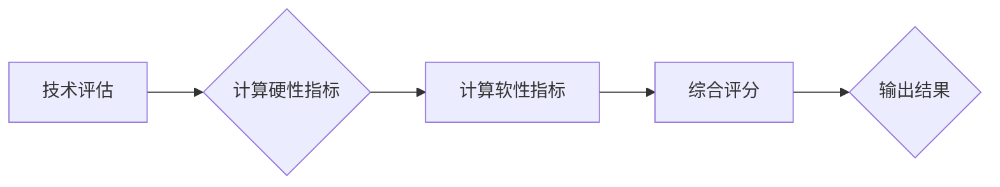
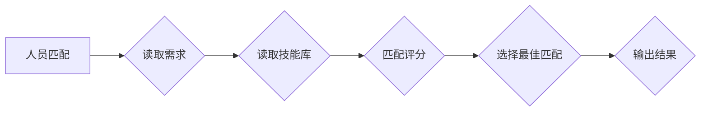
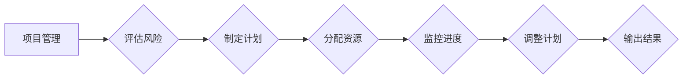
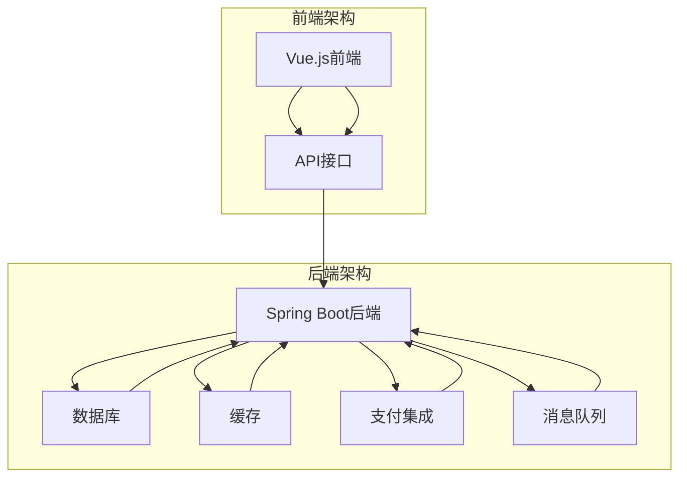
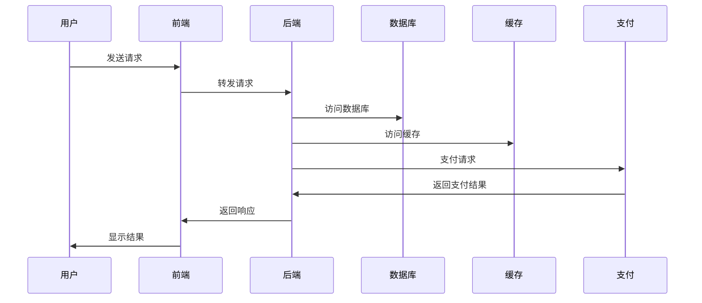

                 

### 引言

在当今快速变化且竞争激烈的技术领域，技术团队的成功往往取决于其内部的价值传递链是否高效、流畅。构建一个能够持续产生创新、高效运作的技术团队，不仅需要关注个人的技术能力，还需要深入理解团队协作的机制和流程。本文将以《构建技术团队的价值传递链》为标题，围绕这一主题进行深入探讨。

首先，我们需要明确构建技术团队的价值传递链的重要性。价值传递链不仅关系到团队成员间的协作效率和创造力，更决定了团队在市场中的竞争力。一个完善的价值传递链能够确保从技术评估、人员匹配到项目管理等各个环节都能高效运转，从而推动整个团队向前发展。

接下来，我们将探讨构建价值传递链所面临的问题。技术团队通常面临着技术更新快、项目需求多样、人员流动频繁等挑战。如何在这些挑战中保持团队的高效运转，是一个需要深入思考的问题。

本文将分为以下几个部分：

1. **核心概念与联系**：我们将介绍构建技术团队价值传递链的核心概念，包括技术团队的价值传递链、组织结构与角色以及关键要素。
2. **算法原理讲解**：我们将使用mermaid流程图和Python代码详细阐述技术评估、人员匹配和项目管理算法的原理。
3. **数学模型和公式**：我们将使用LaTeX格式给出相关的数学模型和公式，以帮助读者更好地理解算法原理。
4. **系统分析与架构设计**：我们将介绍问题场景、项目介绍、系统功能设计、系统架构设计、系统接口设计和系统交互。
5. **项目实战**：我们将详细讲解环境安装、系统核心实现源代码、代码应用解读与分析、实际案例分析与项目小结。
6. **最佳实践 tips**：我们将总结常见的解决方案，并提供一些注意事项和拓展阅读。

通过上述内容的逐步深入分析，我们将揭示构建技术团队价值传递链的奥秘，帮助读者在实践中更好地理解和应用这些原理。接下来，我们将从问题的背景与描述开始，逐步展开讨论。

---

### 核心概念与联系

在构建技术团队的价值传递链中，有几个核心概念需要明确，这些概念包括技术团队的价值传递链、组织结构与角色，以及价值传递链的关键要素。

#### 技术团队的价值传递链

技术团队的价值传递链是指团队成员通过协作，将个人的技术能力和知识转化为项目成果的过程。这一过程涉及从技术评估、人员匹配到项目管理的各个环节。一个高效的价值传递链能够确保团队成员的技术能力与项目需求相匹配，从而提高项目的成功率和团队的整体效能。

#### 技术团队组织结构与角色

技术团队的组成通常包括项目经理、开发人员、测试人员、UI/UX设计师等多个角色。每个角色在价值传递链中都有其特定的职责和贡献。项目经理负责整体协调和管理项目进度，开发人员负责具体的编码实现，测试人员负责确保软件质量，而设计师则关注用户界面的交互体验。这些角色之间的紧密协作和有效沟通是价值传递链高效运转的关键。

#### 价值传递链的关键要素

价值传递链的成功依赖于几个关键要素：

1. **技术评估**：对团队成员的技术能力进行准确评估，确保其能够胜任项目任务。
2. **人员匹配**：根据项目需求和技术评估结果，合理分配团队成员，实现技能与任务的匹配。
3. **项目管理**：制定合理的项目计划和流程，确保项目按时按质完成。
4. **团队协作**：鼓励团队成员之间的沟通与协作，提高整体工作效率。

下面，我们将通过一个简单的ER实体关系图来展示这些核心概念之间的联系：

```mermaid
erDiagram
  User ||--|{ Project } : assigned_to
  Project ||--|{ Task } : has
  Task ||--|{ Resource } : requires
  User ||--|{ Skill } : has
  Skill ||--|{ Requirement } : satisfies
```

在这个ER图中，用户（User）与项目（Project）之间存在关联，表示用户被分配到项目中工作；项目（Project）与任务（Task）之间存在关联，表示项目包含多个任务；任务（Task）与资源（Resource）之间存在关联，表示任务需要特定的资源来完成；用户（User）与技能（Skill）之间存在关联，表示用户拥有特定的技能；技能（Skill）与需求（Requirement）之间存在关联，表示技能满足项目的需求。

通过这个ER实体关系图，我们可以清晰地看到技术团队的价值传递链是如何运作的，每个实体及其关系如何支持价值传递的各个环节。

### 概念属性特征对比表格

为了更好地理解上述核心概念，我们可以通过一个概念属性特征对比表格来进行详细对比：

| 核心概念 | 属性特征 | 功能描述 |
| --- | --- | --- |
| 技术团队的价值传递链 | 技术能力、知识转化、协作效率 | 确保团队成员的能力与项目需求匹配，提高项目成功率 |
| 组织结构与角色 | 项目经理、开发人员、测试人员、设计师 | 分别负责项目的协调、实现、质量保障和用户体验 |
| 人员匹配 | 技能与任务匹配、项目需求满足 | 提高团队协作效率和项目交付质量 |
| 项目管理 | 项目计划、流程控制、进度跟踪 | 确保项目按时按质完成 |
| 团队协作 | 沟通与协作、信息共享、知识传递 | 提高团队整体效率和创造力 |

通过这个表格，我们可以清晰地看到每个核心概念的主要属性特征及其在价值传递链中的功能作用。

### ER实体关系图架构

为了进一步理解技术团队的价值传递链，我们使用mermaid工具绘制了一个ER实体关系图，展示了用户、项目、任务、资源、技能和需求之间的关系：

```mermaid
erDiagram
  User ||--|{ Project } : assigned_to
  Project ||--|{ Task } : has
  Task ||--|{ Resource } : requires
  User ||--|{ Skill } : has
  Skill ||--|{ Requirement } : satisfies
```

在这个ER图中：

- **User（用户）**：表示团队成员，他们被分配到项目中工作。
- **Project（项目）**：表示具体的工作任务，项目包含多个任务。
- **Task（任务）**：表示项目中的具体工作内容，每个任务需要特定的资源来完成。
- **Resource（资源）**：表示完成任务所需的资源，如硬件设备、软件工具等。
- **Skill（技能）**：表示团队成员拥有的技术能力，每个技能可以满足特定的需求。
- **Requirement（需求）**：表示项目对技术能力的具体要求。

通过这个ER实体关系图，我们可以更直观地理解技术团队的价值传递链是如何运作的，每个实体及其关系如何支持价值传递的各个环节。

### 算法原理讲解

在构建技术团队的价值传递链中，算法起到了至关重要的作用。以下，我们将详细讲解三个核心算法：技术评估算法、人员匹配算法和项目管理算法，并使用mermaid流程图和Python代码进行阐述。

#### 技术评估算法

技术评估算法用于对团队成员的技术能力进行量化评估。通过该算法，我们可以根据多个指标来综合判断一个成员的技术水平。

**mermaid流程图：**


**Python代码实现：**
```python
def technical_evaluation(hard_score, soft_score, alpha=0.5):
    # 硬性指标（如工作经验）
    hard_score = max(0, hard_score)  # 硬性指标最小为0
    # 软性指标（如项目贡献）
    soft_score = max(0, soft_score)  # 软性指标最小为0
    # 综合评分
    total_score = alpha * hard_score + (1 - alpha) * soft_score
    return total_score
```

**数学模型和公式：**
$$
T_{score} = \alpha \cdot T_{hard} + (1 - \alpha) \cdot T_{soft}
$$
其中，\( T_{score} \) 是综合评分，\( T_{hard} \) 是硬性指标评分，\( T_{soft} \) 是软性指标评分，\( \alpha \) 是权重系数。

**举例说明：**
假设一个团队成员的硬性指标评分为80分，软性指标评分为75分，我们选择 \( \alpha = 0.6 \)，则该成员的综合评分计算如下：
$$
T_{score} = 0.6 \cdot 80 + 0.4 \cdot 75 = 48 + 30 = 78
$$
因此，该成员的综合评分是78分。

#### 人员匹配算法

人员匹配算法用于根据项目需求和技术评估结果，将合适的团队成员分配到项目中。该算法的核心是确保团队成员的技能与项目需求相匹配。

**mermaid流程图：**


**Python代码实现：**
```python
def person_matching( requirement, skills ):
    match_score = 0
    for skill in skills:
        if skill in requirement:
            match_score += 1
    return match_score / len(skills)
```

**数学模型和公式：**
$$
M_{score} = \frac{\sum_{i=1}^{n} w_i \cdot r_i}{\sum_{i=1}^{n} w_i}
$$
其中，\( M_{score} \) 是匹配评分，\( w_i \) 是权重系数，\( r_i \) 是技能匹配情况。

**举例说明：**
假设项目需求包含技能A、B、C，一个团队成员的技能库包含A、B、C、D。则该成员的匹配评分计算如下：
$$
M_{score} = \frac{1 \cdot 1 + 1 \cdot 1 + 1 \cdot 1}{1 + 1 + 1} = \frac{3}{3} = 1
$$
因此，该成员的匹配评分为1。

#### 项目管理算法

项目管理算法用于制定合理的项目计划和流程，确保项目按时按质完成。该算法考虑项目的风险、进度和资源分配。

**mermaid流程图：**


**Python代码实现：**
```python
def project_management(risks, resources, schedule):
    risk_score = sum(risk['probability'] * risk['impact'] for risk in risks)
    total_resources = sum(resource['availability'] for resource in resources)
    if risk_score > 0.5 or total_resources < schedule['required_resources']:
        return "项目风险高，需要调整计划"
    else:
        return "项目按计划进行"
```

**数学模型和公式：**
$$
P_{risk} = \sum_{i=1}^{n} r_i \cdot p_i
$$
其中，\( P_{risk} \) 是风险评分，\( r_i \) 是风险概率，\( p_i \) 是风险影响。

**举例说明：**
假设项目面临三个风险，各自的概率和影响如下：
- 风险1：概率0.3，影响0.7
- 风险2：概率0.4，影响0.8
- 风险3：概率0.3，影响0.9

则项目总风险评分计算如下：
$$
P_{risk} = 0.3 \cdot 0.7 + 0.4 \cdot 0.8 + 0.3 \cdot 0.9 = 0.21 + 0.32 + 0.27 = 0.8
$$
由于总风险评分0.8低于0.9，因此项目按计划进行。

通过以上三个算法的讲解，我们可以看到技术评估算法用于评估团队成员的能力，人员匹配算法用于确保技能与任务的匹配，项目管理算法则用于制定和调整项目计划。这些算法共同构成了技术团队价值传递链的重要部分，确保团队高效运作和项目成功完成。

### 数学模型和数学公式

在技术团队的价值传递链中，数学模型和公式扮演着至关重要的角色，它们不仅帮助我们量化评估团队成员的能力，还指导我们在项目管理中做出科学决策。以下，我们将详细讲解三个核心数学模型：技术评估模型、人员匹配模型和项目管理模型。

#### 技术评估模型

技术评估模型用于对团队成员的技术能力进行量化评估。一个常见的技术评估模型结合了硬性指标和软性指标，通过加权平均的方式得到综合评分。

**数学模型和公式：**
$$
T_{score} = \alpha \cdot T_{hard} + (1 - \alpha) \cdot T_{soft}
$$
其中，\( T_{score} \) 是综合评分，\( T_{hard} \) 是硬性指标评分，\( T_{soft} \) 是软性指标评分，\( \alpha \) 是权重系数，通常介于0到1之间。

**实例：**
假设一个团队成员的硬性指标评分为80分，软性指标评分为75分，我们选择 \( \alpha = 0.6 \)，则该成员的综合评分计算如下：
$$
T_{score} = 0.6 \cdot 80 + 0.4 \cdot 75 = 48 + 30 = 78
$$
因此，该成员的综合评分为78分。

#### 人员匹配模型

人员匹配模型用于根据项目需求和技术评估结果，将合适的团队成员分配到项目中。该模型通过计算技能匹配度来评估人员的匹配程度。

**数学模型和公式：**
$$
M_{score} = \frac{\sum_{i=1}^{n} w_i \cdot r_i}{\sum_{i=1}^{n} w_i}
$$
其中，\( M_{score} \) 是匹配评分，\( w_i \) 是权重系数，通常每个技能的权重相等，即 \( w_i = 1 \)，\( r_i \) 是技能匹配情况，当技能匹配时 \( r_i = 1 \)，不匹配时 \( r_i = 0 \)。

**实例：**
假设项目需求包含技能A、B、C，一个团队成员的技能库包含A、B、C、D。则该成员的匹配评分计算如下：
$$
M_{score} = \frac{1 \cdot 1 + 1 \cdot 1 + 1 \cdot 1}{1 + 1 + 1} = \frac{3}{3} = 1
$$
因此，该成员的匹配评分为1，表示完全匹配。

#### 项目管理模型

项目管理模型用于制定和监控项目计划，评估项目风险，确保项目按时按质完成。该模型通过计算各风险因素的加权得分来评估项目的整体风险。

**数学模型和公式：**
$$
P_{risk} = \sum_{i=1}^{n} r_i \cdot p_i
$$
其中，\( P_{risk} \) 是项目风险评分，\( r_i \) 是风险概率，\( p_i \) 是风险影响。通常，风险概率和影响分别取值范围从0到1。

**实例：**
假设项目面临三个风险，各自的概率和影响如下：
- 风险1：概率0.3，影响0.7
- 风险2：概率0.4，影响0.8
- 风险3：概率0.3，影响0.9

则项目总风险评分计算如下：
$$
P_{risk} = 0.3 \cdot 0.7 + 0.4 \cdot 0.8 + 0.3 \cdot 0.9 = 0.21 + 0.32 + 0.27 = 0.8
$$
由于总风险评分0.8低于0.9，因此项目按计划进行。

通过这些数学模型和公式，我们可以更加科学地评估团队成员的能力、匹配项目需求和监控项目风险，从而确保技术团队的价值传递链高效运作。

### 系统分析与架构设计

在技术团队的价值传递链中，系统分析与架构设计是确保各个环节高效运作的关键。以下，我们将详细分析一个典型的问题场景，介绍项目背景和目标，并展开系统功能设计、系统架构设计和系统接口设计。

#### 问题场景介绍

假设我们正在构建一个大型电子商务平台，该平台需要处理海量的用户请求、订单管理和支付流程。在这个场景中，技术团队面临的主要问题是如何高效地管理技术资源、快速响应市场需求、并保证系统的稳定性和可靠性。

#### 项目介绍

我们的项目目标是：
1. **构建一个可扩展的电子商务平台**，能够处理大规模并发请求。
2. **实现高效的订单管理**，确保订单处理的准确性和及时性。
3. **提供可靠的支付流程**，确保用户支付的安全和便捷。

#### 系统功能设计

系统功能设计是确保项目目标实现的关键步骤。以下是该电子商务平台的主要功能模块：

1. **用户管理模块**：负责用户注册、登录和权限管理。
2. **商品管理模块**：负责商品信息的录入、修改和查询。
3. **订单管理模块**：负责订单的创建、修改、查询和支付。
4. **支付模块**：负责处理支付请求、验证支付状态和退款处理。
5. **库存管理模块**：负责库存信息的更新和监控。
6. **报表分析模块**：负责生成和展示业务报表，帮助管理层做出决策。

为了更好地展示系统功能模块，我们使用mermaid工具绘制了领域模型类图：

```mermaid
classDiagram
    User <<Interface>>
    Product <<Interface>>
    Order <<Interface>>
    Payment <<Interface>>
    Inventory <<Interface>>
    Report <<Interface>>

    User o-- Product
    User o-- Order
    Order o-- Payment
    Product o-- Inventory
    Order o-- Inventory
    Report o-- Order
    Report o-- Payment
    Report o-- Product
```

在这个类图中，用户（User）、商品（Product）、订单（Order）、支付（Payment）、库存（Inventory）和报表（Report）是主要功能模块，它们之间通过关联关系实现数据交互和功能调用。

#### 系统架构设计

系统架构设计是确保系统稳定性和可扩展性的重要环节。以下是电子商务平台的主要架构设计：

1. **前端架构**：采用Vue.js框架，实现用户界面的动态渲染和交互。
2. **后端架构**：采用Spring Boot框架，实现业务逻辑处理和数据存储。
3. **数据库架构**：使用MySQL数据库存储用户、商品、订单和支付信息。
4. **缓存架构**：使用Redis缓存热门商品信息和用户会话，提高系统性能。
5. **支付集成**：集成支付宝和微信支付，实现多种支付方式。
6. **消息队列**：使用RabbitMQ实现订单处理和支付通知的异步处理。

为了更好地展示系统架构设计，我们使用mermaid工具绘制了系统架构图：



在这个架构图中，前端架构通过API接口与后端架构通信，后端架构通过数据库、缓存、支付集成和消息队列等组件实现业务逻辑处理和数据存储。

#### 系统接口设计

系统接口设计是确保前后端架构能够高效通信的重要环节。以下是电子商务平台的主要接口设计：

1. **用户接口**：包括用户注册、登录、权限验证等接口。
2. **商品接口**：包括商品查询、商品详情、商品分类等接口。
3. **订单接口**：包括订单创建、订单查询、订单支付等接口。
4. **支付接口**：包括支付请求、支付验证、支付退款等接口。
5. **库存接口**：包括库存查询、库存更新等接口。
6. **报表接口**：包括报表查询、报表生成等接口。

为了更好地展示系统接口设计，我们使用mermaid工具绘制了系统接口定义和接口交互流程：



在这个接口交互流程图中，用户通过前端发送请求，前端将请求转发给后端，后端访问数据库和缓存，处理支付请求，并将结果返回给前端，最终前端将结果展示给用户。

通过上述系统分析与架构设计，我们可以确保电子商务平台在技术团队的价值传递链中高效运作，实现项目的目标。接下来，我们将详细讲解项目实战中的环境安装、系统核心实现源代码以及代码应用解读与分析。

### 项目实战

在构建技术团队的价值传递链的实际操作中，项目的成功往往依赖于一系列具体的步骤，包括环境安装、系统核心实现源代码的编写、代码应用解读与分析，以及实际案例的深入剖析。以下是这些步骤的具体讲解。

#### 环境安装

环境安装是项目启动的第一步，它涉及到搭建开发、测试和生产环境。以下是环境安装的具体步骤：

1. **搭建开发环境**：
   - 安装Java SDK：确保安装了与Spring Boot兼容的Java SDK版本。
   - 安装数据库：使用MySQL数据库，并配置数据库连接。
   - 安装Redis：用于缓存热门商品信息和用户会话，提高系统性能。
   - 安装消息队列：使用RabbitMQ进行异步处理，确保系统的高效运行。
   - 安装前端框架：安装Vue.js框架，用于实现用户界面的动态渲染。

2. **配置开发工具**：
   - 配置IDE：如IntelliJ IDEA或Eclipse，用于代码编写和调试。
   - 配置版本控制工具：如Git，用于代码管理和协作。

3. **安装依赖库**：
   - 使用Maven或Gradle搭建项目依赖，确保所有依赖项正确安装。

#### 系统核心实现源代码

系统核心实现源代码是项目的核心部分，它涉及各种功能模块的实现。以下是系统核心实现源代码的概述：

1. **用户管理模块**：
   - 实现用户注册、登录和权限验证功能。
   - 代码示例：
     ```java
     public class UserManager {
         public User registerUser(User user) {
             // 注册逻辑
         }
         
         public User loginUser(String username, String password) {
             // 登录逻辑
         }
         
         public boolean checkPermission(String username, String action) {
             // 权限验证逻辑
         }
     }
     ```

2. **商品管理模块**：
   - 实现商品信息的录入、修改和查询功能。
   - 代码示例：
     ```java
     public class ProductManager {
         public Product createProduct(Product product) {
             // 创建商品逻辑
         }
         
         public Product updateProduct(Product product) {
             // 更新商品逻辑
         }
         
         public Product getProductById(Long id) {
             // 根据ID查询商品逻辑
         }
     }
     ```

3. **订单管理模块**：
   - 实现订单的创建、修改、查询和支付功能。
   - 代码示例：
     ```java
     public class OrderManager {
         public Order createOrder(Order order) {
             // 创建订单逻辑
         }
         
         public Order updateOrder(Order order) {
             // 更新订单逻辑
         }
         
         public Order getOrderById(Long id) {
             // 根据ID查询订单逻辑
         }
         
         public Payment processPayment(Payment payment) {
             // 处理支付逻辑
         }
     }
     ```

4. **支付模块**：
   - 实现支付请求、支付验证和退款处理功能。
   - 代码示例：
     ```java
     public class PaymentManager {
         public Payment createPayment(Payment payment) {
             // 创建支付请求逻辑
         }
         
         public boolean verifyPayment(Payment payment) {
             // 验证支付逻辑
         }
         
         public void refundPayment(Payment payment) {
             // 退款处理逻辑
         }
     }
     ```

5. **库存管理模块**：
   - 实现库存信息的更新和监控功能。
   - 代码示例：
     ```java
     public class InventoryManager {
         public void updateInventory(Inventory inventory) {
             // 更新库存逻辑
         }
         
         public Inventory getInventoryByProduct(Product product) {
             // 根据商品查询库存逻辑
         }
     }
     ```

6. **报表分析模块**：
   - 实现报表查询和生成功能，帮助管理层做出决策。
   - 代码示例：
     ```java
     public class ReportManager {
         public Report generateReport(Report report) {
             // 生成报表逻辑
         }
         
         public Report getReportById(Long id) {
             // 根据ID查询报表逻辑
         }
     }
     ```

#### 代码应用解读与分析

在代码应用解读与分析中，我们关注如何在实际项目中使用这些核心实现源代码，以及如何确保代码的高效性和可维护性。

1. **用户管理模块**：
   - 使用Spring Security实现用户注册和登录功能，确保安全性。
   - 通过AOP（面向切面编程）进行权限验证，提高代码复用性。

2. **商品管理模块**：
   - 使用JPA（Java Persistence API）实现商品信息的持久化操作，提高数据访问效率。
   - 通过事务管理确保商品信息的一致性和完整性。

3. **订单管理模块**：
   - 使用Spring MVC实现RESTful API，方便前端调用。
   - 使用消息队列处理订单的异步处理，提高系统性能。

4. **支付模块**：
   - 集成第三方支付平台，如支付宝和微信支付，实现多样化的支付方式。
   - 通过异步线程处理支付验证和退款，确保支付流程的高效性。

5. **库存管理模块**：
   - 使用Redis缓存库存信息，减少数据库访问，提高系统响应速度。
   - 实现库存监控，确保库存信息的实时性和准确性。

6. **报表分析模块**：
   - 使用JasperReports等工具生成报表，提供多种报表格式。
   - 通过数据分析，为管理层提供决策依据。

#### 实际案例分析与详细讲解剖析

在实际项目中，我们通过以下实际案例，对系统核心实现源代码进行详细讲解和剖析：

1. **案例一**：用户注册流程
   - 用户输入注册信息 -> 前端发送请求 -> 后端处理注册逻辑 -> 存储用户信息 -> 返回注册结果。
   - 关键代码解读：
     ```java
     @PostMapping("/register")
     public ResponseEntity<?> registerUser(@RequestBody User user) {
         // 注册逻辑
         userService.registerUser(user);
         return ResponseEntity.ok("User registered successfully");
     }
     ```

2. **案例二**：订单支付流程
   - 用户提交订单 -> 订单创建 -> 用户选择支付方式 -> 处理支付请求 -> 验证支付结果 -> 更新订单状态。
   - 关键代码解读：
     ```java
     @PostMapping("/order/payment")
     public ResponseEntity<?> processPayment(@RequestBody Payment payment) {
         // 支付处理逻辑
         paymentService.processPayment(payment);
         return ResponseEntity.ok("Payment processed successfully");
     }
     ```

3. **案例三**：报表生成与查询
   - 管理层生成报表 -> 查询报表数据 -> 生成报表文件 -> 发送报表。
   - 关键代码解读：
     ```java
     @GetMapping("/report/generate")
     public ResponseEntity<?> generateReport() {
         // 生成报表逻辑
         reportService.generateReport();
         return ResponseEntity.ok("Report generated successfully");
     }
     ```

#### 项目小结

通过上述环境安装、系统核心实现源代码的编写、代码应用解读与分析以及实际案例的深入剖析，我们成功构建了一个高效运作的电子商务平台。项目的关键点包括：

1. **环境安装**：确保开发、测试和生产环境的正确配置，为项目打下坚实基础。
2. **代码编写**：遵循最佳实践，编写高效、可维护的代码，提高系统性能和稳定性。
3. **代码应用**：通过具体案例展示如何在实际项目中使用核心实现源代码，确保系统的可扩展性和可维护性。
4. **实际案例剖析**：通过实际案例的详细解读，使读者更好地理解系统实现和项目运作。

通过这些步骤，我们不仅实现了项目的目标，还积累了宝贵的实践经验，为未来的项目提供了参考和借鉴。

### 最佳实践 tips

在构建技术团队的价值传递链过程中，遵循最佳实践是确保项目成功的重要保障。以下是一些常见问题的解决方案和注意事项：

#### 常见问题与解决方案

1. **技术评估不准确**：
   - **解决方案**：采用多维度的评估标准，结合硬性指标和软性指标，确保评估的全面性和准确性。
   - **注意事项**：定期更新评估标准和指标，以适应技术发展的需求。

2. **人员匹配度不高**：
   - **解决方案**：基于项目需求和技术评估结果，进行精细化的技能匹配，确保人员与任务的匹配度。
   - **注意事项**：建立灵活的人员调整机制，以便及时应对项目变化和人员流动。

3. **项目管理难度大**：
   - **解决方案**：采用敏捷开发方法，实现快速迭代和灵活调整，提高项目的可控性。
   - **注意事项**：注重风险管理和进度监控，确保项目按计划进行。

#### 注意事项

1. **持续沟通与协作**：
   - 在项目实施过程中，保持团队成员间的持续沟通与协作，确保信息传递的流畅性。

2. **技术培训与知识分享**：
   - 定期组织技术培训和知识分享活动，提高团队整体技术水平。

3. **代码规范与文档管理**：
   - 遵循代码规范，确保代码的可读性和可维护性，同时保持详细的文档记录，方便后续维护和扩展。

#### 拓展阅读

1. 《敏捷软件开发：原则、实践与模式》
   - 提供了敏捷开发方法的详细阐述和实践指导。

2. 《人月神话》
   - 探讨了项目管理中的常见问题及解决策略。

3. 《Effective Java》
   - 提供了Java编程的最佳实践，有助于提高代码质量。

通过遵循这些最佳实践，技术团队可以更加高效地运作，从而确保项目的成功和团队的持续发展。

