                 

## 引言与概述

### 核心概念与初步问题定义

在当今的全球商业环境中，企业所面临的市场竞争和复杂性前所未有。在这种背景下，构建智能企业决策支持系统（Intelligent Enterprise Decision Support System，IEDSS）成为了企业提升竞争力、实现可持续发展的关键途径。IEDSS旨在通过先进的数据分析、机器学习和人工智能技术，为企业提供全面、精准和实时的决策支持，从而优化业务流程，提高运营效率，降低成本，增加收入。

核心概念术语包括：
- **智能企业决策支持系统（IEDSS）**：利用数据挖掘、机器学习和人工智能技术，为企业提供智能化的决策支持系统。
- **数据源**：企业内外部的各类数据，包括销售数据、财务数据、供应链数据、客户数据等。
- **算法**：用于处理和分析数据的算法，如分类算法、聚类算法、回归算法等。
- **模型**：基于算法和数据构建的预测和优化模型。
- **用户接口**：用户与系统交互的界面，用于查看分析和建议。

问题背景：
企业决策者在面对复杂的市场环境和动态变化的业务需求时，往往难以快速、准确地做出最佳决策。传统的决策支持系统在数据处理能力、实时性、自适应性和智能化程度方面存在显著不足，无法满足现代企业的需求。

问题描述：
- **数据复杂性**：企业数据量大、维度多，难以有效整合和分析。
- **实时性要求**：决策需要快速响应市场变化，传统系统反应迟缓。
- **智能化需求**：企业希望系统能够主动发现业务机会和风险，提供个性化的决策建议。
- **适应性**：系统需要能够适应不同业务场景和变化的需求。

问题解决：
构建智能企业决策支持系统，通过以下几个方面解决上述问题：
- **数据集成与处理**：利用大数据技术和分布式计算框架，实现对大规模数据的快速处理和分析。
- **实时数据处理**：采用流处理技术和实时分析算法，确保决策数据的实时性。
- **智能化分析**：利用机器学习和人工智能技术，构建智能化的预测和优化模型。
- **自适应调整**：通过不断学习和优化，使系统能够适应不同的业务场景和变化需求。

边界与外延：
- **边界**：本书关注的是企业内部决策支持系统的构建，不包括外部市场分析和宏观经济决策。
- **外延**：本书内容不仅适用于大型企业，也可为中小企业提供决策支持系统建设的指导和参考。

在接下来的章节中，我们将详细探讨智能企业决策支持系统的核心概念、理论算法、系统设计、项目实战和最佳实践，帮助读者全面理解和掌握构建智能决策支持系统的关键技术和方法。

### 核心概念与原则

在构建智能企业决策支持系统的过程中，理解并掌握核心概念和原则至关重要。这些核心概念不仅为系统提供了理论基础，还指导了实际操作中的关键步骤。以下是本书将要探讨的几个核心概念及其重要性。

#### 数据挖掘

数据挖掘是智能企业决策支持系统的基石。它是指从大量数据中提取有价值信息的过程，包括分类、聚类、关联规则挖掘、异常检测等。通过数据挖掘，企业可以发现潜在的市场趋势、客户行为和业务模式，从而做出更加精准的决策。

- **重要性**：数据挖掘能够帮助企业从海量数据中找到隐藏的模式和关联，从而揭示业务机会和风险。
- **应用场景**：市场营销、客户关系管理、供应链优化、风险管理等。

#### 机器学习

机器学习是使决策支持系统具备自动学习和优化能力的关键技术。通过训练模型，系统可以自动识别数据中的模式，并根据这些模式预测未来趋势或做出决策。

- **重要性**：机器学习使得系统能够不断自我优化，提高决策的准确性和效率。
- **算法类型**：监督学习、无监督学习、半监督学习和强化学习。

#### 人工智能

人工智能（AI）是智能企业决策支持系统的核心技术。它通过模拟人类智能，使系统能够理解和处理复杂问题，实现自动化决策。

- **重要性**：AI技术使得企业能够实现智能化运营，提高生产效率和创新能力。
- **应用场景**：自动化客服、智能推荐系统、风险控制等。

#### 系统架构

系统架构是指决策支持系统的整体结构，包括数据层、算法层、模型层和用户接口层。合理的系统架构能够确保系统的高效运行和可扩展性。

- **重要性**：良好的系统架构可以简化开发过程，提高系统的稳定性和灵活性。
- **设计原则**：模块化、分布式、可扩展和可维护。

#### 数据可视化

数据可视化是将复杂的数据通过图表、地图等形式直观呈现，帮助用户理解数据的意义和趋势。在决策支持系统中，数据可视化是关键环节。

- **重要性**：数据可视化能够提高数据的可读性，帮助用户快速发现问题和机会。
- **工具与技术**：图表库（如ECharts）、地图库（如Mapbox）等。

#### 对比表

为了更清晰地展示核心概念之间的区别和联系，我们设计了一个对比表（如表1所示），其中包括核心概念、重要性、算法类型和应用场景。

| 核心概念       | 重要性                 | 算法类型        | 应用场景           |
|----------------|------------------------|-----------------|-------------------|
| 数据挖掘       | 基础                   | 分类、聚类等    | 市场营销、客户管理 |
| 机器学习       | 核心                   | 监督学习、无监督学习等 | 预测、自动化决策   |
| 人工智能       | 高级                   | 模式识别、自然语言处理等 | 自动化运营、智能推荐 |
| 系统架构       | 关键                   | 模块化、分布式等 | 高效运行、扩展性   |
| 数据可视化     | 不可忽视               | 图表、地图等    | 数据理解、趋势分析 |

#### ER图

为了更好地理解核心概念之间的结构关系，我们使用Mermaid绘制了一个实体-关系（ER）图（如图1所示）。ER图能够直观展示各个核心概念之间的关系和组成结构。

```mermaid
erDiagram
  DataMining ||--|{ MachineLearning }
  MachineLearning ||--|{ ArtificialIntelligence }
  SystemArchitecture ||--|{ DataVisualization }
  DataVisualization ||--|{ DataMining }
```

图1：核心概念ER图

通过以上对核心概念和原则的介绍，读者可以初步了解智能企业决策支持系统的基础知识。在接下来的章节中，我们将深入探讨这些概念的具体实现和应用，帮助读者全面掌握构建智能决策支持系统的核心技术和方法。

### 算法与理论讲解

#### 回归分析

回归分析是统计学中一种重要的数据分析方法，用于研究因变量和自变量之间的关系。在智能企业决策支持系统中，回归分析常用于预测销售量、成本、客户流失率等关键指标，从而帮助企业做出基于数据的决策。

#### 一元线性回归

一元线性回归是最简单的回归模型，其公式为：
\[ y = ax + b \]
其中，\( y \) 是因变量，\( x \) 是自变量，\( a \) 和 \( b \) 是模型参数。

#### 多元线性回归

多元线性回归扩展了一元线性回归，用于处理多个自变量。其公式为：
\[ y = a_1x_1 + a_2x_2 + ... + a_nx_n + b \]
其中，\( a_1, a_2, ..., a_n \) 是各自变量的系数，\( b \) 是常数项。

#### 回归模型的建立

1. **数据准备**：收集并处理数据，确保数据质量。
2. **特征选择**：通过相关性分析、信息增益等方法选择与因变量相关性强的自变量。
3. **模型训练**：使用最小二乘法（Ordinary Least Squares, OLS）或其他优化算法训练回归模型。
4. **模型评估**：通过评估指标（如决定系数 \( R^2 \)、均方误差 \( MSE \) 等）评估模型性能。

#### Python代码示例

下面是一个使用Python的Scikit-learn库实现一元线性回归的示例代码：
```python
from sklearn.linear_model import LinearRegression
from sklearn.model_selection import train_test_split
from sklearn.metrics import mean_squared_error
import numpy as np

# 数据准备
X = np.array([[1], [2], [3], [4], [5], [6], [7], [8], [9], [10]])
y = np.array([2, 4, 5, 6, 8, 10, 11, 14, 15, 18])

# 模型训练
model = LinearRegression()
model.fit(X, y)

# 预测
y_pred = model.predict(X)

# 模型评估
mse = mean_squared_error(y, y_pred)
print(f'MSE: {mse}')

# 输出模型参数
print(f'Coefficients: {model.coef_}')
print(f'Intercept: {model.intercept_}')
```

#### 数学模型与公式

一元线性回归的数学模型为：
\[ y = ax + b \]
其中，\( a \) 是斜率，\( b \) 是截距。模型参数的估计通常使用最小二乘法，其目标是最小化预测值与实际值之间的误差平方和。

#### 基尼系数

基尼系数（Gini coefficient）是衡量数据分布不均的一种指标，其公式为：
\[ Gini = 1 - \frac{SSD}{SST} \]
其中，\( SSD \) 是组内方差（Sum of Squares Due to Diversity），\( SST \) 是总方差（Sum of Squares Total）。

#### 决定系数 \( R^2 \)

决定系数 \( R^2 \) 衡量回归模型的拟合优度，其公式为：
\[ R^2 = 1 - \frac{SSR}{SST} \]
其中，\( SSR \) 是回归平方和（Sum of Squares Due to Regression），\( SST \) 是总平方和（Sum of Squares Total）。

#### 图解与实例

为了更直观地理解回归分析，我们可以使用Mermaid绘制算法流程图（如图1所示）和数学模型（如图2所示）。


图1：回归分析算法流程图

```mermaid
graph LR
    A[一元线性回归模型]
    A --> B{y = ax + b}
    B --> C[斜率 a: $a = \frac{\sum(x_i - \bar{x})(y_i - \bar{y})}{\sum(x_i - \bar{x})^2}$]
    C --> D[截距 b: $b = \bar{y} - a\bar{x}$]
```

图2：一元线性回归数学模型

通过以上讲解，读者可以初步了解回归分析的基本概念、实现方法及其在智能企业决策支持系统中的应用。在接下来的章节中，我们将进一步探讨其他重要的算法和理论，为读者提供更全面的智能决策支持系统构建知识。

### 系统分析与设计

在构建智能企业决策支持系统的过程中，系统分析是关键的一步，它帮助我们明确系统要解决的问题和预期达到的目标。本节将详细描述问题场景，介绍系统的设计原则和核心功能，并通过具体的图表和模型来展示系统的架构和交互设计。

#### 问题场景

在当前的商业环境中，企业面临着诸多挑战，如市场竞争激烈、客户需求多样化、供应链复杂等。这些问题使得企业的决策过程变得尤为复杂和困难。传统的决策支持系统往往在数据整合、实时性、智能化程度和适应性方面存在不足，无法满足现代企业的需求。因此，我们需要构建一个智能企业决策支持系统，以帮助企业在面对复杂决策时能够迅速做出准确、有效的决策。

具体的问题场景包括：
- **销售预测**：企业需要预测未来的销售量，以便合理安排生产和库存。
- **成本控制**：企业需要监控和优化各项成本，以确保盈利能力。
- **风险管理**：企业需要识别和评估潜在的风险，并采取相应的措施。
- **客户关系管理**：企业需要了解客户需求和行为，以提供个性化的服务和营销策略。

#### 系统设计原则

智能企业决策支持系统的设计应遵循以下原则：
- **模块化**：系统应具备模块化的架构，便于后续的扩展和维护。
- **分布式**：系统应采用分布式计算架构，以提高处理效率和可扩展性。
- **高可用性**：系统应确保稳定运行，具备一定的容错能力。
- **安全性**：系统应具备严格的安全控制机制，确保数据的安全性和隐私性。
- **易用性**：系统应提供友好的用户界面，方便用户操作和使用。

#### 核心功能

智能企业决策支持系统的核心功能包括：
- **数据集成与处理**：将企业内部和外部的数据源进行整合和处理，为后续分析提供数据基础。
- **数据分析与挖掘**：利用数据挖掘技术和算法，从海量数据中提取有价值的信息，支持决策制定。
- **预测与优化**：基于数据分析结果，使用机器学习和人工智能技术进行预测和优化，提供决策建议。
- **用户界面**：提供直观、易用的用户界面，方便用户查看分析结果和执行决策。

#### 系统架构

智能企业决策支持系统的架构设计如下：

1. **数据层**：包括数据源和数据存储。数据源包括企业内部的ERP系统、CRM系统、库存管理系统等，以及外部数据如市场数据、宏观经济数据等。数据存储采用分布式数据库系统，如Hadoop、MongoDB等，以确保数据的可靠性和扩展性。

2. **数据处理层**：包括数据清洗、数据整合和预处理等模块。通过ETL（提取、转换、加载）过程，将来自不同数据源的数据进行清洗、转换和整合，为数据分析提供高质量的数据。

3. **算法层**：包括数据挖掘、机器学习和人工智能算法。如回归分析、聚类分析、决策树、神经网络等，用于处理和分析数据，提取有价值的信息。

4. **模型层**：基于算法分析结果，构建预测和优化模型。如销售预测模型、成本优化模型、客户流失预测模型等，用于提供决策建议。

5. **用户界面层**：提供直观、易用的用户界面，包括图表展示、报表生成和交互式分析等功能，帮助用户快速理解和利用分析结果。

#### 系统架构图

我们使用Mermaid绘制了智能企业决策支持系统的架构图（如图1所示），以直观展示系统的层次结构和组件关系。

```mermaid
graph LR
    subgraph 数据层
        DS1[数据源]
        DS2[数据存储]
        DS1 --> DS2
    end
    subgraph 数据处理层
        DPL1[数据清洗]
        DPL2[数据整合]
        DPL3[预处理]
        DPL1 --> DPL2
        DPL2 --> DPL3
    end
    subgraph 算法层
        AS1[数据挖掘]
        AS2[机器学习]
        AS3[人工智能]
        AS1 --> AS2
        AS2 --> AS3
    end
    subgraph 模型层
        ML1[预测模型]
        ML2[优化模型]
        ML1 --> ML2
    end
    subgraph 用户界面层
        UIL1[图表展示]
        UIL2[报表生成]
        UIL3[交互式分析]
        UIL1 --> UIL2
        UIL2 --> UIL3
    end
    DS2 --> DPL1
    DPL3 --> AS1
    AS3 --> ML1
    ML2 --> UIL1
```



图1：智能企业决策支持系统架构图

#### 系统接口与交互

系统接口设计是确保各个系统模块之间有效通信和协作的关键。我们使用Mermaid绘制了系统接口设计和交互序列图（如图2所示），以展示系统的接口和交互过程。

```mermaid
sequenceDiagram
    participant 用户 as 用户
    participant 系统 as 系统
    participant 数据库 as 数据库
    
    用户->>系统: 提交请求
    系统->>数据库: 查询数据
    数据库-->>系统: 返回数据
    系统->>用户: 展示结果
    
    注释：系统通过接口与数据库通信，获取用户所需数据，并进行处理和分析，最后将结果返回给用户。
```

图2：系统接口设计和交互序列图

通过以上系统分析与设计，我们明确了智能企业决策支持系统的功能、架构和接口设计。在接下来的章节中，我们将深入探讨系统的实际实现过程，包括环境配置、核心代码实现、源代码解读和案例分析，帮助读者全面理解并掌握智能企业决策支持系统的构建方法和关键步骤。

### 项目实战

在本节中，我们将详细描述智能企业决策支持系统的实际项目实施过程，包括环境配置、核心系统实现和代码解读。我们将通过一个具体的项目案例来展示如何从零开始构建这样一个系统。

#### 环境配置

首先，我们需要配置项目开发环境。以下是环境配置的步骤：

1. **安装Python**：确保Python环境已安装，版本建议为3.8或更高。
2. **安装依赖库**：使用pip命令安装项目所需的库，如Scikit-learn、Pandas、Numpy、Matplotlib等。
   ```shell
   pip install scikit-learn pandas numpy matplotlib
   ```
3. **配置数据库**：选择合适的数据库系统，如MySQL、PostgreSQL或MongoDB，并配置连接信息。
4. **安装数据预处理工具**：如使用ETL工具（如Apache NiFi、Apache Kafka）进行数据集成和处理。

#### 核心系统实现

接下来，我们介绍核心系统的实现过程，包括数据收集、处理和分析。

1. **数据收集**：从企业内部和外部的数据源收集数据，如销售数据、客户数据、市场数据等。数据收集可以通过API接口、数据库连接等方式实现。
2. **数据预处理**：对收集到的数据执行清洗、转换和整合，确保数据质量。预处理过程包括缺失值处理、异常值检测、数据标准化等。
3. **数据存储**：将处理后的数据存储到数据库中，以便后续分析和查询。数据库的选择应考虑数据量、查询性能和扩展性等因素。
4. **数据分析和挖掘**：使用数据挖掘和机器学习算法，如回归分析、聚类分析、关联规则挖掘等，对数据进行深度分析，提取有价值的信息。
5. **预测和优化**：基于分析结果，构建预测模型和优化模型，提供决策建议。预测模型可用于销售预测、客户流失预测等，优化模型可用于成本优化、供应链优化等。

#### 代码解读

以下是一个简单的Python代码示例，用于实现回归分析模型，预测销售量。

```python
# 导入所需库
import pandas as pd
import numpy as np
from sklearn.linear_model import LinearRegression
from sklearn.model_selection import train_test_split
from sklearn.metrics import mean_squared_error

# 数据读取
data = pd.read_csv('sales_data.csv')
X = data[['days_open', 'monthly_revenue']]
y = data['next_monthly_revenue']

# 数据分割
X_train, X_test, y_train, y_test = train_test_split(X, y, test_size=0.2, random_state=42)

# 模型训练
model = LinearRegression()
model.fit(X_train, y_train)

# 预测
y_pred = model.predict(X_test)

# 模型评估
mse = mean_squared_error(y_test, y_pred)
print(f'MSE: {mse}')

# 输出模型参数
print(f'Coefficients: {model.coef_}')
print(f'Intercept: {model.intercept_}')
```

在这个示例中，我们首先从CSV文件中读取销售数据，然后使用Scikit-learn库中的线性回归模型进行训练和预测。模型评估使用均方误差（MSE）指标，输出模型参数。

#### 实际案例分析

为了更好地展示项目实战，我们选取了一个实际案例：一家零售企业的销售预测项目。

1. **项目背景**：该零售企业希望预测下一季度的销售量，以便合理安排库存和促销活动。
2. **数据收集**：收集了过去一年的销售数据，包括每天的销售收入、季节性因素等。
3. **数据预处理**：对数据执行清洗和标准化处理，如缺失值填充、数据转换等。
4. **数据分析**：使用回归分析模型，预测下一季度的销售量。分析结果显示，季节性因素和促销活动对销售量有显著影响。
5. **预测结果**：根据模型预测，下一季度的平均销售量为100万元。企业据此调整了库存和促销策略，实际销售量达到了预期，实现了10%的收益增长。

#### 项目小结

通过以上实际案例，我们可以看到，智能企业决策支持系统在项目实施过程中发挥了重要作用。从数据收集、预处理到分析和预测，每个环节都体现了系统的高效性和智能化。项目成功的关键在于：
- **数据质量**：高质量的数据是准确预测和优化决策的基础。
- **算法选择**：合适的算法能够提高预测和优化的准确性和效率。
- **实时性**：系统能够实时响应数据变化，提供最新的决策建议。
- **用户体验**：友好的用户界面和易用的操作流程提高了用户的使用体验和满意度。

通过以上项目实战，我们不仅展示了智能企业决策支持系统的具体实现过程，还验证了其在实际业务场景中的价值和效果。在接下来的章节中，我们将进一步探讨构建智能企业决策支持系统的最佳实践和注意事项。

### 最佳实践与总结

#### 最佳实践

1. **数据质量管理**：确保数据源的高质量和一致性，定期进行数据清洗和更新。数据质量是构建智能决策支持系统的基石。
2. **模块化设计**：将系统划分为多个模块，如数据采集、数据处理、模型训练、预测分析等，便于开发和维护。
3. **实时数据处理**：采用流处理技术，如Apache Kafka和Flink，实现实时数据采集和处理，提高系统的响应速度。
4. **自动化模型优化**：使用自动化机器学习（AutoML）工具，如Google AutoML和H2O.ai，自动选择最佳模型和参数，减少人工干预。
5. **用户界面设计**：设计直观、易用的用户界面，提供丰富的图表和交互功能，方便用户查看和分析数据。

#### 总结

通过本文的详细探讨，我们了解了智能企业决策支持系统的核心概念、理论算法、系统设计、项目实战和最佳实践。智能企业决策支持系统利用先进的数据挖掘、机器学习和人工智能技术，为企业提供全面的决策支持，提升业务效率和竞争力。

#### 注意事项

1. **数据安全**：确保数据传输和存储的安全性，采用加密和访问控制技术，防止数据泄露和未授权访问。
2. **系统稳定性**：定期进行系统测试和性能优化，确保系统在高负载和突发情况下仍能稳定运行。
3. **持续学习与优化**：定期更新模型和算法，根据业务需求和环境变化进行调整，以保持系统的最佳性能。

#### 拓展阅读

- 《深度学习》（Goodfellow, Bengio, Courville）：全面介绍深度学习理论和实践。
- 《大数据处理：应用与案例》（Zikopoulos, DeRoos, Deutsch）: 大数据技术和应用案例。
- 《数据科学实战》（Mayer-Schönberger, Cukier）：数据科学原理和应用案例。
- 《企业大数据决策》（Davenport, Tyworth）：大数据在企业决策中的应用。

通过以上拓展阅读，读者可以进一步深入了解智能企业决策支持系统的前沿技术和应用场景，为实际项目提供更多灵感和指导。

### 结语

智能企业决策支持系统的构建是企业实现智能化运营和持续发展的关键。本文通过系统性的分析和实践，详细探讨了智能企业决策支持系统的核心概念、算法原理、系统设计、项目实现和最佳实践。我们不仅了解了如何利用先进的数据挖掘、机器学习和人工智能技术构建高效、智能的决策支持系统，还通过实际案例展示了系统的应用效果。

智能企业决策支持系统不仅提升了企业的运营效率和竞争力，还为企业开辟了新的发展路径。在未来的发展中，随着技术的不断进步和应用场景的拓展，智能企业决策支持系统将发挥越来越重要的作用，为企业创造更大的价值。

本文作者为AI天才研究院/AI Genius Institute与《禅与计算机程序设计艺术》的作者，感谢您的阅读与支持。希望本文能为您的智能企业决策支持系统建设提供有益的参考和启示。期待您在智能企业决策支持系统领域的探索与创新，共同推动技术的进步和企业的繁荣。

