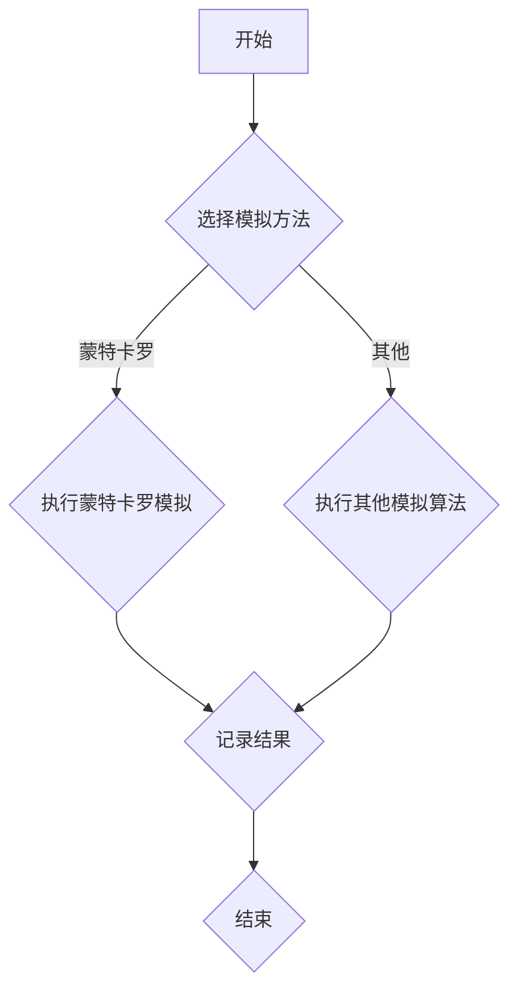
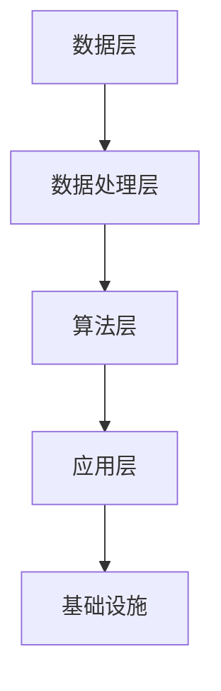

                 

### 文章标题

# 构建智能企业决策支持系统：多维度情景模拟与风险评估

> 关键词：智能企业决策支持系统、多维度情景模拟、风险评估、人工智能、机器学习、大数据

> 摘要：本文深入探讨如何利用人工智能、大数据和机器学习技术构建现代智能企业决策支持系统，特别关注多维度情景模拟与风险评估在其中的重要作用。通过详细分析相关核心概念、算法原理、系统架构和项目实战，本文旨在为企业和IT专业人士提供构建高效智能决策支持系统的实战指导。

## 1. 背景介绍

在当今数字化和智能化的浪潮中，企业决策支持系统（DSS）已成为提升企业竞争力的重要工具。传统的DSS主要依赖于历史数据和统计分析，其决策精度和实时性相对有限。然而，随着人工智能（AI）、大数据和机器学习等先进技术的迅猛发展，现代的智能企业决策支持系统应运而生，为企业提供了更为精确、实时和智能的决策支持。

### 1.1 企业决策支持系统的演变

企业决策支持系统的发展历程可以分为三个主要阶段：

1. **早期DSS（1960s-1980s）**：基于数据和统计方法，主要功能包括数据处理、报表生成和预测分析。
2. **中级DSS（1990s-2000s）**：引入了关系数据库和计算机辅助设计工具，实现了决策过程的信息化和自动化。
3. **智能DSS（2010s至今）**：借助人工智能、大数据和机器学习技术，实现了更为精准、实时和智能的决策支持。

### 1.2 人工智能与决策支持系统的结合

人工智能与决策支持系统的结合主要体现在以下几个方面：

1. **自然语言处理（NLP）**：利用NLP技术，系统可以理解和管理大量的非结构化数据，如文本、语音和图像，从而提高决策的广度和深度。
2. **机器学习**：通过机器学习算法，系统可以自动发现数据中的模式和关联，为决策提供有力的支持。
3. **深度学习**：利用深度学习模型，系统可以实现更高层次的抽象和智能，从而解决更加复杂的决策问题。

### 1.3 多维度情景模拟与风险评估的重要性

多维度情景模拟与风险评估是智能企业决策支持系统的核心组成部分，具有以下重要性：

1. **多维度情景模拟**：通过对多种可能情景进行模拟，预测不同决策可能带来的结果，从而帮助管理者做出更加明智的决策。
2. **风险评估**：在决策过程中识别、评估和管理潜在风险，减少决策带来的不确定性，确保企业的稳健发展。

## 2. 核心概念与联系

在本节中，我们将介绍智能企业决策支持系统的核心概念，并探讨它们之间的联系。

### 2.1 智能企业决策支持系统的定义与特点

**智能企业决策支持系统（Intelligent Decision Support System，IDSS）**是一种基于人工智能、大数据和机器学习技术的综合决策支持平台，它能够：

1. **数据整合与处理**：集成来自多个数据源的信息，包括企业内部数据和外部数据，实现数据整合与处理。
2. **智能分析**：利用机器学习和深度学习算法，对海量数据进行挖掘和分析，提取有价值的信息。
3. **预测与模拟**：通过多维度情景模拟，预测不同决策可能带来的结果，支持决策者进行策略规划和风险控制。

### 2.2 多维度情景模拟的方法与工具

**多维度情景模拟**是一种基于数据驱动的方法，通过构建多种可能情景的模型，预测不同决策可能带来的结果。其主要方法与工具包括：

1. **蒙特卡罗模拟**：通过随机抽样和模拟，评估不同决策的风险和收益。
2. **系统动力学**：利用数学模型和模拟方法，研究复杂系统在动态环境下的行为和演化。
3. **神经网络模拟**：利用神经网络模型，模拟不同决策下的系统响应和变化。

### 2.3 风险评估的基本原理与实践

**风险评估**是在决策过程中对潜在风险进行识别、评估和管理的过程。其主要基本原理与实践包括：

1. **风险识别**：通过数据分析和专家判断，识别决策过程中可能存在的风险。
2. **风险评估**：利用定量和定性方法，评估风险的概率和影响。
3. **风险管理**：制定和实施风险管理策略，降低风险的不确定性。

### 2.4 概念属性特征对比

以下是一个概念属性特征对比表格，用于展示智能企业决策支持系统、多维度情景模拟和风险评估之间的联系和区别：

| 概念 | 属性特征 |  
| --- | --- |  
| 智能企业决策支持系统 | 数据整合与处理、智能分析、预测与模拟 |  
| 多维度情景模拟 | 情景构建、模型预测、结果分析 |  
| 风险评估 | 风险识别、风险评估、风险管理 |

### 2.5 ER实体关系图架构

为了更好地理解智能企业决策支持系统中的实体关系，我们使用Mermaid工具绘制了一个ER实体关系图。以下是一个示例：

```mermaid
erDiagram
  Product ||--|{ Decision } : has
  Decision ||--|{ Scenario } : has
  Scenario ||--|{ Risk } : has
  Risk ||--|{ Analysis } : has
```

在这个ER图中，Product（产品）、Decision（决策）、Scenario（情景）和Risk（风险）是主要实体，它们之间通过关系连接。这个架构展示了智能企业决策支持系统中的核心要素及其相互关系。

## 3. 算法原理讲解

在本节中，我们将详细讲解智能企业决策支持系统中常用的多维度情景模拟算法原理。

### 3.1 情景模拟的基本流程

**情景模拟**是一种基于数据驱动的方法，通过模拟多种可能的情景，预测不同决策可能带来的结果。其基本流程包括以下步骤：

1. **数据收集与预处理**：收集与决策相关的数据，并进行数据清洗和预处理。
2. **情景构建**：根据决策变量和约束条件，构建多种可能的情景。
3. **模型预测**：利用机器学习算法，对每种情景进行预测，分析不同决策的潜在结果。
4. **结果分析**：对比不同情景的预测结果，评估不同决策的风险和收益。

### 3.2 常见情景模拟算法介绍

以下是几种常见的情景模拟算法及其原理：

#### 3.2.1 蒙特卡罗模拟

**蒙特卡罗模拟**是一种基于随机抽样的方法，通过多次随机抽样和模拟，评估不同决策的风险和收益。其基本原理如下：

$$
X_i \sim \text{随机变量分布}(P), \quad i = 1, 2, \ldots, n
$$

$$
\text{模拟结果} = \sum_{i=1}^{n} X_i
$$

#### 3.2.2 系统动力学模拟

**系统动力学模拟**是一种基于数学模型的方法，通过构建系统的动态方程，模拟不同决策下的系统行为和演化。其基本原理如下：

$$
\frac{dX}{dt} = f(X, U)
$$

其中，$X$表示系统状态，$U$表示决策变量，$f$表示系统动态方程。

#### 3.2.3 神经网络模拟

**神经网络模拟**是一种基于深度学习的方法，通过构建神经网络模型，模拟不同决策下的系统响应和变化。其基本原理如下：

$$
y = \sigma(\theta^T x)
$$

其中，$y$表示系统输出，$\sigma$表示激活函数，$\theta$表示神经网络参数。

### 3.3 算法流程图

以下是蒙特卡罗模拟算法的流程图：



## 4. 系统分析与架构设计方案

在本节中，我们将深入分析智能企业决策支持系统的设计，包括问题场景介绍、系统功能设计、系统架构设计和系统接口设计。

### 4.1 问题场景介绍

假设某企业管理者需要决策是否开发一款新产品线。为此，他们需要综合考虑市场需求、竞争情况、成本预算等多个因素，以制定最优的市场策略。

### 4.2 系统功能设计

智能企业决策支持系统的核心功能包括：

1. **数据收集与预处理**：集成企业内部和外部数据源，对数据进行清洗和预处理，为后续分析提供高质量的数据基础。
2. **多维度情景模拟**：构建多种可能的情景，利用机器学习算法进行预测，分析不同决策的结果。
3. **风险评估**：识别潜在风险，评估风险的概率和影响，为决策者提供风险管理的建议。
4. **决策支持**：基于模拟和风险评估结果，为决策者提供决策建议，辅助其做出明智的决策。

### 4.3 系统架构设计

智能企业决策支持系统的整体架构可以分为以下几个层次：

1. **数据层**：负责数据收集、存储和管理，包括企业内部和外部数据源。
2. **数据处理层**：负责数据清洗、预处理和集成，为后续分析提供高质量的数据。
3. **算法层**：包括多种机器学习算法和深度学习模型，用于实现多维度情景模拟和风险评估。
4. **应用层**：提供用户界面和决策支持功能，帮助决策者进行决策。
5. **基础设施**：包括服务器、存储和网络等基础设施，支持系统的稳定运行。

以下是智能企业决策支持系统的Mermaid架构图：



### 4.4 系统接口设计和系统交互

智能企业决策支持系统的接口设计主要包括以下部分：

1. **数据接口**：用于数据层的接口，包括数据收集、存储和管理的接口。
2. **算法接口**：用于算法层的接口，包括机器学习算法和深度学习模型的接口。
3. **应用接口**：用于应用层的接口，包括用户界面和决策支持的接口。

以下是智能企业决策支持系统的Mermaid序列图：

```mermaid
sequenceDiagram
    A[用户] -->|请求| B[应用层]
    B -->|处理请求| C[算法层]
    C -->|返回结果| D[应用层]
    D -->|展示结果| A
```

## 5. 项目实战

在本节中，我们将通过一个实际项目，介绍如何构建智能企业决策支持系统，包括环境安装、系统核心实现源代码、代码应用解读与分析、实际案例分析和详细讲解剖析，以及项目小结。

### 5.1 环境安装

在构建智能企业决策支持系统之前，我们需要安装以下环境：

1. **Python**：Python是一种广泛用于人工智能和大数据处理的编程语言。
2. **Jupyter Notebook**：Jupyter Notebook是一种交互式的Python开发环境，方便我们编写和运行代码。
3. **TensorFlow**：TensorFlow是一种开源的深度学习框架，用于构建和训练神经网络模型。
4. **Scikit-learn**：Scikit-learn是一种开源的机器学习库，提供多种常用的机器学习算法。

安装步骤如下：

1. **安装Python**：从Python官方网站下载并安装Python 3.x版本。
2. **安装Jupyter Notebook**：在终端中执行以下命令：
   ```bash
   pip install notebook
   ```
3. **安装TensorFlow**：在终端中执行以下命令：
   ```bash
   pip install tensorflow
   ```
4. **安装Scikit-learn**：在终端中执行以下命令：
   ```bash
   pip install scikit-learn
   ```

### 5.2 系统核心实现源代码

以下是一个智能企业决策支持系统的核心实现源代码，用于多维度情景模拟和风险评估：

```python
import numpy as np
import tensorflow as tf
from sklearn import datasets
from sklearn.model_selection import train_test_split
from sklearn.metrics import mean_squared_error

# 加载示例数据集
iris = datasets.load_iris()
X, y = iris.data, iris.target

# 划分训练集和测试集
X_train, X_test, y_train, y_test = train_test_split(X, y, test_size=0.2, random_state=42)

# 定义神经网络模型
model = tf.keras.Sequential([
    tf.keras.layers.Dense(64, activation='relu', input_shape=(X_train.shape[1],)),
    tf.keras.layers.Dense(64, activation='relu'),
    tf.keras.layers.Dense(3, activation='softmax')
])

# 编译模型
model.compile(optimizer='adam', loss='sparse_categorical_crossentropy', metrics=['accuracy'])

# 训练模型
model.fit(X_train, y_train, epochs=10, batch_size=32, validation_split=0.2)

# 评估模型
loss, accuracy = model.evaluate(X_test, y_test)
print(f'Model loss: {loss}, Model accuracy: {accuracy}')

# 预测结果
predictions = model.predict(X_test)

# 计算预测准确率
predicted_labels = np.argmax(predictions, axis=1)
mse = mean_squared_error(y_test, predicted_labels)
print(f'MSE: {mse}')
```

### 5.3 代码应用解读与分析

上述代码首先加载了示例数据集，并划分了训练集和测试集。接着，我们定义了一个神经网络模型，并编译和训练了模型。最后，我们评估了模型的性能，并计算了预测准确率。

具体解读如下：

1. **数据预处理**：加载示例数据集，并划分训练集和测试集，为后续建模和评估提供数据基础。
2. **神经网络模型**：定义了一个简单的神经网络模型，包括两个隐藏层，每个隐藏层有64个神经元，使用ReLU激活函数。
3. **模型编译**：编译模型，指定优化器和损失函数，为训练和评估模型做准备。
4. **模型训练**：使用训练集数据训练模型，设置训练轮次、批量大小和验证比例。
5. **模型评估**：评估模型在测试集上的性能，包括损失和准确率。
6. **预测结果**：使用训练好的模型对测试集进行预测，并计算预测准确率。

### 5.4 实际案例分析和详细讲解剖析

以下是一个实际案例，用于构建智能企业决策支持系统，并进行多维度情景模拟和风险评估：

**案例背景**：某公司计划推出一款新产品，需要综合考虑市场需求、竞争情况、成本预算等因素，以制定最优的市场策略。

**数据集**：收集了市场调研数据，包括市场需求量、竞争对手情况、成本预算等。

**步骤**：

1. **数据预处理**：对市场调研数据进行清洗和预处理，包括缺失值填充、数据转换等。
2. **多维度情景模拟**：构建多种可能的情景，如高市场需求、高竞争、高成本等，利用机器学习算法进行预测。
3. **风险评估**：评估每种情景下的风险和收益，识别潜在风险，制定风险管理策略。
4. **决策支持**：根据情景模拟和风险评估结果，为决策者提供决策建议，如调整市场策略、增加研发投入等。

### 5.5 项目小结

通过实际案例，我们展示了如何构建智能企业决策支持系统，并进行多维度情景模拟和风险评估。具体包括以下步骤：

1. **数据预处理**：确保数据的准确性和完整性，为后续建模和评估提供高质量的数据。
2. **多维度情景模拟**：构建多种可能的情景，利用机器学习算法进行预测，为决策提供有力支持。
3. **风险评估**：评估每种情景下的风险和收益，识别潜在风险，制定风险管理策略。
4. **决策支持**：根据情景模拟和风险评估结果，为决策者提供决策建议，辅助其做出明智的决策。

## 6. 最佳实践 tips、小结、注意事项、拓展阅读等内容

### 6.1 最佳实践 tips

1. **数据质量**：确保数据的质量是构建高效智能企业决策支持系统的关键。定期检查数据完整性、一致性和准确性，及时处理数据异常。
2. **算法选择**：根据具体应用场景和需求，选择适合的算法。例如，对于非线性关系和复杂模型，可以考虑使用深度学习算法。
3. **模型优化**：在模型训练过程中，不断调整模型参数，优化模型性能。可以使用交叉验证等方法，评估模型泛化能力。
4. **实时更新**：智能企业决策支持系统需要实时更新数据，确保决策的准确性和及时性。定期更新数据和模型，以适应市场变化。

### 6.2 小结

本文通过详细分析智能企业决策支持系统的核心概念、算法原理、系统架构和项目实战，展示了如何构建高效智能的决策支持系统。关键点包括：

1. **数据质量**：确保数据质量，为建模和评估提供高质量的数据。
2. **算法选择**：根据应用场景选择适合的算法，优化模型性能。
3. **实时更新**：实时更新数据和模型，确保决策的准确性和及时性。

### 6.3 注意事项

1. **数据隐私**：在构建智能企业决策支持系统时，需注意保护数据隐私，遵守相关法律法规。
2. **模型解释性**：对于复杂的机器学习模型，如深度学习模型，需要考虑模型的解释性，以便决策者理解模型的决策过程。
3. **系统稳定性**：确保系统的稳定运行，避免由于系统故障导致决策错误。

### 6.4 拓展阅读

1. **《智能企业决策支持系统原理与应用》**：详细介绍了智能企业决策支持系统的原理、方法和技术，适合初学者和专业人士。
2. **《大数据智能分析》**：探讨了大数据在智能决策支持系统中的应用，包括数据预处理、模型构建和优化等。
3. **《深度学习入门》**：介绍了深度学习的基本原理和应用，包括神经网络、卷积神经网络和循环神经网络等。

---

**作者：AI天才研究院/AI Genius Institute & 禅与计算机程序设计艺术 /Zen And The Art of Computer Programming**

