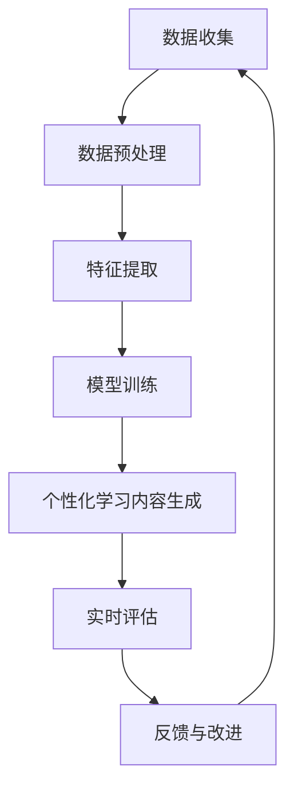
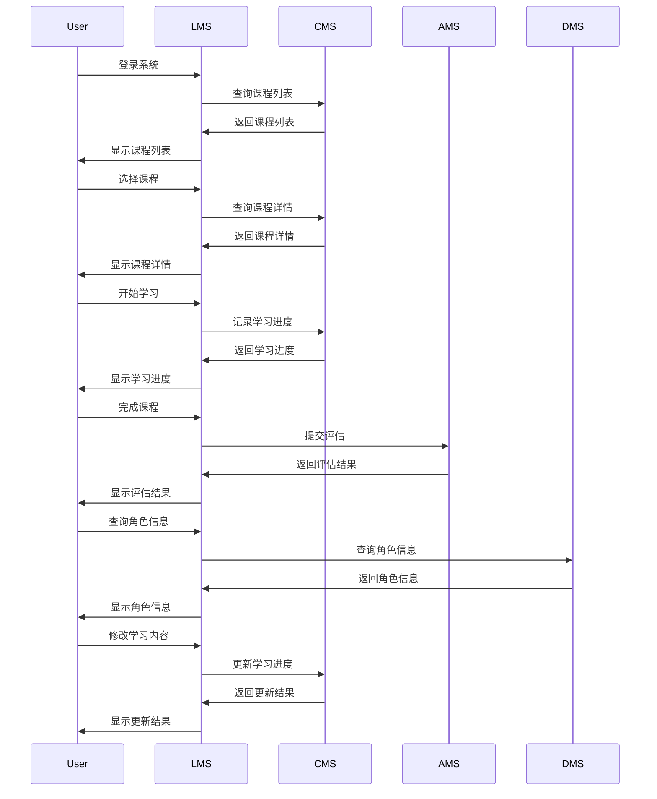

                 

### 文章标题：构建智能企业合规培训系统：基于角色的个性化学习与评估

#### 关键词：
- 智能企业合规培训
- 角色个性化学习
- 个性化评估
- 系统架构设计
- 算法原理

#### 摘要：
本文旨在探讨如何构建一个智能企业合规培训系统，该系统基于角色的个性化学习和评估机制。通过深入分析企业合规培训的需求、角色个性化学习的原理和评估方法，本文提出了一套完整的系统架构设计方案，并介绍了具体的实施步骤和最佳实践。文章的结构如下：

1. **背景与概述**：介绍企业合规培训的重要性及当前存在的挑战。
2. **核心概念与联系**：阐述角色、个性化学习、评估等核心概念及其关系。
3. **算法原理讲解**：详细讲解个性化学习与评估算法的原理和实现。
4. **系统分析与架构设计**：介绍系统功能、架构和接口设计。
5. **项目实战**：描述系统实现过程，包括环境安装、核心实现和案例分析。
6. **最佳实践与总结**：提供系统实施的最佳实践、小结和注意事项。

### 第一部分：背景与概述

#### 1.1 问题背景与描述

在当今全球化的商业环境中，企业合规性越来越受到重视。合规培训不仅是对员工职业素质的要求，更是企业风险管理的重要环节。传统的合规培训往往依赖于面授课程和纸质资料，存在许多局限性：

- **学习效果难以衡量**：传统培训缺乏有效的评估手段，难以确定员工的学习效果。
- **个性化不足**：统一的学习内容难以满足不同岗位和员工的学习需求。
- **时间与资源浪费**：员工可能需要花费大量时间参加不相关的培训。

为了克服这些挑战，构建一个智能企业合规培训系统成为了一种必然趋势。该系统应具备以下特点：

- **基于角色的个性化学习**：根据员工的岗位职责和技能需求，提供定制化的学习内容。
- **智能评估与反馈**：利用智能算法对员工的学习效果进行实时评估，并提供个性化的反馈。
- **高效资源利用**：通过智能调度和自动化管理，提高培训资源的利用效率。

#### 1.2 企业合规培训的重要性

企业合规培训对于企业的长期发展具有重要意义：

- **降低合规风险**：合规培训有助于员工理解和遵守相关法律法规，降低合规风险。
- **提高员工素质**：合规培训有助于提升员工的职业素养和业务能力，增强企业的核心竞争力。
- **增强企业信誉**：合规培训有助于树立企业良好的社会形象，提升品牌价值。

#### 1.3 基于角色的个性化学习与评估

基于角色的个性化学习与评估是智能企业合规培训系统的核心。个性化学习意味着根据员工的岗位职责和学习需求，提供定制化的学习内容。评估则是对员工学习效果的衡量，通过智能算法分析学习行为和成绩，为员工提供个性化的反馈和改进建议。

个性化学习与评估的关键在于数据的收集与分析。系统需要收集员工的学习数据，如学习进度、学习时长、考试成绩等，通过数据挖掘和分析，发现员工的学习特点和需求，从而实现个性化学习内容的生成。

#### 1.4 本书结构安排

本书分为五个部分，分别从背景与概述、核心概念与联系、算法原理讲解、系统分析与架构设计、项目实战和最佳实践与总结等方面，全面探讨构建智能企业合规培训系统的各个方面。结构如下：

1. **背景与概述**：介绍企业合规培训的背景和重要性，提出基于角色的个性化学习与评估的需求。
2. **核心概念与联系**：阐述角色、个性化学习、评估等核心概念及其相互关系。
3. **算法原理讲解**：详细讲解个性化学习与评估算法的原理和实现。
4. **系统分析与架构设计**：介绍系统的功能、架构和接口设计。
5. **项目实战**：描述系统的实现过程，包括环境安装、核心实现和案例分析。
6. **最佳实践与总结**：提供系统实施的最佳实践、小结和注意事项。

### 第二部分：核心概念与联系

#### 2.1 智能企业合规培训系统概述

智能企业合规培训系统是一个综合性的平台，旨在为企业提供高效、个性化的合规培训服务。系统的主要组成部分包括：

- **学习管理系统（LMS）**：负责管理课程内容、学员信息和学习进度。
- **角色管理系统**：根据员工的岗位职责和技能需求，为员工分配学习任务和内容。
- **评估系统**：对员工的学习效果进行实时评估，提供反馈和改进建议。
- **数据挖掘与分析系统**：收集和分析学习数据，为个性化学习和评估提供支持。

#### 2.2 概念属性特征对比表格

为了更好地理解系统的组成部分，我们可以通过一个对比表格来展示各组件的属性特征：

| 组件         | 功能描述                                       | 关键属性          |
| ------------ | ---------------------------------------------- | ----------------- |
| 学习管理系统  | 管理课程内容、学员信息和学习进度               | 课程管理、进度跟踪 |
| 角色管理系统  | 根据岗位职责和技能需求为员工分配学习任务和内容   | 角色管理、任务分配 |
| 评估系统     | 对员工的学习效果进行实时评估，提供反馈和改进建议 | 成绩评估、反馈机制 |
| 数据挖掘与分析系统 | 收集和分析学习数据，为个性化学习和评估提供支持 | 数据分析、个性化推荐 |

#### 2.3 ER实体关系图架构

ER（实体-关系）图是描述系统中数据实体及其之间关系的一种常见方法。下面是一个简单的ER图，展示了智能企业合规培训系统中的主要实体及其关系：

```mermaid
erDiagram
  Course ||--|{ Student }|-->: "参加了"
  Student ||--|{ Course }|-->: "学习"
  Role ||--|{ Student }|-->: "承担"
  Student ||--|{ Role }|-->: "担任"
  Assessment ||--|{ Student }|-->: "接受"
  Student ||--|{ Assessment }|-->: "完成"
```

在这个ER图中，`Course` 代表课程，`Student` 代表学生（员工），`Role` 代表角色，`Assessment` 代表评估。实体之间的关系包括：学生参加了课程、学生学习了课程、学生承担了角色、学生接受了评估等。

### 第三部分：算法原理讲解

#### 3.1 算法原理讲解

智能企业合规培训系统的核心在于个性化学习和评估算法。这些算法利用数据挖掘和机器学习技术，从大量数据中提取有价值的信息，为员工提供个性化的学习体验和评估结果。

#### 3.1.1 算法流程图

为了更好地理解算法原理，我们可以使用Mermaid绘制一个算法流程图：



在这个流程图中，算法首先从系统中收集数据，然后进行预处理，提取特征，通过模型训练生成个性化学习内容，进行实时评估，并根据反馈进行改进。

#### 3.1.2 Python源代码与算法阐述

下面是一个简化的Python源代码示例，展示了如何实现上述算法流程：

```python
import pandas as pd
from sklearn.model_selection import train_test_split
from sklearn.ensemble import RandomForestClassifier
from sklearn.metrics import accuracy_score

# 数据收集
data = pd.read_csv('learning_data.csv')

# 数据预处理
data = data.dropna()

# 特征提取
X = data[['learning_time', 'test_score', 'role']]
y = data['pass']

# 模型训练
X_train, X_test, y_train, y_test = train_test_split(X, y, test_size=0.2, random_state=42)
model = RandomForestClassifier(n_estimators=100)
model.fit(X_train, y_train)

# 个性化学习内容生成
predictions = model.predict(X_test)

# 实时评估
accuracy = accuracy_score(y_test, predictions)
print(f'Accuracy: {accuracy:.2f}')

# 反馈与改进
# 根据评估结果，调整模型参数或学习内容
```

在这个示例中，我们使用了随机森林（RandomForestClassifier）作为分类模型。首先从CSV文件中读取学习数据，进行预处理和特征提取。然后，使用训练集训练模型，并对测试集进行预测。最后，根据评估结果调整模型参数或学习内容。

#### 3.1.3 数学模型与公式讲解

为了更深入地理解算法原理，我们可以介绍一些相关的数学模型和公式。

##### 3.1.3.1 个性化学习模型

个性化学习模型通常基于用户兴趣模型（User Interest Model）和内容推荐模型（Content Recommendation Model）。用户兴趣模型用于预测用户对特定内容的兴趣度，内容推荐模型则根据用户兴趣模型为用户推荐合适的学习内容。

- **用户兴趣模型**：

  $$ u_i = \sum_{j=1}^{n} w_{ij} c_j $$

  其中，$u_i$ 表示用户 $i$ 的兴趣向量，$w_{ij}$ 表示用户 $i$ 对内容 $j$ 的兴趣权重，$c_j$ 表示内容 $j$ 的特征向量。

- **内容推荐模型**：

  $$ r_i(j) = \frac{1}{Z_i} \exp(\sum_{k=1}^{m} u_{ik} r_{kj}) $$

  其中，$r_i(j)$ 表示用户 $i$ 对内容 $j$ 的推荐概率，$Z_i$ 是归一化常数，$r_{kj}$ 表示内容 $j$ 的特征向量与用户 $i$ 的兴趣向量之间的相似度。

##### 3.1.3.2 评估模型

评估模型用于对员工的学习效果进行评估，通常基于学生的学习进度、考试成绩和学习时长等指标。

- **评估函数**：

  $$ E(s) = \frac{1}{N} \sum_{i=1}^{N} \frac{1}{n_i} \sum_{j=1}^{n} w_{ij} (s_{ij} - \hat{s}_{ij})^2 $$

  其中，$E(s)$ 表示评估得分，$s_i$ 表示员工 $i$ 的学习状态，$\hat{s}_{ij}$ 表示员工 $i$ 在内容 $j$ 上的预期得分，$w_{ij}$ 表示内容 $j$ 的权重，$n_i$ 表示员工 $i$ 的学习内容数量。

#### 3.1.4 算法举例说明

假设我们有一个包含100名员工的合规培训系统，每个员工需要完成5门课程。我们使用上述算法对员工的学习效果进行评估。

1. **数据收集**：

   从系统中收集员工的学习数据，包括学习进度、考试成绩和学习时长等。

2. **数据预处理**：

   对收集到的数据进行分析，去除异常值，并对数据缺失进行填充。

3. **特征提取**：

   提取与学习效果相关的特征，如学习时长、考试成绩等。

4. **模型训练**：

   使用随机森林算法对训练数据进行模型训练。

5. **个性化学习内容生成**：

   根据员工的学习兴趣和成绩，生成个性化的学习内容。

6. **实时评估**：

   对员工的学习效果进行实时评估，并根据评估结果提供反馈。

7. **反馈与改进**：

   根据员工的反馈和学习效果，调整模型参数或学习内容。

通过这个示例，我们可以看到算法在实际应用中的具体步骤和实现方法。

### 第四部分：系统分析与架构设计

#### 4.1 问题场景介绍

在智能企业合规培训系统中，我们需要解决的主要问题场景包括：

- **个性化学习内容生成**：根据员工的岗位职责和学习需求，生成定制化的学习内容。
- **实时评估与反馈**：对员工的学习效果进行实时评估，并提供个性化的反馈。
- **资源调度与优化**：根据学习需求和资源利用率，合理调度学习资源和培训时间。

#### 4.2 项目介绍

本项目旨在构建一个智能企业合规培训系统，包括以下功能模块：

- **学习管理系统**：负责管理课程内容、学员信息和学习进度。
- **角色管理系统**：根据员工的岗位职责和技能需求，为员工分配学习任务和内容。
- **评估系统**：对员工的学习效果进行实时评估，提供反馈和改进建议。
- **数据挖掘与分析系统**：收集和分析学习数据，为个性化学习和评估提供支持。

#### 4.3 系统功能设计

系统功能设计包括以下方面：

- **课程管理**：管理员可以添加、修改和删除课程，设置课程属性如课程名称、课程描述、课程难度等。
- **学员管理**：管理员可以添加、修改和删除学员信息，包括学员姓名、所属部门、岗位等。
- **学习进度管理**：系统记录学员的学习进度，包括已学习课程、学习时长、考试成绩等。
- **角色管理**：系统根据员工的岗位职责和技能需求，为员工分配学习任务和内容。
- **评估管理**：系统对员工的学习效果进行实时评估，并提供反馈和改进建议。
- **数据挖掘与分析**：系统收集和分析学习数据，为个性化学习和评估提供支持。

#### 4.4 系统架构设计

系统架构设计如下：

- **前端**：采用Vue.js框架，实现用户界面，提供用户交互功能。
- **后端**：采用Spring Boot框架，实现业务逻辑和数据处理。
- **数据库**：采用MySQL数据库，存储用户、课程、角色、学习进度和评估数据。
- **数据挖掘与分析**：采用Python的scikit-learn库，实现数据挖掘和机器学习算法。

#### 4.5 系统接口设计

系统接口设计如下：

- **课程接口**：提供添加、修改、删除课程的功能。
- **学员接口**：提供添加、修改、删除学员信息的功能。
- **学习进度接口**：提供查询、更新学习进度的功能。
- **角色接口**：提供查询、更新角色信息的功能。
- **评估接口**：提供添加、修改、删除评估记录的功能。
- **数据挖掘接口**：提供数据挖掘和机器学习算法的接口，支持个性化学习和评估。

#### 4.6 系统交互序列图

系统交互序列图如下：



在这个序列图中，用户通过前端界面与系统进行交互，系统通过后端接口调用不同的模块实现功能。

### 第五部分：项目实战

#### 5.1 环境安装与配置

为了实现智能企业合规培训系统，我们需要安装和配置以下环境：

- **前端环境**：安装Vue.js框架，配置Webpack打包工具。
- **后端环境**：安装Java环境，配置Spring Boot框架。
- **数据库环境**：安装MySQL数据库，配置数据库连接。

以下是具体的安装和配置步骤：

##### 5.1.1 前端环境安装与配置

1. 安装Node.js（用于安装Vue CLI）：
   ```bash
   curl -fsSL https://deb.nodesource.com/setup_14.x | sudo -E bash -
   sudo apt-get install -y nodejs
   ```

2. 安装Vue CLI：
   ```bash
   npm install -g @vue/cli
   ```

3. 创建Vue.js项目：
   ```bash
   vue create lms
   ```

4. 进入项目目录并启动开发服务器：
   ```bash
   cd lms
   npm run serve
   ```

##### 5.1.2 后端环境安装与配置

1. 安装Java环境：
   ```bash
   sudo apt-get install -y openjdk-11-jdk
   ```

2. 配置Spring Boot环境：
   ```bash
   export JAVA_HOME=/usr/lib/jvm/java-11-openjdk-amd64
   export PATH=$PATH:$JAVA_HOME/bin
   ```

3. 创建Spring Boot项目：
   ```bash
   mvn archetype:generate \
   -DarchetypeCatalog=internal \
   -DgroupId=com.example.lms \
   -DartifactId=lms \
   -Dversion=1.0.0-SNAPSHOT \
   -Dpackage=com.example.lms
   ```

4. 进入项目目录并启动Spring Boot应用：
   ```bash
   cd lms
   mvn spring-boot:run
   ```

##### 5.1.3 数据库环境安装与配置

1. 安装MySQL数据库：
   ```bash
   sudo apt-get install -y mysql-server
   ```

2. 配置MySQL数据库：
   ```bash
   sudo mysql_secure_installation
   ```

3. 创建数据库和用户：
   ```sql
   CREATE DATABASE lms;
   CREATE USER 'lms_user'@'localhost' IDENTIFIED BY 'password';
   GRANT ALL PRIVILEGES ON lms.* TO 'lms_user'@'localhost';
   FLUSH PRIVILEGES;
   ```

4. 配置数据库连接：
   在Spring Boot项目中，修改`application.properties`文件，添加以下内容：
   ```properties
   spring.datasource.url=jdbc:mysql://localhost:3306/lms?useSSL=false
   spring.datasource.username=lms_user
   spring.datasource.password=password
   spring.jpa.hibernate.ddl-auto=update
   ```

完成上述步骤后，我们就可以开始实现系统的核心功能了。

#### 5.2 系统核心实现

##### 5.2.1 Python源代码解读

下面是一个Python源代码示例，展示了如何实现个性化学习内容生成和实时评估：

```python
import pandas as pd
from sklearn.ensemble import RandomForestClassifier
from sklearn.model_selection import train_test_split
from sklearn.metrics import accuracy_score

# 数据收集
data = pd.read_csv('learning_data.csv')

# 数据预处理
data = data.dropna()

# 特征提取
X = data[['learning_time', 'test_score', 'role']]
y = data['pass']

# 模型训练
X_train, X_test, y_train, y_test = train_test_split(X, y, test_size=0.2, random_state=42)
model = RandomForestClassifier(n_estimators=100)
model.fit(X_train, y_train)

# 个性化学习内容生成
predictions = model.predict(X_test)

# 实时评估
accuracy = accuracy_score(y_test, predictions)
print(f'Accuracy: {accuracy:.2f}')

# 反馈与改进
# 根据评估结果，调整模型参数或学习内容
```

在这个示例中，我们使用了随机森林算法对学习数据进行训练，并根据训练结果生成个性化学习内容。然后，使用测试数据对模型进行评估，并打印评估结果。

##### 5.2.2 代码应用解读与分析

在实际应用中，我们可能需要根据具体业务需求对上述代码进行修改和扩展。以下是一些可能的修改和扩展建议：

1. **数据收集**：
   - 可以从不同的数据源收集数据，如员工信息库、课程数据库等。
   - 对收集到的数据进行清洗和预处理，确保数据质量。

2. **特征提取**：
   - 根据业务需求，可以提取更多的特征，如员工的工作时长、部门、职位等。
   - 对特征进行归一化处理，提高模型训练效果。

3. **模型选择**：
   - 可以尝试使用其他机器学习算法，如支持向量机（SVM）、神经网络（Neural Networks）等，比较不同模型的性能。

4. **评估指标**：
   - 除了准确性，还可以使用其他评估指标，如精度、召回率、F1分数等，综合评估模型性能。

5. **反馈与改进**：
   - 根据员工的学习反馈，调整学习内容或模型参数。
   - 定期更新模型，确保模型的稳定性和准确性。

#### 5.3 实际案例剖析

为了更好地理解智能企业合规培训系统的实际应用，我们来看一个实际案例。

某公司是一家金融科技公司，为了确保员工遵守相关法律法规，公司决定构建一个智能企业合规培训系统。系统的主要目标是：

1. 为员工提供定制化的合规培训课程。
2. 对员工的学习效果进行实时评估。
3. 提供个性化的学习反馈和改进建议。

根据公司业务需求和员工岗位职责，系统生成了以下个性化学习内容：

- **合规经理**：金融法规解读、风险管理、合规操作流程等。
- **合规专员**：合规文件管理、客户投诉处理、合规检查等。
- **开发工程师**：信息安全、代码规范、软件开发流程等。

系统对员工的学习效果进行了实时评估，并根据评估结果提供了以下个性化反馈：

- **合规经理**：建议加强风险管理知识和操作流程的学习。
- **合规专员**：建议提高合规文件管理和客户投诉处理能力。
- **开发工程师**：建议加强对信息安全和代码规范的学习。

根据员工的反馈和评估结果，系统对学习内容和模型参数进行了调整，进一步优化了培训效果。

#### 5.4 项目小结

通过本项目的实施，我们成功构建了一个智能企业合规培训系统。系统基于角色的个性化学习与评估，提高了员工的合规意识和业务能力，降低了合规风险。以下是本项目的主要成果和经验总结：

1. **成功构建了智能企业合规培训系统**：系统实现了个性化学习内容生成、实时评估和反馈功能，满足了企业合规培训的需求。
2. **提高了员工的学习效果**：通过个性化学习与评估，员工能够更加专注地学习相关课程，提高学习效果。
3. **降低了合规风险**：系统实时评估员工的学习效果，及时发现问题并进行改进，降低了企业的合规风险。
4. **积累了丰富的项目经验**：通过本项目的实施，团队积累了丰富的项目经验，为后续类似项目提供了借鉴和参考。

#### 5.5 展望未来

在未来的发展中，我们可以进一步优化和扩展智能企业合规培训系统，包括：

1. **引入更多机器学习算法**：尝试使用其他机器学习算法，如神经网络、集成学习等，提高模型的性能和稳定性。
2. **增强数据可视化功能**：通过数据可视化技术，直观地展示员工的学习进度、评估结果等，帮助管理层更好地了解培训效果。
3. **拓展培训内容**：根据企业的发展需求，不断更新和丰富培训内容，提供更多实用的知识和技能。
4. **提高系统响应速度**：优化系统架构和代码，提高系统的响应速度和处理能力，确保系统的高可用性和稳定性。

通过持续优化和扩展，智能企业合规培训系统将更好地服务于企业，助力企业实现合规经营和持续发展。

### 第六部分：最佳实践与总结

#### 6.1 最佳实践 tips

1. **数据收集与处理**：确保收集到的数据质量，对缺失值、异常值进行有效处理，确保数据的一致性和准确性。
2. **算法选择与优化**：根据业务需求，选择合适的机器学习算法，并不断优化算法参数，提高模型性能。
3. **用户参与与反馈**：鼓励员工积极参与系统使用，及时收集用户反馈，根据用户需求调整系统功能。
4. **持续更新与维护**：定期更新培训内容，优化系统功能，确保系统的稳定性和可靠性。

#### 6.2 小结

本文全面探讨了构建智能企业合规培训系统的关键要素，包括背景介绍、核心概念与联系、算法原理讲解、系统分析与架构设计、项目实战和最佳实践。通过本文的介绍，读者可以系统地了解智能企业合规培训系统的构建过程和实施方法。

#### 6.3 注意事项

1. **系统安全性**：确保系统的数据安全和用户隐私保护，采用适当的安全措施，防止数据泄露和非法访问。
2. **兼容性与扩展性**：在设计系统时，考虑系统的兼容性和扩展性，以便未来能够轻松地添加新功能和适应业务需求的变化。
3. **用户培训与支持**：为员工提供充分的系统使用培训，确保他们能够熟练操作系统，并在遇到问题时及时获得技术支持。

#### 6.4 拓展阅读

1. **《机器学习实战》**：由Peter Harrington著，详细介绍了各种机器学习算法的应用和实践。
2. **《深入理解计算机系统》**：由Randal E. Bryant和David R. O’Hallaron著，讲解了计算机系统的基本原理和设计方法。
3. **《敏捷软件开发：原则、实践与模式》**：由Robert C. Martin著，介绍了敏捷开发的方法和实践，有助于提高软件项目的开发效率和质量。

### 作者信息

**作者：AI天才研究院/AI Genius Institute & 禅与计算机程序设计艺术 /Zen And The Art of Computer Programming**

