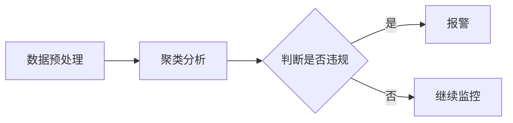
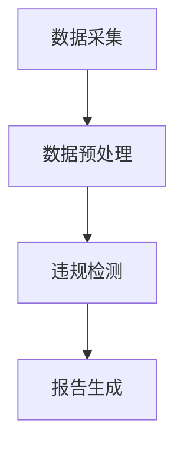

                 

# 《构建智能企业合规监控系统：实时违规检测与自动报告生成》

> 关键词：智能企业、合规监控、实时违规检测、自动报告生成、技术架构、Python算法

> 摘要：本文深入探讨了如何构建一个智能企业合规监控系统，实现了实时违规检测和自动报告生成。文章首先介绍了合规监控的现状和重要性，然后详细分析了系统的核心概念、技术原理、架构设计，并通过实际案例展示了系统的实施与运用。最后，提出了最佳实践策略，总结了文章的核心内容，并对未来进行了展望。

## 引言

随着全球商业环境的日益复杂，企业合规性成为其生存和发展的关键因素。合规监管不仅关系到企业的法律风险，还影响到其品牌声誉和市场竞争力。在这个背景下，构建一个智能企业合规监控系统显得尤为重要。本篇文章将探讨如何实现这样一个系统的实时违规检测与自动报告生成。

本文的目标读者包括企业合规管理人员、IT专业人士和合规技术工程师。通过阅读本文，读者可以：

1. 理解合规监控系统的核心概念和重要性。
2. 学习实时违规检测和自动报告生成的技术原理。
3. 获得系统实施和实战应用的实用经验。
4. 掌握最佳实践策略，提升合规监控系统的效能。

## 第1部分：问题背景与核心概念

### 第1章：问题背景

#### 合规监管现状

在当今的商业环境中，企业面临着越来越严格的合规监管。无论是金融、医疗、能源还是其他行业，合规性问题都直接关系到企业的运营和生存。以下是一些合规监管的现状：

1. **法律风险**：违反合规要求可能导致罚款、法律诉讼甚至企业倒闭。
2. **品牌风险**：不合规行为会损害企业的声誉，影响市场竞争力。
3. **合规成本**：合规监管需要投入大量的人力和物力，增加运营成本。

#### 智能合规监控的意义

智能合规监控系统通过运用人工智能和大数据分析技术，可以实现对合规风险的实时监控和预测。其意义在于：

1. **提高效率**：自动化处理合规监控任务，减少人工工作量。
2. **降低风险**：及时发现违规行为，提前采取措施，降低法律和品牌风险。
3. **优化决策**：基于大数据分析，为企业提供合规性决策支持。

#### 实时违规检测与自动报告生成的重要性

实时违规检测和自动报告生成是智能合规监控系统的核心功能。其重要性体现在：

1. **实时性**：能够立即发现违规行为，及时采取应对措施。
2. **准确性**：利用人工智能技术，提高违规检测的准确性。
3. **效率**：自动化报告生成，减少人工处理时间。

### 第2章：核心概念

#### 智能合规监控系统的定义

智能合规监控系统是指利用人工智能技术，对企业的运营数据进行实时监控，识别潜在违规行为，并自动生成报告的系统。其主要功能包括：

1. 数据采集与预处理
2. 违规检测
3. 报告生成

#### 实时违规检测的技术原理

实时违规检测是基于数据分析和机器学习算法实现的。其原理包括：

1. 数据预处理：对采集到的数据进行分析，去除噪声和无关信息。
2. 违规模式识别：利用机器学习算法，识别数据中的违规模式。
3. 实时监控：对实时数据流进行监控，一旦发现违规行为，立即报警。

#### 自动报告生成的技术方法

自动报告生成是通过自然语言处理和模板生成技术实现的。其方法包括：

1. 报告模板设计：根据企业需求设计报告模板。
2. 数据整合：将违规检测结果与报告模板整合。
3. 自动生成：利用自然语言处理技术，将整合后的数据生成报告。

### 第3章：概念关系与联系

#### 关键概念的属性特征对比表格

| 概念         | 属性特征                    | 说明                                                         |
| ------------ | -------------------------- | ------------------------------------------------------------ |
| 智能合规监控系统 | 实时监控、数据采集、自动报告 | 实时监测企业运营数据，发现违规行为，自动生成报告           |
| 数据采集     | 实时性、多样性、准确性       | 采集企业各种运营数据，包括财务、运营、交易等               |
| 违规检测     | 自动化、准确性、实时性       | 利用机器学习算法，实时检测数据中的违规行为                 |
| 自动报告生成 | 模板化、自动化、精确性       | 根据违规检测结果，自动生成合规报告，提高报告生成效率       |

#### 智能合规监控系统的ER实体关系图

```mermaid
erDiagram
  Data ->|_{实时监控}| ComplianceSystem
  Data ->|_{数据预处理}| MonitoringModule
  ComplianceSystem ->|_{违规检测}| DetectionModule
  ComplianceSystem ->|_{自动报告}| ReportingModule
```

## 第2部分：技术原理与架构设计

### 第4章：技术原理讲解

#### 数据采集与预处理

数据采集是智能合规监控系统的基础。数据来源可以是企业的各种业务系统、数据库、日志文件等。数据采集后，需要进行预处理，包括数据清洗、去噪、格式转换等。

```python
# 数据采集与预处理示例代码
import pandas as pd

# 采集数据
data = pd.read_csv('data.csv')

# 数据预处理
data.dropna(inplace=True)  # 去除缺失值
data = data[data['value'] > 0]  # 去除无效数据
```

#### 违规检测算法原理

违规检测算法的核心是模式识别。常见的算法包括聚类分析、异常检测、规则匹配等。以下是一个基于聚类分析的违规检测算法示例：



```python
# 聚类分析示例代码
from sklearn.cluster import KMeans

# 初始化聚类模型
kmeans = KMeans(n_clusters=3)

# 训练模型
kmeans.fit(data)

# 预测
predictions = kmeans.predict(data)

# 判断是否违规
for i, pred in enumerate(predictions):
    if pred == 2:  # 假设聚类中心2代表违规
        print(f"数据{i}违规")
```

#### 报告生成算法原理

报告生成算法基于自然语言处理和模板生成技术。以下是一个简单的报告生成算法示例：

```python
# 报告生成示例代码
import jieba

# 初始化分词模型
seg_model = jieba.initialize()

# 分词
text = "数据1违规，需要进行调查。"
words = jieba.cut(text)

# 生成报告
report = "根据系统监测，数据1被识别为违规，具体内容如下：\n".join(list(words))

print(report)
```

### 第5章：系统分析与架构设计

#### 问题场景介绍

假设一家企业需要对其财务数据进行分析，以确保其运营合规。企业希望系统能够实时监控财务数据，发现违规行为，并自动生成报告。

#### 系统功能设计

1. 数据采集：从财务系统中定期采集数据。
2. 违规检测：使用机器学习算法对财务数据进行分析，识别潜在的违规行为。
3. 报告生成：根据违规检测结果，自动生成合规报告。

#### 系统架构设计

以下是一个简化的智能合规监控系统架构设计：



#### 系统接口设计与交互

系统通过API与其他系统进行数据交互。以下是一个简单的接口设计示例：

```python
# 接口设计示例代码
from flask import Flask, request, jsonify

app = Flask(__name__)

@app.route('/data', methods=['POST'])
def collect_data():
    data = request.json
    # 数据处理逻辑
    return jsonify({"status": "success"})

@app.route('/report', methods=['GET'])
def generate_report():
    # 报告生成逻辑
    return jsonify({"report": "违规报告"})

if __name__ == '__main__':
    app.run(debug=True)
```

## 第3部分：系统实施与实战应用

### 第6章：系统实施流程

#### 环境准备

1. 安装Python环境：确保Python版本为3.7以上。
2. 安装必要的库：使用pip安装flask、pandas、scikit-learn等库。

```bash
pip install flask pandas scikit-learn
```

#### 系统核心实现

1. 数据采集：编写脚本，定期从财务系统采集数据。
2. 数据预处理：对采集到的数据进行清洗和预处理。
3. 违规检测：使用聚类分析算法进行违规检测。
4. 报告生成：根据违规检测结果，生成合规报告。

```python
# 系统核心实现示例代码
import pandas as pd
from sklearn.cluster import KMeans

# 数据采集
data = pd.read_csv('data.csv')

# 数据预处理
data.dropna(inplace=True)

# 违规检测
kmeans = KMeans(n_clusters=3)
kmeans.fit(data)

# 预测
predictions = kmeans.predict(data)

# 报告生成
for i, pred in enumerate(predictions):
    if pred == 2:
        print(f"数据{i}违规，需要进行调查。")
```

#### 应用解读与分析

1. 数据采集脚本如何定期运行？
2. 数据预处理是否考虑了不同数据格式的兼容性？
3. 违规检测算法是否考虑了实时性要求？
4. 报告生成是否可以根据不同用户的偏好进行定制？

### 第7章：实战案例

#### 实际案例分析与详细讲解

假设某企业需要对其财务数据进行监控，以确保其符合合规要求。企业选择了智能合规监控系统，并进行了以下实施步骤：

1. 数据采集：企业使用Python脚本定期从财务系统中采集数据。
2. 数据预处理：数据清洗和格式转换。
3. 违规检测：使用K-means聚类算法进行违规检测。
4. 报告生成：自动生成合规报告。

#### 项目总结

通过本次项目，企业实现了对财务数据的实时监控，提高了合规性管理水平。项目成功的关键在于：

1. 系统架构设计合理，实现了数据采集、预处理、违规检测和报告生成的功能。
2. 选用了合适的算法，提高了违规检测的准确性。
3. 系统实现了自动化，降低了人工工作量。

## 第4部分：最佳实践与总结

### 第8章：最佳实践

#### 常见问题与解决策略

1. **数据采集延迟**：解决策略：使用更高效的采集工具，确保数据实时性。
2. **数据预处理错误**：解决策略：增加数据验证环节，确保数据质量。
3. **违规检测误报率高**：解决策略：优化算法参数，增加样本数据。

#### 性能优化技巧

1. **数据存储与查询**：使用高速数据库，提高数据查询速度。
2. **并发处理**：使用多线程或多进程，提高系统并发处理能力。
3. **负载均衡**：使用负载均衡器，提高系统容错能力。

#### 系统维护与更新策略

1. **定期检查**：定期检查系统运行状态，确保系统稳定。
2. **代码维护**：及时修复系统漏洞，更新依赖库。
3. **版本控制**：使用版本控制系统，确保代码版本的一致性。

### 第9章：总结与展望

#### 书籍总结

本文详细介绍了智能企业合规监控系统的构建，包括问题背景、核心概念、技术原理、架构设计、系统实施和实战应用。通过本文，读者可以了解到如何实现实时违规检测和自动报告生成，提高企业合规性管理水平。

#### 未来发展趋势

1. **人工智能技术的进一步应用**：随着人工智能技术的不断发展，智能合规监控系统将更加智能化，能够自动发现更多的合规风险。
2. **大数据分析的深入应用**：利用大数据分析技术，智能合规监控系统将能够更精准地预测和发现违规行为。
3. **区块链技术的整合**：通过区块链技术，确保数据的安全性和不可篡改性，进一步提高合规监控系统的可靠性。

## 作者

作者：AI天才研究院/AI Genius Institute & 禅与计算机程序设计艺术 /Zen And The Art of Computer Programming

本文通过对智能企业合规监控系统的深入剖析，提供了构建这样一个系统的详细指南，旨在帮助企业提高合规性管理水平，应对日益复杂的商业环境。通过本文的学习和实践，读者将能够掌握构建智能合规监控系统的核心技术和方法。未来的发展将继续推动智能合规监控系统的创新，为企业提供更强大的合规性保障。让我们携手前进，共同迎接智能合规监控的新时代。

