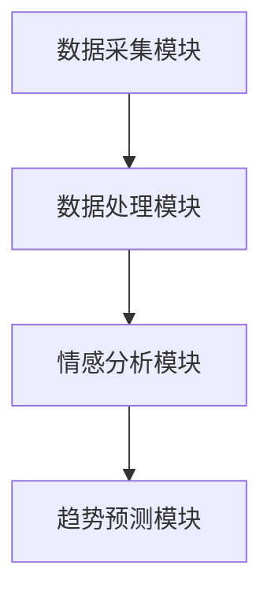

                 


# 构建智能企业市场调研系统：社交媒体情感分析与趋势预测

> 关键词：智能企业，市场调研，社交媒体，情感分析，趋势预测，数据采集，算法实现，系统架构

> 摘要：本文将探讨如何构建一个智能企业市场调研系统，重点关注社交媒体情感分析与趋势预测技术。通过详细阐述系统架构、核心算法实现和项目实战，本文旨在为企业和开发者提供切实可行的技术指南。

## 第一部分：问题背景与核心概念

### 第1章：问题背景

#### 1.1.1 智能企业市场调研的重要性

在当今瞬息万变的市场环境中，企业要取得成功，关键在于对市场动态的敏锐洞察和快速反应。市场调研是企业获取外部信息、了解市场需求、预测未来趋势的重要手段。然而，传统的市场调研方法往往耗时费力，难以应对大数据时代的挑战。

智能企业市场调研系统利用先进的技术手段，如社交媒体情感分析和趋势预测，为企业提供实时、精准的市场情报。这不仅能够帮助企业抓住市场机遇，还能有效规避潜在风险。

#### 1.1.2 社交媒体情感分析与趋势预测的价值

社交媒体是现代市场调研的重要数据源。通过分析社交媒体上的用户评论、帖子等，可以了解消费者对产品或品牌的情感态度。这种情感分析能够为企业提供有价值的消费者洞察，指导产品开发和营销策略。

趋势预测则帮助企业预测市场未来的走向，为企业制定长期战略提供数据支持。在竞争激烈的市场中，谁能提前洞察趋势，谁就能占据先机。

#### 1.1.3 当前市场调研系统的局限

当前的市场调研系统存在以下几个局限：

1. 数据源单一：传统市场调研主要依赖调查问卷和行业报告，数据来源相对单一，难以全面反映市场动态。
2. 分析深度不足：现有系统对数据的分析处理能力有限，难以深入挖掘数据背后的潜在信息。
3. 时效性差：传统市场调研周期长，难以满足企业快速决策的需求。

为了克服这些局限，企业需要构建一个智能市场调研系统，结合社交媒体情感分析和趋势预测技术，实现市场调研的智能化、实时化和深度化。

### 1.2 核心概念

#### 1.2.1 社交媒体情感分析

社交媒体情感分析是指利用自然语言处理技术，对社交媒体上的文本数据进行分析，识别其中的情感倾向。情感分析的基本概念包括正面情感、负面情感和中性情感。情感分析的挑战在于如何准确识别情感，特别是在面对复杂语境和歧义时。

社交媒体情感分析的应用场景广泛，如品牌监测、市场调研、舆情分析等。通过情感分析，企业可以了解消费者对产品的态度，及时调整营销策略。

#### 1.2.2 趋势预测

趋势预测是通过分析历史数据，预测未来的趋势。趋势预测的基本原理是利用时间序列分析方法，如自回归模型、移动平均模型和自回归移动平均模型等，对数据进行分析和建模。

趋势预测的方法与工具包括机器学习算法和深度学习算法。机器学习算法如K均值聚类和层次聚类，可以用于数据降维和特征提取。深度学习算法如卷积神经网络和长短时记忆网络，可以用于构建复杂的预测模型。

趋势预测在实际中的应用非常广泛，如股市预测、消费趋势预测、经济预测等。通过趋势预测，企业可以提前布局，抢占市场先机。

## 第二部分：智能企业市场调研系统架构

### 第2章：智能企业市场调研系统架构

#### 2.1 系统架构设计

智能企业市场调研系统通常包括以下几个功能模块：

1. 数据采集模块：负责从社交媒体等数据源收集数据。
2. 数据处理模块：负责对采集到的数据进行分析和清洗。
3. 情感分析模块：负责对文本数据进行分析，识别情感倾向。
4. 趋势预测模块：负责根据历史数据预测未来的趋势。

系统架构图如下：



#### 2.2 技术选型

数据采集工具：API接口调用、爬虫技术。

数据处理工具：数据清洗、数据预处理。

情感分析模型：基于机器学习的情感分析模型、基于深度学习的情感分析模型。

趋势预测模型：时间序列分析模型、聚类分析模型。

## 第二部分：系统实现与实战

### 第3章：数据采集与预处理

#### 3.1 数据采集

数据采集是构建市场调研系统的第一步。本文选取了Twitter、Facebook和Instagram作为数据源，因为它们是当前最受欢迎的社交媒体平台。

数据采集工具主要包括API接口调用和爬虫技术。API接口调用可以直接获取平台提供的数据，而爬虫技术则可以通过模拟用户行为获取数据。

#### 3.2 数据预处理

数据预处理是确保数据质量的关键步骤。数据预处理包括数据清洗、文本数据预处理和数据格式统一。

数据清洗主要包括去除无关信息、处理文本数据和数据格式统一。文本数据预处理包括分词、去停用词、词干提取等步骤。

### 第4章：情感分析算法实现

#### 4.1 情感分析算法原理

情感分析算法可以分为基于机器学习的情感分析算法和基于深度学习的情感分析算法。

基于机器学习的情感分析算法包括Naive Bayes分类器和支持向量机（SVM）。Naive Bayes分类器基于贝叶斯定理，是一种简单的概率分类器。SVM则通过找到最优超平面来实现分类。

基于深度学习的情感分析算法包括卷积神经网络（CNN）和长短时记忆网络（LSTM）。CNN擅长处理图像和文本数据，而LSTM在处理序列数据时具有优势。

#### 4.2 情感分析算法实现

本文使用Python和TensorFlow实现了基于CNN的情感分析算法。具体实现步骤如下：

1. 数据集准备：本文使用了一个包含正面、负面和中性情感样本的数据集。数据集划分为训练集和测试集。

2. 代码实现：首先，定义CNN模型的结构，然后使用TensorFlow进行模型训练和预测。

代码示例：

```python
import tensorflow as tf
from tensorflow.keras.models import Sequential
from tensorflow.keras.layers import Conv2D, MaxPooling2D, Flatten, Dense

# 定义CNN模型
model = Sequential([
    Conv2D(32, (3, 3), activation='relu', input_shape=(64, 64, 3)),
    MaxPooling2D((2, 2)),
    Flatten(),
    Dense(128, activation='relu'),
    Dense(3, activation='softmax')
])

# 编译模型
model.compile(optimizer='adam', loss='categorical_crossentropy', metrics=['accuracy'])

# 训练模型
model.fit(x_train, y_train, epochs=10, validation_data=(x_test, y_test))

# 预测
predictions = model.predict(x_test)
```

### 第5章：趋势预测算法实现

#### 5.1 趋势预测算法原理

趋势预测算法可以分为时间序列分析模型和聚类分析模型。

时间序列分析模型包括自回归模型（AR）、移动平均模型（MA）和自回归移动平均模型（ARMA）。这些模型通过分析时间序列数据的特征，预测未来的趋势。

聚类分析模型包括K均值聚类和层次聚类。这些模型通过将数据划分为不同的簇，预测数据点之间的关系。

#### 5.2 趋势预测算法实现

本文使用Python和scikit-learn实现了K均值聚类算法。具体实现步骤如下：

1. 数据集准备：本文使用了一个包含销售数据的时间序列数据集。数据集划分为训练集和测试集。

2. 代码实现：首先，定义K均值聚类模型，然后使用scikit-learn进行模型训练和预测。

代码示例：

```python
from sklearn.cluster import KMeans
import numpy as np

# 定义K均值聚类模型
kmeans = KMeans(n_clusters=3, random_state=0)

# 训练模型
kmeans.fit(X_train)

# 预测
predictions = kmeans.predict(X_test)
```

## 第三部分：系统部署与优化

### 第6章：系统部署

#### 6.1 环境搭建

系统部署的第一步是搭建运行环境。本文使用Docker来部署系统，以确保系统在不同环境下的可移植性。

首先，编写Dockerfile来定义系统的运行环境，包括Python、TensorFlow和scikit-learn等依赖项。然后，构建Docker镜像并启动容器。

Dockerfile示例：

```Dockerfile
FROM python:3.8

RUN pip install tensorflow scikit-learn

COPY . /app
WORKDIR /app

CMD ["python", "app.py"]
```

通过以上步骤，我们可以将智能企业市场调研系统部署到不同的环境中，实现系统的快速部署和运行。

## 最佳实践 tips、小结、注意事项、拓展阅读

1. **最佳实践 tips**：
   - 选择合适的数据源：根据企业的需求和目标，选择合适的数据源进行数据采集。
   - 数据预处理：确保数据质量，进行有效的数据清洗和预处理。
   - 模型优化：定期对模型进行评估和优化，以提高预测准确性。

2. **小结**：
   - 本文介绍了智能企业市场调研系统的构建方法，包括数据采集、预处理、情感分析和趋势预测等关键技术。
   - 通过实际案例，展示了系统在市场调研中的应用价值。

3. **注意事项**：
   - 注意数据安全和隐私保护，遵守相关法律法规。
   - 考虑系统的可扩展性和可维护性，为未来的发展留有空间。

4. **拓展阅读**：
   - 深入了解社交媒体情感分析和趋势预测的相关技术和应用。
   - 学习如何使用其他自然语言处理和机器学习工具，提升系统的性能和效果。

作者：AI天才研究院/AI Genius Institute & 禅与计算机程序设计艺术 /Zen And The Art of Computer Programming

本文为原创作品，版权归AI天才研究院所有，未经授权不得转载。如需转载，请联系我们获取授权。感谢您的支持！

